# 27.通用轮询方案设计

> **本篇定位**：轮询是分布式/客户端开发里"最简单也最容易写错"的机制——做不好就是"耗电、耗流量、雪崩、消息延迟"四件套。本文从一次"百万设备每秒轮询打挂网关"的故事讲起，回答三个核心问题——**轮询的本质矛盾在哪？短轮询/长轮询/推送怎么选？怎么设计一套既稳又省的通用轮询框架？**

#### 目录介绍
- [01.百万设备秒级轮询](#01百万设备秒级轮询)
  - [1.1 一次定位上报雪崩](#11-一次定位上报雪崩)
  - [1.2 雪崩扩散链路](#12-雪崩扩散链路)
  - [1.3 反思轮询设计](#13-反思轮询设计)
- [02.要解决的核心矛盾](#02要解决的核心矛盾)
  - [2.1 实时与省电](#21-实时与省电)
  - [2.2 频率与压力](#22-频率与压力)
  - [2.3 主动与被动](#23-主动与被动)
  - [2.4 轮询的本质](#24-轮询的本质)
- [03.业界主流方案](#03业界主流方案)
  - [03.1 主流通信模式](#031-主流通信模式)
  - [03.2 横向对比矩阵](#032-横向对比矩阵)
  - [03.3 选型速查表](#033-选型速查表)
- [04.设计核心原则](#04设计核心原则)
  - [04.1 退避抖动原则](#041-退避抖动原则)
  - [04.2 自适应频率](#042-自适应频率)
  - [04.3 前后台分级](#043-前后台分级)
  - [04.4 失败容错原则](#044-失败容错原则)
- [05.方案落地实战](#05方案落地实战)
  - [05.1 整体架构](#051-整体架构)
  - [05.2 客户端实现](#052-客户端实现)
  - [05.3 长轮询实现](#053-长轮询实现)
  - [05.4 心跳保活机制](#054-心跳保活机制)
  - [05.5 服务端配合](#055-服务端配合)
- [06.关键问题解决](#06关键问题解决)
  - [06.1 雪崩防御](#061-雪崩防御)
  - [06.2 流量与电量](#062-流量与电量)
  - [06.3 后台限制问题](#063-后台限制问题)
- [07.常见陷阱与反例](#07常见陷阱与反例)
  - [07.1 固定频率反例](#071-固定频率反例)
  - [07.2 不退避反例](#072-不退避反例)
  - [07.3 全设备同步反例](#073-全设备同步反例)
- [08.演进路线](#08演进路线)
  - [08.1 V1 简单短轮询](#081-v1-简单短轮询)
  - [08.2 V2 长轮询 + 退避](#082-v2-长轮询--退避)
  - [08.3 V3 推送 + 兜底轮询](#083-v3-推送--兜底轮询)
- [09.总结与决策](#09总结与决策)
  - [09.1 上线检查表](#091-上线检查表)
  - [09.2 选型决策树](#092-选型决策树)


## 01.百万设备秒级轮询

### 1.1 一次定位上报雪崩

某车联网厂商：**100 万台车辆每秒上报一次定位**——某天网关扩容时短暂 502，**100 万设备同时进入"重试地狱"**：

- 设备端写死：每秒上报，失败 1 秒后立即重试
- 网关短暂故障 5 秒后恢复
- 但**所有失败的请求堆积成"双倍流量"压上来**——网关瞬间被压垮
- 进一步级联到数据库、消息队列——整套系统瘫痪 30 分钟

```mermaid
gantt
    title 雪崩故障时间线
    dateFormat HH:mm:ss
    axisFormat %H:%M:%S
    
    section 正常轮询
    100w QPS 上报      :a, 09:00:00, 5m
    
    section 故障窗口
    网关 502         :crit, b, 09:05:00, 5s
    所有设备失败堆积   :crit, c, 09:05:00, 5s
    
    section 灾难放大
    网关恢复 双倍重试 :crit, d, 09:05:05, 30m
    级联打挂 DB / MQ  :crit, e, 09:05:10, 30m
    全网瘫痪          :crit, f, 09:05:10, 30m
```

### 1.2 雪崩扩散链路

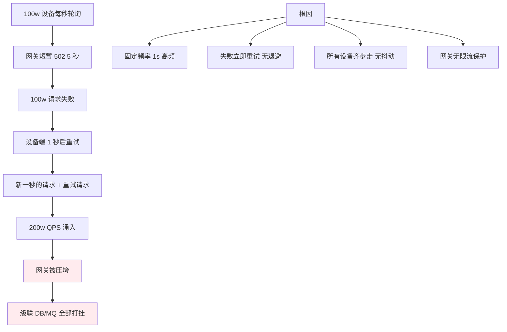

### 1.3 反思轮询设计

事后这个团队总结了三个最深刻的教训：

1. **轮询频率必须按需**——不是越快越好，1 秒和 30 秒可能业务效果一样
2. **失败必须指数退避**——立即重试是雪崩催化剂
3. **必须随机抖动**——避免百万设备齐步走

> 轮询的难点不在"实现"——而在"如何让 100 万个客户端不打架"。

## 02.要解决的核心矛盾

### 2.1 实时与省电

| 频率 | 实时性 | 电量影响 | 流量 |
|---|---|---|---|
| **1 秒** | 极好 | 极差 | 大 |
| **10 秒** | 好 | 一般 | 中 |
| **1 分钟** | 一般 | 好 | 小 |
| **10 分钟** | 差 | 极好 | 极小 |
| **1 小时** | 极差 | 不影响 | 忽略 |

**核心思考**：业务真的需要 1 秒级实时吗？很多场景"5 秒和 30 秒"用户感知不到差别。

### 2.2 频率与压力

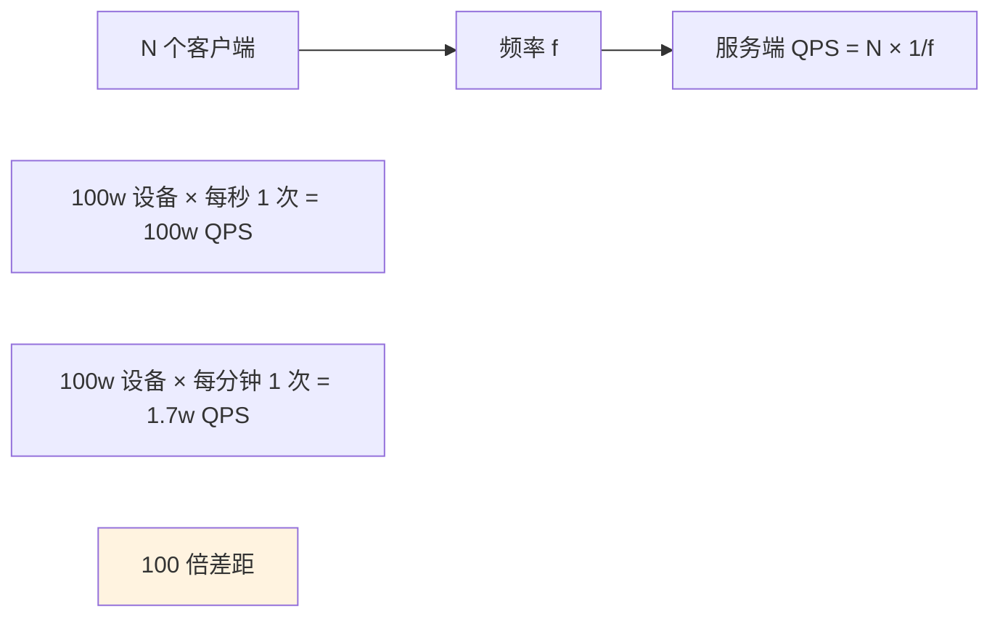

### 2.3 主动与被动

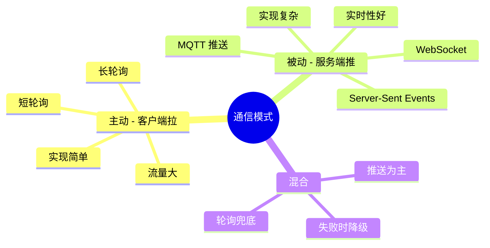

### 2.4 轮询的本质

> **轮询 = 客户端用"频率"换取"实时性"**

它的代价 = **N 个客户端 × 1/频率 = 服务端压力**。

设计的核心 = **在"实时"和"压力"之间找到业务可接受的平衡点**。

## 03.业界主流方案

### 03.1 主流通信模式

| 模式 | 描述 | 实时性 | 复杂度 |
|---|---|---|---|
| **短轮询** | 定时发请求 | 看频率 | ⭐ |
| **长轮询** | 服务端 hold 请求 | 准实时 | ⭐⭐ |
| **WebSocket** | 双向长连接 | 实时 | ⭐⭐⭐ |
| **SSE** | 服务端单向推送 | 实时 | ⭐⭐ |
| **MQTT** | 物联网长连接 | 实时 | ⭐⭐⭐ |
| **Push 通知** | 系统级推送 | 准实时 | ⭐⭐ |

### 03.2 横向对比矩阵

| 维度 | 短轮询 | 长轮询 | WebSocket | 推送 |
|---|---|---|---|---|
| **实时性** | ⭐⭐ | ⭐⭐⭐⭐ | ⭐⭐⭐⭐⭐ | ⭐⭐⭐⭐ |
| **服务端压力** | 高 | 中 | 低 | 极低 |
| **流量消耗** | 高 | 中 | 低 | 极低 |
| **电量影响** | 大 | 中 | 中 | 小 |
| **实现复杂度** | 低 | 中 | 高 | 中 |
| **穿透 NAT** | ✅ | ✅ | ⚠️ | ✅ |
| **典型场景** | 状态查询 | 通知/聊天 | 直播弹幕 | 离线消息 |

### 03.3 选型速查表

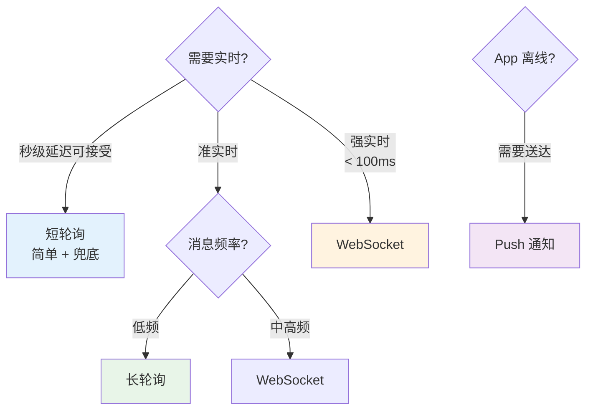

## 04.设计核心原则

### 04.1 退避抖动原则

**铁律**：**任何失败重试都要指数退避 + 随机抖动**。

```kotlin
class BackoffStrategy(
    private val baseMs: Long = 1000,
    private val maxMs: Long = 5 * 60_000,
    private val multiplier: Double = 2.0
) {
    private var attempt = 0
    
    fun nextDelay(): Long {
        attempt++
        // 指数退避 1s → 2s → 4s → ... 上限 5 分钟
        val expDelay = (baseMs * multiplier.pow(attempt - 1).toLong())
            .coerceAtMost(maxMs)
        // ±50% 随机抖动 防齐步走
        val jitter = (expDelay * 0.5 * (Math.random() - 0.5)).toLong()
        return expDelay + jitter
    }
    
    fun reset() { attempt = 0 }
}
```

**抖动的威力**：

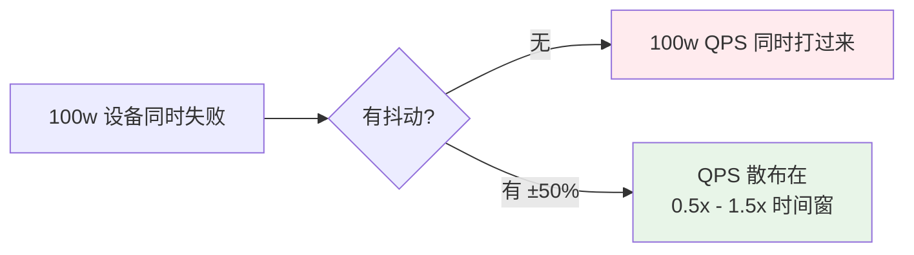

### 04.2 自适应频率

**根据"是否有变化"调整轮询频率**：

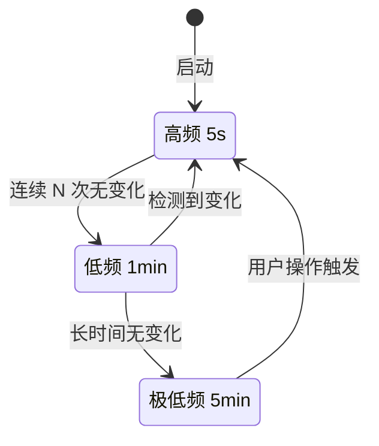

**典型实现**：

```kotlin
class AdaptivePoller {
    private var interval = 5_000L  // 起步 5 秒
    private var unchangedCount = 0
    
    fun onResult(changed: Boolean) {
        if (changed) {
            interval = 5_000L      // 有变化 → 高频
            unchangedCount = 0
        } else {
            unchangedCount++
            interval = when {
                unchangedCount > 20 -> 5 * 60_000L  // 5 分钟
                unchangedCount > 5  -> 60_000L      // 1 分钟
                else -> interval
            }
        }
    }
}
```

### 04.3 前后台分级

**App 状态决定轮询策略**：

| App 状态 | 推荐策略 |
|---|---|
| **前台 + 用户活跃** | 高频（5-10 秒） |
| **前台 + 空闲** | 中频（30 秒-1 分钟） |
| **后台运行** | 低频（5 分钟+） |
| **完全退出** | 不轮询 / 用 Push |
| **充电 + Wi-Fi** | 可适度提高 |
| **低电量** | 主动降频 |

### 04.4 失败容错原则

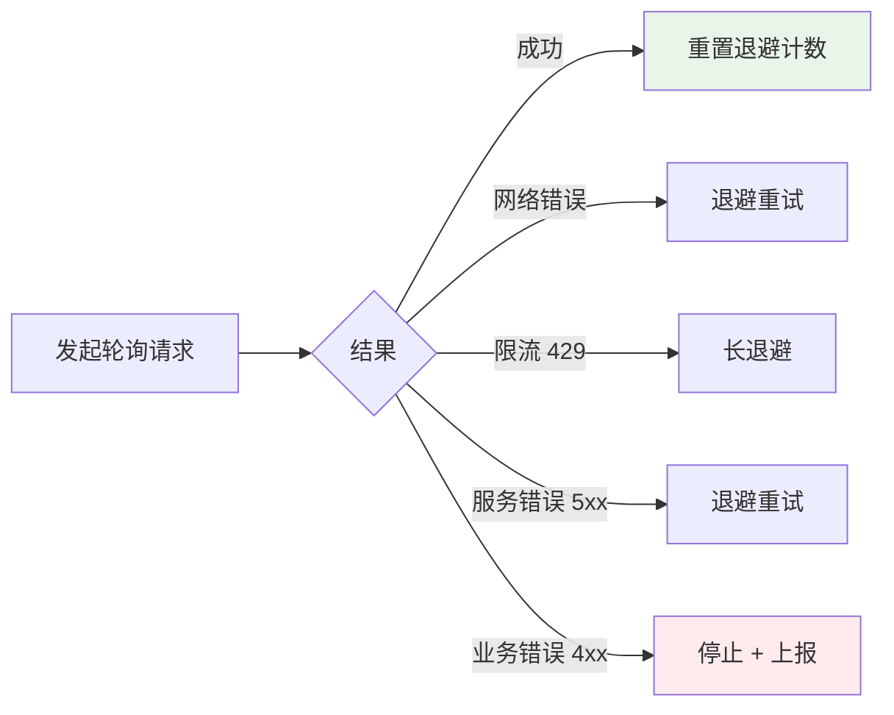

## 05.方案落地实战

### 05.1 整体架构

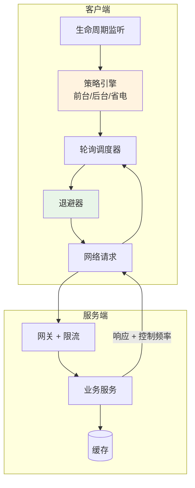

### 05.2 客户端实现

**通用轮询框架**：

```kotlin
class GeneralPoller<T>(
    private val task: suspend () -> Result<T>,
    private val onChange: (T) -> Unit,
    private val config: PollerConfig
) {
    private var job: Job? = null
    private val backoff = BackoffStrategy()
    private val adaptive = AdaptivePoller(config.minIntervalMs, config.maxIntervalMs)
    private var lastValue: T? = null
    
    fun start(scope: CoroutineScope) {
        stop()
        job = scope.launch {
            while (isActive) {
                runCatching { task() }
                    .onSuccess { result ->
                        backoff.reset()
                        if (result is Result.Success && result.data != lastValue) {
                            onChange(result.data)
                            adaptive.onResult(changed = true)
                            lastValue = result.data
                        } else {
                            adaptive.onResult(changed = false)
                        }
                        delay(adaptive.currentInterval())
                    }
                    .onFailure {
                        delay(backoff.nextDelay())  // 失败退避
                    }
            }
        }
    }
    
    fun stop() {
        job?.cancel()
        backoff.reset()
    }
}
```

### 05.3 长轮询实现

**长轮询 = 服务端 hold 住请求，有数据才返回**。

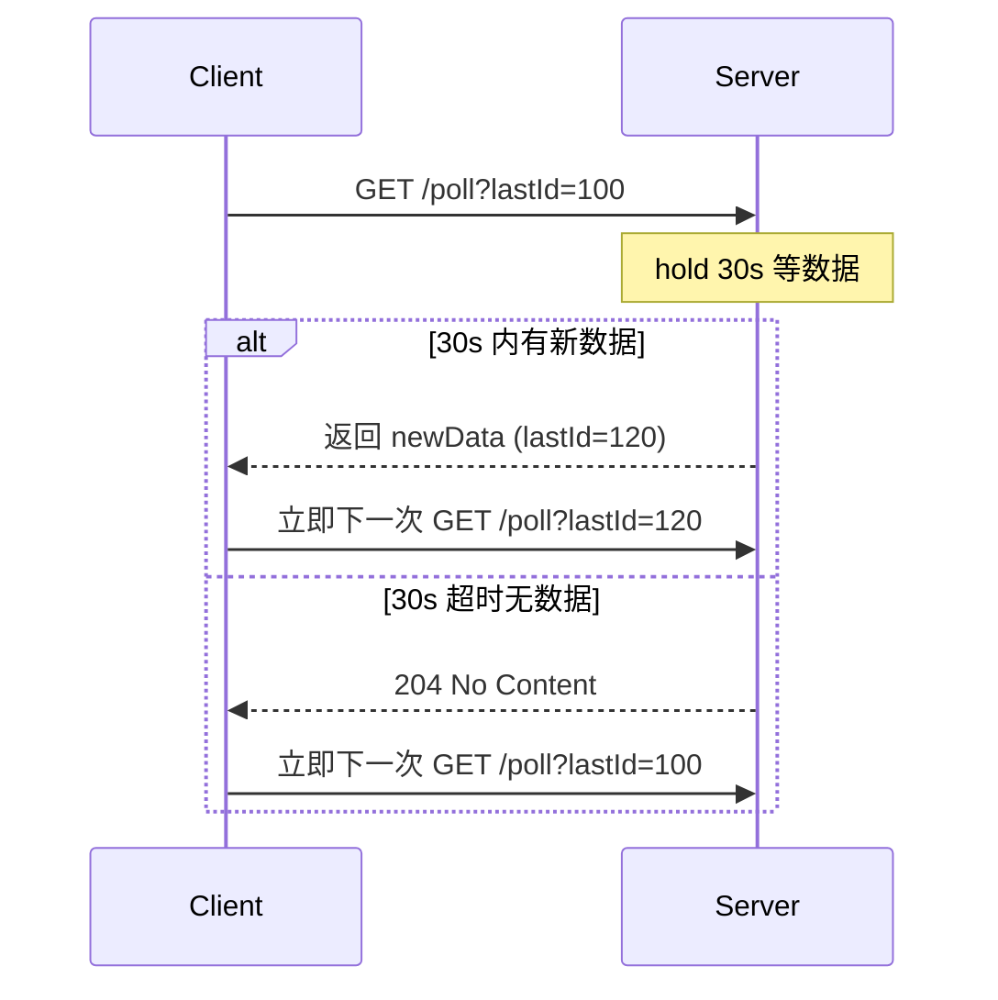

**服务端实现要点**：

```kotlin
@GetMapping("/poll")
suspend fun longPoll(@RequestParam lastId: Long): Response {
    val timeout = 30_000L
    val deadline = System.currentTimeMillis() + timeout
    
    while (System.currentTimeMillis() < deadline) {
        val data = repo.findAfter(lastId)
        if (data.isNotEmpty()) {
            return Response.ok(data)
        }
        delay(500)  // 短暂休眠后再查
    }
    return Response.noContent()
}
```

### 05.4 心跳保活机制

**长连接场景下的心跳**——既检测连接是否健康，也保持 NAT 映射。

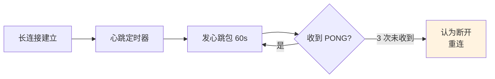

**典型心跳间隔经验值**：
- WiFi：30-60 秒
- 4G/5G：30-60 秒（NAT 超时通常 1-3 分钟）
- 弱网络/海外：调短到 20 秒
- 后台：5-10 分钟（节省电量）

### 05.5 服务端配合

**服务端控制客户端频率**——通过响应字段下发。

```json
{
    "data": [...],
    "_polling": {
        "next_interval_ms": 30000,   // 下次多久后再来
        "max_concurrent": 1000,       // 服务端建议并发上限
        "backoff_on_503": true        // 服务端过载时建议退避
    }
}
```

**好处**：服务端能动态调控全局压力——客户端无需改版本。

## 06.关键问题解决

### 06.1 雪崩防御

**开篇 100 万设备雪崩**的解决：**多层防御**。

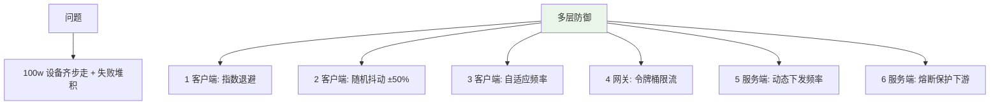

### 06.2 流量与电量

**手机端 1 天的轮询代价**：

| 频率 | 一天请求数 | 流量（按 1KB/请求） | 电量影响 |
|---|---|---|---|
| 1 秒 | 86,400 | ~85MB | 严重 |
| 10 秒 | 8,640 | ~8.5MB | 中等 |
| 1 分钟 | 1,440 | ~1.4MB | 轻微 |
| 5 分钟 | 288 | ~280KB | 几乎无 |

**实战经验**：1 分钟以下频率必须做"前后台分级"，否则上线后必被用户骂耗电。

### 06.3 后台限制问题

**iOS / Android 都对后台轮询有严格限制**：

| 平台 | 限制 |
|---|---|
| **iOS** | 后台几乎不能执行普通代码，只能用 Push / Background Fetch |
| **Android 6+ Doze** | 后台休眠期间禁止网络访问 |
| **Android 8+** | 后台 Service 受限 |
| **小米/华为/OPPO** | 厂商定制 ROM 杀后台更狠 |

**应对**：
- 后台尽量靠 **Push 通知** 唤醒
- 实在需要：**WorkManager + 长间隔**（最低 15 分钟）
- 关键消息：**APNs/FCM/厂商推送** 推送

## 07.常见陷阱与反例

### 07.1 固定频率反例

**反例**：固定写死"每 1 秒轮询一次"——忽略业务实际变化频率。

**教训**：
- 用户大部分时间没有变化 → 1 秒一次是浪费
- 用自适应频率：有变化加速、无变化减速

### 07.2 不退避反例

**反例**：失败立即重试——5 秒故障 → 双倍流量 → 雪崩。

**教训**：
- 失败必须退避（指数退避）
- 退避必须有上限（避免永远不重试）
- 必须有抖动

### 07.3 全设备同步反例

**反例**：所有设备启动时都"立即上报一次"——百万设备同时上报 → 网关瞬时压力暴涨。

**教训**：
- 启动时随机延时 0-N 秒
- 设备 ID 哈希分散到时间窗
- 服务端可下发"建议启动延时"

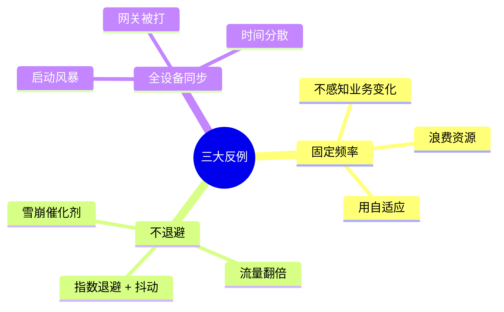

## 08.演进路线

### 08.1 V1 简单短轮询

**特征**：业务起步、设备数少。

**做法**：
- 固定频率轮询
- 无退避
- 无抖动

**适用阶段**：< 1w 设备 / POC

### 08.2 V2 长轮询 + 退避

**特征**：业务规模化、追求实时性。

**做法**：
- 长轮询为主
- 指数退避 + 随机抖动
- 自适应频率
- 前后台分级

**适用阶段**：万级-百万级设备

### 08.3 V3 推送 + 兜底轮询

**特征**：超大规模、极致体验。

**做法**：
- 长连接 / WebSocket / MQTT 主推
- Push 通知唤醒
- 短轮询作为兜底
- 服务端动态下发频率
- 全链路监控

**适用阶段**：千万级设备 / 头部 App

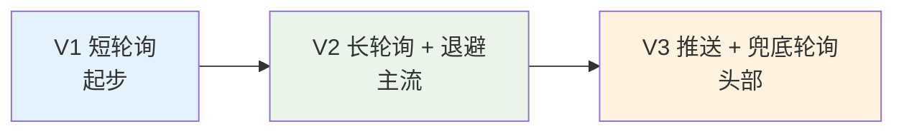

## 09.总结与决策

### 09.1 上线检查表

轮询方案上线前对照：

- [ ] 频率经过业务评估（不是越快越好）
- [ ] 失败指数退避 + 随机抖动
- [ ] 退避有上限（避免永不重试）
- [ ] 自适应频率（按变化情况调整）
- [ ] 前后台分级
- [ ] 启动随机延时（防齐步走）
- [ ] 网关有限流保护
- [ ] 服务端可动态下发频率
- [ ] 离线场景用 Push 兜底
- [ ] 监控（QPS、失败率、电量影响）
- [ ] 故障演练（网关挂、设备雪崩）
- [ ] 流量 / 电量基线测试

### 09.2 选型决策树

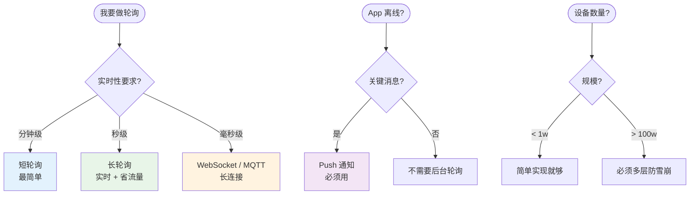

**最后一句话**：轮询的难点不在写代码——而在 **如何让百万客户端"散步而不是齐步走"**。开篇 100 万设备雪崩的根因，就是"固定 1 秒 + 不退避 + 不抖动"三件套。

> 好的轮询方案 = **频率自适应、失败退避抖动、前后台分级、推送兜底**。
