# 29.通用搜索方案设计

> **本篇定位**：搜索是产品的"门面"——找不到内容的产品没人用。本文从一次"用户搜索"红色连衣裙"出来一堆鞋子"的故事讲起，回答三个核心问题——**搜索看似简单，技术栈到底有多深？业界主流搜索架构怎么搭？怎么从 0 到 1 设计一套能扛得住的搜索系统？**

#### 目录介绍
- [01.搜不到的尴尬](#01搜不到的尴尬)
  - [1.1 红色连衣裙搜出鞋子](#11-红色连衣裙搜出鞋子)
  - [1.2 搜索差的扩散链路](#12-搜索差的扩散链路)
  - [1.3 反思搜索设计](#13-反思搜索设计)
- [02.要解决的核心矛盾](#02要解决的核心矛盾)
  - [2.1 召回与精度](#21-召回与精度)
  - [2.2 实时与规模](#22-实时与规模)
  - [2.3 个性化与公平](#23-个性化与公平)
  - [2.4 搜索的本质](#24-搜索的本质)
- [03.业界主流方案](#03业界主流方案)
  - [03.1 主流搜索引擎](#031-主流搜索引擎)
  - [03.2 横向对比矩阵](#032-横向对比矩阵)
  - [03.3 搜索全链路](#033-搜索全链路)
- [04.设计核心原则](#04设计核心原则)
  - [04.1 召回优先原则](#041-召回优先原则)
  - [04.2 多路并联原则](#042-多路并联原则)
  - [04.3 排序可调原则](#043-排序可调原则)
  - [04.4 反馈闭环原则](#044-反馈闭环原则)
- [05.方案落地实战](#05方案落地实战)
  - [05.1 整体架构](#051-整体架构)
  - [05.2 索引构建](#052-索引构建)
  - [05.3 Query 理解](#053-query-理解)
  - [05.4 多路召回](#054-多路召回)
  - [05.5 排序融合](#055-排序融合)
- [06.关键问题解决](#06关键问题解决)
  - [06.1 同义词与纠错](#061-同义词与纠错)
  - [06.2 长尾 Query](#062-长尾-query)
  - [06.3 数据实时性](#063-数据实时性)
- [07.常见陷阱与反例](#07常见陷阱与反例)
  - [07.1 全文匹配反例](#071-全文匹配反例)
  - [07.2 重排序丢主路反例](#072-重排序丢主路反例)
  - [07.3 无降级反例](#073-无降级反例)
- [08.演进路线](#08演进路线)
  - [08.1 V1 数据库 LIKE](#081-v1-数据库-like)
  - [08.2 V2 ES 倒排索引](#082-v2-es-倒排索引)
  - [08.3 V3 多路召回 + 排序](#083-v3-多路召回--排序)
- [09.总结与决策](#09总结与决策)
  - [09.1 上线检查表](#091-上线检查表)
  - [09.2 选型决策树](#092-选型决策树)


## 01.搜不到的尴尬

### 1.1 红色连衣裙搜出鞋子

某电商上线新搜索引擎一周后，运营找到搜索团队拍桌子：
- 用户搜 "红色连衣裙" → **第一页一半是红色高跟鞋**
- 用户搜 "iphone15" → **没有结果**（库里有 "iPhone 15"）
- 用户搜 "皮鞋男" → **结果都是女鞋**（顺序敏感）
- 用户搜 "篮球鞋耐克" → **第一页全是阿迪、李宁**

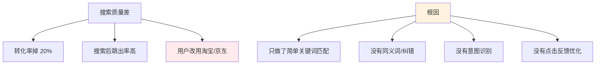

**用搜索引擎的本质**：用户**输入"我想要什么"，期望"立刻看到对的"**——搜不到对的，等于没有搜索。

### 1.2 搜索差的扩散链路

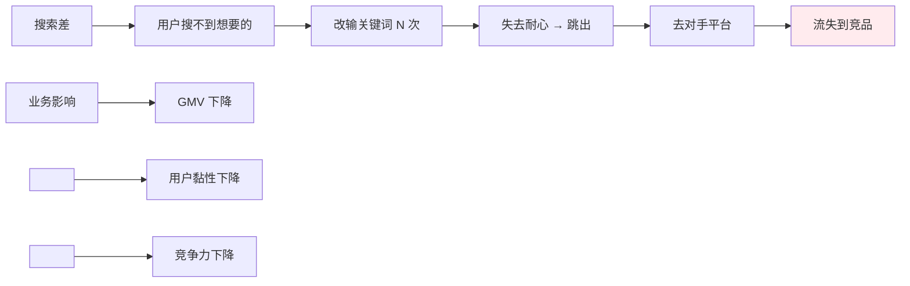

### 1.3 反思搜索设计

事后这个团队总结了三个最深刻的教训：

1. **关键词匹配只是 1.0**——现代搜索是 "理解 + 召回 + 排序 + 反馈" 的复杂系统
2. **必须有同义词、纠错、意图识别**——用户不会"标准输入"
3. **搜索效果要靠数据闭环驱动**——点击反馈是优化的金矿

> 搜索做不好，是产品最大的"内伤"——用户不投诉，但默默流失。

## 02.要解决的核心矛盾

### 2.1 召回与精度

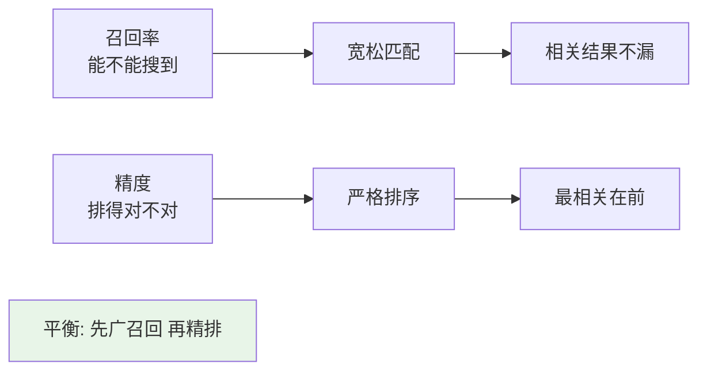

**业界经验**：召回 1000 个候选 → 精排取前 30 个 → 展示。

### 2.2 实时与规模

| 维度 | 挑战 |
|---|---|
| **百万商品** | 索引快、内存可控 |
| **每天千万 Query** | QPS 数千-数万 |
| **新商品立即可搜** | 实时索引 |
| **修改即可见** | 增量更新 |
| **容错** | 单机故障不影响全局 |

### 2.3 个性化与公平

**搜索的伦理问题**：

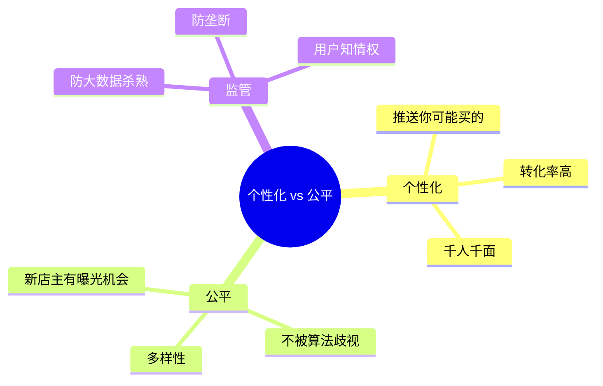

### 2.4 搜索的本质

> **搜索 = "把用户脑中的意图" 翻译成 "你库里的对应内容"**

它是 **NLP + 信息检索 + 排序学习 + 大数据** 的综合工程。

## 03.业界主流方案

### 03.1 主流搜索引擎

| 引擎 | 特点 | 典型场景 |
|---|---|---|
| **Elasticsearch** | 倒排索引、全文检索、生态丰富 | 通用搜索、日志 |
| **Solr** | 老牌全文搜索 | 内部系统 |
| **OpenSearch** | ES 分叉，AWS 主推 | 云上 |
| **Vespa** | Yahoo 开源、强大排序 | 推荐系统 |
| **Milvus / Faiss** | 向量检索 | 语义搜索 |
| **MySQL FullText** | 数据库自带 | 小数据量 |

### 03.2 横向对比矩阵

| 维度 | MySQL LIKE | ES | Vespa | 向量库 |
|---|---|---|---|---|
| **数据量** | 10w | 亿级 | 亿级 | 亿级 |
| **召回方式** | 字符匹配 | 倒排索引 | 倒排+排序 | 向量相似 |
| **语义理解** | ❌ | 有限 | 强 | 强 |
| **复杂排序** | ❌ | 中 | 强 | 弱 |
| **实时性** | 实时 | 准实时（1s） | 准实时 | 准实时 |
| **学习成本** | 低 | 中 | 高 | 中 |

### 03.3 搜索全链路

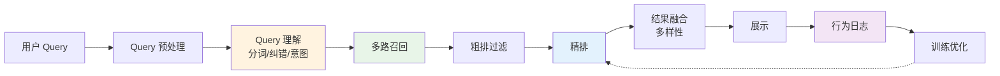

## 04.设计核心原则

### 04.1 召回优先原则

**铁律**：**先确保"能找到"，再优化"找得对"**。

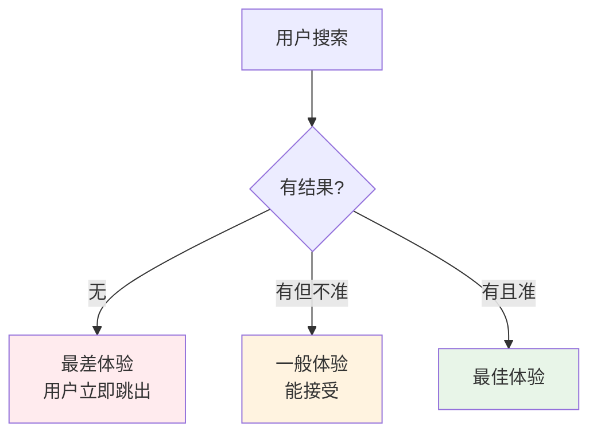

**召回兜底**：模糊匹配 → 同义词 → 拼音 → 默认推荐——总要有结果。

### 04.2 多路并联原则

**单一召回路径覆盖不全 → 多路并联召回**：

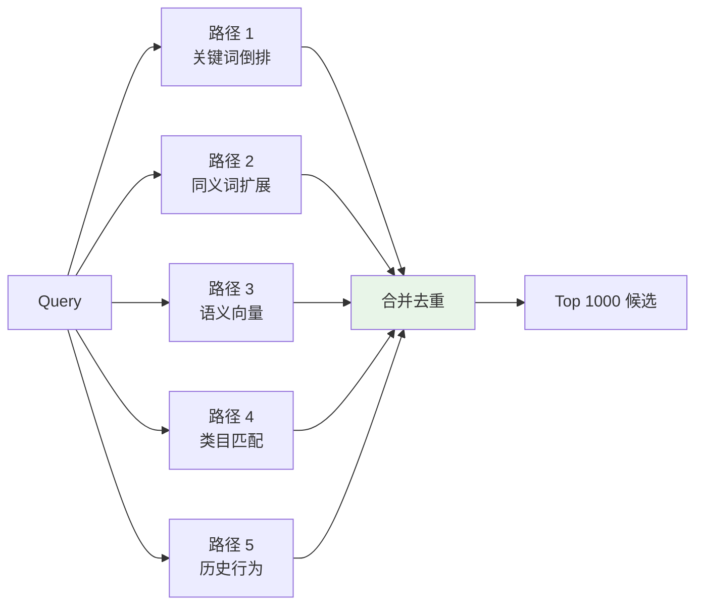

### 04.3 排序可调原则

**排序公式必须可灵活调权**——业务不同时期诉求不同。

```yaml
# 排序公式（线性加权）
score = 
    0.4 × text_relevance     # 文本相关
  + 0.3 × ctr_predict        # 点击预估
  + 0.1 × sales_count        # 销量
  + 0.1 × price_score        # 价格
  + 0.1 × freshness          # 新鲜度

# 大促期间临时调整
boost_promotion: 1.2   # 活动商品加权
```

### 04.4 反馈闭环原则

**用户行为是最好的标注师**：

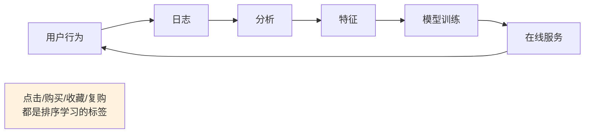

## 05.方案落地实战

### 05.1 整体架构

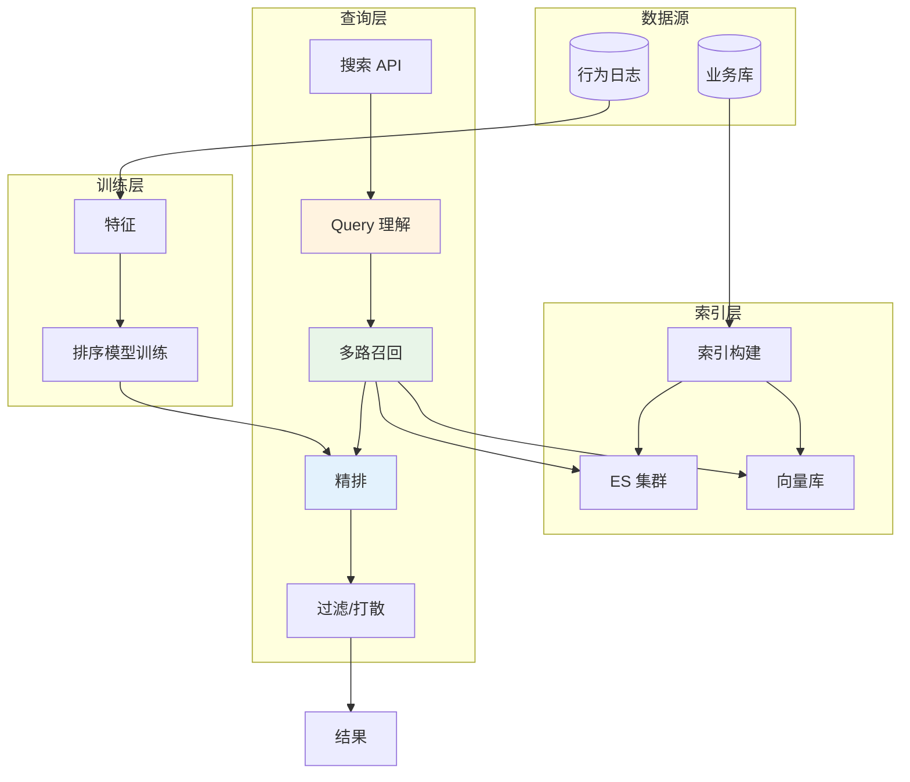

### 05.2 索引构建

**典型索引字段设计**（以电商为例）：

```json
{
    "id": "p_12345",
    "title": "Nike 男士跑步鞋 黑色 42 码",
    "title_pinyin": "naike nanshi paobuxie",
    "title_synonym": ["nike", "耐克", "运动鞋"],
    "category_path": ["鞋靴", "男鞋", "跑步鞋"],
    "brand": "Nike",
    "tags": ["跑步", "黑色", "42 码"],
    "price": 599,
    "sales": 8000,
    "ctr_30d": 0.085,
    "embedding": [0.12, -0.34, ...]  // 语义向量
}
```

**索引构建流程**：

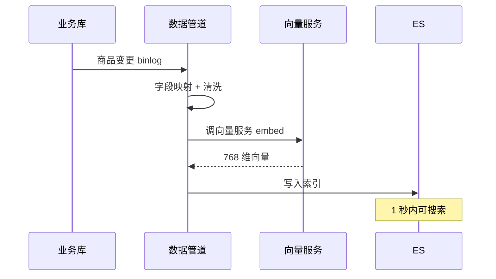

### 05.3 Query 理解

**Query 理解的几个关键步骤**：

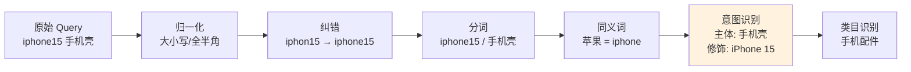

**意图识别的好处**：

| Query | 主体 | 修饰 | 类目 |
|---|---|---|---|
| "篮球鞋耐克" | 篮球鞋 | 耐克 | 鞋靴 |
| "耐克的篮球鞋" | 篮球鞋 | 耐克 | 鞋靴 |
| "iPhone 15 手机壳" | 手机壳 | iPhone 15 | 手机配件 |

→ 这样能避免"红色连衣裙搜出红色高跟鞋"的问题。

### 05.4 多路召回

**经典多路召回组合**：

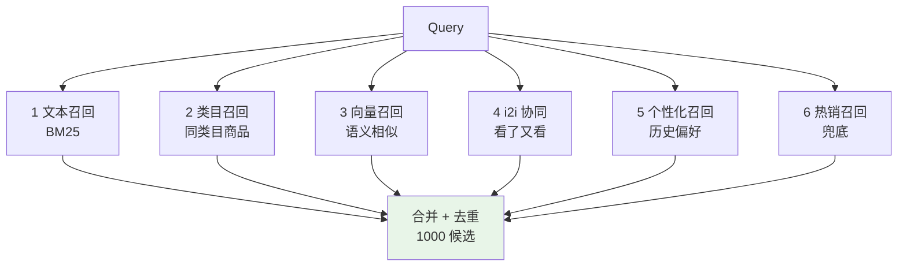

### 05.5 排序融合

**典型两阶段排序**：

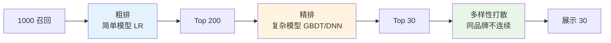

**精排特征**：
- **文本特征**：BM25、字段权重
- **统计特征**：点击率、转化率、销量
- **个性化特征**：用户画像、历史
- **上下文特征**：时间、地理、设备

## 06.关键问题解决

### 06.1 同义词与纠错

**同义词词典管理**：

```yaml
# 品牌同义词
"苹果" ⇔ "Apple" ⇔ "iPhone"
"耐克" ⇔ "Nike" ⇔ "NIKE"
"阿迪" ⇔ "Adidas" ⇔ "ADIDAS"

# 类目同义词
"裤子" ⇔ "长裤" ⇔ "休闲裤"
"包包" ⇔ "手提包" ⇔ "皮包"

# 错别字纠错
"袷克" → "夹克"
"连衣群" → "连衣裙"
"篮求鞋" → "篮球鞋"
```

**典型实现**：
- 编辑距离纠错（Damerau-Levenshtein）
- 拼音纠错（zhongwen / zhōng wén）
- 用户行为纠错（搜 A 后改搜 B → A 是 B 的错别字）

### 06.2 长尾 Query

**长尾 Query 占总量的 80%**——但每个 Query 量很少。

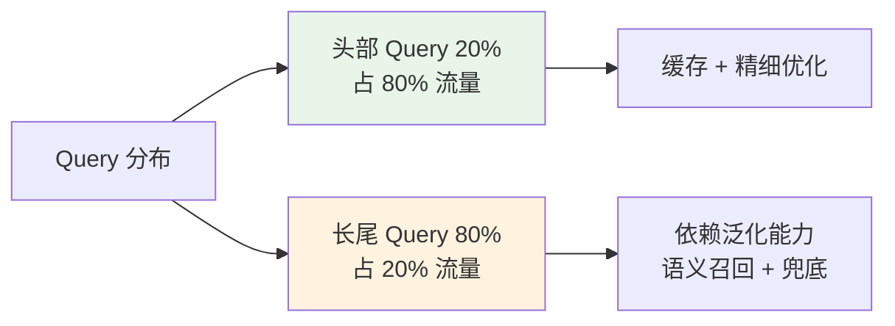

**长尾应对**：
- **语义向量召回**（不依赖关键词匹配）
- **同义词扩展**
- **兜底推荐**（无结果时给热销）
- **Query 改写**（重写为头部 Query）

### 06.3 数据实时性

| 业务 | 实时性要求 | 技术方案 |
|---|---|---|
| **新商品上架** | 1 分钟内可搜 | binlog → ES（1s 延迟） |
| **库存变化** | 5 分钟内 | 异步同步 |
| **价格变化** | 1 分钟 | 实时同步 |
| **下架商品** | 立即 | 同步删除索引 |

## 07.常见陷阱与反例

### 07.1 全文匹配反例

**反例**：用 MySQL `LIKE '%xxx%'` 实现搜索 → 数据量大后**全表扫描** → 1 个查询 5 秒。

**教训**：
- 数据量 > 10w 必须用专业搜索引擎
- ES 是事实标准

### 07.2 重排序丢主路反例

**反例**：用复杂模型重排但忘了"主路兜底"——模型超时 → **整个搜索失败白屏**。

**教训**：
- 排序必须有降级策略
- 复杂模型超时 → 降级到简单模型
- 简单模型也挂 → 直接按销量排

### 07.3 无降级反例

**反例**：ES 集群挂了 → 整个搜索瘫痪 → 整个 App 不可用。

**教训**：
- 搜索必须能降级
- 降级到数据库 LIKE（虽慢但能用）
- 降级到默认推荐
- 给用户友好提示

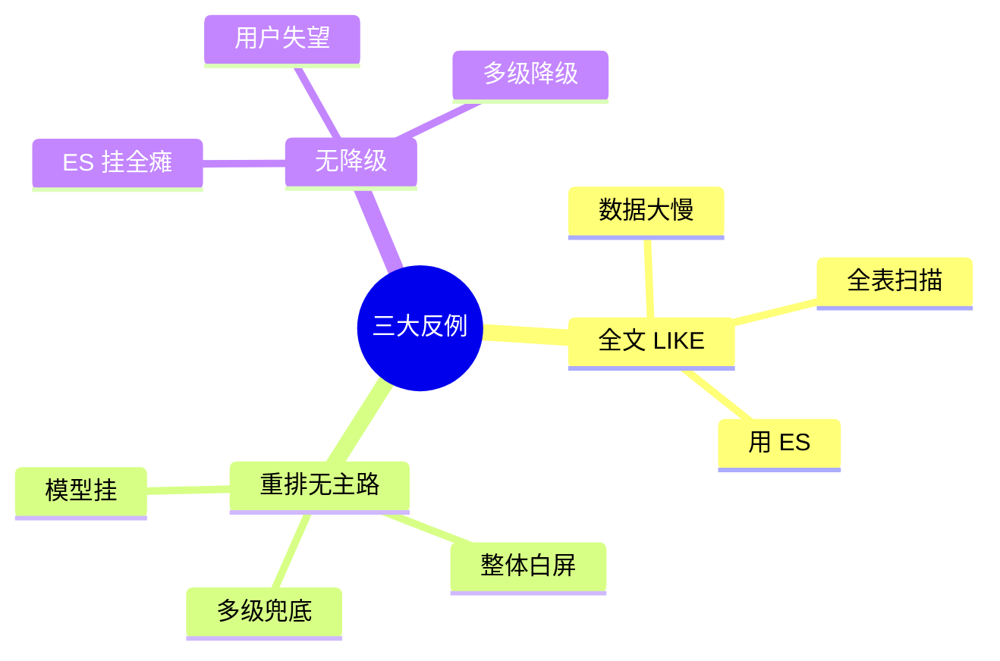

## 08.演进路线

### 08.1 V1 数据库 LIKE

**特征**：业务起步、商品少。

**做法**：
- MySQL LIKE / FullText
- 简单分页

**适用阶段**：< 10w 数据 / POC

### 08.2 V2 ES 倒排索引

**特征**：业务规模化、需要专业搜索。

**做法**：
- ES 集群
- 同义词 + 纠错
- 简单排序公式

**适用阶段**：百万-千万级数据

### 08.3 V3 多路召回 + 排序

**特征**：搜索是核心入口、需要算法驱动。

**做法**：
- Query 深度理解
- 多路召回
- 学习排序（LTR）
- 个性化
- A/B 实验平台

**适用阶段**：头部电商 / 内容平台

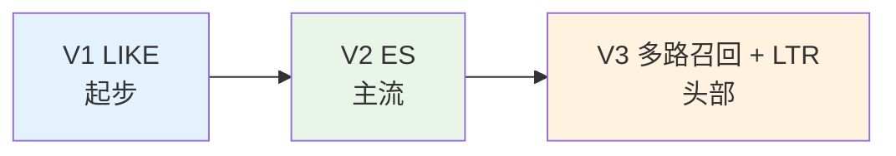

## 09.总结与决策

### 09.1 上线检查表

搜索系统上线前对照：

- [ ] 索引设计（字段、分词、同义词）
- [ ] 数据实时同步管道
- [ ] Query 预处理（归一化 / 纠错 / 分词）
- [ ] 同义词词典
- [ ] 多路召回
- [ ] 排序公式
- [ ] 多样性打散
- [ ] 兜底策略（无结果时给推荐）
- [ ] 降级策略（ES 挂 → 数据库）
- [ ] 缓存（热门 Query）
- [ ] 行为日志埋点（曝光 / 点击 / 转化）
- [ ] 监控（QPS / RT / 无结果率 / CTR）
- [ ] A/B 实验框架
- [ ] 排序模型迭代流程

### 09.2 选型决策树

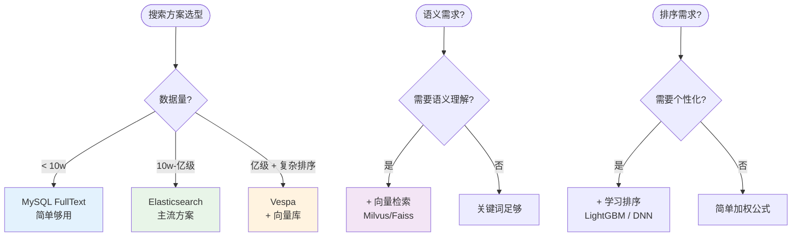

**最后一句话**：搜索好坏决定产品的"找得到性"——开篇"红色连衣裙搜出鞋子"的根因，是把搜索当成了"字符串匹配"。

> 好的搜索方案 = **召回全面、排序智能、实时反馈、降级兜底**。
