# 30.通用权限模型方案

> **本篇定位**：权限是企业级系统的"地基"——它直接决定"谁能干什么"。本文从一次"实习生误删千万订单"的故事讲起，回答三个核心问题——**RBAC/ABAC/ACL 到底怎么选？怎么设计一套既灵活又能扛得住组织变化的权限模型？怎么保证权限既严密又好维护？**

#### 目录介绍
- [01.实习生误删订单](#01实习生误删订单)
  - [1.1 千万订单一键删除](#11-千万订单一键删除)
  - [1.2 事故扩散链路](#12-事故扩散链路)
  - [1.3 反思权限设计](#13-反思权限设计)
- [02.要解决的核心矛盾](#02要解决的核心矛盾)
  - [2.1 严密与灵活](#21-严密与灵活)
  - [2.2 性能与精细](#22-性能与精细)
  - [2.3 集中与分散](#23-集中与分散)
  - [2.4 权限的本质](#24-权限的本质)
- [03.业界主流方案](#03业界主流方案)
  - [03.1 主流权限模型](#031-主流权限模型)
  - [03.2 横向对比矩阵](#032-横向对比矩阵)
  - [03.3 选型速查](#033-选型速查)
- [04.设计核心原则](#04设计核心原则)
  - [04.1 最小权限原则](#041-最小权限原则)
  - [04.2 职责分离原则](#042-职责分离原则)
  - [04.3 默认拒绝原则](#043-默认拒绝原则)
  - [04.4 审计可追溯](#044-审计可追溯)
- [05.方案落地实战](#05方案落地实战)
  - [05.1 整体架构](#051-整体架构)
  - [05.2 RBAC 模型实现](#052-rbac-模型实现)
  - [05.3 数据权限设计](#053-数据权限设计)
  - [05.4 ABAC 增强](#054-abac-增强)
  - [05.5 鉴权流程](#055-鉴权流程)
- [06.关键问题解决](#06关键问题解决)
  - [06.1 组织架构变化](#061-组织架构变化)
  - [06.2 高频鉴权性能](#062-高频鉴权性能)
  - [06.3 权限审计与合规](#063-权限审计与合规)
- [07.常见陷阱与反例](#07常见陷阱与反例)
  - [07.1 硬编码权限反例](#071-硬编码权限反例)
  - [07.2 角色爆炸反例](#072-角色爆炸反例)
  - [07.3 前端鉴权反例](#073-前端鉴权反例)
- [08.演进路线](#08演进路线)
  - [08.1 V1 简单角色](#081-v1-简单角色)
  - [08.2 V2 RBAC + 数据权限](#082-v2-rbac--数据权限)
  - [08.3 V3 RBAC + ABAC 混合](#083-v3-rbac--abac-混合)
- [09.总结与决策](#09总结与决策)
  - [09.1 上线检查表](#091-上线检查表)
  - [09.2 选型决策树](#092-选型决策树)


## 01.实习生误删订单

### 1.1 千万订单一键删除

某电商运营后台，**实习生第一周入职**——为了"清理测试数据"，他在订单管理页面点了"批量删除"——**直接删了 1200 万条线上订单**。

```mermaid
gantt
    title 事故时间线
    dateFormat HH:mm
    axisFormat %H:%M
    
    section 操作
    实习生入职第一周   :a, 09:00, 30m
    打开订单管理       :b, 10:00, 5m
    勾选"全部" + 删除  :crit, c, 10:05, 1m
    
    section 灾难
    1200w 订单被删     :crit, d, 10:06, 5m
    业务报警           :crit, e, 10:11, 5m
    紧急回滚 备份恢复  :crit, f, 10:16, 6h
    
    section 损失
    业务停摆 6 小时    :crit, g, 10:11, 6h
    GMV 损失 5000w     :crit, h, 10:11, 6h
```

**事后调查**：
- 实习生只是"普通运营"角色
- 但系统给他分配的是"超级运营"权限组
- 因为运维当时图方便，把"全部权限"打包成一个角色，所有人共用
- **没有"删除订单"这种敏感操作的二次确认**
- **没有数据权限隔离**（应该只能看自己负责的店铺）

### 1.2 事故扩散链路

```mermaid
flowchart TD
    A[实习生入职] --> B[运维偷懒分配"超级运营"角色]
    B --> C[实习生有了删除权限]
    C --> D[实习生 UI 上点"全部 + 删除"]
    D --> E[1200w 订单瞬间消失]
    E --> F[业务全停 + 客户暴怒]
    
    Cause[根因] --> R1[角色过粗 - 没区分级别]
    Cause --> R2[没有最小权限原则]
    Cause --> R3[敏感操作没二次确认]
    Cause --> R4[没有数据范围隔离]
    Cause --> R5[没有操作审计]
    
    Solve[解药] --> S1[精细化 RBAC]
    Solve --> S2[数据权限按店铺隔离]
    Solve --> S3[敏感操作二次审批]
    Solve --> S4[全量审计日志]
    
    style E fill:#ffebee
    style Solve fill:#e8f5e8
```

### 1.3 反思权限设计

事后这个团队总结了三个最深刻的教训：

1. **角色必须细粒度**——不能"超级运营"打包所有
2. **数据范围必须隔离**——A 店铺的人不能看 B 店铺的数据
3. **敏感操作必须有"二次确认 + 审批 + 审计"**

> 权限系统的设计，是**信任的工程化**——不是"我相信你不会删"，而是"系统不让你能删"。

## 02.要解决的核心矛盾

### 2.1 严密与灵活

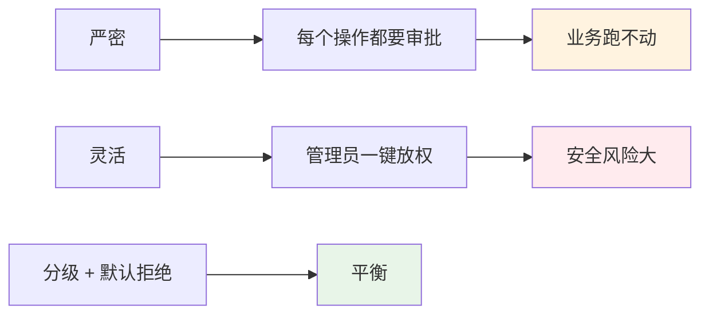

### 2.2 性能与精细

| 维度 | 挑战 |
|---|---|
| **每个 API 都要鉴权** | RT 必须在毫秒级 |
| **百万级用户** | 权限缓存 |
| **千级角色** | 角色继承可能爆炸 |
| **数据级权限** | 查询要带过滤 |

### 2.3 集中与分散

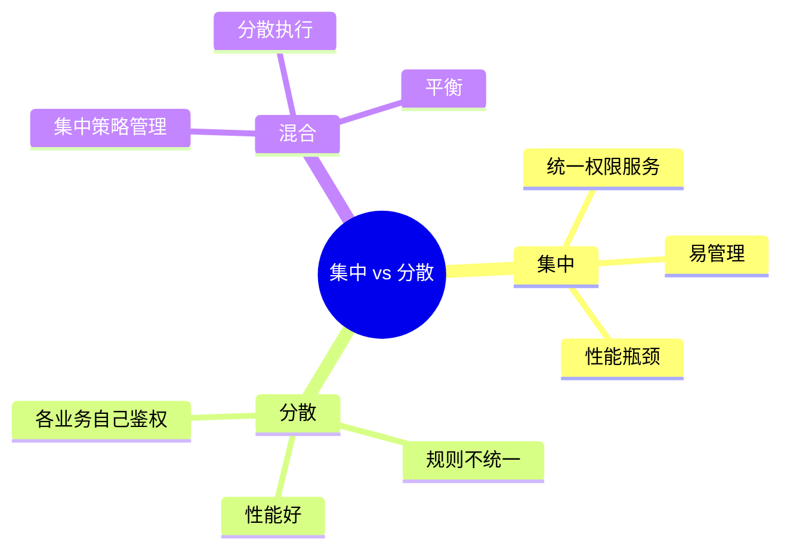

### 2.4 权限的本质

> **权限 = 谁（Who） × 能干什么（What） × 在哪些资源上（On Which）× 何时何地（When/Where）**

权限模型 = 把这个四元组结构化。

## 03.业界主流方案

### 03.1 主流权限模型

| 模型 | 全称 | 核心思想 |
|---|---|---|
| **ACL** | Access Control List | 资源 + 用户列表 |
| **RBAC** | Role-Based Access Control | 用户 → 角色 → 权限 |
| **ABAC** | Attribute-Based Access Control | 基于属性的策略判断 |
| **PBAC** | Policy-Based Access Control | 基于策略 |
| **ReBAC** | Relationship-Based | Google Zanzibar |

### 03.2 横向对比矩阵

| 维度 | ACL | RBAC | ABAC | ReBAC |
|---|---|---|---|---|
| **粒度** | 细 | 中 | 极细 | 极细 |
| **灵活度** | 低 | 中 | 高 | 极高 |
| **管理成本** | 高 | 低 | 高 | 中 |
| **性能** | 高 | 高 | 中 | 中 |
| **适用** | 文件/资源 | 企业系统 | 复杂规则 | 社交/协作 |
| **典型代表** | Linux 文件 | 大部分中后台 | 云服务 | Google Zanzibar |

### 03.3 选型速查

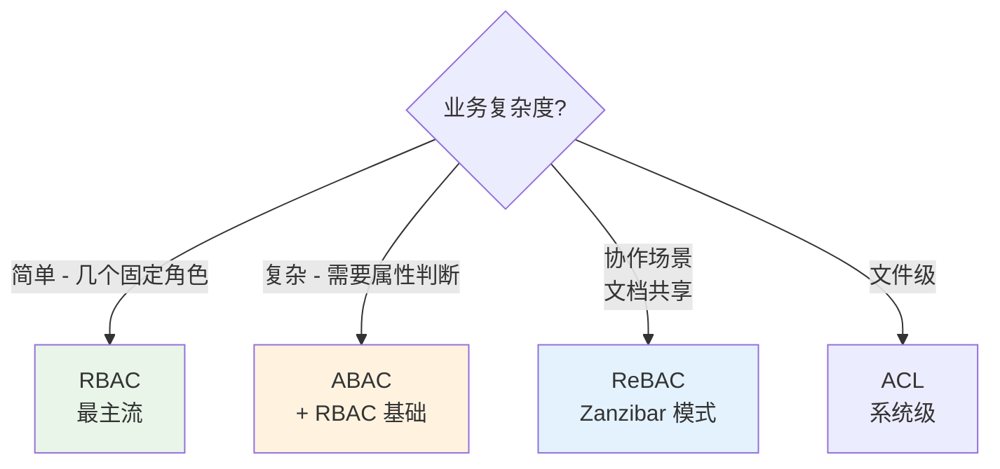

## 04.设计核心原则

### 04.1 最小权限原则

**铁律**：**默认给"够用就行"的最小权限**。

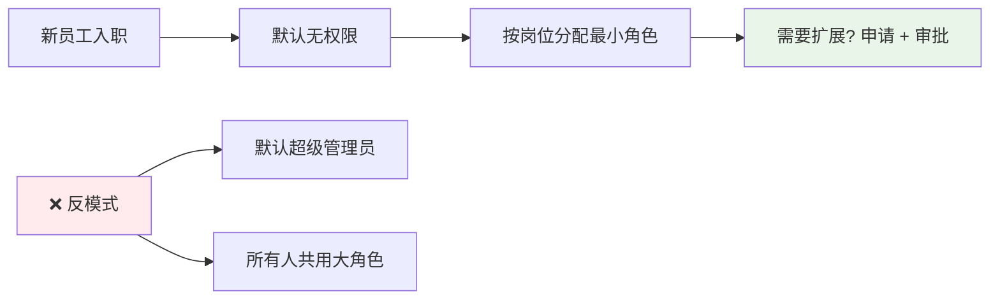

### 04.2 职责分离原则

**关键操作必须 2 个人才能完成**：

| 操作 | 申请人 | 审批人 |
|---|---|---|
| **大额转账** | 财务专员 | 财务主管 |
| **删除用户数据** | 运营 | 运营总监 |
| **下线生产服务** | 工程师 | 运维主管 |
| **生产数据库 DML** | DBA | DBA Lead |

### 04.3 默认拒绝原则

**铁律**：**未明示授权 = 拒绝**。

```kotlin
// ❌ 错误 - 默认允许
fun checkPermission(user: User, action: String): Boolean {
    if (deniedList.contains(action)) return false
    return true   // 没在黑名单就允许 - 危险
}

// ✅ 正确 - 默认拒绝
fun checkPermission(user: User, action: String): Boolean {
    if (allowedList.contains(action)) return true
    return false  // 没在白名单就拒绝
}
```

### 04.4 审计可追溯

**所有敏感操作都要有日志**：

```yaml
audit_log:
  who: "user_12345"
  did_what: "DELETE_ORDER"
  on_which: "order_98765"
  when: "2024-01-01T10:00:00Z"
  from_where: "192.168.1.100"
  result: "SUCCESS"
  context: { client: "Web", session_id: "..." }
```

## 05.方案落地实战

### 05.1 整体架构

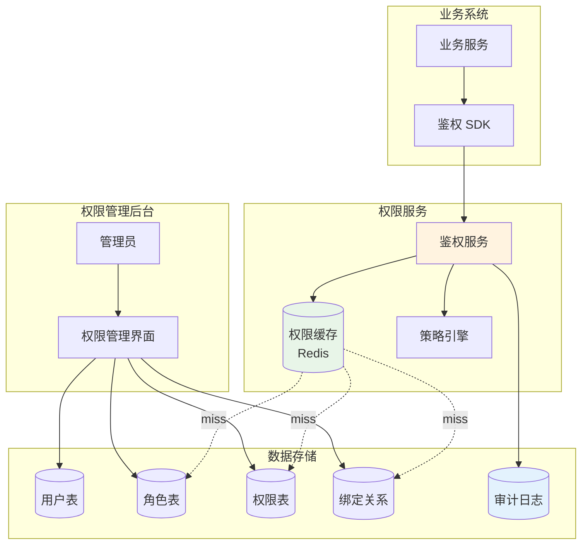

### 05.2 RBAC 模型实现

**经典 RBAC 五张表**：

```sql
-- 用户
CREATE TABLE user (
    id BIGINT PRIMARY KEY,
    username VARCHAR(64),
    org_id BIGINT
);

-- 角色
CREATE TABLE role (
    id BIGINT PRIMARY KEY,
    code VARCHAR(64) UNIQUE,    -- "shop_admin"
    name VARCHAR(128)            -- "店铺管理员"
);

-- 权限点
CREATE TABLE permission (
    id BIGINT PRIMARY KEY,
    code VARCHAR(128) UNIQUE,    -- "order:delete"
    name VARCHAR(128)            -- "删除订单"
);

-- 用户-角色
CREATE TABLE user_role (
    user_id BIGINT,
    role_id BIGINT,
    PRIMARY KEY(user_id, role_id)
);

-- 角色-权限
CREATE TABLE role_permission (
    role_id BIGINT,
    permission_id BIGINT,
    PRIMARY KEY(role_id, permission_id)
);
```

**权限点命名规范**：`{资源}:{操作}` 例如：

```
order:read       订单查看
order:create     订单创建
order:update     订单修改
order:delete     订单删除
shop:manage      店铺管理
finance:export   财务导出
```

### 05.3 数据权限设计

**RBAC 解决"能不能干"，数据权限解决"能干哪些"**。

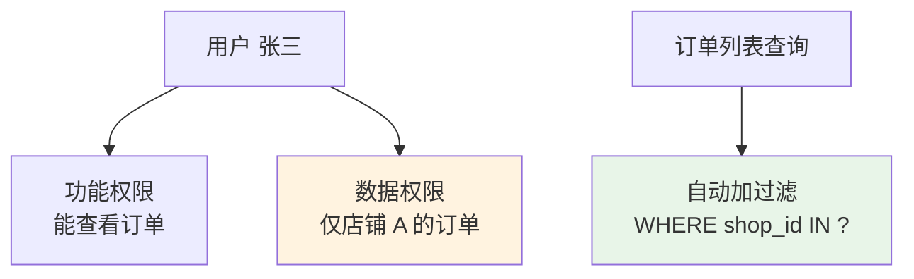

**实现思路**：

```kotlin
// 数据权限规则
data class DataScope(
    val shopIds: Set<Long>? = null,    // 店铺范围
    val regionIds: Set<String>? = null, // 地域范围
    val onlyMine: Boolean = false       // 仅自己创建
)

// 自动注入到 SQL
fun queryOrders(user: User): List<Order> {
    val scope = dataScopeService.getScope(user)
    val sql = StringBuilder("SELECT * FROM orders WHERE 1=1")
    if (scope.shopIds != null) {
        sql.append(" AND shop_id IN (${scope.shopIds.joinToString()})")
    }
    if (scope.onlyMine) {
        sql.append(" AND creator_id = ${user.id}")
    }
    return jdbcTemplate.query(sql.toString(), ...)
}
```

### 05.4 ABAC 增强

**当 RBAC 不够灵活时——ABAC 基于属性判断**：

```yaml
# 策略示例：只能在工作时间在公司网络访问财务系统
policy:
  effect: allow
  subject:
    role: finance
  action: 
    - finance:*
  resource:
    type: finance_system
  condition:
    - time.hour >= 9 AND time.hour <= 18
    - request.ip in company_network
    - user.mfa_verified == true
```

**ABAC 引擎实现**：

```kotlin
class AbacEngine {
    fun evaluate(req: AccessRequest): Decision {
        val policies = policyRepo.findApplicable(req)
        for (policy in policies) {
            val matched = policy.subject.match(req.user)
                && policy.action.match(req.action)
                && policy.resource.match(req.resource)
                && policy.condition.evaluate(req.context)
            
            if (matched) {
                return when (policy.effect) {
                    "allow" -> Decision.ALLOW
                    "deny" -> Decision.DENY
                    else -> Decision.NOT_APPLICABLE
                }
            }
        }
        return Decision.DENY  // 默认拒绝
    }
}
```

### 05.5 鉴权流程

**完整的请求鉴权流程**：

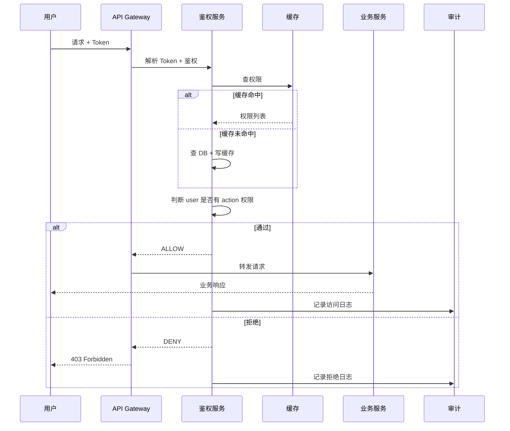

## 06.关键问题解决

### 06.1 组织架构变化

**人事变动 / 组织调整 → 权限要快速调整**：

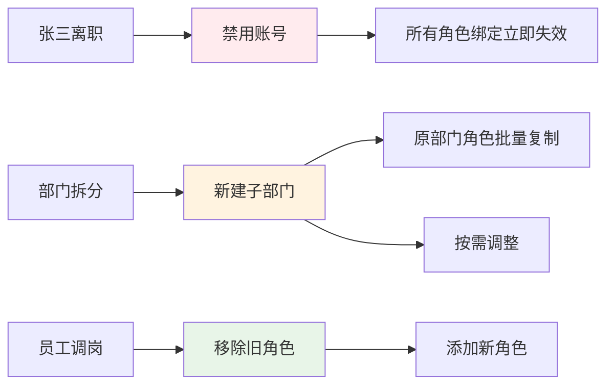

**关键能力**：
- **批量操作**（按部门 / 按岗位）
- **角色继承**（部门继承上级权限）
- **临时授权 + 自动过期**

### 06.2 高频鉴权性能

**优化思路**：

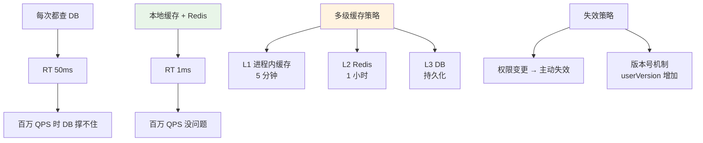

**版本号失效**：

```kotlin
// 用户权限修改时，版本号 +1
fun updateUserRoles(userId: Long, roles: List<Long>) {
    db.update("UPDATE user SET role_version = role_version + 1 WHERE id = ?", userId)
    syncRoles(userId, roles)
}

// 鉴权时，检查版本号
fun getPermissions(userId: Long): Set<String> {
    val version = db.queryForObject("SELECT role_version FROM user WHERE id = ?", Long::class.java, userId)
    val cacheKey = "perm:$userId:v$version"
    
    return cache.getOrPut(cacheKey) {
        loadFromDB(userId)
    }
}
```

### 06.3 权限审计与合规

**审计场景**：
- **追溯**："谁在 X 时间删除了订单 12345?"
- **合规**：GDPR / SOX / 等保要求
- **异常检测**："凌晨 3 点删除大量数据" → 报警

**审计日志关键字段**：

| 字段 | 含义 |
|---|---|
| `actor` | 操作者 |
| `action` | 操作类型 |
| `resource` | 操作对象 |
| `result` | 成功 / 失败 / 拒绝 |
| `timestamp` | 时间 |
| `ip` | 来源 IP |
| `user_agent` | 客户端 |
| `session_id` | 会话 |
| `context` | 业务上下文 |

## 07.常见陷阱与反例

### 07.1 硬编码权限反例

**反例**：代码里写 `if (user.role == "admin")` —— **新增角色要改全代码**。

**教训**：
- 永远基于"权限码"判断 `if (user.has("order:delete"))`
- 角色到权限的映射在配置 / DB 里，不在代码里

### 07.2 角色爆炸反例

**反例**：每个组织 / 每个项目都建一套角色 → **几年下来 5000 个角色**。
- 管理员看眼花
- 重名冲突
- 谁都不知道哪些角色还在用

**教训**：
- 角色按"业务职能"建，不按"个体"建
- 定期清理无人使用的角色
- 用"角色 + 数据范围"组合，避免角色爆炸

### 07.3 前端鉴权反例

**反例**：只在前端做权限控制（隐藏按钮）→ **黑客通过抓包绕过 → 直接调 API 删数据**。

**教训**：
- 前端鉴权只是 UX 优化（不显示无权限按钮）
- **后端必须独立鉴权**——任何 API 调用都要校验
- 前后端都要做，但**后端是底线**

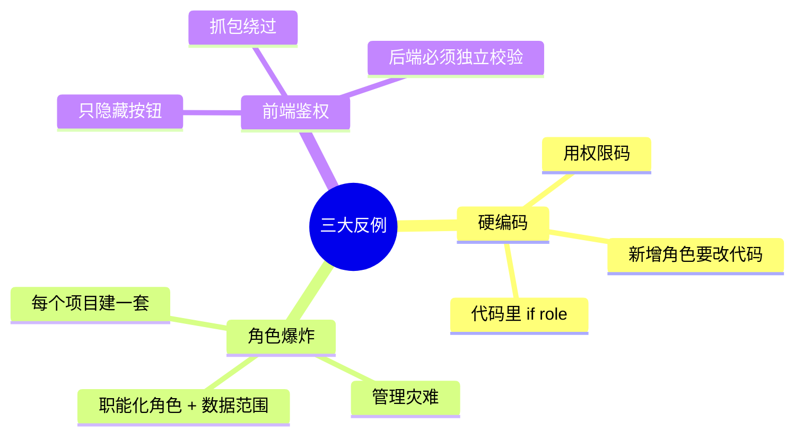

## 08.演进路线

### 08.1 V1 简单角色

**特征**：业务起步、用户少。

**做法**：
- 几个固定角色（admin / user）
- 简单 if 判断
- 单一数据范围

**适用阶段**：MVP / 早期产品

### 08.2 V2 RBAC + 数据权限

**特征**：组织规模化、需要精细管理。

**做法**：
- 完整 RBAC 5 表模型
- 数据权限隔离（部门 / 店铺）
- 权限管理后台
- 权限缓存
- 审计日志

**适用阶段**：中型企业系统

### 08.3 V3 RBAC + ABAC 混合

**特征**：复杂业务规则、合规要求高。

**做法**：
- RBAC 处理常规权限
- ABAC 处理复杂条件（时间 / 地点 / 状态）
- 策略引擎（OPA / Cedar）
- 完整审计 + 异常检测
- 临时授权 + 审批流

**适用阶段**：大型企业 / SaaS / 金融

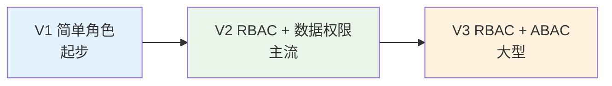

## 09.总结与决策

### 09.1 上线检查表

权限系统上线前对照：

- [ ] RBAC 模型设计（用户/角色/权限点）
- [ ] 权限点命名规范（资源:操作）
- [ ] 数据权限隔离（部门/店铺/区域）
- [ ] 默认拒绝（白名单制）
- [ ] 最小权限分配
- [ ] 敏感操作二次确认
- [ ] 关键操作审批流
- [ ] 权限缓存（性能）
- [ ] 缓存失效机制（版本号）
- [ ] 完整审计日志
- [ ] 异常行为检测
- [ ] 离职 / 调岗自动处理
- [ ] 临时授权 + 自动过期
- [ ] 前后端双重鉴权
- [ ] API 网关统一拦截

### 09.2 选型决策树

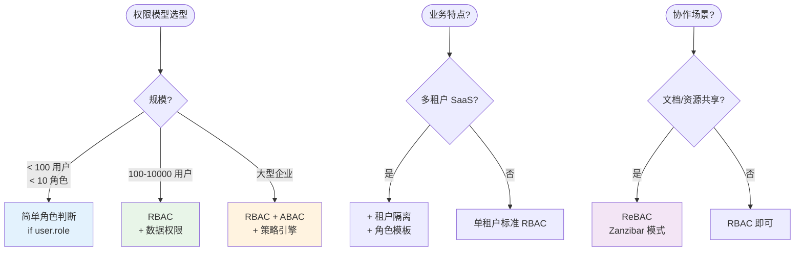

**最后一句话**：权限系统是"信任的工程化"——开篇实习生删千万订单的根因，是把"权限"当成了"流程"，而不是"系统约束"。

> 好的权限模型 = **最小权限、默认拒绝、职责分离、全程审计**。
