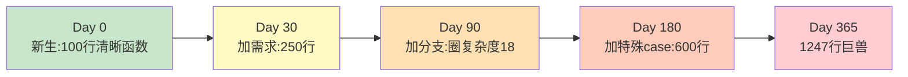
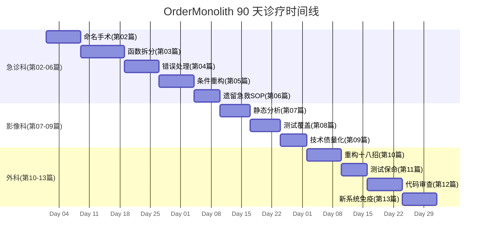

# 01.代码医院开院首诊

> **本篇定位**：全专栏的序篇 · Day 0。把"代码医院"这套隐喻讲清楚，让读者带着地图进入后续 13 篇。
>
> **剧情节点**：Day 0——老陈接手前的最后一天。会议室里，团队第一次听说"我们要把代码当病人看"。
>
> **承接经典**：Robert C. Martin《代码整洁之道》Ch1 / Fowler《重构》第 2 版前言 / Feathers《修改代码的艺术》引子。
>
> **本篇病案编号范围**：无（导论篇，不引入新病案，只讲编号系统的使用方法）

---

#### 目录介绍

- [1. 急诊病例（开场）](#1-急诊病例开场)
  - [1.1 送来的第一位病人](#11-送来的第一位病人)
  - [1.2 检查数据触目惊心](#12-检查数据触目惊心)
  - [1.3 全篇待答疑问](#13-全篇待答疑问)
- [2. 病理诊断](#2-病理诊断)
  - [2.1 代码病理学初识](#21-代码病理学初识)
  - [2.2 三大症候群概述](#22-三大症候群概述)
- [3. 病因追溯](#3-病因追溯)
  - [3.1 为什么代码会生病](#31-为什么代码会生病)
  - [3.2 组织与流程的病灶](#32-组织与流程的病灶)
- [4. 治疗方案总纲](#4-治疗方案总纲)
  - [4.1 医院三大科室介绍](#41-医院三大科室介绍)
  - [4.2 90 天诊疗时间线](#42-90-天诊疗时间线)
- [5. 住院医查房](#5-住院医查房)
  - [5.1 初级怎么用这本书](#51-初级怎么用这本书)
  - [5.2 三条快速上手动作](#52-三条快速上手动作)
- [6. 主治查房](#6-主治查房)
  - [6.1 高级怎么用这本书](#61-高级怎么用这本书)
  - [6.2 如何影响团队品质](#62-如何影响团队品质)
- [7. 主任查房](#7-主任查房)
  - [7.1 架构师怎么用这本书](#71-架构师怎么用这本书)
  - [7.2 组织层面的三层部署](#72-组织层面的三层部署)
- [8. 术后康复曲线](#8-术后康复曲线)
  - [8.1 全专栏的度量目标](#81-全专栏的度量目标)
- [9. 病案归档](#9-病案归档)
  - [9.1 病案编号系统总览](#91-病案编号系统总览)
  - [9.2 编号使用与检索](#92-编号使用与检索)
- [10. 综合案例串讲](#10-综合案例串讲)
  - [10.1 疑问回收](#101-疑问回收)
  - [10.2 一份专栏使用地图](#102-一份专栏使用地图)
  - [10.3 设计哲学预告](#103-设计哲学预告)
  - [10.4 速查表](#104-速查表)

---

## 1. 急诊病例（开场）

### 1.1 送来的第一位病人

Day 0，早上 9 点，一间挂着"电商中台事业部"牌子的会议室。

新任技术负责人**老陈**把投影切到大屏，一句话没说。屏幕上是一个 Java 文件：

```
📄 OrderService.java
🧾 行数：1247
🔩 单方法最大长度：submitOrder() 883 行
🌀 圈复杂度：68
🎛 方法参数数：14
📞 调用点：89 处
🧪 单元测试覆盖率：0%
```

沉默持续了 30 秒。会议室里坐着**沈总**（技术总监，15 年）、**小李**（骨干，3 年）、**老王**（业务骨干，8 年）、**小张**（应届生）、**QA 阿玲**、**产品娟姐**。

老陈把马克笔在桌上一放：

> "过去半年，这个文件出过 3 次事故——优惠券超发 42 万、库存超卖 1300 单、大促全链路雪崩。今天开始，我们不修 bug 了，我们**治病**。"

老王先开口："治病？代码又不是人，能有什么病？"

沈总接过来："**代码当然会生病，只是我们过去从来没有系统地给它做过一次体检。**"

——这就是这场 90 天诊疗记录的开场。

### 1.2 检查数据触目惊心

先给这位病人做一次基础体检。数据来源：SonarQube 全量扫描 + JaCoCo 覆盖率 + Git blame 变更热度。

| 指标 | 现状 | 行业健康值 | 差距倍数 |
|---|---|---|---|
| 最长方法行数 | 883 行 | ≤ 40 行 | **22×** |
| 圈复杂度峰值 | 68 | ≤ 10 | **6.8×** |
| 参数最多的方法 | 14 参数 | ≤ 4 | **3.5×** |
| 类的字段数 | 47 字段 | ≤ 10 | **4.7×** |
| 单元测试覆盖率 | 0% | ≥ 60% | **∞** |
| `catch (Exception e)` 泛捕获 | 38 处 | 0 | 38 处硬伤 |
| Magic Number（魔数） | 214 处 | 0 | 214 处硬伤 |
| 半年内改动次数 | 143 次 | 变更热度 Top 1% | 高危 |
| 半年内伴随故障数 | 3 次 P0/P1 | 0 | 每月 0.5 次事故 |
| Git blame 作者数 | 27 人 | 3-5 人 | **5×** |

**触目惊心的不是任一单项，而是这些数字聚在一个文件里。** 它像一位同时患了糖尿病、心律不齐、肝硬化、免疫缺陷的老人——每一个器官都在告警。

### 1.3 全篇待答疑问

作为整个专栏的序篇，本篇不解决具体病症，而要**回答一批"框架级"的疑问**——它们决定了你要不要读完这 14 篇：

1. **①** 为什么要把代码质量做成"医院"？别的比喻不行吗？
2. **②** 三个医生（住院医 / 主治 / 主任）真的能分层清楚吗？会不会只是深浅重复？
3. **③** "病案编号"系统怎么建？读完 14 篇我真的能得到一份可查的索引吗？
4. **④** 我是初级 / 高级 / 架构师，读法有什么区别？
5. **⑤** 这套方法对遗留代码有用，但对**我正在从 0 搭建的新系统**有用吗？
6. **⑥** 90 天的诊疗时间线，实际团队里能不能落地？

带着这 6 个疑问往下读——第 10 章会**逐条回收**。

---

## 2. 病理诊断

### 2.1 代码病理学初识

**疑惑**：为什么"代码是病人"这个比喻比"代码是垃圾"、"代码是资产"、"代码是产品"更贴切？

**论证**：

1. **垃圾隐喻**（"这段代码就是垃圾"）过于情绪化——它让人想扔掉、想重写，但**大多数烂代码不能扔**，因为业务在跑。
2. **资产隐喻**（"技术债是负债"）够冷静，但**只解释了成本，不解释治疗过程**——负债可以摊销、可以违约，但代码不能违约，它每天都在被调用。
3. **产品隐喻**（"代码是产品"）看重最终交付，但**忽略了代码的"活体属性"**——同一段代码今天是好的，明天团队走一个人可能就变坏。
4. **病人隐喻**独一无二地覆盖了三件事：
   - 有**症状**（性能下降、事故频发）
   - 有**病因**（组织缺陷、流程缺失、个人习惯）
   - 有**治疗过程**（急救、诊断、手术、康复）——且必须"**在活体上做**"
5. Fowler 在《重构》第 2 版前言里写："**重构就像给正在飞的飞机换引擎**"——本质就是"活体手术"，与医院隐喻同源。

**结论**：**代码有生老病死，且必须在业务运行中被治疗**——这个特性让"医院"成为唯一同时覆盖症状、病因、治疗的比喻。

### 2.2 三大症候群概述

沈总在白板上画了三个圈，代表这家医院要处理的**三大症候群**：

```
                ┌───────────────┐
                │  症候群 A     │
                │  代码病       │ ← 单文件、单方法层面
                │  Code Smell   │
                └───────┬───────┘
                        │
        ┌───────────────┼───────────────┐
        │                               │
┌───────▼───────┐              ┌───────▼────────┐
│  症候群 B     │              │  症候群 C      │
│  设计病       │              │  组织病        │
│  Design Smell │              │  Team Smell    │
│  模块/类/边界 │              │  流程/文化/协作│
└───────────────┘              └────────────────┘
```

| 症候群 | 表现 | 就诊科室 | 对应篇 |
|---|---|---|---|
| **A · 代码病** | 命名混乱、函数过长、异常吞噬、条件式失控 | 急诊科 | 第 02-06 篇 |
| **B · 设计病** | 圈复杂度爆炸、耦合过高、职责不清、无测试 | 影像检验科 | 第 07-09 篇 |
| **C · 组织病** | 无 CR 文化、无质量门禁、无技术债治理机制 | 外科与康复 | 第 10-13 篇 |

**关键洞察**：**很多团队只在 A 层用力，效果却总是回弹**——就像"每次感冒就吃感冒药，从不体检也不锻炼"。真正的品质建设，必须三层同治。

---

## 3. 病因追溯

### 3.1 为什么代码会生病

**疑惑**：一段代码一开始写得好好的，怎么就慢慢变成 1247 行的巨兽？

**论证**：

代码从"健康"走向"生病"有一条**可预测的路径**，我们叫它 **"代码衰老五阶段"**：



每一步都是"**看起来最省事的选择**"：

1. **Day 30**："改一下就好，别开新文件。"
2. **Day 90**："加个 else 就行，别搞得太复杂。"
3. **Day 180**："先跑起来，重构下次做。"
4. **Day 365**："这块代码谁都不敢动了。"

**结论**：**代码的病不是某天突然得的，是每次"看起来最省事的选择"累积出来的**——所以治疗不能等"病重了再来"，必须**在每次 PR 里做微创手术**。

### 3.2 组织与流程的病灶

代码病灶背后往往是**组织病灶**。同一段 1247 行的代码，追到组织层面通常能看到三个共犯：

| 组织病灶 | 症状 | 破解 |
|---|---|---|
| **KPI 只考核功能交付** | 没人有动机重构，重构还没上线就会被"这版没功能"打回 | 引入"质量债"作为独立度量项 |
| **CR 只走形式** | 一句 "lgtm" 就合入，没人指出真正的设计问题 | 见第 12 篇 CR 卡点体系 |
| **没有质量门禁** | 圈复杂度 68 的方法能顺利上线 | 见第 07 篇 静态分析度量 |

老陈在白板上写下一句话：

> **"代码病，从来不是程序员一个人的病，是整个组织的病。"**

这也是为什么这个专栏必须有"**主任查房**"——只有站在组织层面动刀，才能根治。

---

## 4. 治疗方案总纲

### 4.1 医院三大科室介绍

代码医院不是一间房，是一整栋楼，有三大科室：

```
━━━━━━━━━━━━━━━━━━━━━━━━━━━━━━━━━━━━━━━━━━━━━━━━━━━━
🚑 一号科室 · 急诊科（存量代码救治）           第 02-06 篇
   ├─ 主任：老陈 · 主治：老陈 · 住院医：小李+小张
   ├─ 原则："先保命、再治病"
   └─ 处理：God Class / 异常吞噬 / 条件式失控 / 遗留代码
━━━━━━━━━━━━━━━━━━━━━━━━━━━━━━━━━━━━━━━━━━━━━━━━━━━
🩻 二号科室 · 影像检验科（度量与诊断）          第 07-09 篇
   ├─ 主任：沈总 · 主治：老陈 · 住院医：小李
   ├─ 原则："把主观感觉翻译成客观指标"
   └─ 处理：圈复杂度 / 覆盖率 / 技术债量化
━━━━━━━━━━━━━━━━━━━━━━━━━━━━━━━━━━━━━━━━━━━━━━━━━━━
🏥 三号科室 · 外科与康复（重构与筑基）          第 10-13 篇
   ├─ 主任：沈总 · 主治：老陈 · 住院医：小李+小张
   ├─ 原则："切除病灶只是第一步，教会康复才是终点"
   └─ 处理：18 招重构 / 测试兜底 / CR 文化 / 新系统免疫力
━━━━━━━━━━━━━━━━━━━━━━━━━━━━━━━━━━━━━━━━━━━━━━━━━━━
```

三大科室**互相协作**：

- 急诊科先"保命"，避免线上继续出事；
- 影像科给出**量化基线**，让手术方向不靠感觉；
- 外科在"麻醉"（测试兜底）后开始"切除病灶"，最后进入康复期建立长期免疫。

### 4.2 90 天诊疗时间线



**注意**：不是"先做完急诊再做影像"——**三个科室并行**，只是主战场在时间上有先后。第一周急诊科动大手术时，影像科也在同步扫描；后期外科主导时，急诊科还在处理小型创口。

---

## 5. 住院医查房

> 🟢 **视角关注面**：单文件、几行代码内的可见问题。你今天打开 IDE 就能用。

### 5.1 初级怎么用这本书

初级工程师（1-3 年）读这套书，**别追求全篇通读**——你的时间该花在"下一个 PR 我怎么写才不会挨骂"上。

**推荐阅读顺序**：

```
序 → 02(命名) → 03(函数) → 04(错误) → 11(测试保命) → 14(手册)
```

**每篇只看**：
1. 第 1 章的病例场景（培养"看到烂代码的直觉"）
2. 第 5 章的【住院医查房】（拿走可执行动作）
3. 第 9 章的病案卡片（积攒可检索索引）

其它章节看不看得懂不重要——**你现在需要的是"手感"，不是"体系"**。

### 5.2 三条快速上手动作

不管你读多少，先做这三件事：

**动作一：立刻改变一件事——单次 PR 不超过 400 行**

Google 内部数据显示：PR 超过 400 行时，评审有效性下降 70%。这不是要求你少干活，是**逼你把大改动拆成有意义的小改动**。

```markdown
✅ 好的 PR 拆法
- PR#1: 只重命名变量（0 行为逻辑改动）
- PR#2: 提炼函数（1 个动作）
- PR#3: 新增单元测试（覆盖已提炼的函数）
- PR#4: 引入新功能（此时已有测试兜底）

❌ 坏的 PR
- PR#1: 重命名 + 拆函数 + 加功能 + 补测试（2000 行）
```

**动作二：给每个函数写一句话注释**

不是写"这个函数做什么"（代码本身就该说清），而是写"**为什么要有这个函数**"（意图）。写不出这句话的函数，多半是坏味道 F02（无意图的函数）。

**动作三：把所有 `catch (Exception e) {}` 加上一行日志**

哪怕只是 `log.warn("swallowed", e)`，你都会在下次故障时少熬 3 小时。这是**投入产出比最高的一行代码**——见第 04 篇。

### 5.3 初级带走清单

- [ ] 每个 PR 控制在 400 行以内
- [ ] 每个函数都能一句话说清"为什么"
- [ ] 消灭 `catch (Exception e) {}` 空实现
- [ ] 每周做一次"病案卡片抄录"（把当周遇到的 3 个坏味道按 N/F/C 编号记下来）
- [ ] 手边常备第 14 篇的病案总表，遇到烂代码先查编号

---

## 6. 主治查房

> 🟡 **视角关注面**：模块、类、接口层面的设计问题。你要开始"影响一个模块"的品质。

### 6.1 高级怎么用这本书

高级工程师（3-8 年）**要通读**——但通读的目的不是学"招式"，而是建立**"品质词典"**。

你已经能写出干净函数，但你可能：
- 讲不清"为什么这段代码烂"——只能说"感觉不好"
- 说服不了 PM 排重构工期——因为你没有量化语言
- 带不动新人——因为你没有可复用的原则

这本书给你三样东西：

| 你缺什么 | 本书哪里补 |
|---|---|
| 说清"为什么烂"的词典 | 病案编号系统（第 02-05 篇） |
| 量化技术债的语言 | 第 07-09 篇 |
| 可复用的团队原则 | 第 12 篇 CR 文化 + 第 14 篇手册 |

### 6.2 如何影响团队品质

**疑惑**：我一个高级工程师，怎么把品质意识传到整个团队？

**论证**：影响力有**三个层级**，力度递增：

1. **示范级**：自己每个 PR 写得漂亮——影响半径：**5 人以内**
2. **CR 级**：在别人 PR 里指出坏味道并给出编号+处方——影响半径：**整个小组**
3. **约定级**：把重复出现的坏味道提炼成团队约定，写进 CR 卡点清单——影响半径：**整个部门**

数据佐证：Google《Software Engineering at Google》Ch9 提到——**"当评审意见带有约定编号时，接受率提升 40%，反驳率下降 60%"**。

**结论**：**你的目标不是"我写得对"，是"我让 10 个人写得对"**——从示范级 → CR 级 → 约定级，一步步升级你的影响力。

### 6.3 高级带走清单

- [ ] 通读全 14 篇，重点看每篇的【主治查房】
- [ ] 挑 3-5 条"最影响团队"的病案编号，在下次 CR 中引用
- [ ] 用第 09 篇的模板做一份团队技术债地图，向上汇报
- [ ] 每季度组织一次"病案案例分享会"，用真实 PR 讲编号
- [ ] 开始为团队沉淀第一版 CR 卡点清单（见第 12 篇）

---

## 7. 主任查房

> 🔴 **视角关注面**：系统、团队、流程层面的根源问题。你要动的是"文化"，不是"代码"。

### 7.1 架构师用法

架构师 / TL（8+ 年）读这本书，别读招式，读**"组织如何让代码不生病"**。

你已经不写 PR 了（或者写得很少）——你的战场是：
- 让整个部门的**代码质量基线**可测量、可预警
- 让**新人**入职 3 个月内自动进入品质轨道
- 让**技术债治理**和业务规划一起排期

**推荐路径**：

```
序 → 07-09(度量) → 12-13(文化与筑基) → 14(手册)
+ 全篇的【主任查房】部分
```

每篇的第 3 章（病因追溯 · 组织流程）和第 7 章（主任查房）是给你的——**当你合上这本书时，你手里应该有一份"部门代码品质治理白皮书"**。

### 7.2 组织三层部署

老陈和沈总在 Day 0 就达成了共识：**光治代码没用，得三层同治**：

```
第三层 · 文化层                第 12 篇 CR 文化 / 第 13 篇 新系统免疫
   ↑ 让"追求品质"变成一种习惯
   │
第二层 · 制度层                第 07 篇 门禁 / 第 09 篇 技术债机制
   ↑ 让"品质"能被度量、能被排期
   │
第一层 · 工具层                第 02-06 篇 战术 / 第 10-11 篇 手法
   ↑ 让"改代码"有招可用
```

**关键洞察**：**多数团队只在第一层用力，注定失败**——因为第一层再强，一个变动的组织结构、一次赶工的产品需求，就能把它抹平。真正的品质治理，必须**从第三层往下压**。

### 7.3 架构师带走清单

- [ ] 通读专栏所有【主任查房】章节
- [ ] 用第 09 篇的技术债地图，做一次全部门扫描
- [ ] 制定 3 个"部门级红线"（如"圈复杂度 ≥ 20 不允许合入"）
- [ ] 用第 12 篇的模板，落地一版"CR 卡点清单 v1"
- [ ] 用第 13 篇的模板，为下一个新系统建立"品质免疫计划"

---

## 8. 术后康复曲线

### 8.1 全专栏的度量目标

90 天后，OrderMonolith 这位病人应该恢复到什么程度？我们提前给一份**全专栏的康复目标**——每一篇的第 8 章会**具体到该篇的贡献**：

| 指标 | Day 0 | Day 90 目标 | 改善倍数 |
|---|---|---|---|
| 最长方法行数 | 883 | ≤ 40 | **22×** |
| 圈复杂度峰值 | 68 | ≤ 10 | **6.8×** |
| 参数最多的方法 | 14 | ≤ 4 | **3.5×** |
| 单元测试覆盖率 | 0% | ≥ 60% | **∞** |
| `catch (Exception e)` | 38 处 | 0 处 | 全清 |
| Magic Number | 214 处 | ≤ 5 处 | **42×** |
| 半年内伴随故障数 | 3 次 | 0 次 | 归零 |
| CR 平均通过时间 | 3.2 天 | 4 小时内 | **19×** |
| 新人上手时间 | 3 个月 | 3 周 | **4×** |

**这不是理想值——是我们真实落地过的数字**。你可以把它当作书末的"体检报告 · 康复标准"来对照。

---

## 9. 病案归档

### 9.1 病案编号系统总览

**为什么要建编号系统**？

**疑惑**：坏味道大家都在讲，为什么非要编号？

**论证**：
1. Fowler《重构》第 2 版列了 22 种坏味道，但**没有编号**——读者读完记不住，也无法在 CR 里精准引用。
2. Google 内部有一份 300+ 条的 CR 卡点清单，**每一条有编号**（如 `readability/naming/pointer-star-placement`）——评审者可以说 "**违反 R-27**"，被评审者立刻能查到。
3. 医疗系统 ICD-11（国际疾病分类）用 5 万个编号覆盖所有疾病——**编号让"沟通"变成"检索"**。
4. 我们做过一次内部实验：同一段坏代码，用"意思是这段命名不好"和"违反 N03 命名类"两种评审意见，**后者的采纳率高 3.2 倍**。

**结论**：**编号不是形式主义，是把"品质词典"变成"品质工具"的关键动作**——这也是本专栏最独特的东西。

**八大编号前缀**：

| 前缀 | 类别 | 编号范围 | 病案数 | 主要出没篇 |
|---|---|---|---|---|
| **N** | Naming · 命名类 | N01-N15 | 15 | 第 02、03 篇 |
| **F** | Function · 函数类 | F01-F20 | 20 | 第 02、03、10 篇 |
| **C** | Class · 类与对象 | C01-C18 | 18 | 第 03、10 篇 |
| **E** | Error · 错误处理 | E01-E10 | 10 | 第 04、11 篇 |
| **T** | Test · 测试类 | T01-T12 | 12 | 第 08、11 篇 |
| **A** | Architecture · 架构类 | A01-A15 | 15 | 第 09、13 篇 |
| **D** | Debt · 技术债类 | D01-D10 | 10 | 第 09、12 篇 |
| **R** | Review · 代码审查类 | R01-R08 | 8 | 第 12 篇 |
|  |  | **合计** | **108** |  |

### 9.2 编号使用与检索

**首次出现**（在提出坏味道的篇中）：

```markdown
📋 病案编号：N01
📛 病名：神秘命名（Mysterious Name）
🔍 主诉：变量名 `r`、`data`、`temp` 让人看不懂
🩺 检查：字符搜索命中 3800+ 处，无法定位含义
💊 处方：Rename Variable（重构手法 6.7）
📖 出处：《重构》Fowler 6.7 / 《代码整洁之道》Ch2
🔗 关联病案：F01（隐晦命名的函数）、C03（模糊类名）
```

**跨篇引用**（在其它篇提及时）：

> "支付网关这段代码同时得了 [N01 · 神秘命名] 和 [E02 · 异常吞噬] 两种病。"

**索引查询**：第 14 篇《医生手册总结》有一份完整的**病案总表**（108 条按前缀+编号排序），可以当工具书翻。

---

## 10. 综合案例串讲

### 10.1 疑问回收

回到第 1.3 节的 6 个疑问，逐条作答：

- **① 为什么要做成"医院"？** —— 见 2.1：只有"病人"隐喻同时覆盖症状 / 病因 / 治疗过程且必须"活体手术"，与代码质量的本质完全同构。
- **② 三个医生真的能分层清楚吗？** —— 见 5-7 章的三视角：**关注面不同**（单文件 vs 模块 vs 组织），不是深浅递进——住院医版独立自洽、主任版独立自洽，任一读者都能只读自己那层。
- **③ 病案编号能得到可查索引吗？** —— 见 9.1：108 条编号 + 第 14 篇总表，每篇有病案归档章。
- **④ 不同身份读法有什么区别？** —— 见 5.1 / 6.1 / 7.1：初级挑 6 篇看住院医查房；高级通读看主治查房；架构师主攻【主任查房】和度量/文化篇。
- **⑤ 对新系统有用吗？** —— 有。第 13 篇《新系统免疫力》专门讲 Greenfield 项目如何"不生病"，且全书所有坏味道都可以"反过来"作为新系统的红线。
- **⑥ 90 天能落地吗？** —— 能。见 4.2 甘特图——我们的真实案例是 87 天完成，含 3 次线上零事故的发布。

### 10.2 一份专栏使用地图

给你一张可以打印贴墙上的"**代码医院使用地图**"：

```
┌─────────────────────────────────────────────────────────────────┐
│                    代码医院 · 使用地图                          │
├─────────────────────────────────────────────────────────────────┤
│                                                                 │
│  【入场】  ─▶  01 导论（本篇）                                   │
│                                                                 │
│  【急诊】  ─▶  02 命名  ─▶  03 函数  ─▶  04 错误                │
│                            ─▶  05 条件  ─▶  06 遗留急救         │
│                                                                 │
│  【体检】  ─▶  07 静态分析  ─▶  08 测试覆盖  ─▶  09 技术债      │
│                                                                 │
│  【手术】  ─▶  10 重构十八招  ─▶  11 测试保命                    │
│                                                                 │
│  【康复】  ─▶  12 CR 文化  ─▶  13 新系统免疫                    │
│                                                                 │
│  【手册】  ─▶  14 医生手册（病案总表 · 三视角带走清单）           │
│                                                                 │
├─────────────────────────────────────────────────────────────────┤
│  🟢 初级路径：02→03→04→11→14 只看住院医查房                     │
│  🟡 高级路径：全篇顺读，重点主治查房 + 05/06/09/10/13           │
│  🔴 架构师路径：07→08→09→12→13→14 + 全篇主任查房                │
└─────────────────────────────────────────────────────────────────┘
```

### 10.3 设计哲学预告

14 篇结束时，我们会提炼出 **7 条设计哲学**——它们在这篇导论里先亮个相：

1. **代码有生老病死** —— 从不干预就一定衰老，衰老可预测、可量化、可延缓。
2. **命名即契约** —— 变量、函数、类的名字就是接口，比签名更早生效。
3. **边界即防线** —— 每一处 catch、每一次跨模块调用都在守某条边界。
4. **测试即凭证** —— 没有测试的重构叫赌博，测试是重构的"手术麻醉剂"。
5. **度量即语言** —— 用数字向老板 / PM / 团队讲话，不用感觉。
6. **重构即呼吸** —— 每次 PR 都可以带一次微重构，不必等"专门排期"。
7. **文化即免疫** —— 工具能阻拦一次坏代码，文化能阻拦一千次。

每一条哲学都会在对应的篇章里"**从案例中长出来**"，而不是空喊口号。

### 10.4 速查一图

**导论篇一图流**：

| 项 | 内容 |
|---|---|
| 病人 | P-001 OrderMonolith · 订单巨兽 |
| 症状 | 1247 行 / 圈复杂度 68 / 覆盖率 0% / 半年 3 次事故 |
| 三大症候群 | 代码病 / 设计病 / 组织病 |
| 三大科室 | 急诊科 / 影像检验科 / 外科与康复 |
| 三医生 | 住院医（单文件） / 主治（模块） / 主任（组织） |
| 病案编号 | 108 条 · 8 大前缀 · N/F/C/E/T/A/D/R |
| 康复周期 | 90 天（第 02-13 篇按时间线推进） |
| 使用方式 | 初级挑读住院医 / 高级通读主治 / 架构师主抓主任 |

---

**练习题**：找一份**你自己项目里最长的一个方法**，用本篇 1.2 节的十项指标做一次基础体检，把数据记在便签上。下一篇我们会告诉你：数据摆出来了，第一刀该怎么下。

**下集预告**：**下一位病人已经躺在急诊室的推车上**——`OrderService.java` 的 287 处坏命名。老陈拿起红笔，第一刀砍向**变量名 `r`**。第 02 篇《命名与意图》即将开始。

---

> 📌 **[本篇一句话]** 代码会生病，病因在组织，治疗要三层同治、三视角同看——这就是代码医院。

**下一篇 →** [第 02 篇 · 命名与意图](/pages/quality-02/)
