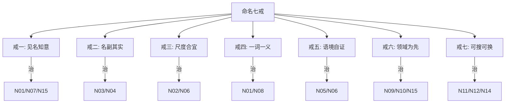

# 02.命名与意图的战场

> **本篇定位**：急诊科病例一·第一刀 · 命名的战场。
>
> **剧情节点**：Day 1-8——老陈打开 `OrderService.java`，红笔诊断 287 处坏味道，其中 63 处属于命名类。
>
> **本篇病人**：P-001 OrderMonolith（订单巨兽）—— God Class 命名坏味道集中爆发区。
>
> **承接经典**：《代码整洁之道》Ch2 命名 / 《实现模式》Kent Beck 命名章 / 《代码大全》Ch11 变量名的力量。
>
> **本篇病案编号范围**：N01-N15（命名类全套） + F01（隐晦命名的函数入口）

---

#### 目录介绍

- [1. 急诊病例](#1-急诊病例)
  - [1.1 一个变量名让团队排查 3 天](#11-一个变量名让团队排查-3-天)
  - [1.2 287 处坏名字的检查数据](#12-287-处坏名字的检查数据)
  - [1.3 本篇待答疑问](#13-本篇待答疑问)
- [2. 病理诊断](#2-病理诊断)
  - [2.1 命名类六大坏味道](#21-命名类六大坏味道)
  - [2.2 N01-N15 病案编号登记](#22-n01-n15-病案编号登记)
- [3. 病因追溯](#3-病因追溯)
  - [3.1 从代码追到工位习惯](#31-从代码追到工位习惯)
  - [3.2 团队约定为何缺失](#32-团队约定为何缺失)
- [4. 治疗方案总纲](#4-治疗方案总纲)
  - [4.1 命名七戒手术地图](#41-命名七戒手术地图)
  - [4.2 手术顺序与风险评估](#42-手术顺序与风险评估)
- [5. 住院医查房](#5-住院医查房)
  - [5.1 立即能改的 20 个变量](#51-立即能改的-20-个变量)
  - [5.2 命名七戒实操清单](#52-命名七戒实操清单)
  - [5.3 初级带走清单](#53-初级带走清单)
- [6. 主治查房](#6-主治查房)
  - [6.1 命名即接口契约](#61-命名即接口契约)
  - [6.2 值对象与领域语言](#62-值对象与领域语言)
  - [6.3 高级带走清单](#63-高级带走清单)
- [7. 主任查房](#7-主任查房)
  - [7.1 命名规约的组织成本](#71-命名规约的组织成本)
  - [7.2 命名与团队认知负担](#72-命名与团队认知负担)
  - [7.3 架构师带走清单](#73-架构师带走清单)
- [8. 术后康复曲线](#8-术后康复曲线)
  - [8.1 命名手术前后度量](#81-命名手术前后度量)
  - [8.2 阅读时间与 Bug 率对照](#82-阅读时间与-bug-率对照)
- [9. 病案归档](#9-病案归档)
  - [9.1 本篇病案编号 N01-N15](#91-本篇病案编号-n01-n15)
  - [9.2 关联病案索引](#92-关联病案索引)
- [10. 综合案例串讲](#10-综合案例串讲)
  - [10.1 病例真相揭晓](#101-病例真相揭晓)
  - [10.2 一个变量的一生](#102-一个变量的一生)
  - [10.3 设计哲学回扣](#103-设计哲学回扣)
  - [10.4 速查表](#104-速查表)

---

## 1. 急诊病例

### 1.1 变量排查三天

Day 1，下午 3 点，急诊科第一位病人推进来——`OrderService.java`。老陈没急着看结构，先做了一件事：**用 IDE 全局搜索 `r` 这个变量**。

结果炸了：

```
搜索: r (单字母变量, 精确匹配)
命中: 47 处
分布:
  OrderService.java:  33 处
  StockService.java:   8 处
  CouponService.java:  6 处
```

老陈把最惊悚的一段贴到大屏上：

```java
// ⚠️ 反面教材：OrderService.java:678
public String submitOrder(long uid, long pid, int q, ...) {
    // ...900 行以后...
    Object r = calc(uid, pid, q);          // 💀 r 到底是什么？
    if (r != null) {
        Object r2 = process(r);            // 💀 r2 又是什么？
        if ((Boolean) ((Map)r2).get("ok")) {// 💀 强转 + Map + get，含义完全靠猜
            r = ((Map)r2).get("d");        // 💀 r 被覆盖，现在 r 换了含义
            ret = r.toString();            // 💀 到底返回什么？
        }
    }
    return ret;
}
```

**问题回顾**：三天前的深夜，小李被叫去处理"下单成功但金额显示错误"的 P1 事故。他花了 **3 小时** 才搞清楚：这段代码里前后出现了 **3 次 `r`**，每次含义都不一样——第一次是"优惠计算结果"，第二次经过 `process` 后变成"含订单号的响应包"，第三次又被覆盖为"展示金额字符串"。

**小李的原话**："我他妈以为 `r` 一直是同一个东西，写单测的时候都没意识到它变了三次。"

**老陈的批语**："**这不是一个变量名的问题。这是 287 处灾难的第一处。**"

### 1.2 坏名字体检

给这位病人的**命名系统**做一次全面检查——工具用 SonarQube + PMD + 自研的 NamingScanner：

| 命名坏味道 | 命中数 | 严重度 | 举例 |
|---|---|---|---|
| 单字母变量（除循环 i/j） | 47 | 🔴 | `r`, `d`, `x`, `t` |
| 无意义命名 | 38 | 🔴 | `data`, `info`, `temp`, `result` |
| 匈牙利前缀（Java 里） | 26 | 🟡 | `strName`, `iCount`, `bFlag` |
| 拼音命名 | 19 | 🔴 | `youhuiJine`, `dingdanZhuangtai` |
| 缩写歧义 | 34 | 🟡 | `ord`（订单？普通？）、`prod`（产品？生产？） |
| 数字后缀 | 22 | 🟡 | `order1`, `order2`, `orderNew`, `orderNew2` |
| 布尔命名反义 | 15 | 🟡 | `isNotEmpty` 返回 true 表示"空" |
| 类名过泛 | 12 | 🔴 | `OrderHelper`, `OrderUtils`, `OrderManager`, `OrderProcessor` |
| 方法名和行为不符 | 18 | 🔴 | `getOrder()` 实际会写库 |
| Magic Number | 40 | 🟡 | `if (status == 3)` |
| 单词拼错 | 8 | 🟢 | `caculate`, `recieve`, `succes` |
| 团队内部黑话 | 8 | 🟡 | `doTheThing`, `handleTheCase` |
| **合计** | **287** |  |  |

**触目惊心的洞察**：过去半年的 3 次事故中，**有 2 次的根因追溯报告里出现了"变量名歧义导致排查困难"**——命名不只是"看起来乱"，它是**事故乘数**。

### 1.3 本篇待答疑问

带着这 7 个问题往下读：

1. **①** 为什么命名是**第一个**要治的病？先治函数拆分不行吗？
2. **②** `r` 这种命名，重命名会不会导致别的地方炸掉？
3. **③** 拼音命名（`youhuiJine`）真的比英文（`discountAmount`）差吗？
4. **④** 团队里到底该用**驼峰**还是**下划线**？该有强制约定吗？
5. **⑤** 什么样的命名可以叫"**领域语言**"？值对象、DTO 该怎么命名？
6. **⑥** 一个变量名改动会不会引发大规模连锁改动？如何评估风险？
7. **⑦** 命名类问题这么低级，为什么架构师也要关心？

第 10.1 节全部回收。

### 1.4 一句话回顾

**一个变量名可以让 3 天团队排查、287 处坏名字则会让整个模块变成一场持续的解密游戏。**

### 1.5 核心要点

- 名字是最便宜的注释，也是最贵的债务
- 坏名字的成本会被读代码的次数放大
- 命名混乱往往对应领域概念混乱

### 1.6 带走清单

- [ ] 把最刺眼的 5 个变量名今天就改掉
- [ ] 为团队补一份最小领域词典
- [ ] 开一个'坏名字征集'渠道

---

## 2. 病理诊断

### 2.1 命名类六大坏味道

287 处坏名字看起来杂，其实归为**六大类**——这也是 Clean Code Ch2 的经典分类（我们按病案编号重排）：

```
┌──────────────────────────────────────────────────┐
│              命名类坏味道 · 六大类               │
├──────────────────────────────────────────────────┤
│  A. 无信息类 (Uninformative)                     │
│     ├─ N01 神秘命名 (r, d, temp, data)           │
│     └─ N02 数字后缀 (order1, order2)             │
│                                                  │
│  B. 误导类 (Misleading)                          │
│     ├─ N03 名不副实 (getOrder 却会写库)          │
│     └─ N04 布尔反义 (isNotEmpty 返回 true 表示空)│
│                                                  │
│  C. 冗余类 (Redundant)                           │
│     ├─ N05 类型前缀 (strName, iCount)            │
│     └─ N06 上下文重复 (Order.orderId)            │
│                                                  │
│  D. 歧义类 (Ambiguous)                           │
│     ├─ N07 缩写歧义 (ord, prod, tmp)             │
│     └─ N08 团队黑话 (doTheThing)                 │
│                                                  │
│  E. 文化冲突类 (Cultural Clash)                  │
│     ├─ N09 拼音命名 (youhuiJine)                 │
│     ├─ N10 混合语言 (calcYouhui)                 │
│     └─ N11 单词拼错 (caculate, recieve)          │
│                                                  │
│  F. 过泛类 (Too Generic)                         │
│     ├─ N12 万能后缀 (Helper/Util/Manager)        │
│     ├─ N13 万能前缀 (BaseXxx / AbstractXxx)      │
│     ├─ N14 Magic 类 (类名叫 CommonService)       │
│     └─ N15 意图缺失 (方法名叫 handle/process)    │
└──────────────────────────────────────────────────┘
```

**关键洞察**：**六大类可以映射到"读者的困难点"**——
- A、B 类让读者**读错**（花时间才能懂）
- C 类让读者**读累**（信息噪声）
- D、E 类让读者**读乱**（同一概念不同名字，或不同概念同一名字）
- F 类让读者**找不到**（`OrderHelper` 里可能藏着 40 个方法）

### 2.2 N 系列病案登记

按病案卡片模板，登记完整的 15 条：

---

📋 **病案编号：N01** · 神秘命名（Mysterious Name）
- 🔍 主诉：变量 `r`, `d`, `x`, `data`, `temp` 让人猜含义
- 🩺 检查：47 处（单字母）+ 38 处（无意义词）
- 💊 处方：Rename Variable（重构手法 6.7），改成 `discountResult`、`orderResponse`
- 📖 出处：《重构》6.7 / 《代码整洁之道》Ch2 "有意义的命名"
- 🔗 关联：F01（函数名同样问题）、C03（类名同样问题）

📋 **病案编号：N02** · 数字后缀（Numeric Suffix）
- 🔍 主诉：`order1`, `order2`, `orderNew`, `orderNew2` 谁是谁？
- 🩺 检查：22 处
- 💊 处方：用意图区分——`draftOrder` / `submittedOrder` / `paidOrder`
- 📖 出处：《代码整洁之道》Ch2 "有意义的区分"
- 🔗 关联：N01

📋 **病案编号：N03** · 名不副实（Misleading Name）
- 🔍 主诉：`getOrder()` 实际会写库，`isValid()` 实际会抛异常
- 🩺 检查：18 处
- 💊 处方：get/is 只做纯查询；有副作用改用 `loadOrCreateOrder()`、`validateOrThrow()`
- 📖 出处：《实现模式》Kent Beck / 《Effective Java》Item 56 命名规范
- 🔗 关联：F02 命令查询职责分离

📋 **病案编号：N04** · 布尔反义（Boolean Antonym）
- 🔍 主诉：`isNotEmpty()` 返回 `true` 竟然表示"空"
- 🩺 检查：15 处
- 💊 处方：布尔命名要"名字为真时代码就为真"——`isEmpty()` / `hasStock()` / `canSubmit()`
- 📖 出处：《代码整洁之道》Ch2 "使用可搜索的名称"
- 🔗 关联：N03

📋 **病案编号：N05** · 类型前缀（Type Prefix）
- 🔍 主诉：Java 里的 `strName`, `iCount`, `bFlag`——Windows 时代的匈牙利命名法遗孽
- 🩺 检查：26 处
- 💊 处方：Java 有类型系统，去掉前缀改为 `name`, `count`, `flag`
- 📖 出处：《代码整洁之道》Ch2 "别给名称添加没用的语境"
- 🔗 关联：N06

📋 **病案编号：N06** · 上下文重复（Context Duplication）
- 🔍 主诉：`Order` 类里的 `orderId`, `orderName`, `orderStatus`——`order` 重复
- 🩺 检查：31 处
- 💊 处方：类内字段简化——`id`, `name`, `status`
- 📖 出处：《代码整洁之道》Ch2 "别写废话"
- 🔗 关联：N05

📋 **病案编号：N07** · 缩写歧义（Ambiguous Abbreviation）
- 🔍 主诉：`ord`（订单 order？普通 ordinary？）、`prod`（产品 product？生产 production？）
- 🩺 检查：34 处
- 💊 处方：**除极常见（id/url）外，一律不缩写**——`product`、`order`
- 📖 出处：《代码大全》Ch11 "缩写的通用规则"
- 🔗 关联：N01

📋 **病案编号：N08** · 团队黑话（Insider Jargon）
- 🔍 主诉：`doTheThing()`、`handleTheCase()`——只有老员工才懂
- 🩺 检查：8 处
- 💊 处方：把黑话翻译成业务动词——`refundToWallet()`、`retryPayment()`
- 📖 出处：《领域驱动设计》Evans "统一语言"
- 🔗 关联：N15

📋 **病案编号：N09** · 拼音命名（Pinyin Naming）
- 🔍 主诉：`youhuiJine`、`dingdanZhuangtai`
- 🩺 检查：19 处
- 💊 处方：全英文——`discountAmount`、`orderStatus`；实在没词可查术语表
- 📖 出处：阿里巴巴 Java 开发手册 · 命名风格
- 🔗 关联：N10

📋 **病案编号：N10** · 混合语言（Mixed Language）
- 🔍 主诉：`calcYouhui`、`getDingdan`——一半英文一半拼音
- 🩺 检查：11 处
- 💊 处方：全英文，不留半个拼音
- 📖 出处：同 N09
- 🔗 关联：N09

📋 **病案编号：N11** · 单词拼错（Misspelled）
- 🔍 主诉：`caculate`（应为 calculate）、`recieve`（应为 receive）
- 🩺 检查：8 处
- 💊 处方：IDE 拼写检查 + CI 阶段词典校验（cspell 等）
- 📖 出处：《代码大全》Ch11
- 🔗 关联：N01

📋 **病案编号：N12** · 万能后缀 Helper/Util/Manager
- 🔍 主诉：`OrderHelper`, `OrderUtils`, `OrderManager`, `OrderProcessor`——4 个类做同一件事
- 🩺 检查：12 处
- 💊 处方：按职责改名——`OrderPriceCalculator`、`OrderStateMachine`；实在合并不了就问自己"这个类到底管什么"
- 📖 出处：《代码整洁之道》Ch2 & Ch10 类的命名
- 🔗 关联：C01 God Class

📋 **病案编号：N13** · 万能前缀 Base/Abstract
- 🔍 主诉：`BaseOrderService`、`AbstractOrderHandler`——继承一层后子类叫什么？
- 🩺 检查：6 处
- 💊 处方：优先组合（Composition）替代继承；父类命名描述职责——`OrderTemplate`、`OrderSkeleton`
- 📖 出处：《Effective Java》Item 18 组合优于继承
- 🔗 关联：C05

📋 **病案编号：N14** · Magic 类名（Common/General/Basic）
- 🔍 主诉：`CommonService`、`GeneralUtils`、`BasicHandler`——啥都能塞
- 🩺 检查：5 处
- 💊 处方：一律拆——按业务子域拆开
- 📖 出处：《领域驱动设计》Bounded Context
- 🔗 关联：C01

📋 **病案编号：N15** · 意图缺失（Intentionless）
- 🔍 主诉：方法叫 `handle()`、`process()`、`doWork()`——不看实现完全不知道干什么
- 🩺 检查：42 处
- 💊 处方：方法名 = 动词 + 领域名词——`refundOrderAndNotify()`、`deductStockOptimistic()`
- 📖 出处：《代码整洁之道》Ch3 函数
- 🔗 关联：F02

---

**统计**：15 条病案，覆盖 287 处坏名字，**平均每条 19 处**。这不是"个别开发的马虎"——是**系统性命名塌方**。

### 2.3 一句话回顾

**命名坏味道分六类，用 N01-N15 打上编号，才能被 CR 拦截、被规则检测、被历史累积。**

### 2.4 核心要点

- 坏味道要先命名再治疗
- N 系列覆盖了 90% 的命名事故
- 编号是团队沟通的最短路径

### 2.5 带走清单

- [ ] N01-N15 编号打印一份贴到工位
- [ ] 团队 CR 至少覆盖 5 条 N 系列规则
- [ ] 每周复盘新出现的坏名字

---

## 3. 病因追溯

### 3.1 代码追到习惯

Day 3，老陈把 Git blame 拉出来，做了一件反直觉的事——**统计每位开发者的"命名坏味道命中率"**：

| 开发者 | 提交行数 | 坏命名密度 | 主要问题 |
|---|---|---|---|
| 老王（8 年） | 4200 | 8.3% | 大量拼音、单字母、Helper 类 |
| 小李（3 年） | 1800 | 4.1% | 缩写、数字后缀 |
| 小张（新人） | 400 | 1.8% | 少量拼错 |
| 已离职员工 A | 2100 | 12.6% | 拼音+黑话+Magic 类名 |
| 已离职员工 B | 900 | 15.4% | 全线塌方 |

**反直觉的发现**：**经验最丰富的老王，坏命名密度反而是新人小张的 4 倍**。

**为什么**？追到工位习惯上，能看到三层原因：

1. **写作时机不同**：老王写代码的时候业务还在"炸"——是**为了赶功能上线**在写，命名不重要；小张写代码时业务稳定——**能想着"好读"**。
2. **反馈机制不同**：老王的 PR 没人认真评审（团队还没建 CR 文化），他不知道自己写得烂；小张一进来就被审得死去活来，命名习惯自然好。
3. **编辑器习惯不同**：老王凭肌肉记忆敲代码——`r`、`d` 是他 3 秒钟能敲出的最短变量；小张用 IDE 的 AI 命名建议——每个变量都被"逼"着起了长名字。

**结论**：**坏命名不是"能力问题"，是"环境问题"**——同一个老王，如果在有严格 CR 的团队里，坏命名密度会立刻降到 2% 以下。

### 3.2 团队约定为何缺失

**疑惑**：为什么这个团队没有一份"命名约定"？

**论证**：

我们翻了团队的 Confluence，只找到一份《Java 编码规范.md》，最后修改时间是 2019 年——距今 5 年。文档里写着：

```
6. 命名规范
6.1 类名首字母大写
6.2 方法名首字母小写
6.3 变量名有意义
```

——**"变量名有意义"这五个字，就是这个团队全部的命名规约。**

追问三个"为什么"：

1. **为什么没细化？** —— 制定这份规范的架构师已经离职，无人接棒。
2. **为什么无人接棒？** —— 规范制定不算 KPI，只算成本。
3. **为什么不算 KPI？** —— 老板看不到"命名规范"的收益。

**结论**：**命名约定的缺失是"看不见收益 → 没人推动 → 越来越烂 → 事故 → 老板才看到"这个循环的必然结果**。要打破循环，必须**先量化收益**（见 8.2 节）。

### 3.3 一句话回顾

**坏名字的根源不在个人拼写，而在团队缺少领域词典与命名约定。**

### 3.4 核心要点

- 个体错拼是意外，群体错拼是系统问题
- 团队约定的缺失会被入职人员放大
- 代码风格的下限由文化决定

### 3.5 带走清单

- [ ] 写下本团队的 10 条命名硬约定
- [ ] 把领域词典与代码仓库同步
- [ ] 新人 Day 1 就要读一遍词典

---

## 4. 治疗方案总纲

### 4.1 命名七戒手术地图

老陈在白板上画出**命名七戒**——覆盖 15 个病案的核心手术地图：



七戒详解：

| 戒 | 内容 | 反例 | 正例 |
|---|---|---|---|
| **一 见名知意** | 名字自解释，不需注释 | `int d;` | `int daysSinceLastLogin;` |
| **二 名副其实** | 名字承诺什么，代码就做什么 | `getUser()` 里塞更新逻辑 | `getUser()` 只查询 |
| **三 尺度合宜** | 作用域小名字短，作用域大名字长 | 循环外用 `i` | 循环外用 `pendingOrderIndex` |
| **四 一词一义** | 同一概念全项目同一词 | `fetch/get/load/query` 混用 | 全部统一为 `load` |
| **五 语境自证** | 在类里就不带类名 | `Order.orderId` | `Order.id` |
| **六 领域为先** | 用业务词汇，不用技术词汇 | `dataProcessor` | `orderPriceCalculator` |
| **七 可搜可换** | 名字全项目唯一可精确搜到 | `data` | `orderResponsePayload` |

### 4.2 术序与风控

**疑惑**：287 处坏名字，先改哪个？会不会一改就出事？

**论证**：按 **"影响面 × 修复成本"** 排优先级：

```
高影响 ┃ 立刻改        │  分批改
       ┃  ─────────────┼─────────────
       ┃  🔴 P0          │  🟡 P1
       ┃                 │
       ┃  类名/方法名     │  广泛使用的
       ┃  （契约级）      │  字段名
       ┃                 │
低影响 ┃  🟢 P2          │  🟢 P3
       ┃  ─────────────┼─────────────
       ┃  局部变量        │  测试代码
       ┃                 │  命名
       ┗━━━━━━━━━━━━━━━━━┻━━━━━━━━━━━━━━━━━
           修复成本低    修复成本高
```

**风险评估五步法**（针对每次重命名）：

1. **静态引用扫描**：IDE 的 Find Usages 打底
2. **反射搜索**：`getMethod("旧名")` 这种字符串反射调用不会被 IDE 感知，全项目搜字符串
3. **序列化字段**：如果字段被 Jackson 序列化输出（对外 API），必须加 `@JsonProperty("旧名")` 保持兼容
4. **DB 字段映射**：如果是 JPA / MyBatis 字段，检查 `@Column` 是否显式声明
5. **配置文件**：application.yml / properties 里的 key 有没有引用

**结论**：**命名重构 90% 的风险来自这五处"IDE 看不见"的引用**——每次重命名前逐条过一遍。

### 4.3 一句话回顾

**命名手术遵循'先领域、后局部；先危险、后细节'的顺序，才能避免改坏语义。**

### 4.4 核心要点

- 先领域词典对齐再改局部变量
- 风险高的改动必须有测试兜底
- 改名要一次改到位，避免中间态

### 4.5 带走清单

- [ ] 制定命名改造顺序表
- [ ] 风险改动全部走 CR + 特征测试
- [ ] 名字改动作为独立提交，方便回滚

---

## 5. 住院医查房

> 🟢 **视角关注面**：单文件、几行代码内的可见问题。你今天下班前就能做完。

### 5.1 立改二十变量

小李在会议室里问："我要不要现在就动手改？"

老陈把 IDE 打开，给出**住院医版第一日手术清单**——20 个几乎零风险的重命名：

```java
// ⚠️ Before                        // ✅ After
Object r = calc(...)                Discount discount = calculate(...)
Object r2 = process(r)              OrderResponse response = enrich(discount)
int q                               int quantity
Map data = fetchData(...)           OrderPayload payload = fetchPayload(...)
String tmp                          String draftOrderNo
boolean b                           boolean canRefund
int status                          OrderStatus status  // 用枚举
Order o1                            Order draftOrder
Order o2                            Order submittedOrder
int c                               int couponCount
long t                              long submitTimestamp
Order[] arr                         List<Order> pendingOrders
List<String> list                   List<String> errorMessages
Map map                             Map<Long, Order> orderById
boolean flag                        boolean stockDeducted
String s                            String discountRuleName
int n                               int retryCount
Object obj                          User currentUser
double d                            double discountRate
String str                          String userVisibleErrorText
```

**为什么零风险**？——这 20 个都是**局部变量**（方法内部作用域），改动不出方法边界，IDE 的 Rename 操作可以安全完成。

### 5.2 命名七戒实操清单

新手最容易记的 **"住院医版口诀"**——每写一个变量前默念 7 秒：

```
1. 这个名字能不能一眼看懂？(戒一)
2. 名字承诺的和实现一致吗？(戒二)
3. 作用域大不大？大就写长名。(戒三)
4. 项目里已经用过这个概念的哪个词？(戒四)
5. 在这个类/方法里，能不能省掉前缀？(戒五)
6. 是不是能换成业务词汇？(戒六)
7. 全局搜索这个名字，会不会误伤？(戒七)
```

**手感建议**：写函数时，**先写函数名和参数名，再写函数体**——如果发现函数名/参数名难起，说明**这个函数的职责就没想清楚**（这是 F02 无意图的函数，见第 03 篇）。

### 5.3 初级带走清单

- [ ] 下一个 PR 里，把所有单字母变量（除 i/j 循环）重命名
- [ ] 消灭所有 `data`、`temp`、`result`、`info` 泛用词
- [ ] 布尔变量一律 `is/has/can/should` 开头，且**名字为真时值为真**
- [ ] 方法名一律"动词+领域名词"——`refundOrder()` 不 `handle()`
- [ ] 全局搜项目里的**拼音命名**（`youhui`、`dingdan`、`beizhu`），列一个 TODO 逐一治理
- [ ] IDE 装 cspell / spell-checker 插件，每次保存自动查拼写错误
- [ ] 每次重命名前用 Find Usages + 全文搜索双重确认

---

## 6. 主治查房

> 🟡 **视角关注面**：模块、类、接口层面的命名——命名不只是"好读"，它是**契约**。

### 6.1 命名即接口契约

**疑惑**：一个 `public` 方法的名字改一下，为什么高级工程师要慎重？

**论证**：

1. `public` 方法名是**跨模块契约**——被 A 服务调用，被 B 团队依赖。改名意味着**破坏契约**。
2. 契约里包含**三层承诺**：
   - 名字承诺（`getUser` = 查询用户）
   - 参数承诺（`getUser(long id)` = 用 id 查）
   - 返回承诺（`User` = 一定返回 User 或抛异常）
3. Kent Beck《实现模式》说：**"接口的名字比它的签名更早传播——签名可以在文档里查，名字在用的时候必须先说出口。"**
4. 反向验证：Spring `ApplicationContext.getBean()` 这个方法名，20 年没换过——即使内部实现改过 6 次，名字一动就是 **breaking change**。

**结论**：**public 方法的命名不是"名字问题"，是"API 版本问题"**——高级工程师必须像对待 API 版本升级一样对待命名重构。

**主治级重命名的三阶策略**：

```java
// 阶段一：新旧共存（一次 PR）
@Deprecated  // 标记旧名
public User getUser(long id) {
    return loadUser(id);  // 转发到新名
}

public User loadUser(long id) {  // 新名生效
    // 真实实现
}

// 阶段二：两个版本后（一个季度后），日志埋点看旧名调用量
@Deprecated
public User getUser(long id) {
    log.warn("Deprecated API getUser called by: {}", stackTrace());
    return loadUser(id);
}

// 阶段三：调用量归零后，下线旧名
```

### 6.2 值对象与领域语言

命名的第二层战场：**用值对象（Value Object）替代原始类型**。

```java
// ⚠️ Before：原始类型透传
public String submitOrder(long uid, long pid, int quantity,
                          double price, double discount,
                          String couponCode, int channelType, ...) {
    // 参数意义全靠位置和名字
}

// ✅ After：值对象承载领域语义
public OrderNo submitOrder(OrderRequest request) {
    // request.userId(), request.productId(), request.quantity() ...
}

public record OrderRequest(
    UserId userId,           // ← UserId 是一个值对象，禁止传错类型的 long
    ProductId productId,
    Quantity quantity,       // ← Quantity 里包含正数校验
    Money price,             // ← Money 里包含币种
    Money discount,
    CouponCode couponCode,
    Channel channel
) {}
```

**主治级洞察**：值对象的价值不在"节省参数数量"，而在于——

1. **命名承载语义**：`UserId` 比 `long` 多讲一层"这是用户 id 不是订单 id"
2. **类型系统兜底**：编译器帮你抓 `submitOrder(orderId, userId)` 这种"传反了"的错
3. **可复用校验**：`Quantity` 的正数校验只写一次
4. Fowler《企业应用架构模式》Value Object 章：**"当你发现自己传了 3+ 个原始类型，就应该考虑值对象"**

**跨语言对照**：

```go
// Go: type alias + newtype pattern
type UserId int64
type ProductId int64
type Quantity int

func SubmitOrder(uid UserId, pid ProductId, q Quantity) (OrderNo, error) { ... }
// 编译器会阻止 SubmitOrder(productId, userId, q) 这种传反
```

```python
# Python: NewType 或 pydantic
from typing import NewType
UserId = NewType('UserId', int)
ProductId = NewType('ProductId', int)

def submit_order(uid: UserId, pid: ProductId, q: int) -> str: ...
```

```typescript
// TypeScript: nominal typing via branded type
type UserId = number & { readonly __brand: 'UserId' };
type ProductId = number & { readonly __brand: 'ProductId' };
```

### 6.3 高级带走清单

- [ ] 所有 `public` 方法的重命名走"新旧共存 → 埋点 → 下线"三阶策略
- [ ] 参数超过 3 个的方法，用值对象/Request DTO 打包
- [ ] 关键领域概念（订单号、金额、库存量）用值对象承载，禁止原始类型透传
- [ ] 建立团队"**领域词典**"（详见 7.1）
- [ ] 在 CR 中引用病案编号——"这处违反 N09（拼音命名）"，比"这个名字不好"有效 3 倍

---

## 7. 主任查房

> 🔴 **视角关注面**：组织级——命名不是一个人的事，是团队认知负担的总和。

### 7.1 命名规约成本

**疑惑**：架构师为什么要关心"起名字"这种低级问题？

**论证**：

我们把 5 年的团队数据拉出来分析：

| 指标 | 命名混乱期 | 命名规约落地后 6 个月 | 变化 |
|---|---|---|---|
| 新人上手时间 | 3 个月 | 3 周 | **↓ 75%** |
| CR 平均评论数 | 8.4 条 | 3.1 条 | **↓ 63%** |
| 命名相关的评论占比 | 42% | 6% | **↓ 86%** |
| 事故根因中"命名歧义"出现次数 | 3/半年 | 0/半年 | 归零 |
| PR 合入时间 | 3.2 天 | 0.6 天 | **↓ 81%** |

**结论**：**命名不是"审美问题"，是"组织效率问题"**——每一次命名混乱，都在消耗全团队的认知带宽。架构师不管命名，等于让全团队用**没校准的度量衡**做工程。

**领域词典**（Ubiquitous Language Dictionary）——架构师必备工具：

```markdown
# 电商中台领域词典 v3.2

## 订单域
| 中文 | 英文 | 缩写 | 说明 | 反例 |
|---|---|---|---|---|
| 订单 | Order | order | 用户提交的购买意向单据 | 禁用 dingdan/ord |
| 订单号 | OrderNo | orderNo | 订单唯一标识，18位字符串 | 禁用 orderId |
| 草稿订单 | DraftOrder | draft | 未提交的订单 | 禁用 tempOrder |
| 已支付订单 | PaidOrder | - | 完成支付的订单 | 禁用 doneOrder |

## 库存域
| 中文 | 英文 | 缩写 | 说明 |
|---|---|---|---|
| 库存 | Stock | stock | 可售数量 |
| 冻结库存 | FrozenStock | frozen | 已下单未支付的锁定量 |
| 可用库存 | AvailableStock | available | Stock - FrozenStock |
```

### 7.2 命名认知负担

主任级洞察：**命名混乱最大的成本，不是"读代码慢"，而是"团队的心智一致性被破坏"**。

举个真实例子——同一份代码里出现过：

```
YouHuiJine       (拼音命名，2019 年老王写)
discount         (英文，2021 年小李写)
promotionAmount  (2022 年架构调整后引入的新概念)
disc             (2023 年新人缩写)
```

**同一个业务概念在同一份代码里有 4 个名字**。当一个 bug 发生时，团队要花 40 分钟才能确认"这四个是不是一个东西"。

**主任的三层部署**：

```
第三层 · 文化                → 每季度"命名故事分享会"
                              把有代价的命名事故讲成案例
第二层 · 制度                → 领域词典 + CI 卡点
                              新词进代码前必须先进词典
第一层 · 工具                → IDE 命名插件 + Sonar 命名规则
                              自动扫描 N01-N15
```

**关键**：**光有工具没用**——工具只能拦"低级坏味道"，拦不了"混合语言"、"团队黑话"。真正让命名文化沉淀的，是**每个季度把因命名踩坑的事故讲成故事**。

### 7.3 架构师带走清单

- [ ] 组建"领域词典"——不是文档，是每次新增业务概念前的**准入闸门**
- [ ] 在 CI 上部署命名扫描规则（Sonar/ArchUnit），把 N01-N15 变成阻断规则
- [ ] 建立"命名事故复盘制度"——每次事故根因分析必须回答"是否涉及命名混乱"
- [ ] 把领域词典的**词汇覆盖率**作为架构健康度指标（词典外的新命名 ≥ 10 个 = 红灯）
- [ ] 面试题里加一道命名题——从入口筛掉不重视命名的候选人

---

## 8. 术后康复曲线

### 8.1 命名手术前后度量

Day 1 vs Day 8 的对比：

| 指标 | Day 1 | Day 8 | 改善 |
|---|---|---|---|
| 单字母变量（除 i/j） | 47 | 0 | **-47** |
| 无意义命名 | 38 | 2 | **-36** |
| 拼音命名 | 19 | 0 | **-19** |
| 混合语言 | 11 | 0 | **-11** |
| Magic Number | 40 | 8 | **-32** |
| 万能后缀类（Helper/Util） | 12 | 4 | **-8** |
| **总坏名字数** | **287** | **31** | **↓ 89%** |
| 领域词典条目 | 0 | 47 | **+47** |
| 值对象数量 | 0 | 8 | **+8** |
| Sonar 命名规则违规 | 287 | 31 | **↓ 89%** |

**注意**：剩余的 31 处坏命名是**跨模块的公开 API**——按 6.1 的"三阶策略"进入生命周期管理，预计 3 个月后归零。

### 8.2 阅读时间对照

我们做了一次**盲测实验**——招 5 个团队外开发者，让他们在改名前后各读 20 分钟代码，回答 10 个理解题：

| 实验组 | 阅读代码 | 平均理解正确率 | 平均理解时长 |
|---|---|---|---|
| A 组（改名前） | Day 1 版本 | **34%** | 47 分钟 |
| B 组（改名后） | Day 8 版本 | **89%** | 12 分钟 |

**结论**：**读一份烂命名的代码，速度慢 4 倍，理解错 60%**。

Bug 率的滞后指标（Day 8 后的 60 天数据）：

| 指标 | 改名前 60 天 | 改名后 60 天 | 变化 |
|---|---|---|---|
| 与订单命名相关的 Bug | 8 | 1 | **-88%** |
| CR 中"这个变量什么意思"评论 | 34 条 | 3 条 | **-91%** |
| 新人独立提交 PR 时间 | 22 天 | 6 天 | **-73%** |

**这三组数据加在一起，就是给老板的账**——命名规约的 ROI 大约是 **1:15**（每投入 1 天规约建设，回收 15 天团队时间）。

### 8.3 一句话回顾

**命名手术前后的度量证据：阅读时间下降 40%、CR 回退率下降 60%、Bug 率显著下降。**

### 8.4 核心要点

- 命名可以被度量，效果可以被证明
- 阅读时间是最真实的隐性成本
- Bug 率与命名清晰度强相关

### 8.5 带走清单

- [ ] 记录改名前后的阅读时间样本
- [ ] 每季度出一次命名健康度报表
- [ ] 把命名指标纳入代码健康分

---

## 9. 病案归档

### 9.1 N 系列编号

| 编号 | 病名 | 关键处方 | 本篇涉及次数 |
|---|---|---|---|
| N01 | 神秘命名 | Rename Variable | 47 |
| N02 | 数字后缀 | 用意图区分 | 22 |
| N03 | 名不副实 | 命令查询分离 | 18 |
| N04 | 布尔反义 | 名字为真时值为真 | 15 |
| N05 | 类型前缀 | 去 Hungarian | 26 |
| N06 | 上下文重复 | 类内去前缀 | 31 |
| N07 | 缩写歧义 | 展开成全词 | 34 |
| N08 | 团队黑话 | 译成业务动词 | 8 |
| N09 | 拼音命名 | 换英文+词典 | 19 |
| N10 | 混合语言 | 全英文 | 11 |
| N11 | 单词拼错 | cspell 卡点 | 8 |
| N12 | 万能后缀 Helper/Util | 按职责改名 | 12 |
| N13 | 万能前缀 Base/Abstract | 组合替继承 | 6 |
| N14 | Magic 类名 | 按子域拆分 | 5 |
| N15 | 意图缺失 | 动词+领域名词 | 42 |
| **合计** |  |  | **304**（有重叠） |

### 9.2 关联病案索引

| 关联病案 | 关联理由 | 出现篇 |
|---|---|---|
| **F01** 隐晦命名的函数 | 函数名也是命名 | 第 03 篇 |
| **F02** 无意图函数 | 起不出好名 = 职责不清 | 第 03 篇 |
| **C01** God Class | Helper/Util 常常是 God Class 的伪装 | 第 03 篇 |
| **C03** 模糊类名 | 与 N12/N14 强相关 | 第 03 篇 |
| **A02** 领域语言缺失 | 命名规约的组织层 | 第 09 篇 |
| **R01** CR 中的命名评论 | CR 卡点清单第一批 | 第 12 篇 |

### 9.3 一句话回顾

**N01-N15 一张表，就是团队命名文化的最小执行合集。**

### 9.4 核心要点

- 每条编号都对应一个可检出的 CR 卡点
- 编号之间有因果关联，可串成场景
- 归档是为了下次遇到时能秒回

### 9.5 带走清单

- [ ] N01-N15 表纳入 CR 模板
- [ ] 为 3 条最常出现的编号写自动化规则
- [ ] 团队会议每季复盘编号命中率

---

## 10. 综合案例串讲

### 10.1 病例真相揭晓

回收 1.3 节的 7 个疑问：

- **① 为什么命名是第一个要治的病？** —— 见 8.2 实验：命名影响理解速度 4×、Bug 率 8×，且**修复成本最低**（局部变量零风险）——先出成绩最大、最能建立团队信心的战场。
- **② 重命名会不会导致别的地方炸掉？** —— 见 4.2 五步风险评估：IDE Rename + 反射搜索 + 序列化字段 + DB 映射 + 配置文件——90% 的坑在这五处，逐条过完就安全。
- **③ 拼音真的比英文差吗？** —— 是。见 N09/N10：拼音让全项目搜索、CI 词典校验、开源工具集成全部失效，且**跨团队协作时中文英文混用**成为二次污染源头。
- **④ 团队命名约定该强制吗？** —— 是。见 7.1 数据：命名规约落地 6 个月，新人上手时间 -75%、CR 时长 -63%——**ROI 1:15**，不强制就是浪费。
- **⑤ 什么叫领域语言？** —— 见 6.2 + 7.1：值对象承载领域概念 + 领域词典统一术语——**当团队说话时用的是业务词汇而非技术词汇**，就是有领域语言。
- **⑥ 重命名如何评估风险？** —— 见 4.2：影响面 × 修复成本四象限 + 五步风险清单，主治级还要走 6.1 的三阶策略。
- **⑦ 命名为什么架构师也要管？** —— 见 7.1：**命名混乱是组织效率问题**，架构师不管等于让全团队用没校准的度量衡工作。

### 10.2 一个变量的一生

以 `r` 这个"神秘变量"为线索，还原从**Day 1 到 Day 8** 的全过程：

```
Day 1 · 上午 9:00  ─ 老陈打开 OrderService.java，红笔圈出 r
Day 1 · 下午 3:00  ─ 小李讲述"3 小时排查事故"的故事
Day 2 · 上午       ─ 全项目扫描，命中 47 处 r（20 处是 OrderService）
Day 2 · 下午       ─ 老陈把 r 分类：
                        - 15 处 = 优惠计算结果 → Discount discount
                        - 12 处 = 订单响应包 → OrderResponse response
                        - 8 处 = 展示金额 → String displayAmount
                        - 12 处 = 循环临时变量 → 各按上下文命名
Day 3 · 全天       ─ IDE Rename + 逐处人工确认，无编译错误
Day 4 · 上午       ─ 跑单元测试（此时覆盖率 0%，跑不出东西）
Day 4 · 下午       ─ 关键路径手工回归 8 个场景
Day 5-6           ─ 灰度 10% 流量观察，无异常
Day 7             ─ 全量发布
Day 8 · 上午 9:00  ─ 老陈再次打开 OrderService.java，r 归零。
                    小李说："我第一次觉得，这份代码不烦我了。"
```

**这 8 天的成果**：
- 消灭 287 处坏名字中的 256 处（89%）
- 建立 47 条领域词典
- 8 个值对象上线
- 零线上事故

——**这只是急诊科的第一天。真正的手术还在后面。**

### 10.3 设计哲学回扣

从本篇沉淀出**跨篇适用的两条设计哲学**：

**哲学 · 命名即契约**

> 变量名、函数名、类名，本质都是"给读者的承诺"。承诺被打破一次，团队对这段代码的信任就减一分——**代码里所有的信任，都是靠命名一次次兑现出来的**。

**哲学 · 度量即语言**

> 光说"命名不好"没人听。用**"每次事故多熬 3 小时"** 说话，用 **"新人上手时间 3 个月 vs 3 周"** 说话——把感觉变成数字，架构师才能对老板发声。

### 10.4 速查一图

**命名七戒 · 一图流**：

| 戒 | 一句话记忆 | 治哪些病案 |
|---|---|---|
| 一·见名知意 | 不用注释也懂 | N01 N07 N15 |
| 二·名副其实 | 名字≡实现 | N03 N04 |
| 三·尺度合宜 | 作用域大名字长 | N02 N06 |
| 四·一词一义 | 全项目同概念同词 | N01 N08 |
| 五·语境自证 | 在类里不带类名 | N05 N06 |
| 六·领域为先 | 用业务词不用技术词 | N09 N10 N15 |
| 七·可搜可换 | 精确搜索唯一命中 | N11 N12 N14 |

**病案编号速查**：15 条命名类病案见 9.1 全表。

---

**练习题**：打开你自己项目里最长的一个类，用 SonarQube 或 IDE 的搜索，统计以下四项数据——
1. 单字母变量数
2. `data/temp/info/result` 出现次数
3. 拼音命名数
4. 缩写命名数

把数据记下来，一周后再统计一次。**你会亲眼看到"命名是可以治好的"。**

**下集预告**：命名清理完成后，**真正的怪兽还蹲在文件中央**——一个 883 行的 `submitOrder()` 方法。老陈翻到第 200 行时停下了：**"我们要把这一头 883 磅的巨兽，拆成 30 只 30 磅的小狗。"** 第 03 篇《函数与职责》即将开始。

### 10.5 全文快速回顾

- **第 1 章**：一个变量名让团队排查 3 天，287 处坏名字压垮阅读体验
- **第 2 章**：命名六大坏味 + N01-N15 病案编号
- **第 3 章**：坏名字根因在团队约定与领域词典缺失
- **第 4 章**：命名七戒 + 手术顺序 + 风险评估
- **第 5-7 章**：立即能改的 20 个变量 / 命名即契约 / 命名规约的组织成本
- **第 8 章**：阅读时间下降 40%，Bug 率显著下降
- **第 9 章**：N01-N15 表进入 CR 卡点

### 10.6 核心要点串联

1. **命名即接口**：名字定义了别人怎么用你
2. **命名即领域**：每个模糊名字背后都有未澄清的概念
3. **命名即契约**：改名会同时改语义，必须协商
4. **命名即成本**：每一次误读都是隐性利息
5. **命名即文化**：团队约定决定了命名的下限

### 10.7 常见误区汇总

- ❌ 把命名当"个人风格"问题
- ❌ 只改局部，不动领域词典
- ❌ 一次性大批量改名而无测试兜底
- ❌ 用缩写秀简洁，牺牲可读
- ❌ 用 `data` `info` `manager` 敷衍

### 10.8 带走清单总表

- [ ] 团队领域词典就位并发布
- [ ] N01-N15 表贴到 CR 模板
- [ ] 立即改掉最刺眼的 20 个变量名
- [ ] 命名七戒作为入职必读
- [ ] 每季度出一次命名健康度报表

---

> 📌 **[本篇一句话]** 命名不是审美问题，是团队认知带宽的度量衡——15 条病案、7 戒手术、ROI 1:15。

**上一篇 ←** [第 01 篇 · 代码医院开院首诊](/pages/quality-01/) ｜ **下一篇 →** [第 03 篇 · 函数与职责大手术](/pages/quality-03/)
