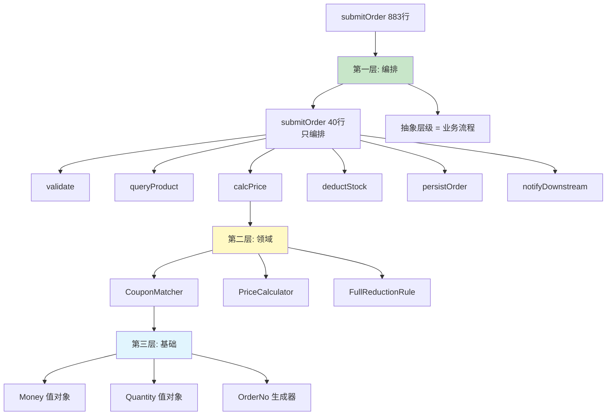
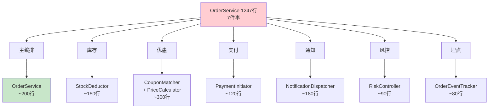

# 03.函数与职责大手术

> **本篇定位**：急诊科病例一·第二刀 · 面对 1247 行超级方法的第一次动刀。
>
> **剧情节点**：Day 9-15——老陈让小李把 `submitOrder` 拆成"能读懂的样子"，团队第一次感受到 SRP（单一职责）的力量。
>
> **本篇病人**：P-001 OrderMonolith——继续深挖，从命名下探到函数与类。
>
> **承接经典**：《代码整洁之道》Ch3 函数 · Ch10 类 / Fowler《重构》Ch6 提炼函数 · Ch7 搬移特性 / Uncle Bob 的 SRP 论述。
>
> **本篇病案编号范围**：F01-F20（函数类全套） + C01-C08（类设计前半部分）

---

#### 目录介绍

- [1. 急诊病例](#1-急诊病例)
  - [1.1 超级方法登场](#11-超级方法登场)
  - [1.2 体检数据全览](#12-体检数据全览)
  - [1.3 七件事上帝类](#13-七件事上帝类)
  - [1.4 本篇待答疑问](#14-本篇待答疑问)
  - [1.5 一句话回顾](#15-一句话回顾)
  - [1.6 核心要点](#16-核心要点)
  - [1.7 常见误区](#17-常见误区)
  - [1.8 带走清单](#18-带走清单)
- [2. 病理诊断](#2-病理诊断)
  - [2.1 函数七大坏味](#21-函数七大坏味)
  - [2.2 记忆四卡口诀](#22-记忆四卡口诀)
  - [2.3 病案卡片精选](#23-病案卡片精选)
  - [2.4 类类坏味登记](#24-类类坏味登记)
  - [2.5 一句话回顾](#25-一句话回顾)
  - [2.6 核心要点](#26-核心要点)
  - [2.7 常见误区](#27-常见误区)
  - [2.8 带走清单](#28-带走清单)
- [3. 病因追溯](#3-病因追溯)
  - [3.1 三年演化史](#31-三年演化史)
  - [3.2 五问归因链](#32-五问归因链)
  - [3.3 组织级代价](#33-组织级代价)
  - [3.4 一句话回顾](#34-一句话回顾)
  - [3.5 核心要点](#35-核心要点)
  - [3.6 常见误区](#36-常见误区)
  - [3.7 带走清单](#37-带走清单)
- [4. 治疗方案总纲](#4-治疗方案总纲)
  - [4.1 拆分三层地图](#41-拆分三层地图)
  - [4.2 抽象层级原则](#42-抽象层级原则)
  - [4.3 Stepdown 示范](#43-stepdown-示范)
  - [4.4 一句话回顾](#44-一句话回顾)
  - [4.5 核心要点](#45-核心要点)
  - [4.6 常见误区](#46-常见误区)
  - [4.7 带走清单](#47-带走清单)
- [5. 住院医查房](#5-住院医查房)
  - [5.1 提炼函数四步](#51-提炼函数四步)
  - [5.2 参数对象手法](#52-参数对象手法)
  - [5.3 布尔参数拆分](#53-布尔参数拆分)
  - [5.4 一句话回顾](#54-一句话回顾)
  - [5.5 核心要点](#55-核心要点)
  - [5.6 常见误区](#56-常见误区)
  - [5.7 初级带走清单](#57-初级带走清单)
- [6. 主治查房](#6-主治查房)
  - [6.1 类的职责边界](#61-类的职责边界)
  - [6.2 拆类四维决策](#62-拆类四维决策)
  - [6.3 富领域模型](#63-富领域模型)
  - [6.4 一句话回顾](#64-一句话回顾)
  - [6.5 核心要点](#65-核心要点)
  - [6.6 常见误区](#66-常见误区)
  - [6.7 高级带走清单](#67-高级带走清单)
- [7. 主任查房](#7-主任查房)
  - [7.1 SRP 组织映射](#71-srp-组织映射)
  - [7.2 康威定律双向](#72-康威定律双向)
  - [7.3 三层部署方法](#73-三层部署方法)
  - [7.4 一句话回顾](#74-一句话回顾)
  - [7.5 核心要点](#75-核心要点)
  - [7.6 常见误区](#76-常见误区)
  - [7.7 架构带走清单](#77-架构带走清单)
- [8. 术后康复曲线](#8-术后康复曲线)
  - [8.1 圈复杂度曲线](#81-圈复杂度曲线)
  - [8.2 可测性变化](#82-可测性变化)
  - [8.3 一句话回顾](#83-一句话回顾)
  - [8.4 核心要点](#84-核心要点)
  - [8.5 常见误区](#85-常见误区)
  - [8.6 带走清单](#86-带走清单)
- [9. 病案归档](#9-病案归档)
  - [9.1 F 系列全表](#91-f-系列全表)
  - [9.2 C 系列全表](#92-c-系列全表)
  - [9.3 关联病案索引](#93-关联病案索引)
  - [9.4 一句话回顾](#94-一句话回顾)
  - [9.5 归档要点](#95-归档要点)
- [10. 综合案例串讲](#10-综合案例串讲)
  - [10.1 八疑问回收](#101-八疑问回收)
  - [10.2 拆分演进史](#102-拆分演进史)
  - [10.3 设计哲学回扣](#103-设计哲学回扣)
  - [10.4 速查一图流](#104-速查一图流)
  - [10.5 全文快速回顾](#105-全文快速回顾)
  - [10.6 核心要点串联](#106-核心要点串联)
  - [10.7 常见误区汇总](#107-常见误区汇总)
  - [10.8 带走清单总表](#108-带走清单总表)

---

## 1. 急诊病例

### 1.1 超级方法登场

Day 9，命名手术完成第二天，团队看着变量名"顺眼"了不少。但真正的巨兽还没动过——**`submitOrder()`，883 行的单方法**。

老陈把它投在大屏上，滚动条从头拉到尾用了 **20 秒**。他在白板上画了一张地图：

```
┌────────────────────────────────────────────────────────────┐
│  submitOrder(long uid, long pid, int q, double p, ...)     │
│  ─────────────────────────────────────────────  Line       │
│  Step 1: 参数校验 (14 个 if)                    1-52       │
│  Step 2: 查商品                                 53-97      │
│  Step 3: 判断商品类型走不同分支                  98-158     │
│  Step 4: 库存检查+扣减                           159-234    │
│  Step 5: 优惠券匹配（内嵌 47 个 else if）        235-402    │
│  Step 6: 满减/满赠计算                           403-478    │
│  Step 7: 计算最终价格                           479-521    │
│  Step 8: 生成订单号                              522-543    │
│  Step 9: 写订单主表 + 明细表 + 日志表             544-621    │
│  Step 10: 发消息给下游 7 个系统                   622-698    │
│  Step 11: 触发风控 / 反欺诈                      699-742    │
│  Step 12: 发短信 + 推送                          743-798    │
│  Step 13: 埋点 + 打日志                          799-841    │
│  Step 14: 返回值组装（3 种返回结构）              842-883    │
└────────────────────────────────────────────────────────────┘
```

**14 个步骤、7 件事、883 行、圈复杂度 68**——这一个方法承担了整个订单流程。

老陈说："**这不是一个方法。这是一部小说。而且是没标点符号的小说。**"

### 1.2 体检数据全览

再做一次基础体检，这次聚焦函数与类：

| 指标 | 现状 | 健康值 | 严重度 |
|---|---|---|---|
| 最长方法行数 | 883 | ≤ 40 | 🔴 22× |
| 圈复杂度峰值 | 68 | ≤ 10 | 🔴 6.8× |
| 认知复杂度峰值 | 142 | ≤ 15 | 🔴 9.5× |
| 参数数最大值 | 14 | ≤ 4 | 🔴 3.5× |
| 嵌套最深层数 | 8 | ≤ 3 | 🔴 2.7× |
| 局部变量数最大 | 47 | ≤ 7 | 🔴 6.7× |
| 类的方法总数 | 118 | ≤ 20 | 🔴 5.9× |
| 类的字段总数 | 47 | ≤ 10 | 🔴 4.7× |
| 类的行数 | 1247 | ≤ 300 | 🔴 4.2× |
| 依赖服务/组件数 | 23 | ≤ 5 | 🔴 4.6× |

### 1.3 七件事上帝类

**OrderService 承担的职责清单**：

```
1. 订单主流程编排（本职）
2. 优惠券匹配与计算 ← 应属 CouponService
3. 库存扣减 ← 应属 StockService
4. 支付调起 ← 应属 PaymentService
5. 消息通知 ← 应属 NotificationService
6. 风控触发 ← 应属 RiskControlService
7. 埋点日志 ← 应属 EventTracker
```

——**七件事挤在一个类里，就是 God Class（上帝类）**。**每一件事**都在拉扯这段代码，**每一次上线**都要碰所有事的边界。

### 1.4 本篇待答疑问

带着 8 个问题往下读：

1. **①** 一个 883 行的方法，"提炼函数"到底从哪一行下手？
2. **②** 参数 14 个，直接改成 `Request` 对象就好了吗？会不会只是"表面拆分"？
3. **③** 抽象层级（Stepdown）到底是什么？为什么这么重要？
4. **④** SRP（单一职责）到底"一"是什么？细分到什么粒度才算够？
5. **⑤** God Class 拆分会不会引入过多小类，导致代码更难跟踪？
6. **⑥** 拆函数如何避免"性能变差"（多一层调用开销）？
7. **⑦** 康威定律说组织决定架构——是不是意味着不改组织就拆不了函数？
8. **⑧** 我一个初级工程师，敢不敢动 883 行的方法？

第 10.1 节全部回收。

### 1.5 一句话回顾

一个方法 883 行、承担 7 件事、被 7 个团队从 7 个方向拉扯——这就是本篇要动的巨兽。

### 1.6 核心要点

- **体量**：单方法 883 行、单类 1247 行、CC 峰值 68——十项体检指标全部超标 3-22 倍
- **结构**：14 个业务步骤挤在一个函数中，缺少任何抽象层级
- **职责**：一个类担 7 件事，命中 God Class 反模式（C01）
- **组织**：7 个团队围绕一段代码开发，天然产生排队与冲突

### 1.7 常见误区

- ❌ "只要方法能跑就行，长一点没关系"——长度是圈复杂度的先行指标，长必然带来复杂
- ❌ "上帝类只是命名问题，改个名就好"——问题在职责边界不清，改名治标不治本
- ❌ "拆一半再拆一半就好"——没有明确拆分维度，会拆成"更多的小上帝类"

### 1.8 带走清单

- [ ] 在你项目里 grep 一遍 `>200 行` 的方法列表——先知道存量有多重
- [ ] 找一个最长方法，画一张类似 1.1 的"步骤地图"——一眼看出承担了几件事
- [ ] 把体检指标（长度/CC/参数/嵌套）加入到 SonarQube 或 CI 门禁

---

## 2. 病理诊断

### 2.1 函数七大坏味

`submitOrder` 一个方法同时得了**七大类函数病**——这也是 Clean Code Ch3 的经典分类：

```
┌──────────────────────────────────────────────────┐
│           函数类坏味道 · 七大类                  │
├──────────────────────────────────────────────────┤
│  A. 过长类 (Too Long)                            │
│     └─ F01 超长函数 (>40 行)                     │
│                                                  │
│  B. 参数类 (Parameter)                           │
│     ├─ F02 长参列表 (>3 个参数)                  │
│     ├─ F03 布尔参数 (flag argument)              │
│     └─ F04 输出参数 (out param)                  │
│                                                  │
│  C. 副作用类 (Side Effect)                       │
│     ├─ F05 隐藏副作用 (getX() 却写库)            │
│     └─ F06 命令查询混淆 (CQS 违反)               │
│                                                  │
│  D. 抽象层级类 (Abstraction Level)               │
│     ├─ F07 层级混杂 (高低层混在一起)             │
│     └─ F08 逐步下探失败 (无 stepdown)            │
│                                                  │
│  E. 依赖类 (Dependency)                          │
│     ├─ F09 依赖过多 (>5 个外部)                  │
│     ├─ F10 依赖具体类 (不依赖抽象)               │
│     └─ F11 隐藏依赖 (方法内 new 出来)            │
│                                                  │
│  F. 复杂度类 (Complexity)                        │
│     ├─ F12 深嵌套 (>3 层)                        │
│     ├─ F13 高圈复杂度 (>10)                      │
│     ├─ F14 高认知复杂度 (>15)                    │
│     └─ F15 局部变量过多 (>7)                     │
│                                                  │
│  G. 意图类 (Intent)                              │
│     ├─ F16 无意图命名 (handle/process)           │
│     ├─ F17 承担多种职责 (混合逻辑)               │
│     ├─ F18 死代码 (Never called branch)          │
│     ├─ F19 重复代码 (near-duplicate)             │
│     └─ F20 神秘常量 (Magic Number)               │
└──────────────────────────────────────────────────┘
```

### 2.2 记忆四卡口诀

**关键洞察**：**七大类可以按"读的时候在哪一步卡住"来记忆**——

- A、G 类让你**读不完**（太长、无重点）
- B、D 类让你**读不懂**（层级乱、参数糊）
- C、E 类让你**改不敢改**（副作用、依赖爆炸）
- F 类让你**测不出来**（复杂度过高）

**四卡口诀**：**读不完 / 读不懂 / 改不敢 / 测不出**——PR 评审时按这四问过一遍，命中任意一条就该拆。

### 2.3 病案卡片精选

选出 6 张核心病案卡片（其余 14 条汇总在 9.1）：

---

📋 **病案编号：F01** · 超长函数（Long Function）
- 🔍 主诉：`submitOrder()` 883 行
- 🩺 检查：超长函数在项目里 12 个（>200 行），最长 883
- 💊 处方：Extract Function（提炼函数，重构 6.1）分层拆解
- 📖 出处：《重构》6.1 · 《代码整洁之道》Ch3 "第一条规则：函数应该短小"
- 🔗 关联：F13、F14、C01

📋 **病案编号：F02** · 长参列表（Long Parameter List）
- 🔍 主诉：14 个参数，调用者靠位置传值
- 🩺 检查：3 个方法参数 ≥ 10；47 个方法参数 ≥ 5
- 💊 处方：Introduce Parameter Object（引入参数对象，重构 6.8）
- 📖 出处：《重构》6.8 / Clean Code Ch3 "参数越少越好"
- 🔗 关联：F03、C02

📋 **病案编号：F03** · 布尔参数（Flag Argument）
- 🔍 主诉：`submitOrder(..., boolean isVip, boolean skipRisk, boolean async)`
- 🩺 检查：22 个方法含布尔参数
- 💊 处方：Split Function（拆分函数）——`submitOrderForVip()` / `submitOrderAsync()`
- 📖 出处：《代码整洁之道》Ch3 "标识参数"
- 🔗 关联：F17

📋 **病案编号：F07** · 抽象层级混杂（Mixed Abstraction）
- 🔍 主诉：同一个方法里一会儿写 `if (order.getStatus() == 3)`（低层）一会儿写 `notifyDownstream(order)`（高层）
- 🩺 检查：几乎所有超长方法都有此问题
- 💊 处方：按 Stepdown 原则重排——高层调用 → 低层辅助函数
- 📖 出处：《代码整洁之道》Ch3 "自顶向下阅读代码：向下规则"
- 🔗 关联：F01、F16

📋 **病案编号：F13** · 高圈复杂度（High Cyclomatic Complexity）
- 🔍 主诉：`submitOrder()` 圈复杂度 68
- 🩺 检查：项目里 8 个方法 CC>30
- 💊 处方：Replace Conditional with Polymorphism（以多态取代条件式，第 05 篇详解）
- 📖 出处：McCabe 1976 · Fowler《重构》Ch10
- 🔗 关联：F14、第 05 篇

📋 **病案编号：F17** · 多职责函数（Multi-Responsibility）
- 🔍 主诉：一个 submitOrder 做 7 件事
- 🩺 检查：项目里 5 个方法承担 5+ 职责
- 💊 处方：Extract Class（提炼类，重构 7.1）+ 编排层
- 📖 出处：《代码整洁之道》Ch3 · Uncle Bob SRP
- 🔗 关联：C01（God Class）

---

### 2.4 类类坏味登记

**类类坏味道 C01-C08 简登记**（详解见 6.1 节）：

| 编号 | 病名 | 一句话诊断 |
|---|---|---|
| C01 | God Class（上帝类） | 一个类干所有事，字段/方法过多 |
| C02 | Data Class（贫血类） | 只有 getter/setter，无行为 |
| C03 | 模糊类名 Helper/Manager | 类名说不清职责 |
| C04 | Feature Envy（依恋情结） | 方法频繁访问别的类的数据 |
| C05 | 继承误用 | 用继承实现"复用"而非"is-a" |
| C06 | 过大接口（Fat Interface） | 接口 20+ 方法，实现类只用几个 |
| C07 | 循环依赖 | A→B→A 或更长的环 |
| C08 | Middle Man（中间人） | 一个类只做转发，无自己逻辑 |

### 2.5 一句话回顾

`submitOrder` 一个方法同时命中函数七大类坏味，`OrderService` 一个类同时命中类八大类坏味——诊断结论是"多脏器功能衰竭"。

### 2.6 核心要点

- **七大类记忆**：过长 / 参数 / 副作用 / 层级 / 依赖 / 复杂度 / 意图
- **四卡口诀**：读不完 / 读不懂 / 改不敢 / 测不出
- **病案编号**：F01-F20（函数类 20 条）+ C01-C08（类类 8 条）
- **精选卡片**：F01/F02/F03/F07/F13/F17 是本篇最常见的六条

### 2.7 常见误区

- ❌ "把 F 系列全背下来"——不用背，用四卡口诀过 PR 就够
- ❌ "只关注 F01 长度"——F03 布尔参数、F07 层级混杂比长度更影响可读性
- ❌ "C 系列等以后再看"——类拆分是函数拆分的方向盘，不看类，函数拆完还是乱

### 2.8 带走清单

- [ ] 把 F01-F20 与 C01-C08 打成一张小抄贴在工位
- [ ] 团队每周挑一条坏味当"本周主题"专项治理
- [ ] CR 时引用编号——"这里违反 F13"，比"我觉得复杂"有据可依

---

## 3. 病因追溯

### 3.1 三年演化史

**疑惑**：为什么一个方法会长到 883 行？没人拦着？

**论证**：追 Git 记录 3 年：

```
2021-03  submitOrder 诞生：120 行，3 个参数    (初版)
2021-08  加优惠券：+80 行 → 200 行             (业务需求)
2022-02  加大促满减：+150 行 → 350 行          (业务需求)
2022-09  加会员价：+90 行 → 440 行              (业务需求)
2023-03  加秒杀特殊分支：+180 行 → 620 行       (业务需求)
2023-08  加新渠道埋点：+70 行 → 690 行          (业务需求)
2024-01  加风控前置：+90 行 → 780 行            (业务需求)
2024-06  加异步通知：+103 行 → 883 行           (业务需求)
```

**每一次都是"业务需求"**——但每一次都选择了**"在原方法里改"而不是"抽出新方法"**。三年后，回头看，没有任何一次改动应该在这里发生。

### 3.2 五问归因链

**5 个 Why**：

1. Q：为什么每次都在原方法里改？
   A：因为改动小、方便，"reviewer 也没说不行"。
2. Q：为什么 reviewer 不说？
   A：因为 reviewer 也看不懂 883 行的方法，只能看 diff 的 20 行。
3. Q：为什么 reviewer 只看 diff 20 行？
   A：因为团队 CR 文化只看"这次改动"，不看"这个方法整体"。
4. Q：为什么不看整体？
   A：看不过来。7 个人的团队每天 30+ 个 PR。
5. Q：为什么不建 CR 卡点？
   A：**建卡点是架构师的事，架构师太忙。**

**结论**：**函数变长是"每次都最省事"的累加**——没有任何一次"变坏"是不合理的，但结果就是不可维护。

### 3.3 组织级代价

Uncle Bob 的 SRP 原话：**"一个模块应该有且只有一个引起变化的原因。"**

那么 `submitOrder` 有多少个"引起变化的原因"？

| 变化来源 | 半年变更次数 | 谁提的 |
|---|---|---|
| 优惠券规则调整 | 34 次 | 营销团队 |
| 库存策略调整 | 12 次 | 供应链 |
| 支付方式接入 | 8 次 | 财务 |
| 风控规则调整 | 21 次 | 风控团队 |
| 消息通知调整 | 15 次 | 增长团队 |
| 埋点变动 | 43 次 | 数据团队 |
| 订单主流程变更 | 10 次 | 产品团队 |
| **合计** | **143 次** | **7 个团队** |

**触目惊心**：**同一个方法，被 7 个团队从 7 个方向牵扯**——每个团队改的时候都要读一遍 883 行、都要担心把别人的逻辑改坏。

这就是 SRP 缺失的**组织级代价**——**它把 7 个团队的协作串行化了**。

**结论**：**函数拆分不只是代码问题，是组织并行度问题**——每一次 SRP 违反，都在给团队戴上一个"必须协调 7 方才能动的枷锁"。

### 3.4 一句话回顾

坏代码不是一次写坏的，是三年 143 次"每次都最省事"累加出来的；受害的不是代码，是 7 个团队的并行度。

### 3.5 核心要点

- **演化**：120 → 883 行的每一步都合理，累加起来必然不合理
- **归因**：5-Why 追到最深处是"CR 文化只看 diff"，而非"个人能力不够"
- **代价**：SRP 违反 = 组织并行度损失，143 次变更 = 7 团队串行冲突
- **量化**：用变更次数 × 团队数把"应该拆"翻译成"数字上必须拆"

### 3.6 常见误区

- ❌ "写代码的人不用心"——追根究底是流程问题，不是人的问题
- ❌ "多招 reviewer 就好"——若 CR 文化只看 diff，加人也没用
- ❌ "SRP 就是拆到不能再拆"——SRP 的"一"指的是变化来源，不是行数

### 3.7 带走清单

- [ ] 对项目里最长的 3 个方法各写一份 5-Why 归因链
- [ ] 用 Git 打一份"变化来源 vs 变更次数"表——量化 SRP 违反
- [ ] 把"每次 PR 至少提炼一个函数"写进团队约定

---

## 4. 治疗方案总纲

### 4.1 拆分三层地图

老陈画了拆分总图：



**三层拆分**：

| 层级 | 职责 | 单个函数体量 | 示例 |
|---|---|---|---|
| **编排层** | 只做流程调度，不算逻辑 | ≤ 40 行 | `submitOrder`, `refundOrder` |
| **领域层** | 承载业务规则 | ≤ 20 行 | `PriceCalculator.calculate()` |
| **基础层** | 值对象、纯函数 | ≤ 10 行 | `Money.add()`, `Quantity.of()` |

### 4.2 抽象层级原则

**疑惑**：什么叫"抽象层级"？为什么 Uncle Bob 说这是函数的第二条规则？

Clean Code Ch3：**"函数中的语句应该属于同一抽象层级"**。一段代码里如果既出现"业务动词"（如 `notifyDownstream`）又出现"HTTP 细节"（如 `HttpClient.send`），就是层级混杂——**读者永远搞不清自己在哪一层**。

**层级判定三问**：

1. 这行代码是**业务动词**（`refund`）还是**技术动词**（`send`）？
2. 这行代码是**决策**（`if status == PAID`）还是**执行**（`update table`）？
3. 这行代码你会**跟产品讲**（业务规则）还是**跟运维讲**（技术细节）？——不一致就是混杂。

### 4.3 逐层降原则

```java
// ⚠️ Before：三个抽象层级挤在一个方法里
public String submitOrder(...) {
    if (order.getStatus() == 3) {           // 层级 3：底层——判断状态码
        String url = "http://" + hostConfig.get("payment").get("host");
        HttpClient c = HttpClient.newBuilder().timeout(...).build();
        c.send(HttpRequest.newBuilder().uri(URI.create(url)).build(), ...);
                                            // 层级 3：底层——HTTP 细节
        notifyDownstream(order);            // 层级 1：高层——业务动作
    }
}

// ✅ After：Stepdown 原则——每个方法内部只出现"下一层"
public String submitOrder(...) {           // 层级 1
    validate(...);                          // 层级 2
    Order order = create(...);              // 层级 2
    deductStock(order);                     // 层级 2
    pay(order);                             // 层级 2
    notifyDownstream(order);                // 层级 2
    return order.getNo();
}

private void pay(Order order) {            // 层级 2
    if (order.isPaid()) return;             // 层级 3
    paymentClient.charge(order.toPaymentRequest());  // 层级 3
}
```

**Stepdown 原则**：**读方法时，就像从楼梯的顶端一步一步走下来——每一步只下降一级抽象**。

- 顶层读者：只看 `submitOrder`，知道订单流程有 5 步。
- 中层读者：点进 `pay`，看到支付内部的 2 步。
- 底层读者：点进 `paymentClient.charge`，看到 HTTP 细节。

**结论**：Stepdown 是"**代码的目录页**"——就像书有章节标题、小节标题、正文——每一层单独可读。

### 4.4 一句话回顾

治疗总纲两句话：**三层拆分**（编排/领域/基础）定"垂直方向"，**Stepdown 原则**定"每层内部的可读顺序"。

### 4.5 核心要点

- **三层地图**：编排 40 行 → 领域 20 行 → 基础 10 行
- **抽象层级**：一个函数体内只该出现"下一层"
- **业务/技术分层**：能跟产品讲的和能跟运维讲的不写在一起
- **可读性指标**：读者能"停在自己想停的层"

### 4.6 常见误区

- ❌ "编排层加两行判断也无所谓"——一行都不加，一加就层级混杂
- ❌ "只要拆得够短就够了"——不看层级，只看长度，拆成小小上帝类
- ❌ "Stepdown 就是自顶向下写代码"——它是自顶向下**阅读**代码的支撑

### 4.7 带走清单

- [ ] 找一个 100+ 行的方法，先给它画"层级示意图"再拆
- [ ] 每个函数写完自问"这里有几种抽象层级？"——超过 1 就要 stepdown
- [ ] 把"编排层不写业务规则"作为团队 CR 卡点

---

## 5. 住院医查房

> 🟢 **视角关注面**：一个方法内部——如何**安全地**从 883 行拆到 40 行。

### 5.1 提炼函数四步

**手法演示 · Extract Function**：

```java
// ⚠️ Before：一段可以提炼的库存扣减逻辑（第 159-234 行）
public String submitOrder(...) {
    // ... 前面 158 行 ...

    // Step 4: 库存检查+扣减
    Integer stock = stockMapper.selectByProductId(pid);
    if (stock == null) {
        log.error("stock not found for pid={}", pid);
        throw new RuntimeException("库存不存在");
    }
    if (stock < q) {
        log.warn("stock not enough, stock={}, q={}", stock, q);
        throw new RuntimeException("库存不足");
    }
    int result = stockMapper.deductStock(pid, q);
    if (result == 0) {
        log.error("deduct stock failed, pid={}", pid);
        throw new RuntimeException("扣减失败");
    }

    // ... 后面 649 行 ...
}
```

**四步提炼**：

1. **圈出**——用 IDE 选中 159-234 行代码
2. **命名**——给这段代码起一个"业务动作"名字：`deductStockOrThrow`
3. **抽出**——IDE Extract Method（快捷键 Ctrl+Alt+M / Cmd+Opt+M）
4. **验证**——编译通过 + 单测通过（此时应该已经有 UT 兜底，第 11 篇会讲）

```java
// ✅ After
public String submitOrder(...) {
    // ...
    deductStockOrThrow(pid, q);
    // ...
}

private void deductStockOrThrow(long productId, int quantity) {
    Integer stock = stockMapper.selectByProductId(productId);
    if (stock == null) throw new StockNotFoundException(productId);
    if (stock < quantity) throw new StockNotEnoughException(productId, stock, quantity);

    int affected = stockMapper.deductStock(productId, quantity);
    if (affected == 0) throw new StockDeductFailedException(productId);
}
```

**提炼原则 · 三看**：
- **看重复**：一段代码在 3 处以上重复出现——提炼
- **看长度**：一个方法 > 40 行——找可提炼的段
- **看注释**：注释说明"这段是干什么的"——注释里的名字就是新方法名

### 5.2 参数对象手法

**手法演示 · Introduce Parameter Object**：

```java
// ⚠️ Before：14 参数
public String submitOrder(long uid, long pid, int q, double price,
                          double discount, String couponCode,
                          int channelType, boolean isVip,
                          boolean skipRisk, boolean async,
                          String source, String requestId,
                          Long parentOrderId, Map extra) { ... }

// ✅ After：参数对象 + 拆函数
public record OrderRequest(
    UserId userId,
    ProductId productId,
    Quantity quantity,
    CouponCode couponCode,
    Channel channel,
    String requestId,
    Long parentOrderId
) {}

public OrderNo submitOrder(OrderRequest request) { ... }        // 主流程
public OrderNo submitOrderForVip(OrderRequest request) { ... }  // VIP 分支
public OrderNo submitOrderAsync(OrderRequest request) { ... }   // 异步分支
```

**注意**：**光把 14 参数塞进一个 Request 对象是不够的**——如果 Request 里还是 14 字段全都会用，那只是"把长参列表塞进结构体"，坏味道没治。真正的治理是：

1. 把"变化的参数"打包（`isVip`、`async` → 拆成不同方法）
2. 把"共变化的参数"打包（`uid + pid + q` → 一个 OrderRequest）
3. 用**值对象**代替原始类型（`UserId` 而非 `long`）

### 5.3 布尔参数拆分

**手法演示 · Remove Flag Argument**（F03 处方）：

```java
// ⚠️ Before：一个方法用布尔控制两种截然不同的行为
public OrderNo submitOrder(OrderRequest req, boolean async) {
    if (async) {
        return submitAsync(req);
    }
    return submitSync(req);
}

// ✅ After：拆两个方法，用命名表达意图
public OrderNo submitOrder(OrderRequest req)       { return submitSync(req); }
public CompletableFuture<OrderNo> submitOrderAsync(OrderRequest req) {
    return CompletableFuture.supplyAsync(() -> submitSync(req));
}
```

**判定标准**：一个布尔参数只要出现在"if 判断"里改变方法主流程，就应该拆。**如果它只是配置（比如 `caseSensitive=true`），可以保留**——但优先考虑用枚举或策略对象替代。

### 5.4 一句话回顾

住院医只干一件事：**在 IDE 里、一次一小段、把"注释里的名字"提炼成"方法的名字"**。

### 5.5 核心要点

- **Extract Function 四步**：圈出 → 命名 → 抽出 → 验证
- **三看原则**：看重复 / 看长度 / 看注释
- **参数对象三层**：分离变化参数 / 打包共变参数 / 用值对象替代原始类型
- **布尔参数**：影响主流程的布尔参数一律拆方法

### 5.6 常见误区

- ❌ "拆函数前不加测试就动手"——先兜测试网再拆，第 11 篇专讲
- ❌ "把 14 参数改成一个 Map"——Map 是"看不见字段的长参列表"，比长参更坏
- ❌ "提炼的私有方法用 `handle`/`process`"——直接命中 F16 无意图命名

### 5.7 初级带走清单

- [ ] 每写一个方法，先在纸上列出"这个方法要做几件事"——>1 件就拆
- [ ] 用 IDE 的 Extract Method 快捷键，每天至少练 3 次
- [ ] 消灭本 PR 里所有布尔参数（`isVip` 参数 → 拆两个方法）
- [ ] 消灭本 PR 里所有 ≥ 6 参数的方法
- [ ] 每次写完方法自问："能否用一句话说清这个方法做什么"——不能就再拆
- [ ] 每次改现有方法时，**先提炼函数，再改逻辑**（这样 diff 更小、review 更容易）

---

## 6. 主治查房

> 🟡 **视角关注面**：类的职责——一个方法拆完之后，方法应该归属到哪个类。

### 6.1 类的职责边界

**疑惑**：拆出来的方法留在原类，跟拆出去到新类，有什么区别？

拆函数只解决了"一个方法一件事"。但**如果所有拆出来的方法都还在 `OrderService` 里**，OrderService 依然是 1247 行的 God Class——只是内部变得整洁了。

**主治级判断三问**：

1. 方法是否**共享同一批字段**？共享 → 属于同一类；不共享 → 该分家。
2. 方法是否**被同一批外部调用者调用**？调用来源不同 → 该分家。
3. 方法是否**同频变化**？变化频率差 3 倍以上 → 该分家。

### 6.2 拆类四维决策

**Class-Level 拆分四问**（比 6.1 的三问更细化）：

1. **凝聚性问题**：这些方法**是不是围绕同一个数据/概念**？如果一些方法围绕"库存"，一些方法围绕"优惠券"——**它们不该在同一个类**。
2. **变化频率问题**：这些方法**是不是同频变化**？优惠券改动 34 次 / 半年，库存改动 12 次——**不同频**，应该拆开。
3. **依赖问题**：这些方法**用了哪些外部依赖**？用 `couponMapper` 的方法和用 `stockMapper` 的方法应该分家。
4. **变化来源问题**（回扣 3.2 节）：这些方法**由不同团队推动**？如果是——**必须拆**，否则七团队协作串行化。

**主治级的拆分决策**：



### 6.3 富领域模型

**Data Class（贫血类）→ 富领域模型（Rich Domain Model）**：

```java
// ⚠️ Before：贫血 Order（C02）
public class Order {
    private Long id;
    private BigDecimal amount;
    private int status;
    // + 47 个 getter/setter
}

// 业务规则散落在 OrderService（C01 God Class）
public class OrderService {
    public void refund(Long orderId) {
        Order order = orderMapper.get(orderId);
        if (order.getStatus() != 2) throw ...;
        if (order.getAmount().compareTo(BigDecimal.ZERO) <= 0) throw ...;
        if (Duration.between(order.getCreatedAt(), now()).toDays() > 30) throw ...;
        order.setStatus(9);
        // ... 又是几十行 ...
    }
}

// ✅ After：富领域模型
public class Order {
    private final OrderNo no;
    private Money amount;
    private OrderStatus status;
    private Instant createdAt;

    /** 领域规则封装在实体内 */
    public void refund() {
        if (!status.canRefund()) throw new IllegalOrderStateException(no, status);
        if (amount.isNotPositive()) throw new InvalidAmountException(amount);
        if (isRefundWindowExpired()) throw new RefundWindowExpiredException(no);
        this.status = OrderStatus.REFUNDED;
    }

    private boolean isRefundWindowExpired() {
        return Duration.between(createdAt, Instant.now()).toDays() > 30;
    }
}

// 应用服务变薄
public class OrderApplicationService {
    public void refund(OrderNo no) {
        Order order = orderRepository.findByNo(no);
        order.refund();                    // ← 业务规则由 Order 自己承担
        orderRepository.save(order);
    }
}
```

**主治级洞察**：**"数据 + 操作" 应该在同一个类里**——这是面向对象最古老的原则。贫血模型（C02）把数据和行为分开的做法，虽然在 2000 年代的 J2EE 时代很流行，但它必然导致 God Class 的应用服务层——**数据在一头，逻辑在另一头，中间要靠不断的贫血 DTO 来搬运**。

**Fowler 的原话**：**"贫血领域模型是一种反模式（Anti-Pattern）"**（[《贫血领域模型》博客 2003](https://martinfowler.com/bliki/AnemicDomainModel.html)）。

### 6.4 一句话回顾

主治干两件事：**用四维（凝聚/频率/依赖/来源）判"该拆哪几类"、用富领域模型把逻辑还给数据**。

### 6.5 核心要点

- **拆类四维**：凝聚性 / 变化频率 / 依赖差异 / 变化来源
- **贫血反模式**：数据在一头、逻辑在另一头 = 必然 God Class
- **富模型三件套**：值对象（Money/Quantity）+ 实体（Order）+ 应用服务（编排）
- **应用服务变薄**：Application Service 只编排，不写业务规则

### 6.6 常见误区

- ❌ "只按业务名词拆类"——业务名词只是维度之一，忽略变化频率/来源会拆错
- ❌ "所有 setter 都保留"——setter 是贫血模型的入口，能删就删
- ❌ "所有方法都放实体里"——**跨聚合根**的编排属于应用服务，不属于实体

### 6.7 高级带走清单

- [ ] 每次做类设计前，回答"这个类因为什么会变化"——只能有一个答案
- [ ] 用 4 个"共变化"指标（凝聚/频率/依赖/来源）判断类是否该拆
- [ ] 把业务规则从 Service 层下沉到实体/值对象——把 Data Class 变成 Rich Model
- [ ] 引入 Application Service 层——它只做编排，不含业务规则
- [ ] 建立"类字段数 ≤ 10 / 类方法数 ≤ 20 / 类行数 ≤ 300"的团队红线
- [ ] 在 CR 中引用编号——"这里违反 C01 God Class"

---

## 7. 主任查房

> 🔴 **视角关注面**：SRP 与组织结构的映射关系——**你的函数结构就是你的组织结构**。

### 7.1 SRP 组织映射

**疑惑**：一个函数拆分和公司组织有什么关系？

回扣 3.2 节的表格：**`submitOrder` 被 7 个团队从 7 个方向拉扯**。当我们把它拆成 7 个类后，发生了什么？

```
拆分前：
┌───────────────────────────────────────┐
│  OrderService.submitOrder             │
│  ─────────────────                    │
│  优惠券 ← 营销团队                     │  ─┐
│  库存   ← 供应链团队                   │   │
│  支付   ← 财务团队                     │   │  7 团队所有 PR
│  风控   ← 风控团队                     │   │  都要挤在一个方法上
│  通知   ← 增长团队                     │   │  串行冲突不断
│  埋点   ← 数据团队                     │   │
│  主流程 ← 产品团队                     │  ─┘
└───────────────────────────────────────┘

拆分后：
┌──────────────┐   ┌──────────────┐   ┌──────────────┐
│ CouponMatcher│   │ StockDeductor│   │ PaymentInit  │
│  营销团队 own │   │ 供应链 own    │   │ 财务 own      │
└──────────────┘   └──────────────┘   └──────────────┘
        ↑                  ↑                    ↑
        └──────────────────┼────────────────────┘
                           │
                  ┌────────▼────────┐
                  │  OrderService   │
                  │  产品团队 own    │
                  │  (只编排)        │
                  └─────────────────┘
```

**结果**：
- 营销团队和风控团队的 PR 从此**不再冲突**（改的是两个文件）
- 每个团队可以**独立发版自己那部分**（模块化+接口约定）
- CR 时**owner 变清晰**——CouponMatcher 的 PR 由营销团队 Tech Lead review

**这就是主任级的洞察——SRP 不是代码原则，是组织解耦原则**。

### 7.2 康威定律双向

Melvin Conway 1968 年的论断：**"系统的架构，倾向于映射设计它的组织的沟通结构。"**

这条定律有**双向影响**：

**正向**（组织 → 代码）：
- 团队结构 → 决定代码结构
- 例：优惠、库存、支付各一个团队 → 天然应该有 3 个模块

**反向**（代码 → 组织）：
- 代码结构 → 反过来固化组织
- 例：`submitOrder` 一个方法把 7 团队捆在一起 → 长期无法拆团队/无法招人

**关键洞察**：**代码的每一次"合并"都是组织的一次"耦合"**——反过来，**代码的每一次"拆分"都是组织的一次"松绑"**。所以架构师做代码结构调整时，**手里同时要拿着组织架构图**。

### 7.3 三层部署方法

**主任的三层部署**：

```
第三层 · 组织                → 让代码 owner 关系与团队一致
                              代码所有权登记表（CODEOWNERS 文件）
第二层 · 边界                → 用架构约束 + ArchUnit 测试保护边界
                              A 团队的代码不能直接依赖 B 团队的实体
第一层 · 代码                → SRP 拆分到方法/类粒度
                              见 5、6 章
```

**每层交付物**：

| 层级 | 交付物 | 生效方式 |
|---|---|---|
| 代码层 | 提炼函数 / 提炼类 | 每次 PR |
| 边界层 | ArchUnit 规则 / 依赖白名单 | CI 门禁 |
| 组织层 | CODEOWNERS / 团队 owner 表 | GitHub/GitLab 自动指派 |

### 7.4 一句话回顾

主任看的是"代码 = 组织"这条方程——**每一次函数拆分背后都是一次团队松绑**。

### 7.5 核心要点

- **SRP 组织映射**：函数拆分 = 团队解耦 = 并行度提升
- **康威定律双向**：组织决定代码、代码反过来固化组织
- **三层部署**：代码层 / 边界层 / 组织层
- **看代码时手里同时拿着组织架构图**

### 7.6 常见误区

- ❌ "组织不变代码就不能变"——恰恰相反，代码先动可以倒逼组织变革
- ❌ "架构调整只在架构评审做"——每个 PR 都在小尺度地影响架构
- ❌ "CODEOWNERS 是流程文件"——它是 SRP 的最后一道防线

### 7.7 架构带走清单

- [ ] 建立 `CODEOWNERS` 文件——每个包/类都有明确的 owner 团队
- [ ] 用 ArchUnit / Sonar 建立包依赖约束——A 团队的代码不能依赖 B 团队的实现
- [ ] 每季度做一次"代码结构 vs 组织结构对齐审计"
- [ ] 组织变动时**同步安排代码结构调整**（新团队成立 = 新模块拆出）
- [ ] 在类的注释里写明"变化来源"（哪个团队、什么业务）——**让下一位读者知道 owner**

---

## 8. 术后康复曲线

### 8.1 圈复杂度曲线

Day 9-15 每日进展：

| Day | 动作 | submitOrder 行数 | 圈复杂度 | 类总行数 |
|---|---|---|---|---|
| Day 9 | 起点 | 883 | 68 | 1247 |
| Day 10 | 提炼参数校验 | 831 | 62 | 1247 |
| Day 11 | 提炼库存扣减 | 758 | 55 | 1198 |
| Day 12 | 拆出 CouponMatcher | 610 | 42 | 947 |
| Day 13 | 拆出 PriceCalculator | 462 | 33 | 782 |
| Day 14 | 拆出 NotificationDispatcher | 291 | 27 | 573 |
| Day 15 | 拆出 EventTracker + 收尾 | **42** | **8** | **287** |

**7 天的成果**：
- `submitOrder` 883 → 42 行（**-95%**）
- 圈复杂度 68 → 8（**-88%**）
- 类行数 1247 → 287（**-77%**）
- 拆出 6 个新类，每个 80-300 行

### 8.2 可测性变化

拆分前后可测性对比：

| 测试维度 | Day 9 | Day 15 | 变化 |
|---|---|---|---|
| 可独立单测的单元数 | 1（整个 submitOrder） | 47（各方法+值对象） | **+46** |
| 单测搭建耗时 | 无法搭建 | 平均 8 分钟/个 | 从"不可能"到"可行" |
| 单测覆盖率 | 0% | 42%（临时目标） | **+42pp** |
| Mock 依赖数 | 23（全 Service 依赖） | 平均 3.2/个 | **-86%** |
| Flaky 测试数 | 无法评估 | 0 | 从零起步 |

**关键洞察**：**函数拆分带来的最大红利不是"好读"，是"可测"**——单元测试的第一前提是"**有可命名的行为单元**"，883 行的方法根本没有可测的单元。第 11 篇会详细讲测试的搭建。

### 8.3 一句话回顾

七天时间，一段 883 行的方法瘦成 42 行，可测单元从 1 个长到 47 个——**可测性才是拆分最大的红利**。

### 8.4 核心要点

- **主指标**：submitOrder 883 → 42 行（-95%）、CC 68 → 8（-88%）
- **可测性**：单元从 1 → 47、mock 依赖 -86%、UT 覆盖 0 → 42%
- **过程**：日均 -100~-150 行，节奏可持续
- **代价**：仅仅是"每次改动多写一个方法名"——ROI 极高

### 8.5 常见误区

- ❌ "拆完性能会变差"——JIT 会把方法调用内联，纳秒级开销可忽略
- ❌ "拆完调用栈更深不好排查"——现代 IDE / 观测栈都能一键跳转
- ❌ "覆盖率一下涨太多有假"——**先有可测单元，再看覆盖率**，见第 08 篇

### 8.6 带走清单

- [ ] 每次重构都记录"三个数字"：行数 / CC / 覆盖率——把康复曲线画出来
- [ ] 拆完立刻补 UT——趁着上下文最清晰
- [ ] 用 SonarQube 看趋势，而非绝对值

---

## 9. 病案归档

### 9.1 F 系列全表

**F 系列（本篇新增 20 条）**：

| 编号 | 病名 | 处方 |
|---|---|---|
| F01 | 超长函数 | Extract Function |
| F02 | 长参列表 | Introduce Parameter Object |
| F03 | 布尔参数 | Split Function |
| F04 | 输出参数 | 返回值+值对象 |
| F05 | 隐藏副作用 | CQS 分离 |
| F06 | 命令查询混淆 | CQS 分离 |
| F07 | 抽象层级混杂 | Stepdown |
| F08 | 逐步下探失败 | Extract + Stepdown |
| F09 | 依赖过多 | Extract Class |
| F10 | 依赖具体类 | 依赖倒置 |
| F11 | 隐藏依赖 | 构造注入 |
| F12 | 深嵌套 | Guard Clause / Extract |
| F13 | 高圈复杂度 | 多态取代条件 |
| F14 | 高认知复杂度 | 拆分+命名 |
| F15 | 局部变量过多 | Extract + 参数对象 |
| F16 | 无意图命名 | Rename Method |
| F17 | 多职责函数 | Extract Class |
| F18 | 死代码 | 删除 + Git 保存 |
| F19 | 重复代码 | Extract + 复用 |
| F20 | 神秘常量 | Named Constant / Enum |

### 9.2 C 系列全表

**C 系列（本篇新增 C01-C08）**：见 2.4 节表格；C09-C18 在第 10 篇补齐。

### 9.3 关联病案索引

| 关联病案 | 关联理由 | 出现篇 |
|---|---|---|
| N01/N12/N14 | 函数拆分伴随命名重整 | 第 02 篇 |
| E01-E10 | 拆函数后错误处理需要重设计 | 第 04 篇 |
| C09-C18 | 类设计后半部分 | 第 10 篇 |
| A01-A03 | 康威定律、模块边界 | 第 13 篇 |
| T04 | 拆函数是可测性的前提 | 第 11 篇 |

### 9.4 一句话回顾

本篇合计新增 28 条编号（F01-F20 + C01-C08），全部登记入册，是全专栏的函数/类字典。

### 9.5 归档要点

- **F 系列**按七大类记忆，覆盖函数所有典型病
- **C 系列**本篇只发前 8 条，另 10 条在第 10 篇（重构手法篇）配套发出
- **交叉引用**：每次 CR 引用编号，比"我觉得"更有据可依

---

## 10. 综合案例串讲

### 10.1 八疑问回收

回收 1.4 节 8 疑问：

- **① 883 行从哪里下手？** —— 见 5.1 三看原则：**看重复 / 看长度 / 看注释**。第一刀砍在"有注释的段落"最省事——注释里的名字就是新方法名。
- **② 参数 14 个改成 Request 对象够吗？** —— 不够。见 5.2：需要三层动作——分离变化的参数（isVip/async 拆方法）、打包共变的参数（uid/pid 打包）、用值对象替代原始类型。
- **③ Stepdown 是什么？** —— 见 4.2/4.3：每个方法内部只出现"下一层"抽象。让不同深度的读者停在自己需要的层。
- **④ SRP 的"一"指什么？** —— 见 3.3 + 7.1：**引起变化的一个原因 = 一个业务团队/一个变化维度**。7 团队 = 7 个类。
- **⑤ 拆完会不会更难跟踪？** —— 会，如果拆得没章法。用 4.1 三层地图（编排/领域/基础）+ Stepdown 让层级清晰。
- **⑥ 性能会变差吗？** —— JIT 之后方法调用开销可忽略（Java、Go 都是纳秒级 vs 业务函数的微秒级）。真正的性能优化在 IO / 数据库层，不在函数层。
- **⑦ 康威定律的双向？** —— 见 7.2：组织决定代码结构，代码也会固化组织。**改代码必须同步看组织。**
- **⑧ 初级敢不敢动 883 行？** —— 敢，但要走 5.1 的"提炼函数"路径——一次只动一段，IDE 保驾护航；不敢一次改全部就分 20 个 PR。

### 10.2 拆分演进史

7 天的时间轴：

```
Day 9 · 上午   ─ 老陈画拆分总图（4.1）
Day 9 · 下午   ─ 团队开对齐会——每个类的 owner 确定到人
Day 10 · 全天  ─ 提炼参数校验 → validateOrThrow(request)
Day 11 · 全天  ─ 提炼库存扣减 → StockDeductor
                  同时补 3 个 UT（首次单元测试进代码库！）
Day 12 · 全天  ─ 拆出 CouponMatcher 到独立类
                  同时把 47 个 else if 保留（第 05 篇专治）
Day 13 · 全天  ─ 拆出 PriceCalculator + Money 值对象
Day 14 · 全天  ─ 拆出 NotificationDispatcher（异步通知）
Day 15 · 上午  ─ 拆出 EventTracker + 收尾
Day 15 · 下午  ─ Code Review + 灰度发布
Day 15 · 晚上  ─ 老陈发了一条朋友圈：
                  "883 → 42。这是我这一年做的最爽的一件事。"
```

**里程碑**：Day 15 结束时，`submitOrder` 只剩下这样一段：

```java
public OrderNo submitOrder(OrderRequest request) {
    validateOrThrow(request);
    Product product = productQueryService.query(request.productId());
    stockDeductor.deductOrThrow(product, request.quantity());
    Order order = orderFactory.create(request, product);
    Money price = priceCalculator.calculate(order);
    order.setPrice(price);
    orderRepository.save(order);
    notificationDispatcher.notifyAll(order);
    orderEventTracker.trackSubmitted(order);
    return order.getNo();
}
```

**42 行、10 个动作、每一行都是业务动词**——**这才是编排层该有的样子**。

### 10.3 设计哲学回扣

从本篇沉淀出**跨篇适用的两条设计哲学**：

**哲学 · 边界即防线**

> 每次拆分（函数拆函数、类拆类、模块拆模块）都在划一条**防线**。防线越清晰，一次故障波及的范围越小、恢复速度越快、并行开发的团队越多。**边界是防线，也是解耦，也是并发。**

**哲学 · 重构即呼吸**

> 别把重构当"专门排期"的事。每个 PR 都可以带一次微重构——**先提炼函数，再改逻辑**，这样 diff 更小、review 更好过、风险更低。**当重构变成呼吸的一部分，代码就再也不会累积到 883 行。**

### 10.4 速查一图流

**函数/类速查一图流**：

| 病征 | 编号 | 处方 |
|---|---|---|
| 方法 > 40 行 | F01 | Extract Function |
| 参数 > 3 | F02 | Parameter Object |
| 布尔参数 | F03 | Split Function |
| 抽象混杂 | F07 | Stepdown |
| CC > 10 | F13 | 多态取代条件（见 05 篇） |
| 一方法多职责 | F17 | Extract Class |
| 一类多职责 | C01 | 按变化来源拆类 |
| 只有 getter/setter | C02 | 富领域模型 |
| 类名 Helper/Manager | C03 | 按职责改名（见 02 篇 N12） |

**Stepdown 三层记忆**：编排（40 行）→ 领域（20 行）→ 基础（10 行）

### 10.5 全文快速回顾

**十章一图流**：

```
1 急诊病例  → 883 行 / CC 68 / 七件事上帝类
2 病理诊断  → 函数七大坏味 + 类八大坏味 = 28 条编号
3 病因追溯  → 三年演化 / 5-Why / 组织级代价（7 团队串行）
4 治疗总纲  → 三层地图（编排/领域/基础）+ Stepdown
5 住院医    → Extract 四步 + 参数对象 + 布尔拆分
6 主治       → 拆类四维 + 富领域模型
7 主任       → SRP=组织解耦 + 康威双向 + 三层部署
8 术后曲线  → 883→42（-95%）、CC 68→8（-88%）、UT 单元 1→47
9 病案归档  → F01-F20 + C01-C08 全表
10 案例串讲 → 疑问回收 + 演进史 + 哲学 + 速查表
```

### 10.6 核心要点串联

三视角一句话总结：

- 🟢 **住院医**：一次一小段、注释即方法名、IDE 保驾护航
- 🟡 **主治**：类的四维（凝聚/频率/依赖/来源）+ 富领域模型
- 🔴 **主任**：SRP 不是代码原则是组织原则，拆代码 = 松绑组织

**贯穿主线**：函数 → 类 → 模块 → 组织——同一条 SRP 定律在四个尺度上都成立。

### 10.7 常见误区汇总

跨章节的高频误区最后统一提醒：

- ❌ "拆函数就是拆行数"——真正在拆的是抽象层级和职责
- ❌ "拆函数会牺牲性能"——JIT / 编译器早已内联，性能不是问题
- ❌ "拆之前先想清楚"——想不清楚就先小拆，边拆边发现
- ❌ "拆一半停下"——留下的部分反而更难懂，宁可 revert 也别中途停
- ❌ "拆是架构师的事"——每个 PR 都是拆的机会，"先提炼函数，再改逻辑"

### 10.8 带走清单总表

**初级 6 条**：见 5.7  
**高级 6 条**：见 6.7  
**架构 5 条**：见 7.7

再加**跨视角 3 条**：

- [ ] 团队约定：**PR 里禁止新增 > 40 行方法**（除非 revert）
- [ ] 每周挑一个最长方法做"公开解剖"（15 分钟直播式重构）
- [ ] 把 "重构即呼吸" 写进团队价值观——每 PR 附一次微重构

---

**练习题**：找一个你项目里 200+ 行的方法，用 Extract Method 拆到 40 行以内。**记录三个数据**：
1. 拆分前后的方法行数
2. 拆分过程中发现了多少个"注释就是方法名"的段落
3. 拆分完成后，圈复杂度的变化

**下集预告**：拆完的 `submitOrder` 变干净了。但每个新拆出来的方法里，都埋着一个更凶险的东西——**`catch (Exception e) { log.error(...) }` 或者干脆 `catch (Exception e) { }`**。38 处泛捕获，任何一处都可能吞掉致命异常。第 04 篇《错误与边界》即将开始。

---

> 📌 **[本篇一句话]** 函数拆分不是代码问题，是团队并行度问题——SRP 每违反一次，7 个团队就少一次并行工作的机会。

**上一篇 ←** [第 02 篇 · 命名与意图的战场](/pages/quality-02/) ｜ **下一篇 →** [第 04 篇 · 错误与边界的防线](/pages/quality-04/)
