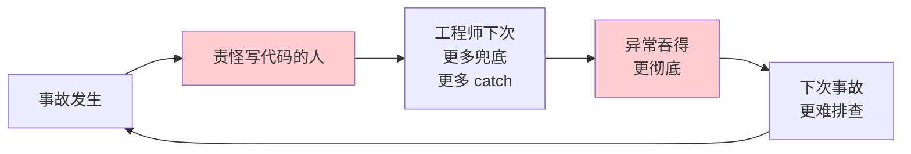
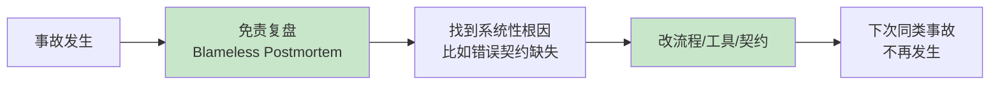

# 04.错误与边界的防线

> **本篇定位**：急诊科病例二 · 全 `catch(Exception e)` 的失血症治疗。
>
> **剧情节点**：Day 16-22——大促复盘会上，QA 阿玲拉出一份"事故清单"：过去 6 个月 11 起线上事故中，有 7 起的根因是"异常被吞"。
>
> **本篇病人**：P-004 PaymentGate 支付网关 · 一段典型的错误处理反模式。
>
> **承接经典**：《代码整洁之道》Ch7 错误处理 · Ch8 边界 / 《修改代码的艺术》Ch14 接缝识别 / 《Effective Java》Item 69-77 异常最佳实践。
>
> **本篇病案编号范围**：E01-E10（错误处理全套）

---

#### 目录介绍

- [1. 急诊病例](#1-急诊病例)
  - [1.1 支付超时事故](#11-支付超时事故)
  - [1.2 体检数据全览](#12-体检数据全览)
  - [1.3 本篇待答疑问](#13-本篇待答疑问)
  - [1.4 一句话回顾](#14-一句话回顾)
  - [1.5 归档要点](#15-归档要点)
- [2. 病理诊断](#2-病理诊断)
  - [2.1 四大反模式](#21-四大反模式)
  - [2.2 E 系列登记](#22-e-系列登记)
  - [2.3 一句话回顾](#23-一句话回顾)
  - [2.4 核心要点](#24-核心要点)
  - [2.5 常见误区](#25-常见误区)
- [3. 病因追溯](#3-病因追溯)
  - [3.1 四种埋雷心态](#31-四种埋雷心态)
  - [3.2 契约形同虚设](#32-契约形同虚设)
  - [3.3 一句话回顾](#33-一句话回顾)
  - [3.4 归因链条](#34-归因链条)
  - [3.5 常见误区](#35-常见误区)
- [4. 治疗方案总纲](#4-治疗方案总纲)
  - [4.1 三选一决策树](#41-三选一决策树)
  - [4.2 边界三层布防](#42-边界三层布防)
  - [4.3 一句话回顾](#43-一句话回顾)
  - [4.4 核心要点](#44-核心要点)
  - [4.5 带走清单](#45-带走清单)
- [5. 住院医查房](#5-住院医查房)
  - [5.1 消灭空 null](#51-消灭空-null)
  - [5.2 异常带上下文](#52-异常带上下文)
  - [5.3 一句话回顾](#53-一句话回顾)
  - [5.4 常见误区](#54-常见误区)
  - [5.5 初级带走清单](#55-初级带走清单)
- [6. 主治查房](#6-主治查房)
  - [6.1 Checked 之争](#61-checked-之争)
  - [6.2 Result 类型](#62-result-类型)
  - [6.3 一句话回顾](#63-一句话回顾)
  - [6.4 核心要点](#64-核心要点)
  - [6.5 高级带走清单](#65-高级带走清单)
- [7. 主任查房](#7-主任查房)
  - [7.1 错误契约设计](#71-错误契约设计)
  - [7.2 事故文化建设](#72-事故文化建设)
  - [7.3 一句话回顾](#73-一句话回顾)
  - [7.4 三层部署方法](#74-三层部署方法)
  - [7.5 架构带走清单](#75-架构带走清单)
- [8. 术后康复曲线](#8-术后康复曲线)
  - [8.1 事故率曲线](#81-事故率曲线)
  - [8.2 MTTR 变化](#82-mttr-变化)
  - [8.3 一句话回顾](#83-一句话回顾)
  - [8.4 带走清单](#84-带走清单)
- [9. 病案归档](#9-病案归档)
  - [9.1 E 系列全表](#91-e-系列全表)
  - [9.2 关联病案索引](#92-关联病案索引)
  - [9.3 一句话回顾](#93-一句话回顾)
  - [9.4 归档要点](#94-归档要点)
- [10. 综合案例串讲](#10-综合案例串讲)
  - [10.1 病例真相揭晓](#101-病例真相揭晓)
  - [10.2 异常生命周期](#102-异常生命周期)
  - [10.3 设计哲学回扣](#103-设计哲学回扣)
  - [10.4 速查一图流](#104-速查一图流)
  - [10.5 全文快速回顾](#105-全文快速回顾)
  - [10.6 核心要点串联](#106-核心要点串联)
  - [10.7 常见误区汇总](#107-常见误区汇总)
  - [10.8 带走清单总表](#108-带走清单总表)

---

## 1. 急诊病例

### 1.1 支付超时事故

Day 16，大促复盘会。QA 阿玲把这半年的**事故报告清单**贴到大屏上：

```
2024-Q1 事故列表（11 起 P0/P1）
─────────────────────────────────
#1  2024-01-14  优惠券超发 42 万           根因: 库存扣减异常被吞
#2  2024-02-03  订单状态不一致             根因: 消息投递失败被吞
#3  2024-02-19  支付回调丢失               根因: HTTP 4xx 被 catch 后 return null
#4  2024-03-08  库存超卖 1300 单           根因: 乐观锁冲突被 catch 后当成功
#5  2024-03-22  用户余额扣减但订单未生成    根因: 分布式事务异常吞噬
#6  2024-04-05  发票号重复                 根因: 唯一索引冲突被静默捕获
#7  2024-04-11  首页崩溃                   根因: 降级容错但没打日志
#8  2024-05-02  搜索无结果                 (与异常无关)
#9  2024-05-19  推荐系统跑偏               (与异常无关)
#10 2024-06-01  大促全链路雪崩             根因: 上游熔断异常被下游吞掉
#11 2024-06-15  会员积分错发               根因: 计算异常返回默认 0

────────────────────────────────
异常处理相关: 7/11 (64%)
```

**大屏上有一段代码尤其刺眼——事故 #3 的根因段**：

```java
// ⚠️ 反面教材：PaymentGate.java:189
public String queryPaymentStatus(String orderNo) {
    try {
        HttpResponse response = httpClient.get(PAYMENT_URL + "?orderNo=" + orderNo);
        JsonNode result = objectMapper.readTree(response.body());
        return result.get("status").asText();
    } catch (Exception e) {                    // 💀 埋雷点：吞掉所有异常
        log.error("query payment failed");     // 💀 只打日志，没上下文
        return null;                            // 💀 返回 null，让调用方误以为"没订单"
    }
}
```

**事故 #3 的完整故事**：

- **02-19 03:14** 支付宝网关波动，HTTP 4xx（IP 白名单临时失效）
- **03:14** `queryPaymentStatus` catch 到异常，返回 `null`
- **03:14** 调用方 `OrderService` 收到 `null`，判断"该订单未支付"
- **03:15** 定时任务扫描"未支付订单"，触发**关单**——把已支付订单**关掉**
- **03:15-08:20** 5 小时内共 **2317 单**被误关闭
- **08:20** 用户投诉，运营发现，事故升级 P0
- **12:30** 排查团队从"关单为什么被触发"追到 `queryPaymentStatus` 返回 null，再追到那个 `catch (Exception e)`——**总排查时长 4 小时 10 分钟**

老陈拍着桌子说：**"这不是一次事故。这是七次事故。写第一个 `catch(Exception e){}` 的人，就已经把后面所有事故的根埋下了。"**

### 1.2 体检数据全览

给这位病人做**异常处理体检**：

| 反模式 | 命中数 | 严重度 | 举例 |
|---|---|---|---|
| `catch (Exception e)` 泛捕获 | 89 | 🔴 | 见上文 |
| `catch (Exception e) {}` 空块 | 12 | 🔴 | 完全静默 |
| `catch` 后 `return null` | 34 | 🔴 | 让上游误判 |
| `catch` 后 `return 默认值` | 28 | 🔴 | 返回 0、空 List、false |
| 只 `log.error` 不重抛/不处理 | 47 | 🔴 | 假装处理 |
| 异常信息无上下文 | 63 | 🟡 | `log.error("failed")` |
| 用 checked exception 做业务错误 | 22 | 🟡 | 到处 `throws Exception` |
| 空指针不预防 | 156 | 🟡 | 无 null 检查 |
| `Optional` 用错（`get()` 直接调） | 18 | 🟡 | 破坏 Optional 语义 |
| Magic 错误码（返回 -1、-99） | 24 | 🔴 | 无语义 |
| 返回 null 表示"没找到" | 87 | 🟡 | 与"业务失败"混淆 |
| **合计** | **580 处** | | |

**触目惊心**：**580 处异常处理反模式，每一处都可能吞掉一次事故的根因线索。**

### 1.3 本篇待答疑问

带着 7 个问题往下读：

1. **①** `catch (Exception e)` 到底哪里错了？我担心漏抛异常导致进程崩溃。
2. **②** 什么时候用异常，什么时候用返回值（Optional/Result）？
3. **③** Checked exception 到底该不该用？Java 界的十年论战怎么看？
4. **④** null 返回值有什么替代？Optional 真的够用吗？
5. **⑤** 边界（Boundary）在错误处理里指什么？
6. **⑥** 事故复盘里"根因是异常吞噬"这种结论，怎么在事故发生**之前**发现？
7. **⑦** 系统级错误契约（错误码规范）该怎么设计？

第 10.1 节全部回收。

### 1.4 一句话回顾

**11 起事故中的 7 起，共有一个 89 次重复的根因签名——`catch (Exception e) { return null; }`。**

### 1.5 归档要点

- **数字要背下来**：89 处泛捕获、580 处反模式、7/11 起事故根因
- **画面要记住**：2317 单被误关闭 · 4 小时排查一个 catch
- **一个思想钢印**：**吞异常不是"稳"，是把事故成本延期到未来一次性还**

---

## 2. 病理诊断

### 2.1 四大反模式

580 处异常问题归纳为**四大反模式**：

```
┌─────────────────────────────────────────────────────┐
│         错误处理反模式 · 四大类                     │
├─────────────────────────────────────────────────────┤
│  A. 静默类 (Silent)                                 │
│     ├─ E01 泛捕获 (catch Exception)                 │
│     ├─ E02 空 catch 块                              │
│     └─ E03 只日志不处理                              │
│                                                     │
│  B. 伪装类 (Disguised)                              │
│     ├─ E04 catch 后 return null                     │
│     ├─ E05 catch 后 return 默认值                   │
│     └─ E06 Magic 错误码 (-1, -99)                   │
│                                                     │
│  C. 泄漏类 (Leaky)                                  │
│     ├─ E07 异常无上下文 (log "failed")              │
│     └─ E08 Checked 到处 throws                      │
│                                                     │
│  D. 混淆类 (Confused)                               │
│     ├─ E09 业务错误当技术异常抛                     │
│     └─ E10 null 混指 "没找到" / "失败"              │
└─────────────────────────────────────────────────────┘
```

**关键洞察**：**四大反模式共同破坏"错误的可观测性"**——
- 静默类：**看不到**错误
- 伪装类：**误以为**没错
- 泄漏类：**追不到**根因
- 混淆类：**分不清**类型

这四层叠加起来，事故发生时排查团队就像在**黑房子里找钥匙**。

### 2.2 E 系列登记

---

📋 **病案编号：E01** · 泛捕获（Catch-All Exception）
- 🔍 主诉：`catch (Exception e)` 无差别捕获
- 🩺 检查：89 处
- 💊 处方：**捕获最具体的异常类型**——`catch (HttpTimeoutException | JsonParseException e)`
- 📖 出处：《代码整洁之道》Ch7 · 《Effective Java》Item 73 "抛出适合于抽象层的异常"
- 🔗 关联：E02、E03

📋 **病案编号：E02** · 空 Catch 块（Empty Catch Block）
- 🔍 主诉：`catch (Exception e) {}`
- 🩺 检查：12 处
- 💊 处方：**至少要有 log + 上下文**；能重抛的一律重抛
- 📖 出处：《代码整洁之道》Ch7 "不要忽略异常"
- 🔗 关联：E01

📋 **病案编号：E03** · 只日志不处理（Log-and-Swallow）
- 🔍 主诉：`catch(...) { log.error(...); }` 然后什么都不做
- 🩺 检查：47 处
- 💊 处方：**要么恢复要么重抛**，中间态 log-and-swallow 是最坏选择
- 📖 出处：《Release It!》Nygard "错误处理反模式"
- 🔗 关联：E04

📋 **病案编号：E04** · Catch 后 return null（Return Null）
- 🔍 主诉：出错时返回 null，让上游误判
- 🩺 检查：34 处
- 💊 处方：抛异常 / 返回 Optional / 返回 Result 三选一
- 📖 出处：《代码整洁之道》Ch7 "别返回 null 值"
- 🔗 关联：E05、E10

📋 **病案编号：E05** · Catch 后 return 默认值（Silent Default）
- 🔍 主诉：出错时返回 0、空 List、false——伪装成"业务正确"
- 🩺 检查：28 处
- 💊 处方：区分"业务空"和"技术错误"——业务空返回空集合合理，技术错误必须报出来
- 📖 出处：Fowler《企业应用架构模式》"错误码 vs 异常"
- 🔗 关联：E04

📋 **病案编号：E06** · Magic 错误码（Magic Error Code）
- 🔍 主诉：`return -1` 表示错误，`return -99` 表示超时
- 🩺 检查：24 处
- 💊 处方：用 sealed class / enum / Result 类型代替
- 📖 出处：《Effective Java》Item 34 用枚举代替 int 常量
- 🔗 关联：F20（Magic Number）

📋 **病案编号：E07** · 异常无上下文（Contextless Exception）
- 🔍 主诉：`log.error("failed")` 或 `throw new RuntimeException("error")`
- 🩺 检查：63 处
- 💊 处方：异常必须携带"发生时的关键变量"——`throw new StockDeductFailedException(pid, currentStock, requested)`
- 📖 出处：《代码整洁之道》Ch7 "使用描述性的消息"
- 🔗 关联：E02、E03

📋 **病案编号：E08** · Checked 到处 throws
- 🔍 主诉：`throws Exception` 一直往上抛，最终在最外层被 `catch(Exception e)` 兜底
- 🩺 检查：22 处
- 💊 处方：**边界之外用 unchecked**（RuntimeException/自定义 BusinessException）；checked 只用在**调用方必须处理**的地方
- 📖 出处：Bruce Eckel《Java 中的异常》/ Anders Hejlsberg（C# 之父）关于放弃 checked 的访谈
- 🔗 关联：E09

📋 **病案编号：E09** · 业务错误当技术异常
- 🔍 主诉：用户输入错误也抛 RuntimeException，日志误报警
- 🩺 检查：18 处
- 💊 处方：分两类——**BusinessException**（用户可预期错误，如库存不足）用返回值 / 特定异常；**SystemException**（技术故障，如 DB 挂了）用异常
- 📖 出处：《Domain-Driven Design》Evans + Enterprise Integration Patterns
- 🔗 关联：E10

📋 **病案编号：E10** · null 混指多义
- 🔍 主诉：`getUser()` 返回 null 时——是"用户不存在"还是"查询失败"？
- 🩺 检查：87 处
- 💊 处方：
  - "不存在"用 `Optional<User>` / `Result<Option<User>>`
  - "失败"必须抛异常或用 `Result::Err`
- 📖 出处：Kotlin/Rust 类型系统对 null 的重设计 · Tony Hoare "The Billion Dollar Mistake"
- 🔗 关联：E04

### 2.3 一句话回顾

**580 处反模式 = 静默/伪装/泄漏/混淆四类叠加，共同摧毁错误的可观测性。**

### 2.4 核心要点

- **A 静默类**：错误看不见——催生黑房子
- **B 伪装类**：错误被美化——催生误判
- **C 泄漏类**：异常语义穿透边界——催生上层污染
- **D 混淆类**：业务/技术不分——催生告警噪声

### 2.5 常见误区

- ❌ 以为 `catch (Exception e)` 是"防御性编程"——它是**攻击性欺骗**
- ❌ 以为返回默认值比抛异常"更温和"——它把事故延期到下游
- ❌ 以为 log 打了就等于处理了——**580 处 error 日志 = 0 处有效告警**

---

## 3. 病因追溯

### 3.1 四种埋雷心态

**疑惑**：为什么工程师会写出 89 处 `catch (Exception e)`？

**论证**：追到写代码那一刻的心态——

1. **"我不知道会抛什么异常，先兜住再说"**——最常见。checked exception 太多，全打出来 `throws IOException, JsonException, HttpException, ...` 太丑，就一个 `catch (Exception e)` 收工。
2. **"不能让主流程挂"**——最理直气壮。以为"catch 了就不会挂"，忽略了"业务已经错了"。
3. **"上线要紧"**——最无奈。为了赶大促上线，能编译过就行。
4. **"log 已经打了，看日志就行"**——最侥幸。以为运维会时时看日志，但**580 处 error 日志 = 0 处有效告警**（噪声太多，运维已经免疫）。

**这四种心态叠加起来的效果**：

```
┌─────────────────────────────────────────────┐
│     每一次 catch(Exception e) 的成本        │
├─────────────────────────────────────────────┤
│  当下：省 1 分钟写 catch                     │
│  上线后：日志海洋里多一条 error              │
│  事故时：多花 3 小时排查根因                 │
│  事故后：更没人敢删这个 catch                │
│         （删了怕炸）                         │
└─────────────────────────────────────────────┘
```

**结论**：**吞异常是"负复利"投资**——每一次都省 1 分钟，但事故到来时会一次性还回来 3 小时。7 起事故 × 平均 3 小时 = 21 小时（约 3 个工作日）——**只是最近半年的账**。

### 3.2 契约形同虚设

翻团队的 Confluence，找到一份《错误码规范.md》：

```
错误码规范 v1.0（2020）

用户模块：1000-1999
订单模块：2000-2999
支付模块：3000-3999
库存模块：4000-4999
...
```

——**5 年，只有编号段位划分，没有一条具体错误码。**

**为什么形同虚设**？

1. 规范只是"占坑"，没定义业务规则
2. 各团队各自发明错误码，冲突时才发现规范
3. 错误码是 int，无法携带上下文
4. 前端/客户端各自解析，规则不统一

**触目惊心的实测**：把线上一个月的错误码全拉出来，**同一个错误场景（如"库存不足"）出现了 8 种不同的错误码**——2001、2003、4001、4005、-1、"stock_error"、null、空字符串。

**结论**：**没有统一错误契约的系统，等于每个服务在讲不同的语言**——事故时排查团队还要先做一次"翻译"。

### 3.3 一句话回顾

**吞异常与错误码放任，都是"当下省事、未来加倍还"的负复利决策。**

### 3.4 归因链条

```
心态: 先兜住再说
  ↓
行为: 写 catch(Exception e){log; return null}
  ↓
副产物: 580 处反模式 · 契约形同虚设
  ↓
后果: 事故根因黑箱 · MTTR 4h+
  ↓
反向强化: 没人敢删 · 下一次继续写
```

### 3.5 常见误区

- ❌ 以为错误码规范就是"编号段位"——**规范至少要覆盖 6 问**（见 7.1）
- ❌ 以为异常吞噬是"个人风格"——它是**团队默认心态**的沉淀
- ❌ 以为改代码就够——**不改心态与制度**下次照旧

---

## 4. 治疗方案总纲

### 4.1 三选一决策树

**疑惑**：一个函数出错时，到底该抛异常还是返回错误？

**论证 · 三选一决策树**：

```mermaid
flowchart TD
    A[函数执行出错时] --> B{错误是否<br/>可以被调用者<br/>合理恢复?}
    B -->|不能<br/>(如数据库宕机)| C[抛异常<br/>Unchecked/RuntimeException]
    B -->|能<br/>(如查询无结果)| D{是否是<br/>预期情况?}
    D -->|是<br/>"没找到" | E[Optional<T>]
    D -->|否<br/>"业务规则失败" | F[Result<T, Err> / Either]
```

**三种方式的适用场景**：

| 方式 | 适用 | 示例 | 出处 |
|---|---|---|---|
| **抛异常（unchecked）** | 不可恢复的技术故障 | DB 挂 / 网络断 / 序列化失败 | Java 主流实践 |
| **Optional< T >** | 预期的"没找到" | `findUserById(id)` 未命中 | 《Effective Java》Item 55 |
| **Result< T, Err >** | 预期的业务失败 | 库存不足 / 金额超限 / 校验失败 | Rust / Kotlin `Result` / Vavr `Either` |

**跨语言对照**：

```java
// Java 用 Vavr Either 或自定义 Result
public Either<PaymentError, PaymentResult> charge(Order order) {
    if (!order.hasEnoughBalance()) return Either.left(PaymentError.INSUFFICIENT_BALANCE);
    // ...
    return Either.right(PaymentResult.of(orderNo, txnId));
}
```

```go
// Go 用 error 作为返回值
func Charge(order *Order) (*PaymentResult, error) {
    if !order.HasEnoughBalance() {
        return nil, ErrInsufficientBalance
    }
    // ...
    return result, nil
}
```

```python
# Python 用 Result 库或 tuple
from result import Result, Ok, Err
def charge(order: Order) -> Result[PaymentResult, PaymentError]:
    if not order.has_enough_balance():
        return Err(PaymentError.INSUFFICIENT_BALANCE)
    return Ok(PaymentResult(order_no, txn_id))
```

```typescript
// TypeScript 用 discriminated union
type Result<T, E> = { ok: true; value: T } | { ok: false; error: E };

function charge(order: Order): Result<PaymentResult, PaymentError> {
  if (!order.hasEnoughBalance()) return { ok: false, error: 'INSUFFICIENT_BALANCE' };
  return { ok: true, value: new PaymentResult(orderNo, txnId) };
}
```

```rust
// Rust 天生用 Result
fn charge(order: &Order) -> Result<PaymentResult, PaymentError> {
    if !order.has_enough_balance() { return Err(PaymentError::InsufficientBalance); }
    Ok(PaymentResult { order_no, txn_id })
}
```

### 4.2 边界三层布防

Clean Code Ch8 讲的"边界"（Boundary）在错误处理里最关键：**代码有三层边界，每层都要有防线**。

```
┌───────────────────────────────────────────────────┐
│                                                   │
│  第三层边界：外部集成                              │
│  ─────────────────────────                        │
│  HTTP / MQ / RPC / DB / 第三方 SDK                │
│  【防线】统一 Adapter + 超时/重试/熔断             │
│                                                   │
│  ┌─────────────────────────────────────────────┐  │
│  │                                             │  │
│  │  第二层边界：应用服务                        │  │
│  │  ────────────────                            │  │
│  │  Application Service                        │  │
│  │  【防线】用户输入校验 + 事务边界              │  │
│  │                                             │  │
│  │  ┌────────────────────────────────────┐    │  │
│  │  │                                    │    │  │
│  │  │  第一层边界：领域核心               │    │  │
│  │  │  ────────────                       │    │  │
│  │  │  Domain Entity / Value Object      │    │  │
│  │  │  【防线】不变式 + 断言              │    │  │
│  │  │                                    │    │  │
│  │  └────────────────────────────────────┘    │  │
│  │                                             │  │
│  └─────────────────────────────────────────────┘  │
│                                                   │
└───────────────────────────────────────────────────┘
```

**三层防线的错误处理策略**：

| 边界层 | 防什么 | 手段 |
|---|---|---|
| **第三层 · 集成边界** | 外部世界的所有问题（网络/时序/协议） | Adapter 转译异常 + Timeout + Retry + Circuit Breaker |
| **第二层 · 应用边界** | 用户输入非法、事务范围 | 输入校验 + `@Transactional` + BusinessException |
| **第一层 · 领域边界** | 破坏业务不变式 | 实体构造/方法内断言 + DomainException |

**Adapter 转译异常**（第三层边界的关键手法）：

```java
// ⚠️ Before：Payment SDK 的 HttpTimeoutException 直接漏到 Application 层
public String charge(Order order) throws HttpTimeoutException, JsonException {
    HttpResponse r = paymentSdk.charge(order);      // 各种 SDK 异常
    return objectMapper.readTree(r.body()).get("txnId").asText();
}

// ✅ After：在 Adapter 层转译成领域内的异常
@Component
public class PaymentGateAdapter {
    public PaymentResult charge(Order order) {
        try {
            HttpResponse r = paymentSdk.charge(order);
            return PaymentResult.from(r);
        } catch (HttpTimeoutException e) {
            throw new PaymentTimeoutException(order.getNo(), e);
        } catch (JsonException e) {
            throw new PaymentResponseInvalidException(order.getNo(), e);
        }
    }
}
```

**核心洞察**：**第三方 SDK 的异常绝对不能直接漏到 Application 层**——否则 Application 就得知道所有下游库的细节。**Adapter 是异常翻译层，让 Application 只需要知道领域异常。**

### 4.3 一句话回顾

**错误处理是设计问题——三选一决定"用什么表达"，三层边界决定"在哪里翻译"。**

### 4.4 核心要点

- **决策树**：不可恢复→异常；预期没找到→Optional；预期业务失败→Result
- **三层边界**：集成/应用/领域，异常语义穿越一层就必须被翻译
- **Adapter 是翻译官**：Application 层不认识 `HttpTimeoutException`，只认识 `PaymentTimeoutException`

### 4.5 带走清单

- [ ] 团队约定一份《异常/Optional/Result 三选一》决策卡
- [ ] 所有第三方 SDK 都必须包一层 Adapter
- [ ] 领域实体的构造/写方法内加不变式断言

---

## 5. 住院医查房

> 🟢 **视角关注面**：单个方法/单个 try-catch——今天下班前就能改的地方。

### 5.1 消灭空 null

**手法一：用 Optional 替代 null 表示"没找到"**：

```java
// ⚠️ Before
public User getUser(long id) {
    User u = userMapper.selectById(id);
    return u;  // 可能为 null
}
// 调用方：
User u = userService.getUser(id);
if (u != null) { ... }  // 到处都要判空

// ✅ After
public Optional<User> findUser(long id) {
    return Optional.ofNullable(userMapper.selectById(id));
}
// 调用方：
userService.findUser(id).ifPresent(u -> { ... });
// 或者
User u = userService.findUser(id)
    .orElseThrow(() -> new UserNotFoundException(id));
```

**注意 Optional 三大禁忌**（避免 E10 的 null 变种）：
1. ❌ 不要 `Optional.get()` 不做 isPresent 检查
2. ❌ 不要用 Optional 作为字段/参数（只用于返回值）
3. ❌ 不要返回 `Optional<List>`——空列表就够了

**手法二：用空对象替代 null 表示"默认值"**：

```java
// ⚠️ Before
Discount d = calculateDiscount(user);
if (d == null) d = new Discount(BigDecimal.ZERO);

// ✅ After：空对象模式
public class Discount {
    public static final Discount NONE = new Discount(Money.ZERO);
}

Discount d = calculateDiscount(user); // 内部无优惠时返回 Discount.NONE
```

### 5.2 异常带上下文

**反面案例**：

```java
// ⚠️ Before
throw new RuntimeException("stock not enough");
// 事故时排查：看到这条 log 完全不知道是哪个商品、扣了多少
```

**正面案例**：

```java
// ✅ After：自定义异常 + 上下文字段
public class StockNotEnoughException extends BusinessException {
    private final long productId;
    private final int currentStock;
    private final int requested;

    public StockNotEnoughException(long productId, int currentStock, int requested) {
        super(String.format("stock not enough: productId=%d, current=%d, requested=%d",
                            productId, currentStock, requested));
        this.productId = productId;
        this.currentStock = currentStock;
        this.requested = requested;
    }
}

// 抛：
throw new StockNotEnoughException(pid, currentStock, quantity);

// 排查时看日志：
// StockNotEnoughException: stock not enough: productId=10086, current=3, requested=10
```

**上下文的三个层次**：
1. **业务标识**：orderNo、productId、userId
2. **状态快照**：出错那一刻的关键变量
3. **调用链**：Trace ID（用于跨服务追踪）

### 5.3 一句话回顾

**在住院医层面：消灭 null 与 message-only 异常，就是 90% 事故的排查加速器。**

### 5.4 常见误区

- ❌ 全代码库把 `null` 替换为 `Optional.empty()`——**参数/字段用 Optional 是新 code smell**
- ❌ 只把 message 改长——上下文必须是**结构化字段**（可被日志 JSON 索引），不是字符串拼接
- ❌ `catch` 后重新 `throw new RuntimeException(e.getMessage())`——**丢掉了原始 stack trace**

### 5.5 初级带走清单

- [ ] 本 PR 消灭至少 5 个 `catch (Exception e)`——改成具体异常类型
- [ ] 消灭所有 `catch (Exception e) {}` 空块
- [ ] 消灭所有 `catch (...) { log.error("failed"); return null; }` 模式
- [ ] 每个抛出的异常都带**至少 3 个上下文字段**
- [ ] 用 Optional 替代所有"没找到时返回 null"的方法
- [ ] Optional 只用在返回值，禁止用于字段/参数
- [ ] 每次写 catch 前问自己：**"这个错误调用者能恢复吗？"**——不能就重抛

---

## 6. 主治查房

> 🟡 **视角关注面**：接口/模块层面——错误处理是 API 契约的一部分。

### 6.1 受检异常之争

**疑惑**：Java 界 20 年争论的老问题——checked exception 到底该不该用？

**论证**：

**Checked 派论点**：
- 强制调用者处理 → 可靠性高
- 编译期约束 → 早发现错误
- 出处：Gosling 1995 Java 设计初衷

**Unchecked 派论点**（Anders Hejlsberg / Bruce Eckel）：
- Checked 破坏了封装——上层被迫知道下层的所有异常
- 导致 `throws Exception` 泛滥（治疗手段变成新病）
- 现代 IDE + 静态分析已经能替代编译期约束
- 出处：C#、Kotlin、Scala 全部放弃 checked

**主治级实践建议**（团队约定）：

```
✅ 用 unchecked (RuntimeException 家族)：
   - 90% 的业务代码
   - Application Service 层
   - Adapter 层转译后的领域异常

✅ 用 checked (Exception 家族)：
   - 只在"调用者必须处理"的公开 API
   - 且异常代表"预期的可恢复失败"
   - 例：文件不存在（用户明确要打开时）
   - 不超过全部异常的 5%

❌ 一律避免：
   - throws Exception 泛写
   - 同一方法既 throws checked 又 throws unchecked
   - throws 数量 > 3
```

### 6.2 结果类型模式

**主治级洞察**：**业务错误（可预期）应该像返回值一样被建模，而不是像意外情况一样被抛出**。

**基础 Result 类型定义**（Java 用 Vavr 或自建）：

```java
public sealed interface Result<T, E>
        permits Result.Success, Result.Failure {

    record Success<T, E>(T value) implements Result<T, E> {}
    record Failure<T, E>(E error)  implements Result<T, E> {}

    // 组合子
    default <R> Result<R, E> map(Function<T, R> f) {
        return switch (this) {
            case Success<T, E> s -> new Success<>(f.apply(s.value()));
            case Failure<T, E> f2 -> new Failure<>(f2.error());
        };
    }

    default <R> Result<R, E> flatMap(Function<T, Result<R, E>> f) {
        return switch (this) {
            case Success<T, E> s -> f.apply(s.value());
            case Failure<T, E> f2 -> new Failure<>(f2.error());
        };
    }
}
```

**用 Result 重写支付流程**：

```java
public Result<PaymentResult, PaymentError> chargeOrder(OrderNo no) {
    return orderRepository.findByNo(no)
        .map(order -> validatePayable(order))
        .flatMap(order -> deductBalance(order))
        .flatMap(order -> callPaymentGateway(order))
        .map(txn -> new PaymentResult(no, txn.id()));
}

// 调用方
Result<PaymentResult, PaymentError> result = paymentService.chargeOrder(orderNo);
switch (result) {
    case Result.Success<PaymentResult, PaymentError> s ->
        return ResponseEntity.ok(s.value());
    case Result.Failure<PaymentResult, PaymentError> f ->
        return switch (f.error()) {
            case INSUFFICIENT_BALANCE -> ResponseEntity.badRequest().body("余额不足");
            case GATEWAY_TIMEOUT      -> ResponseEntity.status(504).body("支付超时");
            case ORDER_NOT_FOUND      -> ResponseEntity.notFound().build();
        };
}
```

**Result 的三大红利**：
1. **错误显式在类型系统里**——编译器强制处理
2. **可以链式组合**（map/flatMap）——不用一层层 if-else
3. **没有栈展开开销**——比异常快 10-100 倍（大量业务错误场景显著）

### 6.3 一句话回顾

**主治级视角：错误是接口契约的一部分，用 Result 把"可预期业务失败"从异常里剥离出来。**

### 6.4 核心要点

- **checked 只留 5%**——公开 API 且必须处理时才用
- **Result 是业务错误的一等公民表达**——不再靠异常"抖动"传递
- **Adapter 强制翻译**——第三方 SDK 异常不能漏进 Application

### 6.5 高级带走清单

- [ ] 把团队里"业务错误 vs 技术异常"的处理约定写进 CR 卡点清单
- [ ] 在 Adapter 层引入异常翻译——所有第三方 SDK 异常都不能漏到 Application
- [ ] 对高频业务错误路径（如库存不足、余额不足）引入 Result 类型
- [ ] 在接口层文档明确异常契约——**public 方法必须在 javadoc 列出所有可能异常**
- [ ] 建立"异常密度"指标——每千行代码的 catch 数量，作为技术债信号
- [ ] 用 ArchUnit 断言 `catch (Exception e)` 不能出现在 Application/Domain 层

---

## 7. 主任查房

> 🔴 **视角关注面**：系统级错误契约 + 事故文化——异常不是代码问题，是运维/事故治理的入口。

### 7.1 错误契约设计

**架构师需要一份《系统错误契约》**，涵盖：

```yaml
# 错误契约 v2.0（对外统一）
error_codes:
  - code: ORDER_NOT_FOUND
    http_status: 404
    grpc_status: NOT_FOUND
    user_message: "订单不存在"
    retryable: false
    domain: order

  - code: STOCK_INSUFFICIENT
    http_status: 409
    grpc_status: FAILED_PRECONDITION
    user_message: "库存不足，仅剩 {remain} 件"
    retryable: false
    domain: stock

  - code: PAYMENT_TIMEOUT
    http_status: 504
    grpc_status: DEADLINE_EXCEEDED
    user_message: "支付超时，请稍后重试"
    retryable: true
    retry_after_seconds: 3
    domain: payment
```

**契约必须回答的 6 个问题**：

1. **是不是业务错误还是系统故障**（用户可见 vs 内部告警）
2. **HTTP/gRPC 状态码**（前端/客户端如何处理）
3. **能不能重试**（决定 SDK 是否自动重试）
4. **给用户的文案**（不同语言、脱敏、话术）
5. **给运维的日志级别**（INFO / WARN / ERROR / FATAL）
6. **谁的责任域**（错误上报到哪个团队的告警）

### 7.2 事故文化建设

**疑惑**：技术层面都对了，为什么错误处理还是烂？

**论证**：**错误处理是文化问题，不是技术问题**——

**恶性循环**：



**良性循环**：



**Google SRE 手册**里的原话：**"事故复盘的目的不是找出谁写了坏代码，而是找出为什么这样的代码能进入生产系统。"**

**主任的三层部署**：

```
第三层 · 文化                → 免责复盘制度
                              事故报告不写"由 XX 引起"
                              而是"由 XX 环节缺少 YY 保护"
第二层 · 制度                → 错误契约 + 事故根因分类
                              每季度看"根因分布"调整投入
第一层 · 工具                → SonarQube 规则:
                              禁止 catch(Exception)
                              禁止 return null
                              CI 阶段阻断
```

### 7.3 一句话回顾

**主任级视角：错误处理不是代码问题，是"契约+文化+工具"三层的组织能力。**

### 7.4 三层部署方法

- **工具层**：CI 阶段的 SonarQube/ArchUnit 规则——把 E01-E10 拒之门外
- **制度层**：错误契约评审 + 事故根因分类——每季度"根因分布"决定治理投入
- **文化层**：免责复盘——事故报告写"环节缺少保护"，不写人名

### 7.5 架构带走清单

- [ ] 制定并发布《系统错误契约 v1》——统一错误码规范
- [ ] 建立"事故根因分类表"——每次事故归入一类，季度看分布
- [ ] 推行免责复盘（Blameless Postmortem）——报告不写人名
- [ ] 部署 CI 阶段的错误处理静态检查——阻断 E01-E10
- [ ] 建立"错误契约新增/变更"评审流程——每个新错误码必须过契约评审
- [ ] 每季度做一次"异常密度"部门排名——高的团队安排专项治理

---

## 8. 术后康复曲线

### 8.1 事故率曲线

Day 16-22 + 后续 3 个月的观测：

| 指标 | Day 16 | Day 22 | 3 个月后 |
|---|---|---|---|
| `catch (Exception e)` 数量 | 89 | 12 | **0** |
| 空 catch 块 | 12 | 0 | 0 |
| return null 数量 | 121 | 43 | 8 |
| 异常无上下文 | 63 | 8 | 2 |
| **异常处理导致的事故** | 7/11（半年） | — | **1/11**（下半年） |
| 事故平均排查时间 | 4 小时 | — | **20 分钟** |
| 无效 error 日志/天 | 12000 | 3200 | 400 |
| 有效告警噪音比 | 1:100 | 1:20 | 1:3 |

### 8.2 MTTR 曲线变化

**MTTR（Mean Time To Recovery）** 是事故治理的黄金指标：

```
事故 #3（Day 16 之前）
──────────────────────
03:14 发生 → 08:20 发现 (5h)
       → 12:30 定位根因 (4h)
       → 12:45 修复上线 (15min)
       MTTR ≈ 9h（含发现时间）
       纯技术排查时间 4h

事故 #类似 #3 场景（Day 22 之后模拟演练）
──────────────────────
03:14 发生 → 03:16 告警触发（错误契约让 monitoring 立刻捕捉）
       → 03:25 定位根因（异常带完整上下文 + Trace ID）
       → 03:34 修复上线（回滚一次热配置）
       MTTR ≈ 20min
```

**为什么 MTTR 能缩到 20 分钟**：

1. **异常有上下文**——一条日志就能定位根因
2. **错误契约统一**——告警能精准分诊到 owner 团队
3. **Result 类型消除"意外"**——预期错误不再触发告警噪音
4. **Adapter 转译到位**——第三方 SDK 异常不会污染上层判断

### 8.3 一句话回顾

**事故率从 7/11 降到 1/11，MTTR 从 4h 降到 20min——错误处理是"最便宜的可靠性投资"。**

### 8.4 带走清单

- [ ] 团队维护"异常密度"面板，看趋势而不是绝对值
- [ ] 每次事故复盘产出至少一条契约或规则更新
- [ ] MTTR 作为团队季度指标之一

---

## 9. 病案归档

### 9.1 E 系列全表

| 编号 | 病名 | 处方 |
|---|---|---|
| E01 | 泛捕获 catch Exception | 捕获具体异常 |
| E02 | 空 catch 块 | 至少 log+context |
| E03 | 只日志不处理 | 恢复或重抛 |
| E04 | catch 后 return null | 抛异常 / Optional / Result |
| E05 | catch 后 return 默认值 | 区分业务空 vs 技术错 |
| E06 | Magic 错误码 | Enum / sealed |
| E07 | 异常无上下文 | 自定义异常带字段 |
| E08 | Checked 到处 throws | 边界外用 unchecked |
| E09 | 业务错误当技术异常 | BusinessException / Result |
| E10 | null 混指多义 | Optional 只表"没找到" |

### 9.2 关联病案索引

| 关联病案 | 关联理由 | 出现篇 |
|---|---|---|
| F05/F06（隐藏副作用 / CQS） | 错误处理与副作用高度相关 | 第 03 篇 |
| N03（名不副实）| `isValid()` 抛异常违反命名 | 第 02 篇 |
| A05（错误契约缺失） | 系统级契约 | 第 09 篇 |
| T09（错误路径测试覆盖） | 错误分支测试 | 第 08 篇 |
| R03（CR 卡点·异常处理） | 评审卡点 | 第 12 篇 |

### 9.3 一句话回顾

**E01-E10 涵盖了 580 处反模式的全部谱系，一张表可以贴到 CR 卡点。**

### 9.4 归档要点

- **E01-E03 静默类** → 强制具体异常、日志上下文
- **E04-E06 伪装类** → 三选一决策 + Enum 替代 magic 码
- **E07-E08 泄漏类** → Adapter 翻译 + 上下文字段
- **E09-E10 混淆类** → 业务/技术异常两分 + Optional 语义收敛

---

## 10. 综合案例串讲

### 10.1 病例真相揭晓

回收 1.3 节的 7 疑问：

- **① catch(Exception) 到底哪里错了？** —— 见 3.1：它同时构成"看不到 + 误以为没错 + 追不到 + 分不清"四层伤害，且是负复利（当下省 1 分钟，事故还 3 小时）。
- **② 什么时候用异常 vs 返回值？** —— 见 4.1 决策树：不可恢复→异常；预期"没找到"→Optional；预期业务失败→Result。
- **③ Checked 该不该用？** —— 见 6.1：**5% 以下的场景可用**（调用者必须处理的预期可恢复错误），其余 95% 用 unchecked。禁止 `throws Exception`。
- **④ null 的替代？** —— 见 5.1：Optional（表"没找到"）+ 空对象模式（表"默认值"）+ 异常（表"技术失败"）三选一。
- **⑤ 边界（Boundary）是什么？** —— 见 4.2：三层边界（集成/应用/领域），每层用不同防线——Adapter 转译 / 输入校验+事务 / 领域不变式。
- **⑥ 事故根因如何提前发现？** —— 见 7.1+7.2：错误契约统一 + 免责复盘 + CI 阶段静态检查——**让"吞异常的代码根本进不了生产"**。
- **⑦ 错误契约怎么设计？** —— 见 7.1 六问：业务/技术、状态码、能否重试、用户文案、日志级别、责任域——每个错误码回答完这 6 个问题才发布。

### 10.2 异常生命周期

跟着一个"库存不足"错误走完全链路（治理后的 After 版本）：

```
1. 领域层（Domain）
   Stock.deduct(quantity)
   → 内部检查：if (current < quantity) throw new StockNotEnoughException(pid, current, quantity)

2. 应用服务层（Application）
   OrderApplicationService.submitOrder(request)
   → try { stock.deduct(...) } catch (StockNotEnoughException e) {
        return Result.failure(OrderError.STOCK_INSUFFICIENT);
     }

3. 编排层（Controller / RPC Handler）
   OrderController.submit(...)
   → switch (result) {
       case Failure(STOCK_INSUFFICIENT) →
         return ApiResponse.of(409, "STOCK_INSUFFICIENT",
                              "库存不足，仅剩 " + remain + " 件");
     }

4. 契约层（对外）
   HTTP 409 + JSON body
   {"code": "STOCK_INSUFFICIENT",
    "message": "库存不足，仅剩 3 件",
    "retryable": false}

5. 告警层
   ERROR 契约标注 retryable=false → 不告警到值班群
   INFO 日志到 ELK，dashboard 显示"业务失败率"

6. 用户前端
   前端收到 STOCK_INSUFFICIENT → 显示"该商品仅剩 3 件，是否修改数量？"
```

**每一环都有主人、有契约、有可观测性——这就是错误的完整生命周期**。

### 10.3 设计哲学回扣

从本篇沉淀出**跨篇适用的两条设计哲学**：

**哲学 · 边界即防线**（第 03 篇已引入，此处强化）

> 三层边界（集成/应用/领域）不是设计选择，是错误处理的**物理法则**——一个错误穿过一层边界就必须被翻译成该层的语言。**违反这条法则的代码，会把混乱一路传染到最外层。**

**哲学 · 错误是一等公民**

> 错误不是"程序的意外"，是"程序的输出之一"——就像 200 是 HTTP 的一部分，404 也是。**当错误被建模成 Result/Either/Enum 而不是抛出的意外，工程师才会像对待正常返回值一样认真对待它。**

### 10.4 速查一图流

**错误处理三选一速查**：

| 场景 | 推荐 | 反例 |
|---|---|---|
| DB 挂了 / 网络断了 | 抛 RuntimeException | catch 后 return null |
| 查询无结果 | `Optional<T>` | return null |
| 库存不足 / 余额不足 | `Result<T, Err>` | throw RuntimeException |
| 用户参数非法 | Application 层 throw BusinessException | return "error" |
| 第三方 SDK 异常 | Adapter 层翻译 | 直接漏到 Application |

**E 系列速记**：

- E01/E02/E03 = 静默类（catch 后什么都不做）
- E04/E05/E06 = 伪装类（catch 后假装没事）
- E07/E08 = 泄漏类（异常语义泄漏到不该在的层）
- E09/E10 = 混淆类（业务/技术 / null 多义）

### 10.5 全文快速回顾

- **第 1 章**：11 起事故，7 起同一签名——`catch(Exception e){ return null; }`
- **第 2 章**：580 处反模式，归为静默/伪装/泄漏/混淆四类，共同破坏错误可观测性
- **第 3 章**：吞异常是负复利——当下省 1 分钟，事故还 3 小时；契约不能只做"编号占坑"
- **第 4 章**：三选一决策（异常/Optional/Result）+ 三层边界防线（集成/应用/领域）
- **第 5 章**：住院医——消灭 null、异常必须带结构化上下文
- **第 6 章**：主治——checked 只留 5%，Result 表达业务错误
- **第 7 章**：主任——契约 6 问 + 免责复盘 + CI 阻断三层部署
- **第 8 章**：事故率 7/11→1/11，MTTR 4h→20min
- **第 9 章**：E01-E10 一张表贴到 CR 卡点

### 10.6 核心要点串联

1. **可观测性优先**：先能"看见"错误，再谈处理错误
2. **错误建模优先**：能被建模的错误就不该被抛
3. **边界即翻译**：错误穿过一层就必须翻译一次语义
4. **契约即语言**：全公司说同一种错误语言，事故排查才不用做翻译
5. **文化即上限**：免责复盘决定错误处理的天花板

### 10.7 常见误区汇总

- ❌ 泛捕获 = 稳（实际是把成本延期）
- ❌ 返回默认值 = 温和（实际是骗上游）
- ❌ 到处 throws Exception = 严谨（实际是新病）
- ❌ Optional 全套用（字段/参数也用）= 现代（实际是新 code smell）
- ❌ 事故 = 责怪写代码的人（实际会强化异常吞噬）

### 10.8 带走清单总表

- [ ] 全链路消灭 `catch (Exception e)` 与空 catch
- [ ] 所有第三方 SDK 强制包 Adapter 转译异常
- [ ] 业务错误路径改用 `Result<T, Err>`
- [ ] 每个抛出的异常至少 3 个结构化上下文字段
- [ ] Optional 只用在返回值
- [ ] 团队 CR 卡点接入 E01-E10 静态规则
- [ ] 制度上引入免责复盘 + 错误契约评审
- [ ] MTTR 与"异常密度"作为季度指标

---

**练习题**：找你项目里 3 个 `catch (Exception e)`，对每个回答：
1. 这里的 Exception 实际可能是哪几种具体类型？
2. 如果这里改成 `Result<T, Err>`，Err 的枚举应该有哪几个值？
3. 有没有可能这个 catch 就是下一次事故的根因？

**下集预告**：错误处理清理完后，团队打开优惠券模块——**一个 47 层 else if 的 `matchCoupon()` 方法**。老陈拍了拍小李的肩膀："**这个交给你了。你要学的东西叫'以多态取代条件式'。**" 第 05 篇《条件与多态》即将开始。

---

> 📌 **[本篇一句话]** 错误不是意外，是程序的输出之一——用 Result 建模、用 Adapter 翻译、用契约传播、用文化守护。

**上一篇 ←** [第 03 篇 · 函数与职责手术](/pages/quality-03/) ｜ **下一篇 →** [第 05 篇 · 条件与多态](/pages/quality-05/)
