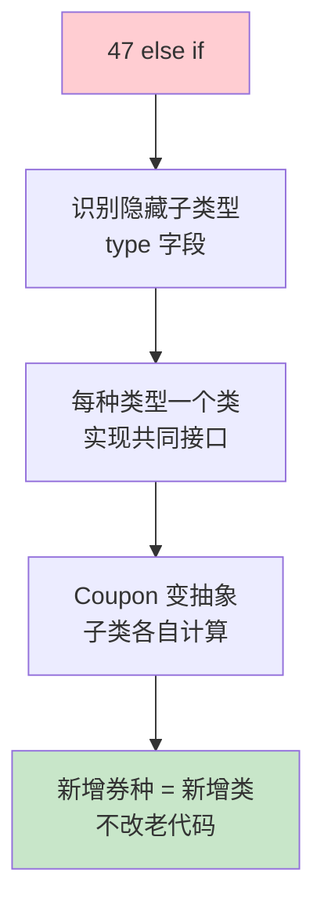
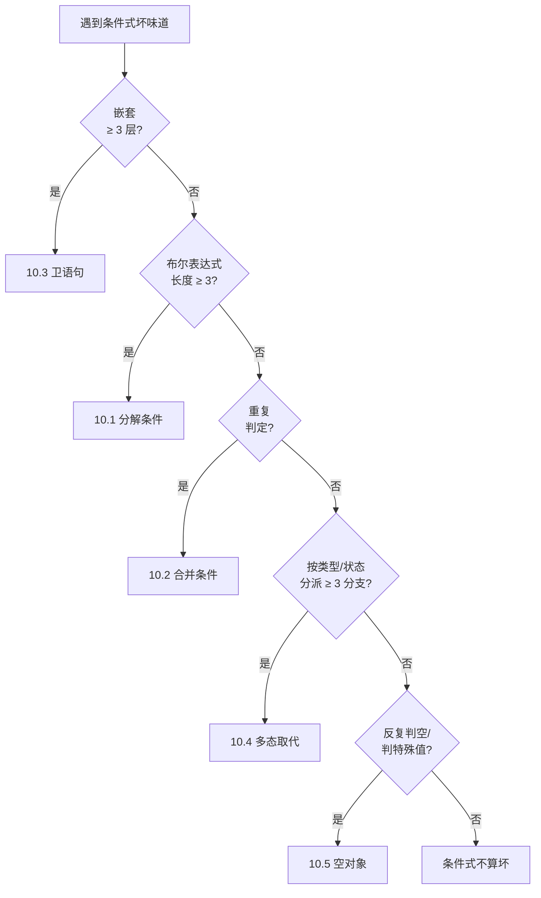
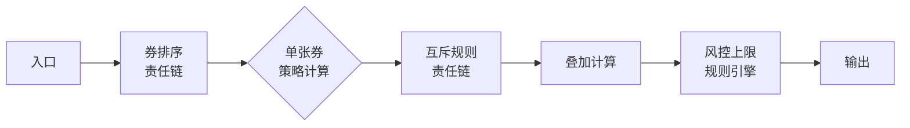

# 05.条件与多态心律术

> **本篇定位**：急诊科病例三 · 47 个 else if 的心律不齐治疗。
>
> **剧情节点**：Day 23-30——优惠券超发 42 万的复盘会。会上，产品娟姐第 47 次要求"加一种券"，老陈第一次说"不"。
>
> **本篇病人**：P-002 CouponCalc 优惠券计算引擎 · 硬编码 47 个分支的经典条件式失控。
>
> **承接经典**：Fowler《重构》Ch10 简化条件表达式 · 以多态取代条件 / GoF《设计模式》策略模式 / 《领域驱动设计》Evans 值对象 + 策略。
>
> **本篇病案编号范围**：F15-F20（长条件式类） + C09-C15（多态与继承类）

---

#### 目录介绍

- [1. 急诊病例](#1-急诊病例)
  - [1.1 优惠计算方法](#11-优惠计算方法)
  - [1.2 超发事故复盘](#12-超发事故复盘)
  - [1.3 本篇待答疑问](#13-本篇待答疑问)
  - [1.4 一句话回顾](#14-一句话回顾)
  - [1.5 归档要点](#15-归档要点)
- [2. 病理诊断](#2-病理诊断)
  - [2.1 条件失控六态](#21-条件失控六态)
  - [2.2 病案卡片精选](#22-病案卡片精选)
  - [2.3 一句话回顾](#23-一句话回顾)
  - [2.4 核心要点](#24-核心要点)
  - [2.5 常见误区](#25-常见误区)
- [3. 病因追溯](#3-病因追溯)
  - [3.1 复利陷阱](#31-复利陷阱)
  - [3.2 缺失业务抽象](#32-缺失业务抽象)
  - [3.3 一句话回顾](#33-一句话回顾)
  - [3.4 归因链条](#34-归因链条)
  - [3.5 常见误区](#35-常见误区)
- [4. 治疗方案总纲](#4-治疗方案总纲)
  - [4.1 从 if 到策略](#41-从-if-到策略)
  - [4.2 五手法地图](#42-五手法地图)
  - [4.3 一句话回顾](#43-一句话回顾)
  - [4.4 核心要点](#44-核心要点)
  - [4.5 带走清单](#45-带走清单)
- [5. 住院医查房](#5-住院医查房)
  - [5.1 卫语句拉平](#51-卫语句拉平)
  - [5.2 分解条件表达](#52-分解条件表达)
  - [5.3 一句话回顾](#53-一句话回顾)
  - [5.4 常见误区](#54-常见误区)
  - [5.5 初级带走清单](#55-初级带走清单)
- [6. 主治查房](#6-主治查房)
  - [6.1 多态取代条件](#61-多态取代条件)
  - [6.2 四方案选型](#62-四方案选型)
  - [6.3 一句话回顾](#63-一句话回顾)
  - [6.4 核心要点](#64-核心要点)
  - [6.5 高级带走清单](#65-高级带走清单)
- [7. 主任查房](#7-主任查房)
  - [7.1 抽象等级效应](#71-抽象等级效应)
  - [7.2 拒绝加 if](#72-拒绝加-if)
  - [7.3 一句话回顾](#73-一句话回顾)
  - [7.4 三条原则](#74-三条原则)
  - [7.5 架构带走清单](#75-架构带走清单)
- [8. 术后康复曲线](#8-术后康复曲线)
  - [8.1 分支数曲线](#81-分支数曲线)
  - [8.2 上线时间对比](#82-上线时间对比)
  - [8.3 一句话回顾](#83-一句话回顾)
  - [8.4 带走清单](#84-带走清单)
- [9. 病案归档](#9-病案归档)
  - [9.1 病案编号登记](#91-病案编号登记)
  - [9.2 关联病案索引](#92-关联病案索引)
  - [9.3 一句话回顾](#93-一句话回顾)
  - [9.4 归档要点](#94-归档要点)
- [10. 综合案例串讲](#10-综合案例串讲)
  - [10.1 病例真相揭晓](#101-病例真相揭晓)
  - [10.2 一张券历程](#102-一张券历程)
  - [10.3 设计哲学回扣](#103-设计哲学回扣)
  - [10.4 速查一图流](#104-速查一图流)
  - [10.5 全文快速回顾](#105-全文快速回顾)
  - [10.6 核心要点串联](#106-核心要点串联)
  - [10.7 常见误区汇总](#107-常见误区汇总)
  - [10.8 带走清单总表](#108-带走清单总表)

---

## 1. 急诊病例

### 1.1 优惠计算方法

Day 23，会议室里，小李把 `CouponCalc.matchCoupon()` 打开——**一个 622 行的方法，47 个 else if 分支**。屏幕滚动条比标尺还密。

```java
// ⚠️ 反面教材：CouponCalc.java:87
public BigDecimal matchCoupon(Order order, User user, List<Coupon> coupons) {
    BigDecimal discount = BigDecimal.ZERO;
    for (Coupon c : coupons) {
        if (c.getType() == 1) {                                  // 满减券
            if (order.getAmount().compareTo(c.getThreshold()) >= 0) {
                discount = discount.add(c.getAmount());
            }
        } else if (c.getType() == 2) {                          // 折扣券
            if (order.getAmount().compareTo(c.getThreshold()) >= 0) {
                discount = discount.add(order.getAmount().multiply(c.getRate()));
            }
        } else if (c.getType() == 3) {                          // 品类券
            if (order.hasCategory(c.getCategoryId())) {
                if (order.getCategoryAmount(c.getCategoryId()).compareTo(c.getThreshold()) >= 0) {
                    discount = discount.add(c.getAmount());
                }
            }
        } else if (c.getType() == 4) {                          // 会员券（仅 VIP）
            if (user.isVip()) {
                if (order.getAmount().compareTo(c.getThreshold()) >= 0) {
                    discount = discount.add(c.getAmount().multiply(new BigDecimal("1.1")));
                }
            }
        } else if (c.getType() == 5) {                          // 新人券
            if (user.isNewUser()) { /* ... */ }
        }
        // ... 又是 42 个 else if 分支 ...
        else if (c.getType() == 47) {                           // 双十一秒杀专用券
            // 116 行专用逻辑
        }
    }
    return discount;
}
```

**再看 `Coupon` 类**——一个典型的 God Data Class：

```java
// ⚠️ Coupon.java
public class Coupon {
    private int type;                    // 1-47 的魔法数字
    private BigDecimal amount;           // 满减金额（type=1/3/4/5... 用）
    private BigDecimal rate;             // 折扣率（type=2 用）
    private BigDecimal threshold;        // 门槛金额
    private Long categoryId;             // 品类 id（type=3 用）
    private Integer minVipLevel;         // (type=4 用)
    private Integer maxUsePerUser;       // (type=5 用)
    // + 21 个字段，每种券只用其中几个
}
```

**一个 Coupon 类里塞了 47 种券的所有字段——每种券真正用的只是其中 3-5 个**。这就是 **F17 多职责 + C02 贫血 + F13 高圈复杂度**的三重叠加。

### 1.2 超发事故复盘

事故 #1（2024-01-14）的完整故事，就藏在这段 47-if 里：

- 大促要上一种"新人满 100 减 50"的券——按流程加了一个 `else if (c.getType() == 48)`
- 但开发忘了在 `getType() == 5`（原新人券）分支里加"互斥"判断
- 结果一个用户同时命中 5 和 48 两个分支——**两张券都算了减免**
- 单用户可以叠加 2 张，且一张券可以用多次（Coupon 里没写 `usedCount`）
- 42 万元的优惠券超发就是这样出来的

**排查小组还发现**：
- 之前的 47 个分支里，**已经有 3 对分支存在"互斥缺失"**——只是没被大规模利用
- CR 时评审人只看了新增的 30 行 diff，没读全 622 行
- 也没有单元测试——每种券的组合场景需要 47×46=**2162 组测试**才能覆盖

**老陈的批注**："**如果继续加 if，第 48 张券也会有事故。这个模式必须换。**"

### 1.3 本篇待答疑问

带着 7 个问题往下读：

1. **①** 47 个 else if 和 1 个多态分派，性能会差很多吗？
2. **②** 什么时候用 if-else，什么时候用多态？边界在哪？
3. **③** 策略模式、责任链模式、规则引擎——业务上如何选型？
4. **④** 用多态后新增分支反而更麻烦（要新建类）——是不是过度设计？
5. **⑤** 47 个 else if 一次性重构风险太大——如何渐进式换？
6. **⑥** 数据驱动（DB 配置）vs 代码驱动（多态类）——如何选？
7. **⑦** 产品每周提一个"新券种"——架构层如何应对？

第 10.1 节全部回收。

### 1.4 一句话回顾

**622 行、47 个 else if、Coupon 塞 21 字段——三重叠加造成 42 万超发。**

### 1.5 归档要点

- **数字要背下来**：47 个分支、CC 68、2162 种组合测试、42 万事故
- **画面要记住**：滚动条比标尺还密的 622 行方法
- **一个思想钢印**：**"再加一个 if"是复利陷阱，每次省 5 分钟、总账几十小时**

---

## 2. 病理诊断

### 2.1 条件失控六态

47 个 else if 只是"长条件式"最直白的一种。实际项目里条件式失控还有另外**五种形态**：

```
┌──────────────────────────────────────────────────┐
│         长条件式的六种典型形态                    │
├──────────────────────────────────────────────────┤
│  A. 长 if-else 链       (本文主战场)             │
│     └─ if (type==1) ... else if (type==2) ...    │
│                                                  │
│  B. 长 switch-case                               │
│     └─ switch (type) { case 1: ...; case 2: ... │
│                                                  │
│  C. 深度嵌套 if                                  │
│     └─ if () { if () { if () { if () ... } } }   │
│                                                  │
│  D. 布尔表达式过长                                │
│     └─ if (a && b && c && d && e) ...            │
│                                                  │
│  E. 类型判断分派                                  │
│     └─ if (o instanceof Type1) ... else if ...   │
│                                                  │
│  F. 数据驱动的伪多态                              │
│     └─ Map<Integer, Handler> handlers = ...      │
│        handlers.get(type).handle()               │
│        (看似多态，实则 type=int 就已失败)          │
└──────────────────────────────────────────────────┘
```

**关键洞察**：**六种形态的共同病灶是"类型（type）作为 if 的判据"**——`type` 是一个**代表隐藏子类的字段**。有 `type` 就有多态的味道，只不过被写成了 if-else 而已。

### 2.2 病案卡片精选

选出核心病案卡片：

---

📋 **病案编号：F13**（回扣） · 高圈复杂度
- 🔍 主诉：`matchCoupon()` 圈复杂度 47+
- 💊 处方：以多态取代条件式（本篇主战场）
- 🔗 关联：F17

📋 **病案编号：C09** · 类型码作为字段（Type Code as Field）
- 🔍 主诉：`Coupon.type: int` 承担了"这是哪种券"的判定
- 🩺 检查：11 处（Order/Coupon/Payment 都有 type 字段）
- 💊 处方：Replace Type Code with Subclass（重构 12.6）—— 每种券一个子类
- 📖 出处：Fowler《重构》12.6 / GoF 策略模式
- 🔗 关联：F13

📋 **病案编号：C10** · 分派表模拟多态（Dispatch Map Anti-Pattern）
- 🔍 主诉：`Map<Integer, Handler>` 看似多态，实则 Integer 还是 Type Code
- 💊 处方：如果分派表值来自代码，改用多态类；如果来自 DB 配置，用**策略注册中心**（见 6.2）
- 📖 出处：Uncle Bob《架构整洁之道》"稳定抽象原则"
- 🔗 关联：C09

📋 **病案编号：C11** · 卫语句缺失（Missing Guard Clause）
- 🔍 主诉：`if (condition) { 30 行主流程 }` —— 主流程被 if 包着
- 💊 处方：反转条件 `if (!condition) return;` —— 主流程回到最外层
- 📖 出处：Fowler《重构》10.7
- 🔗 关联：F12（深嵌套）

📋 **病案编号：C12** · 布尔标志爆炸（Boolean Flag Explosion）
- 🔍 主诉：一个函数出现 4+ 个布尔字段/参数——组合起来 16 种状态
- 💊 处方：Replace Flag Set with Enum / State pattern
- 📖 出处：《代码整洁之道》Ch3 · GoF 状态模式
- 🔗 关联：F03（布尔参数）

📋 **病案编号：C13** · 隐藏的状态机
- 🔍 主诉：一堆 if 判断当前 `status`——本质是状态迁移
- 💊 处方：显式建模状态机（State pattern / FSM 库）
- 📖 出处：GoF 状态模式 · UML 状态图
- 🔗 关联：C09

📋 **病案编号：C14** · 过深继承（Deep Inheritance）
- 🔍 主诉：为了多态用了 6 层继承
- 💊 处方：优先组合替代继承 + 策略字段
- 📖 出处：《Effective Java》Item 18
- 🔗 关联：C11

📋 **病案编号：C15** · 上帝规则引擎（God Rule Engine）
- 🔍 主诉：所有业务规则塞进一个 Drools 文件，3000 行
- 💊 处方：按业务域拆分规则文件 + 领域策略类
- 📖 出处：《DDD》Evans "规则不是万能药"
- 🔗 关联：C09、C10

---

### 2.3 一句话回顾

**六种失控形态共有一个病灶——`type` 字段是一个假装成字段的"隐藏子类型"。**

### 2.4 核心要点

- **A/B/E**：分派型条件——用多态治
- **C**：嵌套型——用卫语句拉平
- **D**：布尔组合型——用命名方法分解
- **F**：伪多态——升级到真正多态

### 2.5 常见误区

- ❌ 认为 `switch` 比 `if-else` 更好——**分支数超过阈值时同样是坏味道**
- ❌ 认为 `Map<Integer, Handler>` 已经多态化——**int 作 key 就已经违反类型系统**
- ❌ 认为多层继承就是多态——**优先组合替继承**

---

## 3. 病因追溯

### 3.1 复利陷阱

**疑惑**：写代码时怎么就一路加成 47 个 if？

**论证 · 复利陷阱**：

```
第 1 个 if:  写完只需 5 分钟         (2021-02)
第 2 个 if:  在原逻辑上加一个分支    5 分钟 (2021-04)
第 3 个 if:  仿照 1 和 2 加一个      6 分钟 (2021-06)
...
第 20 个 if: 已经不确定别的分支是否互斥 → 20 分钟 (2022-08)
...
第 40 个 if: 每次修改都要读全 47 分支 → 2 小时 (2023-11)
第 47 个 if: **不敢碰**，只敢在末尾追加 → 一天 (2024-01)
第 48 个 if: **出事故** (2024-01-14)
```

**每一次都是"当前最省事"**——但 **48 次累加后成为团队的诅咒**。

**Fowler 的原话**（《重构》Ch10）：**"每当你看到长长的 switch 或 if 链，就想一想能不能用多态换掉它。这一手法可能是最能让你脱胎换骨的重构。"**

**结论**：**"加 if"是有边际成本递增的动作**——第 1 次 5 分钟，第 47 次可能是几十小时（含事故）。真正的收益是**在第 3-5 个 if 时就转多态**——那时代价小、多态还能保留 if 分支的清晰。

### 3.2 缺失业务抽象

**追根**：为什么没有从一开始就用多态？

三个原因：

1. **业务语言没被识别**——"满减券"、"折扣券"、"品类券"在**业务语言里就是不同的东西**，但代码里全叫 `Coupon`。**没建立业务概念 → 没建立类型**。
2. **DBA 主导表设计**——DBA 追求"一张 coupon 表塞所有券"——用 type 字段区分。这个"数据库层的省事"直接传染到了代码层。
3. **面向对象没落地**——很多"Java 工程师"其实只在写"包着类的过程式代码"——用 `if(type==X)` 判定而不是让对象自己回答"我是什么"。

**结论**：**长 if-else 链是"面向数据"（而非面向对象）编程的必然结果**——治它必须回到"让每种概念成为一个类"的起点。

### 3.3 一句话回顾

**长 if-else 链是数据库模型直接投影到代码的副作用——业务语言没被认真翻译。**

### 3.4 归因链条

```
DBA 单表设计（type 字段）
  ↓
Java 建模照抄（一个 Coupon 类）
  ↓
判定用 if(type==X)（过程式思维）
  ↓
每次加券都是 +1 if（复利陷阱）
  ↓
47 分支 · 2162 组合 · CC 68
  ↓
超发事故
```

### 3.5 常见误区

- ❌ 认为数据库设计和 OO 设计必须 1:1 映射——**领域模型可以与表结构解耦**
- ❌ 认为"加 if 快"就是效率——**忽略每次的边际成本递增**
- ❌ 认为"我加 3 个 if 就好"——3 个之后总会到 30 个

---

## 4. 治疗方案总纲

### 4.1 从 if 到策略

**总体思路**：



**核心接口**：

```java
public interface CouponStrategy {
    /** 判断优惠券是否适用于订单 */
    boolean applicable(Order order, User user);

    /** 计算优惠金额 */
    Money calculate(Order order, User user);

    /** 返回券种识别符（对外契约用） */
    CouponType type();
}
```

**具体策略**（每种券一个类）：

```java
public class ThresholdReductionCoupon implements CouponStrategy {
    private final Money threshold;
    private final Money reduction;

    @Override
    public boolean applicable(Order order, User user) {
        return order.amount().greaterThanOrEqual(threshold);
    }

    @Override
    public Money calculate(Order order, User user) {
        return reduction;
    }

    @Override
    public CouponType type() { return CouponType.THRESHOLD_REDUCTION; }
}

public class DiscountCoupon implements CouponStrategy {
    private final Money threshold;
    private final Percentage rate;

    @Override
    public boolean applicable(Order order, User user) {
        return order.amount().greaterThanOrEqual(threshold);
    }

    @Override
    public Money calculate(Order order, User user) {
        return order.amount().multiplyBy(rate);
    }

    @Override
    public CouponType type() { return CouponType.DISCOUNT; }
}
// ... 其它策略
```

**匹配主流程变清爽**：

```java
public Money matchCoupons(Order order, User user, List<CouponStrategy> coupons) {
    return coupons.stream()
        .filter(c -> c.applicable(order, user))
        .map(c -> c.calculate(order, user))
        .reduce(Money.ZERO, Money::add);
}
```

**从 622 行降到 6 行**——把复杂度从一个方法**分散到多个类**（每类平均 30 行），但**总代码行数反而减少**。

### 4.2 五手法地图

Fowler《重构》Ch10 完整地列出了**五种手法**——按场景选：

| 手法 | 适用场景 | 示例 |
|---|---|---|
| **10.1 分解条件表达式** | 一个 `if(...)` 里的判断太长 | `if (a && b && c)` → `if (canRefund(order))` |
| **10.2 合并条件表达式** | 多个 if 返回同一结果 | 三个 if 都 return false → 合并为一个复合表达式 |
| **10.3 以卫语句取代嵌套条件** | 深嵌套 if | 反转外层 if，早 return |
| **10.4 以多态取代条件式**（本篇主战场） | 长 if-else 链且 type 字段 | 见 4.1 |
| **10.5 引入特例（空对象模式）** | 反复判断特殊值（如 null、0） | `NullCoupon` 空对象 |

**决策树**（先易后难）：



### 4.3 一句话回顾

**五手法按"嵌套→表达式→重复→分派→特殊值"顺序自查，走一遍决策树。**

### 4.4 核心要点

- **10.3 卫语句**：消灭嵌套
- **10.1/10.2 分解合并**：消灭长布尔
- **10.4 多态取代**：消灭 type 分派（本篇主战场）
- **10.5 空对象**：消灭反复判空

### 4.5 带走清单

- [ ] 团队约定"分支数 > 5 强制多态"作为 CR 卡点
- [ ] Fowler Ch10 五手法印卡片贴在团队墙上
- [ ] 每次写 `if` 之前先走一遍决策树

---

## 5. 住院医查房

> 🟢 **视角关注面**：单个 if 语句——今天能重构掉的最快 win。

### 5.1 卫语句拉平

**手法演示 · Replace Nested Conditional with Guard Clauses**：

```java
// ⚠️ Before：4 层嵌套（F12 深嵌套 + C11 卫语句缺失）
public Money calculate(Coupon c, Order order, User user) {
    Money d = Money.ZERO;
    if (c != null) {
        if (c.getType() == 1) {
            if (order.getAmount().compareTo(c.getThreshold()) >= 0) {
                if (user.isNotBlocked()) {
                    d = c.getAmount();
                }
            }
        }
    }
    return d;
}

// ✅ After：卫语句依次拦截
public Money calculate(Coupon c, Order order, User user) {
    if (c == null) return Money.ZERO;
    if (c.getType() != 1) return Money.ZERO;
    if (order.getAmount().compareTo(c.getThreshold()) < 0) return Money.ZERO;
    if (!user.isNotBlocked()) return Money.ZERO;

    return c.getAmount();
}
```

**卫语句的三大红利**：
1. **主流程回到最外层**——读者一眼看到"这个方法最主要在做什么"
2. **分支相互独立**——每个 return 语义单独可读
3. **易加新拦截条件**——加一行 `if (...) return` 就完事

### 5.2 分解条件表达

**手法演示 · Decompose Conditional**：

```java
// ⚠️ Before：布尔表达式过长（C12 布尔标志爆炸）
if (order.getAmount().compareTo(c.getThreshold()) >= 0
    && !user.isBlocked()
    && !c.isExpired()
    && (c.getMinVipLevel() == null || user.getVipLevel() >= c.getMinVipLevel())
    && !order.hasUsedCoupon(c.getId())) {
    // ...
}

// ✅ After：分解成命名的条件
if (canApplyCoupon(order, user, c)) {
    // ...
}

private boolean canApplyCoupon(Order order, User user, Coupon coupon) {
    return meetsThreshold(order, coupon)
        && userEligible(user, coupon)
        && !alreadyUsed(order, coupon);
}

private boolean meetsThreshold(Order order, Coupon c) {
    return order.getAmount().compareTo(c.getThreshold()) >= 0;
}

private boolean userEligible(User user, Coupon c) {
    if (user.isBlocked()) return false;
    if (c.isExpired()) return false;
    return c.getMinVipLevel() == null || user.getVipLevel() >= c.getMinVipLevel();
}

private boolean alreadyUsed(Order order, Coupon c) {
    return order.hasUsedCoupon(c.getId());
}
```

**关键**：**布尔表达式的分解不改变逻辑，但改变可读性**——读者不再需要在脑中拼一整棵表达式树，只需读几个方法名。

### 5.3 一句话回顾

**住院医层面：先拉平嵌套、再命名布尔——两招覆盖 60% 的条件坏味道。**

### 5.4 常见误区

- ❌ 用 `return` 卫语句时把主流程也 return——**每个 return 只处理一种"提前退出"**
- ❌ 分解条件时保留原判断语义模糊——**方法名必须回答"这一步在验证什么"**
- ❌ 提取过度——**如果三个条件本来就属于同一语义，硬分反而伤害可读性**

### 5.5 初级带走清单

- [ ] 消灭本 PR 里所有 ≥ 3 层的嵌套 if——改用卫语句
- [ ] 布尔表达式 ≥ 3 个 && / || 的——分解成命名的方法
- [ ] `else if` 数量 > 5 的——先分解出方法，再考虑多态（下一步交给主治）
- [ ] 每次写 if 之前问自己："**这个判断能不能是一个方法名？**"
- [ ] IDE 快捷键"Introduce Method"（重构 6.1）每天练 3 次
- [ ] `switch` 中的 case 数 > 5 时报警——升级给主治级评审

---

## 6. 主治查房

> 🟡 **视角关注面**：模块级——多态方案的选型与渐进式落地。

### 6.1 多态取代条件

**主治级完整演示**——一次真实的 47 分支重构，用**平行路径策略**渐进推进：

**Step 1：先建接口，不动老代码**

```java
public interface CouponStrategy {
    boolean applicable(Order order, User user);
    Money calculate(Order order, User user);
    CouponType type();
}
```

**Step 2：从最简单的 1-2 种券开始迁移**

```java
public class ThresholdReductionCoupon implements CouponStrategy { ... }
public class DiscountCoupon implements CouponStrategy { ... }

// 老 CouponCalc 里加一个入口
public Money matchCoupon(Order order, User user, Coupon coupon) {
    // 优先走新的策略；找不到再走老逻辑
    CouponStrategy strategy = strategyRegistry.tryFind(coupon);
    if (strategy != null) {
        return strategy.applicable(order, user)
             ? strategy.calculate(order, user)
             : Money.ZERO;
    }
    // Fallback 到老的 47 个 else if
    return legacyMatch(order, user, coupon);
}
```

**Step 3：每周迁移 3-5 种，同时补单元测试**

```
Week 1: 迁移 type=1,2 （4 种券）+ 20 个 UT
Week 2: 迁移 type=3-8  （6 种券）+ 30 个 UT
Week 3: 迁移 type=9-20 （12 种券）+ 50 个 UT
Week 4-8: 迁移剩余 27 种，逐步删除 legacyMatch
```

**Step 4：老代码归零后彻底删掉 `legacyMatch`**

**关键洞察**：**大规模条件式重构 90% 的风险来自"一次性替换"** —— 平行路径策略把风险摊到 8 周，且**每一步都可回滚**。

### 6.2 四方案选型

**疑惑**：多态方案有很多变种——策略、责任链、规则引擎、状态机——业务上如何选？

**论证 · 四选型决策**：

| 方案 | 适用场景 | 优点 | 缺点 | 券种案例中的对应 |
|---|---|---|---|---|
| **策略模式** | 分支之间**互斥**（一次只走一个） | 简单直观 | 分支多时类爆炸 | 单张券的计算 |
| **责任链模式** | 分支**依次**处理，可以短路 | 顺序清晰 | 复杂时链条难维护 | 多张券的叠加/互斥 |
| **规则引擎** | 分支频繁变、由**运营**配置 | 无需发版 | 学习成本高、可读性差 | 大促临时规则 |
| **状态机** | 分支是**状态迁移**（有前后依赖） | 状态清晰、非法路径可检测 | 静态、灵活性差 | 订单状态流转 |

**券种系统的组合方案**：



- **单张券的计算**：策略模式（47 种券 = 47 个类）
- **多张券的顺序/互斥**：责任链（先满减 → 后折扣 → 最后会员溢价）
- **风控上限**（如"每人每天最多减 200"）：规则引擎（运营可动态调）

**选型三问**：

1. **变化的是逻辑还是数据？** 数据变化用规则引擎，逻辑变化用策略。
2. **谁来改？** 开发改用策略/责任链；运营改用规则引擎。
3. **变化频率？** 一周一次以下用策略；一天多次用规则引擎。

### 6.3 一句话回顾

**主治级：多态不是过度设计，只要分支 ≥ 5 就是正 ROI；选型看谁改、改什么、多频繁。**

### 6.4 核心要点

- **平行路径策略**：新老逻辑并存，逐周迁移
- **策略/责任链/规则引擎/状态机**：按选型三问决定
- **策略注册中心**：`@Component` + `List<Strategy>` 自动装配

### 6.5 高级带走清单

- [ ] 遇到 > 5 分支的条件式**必用多态**——不再"再加一个 if"
- [ ] 大规模条件式重构用**平行路径策略**，8 周分批迁移
- [ ] 建立**策略注册中心**（`@Component` + `List<CouponStrategy>` 自动装配）
- [ ] 按四选型决策表选：策略/责任链/规则引擎/状态机
- [ ] 状态类的判定（Order.status）优先用状态机建模——**非法迁移编译期报错**
- [ ] 在 CR 卡点里加一条：**`else if` 数量 > 3 需要主治级评审**

---

## 7. 主任查房

> 🔴 **视角关注面**：抽象等级 + 需求应对策略——**为什么产品每周提新券种，架构层却不慌**？

### 7.1 抽象等级效应

**抽象等级**（Abstraction Level）—— Uncle Bob《架构整洁之道》的核心概念之一：

```
高抽象层                    低抽象层
─────────────                ─────────────
业务概念清晰                 实现细节繁复
变更集中在配置/新类           变更散落在多处 if
新人 5 分钟看懂               新人 3 小时看不懂
测试组合数少                  测试组合数指数级
```

**47-if 方案的抽象等级极低**——因为它把"券的分类"这个高层业务概念，**降级成 int 字段的判断**。所以：

- 加一种券要读全 622 行代码
- 测试组合数是 47 × 46 = 2162 种
- 新人不敢碰

**多态方案的抽象等级高**——因为它把"券的分类"提升到**类型系统**里：

- 加一种券 = 加一个 class（不动老代码）
- 测试组合数 = 47（每种券独立）
- 新人 10 分钟就能看懂"这是策略模式"

**主任级洞察**：**抽象等级是团队协作成本的一阶导数**——抽象高的代码，团队每加一个人的边际成本低；抽象低的代码，团队每加一个人的边际成本反而在涨。

### 7.2 拒绝加 if

Day 23 的会议室里发生了这样一场对话：

**产品娟姐**：**"这周想上一个'满 200 减 30，仅限周三'的新券种，能发上线吗？"**

**老陈**：**"这是第 48 个 if 了。我们上周刚出过 42 万的事故。我说'不'。"**

**娟姐**：**"那你想怎么办？"**

**老陈**：**"给我一周时间，把老的 47 个 if 换成策略模式。之后每种新券只要写一个类，一天上线一个都能。"**

**娟姐**：**"那这周的活动怎么办？"**

**老陈**：**"这一周先用运营配置扛过去——我们有'周中限时'的运营开关，你走那个通道。"**

——**这就是架构师的关键时刻**：**当代码告诉你"再加一个就 48 次事故"，说"不"是你的职责**。

### 7.3 一句话回顾

**主任级：抽象等级 = 团队协作成本的一阶导数——高抽象让加人变便宜。**

### 7.4 三条原则

1. **"永远不加第 6 个 if"**——超过 5 分支强制升级到多态
2. **"永远不重写没测试的代码"**——先补测试再重构（见第 06/11 篇）
3. **"永远不为一次性需求写永久代码"**——一次性用配置扛，别加代码

### 7.5 架构带走清单

- [ ] 建立"分支数 > 5 强制升级多态"的 CI 规则（PMD/Sonar Cyclomatic Complexity）
- [ ] 让运营/配置系统承担"临时需求"——避免临时需求变成永久代码
- [ ] 每季度做"抽象等级审计"——找出团队里 CC > 20 的方法，专项治理
- [ ] 培训团队用"平行路径"渐进式重构——**大爆炸重构是新手最容易犯的错**
- [ ] 学会说"不"——但同时给出一个不慢于加 if 的替代方案（如配置化）
- [ ] 把"重构预算"塞进业务需求排期——**不排就永远排不上**

---

## 8. 术后康复曲线

### 8.1 分支数曲线

Day 23-30 + 后 6 周：

| Week | 动作 | else if 数 | CC | 新增类数 |
|---|---|---|---|---|
| Week 0 | 起点 | 47 | 68 | 0 |
| Week 1 | 迁移 type=1,2 | 45 | 62 | 2 |
| Week 2 | 迁移 type=3-8 | 39 | 51 | 6 |
| Week 3 | 迁移 type=9-20 | 27 | 34 | 12 |
| Week 4 | 迁移 type=21-32 | 15 | 22 | 12 |
| Week 5 | 迁移 type=33-42 | 5 | 12 | 10 |
| Week 6 | 迁移 type=43-47 + 删 legacy | 0 | 8 | 5 |
| Week 7 | 引入责任链/规则引擎 | 0 | 6 | 2 |
| Week 8 | 稳定 | 0 | 6 | 0 |

**8 周后成果**：
- **else if 从 47 → 0**
- **圈复杂度 68 → 6**
- **每个策略类平均 45 行**（47 个类共约 2100 行）
- **相比原 622 行 God Method，代码总量翻倍**——**但**：
  - 每类可独立测试
  - 每类可独立发版
  - 新人 30 分钟看懂任一种券

### 8.2 上线时间对比

Before / After：

| 指标 | 47-if 时代 | 策略模式时代 | 改善 |
|---|---|---|---|
| 新增一种券开发时间 | 2 天 | 4 小时 | **↓ 80%** |
| 新增一种券测试时间 | 3 天（要跑全量回归） | 2 小时（只测新类+集成） | **↓ 92%** |
| 新增券种引发事故率 | 每 5 次上线 1 次 | 每 40 次上线 1 次 | **↓ 88%** |
| CR 通过时间 | 3 天（需读全量） | 4 小时 | **↓ 83%** |
| 新人第一周能提 PR | 否 | 是 | 质变 |

**这是给产品娟姐的账**——你原来每加一种券要 5 天，现在半天。**这不是架构师的胜利，是业务效率的胜利。**

### 8.3 一句话回顾

**开发时间下降 80%、事故率下降 88%——重构 ROI 8 周内可视化兑现。**

### 8.4 带走清单

- [ ] 建立"新增分类"的时间基线，重构前后对比
- [ ] 事故率按券种类型归类，季度看趋势
- [ ] 新人上手时间作为团队健康度指标

---

## 9. 病案归档

### 9.1 病案编号登记

新增（F15-F20 属于函数类续、C09-C15 属于类设计续）：

| 编号 | 病名 | 处方 |
|---|---|---|
| F15 | 局部变量过多 | Extract + 参数对象（第 03 篇已引） |
| F16 | 无意图命名 | Rename Method（第 02 篇 N15） |
| F17 | 多职责函数 | Extract Class（第 03 篇） |
| F18 | 死代码 | Delete + Git 保留 |
| F19 | 重复代码 | Extract + 复用 |
| F20 | Magic Number | Named Constant / Enum |
| C09 | 类型码作为字段 | Replace Type Code with Subclass |
| C10 | 分派表模拟多态 | 真正多态 / 策略注册中心 |
| C11 | 卫语句缺失 | 反转条件早 return |
| C12 | 布尔标志爆炸 | Enum / State pattern |
| C13 | 隐藏的状态机 | 显式建模 FSM |
| C14 | 过深继承 | 组合替继承 |
| C15 | 上帝规则引擎 | 按业务域拆规则 |

### 9.2 关联病案索引

| 关联病案 | 关联理由 | 出现篇 |
|---|---|---|
| F13（高圈复杂度） | 长条件式的直接指标 | 第 03 篇 |
| F17（多职责函数） | 47 分支必然多职责 | 第 03 篇 |
| C01（God Class） | Coupon 一个类塞 47 种券的字段 | 第 03 篇 |
| C02（Data Class） | Coupon 只有字段无行为 | 第 03 篇 |
| N15（意图缺失） | matchCoupon 名字过泛 | 第 02 篇 |
| A08（策略注册中心） | 主任级架构机制 | 第 13 篇 |

### 9.3 一句话回顾

**F15-F20 + C09-C15 共同刻画"条件式失控"的病谱，13 张病案卡贴 CR 墙。**

### 9.4 归档要点

- **F15-F20**：函数级坏味道续集
- **C09-C13**：类型码 / 分派表 / 卫语句 / 布尔爆炸 / 隐藏状态机
- **C14-C15**：继承与规则引擎的滥用

---

## 10. 综合案例串讲

### 10.1 病例真相揭晓

回收 1.3 节 7 疑问：

- **① 47 else if vs 多态的性能？** —— 现代 JVM 的 vtable 分派开销约 1-2ns，而 if-else 需要 O(n) 比较——**多态反而更快**（尤其分支多时）。业务耗时的大头在 IO/DB，多态方案的开销可以忽略。
- **② if-else vs 多态的边界？** —— 见 3.1 的复利陷阱：**分支 ≤ 3 用 if-else，> 5 强制多态**，3-5 之间看是否有 type 字段。
- **③ 策略/责任链/规则引擎如何选？** —— 见 6.2 决策表：数据变化 vs 逻辑变化 / 谁改 / 变化频率。
- **④ 是不是过度设计？** —— 见 8.2 数据：Before 每次开发 2 天，After 4 小时——**只要分支数 ≥ 5，策略模式的 ROI 就是正的**。
- **⑤ 大规模重构风险？** —— 见 6.1 平行路径策略：8 周分批 + Fallback + 每步可回滚。
- **⑥ 数据驱动 vs 代码驱动？** —— 见 6.2：稳定的逻辑代码驱动（策略），频繁变化的规则数据驱动（规则引擎）——**多数系统需要两者共存**。
- **⑦ 产品每周提新券种如何应对？** —— 见 7.2：**说"不"是架构师的职责**。同时给出一个"不慢于加 if"的替代方案（策略模式 + 运营配置双通道）。

### 10.2 一张券历程

一张"新人首单减 20"的券在 After 版本里的生命历程：

```
Day 1 · 产品提需求
  - 需求描述："新用户首单满 100 减 20，仅限用户注册后 7 天内"
  
Day 1 · 上午 10:00 · 老陈评估
  - 判断这是新券种，需要新增策略类
  - 领域词典查询确认 "新用户/首单" 已在词典（NewUser / FirstOrder）
  
Day 1 · 上午 11:00 · 小李开发
  - 新建 NewUserFirstOrderCoupon extends CouponStrategy
    - applicable: user.isNewUser() && user.registeredWithinDays(7) && order.isFirstOrder()
    - calculate: Money.of(20)
  - 写 6 个 UT: 
    - 新用户首单符合门槛
    - 新用户首单不符合门槛
    - 新用户非首单
    - 老用户首单
    - 注册超过 7 天的新用户
    - 空订单/异常参数
  - 用时: 3 小时

Day 1 · 下午 14:00 · 老陈 CR
  - 4 条评论，主要是命名和边界
  - 修完 30 分钟

Day 1 · 下午 15:00 · 合并 + 灰度 10%
  - 无异常

Day 2 · 全量发布
  - 无异常

Day 8 · 数据回看
  - 领用率 15%，符合预期
  - 无相关事故
```

**从 2 天缩短到不到 1 天 + 零事故**——**这就是把 47 if 换成 47 类的真实红利**。

### 10.3 设计哲学回扣

从本篇沉淀出**跨篇适用的两条设计哲学**：

**哲学 · 类型即文档**

> 让每种业务概念成为一个类型（class/enum/sealed）——它比任何 if/switch 都更能自我说明。**当你的团队讨论业务时说的话（"满减券"、"折扣券"、"新人券"）能一对一映射到代码里的类型，代码就成了业务的活文档。**

**哲学 · 拒绝即职责**

> 架构师最珍贵的能力不是"能设计出漂亮方案"，而是"能在合适的时候说不"。**说"不"比说"是"难 10 倍**——因为它需要同时理解业务的着急、代码的负担、组织的期待，然后给出一个双方都能接受的替代方案。

### 10.4 速查一图流

**条件重构 5 手法速查**：

| 场景 | 手法 | 编号 |
|---|---|---|
| 长条件表达式 | 分解条件 | F19 |
| 多条件返回同一结果 | 合并条件 | - |
| 深度嵌套 | 卫语句 | C11 |
| 长 if-else + type | 多态取代 | C09 |
| 反复判空/特殊值 | 空对象 | E10 |

**多态方案选型速查**：

| 需求 | 方案 |
|---|---|
| 单一分类分派 | 策略 |
| 顺序处理/短路 | 责任链 |
| 运营配置化 | 规则引擎 |
| 状态迁移 | 状态机 |

### 10.5 全文快速回顾

- **第 1 章**：622 行 47 分支 + 21 字段 God Data Class → 42 万超发
- **第 2 章**：六种失控形态，共有病灶是"type 字段"
- **第 3 章**：复利陷阱 + 缺失业务抽象——面向数据编程的必然结果
- **第 4 章**：从 if 到策略 + Fowler 五手法决策树
- **第 5 章**：住院医——卫语句 + 分解条件
- **第 6 章**：主治——平行路径迁移 + 四方案选型
- **第 7 章**：主任——抽象等级 + 拒绝加 if
- **第 8 章**：8 周把 47 分支降到 0，开发时间下降 80%
- **第 9 章**：13 张病案卡贴 CR 墙

### 10.6 核心要点串联

1. **type 字段 = 隐藏子类型**：识别它，就等于识别多态机会
2. **复利陷阱**：越晚重构越贵，3-5 分支是最佳起手时机
3. **平行路径**：新老共存 + 分批迁移 + 每步可回滚
4. **抽象等级**：高抽象让团队成本变一阶导数
5. **拒绝即职责**：架构师最珍贵的能力是说"不"+ 给替代方案

### 10.7 常见误区汇总

- ❌ 认为 `switch` 就比 `if-else` 好
- ❌ 认为 `Map<Integer, Handler>` 已经多态化
- ❌ 认为策略模式 = 类爆炸 = 过度设计
- ❌ 认为大规模条件式必须"一次性替换"
- ❌ 认为产品每周提需求就只能加 if

### 10.8 带走清单总表

- [ ] 分支数 > 5 强制多态（CI 规则）
- [ ] 建立策略注册中心，`@Component + List<Strategy>` 自动装配
- [ ] 大重构走平行路径 + 8 周分批
- [ ] 四方案选型按"谁改/改什么/多频繁"三问
- [ ] 抽象等级审计季度一次
- [ ] 学会说"不"+ 给一个不慢于加 if 的替代方案
- [ ] 一次性需求用运营配置，绝不落成永久代码

---

**练习题**：找你项目里最长的一个 switch-case 或 if-else 链，回答：
1. 分支数是多少？CC 是多少？
2. 这些分支背后的隐藏类型是什么？（有 type 字段吗？）
3. 如果改成策略模式，会产生多少个新类？
4. 每次加一个分支的当前成本是多少分钟？（记录一次真实修改）

**下集预告**：急诊科的三大手术（命名、函数、错误、条件）都做完了。团队学会了"怎么改"，但还有个问题——**这段代码根本没有测试**。改动完能不能安全上线，全靠人工回归。老陈说："**急诊科的最后一课，是学会在没有测试的代码上做安全手术。**" 第 06 篇《遗留代码急救》即将开始——Feathers《修改代码的艺术》正式登场。

---

> 📌 **[本篇一句话]** 长 if-else 是面向数据编程的遗症——用类型/多态/策略把业务概念提升到类型系统，团队协作成本从此变一阶导。

**上一篇 ←** [第 04 篇 · 错误与边界防线](/pages/quality-04/) ｜ **下一篇 →** [第 06 篇 · 遗留代码急救](/pages/quality-06/)
