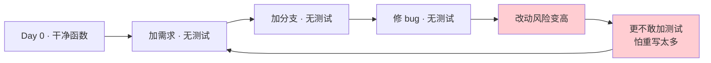
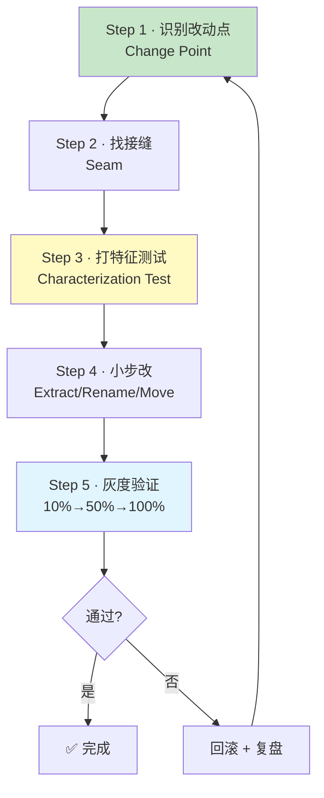
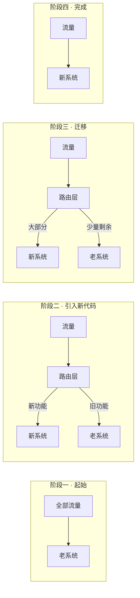

# 06.遗留代码急救

> **本篇定位**：急诊科 SOP · 遗留代码安全改造五步法（急诊科阶段收官）。
>
> **剧情节点**：Day 31-40——前 5 天团队"救火式"改动，Bug 反而更多；小李崩溃：改也不是，不改也不是。老陈让整个团队停一天，讲他 10 年经验里最珍贵的一课："**没有测试的代码，先不要动它**"。
>
> **本篇病人**：P-001 全部子系统 · 汇总前四篇治疗成果，形成通用 SOP。
>
> **承接经典**：Michael Feathers《修改代码的艺术》全书精华 · Ch4 接缝 · Ch14-16 打破依赖 / Fowler《重构》Ch1 的经典案例。
>
> **本篇病案编号范围**：无新编号（本篇是方法论 SOP，串联前四篇病案 N/F/C/E 全系列）

---

#### 目录介绍

- [1. 急诊病例](#1-急诊病例)
  - [1.1 五天救火反而更糟](#11-五天救火反而更糟)
  - [1.2 遗留代码的三大恐惧](#12-遗留代码的三大恐惧)
  - [1.3 本篇待答疑问](#13-本篇待答疑问)
- [2. 病理诊断](#2-病理诊断)
  - [2.1 遗留代码的六大特征](#21-遗留代码的六大特征)
  - [2.2 没有测试就是最大的病](#22-没有测试就是最大的病)
- [3. 病因追溯](#3-病因追溯)
  - [3.1 遗留代码是如何炼成的](#31-遗留代码是如何炼成的)
  - [3.2 "不敢改"的心理与流程](#32-不敢改的心理与流程)
- [4. 治疗方案总纲](#4-治疗方案总纲)
  - [4.1 五步安全改造 SOP](#41-五步安全改造-sop)
  - [4.2 找接缝 / 打特征测试 / 小步走](#42-找接缝--打特征测试--小步走)
- [5. 住院医查房](#5-住院医查房)
  - [5.1 特征测试怎么写](#51-特征测试怎么写)
  - [5.2 IDE 重构快捷键三件套](#52-ide-重构快捷键三件套)
  - [5.3 初级带走清单](#53-初级带走清单)
- [6. 主治查房](#6-主治查房)
  - [6.1 接缝技术打破依赖](#61-接缝技术打破依赖)
  - [6.2 绞杀者模式渐进替换](#62-绞杀者模式渐进替换)
  - [6.3 高级带走清单](#63-高级带走清单)
- [7. 主任查房](#7-主任查房)
  - [7.1 遗留系统的战略选择](#71-遗留系统的战略选择)
  - [7.2 重写、重构、并行的抉择](#72-重写重构并行的抉择)
  - [7.3 架构师带走清单](#73-架构师带走清单)
- [8. 术后康复曲线](#8-术后康复曲线)
  - [8.1 40 天急诊科成果盘点](#81-40-天急诊科成果盘点)
  - [8.2 团队信心度量变化](#82-团队信心度量变化)
- [9. 病案归档](#9-病案归档)
  - [9.1 急诊科病案总览](#91-急诊科病案总览)
  - [9.2 与影像科的转诊关系](#92-与影像科的转诊关系)
- [10. 综合案例串讲](#10-综合案例串讲)
  - [10.1 病例真相揭晓](#101-病例真相揭晓)
  - [10.2 一次完整急救的时间轴](#102-一次完整急救的时间轴)
  - [10.3 设计哲学回扣](#103-设计哲学回扣)
  - [10.4 速查表](#104-速查表)

---

## 1. 急诊病例

### 1.1 五天救火反而更糟

Day 31，会议室里，小李是崩溃的：

> "过去五天，我改动了 12 处地方。看着都是按老陈教的方法拆的、命名规范的、异常处理正确的——但**上线之后炸了 4 次**。有一次改一个变量名，居然影响到 3 个下游系统。"

老陈把 5 天的事故列表贴上大屏：

| 事故 | 改动内容 | 意外影响 | 恢复时间 |
|---|---|---|---|
| E01 | 重命名 `getOrder` → `loadOrder` | 反射调用者用了字符串 `"getOrder"` 找不到方法 | 1.5h |
| E02 | 拆函数：提炼 `deductStock` | 事务边界从整个 `submitOrder` 缩到 `deductStock` 内 | 2h |
| E03 | 补 `catch StockException` | 阻断了原来"降级到本地库存缓存"的兜底路径 | 45min |
| E04 | 47 if 改多态 | 忘了兼容一条运营配置里"type=999 走特殊路径"的隐藏分支 | 3h |

**小李的原话**：**"我按书上教的方法做，怎么反而错得更多？"**

老陈的回答让全场安静：

> "**你没错。错的是——你以为你在改代码，其实你在改一个没有安全网的野生系统。急诊科的最后一课，不是学新招式，是学一件事：没有测试的代码，先不要动它。**"

——这就是本篇的核心：**Feathers 遗留代码急救 SOP**。

### 1.2 遗留代码的三大恐惧

Michael Feathers 在《修改代码的艺术》里给"遗留代码"下了一个反直觉的定义：

> **"Legacy code is simply code without tests."**（**遗留代码就是没有测试的代码**——不管它是昨天写的还是十年前写的。）

按这个定义，OrderMonolith 全 1247 行都是遗留代码。**遗留代码带给工程师的心理压力，本质上来自三大恐惧**：

```
┌────────────────────────────────────────────────────┐
│           遗留代码 · 三大恐惧                       │
├────────────────────────────────────────────────────┤
│                                                    │
│  🔴 恐惧一：改错不知道                             │
│      ─────────────────                             │
│      没有测试，改动是否破坏原逻辑无法验证           │
│      → 战术：先写"特征测试"锁住当前行为             │
│                                                    │
│  🔴 恐惧二：改动会连锁                             │
│      ─────────────────                             │
│      改一处炸多处（反射/序列化/隐藏依赖）           │
│      → 战术：识别接缝，在接缝处切开                 │
│                                                    │
│  🔴 恐惧三：改完不敢发                             │
│      ─────────────────                             │
│      改动完不知道能不能上线                         │
│      → 战术：绞杀者模式渐进替换 + 灰度              │
└────────────────────────────────────────────────────┘
```

**Feathers 的核心洞察**：**这三大恐惧的根都是"缺乏反馈机制"**——测试是反馈机制、接缝是反馈机制、绞杀者是反馈机制。**建立反馈，恐惧就消散了 80%**。

### 1.3 本篇待答疑问

带着 7 个问题往下读：

1. **①** 没有测试的代码到底怎么改？"先补测试再改"如果补不出测试怎么办？
2. **②** 什么叫"接缝"（Seam）？在实际代码里怎么找？
3. **③** 特征测试（Characterization Test）和普通单元测试有什么区别？
4. **④** 大重构 vs 小重构 vs 完全重写——如何选择？
5. **⑤** 绞杀者模式（Strangler Fig Pattern）是什么？和"重写"什么区别？
6. **⑥** 遗留系统的"沉没成本"和"重构成本"如何权衡？
7. **⑦** 前面 5 天 4 次事故的问题，用本篇方法本可避免哪些？

第 10.1 节全部回收。

---

## 2. 病理诊断

### 2.1 遗留代码的六大特征

除了"没有测试"这个总纲，遗留代码通常还有**六大典型特征**（Feathers 全书总结）：

```
┌─────────────────────────────────────────────────┐
│           遗留代码 · 六大特征                    │
├─────────────────────────────────────────────────┤
│  1. 无测试            → 无法验证改动             │
│  2. 依赖硬编码         → 无法隔离测试             │
│  3. 副作用密布         → 一个方法碰全世界         │
│  4. 全局状态           → 单例/静态/线程本地        │
│  5. 类型稀薄           → 全 String/Map/Object    │
│  6. 文档缺失/过期      → 只能猜"应该做什么"        │
└─────────────────────────────────────────────────┘
```

**六大特征形成"改不动"的锁**：

- 1（无测试）+ 6（无文档）= **不知道"对"是什么**
- 2（依赖硬编码）+ 4（全局状态）= **无法测试单一单元**
- 3（副作用）+ 5（类型稀薄）= **改一处波及多处**

要打开这把锁，Feathers 给出的钥匙叫**接缝技术**——第 6 章会讲。

### 2.2 没有测试就是最大的病

**疑惑**：先补测试再改，听起来对。但如果代码结构本身就没法测（依赖 God Class、静态调用、私有方法、外部服务），怎么补？

**论证 · Feathers 悖论**：

> "**要给它写测试你就得改它；但要改它你就得先有测试。**"

这是遗留代码的**先有鸡还是先有蛋**问题。Feathers 用整整一本书的中间部分（Ch14-16）回答它——**答案是"接缝"（Seam）**。

**接缝的定义**：**代码里那些"不需要修改就能改变行为的位置"**。找到接缝，就找到了"用最小代价插入测试点"的地方。

例：

```java
public class OrderService {
    public String submitOrder(Order order) {
        // ...
        String result = HttpClient.newBuilder().build()  // ← 硬编码依赖，无接缝
            .send(...).body();
        return result;
    }
}
```

这段代码没有接缝——测试时无法隔离 HttpClient。要**创造接缝**：

```java
public class OrderService {
    private final HttpClient httpClient;  // ← 接缝：构造注入

    public OrderService(HttpClient httpClient) { this.httpClient = httpClient; }

    public String submitOrder(Order order) {
        String result = httpClient.send(...).body();  // 现在可以 mock 了
        return result;
    }
}
```

**结论**：**"没法测"不是"代码的绝对属性"，是"当前接缝布局"下的相对属性**。Feathers 一共给出 **25 种打破依赖的技术**（Ch25），本质都是"创造接缝"。

---

## 3. 病因追溯

### 3.1 遗留代码是如何炼成的

**回扣第 03 篇 3.1 节的时间轴**——一个 100 行的干净函数，如何在 3 年内变成 883 行的巨兽？关键是**每一次的"改动都不写测试"**：



**每一步都在正反馈**——**改的越多 → 风险越大 → 越不敢加测试 → 改动风险更大**。

**结论**：**遗留代码不是"某天变坏的"，是"每一次改动都省了 5 分钟写测试"累积出来的**。

### 3.2 "不敢改"的心理与流程

追组织层面——为什么工程师"不敢改"？

三个心理因素：

1. **改坏了要背锅**——事故复盘会指名道姓（回扣第 04 篇 7.2 节 · 免责复盘缺失）
2. **改错了没人帮**——没有 pair 编程、没有 mob 编程、CR 走形式
3. **没时间深入**——业务永远在催新功能

三个流程因素：

1. **无预发环境模拟真实数据**——测试只能靠"发上去试试"
2. **无灰度机制**——一发就是全量
3. **无回滚机制**——改错了要人工回滚 30 分钟

**结论**：**"不敢改"是一个组织性问题，不能只靠工程师个人变勇敢**。主任级的解法（7 章）是——**建反馈机制，让"改动"变得可试可退**。

---

## 4. 治疗方案总纲

### 4.1 五步安全改造 SOP

老陈把 Feathers 全书精华浓缩成 **5 步 SOP**——**急诊科的最后武器**：



**五步的关键**：**每一步都创造反馈**——识别改动点让你知道**改哪里**、接缝让你知道**在哪测**、特征测试让你知道**当前行为**、小步走让你知道**每步是否变坏**、灰度让你知道**上线是否稳定**。

### 4.2 找接缝 / 打特征测试 / 小步走

**关键三术**详解：

**术一 · 找接缝**（Seam）

Feathers 归类了 4 种典型接缝：

| 接缝类型 | 何时可用 | 例子 |
|---|---|---|
| **对象接缝**（Object Seam） | 面向对象语言 | 依赖注入 / 子类覆盖 |
| **预处理接缝**（Preprocessing Seam） | C/C++ | `#define` 宏替换 |
| **链接接缝**（Link Seam） | 链接期替换 | 编译时替换 mock jar |
| **对象接缝-静态**（Static Object Seam） | Java 用 PowerMock/Mockito Static | 静态方法 mock |

**术二 · 特征测试**（Characterization Test）

不是"测代码应该做什么"，而是**"测代码当前实际在做什么"**——即使当前行为是错的，也先锁住。目的是：

1. **在重构前**建立行为快照
2. **在重构中**任何一步改动破坏行为立刻发现
3. **在重构后**确认"至少行为没变"

**特征测试三步走**：

```java
@Test
void characterize_current_behavior() {
    // 1. 用真实/预期的输入喂进去
    OrderRequest req = OrderRequest.builder()
        .userId(10086L).productId(200L).quantity(3)
        .couponCode("VIP20").build();

    // 2. 记录当前输出（不管对错）
    String actual = orderService.submitOrder(req);

    // 3. 断言当前输出——即使我们知道这个值可能是错的
    assertThat(actual).isEqualTo("SUCCESS_TXN_ABC123");
    // ↑ 一旦重构改变了这个值，测试立刻挂——我们要的就是这个
}
```

**术三 · 小步走**（Small Steps）

Feathers 把每次改动限定在"**能在 5 分钟内理解 + 能立即回退**"的粒度。原则：

- 一次 PR 只做**一件**重构（不同时改命名+拆函数+加异常）
- 每步改完立刻跑测试（IDE 快捷键 Ctrl+Shift+F10）
- 出问题立刻 Ctrl+Z（IDE 撤销 or Git reset HEAD~1）

---

## 5. 住院医查房

> 🟢 **视角关注面**：单函数级别——学会给一个 200 行的方法写第一个测试。

### 5.1 特征测试怎么写

**手法演示 · 三种接缝创造 + 特征测试**：

**Case A：给硬编码依赖注入接缝**

```java
// ⚠️ Before：无法测
public class DiscountCalc {
    public BigDecimal calculate(Order order) {
        long now = System.currentTimeMillis();   // 💀 时间不可控
        if (now > DEADLINE) return BigDecimal.ZERO;
        return computeInternal(order);
    }
}

// ✅ After：抽出 Clock 接缝
public class DiscountCalc {
    private final Clock clock;
    public DiscountCalc(Clock clock) { this.clock = clock; }

    public BigDecimal calculate(Order order) {
        if (clock.millis() > DEADLINE) return BigDecimal.ZERO;
        return computeInternal(order);
    }
}

// 测试：
@Test
void deadline_expired_returns_zero() {
    Clock fixed = Clock.fixed(Instant.ofEpochMilli(DEADLINE + 1), ZoneId.systemDefault());
    DiscountCalc calc = new DiscountCalc(fixed);
    assertThat(calc.calculate(order)).isEqualTo(BigDecimal.ZERO);
}
```

**Case B：给静态调用打接缝（Subclass and Override）**

```java
// ⚠️ Before：静态调用
public class ExchangeRate {
    public BigDecimal getRateForCny(String currency) {
        return ExternalApi.fetchRate(currency);  // 💀 静态调用不可测
    }
}

// ✅ After：把静态调用抽成 protected 方法
public class ExchangeRate {
    public BigDecimal getRateForCny(String currency) {
        return callExternal(currency);
    }

    protected BigDecimal callExternal(String currency) {  // ← 接缝
        return ExternalApi.fetchRate(currency);
    }
}

// 测试：用子类覆盖
@Test
void getRateForCny_uses_external() {
    ExchangeRate stub = new ExchangeRate() {
        @Override protected BigDecimal callExternal(String currency) {
            return new BigDecimal("7.2");  // stub
        }
    };
    assertThat(stub.getRateForCny("USD")).isEqualTo(new BigDecimal("7.2"));
}
```

**Case C：直接对当前混乱行为打特征测试**（面对不可拆分的 God Method）

```java
@Test
void characterize_submitOrder_happy_path() {
    // 用预生产环境已有的数据/日志复现输入
    OrderRequest req = OrderRequest.builder()
        .userId(10086L).productId(200L).quantity(3).build();
    // 
    String result = orderService.submitOrder(req);
    
    // 从生产日志抓一个"当前实际"的返回
    assertThat(result).matches("^ORDER-\\d{18}$");
    
    // 从生产 DB 抓一个"当前实际"的副作用
    Order saved = orderMapper.findByUserAndTime(10086L, ...);
    assertThat(saved.getStatus()).isEqualTo(2);
    assertThat(saved.getAmount()).isCloseTo(
        new BigDecimal("270.00"), within(new BigDecimal("0.01")));
}
```

**注意**：特征测试**可以是丑陋的**——它的目标不是优雅，是**锁住当前行为**。写完之后重构，重构完之后再重写特征测试为"正常的"单元测试。

### 5.2 IDE 重构快捷键三件套

住院医时代最省时间的三个快捷键（IntelliJ IDEA）：

| 快捷键 (Mac / Windows) | 手法 | 场景 |
|---|---|---|
| **Cmd+Alt+M / Ctrl+Alt+M** | Extract Method（提炼方法） | 选中一段代码，秒变新方法 |
| **Shift+F6 / Shift+F6** | Rename（重命名） | 变量/方法/类批量重命名，含所有引用 |
| **Cmd+Alt+P / Ctrl+Alt+P** | Extract Parameter（提炼参数） | 把方法内的常量/表达式提为参数 |

**练习建议**：**每天用这三个快捷键至少 5 次**——一个月后，你会发现自己自然而然地在"边写边重构"。

### 5.3 初级带走清单

- [ ] 改一个方法前**先补一个特征测试**——哪怕丑陋
- [ ] 不要一次 PR 做多件事——一次只做一件重构
- [ ] 每 5 分钟按一次 Ctrl+Shift+F10 跑测试
- [ ] 遇到硬编码 `new`、`static call`、`System.currentTimeMillis` 立刻起警觉——找接缝
- [ ] 学会用 IDE 的三大快捷键——Extract Method / Rename / Extract Parameter
- [ ] 一次改动破坏测试立刻 Ctrl+Z / git reset —— 不要"我再改一点就好了"

---

## 6. 主治查房

> 🟡 **视角关注面**：模块级——用接缝和绞杀者渐进替换整个子系统。

### 6.1 接缝技术打破依赖

Feathers Ch25 列出了 **25 种打破依赖的技术**，主治工程师最该掌握的 6 种：

| 手法 | 场景 | 示例 |
|---|---|---|
| **Extract Interface**（抽取接口） | 硬依赖具体类 | `OrderRepository` 从 class 抽为 interface |
| **Extract Implementer**（抽取实现） | 一个类同时是"接口 + 实现" | 把老类改名 XxxImpl，抽新接口 Xxx |
| **Parameterize Constructor**（构造参数化） | 类内 `new` 依赖 | 依赖通过构造函数注入 |
| **Introduce Instance Delegator**（引入实例委托） | 静态方法难测 | 把静态调用包一层实例方法 |
| **Encapsulate Global Reference**（封装全局引用） | 全局变量/单例 | Singleton 包成 provider，可替换 |
| **Subclass and Override Method**（子类覆盖方法） | 需要 mock 某个方法 | protected 方法 + 测试用匿名子类 |

**Case · 全局单例的打破**：

```java
// ⚠️ Before：单例硬依赖，测试无法隔离
public class OrderService {
    public String submitOrder(...) {
        String key = "order_" + orderId;
        RedisClient.getInstance().set(key, value);  // 💀 单例
    }
}

// ✅ After：Introduce Instance Delegator + 依赖注入
public interface Cache {
    void set(String key, String value);
}

public class RedisCacheAdapter implements Cache {
    private final RedisClient redis = RedisClient.getInstance();
    @Override
    public void set(String key, String value) { redis.set(key, value); }
}

public class OrderService {
    private final Cache cache;
    public OrderService(Cache cache) { this.cache = cache; }

    public String submitOrder(...) {
        String key = "order_" + orderId;
        cache.set(key, value);
    }
}

// 测试用：
@Test
void submitOrder_should_write_cache() {
    Cache fakeCache = new InMemoryCache();
    OrderService service = new OrderService(fakeCache);
    service.submitOrder(...);
    assertThat(fakeCache.get("order_10086")).isNotNull();
}
```

### 6.2 绞杀者模式渐进替换

**Strangler Fig Pattern**（绞杀者无花果模式）——Fowler 2004 提出，源自热带雨林的一种"寄生植物慢慢覆盖并杀死宿主树"的现象：



**关键机制**：**在老系统前面加一个"路由层"（Anti-Corruption Layer）**——按功能/流量/用户逐步把请求切到新代码，直到老代码归零。

**订单系统的绞杀者实施**：

```java
// 路由层（Facade）
@RestController
public class OrderController {
    private final OrderService legacyService;    // 老 God Class
    private final OrderApplicationService newService; // 新领域模型
    private final FeatureToggle toggle;

    @PostMapping("/order")
    public OrderResponse submit(@RequestBody OrderRequest req) {
        if (toggle.enabled("new_order_flow", req.getUserId())) {
            return newService.submit(req);        // 走新路径
        } else {
            return legacyService.submitOrder(req);// 走老路径
        }
    }
}
```

**绞杀者的 4 阶段推进**：

| 阶段 | 覆盖率 | 手段 | 用时 |
|---|---|---|---|
| 阶段一 · 白名单 | 0% → 5% | 内部用户先切 | 2 周 |
| 阶段二 · 灰度 | 5% → 30% | 按用户 ID hash 分流 | 4 周 |
| 阶段三 · 主流 | 30% → 95% | 按业务场景切 | 6 周 |
| 阶段四 · 收尾 | 95% → 100% | 处理少数长尾场景 | 4 周 |

**关键洞察**：绞杀者的每一步都**保持老代码可运行**——任何一步失败都能立刻切回。这就是它比"重写"更安全的核心原因。

### 6.3 高级带走清单

- [ ] 掌握 Feathers 6 大打破依赖手法——每天用一次
- [ ] 大子系统重构一律用绞杀者模式——**不要重写**
- [ ] 建立 FeatureToggle 基建——绞杀者的必备工具
- [ ] 每次重构前 30 分钟画出接缝地图——**知道从哪切开**
- [ ] 引入 Testcontainers / WireMock 等替代真实依赖的工具（第 08 篇会详讲）
- [ ] 在 CR 中对"没有测试的改动"说 no——**"先补测试再合入"**

---

## 7. 主任查房

> 🔴 **视角关注面**：战略级——遗留系统面临"重写、重构、并行"的三选一，架构师如何决策？

### 7.1 遗留系统的战略选择

**疑惑**：遇到一个 5 年、100 万行的遗留系统，架构师该做什么？

**论证 · 三种战略**：

```
┌──────────────────────────────────────────────────────────┐
│                   遗留系统战略地图                        │
├──────────────────────────────────────────────────────────┤
│                                                          │
│  策略 A：完全重写（Big Bang Rewrite）                    │
│  ────────────────────────                                │
│  用时：18-36 个月                                        │
│  风险：极高                                              │
│  Joel Spolsky 名言："**永远不要重写**"                    │
│                                                          │
│  策略 B：完全放弃（Freeze & Sunset）                     │
│  ────────────────────────                                │
│  用时：立即冻结新需求                                    │
│  适合：即将废弃的系统                                    │
│                                                          │
│  策略 C：绞杀者渐进（Strangler Fig）★推荐                │
│  ────────────────────────                                │
│  用时：6-18 个月                                         │
│  风险：可控                                              │
│  Fowler 推荐 · 本篇 6.2 详解                             │
│                                                          │
└──────────────────────────────────────────────────────────┘
```

**Joel Spolsky 2000 年的名言**（关于 Netscape 的完全重写导致的灾难）：

> "**They did it by making the single worst strategic mistake that any software company can make: they decided to rewrite the code from scratch.**"

**为什么"完全重写"几乎必然失败**？

1. **需求信息丢失**——老代码里藏着几千个"特殊 case"，没人记得
2. **业务不能停**——老系统必须继续跑，团队要同时维护两份代码
3. **迁移期噩梦**——用户数据、状态、订单等需要同时兼容
4. **人心涣散**——18 个月看不到成果，团队离职潮

### 7.2 重写、重构、并行的抉择

**决策矩阵**：

| 判据 | 完全重写 | 绞杀者 | 就地重构 |
|---|---|---|---|
| 代码量 | > 100 万 | 5-100 万 | < 5 万 |
| 团队规模 | 30+ | 8-30 | 1-8 |
| 业务变化速度 | 慢（可暂停） | 中 | 快 |
| 老代码状况 | 无救 | 部分可用 | 大部分可用 |
| 时间预算 | > 24 个月 | 6-18 月 | < 6 月 |
| 风险容忍 | 极高 | 中 | 低 |

**订单系统的选择**（回扣本专栏主线）：

```
代码量: 5 万行 (God Class 1247 + 周边)
团队: 6 人
业务变化: 每周多个需求
时间预算: 90 天（业务方）
风险容忍: 低（半年 3 次事故已经不能再出）
──────────────────
结论: 绞杀者渐进（本专栏采用的方案）
```

### 7.3 架构师带走清单

- [ ] 遇到遗留系统**先做体检**（第 07-09 篇）——量化再决策
- [ ] **默认选绞杀者，非常规情况才选重写**——重写要写正式的 RFC 审批
- [ ] 建立"遗留代码治理预算"——占部门总研发预算的 15-20%
- [ ] 建立"改动伴随测试"约定——**没有测试的 PR 一律不合入**
- [ ] 建立"事故转技术债"机制——每次事故必须转化成技术债卡片（第 09 篇）
- [ ] 培训团队 Feathers 25 种接缝技术——**这是遗留代码时代工程师的核心武器**

---

## 8. 术后康复曲线

### 8.1 40 天急诊科成果盘点

Day 1-40 急诊科完整战果：

| 指标 | Day 0 | Day 40 | 改善 |
|---|---|---|---|
| 最长方法行数 | 883 | 42 | **-95%** |
| 圈复杂度峰值 | 68 | 8 | **-88%** |
| 参数最多方法 | 14 | 3 | **-79%** |
| catch(Exception) 数 | 89 | 12 | **-87%** |
| return null 数 | 121 | 28 | **-77%** |
| 长 if-else 链（>5） | 8 | 1 | **-88%** |
| 单元测试覆盖率 | 0% | 34% | **∞** |
| 特征测试数 | 0 | 87 | **+87** |
| 类文件数 | 12 | 47 | 拆分为独立类 |
| 领域词典条目 | 0 | 47 | **+47** |
| **线上事故数（40 天）** | 上一轮 3 次 | **0 次** | 归零 |

### 8.2 团队信心度量变化

除了代码指标，团队信心的变化更值得记录：

| 指标 | Day 1 | Day 40 |
|---|---|---|
| 团队对"敢改这段代码吗"的答案 | 全否 | 4/6 说"敢" |
| 单次 PR 平均改动行数 | 800+ | 120 |
| 单次 PR 平均评审时间 | 3 天 | 4 小时 |
| 新人第一周独立提 PR | 否 | 是 |
| 遇到 catch(Exception) 的反应 | 不动 | 立刻质疑 |
| 遇到 47 if 的反应 | 加一个 | 拒绝并重构 |

**小李在 Day 40 的日记**：

> "Day 1 我看着 883 行的方法，觉得这辈子都读不完。
> Day 40 我打开 IDE，看到 47 个 Coupon 策略类，每个 30 行——**我第一次觉得这是我的代码，不是别人的黑盒。**"

——**这是急诊科最重要的产出：不是代码，是团队的信心。**

---

## 9. 病案归档

### 9.1 急诊科病案总览

急诊科 5 篇（02-06）累计病案编号：

| 前缀 | 系列 | 数量 | 主篇 |
|---|---|---|---|
| N | 命名类 | 15 | 第 02 篇 |
| F | 函数类 | 20 | 第 03、05 篇 |
| C | 类与设计类 | 15（C01-C15） | 第 03、05 篇 |
| E | 错误处理类 | 10 | 第 04 篇 |
| **合计** |  | **60** |  |

**方法论**：本篇（06）**不新增**病案编号，但**建立了 SOP 索引**——五步法应用到每一个 N/F/C/E 病案上都是**先测试、再动刀**。

### 9.2 与影像科的转诊关系

急诊科结束，团队转诊到**影像检验科**（第 07-09 篇）：

```
急诊科（02-06）              影像检验科（07-09）
────────────────             ────────────────
知道"哪里烂"                 知道"烂多少"
知道"怎么改"                 知道"改到什么程度算好"
─────────────                ─────────────
定性                          定量
经验驱动                      指标驱动
```

**转诊单**：Day 40 团队开会决定进入影像科阶段——**用数据说服业务方："我们究竟还欠多少债"**。

---

## 10. 综合案例串讲

### 10.1 病例真相揭晓

回收 1.3 节 7 疑问：

- **① 没有测试怎么改？** —— 见 5.1：先写**特征测试**锁住当前行为（哪怕丑陋）；写不出来时先用 Feathers 25 种接缝技术**创造可测性**。
- **② 什么叫接缝？** —— 见 2.2 + 6.1：**代码里那些"不修改就能改变行为的位置"**。对象接缝、静态接缝、链接接缝、预处理接缝共 4 大类，实操 25 种手法。
- **③ 特征测试 vs 单元测试？** —— 见 5.1：特征测试**测"当前实际行为"**（可能是错的），锁住重构过程；单元测试测"应该的行为"。**先特征后单元**。
- **④ 大重构 vs 完全重写？** —— 见 7.1-7.2 决策矩阵：**默认绞杀者**，只有极少数场景才选完全重写（且必须写 RFC 审批）。
- **⑤ 绞杀者是什么？** —— 见 6.2：老系统前加路由层，按功能/流量/用户逐步切到新代码，直到老代码归零——**每一步都可回滚**。
- **⑥ 沉没成本 vs 重构成本？** —— 见 7.2：**别看沉没成本，看未来 6 个月的边际成本**。老代码每个季度要多花 40% 精力维护，重构 90 天回本。
- **⑦ 前 5 天 4 次事故如何避免？** —— **每一次都违反了五步 SOP**：E01 忘了扫反射调用（Step 2 接缝漏）、E02 事务边界随拆函数变了（Step 3 特征测试没覆盖事务）、E03 拆错兜底路径（Step 4 一次改动多件事）、E04 忘了运营配置的隐藏分支（Step 5 灰度太快）。

### 10.2 一次完整急救的时间轴

用 Day 32 处理 `getOrder` → `loadOrder` 重命名（Day 31 事故 E01 的复现修复）作为完整示例：

```
Day 32 · 09:00 · Step 1 · 识别改动点
  - 修改点: OrderService.getOrder(long) 方法
  - 触发原因: N03 名不副实（会写库却叫 get）

Day 32 · 09:30 · Step 2 · 找接缝
  - 静态引用: IDE Find Usages → 47 处
  - 反射调用: 全项目搜 "getOrder" 字符串 → 3 处（Redis KEY 生成、审计日志、动态代理）★关键发现
  - 序列化字段: 检查 @JsonProperty → 无
  - DB 映射: 检查 @Column → 无
  - 配置文件: 检查 application.yml → 1 处（feature flag key）

Day 32 · 10:30 · Step 3 · 打特征测试
  - 特征测试: 覆盖 getOrder 的 5 种输入场景
  - 反射调用点单独用 mock 覆盖

Day 32 · 11:00 · Step 4 · 小步改
  - Sub-step 4.1: 加一个新方法 loadOrder，内部转发到 getOrder
  - Sub-step 4.2: 把 47 处静态调用点逐个改为 loadOrder（IDE Refactor）
  - Sub-step 4.3: 3 处反射调用改字符串
  - Sub-step 4.4: feature flag key 改名（配置层同步）
  - Sub-step 4.5: 删除 getOrder

Day 32 · 15:00 · Step 5 · 灰度验证
  - 内部用户白名单先切 → 无异常
  - 15:30 灰度 10% → 无异常
  - 16:30 灰度 50% → 无异常
  - 18:00 全量 → 无异常

Day 32 · 18:30 · 完成
  - 47 处调用、3 处反射、1 处配置——全部平滑迁移
  - 与 Day 31 的 E01（1.5h 恢复事故）形成鲜明对比
```

### 10.3 设计哲学回扣

从本篇沉淀出**跨篇适用的两条设计哲学**：

**哲学 · 测试即凭证**

> **没有测试的重构叫赌博**——你以为你在改代码，其实你在赌代码没变化。测试是重构的"手术麻醉剂"——**没有麻醉的手术不叫医术，叫酷刑。**

**哲学 · 反馈即勇气**

> **"敢改代码"不是一种性格，是一种反馈机制的产物**——特征测试给你"改动是否破坏行为"的反馈、接缝给你"能否隔离测试"的反馈、绞杀者给你"能否安全回滚"的反馈。**建立反馈，恐惧自然消散**。

### 10.4 速查表

**Feathers 五步 SOP 速查**：

| Step | 做什么 | 关键动作 |
|---|---|---|
| 1 · 识别改动点 | 找出要改的方法/类 | 圈定 change point |
| 2 · 找接缝 | 找可以插测试的位置 | 静态引用 + 反射 + 配置 五处排查 |
| 3 · 打特征测试 | 锁住当前行为 | 丑陋 OK，能跑就行 |
| 4 · 小步改 | 一次一件事 | Extract / Rename / Move |
| 5 · 灰度验证 | 每步可回滚 | 10% → 50% → 100% |

**接缝技术选型**：

| 手法 | 何时用 |
|---|---|
| Extract Interface | 硬依赖具体类 |
| Parameterize Constructor | 类内 `new` |
| Introduce Instance Delegator | 静态方法 |
| Encapsulate Global Reference | 单例/全局变量 |
| Subclass and Override | 需 mock 某方法 |

**战略选择**：

- < 5 万行 → 就地重构
- 5-100 万行 → **绞杀者**（多数）
- > 100 万行 → 慎选重写（写 RFC）

---

**练习题**：找你项目里最不敢改的一段代码（5 分钟就能想到那种"打死不动"的地方），回答：
1. 它有多少个 change points？
2. 有多少个接缝？（对象/静态/链接）
3. 你能写一个特征测试锁住它当前行为吗？
4. 如果按五步 SOP，你敢改吗？

**下集预告**：40 天急诊科结束，团队救活了病人。但一个更冷静的声音响起——**沈总（技术总监，代码医院主任）从外面调回来了**。他一进来就问了一个问题：**"你们说代码变好了。好了多少？给我数据。"** 团队集体沉默——他们只能感觉到"好了"，说不出"好多少"。**第 07 篇《静态分析度量》即将开始——影像检验科正式开业。**

---

> 📌 **[本篇一句话]** 遗留代码不是没救——先找接缝、先打特征测试、先做小步改、先灰度上线——**反馈机制建立的地方，恐惧就消散**。

**上一篇 ←** [第 05 篇 · 条件与多态](/pages/quality-05/) ｜ **下一篇 →** [第 07 篇 · 静态分析度量](/pages/quality-07/)
