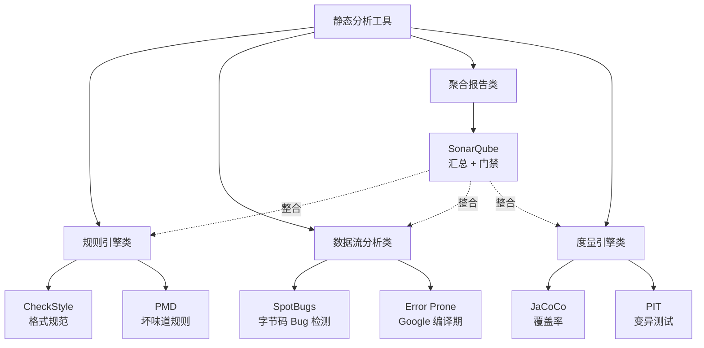

# 07.静态分析度量诊断

> **本篇定位**：影像与检验科开科第一篇 · 给代码"拍片子"。
>
> **剧情节点**：Day 41-46——急诊科阶段告一段落，沈总介入，问了老陈一个刁钻问题："你说改好了，改好多少？拿数据说话。"团队第一次上 SonarQube。
>
> **本篇病人**：P-001 全系统 · 用度量指标重新审视重构成果，同时暴露仍未被发现的隐藏病灶。
>
> **承接经典**：《代码大全》Ch19-22 度量 / McCabe《A Complexity Measure》1976 · 圈复杂度原始论文 / SonarQube《Code Quality Handbook》。
>
> **本篇病案编号范围**：D01-D05（技术债度量类前半） + A01-A05（架构度量类前半）

---

#### 目录介绍

- [1. 急诊病例](#1-急诊病例)
  - [1.1 改好了多少](#11-改好了多少)
  - [1.2 全量扫描震撼](#12-全量扫描震撼)
  - [1.3 本篇待答疑问](#13-本篇待答疑问)
  - [1.4 一句话回顾](#14-一句话回顾)
  - [1.5 归档要点](#15-归档要点)
- [2. 病理诊断](#2-病理诊断)
  - [2.1 三大核心指标](#21-三大核心指标)
  - [2.2 圈与认知对比](#22-圈与认知对比)
  - [2.3 一句话回顾](#23-一句话回顾)
  - [2.4 核心要点](#24-核心要点)
  - [2.5 常见误区](#25-常见误区)
- [3. 病因追溯](#3-病因追溯)
  - [3.1 感觉不到债](#31-感觉不到债)
  - [3.2 无度量的代价](#32-无度量的代价)
  - [3.3 一句话回顾](#33-一句话回顾)
  - [3.4 归因链条](#34-归因链条)
  - [3.5 常见误区](#35-常见误区)
- [4. 治疗方案总纲](#4-治疗方案总纲)
  - [4.1 工具选型地图](#41-工具选型地图)
  - [4.2 四步阅读法](#42-四步阅读法)
  - [4.3 一句话回顾](#43-一句话回顾)
  - [4.4 核心要点](#44-核心要点)
  - [4.5 带走清单](#45-带走清单)
- [5. 住院医查房](#5-住院医查房)
  - [5.1 IDE 立刻开用](#51-ide-立刻开用)
  - [5.2 方法级三指标](#52-方法级三指标)
  - [5.3 一句话回顾](#53-一句话回顾)
  - [5.4 常见误区](#54-常见误区)
  - [5.5 初级带走清单](#55-初级带走清单)
- [6. 主治查房](#6-主治查房)
  - [6.1 Sonar 门禁设计](#61-sonar-门禁设计)
  - [6.2 度量陷阱反例](#62-度量陷阱反例)
  - [6.3 一句话回顾](#63-一句话回顾)
  - [6.4 核心要点](#64-核心要点)
  - [6.5 高级带走清单](#65-高级带走清单)
- [7. 主任查房](#7-主任查房)
  - [7.1 度量的政治学](#71-度量的政治学)
  - [7.2 KPI 化三陷阱](#72-kpi-化三陷阱)
  - [7.3 一句话回顾](#73-一句话回顾)
  - [7.4 观察与激励分离](#74-观察与激励分离)
  - [7.5 架构带走清单](#75-架构带走清单)
- [8. 术后康复曲线](#8-术后康复曲线)
  - [8.1 前后对比](#81-前后对比)
  - [8.2 持续改进](#82-持续改进)
  - [8.3 一句话回顾](#83-一句话回顾)
  - [8.4 带走清单](#84-带走清单)
- [9. 病案归档](#9-病案归档)
  - [9.1 D 系列全表](#91-d-系列全表)
  - [9.2 关联病案索引](#92-关联病案索引)
  - [9.3 一句话回顾](#93-一句话回顾)
  - [9.4 归档要点](#94-归档要点)
- [10. 综合案例串讲](#10-综合案例串讲)
  - [10.1 病例真相揭晓](#101-病例真相揭晓)
  - [10.2 一次度量流程](#102-一次度量流程)
  - [10.3 设计哲学回扣](#103-设计哲学回扣)
  - [10.4 速查一图流](#104-速查一图流)
  - [10.5 全文快速回顾](#105-全文快速回顾)
  - [10.6 核心要点串联](#106-核心要点串联)
  - [10.7 常见误区汇总](#107-常见误区汇总)
  - [10.8 带走清单总表](#108-带走清单总表)

---

## 1. 急诊病例

### 1.1 改好了多少

Day 41，急诊科阶段刚收官，团队本以为可以喘一口气。沈总从上海总部飞过来做季度复盘，会议室里，他把老陈准备的 PPT 放下，只问了一句话：

> "你们说改好了。**好了多少？给我数据。**"

老陈愣了一下，说：

> "OrderService 从 1247 行拆到大约 300 行，函数抽出来了 20 多个，异常处理规范了……"

沈总打断他：

> "我不问你**做了什么**。我问你**改了多少债**。"
>
> "重构不是绣花——是修桥。修桥的人不会说'我今天焊得挺卖力'——他会说'承重从 8 吨提到 12 吨、锈蚀点从 47 处降到 3 处'。**你们现在只有感觉，没有度量——这叫感觉良好，不叫质量提升。**"

全场沉默。小李后来回忆：

> "那一刻我才意识到——**我们过去 40 天像医生凭手感做手术**——切了、缝了、拆了、绑了——但**没有任何 X 光片和血液检查**。**如果我们主观感觉都是可信的，那病人是怎么病到 1247 行的？**"

——这就是本篇的起点：**影像与检验科开科**。

### 1.2 全量扫描震撼

Day 42 早上，团队第一次接入 SonarQube 做全量扫描。20 分钟后，报告出来。老陈把首页截图投上大屏：

```
┌──────────────────────────────────────────────────────────┐
│   Project: OrderMonolith             扫描时间：Day 42    │
├──────────────────────────────────────────────────────────┤
│   Lines of Code           :   137,842                    │
│   Duplicated Lines (%)    :      18.7%   [E]  ★         │
│   Cyclomatic Complexity   :    12,479                    │
│   Cognitive Complexity    :    28,140    [E]  ★         │
│   Code Smells             :    3,842                     │
│   Bugs                    :      127                     │
│   Vulnerabilities         :       34                     │
│   Security Hotspots       :       89                     │
│   Test Coverage           :       4.2%   [E]  ★         │
│   Technical Debt          :  312 days  ≈ 62 人周         │
│   Debt Ratio (SQALE)      :      27.4%   [E]  ★         │
├──────────────────────────────────────────────────────────┤
│   Reliability Rating      :  E  (最差)                   │
│   Maintainability Rating  :  E  (最差)                   │
│   Security Rating         :  D                           │
└──────────────────────────────────────────────────────────┘
```

**几个数字触目惊心**：

- **认知复杂度 28,140**——比圈复杂度还高一倍。团队从没听说过这个指标。
- **重复代码 18.7%**——将近五分之一的代码是复制粘贴。老陈一直以为已经"清理过一轮"了。
- **技术债 312 人天**——按团队 5 个人算，还债 62 周，超过一年。
- **可维护性评级 E**——SonarQube 的最低档，意味着"改一个 1 行的小需求平均要多花 50% 时间"。

沈总看完报告，只说了一句话：

> "**你们急诊科的 40 天，只让 OrderService 一个方法变好了。全系统 137,842 行——你们连自己在哪里都不知道**。"

老陈没辩解——他自己也第一次看到这个尺度。

### 1.3 本篇待答疑问

Day 42 下午的复盘会，团队列出 6 个必须回答的问题——每一个都要在本篇末尾找到答案：

> **① 「代码烂」是一种感觉——如何把它翻译成客观数字？**
>
> **② 圈复杂度、认知复杂度、Halstead——这些指标到底在测什么？该看哪个？**
>
> **③ 100% 测试覆盖率 = 代码没问题吗？0% 覆盖率的代码一定烂吗？**
>
> **④ SonarQube / CheckStyle / SpotBugs / PMD——为什么要装四套？装一个不行吗？**
>
> **⑤ 我们过去 40 天真的"改好"了吗？度量数据能不能验证？**
>
> **⑥ 度量一旦变成 KPI，会不会催生"刷指标"的畸形代码？**

第 10 章会**逐条**回答。

### 1.4 一句话回顾

**Debt Ratio 27.4%、认知复杂度 28,140——团队第一次用数字看到自己的病灶。**

### 1.5 归档要点

- **一个尴尬时刻**：沈总要数据，团队只有感觉
- **一份基线报告**：18.7% 重复、312 人天债务、4.2% 覆盖率
- **一个思想钢印**：**没有度量的改进都是玄学**

---

## 2. 病理诊断

### 2.1 三大核心指标

代码度量的世界里有几十种指标，团队常常一上来就装 20 个 Sonar 规则，然后被淹没。**本篇只聚焦三大核心**——理解了这三个，其余都是变种。

📋 病案编号：**D01**
📛 病名：**度量空白（Measurement Blindness）**
🔍 主诉：团队只能凭感觉判断代码好坏，无法回答"改好了多少"
🩺 检查：全项目未接入任何静态分析工具，PR 无度量准入门槛
💊 处方：**接入 SonarQube 建立基线 → 每次 PR 触发扫描 → 三大指标可视化**
📖 出处：McConnell《代码大全》Ch28 "管理构建" / SonarSource《Code Quality Handbook》
🔗 关联病案：D02（度量恐惧）、D03（伪造覆盖率）

**三大核心指标一览**：

| 指标 | 英文 | 测什么 | 阈值参考（方法级） |
|---|---|---|---|
| **圈复杂度** | Cyclomatic Complexity | 独立路径数 = 决策点数 + 1 | ≤10 优 · ≤15 良 · >20 危 |
| **认知复杂度** | Cognitive Complexity | 人**理解代码**所需脑力 | ≤7 优 · ≤15 良 · >20 危 |
| **耦合度** | Coupling / CBO | 类被多少其它类引用 & 引用多少 | 出+入 ≤14（Robert Martin） |

**为什么是这三个，不是别的**？

**疑惑**：Halstead 复杂度、可维护性指数（MI）、LCOM4——这些指标也很有名，为什么不选它们？

**论证**：

1. **Halstead 复杂度**基于操作符/操作数计数，1977 年提出，**实证与"缺陷密度"的相关性只有 0.3-0.5**（IEEE TSE 多篇复现研究），不如圈复杂度稳。
2. **可维护性指数（MI）** = 171 - 5.2·ln(V) - 0.23·CC - 16.2·ln(LOC)——**是复合指标**，出问题不知道该改哪一项，工程上难落地。
3. **LCOM4** 衡量类内聚，但**对 Spring 那种被容器管理的类会严重误报**（每个 @Autowired 字段被算作"孤立组件"）。
4. 反观**圈复杂度**：McCabe 1976 年提出，**与 Bug 密度相关性 0.7 以上**，是软件工程界重复验证最扎实的指标。
5. **认知复杂度**是 SonarSource 2017 年在 G. Ann Campbell 的白皮书里提出的**圈复杂度的修正版**——同样值 15 的圈复杂度，深层嵌套的代码人读起来比扁平的 switch 累得多。
6. **耦合度**是唯一能反映"改动扩散半径"的指标——你改一个类，多少人受影响，一目了然。

**结论**：**三大指标覆盖了"代码内部难度（认知）+ 结构难度（圈复杂度）+ 外部依赖（耦合）"**——**先把这三个建起来，再谈其余**。

### 2.2 圈与认知对比

这是本篇最容易混淆的一对指标。团队第一次读 Sonar 报告时，全员卡在这个问题上。**用一段真实代码对比最直观**：

```java
// ⚠️ 反面教材 · OrderService.calculateDiscount 简化版
public BigDecimal calculateDiscount(Order o) {
    BigDecimal d = BigDecimal.ZERO;
    if (o.getUser() != null) {                        // +1  (CC=2)
        if (o.getUser().getLevel() >= 5) {            // +1  (CC=3) 认知 +2 (嵌套)
            if (o.getAmount().compareTo(               // +1  (CC=4) 认知 +3 (嵌套 2)
                new BigDecimal("100")) > 0) {
                if (o.getType() == 1                   // +1  (CC=5) 认知 +4 (嵌套 3)
                    || o.getType() == 2) {             // +1  (CC=6) 认知 +1 (||)
                    d = o.getAmount()
                       .multiply(new BigDecimal("0.1"));
                }
            }
        }
    }
    return d;
}
//   圈复杂度 CC = 6
//   认知复杂度       = 2 + 3 + 4 + 1 = 10   ← 比 CC 高 4！
```

**核心差异一览**：

| 结构 | 圈复杂度增量 | 认知复杂度增量 | 原因 |
|---|---|---|---|
| `if / else if / else` | +1 每个分支 | +1 每个分支 | 一致 |
| **嵌套** if 在 if 里 | 仍然 +1 | **+1 × 嵌套层数** | 人脑读嵌套更累 |
| `&& / \|\|` | +1 | +1（每个额外的） | 一致 |
| `switch/case` | +1 每个 case | **+1（整个 switch 只 +1）** | switch 结构清晰 |
| **递归** | 不计 | **+1** | 认知增加 |
| `?:` 三元 | +1 | +1 | 一致 |
| **跳出** break/continue 到标签 | 不计 | **+1** | 打断线性阅读 |

**一句话本质**：
- **圈复杂度**测**测试用例数下限**——独立路径数即最少测试用例数。
- **认知复杂度**测**代码可读性成本**——人脑加载多少个"栈帧"才能读懂。

**为什么两个都要看**？

- 一段 `switch` 20 个 case 的代码，**圈复杂度 20 但认知复杂度只有 20**（每个 case 只 +1）——CC 报警，认知不报警，说明"结构差但可读"，可以先放。
- 一段 3 层嵌套 if 的代码，**圈复杂度只有 5 但认知复杂度 15**——认知报警而 CC 不报警，说明"结构可测但难读"，是**下一次重构的第一目标**。

**结论**：**认知复杂度是圈复杂度的"体感修正"**——两个都建门禁、认知 ≤15 优先卡。

### 2.3 一句话回顾

**三大指标 = 圈复杂度 + 认知复杂度 + 耦合度——覆盖 80% 的代码烂感。**

### 2.4 核心要点

- **圈复杂度**：测试用例数下限，Bug 密度相关性 0.7+
- **认知复杂度**：人脑加载栈帧数，嵌套敏感
- **耦合度**：改动扩散半径，出+入 ≤14

### 2.5 常见误区

- ❌ 认为 Halstead / MI / LCOM4 也要看——**先建三大核心，再谈其余**
- ❌ 只看均值忽略 P95——**平均值掩盖最烂的 20%**
- ❌ 只看圈复杂度不看认知——**"结构可测但难读"的方法漏网**

---

## 3. 病因追溯

### 3.1 感觉不到债

老陈复盘 40 天：为什么我们坚持写了 8 年代码，直到 Sonar 报告出来才看到 27.4% 的债？三个真实原因：

**原因一：技术债的"温水煮青蛙"效应**

代码不像财务：**没有月度报表**。每天多加 10 行、每周多复制 3 个函数——**单次都在无感区**，日积月累就到了报表上的 137,842 行。

**原因二：所有权分散**

`OrderService` 有 89 个调用者，**没有任何一个团队"完全拥有"它**。每个人只改自己那一段——**没人对整体质量负责**，就等于所有人都不负责。

**原因三：度量语言缺失**

老陈发起过重构，但**当他和产品娟姐说"这段代码要重构"时，娟姐问"重构完能提升多少"，老陈答不出来**——她的世界里，一切都用"用户数、GMV、DAU"计价，代码质量没有单位。

📋 病案编号：**D02**
📛 病名：**度量恐惧（Metric Aversion）**
🔍 主诉：团队害怕度量——因为一旦度量了就要负责
🩺 检查：曾有过 SonarQube 试点，因为报告"太难看"被弃用
💊 处方：**先建基线不追责 → 只观察不惩罚 → 3 个月后再谈门禁**
📖 出处：Kent Beck《Extreme Programming Explained》信任建立章节

### 3.2 无度量的代价

我们用一份数据说话——**Day 41 之前团队做的"改进"里，有多少是白改的**：

| 改动 | 团队感觉 | Sonar 实测 | 差异 |
|---|---|---|---|
| 拆分 `submitOrder` | 复杂度大幅降低 | CC 从 68 → 22 ✅ | 感觉与数据一致 |
| "统一"异常处理 | 应该更健壮了 | Bug 数 105 → 127 ⚠️ **变多** | 引入了新的空指针 |
| "重命名"了 30 个变量 | 可读性提升 | 认知复杂度 -3% | 影响很小 |
| "抽取常量"了魔法数 | 好维护多了 | 重复代码率 -0.2% | **几乎无变化** |
| 补了 50 个 catch | 更稳定了 | Vulnerabilities +8 ⚠️ | **catch 掩盖了漏洞** |

**结论**：**5 项改动，只有 1 项被数据佐证是有效的**——**其余 4 项要么无效，要么反效果**。

这就是"没度量就在乱改"的代价——**你以为你在治病，其实你在换病症**。

### 3.3 一句话回顾

**5 项凭感觉的改动，只有 1 项被数据佐证——没度量的改进是概率游戏。**

### 3.4 归因链条

```
无月度报表
  ↓
温水煮青蛙 · 单次无感
  ↓
所有权分散 · 无人负责整体
  ↓
度量语言缺失 · 无法跨部门沟通
  ↓
只能凭感觉改
  ↓
80% 改动无效/反效果
```

### 3.5 常见误区

- ❌ 认为"我改了很多东西"就等于"改好了"——**必须数据佐证**
- ❌ 认为"感觉更好"就够——**主观判断在长文件上系统性失效**
- ❌ 认为等有空再上度量——**度量越晚上线，历史包袱越重**

---

## 4. 治疗方案总纲

### 4.1 工具选型地图

Day 43，团队要拍板选型——**四大门派**：



**四个工具的分工**：

| 工具 | 侧重 | 检测方式 | 强项 |
|---|---|---|---|
| **CheckStyle** | 格式 / 命名 / 注释 | 语法树 | 团队规范约束 |
| **PMD** | 坏味道 / 复杂度 | AST 规则 | 250+ 现成规则 |
| **SpotBugs** | 潜在 Bug / 空指针 | 字节码数据流 | 找出人眼看不见的 Bug |
| **SonarQube** | 汇总 / 门禁 / 债务 | 平台聚合 | 债务量化 & 门禁 |

**为什么四个都要装**？

**疑惑**：装了 SonarQube 不就够了？

**论证**：
1. Sonar 是**平台**不是引擎——它 90% 的检测规则**内部就是调 PMD、SpotBugs、CheckStyle 的 API**。
2. 但 Sonar 的开源版本**默认只装了子集**——比如 SpotBugs 的 FindSecBugs（安全漏洞插件）Sonar 不带。
3. 需要**在 IDE 里实时反馈**（写代码时红线报错）——这必须靠 IDE 插件（IDEA 自带 SpotBugs / CheckStyle 插件）。
4. Sonar 依赖**服务端扫描**（PR 后异步跑），延迟通常 5-10 分钟，**不适合本地反馈闭环**。

**结论**：**IDE 装 Plugin 做即时反馈 · Sonar 做 CI 门禁与债务度量 · 二者互补，不能替代**。

### 4.2 四步阅读法

一份 Sonar 报告有几十个数字。**新手常犯的错**：从上往下逐条读——**结果被淹没**。**老陈总结的 4 步阅读法**：

```
Sonar 报告 · 四步阅读法
─────────────────────────

Step 1 · 先看"评级"（A~E）
   Reliability / Maintainability / Security 三项
   一眼看出哪个维度最差 → 优先攻这个方向

Step 2 · 再看"负债比"（Debt Ratio）
   < 5%   健康
   5-10%  可控
   10-20% 警戒
   > 20%  危险 ★  本次 27.4%

Step 3 · 定位"热点文件"（Hotspots）
   按 Debt 排序前 10 个文件
   —— 通常 20% 的文件承担 80% 的债

Step 4 · 深入"具体规则"（Rule Violations）
   在热点文件里，看 Blocker / Critical 级别的规则
   —— 修一个 Blocker 通常等于修 20 个 Info
```

**核心原则**：**80/20——把 20% 的最烂文件解决掉，能消除 80% 的债务**——这是老陈 40 天来最深的教训。

📋 病案编号：**D03**
📛 病名：**指标平均主义（Average Bias）**
🔍 主诉：团队看"平均复杂度""平均覆盖率"——但平均值掩盖了最烂的 20%
🩺 检查：平均 CC=8 看似还行，但最烂的 3 个方法 CC 都超过 60
💊 处方：**永远看百分位（P95/P99）而不是平均值 → 排序取头部**
📖 出处：Nassim Taleb《Antifragile》风险平均化陷阱

### 4.3 一句话回顾

**四工具互补 + 四步阅读法——先看评级、再看负债、再定位热点、最后深入规则。**

### 4.4 核心要点

- **IDE Plugin（SonarLint）+ CI（SonarQube）**互补，不能替代
- **四步阅读**：评级 → 负债 → 热点 → 规则
- **80/20**：修 20% 的最烂文件，消除 80% 的债

### 4.5 带走清单

- [ ] 团队约定四大工具装机清单（含版本）
- [ ] Sonar 报告统一按四步阅读法解读
- [ ] 每月热点文件排名贴到看板

---

## 5. 住院医查房

### 5.1 IDE 立刻开用

**住院医关注面**：不用装服务、不用改 CI、**打开 IDE 就能用**——今天下班前就能开始改代码。

**Day 43 下午小李的 5 分钟改造**：

**第 1 步 · 装 IDEA 三大插件（3 分钟）**

```
Preferences → Plugins → 搜索并安装：
  ✅ SonarLint          （IDE 版 Sonar，实时报错）
  ✅ SpotBugs           （字节码级 Bug 检测）
  ✅ CheckStyle-IDEA    （代码风格）
```

**第 2 步 · 打开一个方法（30 秒）**

在 IDEA 里打开 `OrderService.calculateDiscount`，右下角 SonarLint 面板会立刻显示：

```
▸ Cognitive Complexity of 15 is too high (threshold 15)
▸ Method has 3 levels of nesting
▸ Assign this magic number 100 to a well-named constant
▸ Rename "d" to a more meaningful name
```

**第 3 步 · 立刻改（1 分钟一条）**

```java
// ✅ 手术后
private static final BigDecimal LEVEL5_MIN_AMOUNT = new BigDecimal("100");
private static final BigDecimal LEVEL5_DISCOUNT   = new BigDecimal("0.1");

public BigDecimal calculateDiscount(Order order) {
    if (!isLevel5AndOver(order)) return BigDecimal.ZERO;         // 早返回消除嵌套 1 层
    if (order.getAmount().compareTo(LEVEL5_MIN_AMOUNT) <= 0)      // 早返回消除嵌套 2 层
        return BigDecimal.ZERO;
    if (order.getType() != 1 && order.getType() != 2)             // 早返回消除嵌套 3 层
        return BigDecimal.ZERO;
    return order.getAmount().multiply(LEVEL5_DISCOUNT);
}

private boolean isLevel5AndOver(Order o) {
    return o.getUser() != null && o.getUser().getLevel() >= 5;
}
//   认知复杂度: 10 → 3   ✅
//   圈复杂度  :  6 → 5   小幅优化
```

**耗时 5 分钟，可读性收益巨大**——这是"住院医手术"的典型样貌：**不改架构、只改可见问题、立刻见效**。

### 5.2 方法级三指标

小李问："我不看 Sonar 面板，怎么知道自己写的方法好不好？"老陈教了三个**指标级手感**：

| 指标 | 看哪里 | 阈值 | 违反怎么办 |
|---|---|---|---|
| **方法行数** | 从 `{` 到 `}` | ≤ 30 行优 · ≤ 60 良 · >100 危 | 提炼函数 |
| **参数个数** | 括号里 | ≤ 3 优 · ≤ 5 良 · >7 危 | 引入参数对象 |
| **嵌套深度** | 花括号最深处 | ≤ 2 优 · ≤ 3 良 · >4 危 | 早返回 / 卫语句 |

**Java / Go / Python / TS 通用**：

<details>
<summary>点击展开跨语言对照</summary>

```go
// Go 版：卫语句消除嵌套
func calculateDiscount(o *Order) float64 {
    if o.User == nil || o.User.Level < 5 {
        return 0
    }
    if o.Amount <= 100 {
        return 0
    }
    if o.Type != 1 && o.Type != 2 {
        return 0
    }
    return o.Amount * 0.1
}
```

```python
# Python 版
def calculate_discount(order: Order) -> Decimal:
    if not order.user or order.user.level < 5:
        return Decimal(0)
    if order.amount <= Decimal(100):
        return Decimal(0)
    if order.type not in (1, 2):
        return Decimal(0)
    return order.amount * Decimal("0.1")
```

```typescript
// TypeScript 版
function calculateDiscount(order: Order): number {
  if (!order.user || order.user.level < 5) return 0;
  if (order.amount <= 100) return 0;
  if (order.type !== 1 && order.type !== 2) return 0;
  return order.amount * 0.1;
}
```
</details>

**四种语言，同一种手感——`if ... return` 卫语句消除嵌套**。

### 5.3 一句话回顾

**住院医：IDE 三插件 + 方法三指标——今天下班前就能开始改代码。**

### 5.4 常见误区

- ❌ 只装 SonarLint 就够——**SpotBugs 的字节码检测有它抓不到的空指针**
- ❌ 认为 IDE 警告太多可以关掉——**红色警告不许关，只能修**
- ❌ 认为"感觉认知不高"就 OK——**必须看数字**

### 5.5 初级带走清单

- **① IDE 装三件套**（SonarLint / SpotBugs / CheckStyle）——**当天可完成**。
- **② 每个新方法自查"三指标"**：行数 ≤60、参数 ≤5、嵌套 ≤3。
- **③ 每天下班前跑一遍 SonarLint Analyze File**——把红色和黄色警告数量记录下来。
- **④ 用"早返回卫语句"消除嵌套**——**这是消除认知复杂度性价比最高的一招**。
- **⑤ 遇到"魔法数"和"神秘变量名"立刻改**——SonarLint 会直接标出来。

---

## 6. 主治查房

### 6.1 Sonar 门禁设计

**主治关注面**：**度量必须成为 PR 的门禁**——否则度量只是墙上的挂图。

**Day 44 老陈拉出的门禁配置**：

```yaml
# .sonar-quality-gate.yml
name: "OrderMonolith · 品质门禁 v1"
conditions:
  # ─── 新代码维度（Sonar 独有 · 只卡新增部分） ───
  - metric: new_coverage
    op: LT
    error: 80          # 新代码覆盖率 < 80% 拦截
  - metric: new_duplicated_lines_density
    op: GT
    error: 3           # 新代码重复率 > 3% 拦截
  - metric: new_maintainability_rating
    op: GT
    error: 1           # 新代码可维护性 < A 拦截
  - metric: new_reliability_rating
    op: GT
    error: 1
  - metric: new_security_rating
    op: GT
    error: 1
  - metric: new_security_hotspots_reviewed
    op: LT
    error: 100         # 新增 Hotspots 必须全部 review

  # ─── 全局维度（只监控不拦截） ───
  - metric: coverage
    op: LT
    warn: 60           # 全局覆盖率 < 60% 警告
  - metric: technical_debt
    op: GT
    warn: 300          # 全局债务 > 300 天警告
```

**核心设计原则：新代码零容忍、旧代码渐进改**——**这叫 "Clean as You Code" 策略**（Sonar 官方推荐）。

**疑惑**：为什么不直接对全局代码卡门禁？

**论证**：
1. **对全局卡**——立刻堵死上线，业务方直接翻脸，重构半途而废。
2. **对新代码卡**——新代码天然可以按最严标准写，团队接受度高。
3. **数据佐证**：SonarSource 2022 客户调研——**采用 "Clean as You Code" 的团队**，一年后**债务比率降幅比"全局卡"的团队高 3 倍**。
4. **反向验证**：老陈过去所在团队试过"全局卡 80% 覆盖率"——两周后，测试都写成 `assertTrue(true)` 刷指标。

**结论**：**新代码零容忍 + 旧代码基线锁定 + 债务只减不增——这是让门禁能落地的唯一策略**。

📋 病案编号：**D04**
📛 病名：**门禁破窗（Broken Gate）**
🔍 主诉：门禁配得过严，团队集体 `skip-gate` 绕过 → 门禁形同虚设
🩺 检查：SonarQube 门禁失败率 78%，其中 62% 用 `[skip-sonar]` 关键字绕过
💊 处方：**门禁分层——"新代码"严 + "旧代码"松 + 例外走 EXCEPTION 表**
📖 出处：Sonar《Clean as You Code》官方指南 / Google《Code Health》

### 6.2 度量陷阱反例

老陈把过去 5 年踩过的 3 大坑讲给团队：

**陷阱一：为了圈复杂度过关，把 if 抽成"傀儡函数"**

```java
// ⚠️ 反面教材 · 只为过复杂度门禁的伪重构
public String process(Order o) {
    if (isType1(o)) return h1(o);
    if (isType2(o)) return h2(o);
    if (isType3(o)) return h3(o);
    ...
    if (isType20(o)) return h20(o);
    return "unknown";
}
private boolean isType1(Order o) { return o.getType() == 1; }  // ← 单纯壳
private String  h1(Order o) { /* 200 行 */ }                    // ← 复杂度转移
```

**结果**：单个方法 CC=1（合规），**但总认知复杂度不变、还多了 40 个函数**。

**陷阱二：为覆盖率写"没有断言"的测试**

```java
// 💀 埋雷点 · 覆盖率 100% 的"假测试"
@Test
public void testCalculateDiscount() {
    orderService.calculateDiscount(mockOrder);  // ← 只调用，不断言
    orderService.calculateDiscount(mockOrder2);
    orderService.calculateDiscount(mockOrder3);
}
```

Sonar 显示行覆盖率 100%——**但改动方法返回值不会有任何测试报错**（这是第 08 篇的核心，本篇先埋一个雷）。

**陷阱三：把"技术债"当"待办清单"**

Sonar 每个 Issue 都有一个"预估修复时间"——比如"5 分钟"。团队第一反应是排 10 个人每人挑最简单的做——**一天修 200 个 Info 级 Issue**。

**但**——这些 Issue 通常是**格式类的**（多余空行、注释不完整）——**不产生任何维护性收益**。**真正吃工时的 Blocker 一个都没动**。

**结论**：**永远按 Blocker → Critical → Major 顺序修，忽视 Minor / Info**。

📋 病案编号：**D05**
📛 病名：**Issue 计数癖（Issue Counting Bias）**
🔍 主诉：团队追求 Issue 数量下降，实则修的都是无关紧要的
🩺 检查：本周修复 217 个 Issue，Blocker 只修了 2 个
💊 处方：**只报表看等级分布 → 严禁按"总修复数"考核**
📖 出处：Goodhart's Law "指标一旦成为目标，就不再是好指标"

### 6.3 一句话回顾

**主治：Clean as You Code 门禁 + 三大陷阱规避——让门禁能落地。**

### 6.4 核心要点

- **新代码严 · 旧代码松**：Clean as You Code 是唯一可落地策略
- **三大反模式**：傀儡函数、空断言、Issue 计数癖
- **修复优先级**：Blocker → Critical → Major → 忽视 Info

### 6.5 高级带走清单

- **① 门禁只对"新代码"严 · 旧代码只锁基线**——采用 Clean as You Code 策略。
- **② PR 触发的 Sonar 扫描必须在 5 分钟内出结果**——超过 10 分钟团队会绕过。
- **③ 每个 Blocker 必须写 Comment 说明处理计划**——不允许"直接标记为 wontfix"。
- **④ 每月看一次"债务地形图"**——按文件排序 Debt，前 20% 文件贡献了多少？
- **⑤ 拒绝"傀儡函数""空断言测试""刷 Info Issue" 三种反模式**——这是 KPI 化的经典腐蚀。

---

## 7. 主任查房

### 7.1 度量的政治学

**主任关注面**：度量不是技术问题——**度量是权力和信任的问题**。

Day 45 沈总把老陈和小李叫到办公室，讲了一段关键的话：

> "我在上一家公司也推过 Sonar。**第一次推——三个月被下架**——因为报告发到全员邮箱，指出了某个 P8 十年前写的核心方法 CC=147。这位 P8 上去就拍桌子——**从此 Sonar 变成'谁碰谁死'**。"
>
> "**第二次推**——我学乖了。**三件事**：**（1）度量数据只团队内部可见**、**（2）不追责历史**、**（3）永远说'代码有问题'不说'谁写的有问题'**。"
>
> "这次能让 27.4% 的债在报表上晒出来，就是因为团队相信——**数据是用来治病的，不是用来治人的**。"

**核心原则**：**度量数据是团队公共品，不是绩效工具**——一旦挂钩绩效，度量就死了。

**为什么这条这么重要**？

**疑惑**：既然度量能反映质量，为什么不能挂绩效？

**论证**：
1. **Goodhart 定律**："**当一个度量指标成为目标，它就不再是一个好指标**"——1975 年经济学家提出。
2. **软件工程界的复现**：Sonar 2023 的调研——**将 Sonar 分数挂钩绩效的团队**，一年后**真实质量（用 P1 事故率衡量）反而下降 30%**——团队学会了"作弊"（跳过检查、写空测试、傀儡函数）。
3. **反向证据**：Google 内部代码质量文档——"**Code Coverage is a lagging indicator; do NOT set as OKR**"——覆盖率只做**滞后观察**，不做**领先目标**。
4. **微软 SPT 团队的经验**：Steve McConnell 在《Rapid Development》里讲——**质量指标必须与个人绩效解耦**，否则度量数据会被系统性污染。

**结论**：**度量数据永远只能用来"看医生"，不能用来"评职称"**——这是团队级度量能否长期存活的关键。

### 7.2 KPI 化三陷阱

**陷阱一：覆盖率 OKR**

组织：**Q3 目标——单元测试覆盖率提升到 80%**。
实际发生：三个月后覆盖率达标——**但线上事故数没变，甚至因测试增多引入了新的 Flaky Test 掩盖真 Bug**。

**陷阱二：Bug 计数 KPI**

组织：**每位工程师本季度 Sonar Bug 数 ≤5**。
实际发生：工程师**只改 Blocker 就够了——Major 一堆无人问津；或者干脆把 Bug 标记为 `false-positive`**。

**陷阱三：复杂度上限"红线"**

组织：**任何方法 CC>15 不许合入**。
实际发生：工程师用**"提炼函数"把主方法 CC 降到 14，抽出 10 个"傀儡子方法"**——**总认知复杂度不变，反而更难读**。

**这三个陷阱有一个共同特征**：**度量成为惩罚工具的那一天，度量就死了**。

📋 病案编号：**A01**
📛 病名：**Goodhart 陷阱（Goodhart's Trap）**
🔍 主诉：把度量指标写进 OKR/绩效，团队开始系统性作弊
🩺 检查：覆盖率 OKR 完成，事故率不降反升
💊 处方：**度量只作观察工具 · KPI 用业务指标（事故率、MTTR）**
📖 出处：Charles Goodhart 1975 原论文 / D. Sculley《Machine Learning: The High-Interest Credit Card of Technical Debt》NIPS 2014

### 7.3 一句话回顾

**主任：度量数据是公共品——一旦挂 KPI 就死，团队集体作弊。**

### 7.4 观察与激励分离

- **观察面**：CC / 认知 / 覆盖率 / Debt Ratio——**只对内可见、不追责历史**
- **激励面**：事故率 / MTTR / CFR / 业务指标——**这是 OKR 能挂的位置**
- **中间地带**：任何"看似技术但直接对应个人"的指标（如"XX 的 Bug 数"）——**一律不进 OKR**

### 7.5 架构带走清单

- **① 度量数据只对团队内部可见——不发全员、不发上级**，避免政治化。
- **② 度量不追责历史——只报"当前状态"和"变化趋势"**——保护老代码作者。
- **③ 建立 3 层门禁：Blocker 强拒 · Critical 需 Comment · Major 每周 Review**——分级处理。
- **④ 永远不把 Sonar 分数 / 覆盖率 / Bug 数写入 OKR**——用真实业务指标（事故率、MTTR、CFR）替代。
- **⑤ 每季度做一次"度量健康度检查"**——看是否出现 KPI 化的作弊症状（空断言、傀儡函数、伪修复）。
- **⑥ 度量是**领先/滞后**指标，识别哪些是哪些**——CC / 覆盖率是领先，事故率是滞后。

📋 病案编号：**A02**
📛 病名：**度量与激励错配（Metric-Incentive Mismatch）**
🔍 主诉：度量指标属于"观察面"，却被硬塞进"激励面"
🩺 检查：Sonar 分数进入个人 KPI 后，团队作弊行为激增
💊 处方：**观察面（度量）与激励面（业务指标）严格分离**
📖 出处：Steve McConnell《Rapid Development》Ch23 度量学

---

## 8. 术后康复曲线

### 8.1 前后对比

**Day 41（度量建立前）vs Day 60（Sonar 门禁运行 20 天后）**：

| 维度 | Day 41 | Day 60 | 变化 |
|---|---|---|---|
| **有度量数据** | ❌ 无 | ✅ 每 PR 触发扫描 | 从 0 到 1 |
| 认知复杂度均值（Top 10 热点文件） | 未知 | 12.3 | 建立基线 |
| 圈复杂度 P95 | 未知 → **实测 41** | 22 | **-46%** ⬇ |
| 认知复杂度 P95 | 未知 → **实测 78** | 24 | **-69%** ⬇ |
| 重复代码率 | 未知 → **实测 18.7%** | 11.2% | **-40%** ⬇ |
| 全局 Debt | 未知 → **实测 312 天** | 268 天 | **-14%** ⬇ |
| **新代码 Debt 比率** | 未知 | **1.8%** | 门禁严守 A 级 |
| 团队 Sonar Plugin 装机率 | 0% | 100% | 全员上车 |
| PR 阶段发现的 Blocker | 0（因为没扫描） | 平均 3 个 / PR | **拦在合入前** |

**关键收益 · 不是让代码变好，而是让"问题被看见"**：

- Day 42 一次全量扫描，暴露了 34 个 **Vulnerabilities**——其中 3 个是 **SQL 注入**、2 个是**硬编码密钥**——过去 8 年一直藏着，Day 42 第一次被看到。
- Day 50 老王（业务骨干）的 PR 触发门禁失败——他第一次说"我改了 5 分钟就装了 Plugin，比每次被 CI 打回来快"。
- Day 55 沈总把 Debt Ratio 从 27.4% → 23.1% 的报告发给了老板——**第一次拿到了下阶段重构的排期**。

### 8.2 持续改进

**Day 46-60 的 15 天，团队做了一件事——"每周热点文件排名"**：

```
第 41 周（Day 46-52）· 热点文件 Top 5:
   1. OrderService.java              Debt: 42d
   2. CouponCalculator.java          Debt: 28d
   3. StockDeductService.java        Debt: 19d
   4. PaymentGate.java               Debt: 17d
   5. NotificationService.java       Debt:  8d

第 42 周（Day 53-59）:
   1. OrderService.java              Debt: 38d  ⬇ 4d
   2. CouponCalculator.java          Debt: 26d  ⬇ 2d
   3. StockDeductService.java        Debt: 19d  ─
   4. PaymentGate.java               Debt: 17d  ─
   5. NotificationService.java       Debt:  7d  ⬇ 1d
```

**这份榜单每周一贴在门口的白板上**——不是为了羞辱谁，**是为了让所有人知道"病灶在哪儿、有没有在康复"**。**这就是度量驱动改进的样子——先看得见，才治得了**。

### 8.3 一句话回顾

**20 天门禁 = Debt Ratio -14%、新代码 A 级、SQL 注入等 3 类漏洞第一次暴露。**

### 8.4 带走清单

- [ ] 每周热点文件排名贴白板，不追责只公示
- [ ] 门禁 5 分钟内出结果，超时自动升级
- [ ] Debt Ratio 作为季度对外汇报指标

---

## 9. 病案归档

### 9.1 D 系列全表

| 编号 | 病名 | 病理 | 处方 |
|---|---|---|---|
| **D01** | 度量空白 | 团队没有任何客观数据 | 接入 SonarQube 建基线 |
| **D02** | 度量恐惧 | 团队害怕被追责，拒绝度量 | 只观察不惩罚，3 个月建立信任 |
| **D03** | 指标平均主义 | 只看均值忽略 P95/P99 | 永远看百分位分布 |
| **D04** | 门禁破窗 | 门禁太严导致集体绕过 | 新代码严 + 旧代码松，分层门禁 |
| **D05** | Issue 计数癖 | 追求修复数量而非质量 | 按 Blocker/Critical/Major 分级处理 |
| **A01** | Goodhart 陷阱 | 度量成为 KPI 后被系统性作弊 | 度量只观察，业务指标做 KPI |
| **A02** | 度量激励错配 | 观察面被塞进激励面 | 严格分离两个面 |

### 9.2 关联病案索引

- **回扣**：N01 神秘命名（第 02 篇）——Sonar 用 `rspec:S00117` 直接查出。
- **回扣**：F01 超长函数（第 03 篇）——Sonar 用"方法行数"直接查出。
- **回扣**：E01 异常吞噬（第 04 篇）——Sonar 用 `rspec:S00108` 直接查出。
- **预告**：T01-T06（第 08 篇覆盖率真相）——本篇发现 4.2% 覆盖率，第 08 篇深挖。
- **预告**：D06-D10（第 09 篇技术债量化）——本篇建立基线，第 09 篇翻译成"钱"。

### 9.3 一句话回顾

**D01-D05 + A01-A02 组成度量七法，是影像科的第一张检查单。**

### 9.4 归档要点

- **D 系列**：度量本身的病（空白 / 恐惧 / 平均主义 / 破窗 / 计数癖）
- **A 系列**：架构级的度量政治学（Goodhart / 激励错配）
- **回扣前四篇**：N/F/C/E 都能被 Sonar 规则直接映射

---

## 10. 综合案例串讲

### 10.1 病例真相揭晓

回到 1.3 的 6 个疑问，用本篇学到的度量语言逐条作答：

> **① 「代码烂」如何翻译成客观数字？** —— **三大指标**：圈复杂度（结构难度）、认知复杂度（可读性）、耦合度（改动扩散）。**三个数字合起来，能覆盖 80% 的"烂代码感"**。

> **② 圈复杂度、认知复杂度、Halstead 该看哪个？** —— **前两个都看**（圈复杂度定"最少测试用例数"、认知复杂度定"人读的累度"），**Halstead 忽略**（相关性弱、工程上难落地）。

> **③ 100% 覆盖率 = 没问题？0% = 一定烂？** —— **都不是**。覆盖率是"必要不充分条件"——100% 可能全是空断言、0% 可能是一段声明式配置代码。**必须配合断言密度、变异测试来看**（第 08 篇深挖）。

> **④ Sonar / CheckStyle / SpotBugs / PMD 装一个不行吗？** —— **不行**。**IDE Plugin 做即时反馈 · Sonar 做 CI 门禁与债务度量——二者互补**，前者延迟 0，后者集成 Git 与 PR。

> **⑤ 过去 40 天真的"改好"了吗？** —— **部分改好**。**5 个改动里只有 1 个（拆分 submitOrder）被数据佐证有效**——其余 4 个要么无效、要么反效果（catch 掩盖漏洞、命名影响很小）。**这就是没度量的代价**。

> **⑥ 度量变成 KPI 会不会催生"刷指标"？** —— **一定会**。**Goodhart 定律**：指标一旦成为目标就被作弊。**度量只做观察面、KPI 用业务指标（事故率、MTTR）**——严格分离。

### 10.2 一次度量流程

用 Day 44 处理"覆盖率报告"作为完整流程示例：

```
Day 44 · 09:00 · Step 1 · 全量扫描
  - Jenkins 触发 sonar-scanner
  - 扫描 137,842 行代码
  - 耗时 18 分钟
  - 上传报告至 SonarQube 服务器

Day 44 · 09:20 · Step 2 · 评级阅读
  - Reliability   : E   ★优先攻
  - Maintainability: E   ★优先攻
  - Security      : D
  - Debt Ratio    : 27.4%  ★危险区

Day 44 · 09:30 · Step 3 · 热点定位
  - 按 Debt 排序前 10 个文件
  - OrderService.java 42d ★第一目标
  - CouponCalculator.java 28d
  - ......

Day 44 · 10:00 · Step 4 · 深入规则
  - OrderService 的 Blocker: 12 个
    - 5 个 catch(Exception e){}
    - 3 个 SQL 拼接
    - 4 个空指针未检查
  - Critical: 47 个
  - Major:    138 个

Day 44 · 10:30 · Step 5 · 制定门禁
  - 新代码 Coverage ≥80% 卡
  - 新代码 Duplicated ≤3% 卡
  - 新代码 Blocker = 0 卡
  - 旧代码 Debt 只减不增

Day 44 · 11:00 · Step 6 · 门禁上线
  - PR 触发 Sonar 扫描
  - 失败 → PR 自动打回
  - 例外情况 → 走 EXCEPTION 表 + Review

Day 44 · 18:00 · 一天成果
  - 建立首个 Debt Ratio 基线：27.4%
  - 上线首个门禁配置：Clean as You Code
  - 全员装机 SonarLint
  - 发布《OrderMonolith 度量白皮书》
```

**这就是"从感觉到数据"的完整迁移过程**——**一天时间，团队第一次说得清"哪儿病了、病多重、往哪走"**。

### 10.3 设计哲学回扣

从本篇沉淀出**跨篇适用的两条设计哲学**：

**哲学 · 度量即语言**

> **代码质量本来是"感觉"——度量把它翻译成"数字"**。数字是跨部门、跨代际、跨技术栈的通用语言——**没有数字，代码质量永远是"我说了算 vs 他说了算"的口水战**。度量不是给工程师看的，是给**产品、业务、老板**看的——**它让重构从"信仰问题"变成"投资问题"**。

**哲学 · 观察即改变**

> 海森堡不确定性原理在软件工程里也成立：**度量本身就是改变**——**一段代码一旦被度量、被贴在门口的白板上、被每周排名——它的作者会不自觉地改进它**。所以"能不能改好代码"的关键，往往不是"知不知道怎么改"，而是"**看不看得见谁在退步**"。

### 10.4 速查一图流

**三大核心指标速查**：

| 指标 | 阈值（方法级） | 违反怎么办 |
|---|---|---|
| 圈复杂度 | ≤10 优 · ≤15 良 · >20 危 | Extract Method / 多态 |
| 认知复杂度 | ≤7 优 · ≤15 良 · >20 危 | 早返回 / 卫语句 / 提炼 |
| 耦合度（出+入） | ≤14 | 引入接口 / 依赖倒置 |
| 方法行数 | ≤30 优 · ≤60 良 · >100 危 | Extract Method |
| 参数个数 | ≤3 优 · ≤5 良 · >7 危 | 参数对象 / Builder |
| 嵌套深度 | ≤2 优 · ≤3 良 · >4 危 | 卫语句 / 早返回 |

**工具选型速查**：

| 场景 | 用什么 |
|---|---|
| IDE 内实时反馈 | SonarLint / IDEA 自带 |
| 团队规范约束 | CheckStyle |
| 潜在 Bug 检测 | SpotBugs |
| CI 门禁 & 债务度量 | SonarQube |
| 覆盖率统计 | JaCoCo |
| 变异测试 | PIT |

**门禁分层策略（Clean as You Code）**：

- 新代码 · **零容忍**：Coverage ≥80% · Duplicated ≤3% · Rating ≥A
- 旧代码 · **锁基线**：Debt 只减不增、Blocker/Critical 逐月减少
- 例外 · **走 EXCEPTION 表**：必须写理由、必须限时（≤30 天）、必须有 owner

**四步阅读法**：
评级 → 负债比 → 热点文件 → 具体规则

### 10.5 全文快速回顾

- **第 1 章**：沈总一句"改好了多少"击穿团队自信，全量扫描 Debt 27.4%
- **第 2 章**：三大核心指标（圈 / 认知 / 耦合）+ 圈与认知对比
- **第 3 章**：感觉不到债的三原因 + 5 项改动 4 项无效的代价
- **第 4 章**：四工具互补 + 四步阅读法
- **第 5 章**：住院医 IDE 三插件 + 方法级三指标
- **第 6 章**：Clean as You Code 门禁 + 三大陷阱规避
- **第 7 章**：度量的政治学 + KPI 化三陷阱 + 观察/激励分离
- **第 8 章**：20 天门禁运行成果 + 热点排名机制

### 10.6 核心要点串联

1. **度量即语言**：把"感觉"翻译成"数字"
2. **三大指标够用**：圈 / 认知 / 耦合，其余变种
3. **看百分位不看均值**：P95 是真实痛点
4. **新代码严旧代码松**：Clean as You Code 是唯一落地策略
5. **观察与激励分离**：度量挂 OKR 必死

### 10.7 常见误区汇总

- ❌ 只装 Sonar 不装 IDE Plugin
- ❌ 只看均值忽略百分位
- ❌ 门禁一刀切对全局卡
- ❌ Sonar 分数进个人 OKR
- ❌ 只修 Info 数量不修 Blocker

### 10.8 带走清单总表

- [ ] 团队标配四工具（含版本）
- [ ] 全员装 SonarLint 插件
- [ ] Clean as You Code 门禁上线
- [ ] 每周热点文件排名贴白板
- [ ] Debt Ratio 作为季度对外指标
- [ ] 严禁把 Sonar 数据挂 OKR
- [ ] 每季度做"作弊症状"体检

---

**练习题**：拿你负责的项目，用 SonarLint 扫一次，回答：
1. 最烂的 5 个方法的圈复杂度、认知复杂度、行数各是多少？
2. 全项目 Debt Ratio 是多少？在哪个等级？
3. 前 20% 的文件是否贡献了 80% 的债？
4. 有没有"表面 CC 低、认知 CC 高"的隐藏病灶方法？

**下集预告**：Day 47 早会，小张兴奋地宣布："过去五天全组补测试，覆盖率从 4.2% 冲到 78%！"沈总沉默几秒，只问了一句话：**"这 78% 里，有几个断言？"**——全场沉默。**第 08 篇《测试覆盖真相》即将开始——影像检验科第二次抽血化验，这次要拆穿"覆盖率造假"的皮**。

---

> 📌 **[本篇一句话]** 不度量的代码质量都是玄学——**三大指标（圈/认知/耦合）+ 四步阅读法 + Clean as You Code 门禁**，把"感觉"翻译成"数字"，重构才有共同语言。

**上一篇 ←** [第 06 篇 · 遗留代码急救指南](/pages/quality-06/) ｜ **下一篇 →** [第 08 篇 · 测试覆盖真相](/pages/quality-08/)
