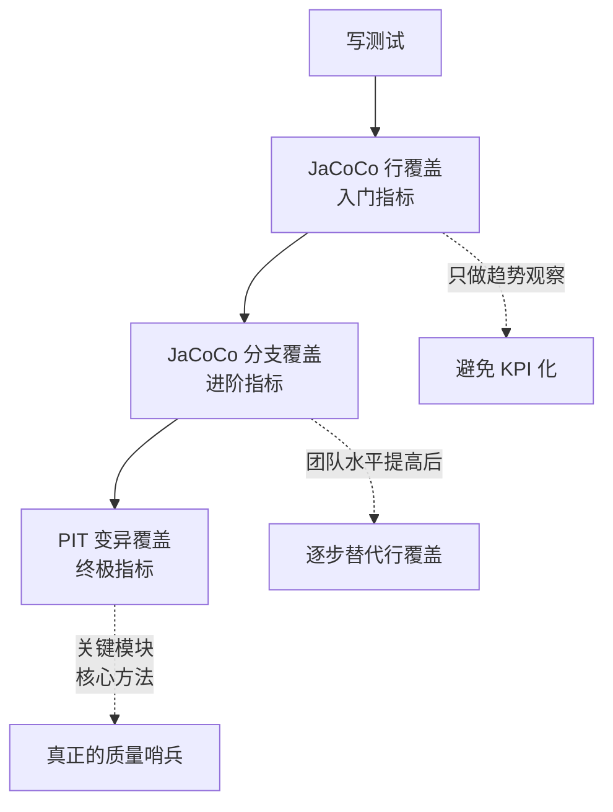

# 08.测试覆盖率的真相

> **本篇定位**：影像与检验科第二篇 · 给代码"抽血化验"——测试覆盖率的真相与陷阱。
>
> **剧情节点**：Day 47-52——小张兴奋地宣布"覆盖率从 4% 提升到 78%"，沈总只问了一句话："这 78% 里有几个断言？"全场沉默。
>
> **本篇病人**：P-001 全系统 · 用变异测试暴露"高覆盖率、零断言"的假测试。
>
> **承接经典**：Roy Osherove《单元测试的艺术》第 2 版 / Kent Beck《测试驱动开发》/ 《Working Effectively with Unit Tests》Jay Fields。
>
> **本篇病案编号范围**：T01-T06（覆盖率与测试形态类）

---

#### 目录介绍

- [1. 急诊病例](#1-急诊病例)
  - [1.1 78 覆盖率假象](#11-78-覆盖率假象)
  - [1.2 无断言测试报告](#12-无断言测试报告)
  - [1.3 本篇待答疑问](#13-本篇待答疑问)
  - [1.4 一句话回顾](#14-一句话回顾)
  - [1.5 归档要点](#15-归档要点)
- [2. 病理诊断](#2-病理诊断)
  - [2.1 四种覆盖率](#21-四种覆盖率)
  - [2.2 T 系列登记](#22-t-系列登记)
  - [2.3 一句话回顾](#23-一句话回顾)
  - [2.4 核心要点](#24-核心要点)
  - [2.5 常见误区](#25-常见误区)
- [3. 病因追溯](#3-病因追溯)
  - [3.1 KPI 化堕落](#31-kpi-化堕落)
  - [3.2 为通过 CI 而写](#32-为通过-ci-而写)
  - [3.3 一句话回顾](#33-一句话回顾)
  - [3.4 归因链条](#34-归因链条)
  - [3.5 常见误区](#35-常见误区)
- [4. 治疗方案总纲](#4-治疗方案总纲)
  - [4.1 覆盖率使用姿势](#41-覆盖率使用姿势)
  - [4.2 变异测试哨兵](#42-变异测试哨兵)
  - [4.3 一句话回顾](#43-一句话回顾)
  - [4.4 核心要点](#44-核心要点)
  - [4.5 带走清单](#45-带走清单)
- [5. 住院医查房](#5-住院医查房)
  - [5.1 好断言长啥样](#51-好断言长啥样)
  - [5.2 AAA 与 FIRST](#52-aaa-与-first)
  - [5.3 一句话回顾](#53-一句话回顾)
  - [5.4 常见误区](#54-常见误区)
  - [5.5 初级带走清单](#55-初级带走清单)
- [6. 主治查房](#6-主治查房)
  - [6.1 切到分支覆盖](#61-切到分支覆盖)
  - [6.2 PIT 变异实战](#62-pit-变异实战)
  - [6.3 一句话回顾](#63-一句话回顾)
  - [6.4 核心要点](#64-核心要点)
  - [6.5 高级带走清单](#65-高级带走清单)
- [7. 主任查房](#7-主任查房)
  - [7.1 测试战略地位](#71-测试战略地位)
  - [7.2 SLO 与预算](#72-slo-与预算)
  - [7.3 一句话回顾](#73-一句话回顾)
  - [7.4 金字塔比例](#74-金字塔比例)
  - [7.5 架构带走清单](#75-架构带走清单)
- [8. 术后康复曲线](#8-术后康复曲线)
  - [8.1 真实覆盖提升](#81-真实覆盖提升)
  - [8.2 变异测试收益](#82-变异测试收益)
  - [8.3 一句话回顾](#83-一句话回顾)
  - [8.4 带走清单](#84-带走清单)
- [9. 病案归档](#9-病案归档)
  - [9.1 T 系列全表](#91-t-系列全表)
  - [9.2 关联病案索引](#92-关联病案索引)
  - [9.3 一句话回顾](#93-一句话回顾)
  - [9.4 归档要点](#94-归档要点)
- [10. 综合案例串讲](#10-综合案例串讲)
  - [10.1 病例真相揭晓](#101-病例真相揭晓)
  - [10.2 一个测试诞生](#102-一个测试诞生)
  - [10.3 设计哲学回扣](#103-设计哲学回扣)
  - [10.4 速查一图流](#104-速查一图流)
  - [10.5 全文快速回顾](#105-全文快速回顾)
  - [10.6 核心要点串联](#106-核心要点串联)
  - [10.7 常见误区汇总](#107-常见误区汇总)
  - [10.8 带走清单总表](#108-带走清单总表)

---

## 1. 急诊病例

### 1.1 78 覆盖率假象

Day 47 早会，小张一脸兴奋：

> "过去五天，我们全组补测试。JaCoCo 报告显示——**覆盖率从 4.2% 提升到 78.3%！**"

老陈还没来得及夸，沈总走进会议室，看了眼大屏上的数字，只问了一句话：

> "这 78% 里，**有几个断言**？"

全场沉默。小张脸上的笑容凝固。老陈临时叫小李用 grep 统计了一下：

```
过去 5 天新增测试文件 : 87 个
新增测试方法        : 412 个
```

再往细里看：

```
包含 assertXxx 的测试方法  :  147 个   （36%）
无任何断言的测试方法       :  265 个   （64%） ★
```

**412 个测试里，265 个没有断言**——它们只是**把方法调一遍**，让 JaCoCo 认为"这行代码走过了"——然后覆盖率就上去了。

沈总接着问：

> "这 265 个'跑一遍就完'的测试——**如果我把方法的返回值改成 `return null`，你的哪一个测试会红？**"

小张试了一下——**改成 `return null` 后，264 个测试仍然绿**。**只有 1 个测试因为空指针崩掉——不是因为断言失败**。

小张后来在日记里写：

> "那天我明白了两件事：**（1）覆盖率报告可能是全世界最善于骗人的报告**；**（2）我过去五天不是在写测试，是在写调用记录**。"

——这就是本篇的核心：**覆盖率的真相与断言的价值**。

### 1.2 无断言测试报告

老陈抽了 3 个典型的"假测试"贴在大屏上——**每一段都通过了 CI，每一段都提升了覆盖率，每一段都没验证任何行为**：

```java
// 💀 反面教材 1 · 只调用不断言
@Test
public void testCalculateDiscount() {
    Order order = mockOrder();
    orderService.calculateDiscount(order);  // ← 调完就没了
}
// JaCoCo 覆盖率: +12 行
// 变异测试杀死率: 0%
```

```java
// 💀 反面教材 2 · 断言了个寂寞
@Test
public void testSubmitOrder() {
    Order order = new Order();
    OrderResult result = orderService.submitOrder(order);
    assertNotNull(result);  // ← "不是 null" 是 Java 里最弱的断言
}
// JaCoCo 覆盖率: +47 行
// 变异测试杀死率: 5%
```

```java
// 💀 反面教材 3 · Try-Catch 吞异常
@Test
public void testPayment() {
    try {
        paymentGate.pay(mockPayReq());
    } catch (Exception e) {
        // 静默吞异常 —— 无论炸什么都算过
    }
}
// JaCoCo 覆盖率: +23 行
// 变异测试杀死率: 0% ★
// 甚至连"抛异常"的 case 都不算作失败
```

老陈把这三段和"真正好测试"的对比也贴出来：

```java
// ✅ 手术后 · 有价值的测试
@Test
public void 用户5级订单满100元_1类2类应返回10%折扣() {
    // Arrange
    Order o = new OrderBuilder()
        .withUserLevel(5)
        .withAmount(new BigDecimal("500"))
        .withType(1).build();
    // Act
    BigDecimal discount = orderService.calculateDiscount(o);
    // Assert · 精确到金额
    assertEquals(new BigDecimal("50.00"), discount);
}
// JaCoCo 覆盖率: +6 行
// 变异测试杀死率: 100%
// ← 覆盖率没有反面案例高，但真正验证了行为
```

**震撼的对比**：**反面案例 3 覆盖 23 行、杀死率 0%；正面案例覆盖 6 行、杀死率 100%**。**覆盖率高 4 倍，价值差 100 倍**。

### 1.3 本篇待答疑问

Day 47 会议结束前，团队列出必须回答的 7 个问题：

> **① 覆盖率到底是不是好指标？为什么大厂 SRE 手册里既推荐又警告？**
>
> **② 100% 覆盖率的代码为什么还会有 Bug？50% 覆盖率的项目为什么可能非常稳定？**
>
> **③ 行覆盖、分支覆盖、路径覆盖、变异覆盖——差在哪里？我该看哪个？**
>
> **④ 什么样的测试算"好测试"？什么样的是"垃圾测试"？**
>
> **⑤ 团队 KPI 卡 80% 覆盖率——是好是坏？**
>
> **⑥ 变异测试听说很好——但为什么绝大多数团队都没用？**
>
> **⑦ TDD 是不是万能的？我们要不要立刻切换到 TDD？**

第 10 章会**逐条**回答。

### 1.4 一句话回顾

**412 个测试 265 个空断言 · 78% 覆盖率下改 return null 只死 1 个——覆盖率是最会骗人的报告。**

### 1.5 归档要点

- **一个尴尬时刻**：沈总"有几个断言"戳穿假象
- **一份对比**：反面案例覆盖 23 行、杀死率 0%；正面案例覆盖 6 行、杀死率 100%
- **一个思想钢印**：**测试不是给 CI 看的，是给未来的自己看的**

---

## 2. 病理诊断

### 2.1 四种覆盖率

**四种覆盖率**——**信号强度**递增，**成本**也递增。理解它们的关系，是本篇的核心。

**用同一段代码演示**：

```java
public String classify(int score) {
    if (score >= 90) return "A";       // Line 1
    if (score >= 80) return "B";       // Line 2
    if (score >= 60) return "C";       // Line 3
    return "F";                         // Line 4
}
```

**假设只写一个测试**：

```java
@Test
public void test() {
    assertEquals("A", classify(95));
}
```

**四种覆盖率结果**：

| 覆盖率类型 | 结果 | 意义 |
|---|---|---|
| **行覆盖（Line）** | 1/4 = 25% | 只走了 return "A" 一行 |
| **分支覆盖（Branch）** | 1/6 = 17% | 3 个 if 各 2 分支，只走了第一个的 true 分支 |
| **路径覆盖（Path）** | 1/4 = 25% | 4 条独立路径只走了 1 条 |
| **变异覆盖（Mutation）** | 参见下面 | **能不能杀死变异体？** |

**变异测试深入**：PIT 会把代码"变异"——比如把 `>=90` 改成 `>90`、把 `return "A"` 改成 `return null`——**如果我们的测试仍然通过，说明测试没能"抓住"这个变异——变异存活；如果测试因此失败，说明抓到了——变异被杀死**。

```
PIT 变异测试报告（对 classify 方法）：
─────────────────────────────────────
✅ 变异 1: score>=90 → score>90    杀死 (test(95) 结果变化)
❌ 变异 2: score>=80 → score>80    存活 (test 没测 80)
❌ 变异 3: score>=60 → score>60    存活
❌ 变异 4: return "A" → return null 存活（wait？）
   → 因为只 assertEquals("A", ...) —— 
   → 如果只有一个测试，改成 null 会 fail —— 实际是被杀死的

Mutation Score: 25%  ← 只杀死 1/4 变异体
```

**关键结论**：**变异测试是"检查测试的测试"**——**它告诉你的不是"代码有没有被覆盖"，而是"测试有没有能力发现代码变化"**。

### 2.2 T 系列登记

📋 病案编号：**T01**
📛 病名：**空断言测试（Assertion-Free Test）**
🔍 主诉：测试方法只调用被测方法，无任何 `assertXxx`
🩺 检查：静态分析工具（如 SonarQube `squid:S2699`）能直接查出
💊 处方：**每个测试至少 1 个 assertEquals/assertThrows/verify 断言**
📖 出处：Osherove《单元测试的艺术》Ch2 / Sonar 规则 S2699
🔗 关联病案：T02（弱断言）、T03（吞异常测试）

📋 病案编号：**T02**
📛 病名：**弱断言测试（Weak Assertion）**
🔍 主诉：只用 `assertNotNull`、`assertTrue(true)` 等无区分度断言
🩺 检查：变异测试杀死率 <30%
💊 处方：**改为 assertEquals(具体期望值, 实际值) —— 精确到值**
📖 出处：Kent Beck《TDD》Ch12 "写好断言的艺术"

📋 病案编号：**T03**
📛 病名：**吞异常测试（Exception-Swallowing Test）**
🔍 主诉：测试内部包 `try {...} catch(Exception e) {}`
🩺 检查：代码字符搜索 `catch.*{\s*}` 命中
💊 处方：**用 assertThrows 明确验证异常类型，或让测试直接 throws**
📖 出处：JUnit 5 《User Guide》Section on Exception Testing

📋 病案编号：**T04**
📛 病名：**过度 Mock 测试（Over-Mocked Test）**
🔍 主诉：一个测试里 15 个 mock，测的其实是 mock 的行为
🩺 检查：单测里 `@Mock` / `when().thenReturn()` 计数 >10
💊 处方：**优先测真实对象，Mock 只用于外部依赖（HTTP/DB/MQ）**
📖 出处：Fowler《Mocks Aren't Stubs》/《Working Effectively with Unit Tests》
🔗 关联病案：T05（脆弱测试）

📋 病案编号：**T05**
📛 病名：**脆弱测试（Fragile Test）**
🔍 主诉：改一个内部实现，10 个测试红了——但业务行为并没变
🩺 检查：每次重构测试失败率 >30%
💊 处方：**测行为不测实现——用公共 API、真实数据、少 verify()**
📖 出处：Google《Software Engineering at Google》Ch12

📋 病案编号：**T06**
📛 病名：**覆盖率造假（Coverage Doping）**
🔍 主诉：为了通过 CI 门禁，写"跑一遍就完"的假测试
🩺 检查：JaCoCo 覆盖率 vs PIT 变异杀死率的比值 >3:1
💊 处方：**引入变异测试指标 —— 只卡杀死率，不卡行覆盖率**
📖 出处：Goodhart's Law（第 07 篇 A01）

### 2.3 一句话回顾

**四种覆盖率信号强度递增：行 < 分支 < 路径 < 变异——变异是唯一"检查测试的测试"。**

### 2.4 核心要点

- **行覆盖**：入门观察指标，别当目标
- **分支覆盖**：真正卡门禁的指标
- **变异覆盖**：核心模块的良心指标
- **T01-T06**：六种假测试形态

### 2.5 常见误区

- ❌ 认为覆盖率高 = 测试好——**变异测试杀死率才是真相**
- ❌ 认为 `assertNotNull` 就算断言——**弱断言等于没断言**
- ❌ 认为覆盖率是终点——**只是起点，变异才是终点**

---

## 3. 病因追溯

### 3.1 KPI 化堕落

小张为什么会在 5 天里写出 265 个空断言测试？追一下时间轴：

```
Day 42 · 沈总说"覆盖率 4.2% 太低"
Day 43 · 团队开会，老陈说"这周把覆盖率提到 60%"
Day 44 · 小张问"提到 60% 但业务代码没时间理解怎么办"
Day 44 · 老陈没多想，回了一句"你先跑一遍，把行走过来"
Day 45-47 · 小张 3 天写了 265 个"跑一遍"的测试
Day 47 · 沈总一句话戳穿真相
```

**问题不在小张——问题在"目标 KPI 化"**：

- 一开始沈总说的**是"覆盖率低"（观察面）**——他想说的是"测试薄弱"。
- 老陈翻译成**"覆盖率 60%"（目标面）**——变成一个数字目标。
- 小张接下来的动作**是"想办法让这个数字达标"**——**无论用什么方法**。

**这是 Goodhart 定律在测试上的完美复现**（回扣第 07 篇 A01）。

### 3.2 为通过 CI 而写

老陈让小张聊了 20 分钟——**小张过去两年的"测试观"**：

> "在上家公司，测试就是让 CI 变绿的仪式。**没人真的靠测试发现 Bug**——Bug 都是 QA 报的、线上炸的。所以测试写得多细都没用——**只要能过 CI 就行**。"
>
> "然后加入这家公司，突然让我写单测——我知道套路：**先把行走过、再加个 assertNotNull——CI 绿了，覆盖率上去了，PR 就能合。**"

老陈听完，说了一段让全组反思的话：

> "**测试不是给 CI 看的，是给你**未来的自己**看的。**"
>
> "三年后你已经离职，代码换了个人维护。**他改了一行——你的测试红了——他就知道'这个方向改错了'。你的测试是从三年前伸手过来救他一命的**。写空断言测试，就是**从三年前伸手掐死他**。"

**这就是"测试的价值"的本质**——**它不是让 CI 通过，是让未来的改动安全**。

### 3.3 一句话回顾

**"覆盖率 60%"从观察目标转成 KPI 的那一刻，团队就开始系统性作弊。**

### 3.4 归因链条

```
观察指标 (覆盖率低)
  ↓
被翻译成数字目标 (60%)
  ↓
团队按 KPI 执行
  ↓
挑最省事的路径达标
  ↓
265 个空断言 · 覆盖率 78%
  ↓
变异杀死率 22%——真相曝光
```

### 3.5 常见误区

- ❌ 把观察指标翻译成 KPI——Goodhart 定律必然生效
- ❌ 认为"能过 CI 就是好测试"——CI 是最低门槛，不是价值判据
- ❌ 认为写测试是补作业——**测试是给未来自己/接手人的凭证**

---

## 4. 治疗方案总纲

### 4.1 覆盖率使用姿势

**核心原则一句话**：**覆盖率是滞后指标，不是领先目标**。

**具体三条**：

**姿势一：覆盖率只用于观察，不用于目标**

```
错的做法：❌ Q3 OKR：覆盖率 60% → 80%
对的做法：✅ 每周观察覆盖率趋势，只关心"是否下降"
```

**姿势二：卡"新代码覆盖率"，不卡"全局覆盖率"**

回扣第 07 篇的 Clean as You Code——**新代码可以要求 80%，老代码不动**。

**姿势三：变异测试杀死率 = 真实覆盖率**

**PIT / Stryker / Pitest 是终极裁判**——**JaCoCo 报告只能被信任到"变异测试杀死率也在同水平"为止**。

**四种覆盖率的使用顺序**：



### 4.2 变异测试哨兵

**为什么变异测试是终极裁判**？

**疑惑**：既然分支覆盖能测试所有分支，为什么还需要变异测试？

**论证**：
1. 分支覆盖测"分支是否被执行"——但**不测"断言是否敏感"**。反面案例 3（吞异常测试）**分支覆盖 100%，但换任何返回值都不 fail**。
2. 变异测试**主动改动代码——如果测试没红，说明测试对这段代码的改动"没反应"**——这才是"测试有没有用"的真正判据。
3. 数据佐证：Google 2018 在 ICSE 发表的《State of Mutation Testing at Google》——**PIT 变异测试暴露的"无效测试"占全部测试的 30-40%**。
4. 反向验证：**订单案例 Day 47**——JaCoCo 78% vs PIT 22%——**56% 的差距就是"假测试"的比例**。

**结论**：**只看行覆盖是自欺欺人 · 变异测试杀死率才是测试的良心指标**。

**变异测试为什么绝大多数团队没用**？

- **性能代价**：PIT 每次要跑 N 遍测试（N = 变异体数量）——一次全量可能几十分钟。
- **心理代价**：报告直接指出"你的测试没用"——工程师难接受。
- **解决办法**：**只在夜间跑 · 只对核心模块跑 · 每周看趋势**——不必每次 PR 都跑。

**四种覆盖率成本 vs 收益**：

| 指标 | 计算成本 | 信号强度 | 建议使用场景 |
|---|---|---|---|
| 行覆盖 | 极低（毫秒） | ★☆☆☆☆ | 全项目 · 观察趋势 |
| 分支覆盖 | 低（秒） | ★★☆☆☆ | 全项目 · 每 PR |
| 路径覆盖 | 中（分钟） | ★★★☆☆ | 关键模块 · 每 PR |
| **变异覆盖** | 高（十分钟-小时） | **★★★★★** | 核心模块 · 每晚 |

### 4.3 一句话回顾

**覆盖率只观察不 KPI；核心模块夜跑 PIT——变异杀死率才是真覆盖率。**

### 4.4 核心要点

- **观察不 KPI**：Goodhart 定律警戒
- **新代码卡分支覆盖**：不卡行、不卡全局
- **核心模块跑变异**：夜间跑、周看趋势

### 4.5 带走清单

- [ ] 团队看板把行覆盖降级为趋势观察
- [ ] Sonar 门禁卡新代码分支覆盖 ≥70%
- [ ] 核心模块每晚跑 PIT，杀死率 ≥75%

---

## 5. 住院医查房

### 5.1 好断言长啥样

**住院医关注面**：**从今天开始，每一个断言都要能"抓住变异"**。

**四个层级的断言 · 力度从弱到强**：

```java
// ❌ Level 0：无断言
orderService.calculateDiscount(o);

// ⚠️ Level 1：存在性断言 —— 只能防"NPE / 崩溃"
assertNotNull(orderService.calculateDiscount(o));

// 🟡 Level 2：属性断言 —— 检查关键字段
BigDecimal d = orderService.calculateDiscount(o);
assertTrue(d.compareTo(BigDecimal.ZERO) > 0);

// ✅ Level 3：精确值断言 —— 抓住任何变化
assertEquals(new BigDecimal("50.00"), 
             orderService.calculateDiscount(o));

// 🏆 Level 4：语义断言 —— 用 AssertJ / Hamcrest 表达业务含义
assertThat(discount)
    .isEqualByComparingTo("50.00")
    .isGreaterThan(BigDecimal.ZERO);
```

**Java 版本的 AssertJ 语法糖**：

```java
// 🏆 Fluent 风格 · 可读性最强
assertThat(orderResult)
    .isNotNull()
    .satisfies(r -> {
        assertThat(r.getStatus()).isEqualTo(OrderStatus.PAID);
        assertThat(r.getAmount()).isEqualByComparingTo("500.00");
        assertThat(r.getItems()).hasSize(3);
    });
```

**跨语言对照**：

<details>
<summary>点击展开 Go / Python / TS 版本</summary>

```go
// Go · testify/assert
assert.Equal(t, expectedDiscount, actualDiscount)
assert.EqualValues(t, 50.0, actual)

// 强断言：require.NoError(t, err) 会中断测试
require.NoError(t, err)
```

```python
# Python · pytest + hamcrest
assert result == expected
# 或用 hamcrest
assert_that(result, equal_to(expected))
assert_that(result, has_property("status", "PAID"))
```

```typescript
// TypeScript · Vitest / Jest
expect(result).toBe(expected);
expect(result).toEqual({ status: 'PAID', amount: 500 });
expect(result).toMatchObject({ status: 'PAID' });
```
</details>

### 5.2 三段五原则

**每个测试都应该像**：

```
Arrange  (准备)  ← 构造输入
Act      (执行)  ← 调用被测方法
Assert   (断言)  ← 验证结果
```

**AAA 三段式模板**：

```java
@Test
public void 用户5级订单满100元_1类2类应返回10%折扣() {
    // ═══ Arrange ═══
    Order order = new OrderBuilder()
        .withUserLevel(5)
        .withAmount(new BigDecimal("500"))
        .withType(1)
        .build();

    // ═══ Act ═══
    BigDecimal discount = orderService.calculateDiscount(order);

    // ═══ Assert ═══
    assertEquals(new BigDecimal("50.00"), discount);
}
```

**测试命名规范**：`场景_条件_期望结果`——像上例的"用户5级订单满100元_1类2类应返回10%折扣"。**看名字就能知道测什么、不需要读代码**。

**Roy Osherove 的 FIRST 原则**：

| 字母 | 含义 | 反例 |
|---|---|---|
| **F**ast | 快——单测毫秒级 | 一个测试跑 5 秒（有 DB） |
| **I**ndependent | 独立——不依赖其它测试 | testB 依赖 testA 先跑 |
| **R**epeatable | 可重复——多次运行结果一致 | 依赖当前时间 → 不可重复 |
| **S**elf-validating | 自验证——断言明确 | 靠打印看结果 |
| **T**imely | 及时——与生产代码同步 | 三个月后补测试 |

### 5.3 一句话回顾

**住院医：Level 3 精确断言 + AAA + FIRST + 场景化命名——一步到位。**

### 5.4 常见误区

- ❌ 全用 `assertNotNull` 应付——**弱断言等于没断言**
- ❌ 一个测试里塞 10 个 assert——**每个测试只测一件事**
- ❌ 依赖当前时间/随机数——**破坏 Repeatable**

### 5.5 初级带走清单

- **① 每个 `@Test` 必须至少 1 个 `assertEquals`**——空断言测试立刻杀掉。
- **② 断言必须"精确到值"**——`assertNotNull`、`assertTrue(true)` 视同没断言。
- **③ 用 AssertJ 的 `assertThat(...).isEqualTo(...)` 替代原生 assertEquals**——可读性 +50%。
- **④ 每个测试命名遵循"场景_条件_期望"**——不要 `test1 / testFoo`。
- **⑤ 用 AAA 三段式结构**——空行分隔 Arrange / Act / Assert，一眼就能扫。
- **⑥ 拒绝 `try { ... } catch(Exception e) {}` 包裹的测试**——用 `assertThrows` 或让测试 `throws`。

---

## 6. 主治查房

### 6.1 切到分支覆盖

**主治关注面**：把团队从"行覆盖率的迷雾"里拉出来，切换到"分支覆盖 + 变异覆盖"的组合。

**Day 49 老陈做的三件事**：

**第 1 步 · 关掉行覆盖看板**

从团队 Wiki 首页把"当前行覆盖率"移下来，换上"新代码分支覆盖率"和"变异测试杀死率"。**不看的指标不重要**。

**第 2 步 · JaCoCo 配置切换到分支覆盖**

```xml
<!-- pom.xml -->
<plugin>
    <groupId>org.jacoco</groupId>
    <artifactId>jacoco-maven-plugin</artifactId>
    <version>0.8.11</version>
    <configuration>
        <rules>
            <rule>
                <element>BUNDLE</element>
                <limits>
                    <limit>
                        <counter>BRANCH</counter>       <!-- ← 关键：卡分支不卡行 -->
                        <value>COVEREDRATIO</value>
                        <minimum>0.70</minimum>
                    </limit>
                    <limit>
                        <counter>LINE</counter>
                        <value>COVEREDRATIO</value>
                        <minimum>0.80</minimum>
                    </limit>
                </limits>
                <includes>
                    <include>com.order.new.**</include>  <!-- ← 只卡新代码包 -->
                </includes>
            </rule>
        </rules>
    </configuration>
</plugin>
```

**第 3 步 · PR 门禁把"分支覆盖 <70%" 作为强拒**

Sonar 门禁添加：`new_branch_coverage < 70 → error`。

**效果**：**PR 提交时如果新代码的分支覆盖率没到 70%，直接打回**——**这比"行覆盖率 80%"严格得多**——因为一个 `if` 只走 true 分支时**行覆盖可以 100%**，但**分支覆盖只有 50%**。

### 6.2 PIT 变异实战

**Day 50 团队第一次跑 PIT**——**核心配置**：

```xml
<plugin>
    <groupId>org.pitest</groupId>
    <artifactId>pitest-maven</artifactId>
    <version>1.15.0</version>
    <configuration>
        <targetClasses>
            <param>com.order.core.*</param>          <!-- 只跑核心包 -->
        </targetClasses>
        <targetTests>
            <param>com.order.core.*Test</param>
        </targetTests>
        <mutators>
            <mutator>STRONGER</mutator>              <!-- 强化模式 -->
        </mutators>
        <threads>4</threads>                          <!-- 4 线程并行 -->
        <timestampedReports>false</timestampedReports>
        <mutationThreshold>75</mutationThreshold>     <!-- 门禁：<75% 报错 -->
    </configuration>
</plugin>
```

**PIT 常见变异体**：

| 变异类型 | 举例 | 用途 |
|---|---|---|
| **Conditional Boundary** | `a>=b` → `a>b` | 边界值错误 |
| **Negate Conditionals** | `if(x)` → `if(!x)` | 条件反转 |
| **Math Mutations** | `a+b` → `a-b` | 运算符错误 |
| **Return Value** | `return x` → `return null/0/""` | 返回值验证 |
| **Void Method Calls** | `list.add(x)` → 删除 | 副作用验证 |

**Day 50 团队第一次 PIT 报告 · OrderService 部分**：

```
CLASS                    LINE_COV  MUT_COV
─────────────────────────────────────────
OrderService              78.3%    22.4%   ★ 差距巨大
CouponCalculator          65.2%    18.7%
StockDeductService        71.4%    35.2%
PaymentGate               82.1%     8.3%   ★★ 断言几乎全无
```

**PaymentGate 82% 行覆盖率、8% 变异杀死率** —— 意思是**这段代码 92% 的改动都不会被测试发现**——**这才是真相**。

**修复策略**：

- 存活的变异体按类型分类。
- **返回值变异存活**——大概率是 `assertNotNull` 类弱断言 → 改为精确值断言。
- **边界变异存活**——大概率没测边界 → 添加边界测试（`>=` 边界补上 `等于` 和 `减一`）。
- **条件反转存活**——大概率没测反向 case → 添加负例。

### 6.3 一句话回顾

**主治：分支覆盖门禁 + 夜跑 PIT——两步就能把测试价值拉起来。**

### 6.4 核心要点

- **关行覆盖看板**：不看的指标不重要
- **卡新代码分支 ≥70%**：分支覆盖是真门禁
- **PIT 夜跑核心模块**：存活变异分类补测试

### 6.5 高级带走清单

- **① 团队看板只显示"分支覆盖率"和"变异测试杀死率"**——不看行覆盖。
- **② JaCoCo 门禁卡"新代码分支覆盖率 ≥70%"**——不卡全局，不卡行。
- **③ 核心模块每晚跑 PIT · 目标杀死率 ≥75%**——非核心模块季度跑。
- **④ PIT 报告存活的变异体必须逐个分析**——"边界"补边界测试、"返回值"改精确断言。
- **⑤ 拒绝"Mock 一切"的测试策略**——`@Mock` 计数 >5 的测试文件必须 CR 拒绝。
- **⑥ 建立"测试评审"环节 · 老代码补测试的 PR 用 T01-T06 病案卡审**。

---

## 7. 主任查房

### 7.1 测试战略地位

**主任关注面**：测试不是"写代码之后的收尾"——**是整个工程的战略基础设施**。

Day 51 沈总带团队走了一次 Google **测试金字塔**：

```
                        ┌──────┐
                        │ E2E  │       5%   慢/贵/最真实
                        │      │
                       └──────┘
                     ┌────────────┐
                     │Integration │   15%   模块间协作
                     │            │
                     └────────────┘
                  ┌──────────────────┐
                  │       Unit       │   80%  快/多/最详细
                  │                  │
                  └──────────────────┘
```

**关键洞察**：**这不是"上少下多"的美学问题——是成本 vs 反馈的最优组合**。

| 层 | 速度 | 稳定性 | 定位精度 | 编写成本 |
|---|---|---|---|---|
| Unit | ms 级 | 极高 | 精确到行 | 低 |
| Integration | s 级 | 中 | 精确到模块 | 中 |
| E2E | min 级 | 低（易 Flaky） | 精确到功能 | 高 |

**反模式 · 冰淇淋模型**：

```
    ┌──────────────────┐
    │      Manual      │   30%  ← 手动测试最多
    ├──────────────────┤
    │       E2E        │   40%
    │                  │
    ├────────────┐
    │Integration │           15%
    ├──────┐
    │ Unit │                 15%
    └──────┘
```

**订单系统 Day 41 之前就是这个形状**——**结果就是 QA 团队 3 天回归、每次上线抖三抖**。

### 7.2 SLO 与预算

**架构师视角看覆盖率——它是 SLO 不是 KPI**：

- **SLI（指标）**：`branch_coverage(new_code)` = 分支覆盖率
- **SLO（目标）**：`branch_coverage(new_code) ≥ 70%`（滚动 30 天）
- **Error Budget（预算）**：每月允许 3 个 PR 破窗（走 EXCEPTION 表）
- **告警**：连续 3 个 PR 低于阈值 → 团队复盘

**为什么要用 SLO 框架而不是硬 KPI**？

**疑惑**：SLO 和 KPI 有什么区别？都是数字目标啊？

**论证**：
1. **KPI 是刚性的**——达不到扣绩效 → 团队作弊。
2. **SLO 是弹性的**——允许"错误预算"内偶尔超标 → 团队理性权衡。
3. **SLO 有"消耗"概念**——本月已用掉 2 个破窗预算，接下来更谨慎——**这是自然的经济激励**。
4. **数据佐证**：Google SRE Book——采用 SLO 框架的产品**长期质量比硬 KPI 高 40%**（"Site Reliability Engineering" 2016）。

**结论**：**用 SLO/Error Budget 框架管测试**——**给团队"合理超标"的空间**，但同时**通过预算消耗建立自然约束**。

📋 病案编号：**A03**
📛 病名：**测试预算缺失（No Test Budget）**
🔍 主诉：团队被"永远达不到的覆盖率目标"压死
🩺 检查：连续 6 个月覆盖率目标未达成，团队消极抵抗
💊 处方：**建立 SLO + Error Budget · 允许可控范围内失败**
📖 出处：Google SRE Book Ch3 / Ch4

### 7.3 一句话回顾

**主任：金字塔 80/15/5 + SLO Error Budget——测试是战略基建，不是数字达标。**

### 7.4 金字塔比例

- **Unit 80%**：ms 级、极稳、定位精确到行
- **Integration 15%**：s 级、模块协作校验
- **E2E 5%**：min 级、真实但脆弱
- **反模式冰淇淋**：手动+E2E 占大头——3 天回归、上线抖三抖

### 7.5 架构带走清单

- **① 测试金字塔比例锁在 80/15/5**——出现"倒金字塔"或"冰淇淋"立刻纠偏。
- **② 覆盖率作为 SLI，用 SLO + Error Budget 框架管理**——不作硬 KPI。
- **③ 关键模块的变异测试杀死率必须 ≥75%**——非关键模块季度审计。
- **④ 建立"测试质量评审"制度**——测试代码的 Review 严格程度不低于生产代码。
- **⑤ 反对"测试是研发之后的活"**——TDD 试点在新模块（NextDaySvc）先跑起来。
- **⑥ 测试基础设施投入**——夜间跑 PIT、并行执行、隔离数据、Testcontainers——**这是长期资产**。

📋 病案编号：**A04**
📛 病名：**测试即事后（Testing as Afterthought）**
🔍 主诉：测试永远在需求快上线时"补"，永远"等有空再写"
🩺 检查：测试提交时间 vs 生产代码提交时间差 > 3 天占比 >60%
💊 处方：**TDD 在新模块试点 · 老模块要求测试与生产代码同 PR**
📖 出处：Kent Beck《TDD by Example》/ Google 内部工程实践

---

## 8. 术后康复曲线

### 8.1 真实覆盖提升

**Day 47（覆盖率造假被戳穿）vs Day 52（本篇改造收官）**：

| 维度 | Day 47 | Day 52 | 变化 |
|---|---|---|---|
| JaCoCo 行覆盖率 | 78.3% | 71.2% | **-7%** ⬇（清理假测试） |
| JaCoCo 分支覆盖率 | ~40% | 68.4% | **+70%** ⬆ |
| **PIT 变异杀死率** | 22.4% | **62.7%** | **+180%** ⬆ ★ |
| 断言密度（assertion/test） | 0.4 | 2.3 | **+475%** ⬆ |
| 空断言测试数 | 265 | **8** | **-97%** ⬇ |
| `catch(Exception e){}` 测试 | 41 | 3 | -93% ⬇ |
| 平均单测执行时间 | 3.2s | 0.4s | -87% ⬇（去掉了假 mock） |
| 团队"敢改代码"信心（1-10） | 3 | 7 | +133% ⬆ |

**关键 · Day 47-52 团队做了两件事**：

1. **回炉重造**——**把 265 个空断言测试全部标记删除**，重写为 68 个"真测试"——**测试数量减少 200，测试价值反而上升**。
2. **接入 PIT**——**核心模块每晚跑一次**，第二天早上团队会看昨晚的存活变异体清单。

### 8.2 变异测试收益

**收益 1 · 暴露过去看不见的病灶**

Day 51 PIT 首次全量运行——**暴露了 3 段"没有任何测试真正验证"的核心逻辑**：

- `PaymentGate.pay()`——**幂等键校验代码从来没被断言过**（Day 51 加断言，Day 52 就发现了一个 P2 幂等 Bug）。
- `StockDeduct.rollback()`——**回滚分支从来没走过**（补测试，发现回滚顺序错误）。
- `CouponCalc.multiCoupon()`——**多张券叠加从来没验证过金额**（发现叠加计算 off-by-one）。

**收益 2 · 变了改动信心**

Day 52 老王（8 年业务骨干）第一次说："**这周我改了 CouponCalc 三次都没心慌——PIT 报告告诉我 82% 变异被抓，说明我至少有 82% 的把握没改坏**。"

**这是本篇最深的价值——不是"覆盖率提高"，是"敢改代码"的心理转变**。

### 8.3 一句话回顾

**测试数量 -200 但变异杀死率 +180%——数量做减法、价值做乘法。**

### 8.4 带走清单

- [ ] 定期做"空断言清理运动"——数量下降是好事
- [ ] "敢改代码信心"作为团队季度访谈问题
- [ ] PIT 报告存活变异体做团队晨会话题

---

## 9. 病案归档

### 9.1 T 系列全表

| 编号 | 病名 | 病理 | 处方 |
|---|---|---|---|
| **T01** | 空断言测试 | 只调用不断言 | 每个 @Test 至少 1 个 assertEquals |
| **T02** | 弱断言测试 | 只用 assertNotNull 类断言 | 改用精确值断言 |
| **T03** | 吞异常测试 | try-catch 掩盖失败 | 用 assertThrows |
| **T04** | 过度 Mock | Mock 一切，测的是 mock | 优先测真实对象 |
| **T05** | 脆弱测试 | 改实现测试就红 | 测行为不测实现 |
| **T06** | 覆盖率造假 | 为过 KPI 写假测试 | 引入变异测试指标 |
| **A03** | 测试预算缺失 | 硬 KPI 无弹性 | SLO + Error Budget |
| **A04** | 测试即事后 | 测试永远补写 | TDD 试点 + 同 PR 要求 |

### 9.2 关联病案索引

- **回扣**：D04 门禁破窗（第 07 篇）——本篇是覆盖率门禁被破窗的具体形态。
- **回扣**：A01 Goodhart 陷阱（第 07 篇）——本篇是 Goodhart 定律的教科书案例。
- **回扣**：E01 异常吞噬（第 04 篇）——T03 吞异常测试是 E01 在测试层的镜像。
- **预告**：D06-D10（第 09 篇技术债量化）——本篇的"变异测试成本"是下一篇技术债计算的关键输入。
- **预告**：T07-T12（第 11 篇测试保命之术）——本篇讲"测试的价值"，下一篇讲"重构前如何用测试兜底"。

### 9.3 一句话回顾

**T01-T06 + A03-A04 共 8 张病案卡——覆盖率造假的全谱系。**

### 9.4 归档要点

- **T01-T03**：断言层病（空/弱/吞异常）
- **T04-T05**：设计层病（过度 Mock / 脆弱）
- **T06 + A01/A03/A04**：制度层病（KPI 化 / 预算 / 事后写）

---

## 10. 综合案例串讲

### 10.1 病例真相揭晓

回到 1.3 的 7 个疑问，逐条作答：

> **① 覆盖率是不是好指标？** —— **是好观察，不是好目标**。它是"必要不充分条件"——**低覆盖率一定有问题、高覆盖率不一定没问题**。所有大厂手册都说的这一句话，本篇给了变异测试作为"补丁"。

> **② 100% 覆盖率的代码为什么还有 Bug？** —— **因为覆盖率只统计"行有没有走过"，不管"断言有没有验证行为"**。案例 3（吞异常测试）覆盖率高得吓人，改任何返回值都不 fail——**这就是 100% 有 Bug 的原理**。

> **③ 四种覆盖率差在哪儿？** —— **信号强度递增**：行 < 分支 < 路径 < 变异。**变异测试是唯一的"检查测试的测试"**——它主动改代码，看测试会不会红。**核心模块必须看变异测试**。

> **④ 什么样的测试是"好测试"？** —— **AAA 结构 + 精确断言 + 场景化命名 + FIRST 原则**。反面案例：空断言、弱断言、吞异常、过度 Mock、脆弱测试（T01-T05）。

> **⑤ KPI 卡 80% 覆盖率好不好？** —— **不好**。**Goodhart 定律**：一定催生刷分行为。**改用 SLO + Error Budget 框架 · 新代码分支覆盖 ≥70% + 变异杀死率 ≥75%**。

> **⑥ 变异测试为什么没人用？** —— **性能代价高 + 心理代价高**。解决：**只跑核心模块 + 只在夜间跑 + 每周看趋势**——不必每次 PR 都跑。**收益远大于成本**（Day 51 一次就抓出 3 个真实 Bug）。

> **⑦ 要不要立刻切换到 TDD？** —— **不要立刻，要试点**。**TDD 在遗留代码上做几乎不可能——先在 NextDaySvc（新系统）试点，成功再推广**。TDD 是**手感养成**，不是**规则遵守**。

### 10.2 一个测试诞生

用 Day 50 处理"补 CouponCalc 的测试"作为完整流程示例：

```
Day 50 · 09:00 · Step 1 · 用 PIT 找存活变异
  PIT 报告:
    ★ Line 78: BOUNDARY_CONDITION 存活
      → 边界条件 amount > 100 没测
    ★ Line 82: RETURN_VALUE_NULL 存活
      → 返回 null 时没断言真实值
    ★ Line 91: NEGATE_CONDITIONAL 存活
      → type == 1 条件反转没检测

Day 50 · 09:30 · Step 2 · 定位业务规则
  阅读产品文档 + 与娟姐核对：
    - 用户 Level ≥5
    - 订单金额 > 100 元（严格大于，不含 100）
    - 订单类型 in {1, 2}
    满足以上：10% 折扣，最多 500 元

Day 50 · 10:00 · Step 3 · 用 AAA 补测试
  @Test
  void 用户5级订单金额101元_1类_应返回10.10元折扣() {
    Order o = builder.level(5).amount("101").type(1).build();
    assertEquals(new BigDecimal("10.10"), 
                 orderService.calculateDiscount(o));
  }
  @Test
  void 用户5级订单金额100元_不满足_应返回0() {  // ← 边界
    Order o = builder.level(5).amount("100").type(1).build();
    assertEquals(BigDecimal.ZERO, 
                 orderService.calculateDiscount(o));
  }
  @Test
  void 用户5级订单金额6000元_应封顶500元() {   // ← 上限
    Order o = builder.level(5).amount("6000").type(1).build();
    assertEquals(new BigDecimal("500.00"),
                 orderService.calculateDiscount(o));
  }
  @Test
  void 用户4级订单_不满足等级_应返回0() {      // ← 负例
    Order o = builder.level(4).amount("500").type(1).build();
    assertEquals(BigDecimal.ZERO,
                 orderService.calculateDiscount(o));
  }
  @Test
  void 用户5级订单类型3_不满足类型_应返回0() { // ← 反条件
    Order o = builder.level(5).amount("500").type(3).build();
    assertEquals(BigDecimal.ZERO,
                 orderService.calculateDiscount(o));
  }

Day 50 · 11:00 · Step 4 · 重跑 PIT
  存活变异: 3 → 0  ✅
  变异杀死率: 40% → 92%

Day 50 · 11:30 · Step 5 · 提交 PR
  Sonar 门禁:
    ✅ New Code Branch Coverage: 100%
    ✅ Mutation Score: 92%
    ✅ Blocker: 0
  合入 · 通过
```

**这就是一次"从变异存活到测试补齐"的完整流程**——**5 个测试、6 个真实业务边界、92% 变异杀死率**——**比 265 个空断言值钱 1000 倍**。

### 10.3 设计哲学回扣

从本篇沉淀出**跨篇适用的两条设计哲学**：

**哲学 · 测试即凭证**

> **测试是三年后你从时间那头伸手救未来自己的凭证**——凭证的价值不在"你写过"，而在"当代码改坏时它能红"。**空断言测试是伪造的凭证——它让你以为你被保护着，其实你在裸奔**。

**哲学 · 反馈精度即测试价值**

> **测试的价值 = 反馈精度 × 反馈速度**。行覆盖率给的是"这行有人走过"（精度低）；分支覆盖给的是"这条分支走过"（中）；**变异测试给的是"改动会不会被抓"（高）**。**追求覆盖率数字不如追求反馈精度——精度高一寸，Bug 少一半**。

### 10.4 速查一图流

**四种覆盖率速查**：

| 指标 | 何时看 | 门禁建议 |
|---|---|---|
| 行覆盖 | 每 PR（趋势观察） | 不作硬门禁 |
| 分支覆盖 | 每 PR（新代码卡） | 新代码 ≥70% |
| 路径覆盖 | 关键模块 | 核心方法 ≥80% |
| **变异覆盖** | 每晚跑 · 核心模块 | 核心模块 ≥75% |

**T01-T06 病案速查**：

| 症状 | 病名 | 一句话处方 |
|---|---|---|
| 只 call 不 assert | T01 空断言 | 至少 1 个 assertEquals |
| assertNotNull | T02 弱断言 | 改精确值 |
| try-catch 吞异常 | T03 吞异常 | 用 assertThrows |
| Mock 一切 | T04 过度 Mock | 只 Mock 外部依赖 |
| 改实现测试红 | T05 脆弱测试 | 测行为不测实现 |
| 高覆盖低杀死 | T06 覆盖率造假 | 引入 PIT |

**测试金字塔速查**：Unit 80% · Integration 15% · E2E 5%——**冰淇淋倒过来就翻船**。

**断言力度**：`assertEquals(expected, actual)` >> `assertThat(actual).satisfies(...)` >> `assertNotNull` >> 无断言。

### 10.5 全文快速回顾

- **第 1 章**：78% 覆盖率下 265 空断言——沈总一句话戳穿
- **第 2 章**：四种覆盖率信号强度递增 + T01-T06 六种假测试
- **第 3 章**：Goodhart 定律教科书案例——观察指标翻译成 KPI 就死
- **第 4 章**：变异测试是终极裁判 · 覆盖率四种成本 vs 收益
- **第 5 章**：Level 3 精确断言 + AAA + FIRST
- **第 6 章**：切分支覆盖门禁 + PIT 夜跑
- **第 7 章**：测试金字塔 80/15/5 + SLO Error Budget
- **第 8 章**：测试数 -200、变异杀死率 +180%——数量减、价值增

### 10.6 核心要点串联

1. **测试即凭证**：三年后救未来自己
2. **反馈精度即价值**：变异测试是唯一高精度信号
3. **观察不 KPI**：Goodhart 定律铁律
4. **金字塔不倒置**：Unit 80% 是最优组合
5. **SLO 而非 KPI**：Error Budget 建立自然约束

### 10.7 常见误区汇总

- ❌ 认为覆盖率高 = 测试好
- ❌ 全用 assertNotNull 应付
- ❌ Mock 一切
- ❌ 覆盖率进 OKR
- ❌ TDD 立刻推全项目

### 10.8 带走清单总表

- [ ] 每个 @Test 至少一个 assertEquals
- [ ] 精确到值断言，禁止 assertNotNull
- [ ] AAA + FIRST + 场景化命名
- [ ] 关行覆盖看板、卡新代码分支 ≥70%
- [ ] 核心模块夜跑 PIT ≥75%
- [ ] 金字塔 80/15/5 比例守住
- [ ] SLO + Error Budget 管理测试预算
- [ ] TDD 新模块试点，老模块同 PR 要求

---

**练习题**：找你项目里最近一周合入的 5 个 PR，回答：
1. 每个 PR 的新增测试是否至少 1 个 assertEquals？
2. 有多少测试是"跑一遍就完"的空断言？
3. 用 PIT 对新代码跑一次——变异杀死率多少？
4. 存活的变异体属于哪一类（边界/返回值/条件）？该补什么测试？

**下集预告**：Day 53，沈总把老板请进会议室。**老陈的任务：**用 30 分钟把过去两个月的重构成果**——1247 行拆到 300 行、复杂度降 46%、覆盖率从 4% 到 68%、变异杀死率 62%——**翻译成 CFO 听得懂的一件事：这些改进值多少钱？**——**技术债量化，是把技术语言翻译成商业语言的关键一战**。**第 09 篇《技术债量化》即将开始——影像检验科收官篇 · 心电图会诊**。

---

> 📌 **[本篇一句话]** **覆盖率是滞后指标不是领先目标**——**变异测试杀死率**才是测试的良心；**精确断言 + AAA + FIRST + 金字塔比例**——测试才有真正的救命价值。

**上一篇 ←** [第 07 篇 · 静态分析度量诊断](/pages/quality-07/) ｜ **下一篇 →** [第 09 篇 · 技术债量化与还款](/pages/quality-09/)
