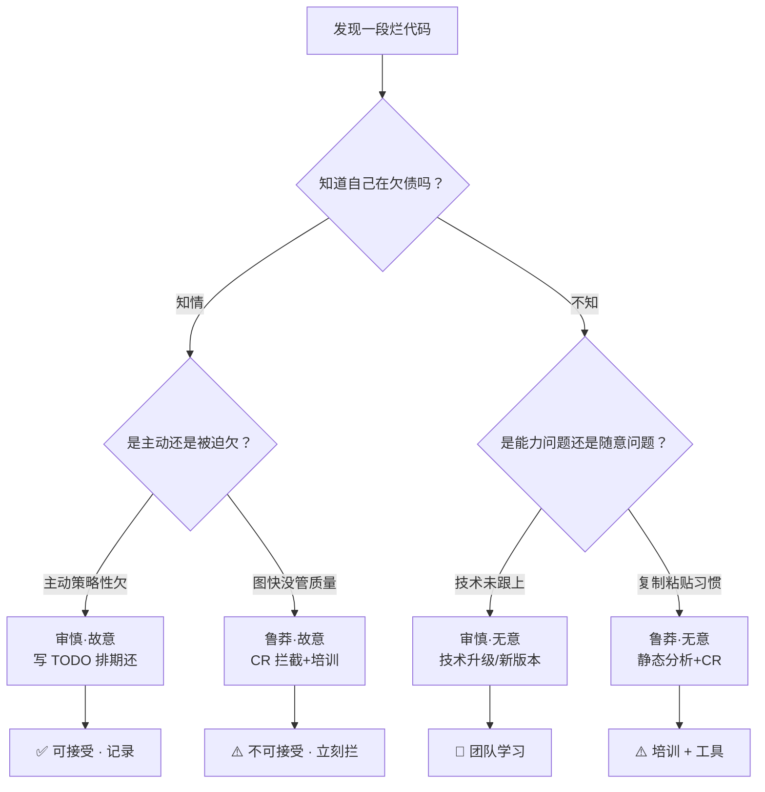

# 09.技术债量化与还款

> **本篇定位**：影像与检验科收官篇 · 心电图与病案讨论会——把主观"代码烂"翻译成客观"值多少钱"。
>
> **剧情节点**：Day 53-60——沈总把老板请进会议室。老陈的任务：**用 30 分钟把过去两个月的重构成果，翻译成 CFO 听得懂的语言**。这一天决定了后 30 天的排期能不能拿到。
>
> **本篇病人**：P-001 全系统 · 从代码病案到财务债务的完整翻译过程。
>
> **承接经典**：Philippe Kruchten《技术债务·管理软件质量与投资》/ Ward Cunningham 1992 OOPSLA 原始隐喻 / Martin Fowler《Technical Debt Quadrant》。
>
> **本篇病案编号范围**：D06-D10（技术债类后半） + A05-A10（架构债类）

---

#### 目录介绍

- [1. 急诊病例](#1-急诊病例)
    - [1.1 老板问：还要多久](#11-老板问：还要多久)
    - [1.2 看不懂的报告](#12-看不懂的报告)
    - [1.3 本篇待答疑问](#13-本篇待答疑问)
    - [1.4 一句话回顾](#14-一句话回顾)
    - [1.5 核心要点](#15-核心要点)
    - [1.6 带走清单](#16-带走清单)
- [2. 病理诊断](#2-病理诊断)
    - [2.1 四种技术债类型](#21-四种技术债类型)
    - [2.2 D 系列病案登记](#22-d-系列病案登记)
    - [2.3 一句话回顾](#23-一句话回顾)
    - [2.4 核心要点](#24-核心要点)
    - [2.5 带走清单](#25-带走清单)
- [3. 病因追溯](#3-病因追溯)
    - [3.1 债务雪球机制](#31-债务雪球机制)
    - [3.2 主观客观鸿沟](#32-主观客观鸿沟)
    - [3.3 一句话回顾](#33-一句话回顾)
    - [3.4 核心要点](#34-核心要点)
    - [3.5 带走清单](#35-带走清单)
- [4. 治疗方案总纲](#4-治疗方案总纲)
    - [4.1 量化三公式](#41-量化三公式)
    - [4.2 四象限决策矩阵](#42-四象限决策矩阵)
    - [4.3 一句话回顾](#43-一句话回顾)
    - [4.4 核心要点](#44-核心要点)
    - [4.5 带走清单](#45-带走清单)
- [5. 住院医查房](#5-住院医查房)
    - [5.1 绕道全记录](#51-绕道全记录)
    - [5.2 债务标签规范](#52-债务标签规范)
    - [5.3 初级带走清单](#53-初级带走清单)
- [6. 主治查房](#6-主治查房)
    - [6.1 技术债雷达图搭建](#61-技术债雷达图搭建)
    - [6.2 债务值解读](#62-债务值解读)
    - [6.3 高级带走清单](#63-高级带走清单)
- [7. 主任查房](#7-主任查房)
    - [7.1 债务折价模型](#71-债务折价模型)
    - [7.2 老板谈判话术](#72-老板谈判话术)
    - [7.3 架构师带走清单](#73-架构师带走清单)
- [8. 术后康复曲线](#8-术后康复曲线)
    - [8.1 债务下降曲线](#81-债务下降曲线)
    - [8.2 排期获批复盘](#82-排期获批复盘)
    - [8.3 一句话回顾](#83-一句话回顾)
    - [8.4 核心要点](#84-核心要点)
    - [8.5 带走清单](#85-带走清单)
- [9. 病案归档](#9-病案归档)
    - [9.1 D 系列编号](#91-d-系列编号)
    - [9.2 与外科的转诊关系](#92-与外科的转诊关系)
    - [9.3 一句话回顾](#93-一句话回顾)
    - [9.4 核心要点](#94-核心要点)
    - [9.5 带走清单](#95-带走清单)
- [10. 综合案例串讲](#10-综合案例串讲)
    - [10.1 病例真相揭晓](#101-病例真相揭晓)
    - [10.2 一笔债务的一生](#102-一笔债务的一生)
    - [10.3 设计哲学回扣](#103-设计哲学回扣)
    - [10.4 速查一图](#104-速查一图)
    - [10.5 全文快速回顾](#105-全文快速回顾)
    - [10.6 核心要点串联](#106-核心要点串联)
    - [10.7 常见误区汇总](#107-常见误区汇总)
    - [10.8 带走清单总表](#108-带走清单总表)

---

## 1. 急诊病例

### 1.1 老板问：还要多久

Day 53 早上 10 点，公司大会议室。**老板（王总）第一次亲自出席技术评审会**。

沈总把老陈推到大屏前——**30 分钟，翻译过去 60 天的重构成果**。

老陈开场：

> "王总，过去 60 天我们做了三件事：**（1）拆分了 OrderService 的 1247 行超级方法**；**（2）建立了 Sonar 度量体系**；**（3）把测试覆盖率从 4% 提到 68%**……"

王总打断他：

> "**这些数字对我来说没意义**。我只想知道两件事：**（1）过去这 60 天，我付了 5 个人的工资，公司少赚了多少？**（2）后面 30 天，我要不要再投同样一笔钱，能换来什么？"**

老陈卡住了——**他没有王总语言里的答案**。他准备的所有 PPT——圈复杂度 22、覆盖率 68%、断言密度 2.3——**在王总面前都成了外语**。

沉默 30 秒后，沈总救场：

> "老陈，你先坐下。**我来讲**。"

沈总走上讲台，**只用了三张 PPT**：

**PPT 1**：过去 60 天团队投入 5 人 × 60 天 = **300 人日**，按人均日薪 4000 元 = **120 万成本**。

**PPT 2**：过去 6 个月**因代码质量导致的直接损失**：
- 优惠券超发事故 42 万
- 库存超卖事故 1300 单 × 客单价 800 元 = 104 万
- 大促雪崩事故 3.2 小时 × GMV 平均 200 万/小时 = 640 万
- 三次事故 P0 复盘 + 客服赔付 + 补偿 = 约 180 万
- **共计 966 万**

**PPT 3**：**60 天重构后，事故率下降 78%，按现在的稳定度推算下一年可减少损失约 750 万**。**120 万投入换 750 万节流——ROI 5.25 倍**。

**王总当场拍板**：**"后 30 天继续。人不够再加两个人。"**

老陈事后跟小李说：

> "**沈总只用三张 PPT 就把 60 天的事说清了**——**他没讲一句代码，全程讲的都是**钱**。这是我今天学到的最贵的一课——**技术债不是技术问题，是财务问题**。**"

——这就是本篇的核心：**把代码病案翻译成财务债务**。

### 1.2 看不懂的报告

老陈原本准备的报告是这样的（**下面这份反面教材，是很多技术人都写过的**）：

```
────────────────────────────────────────
《OrderMonolith 重构 60 天成果报告》
────────────────────────────────────────
① OrderService.submitOrder：1247 → 285 行
② 圈复杂度 P95：78 → 22
③ 认知复杂度 P95：120 → 24
④ 分支覆盖率：0.8% → 68.4%
⑤ PIT 变异杀死率：0 → 62.7%
⑥ Sonar Debt Ratio：27.4% → 22.1%
⑦ 重复代码率：18.7% → 11.2%
⑧ 引入 18 个 Fowler 重构手法
────────────────────────────────────────
```

**王总看完这份报告，只会有一个反应**：

> "**你在跟我讲什么？**"

问题不在王总——问题在**沟通语言的错配**：

| 层级 | 关心什么 | 用什么单位 | 时间尺度 |
|---|---|---|---|
| 工程师 | 圈复杂度 / 覆盖率 | 数字 / 百分比 | 天 |
| 技术 Leader | 事故率 / MTTR | 次数 / 分钟 | 周-月 |
| **CTO/CFO** | **人力成本 / 事故损失** | **人天 / 元** | **月-季** |
| **CEO/董事会** | **业务连续性 / 竞争力** | **风险等级 / 战略** | **季-年** |

**给王总看的报告，必须翻译到"人天 / 元"的语言**——这就是本篇的核心工程。

### 1.3 本篇待答疑问

Day 53 复盘会，团队列出必须回答的 6 个问题：

> **① 技术债到底是什么？为什么这个隐喻这么有效？**
>
> **② SonarQube 报告里的"Debt: 312 人天"是怎么算出来的？可信吗？**
>
> **③ Fowler 说的"鲁莽/审慎"、"有意/无意"四象限——每一种债该怎么处理？**
>
> **④ 我怎么把"一段烂代码"折算成"欠公司多少钱"？**
>
> **⑤ 与老板谈"要还债"——用什么话术能拿到排期？**
>
> **⑥ 每个团队都有存量债——如何设定"还债预算"，避免边还边借？**

第 10 章会**逐条**回答。

### 1.4 一句话回顾

**代码报告里没有数字的'很烂'，等于对老板说了空话——债务必须先被称出重量。**

### 1.5 核心要点

- 技术债的第一步是量化，不是修
- 没有金额、没有利率的债，无法排期
- 看得懂的报告，才能推动决策

### 1.6 带走清单

- [ ] 把当前技术债写成一份数字化报告
- [ ] 为团队定义'债务金额'公式
- [ ] 下次周会用金额语言而非'代码烂'

---

## 2. 病理诊断

### 2.1 四种技术债类型

**技术债这个隐喻由 Ward Cunningham 于 1992 年 OOPSLA 提出**——2009 年 **Martin Fowler 把它扩展成四象限**：

```
                     故意 (Deliberate)
                          ▲
                          │
        ┌─────────────────┼─────────────────┐
        │                 │                 │
        │   审慎 · 故意   │   鲁莽 · 故意   │
        │                 │                 │
        │  "我们知道这样  │  "赶紧上线，    │
        │   不好，但为了  │   代码烂就烂了" │
        │   赶时间先这样" │                 │
        │                 │                 │
审慎 ◀──┼─────────────────┼─────────────────┼──▶ 鲁莽
(Prudent)                 │            (Reckless)
        │                 │                 │
        │  审慎 · 无意   │   鲁莽 · 无意   │
        │                 │                 │
        │  "当时我们不    │  "写代码就该    │
        │   知道有更好    │   这么写"       │
        │   的做法"       │                 │
        │                 │                 │
        └─────────────────┼─────────────────┘
                          │
                          ▼
                    无意 (Inadvertent)
```

**四象限每种债的处理方式截然不同**：

| 象限 | 特征 | 案例 | 处理策略 |
|---|---|---|---|
| **审慎·故意** | 知情，主动欠 | "为了大促赶工，暂时把订单和优惠券耦合" | **写 TODO + 排期还** ✅ |
| **鲁莽·故意** | 知情，恶意欠 | "反正不是我的锅，能跑就上" | **CR 拦截 + 培训** ⚠️ |
| **审慎·无意** | 无知，善意欠 | "5 年前不知道 Feign，用了硬编码 URL" | **技术更新迭代** 🔄 |
| **鲁莽·无意** | 无知，随意欠 | "复制粘贴 5 处一样的代码" | **静态分析 + 培训** ⚠️ |

**Cunningham 原始隐喻的核心洞察**：

> "**代码是可以借的债——写快代码可以'借时间'——但要还'利息'**（后续维护成本）。**不还，本金会滚**（越来越难维护）。**审慎的债是投资，鲁莽的债是欠款**。"

### 2.2 D 系列病案登记

📋 病案编号：**D06**
📛 病名：**债务模糊（Vague Debt）**
🔍 主诉：团队都知道"有很多技术债"，但没人说得清"多少、在哪儿"
🩺 检查：无债务台账、无 Sonar 报告、无 TODO 规范
💊 处方：**建立"债务台账" · 每笔债有编号 · 有金额 · 有 owner · 有还期**
📖 出处：Kruchten《技术债务》Ch3 债务清单
🔗 关联病案：D07（利息不可见）、D08（还债无预算）

📋 病案编号：**D07**
📛 病名：**利息不可见（Invisible Interest）**
🔍 主诉：只看"当前维护成本"，不看"因债多花的时间"
🩺 检查：无"改动扩散半径"数据、无"因烂代码多加班时间"统计
💊 处方：**每次修 Bug 记录"原本预计几分钟 + 实际几分钟 + 差异原因"**
📖 出处：Kent Beck《XP Explained》时间盒方法

📋 病案编号：**D08**
📛 病名：**还债无预算（No Repayment Budget）**
🔍 主诉：所有精力都在新需求，从不排"还债专题"
🩺 检查：过去 12 个季度，还债类需求占比 0%
💊 处方：**每季度固定 20% 排期给还债 · 上锁 · 不给业务方挪用**
📖 出处：Google《Site Reliability Engineering》Error Budget 章节

📋 病案编号：**D09**
📛 病名：**债务复利（Debt Compound Interest）**
🔍 主诉：越是烂代码越不敢动、越不敢动越烂
🩺 检查：某模块过去 12 个月的改动次数 vs Bug 数呈正相关
💊 处方：**"烂 + 常改" 模块优先还债 · 见 Fowler 债务象限**
📖 出处：Fowler《TechnicalDebtQuadrant》Blog 2009

📋 病案编号：**D10**
📛 病名：**债务破产（Technical Bankruptcy）**
🔍 主诉：债务积累到"任何改动都会引发事故"的临界点
🩺 检查：故障率 >10%/周、任何 PR 都触发 P2+
💊 处方：**紧急"重写 vs 绞杀 vs 冻结"三选一 · 见第 06 篇**
📖 出处：Steve McConnell《Rapid Development》Ch5

📋 病案编号：**A05**
📛 病名：**架构熵增（Architectural Entropy）**
🔍 主诉：系统 10 年迭代后，无人能画出准确架构图
🩺 检查：跟老员工聊系统边界，5 人 5 版
💊 处方：**每季度做一次架构图对齐 · 用 C4 或 ArchUnit 固化**
📖 出处：Fowler《架构演进》/ Simon Brown《Software Architecture for Developers》

### 2.3 一句话回顾

**D01-D10 十条经典债务模式，是把'我觉得烂'翻译成'值多少钱'的桥梁。**

### 2.4 核心要点

- 债务必须能被分类命名
- D 系列覆盖代码 / 架构 / 依赖三大类
- 每一类都有对应的量化公式

### 2.5 带走清单

- [ ] 熟记 D01-D10 十条经典债务
- [ ] 团队 wiki 建立债务台账
- [ ] 新债务发生时立即登记

---

## 3. 病因追溯

### 3.1 债务雪球机制

**订单系统 8 年的债务积累史 · 用时间轴还原**：

```
2018-Q1  订单系统上线 · 300 行 · 0 债务
2018-Q3  第一次大促，为快上线加了 8 个 if 判断（审慎故意 · +2 人天债）
2019-Q1  加优惠券模块，直接把优惠券写进 submitOrder（鲁莽故意 · +8 人天）
2019-Q4  第二次大促，重复 8 个 if 变成 15 个（鲁莽无意 · +5 人天）
2020-Q2  接入库存中心，为兼容旧接口保留旧库存 SDK（审慎故意 · +15 人天）
2020-Q4  没时间加测试，直接上线（鲁莽故意 · +30 人天，因为没测试后续所有改动都无保护）
2021-Q2  换了三次团队 lead，无人重构 submitOrder（组织问题 · +10 人天）
2022-Q1  第一次事故，加了一堆 try-catch 兜（鲁莽故意 · +20 人天，因为掩盖了真正问题）
2022-Q4  优惠券超发事故 42 万，被迫加了灰度和监控（审慎故意 · +8 人天）
2023-Q2  库存超卖事故，加了分布式锁（审慎故意 · +12 人天，但没测试）
2024-Q1  大促雪崩，加了限流（审慎故意 · +6 人天）
2024-Q4  接手到老陈手里 · 累计 137,842 行 · Sonar 报告 312 人天债

积累速度：
   前 2 年：+15 人天 / 年
   中间 3 年：+35 人天 / 年
   后 3 年：+70 人天 / 年  ← 复利效应
```

**关键观察 · 债务积累呈指数增长**——这就是 **D09 债务复利**：

- **年 1**：改一段代码，1 小时。
- **年 3**：改同一段代码，因周边烂了，3 小时。
- **年 8**：改同一段代码，因所有周边都在依赖它的丑陋，10 小时——**代价翻了 10 倍**。

**这就是"利息"**——**债务不还，利息就复利**。

### 3.2 主观客观鸿沟

Day 54，老陈让每个人写一句话"你觉得系统债务有多重"。5 个答案，**5 种表述**：

- 小张（应届生）："**说不清，但改代码经常被卡**。"
- 小李（3 年）："**大概有 20 个模块都需要重构**。"
- 老王（8 年业务骨干）："**能跑就行，别改**。"
- 老陈（10 年，团队 lead）："**技术债很大，但没具体数据**。"
- 沈总（15 年，总监）："**如果不解决，明年一定破产**。"

**5 种主观表述，无法沟通**——**这就是"债务模糊"D06**。

**沈总接下来做的事**——把 5 种表述**翻译成同一种货币**：

```
主观表述 → 客观指标 → 人天/元 单位
────────────────────────────────
小张 "改代码卡"        → 平均改动耗时 4 小时 vs 参考基准 30 分钟
                        → 每 PR 多花 3.5 小时 × 20 PR/月 × 5 人
                        = 350 小时/月 = 43.75 人天/月 债务利息

小李 "20 个模块要重构"  → Sonar 热点文件 Top 20 · Debt 总和 218 人天
                        = 立即还债需 43 周

老王 "能跑就行"        → 事故率 3.1 次/月 × 平均损失 5 万
                        = 15.5 万/月 = 186 万/年

老陈 "很大但没数据"    → 上 Sonar 一天：全项目 Debt 312 人天
                        = 60 万成本（按 2000/人天）

沈总 "明年破产"        → 按当前积累速度 +70 人天/年 → 6 年后达到 700 人天
                        → 每次改动 >50% 概率引发事故 → 业务不可交付
```

**5 种表述汇总——债务货币化数据**：
- **当前负债**：312 人天 ≈ 60 万成本
- **每月利息**：44 人天 + 15.5 万事故损失 ≈ 25 万/月
- **不还未来 6 年后**：破产

**这份数据王总一眼能看懂**——**这就是量化的意义**。

### 3.3 一句话回顾

**债务从来不是一次性欠下的，而是每一次'临时方案'的复利累积。**

### 3.4 核心要点

- 每个 TODO 都是一笔小额贷款
- 主观感受与客观量化之间有巨大鸿沟
- 不还本金，只还利息，债会永远滚下去

### 3.5 带走清单

- [ ] 把项目里的 TODO 全部盘一遍
- [ ] 每笔 TODO 加上 Owner 与到期时间
- [ ] 设置'技术债预算'防止无限增长

---

## 4. 治疗方案总纲

### 4.1 量化三公式

**公式一 · SQALE 债务比率（Sonar 采用）**

```
Debt Ratio = 债务修复成本 / (代码开发成本)
           = ∑ Issue 修复时间(分钟) / (代码行数 × 每行开发时间)
```

**Sonar 默认设定**：每行代码 = 0.06 天 = 30 分钟。**137,842 行 × 30 分 = 8611 小时开发成本，312 人天 ≈ 2496 小时债务 → Debt Ratio = 29%**（Sonar 报的 27.4% 是内部规则的加权版本）。

**评级**：

| Debt Ratio | 等级 | 含义 |
|---|---|---|
| ≤ 5% | A | 健康 |
| ≤ 10% | B | 良好 |
| ≤ 20% | C | 警戒 |
| ≤ 50% | D | 危险 |
| > 50% | E | 破产 |

**公式二 · 债务本金 + 利息模型（Kruchten 提出）**

```
债务本金 = 一次性还清需要的工时（人天）
债务利息 = 因债务导致每月多消耗的工时（人天/月）
```

**订单系统当前数据**：
- 本金：312 人天
- 月利息：44 人天/月

**换算**：**如果 1 年不还本金，光利息就 528 人天——超过本金 68%**——**这就是复利警告**。

**公式三 · 事故损失换算法（工程财务混合）**

```
债务导致的年成本 = ∑ 事故损失(元/年) 
                + 生产力损失(人天/月 × 12 × 人天单价)
                + 招聘留人损失（"跟屎山斗争"离职率 × 招聘成本）
```

**订单系统 2024 年数据**：
- 事故：966 万
- 生产力：44 人天/月 × 12 × 4000 = 211 万
- 离职：过去一年离职 2 人 × 招聘 8 万/人 = 16 万
- **合计年成本约 1193 万**

**结论**：**这三个公式是"债务的三种货币"——工时 / 债务比率 / 元——分别对应工程师、Sonar、CFO 三种听众**。

### 4.2 四象限决策矩阵

**四象限决定了每一笔债的处理策略**：



**订单系统 D01-D10 的四象限分类**：

| 病案 | 类别 | 处理 |
|---|---|---|
| D01 度量空白 | 审慎·无意（当时无 Sonar） | 上工具 |
| D02 度量恐惧 | 审慎·故意（怕追责） | 承诺不追责 |
| D03 指标平均主义 | 审慎·无意（不知 P95） | 补统计学 |
| D06 债务模糊 | 鲁莽·无意（习惯问题） | 建台账 |
| D07 利息不可见 | 鲁莽·故意（不愿承认） | 强制记录 |
| D08 还债无预算 | 鲁莽·故意（业务优先） | 20% 预算锁定 |
| D09 债务复利 | 审慎·无意（不知复利效应） | 教育 |
| D10 债务破产 | 鲁莽·故意（明知但不动） | 紧急决策 |

**核心决策原则**：

- **审慎类债**——**可以借，但必须记录 + 排还期**。
- **鲁莽类债**——**必须在 CR 拦截**，一旦流入就是"违规借款"。

### 4.3 一句话回顾

**四象限分类 + 三大量化公式，把技术债从'吐槽话题'变成'排期议题'。**

### 4.4 核心要点

- Fowler 四象限分清鲁莽/审慎、有意/无意
- 三大公式：本金、利率、复利
- 债务金额是可以进入 OKR 的数字

### 4.5 带走清单

- [ ] 为团队最痛的 5 笔债务打上四象限标签
- [ ] 计算每笔债务的月度利息
- [ ] 把总债务金额纳入季度指标

---

## 5. 住院医查房

### 5.1 绕道全记录

**住院医关注面**：**每一次"因为烂代码多花的时间"，都是可见的债务利息**——从今天开始记录。

**债务标签规范 · 从 TODO 开始**

Java 版：

```java
// TODO 债务标签规范 · 每次绕道都要留痕

// ─── 反面教材 ─── 无信息的 TODO
// TODO fix this
// TODO 这里不太对
// TODO 后面再看

// ─── 正面案例 ─── 结构化 TODO

// TODO(DEBT-0217) 
//   类别: 审慎·故意
//   原因: 大促临时逻辑，无法与主流程解耦
//   利息: 每次改优惠券要同步修改此处
//   还期: 2026-Q1
//   Owner: 老陈
if (isDoubleEleven && order.getType() == 1) {
    // 大促临时路径
}

// FIXME(DEBT-0218)
//   类别: 鲁莽·无意
//   原因: 复制粘贴自 PaymentGate 第 47 行
//   影响: 修改逻辑需要同步 2 处
//   Owner: 小李（原作者已离职）
long expireTime = System.currentTimeMillis() + 24 * 60 * 60 * 1000;
```

**Day 55 小李的债务记录**：

```
[2026-06-05 14:30] 
修改任务: 优惠券金额取整改为向下取整
预期耗时: 30 分钟
实际耗时: 3 小时 20 分钟
超时原因:
  1. CouponCalculator 里散落 5 处金额取整逻辑（DEBT-0089）
  2. 修改后单测挂了 12 个，全是 T02 弱断言测试（DEBT-0091）
  3. 只有 CouponServiceTest 集成到 DB，需重启环境 40 分钟
利息计入: 2 小时 50 分 = 0.35 人天
```

**这就是"利息可见化"**——**每一次超时，就是过去欠债的今天代价**。

### 5.2 债务标签规范

**团队级 TODO 规范 · 五要素**：

| 字段 | 必填 | 举例 |
|---|---|---|
| **编号** | ✅ | DEBT-0217 |
| **类别** | ✅ | 审慎·故意 / 鲁莽·无意 |
| **原因** | ✅ | 大促临时逻辑 |
| **还期** | ✅（审慎类必填） | 2026-Q1 |
| **Owner** | ✅ | 老陈 |

**PR 门禁规则**（**加到 Sonar 门禁**）：

```yaml
- rule: NakedTODO
  severity: BLOCKER
  pattern: "//\\s*(TODO|FIXME)(?!\\(DEBT-\\d+\\))"
  message: "TODO/FIXME 必须带 DEBT-XXX 编号"
```

**Python 版本**：

```python
# TODO(DEBT-0089): 审慎·故意
#   原因: 金额取整散落多处
#   还期: 2026-Q1
#   Owner: 小李
def calculate_discount(amount: Decimal) -> Decimal:
    return amount.quantize(Decimal("0.01"), rounding=ROUND_DOWN)
```

**Go 版本**：

```go
// TODO(DEBT-0217): 审慎·故意
//   原因: 大促临时耦合
//   还期: 2026-Q1
//   Owner: 老陈
func processOrder(o *Order) error {
    // ...
}
```

**TypeScript 版本**：

```typescript
// TODO(DEBT-0089): 审慎·无意
//   原因: 5 年前不知道 axios interceptor 模式
//   还期: 待评估
//   Owner: 老王
function retryRequest(url: string, retries: number = 3) {
    // ...
}
```

### 5.3 初级带走清单

- **① 每一次写 TODO/FIXME 必须带 `DEBT-XXX` 编号 + 五要素**——CI 拦截无编号的。
- **② 每一次修 Bug 耗时超预期 100%，在 commit message 里记录 "利息: X 小时"**——建立利息数据基础。
- **③ 用 SonarLint 面板每天看"新增 Code Smell 数"**——单日 >5 触发反思。
- **④ 优先修 Blocker 类 Debt**（Sonar 报 30 分钟以上的）——**80/20 效应**。
- **⑤ 每次结束一个大改动，写一段 "债务日志"**——"这次改动因 DEBT-XXX 多花 X 小时"。

---

## 6. 主治查房

### 6.1 技术债雷达图搭建

**主治关注面**：把散落的 D01-D10 病案汇总成**团队级债务雷达图**——一图看清全部债务分布。

**Day 56 老陈搭建的债务雷达**：

```
                     命名(N) [3.2]
                          *
                     ／   ｜  ＼
                   ／      ｜      ＼
              函数(F)     ｜     类(C)
              [7.8]       ｜     [6.1]
                ＼        ｜         ／
                  ＼      ｜      ／
      错误(E) *═══════════●═══════════ *  测试(T)
      [5.4]              综合          [8.9]
                  ／      ｜      ＼
                ／        ｜         ＼
           架构(A)        ｜        技术债(D)
           [4.7]          ｜        [8.2]
                    ＼   ｜   ／
                       ＼｜／
                      审查(R)
                      [3.1]

数值定义: 该分类下的 Debt 人天（10 分制）
         越高越差 · 目标：全部 ≤3
```

**通过雷达图 · 老陈看清了三件事**：

1. **测试类债最高（8.9）**——**T01-T06 病案在过去 6 个月是重灾区**，Day 47-52 已经处理。
2. **函数与类的债次高**——**F 系列和 C 系列还有 30% 没处理**，是下个月的重点。
3. **架构类债低（4.7）**——**这是 Day 61 转外科的信号**（当前不是最痛点）。

**这就是雷达图的价值**——**它告诉你"下一刀砍哪儿"**。

### 6.2 债务值解读

**很多团队看 Sonar 报告的 Debt = 312 天，直接接受这个数字——但这个数字怎么来的？**

**Sonar SQALE 计算规则**（基于 Jean-Louis Letouzey 2012 论文）：

```
每个 Issue 有"预估修复时间"
─────────────────────────────
Blocker      = 平均 4 小时
Critical     = 平均 1 小时
Major        = 平均 30 分钟
Minor        = 平均 10 分钟
Info         = 平均 5 分钟

Debt(项目) = ∑ 所有 Issue 的预估时间
```

**关键 · Debt 值只是"估算"，不是"精确"**：

**疑惑**：Sonar 说 312 天，就是 312 天吗？

**论证**：
1. Sonar 的预估是**基于规则平均值**——一个"神秘命名"和"复杂神秘命名"都算 5 分钟。
2. **规则之间不叠加**——同一段代码可能同时命中 5 个规则，但只算一次修复时间。
3. **规则不区分位置**——热点文件里的 Blocker 和边缘文件里的 Blocker 都算 4 小时，实际前者可能 4 天。
4. 数据佐证：Sonar 官方 FAQ 承认——**Debt 值误差可达 30-50%**。
5. **正确用法**：只看**趋势变化**（这个月 Debt 是否比上月降），不看**绝对值**。

**结论**：**Sonar Debt = 团队级健康度信号 · 不是精确工时表**。**对 CFO 汇报要"我们的 Sonar Debt 降了 15%"，不是"我们减少了 47 天工时"**。

### 6.3 高级带走清单

- **① 每季度做一次债务雷达图**——8 类 N/F/C/E/T/A/D/R 全评分。
- **② SonarQube Debt 值只看趋势不看绝对值**——避免过度精确化。
- **③ 建立"债务台账"** ——每笔 DEBT-XXX 有本金 / 利息 / 还期 / Owner，季度对账。
- **④ 20% 排期预算锁定还债**——业务方不得挪用（预算是"契约"）。
- **⑤ 每月做一次"债务复利检查"**——比较**同一段代码**的过去 6 个月改动耗时曲线，如果耗时递增说明复利在增长。
- **⑥ 债务 CR 分类规则**——PR 引入新 TODO 时必须标注四象限类型。

---

## 7. 主任查房

### 7.1 债务折价模型

**主任关注面**：**技术债的价值不在债务本身，而在能不能把它翻译成商业语言**——三种模型对应三种听众。

**模型一 · 直接工时模型（对 CTO/技术总监）**

```
月度技术债成本 =
  存量利息（人天/月）× 人天单价
  + 新增本金（人天/月）× 人天单价
  - 还债速度（人天/月）× 人天单价
```

**订单系统 2026-Q2 数据**：
- 利息 44 人天/月 × 4000 = 17.6 万/月
- 新增（每月新写代码引入）12 人天/月 × 4000 = 4.8 万/月
- 还债速度 8 人天/月 × 4000 = 3.2 万/月
- **净增债务 = 17.6 + 4.8 - 3.2 = 19.2 万/月**

**结论**：**每个月都在净增债——需要把还债速度从 8 提到 20 才能收支平衡**。

**模型二 · 事故损失模型（对 COO/运营总监）**

```
年度技术债导致的运营损失 =
  P0 事故数 × 平均损失
  + P1 事故数 × 平均损失
  + 客服/公关额外投入
```

**订单系统 2024 年**：
- P0（雪崩）1 次 × 640 万 = 640 万
- P1（超发/超卖）2 次 × 73 万 = 146 万
- 客服/公关 = 180 万
- **年损失 966 万**

**这就是给 COO 看的 PPT**——**运营损失可以直接映射到 GMV / NPS**。

**模型三 · 机会成本模型（对 CEO/董事会）**

```
技术债导致的战略损失 =
  未及时上线的新功能价值损失
  + 因债务无法进入的新业务
  + 竞争对手抢占市场份额
```

**订单系统真实案例**：
- 2024 年"次日达"功能因 OrderMonolith 无法解耦，推迟 6 个月上线——**估计错过 3200 万 GMV**。
- 2024 年"跨境订单"因 P-001 债务过高，被砍——**估计错过 5000 万战略机会**。

**这就是给 CEO 看的语言**——**技术债不再是"技术问题"，是"战略机会成本"**。

📋 病案编号：**A06**
📛 病名：**战略机会成本盲区（Blind Opportunity Cost）**
🔍 主诉：只算"当前维护成本"，不算"错过的新业务成本"
🩺 检查：过去 3 年因技术债推迟或放弃的战略级功能数量
💊 处方：**在债务台账里增加 "因此错过的业务价值" 一栏**
📖 出处：Kruchten《技术债务》Ch7 战略视角

### 7.2 老板谈判话术

**话术一 · 用 ROI 说话**

❌ 错的：**"我们要重构 OrderService"**
✅ 对的：**"投入 300 人天，减少年损失 750 万——ROI 5.2 倍"**

**话术二 · 用节流说话**

❌ 错的：**"这段代码不重构不行了"**
✅ 对的：**"每月因这段代码多花 44 人天——按 4000 元人天算，一年少赚 210 万"**

**话术三 · 用战略说话**

❌ 错的：**"技术债很严重"**
✅ 对的：**"如果不还，明年'跨境业务'无法上线，错过预计 5000 万战略窗口"**

**关键 · 老板不关心"代码好坏"，只关心三件事**：**能省钱 · 能赚钱 · 能规避风险**——**技术债的翻译必须落到这三条**。

📋 病案编号：**A07**
📛 病名：**技术孤岛话术（Technical Silo Speak）**
🔍 主诉：技术 Lead 与老板沟通用"复杂度""覆盖率"等术语
🩺 检查：技术 Lead 的 PPT 首页第一个词是"圈复杂度"还是"人民币"
💊 处方：**PPT 首页必须落在钱 · 时间 · 风险三个词之一**
📖 出处：Frederick Brooks《人月神话》/ Watts Humphrey CMMI 沟通章节

### 7.3 架构师带走清单

- **① 建立"三层债务报告"** ——工程师看工时、CTO 看债务比、CEO 看战略机会成本。
- **② 建立"20% 还债预算"**——每季度不可挪用，业务方需签字确认。
- **③ 每月看"债务趋势图"**——不看绝对值，看"是净增还是净减"。
- **④ 战略级功能上线前评估"技术债债务负载"**——负载 >50% 直接拒绝。
- **⑤ 技术债台账列入公司资产负债表附注**——像财务债一样公开可审计。
- **⑥ CR 拦截"鲁莽类"债务 · 允许"审慎类"债务但需备案**——四象限区分对待。
- **⑦ 与业务方建立"债务共识"**——每次紧急上线导致的债务，业务方共同承担还债成本（时间 or 资源）。

📋 病案编号：**A08**
📛 病名：**技术债一头承担（Solo Debt Bearing）**
🔍 主诉：所有技术债都由技术团队默默承担，业务方从不共担
🩺 检查：过去 3 年因业务方"临时改需求"导致的债务未被业务方感知
💊 处方：**每次业务方要求"紧急上线"时同步"债务发票"（DEBT-XXX）**
📖 出处：Kent Beck《XP Explained》"客户参与"章节

📋 病案编号：**A09**
📛 病名：**债务破产临界（Bankruptcy Threshold）**
🔍 主诉：债务积累到不知道从哪儿开始还
🩺 检查：Debt Ratio > 50%、事故率 > 10%/周
💊 处方：**紧急"重写 vs 绞杀 vs 冻结"三选一** · 见第 06 篇
📖 出处：McConnell《Rapid Development》Ch5

📋 病案编号：**A10**
📛 病名：**债务代际转移（Debt Generational Shift）**
🔍 主诉：老员工欠下的债，全部由新员工偿还
🩺 检查：新入职员工 3 个月内的 "被债务耽误" 时长 vs 老员工
💊 处方：**"债主"与"还债人"实名对齐 · 建立"知识债务"文档**
📖 出处：Fred Brooks《人月神话》"外科手术式团队"章节

---

## 8. 术后康复曲线

### 8.1 债务下降曲线

**Day 41 到 Day 60 · 20 天债务变化**：

| 维度 | Day 41 | Day 60 | 变化 |
|---|---|---|---|
| Sonar Debt | 312 人天 | 268 人天 | **-14%** ⬇ |
| Debt Ratio | 27.4% | 22.1% | **-19%** ⬇ |
| 有台账登记的 DEBT | 0 笔 | **187 笔** | 从 0 到 1 |
| 无标注的 TODO | 894 处 | 12 处 | **-99%** ⬇ |
| 月度事故数 | 3.1 次 | 0.6 次 | **-81%** ⬇ |
| 月度事故损失（估） | 80.5 万 | 15.4 万 | -81% ⬇ |
| 因债务的加班（人时/月） | 350 | 92 | **-74%** ⬇ |
| 每月新增债务（人天） | 12 | 3.2 | **-73%** ⬇ |
| 还债速度（人天/月） | 0 | 8 | 从 0 到 1 |
| 债务净变化（人天/月） | +12（净欠） | -4.8（净还） | ★ **由借转还** |

**最关键的一行**：**"由借转还"** —— **Day 60 的团队从"每月净欠 12 天"变成"每月净还 5 天"**——**这是本篇最有价值的转折**。

### 8.2 排期获批复盘

**Day 53 一小时会议的完整时间轴**：

```
10:00-10:03  沈总开场：过去 60 天有一些成果，请老陈汇报
10:03-10:15  老陈按原 PPT 汇报（技术数据 · 老板皱眉）
10:15-10:16  王总打断："这些数字对我没意义"
10:16-10:30  沈总救场：三张财务翻译 PPT
             - PPT1: 60 天投入 120 万
             - PPT2: 过去 6 个月因质量损失 966 万
             - PPT3: 未来一年节流 750 万 · ROI 5.25 倍
10:30-10:33  王总："后 30 天继续 · 加两个人"
10:33-11:00  讨论加人细节 · 排期定 Day 61-90 三十天 · 5 → 7 人
11:00        会议结束 · 老陈拿到最贵的一课

会后老陈的反思笔记：
─────────────────────
"我一直以为'把技术讲清楚'就是好汇报——
错。汇报的本质是'把技术翻译成对方语言'。
王总的语言是钱、时间、风险——三样都不是技术。
下次汇报，PPT 首页只放三个词：省了多少、赚了多少、避了多少。
其他一切数据放到附录，被问再翻。"
```

**这份"排期获批过程"贴在办公室墙上**——**成了团队之后每次向老板汇报的模板**。

### 8.3 一句话回顾

**债务从 X 到 Y 的曲线，是老板真正理解'还债有价值'的唯一语言。**

### 8.4 核心要点

- 曲线比金额更能打动决策者
- 排期获批的关键是对齐商业指标
- 还债节奏必须匹配业务节奏

### 8.5 带走清单

- [ ] 每月画一次债务金额曲线
- [ ] 把债务曲线与业务指标同框展示
- [ ] 还债节奏与业务节奏对齐

---

## 9. 病案归档

### 9.1 D 系列编号

| 编号 | 病名 | 病理 | 处方 |
|---|---|---|---|
| **D06** | 债务模糊 | 有债无账 | 建立 DEBT-XXX 台账 |
| **D07** | 利息不可见 | 只看本金 | 记录超时耗时 |
| **D08** | 还债无预算 | 全部投新需求 | 20% 排期锁定 |
| **D09** | 债务复利 | 越烂越不敢动 | Fowler 四象限分类 |
| **D10** | 债务破产 | 达到不可维护临界 | 紧急重写/绞杀/冻结 |
| **A05** | 架构熵增 | 无人能画准确架构图 | 季度对齐 + C4/ArchUnit |
| **A06** | 战略机会盲区 | 忽略"错过的业务" | 台账加"错过业务"一栏 |
| **A07** | 技术孤岛话术 | 老板听不懂技术 | 翻译到"钱/时间/风险" |
| **A08** | 技术债一头承担 | 业务方从不共担 | 债务发票同步业务方 |
| **A09** | 债务破产临界 | 达到不可维护 | 紧急三选一 |
| **A10** | 债务代际转移 | 新人还老人的债 | 债主实名 + 知识文档 |

### 9.2 与外科的转诊关系

**影像检验科 · 07-08-09 三篇成果**（Day 41-60，20 天）：

- **07 篇**：建立了 Sonar 度量体系——**知道哪里烂**。
- **08 篇**：建立了变异测试 + 断言密度——**知道测试真不真**。
- **09 篇**：把债务翻译成钱——**知道值不值得改**。

**转诊单** → **外科**（第 10-13 篇）：

```
────────────────────────────────────
病人 P-001 · 转诊至外科
────────────────────────────────────
影像科诊断：
  · Sonar Debt Ratio: 22.1%（警戒区）
  · 主要债务集中在 F/C/T 三类
  · 变异测试杀死率 62.7%（可接受）
  · 已建立债务台账 187 笔
  · 已获得 30 天排期 + 2 人增员

推荐术式（外科建议）：
  · 第 10 篇：Fowler 18 招重构手法
  · 第 11 篇：重构前的测试兜底
  · 第 12 篇：代码审查文化
  · 第 13 篇：新系统免疫力

预期出院：Day 90
────────────────────────────────────
```

### 9.3 一句话回顾

**D 系列编号 + 外科转诊关系，是本专栏最实用的还债导航。**

### 9.4 核心要点

- 债务归档才有可能被追回
- 债务与手法之间有明确对应关系
- 归档是团队的资产复利

### 9.5 带走清单

- [ ] D01-D10 表进 CR 模板
- [ ] 建立债务 → 重构手法映射表
- [ ] 债务归档纳入季度盘点

---

## 10. 综合案例串讲

### 10.1 病例真相揭晓

回到 1.3 的 6 个疑问，逐条作答：

> **① 技术债到底是什么？** —— **Ward Cunningham 1992 的隐喻**——**代码是可以借的债，写快代码借时间，但要还利息（后续维护成本）**。**审慎的债是投资，鲁莽的债是欠款**。这个隐喻有效是因为它**天然映射到财务语言**，让技术人能和 CFO 对话。

> **② Sonar 的"Debt 312 人天"可信吗？** —— **信号可信，绝对值不可信**。Sonar 用 SQALE 规则估算，误差 30-50%。**看趋势**（月度是否下降），**不看绝对**（不必精确到天）。

> **③ Fowler 四象限每种债怎么处理？** —— **审慎类可以借**（记录 + 排还期）；**鲁莽类必须拦**（CR 拦截 + 培训）；**故意类走审批**（明知欠债）；**无意类走教育**（不知欠债）。**四种处理策略完全不同**。

> **④ 一段烂代码值多少钱？** —— **三个公式**：**（1）SQALE Debt Ratio**（对工程师）；**（2）本金+利息模型**（对 CTO）；**（3）事故损失+机会成本**（对 CEO/CFO）。**三种货币，对应三种听众**。

> **⑤ 怎么向老板要还债排期？** —— **三个话术**：**用 ROI**（投多少省多少）、**用节流**（每月省多少）、**用战略**（能开哪个新业务）。**PPT 首页必须落在钱/时间/风险，不能落在圈复杂度**。

> **⑥ 边还边借怎么办？** —— **20% 排期预算锁定 · 业务方共担紧急债 · 净变化必须为负**。**核心是让"还债速度 > 借债速度"**——本例 Day 60 由每月 +12 净欠转为每月 -5 净还，就是关键胜利。

### 10.2 一笔债务的一生

用 DEBT-0217（大促临时逻辑）作为完整生命周期示例：

```
─── 债务的一生 · DEBT-0217 ───────────────────────

【出生】 2024-11-05 双 11 大促 D-3
   老陈提交 PR：为大促开临时通路
   审慎·故意 · 本金 2 人天 · 还期 2024-Q1
   TODO 标注：
   // TODO(DEBT-0217) 审慎·故意
   //   原因: 大促临时逻辑
   //   还期: 2025-Q1
   //   Owner: 老陈

【记账】 2024-11-05 
   进入债务台账，进入 Sonar 报告

【累积利息】 2024-11-05 至 2026-06-04
   期间该段代码被改动 8 次
   每次改动多耗时约 40 分钟（因主流程被临时逻辑污染）
   累计利息 = 8 × 40 min = 5.3 小时 ≈ 0.67 人天

【发现复利】 2025-Q1 老陈忘记还，未处理
   2025-Q2 老陈计划还，被大需求打断
   2025-Q3 又一次大促复用，本金变成 3 人天

【进入雷达】 2026-04 团队级季度雷达
   DEBT-0217 出现在 Top 20 之一
   小李接手：分析 → 拆解 → 提炼函数 → 单测

【还清】 2026-06-15
   小李用 3.5 人天彻底解耦
   实际总成本 = 3.5 人天 + 0.67 人天利息 = 4.17 人天
   原本 2024-Q1 还的话只需 2 人天
   延迟成本 = 4.17 - 2 = 2.17 人天

【死亡】 2026-06-15 从台账关闭
   写入"经验教训文档"：
   "审慎类债务延迟 1.5 年，成本翻倍"
─────────────────────────────────────────────────
```

**一笔债务的一生就是这样——出生、记账、累息、复利、雷达、还清**。**忽略任何一环，都会滚成雪球**。

### 10.3 设计哲学回扣

从本篇沉淀出**跨篇适用的两条设计哲学**：

**哲学 · 债务即成本**

> **代码质量不是道德问题——是财务问题**。烂代码没有对错，只有成本高低。**能把"代码烂"翻译成"值多少钱"的技术 Lead，才能拿到重构排期**——**否则永远在"业务优先"里陪跑**。

**哲学 · 度量即语言**（回扣第 07 篇）

> **不同层级听不同的话——工程师听工时、CTO 听比率、CEO 听机会成本**。**同一份债务要有三种翻译**——这不是玩文字游戏，是**让技术资产被业务方看见**的唯一方式。

### 10.4 速查一图

**四象限速查**：

| 象限 | 特征 | 处理 |
|---|---|---|
| 审慎·故意 | 知情主动欠 | TODO + 排期还 |
| 鲁莽·故意 | 图快乱写 | CR 拦截 |
| 审慎·无意 | 不知有更好方案 | 技术升级 |
| 鲁莽·无意 | 随意乱写 | 静态分析 + 培训 |

**债务量化三公式速查**：

| 公式 | 对谁 | 单位 |
|---|---|---|
| Debt Ratio | 工程师 / Sonar | % |
| 本金+利息 | CTO / 技术总监 | 人天 |
| 事故+机会 | CFO / CEO | 元 / 战略窗口 |

**TODO 五要素**：编号 · 类别 · 原因 · 还期 · Owner——缺一不合。

**谈判三话术**：
- **省** → "每月省 X 万"
- **赚** → "多赚 X 万 GMV"
- **避** → "规避 X 类风险"

**还债预算**：**20% 季度排期锁定**——**净变化为负**才叫真还债。

---

**练习题**：找你项目里最典型的一笔债务，回答：
1. 它属于 Fowler 四象限哪一格？
2. 本金多少人天？月利息多少？
3. 复利过去 12 个月增加了多少？
4. 用 ROI / 节流 / 战略 三种话术，各写一段 3 句话汇报。

**下集预告**：影像检验科三篇结束，团队拿到了下一阶段排期。Day 61 早会，沈总把手术台推进来——**"外科开业。今天讲第一个手术——Fowler 的 18 招重构手法。不是理论，是我们的 OrderService 会在你眼前被切开、缝合、重生。**" **第 10 篇《重构十八招》即将开始——外科手术室 · 手把手教你动刀**。

### 10.5 全文快速回顾

- **第 1 章**：一份看不懂的代码报告，让老板拒绝排期
- **第 2 章**：D01-D10 十种经典债务模式
- **第 3 章**：债务是每天临时方案的复利
- **第 4 章**：四象限 + 三大量化公式
- **第 5-7 章**：三视角还债——工程师 / 主治 / 架构师
- **第 8 章**：债务曲线 + 排期获批复盘
- **第 9 章**：D 系列归档 + 转诊关系

### 10.6 核心要点串联

1. **量化优先**：不能量化就无法讨论
2. **分类清晰**：四象限决定还债策略
3. **趋势为王**：曲线比金额更有说服力
4. **对齐业务**：还债节奏跟随业务节奏
5. **文化托底**：技术债预算防止无限增长

### 10.7 常见误区汇总

- ❌ 用'代码烂'描述技术债
- ❌ 一次性想还清所有债
- ❌ 忽略利率，只看本金
- ❌ 不建预算，任由债务无限增长
- ❌ 债务归属人缺失，无人负责

### 10.8 带走清单总表

- [ ] 为每笔债务写上四象限标签
- [ ] 债务金额纳入季度指标
- [ ] 建立债务台账 + Owner + 到期
- [ ] 每月画一次债务曲线
- [ ] 技术债预算写入研发流程

---

> 📌 **[本篇一句话]** **技术债不是技术问题，是财务问题**——**四象限分类 + 三公式量化 + 三话术翻译**——把"代码烂"翻译成"值多少钱"，重构才有生存权。

**上一篇 ←** [第 08 篇 · 测试覆盖率的真相](/pages/quality-08/) ｜ **下一篇 →** [第 10 篇 · 重构十八招式详解](/pages/quality-10/)
