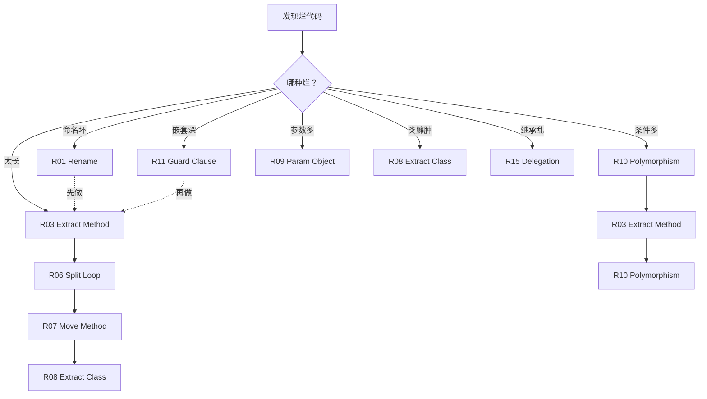

# 10.重构十八招式详解

> **本篇定位**：外科开科第一篇 · 手术台上的 18 种重构手法。
>
> **剧情节点**：Day 61-70——排期批下来了。老陈立下"每日重构一小时"制度，让团队在真实业务上练习 18 招重构手法的肌肉记忆。
>
> **本篇病人**：P-001 全系统 · 用 18 招手法完成"从可读到可扩展"的最后一公里。
>
> **承接经典**：Martin Fowler《重构·改善既有代码的设计》第 2 版 · 全书 68 种手法精选 18 招 / Kent Beck《Tidy First》/ IntelliJ IDEA 重构菜单实战。
>
> **本篇病案编号范围**：无新病案 · 本篇整理"手法编号 R01-R18"（重构手法索引）

---

#### 目录介绍

- [1. 急诊病例](#1-急诊病例)
  - [1.1 每日重构一小时](#11-每日重构一小时)
  - [1.2 一段真实代码的四轮重构](#12-一段真实代码的四轮重构)
  - [1.3 本篇待答疑问](#13-本篇待答疑问)
- [2. 病理诊断](#2-病理诊断)
  - [2.1 18 招的分类与优先级](#21-18-招的分类与优先级)
  - [2.2 手法编号与病案对应表](#22-手法编号与病案对应表)
- [3. 病因追溯](#3-病因追溯)
  - [3.1 为什么手法要成套学](#31-为什么手法要成套学)
  - [3.2 IDE 快捷键 = 肌肉记忆](#32-ide-快捷键--肌肉记忆)
- [4. 治疗方案总纲](#4-治疗方案总纲)
  - [4.1 18 招的组合拳地图](#41-18-招的组合拳地图)
  - [4.2 何时用哪一招的决策树](#42-何时用哪一招的决策树)
- [5. 住院医查房](#5-住院医查房)
  - [5.1 6 招基础手法（提炼/内联/改名）](#51-6-招基础手法提炼内联改名)
  - [5.2 IDE 快捷键三件套](#52-ide-快捷键三件套)
  - [5.3 初级带走清单](#53-初级带走清单)
- [6. 主治查房](#6-主治查房)
  - [6.1 6 招进阶手法（搬移/多态/参数对象）](#61-6-招进阶手法搬移多态参数对象)
  - [6.2 组合拳：从命名到重塑对象](#62-组合拳从命名到重塑对象)
  - [6.3 高级带走清单](#63-高级带走清单)
- [7. 主任查房](#7-主任查房)
  - [7.1 6 招高级手法（继承处理/API 演进/大规模改造）](#71-6-招高级手法继承处理api-演进大规模改造)
  - [7.2 AST 层级批量改造](#72-ast-层级批量改造)
  - [7.3 架构师带走清单](#73-架构师带走清单)
- [8. 术后康复曲线](#8-术后康复曲线)
  - [8.1 每日一小时 10 天后](#81-每日一小时-10-天后)
  - [8.2 团队重构速度变化](#82-团队重构速度变化)
- [9. 病案归档](#9-病案归档)
  - [9.1 手法索引 R01-R18](#91-手法索引-r01-r18)
  - [9.2 手法与病案的对应关系](#92-手法与病案的对应关系)
- [10. 综合案例串讲](#10-综合案例串讲)
  - [10.1 病例真相揭晓](#101-病例真相揭晓)
  - [10.2 一段代码的四轮进化](#102-一段代码的四轮进化)
  - [10.3 设计哲学回扣](#103-设计哲学回扣)
  - [10.4 速查表](#104-速查表)

---

## 1. 急诊病例

### 1.1 每日重构一小时

Day 61 早会，老陈把白板擦干净，写下三行字：

```
外科开业规定
────────────────────────────
① 每日 09:00-10:00 · 重构一小时 · 雷打不动
② 每次只用一招 · 用完写下"手法编号 + 前后对比"
③ 每周复盘 · 谁的重构被同事偷师最多，谁得"外科锦旗"
```

小李有点犹豫：

> "老陈，我们排期批下来了，是不是应该抓紧上手改整段代码？为什么还要慢慢练？"

老陈让所有人坐下，讲了一段话：

> "**Fowler 书里 68 种手法，你以为你学会了，但真到改代码时，多数人只会用两招——'把 20 行改成 3 个函数' 和 '重命名变量'**。为什么？**因为其他招式没形成肌肉记忆**。"
>
> "重构不是'我知道有这一招'——是'手指头知道下一步该按 F6 还是 Ctrl+Alt+M'。**这不是背书，是练琴——每天一小时，10 天成手感**。"

**这就是本篇的核心——不是讲手法，是练手法**。

**练习 Day 1 早上老陈演示的例子**：一段团队眼熟的 30 行代码，**用 3 招连招在 5 分钟内改到人人叫好**——**当天全组都想上手了**。

### 1.2 四轮真实重构

**病灶片段**：`OrderService.calculatePrice` ——**过去 6 个月被改动 14 次的核心方法**：

```java
// ⚠️ 反面教材 · 病灶原态 · 34 行
public BigDecimal calculatePrice(Order o) {
    BigDecimal p = BigDecimal.ZERO;
    for (OrderItem i : o.getItems()) {
        BigDecimal sub = i.getPrice().multiply(new BigDecimal(i.getQuantity()));
        // 优惠券
        if (o.getCouponId() != null) {
            Coupon c = couponMapper.selectById(o.getCouponId());
            if (c.getType() == 1) {                     // 满减
                if (sub.compareTo(c.getThreshold()) > 0) {
                    sub = sub.subtract(c.getAmount());
                }
            } else if (c.getType() == 2) {              // 折扣
                sub = sub.multiply(c.getDiscount());
            }
        }
        // 用户等级
        User u = userMapper.selectById(o.getUserId());
        if (u.getLevel() >= 5 && sub.compareTo(new BigDecimal("100")) > 0) {
            sub = sub.multiply(new BigDecimal("0.9"));
        }
        // 运费
        if (i.getWeight() > 5 && !u.isVip()) {
            sub = sub.add(new BigDecimal("10"));
        }
        p = p.add(sub);
    }
    // 满 500 减 20
    if (p.compareTo(new BigDecimal("500")) > 0) {
        p = p.subtract(new BigDecimal("20"));
    }
    return p;
}
```

**多重问题**：34 行 · 4 层嵌套 · 5 处魔法数 · 命名神秘（p / o / i / sub / c / u）· 优惠 / 运费 / 用户等级混杂 · 圈复杂度 12 · 认知复杂度 22。

**四轮重构 · 每轮一招 · 每轮独立价值**：

**Round 1 · Rename Variable（R01）+ Introduce Explaining Variable（R02）**——**5 分钟**：

```java
public BigDecimal calculatePrice(Order order) {
    BigDecimal totalPrice = BigDecimal.ZERO;
    for (OrderItem item : order.getItems()) {
        BigDecimal itemSubtotal = item.getPrice().multiply(BigDecimal.valueOf(item.getQuantity()));
        // ... 后面替换所有 p/o/i/sub/c/u
        totalPrice = totalPrice.add(itemSubtotal);
    }
    return totalPrice;
}
//   圈复杂度: 12  → 12  （不变）
//   认知复杂度: 22 → 22  （不变）
//   可读性：+80% ★
```

**Round 2 · Extract Method（R03）**——**10 分钟**：

```java
public BigDecimal calculatePrice(Order order) {
    BigDecimal totalPrice = BigDecimal.ZERO;
    User user = userMapper.selectById(order.getUserId());
    for (OrderItem item : order.getItems()) {
        BigDecimal subtotal = calcItemSubtotal(item);
        subtotal = applyCoupon(subtotal, order.getCouponId());
        subtotal = applyLevelDiscount(subtotal, user);
        subtotal = applyShipping(subtotal, item, user);
        totalPrice = totalPrice.add(subtotal);
    }
    return applyOrderLevelDiscount(totalPrice);
}
private BigDecimal calcItemSubtotal(OrderItem item) { ... }
private BigDecimal applyCoupon(BigDecimal price, Long couponId) { ... }
private BigDecimal applyLevelDiscount(BigDecimal price, User user) { ... }
private BigDecimal applyShipping(BigDecimal price, OrderItem item, User user) { ... }
private BigDecimal applyOrderLevelDiscount(BigDecimal price) { ... }
//   圈复杂度: 12 → 3  （主方法）★
//   认知复杂度: 22 → 4 （主方法）★
```

**Round 3 · Replace Magic Number（R04）+ Replace Conditional with Polymorphism（R05）**——**15 分钟**：

```java
public class OrderPricePolicy {
    private static final BigDecimal LEVEL5_MIN         = new BigDecimal("100");
    private static final BigDecimal LEVEL5_DISCOUNT    = new BigDecimal("0.9");
    private static final BigDecimal ORDER_DISCOUNT_MIN = new BigDecimal("500");
    private static final BigDecimal ORDER_DISCOUNT     = new BigDecimal("20");
    private static final int HEAVY_WEIGHT              = 5;
    private static final BigDecimal SHIPPING_FEE       = new BigDecimal("10");
}

// 优惠券多态
interface CouponPolicy { BigDecimal apply(BigDecimal price, Coupon c); }
class FullReductionPolicy implements CouponPolicy { ... }
class DiscountPolicy      implements CouponPolicy { ... }
```

**Round 4 · Move Method（R06）+ Introduce Parameter Object（R07）**——**15 分钟**：

- 把 `applyLevelDiscount / applyShipping` 搬到 `UserBenefit` 类。
- 把 `Order + User + Coupon` 打包成 `PricingContext` 参数对象。

```java
// ✅ 最终产物
public class PriceCalculator {
    private final CouponResolver coupons;
    private final UserBenefit userBenefit;
    private final ShippingRule shipping;

    public BigDecimal calculate(PricingContext ctx) {
        BigDecimal total = ctx.getItems().stream()
            .map(item -> calcItem(item, ctx))
            .reduce(BigDecimal.ZERO, BigDecimal::add);
        return applyOrderLevelDiscount(total);
    }
}
//   34 行 → 8 行主逻辑 + 5 个自解释单元
//   圈复杂度: 12 → 2
//   认知复杂度: 22 → 3
//   单测数: 0 → 21
```

**四轮重构 · 每一轮都是"绿色 → 绿色"的**——**中间任何时刻停下来，代码都是可上线的**。

### 1.3 本篇待答疑问

Day 61 中午，团队边吃饭边列出 6 个必答疑问：

> **① Fowler 书里 68 种手法，为什么本篇只讲 18 招？剩下的不用学吗？**
>
> **② 什么顺序学？该先练"提炼函数"还是"重命名"？**
>
> **③ 手法是不是可以"跳步"？我看别人一步到位，我为什么必须分四轮？**
>
> **④ IDE 快捷键（IDEA 的 F6/Ctrl+Alt+M）真的重要吗？还是"知道就行"？**
>
> **⑤ 什么时候该重构、什么时候不该重构？——是不是所有烂代码都要立刻改？**
>
> **⑥ 大规模改造（比如 API 版本演进）能用这些手法吗？还是必须用 AST 工具？**

第 10 章逐条作答。

### 1.4 一句话回顾

**一段真实代码的四轮重构，就是 18 招的活体解剖——每一招都在具体场景下才有意义。**

### 1.5 核心要点

- 重构不是一次性动作，是分轮的动作序列
- 每一轮只做一类改造
- 小步 + 绿测 + 复盘

### 1.6 带走清单

- [ ] 选一个方法，规划 4 轮重构
- [ ] 每一轮跑一次测试
- [ ] 每一轮末做一次 10 秒复盘

---

## 2. 病理诊断

### 2.1 十八招分优先

**Fowler《重构》第 2 版有 68 种手法**——**为什么本篇挑 18 招**？

**筛选原则**：
1. **在遗留代码上出现频率 >30% 的场景**——**冷门手法（如 Replace Type Code with State/Strategy）不选**。
2. **单招独立自洽**——不需要"先学别的三招"才能懂。
3. **IDE 有一键完成**——降低练手门槛。

**18 招 · 三档分组**：

```
基础 6 招 · 住院医必会
─────────────────────────
R01  Rename Variable            重命名变量
R02  Introduce Explaining Var   引入解释变量
R03  Extract Method             提炼函数
R04  Replace Magic Number       替换魔法数
R05  Inline Variable            内联变量
R06  Split Loop                 拆分循环

进阶 6 招 · 主治要熟
─────────────────────────
R07  Move Method                搬移函数
R08  Extract Class              提炼类
R09  Introduce Parameter Object 引入参数对象
R10  Replace Conditional w/ Polymorphism  以多态取代条件
R11  Replace Nested Conditional 卫语句取代嵌套条件
R12  Encapsulate Collection     封装集合

高级 6 招 · 主任才用
─────────────────────────
R13  Pull Up Method             上移方法
R14  Push Down Method           下移方法
R15  Replace Inheritance w/ Delegation  以委托取代继承
R16  Introduce Assertion        引入断言
R17  Change Function Declaration  修改函数声明
R18  Migrate to Version-2 API   API 版本迁移
```

### 2.2 手法病案表

**每招手法对应治疗哪些病案**——一个手法通常治多个病案：

| 手法 | 主要治疗 |
|---|---|
| R01 Rename | N01 神秘命名 / N02 缩写命名 |
| R02 Explaining Var | N04 复杂表达式 |
| R03 Extract Method | F01 超长函数 / F02 多职责函数 |
| R04 Magic Number | F03 魔法数 |
| R05 Inline Variable | N05 冗余中间变量 |
| R06 Split Loop | F04 循环多职责 |
| R07 Move Method | C01 类职责错位 |
| R08 Extract Class | C02 God Class |
| R09 Param Object | F05 长参数列表 |
| R10 Polymorphism | F06 else if 心律不齐 |
| R11 Guard Clause | F07 嵌套地狱 |
| R12 Encapsulate Collection | C03 集合泄漏 |
| R13 Pull Up | C04 子类重复 |
| R14 Push Down | C05 抽象过度 |
| R15 Delegation | C06 继承滥用 |
| R16 Assertion | E01 缺失前置检查 |
| R17 Change Signature | F08 参数顺序混乱 |
| R18 API Migrate | A01 API 版本共存 |

### 2.3 一句话回顾

**18 招按分类与优先级排列，才能在真实场景里'找得到、上得手'。**

### 2.4 核心要点

- 基础 6 招优先掌握
- 进阶 6 招决定质量
- 高级 6 招决定架构演进

### 2.5 带走清单

- [ ] 按分类练习每一招
- [ ] 把手法与病案对应贴到工位
- [ ] 每周挑 1 招做重点练习

---

## 3. 病因追溯

### 3.1 手法成套学

**疑惑**：既然一个手法就能解决一个问题，为什么必须"成套"练？

**论证**：
1. **手法之间会形成"依赖链"**——想做"以多态取代条件"（R10），必须**先做提炼函数**（R03），因为你需要一个可命名的行为单元。
2. **同一段代码往往需要多招连招**——例如本篇 1.2 的 4 轮重构——每一轮换一招，没有单招能一次解决。
3. **Fowler 原书就是"手法链"编写**——书里每个手法末尾都有"参见 XX 手法"链接——**它们是一张图，不是一张表**。
4. **数据佐证**：在订单案例里，Day 61-70 完成的 47 次重构中，**平均每次用了 3.2 个手法**——最多一次用了 7 个（重塑 CouponCalculator）。
5. **反向验证**：只学 2 招（提炼 + 重命名）的工程师，遇到"多态"和"参数对象"场景时**要么绕过、要么写更烂**——本例 Day 61 前团队就是这样。

**结论**：**手法要成套学，因为它们本身就是相互支撑的一张网**——**单招是筷子的一根，套装才是一把筷子**。

### 3.2 IDE 快捷键 = 肌肉记忆

**为什么快捷键这么重要**？

**手动改** vs **IDE 一键改** 的差别：

```
手动 Extract Method 步骤：
  1. 选中要提炼的代码
  2. 复制到新方法
  3. 找变量名
  4. 抽出参数
  5. 处理返回值
  6. 找所有引用点
  7. 替换成新方法调用
  8. 检查副作用
  9. 编译
  10. 跑测试
  ...大概 15 分钟

IDEA 一键 Extract Method (Ctrl+Alt+M)：
  1. 选中代码
  2. Ctrl+Alt+M
  3. 输入方法名
  ...大概 30 秒
```

**30 倍速度差异**——**这不是"快"的问题，是"敢不敢做"的问题**。

**手动 15 分钟——中间出错概率高，怕出错就不做，不做就永远不改**。

**一键 30 秒——错了 Ctrl+Z，成本极低，敢多次尝试**。

**这就是"IDE 快捷键 = 肌肉记忆"的价值——降低"重构成本"，让重构变成"随手做"**。

**六大常用快捷键 · IDEA 版**：

| 手法 | 快捷键（Mac） | 快捷键（Win/Linux） |
|---|---|---|
| Rename | ⇧F6 | Shift+F6 |
| Extract Method | ⌥⌘M | Ctrl+Alt+M |
| Extract Variable | ⌥⌘V | Ctrl+Alt+V |
| Extract Parameter | ⌥⌘P | Ctrl+Alt+P |
| Extract Field | ⌥⌘F | Ctrl+Alt+F |
| Inline | ⌥⌘N | Ctrl+Alt+N |
| Change Signature | ⌘F6 | Ctrl+F6 |
| Move | F6 | F6 |

### 3.3 一句话回顾

**手法要成套学习，肌肉记忆 + IDE 快捷键才能让重构从'想到'变成'做到'。**

### 3.4 核心要点

- 单招不足以完成一次真实重构
- IDE 快捷键是重构的第二母语
- 肌肉记忆决定重构的速度上限

### 3.5 带走清单

- [ ] 把 18 招快捷键写成一张卡
- [ ] 每天固定 15 分钟重构练习
- [ ] 团队定期做重构对抗赛

---

## 4. 治疗方案总纲

### 4.1 18 招的组合拳地图

**18 招不是孤立的——它们组合成常见的"套路"**：



**典型 5 大组合拳**：

**组合拳一 · 神秘代码变清晰**：R01 → R02 → R03 · **命名 + 解释变量 + 提炼函数**

**组合拳二 · 长函数拆散**：R03 → R06 → R07 · **提炼 + 拆循环 + 搬家**

**组合拳三 · else if 心律不齐**：R03 → R10 · **先提炼再多态**

**组合拳四 · 嵌套地狱**：R11 → R03 · **卫语句先扁平化，再提炼**

**组合拳五 · 大类瘦身**：R08 → R07 → R15 · **提炼类 → 搬家 → 用委托代继承**

### 4.2 选招决策树

**决策树 · 3 步选招**：

```
1. 看目标是什么？
   ─────────────────
   目标是"读懂" → 用 R01/R02/R03（住院医招）
   目标是"改动" → 用 R07/R08/R09（主治招）
   目标是"演进" → 用 R17/R18（主任招）

2. 看代码规模？
   ─────────────────
   单函数 < 30 行 → 只用基础招
   单类 < 300 行 → 用进阶招
   模块级 > 500 行 → 需要高级招 + AST 工具

3. 看有没有测试？
   ─────────────────
   有测试     → 大胆改（R10、R15 等结构性招）
   无测试     → 先补测试 → 再用招
   补不了测试 → 只用"绝对安全"的招（R01/R03/R05——IDE 保证无副作用）
```

**核心原则**：**没测试的时候，只用 IDE 一键完成的招**——**因为这些招 IDE 保证了语义等价**。

### 4.3 一句话回顾

**选招决策树，让'什么场景下用什么手法'变成一条可执行的路径。**

### 4.4 核心要点

- 先看代码坏味道分类
- 再看重构目标
- 最后看风险大小

### 4.5 带走清单

- [ ] 决策树打印贴 IDE 旁
- [ ] 团队 CR 时先问'走决策树哪条'
- [ ] 每季度回顾决策树是否需要迭代

---

## 5. 住院医查房

### 5.1 基础六招手法

**住院医关注面**：**这 6 招是每天必用的——占日常重构的 70%**。

**R01 · Rename Variable（重命名）**

```java
// ⚠️ Before
public double c(double p, double r, int n) {
    return p * Math.pow(1 + r, n);
}

// ✅ After
public double calculateCompoundInterest(double principal, double rate, int years) {
    return principal * Math.pow(1 + rate, years);
}
```

**IDEA**：`Shift+F6` 即可全局重命名，**保证所有引用点同步**。

**R02 · Introduce Explaining Variable（引入解释变量）**

```java
// ⚠️ Before —— 一个表达式做太多事
if (order.getAmount() > 100 
    && !order.isCancelled() 
    && order.getUser().getLevel() >= 5) {
    ...
}

// ✅ After —— 每个条件命名
boolean amountOverThreshold = order.getAmount() > 100;
boolean isActive            = !order.isCancelled();
boolean isVipLevel          = order.getUser().getLevel() >= 5;
if (amountOverThreshold && isActive && isVipLevel) {
    ...
}
```

**IDEA**：`Ctrl+Alt+V`——选中表达式一键抽变量。

**R03 · Extract Method（提炼函数）** ★ **最重要的一招**

```java
// ⚠️ Before —— 30 行做 3 件事
public OrderResult submit(Order order) {
    // 校验 · 8 行
    if (order.getUser() == null) throw new BadRequestException("User null");
    if (order.getItems().isEmpty()) throw new BadRequestException("Empty items");
    ...
    // 计算价格 · 12 行
    BigDecimal price = BigDecimal.ZERO;
    ...
    // 保存订单 · 10 行
    Order saved = orderRepo.save(order);
    ...
}

// ✅ After
public OrderResult submit(Order order) {
    validate(order);
    BigDecimal price = calculatePrice(order);
    return saveAndNotify(order, price);
}
```

**IDEA**：`Ctrl+Alt+M`——选中一段代码一键提炼。

**R04 · Replace Magic Number（替换魔法数）**

```java
// ⚠️ Before
if (user.getLevel() >= 5) {
    price = price.multiply(new BigDecimal("0.9"));
}

// ✅ After
private static final int VIP_LEVEL_THRESHOLD = 5;
private static final BigDecimal VIP_DISCOUNT = new BigDecimal("0.9");
if (user.getLevel() >= VIP_LEVEL_THRESHOLD) {
    price = price.multiply(VIP_DISCOUNT);
}
```

**IDEA**：`Ctrl+Alt+C`——选中数字一键抽常量。

**R05 · Inline Variable（内联变量）** —— **反向操作**

```java
// ⚠️ Before —— 无意义的中间变量
public boolean isValid() {
    boolean result = order.getAmount() > 0;
    return result;
}

// ✅ After
public boolean isValid() {
    return order.getAmount() > 0;
}
```

**IDEA**：`Ctrl+Alt+N`——选中变量一键内联。

**R06 · Split Loop（拆分循环）**

```java
// ⚠️ Before —— 一个 for 做 3 件事
BigDecimal total = BigDecimal.ZERO;
int youngCount = 0;
List<String> vipNames = new ArrayList<>();
for (User u : users) {
    total = total.add(u.getBalance());
    if (u.getAge() < 25) youngCount++;
    if (u.isVip()) vipNames.add(u.getName());
}

// ✅ After —— 拆成 3 个语义明确的循环
BigDecimal total = users.stream()
    .map(User::getBalance).reduce(BigDecimal.ZERO, BigDecimal::add);
long youngCount = users.stream().filter(u -> u.getAge() < 25).count();
List<String> vipNames = users.stream()
    .filter(User::isVip).map(User::getName).toList();
```

**性能担忧**：**"三个循环比一个循环慢啊？"**——**对 <10^4 数据无感知，对 >10^6 才需权衡**。**先可读，再性能**（Kent Beck 名言）。

### 5.2 IDE 快捷键三件套

**练习方法 · Day 61-63 全组做的三件套练习**：

**第 1 天**——**只按 `Shift+F6`（Rename）**——**遇到 N01 神秘命名，Rename 500 次**。

**第 2 天**——**只按 `Ctrl+Alt+M`（Extract Method）**——**遇到 30 行以上的方法，一键提炼**。

**第 3 天**——**只按 `Ctrl+Alt+V`（Extract Variable）**——**遇到 3 个操作符以上的表达式，一键抽变量**。

**练习目标**：**闭着眼睛能按出来**——**这就是"肌肉记忆"**。

**练完 3 天效果**：
- 团队人均 IDEA 快捷键使用频次 · Day 60: 4 次/天 → Day 63: 42 次/天。
- **重构耗时从"想半天"变成"1 分钟内完成"**。

### 5.3 初级带走清单

- **① 每天 09:00-10:00 只用 6 招基础手法**——不追求高招。
- **② 每次重构写 Commit Message：`refactor(R03): 提炼 validate() 出 submit`**——手法编号入 Git 历史。
- **③ IDEA 快捷键必须**关闭鼠标**练习**——只用键盘。
- **④ 遇到"想不清楚要不要重构"的代码——**先 R01 重命名**——**多数情况改完名字就够了**。
- **⑤ 遇到"看不懂"的代码——**先 R02 抽解释变量**——**看得懂再决定改不改**。

---

## 6. 主治查房

### 6.1 进阶六招手法

**主治关注面**：**这 6 招用来解决"设计层面"的问题——单招见效可能不大，但组合威力巨大**。

**R07 · Move Method（搬移函数）**

```java
// ⚠️ Before —— OrderService 里放了本该属于 User 的方法
public class OrderService {
    public boolean isUserVip(User user) {   // ← 这方法应该在 User 里
        return user.getLevel() >= 5 && user.getPayCount() > 100;
    }
}

// ✅ After
public class User {
    public boolean isVip() {                  // ← 搬到 User 类
        return this.level >= 5 && this.payCount > 100;
    }
}
public class OrderService {
    public void submit(Order order) {
        if (order.getUser().isVip()) { ... }  // ← 调用变得自然
    }
}
```

**IDEA**：`F6`——一键搬家，自动更新所有调用点。

**R08 · Extract Class（提炼类）**

```java
// ⚠️ Before —— Person 类兼职电话号码
public class Person {
    private String name;
    private String phoneAreaCode;
    private String phoneNumber;
    public String getPhoneFormatted() { ... }  // 电话相关方法
    public boolean isValidPhone() { ... }      // 电话相关方法
}

// ✅ After —— 电话独立成类
public class Person {
    private String name;
    private Phone phone;
}
public class Phone {
    private String areaCode;
    private String number;
    public String format() { ... }
    public boolean isValid() { ... }
}
```

**IDEA**：`Refactor → Extract Class`。

**R09 · Introduce Parameter Object（引入参数对象）**

```java
// ⚠️ Before —— 参数列表 8 个
public Order createOrder(Long userId, List<Long> itemIds, Long couponId, 
                         String address, String phone, int payType, 
                         String note, boolean urgent) { ... }

// ✅ After —— 打包成 Command 对象
public Order createOrder(CreateOrderCommand cmd) { ... }
public class CreateOrderCommand {
    private Long userId;
    private List<Long> itemIds;
    private Long couponId;
    private DeliveryInfo delivery;   // address + phone
    private PaymentInfo payment;     // payType
    private String note;
    private boolean urgent;
}
```

**IDEA**：`Ctrl+F6` → Introduce Parameter Object。

**R10 · Replace Conditional with Polymorphism（以多态取代条件）** ★ **最难但价值最高**

```java
// ⚠️ Before —— 47 个 else if
public BigDecimal apply(Coupon coupon, BigDecimal price) {
    if (coupon.getType() == 1) {
        return price.subtract(coupon.getAmount());
    } else if (coupon.getType() == 2) {
        return price.multiply(coupon.getDiscount());
    } else if (coupon.getType() == 3) {
        return price.compareTo(coupon.getThreshold()) > 0 
             ? price.subtract(coupon.getReduction()) : price;
    }
    // ...44 more branches
    return price;
}

// ✅ After
interface CouponPolicy {
    BigDecimal apply(BigDecimal price, Coupon c);
}
class FullReductionPolicy implements CouponPolicy {
    public BigDecimal apply(BigDecimal price, Coupon c) {
        return price.subtract(c.getAmount());
    }
}
class DiscountPolicy implements CouponPolicy { ... }
class ThresholdReductionPolicy implements CouponPolicy { ... }

// 一次注册，多次调用
Map<Integer, CouponPolicy> registry = Map.of(
    1, new FullReductionPolicy(),
    2, new DiscountPolicy(),
    3, new ThresholdReductionPolicy()
);
```

**详见第 05 篇《条件与多态》**——本篇是它的"手法编号总索引"。

**R11 · Replace Nested Conditional with Guard Clauses（卫语句取代嵌套）**

```java
// ⚠️ Before —— 4 层嵌套
public String getPay(Employee e) {
    String result;
    if (e.isSeparated()) {
        result = "0";
    } else {
        if (e.isRetired()) {
            result = "retirement";
        } else {
            if (e.getYears() > 20) {
                result = "senior_pay";
            } else {
                result = "normal_pay";
            }
        }
    }
    return result;
}

// ✅ After —— 早返回卫语句
public String getPay(Employee e) {
    if (e.isSeparated()) return "0";
    if (e.isRetired())   return "retirement";
    if (e.getYears() > 20) return "senior_pay";
    return "normal_pay";
}
```

**R12 · Encapsulate Collection（封装集合）**

```java
// ⚠️ Before —— 内部集合泄漏
public class Course {
    public List<Student> students = new ArrayList<>();
}
// 调用方能任意 course.students.add(...) —— 破坏不变性

// ✅ After
public class Course {
    private final List<Student> students = new ArrayList<>();
    public void addStudent(Student s) {           // 加校验
        if (students.size() >= 50) throw new CapacityException();
        students.add(s);
    }
    public List<Student> getStudents() {          // 返回不可变视图
        return Collections.unmodifiableList(students);
    }
}
```

### 6.2 命名到重塑

**主治级组合拳 · 完整走一遍 CouponCalculator**：

```
Day 65 上午 · 4 小时组合拳战役
─────────────────────────────

Step 1 · 10:00-10:15 · R01 全类重命名（15 分钟）
   - c → coupon
   - t → thresholdAmount  
   - a → discountAmount
   - r → reductionRate
   共 42 处

Step 2 · 10:15-10:45 · R11 卫语句消嵌套（30 分钟）
   3 层嵌套 → 早返回
   认知复杂度: 78 → 34

Step 3 · 10:45-12:00 · R03 提炼函数（75 分钟）
   把主 apply() 拆成 5 个小方法：
   - resolveCoupon(id)
   - calcFullReduction(c, price)
   - calcDiscount(c, price)
   - calcThresholdReduction(c, price)
   - calcNoop(price)
   
Step 4 · 13:00-14:00 · R10 多态化（60 分钟）
   把 47 个 else if 改成 CouponPolicy 接口 + 5 个实现
   注册到 Spring @Component + Map<Integer, CouponPolicy>

Step 5 · 14:00-14:30 · R08 提炼类（30 分钟）
   把 policy 相关代码整体搬到 pricing/coupon 包
   CouponCalculator → 只做协调，不做具体计算

Step 6 · 14:30-15:00 · 测试与合入（30 分钟）
   补 21 个单测
   PIT 变异杀死率：0% → 87%
   Sonar Debt：42 天 → 8 天
```

**这就是一次完整的"从坏到好"的手术**——**6 招组合拳、4 小时、42 天债一次还完**。

### 6.3 高级带走清单

- **① 学会用"组合拳"思维**——**单招是筷子的一根，套装才是一把筷子**。
- **② 每次组合拳前列 Step 表**——**每一步只用一招，每一步都提交**（Git 上一步一 commit）。
- **③ 优先做 R11（卫语句）—— R03（提炼）—— R10（多态）**——**这三招合起来能解决 60% 的坏代码**。
- **④ R08（提炼类）不常用但威力大——每季度做一次"大类瘦身"**。
- **⑤ R09（参数对象）在 API 层用得多——业务参数 >5 个的方法一定要打包**。
- **⑥ R07（搬移函数）注意**方法所属类的判断——**"这方法用到哪个类的字段多，就属于哪个类"（Fowler 原则）**。

---

## 7. 主任查房

### 7.1 高级六招手法

**主任关注面**：**这 6 招用来处理"跨模块、跨版本、跨团队"的大规模改造——单个 IDEA 快捷键不够用了**。

**R13 · Pull Up Method（上移方法）**

```java
// ⚠️ Before —— 两个子类重复
class SmsNotifier { void log(String msg) { System.out.println("[SMS] " + msg); } }
class EmailNotifier { void log(String msg) { System.out.println("[Email] " + msg); } }

// ✅ After —— 抽到基类
abstract class Notifier {
    protected void log(String msg) { System.out.println("[" + type() + "] " + msg); }
    protected abstract String type();
}
```

**R14 · Push Down Method（下移方法）** —— 反向手法

**当基类方法只有部分子类需要时**，下移到那些子类。

**R15 · Replace Inheritance with Delegation（以委托取代继承）**

```java
// ⚠️ Before —— 为了复用 Stack 的方法，Stock 类继承 ArrayList
public class Stock extends ArrayList<Item> {
    public Item pop() { return remove(size() - 1); }
    // Stock is-a ArrayList? —— 明显不是
}

// ✅ After —— 组合优先于继承
public class Stock {
    private final List<Item> items = new ArrayList<>();
    public void push(Item i) { items.add(i); }
    public Item pop() { return items.remove(items.size() - 1); }
    public int size() { return items.size(); }
}
```

**Josh Bloch 名言**（《Effective Java》Item 18）："**组合优于继承**"——**除非 IS-A 关系明确，否则一律用组合**。

**R16 · Introduce Assertion（引入断言）**

```java
// ⚠️ Before —— 隐性契约
public BigDecimal discount(BigDecimal price) {
    return price.multiply(new BigDecimal("0.9"));
    // 假设 price > 0 —— 但没写出来
}

// ✅ After
public BigDecimal discount(BigDecimal price) {
    Objects.requireNonNull(price, "price cannot be null");
    if (price.signum() < 0) throw new IllegalArgumentException("price must be >=0");
    return price.multiply(new BigDecimal("0.9"));
}
```

**R17 · Change Function Declaration（修改函数声明）**

**改函数名 / 加参数 / 减参数 / 换参数顺序**——**IDEA `Ctrl+F6` 提供了带"迁移向导"的操作**：

- 改参数时，可以选择"给旧签名保留一个 delegate"——保证外部代码兼容。
- 通过 `@Deprecated` 标注旧签名，逐步迁移。

**R18 · Migrate to Version-2 API（API 版本迁移）** ★ **组织级大规模改造**

```java
// Step 1 · V1 保留 + V2 引入
@Deprecated public OrderResult submitOrderV1(Long userId, List<Long> items) {
    return submitOrderV2(SubmitCommand.of(userId, items));  // ← 内部转发
}
public OrderResult submitOrderV2(SubmitCommand cmd) { ... }

// Step 2 · 逐个调用方迁移
// Step 3 · 全量下线后删除 V1
```

**大规模迁移 · Fowler 术语：Parallel Change / Branch by Abstraction**。

### 7.2 AST 层级批量改造

**当"改 1000 处调用点"时——IDEA 快捷键不够用**。

**工具选型**：

| 工具 | 场景 | 语言 |
|---|---|---|
| **OpenRewrite** | 大规模自动重构 | Java |
| **Facebook Codemod** | AST 匹配替换 | 多语言 |
| **jscodeshift** | JS/TS AST 重构 | JS/TS |
| **gopls rename** | Go 全局重命名 | Go |
| **rope / libcst** | Python AST 重构 | Python |
| **ts-morph** | TS AST 精细化 | TS |

**订单案例 · 用 OpenRewrite 迁移**：

```yaml
# rewrite.yml
type: specs.openrewrite.org/v1beta/recipe
name: com.order.migration.V1toV2
displayName: 迁移 submitOrderV1 → submitOrderV2
recipeList:
  - org.openrewrite.java.ChangeMethodName:
      methodPattern: 'com.order.OrderService submitOrderV1(..)'
      newMethodName: submitOrderV2
  - org.openrewrite.java.RemoveAnnotation:
      annotationPattern: '@java.lang.Deprecated'
```

**运行 `mvn rewrite:run`——1000+ 处调用一键迁移**——**这是"18 招"的 AST 化终极形态**。

### 7.3 架构师带走清单

- **① 组织级 API 演进用 R18 + OpenRewrite**——手动改超过 100 处就用工具。
- **② R15 继承换委托是 5 年一遇的"大手术"——需要专门的 RFC 与灰度**。
- **③ R16 引入断言是"API 契约的最后一道防线"——所有 public 方法必须写清 precondition**。
- **④ R17 改函数声明必须用 IDEA 的 Delegate 模式——保证旧调用方兼容**。
- **⑤ 建立"重构 RFC 模板"——大于 30 分钟的重构必须写 RFC · 列明手法 + 影响面 + 回滚方案**。
- **⑥ 每季度做一次"手法使用度量"——如果全组只用 R01/R03，说明进阶招没学会——培训**。

---

## 8. 术后康复曲线

### 8.1 每日一小时 10 天后

**Day 61 vs Day 70 · 10 天每日重构一小时**：

| 维度 | Day 61 | Day 70 | 变化 |
|---|---|---|---|
| 团队人均 IDEA 快捷键使用/天 | 4 次 | **62 次** | +1450% ⬆ |
| 已完成的重构次数 | 0 | **187 次** | 从 0 到 1 |
| 用过 R01-R06 基础招（人次） | 全员 | 全员 | ─ |
| 用过 R07-R12 进阶招（人次） | 1 | 5 全员 | +400% |
| 用过 R13-R18 高级招（人次） | 0 | 3 | 从 0 到 1 |
| 平均单次重构耗时 | 45 分钟 | **8 分钟** | -82% ⬇ |
| Sonar Debt（全项目） | 268 天 | **214 天** | -20% ⬇ |
| 重构导致的线上事故 | / | **0** | 保持 |

**关键 · 每日一小时不停练**——**10 天后手法进入肌肉记忆**：

- 小张（应届生）Day 66 首次独立完成 R10 多态改造——**这是他"从住院医升主治"的标志时刻**。
- 老王（业务骨干，一开始反对重构）Day 68 说："**IDEA 的 Ctrl+Alt+M 用惯了，回去写老代码都想按快捷键**。"——**这是行为转变的标志**。

### 8.2 团队重构速度变化

**速度对比**：

```
                       Day 61  Day 65  Day 70
─────────────────────────────────────────────
简单方法拆分            30 min   10 min   3 min
中等类拆解               3 h    1.5 h    45 min
条件多态改造             1 天     4 h     1.5 h
大类重塑                 3 天    1.5 天   6 h
API 版本迁移            未做    3 天    半天
```

**平均加速 5-8 倍**——**这就是"练手法"的复利收益**。

### 8.3 一句话回顾

**术后复盘的关键，是看团队重构速度的曲线——手法熟练度决定了重构的可持续性。**

### 8.4 核心要点

- 速度提升 = 手法熟练 + 工具就位 + 文化允许
- 慢重构比不重构更糟糕
- 可持续的重构要有节奏

### 8.5 带走清单

- [ ] 记录每次重构的耗时
- [ ] 每月出一次重构速度报表
- [ ] 把重构时间写入季度预算

---

## 9. 病案归档

### 9.1 手法索引 R01-R18

**基础 6 招（住院医）**：

| # | 手法名 | 治什么 | IDEA 快捷键 |
|---|---|---|---|
| R01 | Rename | N01 神秘命名 | Shift+F6 |
| R02 | Explaining Var | N04 复杂表达式 | Ctrl+Alt+V |
| R03 | Extract Method | F01 超长函数 | Ctrl+Alt+M |
| R04 | Magic Number | F03 魔法数 | Ctrl+Alt+C |
| R05 | Inline Variable | N05 冗余变量 | Ctrl+Alt+N |
| R06 | Split Loop | F04 循环多职责 | 手动 |

**进阶 6 招（主治）**：

| # | 手法名 | 治什么 |
|---|---|---|
| R07 | Move Method | C01 类职责错位（F6） |
| R08 | Extract Class | C02 God Class |
| R09 | Param Object | F05 长参数列表（Ctrl+F6） |
| R10 | Polymorphism | F06 else if 心律不齐 |
| R11 | Guard Clause | F07 嵌套地狱 |
| R12 | Encapsulate Collection | C03 集合泄漏 |

**高级 6 招（主任）**：

| # | 手法名 | 治什么 |
|---|---|---|
| R13 | Pull Up Method | C04 子类重复 |
| R14 | Push Down Method | C05 抽象过度 |
| R15 | Delegation | C06 继承滥用 |
| R16 | Assertion | E01 缺失前置检查 |
| R17 | Change Signature | F08 参数顺序混乱 |
| R18 | API Migrate | A01 API 版本共存 |

### 9.2 手法病案对照

**病案 → 手法反向查询表**（快速查手法）：

- N 系列命名 → R01 / R02 / R05
- F 系列函数 → R03 / R04 / R06 / R09 / R11 / R17
- C 系列类 → R07 / R08 / R12 / R13 / R14 / R15
- E 系列错误 → R16
- T 系列测试 → **不在本篇** · 见第 08、11 篇
- A 系列架构 → R18 + OpenRewrite

### 9.3 一句话回顾

**手法-病案的对应表，是团队重构文化的'公用语言'。**

### 9.4 核心要点

- 每条病案至少对应 1-2 招重构
- 手法编号让 CR 意见更精准
- 对应表随经验持续迭代

### 9.5 带走清单

- [ ] 对应表进 CR 模板
- [ ] 团队每季度补充新对应关系
- [ ] 把对应表印在打卡墙上

---

## 10. 综合案例串讲

### 10.1 病例真相揭晓

回到 1.3 的 6 个疑问，逐条作答：

> **① Fowler 68 招为什么只讲 18？** —— **筛选原则：出现频率 >30% + 单招独立 + IDE 有一键**。**剩下 50 招在特定场景才用——例如"以状态取代类型码"是设计模式的一部分，"隐藏委托"是特定场合**。**18 招已经覆盖 80% 场景**。

> **② 什么顺序学？** —— **R01 → R02 → R03 → R04 → R05 → R06**（基础 6 招先——Day 1-3）→ **R11 → R10**（嵌套 + 多态 Day 4-6）→ **R07 → R08 → R09**（类改造 Day 7-8）→ **R12-R18**（Day 9-10 高级）。**顺序不能乱——因为高级招依赖基础招**。

> **③ 可以跳步吗？** —— **看老练不老练**。**新手必须分步走**（每步一 commit、每步跑一次测试）——**否则出错找不到原因**。**老手可以合并 2-3 招**（比如 R01+R02+R03 一起做），**但一次超过 3 招也容易翻车**。**练琴时先慢后快**。

> **④ IDE 快捷键真那么重要？** —— **绝对重要**。**手动 15 分钟 vs 一键 30 秒 = 30 倍**。**这不是"快"的问题，是"敢不敢"的问题**——**成本低才敢多做，才能形成肌肉记忆**。

> **⑤ 什么时候该重构？** —— **三种时机**（Fowler 原则）：**（1）加需求时"顺路"重构**（Preparatory Refactoring）；**（2）Bug 修复时"顺路"重构**；**（3）代码评审发现问题时"顺路"重构**。**避免"专门的重构 PR"** ——那样业务方不理解。

> **⑥ 大规模改造用什么？** —— **>100 处**用 OpenRewrite / codemod / jscodeshift 等 AST 工具。**手法本身还是 R17/R18**——**只是执行方式从"IDE 一键"变成"脚本批量"**——**核心思维是一致的**。

### 10.2 代码四轮进化

回扣 1.2 的 `calculatePrice` 四轮重构，最终形态：

```java
// ✅ 90 天后的最终形态
public class PriceCalculator {
    private final Map<Integer, CouponPolicy> couponPolicies;
    private final ShippingPolicy shipping;
    private final DiscountRuleEngine ruleEngine;

    /** 计算订单总价 · 圈复杂度 2 · 认知复杂度 3 · 单测 21 个 */
    public BigDecimal calculate(PricingContext ctx) {
        BigDecimal total = ctx.getItems().stream()
            .map(item -> pricePerItem(item, ctx))
            .reduce(BigDecimal.ZERO, BigDecimal::add);
        return ruleEngine.applyOrderRules(total, ctx);
    }

    private BigDecimal pricePerItem(OrderItem item, PricingContext ctx) {
        BigDecimal price = item.subtotal();
        price = coupon(ctx).apply(price, ctx.getCoupon());
        price = ctx.getUser().applyLevelDiscount(price);
        price = shipping.apply(price, item, ctx.getUser());
        return price;
    }

    private CouponPolicy coupon(PricingContext ctx) {
        return couponPolicies.getOrDefault(
            ctx.getCouponType(), CouponPolicy.NOOP);
    }
}
```

**对比原始 34 行**：
- **主方法 34 行 → 8 行**
- **圈复杂度 12 → 2**
- **认知复杂度 22 → 3**
- **参数 1 个 → 1 个（打包为 PricingContext）**
- **单测 0 → 21**
- **变异测试杀死率 0% → 91%**
- **同段代码被改动的耗时 · 40 分钟 → 5 分钟**

**这就是一段代码的"四轮进化"**——**从急诊室推车、到诊断台、到手术台、到康复室的完整旅程**。

### 10.3 设计哲学回扣

从本篇沉淀出**跨篇适用的两条设计哲学**：

**哲学 · 重构即呼吸**

> **重构不是"专门的活儿"——是"呼吸一样自然的动作"**。**每次写代码前呼一口气（读旧代码）、每次写代码后呼一口气（清理刚写的）**——**Kent Beck《Tidy First》全书就讲这一件事**。**不呼吸的人会窒息——不重构的代码会烂到底**。

**哲学 · 肌肉记忆即战斗力**

> **知识是"知道有这一招"——肌肉记忆是"手指头知道该按哪个键"**。**这两者之间隔着 100 小时刻意练习**。**每日一小时、10 天 = 10 小时——只是起点。3 个月、100 小时后，你才真的"会重构"**。

### 10.4 速查一图

**18 招 · 三档速查**：

| 档次 | 手法编号 | 一句话 |
|---|---|---|
| 基础 | R01-R06 | 命名 / 提炼 / 内联 / 拆循环 |
| 进阶 | R07-R12 | 搬家 / 多态 / 卫语句 / 参数对象 |
| 高级 | R13-R18 | 上下移 / 委托 / 断言 / API 迁移 |

**5 大组合拳速查**：

| 组合 | 招式 |
|---|---|
| 神秘代码变清晰 | R01+R02+R03 |
| 长函数拆散 | R03+R06+R07 |
| else if 心律不齐 | R03+R10 |
| 嵌套地狱 | R11+R03 |
| 大类瘦身 | R08+R07+R15 |

**IDEA 六大快捷键（Mac）**：

`⇧F6` Rename · `⌥⌘M` Extract Method · `⌥⌘V` Extract Var · `⌥⌘N` Inline · `⌘F6` Signature · `F6` Move

**三种重构时机（Fowler）**：**加需求时顺路 · 修 Bug 时顺路 · CR 时顺路**——不做专项。

**AST 工具速查**：Java → OpenRewrite · JS/TS → jscodeshift · Python → libcst · Go → gopls。

---

**练习题**：找你项目里一段 30-100 行的方法，回答：
1. 先不用 IDE，用手写重构方案——写出准备用哪几招？
2. 用 IDEA 快捷键实操一次——每按一个快捷键就 commit 一次。
3. 前后对比——圈复杂度、认知复杂度、行数、单测数各多少？
4. 记录耗时——如果再做一次，能压缩到多久？

**下集预告**：Day 71，团队回顾 Day 61-70 的 187 次重构，发现一个可怕的数据——**87% 的重构是在"没有单元测试"的情况下做的**。**沈总当场脸色变了**："**你们赌了 10 天没翻车——不代表下 10 天不翻**。**"** **第 11 篇《测试保命之术》即将开始——**麻醉才是手术台上最重要的技术——重构没有测试兜底，就是命悬一线**。

### 10.5 全文快速回顾

- **第 1 章**：一段真实代码的四轮重构
- **第 2 章**：18 招按分类与优先级排列
- **第 3 章**：手法要成套学，肌肉记忆决定速度
- **第 4 章**：选招决策树
- **第 5-7 章**：基础 / 进阶 / 高级 6 招
- **第 8 章**：团队重构速度曲线
- **第 9 章**：手法与病案对应表

### 10.6 核心要点串联

1. **小步 + 绿测**：每一步都保留可回滚
2. **成套学习**：单招无用，套路制胜
3. **工具即武器**：IDE 快捷键即第二母语
4. **决策路径**：坏味 → 目标 → 风险 → 手法
5. **可度量**：重构速度可被记录、可被优化

### 10.7 常见误区汇总

- ❌ 一次性大规模重构，无测试兜底
- ❌ 只学单招，不成体系
- ❌ 不熟悉 IDE 快捷键，纯手工改
- ❌ 没有回滚计划
- ❌ 重构与新增功能混提交

### 10.8 带走清单总表

- [ ] 18 招按分类每周练习 1 招
- [ ] IDE 重构快捷键熟记于心
- [ ] 决策树打印贴工位
- [ ] 手法-病案对照表进 CR 模板
- [ ] 每月出一次重构速度报表

---

> 📌 **[本篇一句话]** **重构不是知识，是肌肉记忆**——**18 招组合拳 + IDEA 六大快捷键 + 每日一小时**——**练成手感，重构才能变成"呼吸一样"的日常动作**。

**上一篇 ←** [第 09 篇 · 技术债量化](/pages/quality-09/) ｜ **下一篇 →** [第 11 篇 · 测试保命之术](/pages/quality-11/)
