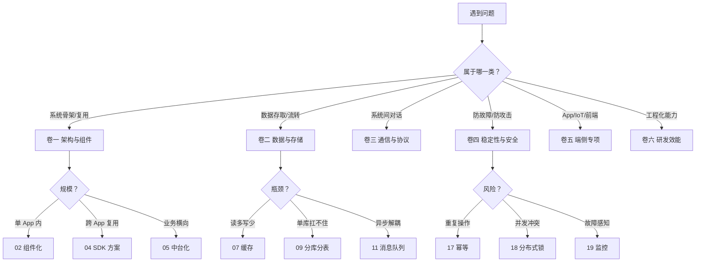

# 方案设计思想系列

## 系列概述

本系列共 **30 篇**，分为 **六卷**，聚焦软件编程中真正高频出现的"中大型可复用方案"——既不是面试八股的系统设计，也不是某个业务的具体落地，而是**那些在多个项目里反复出现、需要抽象成方案的通用问题**。

每篇都遵循统一的 **七段式骨架**：

1. **案例引入** —— 一个真实事故或痛点
2. **问题拆解** —— 这个方案要解决什么核心矛盾
3. **业界方案** —— 至少 3 家做法横向对比
4. **设计原则** —— 抽象出 3-5 条选型准则
5. **方案落地** —— 核心模块 + 流程图 + 关键代码
6. **踩坑反例** —— 哪些场景不该用这个方案
7. **演进路线** —— 从 V1 到 V3 的迭代思路

## 学习路径


## 文档索引

> 全册按"卷 → 篇"两级组织：**5 卷、19 篇**。✅ 表示已完成，🔜 表示规划中。

---

### 📘 卷一 · 架构与组件设计（共 6 篇 / 已完成 3 篇）

> 任何中大型方案都绕不开的基础——分层、解耦、扩展、复用。

| 序号 | 文档 | 状态 | 核心内容 |
|------|------|------|---------|
| 01 | [通用架构设计方案](https://yccoding.com/pages/solution/) | ✅ | 分层架构、模块边界、依赖治理、架构演进 |
| 02 | [组件化方案的设计](https://yccoding.com/pages/b4ad7a/) | ✅ | 解耦原则、生命周期、组件通信、版本管理 |
| 03 | 插件化与热加载方案 | 🔜 | ClassLoader、动态注册、沙箱隔离、热更新 |
| 04 | [SDK 设计与发布方案](https://yccoding.com/pages/ae93f9/) | ✅ | 接入成本、版本兼容、隔离兜底、发布流程 |
| 05 | 中台化能力沉淀方案 | 🔜 | 横切能力提炼、领域抽象、复用边界 |
| 06 | 配置中心设计方案 | 🔜 | 推/拉模式、灰度下发、版本回滚、一致性 |

---

### 📘 卷二 · 数据与存储方案（共 5 篇）

> 几乎所有大型方案的"血液"——数据如何高效、可靠、可扩展地流动。

| 序号 | 文档 | 状态 | 核心内容 |
|------|------|------|---------|
| 07 | [缓存架构设计思想](https://yccoding.com/pages/2761b2/) | ✅ | 多级缓存、击穿/穿透/雪崩、一致性方案 |
| 08 | [数据库 SQL 设计思想](https://yccoding.com/pages/883f07/) | ✅ | 索引、范式、慢查询、分区分表前置 |
| 09 | [分库分表方案设计](https://yccoding.com/pages/dc341c/) | ✅ | 拆分维度、路由策略、扩容方案、跨片查询 |
| 10 | [数据同步与迁移方案](https://yccoding.com/pages/79c4a1/) | ✅ | 全量+增量、双写、对账、灰度切流 |
| 11 | [消息队列方案选型](https://yccoding.com/pages/b36101/) | ✅ | 顺序、事务、幂等、堆积、Kafka/RocketMQ 对比 |

---

### 📘 卷三 · 通信与协议方案（共 5 篇）

> 系统之间如何对话——长连接、RPC、网关、路由、网络。

| 序号 | 文档 | 状态 | 核心内容 |
|------|------|------|---------|
| 12 | [长链接方案的设计](https://yccoding.com/pages/9746aa/) | ✅ | 心跳、重连、网关、推送通道 |
| 13 | [RPC 框架设计方案](https://yccoding.com/pages/636472/) | ✅ | 序列化、注册发现、负载均衡、熔断降级 |
| 14 | [API 网关设计方案](https://yccoding.com/pages/b0248a/) | ✅ | 鉴权、限流、灰度、协议转换、插件机制 |
| 15 | [路由库设计思想](https://yccoding.com/pages/cf0c16/) | ✅ | URL 路由、拦截器、降级、跨端统一 |
| 16 | [网络检测方案设计](https://yccoding.com/pages/84c3ee/) | ✅ | 弱网识别、IP 优选、调度策略、HTTPDNS |

---

### 📘 卷四 · 稳定性与安全方案（共 5 篇）

> 方案的护城河——幂等、并发、可观测、鉴权、对抗。

| 序号 | 文档 | 状态 | 核心内容 |
|------|------|------|---------|
| 17 | [幂等性设计方案](https://yccoding.com/pages/256a6a/) | ✅ | 唯一键、Token、状态机、去重表、消息幂等 |
| 18 | [分布式锁方案设计](https://yccoding.com/pages/803b53/) | ✅ | Redis/ZK/etcd 对比、锁续约、可重入、红锁争议 |
| 19 | [监控告警方案设计](https://yccoding.com/pages/35d86e/) | ✅ | Metrics/Tracing/Logging 三件套、告警分级 |
| 20 | [终端设备鉴权设计](https://yccoding.com/pages/3856c5/) | ✅ | DeviceID、签名、防伪造、设备指纹 |
| 21 | [移动端防抓包实践](https://yccoding.com/pages/118ea4/) | ✅ | SSL Pinning、双向认证、对抗与反制 |

---

### 📘 卷五 · 端侧专项方案（共 5 篇）

> 移动端、IoT、前端等"端侧"高频出现的方案。

| 序号 | 文档 | 状态 | 核心内容 |
|------|------|------|---------|
| 22 | [IoT 框架设计方案](https://yccoding.com/pages/c2c35a/) | ✅ | 设备模型、协议接入、OTA、影子设备 |
| 23 | [动态化技术方案设计](https://yccoding.com/pages/5ead6c/) | ✅ | RN/Flutter/小程序选型、热更新、动态布局 |
| 24 | [跨端一致性方案](https://yccoding.com/pages/ab9b4e/) | ✅ | UI 一致性、逻辑统一、能力抹平、设计令牌 |
| 25 | [国际化实践方案](https://yccoding.com/pages/a8329e/) | ✅ | i18n、RTL、资源切分、文案治理 |
| 26 | [离线包与预加载方案](https://yccoding.com/pages/5798e7/) | ✅ | 离线包协议、秒开、资源调度、增量更新 |

---

### 📘 卷六 · 研发效能方案（共 4 篇）

> 让方案本身可工程化——轮训、状态机、搜索、权限。

| 序号 | 文档 | 状态 | 核心内容 |
|------|------|------|---------|
| 27 | [通用轮训方案设计](https://yccoding.com/pages/d473f4/) | ✅ | 退避算法、请求合并、惊群避免、动态间隔 |
| 28 | [状态机设计的思想](https://yccoding.com/pages/7cb24b/) | ✅ | DSL、可视化、嵌套状态、落地范式 |
| 29 | [通用搜索方案设计](https://yccoding.com/pages/725910/) | ✅ | 倒排索引、分词、相关性排序、ES 实战 |
| 30 | [通用权限模型方案](https://yccoding.com/pages/0e127a/) | ✅ | RBAC/ABAC、数据权限、菜单权限、组织架构 |

---

## 核心知识图谱

```
方案设计思想
├── 架构层（卷一）
│   ├── 通用架构 ── 分层 / 边界 / 依赖治理
│   ├── 组件化   ── 解耦 / 通信 / 生命周期
│   ├── 插件化   ── 动态加载 / 沙箱 / 热更新
│   └── SDK/中台/配置中心 ── 复用与下发
├── 数据层（卷二）
│   ├── 缓存       ── 多级 / 一致性 / 三大问题
│   ├── 数据库 SQL ── 索引 / 范式 / 慢查询
│   ├── 分库分表   ── 路由 / 扩容 / 跨片
│   ├── 数据同步   ── 双写 / 对账 / 灰度
│   └── 消息队列   ── 顺序 / 事务 / 幂等
├── 通信层（卷三）
│   ├── 长连接 ── 心跳 / 重连 / 推送
│   ├── RPC    ── 注册 / 负载 / 熔断
│   ├── 网关   ── 鉴权 / 限流 / 灰度
│   ├── 路由   ── URL / 拦截 / 降级
│   └── 网络   ── 弱网 / IP 优选 / HTTPDNS
├── 稳定层（卷四）
│   ├── 幂等       ── 防重 / Token / 去重表
│   ├── 分布式锁   ── Redis / ZK / etcd
│   ├── 监控       ── Metrics / Tracing / Log
│   └── 鉴权/对抗  ── 设备 / 签名 / 防抓包
├── 端侧层（卷五）
│   ├── IoT       ── 设备模型 / OTA / 影子
│   ├── 动态化   ── RN / Flutter / 小程序
│   ├── 跨端     ── UI / 逻辑 / 能力抹平
│   ├── 国际化   ── i18n / RTL / 资源
│   └── 离线包   ── 秒开 / 增量 / 预加载
└── 效能层（卷六）
    ├── 轮训     ── 退避 / 合并 / 惊群
    ├── 状态机   ── DSL / 可视化 / 嵌套
    ├── 搜索     ── 倒排 / 分词 / 排序
    └── 权限     ── RBAC / ABAC / 数据
```

## "我该选哪个方案" 决策树



## 推荐阅读顺序

- **新手工程师（< 2 年）**：01 → 02 → 07 → 12 → 17 → 27 → 28（先建立"方案"的概念）
- **3-5 年工程师**：全篇顺序读，重点 03（插件化）、09（分库分表）、13（RPC）、17-19（稳定性三件套）
- **架构师 / 技术负责人**：直接卷一（架构与组件）+ 卷四（稳定性与安全）+ 卷六（研发效能）三卷打通
- **移动端工程师**：卷五全卷（端侧专项）+ 卷三 12/15/16 + 卷四 20/21
- **后端工程师**：卷二全卷 + 卷三 13/14 + 卷四 17/18/19
- **面试冲刺**：07/09/11/13/14/17/18/19（高频系统设计题命中率 80%+）

## 学习方法建议

> 方案设计的精髓不在"知道方案"，而在"知道为什么是这个方案，以及它什么时候不适用"。

- **先看案例引入**：每篇 §1 都是真实事故，先想"如果是我，我会怎么解？"
- **横向对比要做表**：每篇 §3 都有 3 家方案对比，亲手画一遍选型表，比读 10 遍更深刻
- **反案例必看**：每篇 §6 的踩坑反例最值钱——它告诉你这个方案的边界
- **演进路线要复盘**：§7 的 V1→V3 是真实工程的成长轨迹，对比自己项目的演进
- **跨卷回扣**：例如读分库分表（09），要回扣到路由（15）、配置中心（06）、监控（19）
- **决策树要常用**：遇到新需求先翻 README 的决策树，再决定读哪一篇

## 专栏特色

- **真实问题驱动**：每篇都从一个真实事故/痛点切入，不"为讲而讲"
- **三家方案对比**：每篇至少横向对比 3 家做法，避免"只知道一种"
- **反案例图鉴**：每篇都有"哪些场景不该用"，避免过度设计
- **演进时间轴**：V1→V2→V3 的演进路线，让方案"长出来"而不是"砸下来"
- **跨卷网状回扣**：30 篇之间互相引用，形成真正的"知识网"
- **决策树速查**：README 末尾的决策树，3 秒定位你该读哪篇
