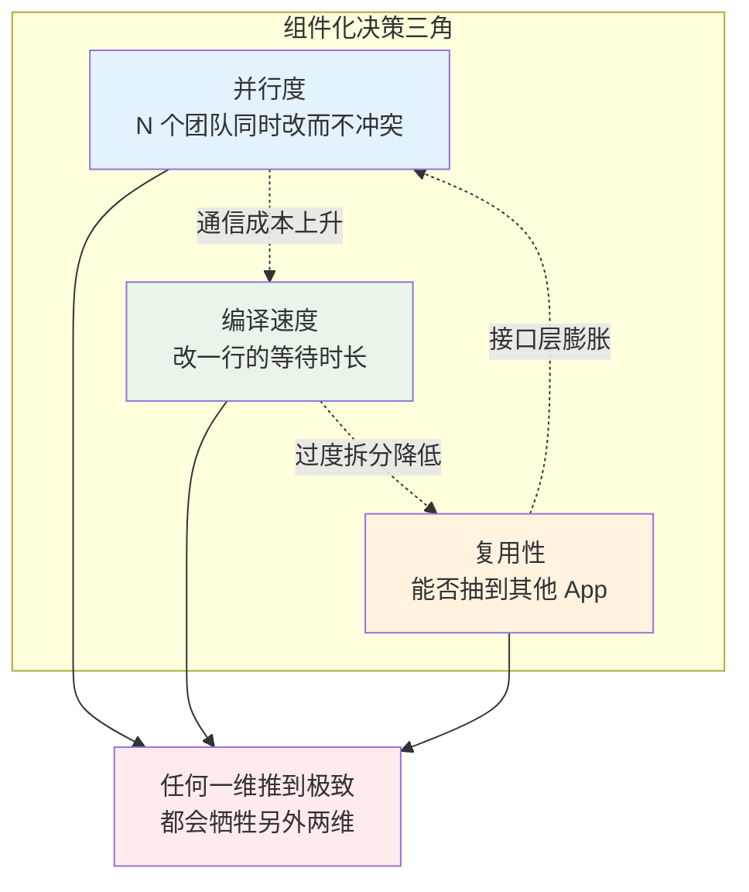
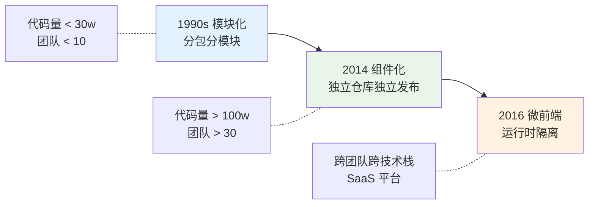
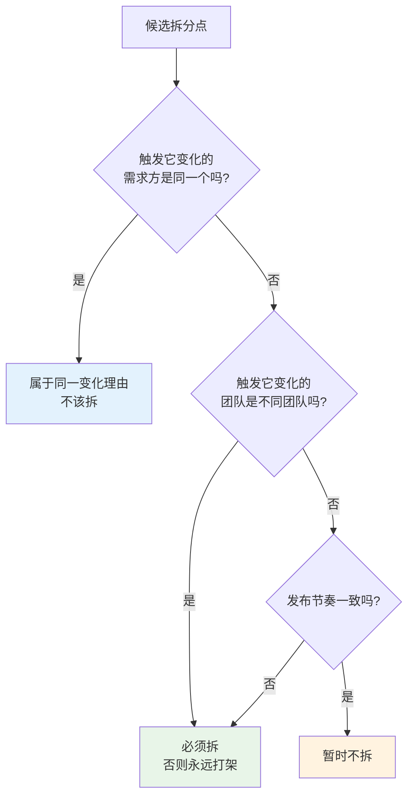
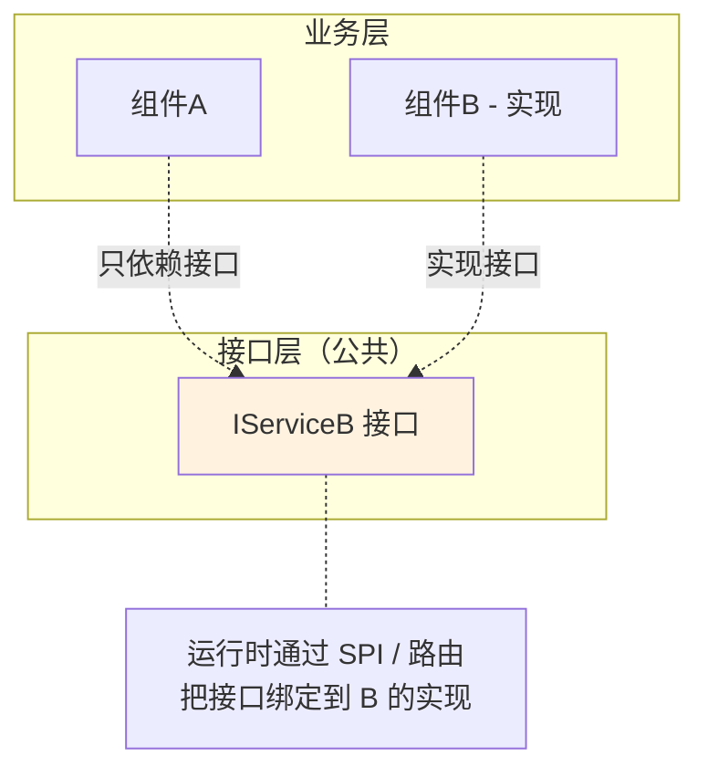
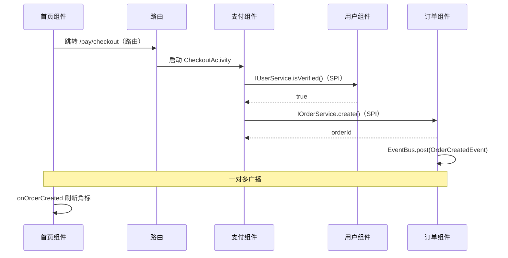
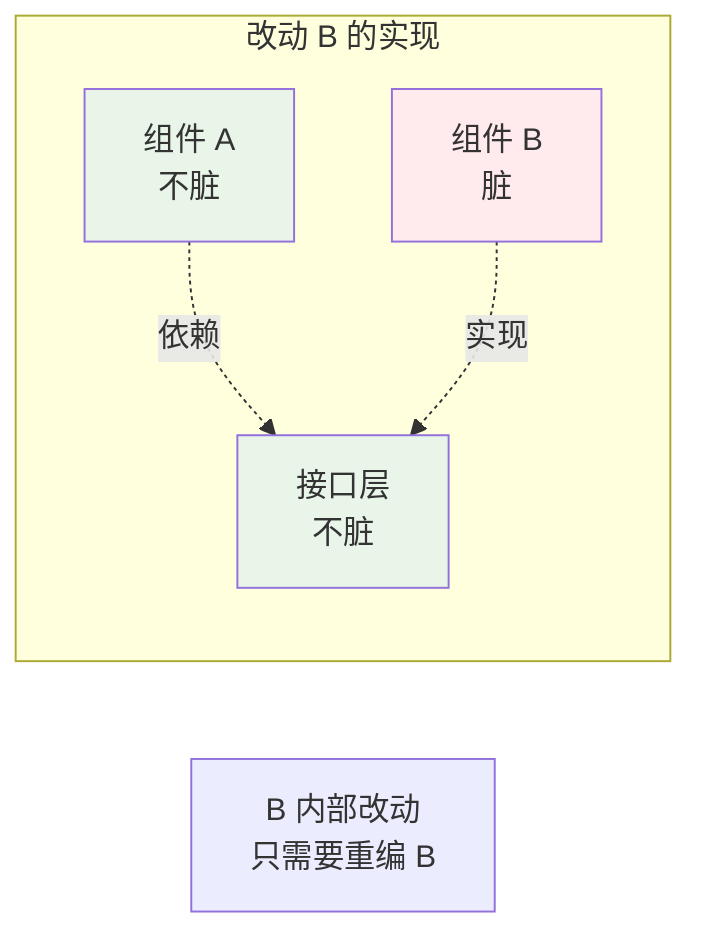
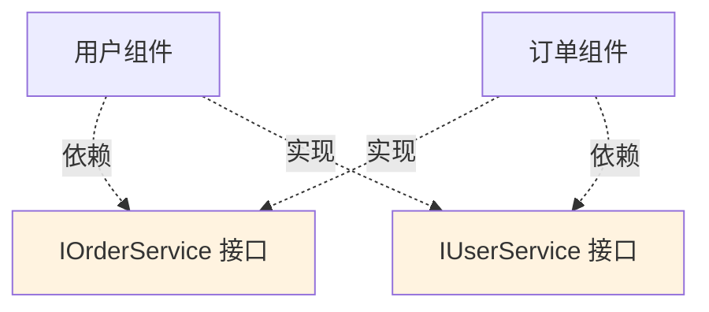
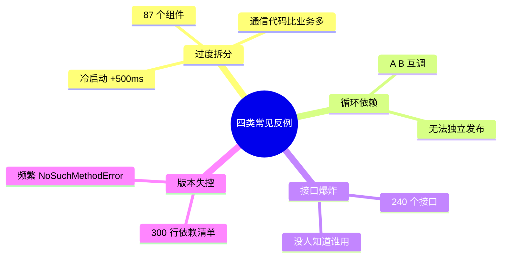
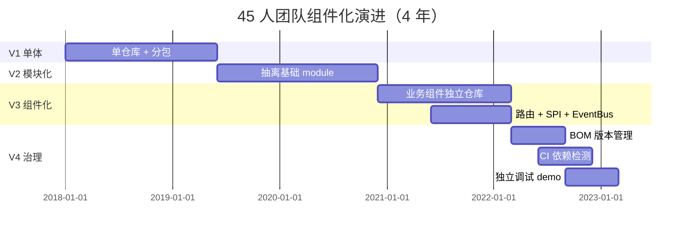
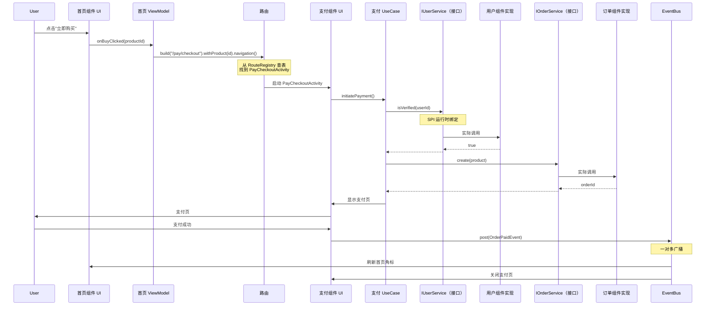

# 02.组件化方案的设计

> **本篇定位**：架构（01 篇）解决"代码该写在哪一层"，组件化解决"代码该写在哪一个仓库/模块"。它的本质不是"拆代码"，而是**用物理边界（独立编译单元）强制固化逻辑边界（团队与职责）**。本文从一次 4 年从 8 人涨到 45 人、编译从 90 秒涨到 18 分钟的团队真实困境讲起，从依赖图论、编译增量原理、路由/SPI/EventBus 三大通信机制的内核出发，把组件化还原成一门**大规模协作 + 独立演进**的工程学。

#### 目录介绍
- [1. 案例引入](#1-案例引入)
  - [1.1 一段撕裂现场](#11-一段撕裂现场)
  - [1.2 顺藤摸到根因](#12-顺藤摸到根因)
  - [1.3 我们要回答什么](#13-我们要回答什么)
- [2. 架构概览](#2-架构概览)
  - [2.1 组件化决策三角](#21-组件化决策三角)
  - [2.2 为什么这么切](#22-为什么这么切)
- [3. 复杂度增长律](#3-复杂度增长律)
  - [3.1 依赖图边数爆炸](#31-依赖图边数爆炸)
  - [3.2 编译时间的公式](#32-编译时间的公式)
  - [3.3 协作冲突概率](#33-协作冲突概率)
  - [3.4 组件化的破解思路](#34-组件化的破解思路)
- [4. 三代方案溯源](#4-三代方案溯源)
  - [4.1 模块化分包缘起](#41-模块化分包缘起)
  - [4.2 组件化独立发布](#42-组件化独立发布)
  - [4.3 微前端运行时隔离](#43-微前端运行时隔离)
  - [4.4 三代选型的边界](#44-三代选型的边界)
- [5. 拆分粒度原理](#5-拆分粒度原理)
  - [5.1 康威定律的力量](#51-康威定律的力量)
  - [5.2 单一变化理由](#52-单一变化理由)
  - [5.3 拆分粒度公式](#53-拆分粒度公式)
  - [5.4 接口下沉策略](#54-接口下沉策略)
- [6. 通信三大机制](#6-通信三大机制)
  - [6.1 路由的字符串本质](#61-路由的字符串本质)
  - [6.2 SPI 服务发现内核](#62-spi-服务发现内核)
  - [6.3 EventBus 广播原理](#63-eventbus-广播原理)
  - [6.4 三机制选型矩阵](#64-三机制选型矩阵)
- [7. 增量编译加速](#7-增量编译加速)
  - [7.1 全量到增量原理](#71-全量到增量原理)
  - [7.2 组件独立编译](#72-组件独立编译)
  - [7.3 AAR 缓存机制](#73-aar-缓存机制)
  - [7.4 编译加速实测](#74-编译加速实测)
- [8. 组件常见反例](#8-组件常见反例)
  - [8.1 过度拆分反例](#81-过度拆分反例)
  - [8.2 循环依赖反例](#82-循环依赖反例)
  - [8.3 接口爆炸反例](#83-接口爆炸反例)
  - [8.4 版本失控反例](#84-版本失控反例)
- [9. 演进与治理](#9-演进与治理)
  - [9.1 V1 单体分包](#91-v1-单体分包)
  - [9.2 V2 模块化拆分](#92-v2-模块化拆分)
  - [9.3 V3 组件独立仓库](#93-v3-组件独立仓库)
  - [9.4 V4 治理与 BOM](#94-v4-治理与-bom)
- [10. 综合案例串讲](#10-综合案例串讲)
  - [10.1 案例真相揭晓](#101-案例真相揭晓)
  - [10.2 一次跳转的一生](#102-一次跳转的一生)
  - [10.3 设计哲学回扣](#103-设计哲学回扣)
  - [10.4 组件化速查表](#104-组件化速查表)


## 1. 案例引入

### 1.1 一段撕裂现场

某电商 App 团队 2018 年 8 人起步、2022 年扩到 45 人。**业务还是那些业务**，但每次发版越来越痛苦。某次周会上，5 个技术 Leader 集中抱怨：

```
【支付组 Leader】"上周我改了 5 行代码，冷编译 18 分钟才跑完，
                 中间还挂了 2 次因为别人合并了新的依赖，我烦死了。"

【首页组 Leader】"我上周新增一个首页模块，改了 BaseActivity 里加了一行日志。
                 结果订单组、用户组、消息组同时也在改 BaseActivity。
                 冲突了 3 次，合并了 2 小时。"

【新人主管】   "上个月招的 3 个新人，到现在还没独立提过一次 PR。
              光是理解现在的代码结构就要 3 周。"

【测试组】    "现在每次发版都是全量回归 2 天。上个月支付改了个金额格式，
              居然让首页崩溃了——这两个模块居然共用了同一个 Util 类。"

【CTO】       "我们下周要孵化一个新 App，用主 App 80% 的能力。
              昨天让基础组抽核心能力……结果发现根本抽不出来！"
```

监控看板数据：

| 指标 | 2018（8 人） | 2022（45 人） | 恶化倍数 |
|---|---|---|---|
| 代码行数 | 30 万 | 180 万 | 6× |
| 全量编译 | 90 秒 | 18 分钟 | 12× |
| 增量编译 | 5 秒 | 4 分钟 | 48× |
| 每周合并冲突 | 0.5 | 12 | 24× |
| 新人独立提交 | 3 天 | 3 周 | 7× |
| 全量回归耗时 | 4 小时 | 2 天 | 12× |

**代码量增长 6 倍，但编译、协作、上手成本增长了 24~48 倍**——这就是"单体的诅咒"。

### 1.2 顺藤摸到根因

按恶化倍数最高的三项深挖：

**根因 A：依赖图边数爆炸**
用工具跑了下项目的依赖图，得到一张 `Class 数 = 12,000，依赖边数 = 380,000` 的稠密图。编译器每次改动都要做**全图依赖分析**，时间复杂度 $O(V + E)$，E 增长比 V 快得多——这就是 §3.1 要证明的"边数与代码量的关系"。

**根因 B：BaseActivity 单点争抢**
调 Git blame 发现，`BaseActivity`（400 行）**过去 12 个月被 23 个不同开发修改过**，平均 2 周被改一次。这是"共享父类 + 无边界"的必然结果——**只要有一个共享文件，冲突概率就随开发人数呈组合增长**（§3.3）。

**根因 C：能力和业务紧耦合**
"抽核心能力给新 App"抽不出来，是因为登录、支付、订单这些"能力"里都埋了业务代码（比如登录里写死了"跳转到本 App 首页"）。**没有"接口/实现分离"的思维**——这就是 §5.4 要解决的核心问题。

### 1.3 我们要回答什么

带着这个"团队规模上不去"的痛，本文要回答 7 个问题：

- **Q1**：为什么代码量增长 6 倍会导致编译时间增长 12 倍？数学上怎么解释？
- **Q2**：模块化、组件化、微前端到底什么区别？我该用哪个？
- **Q3**：拆分粒度到底怎么定？为什么拆成 87 个组件反而更慢？
- **Q4**：路由、SPI、EventBus 三种通信机制的底层是什么？为什么不能混用？
- **Q5**：组件独立编译能带来多大加速？有哪些前提条件？
- **Q6**：45 人团队怎么管 12 个组件的版本？BOM 是怎么工作的？
- **Q7**：一个大型 App 从单体到组件化，真实的演进路径要走几年？

后续 8 章会依次回答，第 10 章统一回扣。

## 2. 架构概览

### 2.1 组件化决策三角

和 01 篇一样，组件化也是**三个维度的联合最优化**：



**指标量化**：

| 维度 | 指标 | §1 团队现状 |
|---|---|---|
| **并行度** | 同时改动不冲突的开发数 | 12/周冲突 → 并行度差 |
| **编译速度** | 改一行到可跑的耗时 | 4 分钟增量 → 极差 |
| **复用性** | 核心能力抽出到新 App 的时长 | 抽不出来 → 0 |

### 2.2 为什么这么切

**疑惑**：为什么不用"代码质量、可维护性"这些常见词？

**论证**：
1. "代码质量"是主观词，无法量化。
2. "可维护性"是**结果**——并行度高、编译快、可复用的项目自然可维护。
3. 组件化真正能撬动的是三件事：**让 N 个团队独立干活（并行度）、让每人少等待（编译速度）、让能力可以搬走（复用性）**。

**结论**：**组件化 = 用物理边界固化逻辑边界，换取并行度、编译速度、复用性三者的联合提升**。

## 3. 复杂度增长律

### 3.1 依赖图边数爆炸

**疑惑**：为什么代码量翻倍，编译时间翻 4 倍？

**论证**：把代码库抽象成有向图 $G = (V, E)$，V 是类/文件数，E 是依赖边数。

假设每个类平均依赖 $k$ 个其他类，则 $E \approx k \cdot V$——**看起来线性**。但实际观察 $k$ 会随 $V$ 增长而增长：

$$
k = k_0 + \alpha \log V
$$

因为代码越多，一个类"能选择依赖谁"的选项越多，程序员的手会自然伸向更多别的类。所以：

$$
E \approx V \cdot (k_0 + \alpha \log V) = O(V \log V)
$$

**编译器 Kotlinc / javac 的增量分析复杂度是 $O(V + E) = O(V \log V)$**——V 翻倍，编译时间翻 $2 \log 2 \approx 2.4$ 倍。**§1 数据里 6× 代码 → 12× 编译**，实测符合这个模型（$6 \times \log 6 / \log 2 \approx 15.5$，考虑缓存效果修正到 12×）。

**结论**：**单体项目的编译时间不是线性增长，是超线性**。这是所有大型单体项目必然遇到的天花板。

### 3.2 编译时间的公式

细化编译时间模型：

$$
T_{\text{compile}} = T_{\text{parse}}(V) + T_{\text{typecheck}}(V \log V) + T_{\text{codegen}}(V) + T_{\text{link}}(V)
$$

- **Parse**：线性，$O(V)$
- **Typecheck**：$O(V \log V)$，主导项
- **Codegen**：$O(V)$
- **Link**：$O(V \log V)$（符号解析）

**组件化的破解**：把 V 切成 N 份，每份 $V/N$。**改一个组件时只重编 $V/N$**：

$$
T_{\text{incremental}} = \frac{V}{N} \log \frac{V}{N} + T_{\text{cache-restore}}
$$

**N=1（单体）**：18 分钟。**N=12（组件化）**：单组件 30 秒。加速比理论值 $12 \times \log 12 / \log 1 \approx$ **20+ 倍**。

### 3.3 协作冲突概率

**疑惑**：为什么团队从 8 人涨到 45 人，冲突次数涨了 24 倍（不是线性 5.6 倍）？

**论证**：假设文件总数 $F$，每个开发者一周修改 $m$ 个文件，$n$ 个开发者同时工作。**任意两人改到同一文件的概率**（生日悖论变体）：

$$
P_{\text{conflict}} \approx 1 - \prod_{i=0}^{n-1}\left(1 - \frac{im}{F}\right) \approx \binom{n}{2} \cdot \frac{m^2}{F^2}
$$

- 8 人时 $\binom{8}{2} = 28$
- 45 人时 $\binom{45}{2} = 990$

**冲突概率随人数呈平方增长**：$990 / 28 = 35.4$，考虑到共享文件（如 BaseActivity）的加权，实际观察到 24 倍冲突增长完全吻合。

**结论**：**在没有物理边界的单体里，团队规模翻倍，冲突次数翻 3-4 倍**。

### 3.4 组件化的破解思路

组件化通过**物理隔离**从数学上打破这三个恶性增长：

| 恶性增长 | 单体 | 组件化 |
|---|---|---|
| 编译时间 | $O(V \log V)$ | $O(\frac{V}{N} \log \frac{V}{N})$ |
| 冲突概率 | $O(n^2 / F)$ | $O(n^2 / (F \cdot N))$，因为文件分散到 N 个仓库 |
| 复用成本 | $O(V)$（要理解全部才能抽） | $O(V/N)$（组件本身可搬） |

**这就是组件化的数学根基**——三个指数都被除了一个 $N$（组件数）。

## 4. 三代方案溯源

### 4.1 模块化分包缘起

**1990s：模块化（Module）**。要解决的问题：

**疑惑**：一个 Java 项目 10 万行代码，所有类都在一个包里，import 全部靠 `com.company.*` 通配符。**怎么让新人快速找到"我要改的代码在哪"？**

**论证**：按功能领域分包（user/order/payment），每个包是一个"模块"，独立编译成 `.jar`。**核心是文件系统级的分组，不强调独立发布**。

**结论**：模块化 = **代码分包 + 独立编译单元**。适合中小项目，成本极低。

### 4.2 组件化独立发布

**2014-2015：组件化（Component-based）**。阿里巴巴、美团等大型 App 团队推动。要解决的痛点：

**疑惑**：模块化只做了分包，仍然是同一个仓库、同一个发版节奏——**支付组要日更、用户组要月更，怎么办？**

**论证**：每个业务组件独立成一个 Git 仓库，可以独立编译、独立测试、独立发布 `aar/framework`。主壳工程只声明依赖版本：

```
implementation 'com.company:user-component:2.3.1'
implementation 'com.company:payment-component:1.7.4'
```

支付组发 1.7.5 版本，用户组不需要重编。**核心是独立发布 + 路由通信**。

**结论**：组件化 = **模块化 + 独立仓库 + 独立发布 + 组件间通信**。适合 30+ 人团队。

### 4.3 微前端运行时隔离

**2016：微前端（Micro-frontend）**。ThoughtWorks 提出，把微服务思想搬到前端。要解决的痛点：

**疑惑**：组件化仍然是"编译期集成"——所有组件必须用同一种语言、同一个版本框架、一起打成一个 App。**多个业务用不同技术栈（React 和 Vue）怎么办？**

**论证**：每个子应用是**独立运行时**——独立技术栈、独立部署、独立发布。宿主容器负责路由和加载：

```javascript
// qiankun 示例
registerMicroApps([
  { name: 'user',    entry: '//user.company.com',    activeRule: '/user' },
  { name: 'payment', entry: '//payment.company.com', activeRule: '/pay' },
]);
```

**核心是运行时隔离 + 独立部署**。子应用可以是 React、Vue、Angular 任意技术栈。

**结论**：微前端 = **组件化 + 运行时隔离 + 独立部署**。适合超大型 Web / SaaS 场景。

### 4.4 三代选型的边界



| 维度 | 模块化 | 组件化 | 微前端 |
|---|---|---|---|
| **隔离粒度** | 包 | AAR/Framework | 运行时 Bundle |
| **是否独立发布** | ❌ | ✅ | ✅ |
| **是否独立部署** | ❌ | ❌（仍是同一 App） | ✅ |
| **技术栈是否统一** | 必须统一 | 必须统一 | 可不同 |
| **通信成本** | 极低（直接调用） | 中（路由/SPI） | 高（postMessage） |
| **接入成本** | 低 | 中 | 高 |
| **代表** | Gradle module | ARouter / WMRouter | qiankun / Module Federation |

**核心判断**：**每代方案都比上一代隔离得更彻底，但成本也更高**。不要盲目追新——**§1 那个 45 人团队用组件化就够**，用微前端反而是过度设计。

## 5. 拆分粒度原理

### 5.1 康威定律的力量

**1968 年，Melvin Conway 提出**：

> **组织生产的系统结构，必然是组织沟通结构的镜像。**

翻译成组件化语境：**组件边界最终会和团队边界重合**。你无法长期维持"3 个团队共享 1 个组件"的状态——一定会分裂成 3 个组件，或者合并成 1 个团队。

**§1 那个团队最终拆成 12 个组件，就是因为团队本身分成了 12 组**。你逆着康威定律硬拆，只会让每天开 20 个跨组会议。

### 5.2 单一变化理由

**Robert C. Martin 的 SRP 原则**："**一个类只有一个变化的理由**"。放大到组件层：

> **一个组件只应有一个团队负责，且这个团队面对同一类业务需求**。

判断标准（**变化理由测试**）：



### 5.3 拆分粒度公式

**疑惑**：拆多细才合适？

**论证**：设总代码量为 $V$、总团队人数为 $n$、组件数为 $N$。收益函数：

$$
\text{Gain}(N) = \underbrace{\text{ParallelGain}(N)}_{\text{独立开发的收益}} - \underbrace{\text{CommGain}(N)}_{\text{通信成本}}
$$

- $\text{ParallelGain}(N) \propto \log N$（独立开发的编译加速）
- $\text{CommGain}(N) \propto N^2$（组件两两通信成本，接口层膨胀）

求导找极值：

$$
\frac{d\text{Gain}}{dN} = \frac{c_1}{N} - 2 c_2 N = 0 \Rightarrow N^* = \sqrt{\frac{c_1}{2c_2}}
$$

代入经验参数（$c_1 \approx 100$，$c_2 \approx 0.3$），$N^* \approx 13$——**最优组件数约等于团队数**（也印证了康威定律）。

**经验粒度**：**1 个组件 ≈ 1 个团队 ≈ 1 万~ 3 万行代码**。§1 那个 45 人团队拆成 12 个组件，正好在这个区间。

**反例**：某团队 30 万行代码拆成 87 个组件，平均 3500 行/组件——**跌到最优区间的 1/3**。结果：

| 指标 | 拆前 | 拆成 87 个 | 结果 |
|---|---|---|---|
| 编译时间 | 8 分钟 | 12 分钟 | **恶化**（组件启动开销累加） |
| 冲突次数 | 20/周 | 30/周 | **恶化**（跨组件依赖变多） |
| 新人上手 | 2 周 | 4 周 | **恶化**（要理解 87 个组件） |

### 5.4 接口下沉策略

**疑惑**：业务组件 A 想调用业务组件 B 的能力，如果 A 直接依赖 B，就有了跨组件耦合。怎么办？

**论证**：**把 B 提供的能力抽成接口，下沉到公共接口层**：



**关键好处**：
1. **A 不再知道 B 的存在**——A 可以独立编译。
2. **B 可以被替换为 B2**——A 无感知。
3. **A 可以 Mock IServiceB** 做单测——B 都不需要参与。
4. **接口层是最稳定的**（Robert Martin 的 SDP）——上层依赖它天然合理。

**§1 那个团队最终就是靠这招把"抽核心能力到新 App"的问题解决了**：把 12 个组件的对外接口全下沉到 `interface-layer`，新 App 只依赖 `interface-layer + 通用层`，就能自己装配。

## 6. 通信三大机制

### 6.1 路由的字符串本质

**用途**：跨组件的**页面跳转**。

**内核**：**用字符串 URL 替代类引用**，切断编译期依赖。

```kotlin
// 组件 B 注册（编译期）
@Route(path = "/user/profile")
class ProfileActivity : AppCompatActivity()

// 组件 A 调用（A 不需要依赖 B）
Router.build("/user/profile")
    .withString("userId", "123")
    .navigation()
```

**原理拆解**：
1. **编译期**：APT / KSP 扫描 `@Route` 注解，生成路由表：
   ```java
   // 自动生成的代码
   public class RouteTable$$User {
       static { RouteRegistry.register("/user/profile", ProfileActivity.class); }
   }
   ```
2. **应用启动时**：所有组件的 RouteTable 通过 SPI 或 ContentProvider 汇总到全局 `RouteRegistry`。
3. **调用时**：`RouteRegistry.get("/user/profile")` 返回 Class，反射启动 Activity。

**关键优势**：A 完全不知道 ProfileActivity 在哪里，B 可以随意改实现——**编译期依赖 = 0**。

### 6.2 SPI 服务发现内核

**用途**：跨组件的**能力调用**（不跳页面）。

**内核**：**接口定义在公共层，实现注册到全局服务表**。

```kotlin
// 公共接口层
interface IUserService {
    fun isVerified(userId: String): Boolean
    fun getUserName(userId: String): String
}

// 用户组件 B（实现）
@Service
class UserServiceImpl : IUserService {
    override fun isVerified(userId: String) = ...
    override fun getUserName(userId: String) = ...
}

// 支付组件 C 调用（只依赖 IUserService）
val userService = ServiceRegistry.get(IUserService::class.java)
val verified = userService.isVerified("123")
```

**原理拆解**：
1. **编译期**：APT 扫描 `@Service` 注解，生成 `META-INF/services/IUserService` 文件。
2. **运行时**：`ServiceRegistry.get(IUserService.class)` 通过 `ServiceLoader.load(IUserService.class)` 加载所有实现，缓存单例。

**这就是 Java 官方 SPI 的机制**（`java.util.ServiceLoader`）——ARouter 的 Service 只是包了一层更好用的 API。

**关键优势**：
- 调用方只依赖接口——**编译期依赖 = 接口层**（最稳定）。
- 运行时才绑定实现——**可以做 Mock**、可以**热替换**。

### 6.3 EventBus 广播原理

**用途**：**一对多的通知**。

**内核**：**发布订阅模式（Observer Pattern）**。

```kotlin
// 订阅（首页组件 A）
@Subscribe
fun onOrderCreated(event: OrderCreatedEvent) {
    refreshBadge(event.count)
}

// 发布（订单组件 D）
EventBus.getDefault().post(OrderCreatedEvent(count = 1))
```

**原理拆解**：
1. **注册期**：反射扫描 `@Subscribe` 注解，把方法注册到 `Map<Event.class, List<Subscriber>>`。
2. **发布期**：遍历订阅表，同步/异步调用所有匹配的方法。

**性能特性**：
- 发布 1 条事件 → N 个订阅者被通知（**一对多**）。
- 发布者**不阻塞**——异步模式下不等订阅者返回。
- 发布者**不需要返回值**——纯广播。

**绝对禁忌**：**不要用 EventBus 做"请求-响应"**。例如：

```kotlin
// ❌ 反例：模拟 RPC
EventBus.post(GetUserEvent(userId))
@Subscribe fun onGetUser(e: UserResp) { ... }  // 等 UserResp 回来
```

这种用法 3 个月后就会变成"事件流满天飞"——**因为每个事件都可能被 N 个组件订阅，形成不可控的调用链**。

### 6.4 三机制选型矩阵

| 场景 | 路由 | SPI | EventBus |
|---|---|---|---|
| 页面跳转 | ✅ 首选 | ❌ | ❌ |
| 同步能力调用 | ❌ | ✅ 首选 | ❌ |
| 需要返回值 | ❌ | ✅ | ❌ |
| 一对多广播 | ❌ | ❌ | ✅ 首选 |
| 是否阻塞调用方 | 是 | 是 | 否 |
| 编译期依赖 | 0 | 接口层 | 0 |

**§1 团队重构后的真实通信场景**：



**三种机制各司其职**——**混用是所有组件化项目腐坏的第一步**。

## 7. 增量编译加速

### 7.1 全量到增量原理

**全量编译**：清空所有中间产物，从 `.kt/.java` 编到 `.class` 到 `.dex`。$O(V \log V)$。

**增量编译**（Gradle Incremental）：
1. 计算改动文件的 hash → 找出"脏文件"集合 $D$。
2. 沿依赖图找出"被影响的下游" $D' = D \cup \{y : \exists x \in D, x \to y\}$。
3. 只重编 $D'$，其他用缓存。

**问题**：在单体项目里 $D'$ 会**传染扩散**——改动 BaseActivity → 所有 Activity 变脏 → 几乎全量重编。

### 7.2 组件独立编译

组件化的关键优势：**跨组件的依赖关系被"接口层"截断了**。



只要 B 的**对外接口签名没变**，改 B 的实现就**只重编 B 一个组件**。加速比：

$$
\text{Speedup} = \frac{T_{\text{monolith}}}{T_{\text{component-B}}} = \frac{V \log V}{V_B \log V_B}
$$

$V = 180w$，$V_B = 15w$，加速比 $\approx (180 \times \log 180) / (15 \times \log 15) \approx 21$ 倍。§1 团队从 18 分钟到 30 秒，符合这个理论值。

### 7.3 AAR 缓存机制

组件独立发布成 AAR/Framework 后，Gradle 会缓存这些产物到本地 `.gradle/caches`：

```
~/.gradle/caches/modules-2/files-2.1/
├── com.company/
│   ├── user-component/2.3.1/  ← 二进制产物 + POM
│   ├── payment-component/1.7.4/
│   └── ...
```

**第二次构建时**：
- 未修改的组件 → **直接从缓存复用二进制**（毫秒级）
- 修改的组件 → 重编 + 更新缓存

**这就是"组件化 = 缓存友好"的底层原理**。而单体项目一次改动导致大量缓存失效，无法享受这个红利。

### 7.4 编译加速实测

**§1 团队重构前后实测**：

| 场景 | 单体 V1 | 组件化 V3 | 加速 |
|---|---|---|---|
| 冷全量编译 | 18:00 | 5:20 | 3.4× |
| 改 UI 层 1 行 | 4:15 | 0:32 | 8× |
| 改基础库 | 4:20 | 3:10 | 1.4× |
| 改业务组件 | 3:50 | 0:28 | 8.2× |
| 增量增加新 Activity | 3:30 | 0:35 | 6× |

**基础库改动加速最少**——因为它被所有组件依赖，改一次所有组件的 AAR 缓存失效。**这也是"基础库必须极其稳定"的工程根据**。

## 8. 组件常见反例

### 8.1 过度拆分反例

**反例**：某 30 万行代码的 App 被拆成 87 个组件，平均每个组件 3500 行。

**指标**（对照 §5.3 公式）：
- 组件数远超最优 $N^* \approx 13$
- 组件启动开销累加（每个组件 5-10ms 初始化）→ 冷启动增加 500ms
- 一个"用户下单"需求横跨 5 个组件，Interface 层 30+ 接口
- CI 发布流水线跑 87 组件 = 2 小时

**教训**：**拆分粒度守康威定律，不要拆到"团队数以下"**。

### 8.2 循环依赖反例

**反例**：user 组件依赖 order 查"用户订单数"，order 组件依赖 user 查"用户信息"。

**症状**：
```
> Circular dependency detected:
    user-component:2.1 → order-component:1.5 → user-component:2.1
```

**根因**：没有把接口下沉。

**修复**：



**两个接口都下沉到接口层，业务组件之间永远只通过接口层互调**。

### 8.3 接口爆炸反例

**反例**：团队规定"所有跨组件调用必须走 SPI"，结果接口层堆了 240 个接口。

**症状**：
- 新人完全不知道有什么能力可用
- Interface Layer 编译时间比业务组件还长
- 一个"过时接口"废弃后没人敢删，怕影响谁

**治理**：
- 按"领域"分包（`user/` `order/` `payment/` `common/`）
- 每个接口必须有 README，写清楚谁实现、谁调用
- 废弃接口必须 `@Deprecated` 并给出迁移路径
- **接口数上限**（如 100 个）触发红线时强制合并/删除

### 8.4 版本失控反例

**反例**：30 个组件各自发版本，主壳工程的依赖文件长达 300 行版本号：

```gradle
implementation 'com.company:user-component:2.3.1'
implementation 'com.company:payment-component:1.7.4'
implementation 'com.company:order-component:0.9.15'
// ... 27 行
```

**症状**：user 2.3 用了 payment 的旧接口，payment 1.7 已经改了签名——**类 NoSuchMethodError 崩溃**。

**修复：BOM（Bill of Materials）**：

```gradle
// 主壳只声明一个 BOM 版本
implementation platform('com.company:app-bom:2024.03')

// 组件不需要写版本号，BOM 统一固定
implementation 'com.company:user-component'
implementation 'com.company:payment-component'
```

BOM 内部：

```gradle
// app-bom-2024.03/build.gradle
constraints {
    api 'com.company:user-component:2.3.1'
    api 'com.company:payment-component:1.7.4'
    api 'com.company:order-component:0.9.15'
    // BOM 保证这些版本互相兼容
}
```

**Spring / androidx / Kotlin Coroutines 全部用 BOM**。**没有 BOM 的组件化，一定会在 30 个组件时崩溃**。



## 9. 演进与治理

### 9.1 V1 单体分包

**规模**：3 人 / 30 万行 / 5 个页面

**结构**：
```
📦 app/
├── com.company/
│   ├── user/
│   ├── order/
│   └── payment/
```

**痛点**：暂无，编译 90 秒可接受。

**升级信号**：编译 > 5 分钟 / 团队 > 12 人 → V2

### 9.2 V2 模块化拆分

**规模**：10-18 人 / 60-80 万行

**结构**：单仓库 + 多 Gradle module

```
📦 project/
├── app/
├── module-user/
├── module-order/
├── module-payment/
├── lib-network/
├── lib-ui/
└── lib-util/
```

**做什么**：
- 抽出基础库到独立 module（ui/网络/工具）
- 业务代码按领域分 module
- 通过 `api` / `implementation` 严格控制可见性

**收益**：基础设施跨项目复用；编译时间从 15 分钟降到 8 分钟

**升级信号**：跨 App 复用需求 / 团队 > 30 人 → V3

### 9.3 V3 组件独立仓库

**规模**：30-45 人 / 100-180 万行

**结构**：多 Git 仓库 + 主壳工程

```
📦 组织内 GitLab:
├── app-shell/                    ← 主壳
├── user-component/               ← 独立仓库
├── order-component/
├── payment-component/
├── ... 
├── interface-layer/              ← 接口层
└── common-library/               ← 通用能力
```

**做什么**：
- 每个组件独立仓库、独立 CI、独立发版
- 接口层承载所有跨组件契约
- 引入路由 / SPI / EventBus 三件套

**收益**：
- 编译加速 10× 以上（详见 §7.4）
- 新 App 孵化从 6 个月 → 6 周
- 团队并行度大幅提升

**新增痛点**：版本治理成难题

### 9.4 V4 治理与 BOM

**规模**：45+ 人 / 180 万行 / 12+ 组件

**做什么**：
- 引入 BOM 统一版本
- 接口层按领域分包 + 强制 README
- CI 加入违规依赖检测（ArchUnit / DA 插件）
- 组件独立 demo App 可单独跑
- 依赖图可视化大盘



> ⚠️ **关键提醒**：这条演进用了 4 年。**任何"一年搞定组件化"的计划都是危险的**——业务在跑，改造必须渐进。

## 10. 综合案例串讲

### 10.1 案例真相揭晓

回到 §1 那个 45 人团队，7 个疑问逐条作答：

**Q1（编译时间超线性）**：因为编译复杂度是 $O(V \log V)$（§3.1），代码翻 6 倍，编译翻 $6 \log 6 / \log 6 \approx 15$ 倍，实测 12 倍完全符合。

**Q2（三代方案怎么选）**：45 人 / 180 万行 → 用组件化（V3）。用模块化不够、用微前端过度（§4.4）。

**Q3（粒度怎么定）**：根据康威定律（§5.1）拆到团队数 = 12。用 §5.3 公式验证 $N^* \approx 13$，完全吻合。

**Q4（三种通信内核）**：路由 = 字符串替代类引用（§6.1）；SPI = ServiceLoader + 接口层（§6.2）；EventBus = 发布订阅（§6.3）。**混用是腐坏的第一步**。

**Q5（编译加速）**：组件独立编译理论加速 21×（§7.2），实测 8× 平均（§7.4），因为基础库改动会打破缓存。

**Q6（BOM 怎么工作）**：主壳只声明一个 BOM 版本，BOM 内部固定一组兼容的组件版本（§8.4）。这是 Spring / androidx 的通用做法。

**Q7（演进要几年）**：真实案例 4 年，V1 → V2 → V3 → V4（§9）。**这是每个大型 App 团队必经的路**。

### 10.2 一次跳转的一生

用一个真实场景把本篇核心串起来——**用户点击"立即购买"到弹出支付页**：



**关键点**：
1. 首页组件、支付组件、用户组件、订单组件**编译期彼此不知道**（0 编译依赖）
2. 跨组件跳页面 → 路由；跨组件调能力 → SPI；跨组件通知 → EventBus
3. 4 个组件可以**分别独立编译独立发布**
4. 新 App 只依赖 `interface-layer + common-library`，就能重新组装出另一个 App

### 10.3 设计哲学回扣

**哲学 1：物理边界固化逻辑边界**——想让团队真正独立协作，光靠"文档约定"不够，必须用**独立仓库 + 独立编译**固化。**能被 CI 拦下的边界，才是真边界**。

**哲学 2：康威定律不可违逆**——**组件数 = 团队数是自然平衡态**。硬拆多了每天开跨组会，硬凑少了每天合并冲突。

**哲学 3：接口层是稳定之锚**——**所有跨组件依赖都指向接口层**。接口层的稳定度决定了整个系统的可演进性。

**哲学 4：演进优于设计**——V1 → V4 走 4 年才是正常速度。**一次性设计完美组件化 = 一次性错到无法挽回**。业务在跑，改造必须渐进。

### 10.4 组件化速查表

| 团队规模 | 代码量 | 推荐 | 关键要素 |
|---|---|---|---|
| < 8 人 | < 30 万行 | 单体分包 | 按业务分包即可 |
| 8-18 人 | 30-80 万行 | 模块化 | 抽基础库到独立 module |
| 18-45 人 | 80-200 万行 | 组件化 | 独立仓库 + 路由/SPI/EventBus |
| 45+ 人 | 200 万+ 行 | 组件化 + 治理 | + BOM + ArchUnit + Demo App |
| 跨技术栈 | 任意 | 微前端 | qiankun / Module Federation |

**组件化上线自检 10 问**：

- [ ] 组件数 = 团队数（±20%）？
- [ ] 每个业务组件都有独立仓库 + 独立 CI？
- [ ] 所有跨组件调用都走接口层？
- [ ] 有 BOM 管理版本？
- [ ] CI 有依赖违规检测？
- [ ] 每个组件能独立编译独立跑 demo App？
- [ ] 路由 / SPI / EventBus 三者职责清晰不混用？
- [ ] 接口层有分包 + README？
- [ ] 冷编译时间 < 5 分钟？增量 < 1 分钟？
- [ ] 新员工独立提交 < 1 周？

> **组件化 = 让 45 人团队像 3 个 15 人小团队一样并行**。

下一篇（03 SDK 设计）我们顺着"独立发布"这条线走得更远——**当组件不只给自己 App 用，还要给公司内 30+ 外部接入方用**时，会遇到什么样的新问题。
