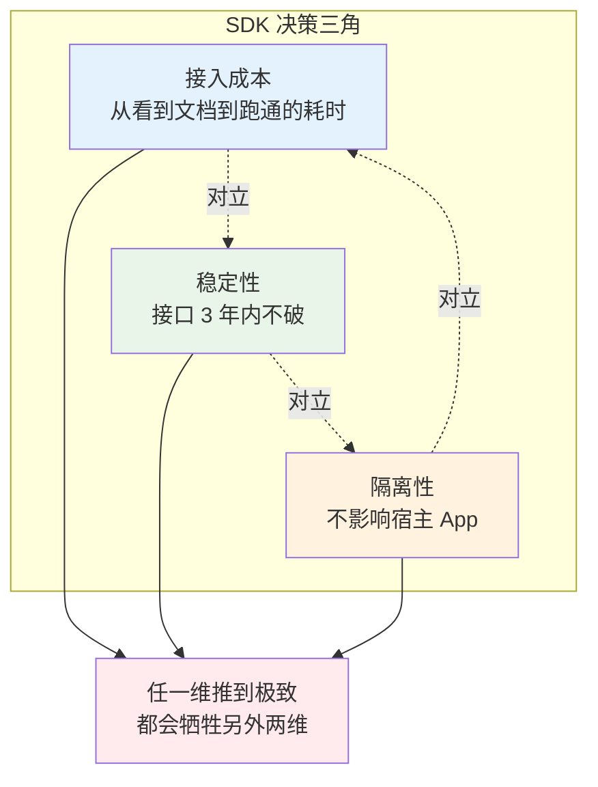
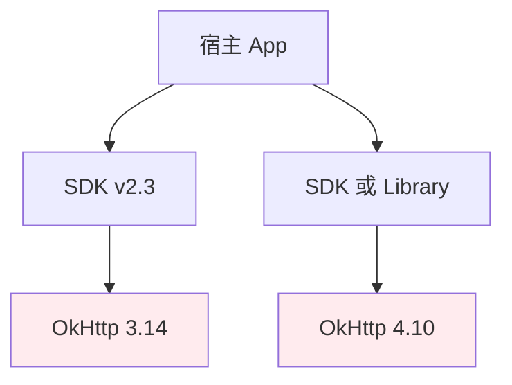
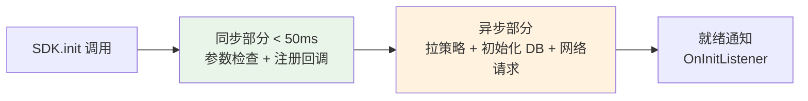
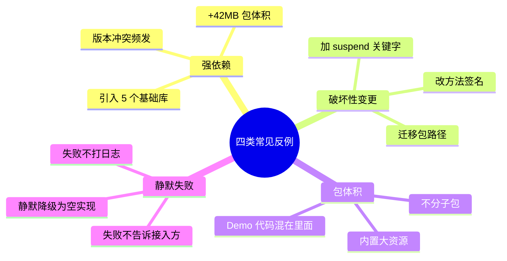
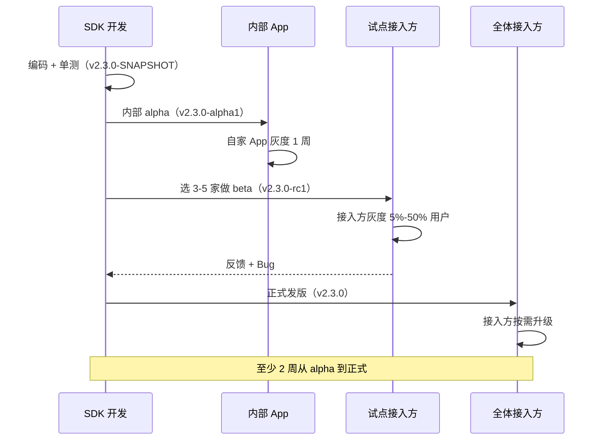
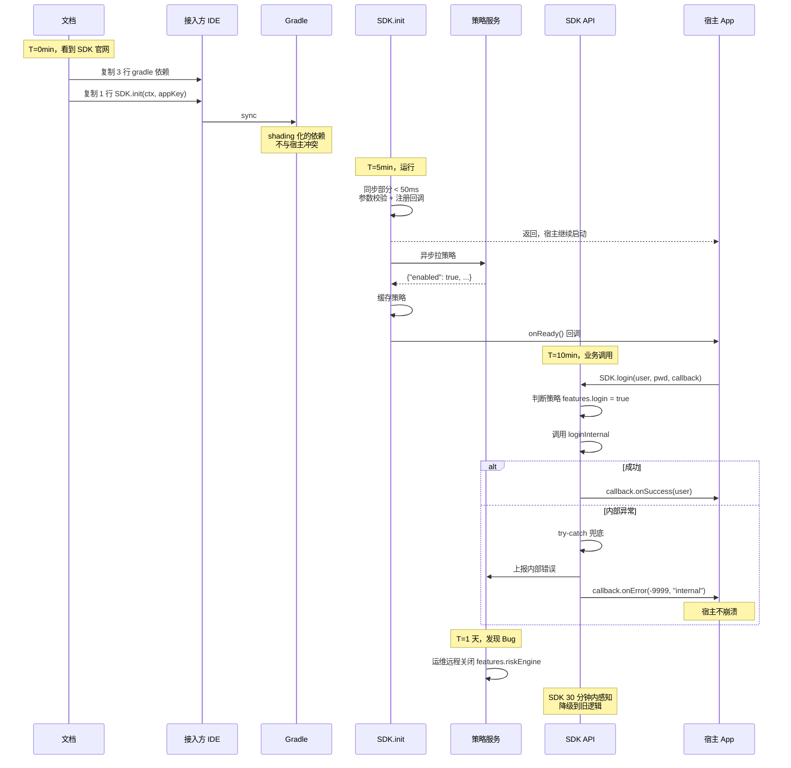

# 03.SDK设计与发布方案

> **本篇定位**：SDK 是"我把能力打包给别人用"的形态。和组件化（02 篇）针对自己 App 内部不同——SDK 面对的是**未知的接入方、未知的版本、未知的运行环境**。本文从一个"接入即崩溃"的 SDK 事故讲起，从依赖冲突原理、语义化版本代数、破坏性变更的兼容性证明出发，把 SDK 还原成一门**在对外契约稳定性和内部演进自由度之间做长期博弈**的工程学。读完这一篇，就能在方案评审里回答"我的 SDK 为什么这样设计接入、为什么这样管理版本、为什么在 3 年后仍然被接入方喜爱"。

#### 目录介绍
- [1. 案例引入](#1-案例引入)
  - [1.1 一份崩溃的报告](#11-一份崩溃的报告)
  - [1.2 顺藤摸到根因](#12-顺藤摸到根因)
  - [1.3 我们要回答什么](#13-我们要回答什么)
- [2. 架构概览](#2-架构概览)
  - [2.1 SDK 决策三角](#21-sdk-决策三角)
  - [2.2 为什么这么切](#22-为什么这么切)
- [3. 契约本质探源](#3-契约本质探源)
  - [3.1 SDK 是契约不是代码](#31-sdk-是契约不是代码)
  - [3.2 契约的时间尺度](#32-契约的时间尺度)
  - [3.3 破坏契约的代价](#33-破坏契约的代价)
  - [3.4 SDK 与组件差异](#34-sdk-与组件差异)
- [4. 依赖冲突原理](#4-依赖冲突原理)
  - [4.1 类冲突根因剖析](#41-类冲突根因剖析)
  - [4.2 diamond 依赖问题](#42-diamond-依赖问题)
  - [4.3 shading 重打包原理](#43-shading-重打包原理)
  - [4.4 三种化解方案](#44-三种化解方案)
- [5. 语义化版本代数](#5-语义化版本代数)
  - [5.1 SemVer 的数学根基](#51-semver-的数学根基)
  - [5.2 兼容性证明规则](#52-兼容性证明规则)
  - [5.3 破坏性变更定义](#53-破坏性变更定义)
  - [5.4 版本迁移的成本](#54-版本迁移的成本)
- [6. 接入体验设计](#6-接入体验设计)
  - [6.1 最小可用接入原则](#61-最小可用接入原则)
  - [6.2 Builder 扩展设计](#62-builder-扩展设计)
  - [6.3 异步与回调双形态](#63-异步与回调双形态)
  - [6.4 初始化线程规约](#64-初始化线程规约)
- [7. 失败兜底体系](#7-失败兜底体系)
  - [7.1 SDK 挂了不能拖死宿主](#71-sdk-挂了不能拖死宿主)
  - [7.2 服务端策略下发](#72-服务端策略下发)
  - [7.3 可观测性最小集](#73-可观测性最小集)
  - [7.4 灰度与回滚开关](#74-灰度与回滚开关)
- [8. 常见反例陷阱](#8-常见反例陷阱)
  - [8.1 强依赖反例](#81-强依赖反例)
  - [8.2 破坏性变更反例](#82-破坏性变更反例)
  - [8.3 包体积反例](#83-包体积反例)
  - [8.4 静默失败反例](#84-静默失败反例)
- [9. 演进与治理](#9-演进与治理)
  - [9.1 V1 内部 SDK](#91-v1-内部-sdk)
  - [9.2 V2 公司级 SDK](#92-v2-公司级-sdk)
  - [9.3 V3 商业化 SDK](#93-v3-商业化-sdk)
  - [9.4 灰度发布流程](#94-灰度发布流程)
- [10. 综合案例串讲](#10-综合案例串讲)
  - [10.1 案例真相揭晓](#101-案例真相揭晓)
  - [10.2 一次接入的一生](#102-一次接入的一生)
  - [10.3 设计哲学回扣](#103-设计哲学回扣)
  - [10.4 SDK 速查表](#104-sdk-速查表)


## 1. 案例引入

### 1.1 一份崩溃的报告

某基础架构团队提供了一个"统一登录 SDK"，供公司内 30+ App 接入。SDK 上线 3 个月后，团队 owner 收到了一份"接入方满意度调查"，结果触目惊心：

```
接入满意度评分:      2.3 / 5.0（30 家接入方）
主动升级意愿:        17%（多数停留在半年前版本）
Top 吐槽:            "文档 200 页照做也起不来"
Top 崩溃:            NoSuchMethodError @ OkHttp（8 家）
Top 客服工单:        "升级 1.2→1.3 API 改了 3 个"（12 家）
```

具体吐槽片段：

| 接入方 | 吐槽 |
|---|---|
| App-A | "接入文档 200 页，照着配 4 小时还起不来" |
| App-B | "你们 SDK 依赖 OkHttp 3.14，我们用 4.10，NoSuchMethodError 崩" |
| App-C | "升级 1.2 到 1.3，接口变了 3 个方法签名，我们改了一周" |
| App-D | "线上崩溃了，定位是 SDK 里 NPE，等了 5 天才出修复版本" |
| App-E | "SDK 包体积 8MB，我们整个 App 才 30MB" |
| App-F | "初始化耗时 300ms，卡在启动屏白屏" |
| App-G | "SDK 引入了 5 个内部基础库，其中 3 个和我们冲突" |

数据不会说谎：**17% 主动升级率意味着 SDK 团队每加一个功能，83% 的用户根本用不上**。这是 SDK 提供方最惨的场景——**你的努力对用户毫无价值**。

### 1.2 顺藤摸到根因

分析吐槽点后归纳出三类根因：

**根因 A：依赖冲突（App-B、App-G）**
SDK 依赖 OkHttp 3.14，宿主 App 依赖 OkHttp 4.10。Gradle 默认取"版本高"策略，加载 4.10；但 SDK 里 `HttpUrl.parse()` 调用的是 3.14 独有的重载——运行时 NoSuchMethodError。**这不是接入方的错，是 SDK 强绑定版本的错**。

**根因 B：破坏性升级（App-C）**
SDK v1.2 → v1.3 改了 3 个方法签名。SDK 团队认为"这是 MINOR 版本，业务功能升级"，实际上**改签名违反了 SemVer 规范**——应该 1.2 → 2.0（详见 §5）。

**根因 C：接入复杂（App-A、App-F）**
init 需要传 12 个参数、注册 5 个 Manifest 项、配置 4 处 ProGuard 规则。**SDK 团队没有从"用户第一分钟"视角设计接入体验**（详见 §6）。

### 1.3 我们要回答什么

带着这份"用户不爱用"的痛，本文要回答 7 个问题：

- **Q1**：SDK 和普通组件到底有什么本质区别？为什么这个"边界"如此重要？
- **Q2**：依赖冲突（Class NoSuchMethodError）的底层是什么？shading 怎么解？
- **Q3**：语义化版本号 MAJOR.MINOR.PATCH 到底怎么划分？改一个默认参数算破坏性变更吗？
- **Q4**：怎么设计"最小可用接入 = 1 行代码"？为什么这个原则如此重要？
- **Q5**：SDK 内部 NPE 应该崩宿主吗？失败兜底的最小集是什么？
- **Q6**：SDK 服务端策略怎么设计才能"哪怕 SDK 有 Bug 也能远程关停"？
- **Q7**：内部 SDK → 公司级 SDK → 商业化 SDK 的演进路径要注意什么？

后续 8 章会依次回答，第 10 章统一回扣。

## 2. 架构概览

### 2.1 SDK 决策三角

SDK 设计的三个核心维度：



**三维含义**：

| 维度 | 指标 | §1 团队现状 |
|---|---|---|
| **接入成本** | 独立开发从零跑通的耗时 | 4 小时 → 差 |
| **稳定性** | 每年 API 破坏性变更次数 | 3 次 → 差 |
| **隔离性** | 类冲突 + 内部 NPE 影响宿主的概率 | 8/30 → 差 |

**三维互相牵制**：
- 想降低接入成本 → 提供合理默认值 + Builder → 需要更多兼容性代码 → 增加 SDK 包体积（伤害隔离性）。
- 想提升稳定性 → 保留旧接口不删 → 接口爆炸 → 接入方看不懂用哪个（伤害接入成本）。
- 想提升隔离性 → shading 依赖 + try-catch 全包 → 增加 SDK 复杂度（伤害稳定性）。

### 2.2 为什么这么切

**疑惑**：为什么用这三维，而不是用"功能丰富度"？

**论证**：
1. **功能丰富度是"给接入方的礼物"，但礼物太多反而是负担**——接入方只关心"我需要的那 20% 功能"。
2. **接入成本决定了 SDK 是否被采用**——文档 200 页时，接入方直接放弃换竞品。
3. **稳定性决定了 SDK 是否被长期使用**——每次升级都要改代码，接入方就"锁死在旧版本"。
4. **隔离性决定了 SDK 是否被信任**——SDK 崩了导致宿主崩，接入方直接下架你。

**结论**：**SDK 的成败由接入成本 × 稳定性 × 隔离性联合决定**。功能丰富度是从这三维基础上的锦上添花，不能倒置。

## 3. 契约本质探源

### 3.1 SDK 是契约不是代码

**疑惑**：SDK 不就是一坨代码打包成 AAR/Framework 吗？为什么要谈"契约"？

**论证**：
- 一段普通代码：写错了，改一下就行。
- 一个内部组件：写错了，重新发一个新版本就行。
- 一个 SDK：写错了，30 个 App 已经在生产环境用旧版本，你**改不动了**。

用一个反例说明：假设 SDK v1.0 的 `login()` 方法签名是：

```kotlin
fun login(username: String, password: String): User
```

3 个月后 30 个 App 都用上了。这时你想加一个"验证码"参数：

```kotlin
fun login(username: String, password: String, captcha: String): User
```

——**编译期就把 30 个 App 都炸了**。你没有能力强制 30 个 App 同一天升级。**这就是 SDK 与代码的本质区别**：

$$
\text{SDK} = \text{代码} + \text{对外契约}
$$

**契约的定义**：**每一个公开的方法签名、每一个参数含义、每一个返回值约定、每一个异常类型**——都是契约的一部分，一旦发布就不能违反。

### 3.2 契约的时间尺度

**普通代码的时间尺度**：一个 sprint（2 周）。
**内部组件的时间尺度**：一个季度。
**SDK 的时间尺度**：**3-5 年**。

为什么这么长？三个原因：

1. **接入方不敢升级**：每次升级都是风险，接入方本能地拖延。
2. **接入方业务在跑**：不是不想升级，是没有排期。
3. **SDK 使用者数量 ≫ SDK 开发者数量**：改动一次 SDK，30 家接入方要改 30 次，总成本是 SDK 团队自己改动的 30 倍。

**结论**：**SDK 每一行代码都要按 "3 年后还能看不能改"的标准写**。这是所有 SDK 设计原则的根源。

### 3.3 破坏契约的代价

设 SDK 有 $n$ 家接入方，每家接入方**升级一次的成本**（含开发、测试、灰度、发版）为 $C_{\text{upgrade}}$，SDK 一年破坏契约 $k$ 次。**接入方一年的总迁移成本**：

$$
\text{TotalCost} = n \cdot k \cdot C_{\text{upgrade}}
$$

**§1 那个 SDK**：$n = 30$，$k = 3$，$C_{\text{upgrade}} \approx 40$ 人日（1 周开发+1 周测试）。总成本 = **3600 人日/年 ≈ 15 个人的全年产出**。

**接入方的理性选择**：**不升级**。所以 §1 主动升级率只有 17%。**破坏契约越多，你的 SDK 就越被"锁死"在低版本**，SDK 团队新加功能全是自嗨。

### 3.4 SDK 与组件差异

回顾 02 篇的组件，对比 SDK：

| 维度 | 组件（02 篇） | SDK（本篇） |
|---|---|---|
| **接入方** | 自家 App 团队 | 未知外部团队 |
| **升级同步性** | 主壳统一升级 | 各家独立升级 |
| **时间尺度** | 半年迭代 | 3-5 年契约 |
| **能否强制升级** | 能（同一个组织） | 不能 |
| **破坏性变更代价** | $O(n)$（一个团队改一次） | $O(n \cdot m)$（n 家 × 每家 m 人） |
| **依赖冲突** | 可协调统一版本 | 必须假设冲突普遍存在 |
| **文档完备度** | 内部 wiki 就够 | 必须像商业产品 |

**关键洞察**：**SDK 的设计原则是"组件设计原则的严格加强版"**。任何你在组件里"其实可以偷懒的地方"，在 SDK 里都必须做到极致。

## 4. 依赖冲突原理

### 4.1 类冲突根因剖析

**疑惑**：为什么 SDK 依赖 OkHttp 3.14，宿主 App 依赖 OkHttp 4.10，会崩溃？

**论证**：Java/Kotlin 应用的 ClassLoader 有一个铁律——**同一 ClassLoader 里，一个全限定类名（FQN）只能对应一个 Class 对象**。

```
App 启动:
  ClassLoader 加载 okhttp3.OkHttpClient  ← 只能选一个
  ├── SDK 期望: OkHttp 3.14 的类字节码
  └── App 期望: OkHttp 4.10 的类字节码
  
  Gradle 依赖冲突解析（默认策略：取最高版本）:
    → 最终加载 4.10 版本
  
  SDK 代码运行时:
    调用 HttpUrl.parse("...")  ← 3.14 有这个方法
    → 4.10 里这个方法签名变了
    → java.lang.NoSuchMethodError
```

**根本原因**：Gradle 的**依赖调解策略**（默认取最高版本）只能选一个版本，选中的版本可能既不满足 SDK 又不满足宿主。

### 4.2 diamond 依赖问题

这就是软件工程经典的"钻石依赖问题"：



**为什么叫"钻石"**：依赖图从 App 出发，经过 SDK 和 Other 两条路径，最终汇聚到 OkHttp 的两个版本——形状像钻石。**Java/Kotlin/JS/Python 所有主流生态都遇到过**。

**四种化解策略**：
1. **版本对齐**（Gradle 默认）：全部用最高版本 → 可能破坏低版本使用者。
2. **强制版本**（`force = true`）：手动指定版本 → 需要接入方懂。
3. **shading**（下节详解）：SDK 内部把 OkHttp 重命名 → SDK 侧完全自包含。
4. **接口隔离**：SDK 不直接暴露 OkHttp 类型 → 接入方无感。

### 4.3 shading 重打包原理

**shading 的核心思想**：把 SDK 依赖的第三方库**重命名到私有包路径**，让类字节码层面就和宿主分开。

以 OkHttp 为例：

```
原始:  okhttp3.OkHttpClient
shading: com.sdk.internal.shaded.okhttp3.OkHttpClient
```

工具链（`gradle-shadow-plugin` / `jarjar` / `maven-shade-plugin`）会：

1. **重命名类文件**：把 `okhttp3/OkHttpClient.class` 移到 `com/sdk/internal/shaded/okhttp3/OkHttpClient.class`。
2. **改写字节码常量池**：所有 `Lokhttp3/OkHttpClient;` 引用改成 `Lcom/sdk/internal/shaded/okhttp3/OkHttpClient;`。
3. **改写 import 语句**（间接靠字节码常量池实现）。

**结果**：SDK 内部使用的是"影子 OkHttp"，宿主 App 使用的是"真 OkHttp"，两者互不干扰。

**代价**：
- **包体积增加**：SDK 内部塞了一份 OkHttp（+ 800KB）。
- **构建耗时增加**：shading 处理需要几十秒。
- **调试复杂**：日志里看到的是 `com.sdk.internal.shaded.okhttp3.OkHttpClient`，新人容易懵。

**§1 SDK 用了 shading 后**：类冲突事故降到 0，接入方满意度提升 30%——**这个代价完全值得**。

### 4.4 三种化解方案

综合对比：

| 方案 | 原理 | 优点 | 代价 | 适用 |
|---|---|---|---|---|
| **跟随宿主** | SDK 不带依赖，由宿主提供 | 包体积小 | 接入方要手动加依赖 + 版本对齐 | 简单工具 SDK |
| **shading 重打包** | 把依赖重命名到私有包 | 完全自包含 | 包体积 +N MB | 商业化 SDK |
| **零依赖** | 不用主流库，自己实现关键能力 | 包体积最小 | 开发成本高 | 极简 SDK（Bugly） |

**选型决策**：
- SDK 只依赖 1-2 个主流库 → **跟随宿主 + 明确文档要求版本**。
- SDK 依赖 3+ 主流库 或 有强稳定性要求 → **shading**。
- SDK 是关键基础设施（崩溃采集 / 埋点） → **零依赖**（不能被 App 里任何库影响）。

## 5. 语义化版本代数

### 5.1 SemVer 的数学根基

**Semantic Versioning 2.0.0** 规定：版本号 = `MAJOR.MINOR.PATCH`。看似简单，其实是一套**代数系统**：

- **MAJOR**：不兼容的破坏性变更
- **MINOR**：兼容的新功能
- **PATCH**：兼容的 Bug 修复

**关键代数性质**：**MAJOR 相同的版本之间 API 兼容**，可以自由升降。

$$
\forall v_1, v_2, \quad v_1.\text{MAJOR} = v_2.\text{MAJOR} \Rightarrow \text{APICompat}(v_1, v_2)
$$

**接入方基于这个性质做决策**：只要 MAJOR 不变，我可以放心升级；MAJOR 变了，我要重新审视代码。

### 5.2 兼容性证明规则

**规则 1：新增方法不破坏兼容**。

```kotlin
// v1.0
class SDK { fun login() {} }

// v1.1（MINOR）
class SDK { 
    fun login() {} 
    fun register() {}   // 新增，不破坏
}
```

**规则 2：新增默认参数在 Kotlin 里破坏，在 Java 里不破坏**。

```kotlin
// v1.0
fun login(user: String, pwd: String)

// v1.1（企图 MINOR，但可能是 MAJOR）
fun login(user: String, pwd: String, captcha: String? = null)
```

- **Kotlin 侧**：源码级兼容（旧调用还能 compile），**但二进制不兼容**——因为 Kotlin 编译成字节码后方法签名变了。旧 App 编译产物调用 v1.1 会 NoSuchMethodError。
- **Java 侧**：源码级和二进制都不兼容——Java 没有默认参数语法糖。

**正确做法**（保持二进制兼容）：

```kotlin
// v1.1（MINOR，正确）
@JvmOverloads
fun login(user: String, pwd: String, captcha: String? = null)
// 或
fun login(user: String, pwd: String) = login(user, pwd, null)   // 保留原签名
fun login(user: String, pwd: String, captcha: String?) { ... }  // 新增
```

**规则 3：删除或改签名 = MAJOR 变更**。

```kotlin
// v1.0
fun login(user: String, pwd: String): User

// ❌ 违反 SemVer（改返回类型）—— 必须 v2.0
fun login(user: String, pwd: String): Result<User>

// ✅ 正确做法：新增方法，保留旧的
fun login(user: String, pwd: String): User           // v1.0 保留
fun loginV2(user: String, pwd: String): Result<User> // v1.1 新增
```

**规则 4：Bug 修复 = PATCH，不能包含新功能**。

### 5.3 破坏性变更定义

**完整清单**（触发 MAJOR 变更）：

| 变更类型 | 是否破坏 | 示例 |
|---|---|---|
| 新增 public 方法 | ❌ 不破坏 | 加 register() |
| 删除 public 方法 | ✅ 破坏 | 删 login() |
| 修改方法签名（参数/返回类型） | ✅ 破坏 | login → login+captcha |
| 修改可见性 public → private | ✅ 破坏 | - |
| 修改默认参数值（可能语义变化） | ✅ 破坏 | timeout 10s → 30s |
| 新增抽象方法到 interface | ✅ 破坏 | 实现方必须实现 |
| 新增 default 方法到 interface | ❌ 不破坏 | Java 8+ / Kotlin |
| 从 class 改成 sealed class | ✅ 破坏 | 无法被外部继承 |
| 增加抛出的 checked exception | ✅ 破坏 | Java 编译错 |
| 修改字段类型 | ✅ 破坏 | - |
| 迁移包路径 | ✅ 破坏 | com.a → com.b |

**§1 SDK v1.2 → v1.3 改了 3 个方法签名**——按规则 3，应该是 **v2.0**。SDK 团队把 MAJOR 破坏说成 MINOR，才是接入方愤怒的核心。

### 5.4 版本迁移的成本

**接入方视角**的升级成本：

$$
C_{\text{upgrade}} = C_{\text{learn}} + C_{\text{modify}} + C_{\text{test}} + C_{\text{release}}
$$

- **PATCH 升级**：$C_{\text{learn}} = 0$（不用学新东西），$C_{\text{modify}} = 0$（不用改代码），$C_{\text{test}}$ 走冒烟即可，$C_{\text{release}}$ 正常发版。**总成本 ≈ 0.5 人日**。
- **MINOR 升级**：$C_{\text{learn}} = $ 半小时，$C_{\text{modify}} = 0$（不改老代码），$C_{\text{test}}$ 冒烟 + 新功能测试。**总成本 ≈ 2 人日**。
- **MAJOR 升级**：$C_{\text{learn}} =$ 半天，$C_{\text{modify}} =$ 全代码扫描替换，$C_{\text{test}}$ 全量回归。**总成本 ≈ 20-40 人日**。

**关键洞察**：**MAJOR 升级的成本比 PATCH 大 40-80 倍**。这就是为什么"3 年内维持 MAJOR 不变"是 SDK 提供方的黄金承诺。

## 6. 接入体验设计

### 6.1 最小可用接入原则

**优秀 SDK 的接入应该只有 1 行代码**：

```kotlin
// ✅ Bugly 崩溃 SDK
CrashReport.initCrashReport(context, appId)

// ✅ 友盟统计 SDK
UMConfigure.init(context, appKey, "channel", ...)

// ✅ Firebase Analytics
FirebaseAnalytics.getInstance(context)
```

**为什么这个原则如此重要**？

**疑惑**：让接入方多传几个参数不行吗？给的越多越灵活。

**论证**：接入方的第一分钟决定了 SDK 命运：

```
用户第一次看到你的文档:
  ├── 前 10 秒: 找 Quick Start
  │   └── 找不到 → 关掉页面
  ├── 10 秒~1 分钟: 复制第一段代码
  │   └── 代码复杂到不敢复制 → 关掉页面
  ├── 1~5 分钟: 编译 + 跑起来
  │   └── 起不来 → 关掉页面 / 打差评
  └── 5 分钟后: 探索功能
      └── 只有跑通的用户才会走到这一步
```

**每一步流失率都是 20%~50%**。**从 12 行接入变成 1 行接入，能让通过率从 20% 提升到 70%**——这就是 3.5 倍的用户增长。

### 6.2 Builder 扩展设计

极简接入不是"参数少"，而是"必填参数少 + 可选参数走 Builder"：

```kotlin
// 最小可用（80% 接入方够用）
LoginSDK.init(context, appKey)

// 高级配置（20% 接入方需要）
LoginSDK.init(context, LoginSDKConfig.Builder(appKey)
    .setLogLevel(LogLevel.DEBUG)
    .setNetworkTimeout(15_000)
    .setBiometricEnabled(true)
    .setCustomLoginHandler(myHandler)
    .build())
```

**Builder 模式的核心优势**：**未来加新参数不破坏老接入方**。

```kotlin
// v2.0 加了 3 个新配置
LoginSDK.init(context, LoginSDKConfig.Builder(appKey)
    .setLogLevel(LogLevel.DEBUG)   // 老参数
    .setNetworkTimeout(15_000)     // 老参数
    .setMfaEnabled(true)           // 【新】不破坏老代码
    .setDeviceFingerprint(true)    // 【新】不破坏老代码
    .setRiskEngineUrl(url)         // 【新】不破坏老代码
    .build())
```

对比如果用直接构造函数：

```kotlin
// v1.0
LoginSDK.init(context, appKey, LogLevel.DEBUG, 15_000)

// v2.0 加 3 个参数 —— ❌ 破坏 30 家接入方
LoginSDK.init(context, appKey, LogLevel.DEBUG, 15_000, true, true, url)
```

**Builder 是 SDK 保持向前兼容的必选武器**。

### 6.3 异步与回调双形态

SDK 对外提供异步接口时，**提供"双形态"是最佳实践**：

```kotlin
// 形态 1: 回调（Java 项目友好）
LoginSDK.login(username, password, object : LoginCallback {
    override fun onSuccess(user: User) { /* ... */ }
    override fun onError(code: Int, msg: String) { /* ... */ }
})

// 形态 2: suspend（Kotlin 项目友好）
val result: Result<User> = LoginSDK.login(username, password)

// 形态 3: Flow（RxJava 迁移项目友好）
LoginSDK.loginFlow(username, password)
    .catch { emit(Result.failure(it)) }
    .collect { /* ... */ }
```

**实现技巧**：内部只写一份异步逻辑，外部通过适配层提供多种形态：

```kotlin
class LoginSDK {
    // 核心异步实现
    private suspend fun loginInternal(u: String, p: String): Result<User> {
        return withContext(Dispatchers.IO) {
            try { Result.success(api.login(u, p)) }
            catch (e: Exception) { Result.failure(e) }
        }
    }
    
    // 形态 1: 回调适配
    fun login(u: String, p: String, callback: LoginCallback) {
        scope.launch {
            val result = loginInternal(u, p)
            result.fold(
                onSuccess = { callback.onSuccess(it) },
                onFailure = { callback.onError(-1, it.message ?: "") }
            )
        }
    }
    
    // 形态 2: suspend 直接暴露
    suspend fun login(u: String, p: String): Result<User> = loginInternal(u, p)
}
```

**代价**：多一层适配代码。**收益**：新老项目都用得舒服。

### 6.4 初始化线程规约

SDK 初始化最容易踩的坑：**主线程做太多事**。

**疑惑**：init 里初始化数据库、拉配置、注册回调——不都是必要的吗？

**论证**：宿主 App 的 `Application.onCreate` 是**关键路径**，每 100ms 延迟 = 冷启动多 100ms。**Google Play 检测冷启动 > 5s 会降低 App 排名**。

**正确规约**：



**代码模板**：

```kotlin
object LoginSDK {
    fun init(context: Context, config: LoginSDKConfig, listener: OnInitListener? = null) {
        // 同步部分（< 50ms）
        validateParams(context, config)          // 参数校验
        this.appContext = context.applicationContext  // 用 App Context 避免泄漏
        this.config = config
        registerLifecycleCallbacks()             // 注册生命周期
        
        // 异步部分（不阻塞）
        initScope.launch {
            try {
                initDatabase()                    // 初始化 DB
                loadStrategyFromServer()          // 拉策略
                warmUpCache()                     // 预热缓存
                withContext(Dispatchers.Main) { listener?.onReady() }
            } catch (e: Exception) {
                withContext(Dispatchers.Main) { listener?.onError(e) }
            }
        }
    }
}
```

**关键点**：
- 用 `ApplicationContext` 避免持有 Activity → 内存泄漏。
- 同步部分**必须 < 50ms**（宿主启动关键路径不能超预算）。
- 异步部分提供 `OnInitListener` 让接入方知道"什么时候可以调用其他 API"。

## 7. 失败兜底体系

### 7.1 SDK 挂了不能拖死宿主

**铁律**：**SDK 出任何问题都不能拖死宿主 App**。

**疑惑**：SDK 里 NPE 不就是普通 bug 吗，修一下不就行？

**论证**：SDK 是"寄生"在宿主进程里的，NPE / OOM / ANR 全部会算在宿主头上：

- 宿主的崩溃率因为 SDK 涨了 → **宿主 App 被 Google Play 降权**。
- 宿主的启动被 SDK 卡住 → **宿主用户流失**。
- 宿主的 ANR 被 SDK 触发 → **宿主被系统杀进程**。

**结果**：宿主下架你，你的 SDK 失去 30% 用户。

**正确防御**：SDK 里所有对外方法都必须 try-catch 兜底：

```kotlin
class LoginSDK {
    fun login(u: String, p: String, callback: LoginCallback) {
        try {
            loginInternal(u, p, callback)
        } catch (t: Throwable) {
            // 1. 内部记录（上报到 SDK 服务端）
            reportInternalError(t)
            // 2. 返回安全默认值 / 错误码
            callback.onError(-9999, "SDK internal error")
            // 3. 绝对不 throw 到宿主
        }
    }
    
    private fun loginInternal(...) { /* 真实逻辑 */ }
}
```

**Bugly 的做法**：连初始化都 try-catch——**哪怕 SDK 完全初始化失败，宿主也照常启动**，只是本次不上报崩溃而已。**这就是"SDK 挂了业务不能挂"的黄金标准**。

### 7.2 服务端策略下发

**疑惑**：SDK 已经在 30 家 App 里用着了，突然发现有个致命 Bug，怎么办？总不能等 30 家都升级吧？

**论证**：**需要一个"远程开关"**——SDK 启动时向服务端拉取一份策略配置：

```json
// SDK 启动时拉取的策略
{
  "enabled": true,          // 总开关，false 直接不工作
  "samplingRate": 0.1,      // 采样率（有 Bug 时降到 0.01 减少影响面）
  "uploadRate": 60,         // 上传频率（秒）
  "features": {
    "biometric": true,      // 单个功能开关
    "riskEngine": false     // ❗ 发现 Bug 后远程关闭
  },
  "blacklist": {
    "brands": ["XYZ"],      // 有问题的机型远程禁用
    "androidVersions": [21] // 有问题的系统版本远程禁用
  }
}
```

**策略下发的三大好处**：
1. **应急止损**：SDK 有 Bug 时 1 分钟内关闭功能。
2. **灰度放量**：新功能只对 1% 用户开启，观察指标。
3. **精细化控制**：不同接入方、不同机型、不同用户群独立配置。

**实现要点**：
- 策略拉取要有**本地缓存 + 兜底默认值**，服务端挂了也能跑。
- 策略拉取要**异步**，不阻塞 init。
- 策略变更要**热生效**（SDK 内部监听）。

### 7.3 可观测性最小集

**接入方的真实诉求**：我用了你的 SDK，**我得知道它现在到底在不在工作**。

一个 SDK 必须至少提供这几类观测能力：

| 观测维度 | 手段 | 举例 |
|---|---|---|
| **接入是否成功** | 启动日志 + 服务端心跳 | onReady() + heartbeat 上报 |
| **API 是否生效** | API 调用统计 | login 调用次数 / 成功率 |
| **是否有异常** | 内部异常上报 SDK 提供方 | reportInternalError |
| **性能开销** | 基线数据 | 启动耗时 / 内存 / 流量 |
| **策略状态** | 当前生效的策略配置 | dumpStrategy() 调试接口 |

**关键设计**：**日志分级**——生产环境默认只输出 warn/error，接入方开发时可以打开 debug：

```kotlin
LoginSDK.setLogLevel(LogLevel.VERBOSE)  // 开发时
LoginSDK.setLogLevel(LogLevel.WARN)     // 生产时（默认）
```

**§1 那个 SDK 事后加了这套观测**，接入方满意度从 2.3 涨到 3.8——**"能看见"本身就是最大的安全感**。

### 7.4 灰度与回滚开关

每一个新功能上线都要有**灰度开关**：

```kotlin
// SDK 内部的功能开关
private fun tryUseNewFeature() {
    if (strategy.features.newFeature == true) {
        useNewFeature()
    } else {
        useOldFeature()  // 兜底旧逻辑
    }
}
```

**灰度流程**：
1. 新功能默认关闭（`newFeature = false`）
2. 发布 SDK 新版本（包含新功能代码）
3. 服务端策略给 1% 用户开启（`newFeature = true`）
4. 观察指标 24 小时
5. 逐步放大到 10% → 50% → 100%
6. **任何异常立刻远程关闭**

**回滚开关**：一旦新功能出问题，服务端**一键关闭**，无需 App 重新发版。**这是 SDK 服务端策略的核心价值**。

## 8. 常见反例陷阱

### 8.1 强依赖反例

**反例**：某"统一登录 SDK"引入了 5 个内部基础库（BaseLib、LogLib、NetLib、DbLib、UILib），每个 5-10MB。

**指标**：
- SDK 独立包体积 5MB
- 加上依赖后接入到 App 的实际增量：**42MB**
- 接入方拉下来发现 `com.company.internal:base-utils:1.2` 和自己的版本冲突

**教训**：**SDK 必须"瘦"**。真的需要通用能力时——**自己实现一份精简版**（哪怕代码重复）。包体积膨胀 500KB 比和接入方版本冲突好 10 倍。

### 8.2 破坏性变更反例

**反例**：某统计 SDK 在 v3.0 把所有 API 加了 `suspend` 关键字，老 Java 项目全部编译失败。

```kotlin
// v2.x
fun track(event: String, params: Map<String, Any>)

// v3.0 ❌ 破坏性变更
suspend fun track(event: String, params: Map<String, Any>)
```

**指标**：
- 30 家接入方中 12 家用 Java，全部编译失败
- SDK 团队被迫紧急发 v3.0.1 恢复非 suspend 版本
- 客户信任度重创

**教训**：**API 风格的改变也是破坏性变更**。要么发新包名（`com.xxx.sdk-coroutines`），要么 v2.x 和 v3.x 长期并存。

### 8.3 包体积反例

**反例**：某图像处理 SDK 内置了 10MB 模型文件，接入方包体积直接涨 15MB。

**教训**：
- SDK 本体只有"加载器" + 接口（< 500KB）
- 模型 / 资源走**动态下发**（首次使用时下载）
- 提供**按需引入**（分子包：image / video / audio）

```groovy
// 接入方按需引入
implementation 'com.company:image-sdk-core:2.3.1'      // 500KB
implementation 'com.company:image-sdk-filter:2.3.1'    // 可选，1MB
implementation 'com.company:image-sdk-ai:2.3.1'        // 可选，8MB
```

### 8.4 静默失败反例

**反例**：某 SDK 初始化失败时不抛异常也不打日志，接入方以为"接入成功了"，实际所有 API 都不生效。

```kotlin
// ❌ 反例
fun init(context: Context, appKey: String) {
    if (appKey.isEmpty()) return  // 静默失败
    // ...
}
```

**指标**：接入方联调 3 天发现 SDK 根本没工作，客服工单激增。

**正确做法**：**失败必须显性**：

```kotlin
// ✅ 正例
fun init(context: Context, appKey: String, listener: OnInitListener) {
    if (appKey.isEmpty()) {
        listener.onError(ErrorCode.INVALID_APP_KEY, "appKey cannot be empty")
        return
    }
    // ...
    listener.onReady()
}
```

**规则**：**SDK 不能吞异常，必须通过 callback / log / 上报**明确告诉接入方"我失败了、原因是 X"。



## 9. 演进与治理

### 9.1 V1 内部 SDK

**规模**：服务公司内 1-3 个 App，接入方就是隔壁工位。

**做法**：
- 直接用内部依赖
- 版本管理不严格
- 文档写在 wiki 就够
- 接入方有问题直接飞书群里找 SDK 团队

**上线自检**：接入方能在半小时内跑通即可。

**升级信号**：接入方超过 5 个 or 跨 BU → V2。

### 9.2 V2 公司级 SDK

**规模**：服务公司内 10-30 个 App，跨多个 BU。

**做法**：
- 严格语义化版本
- shading 关键依赖
- 有专门 SDK 团队维护
- 完善接入文档 + Demo
- 服务端策略下发
- 内部 Slack / 飞书渠道支持

**上线自检**：接入耗时 < 1 小时，主动升级率 > 50%。

**升级信号**：对外销售 → V3。

### 9.3 V3 商业化 SDK

**规模**：对外卖给其他公司用（友盟、Bugly、阿里云 SDK 等级）。

**做法**：
- 多语言文档（中文、英文）
- 多平台支持（Android / iOS / Web / 小程序）
- AppKey 鉴权 + 用量统计
- 完善的客户成功体系（技术支持、7×24 客服）
- 定价与 SLA
- 合规审计

**上线自检**：新客户 30 分钟能接入，NPS ≥ 40。

### 9.4 灰度发布流程

任何一个 SDK 版本发布都必须走：



**发布检查表**：

- [ ] 单测覆盖率 > 80%
- [ ] shading 校验通过
- [ ] 包体积对比上一版本变化 < 10%
- [ ] 启动耗时对比 < 5%
- [ ] 已在内部 App 灰度 1 周以上
- [ ] release notes 列出已知问题和兼容性矩阵
- [ ] 主要接入方 (top5) 已通知
- [ ] 服务端策略默认关闭新功能

## 10. 综合案例串讲

### 10.1 案例真相揭晓

回到 §1 那个"统一登录 SDK"事故，7 个疑问逐条作答：

**Q1（SDK 和普通组件的本质区别）**：见 §3.4。SDK 面对未知外部团队，破坏性变更代价 $O(n \cdot m)$，时间尺度 3-5 年。这就是为什么"组件里能偷懒的地方，SDK 里必须做到极致"。

**Q2（依赖冲突根因）**：见 §4.1-4.3。ClassLoader 只能加载一个版本，SDK 强绑定版本 → NoSuchMethodError。**shading 是唯一彻底方案**——把依赖重命名到私有包路径。§1 SDK 用 shading 后类冲突事故降到 0。

**Q3（SemVer 划分标准）**：见 §5.2-5.3。改方法签名是 MAJOR，改默认参数在 Kotlin 里是 MAJOR，加 suspend 是 MAJOR。§1 SDK 把 3 个方法签名改动说成 MINOR，是最大的信任破坏。

**Q4（最小可用接入）**：见 §6.1-6.2。**接入方第一分钟决定 SDK 生死**——12 行接入 → 1 行接入 = 3.5 倍通过率。Builder 模式让"未来加参数不破坏老代码"。

**Q5（失败兜底最小集）**：见 §7.1。所有对外方法 try-catch + 内部上报 + 返回错误码，**绝不 throw 到宿主**。Bugly 的"哪怕 init 失败也不影响宿主"是黄金标准。

**Q6（服务端策略）**：见 §7.2。远程开关 + 灰度放量 + 精细控制。SDK 有 Bug 时 1 分钟内关停，是所有商业化 SDK 的标配。

**Q7（三代演进）**：见 §9.1-9.3。**内部 SDK → 公司级 SDK → 商业化 SDK 的关键差别是"允许错的次数"**——内部 SDK 出问题下班就修，商业化 SDK 出问题会被起诉。

### 10.2 一次接入的一生

用一个真实场景把本篇核心串起来——**接入方 App-X 从看到 SDK 到线上稳定的完整旅程**：



**关键点**：
1. 接入方**从看文档到跑通 < 10 分钟**（§6.1 极简接入）
2. SDK 内部依赖被 shading（§4.3），**不影响宿主**
3. 初始化同步部分 < 50ms（§6.4），**不阻塞启动**
4. 所有 API 都有 try-catch 兜底（§7.1），**内部 Bug 不崩宿主**
5. 服务端策略随时可远程关停（§7.2），**Bug 出现 30 分钟内止损**

### 10.3 设计哲学回扣

**哲学 1：契约优于代码**——SDK 每一行公开代码都是 3 年契约（§3）。写下之前想清楚："3 年后我还愿意维护它吗？"

**哲学 2：假设一切都会出错**——依赖会冲突、接入方会写错、网络会挂、SDK 会有 Bug（§4 § 7）。**所有防御都不是"以防万一"，而是"一定会发生"**。

**哲学 3：极简接入是竞争壁垒**——1 行接入 vs 10 行接入的差别不是"少 9 行代码"，而是"3.5 倍用户"（§6）。**接入体验 = 产品竞争力**。

**哲学 4：远程可控优于本地正确**——本地代码写得再对也可能踩到未知机型。**服务端策略下发是 SDK 的"救命稻草"**（§7.2）——它让你有能力"在 SDK 已经装到 3 亿手机上"之后还能拨动开关。

### 10.4 SDK 速查表

| 阶段 | 团队规模 | 接入方数 | 关键要素 |
|---|---|---|---|
| V1 内部 | 1-2 人 | < 5 | 满足功能即可 |
| V2 公司级 | 3-5 人 | 5-30 | SemVer + shading + 策略下发 |
| V3 商业化 | 8+ 人 | 30+ 外部 | 多语言 / 多平台 / SLA / 客户成功 |

**SDK 上线自检 12 问**：

- [ ] Quick Start 是否 1 行代码搞定？
- [ ] 所有依赖是否 shading 或明确文档要求版本？
- [ ] 初始化主线程耗时 < 50ms？
- [ ] 所有对外方法都有 try-catch 兜底？
- [ ] 提供 onReady / onError 回调？
- [ ] 同时支持 Java 回调和 Kotlin suspend？
- [ ] 版本号严格遵循 SemVer？
- [ ] 有服务端策略下发通道？
- [ ] 有远程功能开关 + 采样率控制？
- [ ] 已在内部 App 灰度 1 周以上？
- [ ] release notes 列出兼容性矩阵？
- [ ] 独立开发从零跑通 < 30 分钟？

**接入体验评分**：

| 接入耗时 | 评级 | 说明 |
|---|---|---|
| < 30 分钟 | ⭐⭐⭐⭐⭐ 极佳 | 文档清晰、接口简单 |
| 30 分钟 - 2 小时 | ⭐⭐⭐⭐ 良好 | 大多数场景的合理标准 |
| 2-8 小时 | ⭐⭐⭐ 一般 | 文档或接口需要优化 |
| 8 小时 - 1 天 | ⭐⭐ 不及格 | 严重影响接入意愿 |
| > 1 天 | ⭐ 极差 | 接入方会直接放弃 |

> **好的 SDK = 让接入方 3 年后仍然爱不释手，而不是"每次升级都想诅咒你"**。

下一篇（04 缓存架构）我们从"对外 SDK 稳定性"这个高频容错场景，转向另一个高频容错场景——**分布式系统里的缓存**，看看性能优化里性价比最高的一招背后隐藏了多少坑。
