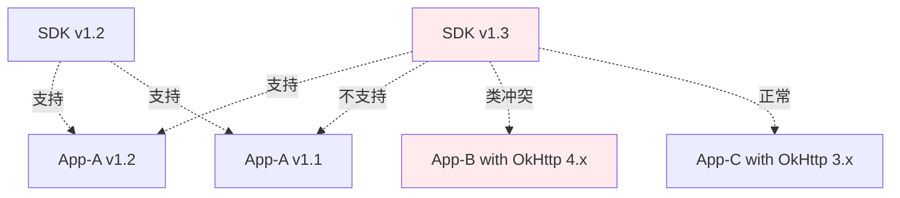
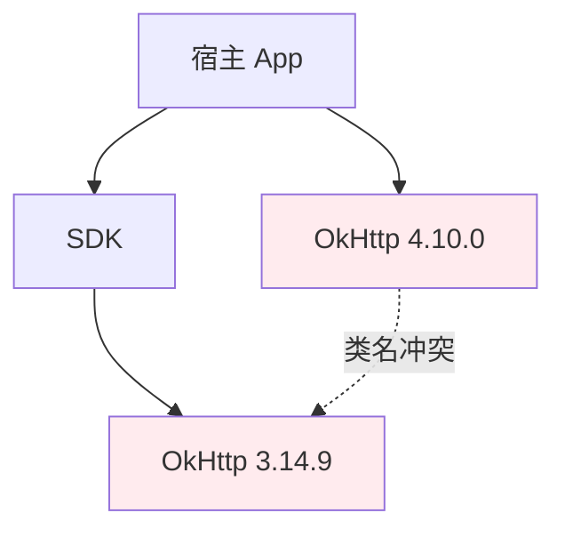
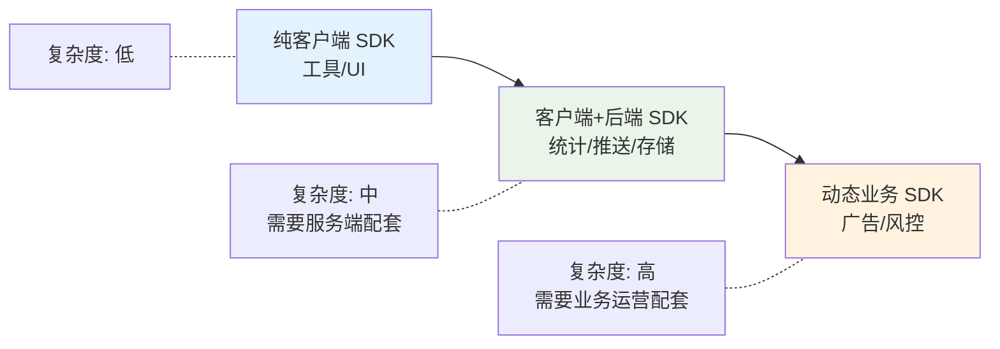
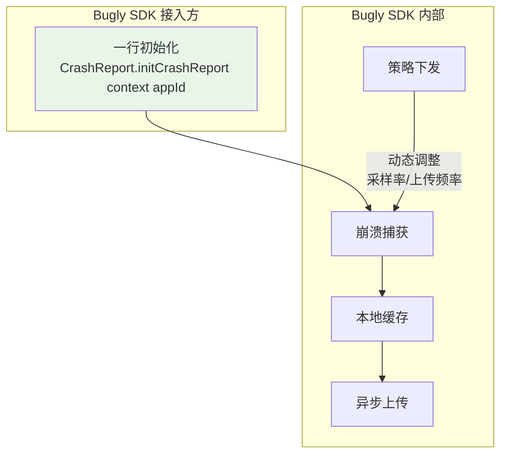
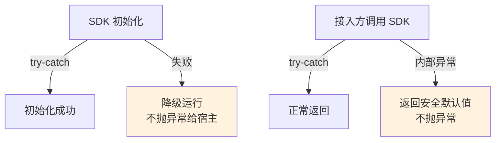
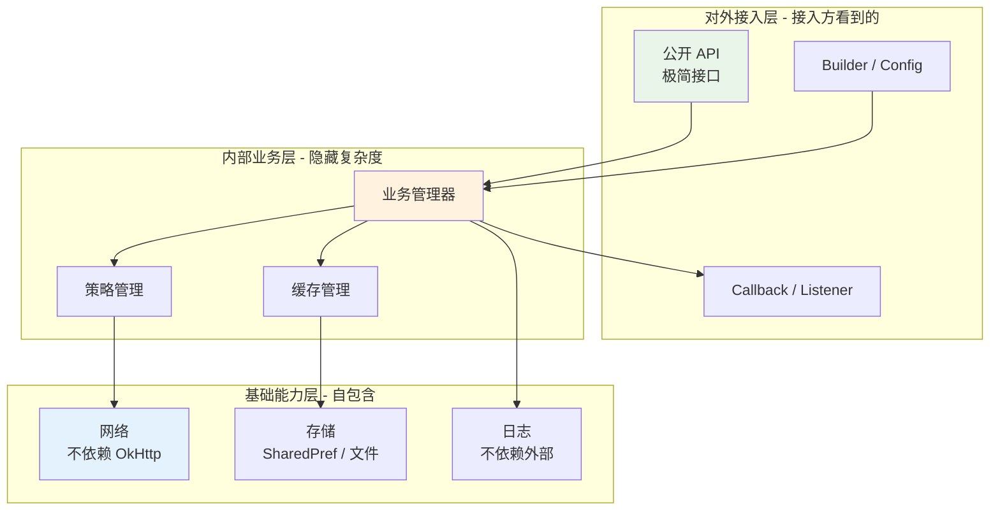
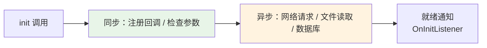
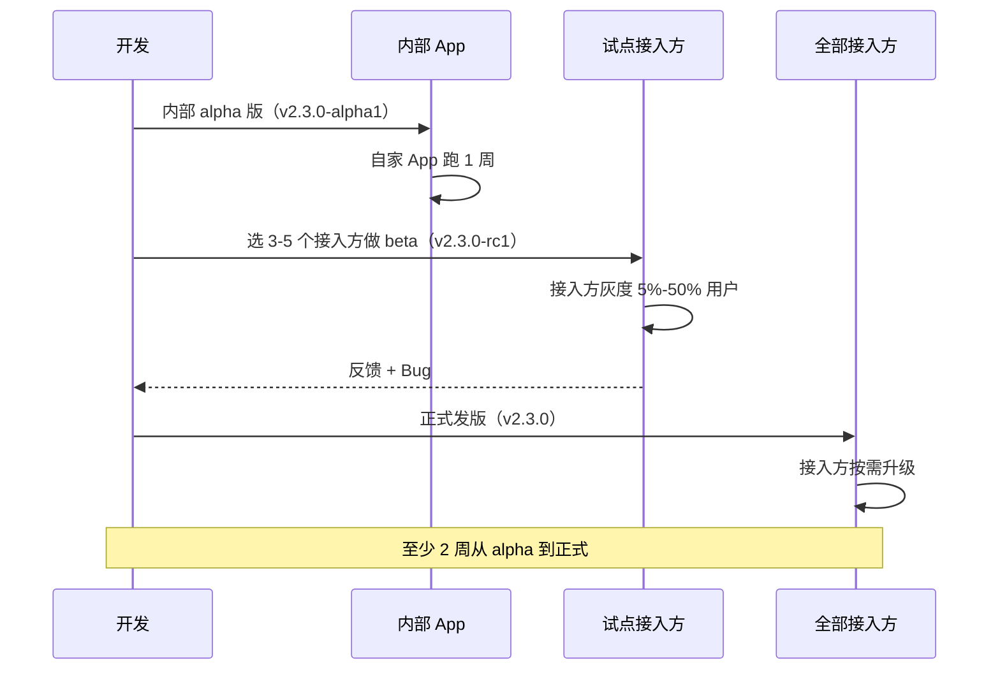
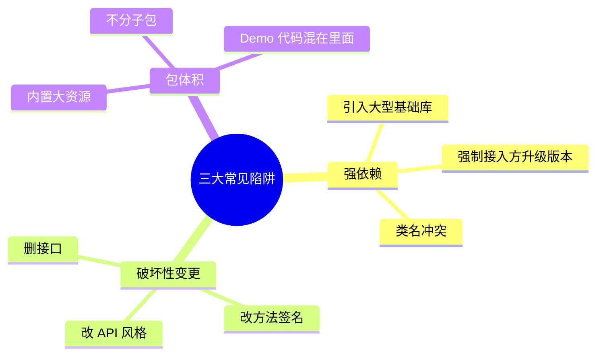
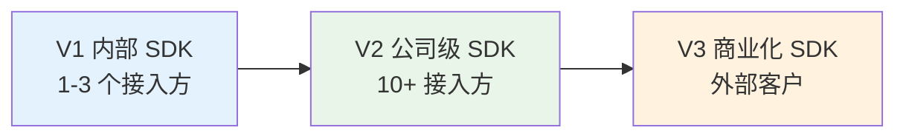

# 04.SDK设计与发布方案

> **本篇定位**：SDK 是"我把能力打包给别人用"的形态。和组件化（02 篇）针对自己 App 内部不同——SDK 面对的是**未知的接入方、未知的版本、未知的运行环境**。本文回答三个核心问题——**SDK 设计和普通组件有什么本质区别？怎么让接入方半小时跑通？怎么管 50 个外部接入方的版本兼容？**

#### 目录介绍
- [01.一个 SDK 的崩溃](#01一个-sdk-的崩溃)
  - [1.1 接入方的吐槽](#11-接入方的吐槽)
  - [1.2 兼容性的地狱](#12-兼容性的地狱)
  - [1.3 反思 SDK 设计](#13-反思-sdk-设计)
- [02.要解决的核心矛盾](#02要解决的核心矛盾)
  - [2.1 接入成本矛盾](#21-接入成本矛盾)
  - [2.2 版本兼容矛盾](#22-版本兼容矛盾)
  - [2.3 隔离与依赖矛盾](#23-隔离与依赖矛盾)
  - [2.4 SDK 的本质](#24-sdk-的本质)
- [03.业界主流方案](#03业界主流方案)
  - [3.1 三类 SDK 形态](#31-三类-sdk-形态)
  - [3.2 横向对比矩阵](#32-横向对比矩阵)
  - [3.3 典型案例分析](#33-典型案例分析)
- [04.SDK 设计原则](#04sdk-设计原则)
  - [4.1 最小依赖原则](#41-最小依赖原则)
  - [4.2 接口稳定原则](#42-接口稳定原则)
  - [4.3 失败兜底原则](#43-失败兜底原则)
  - [4.4 可观测原则](#44-可观测原则)
- [05.SDK 落地架构](#05sdk-落地架构)
  - [5.1 整体分层结构](#51-整体分层结构)
  - [5.2 接入入口设计](#52-接入入口设计)
  - [5.3 配置初始化设计](#53-配置初始化设计)
  - [5.4 异步与回调设计](#54-异步与回调设计)
- [06.版本与发布管理](#06版本与发布管理)
  - [6.1 语义化版本号](#61-语义化版本号)
  - [6.2 兼容性矩阵](#62-兼容性矩阵)
  - [6.3 灰度发布流程](#63-灰度发布流程)
  - [6.4 废弃迁移策略](#64-废弃迁移策略)
- [07.常见陷阱与反例](#07常见陷阱与反例)
  - [7.1 强依赖反例](#71-强依赖反例)
  - [7.2 破坏性变更反例](#72-破坏性变更反例)
  - [7.3 包体积反例](#73-包体积反例)
- [08.演进路线](#08演进路线)
  - [8.1 V1 内部 SDK](#81-v1-内部-sdk)
  - [8.2 V2 公司级 SDK](#82-v2-公司级-sdk)
  - [8.3 V3 商业化 SDK](#83-v3-商业化-sdk)
- [09.总结与决策](#09总结与决策)
  - [9.1 SDK 设计检查表](#91-sdk-设计检查表)
  - [9.2 接入体验评分](#92-接入体验评分)


## 01.一个 SDK 的崩溃

### 1.1 接入方的吐槽

某基础架构团队提供了一个"统一登录 SDK"，给公司内 30+ App 接入。3 个月后收到的吐槽如下：

| 接入方 | 吐槽 |
|---|---|
| App-A | "接入文档 200 页，照着配置 4 小时还启动不起来" |
| App-B | "你们 SDK 依赖 OkHttp 3.x，我们用 4.x，类冲突" |
| App-C | "升级 1.2 到 1.3，接口变了 3 个，我改了一周" |
| App-D | "线上崩溃了，定位发现是 SDK 里某个空指针，等了 5 天才出修复版本" |
| App-E | "SDK 包体积 8MB，我们整个 App 才 30MB" |

### 1.2 兼容性的地狱

最致命的问题是**版本兼容性矩阵失控**：



每发一个 SDK 版本就要测试 30 个 App 的接入情况，**测试矩阵爆炸**。

### 1.3 反思 SDK 设计

复盘之后这个团队总结：**SDK 不是普通组件，它是"对外契约"**。一个内部组件出问题改一下就行，但 SDK 出问题：

- 已经有 30 个 App 在生产环境用旧版本
- 接入方升级你的版本要排 1-2 个月的开发计划
- 任何破坏性变更都意味着"接入方诅咒你"

这就引出了 SDK 设计的核心矛盾。

## 02.要解决的核心矛盾

### 2.1 接入成本矛盾

接入方希望"5 分钟跑通"，SDK 提供方希望"功能尽量丰富"。两者天然矛盾。

**好的 SDK**：
- 三行代码完成最小可用接入（Quick Start）
- 详细配置都有合理默认值
- 文档分层（5 分钟入门 / 完整 API / 进阶）

**坏的 SDK**：
- 接入要改 AndroidManifest、build.gradle、proguard、初始化、回调注册 5 个地方
- 没有合理默认值，每个参数都必须配
- 文档全在一个 200 页的 PDF 里

### 2.2 版本兼容矛盾

接入方希望"升级版本不用改代码"，SDK 提供方希望"自由迭代不背包袱"。

**关键约束**：**主版本号（Major）相同时，必须保证向后兼容**。否则就是失信于接入方。

### 2.3 隔离与依赖矛盾

SDK 需要的库（如 OkHttp、Gson）和接入方使用的版本冲突时怎么办？



三种解决思路：

| 方案 | 思路 | 代价 |
|---|---|---|
| **跟随接入方** | SDK 不带依赖，由接入方提供 | 接入方麻烦 |
| **shading（重打包）** | 把 OkHttp 重命名后塞进 SDK | 包体积+维护成本 |
| **完全自包含** | 不用主流库，自己实现 | 工作量大 |

商业化大型 SDK（如友盟、Bugly）多用 shading 方案。

### 2.4 SDK 的本质

> **SDK = 一份你必须 3 年内都不能违反的对外契约**

它的所有设计原则都源于这个本质——**接入方一旦用上你，他就被你绑定了，你必须对得起这份信任**。

## 03.业界主流方案

### 3.1 三类 SDK 形态

**形态一：纯客户端 SDK**
所有逻辑在 App 内执行，不依赖外部服务。代表：日志库（Timber）、UI 库（Lottie）、工具库（Gson）。

**形态二：客户端 + 后端服务 SDK**
SDK 是接入方和某个云服务之间的桥梁。代表：友盟统计、Bugly 崩溃、极光推送、阿里云 OSS SDK。

**形态三：动态业务 SDK**
SDK 不仅是工具，还会随业务运营动态调整（如下发广告策略、风控规则）。代表：TopOn、穿山甲广告 SDK、风控 SDK。



### 3.2 横向对比矩阵

| 维度 | 纯客户端 | 客户端+后端 | 动态业务 |
|---|---|---|---|
| **是否需要后端** | ❌ | ✅ | ✅ |
| **是否需要鉴权** | ❌ | ✅（AppKey） | ✅（AppKey + Token） |
| **是否能动态更新** | ❌（要发新版） | ⚠️（可下发配置） | ✅（动态规则） |
| **网络故障容忍** | 不需要 | 需要兜底 | 严格要求 |
| **接入复杂度** | 低 | 中 | 高 |
| **代表案例** | Timber / Lottie | Bugly / 友盟 | 穿山甲 / TopOn |

### 3.3 典型案例分析

以 **Bugly 崩溃 SDK** 为例分析其设计精髓：



它的成功秘诀：

1. **极简接入**：1 行代码搞定（隐藏所有复杂度）
2. **完全异步**：捕获崩溃 → 写本地 → 下次启动再上传，不阻塞主线程
3. **失败兜底**：网络挂了不会卡死 SDK，下次启动自动重试
4. **服务端策略**：可以动态调采样率、关功能（避免 SDK 自己出 Bug 时全员崩溃）
5. **零依赖**：不依赖任何第三方库，避免冲突

## 04.SDK 设计原则

### 4.1 最小依赖原则

**原则**：SDK 引入的每一个依赖，都是接入方的负担。

| 依赖类型 | 决策 |
|---|---|
| Android 系统 API | 可以用 |
| Kotlin 标准库 | 可以用 |
| 主流库（OkHttp、Gson） | 谨慎，建议自己实现关键能力 |
| 小众库 | 绝对不用 |
| 自研内部库 | 严禁（接入方根本不知道这些库存在） |

**反例**：某 SDK 引入了 5 个内部基础库，接入方拉下来发现 `com.xxx.internal:base-utils:1.2` 冲突，根本无法解决。

### 4.2 接口稳定原则

**原则**：公开接口一旦发布，**主版本号不变就不能破坏**。

```kotlin
// ❌ 破坏性变更
- fun login(username: String, password: String): User
+ fun login(username: String, password: String, captcha: String): User

// ✅ 兼容性变更
+ fun login(username: String, password: String): User { 
    return login(username, password, captcha = null)  
}
+ fun login(username: String, password: String, captcha: String?): User
```

**关键技巧**：用 **Builder 模式** 让参数可扩展：

```kotlin
LoginRequest.Builder(username, password)
    .captcha(captcha)         // 1.3 新增
    .biometric(biometricKey)  // 1.5 新增
    .build()
```

未来加新参数都不破坏老接入方。

### 4.3 失败兜底原则

**原则**：SDK 出任何问题都不能拖死宿主 App。



**反例**：某 SDK 初始化时 NPE，整个宿主 App 崩在启动屏。
**正例**：Bugly SDK 哪怕完全初始化失败，也只是本次不上报崩溃，绝不影响宿主。

### 4.4 可观测原则

**原则**：SDK 的运行状态必须可观测。

| 观测维度 | 工具 |
|---|---|
| 接入是否成功 | 启动日志 + 服务端心跳 |
| 调用是否生效 | API 调用统计 |
| 是否有异常 | 内部异常上报到 SDK 提供方 |
| 性能开销 | 启动耗时 / 内存 / 流量 |

**接入方的真实诉求**：我用了你的 SDK，**我得知道它现在到底在不在工作**。一个 SDK 的可观测能力，决定了接入方有没有信心持续依赖它。

## 05.SDK 落地架构

### 5.1 整体分层结构



**三层架构的好处**：
- **对外层**：接口极简，对接入方完全黑盒
- **业务层**：隔离对外接口的稳定性和内部实现的灵活性
- **基础层**：自包含能力，避免外部依赖

### 5.2 接入入口设计

最优秀的 SDK 接入只有一行：

```kotlin
// 最小可用接入
LoginSDK.init(context, appKey)

// 配置完整版
LoginSDK.init(context, LoginSDKConfig.Builder(appKey)
    .setLogLevel(LogLevel.DEBUG)
    .setNetworkTimeout(15_000)
    .build())
```

**关键技巧**：

| 技巧 | 说明 |
|---|---|
| 必填参数放 init 第一参数 | 必须显式传，不能漏 |
| 可选参数全走 Builder | 未来扩展不破坏 |
| 提供合理默认值 | 80% 接入方不需要改 |
| Context 用 ApplicationContext | 防止内存泄漏 |

### 5.3 配置初始化设计

SDK 初始化常踩的坑：**主线程做太多事**。



**正确做法**：
- init 同步部分 < 50ms（只做参数检查 + 注册）
- 重活全部异步（拉策略、初始化数据库、上报启动）
- 提供 `OnInitListener` 让需要等就绪的接入方可以监听

### 5.4 异步与回调设计

SDK 对外提供异步接口时，提供"双形态"是最佳实践：

```kotlin
// 形态 1: 回调（兼容 Java 接入方）
LoginSDK.login(username, password, object : LoginCallback {
    override fun onSuccess(user: User) { ... }
    override fun onError(code: Int, msg: String) { ... }
})

// 形态 2: 协程 / Promise（Kotlin / RN 友好）
suspend fun login(username: String, password: String): Result<User>
```

让 Java 老项目和 Kotlin 新项目都用得舒服。

## 06.版本与发布管理

### 6.1 语义化版本号

> **必须遵循 Semantic Versioning：MAJOR.MINOR.PATCH**

| 版本号 | 何时增加 | 示例 |
|---|---|---|
| **MAJOR** | 不兼容的破坏性改动 | 1.x → 2.0 |
| **MINOR** | 兼容的新功能 | 1.2.0 → 1.3.0 |
| **PATCH** | 兼容的 Bug 修复 | 1.2.0 → 1.2.1 |

**铁律**：**MAJOR 不变，接入方升级永远只是"扔旧依赖换新依赖"，不需要改一行代码**。

### 6.2 兼容性矩阵

发布前必须明确"这个版本支持什么"：

| SDK 版本 | 最低 Android | 最低 Kotlin | OkHttp 版本 | 已知不兼容 |
|---|---|---|---|---|
| 2.3.x | API 21 | 1.7+ | 4.x | App-X v1.0 用了 OkHttp 3.x |
| 2.2.x | API 19 | 1.5+ | 3.x or 4.x | - |

把这张表写进 release notes 是 SDK 提供方的基本素养。

### 6.3 灰度发布流程



### 6.4 废弃迁移策略

旧接口要废弃，**给接入方至少 2 个 MINOR 版本的过渡期**：

```kotlin
// v2.3 标记废弃，旧方法仍可用
@Deprecated(
    message = "Use loginV2() with captcha support",
    replaceWith = ReplaceWith("loginV2(username, password, null)")
)
fun login(username: String, password: String): User { ... }

// v2.5 才真正移除
```

**反例**：某 SDK v1.5 直接删除 `login()` 方法，导致 20+ 接入方编译挂掉。这就是失信于接入方。

## 07.常见陷阱与反例

### 7.1 强依赖反例

**反例**：某 SDK 强制依赖一个内部 BaseLib（10MB+），接入方被迫引入完整基础库。

**教训**：SDK 必须"瘦"。如果真的需要某些通用能力，**自己实现一份精简版**（哪怕代码重复）。包体积膨胀 5MB 比和接入方版本冲突好得多。

### 7.2 破坏性变更反例

**反例**：某统计 SDK 在 v3.0 把所有 API 加了 `suspend` 关键字，老 Java 项目全部编译失败。

**教训**：**API 风格的改变也是破坏性变更**。要么发新包名（com.xxx.sdk-coroutines），要么 v2.x 和 v3.x 长期并存。

### 7.3 包体积反例

**反例**：某图像处理 SDK 内置了 10MB 的模型文件，接入方包体积直接涨到 50MB。

**正确做法**：
- SDK 本体只有"加载器" + 接口（< 500KB）
- 模型 / 资源走"动态下发"（首次使用时下载）
- 提供"按需引入"（如分图像 / 视频 / 音频三个子包）



## 08.演进路线

### 8.1 V1 内部 SDK

**特征**：服务公司内 1-3 个 App，接入方就是隔壁工位。

**做法**：
- 直接用内部依赖
- 没有严格的版本号管理
- 文档简单

**适用阶段**：刚孵化的能力

### 8.2 V2 公司级 SDK

**特征**：服务公司内 10+ App，跨多个 BU。

**做法**：
- 严格语义化版本
- shading 关键依赖
- 有专门的 SDK 团队
- 完善的接入文档 + Demo

**适用阶段**：能力已被公司广泛认可

### 8.3 V3 商业化 SDK

**特征**：对外卖给其他公司用（如友盟、Bugly、阿里云 SDK）。

**做法**：
- 多语言文档
- 多平台支持（Android / iOS / Web / 小程序）
- AppKey 鉴权 + 用量统计
- 完善的客户成功体系

**适用阶段**：商业化产品



## 09.总结与决策

### 9.1 SDK 设计检查表

发版前对照这张清单逐项确认：

- [ ] 接入文档第一屏能让人 5 分钟跑通
- [ ] 公开 API 都有 KDoc / Javadoc
- [ ] 没有引入任何接入方未知的内部依赖
- [ ] 主线程初始化耗时 < 50ms
- [ ] 任何内部异常都有 try-catch 兜底
- [ ] 提供 init 失败回调
- [ ] 同时支持 Java 回调和 Kotlin 协程
- [ ] 版本号符合 SemVer
- [ ] 废弃接口至少保留 2 个 MINOR 版本
- [ ] 已在内部 App 灰度跑过 1 周以上
- [ ] release notes 列出了已知问题和兼容性矩阵
- [ ] 包体积 / 启动耗时 / 内存有性能基线

### 9.2 接入体验评分

教你一招衡量 SDK 好不好——**找一个完全没接触过你们 SDK 的开发，给他文档让他独立接入，记录时间**：

| 接入耗时 | 评级 | 说明 |
|---|---|---|
| < 30 分钟 | ⭐⭐⭐⭐⭐ 极佳 | 文档清晰、接口简单 |
| 30 分钟 - 2 小时 | ⭐⭐⭐⭐ 良好 | 大多数场景的合理标准 |
| 2-8 小时 | ⭐⭐⭐ 一般 | 文档或接口需要优化 |
| 8 小时 - 1 天 | ⭐⭐ 不及格 | 严重影响接入意愿 |
| > 1 天 | ⭐ 极差 | 接入方会直接放弃 |

**最后一句话**：SDK 不是把代码丢出去就完事了。**它是你和接入方之间一份会持续 3-5 年的契约**——好的 SDK 让接入方爱不释手，坏的 SDK 让接入方做噩梦。

> 好的 SDK = **像水一样：默默工作，不出声音；缺了它你才知道它在**。
