# 04.缓存架构设计思想

> **本篇定位**：缓存是性能优化中**性价比最高的一招**——但同时也是**故障概率最高的环节**。本文从一场因 TTL 忘加随机数而损失 1.2 亿的双 11 事故讲起，从局部性原理、LRU 数据结构证明、W-TinyLFU 命中率论证、三大经典问题的数学模型出发，把缓存还原成一门**在性能、一致性、可靠性之间做联合最优化**的工程学。读完这一篇，就能在方案评审里回答"这个缓存为什么这样设计、命中率上限是多少、故障时会怎么放大、有哪些坑必须避开"。

#### 目录介绍
- [1. 案例引入](#1-案例引入)
  - [1.1 一场零点的雪崩](#11-一场零点的雪崩)
  - [1.2 顺藤摸到根因](#12-顺藤摸到根因)
  - [1.3 我们要回答什么](#13-我们要回答什么)
- [2. 架构概览](#2-架构概览)
  - [2.1 缓存决策三角](#21-缓存决策三角)
  - [2.2 为什么这么切](#22-为什么这么切)
- [3. 局部性原理](#3-局部性原理)
  - [3.1 时间与空间局部性](#31-时间与空间局部性)
  - [3.2 帕累托二八法则](#32-帕累托二八法则)
  - [3.3 命中率的数学表达](#33-命中率的数学表达)
  - [3.4 分层延迟数量级](#34-分层延迟数量级)
- [4. 淘汰算法演进](#4-淘汰算法演进)
  - [4.1 FIFO 的原始简单](#41-fifo-的原始简单)
  - [4.2 LRU 数据结构证明](#42-lru-数据结构证明)
  - [4.3 LFU 的历史包袱](#43-lfu-的历史包袱)
  - [4.4 W-TinyLFU](#44-w-tinylfu)
- [5. 三层缓存架构](#5-三层缓存架构)
  - [5.1 L0-L4分层](#51-l0-l4分层)
  - [5.2 多级缓存数据流](#52-多级缓存数据流)
  - [5.3 本地+Redis](#53-本地redis)
  - [5.4 命中率联合估算](#54-命中率联合估算)
- [6. 一致性方案对比](#6-一致性方案对比)
  - [6.1 缓存旁路(CA)](#61-缓存旁路ca)
  - [6.2 直写穿透强一致](#62-直写穿透强一致)
  - [6.3 异步写回高吞吐](#63-异步写回高吞吐)
  - [6.4 先写DB后删](#64-先写db后删)
- [7. 三大经典问题](#7-三大经典问题)
  - [7.1 缓存穿透原理](#71-缓存穿透原理)
  - [7.2 缓存击穿原理](#72-缓存击穿原理)
  - [7.3 缓存雪崩原理](#73-缓存雪崩原理)
  - [7.4 布隆过滤器解剖](#74-布隆过滤器解剖)
- [8. 常见反例陷阱](#8-常见反例陷阱)
  - [8.1 大 Key 反例](#81-大-key-反例)
  - [8.2 热 Key 反例](#82-热-key-反例)
  - [8.3 一致性反例](#83-一致性反例)
  - [8.4 缓存挂了业务崩](#84-缓存挂了业务崩)
- [9. K-V存储引擎设计](#9-k-v存储引擎设计)
  - [9.1 内存与磁盘的天堑](#91-内存与磁盘的天堑)
  - [9.2 三层模型与状态机](#92-三层模型与状态机)
  - [9.3 性能-安全-一致三角](#93-性能-安全-一致三角)
  - [9.4 六大机制族原理拆解](#94-六大机制族原理拆解)
  - [9.5 IO演进史四代跃迁](#95-io演进史四代跃迁)
  - [9.6 可用性与安全模型](#96-可用性与安全模型)
  - [9.7 选型决策与自检](#97-选型决策与自检)
- [10. 演进与治理](#10-演进与治理)
  - [10.1 V1 单机本地缓存](#101-v1-单机本地缓存)
  - [10.2 V2 分布式缓存](#102-v2-分布式缓存)
  - [10.3 V3 多级缓存体系](#103-v3-多级缓存体系)
  - [10.4 上线自检清单](#104-上线自检清单)
- [11. 综合案例串讲](#11-综合案例串讲)
  - [11.1 案例真相揭晓](#111-案例真相揭晓)
  - [11.2 一次查询的一生](#112-一次查询的一生)
  - [11.3 设计哲学回扣](#113-设计哲学回扣)
  - [11.4 缓存速查表](#114-缓存速查表)


## 1. 案例引入

### 1.1 一场零点的雪崩

某头部电商在 2019 年双 11 零点发生过一次真实的雪崩事故。**0:00:00 整**，零点活动开始，所有用户涌入抢购。监控看板画面：

```
时间          现象
─────────────────────────────────────────────
0:00:00      大促开始，QPS 从日常 5w 涨到 80w
0:00:03      🚨 Redis 命中率断崖式下跌：98% → 12%
0:00:08      🚨 DB CPU 从 30% 飙到 100%
0:00:15      🚨 主库主从切换，全站不可用
0:01:30      应急扩容 + 限流，逐步恢复
0:08:00      恢复正常，但峰值已过
─────────────────────────────────────────────
直接经济损失：预估 1.2 亿
用户信任损失：无法估量
```

**核心疑问**：Redis 命中率为什么 3 秒内从 98% 跌到 12%？

活动前运营手动做了缓存预热，把所有热点商品数据写入 Redis，代码大概是：

```java
// preload.java —— 大促前的预热脚本
public void preloadCoupons() {
    for (Coupon c : allActivityCoupons) {
        String key = "coupon:" + c.id;
        // 24 小时过期（活动持续 24 小时）
        redis.setex(key, 86400, JSON.toJSONString(c));  // ⚠️ 就这一行
    }
    log.info("预热完成，共 {} 条", allActivityCoupons.size());
}
```

**代码看起来毫无问题**——24 小时 TTL 覆盖整个活动周期。但为什么会崩？

### 1.2 顺藤摸到根因

抓 Redis 慢查询日志和 keyspace notification 事件，发现 **0:00:00 前后大量 Key 集中过期**。回溯预热脚本执行时间——**预热是在 24 小时前的 0:00:00 跑的**，所有 Key TTL 都是精确的 86400 秒，**在下一个 0:00:00 会同时过期到期**。

```
0:00:00 (T-24h) 预热: 100 万条 key，全部 TTL = 86400
                    ↓ 24 小时后
0:00:00 (T=0)   全部同时过期，Redis 里瞬间空了 100 万条
0:00:01         80w QPS 打进来，命中率 12% ← 少数 miss 的 Key 补上了
0:00:03         DB 被打穿，CPU 100%
0:00:15         DB 主备切换
0:08:00         恢复
```

**真正的根因不是流量大，而是缓存过期时间设置成"整点 24 小时"**——所有 Key 同时过期，瞬间打穿 Redis 直击数据库。**改一行代码就能避免的 1.2 亿损失**：

```java
// ✅ 修复
long ttl = 86400 + ThreadLocalRandom.current().nextInt(3600);  // + 0-1 小时随机
redis.setex(key, ttl, JSON.toJSONString(c));
```

### 1.3 我们要回答什么

带着这场 1.2 亿的痛，本文要回答 7 个问题：

- **Q1**：为什么"20% 的 Key 承担 80% 的访问"是缓存生效的物理基础？可以数学证明吗？
- **Q2**：LRU 为什么必须用 HashMap + 双向链表？只用一种数据结构不行吗？
- **Q3**：W-TinyLFU 凭什么命中率比 LRU 高 15-25%？Count-Min Sketch 怎么工作？
- **Q4**：多级缓存的命中率怎么算？L2 + L3 双层能达到 99.5% 吗？
- **Q5**：缓存穿透、击穿、雪崩到底怎么区分？各自的数学模型是什么？
- **Q6**：布隆过滤器怎么用 1KB 空间过滤 100 万个不存在 Key？
- **Q7**：Cache-Aside 里"先写 DB 再删缓存"为什么是最优解？

后续 8 章会依次回答，第 10 章统一回扣。

## 2. 架构概览

### 2.1 缓存决策三角

缓存设计的三个核心维度：

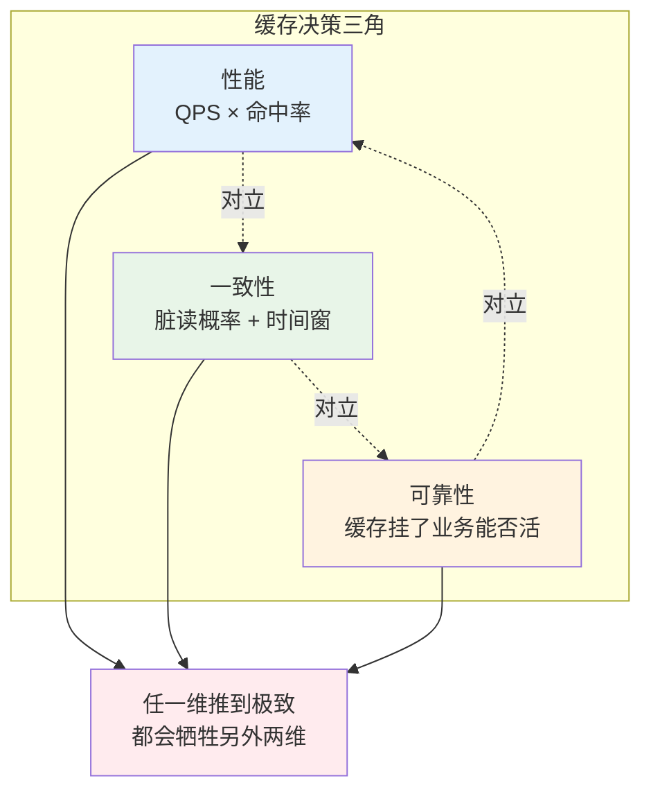

**三维含义**：

| 维度 | 指标 | §1 团队现状 |
|---|---|---|
| **性能** | 命中率 × QPS 承载 | 平时 98% × 5w = 优秀 |
| **一致性** | 允许的脏读时间窗 | 商品数据允许秒级不一致 |
| **可靠性** | 缓存挂了业务的降级能力 | ❌ 没有降级 → 雪崩 |

**三维互斥**：
- 想要**极致性能** → 长 TTL + 大容量 → 一致性变差（旧数据保留久）。
- 想要**强一致性** → 写 DB 同步删缓存 → 每次写都要保证成功 → 可靠性下降（写失败怎么办？）。
- 想要**极致可靠** → 多级冗余 + 降级 → 一致性变差（多副本同步问题）。

### 2.2 为什么这么切

**疑惑**：为什么用性能/一致性/可靠性，不用"容量、成本"这些指标？

**论证**：
1. **容量**是"性能维度的下位变量"——容量决定了缓存能装多少热点，但缓存价值最终体现在命中率×QPS。
2. **成本**是每个维度都要考虑的横切关注点，不是独立维度。
3. **性能、一致性、可靠性**是缓存的三大功能承诺——**任何缓存架构都可以按这三维度打分**。

**结论**：**缓存 = 用空间换时间 + 用最终一致性换性能**。核心矛盾就在这三维上打转。**§1 那个团队重性能（长 TTL 高命中）但轻可靠性（无降级），最终付出 1.2 亿代价**。

## 3. 局部性原理

### 3.1 时间与空间局部性

**疑惑**：为什么缓存能有效？如果访问是"完全随机"的，缓存有意义吗？

**论证**：真实世界的访问从来不是随机的，服从两类局部性：

- **时间局部性**：**刚访问过的数据近期会再次被访问**。
  - 用户看了商品 A，10 秒内很可能再看一次 A。
  - 这是 LRU 算法的物理基础。

- **空间局部性**：**相邻数据会被一起访问**。
  - 用户看了商品 A，很可能接着看商品 A 的相关推荐 B、C。
  - 这是 CPU L1 cache 的核心，也是预取策略的依据。

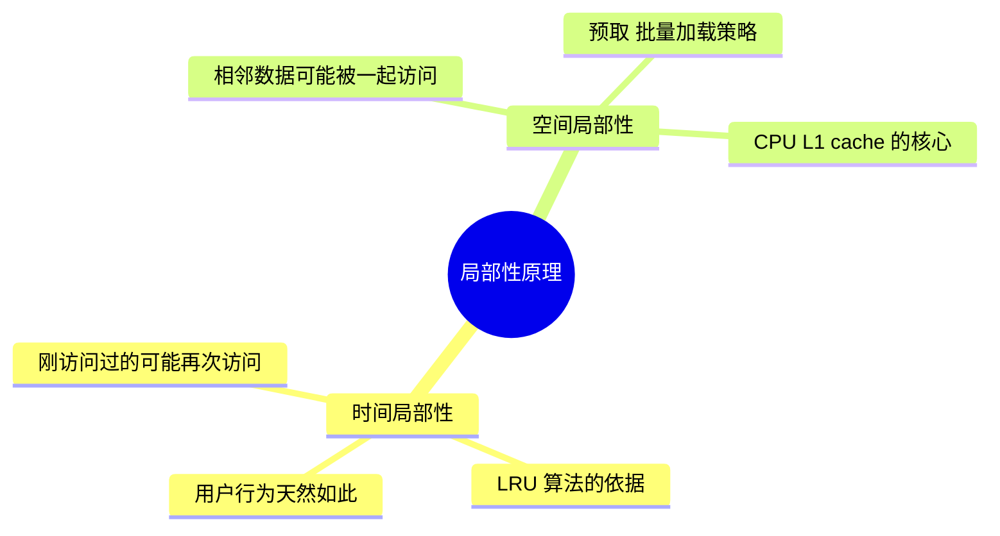

**结论**：**局部性是所有缓存的物理基础**。如果访问真的完全随机，命中率就等于容量占比，缓存的价值只是"更快的存储介质"。

### 3.2 帕累托二八法则

局部性在实际系统里体现为**帕累托法则**：**20% 的 Key 承担 80% 的访问**。

**疑惑**：这是经验值还是有数学根源？

**论证**：Zipf 分布——大量真实数据（网页访问、单词频率、商品热度）都服从：

$$
f(k) \propto \frac{1}{k^s}
$$

- $k$：热度排名（第 k 热的 Key）
- $s$：分布参数（通常 $s \in [0.8, 1.2]$）

对 Zipf 分布做积分：**前 20% 的 Key 累计访问量占总访问的 70%-90%**（$s=1$ 时正好 80%）。这就是帕累托 80/20 的数学根源。

**实战应用**：**缓存容量不需要装下全部数据，能装 20% 热点就有 80% 命中率**。这就是"缓存的性价比"——**用 20% 的存储换 80% 的性能**。

### 3.3 命中率的数学表达

设缓存容量为 $C$（能装 $C$ 个 Key），总 Key 数为 $N$，请求分布服从参数 $s$ 的 Zipf。**命中率**：

$$
H(C) = \sum_{k=1}^{C} \frac{1/k^s}{\sum_{i=1}^{N} 1/i^s}
$$

数值分析（$N = 1000$）：

| 容量占比 $C/N$ | s=0.8 命中率 | s=1.0 命中率 | s=1.2 命中率 |
|---|---|---|---|
| 5% | 43% | 62% | 78% |
| 10% | 53% | 71% | 84% |
| 20% | 65% | 80% | 90% |
| 50% | 82% | 92% | 97% |
| 100% | 100% | 100% | 100% |

**关键结论**：
1. **热度越集中（s 越大），少量缓存就能吃到高命中**。
2. **命中率 20% → 80% 需要容量占比 5% → 20%**（4 倍容量）。
3. **命中率 80% → 95% 需要容量占比 20% → 50%**（2.5 倍容量）。
4. **命中率 95% → 99% 需要容量占比 50% → 90%**（1.8 倍容量）——**边际收益递减**。

**指导设计**：**追求 90% 命中足矣，追 99% 是钱包黑洞**。除非业务特殊（如秒级金融），95% 是性价比甜蜜点。

### 3.4 分层延迟数量级

不同存储介质延迟对比：

| 层级 | 物理位置 | 典型延迟 | 容量 | 每 GB 成本 |
|---|---|---|---|---|
| CPU L1 | 芯片内 | 1 ns | 32-64 KB | 天价 |
| CPU L2/L3 | 芯片内 | 10 ns | 数 MB | 极贵 |
| 内存 DRAM | 主板 | 100 ns | GB-TB | 贵 |
| 本地缓存（Caffeine） | 进程内存 | 200 ns | GB | 贵 |
| 分布式缓存（Redis） | 独立集群 | 100 μs (1e5 ns) | TB | 中 |
| SSD | 本机磁盘 | 100 μs | TB | 便宜 |
| HDD | 本机磁盘 | 10 ms (1e7 ns) | TB-PB | 极便宜 |
| 网络 DB | 独立服务 | 10 ms | PB | 极便宜 |

**关键洞察**：**每两层间延迟差约 1-3 个数量级**。这就是分层的根本依据——**每一层都比下一层快 10-1000 倍**。

**推论**：缓存的意义 = 用高层的少量容量，吃到 80%+ 的请求，只把 20% 少量请求打到下层。**平均延迟 = H × T_hit + (1-H) × T_miss**。

**§1 团队正常情况**：$0.98 \times 1\text{ms} + 0.02 \times 50\text{ms} = 1.98\text{ms}$
**§1 团队雪崩情况**：$0.12 \times 1\text{ms} + 0.88 \times 50\text{ms} = 44.12\text{ms}$（22 倍延迟放大）

## 4. 淘汰算法演进

### 4.1 FIFO 的原始简单

**FIFO（First In First Out）**：先进先出，最老的被淘汰。

**问题**：**违反时间局部性**——一个刚被访问的 Key，如果它是最早进入缓存的，会被淘汰。

**数学证明它次优**：考虑访问序列 `[A, B, C, D, A, A, A, A]`，容量 2：

```
访问 A:  [A]         miss
访问 B:  [A, B]      miss
访问 C:  [B, C]      miss  ← A 被 FIFO 淘汰
访问 D:  [C, D]      miss
访问 A:  [D, A]      miss  ← A 又要 miss
访问 A:  [D, A]      hit
访问 A:  [D, A]      hit
访问 A:  [D, A]      hit
命中率: 3/8 = 37.5%
```

**LRU 表现**：命中率 62.5%（下节详细看）。**FIFO 只有在访问模式接近 FIFO 时才优——现实中很少**。

### 4.2 LRU 数据结构证明

**LRU（Least Recently Used）**：淘汰最久未使用的。

**核心问题**：**如何 O(1) 找到某个 Key、O(1) 移动到"最近使用"、O(1) 淘汰"最久未使用"**？

**疑惑**：只用 HashMap 或只用链表行不行？

**论证**：

| 数据结构 | get O | put O | 淘汰 O | 说明 |
|---|---|---|---|---|
| 单纯 HashMap | O(1) | O(1) | **O(n)** | 找"最久未用"要遍历 |
| 单纯双向链表 | **O(n)** | O(1) | O(1) | 查 Key 要遍历 |
| **HashMap + 双向链表** | O(1) | O(1) | O(1) | 完美 |

**核心组合**：
- **HashMap**：Key → Node 快速定位（O(1)）
- **双向链表**：维护访问顺序，头部最新、尾部最旧，可 O(1) 移动/淘汰

```
HashMap:                    双向链表:
{                          
  "A" → Node(A),            head ↔ Node(A) ↔ Node(B) ↔ Node(C) ↔ tail
  "B" → Node(B),                  最新                    最旧
  "C" → Node(C),
}

get("B"):                   
  1. HashMap 找到 Node(B)          O(1)
  2. 从链表当前位置摘下            O(1)（双向链表可以）
  3. 移到 head 后                  O(1)
  
put("D"), 容量满:
  1. 找 tail 前一个节点 Node(C)    O(1)
  2. 从链表和 HashMap 删除 Node(C) O(1)
  3. 新 Node(D) 加到 head 后       O(1)
```

**代码实现**：

```java
class LRUCache<K, V> {
    private final int capacity;
    private final Map<K, Node<K, V>> map = new HashMap<>();
    private final Node<K, V> head = new Node<>(null, null);   // 哨兵
    private final Node<K, V> tail = new Node<>(null, null);   // 哨兵
    
    public LRUCache(int capacity) {
        this.capacity = capacity;
        head.next = tail;
        tail.prev = head;
    }
    
    public V get(K key) {
        Node<K, V> node = map.get(key);
        if (node == null) return null;
        moveToHead(node);  // O(1) 移到头部
        return node.value;
    }
    
    public void put(K key, V value) {
        Node<K, V> node = map.get(key);
        if (node == null) {
            if (map.size() >= capacity) {
                Node<K, V> old = tail.prev;
                removeNode(old);   // 淘汰尾部
                map.remove(old.key);
            }
            node = new Node<>(key, value);
            map.put(key, node);
            addToHead(node);
        } else {
            node.value = value;
            moveToHead(node);
        }
    }
    
    private void addToHead(Node<K, V> node) {
        node.prev = head; node.next = head.next;
        head.next.prev = node; head.next = node;
    }
    private void removeNode(Node<K, V> node) {
        node.prev.next = node.next; node.next.prev = node.prev;
    }
    private void moveToHead(Node<K, V> node) { removeNode(node); addToHead(node); }
    
    static class Node<K, V> { K key; V value; Node<K, V> prev, next; 
        Node(K k, V v) { key = k; value = v; } }
}
```

**结论**：**LRU = HashMap（快速定位）× 双向链表（快速移动/淘汰）的联合**。这是经典面试题的本质考察。

### 4.3 LFU 的历史包袱

**LRU 的缺陷**：**偶发扫描会污染缓存**。假设有个后台任务遍历了 100 万条商品数据，LRU 会认为它们全部是"最近使用"，把真正的热点 Key 挤出去。

**LFU（Least Frequently Used）**：淘汰访问次数最少的。能解决扫描污染——扫描 Key 的访问频次只有 1，会先被淘汰。

**LFU 的新问题**：**历史包袱**。一个早期的热点即使现在不再访问，累计频次也很高，很难被淘汰。

用一个数值例子：

```
时间 T=0～10:  Key "A" 被访问 1000 次（早期热点）
时间 T=10～20: Key "A" 停止访问，Key "B" 变热，被访问 200 次

LFU 状态:
  A 的计数: 1000
  B 的计数: 200
  → 淘汰 B（尽管 B 才是当下热点）
```

**结论**：LRU 和 LFU 各有软肋，需要**综合两者的优势**。

### 4.4 W-TinyLFU

**W-TinyLFU（Caffeine 采用）**：**LRU + LFU + 频率估计**的组合拳。

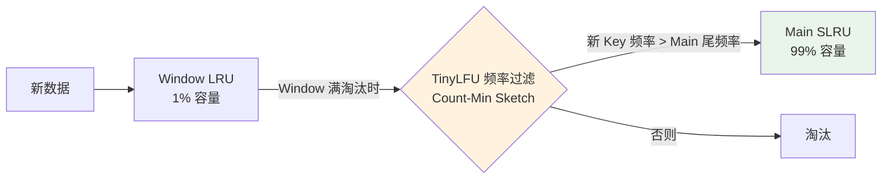

**核心机制**：
1. **Window LRU（1% 容量）**：新数据先进这里"候场"，避免刚进就被高频老数据 PK 掉。
2. **TinyLFU 频率过滤**：Window 淘汰时，估计新 Key 的历史频次，只有比 Main 区尾部频次高的才能进 Main。
3. **Main SLRU（99% 容量，分段 LRU）**：主缓存区，进一步分 Protected（20%）和 Probation（80%）。

**Count-Min Sketch —— TinyLFU 的核心**：

**疑惑**：怎么用极小空间估计海量 Key 的访问频次？

**论证**：Count-Min Sketch 用 $d$ 个哈希函数 + $w$ 列的二维计数矩阵：

```
       col_0  col_1  ...  col_{w-1}
row_0:  [ ]    [ ]  ...    [ ]
row_1:  [ ]    [ ]  ...    [ ]
...
row_{d-1}: [ ] [ ]  ...    [ ]
```

- **访问 Key K 时**：$d$ 个哈希函数把 K 映射到 $d$ 列，每个位置计数 +1。
- **查询 K 的频次时**：取 $d$ 个位置的**最小值**（Count-Min 的名字来源）。

**空间**：$d \times w$ 个 int，通常 $d=4, w=2^{16} = 65536$，总占用 **1MB 就能估计几亿个 Key 的频次**。

**误差保证**：设总访问数 N，$\varepsilon = e/w$，$\delta = e^{-d}$，则：

$$
P(\hat{f}(K) \leq f(K) + \varepsilon N) \geq 1 - \delta
$$

$d=4, w=65536, N=10^9$ 时，误差 $\varepsilon N \approx 40$——**几亿次访问里估计误差不超过 40，完全够用**。

**Aging 机制**：为了应对"历史包袱"，Count-Min Sketch 每积累到 $10 \times C$ 次访问就把所有计数 **除 2**（衰减）。这样早期热点会自然褪色。

**结论**：**W-TinyLFU = 空间效率（Count-Min Sketch）+ 时效性（Aging）+ 抗污染（Window + 频率准入）**。实测命中率比 LRU 高 15-25%——**这就是 Caffeine 性能远超 Guava Cache 的原因**。

## 5. 三层缓存架构

### 5.1 L0-L4分层

多级缓存架构：

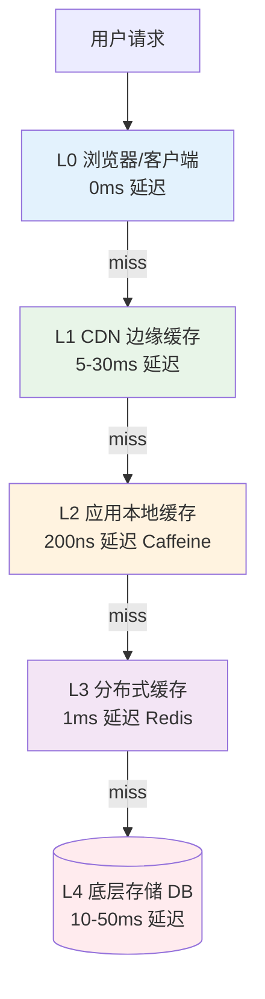

**每一层存在的物理边界依据**：

| 层级 | 物理位置 | 延迟 | 容量 | 每 GB 成本 | 代表 |
|---|---|---|---|---|---|
| L0 客户端 | 用户设备 | 0ms | MB 级 | 免费 | 浏览器 / App |
| L1 CDN | 边缘节点 | 5-30ms | TB 级 | 便宜 | Cloudflare / Akamai |
| L2 本地缓存 | 应用进程内 | 微秒级 | GB 级 | 内存价 | Caffeine / Guava |
| L3 分布式缓存 | 独立集群 | 毫秒级 | TB 级 | 内存价 | Redis / Memcached |
| L4 存储 | 持久化 | 10-100ms | PB 级 | 磁盘价 | MySQL / HBase |

**分层的数学根据**：延迟每高一个数量级，就需要新的一层来"截流"。**每层截住 80% 请求，只把 20% 打到下一层**——这就是分层的边际最优。

### 5.2 多级缓存数据流

**读取流程**：

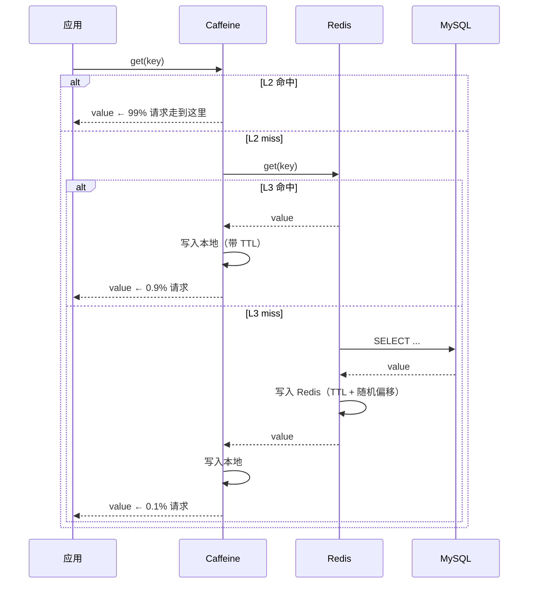

**关键点**：
1. **写入是"回填"**——每次 miss 都会把结果**沿路径反向写入所有上层**。
2. **每层 TTL 不同**：L2 通常几秒到几分钟（跨节点一致性），L3 几十分钟到几小时。
3. **TTL 必须加随机偏移**——避免 §1 那样同时过期。

**写入流程**（Cache-Aside 模式）：

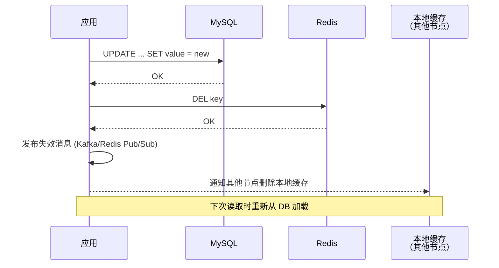

### 5.3 本地+Redis

**为什么 Caffeine + Redis 是 Java 生态"最佳组合"**？

**Caffeine 优势**：
- W-TinyLFU 算法（§4.4）命中率极高
- 进程内内存访问（200 ns 级别）
- 强并发（RingBuffer 无锁读写）

**Redis 优势**：
- 跨节点共享（多个应用实例看到同一份数据）
- 丰富数据结构（String / Hash / List / Set / ZSet）
- 持久化（RDB + AOF）
- 集群模式（Cluster / Sentinel）

**组合优势**：
- L2 (Caffeine) 抗**极高频热点**（避免打到 Redis）
- L3 (Redis) 抗**中低频请求**（避免打到 DB）
- 单机崩溃（L2 挂）→ 只影响该节点，L3 兜底
- Redis 崩溃（L3 挂）→ L2 仍能扛 80% 请求

**典型配置**：

```java
Cache<String, Product> l2 = Caffeine.newBuilder()
    .maximumSize(10_000)              // 10w 热点商品
    .expireAfterWrite(5, MINUTES)     // 5 分钟 TTL
    .recordStats()                    // 开启监控
    .build();
```

```
redis-cli:
  maxmemory 32gb
  maxmemory-policy allkeys-lru        # 淘汰策略
```

### 5.4 命中率联合估算

**多级缓存的联合命中率**是每一层的乘积逆运算：

$$
H_{\text{total}} = 1 - (1 - H_{L2})(1 - H_{L3})
$$

假设 $H_{L2} = 0.85$（L2 命中 85%），$H_{L3} = 0.90$（miss 之后打到 L3 命中 90%）：

$$
H_{\text{total}} = 1 - 0.15 \times 0.10 = 1 - 0.015 = 98.5\%
$$

**只有 1.5% 请求打到 DB**——这就是分层的威力。

**平均延迟**：

$$
T_{\text{avg}} = H_{L2} T_{L2} + (1-H_{L2}) H_{L3} T_{L3} + (1-H_{L2})(1-H_{L3}) T_{DB}
$$

代入数据：
- $T_{L2} = 0.2\text{μs}, T_{L3} = 1\text{ms}, T_{DB} = 30\text{ms}$
- $T_{\text{avg}} = 0.85 \times 0.0002 + 0.15 \times 0.9 \times 1 + 0.15 \times 0.1 \times 30 = 0.135 + 0.15 \times 3 = 0.585\text{ms}$

**99% 请求 < 1ms**——这是所有电商详情页追求的性能基线。

## 6. 一致性方案对比

### 6.1 缓存旁路(CA)

**Cache-Aside** 是最常用的一致性模式。**读**：先查缓存，miss 则查 DB 并回填。**写**：先写 DB，再删缓存。

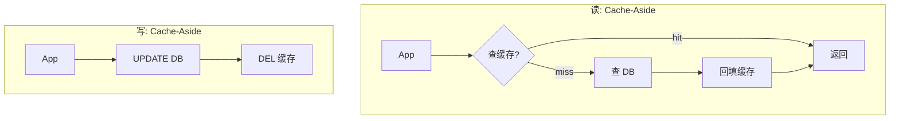

**优点**：简单、通用、绝大多数业务够用。

**缺点**：写路径下有并发脏读窗口（下节详解）。

### 6.2 直写穿透强一致

**Write-Through**：**缓存层封装读写**，写操作**同步**穿透到 DB。

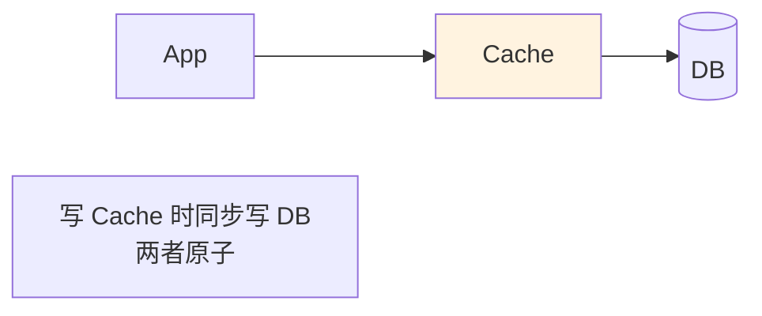

**优点**：**缓存和 DB 强一致**（同步写）。

**缺点**：
- 每次写都要等 DB 返回，**写延迟高**（等于 DB 写延迟）。
- 需要缓存层封装事务——**实现复杂**。
- 写入 QPS 上限受 DB 制约。

**适用**：写少读多、强一致性要求、缓存作为主访问入口（如 Ehcache + JPA）。

### 6.3 异步写回高吞吐

**Write-Behind（Write-Back）**：**写只写缓存，DB 异步刷回**。

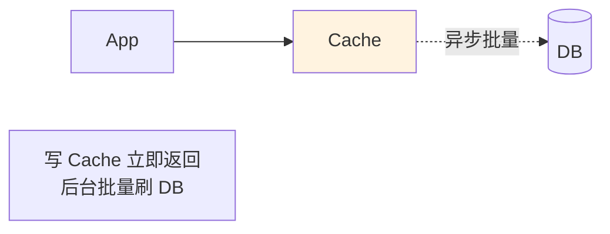

**优点**：**极致写性能**（缓存内存写 ~200ns），可以聚合批量写 DB。

**缺点**：
- 缓存挂了 **数据可能丢失**（未刷回 DB 的部分）。
- 缓存和 DB 之间**弱一致**。
- 实现复杂（需要脏数据队列、失败重试）。

**适用**：**高写入低一致性场景**——如日志、埋点、计数器。CPU 的 L1 write-back 就是这个思路。

### 6.4 先写DB后删

**Cache-Aside 里"先删缓存"和"后删缓存"之争**：

**方案 A：先删缓存再写 DB** ❌

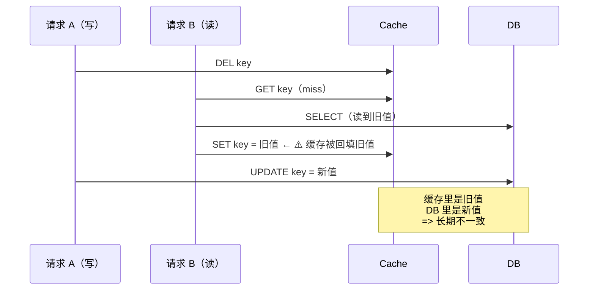

**问题**：并发场景下缓存被脏值污染，**直到下次过期才恢复**——不一致时间窗 = TTL（可能几十分钟）。

**方案 B：先写 DB 再删缓存** ✅

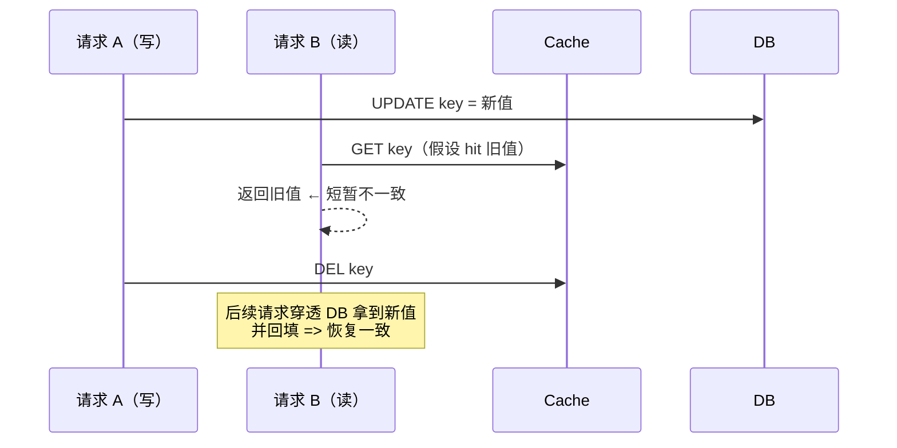

**问题**：**只有一个极短的不一致窗口**——请求 B 读到旧值 → 缓存被删 → 下次请求就一致。窗口 = 步骤"UPDATE 到 DEL"之间的时长（通常 < 10ms）。

**结论**：**先写 DB 再删缓存**是 Cache-Aside 的最优做法。**极端场景**（10ms 都不能容忍）叠加 **Double Delete**：

```java
public void update(Key k, Value v) {
    db.update(k, v);
    cache.delete(k);
    // Double Delete: 延迟 500ms 再删一次，防止刚删完又被回填旧值
    scheduledExecutor.schedule(() -> cache.delete(k), 500, MILLISECONDS);
}
```

## 7. 三大经典问题

### 7.1 缓存穿透原理

**定义**：请求查询**根本不存在的数据**，缓存和 DB 都没有，每次都打到 DB。

**典型场景**：
- 黑产扫描接口，用各种不存在的 ID 探测。
- 恶意攻击构造巨量不存在的 Key。

**数学模型**：设合法 Key 数 $N$，恶意 Key 数 $M \gg N$，攻击 QPS $Q$。**打到 DB 的 QPS**：

$$
Q_{\text{DB}} = Q \times \frac{M}{M+N} \approx Q
$$

**几乎 100% 打到 DB**——常规缓存完全失效。

**解决方案**：

**方案 1：空值缓存**
DB 也查不到时，缓存一个"空对象"（TTL 短）：

```java
Object result = cache.get(key);
if (result == NULL_MARKER) return null;   // 空值命中
if (result != null) return result;

result = db.query(key);
if (result == null) {
    cache.set(key, NULL_MARKER, 300);     // 空值 TTL 短（5 分钟）
} else {
    cache.set(key, result, 3600);
}
return result;
```

**缺点**：恶意 Key 太多时**缓存被空值撑爆**。

**方案 2：布隆过滤器**（详见 §7.4）——**在 Redis 之前挡一道**。

### 7.2 缓存击穿原理

**定义**：**单个热 Key 突然过期**，瞬间大量并发请求打到 DB。

**数学模型**：设热 Key 的 QPS 为 $Q_{\text{hot}}$，DB 单次查询耗时 $T_{\text{db}}$。**过期瞬间打到 DB 的并发**：

$$
\text{Concurrent} = Q_{\text{hot}} \times T_{\text{db}}
$$

若 $Q_{\text{hot}} = 10\text{w/s}, T_{\text{db}} = 30\text{ms}$，**并发 = 3000**——**足够压垮 DB**。

**解决方案**：

**方案 1：分布式锁**——**只让第一个请求查 DB**：

```java
public Object getWithLock(String key) {
    Object v = cache.get(key);
    if (v != null) return v;
    
    // 尝试拿分布式锁
    if (redis.setnx("lock:" + key, "1", 30)) {
        try {
            v = db.query(key);
            cache.set(key, v, 3600);
            return v;
        } finally {
            redis.del("lock:" + key);
        }
    } else {
        // 没拿到锁，等一下重试
        Thread.sleep(100);
        return getWithLock(key);
    }
}
```

**方案 2：热 Key 永不过期 + 后台异步更新**——**根本消灭"过期瞬间"**：

```java
// 定时任务，每 30 分钟主动更新热 Key
@Scheduled(fixedRate = 30 * 60 * 1000)
void refreshHotKeys() {
    for (String key : hotKeys) {
        Object v = db.query(key);
        cache.set(key, v);  // 不设 TTL
    }
}
```

**选型**：方案 1 适用于**热 Key 事先不知道**的场景；方案 2 适用于**热 Key 数量少可预知**的场景（如排行榜）。

### 7.3 缓存雪崩原理

**定义**：**大量 Key 同时过期** + 流量打到 DB → 全站雪崩。这就是 §1 的 1.2 亿场景。

**数学模型**：设 $M$ 个 Key 在同一时刻过期，全站 QPS $Q$，其中 $Q_{\text{miss}}$ 命中这批 miss。**打到 DB 的 QPS**：

$$
Q_{\text{DB}} = Q \times \frac{M}{N}
$$

若 $M = N$（全部同时过期），**100% 流量打到 DB**。DB 崩了，缓存回填失败，**下一波流量继续打 DB**——形成正反馈**雪崩**。

**解决方案三件套**：

| 方案 | 做法 | 防什么 |
|---|---|---|
| **TTL 随机化** | TTL = 基础时间 + 随机 0-60 分钟 | 防止同时过期（治本） |
| **多级缓存** | L2 本地 + L3 Redis | L3 挂了 L2 兜底 |
| **限流熔断** | DB 前加限流 | 即使打到 DB 也不会崩 |

```java
// ❌ §1 那一行反例
redis.setex(key, 86400, value);

// ✅ 正例
long ttl = 86400 + ThreadLocalRandom.current().nextInt(3600);
redis.setex(key, ttl, value);
```

**就这一行代码差别，避免 1.2 亿损失**。

### 7.4 布隆过滤器解剖

**布隆过滤器（Bloom Filter）**：用极小空间**判断 Key 是否可能存在**。

**数据结构**：一个 $m$ 位的位数组 + $k$ 个哈希函数。

**添加**：$k$ 个哈希函数把 Key 映射到 $k$ 个位置，全部置 1。

**查询**：$k$ 个位置全为 1 → **可能存在**；有任何一个为 0 → **一定不存在**。

```
位数组 (m=16 位): [0][0][0][0][0][0][0][0][0][0][0][0][0][0][0][0]

添加 "cat" (哈希到位置 1, 5, 10):
             [0][1][0][0][0][1][0][0][0][0][1][0][0][0][0][0]

添加 "dog" (哈希到位置 3, 7, 12):
             [0][1][0][1][0][1][0][1][0][0][1][0][1][0][0][0]

查询 "cat":  位置 1、5、10 都是 1 → 可能存在 ✓
查询 "fish": 位置 4、8、14 都是 0 → 一定不存在 ✓（不用查 DB！）
查询 "bird": 位置 3、5、12 都是 1（"cat"和"dog"污染） → 假阳性 ⚠️
```

**关键性质**：
- **假阳性**（说存在实际不存在）：有一定概率
- **假阴性**（说不存在实际存在）：**不可能**——正是这个性质让它能用作 DB 前置过滤器

**假阳性率公式**：

$$
P_{fp} \approx \left(1 - e^{-kn/m}\right)^k
$$

- $n$：已插入元素数
- $m$：位数组大小
- $k$：哈希函数个数

**最优 $k$**：$k^* = \frac{m}{n} \ln 2$

**实用数值**：**1 亿 Key，假阳性率 1%**：
$$
m = -\frac{n \ln P_{fp}}{(\ln 2)^2} = \frac{10^8 \times \ln 100}{0.48} \approx 9.6 \times 10^8 \text{ bits} = 120 \text{ MB}
$$

$k = \frac{9.6 \times 10^8}{10^8} \times 0.693 \approx 7$ 个哈希函数

**120MB 存 1 亿 Key**——比 Redis 存 1 亿 Key 的实际数据（几十 GB）便宜 100 倍。

**§1 团队重构后的方案**：

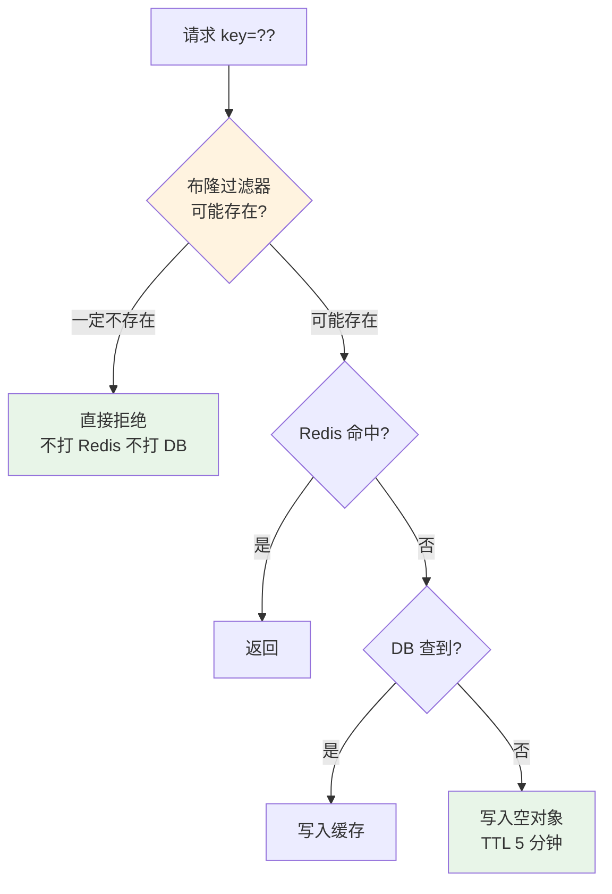

**双层防护**：**布隆过滤器（拦不存在的） + 空值缓存（兜底假阳性）**。

## 8. 常见反例陷阱

### 8.1 大 Key 反例

**反例**：某 App 把"用户全部好友列表"存为一个 Redis Hash，热门用户的好友列表达 50w 条 / 80MB。

**问题**：
- 一次 `HGETALL` 操作阻塞 Redis 主线程数百毫秒——**Redis 是单线程模型**，一个大 Key 会让所有其他请求排队。
- 网络传输 80MB 占满带宽——**千兆网卡 = 125MB/s**，一次传输占用 640ms。
- 主从同步时一个 Key 阻塞全集群——**主从复制是单线程**。

**解决**：
1. **拆分大 Key**：`friends:userId` → `friends:userId:0/1/2/...`（按 hash 分片）
2. **改用 SCAN**：分批读取而不是 HGETALL
3. **监控 Key 大小**：`redis-cli --bigkeys` 定期扫描告警

**规则**：**单 Key 大小 < 10KB**。超过就要拆。

### 8.2 热 Key 反例

**反例**：双 11 期间某爆款商品详情 Key 单点 QPS 达 50w，**单 Redis 节点被打爆**。

**问题**：Redis 集群模式下**一个 Key 只能落在一个节点**，无法通过加节点水平扩展。

**解决：热 Key 副本拆分**：

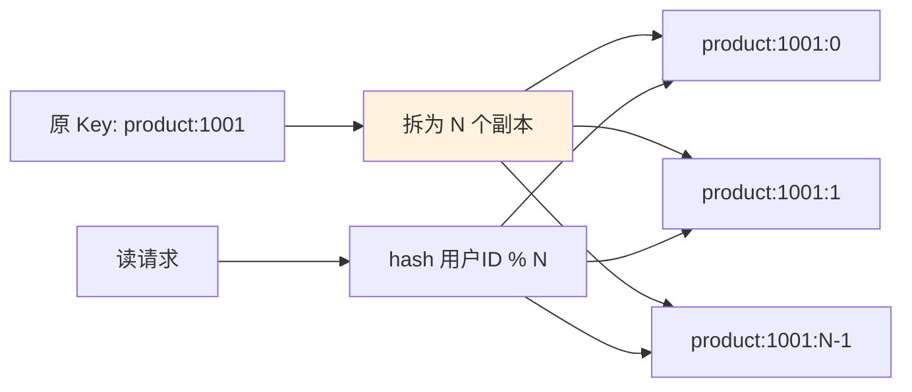

**关键代码**：

```java
int shard = userId.hashCode() % N_SHARDS;
String key = "product:1001:" + shard;
```

**代价**：写多份（写放大 N 倍）。**收益**：读 QPS 可以水平扩展 N 倍。

**热 Key 判定**：QPS > 1w/s 就是热 Key。

### 8.3 一致性反例

**反例**：用"先删缓存再写 DB"模式，并发场景下出现脏数据（详见 §6.4 方案 A 的时序图）。

**解决**：**先写 DB 再删缓存 + Double Delete 兜底**。

### 8.4 缓存挂了业务崩

**反例**：Redis 挂了，应用直接报错，整站不可用——**缓存反而成了单点**。

**问题**：**没有降级路径**。缓存本来是为了加速，反而变成了刚需。

**解决**：

```java
public Object get(String key) {
    try {
        Object v = cache.get(key);
        if (v != null) return v;
    } catch (Exception e) {
        log.warn("Cache failure, fallback to DB", e);
        metrics.increment("cache.failure");
    }
    
    // 降级：直读 DB + 限流保护
    if (!rateLimiter.tryAcquire()) {
        throw new BusinessException("System busy");   // 拒绝多余请求
    }
    return db.query(key);
}
```

**关键机制**：
1. **catch 异常**：缓存挂了不 throw 到业务
2. **降级读 DB**：短暂承压不崩
3. **限流保护**：避免全流量打 DB → 二次雪崩

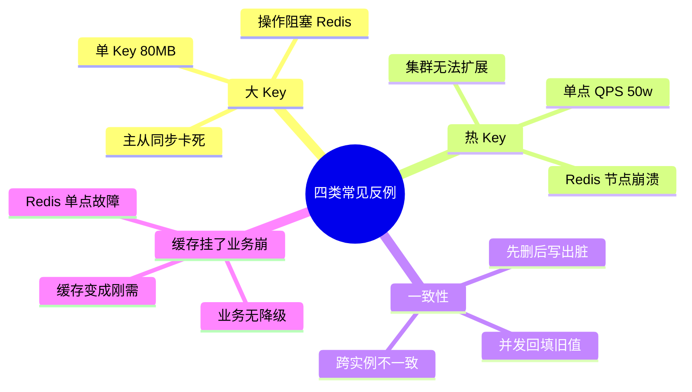

## 9. K-V 存储引擎设计思想

### 9.1 内存与磁盘的天堑

前 8 章讨论的都是**多进程 / 多节点**共享的缓存——它们的隐含前提是"缓存挂了，回源不丢数据"。**一旦这个前提被撤销——数据必须落地、进程可能被杀、机器可能断电**——问题就从"命中率优化"变成"存储引擎设计"。本节讨论的是**任何跑在真实硬件上、需要持久化的 K-V 引擎都会遇到的问题**，不区分运行环境。

**核心矛盾只有一句话**：

> 内存快 5 个数量级，但断电即失；磁盘慢 5 个数量级，但断电不丢。**K-V 引擎的全部技巧，就是把慢的伪装成快的、把不安全的伪装成安全的**。

**IO 延迟的物理级差**：

| 存储介质 | 顺序读延迟 | 随机读延迟 | 与内存差距 |
|---|---|---|---|
| L1 Cache | 1 ns | 1 ns | 1× |
| 主存 DRAM | 100 ns | 100 ns | 1× 基准 |
| NVMe SSD | 10 μs | 50 μs | 100~500× |
| SATA SSD | 50 μs | 100 μs | 500~1000× |
| 移动闪存 | 200 μs | 1-5 ms | $10^3$~$10^4$× |
| 机械硬盘 | 5 ms | 10 ms | $5 \times 10^4$~$10^5$× |

**结论**：即便是最快的 NVMe，也比内存慢 2 个数量级；最慢的移动闪存 / HDD 差距达到 5 个数量级。**任何直接把每次写操作交给磁盘的设计，性能天花板都极低**。

**围绕这条天堑，K-V 引擎必须回答四组问题**：

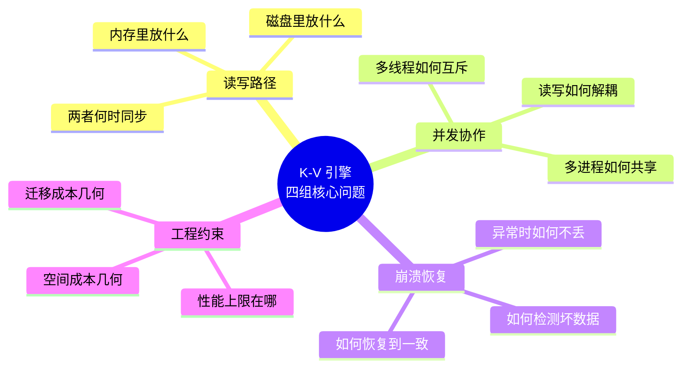

上一章的三大反例（大 Key / 热 Key / 一致性）关注的是**"缓存作为加速层的正确使用"**；本章关注的是**"缓存作为存储引擎本身的正确实现"**。二者互补：**前者是缓存的使用者，后者是缓存的作者**。

### 9.2 三层模型与状态机

任何 K-V 引擎，不论用什么语言、跑在什么平台，剖开来看都是**三层结构 + 四态状态机**。理解这两个骨架，就理解了这个领域 90% 的实现变体。

**9.2.1 API 层 / 内存层 / 持久层**

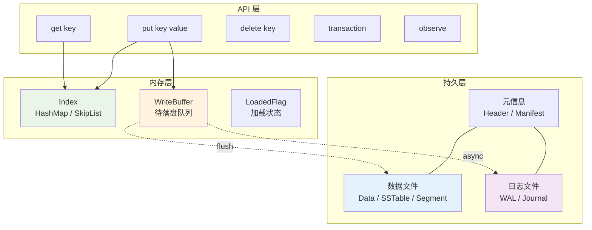

**每层的天职**：

| 层 | 关心什么 | 不关心什么 |
|---|---|---|
| **API 层** | 语义（原子性、可见性、错误码）、易用性、类型安全 | 数据放在哪 |
| **内存层** | 查询命中、写缓冲、并发原语 | 数据是否已落盘 |
| **持久层** | 磁盘布局、崩溃可恢复、空间回收 | 什么线程在读写 |

**分层带来的解耦收益**：
- **API 演进不影响存储**：新增批量接口、协程接口，无需动磁盘格式。
- **存储升级不破坏 API**：从平坦文件换到 LSM，业务代码零改动。
- **测试可替换**：内存层可换成 Fake、持久层可换成内存文件系统，测试成本骤降。

**这是最经典的"三段式"分层**，几乎所有存储引擎（不局限 K-V，扩展到关系数据库、时序库）都遵循这个骨架。差异只在**每层用什么数据结构、层间用什么协议**。

**9.2.2 四态状态机：Read / Write / Flush / Recover**

引擎的**运行时行为**可以形式化为四种状态转移：

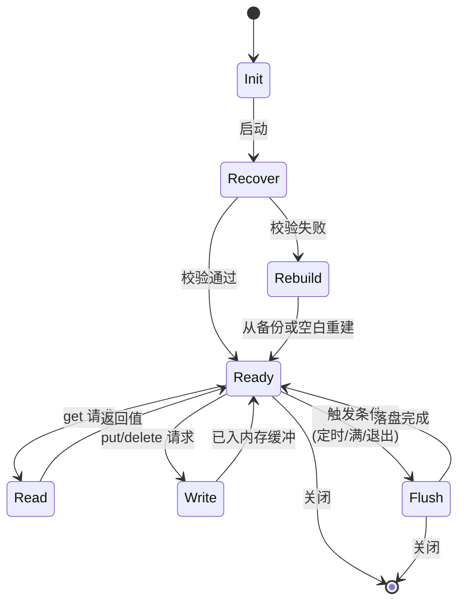

**每种状态的形式化契约**：

$$
\begin{aligned}
\text{Read}(k) &: S \rightarrow V \cup \{\bot\} \quad \text{（只读，不改状态 } S\text{）} \\
\text{Write}(k, v) &: S \rightarrow S' \quad \text{使得 Read}(k)@S' = v \\
\text{Flush} &: S \rightarrow S \quad \text{仅改变 (mem, disk) 的一致性关系，不改语义状态} \\
\text{Recover} &: (\text{disk}) \rightarrow S \quad \text{从磁盘重建内存视图}
\end{aligned}
$$

**四态之间的两条不变式**（Invariants）：

- **I1 语义幂等**：$\text{Recover}(\text{disk after Flush}(S)) = S$——刷盘后崩溃再恢复，状态必须一致。
- **I2 读一致**：$\text{Read}(k)@S$ 的结果**只依赖最后一次成功 Write**，与是否已 Flush 无关。

**这两条不变式是所有崩溃安全 K-V 引擎的根本判据**。任何设计只要能证明它满足这两条，就是正确的；违反任一条，都会出现数据丢失或读到过期数据。

**9.2.3 数据流的三条路径**

三层模型 + 四态状态机之上，运行时数据流一共只有三条路径：

**路径 A：读路径（Read）**

```
API 请求 get(k)
  ↓
查内存索引 (Index)
  ├─ 命中 → 返回内存里的最新值
  └─ 未命中 → 从持久层加载对应记录 → 回填内存 → 返回
```

**核心指标**：内存命中率 $H$。$H = 1$（全量加载）时读永远 $O(1)$；$H < 1$（懒加载）时未命中读要付一次 IO 代价。

**路径 B：写路径（Write）**

```
API 请求 put(k, v)
  ↓
写内存索引 (Index[k] = v)
  ↓
入写缓冲 (WriteBuffer.append)
  ↓
返回成功（异步模式）或等待 Flush（同步模式）
```

**核心指标**：写吞吐 $W$ 与写延迟 $L$。$W$ 由**批量凑批系数** $B$ 决定（$W \approx B / T_{fsync}$），$L$ 由**同步/异步选择**决定。

**路径 C：刷盘路径（Flush）**

```
触发条件到达 (定时/满/关闭)
  ↓
锁定 WriteBuffer 快照
  ↓
序列化 → 写入持久层
  ↓
fsync 强制落盘
  ↓
更新元信息 (Header/Manifest)
  ↓
清空对应 WriteBuffer
```

**核心指标**：刷盘延迟 $T_{fsync}$（受介质控制）与刷盘频率 $f$（由业务权衡）。$f$ 越高越安全但吞吐越低。

**读路径与写路径解耦的价值**：读只查内存索引，永远无 IO 阻塞；写只入缓冲，永远无 fsync 阻塞。**慢的部分（IO）被封闭在 Flush 路径里，且 Flush 由后台执行**——这就是 K-V 引擎"用异步换性能"的核心机制。

### 9.3 性能-安全-一致三角

三层模型告诉我们**能怎么做**，但**该怎么做**取决于取舍。K-V 引擎的所有设计决策都在一个三角形里跳舞。

**9.3.1 三角不可能定理**

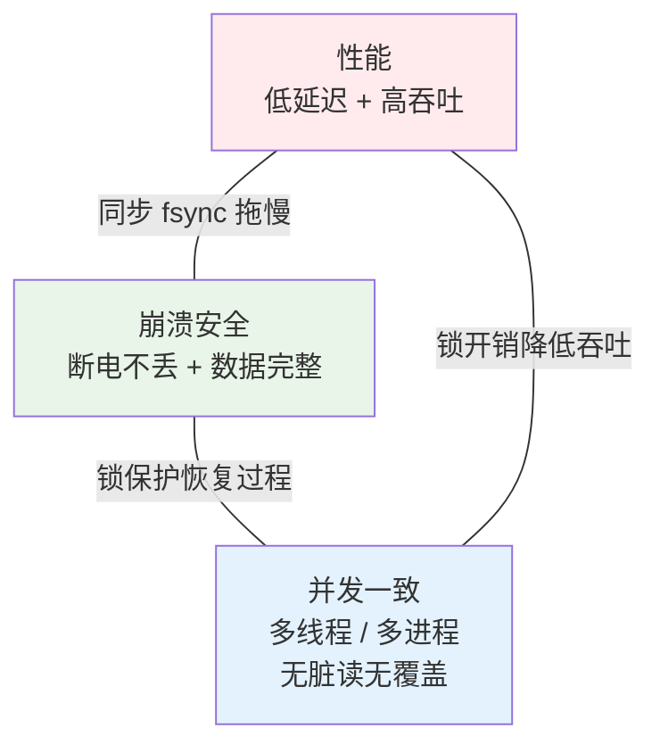

**三条边的对抗关系**：

**① 性能 ↔ 崩溃安全**：
- 追求性能 → 少刷盘 / 异步刷盘 / 不校验 → 崩溃时窗口内数据丢失
- 追求崩溃安全 → 每写必 fsync + 双写 + CRC → 单次写延迟从 μs 涨到 ms 级

**② 崩溃安全 ↔ 并发一致**：
- 追求崩溃安全 → 事务串行 + 全量校验 → 并发度骤降
- 追求高并发 → 无锁读 + 乐观写 → 恢复时难以判定"崩溃前谁赢了"

**③ 并发一致 ↔ 性能**：
- 追求强一致 → 粗粒度锁或串行事务 → 吞吐上限即为单线程吞吐
- 追求高性能 → 细粒度锁 / 无锁 / 弱一致 → 出现读到旧值、写覆盖等异常

**这是一个 CAP 精神在存储引擎里的映射——不能三者兼得**。工程实践中的所有 K-V 引擎都是**在这三个顶点之间选一个"甜蜜位置"**。

**四种典型的位置选择**：

| 位置 | 偏向 | 舍弃 | 适用场景 |
|---|---|---|---|
| **A 靠近 P-D 边** | 性能 + 安全 | 弱一致（允许覆盖） | 单进程、无严格一致要求 |
| **B 靠近 D-C 边** | 安全 + 一致 | 慢（同步事务） | 金融、订单、审计 |
| **C 靠近 P-C 边** | 性能 + 一致 | 弱耐久（内存优先） | 会话、临时状态 |
| **D 中间** | 三者都要 60 分 | 都不是极致 | 通用型引擎 |

**9.3.2 决策矩阵：写入侧的六种取舍**

**同一个 put(k, v) 请求，实现上有六种截然不同的做法**：

| 编号 | 策略 | 内存 | 磁盘 | 返回时机 | 性能 | 安全 |
|---|---|---|---|---|---|---|
| ① 纯内存 | 只写内存 | ✓ | — | 内存写完立即 | ★★★★★ | ★ |
| ② 异步回写 | 内存 + 后台批量刷 | ✓ | 后台 | 内存写完立即 | ★★★★ | ★★ |
| ③ 组提交 | 内存 + 定时/满触发同步刷 | ✓ | 同步（凑批） | Flush 完成 | ★★★ | ★★★★ |
| ④ WAL 先行 | 内存 + 立即写 WAL | ✓ | WAL 同步 | WAL 落盘 | ★★★ | ★★★★★ |
| ⑤ 直写 | 内存 + 立即写数据 | ✓ | 数据同步 | 数据落盘 | ★★ | ★★★★★ |
| ⑥ 双写 | 内存 + 主 + 副本 | ✓ | 主 + 副本 | 双方落盘 | ★ | ★★★★★★ |

**选择的关键判据**：

$$
\text{ExpectedLoss} = P(\text{crash}) \times \text{UnflushedWindow} \times \text{ValuePerRecord}
$$

- 若 $\text{ExpectedLoss}$ 可接受 → 选 ① ② ③
- 若 $\text{ExpectedLoss}$ 不可接受 → 必须 ④ 及以上

**"WAL 先行"是最常见的"甜蜜点"**——因为 WAL 是纯顺序追加，fsync 成本远低于随机写；同时保证了"崩溃后可回放"。这就是数据库、消息队列、K-V 引擎不约而同选它的原因。

**9.3.3 决策矩阵：一致性侧的五种取舍**

**多线程 / 多进程并发读写时的一致性等级**：

| 等级 | 名称 | 保证 | 实现代价 |
|---|---|---|---|
| L1 | **最终一致** | 短暂可读旧值，最终收敛 | 版本号 + 拉取 |
| L2 | **读写一致** | 单线程内写完立即读到 | 内存屏障 |
| L3 | **单调读** | 一旦看到 v2 就不再回到 v1 | 版本单调递增 |
| L4 | **线性一致** | 全局按物理时序 | 全局锁 / 单点 |
| L5 | **可串行化** | 所有事务等价于某种串行执行 | 事务锁 + MVCC |

**多进程场景下三种典型协议**：

**协议 α：共享内存 + 进程共享锁**

```
所有进程 mmap 同一文件 → 共享 Page Cache
                       + 共享内存中的 PROCESS_SHARED 读写锁
读：加读锁 → 查内存视图 → 释放
写：加写锁 → 改内存视图 + 追加日志 → 释放
```

- 优点：读写路径与单进程几乎一致，几乎零 IPC 开销
- 缺点：进程崩溃时锁可能残留 → 需要 robust 锁 + 心跳检测

**协议 β：版本号 + 拉取**

```
写：进程 A 追加数据 + 递增全局版本号
读：进程 B 每次 get 时对比本地版本号
    - 相等 → 用本地缓存
    - 不等 → 加载 [本地版本, 最新版本] 之间的增量
```

- 优点：无锁竞争，读性能极佳
- 缺点：短暂窗口可能读到旧值（L1 级一致）

**协议 γ：单主 + 请求转发（IPC）**

```
所有进程通过 IPC 把请求转发给单个主进程
主进程串行处理，返回结果
```

- 优点：一致性最强（等价于单进程线性一致）
- 缺点：每次调用 1-3ms IPC 开销

**选择判据**：跨进程访问频率高 → α；访问偶发 → γ；读远多于写 → β。

### 9.4 六大机制族原理拆解

三角权衡给出**方向**，六大机制族给出**手段**。每一族都对应一批可互换的具体技术。

**9.4.1 并发原语：从粗锁到无锁**

**演进阶梯**（并发度从低到高）：

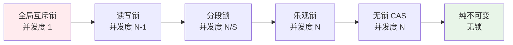

**六级机制对比**：

| 机制 | 读吞吐 | 写吞吐 | 复杂度 | 适用 |
|---|---|---|---|---|
| 全局互斥 | 差 | 差 | 极简 | 教学 / 极低并发 |
| 读写锁 | 中 | 差 | 简单 | 读多写少 |
| 分段锁 | 好 | 好 | 中等 | 桶可散列 |
| 乐观锁 (StampedLock) | 好 | 中 | 高 | 冲突罕见 |
| 无锁 CAS | 极好 | 好 | 极高 | 简单结构 |
| 不可变快照 (COW) | 极好 | 差 | 中 | 读极多写极少 |

**关键洞察**：**读路径必须无锁化**——因为读远多于写（典型 10:1 到 100:1），一旦读路径有锁竞争，整个系统吞吐就被锁死。写路径可以适度使用锁（毕竟写要 IO，锁开销相对小得多）。

**推荐组合**：
- **索引结构**：并发 HashMap（分段锁 / CAS）
- **写缓冲**：单线程 Actor / 无锁队列
- **监听器列表**：写时复制（COW）——注册少、遍历多

**代码骨架**（语言中性伪码）：

```
class Store:
    index      = ConcurrentMap()      # 读无锁，写分段锁
    writeQueue = MPSCQueue()          # 多生产单消费无锁队列
    listeners  = CopyOnWriteList()    # 读无锁
    diskLock   = Mutex()              # 只在 Flush 时持有
    
    read(k):
        return index.get(k)           # 完全无锁
    
    write(k, v):
        index.put(k, v)               # 分段锁
        writeQueue.push((k, v))       # 无锁
        notifyListeners(k, v)         # 遍历 COW 列表
    
    flushWorker():                    # 单一后台线程
        while alive:
            batch = writeQueue.drain(maxSize, maxWait)
            with diskLock:
                serialize(batch)
                fsync()
```

**收益量化**：读路径去锁后，单机可达千万级 QPS；带锁的读路径最多百万级——**一个数量级差异**。

**9.4.2 内存缓存：热点驻留与懒加载**

**必须有内存缓存的物理理由**：IO 延迟比内存高 2~5 个数量级（§9.1 表）。没有内存缓存的 K-V = 每次读盘 = 性能崩塌。

**两种加载策略的权衡**：

| 策略 | 冷启动 | 稳态读 | 内存占用 | 适用 |
|---|---|---|---|---|
| **全量加载** | 慢（O(N)） | 快（永远 O(1)） | 高 | 数据量 < 内存 |
| **懒加载** | 快（O(0)） | 首访问慢 | 低 | 热点集中 |
| **分区 + 懒预热** | 中等 | 常访问快 | 中 | 通用最优 |

**分区策略的数学根据**：Zipf 分布（§3.2）告诉我们 20% Key 承担 80% 访问。**把 K-V 空间切成若干分区，首次访问某分区时才加载对应部分**——冷启动成本降到原来的 20%，稳态命中率不变。

**懒加载的实现要点**：

```
class LazyStore:
    partitions = Map<PartitionId, Partition>()
    loadedFlag = Map<PartitionId, boolean>()
    loadLocks  = Map<PartitionId, Mutex>()
    
    read(k):
        pid = partitionOf(k)
        if not loadedFlag[pid]:
            with loadLocks[pid]:      # 双检锁避免重复加载
                if not loadedFlag[pid]:
                    partitions[pid] = loadFromDisk(pid)
                    loadedFlag[pid] = true
        return partitions[pid].get(k)
```

**内存缓存的第二个作用：写缓冲**（§9.4.4 详解）。put(k, v) 只改内存索引，磁盘写被延迟到 Flush——**读写两条路径都从内存首先受益**。

**9.4.3 事务模型：原子性的四种实现**

**事务原子性 = 要么全部生效，要么全部不生效**。四种主流实现方案：

**方案 α：日志先行（WAL）**

```
1. 把事务的所有变更写入日志（顺序追加）
2. fsync 日志                              ← 提交点
3. 应用到数据文件（可以慢慢来）
4. 崩溃后：重放日志从提交点之后的部分
```

- 崩溃点分析：若 crash 在步骤 2 之前 → 日志不完整 → 视为未提交；若 crash 在步骤 3 中间 → 日志完整 → 重放
- 代价：写放大 2×（日志 + 数据）
- 优点：崩溃安全性最强

**方案 β：临时文件 + 原子替换（Rename）**

```
1. 序列化完整数据到 tmp 文件
2. fsync tmp
3. rename(tmp, real)     ← 提交点（POSIX rename 是原子的）
4. 崩溃后：real 要么是新完整状态，要么是旧完整状态
```

- 代价：全量重写（每次事务重写整个文件）
- 优点：实现极简，无需回放
- 局限：只适合小数据量（几十 KB 到 MB 级）

**方案 γ：写时复制（Copy-on-Write）**

```
1. 复制受影响的数据块到新位置
2. 修改新位置的数据
3. 原子更新根指针（一次 CAS 或一次原子写）
4. 崩溃后：根指针指向旧或新，都是一致状态
```

- 典型代表：B+Tree 结构的持久化，元信息只更新根节点
- 代价：写放大（每次改动都要复制路径上所有块）
- 优点：并发读永不阻塞（读旧版本）

**方案 δ：影子分页（Shadow Paging）**

```
1. 分配影子页
2. 影子页写入新数据
3. 元信息切换：page_id → 新影子页
4. 原页面成为可回收
```

- 是 CoW 的老祖宗，思想相同
- 现代 K-V 引擎中大多用 CoW 变体

**四方案对比**：

| 方案 | 写放大 | 恢复复杂度 | 事务粒度 | 典型应用 |
|---|---|---|---|---|
| WAL | 2× | 高（回放） | 单条到批量 | 关系数据库、消息队列 |
| Rename | N× | 零 | 全库 | 小型嵌入式 K-V |
| CoW | 2-3× | 零 | 单事务 | B+Tree 引擎、文件系统 |
| Shadow | 2× | 零 | 全库/子树 | 历史 DBMS |

**9.4.4 写回策略：同步 / 异步 / 批量聚合**

**三种基本模式**：

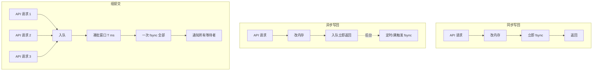

**性能量化**（假设单次 fsync = 5 ms）：

| 模式 | 100 次写耗时 | 数据丢失窗口 |
|---|---|---|
| 每次同步 | 500 ms | 0 |
| 每次异步 | 100 × 0.1 = 10 ms | 一个刷盘间隔 |
| 组提交（20ms 窗口） | 5 ms | ≤ 20 ms |

**组提交是"性能 × 安全"的最优组合**：把 100 次 fsync 压成 1 次，吞吐提升 100 倍，同时丢失窗口可控。

**API 层面的双模式约定**：

```
Store.put(k, v)          # 默认异步：入内存队列即返回
Store.putSync(k, v)      # 同步：等待本次 Flush 完成
Store.putAsync(k, v, cb) # 异步 + 完成回调
```

**决策矩阵**：

| 数据类型 | 推荐模式 | 理由 |
|---|---|---|
| 用户偏好、UI 状态 | 异步 | 丢失代价小 |
| 支付订单、审计日志 | 同步 | 丢失代价高 |
| 高频埋点 | 异步 + 组提交 | 追求吞吐，允许小概率丢失 |
| 关键 Token 首次落盘 | 同步 | 冷启动必须能读到 |

**关键契约**：**同步 API 禁止在延迟敏感线程调用**（如 UI 主线程）——文档必须明确声明，最好用编译期注解或 lint 规则强制。

**9.4.5 持久布局：平坦 / 追加 / 分层**

**同样是"把 K-V 落到磁盘"，三种截然不同的布局**：

**布局 α：平坦（Flat）**

```
文件 = 完整 K-V 集合的序列化快照
     ┌────────────┬────────────┬────────────┐
     │ header     │ [k1, v1]   │ [k2, v2] ..│
     └────────────┴────────────┴────────────┘

写：全部反序列化 → 修改 → 全部序列化 → 覆写
```

- 空间效率：极好（无冗余）
- 写代价：$O(N)$（改 1 字节写全部）
- 适用：数据量小（KB 级）、写罕见

**布局 β：追加（Append-only Log）**

```
文件 = 一串按时间顺序的操作记录
     ┌──────────┬──────────┬──────────┬──────┐
     │put k1 v1 │put k2 v2 │put k1 v3 │del k2│
     └──────────┴──────────┴──────────┴──────┘

写：末尾追加一条记录
读：从头扫描或维护内存索引
GC：定期整理，去除被覆盖 / 删除的旧记录
```

- 空间效率：中等（膨胀，需 GC）
- 写代价：$O(1)$（只追加）
- 适用：写频繁、单机 K-V

**布局 γ：分层（LSM-Tree）**

```
写：MemTable → Immutable → L0 SSTable → ... → Ln SSTable
    每层容量按指数增长，后台压实合并

读：从 MemTable 起逐层查，每层用 BloomFilter 快速过滤
```

- 空间效率：中等偏低（压实过程有写放大）
- 写代价：$O(1)$ 内存 + 后台批量落盘
- 适用：写吞吐极高、大数据量、需范围查询

**三层布局对比矩阵**：

| 维度 | 平坦 | 追加 | 分层 |
|---|---|---|---|
| 单次写延迟 | 高（全量） | 极低 | 极低 |
| 写放大 | $N/1$ | ~1× | 5-30× |
| 读延迟 | 低（一次） | 中（内存索引） | 中（多层查） |
| 空间放大 | 1× | 1.5-2× | 1.1-1.3× |
| GC 复杂度 | 无 | 中 | 高（压实策略） |
| 数据规模 | KB-MB | MB-100MB | GB-TB |
| 范围查询 | 需重建有序 | 需重建有序 | 天然有序 |

**决策一句话**：**改多读少大数据 → 分层；改多读多小数据 → 追加；改罕见 → 平坦**。

**9.4.6 恢复协议：CRC / WAL / 双写 / 快照**

**恢复问题的形式化**：给定 **可能被截断 / 篡改 / 部分写入** 的磁盘，重建一个**满足 I1 与 I2**（见 §9.2.2）的内存状态。

**四种防御机制，从弱到强**：

**M1：CRC 校验**

```
写：data | CRC32(data)
读：re_crc = CRC32(read_data)
    if re_crc != read_crc: 视为损坏
```

- 作用：检测**磁盘位翻转 / 部分写**
- 局限：只检测不修复，且不防恶意篡改（防篡改需 HMAC）

**M2：WAL 回放**

```
恢复流程：
  1. 读元信息，确定最后一次成功 checkpoint 位置 P
  2. 从 P 开始顺序回放 WAL
  3. 遇到 CRC 失败的记录：视为未完成事务，丢弃
  4. 回放到日志末尾 → 状态与崩溃前一致
```

- 作用：把**任意崩溃点**恢复到**最近一次已提交状态**
- 前提：WAL 记录必须**每条自包含 CRC**

**M3：双写 + 备份**

```
主文件：kv.data
备份：kv.data.bak
CRC 文件：kv.crc（独立小文件）

写入顺序（关键！）：
  1. write kv.data
  2. fsync kv.data
  3. write kv.crc     ← 只有此步完成才算提交
  4. fsync kv.crc
  
恢复顺序：
  1. verify(kv.data, kv.crc) → OK → 完成
  2. 否则 → 尝试 kv.data.bak + kv.data.bak.crc
  3. 都坏 → 清空重建
```

- 关键：**先写数据、后写 CRC**——crash 在中间时 CRC 还是旧的，与旧数据匹配，状态一致
- 作用：主文件损坏时可回退到备份

**M4：快照 + 增量**

```
定期：把当前状态完整快照到独立文件
每次写：追加到增量日志

恢复：加载最近快照 → 回放快照后的增量
```

- 作用：加速恢复（不必回放全部历史）
- 代价：额外存储

**四机制组合使用**：

$$
P(\text{永久数据丢失}) \approx P_{crc\_fail} \times P_{wal\_fail} \times P_{backup\_fail} \times P_{snapshot\_fail}
$$

若每一层独立故障率 $p = 10^{-6}$，四层保护后 $P \approx 10^{-24}$——**天文级可靠**。

**极限约束**：**整机断电 + 内核未刷 Page Cache** 是所有软件层无法防御的丢失场景。硬件层需要**电池备份缓存（BBWC）/ 断电保护电容 / UPS**——这已经超出 K-V 引擎设计范畴。

### 9.5 IO演进史四代跃迁

回过头看，K-V 引擎从最原始到最先进只有**四代技术**。每一代都是**对上一代最痛的那个约束的破解**。

**9.5.1 第一代：全量重写**

**技术特征**：数据结构化 → 序列化到文件（XML/JSON/自定义二进制）→ 每次修改 → 全部读入 → 改 → 全部写回 → fsync。

**优点**：实现极简，几十行代码搞定；文件可读、可编辑。

**核心约束**：$T_{write} = O(N)$ ——数据量 $N$ 越大越慢，且**每次改 1 字节写全部**。

**天花板**：数据量 > 100KB 时写延迟超过用户感知阈值（100ms）。

#### 9.5.2 第二代：WAL + 追加

**破解思路**：**"改 1 字节不应该重写 100KB"**——把每次写变成**顺序追加一条记录**，读时从头扫描或维护内存索引。

**技术特征**：追加日志文件 + 内存索引 + 定期整理（Compaction）+ CRC 校验每条记录 + 恢复靠回放。

**收益**：
- 单次写从 $O(N)$ 降到 $O(1)$
- 顺序 IO 快于随机 IO 10-100 倍
- 崩溃安全（每条记录有 CRC + WAL 保证）

**新问题**：
- 文件持续膨胀 → 需要 GC / Compaction
- 读性能取决于内存索引 → 内存不够时退化

**9.5.3 第三代：LSM 分层**

**破解思路**：**"追加文件太大扫描慢"**——把数据按层次组织，每层有序、层间大小指数递增，用 BloomFilter 加速跨层查找。

**技术特征**：MemTable（有序内存表）→ Immutable MemTable → L0 SSTable（磁盘上的有序表）→ 后台压实合并 → 逐层下沉。

**收益**：
- 支持范围查询（每层内部有序）
- 空间放大控制到 1.1-1.3×（压实去重）
- 写吞吐极高（顺序追加 MemTable）

**新问题**：
- 读放大：可能查 5-10 层才命中
- 写放大：压实过程反复重写数据（5-30×）
- 实现复杂度极高

#### 9.5.4 第四代：内存映射

**破解思路**：**"每次 write() 都要跨用户态/内核态切换太贵"**——把磁盘文件映射到进程地址空间，改文件 = 改内存。

**技术特征**：`mmap` 将文件映射为虚拟内存 → 进程直接读写 Page Cache → 内核后台负责刷盘。

**mmap 的五重红利**：

```mermaid
graph LR
    M[mmap] --> R1[零拷贝<br/>省用户/内核 buffer 复制]
    M --> R2[零系统调用<br/>改内存 = 普通 CPU 指令]
    M --> R3[崩溃安全<br/>Page Cache 由内核托管]
    M --> R4[跨进程共享<br/>同一 Page Cache]
    M --> R5[OS-LRU 免费<br/>内核自动做冷热淘汰]
    
    style M fill:#e3f2fd
```

**性能公式**：

$$
\text{Speedup} = \underbrace{2\times}_{零拷贝} \times \underbrace{500\times}_{零系统调用} \times \underbrace{10\times}_{批量刷盘} \approx 10^4
$$

实测大约 100-200×（其他开销吃掉部分红利）。

**mmap 的约束**：
- 32-bit 系统虚拟地址空间只有 4GB，映射大文件受限
- 不适合冷数据（挤占其他 App 的 Page Cache）
- 不适合极大文件（GB 级 mmap 浪费）

**mmap 的适用范围**：**几百 KB 到几十 MB 的高频访问 K-V**——正好覆盖绝大多数嵌入式和客户端场景。

**9.5.5 每一代解决了上一代的什么问题**

```mermaid
graph LR
    G1[G1 全量重写<br/>问题: 写放大 N/1] -->|追加代替覆盖| G2[G2 WAL 追加]
    G2 -->|问题: 大数据量扫描慢<br/>层次化 + BloomFilter| G3[G3 LSM 分层]
    G3 -->|问题: 系统调用开销<br/>映射代替读写| G4[G4 mmap]
    
    style G1 fill:#ffebee
    style G2 fill:#fff3e0
    style G3 fill:#e8f5e8
    style G4 fill:#e3f2fd
```

**四代不是完全替代关系，而是场景分工**：

| 代 | 最佳数据规模 | 最佳场景 |
|---|---|---|
| G1 全量 | < 10 KB | 配置文件、状态标记 |
| G2 WAL | 10 KB - 10 MB | 通用 K-V、消息队列 |
| G3 LSM | 10 MB - TB | 大数据量、需范围查 |
| G4 mmap | 10 KB - 100 MB | 高频读写、跨进程 |

**技术复用**：现代引擎往往**混合多代技术**——例如 mmap（G4）承载 WAL 日志（G2）+ LSM 的 MemTable（G3），三代能力同时在线。

### 9.6 可用性与安全模型

前面讲了"怎么做"，本节量化"做了以后能达到什么可靠性"。

#### 9.6.1 崩溃安全的概率模型

**记号约定**：
- $p_h$：单次磁盘 IO 硬件故障率（典型 $10^{-15}$/bit，聚合到文件级 $\sim 10^{-6}$）
- $p_c$：进程崩溃率
- $T_w$：一次事务窗口时长
- $R$：数据副本数
- $M$：恢复机制层数（CRC / WAL / 双写 / 快照）

**单一防线的数据丢失概率**：

$$
P_{loss}^{single} = 1 - (1 - p_h)(1 - p_c \cdot T_w / T_{fsync})
$$

**M 层独立防线组合**：

$$
P_{loss}^{combined} = \prod_{i=1}^{M} P_{loss,i}
$$

**具体计算**（假设各层独立故障率 $10^{-6}$）：

| 保护级别 | 层数 | $P_{loss}$ | 期望丢失周期 |
|---|---|---|---|
| L0 无保护 | 0 | $10^{-3}$ | 每天可能 |
| L1 CRC | 1 | $10^{-6}$ | 每三年一次 |
| L2 CRC + WAL | 2 | $10^{-12}$ | 每 $10^6$ 年 |
| L3 CRC + WAL + 双写 | 3 | $10^{-18}$ | 宇宙年龄 × $10^8$ |
| L4 CRC + WAL + 双写 + 快照 | 4 | $10^{-24}$ | 无限接近 0 |

**收益递减规律**：从 L0 → L1 是决定性突破，L1 → L2 显著，L2 → L3 已经过剩，L3 → L4 属于纯粹的过度设计。

**工程实践的甜蜜点是 L2 或 L3**——CRC + WAL 是必备，双写视业务价值决定。

**9.6.2 完整性与保密性的分离**

两者常被混为一谈，但**是正交的两个问题**：

| 属性 | 定义 | 机制 |
|---|---|---|
| **完整性** | 数据没被篡改（无论是硬件位翻转还是恶意修改） | CRC / HMAC / 数字签名 |
| **保密性** | 数据不能被未授权者读取 | 加密（AES / ChaCha20） |
| **完整性 + 保密性** | 兼具二者 | AEAD 模式（GCM / ChaCha20-Poly1305） |

**分级存储策略**：

| 级别 | 数据示例 | 建议方案 |
|---|---|---|
| L1 无关紧要 | UI 主题、字体 | 明文 + CRC |
| L2 中等敏感 | 用户偏好、昵称 | 明文 + CRC（磁盘权限隔离） |
| L3 高敏感 | Token、身份证、支付信息 | **AEAD 加密（AES-GCM）**+ 密钥外置 |
| L4 极敏感 | 用户密码 | **不存原文**——只存 `hash(password + salt)` |

**密钥管理的三条铁律**：
1. **密钥永不硬编码在代码里**——需从操作系统提供的安全存储（TEE / KeyStore / Keychain / TPM）取
2. **加密算法必须用 AEAD**——同时保证完整性和保密性
3. **敏感数据用完即擦**——不仅删索引，还要触发一次 Full Rewrite 覆盖磁盘

**CRC 与 HMAC 的关键区别**：CRC 只防**无意错误**（硬件、部分写），能被恶意攻击者精心构造出满足 CRC 的假数据；HMAC 需要密钥，攻击者无密钥则无法伪造。**存证 / 审计场景必须用 HMAC 或数字签名**。

**9.6.3 数据迁移的四阶段协议**

**为什么迁移是必须要设计的**：K-V 引擎的物理格式一旦确定，就与"用户数据本身"深度耦合——**当引擎换代时（比如从 G1 全量升级到 G4 mmap），必须有一套协议在不丢数据的前提下平滑切换**。

**四阶段协议**：

```mermaid
flowchart LR
    A[阶段1<br/>只用旧库<br/>观察] --> B[阶段2<br/>双写<br/>只读旧库]
    B --> C[阶段3<br/>双写<br/>读新库<br/>失败降级]
    C --> D[阶段4<br/>只用新库<br/>清理旧库]
    
    style A fill:#e3f2fd
    style B fill:#e8f5e8
    style C fill:#fff3e0
    style D fill:#ffebee
```

**每阶段的契约**：

| 阶段 | 写策略 | 读策略 | 关键动作 | 停留时间 |
|---|---|---|---|---|
| 1 | 旧 | 旧 | 埋点：新库若上线会遇到哪些数据 | 1 个版本 |
| 2 | **新 + 旧** | 旧 | 校验：新旧库数据一致率 | 2 个版本 |
| 3 | 新 + 旧 | **新（失败回退旧）** | 监控：新库读成功率、性能 | 2 个版本 |
| 4 | 新 | 新 | 清理：删除旧库文件 | 1 个版本 |

**核心原则**：

1. **只有前进，不能回退**：一旦进入阶段 4 就不给自己留退路（删除旧数据）。否则永远走不完迁移。
2. **异常必须被监控**：新库出问题要立刻发现，不能等出事。
3. **灰度放量**：每阶段先 1% → 10% → 50% → 100% 逐步扩大范围。
4. **幂等标记**：迁移标志存在**目标库**——因为源库可能被清空，目标库才是真源。

**代码骨架**：

```
class MigratingStore:
    def __init__(self, oldStore, newStore, stage):
        self.old = oldStore
        self.new = newStore
        self.stage = stage
    
    def get(self, k):
        if self.stage <= 2:
            return self.old.get(k)
        elif self.stage == 3:
            try:
                v = self.new.get(k)
                if v is not None: return v
            except Exception as e:
                report("new_read_fail", e)
            return self.old.get(k)   # 降级
        else:  # stage 4
            return self.new.get(k)
    
    def put(self, k, v):
        if self.stage >= 2: self.new.put(k, v)
        if self.stage <= 3: self.old.put(k, v)
```

### 9.7 选型决策与自检

**9.7.1 从需求到布局的决策树**

```mermaid
flowchart TD
    Start([我需要一个 K-V 引擎]) --> Q1{数据量?}
    
    Q1 -->|< 10 KB| G1[G1 平坦重写<br/>实现极简即可]
    Q1 -->|10 KB - 100 MB| Q2{访问频率?}
    Q1 -->|> 100 MB / 需范围查| G3[G3 LSM 分层]
    
    Q2 -->|低频| G2[G2 WAL 追加]
    Q2 -->|高频| Q3{跨进程访问?}
    
    Q3 -->|是| G4[G4 mmap 共享]
    Q3 -->|否| Q4{崩溃代价?}
    
    Q4 -->|可承受| G2A[G2 WAL 追加<br/>异步写回]
    Q4 -->|不可承受| G2B[G2 WAL 追加<br/>同步写回]
    
    style G1 fill:#ffebee
    style G2 fill:#fff3e0
    style G2A fill:#fff3e0
    style G2B fill:#fff3e0
    style G3 fill:#e8f5e8
    style G4 fill:#e3f2fd
```

**加上一致性维度的组合选择**：

| 数据规模 | 访问频率 | 一致性要求 | 推荐组合 |
|---|---|---|---|
| < 10 KB | 任意 | 任意 | G1 平坦 + 同步写 |
| 10KB-10MB | 高 | 单进程强一致 | G4 mmap + 无锁读 |
| 10KB-10MB | 高 | 多进程一致 | G4 mmap + 共享锁 |
| 10KB-10MB | 高 | 最终一致 | G4 mmap + 版本号 |
| 10MB-1GB | 高写 | 事务性 | G3 LSM + WAL |
| > 1GB | 高写 | 需范围查 | G3 LSM + WAL |

**9.7.2 引擎设计自检清单**

**回到 §9.1 提出的 K-V 引擎四组核心问题，任何 K-V 引擎设计上线前对照检查**：

**读写路径**

- [ ] 内存索引数据结构选定（HashMap / SkipList / B+Tree）
- [ ] 读路径完全无锁或读锁并发
- [ ] 写路径有缓冲，不直接触发同步 IO
- [ ] 冷启动策略明确（全量 / 懒加载 / 分区）

**并发协作**

- [ ] 单进程内并发原语选定（分段锁 / CAS / COW）
- [ ] 多进程访问需求评估（若需要，采用共享锁或 IPC）
- [ ] 变更通知避免内存泄漏（弱引用 + 生命周期绑定）
- [ ] 读写路径是解耦的（读不触发 IO，写不阻塞读）

**崩溃恢复**

- [ ] CRC 校验就位
- [ ] WAL 或原子替换机制就位
- [ ] 恢复流程幂等（重复恢复结果一致）
- [ ] 恢复失败有兜底（备份 / 快照 / 清空重建）

**工程约束**

- [ ] 敏感数据加密（AEAD + 外置密钥）
- [ ] 空间放大在可接受范围
- [ ] 数据迁移协议就位（四阶段）
- [ ] 监控埋点（读写延迟、命中率、Flush 频率、恢复次数）

**9.7.3 十三问核心结论**

汇总本节回答的关键设计问题，一表带走：

| # | 问题 | 核心答案 | 所在小节 |
|---|---|---|---|
| 1 | 线程安全如何保证、锁的影响 | 分段锁 / 读写锁 / COW / CAS 组合，读路径无锁 | §9.4.1 |
| 2 | 为什么需要内存缓存 | 内存与磁盘差 2-5 个数量级，必须缓存 | §9.4.2 |
| 3 | 多次 IO 如何聚合 | 组提交 + 凑批窗口 + 阻塞队列 | §9.4.4 |
| 4 | 事务如何串行化 | Actor / 单消费队列，天然 FIFO | §9.4.3 §9.4.4 |
| 5 | 同步与异步如何选择 | 双 API + 决策矩阵（丢失代价） | §9.4.4 |
| 6 | 增量更新如何实现 | 追加 + 内存索引 + 定期 GC | §9.4.5 |
| 7 | 变更回调如何防泄漏 | 弱引用 + 生命周期绑定 | §9.4.1 |
| 8 | 多进程如何同步 | mmap 共享 + 进程共享锁 + 版本号拉取 | §9.3.3 §9.5.4 |
| 9 | 崩溃如何保数据完整 | CRC + WAL + 双写 + 快照四层组合 | §9.4.6 §9.6.1 |
| 10 | 性能如何优化 | mmap（IO）+ varint（序列化）+ 无锁（并发）+ 追加（写放大） | §9.4 §9.5 |
| 11 | 敏感数据如何保护 | AEAD 加密 + 外置密钥 + 用完即擦 | §9.6.2 |
| 12 | 旧库如何迁移 | 四阶段协议 + 灰度放量 + 单向前进 | §9.6.3 |
| 13 | API 如何降心智负担 | 默认值显式、危险 API 需冗长写法、编译期约束线程 | §9.4.4 |

**收束一句话**：

> **K-V 引擎的设计哲学，是用"内存 + 顺序追加 + 后台落盘 + 校验冗余"四手棋，把"随机、慢、易丢"的磁盘写，装扮成"顺序、快、可靠"的内存写。三层模型给了骨架，四态状态机给了契约，三角权衡给了尺度，六大机制族给了工具，四代 IO 演进给了坐标——任何时候翻出这四组抽象，都能定位一个 K-V 方案在设计空间中的位置。**

## 10. 演进与治理

### 10.1 V1 单机本地缓存

**规模**：单机部署、数据量小、QPS < 1w

**做法**：
- HashMap / Caffeine 进程内缓存
- 简单 TTL + LRU
- 不考虑一致性（重启丢就丢）

**适用**：MVP 起步、内部工具、单机应用

**升级信号**：QPS > 1w / 需要多节点共享 → V2

### 10.2 V2 分布式缓存

**规模**：多节点部署、需要数据共享、QPS 1w-10w

**做法**：
- Redis 单实例 / Sentinel 高可用
- Cache-Aside 模式
- TTL 随机化 + Key 命名规范

**适用**：业务规模化、常规互联网应用

**痛点**：
- 单 Redis 实例容量上限（32-64 GB）
- 单点性能瓶颈（10w QPS）
- 网络往返延迟（1-3ms 每次）

**升级信号**：QPS > 10w / 有极致延迟要求 → V3

### 10.3 V3 多级缓存体系

**规模**：超大规模、QPS 百万级、严格延迟要求

**做法**：
- Caffeine（L2）+ Redis Cluster（L3）+ DB 三级
- 热 Key 自动检测 + 本地提升
- 大 Key 监控 + 自动告警
- 缓存预热 + 灰度
- 命中率 / 大小 / 慢操作监控大盘
- 布隆过滤器 + 空值缓存双防
- 分布式锁防击穿
- 服务端限流 + 熔断

**适用**：大型互联网公司、电商 / 内容 / 社交大流量场景

```mermaid
flowchart LR
    V1[V1 单机本地缓存<br/>HashMap/Caffeine] --> V2[V2 分布式缓存<br/>Redis]
    V2 --> V3[V3 多级缓存体系<br/>L2+L3+治理]
    
    style V1 fill:#e3f2fd
    style V2 fill:#e8f5e8
    style V3 fill:#fff3e0
```

### 10.4 上线自检清单

每次新增缓存对照这张清单：

- [ ] Key 命名遵循规范（业务域:对象类型:对象ID）
- [ ] TTL 设置合理（且加了随机偏移）
- [ ] 大 Key 已评估（单 Key < 10KB）
- [ ] 热 Key 已识别（单 Key QPS < 1w）
- [ ] 一致性方案明确（Cache-Aside / Write-Through）
- [ ] 三大问题（穿透/击穿/雪崩）都有防护
- [ ] 缓存挂了的降级路径已演练
- [ ] 命中率 / 大小 / 慢操作监控就绪
- [ ] 写入 DB 失败的场景有兜底
- [ ] 容量评估留 30% buffer

## 11. 综合案例串讲

### 11.1 案例真相揭晓

回到 §1 那场 1.2 亿的雪崩，7 个疑问逐条作答：

**Q1（80/20 法则）**：见 §3.2。Zipf 分布的数学根源。**§1 团队的 100 万条券里，真正热点只有 20 万，缓存 20 万就能吃到 80% 命中**——但雪崩时命中率直接被清零。

**Q2（LRU 数据结构）**：见 §4.2。HashMap（O(1) 定位）× 双向链表（O(1) 移动/淘汰）联合，缺一不可。

**Q3（W-TinyLFU 命中率优势）**：见 §4.4。Count-Min Sketch 用 1MB 空间估计几亿 Key 的频次 + Aging 机制 + Window 准入过滤——**联合起来命中率比纯 LRU 高 15-25%**。

**Q4（多级缓存命中率）**：见 §5.4。$1 - (1-H_{L2})(1-H_{L3})$。0.85 × 0.90 → 98.5% 联合命中，99% 请求 < 1ms。

**Q5（三大问题模型）**：
- 穿透（§7.1）：请求不存在的数据，$Q_{\text{DB}} \approx Q$
- 击穿（§7.2）：单个热 Key 过期，并发 $= Q_{\text{hot}} \times T_{\text{db}}$
- 雪崩（§7.3）：大量 Key 同时过期，$Q_{\text{DB}} = Q \times M/N$ ← **§1 命中的正是这个**

**Q6（布隆过滤器）**：见 §7.4。$k$ 个哈希 + $m$ 位数组，1 亿 Key 只要 120MB 就能实现 1% 假阳性率——**这就是黑产扫描防御的根基**。

**Q7（先写 DB 后删缓存最优）**：见 §6.4。方案 B 只有极短不一致窗口（<10ms），方案 A 会长时间脏数据（=TTL）。

**§1 事故的完整根因链**：

```mermaid
flowchart TD
    A[预热脚本 24 小时前跑<br/>所有 TTL = 86400 精确整数] --> B[24 小时后所有 Key 同时过期]
    B --> C[80w QPS 全部 miss<br/>命中率 12%]
    C --> D[所有请求打到 DB]
    D --> E[DB CPU 100% 慢查询堆积]
    E --> F[主从切换]
    F --> G[全站雪崩]
    G --> H[损失 1.2 亿]
    
    style A fill:#ffebee
    style H fill:#ffebee
```

**修复只需一行**：

```java
long ttl = 86400 + ThreadLocalRandom.current().nextInt(3600);
```

### 11.2 一次查询的一生

用一个真实场景把本篇核心串起来——**用户查询商品详情页的完整生命周期**（重构后的多级缓存体系）：

```mermaid
sequenceDiagram
    participant User
    participant CDN as L1 CDN
    participant App as 应用
    participant Bloom as 布隆过滤器
    participant L2 as Caffeine
    participant L3 as Redis
    participant DB as MySQL
    
    User->>CDN: GET /product/1001
    alt CDN 命中
        CDN-->>User: 返回（5-30ms）
    else CDN miss
        CDN->>App: 转发到应用
        
        App->>Bloom: exists(1001)?
        alt 布隆过滤器说"一定不存在"
            Bloom-->>App: false
            App-->>User: 404（不打 Redis 不打 DB）
        else 可能存在
            Bloom-->>App: true
            
            App->>L2: get(product:1001:shard-3)
            Note over L2: 热 Key 拆 N 副本
            
            alt L2 命中（85%）
                L2-->>App: value
            else L2 miss
                App->>L3: get(product:1001:shard-3)
                
                alt L3 命中（90% of miss）
                    L3-->>App: value
                    App->>L2: 回填（TTL + 随机偏移）
                else L3 miss
                    Note over App: 尝试拿分布式锁防击穿
                    App->>App: setnx lock:product:1001
                    App->>DB: SELECT * FROM product WHERE id=1001
                    alt DB 有数据
                        DB-->>App: value
                        App->>L3: SET（TTL 3600 + rand）
                        App->>L2: SET（TTL 300 + rand）
                    else DB 无数据
                        App->>L3: SET NULL_MARKER（TTL 300）
                    end
                    App->>App: del lock:product:1001
                end
            end
            App-->>User: 返回（< 1ms 平均）
        end
    end
```

**关键点**：
1. **布隆过滤器**过滤黑产（§7.4）
2. **L2 Caffeine**（W-TinyLFU）吃 85% 请求（§4.4）
3. **L3 Redis**（拆热 Key 副本）吃 14.5% 请求（§8.2）
4. **分布式锁**防击穿（§7.2）
5. **TTL 随机化**防雪崩（§7.3）
6. **空值缓存**防穿透假阳性（§7.1）
7. **多级平均延迟 < 1ms**（§5.4）

**§1 团队重构后**：命中率从 98% 提升到 99.5%，双 11 平稳无事故。

### 11.3 设计哲学回扣

**哲学 1：空间换时间，最终一致换性能**——所有缓存的底层交易。**试图追求"缓存 + 强一致 + 零成本"是自欺欺人**。

**哲学 2：局部性即价值**——**没有局部性就没有缓存**。设计缓存前先问："这个数据访问服从 Zipf 分布吗？"如果是完全均匀的，缓存收益 = 容量占比，可能不如直接加大 DB 内存。

**哲学 3：失败优于错误**——缓存可以读不到数据（miss 一次），但不能读到错误数据。宁可穿透到 DB，也不要保留脏值。**"缓存不能变成业务的单点"是所有设计的底线**。

**哲学 4：细节决定生死**——**一个 TTL 忘加随机数 = 1.2 亿**。缓存里 100 个细节，做对 99 个不够，做错 1 个就崩。**上线前的自检清单不是形式主义**。

### 11.4 缓存速查表

**选型决策树**：

```mermaid
flowchart TD
    Start([我需要缓存吗?]) --> Q1{读请求 > 写请求 10 倍?}
    Q1 -->|否| Skip[暂不需要缓存]
    Q1 -->|是| Q2{需要跨节点共享?}
    
    Q2 -->|否| Local[Caffeine 本地缓存]
    Q2 -->|是| Q3{数据量级?}
    
    Q3 -->|< 10GB| Single[Redis 单实例 + Sentinel]
    Q3 -->|10GB - 1TB| Cluster[Redis Cluster]
    Q3 -->|极简 K-V 高吞吐| MC[Memcached]
    
    Single & Cluster --> Q4{延迟敏感 < 1ms?}
    Q4 -->|是| MultiLevel[Caffeine + Redis 多级]
    Q4 -->|否| Stay[当前架构即可]
    
    MultiLevel --> Q5{QPS > 50w 单 Key?}
    Q5 -->|是| HotKey[加热 Key 副本拆分]
    Q5 -->|否| Done[完成]
    
    style Skip fill:#e3f2fd
    style Local fill:#e8f5e8
    style Single fill:#fff3e0
    style Cluster fill:#fff3e0
    style MultiLevel fill:#ffebee
    style HotKey fill:#f3e5f5
```

**方案对比**：

| 维度 | Caffeine（L2） | Redis（L3） | Memcached |
|---|---|---|---|
| **位置** | 进程内 | 独立集群 | 独立集群 |
| **数据结构** | 仅 K-V | 丰富 | 仅 K-V |
| **命中率** | 高（W-TinyLFU） | 取决于容量 | 取决于容量 |
| **持久化** | 无 | RDB+AOF | 无 |
| **集群** | 单机 | Cluster / Sentinel | 客户端分片 |
| **QPS** | 10w+ 单机 | 10w+ 单节点 | 20w+ 单节点 |
| **适用** | 热点数据本地缓存 | 通用分布式缓存 | 极简 K-V 高吞吐 |

**三大问题防护速查表**：

| 问题 | 表现 | 首要方案 | 兜底方案 |
|---|---|---|---|
| **穿透** | 大量不存在 Key 打 DB | 布隆过滤器 | 空值缓存（TTL 短） |
| **击穿** | 单热 Key 过期打 DB | 分布式锁 | 热 Key 永不过期 + 后台刷 |
| **雪崩** | 大量 Key 同时过期 | TTL 随机化 | 多级缓存 + 限流熔断 |

> **好的缓存 = 让 99% 请求快、让剩下 1% 慢得可控、让缓存本身挂了业务也能活**。

**最后一句话**：缓存是双刃剑——**用对了让你的系统快 100 倍，用错了让你的系统在最关键时刻崩溃**。§1 那个 1.2 亿只是因为没在 TTL 后面加一个随机数。**好的缓存设计，是把 100 个小细节都做对**。

下一章我们从"缓存"这个"读加速"话题，转向另一个高频优化话题——**如何让写入操作在不牺牲一致性的前提下也变快**（消息队列、异步化、批量化等主题的入口）。
