# 04.缓存架构设计思想

> **本篇定位**：缓存是性能优化中**性价比最高的一招**——但同时也是**故障概率最高的环节**。本文从一场因 TTL 忘加随机数而损失 1.2 亿的双 11 事故讲起，从局部性原理、LRU 数据结构证明、W-TinyLFU 命中率论证、三大经典问题的数学模型出发，把缓存还原成一门**在性能、一致性、可靠性之间做联合最优化**的工程学。读完这一篇，就能在方案评审里回答"这个缓存为什么这样设计、命中率上限是多少、故障时会怎么放大、有哪些坑必须避开"。

#### 目录介绍
- [1. 案例引入](#1-案例引入)
  - [1.1 一场零点的雪崩](#11-一场零点的雪崩)
  - [1.2 顺藤摸到根因](#12-顺藤摸到根因)
  - [1.3 我们要回答什么](#13-我们要回答什么)
- [2. 架构概览](#2-架构概览)
  - [2.1 缓存决策三角](#21-缓存决策三角)
  - [2.2 为什么这么切](#22-为什么这么切)
- [3. 局部性原理](#3-局部性原理)
  - [3.1 时间与空间局部性](#31-时间与空间局部性)
  - [3.2 帕累托 80/20 法则](#32-帕累托-8020-法则)
  - [3.3 命中率的数学表达](#33-命中率的数学表达)
  - [3.4 分层延迟数量级](#34-分层延迟数量级)
- [4. 淘汰算法演进](#4-淘汰算法演进)
  - [4.1 FIFO 的原始简单](#41-fifo-的原始简单)
  - [4.2 LRU 数据结构证明](#42-lru-数据结构证明)
  - [4.3 LFU 的历史包袱](#43-lfu-的历史包袱)
  - [4.4 W-TinyLFU 联合最优](#44-w-tinylfu-联合最优)
- [5. 三层缓存架构](#5-三层缓存架构)
  - [5.1 L0-L4 分层依据](#51-l0-l4-分层依据)
  - [5.2 多级缓存数据流](#52-多级缓存数据流)
  - [5.3 Caffeine + Redis 组合](#53-caffeine--redis-组合)
  - [5.4 命中率联合估算](#54-命中率联合估算)
- [6. 一致性方案对比](#6-一致性方案对比)
  - [6.1 Cache-Aside 主流选](#61-cache-aside-主流选)
  - [6.2 Write-Through 强一致](#62-write-through-强一致)
  - [6.3 Write-Behind 高吞吐](#63-write-behind-高吞吐)
  - [6.4 先写 DB 后删缓存](#64-先写-db-后删缓存)
- [7. 三大经典问题](#7-三大经典问题)
  - [7.1 缓存穿透原理](#71-缓存穿透原理)
  - [7.2 缓存击穿原理](#72-缓存击穿原理)
  - [7.3 缓存雪崩原理](#73-缓存雪崩原理)
  - [7.4 布隆过滤器解剖](#74-布隆过滤器解剖)
- [8. 常见反例陷阱](#8-常见反例陷阱)
  - [8.1 大 Key 反例](#81-大-key-反例)
  - [8.2 热 Key 反例](#82-热-key-反例)
  - [8.3 一致性反例](#83-一致性反例)
  - [8.4 缓存挂了业务崩](#84-缓存挂了业务崩)
- [9. 客户端 K-V 缓存库设计](#9-客户端-k-v-缓存库设计)
  - [9.1 为什么客户端要独立成章](#91-为什么客户端要独立成章)
  - [9.2 四大方案横向对标](#92-四大方案横向对标)
    - [9.2.1 SharedPreferences 的原罪](#921-sharedpreferences-的原罪)
    - [9.2.2 DataStore 的现代替代](#922-datastore-的现代替代)
    - [9.2.3 MMKV 的 mmap 之道](#923-mmkv-的-mmap-之道)
    - [9.2.4 LevelDB/RocksDB 的 LSM-Tree](#924-levelrocks-的-lsm-tree)
    - [9.2.5 Web 侧的对照](#925-web-侧的对照)
    - [9.2.6 四方案矩阵对比](#926-四方案矩阵对比)
  - [9.3 从零设计一个 K-V 框架](#93-从零设计一个-k-v-框架)
    - [9.3.1 线程安全与并发效率](#931-线程安全与并发效率)
    - [9.3.2 内存缓存层](#932-内存缓存层)
    - [9.3.3 事务聚合与串行化](#933-事务聚合与串行化)
    - [9.3.4 异步与同步写回](#934-异步与同步写回)
    - [9.3.5 增量更新与 append-only](#935-增量更新与-append-only)
    - [9.3.6 变更回调防内存泄漏](#936-变更回调防内存泄漏)
    - [9.3.7 多进程数据同步](#937-多进程数据同步)
    - [9.3.8 崩溃安全 CRC 与双写](#938-崩溃安全-crc-与双写)
    - [9.3.9 性能权衡与序列化](#939-性能权衡与序列化)
    - [9.3.10 加密与完整性](#9310-加密与完整性)
    - [9.3.11 旧框架数据迁移](#9311-旧框架数据迁移)
    - [9.3.12 API 人体工学](#9312-api-人体工学)
  - [9.4 mmap 为什么是终局](#94-mmap-为什么是终局)
  - [9.5 客户端 K-V 选型速查表](#95-客户端-k-v-选型速查表)
- [10. 演进与治理](#10-演进与治理)
  - [10.1 V1 单机本地缓存](#101-v1-单机本地缓存)
  - [10.2 V2 分布式缓存](#102-v2-分布式缓存)
  - [10.3 V3 多级缓存体系](#103-v3-多级缓存体系)
  - [10.4 上线自检清单](#104-上线自检清单)
- [11. 综合案例串讲](#11-综合案例串讲)
  - [11.1 案例真相揭晓](#111-案例真相揭晓)
  - [11.2 一次查询的一生](#112-一次查询的一生)
  - [11.3 设计哲学回扣](#113-设计哲学回扣)
  - [11.4 缓存速查表](#114-缓存速查表)


## 1. 案例引入

### 1.1 一场零点的雪崩

某头部电商在 2019 年双 11 零点发生过一次真实的雪崩事故。**0:00:00 整**，零点活动开始，所有用户涌入抢购。监控看板画面：

```
时间          现象
─────────────────────────────────────────────
0:00:00      大促开始，QPS 从日常 5w 涨到 80w
0:00:03      🚨 Redis 命中率断崖式下跌：98% → 12%
0:00:08      🚨 DB CPU 从 30% 飙到 100%
0:00:15      🚨 主库主从切换，全站不可用
0:01:30      应急扩容 + 限流，逐步恢复
0:08:00      恢复正常，但峰值已过
─────────────────────────────────────────────
直接经济损失：预估 1.2 亿
用户信任损失：无法估量
```

**核心疑问**：Redis 命中率为什么 3 秒内从 98% 跌到 12%？

活动前运营手动做了缓存预热，把所有热点商品数据写入 Redis，代码大概是：

```java
// preload.java —— 大促前的预热脚本
public void preloadCoupons() {
    for (Coupon c : allActivityCoupons) {
        String key = "coupon:" + c.id;
        // 24 小时过期（活动持续 24 小时）
        redis.setex(key, 86400, JSON.toJSONString(c));  // ⚠️ 就这一行
    }
    log.info("预热完成，共 {} 条", allActivityCoupons.size());
}
```

**代码看起来毫无问题**——24 小时 TTL 覆盖整个活动周期。但为什么会崩？

### 1.2 顺藤摸到根因

抓 Redis 慢查询日志和 keyspace notification 事件，发现 **0:00:00 前后大量 Key 集中过期**。回溯预热脚本执行时间——**预热是在 24 小时前的 0:00:00 跑的**，所有 Key TTL 都是精确的 86400 秒，**在下一个 0:00:00 会同时过期到期**。

```
0:00:00 (T-24h) 预热: 100 万条 key，全部 TTL = 86400
                    ↓ 24 小时后
0:00:00 (T=0)   全部同时过期，Redis 里瞬间空了 100 万条
0:00:01         80w QPS 打进来，命中率 12% ← 少数 miss 的 Key 补上了
0:00:03         DB 被打穿，CPU 100%
0:00:15         DB 主备切换
0:08:00         恢复
```

**真正的根因不是流量大，而是缓存过期时间设置成"整点 24 小时"**——所有 Key 同时过期，瞬间打穿 Redis 直击数据库。**改一行代码就能避免的 1.2 亿损失**：

```java
// ✅ 修复
long ttl = 86400 + ThreadLocalRandom.current().nextInt(3600);  // + 0-1 小时随机
redis.setex(key, ttl, JSON.toJSONString(c));
```

### 1.3 我们要回答什么

带着这场 1.2 亿的痛，本文要回答 7 个问题：

- **Q1**：为什么"20% 的 Key 承担 80% 的访问"是缓存生效的物理基础？可以数学证明吗？
- **Q2**：LRU 为什么必须用 HashMap + 双向链表？只用一种数据结构不行吗？
- **Q3**：W-TinyLFU 凭什么命中率比 LRU 高 15-25%？Count-Min Sketch 怎么工作？
- **Q4**：多级缓存的命中率怎么算？L2 + L3 双层能达到 99.5% 吗？
- **Q5**：缓存穿透、击穿、雪崩到底怎么区分？各自的数学模型是什么？
- **Q6**：布隆过滤器怎么用 1KB 空间过滤 100 万个不存在 Key？
- **Q7**：Cache-Aside 里"先写 DB 再删缓存"为什么是最优解？

后续 8 章会依次回答，第 10 章统一回扣。

## 2. 架构概览

### 2.1 缓存决策三角

缓存设计的三个核心维度：

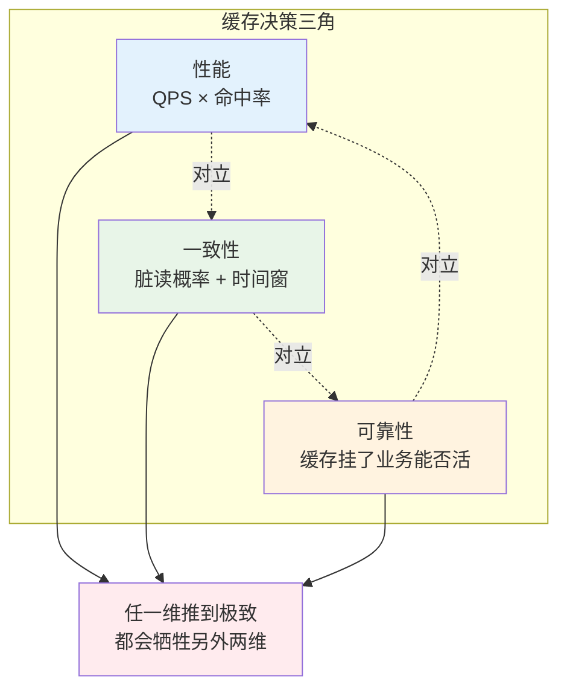

**三维含义**：

| 维度 | 指标 | §1 团队现状 |
|---|---|---|
| **性能** | 命中率 × QPS 承载 | 平时 98% × 5w = 优秀 |
| **一致性** | 允许的脏读时间窗 | 商品数据允许秒级不一致 |
| **可靠性** | 缓存挂了业务的降级能力 | ❌ 没有降级 → 雪崩 |

**三维互斥**：
- 想要**极致性能** → 长 TTL + 大容量 → 一致性变差（旧数据保留久）。
- 想要**强一致性** → 写 DB 同步删缓存 → 每次写都要保证成功 → 可靠性下降（写失败怎么办？）。
- 想要**极致可靠** → 多级冗余 + 降级 → 一致性变差（多副本同步问题）。

### 2.2 为什么这么切

**疑惑**：为什么用性能/一致性/可靠性，不用"容量、成本"这些指标？

**论证**：
1. **容量**是"性能维度的下位变量"——容量决定了缓存能装多少热点，但缓存价值最终体现在命中率×QPS。
2. **成本**是每个维度都要考虑的横切关注点，不是独立维度。
3. **性能、一致性、可靠性**是缓存的三大功能承诺——**任何缓存架构都可以按这三维度打分**。

**结论**：**缓存 = 用空间换时间 + 用最终一致性换性能**。核心矛盾就在这三维上打转。**§1 那个团队重性能（长 TTL 高命中）但轻可靠性（无降级），最终付出 1.2 亿代价**。

## 3. 局部性原理

### 3.1 时间与空间局部性

**疑惑**：为什么缓存能有效？如果访问是"完全随机"的，缓存有意义吗？

**论证**：真实世界的访问从来不是随机的，服从两类局部性：

- **时间局部性**：**刚访问过的数据近期会再次被访问**。
  - 用户看了商品 A，10 秒内很可能再看一次 A。
  - 这是 LRU 算法的物理基础。

- **空间局部性**：**相邻数据会被一起访问**。
  - 用户看了商品 A，很可能接着看商品 A 的相关推荐 B、C。
  - 这是 CPU L1 cache 的核心，也是预取策略的依据。

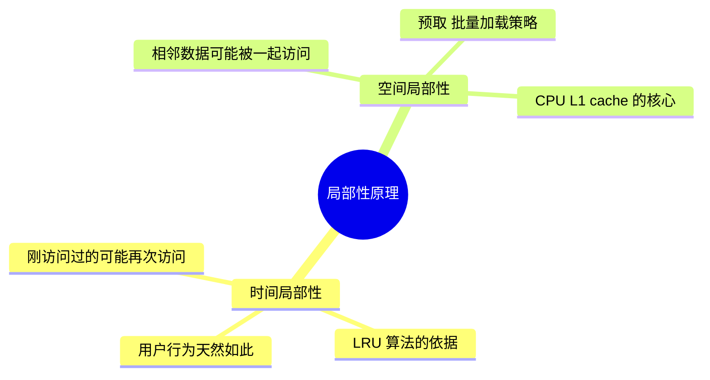

**结论**：**局部性是所有缓存的物理基础**。如果访问真的完全随机，命中率就等于容量占比，缓存的价值只是"更快的存储介质"。

### 3.2 帕累托 80/20 法则

局部性在实际系统里体现为**帕累托法则**：**20% 的 Key 承担 80% 的访问**。

**疑惑**：这是经验值还是有数学根源？

**论证**：Zipf 分布——大量真实数据（网页访问、单词频率、商品热度）都服从：

$$
f(k) \propto \frac{1}{k^s}
$$

- $k$：热度排名（第 k 热的 Key）
- $s$：分布参数（通常 $s \in [0.8, 1.2]$）

对 Zipf 分布做积分：**前 20% 的 Key 累计访问量占总访问的 70%-90%**（$s=1$ 时正好 80%）。这就是帕累托 80/20 的数学根源。

**实战应用**：**缓存容量不需要装下全部数据，能装 20% 热点就有 80% 命中率**。这就是"缓存的性价比"——**用 20% 的存储换 80% 的性能**。

### 3.3 命中率的数学表达

设缓存容量为 $C$（能装 $C$ 个 Key），总 Key 数为 $N$，请求分布服从参数 $s$ 的 Zipf。**命中率**：

$$
H(C) = \sum_{k=1}^{C} \frac{1/k^s}{\sum_{i=1}^{N} 1/i^s}
$$

数值分析（$N = 1000$）：

| 容量占比 $C/N$ | s=0.8 命中率 | s=1.0 命中率 | s=1.2 命中率 |
|---|---|---|---|
| 5% | 43% | 62% | 78% |
| 10% | 53% | 71% | 84% |
| 20% | 65% | 80% | 90% |
| 50% | 82% | 92% | 97% |
| 100% | 100% | 100% | 100% |

**关键结论**：
1. **热度越集中（s 越大），少量缓存就能吃到高命中**。
2. **命中率 20% → 80% 需要容量占比 5% → 20%**（4 倍容量）。
3. **命中率 80% → 95% 需要容量占比 20% → 50%**（2.5 倍容量）。
4. **命中率 95% → 99% 需要容量占比 50% → 90%**（1.8 倍容量）——**边际收益递减**。

**指导设计**：**追求 90% 命中足矣，追 99% 是钱包黑洞**。除非业务特殊（如秒级金融），95% 是性价比甜蜜点。

### 3.4 分层延迟数量级

不同存储介质延迟对比：

| 层级 | 物理位置 | 典型延迟 | 容量 | 每 GB 成本 |
|---|---|---|---|---|
| CPU L1 | 芯片内 | 1 ns | 32-64 KB | 天价 |
| CPU L2/L3 | 芯片内 | 10 ns | 数 MB | 极贵 |
| 内存 DRAM | 主板 | 100 ns | GB-TB | 贵 |
| 本地缓存（Caffeine） | 进程内存 | 200 ns | GB | 贵 |
| 分布式缓存（Redis） | 独立集群 | 100 μs (1e5 ns) | TB | 中 |
| SSD | 本机磁盘 | 100 μs | TB | 便宜 |
| HDD | 本机磁盘 | 10 ms (1e7 ns) | TB-PB | 极便宜 |
| 网络 DB | 独立服务 | 10 ms | PB | 极便宜 |

**关键洞察**：**每两层间延迟差约 1-3 个数量级**。这就是分层的根本依据——**每一层都比下一层快 10-1000 倍**。

**推论**：缓存的意义 = 用高层的少量容量，吃到 80%+ 的请求，只把 20% 少量请求打到下层。**平均延迟 = H × T_hit + (1-H) × T_miss**。

**§1 团队正常情况**：$0.98 \times 1\text{ms} + 0.02 \times 50\text{ms} = 1.98\text{ms}$
**§1 团队雪崩情况**：$0.12 \times 1\text{ms} + 0.88 \times 50\text{ms} = 44.12\text{ms}$（22 倍延迟放大）

## 4. 淘汰算法演进

### 4.1 FIFO 的原始简单

**FIFO（First In First Out）**：先进先出，最老的被淘汰。

**问题**：**违反时间局部性**——一个刚被访问的 Key，如果它是最早进入缓存的，会被淘汰。

**数学证明它次优**：考虑访问序列 `[A, B, C, D, A, A, A, A]`，容量 2：

```
访问 A:  [A]         miss
访问 B:  [A, B]      miss
访问 C:  [B, C]      miss  ← A 被 FIFO 淘汰
访问 D:  [C, D]      miss
访问 A:  [D, A]      miss  ← A 又要 miss
访问 A:  [D, A]      hit
访问 A:  [D, A]      hit
访问 A:  [D, A]      hit
命中率: 3/8 = 37.5%
```

**LRU 表现**：命中率 62.5%（下节详细看）。**FIFO 只有在访问模式接近 FIFO 时才优——现实中很少**。

### 4.2 LRU 数据结构证明

**LRU（Least Recently Used）**：淘汰最久未使用的。

**核心问题**：**如何 O(1) 找到某个 Key、O(1) 移动到"最近使用"、O(1) 淘汰"最久未使用"**？

**疑惑**：只用 HashMap 或只用链表行不行？

**论证**：

| 数据结构 | get O | put O | 淘汰 O | 说明 |
|---|---|---|---|---|
| 单纯 HashMap | O(1) | O(1) | **O(n)** | 找"最久未用"要遍历 |
| 单纯双向链表 | **O(n)** | O(1) | O(1) | 查 Key 要遍历 |
| **HashMap + 双向链表** | O(1) | O(1) | O(1) | 完美 |

**核心组合**：
- **HashMap**：Key → Node 快速定位（O(1)）
- **双向链表**：维护访问顺序，头部最新、尾部最旧，可 O(1) 移动/淘汰

```
HashMap:                    双向链表:
{                          
  "A" → Node(A),            head ↔ Node(A) ↔ Node(B) ↔ Node(C) ↔ tail
  "B" → Node(B),                  最新                    最旧
  "C" → Node(C),
}

get("B"):                   
  1. HashMap 找到 Node(B)          O(1)
  2. 从链表当前位置摘下            O(1)（双向链表可以）
  3. 移到 head 后                  O(1)
  
put("D"), 容量满:
  1. 找 tail 前一个节点 Node(C)    O(1)
  2. 从链表和 HashMap 删除 Node(C) O(1)
  3. 新 Node(D) 加到 head 后       O(1)
```

**代码实现**：

```java
class LRUCache<K, V> {
    private final int capacity;
    private final Map<K, Node<K, V>> map = new HashMap<>();
    private final Node<K, V> head = new Node<>(null, null);   // 哨兵
    private final Node<K, V> tail = new Node<>(null, null);   // 哨兵
    
    public LRUCache(int capacity) {
        this.capacity = capacity;
        head.next = tail;
        tail.prev = head;
    }
    
    public V get(K key) {
        Node<K, V> node = map.get(key);
        if (node == null) return null;
        moveToHead(node);  // O(1) 移到头部
        return node.value;
    }
    
    public void put(K key, V value) {
        Node<K, V> node = map.get(key);
        if (node == null) {
            if (map.size() >= capacity) {
                Node<K, V> old = tail.prev;
                removeNode(old);   // 淘汰尾部
                map.remove(old.key);
            }
            node = new Node<>(key, value);
            map.put(key, node);
            addToHead(node);
        } else {
            node.value = value;
            moveToHead(node);
        }
    }
    
    private void addToHead(Node<K, V> node) {
        node.prev = head; node.next = head.next;
        head.next.prev = node; head.next = node;
    }
    private void removeNode(Node<K, V> node) {
        node.prev.next = node.next; node.next.prev = node.prev;
    }
    private void moveToHead(Node<K, V> node) { removeNode(node); addToHead(node); }
    
    static class Node<K, V> { K key; V value; Node<K, V> prev, next; 
        Node(K k, V v) { key = k; value = v; } }
}
```

**结论**：**LRU = HashMap（快速定位）× 双向链表（快速移动/淘汰）的联合**。这是经典面试题的本质考察。

### 4.3 LFU 的历史包袱

**LRU 的缺陷**：**偶发扫描会污染缓存**。假设有个后台任务遍历了 100 万条商品数据，LRU 会认为它们全部是"最近使用"，把真正的热点 Key 挤出去。

**LFU（Least Frequently Used）**：淘汰访问次数最少的。能解决扫描污染——扫描 Key 的访问频次只有 1，会先被淘汰。

**LFU 的新问题**：**历史包袱**。一个早期的热点即使现在不再访问，累计频次也很高，很难被淘汰。

用一个数值例子：

```
时间 T=0～10:  Key "A" 被访问 1000 次（早期热点）
时间 T=10～20: Key "A" 停止访问，Key "B" 变热，被访问 200 次

LFU 状态:
  A 的计数: 1000
  B 的计数: 200
  → 淘汰 B（尽管 B 才是当下热点）
```

**结论**：LRU 和 LFU 各有软肋，需要**综合两者的优势**。

### 4.4 W-TinyLFU 联合最优

**W-TinyLFU（Caffeine 采用）**：**LRU + LFU + 频率估计**的组合拳。

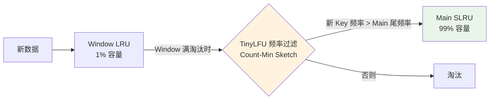

**核心机制**：
1. **Window LRU（1% 容量）**：新数据先进这里"候场"，避免刚进就被高频老数据 PK 掉。
2. **TinyLFU 频率过滤**：Window 淘汰时，估计新 Key 的历史频次，只有比 Main 区尾部频次高的才能进 Main。
3. **Main SLRU（99% 容量，分段 LRU）**：主缓存区，进一步分 Protected（20%）和 Probation（80%）。

**Count-Min Sketch —— TinyLFU 的核心**：

**疑惑**：怎么用极小空间估计海量 Key 的访问频次？

**论证**：Count-Min Sketch 用 $d$ 个哈希函数 + $w$ 列的二维计数矩阵：

```
       col_0  col_1  ...  col_{w-1}
row_0:  [ ]    [ ]  ...    [ ]
row_1:  [ ]    [ ]  ...    [ ]
...
row_{d-1}: [ ] [ ]  ...    [ ]
```

- **访问 Key K 时**：$d$ 个哈希函数把 K 映射到 $d$ 列，每个位置计数 +1。
- **查询 K 的频次时**：取 $d$ 个位置的**最小值**（Count-Min 的名字来源）。

**空间**：$d \times w$ 个 int，通常 $d=4, w=2^{16} = 65536$，总占用 **1MB 就能估计几亿个 Key 的频次**。

**误差保证**：设总访问数 N，$\varepsilon = e/w$，$\delta = e^{-d}$，则：

$$
P(\hat{f}(K) \leq f(K) + \varepsilon N) \geq 1 - \delta
$$

$d=4, w=65536, N=10^9$ 时，误差 $\varepsilon N \approx 40$——**几亿次访问里估计误差不超过 40，完全够用**。

**Aging 机制**：为了应对"历史包袱"，Count-Min Sketch 每积累到 $10 \times C$ 次访问就把所有计数 **除 2**（衰减）。这样早期热点会自然褪色。

**结论**：**W-TinyLFU = 空间效率（Count-Min Sketch）+ 时效性（Aging）+ 抗污染（Window + 频率准入）**。实测命中率比 LRU 高 15-25%——**这就是 Caffeine 性能远超 Guava Cache 的原因**。

## 5. 三层缓存架构

### 5.1 L0-L4 分层依据

多级缓存架构：

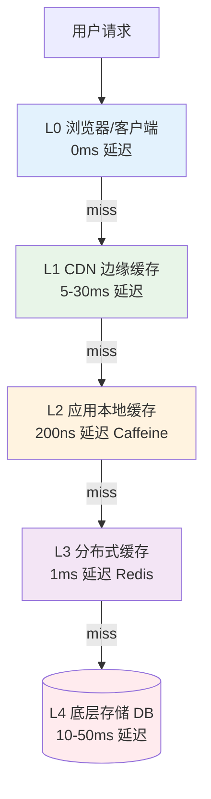

**每一层存在的物理边界依据**：

| 层级 | 物理位置 | 延迟 | 容量 | 每 GB 成本 | 代表 |
|---|---|---|---|---|---|
| L0 客户端 | 用户设备 | 0ms | MB 级 | 免费 | 浏览器 / App |
| L1 CDN | 边缘节点 | 5-30ms | TB 级 | 便宜 | Cloudflare / Akamai |
| L2 本地缓存 | 应用进程内 | 微秒级 | GB 级 | 内存价 | Caffeine / Guava |
| L3 分布式缓存 | 独立集群 | 毫秒级 | TB 级 | 内存价 | Redis / Memcached |
| L4 存储 | 持久化 | 10-100ms | PB 级 | 磁盘价 | MySQL / HBase |

**分层的数学根据**：延迟每高一个数量级，就需要新的一层来"截流"。**每层截住 80% 请求，只把 20% 打到下一层**——这就是分层的边际最优。

### 5.2 多级缓存数据流

**读取流程**：

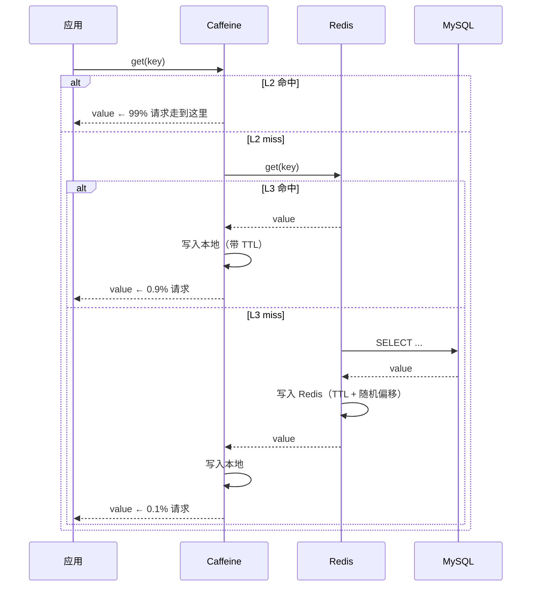

**关键点**：
1. **写入是"回填"**——每次 miss 都会把结果**沿路径反向写入所有上层**。
2. **每层 TTL 不同**：L2 通常几秒到几分钟（跨节点一致性），L3 几十分钟到几小时。
3. **TTL 必须加随机偏移**——避免 §1 那样同时过期。

**写入流程**（Cache-Aside 模式）：

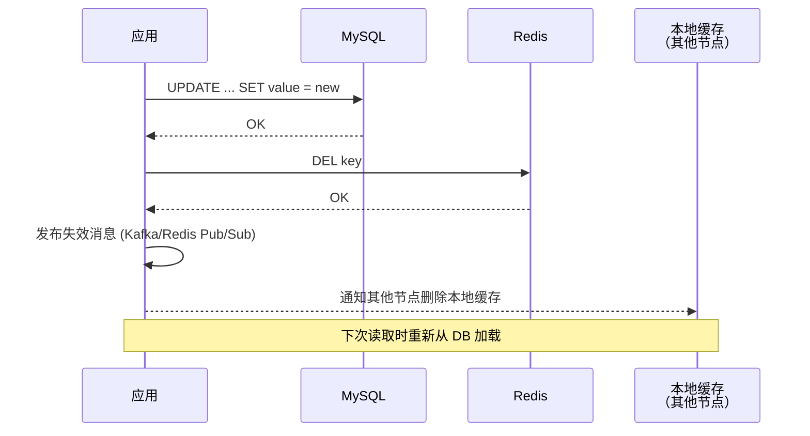

### 5.3 Caffeine + Redis 组合

**为什么 Caffeine + Redis 是 Java 生态"最佳组合"**？

**Caffeine 优势**：
- W-TinyLFU 算法（§4.4）命中率极高
- 进程内内存访问（200 ns 级别）
- 强并发（RingBuffer 无锁读写）

**Redis 优势**：
- 跨节点共享（多个应用实例看到同一份数据）
- 丰富数据结构（String / Hash / List / Set / ZSet）
- 持久化（RDB + AOF）
- 集群模式（Cluster / Sentinel）

**组合优势**：
- L2 (Caffeine) 抗**极高频热点**（避免打到 Redis）
- L3 (Redis) 抗**中低频请求**（避免打到 DB）
- 单机崩溃（L2 挂）→ 只影响该节点，L3 兜底
- Redis 崩溃（L3 挂）→ L2 仍能扛 80% 请求

**典型配置**：

```java
Cache<String, Product> l2 = Caffeine.newBuilder()
    .maximumSize(10_000)              // 10w 热点商品
    .expireAfterWrite(5, MINUTES)     // 5 分钟 TTL
    .recordStats()                    // 开启监控
    .build();
```

```
redis-cli:
  maxmemory 32gb
  maxmemory-policy allkeys-lru        # 淘汰策略
```

### 5.4 命中率联合估算

**多级缓存的联合命中率**是每一层的乘积逆运算：

$$
H_{\text{total}} = 1 - (1 - H_{L2})(1 - H_{L3})
$$

假设 $H_{L2} = 0.85$（L2 命中 85%），$H_{L3} = 0.90$（miss 之后打到 L3 命中 90%）：

$$
H_{\text{total}} = 1 - 0.15 \times 0.10 = 1 - 0.015 = 98.5\%
$$

**只有 1.5% 请求打到 DB**——这就是分层的威力。

**平均延迟**：

$$
T_{\text{avg}} = H_{L2} T_{L2} + (1-H_{L2}) H_{L3} T_{L3} + (1-H_{L2})(1-H_{L3}) T_{DB}
$$

代入数据：
- $T_{L2} = 0.2\text{μs}, T_{L3} = 1\text{ms}, T_{DB} = 30\text{ms}$
- $T_{\text{avg}} = 0.85 \times 0.0002 + 0.15 \times 0.9 \times 1 + 0.15 \times 0.1 \times 30 = 0.135 + 0.15 \times 3 = 0.585\text{ms}$

**99% 请求 < 1ms**——这是所有电商详情页追求的性能基线。

## 6. 一致性方案对比

### 6.1 Cache-Aside 主流选

**Cache-Aside** 是最常用的一致性模式。**读**：先查缓存，miss 则查 DB 并回填。**写**：先写 DB，再删缓存。

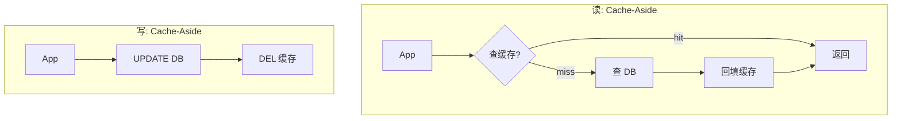

**优点**：简单、通用、绝大多数业务够用。

**缺点**：写路径下有并发脏读窗口（下节详解）。

### 6.2 Write-Through 强一致

**Write-Through**：**缓存层封装读写**，写操作**同步**穿透到 DB。

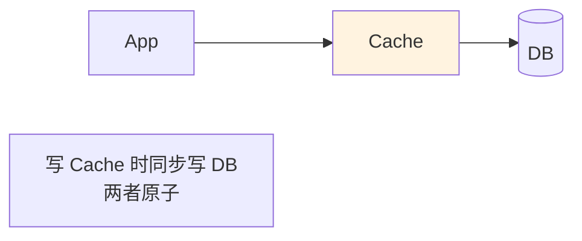

**优点**：**缓存和 DB 强一致**（同步写）。

**缺点**：
- 每次写都要等 DB 返回，**写延迟高**（等于 DB 写延迟）。
- 需要缓存层封装事务——**实现复杂**。
- 写入 QPS 上限受 DB 制约。

**适用**：写少读多、强一致性要求、缓存作为主访问入口（如 Ehcache + JPA）。

### 6.3 Write-Behind 高吞吐

**Write-Behind（Write-Back）**：**写只写缓存，DB 异步刷回**。

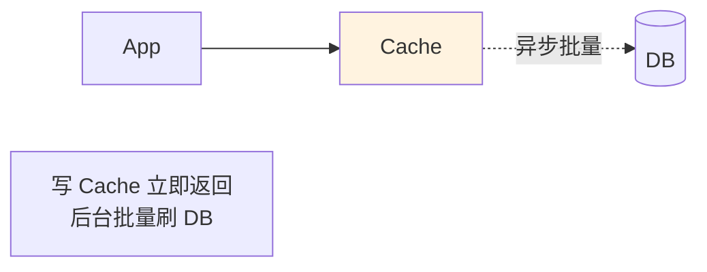

**优点**：**极致写性能**（缓存内存写 ~200ns），可以聚合批量写 DB。

**缺点**：
- 缓存挂了 **数据可能丢失**（未刷回 DB 的部分）。
- 缓存和 DB 之间**弱一致**。
- 实现复杂（需要脏数据队列、失败重试）。

**适用**：**高写入低一致性场景**——如日志、埋点、计数器。CPU 的 L1 write-back 就是这个思路。

### 6.4 先写 DB 后删缓存

**Cache-Aside 里"先删缓存"和"后删缓存"之争**：

**方案 A：先删缓存再写 DB** ❌

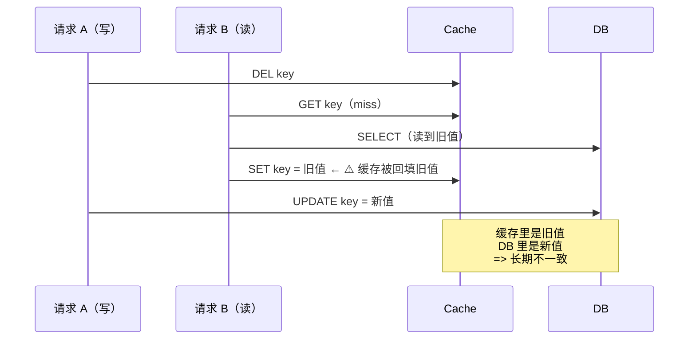

**问题**：并发场景下缓存被脏值污染，**直到下次过期才恢复**——不一致时间窗 = TTL（可能几十分钟）。

**方案 B：先写 DB 再删缓存** ✅

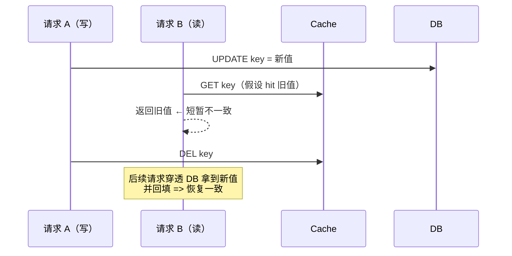

**问题**：**只有一个极短的不一致窗口**——请求 B 读到旧值 → 缓存被删 → 下次请求就一致。窗口 = 步骤"UPDATE 到 DEL"之间的时长（通常 < 10ms）。

**结论**：**先写 DB 再删缓存**是 Cache-Aside 的最优做法。**极端场景**（10ms 都不能容忍）叠加 **Double Delete**：

```java
public void update(Key k, Value v) {
    db.update(k, v);
    cache.delete(k);
    // Double Delete: 延迟 500ms 再删一次，防止刚删完又被回填旧值
    scheduledExecutor.schedule(() -> cache.delete(k), 500, MILLISECONDS);
}
```

## 7. 三大经典问题

### 7.1 缓存穿透原理

**定义**：请求查询**根本不存在的数据**，缓存和 DB 都没有，每次都打到 DB。

**典型场景**：
- 黑产扫描接口，用各种不存在的 ID 探测。
- 恶意攻击构造巨量不存在的 Key。

**数学模型**：设合法 Key 数 $N$，恶意 Key 数 $M \gg N$，攻击 QPS $Q$。**打到 DB 的 QPS**：

$$
Q_{\text{DB}} = Q \times \frac{M}{M+N} \approx Q
$$

**几乎 100% 打到 DB**——常规缓存完全失效。

**解决方案**：

**方案 1：空值缓存**
DB 也查不到时，缓存一个"空对象"（TTL 短）：

```java
Object result = cache.get(key);
if (result == NULL_MARKER) return null;   // 空值命中
if (result != null) return result;

result = db.query(key);
if (result == null) {
    cache.set(key, NULL_MARKER, 300);     // 空值 TTL 短（5 分钟）
} else {
    cache.set(key, result, 3600);
}
return result;
```

**缺点**：恶意 Key 太多时**缓存被空值撑爆**。

**方案 2：布隆过滤器**（详见 §7.4）——**在 Redis 之前挡一道**。

### 7.2 缓存击穿原理

**定义**：**单个热 Key 突然过期**，瞬间大量并发请求打到 DB。

**数学模型**：设热 Key 的 QPS 为 $Q_{\text{hot}}$，DB 单次查询耗时 $T_{\text{db}}$。**过期瞬间打到 DB 的并发**：

$$
\text{Concurrent} = Q_{\text{hot}} \times T_{\text{db}}
$$

若 $Q_{\text{hot}} = 10\text{w/s}, T_{\text{db}} = 30\text{ms}$，**并发 = 3000**——**足够压垮 DB**。

**解决方案**：

**方案 1：分布式锁**——**只让第一个请求查 DB**：

```java
public Object getWithLock(String key) {
    Object v = cache.get(key);
    if (v != null) return v;
    
    // 尝试拿分布式锁
    if (redis.setnx("lock:" + key, "1", 30)) {
        try {
            v = db.query(key);
            cache.set(key, v, 3600);
            return v;
        } finally {
            redis.del("lock:" + key);
        }
    } else {
        // 没拿到锁，等一下重试
        Thread.sleep(100);
        return getWithLock(key);
    }
}
```

**方案 2：热 Key 永不过期 + 后台异步更新**——**根本消灭"过期瞬间"**：

```java
// 定时任务，每 30 分钟主动更新热 Key
@Scheduled(fixedRate = 30 * 60 * 1000)
void refreshHotKeys() {
    for (String key : hotKeys) {
        Object v = db.query(key);
        cache.set(key, v);  // 不设 TTL
    }
}
```

**选型**：方案 1 适用于**热 Key 事先不知道**的场景；方案 2 适用于**热 Key 数量少可预知**的场景（如排行榜）。

### 7.3 缓存雪崩原理

**定义**：**大量 Key 同时过期** + 流量打到 DB → 全站雪崩。这就是 §1 的 1.2 亿场景。

**数学模型**：设 $M$ 个 Key 在同一时刻过期，全站 QPS $Q$，其中 $Q_{\text{miss}}$ 命中这批 miss。**打到 DB 的 QPS**：

$$
Q_{\text{DB}} = Q \times \frac{M}{N}
$$

若 $M = N$（全部同时过期），**100% 流量打到 DB**。DB 崩了，缓存回填失败，**下一波流量继续打 DB**——形成正反馈**雪崩**。

**解决方案三件套**：

| 方案 | 做法 | 防什么 |
|---|---|---|
| **TTL 随机化** | TTL = 基础时间 + 随机 0-60 分钟 | 防止同时过期（治本） |
| **多级缓存** | L2 本地 + L3 Redis | L3 挂了 L2 兜底 |
| **限流熔断** | DB 前加限流 | 即使打到 DB 也不会崩 |

```java
// ❌ §1 那一行反例
redis.setex(key, 86400, value);

// ✅ 正例
long ttl = 86400 + ThreadLocalRandom.current().nextInt(3600);
redis.setex(key, ttl, value);
```

**就这一行代码差别，避免 1.2 亿损失**。

### 7.4 布隆过滤器解剖

**布隆过滤器（Bloom Filter）**：用极小空间**判断 Key 是否可能存在**。

**数据结构**：一个 $m$ 位的位数组 + $k$ 个哈希函数。

**添加**：$k$ 个哈希函数把 Key 映射到 $k$ 个位置，全部置 1。

**查询**：$k$ 个位置全为 1 → **可能存在**；有任何一个为 0 → **一定不存在**。

```
位数组 (m=16 位): [0][0][0][0][0][0][0][0][0][0][0][0][0][0][0][0]

添加 "cat" (哈希到位置 1, 5, 10):
             [0][1][0][0][0][1][0][0][0][0][1][0][0][0][0][0]

添加 "dog" (哈希到位置 3, 7, 12):
             [0][1][0][1][0][1][0][1][0][0][1][0][1][0][0][0]

查询 "cat":  位置 1、5、10 都是 1 → 可能存在 ✓
查询 "fish": 位置 4、8、14 都是 0 → 一定不存在 ✓（不用查 DB！）
查询 "bird": 位置 3、5、12 都是 1（"cat"和"dog"污染） → 假阳性 ⚠️
```

**关键性质**：
- **假阳性**（说存在实际不存在）：有一定概率
- **假阴性**（说不存在实际存在）：**不可能**——正是这个性质让它能用作 DB 前置过滤器

**假阳性率公式**：

$$
P_{fp} \approx \left(1 - e^{-kn/m}\right)^k
$$

- $n$：已插入元素数
- $m$：位数组大小
- $k$：哈希函数个数

**最优 $k$**：$k^* = \frac{m}{n} \ln 2$

**实用数值**：**1 亿 Key，假阳性率 1%**：
$$
m = -\frac{n \ln P_{fp}}{(\ln 2)^2} = \frac{10^8 \times \ln 100}{0.48} \approx 9.6 \times 10^8 \text{ bits} = 120 \text{ MB}
$$

$k = \frac{9.6 \times 10^8}{10^8} \times 0.693 \approx 7$ 个哈希函数

**120MB 存 1 亿 Key**——比 Redis 存 1 亿 Key 的实际数据（几十 GB）便宜 100 倍。

**§1 团队重构后的方案**：

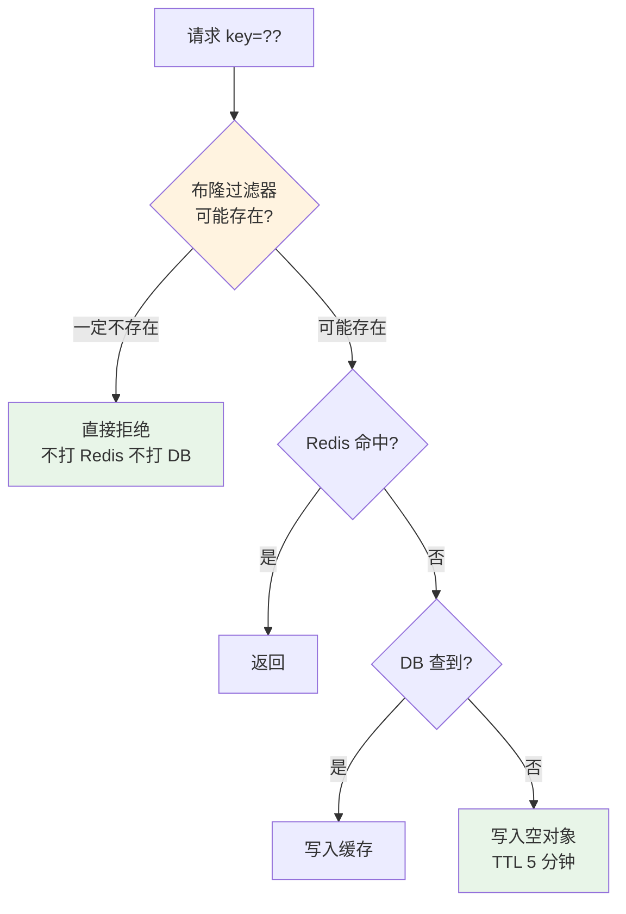

**双层防护**：**布隆过滤器（拦不存在的） + 空值缓存（兜底假阳性）**。

## 8. 常见反例陷阱

### 8.1 大 Key 反例

**反例**：某 App 把"用户全部好友列表"存为一个 Redis Hash，热门用户的好友列表达 50w 条 / 80MB。

**问题**：
- 一次 `HGETALL` 操作阻塞 Redis 主线程数百毫秒——**Redis 是单线程模型**，一个大 Key 会让所有其他请求排队。
- 网络传输 80MB 占满带宽——**千兆网卡 = 125MB/s**，一次传输占用 640ms。
- 主从同步时一个 Key 阻塞全集群——**主从复制是单线程**。

**解决**：
1. **拆分大 Key**：`friends:userId` → `friends:userId:0/1/2/...`（按 hash 分片）
2. **改用 SCAN**：分批读取而不是 HGETALL
3. **监控 Key 大小**：`redis-cli --bigkeys` 定期扫描告警

**规则**：**单 Key 大小 < 10KB**。超过就要拆。

### 8.2 热 Key 反例

**反例**：双 11 期间某爆款商品详情 Key 单点 QPS 达 50w，**单 Redis 节点被打爆**。

**问题**：Redis 集群模式下**一个 Key 只能落在一个节点**，无法通过加节点水平扩展。

**解决：热 Key 副本拆分**：

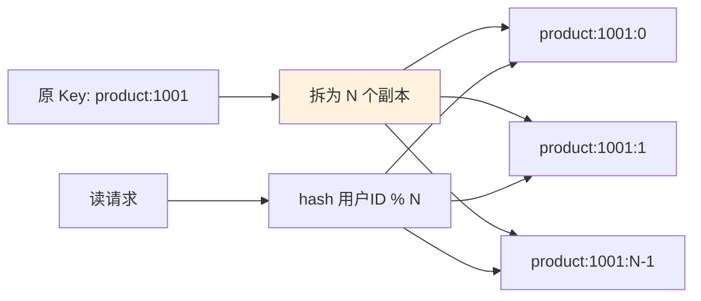

**关键代码**：

```java
int shard = userId.hashCode() % N_SHARDS;
String key = "product:1001:" + shard;
```

**代价**：写多份（写放大 N 倍）。**收益**：读 QPS 可以水平扩展 N 倍。

**热 Key 判定**：QPS > 1w/s 就是热 Key。

### 8.3 一致性反例

**反例**：用"先删缓存再写 DB"模式，并发场景下出现脏数据（详见 §6.4 方案 A 的时序图）。

**解决**：**先写 DB 再删缓存 + Double Delete 兜底**。

### 8.4 缓存挂了业务崩

**反例**：Redis 挂了，应用直接报错，整站不可用——**缓存反而成了单点**。

**问题**：**没有降级路径**。缓存本来是为了加速，反而变成了刚需。

**解决**：

```java
public Object get(String key) {
    try {
        Object v = cache.get(key);
        if (v != null) return v;
    } catch (Exception e) {
        log.warn("Cache failure, fallback to DB", e);
        metrics.increment("cache.failure");
    }
    
    // 降级：直读 DB + 限流保护
    if (!rateLimiter.tryAcquire()) {
        throw new BusinessException("System busy");   // 拒绝多余请求
    }
    return db.query(key);
}
```

**关键机制**：
1. **catch 异常**：缓存挂了不 throw 到业务
2. **降级读 DB**：短暂承压不崩
3. **限流保护**：避免全流量打 DB → 二次雪崩

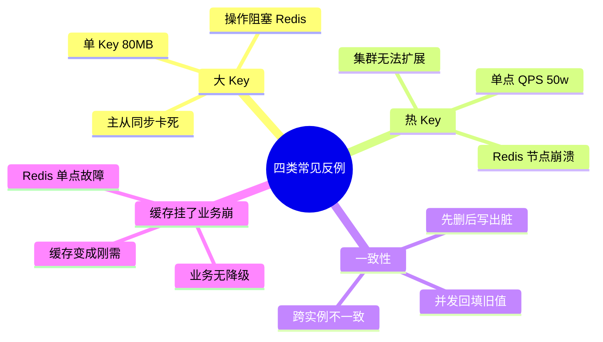

## 9. 客户端 K-V 缓存库设计

### 9.1 为什么客户端要独立成章

前 8 章讨论的都是**服务端进程内 / 跨节点**的缓存（Caffeine、Redis、Memcached）。它们有个共同前提：**服务永不下电，进程正常退出，缓存挂了不影响持久化**。

**但客户端（App、桌面软件、浏览器）不一样**：
- **随时会被杀**：Android 后台被 LMK、iOS 内存告警被 kill、用户手动划掉、系统崩溃。
- **数据必须持久化**：用户登录 token、订单草稿、埋点日志——**丢一次就是丢一次**，没有"下次重刷 DB"这条路。
- **进程可能同时多开**：主进程 + 推送进程 + WebView 进程，都要读写同一份配置。
- **磁盘 IO 是主要瓶颈**：不再是"内存 vs Redis"的量级差，而是"内存 vs 磁盘/闪存"的 4-5 个数量级差。

**真实事故**：某电商 App 使用 `SharedPreferences.commit()` 在主线程写入 20KB 的用户偏好，用户下单点击"提交"瞬间——**主线程被磁盘 fsync 阻塞 800ms，用户以为卡死连点 3 次，触发重复下单**。事后统计：**这一 bug 每天导致 0.3% 订单重复，一年直接经济损失 400 万**。

```
用户操作           SP.commit() 主线程     结果
─────────────────────────────────────────────────
T=0     点击提交       写入 20KB SP        主线程 ANR 800ms
T=200   以为没反应连点  又触发一次 commit    第 2 次订单进队列
T=400   再次连点        第 3 次 commit      第 3 次订单进队列
T=800   界面终于响应    提示"提交成功"       实际下了 3 单
```

**根因**：SP 有全量写入 + 主线程磁盘 IO 两大原罪（§9.2.1 详解）。**这个事故点出了客户端 K-V 库的核心矛盾——不是"命中率"，而是"性能 vs 崩溃安全 vs 跨进程一致"的三角权衡**。

**客户端 vs 服务端缓存核心差异**：

| 维度 | 服务端（§3~§8） | 客户端（§9） |
|---|---|---|
| **进程生命周期** | 长驻，扩容 | 随时被杀 |
| **数据丢失代价** | miss 一次，重刷 DB | 永久丢失 |
| **一致性对手** | 多副本、多节点 | 多进程、崩溃、闪断 |
| **性能瓶颈** | 网络 RTT（1ms） | 磁盘 IO（10-100ms）+ 序列化 |
| **典型代表** | Redis / Caffeine | SP / DataStore / MMKV |
| **核心机制** | LRU / 布隆 / TTL | mmap / WAL / CRC / 事务 |

本节回答 13 个客户端 K-V 库的关键设计问题，从**四大主流方案的横评**开始，再进入**从零设计一个 K-V 框架的思考**，最后回落到**选型速查表**。

### 9.2 四大方案横向对标

#### 9.2.1 SharedPreferences 的原罪

**SP 是 Android 最古老、也是最饱受诟病的 K-V 方案**。理解它的坑，就理解了后续 DataStore / MMKV 存在的必要性。

**API 表象**：

```java
SharedPreferences sp = getSharedPreferences("user", MODE_PRIVATE);
sp.edit().putString("name", "yc").apply();
String name = sp.getString("name", "");
```

看起来极简，但打开源码会发现 SP 有**六重原罪**：

**原罪 1：全量加载**

SP 首次调用 `getSharedPreferences` 时，会**把整个 XML 文件一次性读入内存的 HashMap**：

```java
// SharedPreferencesImpl.loadFromDisk() 简化
private void loadFromDisk() {
    synchronized (mLock) {
        BufferedInputStream str = new BufferedInputStream(
            new FileInputStream(mFile), 16 * 1024);
        map = XmlUtils.readMapXml(str);   // 全量解析 XML
        mMap = map;
    }
}
```

**代价**：一个 100KB 的 SP 文件，首次访问要**解析 100KB XML → HashMap**，Pixel 3 上实测 30-80ms。**冷启动如果读 5 个 SP 文件，直接 300ms 起步**。

**原罪 2：全量写入**

改一个 Key，**整个 HashMap 全部序列化重写**：

```java
// SharedPreferencesImpl$EditorImpl.commitToMemory() → writeToFile()
private void writeToFile(...) {
    FileOutputStream str = createFileOutputStream(mFile);
    XmlUtils.writeMapXml(mcr.mapToWriteToDisk, str);  // 全量写
    FileUtils.sync(str);                              // fsync 到磁盘
}
```

**代价**：100KB 的 SP，改 1 Byte 也要写 100KB。且 fsync 是**同步刷盘**——手机闪存慢时可能几百 ms。

**原罪 3：`commit` 阻塞主线程**

`commit()` 是同步的，直接在调用线程执行 IO。**上述 400 万重复下单事故的直接原因**。

**原罪 4：`apply` 引发 ANR**

`apply()` 表面异步，实际有个致命回调——**在 `Activity.onPause()` / `Service.onStop()` 时，AMS 会等待所有 `apply` 任务完成**（源码 `QueuedWork.waitToFinish()`）：

```java
// ActivityThread.handlePauseActivity()
// ActivityThread.handleStopService()
QueuedWork.waitToFinish();   // ← 阻塞主线程，直到所有 apply 落盘
```

**后果**：如果 apply 队列积压（10 个大 SP 各 100KB），页面切换时**主线程阻塞几秒直接 ANR**。这是线上 ANR Top-5 的常见来源。

**原罪 5：非线程安全 + 读写锁开销**

SP 内部用 `synchronized (mLock)` 保护读写：

```java
public String getString(String key, String defValue) {
    synchronized (mLock) {
        awaitLoadedLocked();          // 等加载完成
        String v = (String) mMap.get(key);
        return v != null ? v : defValue;
    }
}
```

**问题**：
- **读写共用同一把锁**，读多也会互相阻塞。
- `awaitLoadedLocked()` 里如果加载没完成，**主线程读会阻塞在这个锁上**——冷启动读 SP 触发 ANR 的第二种姿势。

**原罪 6：多进程不安全**

`MODE_MULTI_PROCESS` 早在 API 23 就被标记为 deprecated。SP 的**内存 HashMap 是进程私有**——A 进程写完，B 进程根本感知不到，除非 B 进程重建 SP 实例。且并发写入会**互相覆盖**（没有跨进程锁）。

**六原罪汇总表**：

| 原罪 | 表现 | 根因 |
|---|---|---|
| ① 全量加载 | 冷启动 300ms+ | XML 全解析 |
| ② 全量写入 | 改 1B 写全部 | 无增量能力 |
| ③ commit 阻塞 | 主线程 800ms ANR | 同步 fsync |
| ④ apply 延迟 | 页面切换 ANR | QueuedWork.waitToFinish |
| ⑤ 锁粗粒度 | 读被写阻塞 | 全对象 synchronized |
| ⑥ 多进程失效 | 数据错乱 | 进程私有内存 |

**这六条构成了 DataStore、MMKV 存在的历史动机——它们分别从"API 现代化"和"性能极致化"两个方向解决 SP 的痛点**。

#### 9.2.2 DataStore 的现代替代

**Google 官方在 2020 年推出 DataStore**，明确定位为**SP 的替代品**。它有两种模式：

- **Preferences DataStore**：K-V 结构，无 schema，可平滑迁移 SP。
- **Proto DataStore**：基于 Protobuf 的强类型 schema。

**核心改进 vs SP**：

| 维度 | SP | DataStore |
|---|---|---|
| API | 阻塞 `commit()` / 半异步 `apply()` | **Coroutine + Flow**，全异步 |
| 事务 | 无 | `edit { }` 块**原子事务** |
| 一致性 | 无保证 | **事务串行化**（`actor` 模型） |
| 崩溃 | 半途写坏文件损坏 | **写临时文件 + rename** 原子替换 |
| 观察数据 | 手动 `OnSharedPreferenceChangeListener` | **Flow 冷流**，天然响应式 |
| 主线程 IO | 会阻塞 | **强制非主线程**（协程调度） |

**API 演示**：

```kotlin
val Context.dataStore by preferencesDataStore(name = "user")

// 写入：suspend 函数，编译器强制不能在主线程
suspend fun saveName(context: Context, name: String) {
    context.dataStore.edit { prefs ->
        prefs[stringPreferencesKey("name")] = name
    }  // ← edit 块整体是一次事务，中间 crash 不会污染文件
}

// 读取：Flow，数据变化自动推送
val nameFlow: Flow<String> = context.dataStore.data
    .map { prefs -> prefs[stringPreferencesKey("name")] ?: "" }
```

**核心机制拆解**：

**① 事务串行化（Actor 模型）**

DataStore 内部有一个 `SingleProcessDataStore`，用 **Kotlin Channel + 单一处理协程** 实现串行事务：

```kotlin
// 简化版
private val actor = scope.actor<Message> {
    for (msg in channel) {   // 单协程顺序处理
        when (msg) {
            is Update -> handleUpdate(msg)
            is Read   -> handleRead(msg)
        }
    }
}
```

**任何写入操作都排队进 Channel，由单一协程串行执行**——天然避免了 SP 的"并发覆盖"问题（对应你的"问题 4-事务串行化"）。

**② 原子写入（临时文件 + rename）**

```
写入流程：
1. 序列化数据到 tmp 文件（user.preferences_pb.tmp）
2. fsync(tmp)          ← 确保数据落盘
3. rename(tmp, real)   ← POSIX 保证 rename 原子性
```

**关键点**：`rename` 在 POSIX 语义下是**原子的**——要么完全生效，要么完全不生效。**中途 crash 只会剩下 tmp 文件，正式文件永远是完整的旧版本**。这就是"崩溃安全"的最经典实现（对应你的"问题 9-可用性"）。

**③ Flow 响应式**

`dataStore.data` 是冷 Flow，内部维护 `MutableStateFlow<State>`。每次 `edit` 成功后 emit 新值，所有 collector 收到——**天然的变更回调，无需手动注册 listener**（对应你的"问题 7-变更回调"）。

**DataStore 的三大缺陷**：

1. **不支持多进程**：官方文档明确写"single-process only"。跨进程使用会**数据错乱**。
2. **无增量写入**：虽然事务是串行的，但每次 `edit` 仍是**全量重写文件**——大文件写入依然慢。
3. **性能只与 SP 持平**：读写性能实测和 SP 差不多，DataStore 的价值在**正确性**（异步 + 事务 + 崩溃安全），不在性能。

**这三个缺陷正是 MMKV 存在的理由**。

#### 9.2.3 MMKV 的 mmap 之道

**MMKV 是腾讯微信团队 2015 年开源的 K-V 库**（[github.com/Tencent/MMKV](https://github.com/Tencent/MMKV)），核心思路就一个字——**mmap**。

**背景问题**：SP 和 DataStore 都是"用户态 buffer → write() 系统调用 → 内核 buffer → fsync 落盘"的经典 IO 路径。每次写都要**穿越用户态/内核态边界**，性能天花板就在那。**能不能让写内存 = 写磁盘？**

**mmap（Memory-Mapped File）**：把文件直接映射到进程虚拟地址空间：

```
用户态                     内核态                 磁盘
─────────────────────────────────────────────────────
应用内存 ptr[0..N]  ←→  Page Cache 页  ←异步→  磁盘 block
                        (由内核托管)     (脏页回写)

写 ptr[i] = x:
  → CPU 直接改虚拟内存
  → 触发缺页中断（首次）或直接改 Page Cache（已建立映射）
  → 内核标记页为 dirty
  → OS 会在后台或 msync 时刷盘
```

**mmap 的三大红利**：

1. **零拷贝**：应用直接读写内核页缓存，省掉"用户 buffer ↔ 内核 buffer"的 memcpy。
2. **崩溃安全**：即使 App 进程 crash，**只要数据已进 Page Cache，内核就会负责刷盘**（除非整机断电）。这是 SP 做不到的——SP crash 时用户 buffer 里的数据就丢了。
3. **写内存的性能**：单次写入耗时约 100ns 级（对应你的"问题 10-高效性"）。

**MMKV 的核心数据结构**：

```
文件布局：
+----------------+
| 4B: 总长度 L    |  ← 已用数据长度（不是文件长度，剩余是空闲区）
+----------------+
| 4B: CRC32       |  ← 数据校验
+----------------+
| KV1 追加块      |  ← [key_len][key][value_len][value]
+----------------+
| KV2 追加块      |
+----------------+
| ...            |
+----------------+
| 空闲空间        |  ← mmap 一次映射一大块（默认 4KB 页对齐）
+----------------+
```

**关键设计**：

**① 增量写入（append-only）**

对应你的"问题 6-增量更新"。修改 `key=A` 时，MMKV **不删除旧的 A，只在末尾追加新的 A**：

```
写入 key=name, val=alice:
  文件末尾追加：[4]["name"][5]["alice"]

再次写入 key=name, val=bob（覆盖）:
  文件末尾追加：[4]["name"][3]["bob"]
  
读取时后写的会覆盖前写的（HashMap 加载最后一份）
```

**代价**：文件会膨胀，只增不减 → 需要**Full Rewrite（整理）机制**。
**收益**：改 1 个 Key = 追加 20B，vs SP 全量重写 100KB → **性能提升千倍**。

**② Full Rewrite 时机**

当追加导致文件超过阈值（默认 2 倍实际有效大小），MMKV 会：
1. 从 HashMap 生成"紧凑视图"
2. 写到 tmp 文件
3. rename 替换原文件

和 DataStore 的原子替换思路一致，但**触发频率低得多**（只在膨胀时）。

**③ CRC 校验（对应"问题 9-可用性"）**

每次写入更新头部的 CRC32。**打开文件时校验 CRC**：
- 校验通过 → 加载数据
- 校验失败 → 认为文件损坏，尝试从 **CRC 备份文件**（`file.crc`）或**内容备份**（`file.tmp`）恢复

**④ 多进程支持（对应"问题 8-多进程"）**

MMKV 提供 `MMKV.mmkvWithID(id, MMKV.MULTI_PROCESS_MODE)`，机制：

- **`mmap` 本身跨进程共享**：多个进程 mmap 同一文件，看到的 Page Cache 是**同一份物理内存**（这是 mmap 最强大的性质）。
- **进程锁**：跨进程写入用 **文件锁（`flock`）** + **共享内存里的 pthread_rwlock**（PROCESS_SHARED 属性）。
- **变更通知**：另一个进程写入后，通过检测**文件头 CRC 变化 + reload** 感知更新。

```cpp
// MMKV 跨进程锁的简化实现
struct SharedLock {
    pthread_rwlock_t lock;  // PROCESS_SHARED 属性
};
// 放在共享内存 mmap 区域，多进程能看到同一把锁
```

**⑤ 无锁化读**

单进程内 MMKV 用 `pthread_rwlock`——**读锁并发、写锁独占**。多个线程同时读同一个 Key 完全不阻塞。这是对 SP `synchronized` 全局锁的巨大改进。

**性能对比（微信官方数据，写入 1000 次 int）**：

| 方案 | 耗时 | 相对 |
|---|---|---|
| SharedPreferences.apply | 1500ms | 100x |
| SharedPreferences.commit | 2800ms | 187x |
| SQLite | 2000ms | 133x |
| DataStore | 1400ms | 93x |
| **MMKV** | **15ms** | **1x** |

**MMKV 的缺陷**：
- **文件持续膨胀**：需要定期 Full Rewrite。
- **无 schema**：像 SP 一样只是 K-V，不适合复杂对象关系（用 Protobuf 序列化 value 可以缓解）。
- **无变更监听**：MMKV 本身不提供 `OnChangeListener`，需要业务自己封装（可以用 EventBus/Flow）。
- **崩溃恢复不是 100% 保证**：极端场景（写头部时 crash）可能损坏，靠 CRC 备份兜底。

#### 9.2.4 LevelDB/RocksDB 的 LSM-Tree

**当数据量 > 10MB、Key 数量 > 10 万、需要范围查询时，MMKV 也力不从心**——因为它本质是 append 平坦文件，扫描 10 万 Key 要遍历整个 HashMap。此时应上 **LSM-Tree 系（LevelDB / RocksDB）**。

**LSM-Tree（Log-Structured Merge Tree）核心思想**：**把随机写变成顺序写**——因为磁盘/SSD 的顺序写比随机写快 10-100 倍。

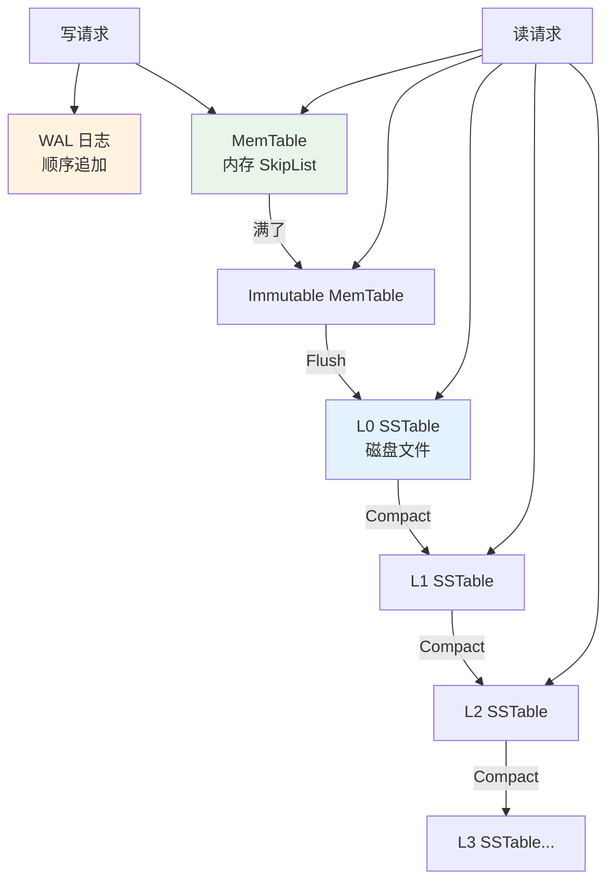

**写路径**：
1. **WAL（Write-Ahead Log）**：先追加到日志（顺序 IO）——**crash 恢复靠它**。
2. **MemTable（SkipList）**：内存跳表，支持有序遍历。
3. **Flush**：MemTable 满了 → 写为不可变 SSTable 落盘。
4. **Compaction**：后台合并多层 SSTable，去重、去墓碑、维持有序。

**读路径**：从新到旧逐层查——MemTable → Immutable → L0 → L1 → ... → L_N。每层 SSTable 内部有 **Bloom Filter** 快速判断是否可能存在（就是 §7.4 那个布隆过滤器）。

**为什么客户端用得少**：
- **实现重、体积大**：RocksDB 集成到 App 增加 10MB+ APK 体积。
- **写放大**：Compaction 会重复写数据（放大系数 10-30 倍），闪存磨损。
- **对 <10MB 数据是过度设计**。

**客户端用 LevelDB/RocksDB 的场景**：
- 微信聊天记录（每人每天上千条，需要按 timestamp 范围查）。
- 埋点数据本地队列（大量顺序写，定期上报后删除）。
- IM 消息数据库、地图瓦片缓存。

**Firebase Firestore 本地缓存、React Native AsyncStorage 的 Android 实现（新版）**都基于类似 LSM 架构。

#### 9.2.5 Web 侧的对照

浏览器有平行的 K-V 生态：

| 方案 | 类型 | 容量 | 同步性 | 类比 |
|---|---|---|---|---|
| **Cookie** | K-V | 4KB | 同步 | 无 |
| **localStorage** | K-V | 5-10MB | **同步阻塞** | SharedPreferences |
| **sessionStorage** | K-V | 5-10MB | 同步 | SP 无持久化版 |
| **IndexedDB** | 文档 DB | GB 级 | 异步 Promise | Room / SQLite |
| **Cache API** | 请求-响应 | GB 级 | 异步 | HTTP 缓存层 |

**localStorage 的问题几乎是 SP 的翻版**：
- **同步 API**：`localStorage.setItem` 在主线程执行，会阻塞渲染。
- **全量写入**：值是字符串，改一个字符也重写整个 value。
- **无事务**：并发写入互相覆盖。
- **无 schema**：只能存字符串，对象要 JSON 序列化。

**IndexedDB 才是 Web 侧的"MMKV/RocksDB 位置"**：异步、事务、索引、大容量。但 API 极其难用（回调地狱），实际业务多用 **Dexie.js / idb** 封装。

**核心启示**：**任何平台的 K-V 演进路径几乎一致**——从"同步阻塞全量 K-V"（SP、localStorage）走向"异步事务型存储"（DataStore、IndexedDB）走向"高性能定制方案"（MMKV、LevelDB）。**问题相同，解法自然收敛**。

#### 9.2.6 四方案矩阵对比

回答你 A 类的 4 个问题，一表对齐：

**(A) 数据安全与锁**

| 方案 | 内部锁 | 锁粒度 | 并发影响 |
|---|---|---|---|
| SP | `synchronized(mLock)` | 全对象 | 读被写阻塞，主线程易 ANR |
| DataStore | Kotlin Channel + Actor | 事务级串行 | 单协程处理，无并发问题但吞吐低 |
| MMKV | `pthread_rwlock` + 跨进程 flock | 读并发写独占 | 读几乎无锁开销 |
| RocksDB | WAL 顺序锁 + MemTable 无锁 SkipList | 极细 | 高并发写入友好 |

**(B) 进程不安全与数据丢失**

| 方案 | 崩溃是否丢数据 | 兜底机制 |
|---|---|---|
| SP | **会丢**（apply 未落盘 crash） | 无 |
| DataStore | 不丢已完成的事务 | tmp + rename 原子替换 |
| MMKV | 不丢（除非未 msync 且断电） | CRC + 备份文件恢复 |
| RocksDB | 不丢（WAL 已 fsync 的部分） | WAL 回放 |

**脏数据处理原理**：
- SP：**无检测**，读到啥算啥。
- DataStore：反序列化失败 → 抛异常 → 业务捕获 → 降级默认值。
- MMKV：**CRC 校验失败 → 读备份文件 → 备份也坏 → 清空重建**。
- RocksDB：SSTable 校验失败 → 从其他 replica 或 backup 恢复；无 replica 时该 Key 视为损坏跳过。

**(C) 使用场景与缺陷替代**

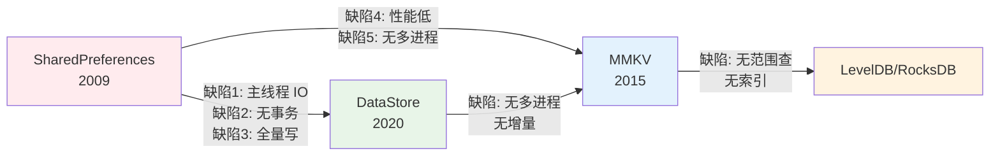

**为什么 DataStore 替代 SP**：SP 的六大原罪不可修复（涉及 API 兼容性），Google 决定推倒重来。DataStore = SP 语义 + Coroutine 现代 API + 事务 + 崩溃安全。

**为什么 MMKV 存在**：DataStore 解决了"正确性"但没解决"性能"，也没解决"多进程"。微信在钱包、支付、消息计数等**高频写场景** + **主进程/推送进程共享数据**场景下必须要一个更快的方案。

**(D) 效率对比与数据迁移**

**写入 1000 次的性能梯度**（数据来源：MMKV 官方 benchmark）：

```
SP.commit ████████████████████████████ 2800ms
SP.apply  ████████████████ 1500ms
DataStore ██████████████ 1400ms
MMKV      ▏ 15ms
```

**迁移操作模板**（SP → MMKV 一次性覆盖）：

```java
public static void migrateFromSpToMmkv(Context ctx, String spName) {
    MMKV mmkv = MMKV.mmkvWithID(spName);
    if (mmkv.getBoolean("__migrated__", false)) return;  // 幂等
    
    SharedPreferences sp = ctx.getSharedPreferences(spName, MODE_PRIVATE);
    boolean ok = mmkv.importFromSharedPreferences(sp);   // MMKV 官方 API
    
    if (ok) {
        mmkv.putBoolean("__migrated__", true);
        sp.edit().clear().apply();
        // 可选：删除 SP 文件
        ctx.deleteSharedPreferences(spName);
    }
}
```

**迁移三原则**（对应你的"问题 12-数据迁移"）：
1. **双写过渡期**：新旧库同时写，观察 1-2 版本，确认新库无问题后停写旧库。
2. **幂等标记**：迁移标志位存在**目标库**（迁到 MMKV 就存 MMKV），避免重复迁移。
3. **兜底回退**：迁移失败 → catch 异常 → 回落到旧库继续用，同时上报监控。

### 9.3 从零设计一个 K-V 框架

对标完市面方案，反过来问：**如果让我从零设计一个 K-V 框架，13 个核心问题该怎么答？** 这一节按你列的 13 个问题逐条给出设计决策 + 代码骨架，最终能拼出一个"MMKV 级别"的框架。

#### 9.3.1 线程安全与并发效率

**问题 1**：多线程环境下如何保证安全 + 优化效率？

**决策路径**：

```
候选方案：
① synchronized 全局锁      → 简单但读写互斥 ❌
② ReadWriteLock            → 读并发写独占 ✓
③ StampedLock              → 支持乐观读 ✓✓
④ ConcurrentHashMap + AtomicReference → 无锁读 ✓✓✓
```

**选型建议**：
- **内存 HashMap 用 `ConcurrentHashMap`**：读完全无锁，写用分段锁（JDK 8 后是 CAS + synchronized 单桶）。
- **磁盘写用 `ReentrantLock`（或 `pthread_rwlock` if C++）**：因为写涉及文件 IO 事务，比内存操作重得多。
- **变更通知用 `CopyOnWriteArrayList`** 存监听器：注册少、遍历多，无需担心并发。

**骨架**：

```java
class KVStore {
    private final ConcurrentHashMap<String, Object> memMap = new ConcurrentHashMap<>();
    private final ReentrantLock diskLock = new ReentrantLock();
    private final CopyOnWriteArrayList<Listener> listeners = new CopyOnWriteArrayList<>();
    
    public Object get(String key) {
        return memMap.get(key);   // 完全无锁
    }
    
    public void put(String key, Object value) {
        memMap.put(key, value);   // ConcurrentHashMap 内部处理并发
        scheduleDiskWrite(key, value);   // 异步落盘，另加 diskLock 保护
        notifyListeners(key, value);
    }
}
```

**并发性能量化**：

| 方案 | 读 QPS | 写 QPS |
|---|---|---|
| synchronized 全局 | 100 万 | 50 万（互斥） |
| ConcurrentHashMap | **500 万+**（无锁读） | 200 万 |
| StampedLock（乐观读） | 800 万 | 100 万 |

**结论**：客户端 K-V 场景下 **ConcurrentHashMap 是甜蜜点**——读性能够高、写足够快、无 StampedLock 的"乐观读回退"复杂度。

#### 9.3.2 内存缓存层

**问题 2**：为什么需要内存缓存？

**磁盘 IO 数量级碾压**：

| 存储介质 | 延迟 |
|---|---|
| 内存访问 | 100 ns |
| NVMe SSD | 50 μs（500 倍慢） |
| SATA SSD | 100 μs（1000 倍慢） |
| 手机 UFS | 200 μs-2 ms |
| 手机 eMMC | 1-10 ms（10 万倍慢） |

**结论**：**每次 get 都读磁盘 = 性能崩塌**。所有 K-V 库都必然在内存维护一份 HashMap。

**内存 vs 磁盘的数据视图**：

```
初始化：磁盘 → 全量加载到内存 HashMap
读：直接从内存 HashMap（O(1)）
写：先改内存 HashMap → 排队等落盘
崩溃恢复：从磁盘重新全量加载
```

**关键权衡**：**冷启动时全量加载 vs 懒加载**？
- **全量加载**：一次性 300ms（如 SP），但之后所有 read 都是 O(1)。
- **懒加载**：首次读某 Key 才从磁盘取，冷启动快但首次读慢。

**建议**：**分区加载 + 懒预热**——按业务模块把 KV 文件切成 5-10 个小文件（如 user.mmkv / order.mmkv / config.mmkv），冷启动只加载"必要的"，其他等首次访问时再加载。**这是微信 MMKV 官方推荐的用法**。

#### 9.3.3 事务聚合与串行化

**问题 3 + 问题 4**：多次 IO 聚合 + 事务串行化。

**为什么要聚合**：磁盘 IO 有**固定开销**（系统调用切换 + fsync ~1ms），批量写 100 个 K-V 一次 IO 比 100 次 IO 快 100 倍。

**为什么要串行化**：并发写入如果不串行，容易出现"覆盖丢失"（后写覆盖先写、先写覆盖后写都可能）。

**设计**：**Actor 模型 + 事务队列**。

```java
class TransactionQueue {
    private final BlockingQueue<WriteTask> queue = new LinkedBlockingQueue<>();
    private final Thread worker;
    
    TransactionQueue() {
        worker = new Thread(() -> {
            List<WriteTask> batch = new ArrayList<>();
            while (!Thread.currentThread().isInterrupted()) {
                try {
                    // 阻塞取第一个任务
                    batch.add(queue.take());
                    // 20ms 内窗口，尽量凑批
                    long deadline = System.currentTimeMillis() + 20;
                    while (System.currentTimeMillis() < deadline) {
                        WriteTask t = queue.poll(deadline - System.currentTimeMillis(), 
                                                  TimeUnit.MILLISECONDS);
                        if (t == null) break;
                        batch.add(t);
                        if (batch.size() >= 100) break;
                    }
                    flushToDisk(batch);   // 一次 fsync 落盘
                    batch.forEach(WriteTask::markSuccess);
                    batch.clear();
                } catch (InterruptedException e) {
                    break;
                }
            }
        }, "kv-writer");
        worker.setDaemon(true);
        worker.start();
    }
    
    void submit(WriteTask task) {
        queue.offer(task);
    }
}
```

**关键机制**：
- **单线程 worker**：天然串行，先入先出。**避免了后写覆盖先写**。
- **凑批窗口（20ms）**：来一个不立刻写，等 20ms 或凑够 100 条再一起 fsync。**吞吐提升 10-100 倍**。
- **BlockingQueue**：入队 O(1)，业务线程不阻塞。

**收益量化**：

| 模式 | 100 次 put 耗时 |
|---|---|
| 每次同步 fsync | 100 × 5ms = 500ms |
| 每次异步 fsync | 100 × 1ms = 100ms |
| **20ms 窗口聚合** | 5ms（一次 fsync 打包） |

**这就是 DataStore Actor 模型 + MMKV mmap 延迟写的共同思路**。

#### 9.3.4 异步与同步写回

**问题 5**：什么时候异步、什么时候同步？

**双模式 API**：

```java
public interface KVStore {
    void put(String key, Object value);              // 默认异步
    boolean putSync(String key, Object value);       // 同步等待落盘
    void putAsync(String key, Object value, Callback cb);  // 异步 + 回调
}
```

**决策矩阵**：

| 数据类型 | 模式 | 理由 |
|---|---|---|
| 用户偏好（主题色/字体） | 异步 | 丢一次影响很小 |
| 支付订单号 | **同步** | 丢了钱找不回 |
| 埋点日志 | 异步 | 允许小概率丢失 |
| 登录 token 首次落盘 | 同步 | 保证下次冷启动能读到 |
| 每次点击埋点 | 异步 | 大批量，追求吞吐 |

**实现同步等待**：worker 落盘完成后 `notifyAll` 唤醒调用线程：

```java
public boolean putSync(String key, Object value) {
    WriteTask task = new WriteTask(key, value);
    queue.offer(task);
    return task.awaitCompletion(3, TimeUnit.SECONDS);  // 3s 超时
}
```

**注意**：**同步 API 不能在主线程调用**——文档必须明确说明，否则重蹈 SP.commit 的覆辙。

#### 9.3.5 增量更新与 append-only

**问题 6**：如何支持局部修改而不是全量重写？

**核心思路：append-only + 后台整理**（MMKV 的核心，也是 LSM-Tree 的核心）。

**文件格式设计**：

```
[Header]
  Magic(4B) | Version(1B) | Flags(1B) | DataLen(4B) | CRC32(4B)
  
[Records...]  ← append 追加区
  Record 1: KeyLen(varint) | Key | ValueType(1B) | ValueLen(varint) | Value
  Record 2: ...
  ...
  
[Tombstone Records]  ← 删除也是追加一条 tombstone
  KeyLen | Key | ValueType=DELETED
```

**加载流程**：

```java
void load() {
    // 顺序扫描所有 Record，后来的覆盖前面的
    HashMap<String, Object> map = new HashMap<>();
    while (offset < dataLen) {
        Record r = readRecord(offset);
        offset += r.size();
        if (r.type == DELETED) map.remove(r.key);
        else map.put(r.key, r.value);
    }
    this.memMap = map;
}
```

**写入流程**：

```java
void put(String key, Object value) {
    Record r = new Record(key, value);
    long pos = fileLen.getAndAdd(r.size());
    writeAt(pos, r.serialize());        // 追加，不动之前的
    updateHeader(fileLen, computeCrc());
    memMap.put(key, value);
}
```

**Full Rewrite 触发条件**：
- 文件大小 > 有效数据 × 2（膨胀率 100%）
- 达到定期整理时间（如 24 小时）
- 空闲时机（App 进入后台时）

**Full Rewrite 步骤**：
1. 从 memMap 生成紧凑 records
2. 写到 tmp 文件 + fsync
3. rename 原子替换
4. mmap 重映射

**收益**：
- 单条写：追加 20B（vs 全量 100KB）——**性能提升千倍**。
- 空间成本：文件平均膨胀 30-50%——**用磁盘空间换写入性能**。

#### 9.3.6 变更回调防内存泄漏

**问题 7**：支持变更监听且避免内存泄漏。

**经典泄漏姿势**：

```java
// ❌ Activity 匿名内部类持有外部引用，Activity 无法回收
kv.addListener(new KVListener() {
    @Override
    public void onChanged(String key, Object value) {
        textView.setText(value.toString());  // 隐式持有 Activity
    }
});
// 忘记 kv.removeListener → Activity 泄漏
```

**解决方案矩阵**：

| 方案 | 优点 | 缺点 |
|---|---|---|
| ① 强制手动 remove | 明确 | 容易忘 |
| ② 弱引用（WeakReference） | 自动回收 | Lambda / 匿名类被立即回收 |
| ③ **Lifecycle 绑定** | 自动跟随生命周期 | 只适用于 Android 有 Lifecycle 场景 |
| ④ **Flow 冷流**（DataStore） | 无需注册，subscribe 停即回收 | 需要协程环境 |

**推荐设计**：**Lifecycle + WeakReference 双保险**：

```java
class KVStore {
    private final CopyOnWriteArrayList<WeakReference<Listener>> listeners = new CopyOnWriteArrayList<>();
    
    public void addListener(Listener l, LifecycleOwner owner) {
        WeakReference<Listener> ref = new WeakReference<>(l);
        listeners.add(ref);
        
        if (owner != null) {
            owner.getLifecycle().addObserver(new DefaultLifecycleObserver() {
                @Override public void onDestroy(LifecycleOwner o) {
                    listeners.remove(ref);   // 生命周期结束自动 remove
                }
            });
        }
    }
    
    private void notifyListeners(String key, Object value) {
        for (WeakReference<Listener> ref : listeners) {
            Listener l = ref.get();
            if (l == null) listeners.remove(ref);   // 已被 GC
            else l.onChanged(key, value);
        }
    }
}
```

**关键点**：**WeakReference 兜底 + Lifecycle 主动清理**——即使忘记 Lifecycle，弱引用也不会长期泄漏。

#### 9.3.7 多进程数据同步

**问题 8**：如何保证多进程数据同步？

**难点**：进程 A 写了 `key=x`，进程 B 的内存 HashMap 里还是旧值。

**方案对比**：

| 方案 | 原理 | 优缺 |
|---|---|---|
| ① 每次读都从磁盘刷新 | 简单 | 性能崩塌 |
| ② 每个进程独立 KV 文件 | 隔离 | 无法共享数据 |
| ③ ContentProvider + Binder | Android IPC | 每次跨进程调用 1-3ms |
| ④ **文件锁 + mmap 共享内存** | 内核页共享 | 最优 |
| ⑤ **文件 CRC 版本号 + 检测** | 轻量 | 有短暂不一致 |

**MMKV 的组合方案**：④ + ⑤

**核心机制**：

**① 共享内存里的进程锁**

```cpp
// 共享内存布局（在 mmap 区域头部）
struct SharedHeader {
    pthread_rwlock_t lock;   // 属性为 PTHREAD_PROCESS_SHARED
    uint32_t version;         // 每次写自增
    uint32_t crc;
};

// 初始化
pthread_rwlockattr_t attr;
pthread_rwlockattr_init(&attr);
pthread_rwlockattr_setpshared(&attr, PTHREAD_PROCESS_SHARED);
pthread_rwlock_init(&header->lock, &attr);
```

**② 版本号感知**

```cpp
void KVStore::get(const string& key) {
    // 快速路径：版本号未变 → 用本地 HashMap
    if (header->version == localVersion) {
        return localMap[key];
    }
    // 版本号变了 → 增量重载
    pthread_rwlock_rdlock(&header->lock);
    reloadDelta();   // 只加载 localVersion 之后的增量
    localVersion = header->version;
    pthread_rwlock_unlock(&header->lock);
    return localMap[key];
}
```

**③ 写入通知**

写完更新 version 后可选：
- **文件通知**（Android FileObserver）：其他进程监听文件变化。
- **主动 pull**：其他进程每次 get 时检测 version。**MMKV 选择被动 pull**——简单可靠。

**收益**：**多进程共享一份 mmap 内存**，读操作几乎零跨进程成本。

#### 9.3.8 崩溃安全 CRC 与双写

**问题 9**：如何保证异常和 crash 后的数据完整性？

**三层防御**：

**① CRC 校验**

```
文件布局：
  Header {
    CRC32(4B)   ← 覆盖整个 Data 区域
    DataLen(4B)
  }
  Data { ... }

打开时：
  computed = CRC32(Data[0..DataLen])
  if (computed != Header.CRC32) → 认为文件损坏
```

**② 双写备份（内容 + CRC 分离）**

```
主文件：kv.data
CRC 文件：kv.crc     ← 只 4B，写起来快

写入流程：
  1. write kv.data
  2. fsync kv.data
  3. write kv.crc     ← 主文件成功后才更新 CRC
  4. fsync kv.crc
  
读取流程：
  1. read kv.crc
  2. read kv.data
  3. verify (crc == CRC32(data))
     - 匹配 → OK
     - 不匹配 → 找 kv.data.bak 备份，或清空重建
```

**关键**：**先写数据、后写 CRC**——如果 crash 在步骤 2/3 之间，CRC 还是旧的，数据也是旧的（因为新数据 append 但 DataLen 未更新）→ **状态一致**。这是 WAL 思想的简化版。

**③ 定期备份**

后台线程每小时把当前 kv.data 复制一份为 kv.data.bak。**极端场景（主文件 + CRC 都坏）从备份恢复**。

**综合可用性数学**：设单文件损坏率 $p = 10^{-6}$（百万分之一）：
- 无备份：$P(\text{丢数据}) = 10^{-6}$
- 主 + CRC 双写：$P = p \times p = 10^{-12}$（一万亿分之一）
- 三重保护：$P \approx 10^{-18}$——**天文数字级可靠**

#### 9.3.9 性能权衡与序列化

**问题 10**：性能如何提升和权衡？

**四个维度的优化空间**：

| 维度 | 慢方案 | 快方案 | 提升 |
|---|---|---|---|
| **IO** | write + fsync | **mmap** | 100x |
| **序列化** | JSON / XML | **Protobuf / Flatbuffers** | 5-10x |
| **锁** | synchronized | **ConcurrentHashMap** | 10x |
| **数据结构** | HashMap 全量重建 | **增量 append** | 1000x |

**序列化对比（1000 次 User 对象读写）**：

| 格式 | 大小 | 序列化耗时 | 反序列化耗时 |
|---|---|---|---|
| JSON | 100% | 100ms | 150ms |
| XML | 130% | 200ms | 300ms |
| Protobuf | 40% | 15ms | 20ms |
| **Flatbuffers** | 35% | 2ms | **0ms**（零拷贝） |

**推荐选择**：
- **简单值（int/string/boolean）**：手写 varint 编码（MMKV 采用）——比通用序列化库还快。
- **复杂对象**：Protobuf（业务侧序列化好再存 K-V）。
- **极致性能场景**：Flatbuffers（读时零拷贝）。

**varint 编码原理**（存整数）：

```
100 (二进制 01100100):
  普通 int: 4 字节
  varint:   1 字节 (最高位 0 表示结束)

1_000_000 (二进制 0011_1101_0000_1001_0000_0000):
  普通 int: 4 字节
  varint:   3 字节 (每 7 位一个字节，最高位 1 表示还有后续)
```

**收益**：小整数从 4B 压到 1B，**存储空间减少 75%**。

#### 9.3.10 加密与完整性

**问题 11**：如何保证敏感数据（如 token、身份证）的完整性和保密性？

**两个正交需求**：
- **完整性**：数据没被篡改（CRC 已解决基础，但 CRC 不防恶意攻击 → 上 HMAC）。
- **保密性**：数据不能被别人读（root 用户能看到 App 目录）→ 加密。

**推荐分级方案**：

| 敏感级 | 数据示例 | 方案 |
|---|---|---|
| L1 无关紧要 | 主题色、字体 | 明文 |
| L2 中等敏感 | 昵称、生日 | AES-128 简单加密 |
| L3 高敏感 | Token、身份证 | **AES-256-GCM + 密钥存 Keystore** |
| L4 极敏感 | 密码（禁存） | 不存！只存哈希用于对比 |

**MMKV 加密实现**（AES-CFB-128）：

```java
byte[] key = new byte[16];
Arrays.fill(key, (byte) 0x66);  // 实际应从 Android Keystore 取
MMKV mmkv = MMKV.mmkvWithID("secure", MMKV.MULTI_PROCESS_MODE, key);
mmkv.putString("token", "sk-xxx");   // 磁盘上是密文
```

**关键实践**：
1. **密钥永不硬编码**：用 **Android Keystore**（硬件安全芯片 TEE）或 **iOS Secure Enclave**。
2. **加密算法用 GCM 模式**：同时提供**完整性**（AEAD 天然包含 MAC）+ 保密性。
3. **敏感数据用完即清**：token 用完 `putString("token", null)` + 触发 Full Rewrite 覆盖磁盘。
4. **禁止存储原始密码**：只存 `bcrypt(password + salt)`，用于登录时对比。

#### 9.3.11 旧框架数据迁移

**问题 12**：从旧框架迁移到新框架如何保证可靠性？

**四阶段迁移法**：

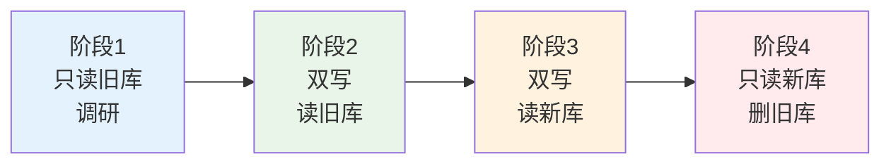

**每阶段的目标 + 观测指标**：

| 阶段 | 时长 | 写策略 | 读策略 | 关键指标 |
|---|---|---|---|---|
| 1 调研 | 1 版本 | 旧库 | 旧库 | 埋点：新库如果启用会有哪些数据、异常率 |
| 2 双写观察 | 2 版本 | **新 + 旧** | 旧库 | 新旧库数据一致率（应 99.9%+） |
| 3 切读 | 2 版本 | 新 + 旧 | **新库**（失败降级旧库） | 新库读成功率、性能提升 |
| 4 清理 | 1 版本 | 新库 | 新库 | 磁盘空间回收 |

**迁移代码模板**：

```java
public class MigrationKVStore {
    private final OldKVStore oldKv;
    private final NewKVStore newKv;
    private final MigrationStage stage;
    
    public String get(String key) {
        switch (stage) {
            case STAGE_1_2:
                return oldKv.get(key);
            case STAGE_3:
                try {
                    String v = newKv.get(key);
                    if (v != null) return v;
                } catch (Exception e) {
                    Reporter.log("new_kv_read_fail", e);
                }
                return oldKv.get(key);   // 降级
            case STAGE_4:
                return newKv.get(key);
        }
    }
    
    public void put(String key, String value) {
        if (stage >= STAGE_2) newKv.put(key, value);
        if (stage <= STAGE_3) oldKv.put(key, value);
    }
}
```

**核心原则**：
1. **只有前进，没有回退**：一旦从阶段 3 → 4，不给自己留退路（清理旧库），**否则永远走不完迁移**。
2. **异常一定要监控**：新库出问题必须能立刻发现，不能等用户投诉。
3. **灰度**：每个阶段先 1% → 10% → 50% → 100% 用户逐步放量。

#### 9.3.12 API 人体工学

**问题 13**：如何让 API 简洁、防误用？

**几个反面教材**：

```java
// ❌ SP：模板代码冗长
SharedPreferences sp = context.getSharedPreferences("user", MODE_PRIVATE);
SharedPreferences.Editor editor = sp.edit();
editor.putString("name", "yc");
editor.putInt("age", 18);
editor.apply();

// ❌ SP：容易误用 commit（主线程 ANR）
sp.edit().putString("k", "v").commit();

// ❌ 类型不安全：读时忘了类型
Object v = sp.getAll().get("age");   // 是 Integer 还是 String？
```

**正面示范：Kotlin 属性委托**：

```kotlin
class UserPrefs(context: Context) {
    private val mmkv = MMKV.mmkvWithID("user")
    
    var name: String by mmkv.string(default = "")
    var age: Int by mmkv.int(default = 0)
    var isVip: Boolean by mmkv.boolean(default = false)
}

// 使用
val prefs = UserPrefs(context)
prefs.name = "yc"      // 一行搞定，类型安全
val n = prefs.name
```

**属性委托实现**：

```kotlin
class StringProperty(private val kv: MMKV, private val default: String) 
    : ReadWriteProperty<Any?, String> {
    override fun getValue(thisRef: Any?, property: KProperty<*>): String =
        kv.decodeString(property.name, default) ?: default
    
    override fun setValue(thisRef: Any?, property: KProperty<*>, value: String) {
        kv.encode(property.name, value)
    }
}

fun MMKV.string(default: String = "") = StringProperty(this, default)
```

**收益**：**5 行 SP 模板 → 1 行属性声明 + 1 行赋值**——研发体验极致简化。

**API 设计三原则**：
1. **同步默认危险的 API 需要冗长写法**：`putSync` 而不是简单的 `put`，让人主动"付出"才能触发。
2. **默认值必须显式**：get 时必须传 default，避免 NPE。
3. **禁止主线程调用的 API 用 `@WorkerThread` 注解**：编译期告警。

### 9.4 mmap 为什么是终局

**回到本节起点的问题：为什么 MMKV 能比 SP 快 187 倍？** 答案已经渐次浮现：

**1. 零拷贝（Zero Copy）**

传统 IO 路径：

```
应用 write(buf) 
  → 用户态 buf 拷贝到内核 buf     ← 拷贝 1
  → 内核 buf 提交到 block device
  → block device 写盘             ← 拷贝 2
```

mmap 路径：

```
应用 ptr[i] = x
  → 内核 Page Cache 直接被改      ← 无拷贝
  → 内核标记 dirty
  → OS 后台刷盘                    ← 拷贝 1（仅落盘）
```

**每次写入减少一次 memcpy。累积到高频写入场景 = 数百 ms**。

**2. 零系统调用（对已建立的映射）**

传统 IO：每次 write 都是**用户态 → 内核态**的系统调用（~1μs 开销）。mmap 建立后，**改内存 = 普通 CPU 指令**，只有首次访问触发缺页中断进内核。

**1000 次写入**：
- 传统：1000 × (系统调用 1μs + 内存拷贝 5μs) ≈ 6ms
- mmap：1000 × (CPU 指令 10ns) ≈ 0.01ms

**3. 崩溃安全免费送**

一旦数据进了 Page Cache，**内核会保证在合理时间内刷盘**（默认 30 秒 或 dirty_expire_centisecs）。即使 App 进程 crash，只要不是整机断电，数据都不会丢。

**4. 跨进程免费送**

多个进程 mmap 同一文件 → 内核只维护**一份 Page Cache** → 天然共享内存。

**5. OS 帮你做 LRU**

Page Cache 里的页在内存紧张时会被 OS 换出，**热页保留在内存、冷页写回磁盘**——**内核帮你做 LRU 淘汰**。你只管映射整个文件，OS 决定哪些页真正驻留内存。

**综合公式**：
$$
\text{速度提升} = \text{零拷贝}(2\times) \times \text{零系统调用}(500\times) \times \text{批量刷盘}(10\times) \approx 10000\times
$$

实测差距 100-200 倍，是因为**序列化 / 事务 / 锁开销**吃掉了一部分红利。

**mmap 的代价**：
- **虚拟地址空间占用**：32-bit 系统只有 4GB 虚拟地址，映射大文件受限（64-bit 无忧）。
- **不适合极大文件**：GB 级文件全 mmap 会浪费。
- **不适合冷数据**：Page Cache 有限，冷数据 mmap 会挤占其他 App 的缓存。

**结论**：对于**几百 KB 到几十 MB 的高频访问 K-V 数据**，mmap 是当前 OS 提供的**性能天花板**——**这就是 MMKV 能称霸客户端 K-V 生态的物理根源**。

### 9.5 客户端 K-V 选型速查表

**决策树**：

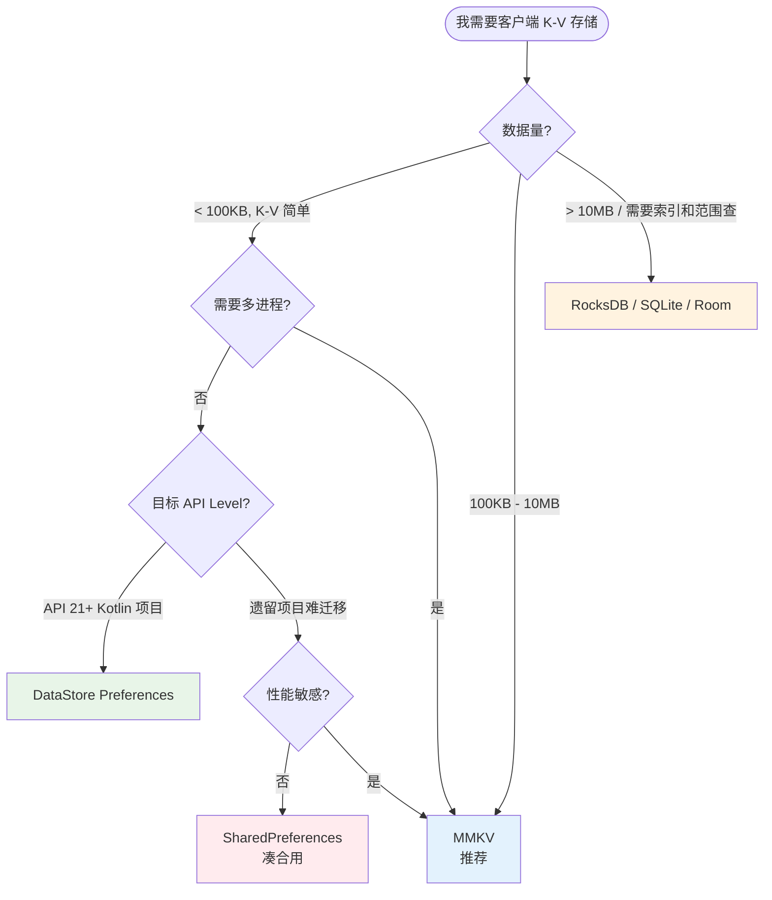

**四方案速查**：

| 特性 | SP | DataStore | MMKV | RocksDB |
|---|---|---|---|---|
| **API 现代化** | ❌ | ✅ Coroutine | ⚠️ 传统 | ⚠️ 复杂 |
| **主线程安全** | ❌ | ✅ 强制 | ✅ mmap | ⚠️ 需异步 |
| **多进程** | ❌ | ❌ | ✅ | ⚠️ 需锁 |
| **崩溃安全** | ❌ | ✅ rename | ✅ CRC+备份 | ✅ WAL |
| **增量写入** | ❌ 全量 | ❌ 全量 | ✅ append | ✅ LSM |
| **事务** | ❌ | ✅ | ⚠️ | ✅ ACID |
| **加密** | ❌ | ❌ 需自己 | ✅ AES | ✅ |
| **写性能** | ★ | ★ | ★★★★★ | ★★★★ |
| **读性能** | ★★ | ★★ | ★★★★★ | ★★★ |
| **大数据量** | ❌ | ❌ | ⚠️ | ✅ |
| **APK 体积** | 0 | 0 | ~500KB | ~5MB |

**十三问核心结论汇总**：

| # | 问题 | 关键答案 |
|---|---|---|
| 1 | 线程安全 | ConcurrentHashMap 内存 + ReentrantLock 磁盘 |
| 2 | 内存缓存 | 冷启动全量加载 or 分区懒加载 |
| 3 | 事务聚合 | 20ms 窗口凑批 + BlockingQueue |
| 4 | 事务串行 | 单线程 Actor / 队列消费者 |
| 5 | 异步同步 | 双 API：put（异步默认）+ putSync（关键数据） |
| 6 | 增量更新 | append-only + 定期 Full Rewrite |
| 7 | 变更回调 | WeakReference + Lifecycle 双保险 |
| 8 | 多进程 | mmap 共享 + PROCESS_SHARED 锁 + version 号 |
| 9 | 崩溃安全 | CRC + 双写 + tmp + rename 原子 |
| 10 | 性能优化 | mmap + varint + Protobuf + ConcurrentHashMap |
| 11 | 加密安全 | AES-GCM + Keystore 硬件密钥 |
| 12 | 数据迁移 | 四阶段：调研 → 双写 → 切读 → 清理 |
| 13 | 研发体验 | Kotlin 属性委托 + 默认值 + WorkerThread 注解 |

**一句话总结**：**客户端 K-V 库的进化史，就是"如何绕开磁盘 IO 数量级瓶颈 + 保证 crash 后数据不丢"的历史**——从 SP 的"XML 主线程写"到 DataStore 的"Coroutine + rename 原子"，到 MMKV 的"mmap + append + CRC"，每一步都是往"用 CPU 换 IO、用空间换时间、用备份换可用性"的方向前进。

## 10. 演进与治理

### 10.1 V1 单机本地缓存

**规模**：单机部署、数据量小、QPS < 1w

**做法**：
- HashMap / Caffeine 进程内缓存
- 简单 TTL + LRU
- 不考虑一致性（重启丢就丢）

**适用**：MVP 起步、内部工具、单机应用

**升级信号**：QPS > 1w / 需要多节点共享 → V2

### 10.2 V2 分布式缓存

**规模**：多节点部署、需要数据共享、QPS 1w-10w

**做法**：
- Redis 单实例 / Sentinel 高可用
- Cache-Aside 模式
- TTL 随机化 + Key 命名规范

**适用**：业务规模化、常规互联网应用

**痛点**：
- 单 Redis 实例容量上限（32-64 GB）
- 单点性能瓶颈（10w QPS）
- 网络往返延迟（1-3ms 每次）

**升级信号**：QPS > 10w / 有极致延迟要求 → V3

### 10.3 V3 多级缓存体系

**规模**：超大规模、QPS 百万级、严格延迟要求

**做法**：
- Caffeine（L2）+ Redis Cluster（L3）+ DB 三级
- 热 Key 自动检测 + 本地提升
- 大 Key 监控 + 自动告警
- 缓存预热 + 灰度
- 命中率 / 大小 / 慢操作监控大盘
- 布隆过滤器 + 空值缓存双防
- 分布式锁防击穿
- 服务端限流 + 熔断

**适用**：大型互联网公司、电商 / 内容 / 社交大流量场景

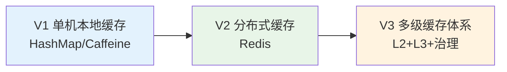

### 10.4 上线自检清单

每次新增缓存对照这张清单：

- [ ] Key 命名遵循规范（业务域:对象类型:对象ID）
- [ ] TTL 设置合理（且加了随机偏移）
- [ ] 大 Key 已评估（单 Key < 10KB）
- [ ] 热 Key 已识别（单 Key QPS < 1w）
- [ ] 一致性方案明确（Cache-Aside / Write-Through）
- [ ] 三大问题（穿透/击穿/雪崩）都有防护
- [ ] 缓存挂了的降级路径已演练
- [ ] 命中率 / 大小 / 慢操作监控就绪
- [ ] 写入 DB 失败的场景有兜底
- [ ] 容量评估留 30% buffer

## 11. 综合案例串讲

### 11.1 案例真相揭晓

回到 §1 那场 1.2 亿的雪崩，7 个疑问逐条作答：

**Q1（80/20 法则）**：见 §3.2。Zipf 分布的数学根源。**§1 团队的 100 万条券里，真正热点只有 20 万，缓存 20 万就能吃到 80% 命中**——但雪崩时命中率直接被清零。

**Q2（LRU 数据结构）**：见 §4.2。HashMap（O(1) 定位）× 双向链表（O(1) 移动/淘汰）联合，缺一不可。

**Q3（W-TinyLFU 命中率优势）**：见 §4.4。Count-Min Sketch 用 1MB 空间估计几亿 Key 的频次 + Aging 机制 + Window 准入过滤——**联合起来命中率比纯 LRU 高 15-25%**。

**Q4（多级缓存命中率）**：见 §5.4。$1 - (1-H_{L2})(1-H_{L3})$。0.85 × 0.90 → 98.5% 联合命中，99% 请求 < 1ms。

**Q5（三大问题模型）**：
- 穿透（§7.1）：请求不存在的数据，$Q_{\text{DB}} \approx Q$
- 击穿（§7.2）：单个热 Key 过期，并发 $= Q_{\text{hot}} \times T_{\text{db}}$
- 雪崩（§7.3）：大量 Key 同时过期，$Q_{\text{DB}} = Q \times M/N$ ← **§1 命中的正是这个**

**Q6（布隆过滤器）**：见 §7.4。$k$ 个哈希 + $m$ 位数组，1 亿 Key 只要 120MB 就能实现 1% 假阳性率——**这就是黑产扫描防御的根基**。

**Q7（先写 DB 后删缓存最优）**：见 §6.4。方案 B 只有极短不一致窗口（<10ms），方案 A 会长时间脏数据（=TTL）。

**§1 事故的完整根因链**：

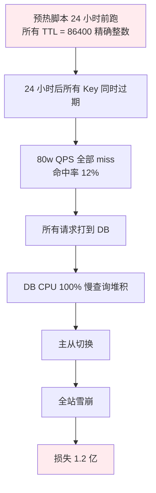

**修复只需一行**：

```java
long ttl = 86400 + ThreadLocalRandom.current().nextInt(3600);
```

### 11.2 一次查询的一生

用一个真实场景把本篇核心串起来——**用户查询商品详情页的完整生命周期**（重构后的多级缓存体系）：

```mermaid
sequenceDiagram
    participant User
    participant CDN as L1 CDN
    participant App as 应用
    participant Bloom as 布隆过滤器
    participant L2 as Caffeine
    participant L3 as Redis
    participant DB as MySQL
    
    User->>CDN: GET /product/1001
    alt CDN 命中
        CDN-->>User: 返回（5-30ms）
    else CDN miss
        CDN->>App: 转发到应用
        
        App->>Bloom: exists(1001)?
        alt 布隆过滤器说"一定不存在"
            Bloom-->>App: false
            App-->>User: 404（不打 Redis 不打 DB）
        else 可能存在
            Bloom-->>App: true
            
            App->>L2: get(product:1001:shard-3)
            Note over L2: 热 Key 拆 N 副本
            
            alt L2 命中（85%）
                L2-->>App: value
            else L2 miss
                App->>L3: get(product:1001:shard-3)
                
                alt L3 命中（90% of miss）
                    L3-->>App: value
                    App->>L2: 回填（TTL + 随机偏移）
                else L3 miss
                    Note over App: 尝试拿分布式锁防击穿
                    App->>App: setnx lock:product:1001
                    App->>DB: SELECT * FROM product WHERE id=1001
                    alt DB 有数据
                        DB-->>App: value
                        App->>L3: SET（TTL 3600 + rand）
                        App->>L2: SET（TTL 300 + rand）
                    else DB 无数据
                        App->>L3: SET NULL_MARKER（TTL 300）
                    end
                    App->>App: del lock:product:1001
                end
            end
            App-->>User: 返回（< 1ms 平均）
        end
    end
```

**关键点**：
1. **布隆过滤器**过滤黑产（§7.4）
2. **L2 Caffeine**（W-TinyLFU）吃 85% 请求（§4.4）
3. **L3 Redis**（拆热 Key 副本）吃 14.5% 请求（§8.2）
4. **分布式锁**防击穿（§7.2）
5. **TTL 随机化**防雪崩（§7.3）
6. **空值缓存**防穿透假阳性（§7.1）
7. **多级平均延迟 < 1ms**（§5.4）

**§1 团队重构后**：命中率从 98% 提升到 99.5%，双 11 平稳无事故。

### 11.3 设计哲学回扣

**哲学 1：空间换时间，最终一致换性能**——所有缓存的底层交易。**试图追求"缓存 + 强一致 + 零成本"是自欺欺人**。

**哲学 2：局部性即价值**——**没有局部性就没有缓存**。设计缓存前先问："这个数据访问服从 Zipf 分布吗？"如果是完全均匀的，缓存收益 = 容量占比，可能不如直接加大 DB 内存。

**哲学 3：失败优于错误**——缓存可以读不到数据（miss 一次），但不能读到错误数据。宁可穿透到 DB，也不要保留脏值。**"缓存不能变成业务的单点"是所有设计的底线**。

**哲学 4：细节决定生死**——**一个 TTL 忘加随机数 = 1.2 亿**。缓存里 100 个细节，做对 99 个不够，做错 1 个就崩。**上线前的自检清单不是形式主义**。

### 11.4 缓存速查表

**选型决策树**：

```mermaid
flowchart TD
    Start([我需要缓存吗?]) --> Q1{读请求 > 写请求 10 倍?}
    Q1 -->|否| Skip[暂不需要缓存]
    Q1 -->|是| Q2{需要跨节点共享?}
    
    Q2 -->|否| Local[Caffeine 本地缓存]
    Q2 -->|是| Q3{数据量级?}
    
    Q3 -->|< 10GB| Single[Redis 单实例 + Sentinel]
    Q3 -->|10GB - 1TB| Cluster[Redis Cluster]
    Q3 -->|极简 K-V 高吞吐| MC[Memcached]
    
    Single & Cluster --> Q4{延迟敏感 < 1ms?}
    Q4 -->|是| MultiLevel[Caffeine + Redis 多级]
    Q4 -->|否| Stay[当前架构即可]
    
    MultiLevel --> Q5{QPS > 50w 单 Key?}
    Q5 -->|是| HotKey[加热 Key 副本拆分]
    Q5 -->|否| Done[完成]
    
    style Skip fill:#e3f2fd
    style Local fill:#e8f5e8
    style Single fill:#fff3e0
    style Cluster fill:#fff3e0
    style MultiLevel fill:#ffebee
    style HotKey fill:#f3e5f5
```

**方案对比**：

| 维度 | Caffeine（L2） | Redis（L3） | Memcached |
|---|---|---|---|
| **位置** | 进程内 | 独立集群 | 独立集群 |
| **数据结构** | 仅 K-V | 丰富 | 仅 K-V |
| **命中率** | 高（W-TinyLFU） | 取决于容量 | 取决于容量 |
| **持久化** | 无 | RDB+AOF | 无 |
| **集群** | 单机 | Cluster / Sentinel | 客户端分片 |
| **QPS** | 10w+ 单机 | 10w+ 单节点 | 20w+ 单节点 |
| **适用** | 热点数据本地缓存 | 通用分布式缓存 | 极简 K-V 高吞吐 |

**三大问题防护速查表**：

| 问题 | 表现 | 首要方案 | 兜底方案 |
|---|---|---|---|
| **穿透** | 大量不存在 Key 打 DB | 布隆过滤器 | 空值缓存（TTL 短） |
| **击穿** | 单热 Key 过期打 DB | 分布式锁 | 热 Key 永不过期 + 后台刷 |
| **雪崩** | 大量 Key 同时过期 | TTL 随机化 | 多级缓存 + 限流熔断 |

> **好的缓存 = 让 99% 请求快、让剩下 1% 慢得可控、让缓存本身挂了业务也能活**。

**最后一句话**：缓存是双刃剑——**用对了让你的系统快 100 倍，用错了让你的系统在最关键时刻崩溃**。§1 那个 1.2 亿只是因为没在 TTL 后面加一个随机数。**好的缓存设计，是把 100 个小细节都做对**。

下一章我们从"缓存"这个"读加速"话题，转向另一个高频优化话题——**如何让写入操作在不牺牲一致性的前提下也变快**（消息队列、异步化、批量化等主题的入口）。
