# 04.缓存架构设计思想

> **本篇定位**：缓存是性能优化中**性价比最高的一招**——但同时也是**故障概率最高的环节**。本文从一场因 TTL 忘加随机数而损失 1.2 亿的双 11 事故讲起，从局部性原理、LRU 数据结构证明、W-TinyLFU 命中率论证、三大经典问题的数学模型出发，把缓存还原成一门**在性能、一致性、可靠性之间做联合最优化**的工程学。读完这一篇，就能在方案评审里回答"这个缓存为什么这样设计、命中率上限是多少、故障时会怎么放大、有哪些坑必须避开"。

#### 目录介绍
- [1. 案例引入](#1-案例引入)
  - [1.1 一场零点的雪崩](#11-一场零点的雪崩)
  - [1.2 顺藤摸到根因](#12-顺藤摸到根因)
  - [1.3 我们要回答什么](#13-我们要回答什么)
- [2. 架构概览](#2-架构概览)
  - [2.1 缓存决策三角](#21-缓存决策三角)
  - [2.2 为什么这么切](#22-为什么这么切)
- [3. 局部性原理](#3-局部性原理)
  - [3.1 时间与空间局部性](#31-时间与空间局部性)
  - [3.2 帕累托 80/20 法则](#32-帕累托-8020-法则)
  - [3.3 命中率的数学表达](#33-命中率的数学表达)
  - [3.4 分层延迟数量级](#34-分层延迟数量级)
- [4. 淘汰算法演进](#4-淘汰算法演进)
  - [4.1 FIFO 的原始简单](#41-fifo-的原始简单)
  - [4.2 LRU 数据结构证明](#42-lru-数据结构证明)
  - [4.3 LFU 的历史包袱](#43-lfu-的历史包袱)
  - [4.4 W-TinyLFU 联合最优](#44-w-tinylfu-联合最优)
- [5. 三层缓存架构](#5-三层缓存架构)
  - [5.1 L0-L4 分层依据](#51-l0-l4-分层依据)
  - [5.2 多级缓存数据流](#52-多级缓存数据流)
  - [5.3 Caffeine + Redis 组合](#53-caffeine--redis-组合)
  - [5.4 命中率联合估算](#54-命中率联合估算)
- [6. 一致性方案对比](#6-一致性方案对比)
  - [6.1 Cache-Aside 主流选](#61-cache-aside-主流选)
  - [6.2 Write-Through 强一致](#62-write-through-强一致)
  - [6.3 Write-Behind 高吞吐](#63-write-behind-高吞吐)
  - [6.4 先写 DB 后删缓存](#64-先写-db-后删缓存)
- [7. 三大经典问题](#7-三大经典问题)
  - [7.1 缓存穿透原理](#71-缓存穿透原理)
  - [7.2 缓存击穿原理](#72-缓存击穿原理)
  - [7.3 缓存雪崩原理](#73-缓存雪崩原理)
  - [7.4 布隆过滤器解剖](#74-布隆过滤器解剖)
- [8. 常见反例陷阱](#8-常见反例陷阱)
  - [8.1 大 Key 反例](#81-大-key-反例)
  - [8.2 热 Key 反例](#82-热-key-反例)
  - [8.3 一致性反例](#83-一致性反例)
  - [8.4 缓存挂了业务崩](#84-缓存挂了业务崩)
- [9. 演进与治理](#9-演进与治理)
  - [9.1 V1 单机本地缓存](#91-v1-单机本地缓存)
  - [9.2 V2 分布式缓存](#92-v2-分布式缓存)
  - [9.3 V3 多级缓存体系](#93-v3-多级缓存体系)
  - [9.4 上线自检清单](#94-上线自检清单)
- [10. 综合案例串讲](#10-综合案例串讲)
  - [10.1 案例真相揭晓](#101-案例真相揭晓)
  - [10.2 一次查询的一生](#102-一次查询的一生)
  - [10.3 设计哲学回扣](#103-设计哲学回扣)
  - [10.4 缓存速查表](#104-缓存速查表)


## 1. 案例引入

### 1.1 一场零点的雪崩

某头部电商在 2019 年双 11 零点发生过一次真实的雪崩事故。**0:00:00 整**，零点活动开始，所有用户涌入抢购。监控看板画面：

```
时间          现象
─────────────────────────────────────────────
0:00:00      大促开始，QPS 从日常 5w 涨到 80w
0:00:03      🚨 Redis 命中率断崖式下跌：98% → 12%
0:00:08      🚨 DB CPU 从 30% 飙到 100%
0:00:15      🚨 主库主从切换，全站不可用
0:01:30      应急扩容 + 限流，逐步恢复
0:08:00      恢复正常，但峰值已过
─────────────────────────────────────────────
直接经济损失：预估 1.2 亿
用户信任损失：无法估量
```

**核心疑问**：Redis 命中率为什么 3 秒内从 98% 跌到 12%？

活动前运营手动做了缓存预热，把所有热点商品数据写入 Redis，代码大概是：

```java
// preload.java —— 大促前的预热脚本
public void preloadCoupons() {
    for (Coupon c : allActivityCoupons) {
        String key = "coupon:" + c.id;
        // 24 小时过期（活动持续 24 小时）
        redis.setex(key, 86400, JSON.toJSONString(c));  // ⚠️ 就这一行
    }
    log.info("预热完成，共 {} 条", allActivityCoupons.size());
}
```

**代码看起来毫无问题**——24 小时 TTL 覆盖整个活动周期。但为什么会崩？

### 1.2 顺藤摸到根因

抓 Redis 慢查询日志和 keyspace notification 事件，发现 **0:00:00 前后大量 Key 集中过期**。回溯预热脚本执行时间——**预热是在 24 小时前的 0:00:00 跑的**，所有 Key TTL 都是精确的 86400 秒，**在下一个 0:00:00 会同时过期到期**。

```
0:00:00 (T-24h) 预热: 100 万条 key，全部 TTL = 86400
                    ↓ 24 小时后
0:00:00 (T=0)   全部同时过期，Redis 里瞬间空了 100 万条
0:00:01         80w QPS 打进来，命中率 12% ← 少数 miss 的 Key 补上了
0:00:03         DB 被打穿，CPU 100%
0:00:15         DB 主备切换
0:08:00         恢复
```

**真正的根因不是流量大，而是缓存过期时间设置成"整点 24 小时"**——所有 Key 同时过期，瞬间打穿 Redis 直击数据库。**改一行代码就能避免的 1.2 亿损失**：

```java
// ✅ 修复
long ttl = 86400 + ThreadLocalRandom.current().nextInt(3600);  // + 0-1 小时随机
redis.setex(key, ttl, JSON.toJSONString(c));
```

### 1.3 我们要回答什么

带着这场 1.2 亿的痛，本文要回答 7 个问题：

- **Q1**：为什么"20% 的 Key 承担 80% 的访问"是缓存生效的物理基础？可以数学证明吗？
- **Q2**：LRU 为什么必须用 HashMap + 双向链表？只用一种数据结构不行吗？
- **Q3**：W-TinyLFU 凭什么命中率比 LRU 高 15-25%？Count-Min Sketch 怎么工作？
- **Q4**：多级缓存的命中率怎么算？L2 + L3 双层能达到 99.5% 吗？
- **Q5**：缓存穿透、击穿、雪崩到底怎么区分？各自的数学模型是什么？
- **Q6**：布隆过滤器怎么用 1KB 空间过滤 100 万个不存在 Key？
- **Q7**：Cache-Aside 里"先写 DB 再删缓存"为什么是最优解？

后续 8 章会依次回答，第 10 章统一回扣。

## 2. 架构概览

### 2.1 缓存决策三角

缓存设计的三个核心维度：

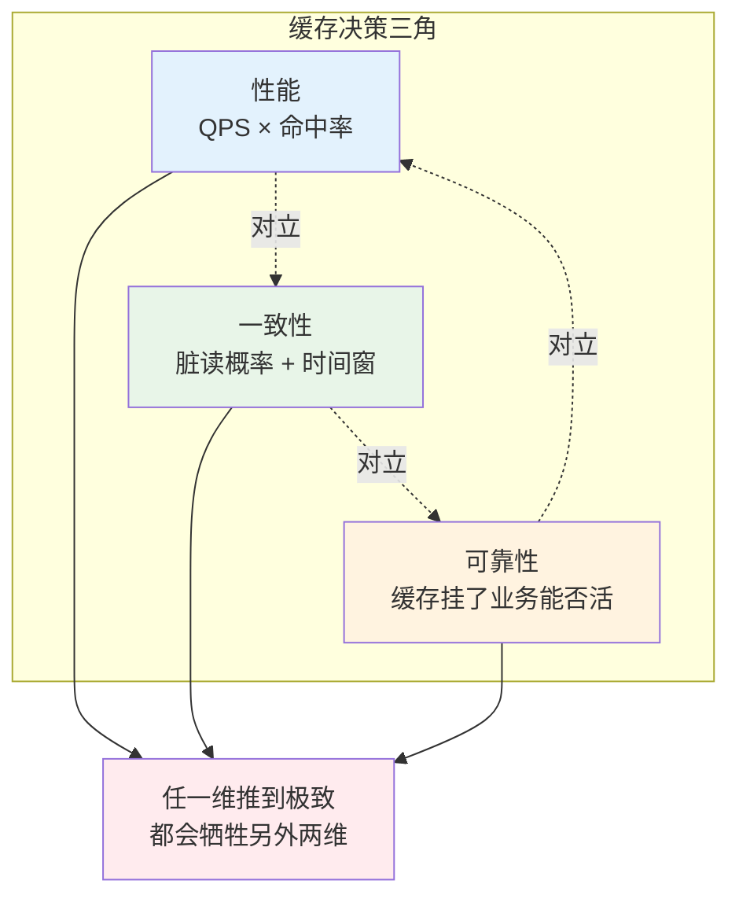

**三维含义**：

| 维度 | 指标 | §1 团队现状 |
|---|---|---|
| **性能** | 命中率 × QPS 承载 | 平时 98% × 5w = 优秀 |
| **一致性** | 允许的脏读时间窗 | 商品数据允许秒级不一致 |
| **可靠性** | 缓存挂了业务的降级能力 | ❌ 没有降级 → 雪崩 |

**三维互斥**：
- 想要**极致性能** → 长 TTL + 大容量 → 一致性变差（旧数据保留久）。
- 想要**强一致性** → 写 DB 同步删缓存 → 每次写都要保证成功 → 可靠性下降（写失败怎么办？）。
- 想要**极致可靠** → 多级冗余 + 降级 → 一致性变差（多副本同步问题）。

### 2.2 为什么这么切

**疑惑**：为什么用性能/一致性/可靠性，不用"容量、成本"这些指标？

**论证**：
1. **容量**是"性能维度的下位变量"——容量决定了缓存能装多少热点，但缓存价值最终体现在命中率×QPS。
2. **成本**是每个维度都要考虑的横切关注点，不是独立维度。
3. **性能、一致性、可靠性**是缓存的三大功能承诺——**任何缓存架构都可以按这三维度打分**。

**结论**：**缓存 = 用空间换时间 + 用最终一致性换性能**。核心矛盾就在这三维上打转。**§1 那个团队重性能（长 TTL 高命中）但轻可靠性（无降级），最终付出 1.2 亿代价**。

## 3. 局部性原理

### 3.1 时间与空间局部性

**疑惑**：为什么缓存能有效？如果访问是"完全随机"的，缓存有意义吗？

**论证**：真实世界的访问从来不是随机的，服从两类局部性：

- **时间局部性**：**刚访问过的数据近期会再次被访问**。
  - 用户看了商品 A，10 秒内很可能再看一次 A。
  - 这是 LRU 算法的物理基础。

- **空间局部性**：**相邻数据会被一起访问**。
  - 用户看了商品 A，很可能接着看商品 A 的相关推荐 B、C。
  - 这是 CPU L1 cache 的核心，也是预取策略的依据。

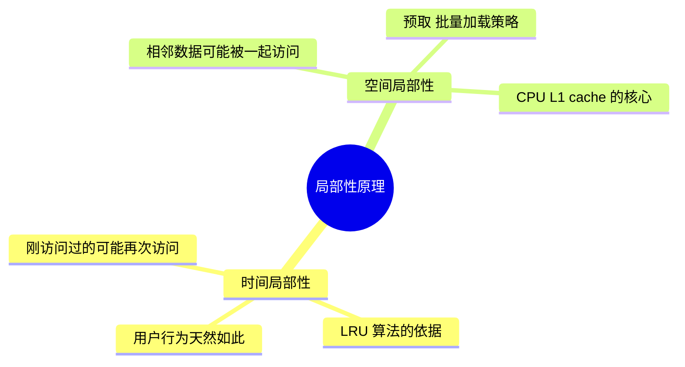

**结论**：**局部性是所有缓存的物理基础**。如果访问真的完全随机，命中率就等于容量占比，缓存的价值只是"更快的存储介质"。

### 3.2 帕累托 80/20 法则

局部性在实际系统里体现为**帕累托法则**：**20% 的 Key 承担 80% 的访问**。

**疑惑**：这是经验值还是有数学根源？

**论证**：Zipf 分布——大量真实数据（网页访问、单词频率、商品热度）都服从：

$$
f(k) \propto \frac{1}{k^s}
$$

- $k$：热度排名（第 k 热的 Key）
- $s$：分布参数（通常 $s \in [0.8, 1.2]$）

对 Zipf 分布做积分：**前 20% 的 Key 累计访问量占总访问的 70%-90%**（$s=1$ 时正好 80%）。这就是帕累托 80/20 的数学根源。

**实战应用**：**缓存容量不需要装下全部数据，能装 20% 热点就有 80% 命中率**。这就是"缓存的性价比"——**用 20% 的存储换 80% 的性能**。

### 3.3 命中率的数学表达

设缓存容量为 $C$（能装 $C$ 个 Key），总 Key 数为 $N$，请求分布服从参数 $s$ 的 Zipf。**命中率**：

$$
H(C) = \sum_{k=1}^{C} \frac{1/k^s}{\sum_{i=1}^{N} 1/i^s}
$$

数值分析（$N = 1000$）：

| 容量占比 $C/N$ | s=0.8 命中率 | s=1.0 命中率 | s=1.2 命中率 |
|---|---|---|---|
| 5% | 43% | 62% | 78% |
| 10% | 53% | 71% | 84% |
| 20% | 65% | 80% | 90% |
| 50% | 82% | 92% | 97% |
| 100% | 100% | 100% | 100% |

**关键结论**：
1. **热度越集中（s 越大），少量缓存就能吃到高命中**。
2. **命中率 20% → 80% 需要容量占比 5% → 20%**（4 倍容量）。
3. **命中率 80% → 95% 需要容量占比 20% → 50%**（2.5 倍容量）。
4. **命中率 95% → 99% 需要容量占比 50% → 90%**（1.8 倍容量）——**边际收益递减**。

**指导设计**：**追求 90% 命中足矣，追 99% 是钱包黑洞**。除非业务特殊（如秒级金融），95% 是性价比甜蜜点。

### 3.4 分层延迟数量级

不同存储介质延迟对比：

| 层级 | 物理位置 | 典型延迟 | 容量 | 每 GB 成本 |
|---|---|---|---|---|
| CPU L1 | 芯片内 | 1 ns | 32-64 KB | 天价 |
| CPU L2/L3 | 芯片内 | 10 ns | 数 MB | 极贵 |
| 内存 DRAM | 主板 | 100 ns | GB-TB | 贵 |
| 本地缓存（Caffeine） | 进程内存 | 200 ns | GB | 贵 |
| 分布式缓存（Redis） | 独立集群 | 100 μs (1e5 ns) | TB | 中 |
| SSD | 本机磁盘 | 100 μs | TB | 便宜 |
| HDD | 本机磁盘 | 10 ms (1e7 ns) | TB-PB | 极便宜 |
| 网络 DB | 独立服务 | 10 ms | PB | 极便宜 |

**关键洞察**：**每两层间延迟差约 1-3 个数量级**。这就是分层的根本依据——**每一层都比下一层快 10-1000 倍**。

**推论**：缓存的意义 = 用高层的少量容量，吃到 80%+ 的请求，只把 20% 少量请求打到下层。**平均延迟 = H × T_hit + (1-H) × T_miss**。

**§1 团队正常情况**：$0.98 \times 1\text{ms} + 0.02 \times 50\text{ms} = 1.98\text{ms}$
**§1 团队雪崩情况**：$0.12 \times 1\text{ms} + 0.88 \times 50\text{ms} = 44.12\text{ms}$（22 倍延迟放大）

## 4. 淘汰算法演进

### 4.1 FIFO 的原始简单

**FIFO（First In First Out）**：先进先出，最老的被淘汰。

**问题**：**违反时间局部性**——一个刚被访问的 Key，如果它是最早进入缓存的，会被淘汰。

**数学证明它次优**：考虑访问序列 `[A, B, C, D, A, A, A, A]`，容量 2：

```
访问 A:  [A]         miss
访问 B:  [A, B]      miss
访问 C:  [B, C]      miss  ← A 被 FIFO 淘汰
访问 D:  [C, D]      miss
访问 A:  [D, A]      miss  ← A 又要 miss
访问 A:  [D, A]      hit
访问 A:  [D, A]      hit
访问 A:  [D, A]      hit
命中率: 3/8 = 37.5%
```

**LRU 表现**：命中率 62.5%（下节详细看）。**FIFO 只有在访问模式接近 FIFO 时才优——现实中很少**。

### 4.2 LRU 数据结构证明

**LRU（Least Recently Used）**：淘汰最久未使用的。

**核心问题**：**如何 O(1) 找到某个 Key、O(1) 移动到"最近使用"、O(1) 淘汰"最久未使用"**？

**疑惑**：只用 HashMap 或只用链表行不行？

**论证**：

| 数据结构 | get O | put O | 淘汰 O | 说明 |
|---|---|---|---|---|
| 单纯 HashMap | O(1) | O(1) | **O(n)** | 找"最久未用"要遍历 |
| 单纯双向链表 | **O(n)** | O(1) | O(1) | 查 Key 要遍历 |
| **HashMap + 双向链表** | O(1) | O(1) | O(1) | 完美 |

**核心组合**：
- **HashMap**：Key → Node 快速定位（O(1)）
- **双向链表**：维护访问顺序，头部最新、尾部最旧，可 O(1) 移动/淘汰

```
HashMap:                    双向链表:
{                          
  "A" → Node(A),            head ↔ Node(A) ↔ Node(B) ↔ Node(C) ↔ tail
  "B" → Node(B),                  最新                    最旧
  "C" → Node(C),
}

get("B"):                   
  1. HashMap 找到 Node(B)          O(1)
  2. 从链表当前位置摘下            O(1)（双向链表可以）
  3. 移到 head 后                  O(1)
  
put("D"), 容量满:
  1. 找 tail 前一个节点 Node(C)    O(1)
  2. 从链表和 HashMap 删除 Node(C) O(1)
  3. 新 Node(D) 加到 head 后       O(1)
```

**代码实现**：

```java
class LRUCache<K, V> {
    private final int capacity;
    private final Map<K, Node<K, V>> map = new HashMap<>();
    private final Node<K, V> head = new Node<>(null, null);   // 哨兵
    private final Node<K, V> tail = new Node<>(null, null);   // 哨兵
    
    public LRUCache(int capacity) {
        this.capacity = capacity;
        head.next = tail;
        tail.prev = head;
    }
    
    public V get(K key) {
        Node<K, V> node = map.get(key);
        if (node == null) return null;
        moveToHead(node);  // O(1) 移到头部
        return node.value;
    }
    
    public void put(K key, V value) {
        Node<K, V> node = map.get(key);
        if (node == null) {
            if (map.size() >= capacity) {
                Node<K, V> old = tail.prev;
                removeNode(old);   // 淘汰尾部
                map.remove(old.key);
            }
            node = new Node<>(key, value);
            map.put(key, node);
            addToHead(node);
        } else {
            node.value = value;
            moveToHead(node);
        }
    }
    
    private void addToHead(Node<K, V> node) {
        node.prev = head; node.next = head.next;
        head.next.prev = node; head.next = node;
    }
    private void removeNode(Node<K, V> node) {
        node.prev.next = node.next; node.next.prev = node.prev;
    }
    private void moveToHead(Node<K, V> node) { removeNode(node); addToHead(node); }
    
    static class Node<K, V> { K key; V value; Node<K, V> prev, next; 
        Node(K k, V v) { key = k; value = v; } }
}
```

**结论**：**LRU = HashMap（快速定位）× 双向链表（快速移动/淘汰）的联合**。这是经典面试题的本质考察。

### 4.3 LFU 的历史包袱

**LRU 的缺陷**：**偶发扫描会污染缓存**。假设有个后台任务遍历了 100 万条商品数据，LRU 会认为它们全部是"最近使用"，把真正的热点 Key 挤出去。

**LFU（Least Frequently Used）**：淘汰访问次数最少的。能解决扫描污染——扫描 Key 的访问频次只有 1，会先被淘汰。

**LFU 的新问题**：**历史包袱**。一个早期的热点即使现在不再访问，累计频次也很高，很难被淘汰。

用一个数值例子：

```
时间 T=0～10:  Key "A" 被访问 1000 次（早期热点）
时间 T=10～20: Key "A" 停止访问，Key "B" 变热，被访问 200 次

LFU 状态:
  A 的计数: 1000
  B 的计数: 200
  → 淘汰 B（尽管 B 才是当下热点）
```

**结论**：LRU 和 LFU 各有软肋，需要**综合两者的优势**。

### 4.4 W-TinyLFU 联合最优

**W-TinyLFU（Caffeine 采用）**：**LRU + LFU + 频率估计**的组合拳。

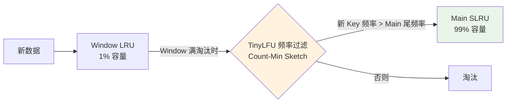

**核心机制**：
1. **Window LRU（1% 容量）**：新数据先进这里"候场"，避免刚进就被高频老数据 PK 掉。
2. **TinyLFU 频率过滤**：Window 淘汰时，估计新 Key 的历史频次，只有比 Main 区尾部频次高的才能进 Main。
3. **Main SLRU（99% 容量，分段 LRU）**：主缓存区，进一步分 Protected（20%）和 Probation（80%）。

**Count-Min Sketch —— TinyLFU 的核心**：

**疑惑**：怎么用极小空间估计海量 Key 的访问频次？

**论证**：Count-Min Sketch 用 $d$ 个哈希函数 + $w$ 列的二维计数矩阵：

```
       col_0  col_1  ...  col_{w-1}
row_0:  [ ]    [ ]  ...    [ ]
row_1:  [ ]    [ ]  ...    [ ]
...
row_{d-1}: [ ] [ ]  ...    [ ]
```

- **访问 Key K 时**：$d$ 个哈希函数把 K 映射到 $d$ 列，每个位置计数 +1。
- **查询 K 的频次时**：取 $d$ 个位置的**最小值**（Count-Min 的名字来源）。

**空间**：$d \times w$ 个 int，通常 $d=4, w=2^{16} = 65536$，总占用 **1MB 就能估计几亿个 Key 的频次**。

**误差保证**：设总访问数 N，$\varepsilon = e/w$，$\delta = e^{-d}$，则：

$$
P(\hat{f}(K) \leq f(K) + \varepsilon N) \geq 1 - \delta
$$

$d=4, w=65536, N=10^9$ 时，误差 $\varepsilon N \approx 40$——**几亿次访问里估计误差不超过 40，完全够用**。

**Aging 机制**：为了应对"历史包袱"，Count-Min Sketch 每积累到 $10 \times C$ 次访问就把所有计数 **除 2**（衰减）。这样早期热点会自然褪色。

**结论**：**W-TinyLFU = 空间效率（Count-Min Sketch）+ 时效性（Aging）+ 抗污染（Window + 频率准入）**。实测命中率比 LRU 高 15-25%——**这就是 Caffeine 性能远超 Guava Cache 的原因**。

## 5. 三层缓存架构

### 5.1 L0-L4 分层依据

多级缓存架构：

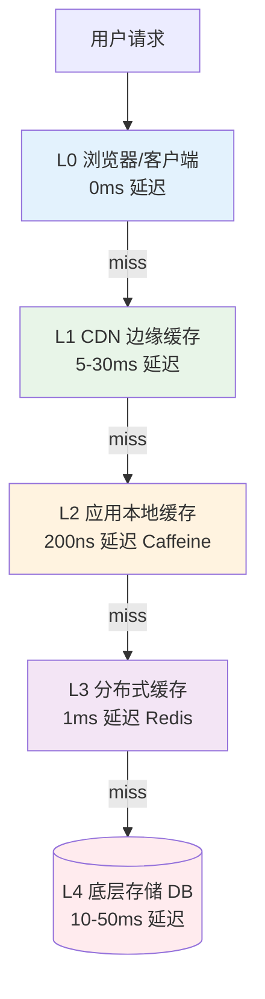

**每一层存在的物理边界依据**：

| 层级 | 物理位置 | 延迟 | 容量 | 每 GB 成本 | 代表 |
|---|---|---|---|---|---|
| L0 客户端 | 用户设备 | 0ms | MB 级 | 免费 | 浏览器 / App |
| L1 CDN | 边缘节点 | 5-30ms | TB 级 | 便宜 | Cloudflare / Akamai |
| L2 本地缓存 | 应用进程内 | 微秒级 | GB 级 | 内存价 | Caffeine / Guava |
| L3 分布式缓存 | 独立集群 | 毫秒级 | TB 级 | 内存价 | Redis / Memcached |
| L4 存储 | 持久化 | 10-100ms | PB 级 | 磁盘价 | MySQL / HBase |

**分层的数学根据**：延迟每高一个数量级，就需要新的一层来"截流"。**每层截住 80% 请求，只把 20% 打到下一层**——这就是分层的边际最优。

### 5.2 多级缓存数据流

**读取流程**：

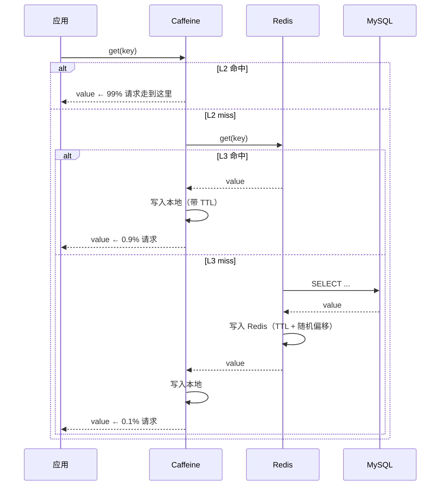

**关键点**：
1. **写入是"回填"**——每次 miss 都会把结果**沿路径反向写入所有上层**。
2. **每层 TTL 不同**：L2 通常几秒到几分钟（跨节点一致性），L3 几十分钟到几小时。
3. **TTL 必须加随机偏移**——避免 §1 那样同时过期。

**写入流程**（Cache-Aside 模式）：

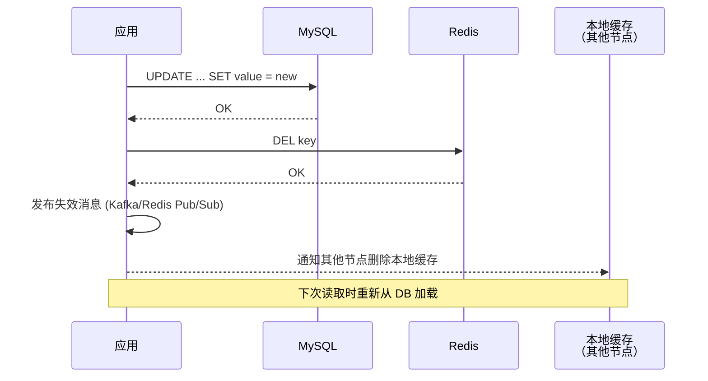

### 5.3 Caffeine + Redis 组合

**为什么 Caffeine + Redis 是 Java 生态"最佳组合"**？

**Caffeine 优势**：
- W-TinyLFU 算法（§4.4）命中率极高
- 进程内内存访问（200 ns 级别）
- 强并发（RingBuffer 无锁读写）

**Redis 优势**：
- 跨节点共享（多个应用实例看到同一份数据）
- 丰富数据结构（String / Hash / List / Set / ZSet）
- 持久化（RDB + AOF）
- 集群模式（Cluster / Sentinel）

**组合优势**：
- L2 (Caffeine) 抗**极高频热点**（避免打到 Redis）
- L3 (Redis) 抗**中低频请求**（避免打到 DB）
- 单机崩溃（L2 挂）→ 只影响该节点，L3 兜底
- Redis 崩溃（L3 挂）→ L2 仍能扛 80% 请求

**典型配置**：

```java
Cache<String, Product> l2 = Caffeine.newBuilder()
    .maximumSize(10_000)              // 10w 热点商品
    .expireAfterWrite(5, MINUTES)     // 5 分钟 TTL
    .recordStats()                    // 开启监控
    .build();
```

```
redis-cli:
  maxmemory 32gb
  maxmemory-policy allkeys-lru        # 淘汰策略
```

### 5.4 命中率联合估算

**多级缓存的联合命中率**是每一层的乘积逆运算：

$$
H_{\text{total}} = 1 - (1 - H_{L2})(1 - H_{L3})
$$

假设 $H_{L2} = 0.85$（L2 命中 85%），$H_{L3} = 0.90$（miss 之后打到 L3 命中 90%）：

$$
H_{\text{total}} = 1 - 0.15 \times 0.10 = 1 - 0.015 = 98.5\%
$$

**只有 1.5% 请求打到 DB**——这就是分层的威力。

**平均延迟**：

$$
T_{\text{avg}} = H_{L2} T_{L2} + (1-H_{L2}) H_{L3} T_{L3} + (1-H_{L2})(1-H_{L3}) T_{DB}
$$

代入数据：
- $T_{L2} = 0.2\text{μs}, T_{L3} = 1\text{ms}, T_{DB} = 30\text{ms}$
- $T_{\text{avg}} = 0.85 \times 0.0002 + 0.15 \times 0.9 \times 1 + 0.15 \times 0.1 \times 30 = 0.135 + 0.15 \times 3 = 0.585\text{ms}$

**99% 请求 < 1ms**——这是所有电商详情页追求的性能基线。

## 6. 一致性方案对比

### 6.1 Cache-Aside 主流选

**Cache-Aside** 是最常用的一致性模式。**读**：先查缓存，miss 则查 DB 并回填。**写**：先写 DB，再删缓存。

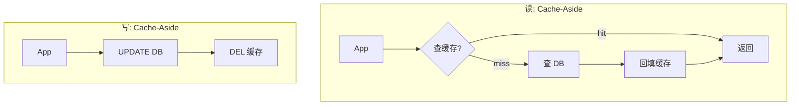

**优点**：简单、通用、绝大多数业务够用。

**缺点**：写路径下有并发脏读窗口（下节详解）。

### 6.2 Write-Through 强一致

**Write-Through**：**缓存层封装读写**，写操作**同步**穿透到 DB。

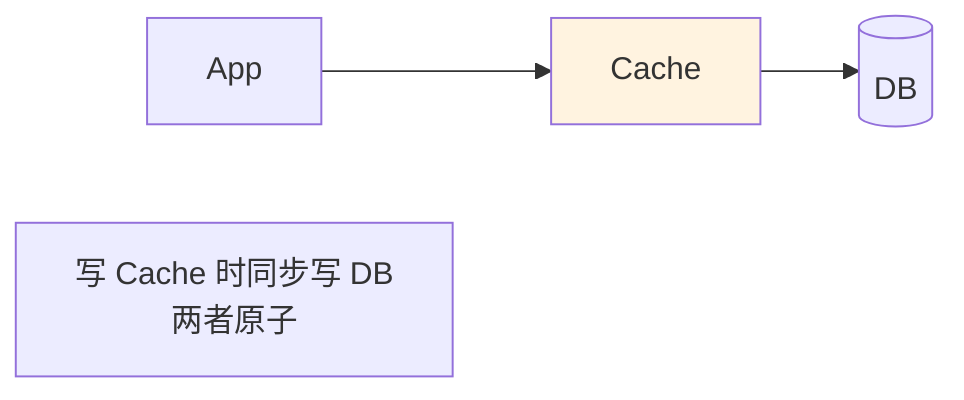

**优点**：**缓存和 DB 强一致**（同步写）。

**缺点**：
- 每次写都要等 DB 返回，**写延迟高**（等于 DB 写延迟）。
- 需要缓存层封装事务——**实现复杂**。
- 写入 QPS 上限受 DB 制约。

**适用**：写少读多、强一致性要求、缓存作为主访问入口（如 Ehcache + JPA）。

### 6.3 Write-Behind 高吞吐

**Write-Behind（Write-Back）**：**写只写缓存，DB 异步刷回**。

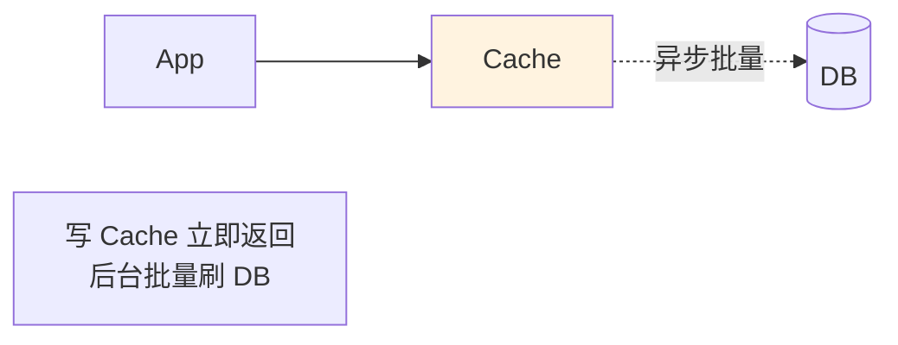

**优点**：**极致写性能**（缓存内存写 ~200ns），可以聚合批量写 DB。

**缺点**：
- 缓存挂了 **数据可能丢失**（未刷回 DB 的部分）。
- 缓存和 DB 之间**弱一致**。
- 实现复杂（需要脏数据队列、失败重试）。

**适用**：**高写入低一致性场景**——如日志、埋点、计数器。CPU 的 L1 write-back 就是这个思路。

### 6.4 先写 DB 后删缓存

**Cache-Aside 里"先删缓存"和"后删缓存"之争**：

**方案 A：先删缓存再写 DB** ❌

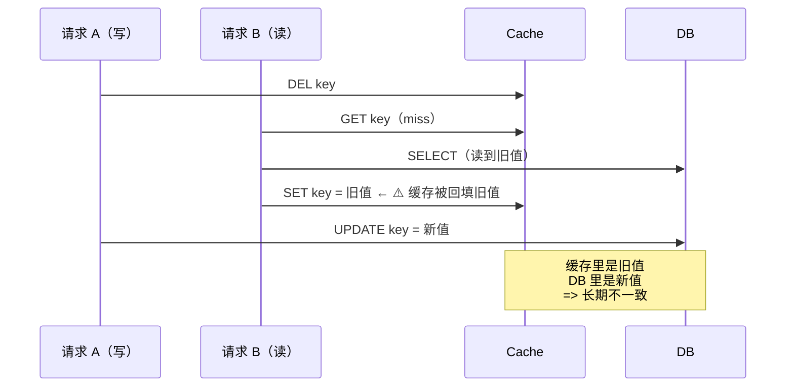

**问题**：并发场景下缓存被脏值污染，**直到下次过期才恢复**——不一致时间窗 = TTL（可能几十分钟）。

**方案 B：先写 DB 再删缓存** ✅

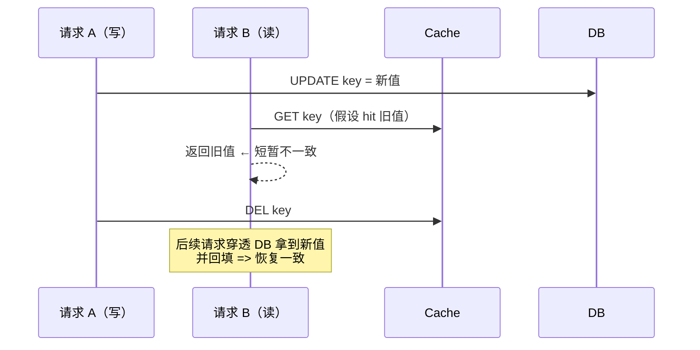

**问题**：**只有一个极短的不一致窗口**——请求 B 读到旧值 → 缓存被删 → 下次请求就一致。窗口 = 步骤"UPDATE 到 DEL"之间的时长（通常 < 10ms）。

**结论**：**先写 DB 再删缓存**是 Cache-Aside 的最优做法。**极端场景**（10ms 都不能容忍）叠加 **Double Delete**：

```java
public void update(Key k, Value v) {
    db.update(k, v);
    cache.delete(k);
    // Double Delete: 延迟 500ms 再删一次，防止刚删完又被回填旧值
    scheduledExecutor.schedule(() -> cache.delete(k), 500, MILLISECONDS);
}
```

## 7. 三大经典问题

### 7.1 缓存穿透原理

**定义**：请求查询**根本不存在的数据**，缓存和 DB 都没有，每次都打到 DB。

**典型场景**：
- 黑产扫描接口，用各种不存在的 ID 探测。
- 恶意攻击构造巨量不存在的 Key。

**数学模型**：设合法 Key 数 $N$，恶意 Key 数 $M \gg N$，攻击 QPS $Q$。**打到 DB 的 QPS**：

$$
Q_{\text{DB}} = Q \times \frac{M}{M+N} \approx Q
$$

**几乎 100% 打到 DB**——常规缓存完全失效。

**解决方案**：

**方案 1：空值缓存**
DB 也查不到时，缓存一个"空对象"（TTL 短）：

```java
Object result = cache.get(key);
if (result == NULL_MARKER) return null;   // 空值命中
if (result != null) return result;

result = db.query(key);
if (result == null) {
    cache.set(key, NULL_MARKER, 300);     // 空值 TTL 短（5 分钟）
} else {
    cache.set(key, result, 3600);
}
return result;
```

**缺点**：恶意 Key 太多时**缓存被空值撑爆**。

**方案 2：布隆过滤器**（详见 §7.4）——**在 Redis 之前挡一道**。

### 7.2 缓存击穿原理

**定义**：**单个热 Key 突然过期**，瞬间大量并发请求打到 DB。

**数学模型**：设热 Key 的 QPS 为 $Q_{\text{hot}}$，DB 单次查询耗时 $T_{\text{db}}$。**过期瞬间打到 DB 的并发**：

$$
\text{Concurrent} = Q_{\text{hot}} \times T_{\text{db}}
$$

若 $Q_{\text{hot}} = 10\text{w/s}, T_{\text{db}} = 30\text{ms}$，**并发 = 3000**——**足够压垮 DB**。

**解决方案**：

**方案 1：分布式锁**——**只让第一个请求查 DB**：

```java
public Object getWithLock(String key) {
    Object v = cache.get(key);
    if (v != null) return v;
    
    // 尝试拿分布式锁
    if (redis.setnx("lock:" + key, "1", 30)) {
        try {
            v = db.query(key);
            cache.set(key, v, 3600);
            return v;
        } finally {
            redis.del("lock:" + key);
        }
    } else {
        // 没拿到锁，等一下重试
        Thread.sleep(100);
        return getWithLock(key);
    }
}
```

**方案 2：热 Key 永不过期 + 后台异步更新**——**根本消灭"过期瞬间"**：

```java
// 定时任务，每 30 分钟主动更新热 Key
@Scheduled(fixedRate = 30 * 60 * 1000)
void refreshHotKeys() {
    for (String key : hotKeys) {
        Object v = db.query(key);
        cache.set(key, v);  // 不设 TTL
    }
}
```

**选型**：方案 1 适用于**热 Key 事先不知道**的场景；方案 2 适用于**热 Key 数量少可预知**的场景（如排行榜）。

### 7.3 缓存雪崩原理

**定义**：**大量 Key 同时过期** + 流量打到 DB → 全站雪崩。这就是 §1 的 1.2 亿场景。

**数学模型**：设 $M$ 个 Key 在同一时刻过期，全站 QPS $Q$，其中 $Q_{\text{miss}}$ 命中这批 miss。**打到 DB 的 QPS**：

$$
Q_{\text{DB}} = Q \times \frac{M}{N}
$$

若 $M = N$（全部同时过期），**100% 流量打到 DB**。DB 崩了，缓存回填失败，**下一波流量继续打 DB**——形成正反馈**雪崩**。

**解决方案三件套**：

| 方案 | 做法 | 防什么 |
|---|---|---|
| **TTL 随机化** | TTL = 基础时间 + 随机 0-60 分钟 | 防止同时过期（治本） |
| **多级缓存** | L2 本地 + L3 Redis | L3 挂了 L2 兜底 |
| **限流熔断** | DB 前加限流 | 即使打到 DB 也不会崩 |

```java
// ❌ §1 那一行反例
redis.setex(key, 86400, value);

// ✅ 正例
long ttl = 86400 + ThreadLocalRandom.current().nextInt(3600);
redis.setex(key, ttl, value);
```

**就这一行代码差别，避免 1.2 亿损失**。

### 7.4 布隆过滤器解剖

**布隆过滤器（Bloom Filter）**：用极小空间**判断 Key 是否可能存在**。

**数据结构**：一个 $m$ 位的位数组 + $k$ 个哈希函数。

**添加**：$k$ 个哈希函数把 Key 映射到 $k$ 个位置，全部置 1。

**查询**：$k$ 个位置全为 1 → **可能存在**；有任何一个为 0 → **一定不存在**。

```
位数组 (m=16 位): [0][0][0][0][0][0][0][0][0][0][0][0][0][0][0][0]

添加 "cat" (哈希到位置 1, 5, 10):
             [0][1][0][0][0][1][0][0][0][0][1][0][0][0][0][0]

添加 "dog" (哈希到位置 3, 7, 12):
             [0][1][0][1][0][1][0][1][0][0][1][0][1][0][0][0]

查询 "cat":  位置 1、5、10 都是 1 → 可能存在 ✓
查询 "fish": 位置 4、8、14 都是 0 → 一定不存在 ✓（不用查 DB！）
查询 "bird": 位置 3、5、12 都是 1（"cat"和"dog"污染） → 假阳性 ⚠️
```

**关键性质**：
- **假阳性**（说存在实际不存在）：有一定概率
- **假阴性**（说不存在实际存在）：**不可能**——正是这个性质让它能用作 DB 前置过滤器

**假阳性率公式**：

$$
P_{fp} \approx \left(1 - e^{-kn/m}\right)^k
$$

- $n$：已插入元素数
- $m$：位数组大小
- $k$：哈希函数个数

**最优 $k$**：$k^* = \frac{m}{n} \ln 2$

**实用数值**：**1 亿 Key，假阳性率 1%**：
$$
m = -\frac{n \ln P_{fp}}{(\ln 2)^2} = \frac{10^8 \times \ln 100}{0.48} \approx 9.6 \times 10^8 \text{ bits} = 120 \text{ MB}
$$

$k = \frac{9.6 \times 10^8}{10^8} \times 0.693 \approx 7$ 个哈希函数

**120MB 存 1 亿 Key**——比 Redis 存 1 亿 Key 的实际数据（几十 GB）便宜 100 倍。

**§1 团队重构后的方案**：

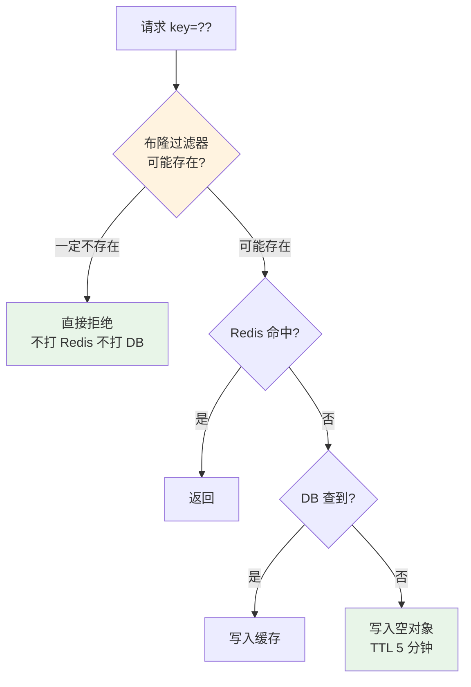

**双层防护**：**布隆过滤器（拦不存在的） + 空值缓存（兜底假阳性）**。

## 8. 常见反例陷阱

### 8.1 大 Key 反例

**反例**：某 App 把"用户全部好友列表"存为一个 Redis Hash，热门用户的好友列表达 50w 条 / 80MB。

**问题**：
- 一次 `HGETALL` 操作阻塞 Redis 主线程数百毫秒——**Redis 是单线程模型**，一个大 Key 会让所有其他请求排队。
- 网络传输 80MB 占满带宽——**千兆网卡 = 125MB/s**，一次传输占用 640ms。
- 主从同步时一个 Key 阻塞全集群——**主从复制是单线程**。

**解决**：
1. **拆分大 Key**：`friends:userId` → `friends:userId:0/1/2/...`（按 hash 分片）
2. **改用 SCAN**：分批读取而不是 HGETALL
3. **监控 Key 大小**：`redis-cli --bigkeys` 定期扫描告警

**规则**：**单 Key 大小 < 10KB**。超过就要拆。

### 8.2 热 Key 反例

**反例**：双 11 期间某爆款商品详情 Key 单点 QPS 达 50w，**单 Redis 节点被打爆**。

**问题**：Redis 集群模式下**一个 Key 只能落在一个节点**，无法通过加节点水平扩展。

**解决：热 Key 副本拆分**：

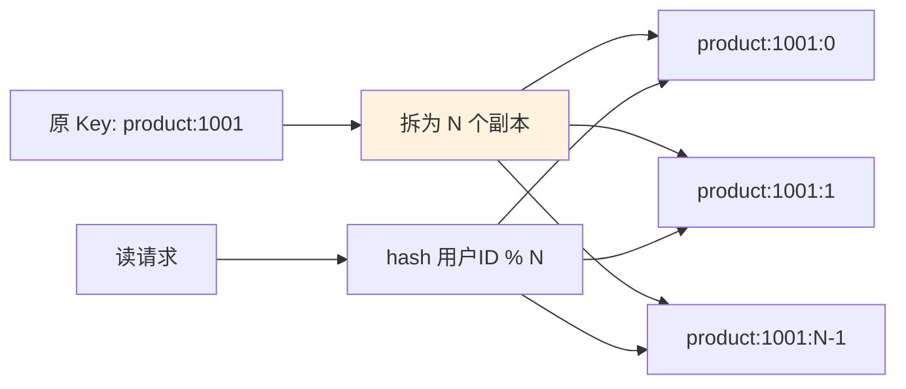

**关键代码**：

```java
int shard = userId.hashCode() % N_SHARDS;
String key = "product:1001:" + shard;
```

**代价**：写多份（写放大 N 倍）。**收益**：读 QPS 可以水平扩展 N 倍。

**热 Key 判定**：QPS > 1w/s 就是热 Key。

### 8.3 一致性反例

**反例**：用"先删缓存再写 DB"模式，并发场景下出现脏数据（详见 §6.4 方案 A 的时序图）。

**解决**：**先写 DB 再删缓存 + Double Delete 兜底**。

### 8.4 缓存挂了业务崩

**反例**：Redis 挂了，应用直接报错，整站不可用——**缓存反而成了单点**。

**问题**：**没有降级路径**。缓存本来是为了加速，反而变成了刚需。

**解决**：

```java
public Object get(String key) {
    try {
        Object v = cache.get(key);
        if (v != null) return v;
    } catch (Exception e) {
        log.warn("Cache failure, fallback to DB", e);
        metrics.increment("cache.failure");
    }
    
    // 降级：直读 DB + 限流保护
    if (!rateLimiter.tryAcquire()) {
        throw new BusinessException("System busy");   // 拒绝多余请求
    }
    return db.query(key);
}
```

**关键机制**：
1. **catch 异常**：缓存挂了不 throw 到业务
2. **降级读 DB**：短暂承压不崩
3. **限流保护**：避免全流量打 DB → 二次雪崩

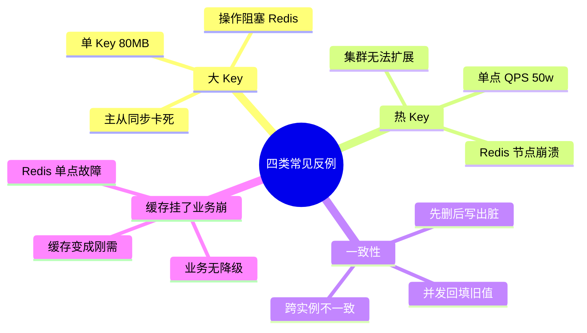

## 9. 演进与治理

### 9.1 V1 单机本地缓存

**规模**：单机部署、数据量小、QPS < 1w

**做法**：
- HashMap / Caffeine 进程内缓存
- 简单 TTL + LRU
- 不考虑一致性（重启丢就丢）

**适用**：MVP 起步、内部工具、单机应用

**升级信号**：QPS > 1w / 需要多节点共享 → V2

### 9.2 V2 分布式缓存

**规模**：多节点部署、需要数据共享、QPS 1w-10w

**做法**：
- Redis 单实例 / Sentinel 高可用
- Cache-Aside 模式
- TTL 随机化 + Key 命名规范

**适用**：业务规模化、常规互联网应用

**痛点**：
- 单 Redis 实例容量上限（32-64 GB）
- 单点性能瓶颈（10w QPS）
- 网络往返延迟（1-3ms 每次）

**升级信号**：QPS > 10w / 有极致延迟要求 → V3

### 9.3 V3 多级缓存体系

**规模**：超大规模、QPS 百万级、严格延迟要求

**做法**：
- Caffeine（L2）+ Redis Cluster（L3）+ DB 三级
- 热 Key 自动检测 + 本地提升
- 大 Key 监控 + 自动告警
- 缓存预热 + 灰度
- 命中率 / 大小 / 慢操作监控大盘
- 布隆过滤器 + 空值缓存双防
- 分布式锁防击穿
- 服务端限流 + 熔断

**适用**：大型互联网公司、电商 / 内容 / 社交大流量场景

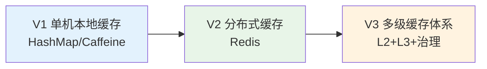

### 9.4 上线自检清单

每次新增缓存对照这张清单：

- [ ] Key 命名遵循规范（业务域:对象类型:对象ID）
- [ ] TTL 设置合理（且加了随机偏移）
- [ ] 大 Key 已评估（单 Key < 10KB）
- [ ] 热 Key 已识别（单 Key QPS < 1w）
- [ ] 一致性方案明确（Cache-Aside / Write-Through）
- [ ] 三大问题（穿透/击穿/雪崩）都有防护
- [ ] 缓存挂了的降级路径已演练
- [ ] 命中率 / 大小 / 慢操作监控就绪
- [ ] 写入 DB 失败的场景有兜底
- [ ] 容量评估留 30% buffer

## 10. 综合案例串讲

### 10.1 案例真相揭晓

回到 §1 那场 1.2 亿的雪崩，7 个疑问逐条作答：

**Q1（80/20 法则）**：见 §3.2。Zipf 分布的数学根源。**§1 团队的 100 万条券里，真正热点只有 20 万，缓存 20 万就能吃到 80% 命中**——但雪崩时命中率直接被清零。

**Q2（LRU 数据结构）**：见 §4.2。HashMap（O(1) 定位）× 双向链表（O(1) 移动/淘汰）联合，缺一不可。

**Q3（W-TinyLFU 命中率优势）**：见 §4.4。Count-Min Sketch 用 1MB 空间估计几亿 Key 的频次 + Aging 机制 + Window 准入过滤——**联合起来命中率比纯 LRU 高 15-25%**。

**Q4（多级缓存命中率）**：见 §5.4。$1 - (1-H_{L2})(1-H_{L3})$。0.85 × 0.90 → 98.5% 联合命中，99% 请求 < 1ms。

**Q5（三大问题模型）**：
- 穿透（§7.1）：请求不存在的数据，$Q_{\text{DB}} \approx Q$
- 击穿（§7.2）：单个热 Key 过期，并发 $= Q_{\text{hot}} \times T_{\text{db}}$
- 雪崩（§7.3）：大量 Key 同时过期，$Q_{\text{DB}} = Q \times M/N$ ← **§1 命中的正是这个**

**Q6（布隆过滤器）**：见 §7.4。$k$ 个哈希 + $m$ 位数组，1 亿 Key 只要 120MB 就能实现 1% 假阳性率——**这就是黑产扫描防御的根基**。

**Q7（先写 DB 后删缓存最优）**：见 §6.4。方案 B 只有极短不一致窗口（<10ms），方案 A 会长时间脏数据（=TTL）。

**§1 事故的完整根因链**：

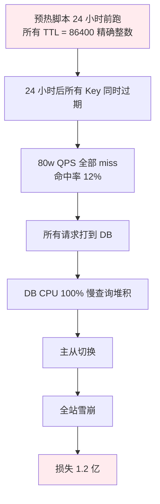

**修复只需一行**：

```java
long ttl = 86400 + ThreadLocalRandom.current().nextInt(3600);
```

### 10.2 一次查询的一生

用一个真实场景把本篇核心串起来——**用户查询商品详情页的完整生命周期**（重构后的多级缓存体系）：

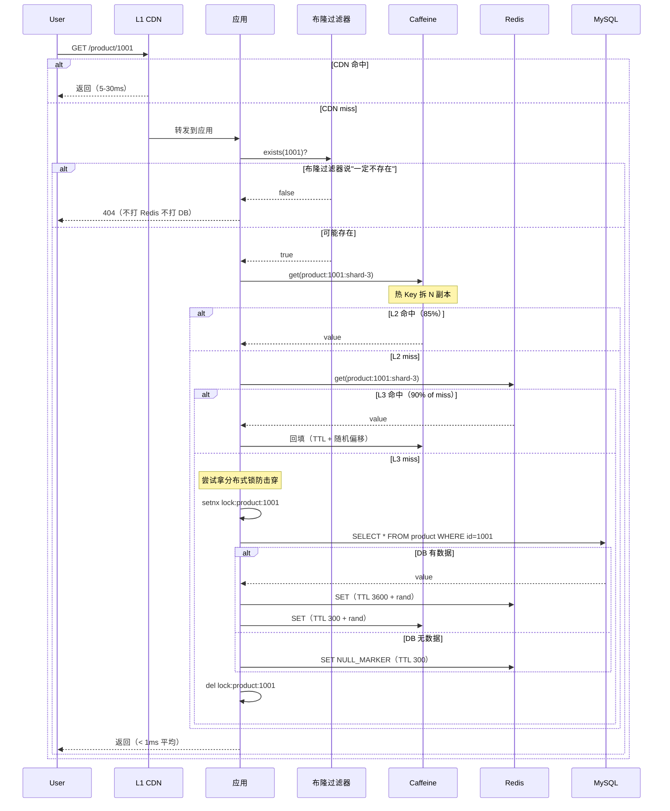

**关键点**：
1. **布隆过滤器**过滤黑产（§7.4）
2. **L2 Caffeine**（W-TinyLFU）吃 85% 请求（§4.4）
3. **L3 Redis**（拆热 Key 副本）吃 14.5% 请求（§8.2）
4. **分布式锁**防击穿（§7.2）
5. **TTL 随机化**防雪崩（§7.3）
6. **空值缓存**防穿透假阳性（§7.1）
7. **多级平均延迟 < 1ms**（§5.4）

**§1 团队重构后**：命中率从 98% 提升到 99.5%，双 11 平稳无事故。

### 10.3 设计哲学回扣

**哲学 1：空间换时间，最终一致换性能**——所有缓存的底层交易。**试图追求"缓存 + 强一致 + 零成本"是自欺欺人**。

**哲学 2：局部性即价值**——**没有局部性就没有缓存**。设计缓存前先问："这个数据访问服从 Zipf 分布吗？"如果是完全均匀的，缓存收益 = 容量占比，可能不如直接加大 DB 内存。

**哲学 3：失败优于错误**——缓存可以读不到数据（miss 一次），但不能读到错误数据。宁可穿透到 DB，也不要保留脏值。**"缓存不能变成业务的单点"是所有设计的底线**。

**哲学 4：细节决定生死**——**一个 TTL 忘加随机数 = 1.2 亿**。缓存里 100 个细节，做对 99 个不够，做错 1 个就崩。**上线前的自检清单不是形式主义**。

### 10.4 缓存速查表

**选型决策树**：

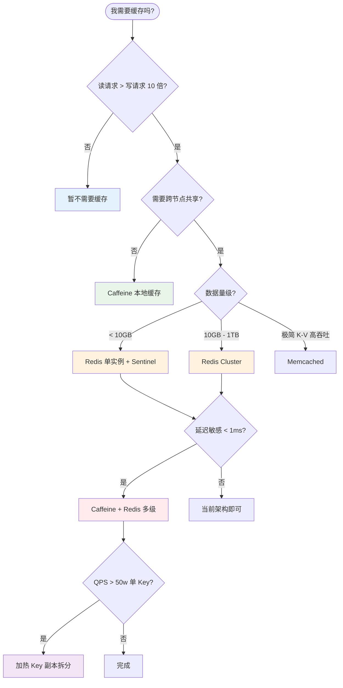

**方案对比**：

| 维度 | Caffeine（L2） | Redis（L3） | Memcached |
|---|---|---|---|
| **位置** | 进程内 | 独立集群 | 独立集群 |
| **数据结构** | 仅 K-V | 丰富 | 仅 K-V |
| **命中率** | 高（W-TinyLFU） | 取决于容量 | 取决于容量 |
| **持久化** | 无 | RDB+AOF | 无 |
| **集群** | 单机 | Cluster / Sentinel | 客户端分片 |
| **QPS** | 10w+ 单机 | 10w+ 单节点 | 20w+ 单节点 |
| **适用** | 热点数据本地缓存 | 通用分布式缓存 | 极简 K-V 高吞吐 |

**三大问题防护速查表**：

| 问题 | 表现 | 首要方案 | 兜底方案 |
|---|---|---|---|
| **穿透** | 大量不存在 Key 打 DB | 布隆过滤器 | 空值缓存（TTL 短） |
| **击穿** | 单热 Key 过期打 DB | 分布式锁 | 热 Key 永不过期 + 后台刷 |
| **雪崩** | 大量 Key 同时过期 | TTL 随机化 | 多级缓存 + 限流熔断 |

> **好的缓存 = 让 99% 请求快、让剩下 1% 慢得可控、让缓存本身挂了业务也能活**。

**最后一句话**：缓存是双刃剑——**用对了让你的系统快 100 倍，用错了让你的系统在最关键时刻崩溃**。§1 那个 1.2 亿只是因为没在 TTL 后面加一个随机数。**好的缓存设计，是把 100 个小细节都做对**。

下一章我们从"缓存"这个"读加速"话题，转向另一个高频优化话题——**如何让写入操作在不牺牲一致性的前提下也变快**（消息队列、异步化、批量化等主题的入口）。
