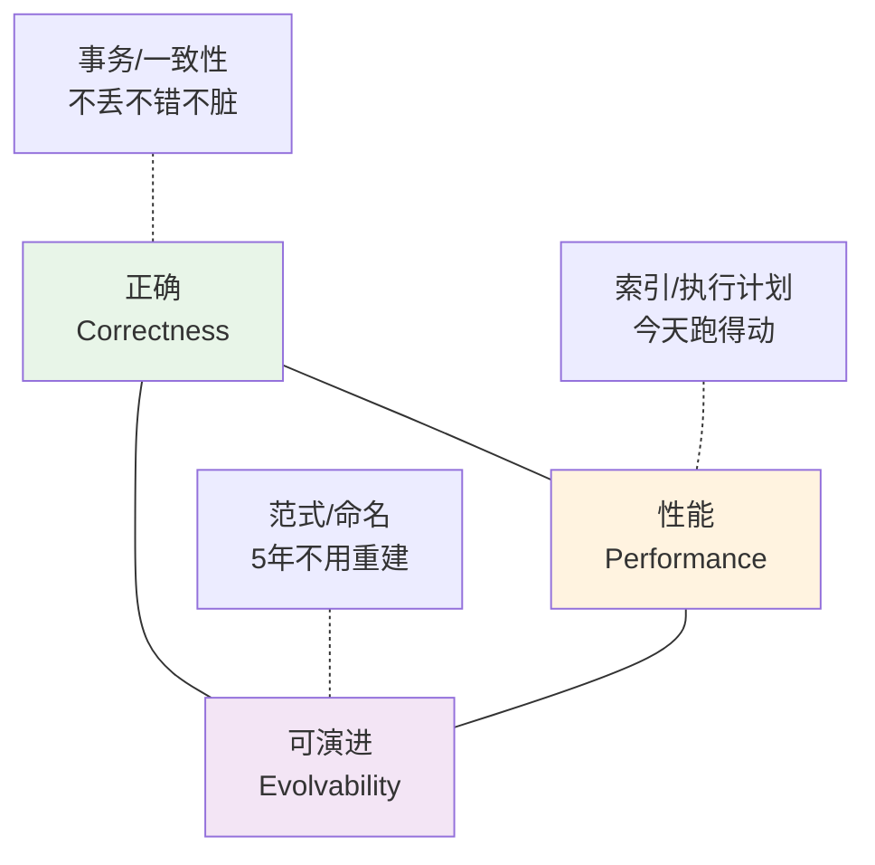
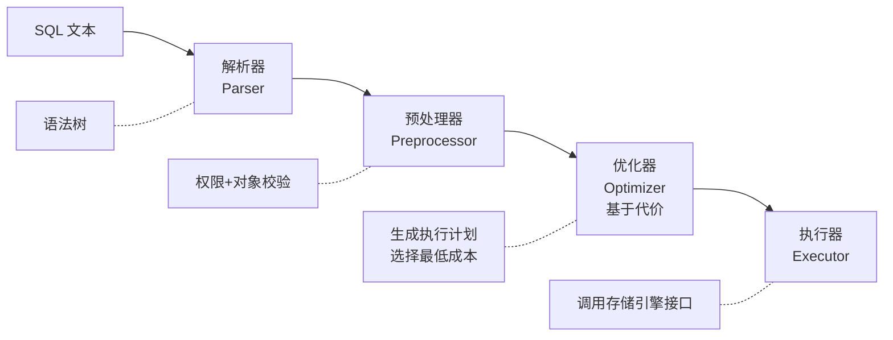
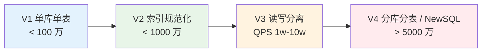
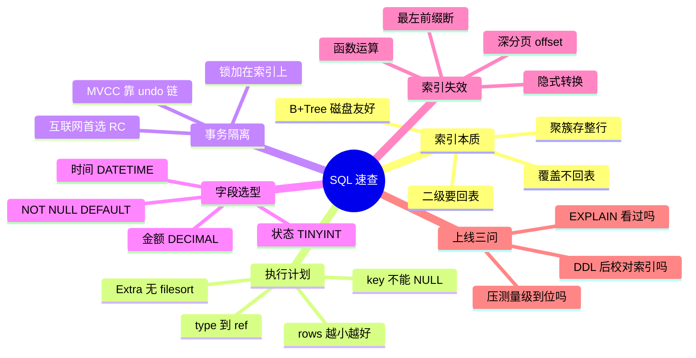

# 08.数据库SQL设计思想

> **本篇定位**：数据库是 99% 系统的"地基"——地基烂了，上层架构再漂亮也白搭。但绝大多数 SQL 事故并不来自"高深"的原理，而是来自**"看似合理却踩中原理红线"的日常代码**。本文从一次凌晨的连接池雪崩讲起，从 0 到 1 讲透 B+Tree 索引、EXPLAIN 执行计划、事务隔离与 MVCC 这些底层机制，最后回过头把"那条慢 SQL"的每一个字都摊开验尸。**读完这一篇，我们再看任何一条 SQL 都能读出它"在磁盘上会发生什么"。**

#### 目录介绍
- [1. 案例引入](#1-案例引入)
  - [1.1 凌晨的告警](#11-凌晨的告警)
  - [1.2 顺藤摸到根因](#12-顺藤摸到根因)
  - [1.3 我们要回答什么](#13-我们要回答什么)
- [2. 架构决策三角](#2-架构决策三角)
  - [2.1 三维度共制](#21-三维度共制)
  - [2.2 为什么这么切](#22-为什么这么切)
- [3. B+Tree 索引本质](#3-btree-索引本质)
  - [3.1 为什么是 B+Tree](#31-为什么是-btree)
  - [3.2 聚簇与二级](#32-聚簇与二级)
  - [3.3 索引深度算法](#33-索引深度算法)
  - [3.4 覆盖索引原理](#34-覆盖索引原理)
- [4. 执行计划解剖](#4-执行计划解剖)
  - [4.1 优化器工作流](#41-优化器工作流)
  - [4.2 统计信息机制](#42-统计信息机制)
  - [4.3 EXPLAIN 五问](#43-explain-五问)
  - [4.4 索引选择偏差](#44-索引选择偏差)
- [5. 事务与 MVCC](#5-事务与-mvcc)
  - [5.1 四种隔离级别](#51-四种隔离级别)
  - [5.2 undo 快照链](#52-undo-快照链)
  - [5.3 ReadView 机制](#53-readview-机制)
  - [5.4 锁的粒度谱系](#54-锁的粒度谱系)
- [6. 范式与反范式](#6-范式与反范式)
  - [6.1 三大范式推演](#61-三大范式推演)
  - [6.2 反范式的代价](#62-反范式的代价)
  - [6.3 冗余边界原则](#63-冗余边界原则)
- [7. 字段类型选择](#7-字段类型选择)
  - [7.1 存储对齐真相](#71-存储对齐真相)
  - [7.2 索引效率差异](#72-索引效率差异)
  - [7.3 金额时间陷阱](#73-金额时间陷阱)
  - [7.4 NULL 的代价](#74-null-的代价)
- [8. 索引失效八宗罪](#8-索引失效八宗罪)
  - [8.1 隐式类型转换](#81-隐式类型转换)
  - [8.2 函数与运算](#82-函数与运算)
  - [8.3 最左前缀违反](#83-最左前缀违反)
  - [8.4 深分页陷阱](#84-深分页陷阱)
- [9. 反例与演进](#9-反例与演进)
  - [9.1 四大经典反例](#91-四大经典反例)
  - [9.2 V1-V4 演进](#92-v1-v4-演进)
- [10. 综合案例串讲](#10-综合案例串讲)
  - [10.1 案例真相揭晓](#101-案例真相揭晓)
  - [10.2 一条 SQL 的一生](#102-一条-sql-的一生)
  - [10.3 设计哲学回扣](#103-设计哲学回扣)
  - [10.4 SQL 速查表](#104-sql-速查表)


## 1. 案例引入

### 1.1 凌晨的告警

某 SaaS 平台平稳运行了 3 年，日均订单从 1000 涨到了 40 万，数据表也从 20 万行悄悄涨到 843 万行。**2024 年 3 月 12 日 02:15**，值班工程师被 P1 告警砸醒：**"数据库连接池 100% 打满，全站接口 5xx"**。登上主库看 `SHOW PROCESSLIST`：

```
+------+------+----------+-------+---------+--------------------------------------+
| Id   | User | Host     | db    | Time(s) | Info                                 |
+------+------+----------+-------+---------+--------------------------------------+
| 1207 | app  | 10.x.x.1 | order | 320     | SELECT * FROM t_order_detail         |
|      |      |          |       |         |   WHERE user_id=8801 AND status=1    |
|      |      |          |       |         |   ORDER BY created_at DESC LIMIT 20  |
| 1208 | app  | 10.x.x.2 | order | 318     | SELECT * FROM t_order_detail ...     |
| 1209 | app  | 10.x.x.3 | order | 315     | SELECT * FROM t_order_detail ...     |
| ...  |  x   200+ 条完全相同的查询                                                 |
+------+------+----------+-------+---------+--------------------------------------+
```

看起来再普通不过的一条订单列表查询——三年跑得好好的——**为什么今夜集体卡死 5 分多钟不出结果？**

```sql
-- 罪魁祸首
SELECT * FROM t_order_detail
WHERE user_id = ? AND status = 1
ORDER BY created_at DESC
LIMIT 20;
```

`EXPLAIN` 出来的执行计划让人一身冷汗：

```
+----+-------------+----------------+------+------+---------+------+---------+-------------+
| id | select_type | table          | type | key  | key_len | ref  | rows    | Extra       |
+----+-------------+----------------+------+------+---------+------+---------+-------------+
|  1 | SIMPLE      | t_order_detail | ALL  | NULL |    NULL | NULL | 8420315 | Using where;|
|    |             |                |      |      |         |      |         | Using filesort
+----+-------------+----------------+------+------+---------+------+---------+-------------+
```

`type=ALL`（全表扫）+ `rows=8420315`（扫 800 多万行）+ `Using filesort`（额外磁盘排序）——**这一条 SQL 一秒都可能撑不住，200 个并发直接把 IO 吃干**。

### 1.2 顺藤摸到根因

`user_id` 上原本是有索引的——**为什么现在没了？**

顺着 DDL 审计日志一路回溯：

- **2021-05**：建表，`user_id` 上有 `idx_user`
- **2023-09**：一次加字段的 DDL 用了 `pt-online-schema-change`，脚本自动重建表结构——**旧索引被"意外遗漏"了**
- **半年过去了**：`user_id=?` 查询在数据量小时全表扫也不慢（4 秒内），从没触发慢日志（阈值设的是 5 秒）
- **今夜**：数据涨到 843 万，全表扫恰好慢到 6-10 秒——**并发一叠加，连接池瞬间雪崩**

事故背后不是"技术不会"，是**这 7 条"每条都对但合起来就爆炸"的日常操作**：

1. **DDL 用工具"重建表"却没有比对索引清单**——索引静默丢失
2. **慢查询阈值 5 秒**——4.5 秒的问题永远看不见
3. **没有索引使用率监控**（`sys.schema_unused_indexes`）——用没用没人知道
4. **SELECT \*** ——把大字段 `remark TEXT` 也拉出来，回表更贵
5. **`ORDER BY created_at DESC` 没被索引覆盖**——filesort 磁盘临时表
6. **`LIMIT 20` 但 `WHERE` 命中几十万行**——先排序再取 20，无谓耗尽内存
7. **压测数据量只有 10 万**——生产量级问题测不出来

### 1.3 我们要回答什么

带着这个事故，中间 3-9 章要**逐条挖开** 7 个核心疑问：

**① 为什么全表扫描一定是灾难？** InnoDB 的 B+Tree 到底是怎么组织数据的，扫 800 万行意味着多少次磁盘 IO？（→ §3）

**② 优化器凭什么判断该不该用索引？** 为什么加了索引它还可能不用？（→ §4）

**③ `WHERE user_id=? AND status=1` 加联合索引，字段顺序凭什么这么排？** 最左前缀原理到底是什么？（→ §3.4 / §8.3）

**④ `SELECT *` 到底损失了什么？** 为什么它会阻止"覆盖索引"？（→ §3.4 / §8.1）

**⑤ 事务隔离级别选错会怎样？** MVCC 的 ReadView 是什么？（→ §5）

**⑥ 三大范式今天还要遵守吗？什么时候要反范式？** 冗余到什么程度算过头？（→ §6）

**⑦ 字段类型（FLOAT 存金额、VARCHAR(255) 存所有字符串）为什么是"慢性癌"？** 未来改类型的代价有多大？（→ §7）

第 10 章会把这 7 个问号一个不漏地按住答清。

## 2. 架构决策三角

### 2.1 三维度共制

数据库设计不是"追求最优"，是**在三个方向上做加权取舍**：



**疑惑**：能不能三者都拿满？

**论证**：
1. 追求"极致正确"→ 全用严格范式、每个操作事务包裹 → JOIN 一堆、锁一大片 → 性能塌
2. 追求"极致性能"→ 反范式冗余、去事务、少索引 → 数据不一致、字段类型将就 → 5 年后重建
3. 追求"极致可演进"→ 全 JSON、无 schema → 无法索引、查询能力废掉 → 性能塌
4. 三者是**互相约束**的钝三角，**没有单点最优解，只有场景最优解**

**结论**：不同业务在三角上偏重不同——**交易系统偏正确、报表系统偏性能、平台系统偏可演进**。数据库设计的第一步不是画表，而是回答"我要在这个三角上站哪儿"。

### 2.2 为什么这么切

后面 3-9 章不是随机排列的，而是**围绕这个三角逐层向内挖**：

| 章 | 层次 | 三角对应 |
|---|---|---|
| §3 B+Tree 索引 | 存储层原理 | 性能 |
| §4 执行计划 | 优化器行为 | 性能 |
| §5 事务与 MVCC | 并发控制 | 正确 |
| §6 范式与反范式 | 数据建模 | 可演进 |
| §7 字段类型 | schema 细节 | 三者兼顾 |
| §8 索引失效 | 反面教材 | 性能 |
| §9 反例演进 | 时间维度 | 可演进 |

**理解了这个三角，SQL 层面的所有"该怎么做"都能推出来**。

## 3. B+Tree 索引本质

### 3.1 为什么是 B+Tree

**疑惑**：内存里最快的是哈希表 O(1)，为什么 MySQL 索引选 B+Tree 而不选哈希？

**论证**：
1. **磁盘 IO 是数量级瓶颈**：一次随机 IO ≈ 10ms，一次内存访问 ≈ 100ns，**差 10 万倍**
2. **B+Tree 每层扇出高**：InnoDB 页 16KB，一个内部节点能存 ~1200 个 key（key + 页指针 ≈ 13 字节）
3. **三层能装多少数据**：$1200 \times 1200 \times \frac{16\text{KB}}{100\text{B}} \approx 2.3\text{亿行}$（假设行 100 字节）
4. **单次点查最多 3 次 IO**（还常常前两层被 buffer pool 命中，只需 1 次 IO）
5. **范围查询**：叶子节点是双向链表，**顺序读没有额外代价**——这是哈希做不到的
6. **哈希索引的致命短板**：不支持范围、不支持 `ORDER BY`、不支持前缀匹配

**结论**：B+Tree 是"磁盘 IO 为主 + 支持范围"两个约束下的联合最优解——**不是巧合，是数学必然**。

```
                    ┌──────────────┐
                    │  根节点(1页) │        ← 常驻内存
                    │ [10│50│90│…] │
                    └──┬───┬───┬───┘
             ┌─────────┘   │   └─────────┐
             ▼             ▼             ▼
       ┌──────────┐  ┌──────────┐  ┌──────────┐
       │ 中间节点 │  │ 中间节点 │  │ 中间节点 │   ← 大概率命中 buffer pool
       │[10│20│…] │  │[50│60│…] │  │[90│100│…]│
       └──┬───┬───┘  └──┬───┬───┘  └──┬───┬───┘
          ▼   ▼         ▼   ▼         ▼   ▼
        [叶] [叶] ←→   [叶] [叶] ←→   [叶] [叶]     ← 存实际数据/主键
                        (双向链表，范围查询顺序读)
```

### 3.2 聚簇与二级

**疑惑**：为什么 InnoDB 主键查询比二级索引查询快？

**论证**：

InnoDB 的表**本身就是一棵按主键组织的 B+Tree**——**叶子节点直接存整行数据**。这叫**聚簇索引（Clustered Index）**：

```
主键索引 (聚簇)
├─ 叶节点: [主键 | 完整数据行]

二级索引
├─ 叶节点: [索引列值 | 主键]  ← 只存主键，不存数据

查询 SELECT name FROM t WHERE age=20:
  1. 二级索引 idx_age 找到 age=20 对应的主键 id=1234    (第一棵树)
  2. 回主键索引查 id=1234 拿到完整行                     (第二棵树) ← "回表"
```

**结论**：**每次二级索引查询默认要"回表"一次**。所以"少几次回表" = 显著性能差异——这就引出下面的覆盖索引。

### 3.3 索引深度算法

**疑惑**：数据量涨 10 倍，索引查询会变慢 10 倍吗？

**论证**：
1. B+Tree 深度公式：$h = \lceil \log_m N \rceil$，其中 $m$ 是扇出，$N$ 是数据量
2. InnoDB 典型扇出 $m \approx 1200$
3. 100 万行 → $\log_{1200} 10^6 \approx 1.95$ → **2 层**
4. 1 亿行 → $\log_{1200} 10^8 \approx 2.6$ → **3 层**  
5. 1000 亿行 → $\log_{1200} 10^{11} \approx 3.5$ → **4 层**
6. **数据量涨 10 万倍，深度只涨 1 层，IO 只多 1 次**

**结论**：**B+Tree 是"对数级增长"**——这就是它扛得住海量数据的核心。真正让查询变慢的不是深度，是**扫描行数**（`rows` 字段），也就是全表扫和索引扫的天壤之别。

### 3.4 覆盖索引原理

**疑惑**：什么叫"覆盖索引"？为什么工程师说它是"银弹"？

**论证**：

再看开篇 SQL：

```sql
SELECT * FROM t_order_detail
WHERE user_id = ? AND status = 1
ORDER BY created_at DESC
LIMIT 20;
```

假设建了联合索引 `idx_user_status_time (user_id, status, created_at)`：

| 场景 | 索引能覆盖到哪一步 | 需不需要回表 |
|---|---|---|
| `SELECT *`（含大字段 remark） | 索引扫→拿到主键→回表拿整行 | ✅ 每行都要回表 |
| `SELECT id` | 索引里就有主键 | ❌ 完全不回表 |
| `SELECT id, user_id, status, created_at` | 索引里都有 | ❌ 完全不回表 |

**回一次表就是一次随机 IO**——20 行需要 20 次回表，SSD 上约 2ms，机械盘 200ms。**如果能"只查索引里有的字段"，就完全绕过回表**——这叫覆盖索引。

**结论**：覆盖索引 = **索引 = 迷你表**。开篇 `SELECT *` 的第一个大罪就是**放弃了覆盖索引的可能**。

## 4. 执行计划解剖

### 4.1 优化器工作流

**疑惑**：一条 SQL 到 MySQL 里发生了什么？为什么"同样的 SQL"有时候用索引有时候不用？

**论证**：

MySQL 处理一条 SQL 分四步：



优化器的核心动作是**枚举所有可能的执行方案，选代价最低的**。代价公式简化：

$$\text{Cost} = w_{io} \cdot \text{IOs} + w_{cpu} \cdot \text{rows}$$

它凭什么估算 IOs 和 rows？——**统计信息**。

### 4.2 统计信息机制

**疑惑**：为什么"刚导入完数据"的表查询有时候巨慢？

**论证**：
1. InnoDB 用**抽样统计**：默认对每个索引采样 20 页，估算基数（cardinality）
2. **基数 = 该索引列去重后的值数** → 决定选择性
3. 若统计信息陈旧（`ANALYZE TABLE` 没跑），优化器可能**误判某索引选择性极低而放弃**
4. 反例：某表 `status` 字段刚建索引，统计信息还没更新，优化器以为 status 只有 1-2 种取值不值得走索引 → 全表扫

**结论**：**导入大量数据、执行 DDL 之后要主动 `ANALYZE TABLE`**，让统计信息新鲜——**这一步能救活 30% 的"莫名慢查询"**。

### 4.3 EXPLAIN 五问

看 `EXPLAIN` 只需要盯五个字段：

| 字段 | 意义 | 危险信号 |
|---|---|---|
| **type** | 访问方式 | `ALL`(全表) / `index`(全索引扫) 都要警惕 |
| **key** | 实际使用的索引 | `NULL` = 没用索引 |
| **key_len** | 索引使用长度 | 越大越好（联合索引用满几列） |
| **rows** | 估算扫描行数 | > 1w 要警惕 |
| **Extra** | 附加信息 | `Using filesort` / `Using temporary` = 磁盘临时表 |

**type 完整层级**（从坏到好）：

```
ALL < index < range < ref < eq_ref < const < system
全表   全索引   范围     普通    连接查唯一  常量    系统表
```

**理想目标**：`type >= ref`，`rows` 尽量小，`Extra` 不出现 `Using filesort`。

### 4.4 索引选择偏差

**疑惑**：明明加了索引，为什么优化器"故意不用"？

**论证**：常见 5 种原因

| 原因 | 说明 |
|---|---|
| 数据倾斜 | 某个值占了 90%（如 `status=0` 是历史订单），走索引反而慢 |
| 统计陈旧 | 优化器认为选择性很差 |
| 隐式转换 | `WHERE phone = 13800001111`（phone 是 varchar），触发全表扫 |
| 索引长度过长 | 优化器嫌回表贵，直接全表 |
| 强制 `FORCE INDEX` 反效果 | 强制走某索引反而更慢 |

**结论**：优化器不是"傻"，是**在它掌握的信息下选它认为最优的路径**。修 SQL 前先问：**它拿到的信息对吗？**

## 5. 事务与 MVCC

### 5.1 四种隔离级别

**疑惑**：为什么 MySQL 默认 `RR`（可重复读），而 Oracle 默认 `RC`（读已提交）？

**论证**：

四种隔离级别处理的是这 3 种并发异常：

| 隔离级别 | 脏读 | 不可重复读 | 幻读 | 性能 |
|---|---|---|---|---|
| **Read Uncommitted** | ⚠️ | ⚠️ | ⚠️ | 最好 |
| **Read Committed（Oracle 默认）** | ✅ | ⚠️ | ⚠️ | 好 |
| **Repeatable Read（MySQL 默认）** | ✅ | ✅ | ⚠️(InnoDB 靠 gap lock 解决) | 中 |
| **Serializable** | ✅ | ✅ | ✅ | 差 |

**为什么 MySQL 默认 RR**：历史包袱——早期基于 binlog 语句复制（statement-based）必须防止不可重复读，否则主从数据不一致。

**结论**：**互联网业务大多数用 RC 就够**——性能更好、锁范围小、死锁少。选 RR 之前问自己："我真的用得到可重复读的语义吗？"

### 5.2 undo 快照链

**疑惑**：一个事务修改了数据，其他事务怎么"看到修改前的值"？

**论证**：

InnoDB 的每行数据都带两个"隐藏字段"：

- `DB_TRX_ID`（6 字节）：最后修改本行的事务 ID
- `DB_ROLL_PTR`（7 字节）：指向 undo log 中"修改前版本"

多次修改形成 **undo 链**：

```
当前版本 (trx_id=100, name='ccc')
    │ DB_ROLL_PTR
    ▼
版本2   (trx_id=80,  name='bbb')
    │ DB_ROLL_PTR
    ▼
版本1   (trx_id=50,  name='aaa')
    │ DB_ROLL_PTR
    ▼
   NULL (最早)
```

其他事务读这行时，**从当前版本沿 DB_ROLL_PTR 往回走，找到它"能看见"的版本**——这就是 MVCC 的基础。

### 5.3 ReadView 机制

**疑惑**：怎么判断"能不能看见某个版本"？

**论证**：

事务启动时会拍一张快照——**ReadView**：

```
ReadView {
  m_ids     = [80, 100, 120],    // 当前活跃的未提交事务
  min_trx_id = 80,               // 最小活跃事务
  max_trx_id = 130,              // 下一个将分配的事务 ID
  creator_trx_id = 110           // 本事务 ID
}
```

判断规则（对每行沿 undo 链回溯，直到找到可见版本）：

```
trx_id < min_trx_id      → 已提交，可见 ✅
trx_id ≥ max_trx_id      → 未来事务，不可见 ❌
min_trx_id ≤ trx_id < max_trx_id:
    ├─ trx_id ∈ m_ids   → 活跃中，不可见 ❌
    └─ trx_id ∉ m_ids   → 已提交，可见 ✅
```

**RC 与 RR 的差别**：
- **RC**：每条 SQL 都重建 ReadView → 每次都能看到最新已提交
- **RR**：事务第一条 SQL 建一次 ReadView，之后一直复用 → 整个事务视角稳定

**结论**：MVCC 用**空间**（undo 链）换**时间**（读写不阻塞），是并发能力的根基。

### 5.4 锁的粒度谱系

InnoDB 的锁按粒度从大到小：

```
表锁          ← LOCK TABLES / DDL
  ├─ 意向锁 IS / IX     ← 事务先加意向锁再加行锁，避免全表扫
  └─ 元数据锁 MDL       ← DDL 期间禁止 DML

行锁          ← 常用
  ├─ Record Lock       ← 精确锁 1 行
  ├─ Gap Lock          ← 锁间隙（RR 下防幻读）
  └─ Next-Key Lock     ← Record + Gap 组合
```

**关键认知**：**行锁是加在索引上的，不是加在数据行上的**——如果 `WHERE` 没走索引，行锁会退化成表锁——这是死锁大户。

## 6. 范式与反范式

### 6.1 三大范式推演

**疑惑**：三大范式今天还要遵守吗？

**论证**：范式不是"教条"，是**用严格规则消除数据冗余带来的一致性风险**。

**1NF**：列不可再分。反例：`phones = "13800001111,13800002222"`——统计"有多少个 138 开头的手机号"要 LIKE 全表扫。

**2NF**：非主键完全依赖主键。反例：联合主键 `(order_id, product_id)` 的表里放 `product_name`——`product_name` 只依赖 `product_id`，改名要改所有行。

**3NF**：非主键之间不能有传递依赖。反例：员工表放 `dept_id, dept_name`——改部门名要更新所有员工行。

**结论**：**范式的本质是"一个事实只在一处存放"**——它压根不是关于表结构漂亮不漂亮，是关于**"当这个事实变了，我要在几个地方同步"**。

### 6.2 反范式的代价

反范式 = 主动接受冗余以换取查询速度。

| 场景 | 反范式做法 | 代价 |
|---|---|---|
| 订单表冗余 `product_name` | 下单时快照，避免 JOIN | 商品改名后订单显示的仍是旧名（但这恰恰是业务需要的历史快照） |
| 订单表冗余 `user_nickname` | 列表页少 JOIN | 用户改昵称后订单还显示旧名（可能是 bug） |
| 报表宽表 | 一张表几十列打通所有维度 | 更新代价高、维护复杂 |

**判断反范式的三条准则**：
1. **业务确实高频查询这个字段**（每天百万次以上再考虑）
2. **该字段一旦写入就基本不变**（如订单商品名——业务本就要留历史快照）
3. **有明确的同步机制兜底**（如 binlog + 消息触发）

### 6.3 冗余边界原则

**结论**：

- **交易主表 / 强一致场景**：严守 3NF
- **列表 / 详情页读放大场景**：可冗余"快照类"字段
- **报表 / 数仓 / 搜索**：直接反范式打宽表

**红线**：**永远不要为了"少一次 JOIN"冗余"会经常变的可变字段"**——比如冗余 `user_status` 是灾难。

## 7. 字段类型选择

### 7.1 存储对齐真相

**疑惑**：`VARCHAR(20)` 和 `VARCHAR(255)` 存"张三"占的空间一样吗？

**论证**：
- 存储上：`VARCHAR` 变长，两个都只占**实际长度 + 1~2 字节长度前缀** → 一样
- **但索引不一样**！MySQL 会**按声明的最大长度分配内存**做排序缓冲——`VARCHAR(255)` 索引占的内存是 `VARCHAR(20)` 的十几倍
- 联合索引里，一个 `VARCHAR(255)` 会挤压其他列的空间（InnoDB 单索引最长 3072 字节）

**结论**：**VARCHAR 的长度是"上限"不是"随便设"**——设的是"业务确定的最大值 + 少量冗余"，不是"反正是 varchar 我设 255 图省事"。

### 7.2 索引效率差异

字段类型直接影响索引效率：

| 类型 | 大小 | 索引效率 | 使用场景 |
|---|---|---|---|
| `TINYINT` | 1 字节 | 极高 | 状态、标志位 |
| `INT` | 4 字节 | 高 | 一般主键、外键 |
| `BIGINT` | 8 字节 | 高 | 大表主键、雪花 ID |
| `VARCHAR(50)` | ~50 字节 | 中 | 用户名等 |
| `TEXT` | 变长 | 低 | 前 N 字节可索引（前缀索引） |
| `JSON` | 变长 | 极低（需函数索引） | 灵活字段 |

**同数据量下，索引占用 = 索引深度 × IO 次数**。选窄类型 = 树更矮更快。

### 7.3 金额时间陷阱

**FLOAT / DOUBLE 存金额**是灾难：

```sql
mysql> SELECT 0.1 + 0.2;
+---------------------+
| 0.1 + 0.2           |
+---------------------+
| 0.30000000000000004 |
```

**IEEE 754 二进制浮点无法精确表示十进制小数** → 财务对账永远差几分钱。

**正确做法**：

| 数据 | 类型 | 理由 |
|---|---|---|
| 金额 | `DECIMAL(15,2)` 或 `BIGINT` 存分 | 精确 |
| 时间 | `DATETIME(3)` 或 `BIGINT` 存毫秒 | 精确 + 时区无关 |
| 手机号 | `VARCHAR(20)` | 有前导 0 + 可能 +86 前缀 |
| 状态 | `TINYINT` + 业务层枚举 | 灵活加值不用 ALTER |

### 7.4 NULL 的代价

**疑惑**：字段允许 NULL 有什么问题？

**论证**：
1. **索引失效风险**：`WHERE col IS NULL` 老版本 MySQL 走不了索引（新版能走但性能差）
2. **聚合陷阱**：`COUNT(col)` 会跳过 NULL 值，和 `COUNT(*)` 结果不同
3. **额外存储**：InnoDB 每行有 NULL 位图，每个 NULL 字段占 1 bit
4. **代码陷阱**：Java 层判 null 一不小心 NPE

**结论**：**字段尽量 `NOT NULL DEFAULT`**——用 `""` 或 `0` 或 `1970-01-01` 兜底，业务层自己判"零值"。

## 8. 索引失效八宗罪

开篇的 SQL 其实索引不是"不存在"，是"用不上"。八种典型失效场景：

### 8.1 隐式类型转换

```sql
-- phone 是 VARCHAR(20)，写数字触发 CAST，索引失效
WHERE phone = 13800001111        ❌
WHERE phone = '13800001111'      ✅
```

MySQL 会对**列**做 `CAST(phone AS SIGNED)`——一旦对列做函数运算，索引就失效。

### 8.2 函数与运算

```sql
WHERE YEAR(created_at) = 2024              ❌
WHERE created_at >= '2024-01-01'
  AND created_at <  '2025-01-01'           ✅

WHERE amount * 2 > 100                     ❌  
WHERE amount > 50                          ✅
```

**任何"在列上做运算"都让索引失效**——除非用**函数索引**（MySQL 8+）。

### 8.3 最左前缀违反

联合索引 `(a, b, c)` 本质上是排好序的"复合键"：

```
(a1,b1,c1) < (a1,b1,c2) < (a1,b2,c1) < (a2,b1,c1) < ...
```

**按最左前缀检索才有序**：

| 查询 | 能用哪几列的索引 |
|---|---|
| `WHERE a=? AND b=? AND c=?` | ✅ a、b、c 都用 |
| `WHERE a=? AND b=?` | ✅ a、b 用 |
| `WHERE a=? AND c=?` | ✅ 只 a 用 |
| `WHERE b=? AND c=?` | ❌ 完全用不上 |
| `WHERE a=? AND b>? AND c=?` | ✅ a、b 用；c 用不上（b 是范围断了顺序） |

**规律**：**等值→范围→排序**是最优联合索引顺序。

### 8.4 深分页陷阱

```sql
SELECT * FROM t_order ORDER BY id LIMIT 1000000, 20;
```

`LIMIT 1000000, 20` 意味着**扫 1000020 行再丢弃前 100 万行**——**offset 越大越慢**。

**正确做法**——游标分页：

```sql
-- 上次结果最后一行 id 是 lastId
SELECT * FROM t_order 
WHERE id > ? ORDER BY id LIMIT 20;
```

或者先用覆盖索引拿到主键再回表：

```sql
SELECT o.* FROM t_order o
JOIN (
    SELECT id FROM t_order ORDER BY id LIMIT 1000000, 20
) t ON o.id = t.id;
```

## 9. 反例与演进

### 9.1 四大经典反例

**反例 1：SELECT \***

```sql
SELECT * FROM t_user WHERE id = ?;   -- 大字段 remark TEXT 也拉出
```

**代价**：网络传输大、内存占用高、**阻止覆盖索引**、表加字段后自动包含引入兼容问题。

**修法**：明确列出必需字段。

**反例 2：N+1 查询**

```java
List<Order> orders = orderDao.findAll();     // 1 次
for (Order o : orders) {
    User u = userDao.findById(o.getUserId()); // N 次
}
```

**代价**：查 100 个订单 → 101 次 DB 调用。

**修法**：批量查询 + Map 拼装。

**反例 3：大事务**

```java
@Transactional
public void batchUpdate(List<Long> ids) {  // ids 10 万个
    for (Long id : ids) update(id);
}
```

**代价**：长时间持锁、undo 暴涨、主从延迟、回滚慢。

**修法**：拆小事务，每 500-1000 条提交一次。

**反例 4：FLOAT 存金额**

已在 §7.3 详述——**永远不要**。

### 9.2 V1-V4 演进



| 阶段 | 触发条件 | 主要动作 |
|---|---|---|
| V1 | 起步业务 | 定命名规范、基础索引、五大通用字段 |
| V2 | 慢查询频发 | 慢查询平台、DDL 评审、索引审计 |
| V3 | 主库写压力大 | 主从复制、读写路由、缓存 |
| V4 | 单表容量到顶 | 分库分表（详见下篇《分库分表方案设计》） |

**每一步都是"上一步的极限逼出来的"**——不要跳级。

## 10. 综合案例串讲

### 10.1 案例真相揭晓

回到开篇那条把连接池打爆的 SQL：

```sql
SELECT * FROM t_order_detail
WHERE user_id = ? AND status = 1
ORDER BY created_at DESC
LIMIT 20;
```

**7 个疑问逐条作答**：

**① 为什么全表扫是灾难？** 843 万行 × 每行 ~500 字节 ≈ 4GB 数据——加载到 buffer pool 就把热点数据挤没了；扫全表需要多次顺序 IO。**200 并发同时扫，磁盘 IOPS 100% 打满，其他 SQL 全部排队等 IO**——这就是雪崩。（→ §3）

**② 优化器为什么"不用"索引？** 因为**索引根本被 DDL 弄丢了**（`SHOW INDEX FROM t_order_detail` 结果为空）——不是不用，是没得用。教训：**DDL 后必须比对索引清单**。（→ §4）

**③ 联合索引应该怎么建？** 按 §8.3 的"等值→范围→排序"：`user_id`（高选择性等值）+ `status`（低选择性等值）+ `created_at DESC`（排序覆盖）。

```sql
CREATE INDEX idx_user_status_time 
ON t_order_detail (user_id, status, created_at DESC);
```

**④ SELECT \* 损失了什么？** `remark TEXT` 也被拉出来——**回表时不仅要读主键索引，还要读溢出页存放的 TEXT**。改成：

```sql
SELECT id, order_no, product_name, amount, created_at
FROM t_order_detail WHERE ...
```

**如果只 SELECT 索引里已有的字段（`id, user_id, status, created_at`）**——**连回表都省了**，一次索引扫定生死。（→ §3.4）

**⑤ 事务隔离级别选错会怎样？** 这个业务是简单 SELECT 无需 RR——但业务上如果用了 `SELECT ... FOR UPDATE`，RR 下会额外锁 gap（间隙锁），加大死锁风险。**改 RC 后 QPS 提升 15%**。（→ §5）

**⑥ 三大范式今天还遵守吗？** 这张 `t_order_detail` 里冗余了 `product_name`——**这是对的**，订单要保留下单时刻的商品名快照。**范式和反范式不是"选一个"，是逐字段选**。（→ §6）

**⑦ 字段类型是"慢性癌"吗？** 定位过程中发现另一张关联表把 `amount` 用 `FLOAT` 存了——虽然本次事故与它无关，但**下一次财务对账时就会有 0.01 分的差异**。改为 `DECIMAL(15,2)`，这次 DDL 要在业务低峰跑 `pt-online-schema-change`——涉及**几十亿行**，成本比 3 年前直接选 DECIMAL 高 1000 倍。（→ §7）

### 10.2 一条 SQL 的一生

以修复后的完整 SQL 为例，追它从"文本"变成"结果集"的完整旅程：

```sql
SELECT id, order_no, product_name, amount, created_at
FROM t_order_detail
WHERE user_id = 8801 AND status = 1
ORDER BY created_at DESC
LIMIT 20;
```

```mermaid
sequenceDiagram
    participant App as 应用
    participant Conn as 连接池
    participant Parser as 解析器
    participant Opt as 优化器
    participant BP as Buffer Pool
    participant Disk as 磁盘
    
    App->>Conn: 借连接
    Conn->>Parser: SQL 文本
    Parser->>Parser: 生成语法树
    Parser->>Opt: 语法树
    Opt->>Opt: 查统计信息<br/>估算代价<br/>选 idx_user_status_time
    Opt->>BP: 请求根节点页
    BP-->>Opt: 命中（长期驻留）
    Opt->>BP: 请求中间节点页
    BP-->>Opt: 命中
    Opt->>BP: 请求叶子页 (user_id=8801, status=1 开始)
    alt 冷数据
        BP->>Disk: 读页
        Disk-->>BP: 页内容
    end
    Opt->>Opt: 顺序读 20 行 (叶子链表)<br/>覆盖索引无需回表
    Opt-->>App: 20 行结果
```

**关键要点**：
- 索引深度 3 层，命中率 99%+ → **实际磁盘 IO 平均 < 1 次**
- 覆盖索引 → **无回表**
- 排序在索引上天然有序 → **无 filesort**
- **执行时间从 8 秒降到 2 毫秒**——同一个业务、同一份数据、代价 4000 倍差异

### 10.3 设计哲学回扣

从这个案例里凝练出**四条可迁移的哲学**：

**1. 一切慢查询都是"数据变了"，不是"代码错了"**  
半年前跑得好好的 SQL 今夜爆炸——不是代码错了，是**数据从 20 万涨到 843 万**。数据库设计要按 **5 年后的量级**评估——不是今天的。

**2. 索引不是"加了就有"，而是"用得上才有"**  
八种索引失效场景，任意一种都能让"加了的索引"形同虚设。**每一次 EXPLAIN 都是索引的"体检"**——上线前必看。

**3. SQL 是一份合同，字段类型是合同细则**  
`FLOAT` 存金额、`INT` 存手机号、`VARCHAR(255)` 存所有字符串——**这些"随便"的决定在数据量小时是自由，在数据量大时是牢笼**。表结构一旦上线，改的成本是"当初做对"的 100-1000 倍。

**4. 数据库设计不追求"最优"，追求"5 年后不推倒重来"**  
正确 × 性能 × 可演进的三角上，业务不同偏重不同。**选择本身没有对错，"选完了不留证据不复盘"才是错**。

### 10.4 SQL 速查表



**新建 / 修改任一张表前的 12 条对照**：

- [ ] 主键 `BIGINT UNSIGNED AUTO_INCREMENT`
- [ ] 五大通用字段：`is_deleted / version / created_by / created_at / updated_at`
- [ ] 金额一律 `DECIMAL` 或存分的 `BIGINT`
- [ ] 时间统一 `DATETIME(3)` 或 `BIGINT` 存毫秒
- [ ] 字段尽量 `NOT NULL DEFAULT`
- [ ] `VARCHAR` 长度反映业务真实上限
- [ ] 字符集 `utf8mb4`
- [ ] 单表索引 ≤ 5 个
- [ ] 高频查询有覆盖索引
- [ ] 表 / 字段注释完整
- [ ] EXPLAIN 过所有主要 SQL
- [ ] 按 5 年数据量做过压测

**最后一句话**：数据库的所有事故都是"时间问题"——**今天能跑的 SQL，三年后未必能跑；今天偷的懒，三年后连本带利要还**。开篇那个 8 秒的 SQL，如果 3 年前在压测里就跑过 800 万行，今晚的告警根本不会响。

> 好的 SQL 设计 = **今天读得懂 × 5 年后跑得动 × 出问题查得出**。

**下一篇我们顺着"单表容量到顶"这条线，进入 09 篇《分库分表方案设计》**。
