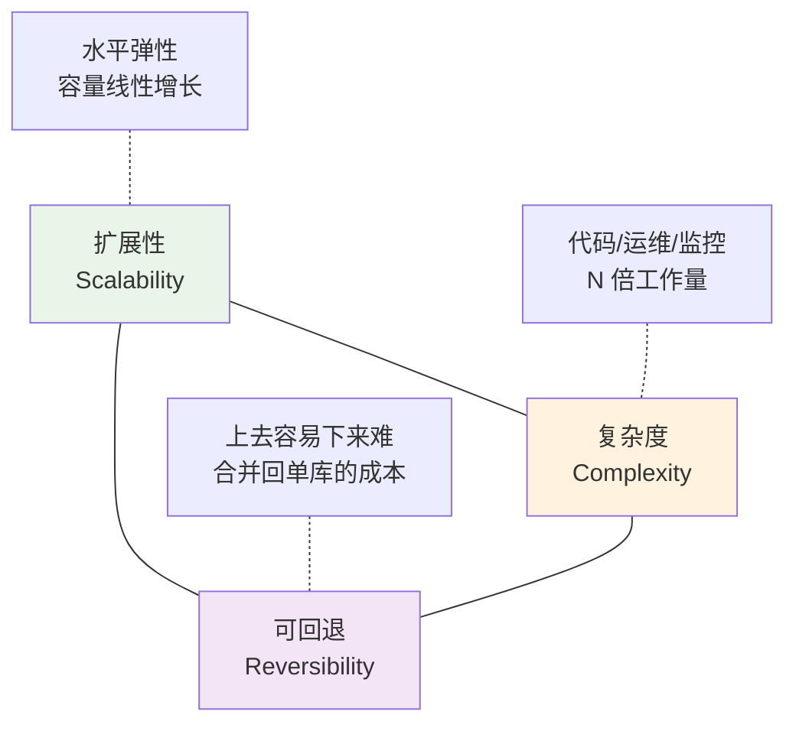
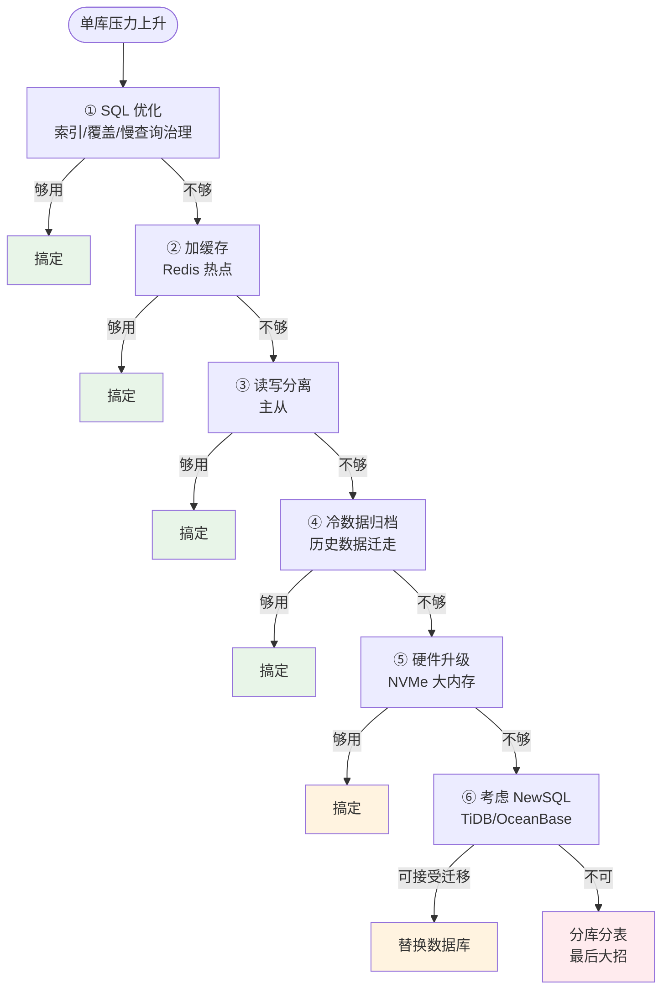
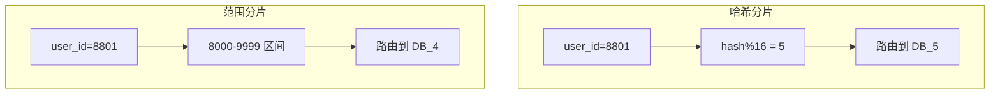
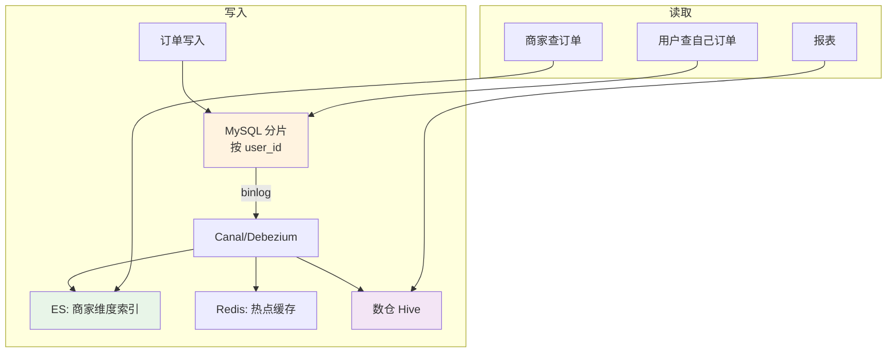
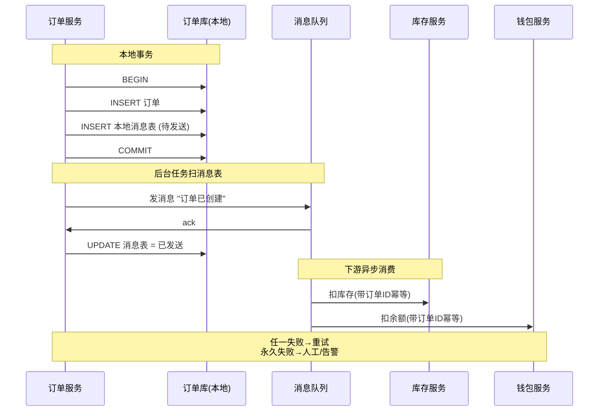
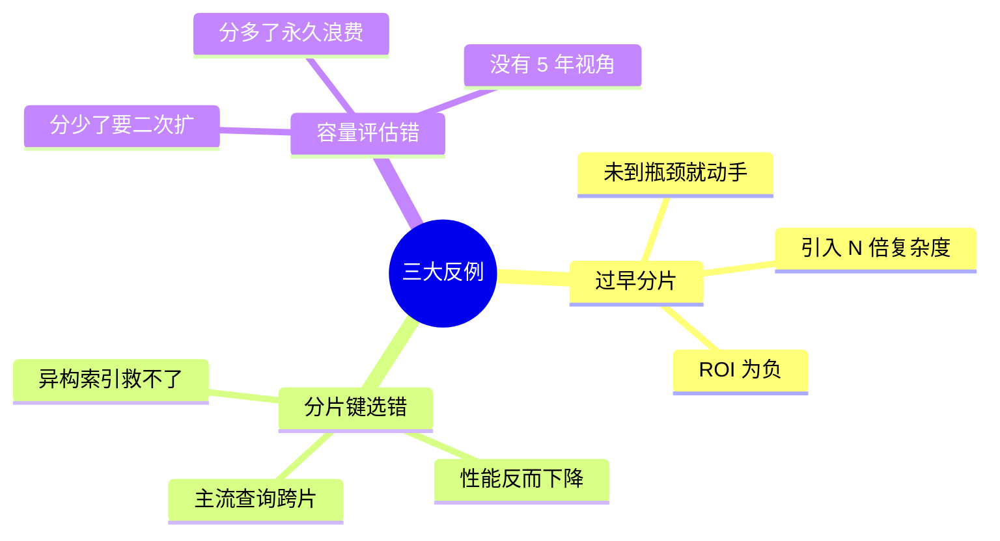
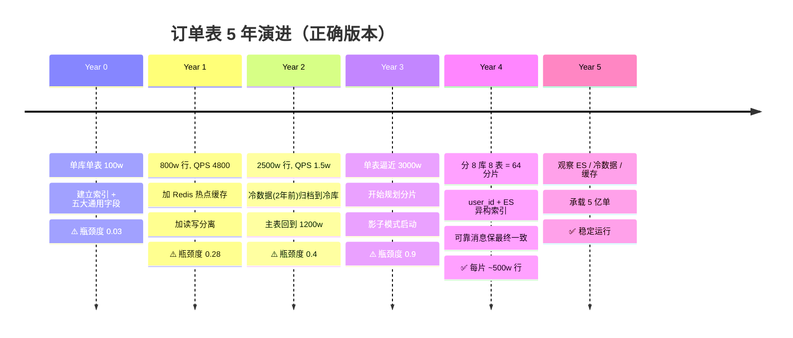
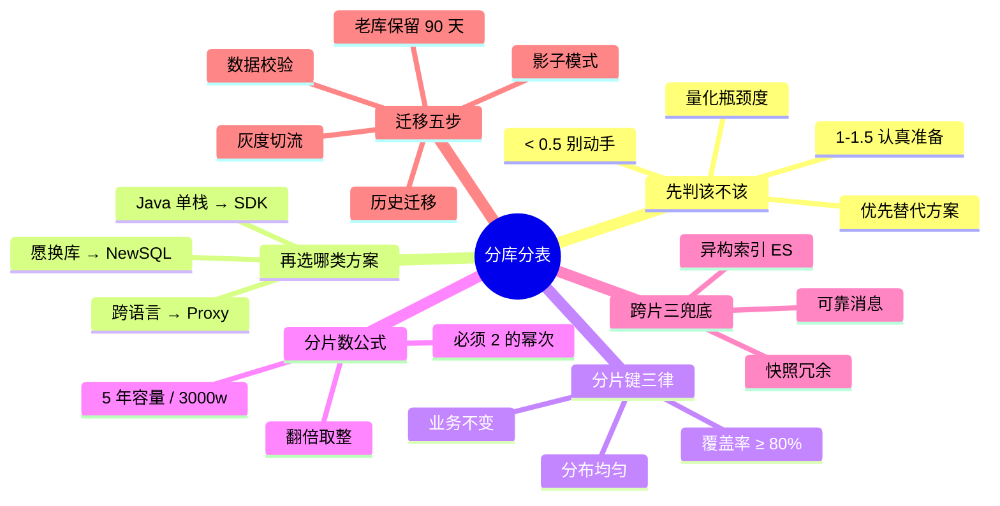

# 09.分库分表方案设计

> **本篇定位**：分库分表是数据库扩展的"最后大招"——也是最容易做错、做完难回头的大招。绝大多数团队败在两个字："**过早**"。本文从一次"800 万订单团队豪迈上 64 表、上线三个月 5 大坑齐爆"的真实故事讲起，从 0 到 1 讲透**为什么单库有上限、什么时候必须分、分片键怎么选、跨片查询怎么办、数据怎么平滑迁移**，最后回来把开篇的翻车原因逐条拆开验尸。**读完这一篇，我们再看任何一份分库分表方案都能一眼看穿"该不该做、这么做值不值"。**

#### 目录介绍
- [1. 案例引入](#1-案例引入)
  - [1.1 一次翻车史](#11-一次翻车史)
  - [1.2 顺藤摸到根因](#12-顺藤摸到根因)
  - [1.3 我们要回答什么](#13-我们要回答什么)
- [2. 架构决策三角](#2-架构决策三角)
  - [2.1 三维度共制](#21-三维度共制)
  - [2.2 为什么这么切](#22-为什么这么切)
- [3. 单库瓶颈本质](#3-单库瓶颈本质)
  - [3.1 四大物理上限](#31-四大物理上限)
  - [3.2 B+Tree 深度墙](#32-btree-深度墙)
  - [3.3 上限量化公式](#33-上限量化公式)
  - [3.4 优先替代方案](#34-优先替代方案)
- [4. 分片层次谱系](#4-分片层次谱系)
  - [4.1 SDK 应用层](#41-sdk-应用层)
  - [4.2 Proxy 代理层](#42-proxy-代理层)
  - [4.3 NewSQL 数据库层](#43-newsql-数据库层)
  - [4.4 三层横向对比](#44-三层横向对比)
- [5. 分片键选择](#5-分片键选择)
  - [5.1 分片键三条铁律](#51-分片键三条铁律)
  - [5.2 主分片键推导](#52-主分片键推导)
  - [5.3 哈希与范围](#53-哈希与范围)
  - [5.4 基因法巧解](#54-基因法巧解)
- [6. 容量规划算法](#6-容量规划算法)
  - [6.1 分片数公式](#61-分片数公式)
  - [6.2 2 的幂次原因](#62-2-的幂次原因)
  - [6.3 扩容代价推导](#63-扩容代价推导)
- [7. 跨片难题拆解](#7-跨片难题拆解)
  - [7.1 多维度查询](#71-多维度查询)
  - [7.2 跨库 JOIN](#72-跨库-join)
  - [7.3 分布式事务](#73-分布式事务)
  - [7.4 全局 ID 生成](#74-全局-id-生成)
- [8. 平滑迁移方案](#8-平滑迁移方案)
  - [8.1 五阶段迁移](#81-五阶段迁移)
  - [8.2 双写一致性](#82-双写一致性)
  - [8.3 灰度切流策略](#83-灰度切流策略)
  - [8.4 一键回滚兜底](#84-一键回滚兜底)
- [9. 反例与演进](#9-反例与演进)
  - [9.1 三大经典反例](#91-三大经典反例)
  - [9.2 V1-V3 演进](#92-v1-v3-演进)
- [10. 综合案例串讲](#10-综合案例串讲)
  - [10.1 案例真相揭晓](#101-案例真相揭晓)
  - [10.2 一张订单表的一生](#102-一张订单表的一生)
  - [10.3 设计哲学回扣](#103-设计哲学回扣)
  - [10.4 分库分表速查表](#104-分库分表速查表)


## 1. 案例引入

### 1.1 一次翻车史

某电商团队订单表跑到 **823 万行**，CTO 在周会上一锤子敲定："**上分库分表，一次干到位，10 年不用再改**"。技术团队按"豪华配置"设计：

```
分片方案:  16 库 × 64 表  = 1024 分片
分片键:    user_id       (hash 分片)
中间件:    ShardingSphere-JDBC 5.x
分布式ID:  Snowflake
分布式事务: Seata AT
迁移工具:  阿里 DataX + 自研双写
预计承载:  100 亿行  ← "十年容量"
```

一个月工期，全公司周报重点表扬。**上线三个月后，5 大坑一个不落全爆炸**：

| 时间 | 故障 | 直接损失 |
|---|---|---|
| T+1 周 | 商家后台"我的订单"变慢 8 倍 | 商家投诉 200+ 单 |
| T+3 周 | 订单+商品 JOIN 逻辑全改，QA 回归 3 轮 | 研发工时爆掉 800h |
| T+6 周 | 分布式事务在大促下响应飙升 300ms→2s | 交易转化率跌 3.5% |
| T+8 周 | 一个字段类型改动需要在 1024 个分片跑 DDL | DBA 熬夜 3 晚 |
| T+12 周 | 一次数据校验发现 27 万单双写不一致 | 财务对账挂 5 天 |

复盘时数据摊在桌上——**订单表当时实际 QPS 4800，单 MySQL 实例极限 5w+**——**这次分库分表本质上是给一个健康的心脏做了 5 台起搏器**。

### 1.2 顺藤摸到根因

顺着"为什么翻车"回溯 5 层：

- **假设 1**：是不是技术选型错了？—— ShardingSphere-JDBC 是主流，选型没问题——**否定**。
- **假设 2**：是不是团队水平不够？—— 团队里有资深 DBA，做过一次成功迁移——**否定**。
- **假设 3**：是不是分片数太多？—— **1024 分片承载 823 万行 = 平均每片 8000 行**，绝对空转——**部分成立**。
- **假设 4**：是不是分片键选错了？—— `user_id` 覆盖了 70% 查询，剩下 30% 商家维度**没做异构索引**——**成立**。
- **假设 5**：**真正的根因是"过早分片"** —— 单库还远没到瓶颈，就付出了分库分表的全部代价——**成立**。

事故背后是**这 7 条"每条都能翻车"的日常判断**：

1. **不测就分片**——单库瓶颈没量化，凭感觉说"扛不住了"
2. **不算就分数**——分片数按 10 年容量规划，反而增加复杂度
3. **不异构就单键**——一个分片键想覆盖所有查询维度
4. **不冗余就跨库**——把订单和商品放不同库还想 JOIN
5. **强分布式事务**——大促场景硬上 XA/Seata，性能塌陷
6. **不演练就迁移**——生产直接切，双写一致性事故必然
7. **只上线不监控**——1024 个分片的独立监控从没搭起来

### 1.3 我们要回答什么

带着这场事故，中间 3-9 章要**逐条挖开** 7 个核心疑问：

**① 单库到底能扛多少？** 数据、QPS、连接数分别在什么点会崩？怎么量化判断？（→ §3）

**② 有哪些"更便宜的替代方案"？** 缓存、读写分离、归档、NewSQL 能顶多久？（→ §3.4）

**③ 应用层 / 代理层 / NewSQL 三种分片各自的边界是什么？** 什么场景选谁？（→ §4）

**④ 分片键怎么选才不后悔？** 为什么"覆盖 80% 查询"是硬指标？（→ §5）

**⑤ 分片数应该定多少？** 为什么必须是 2 的幂次？分片数评估的数学模型？（→ §6）

**⑥ 跨片 JOIN / 分布式事务这些"该死的问题"到底怎么解？** （→ §7）

**⑦ 生产环境已经跑着 5000 万数据，怎么零故障迁到分片架构？** （→ §8）

第 10 章会把这 7 个问号一个不漏按住答清。

## 2. 架构决策三角

### 2.1 三维度共制

分库分表本质是在这三个方向做取舍：



**疑惑**：能同时拿满三者吗？

**论证**：
1. 追求"极致扩展"→ 分 128/1024 片，容量无上限 → 复杂度爆炸、监控运维全崩
2. 追求"极致简单"→ 干脆不分片 → 单库很快遇到硬上限
3. 追求"极致可回退"→ 每一步都留后手 → 双写、双读、影子表都要维护 → 复杂度也炸
4. 三者是**互相约束**的钝三角——**"永远不要在业务不需要时就付出扩展性的代价"**

**结论**：分库分表**是所有数据库方案里"复杂度斜率"最陡的一档**。选它的判据不是"我想扩展"，而是**"我不得不"**。

### 2.2 为什么这么切

后面 3-9 章按"**从要不要做→怎么选→怎么做→怎么落地**"这条主线：

| 章 | 决策阶段 | 关键问题 |
|---|---|---|
| §3 单库瓶颈 | 该不该分 | 我真的到极限了吗？ |
| §4 分片层次 | 选哪种方案 | SDK / Proxy / NewSQL？ |
| §5 分片键 | 核心设计 | 按什么维度切？ |
| §6 容量规划 | 定分片数 | 分多少片？ |
| §7 跨片难题 | 副作用应对 | 如何补偿跨库/异构？ |
| §8 平滑迁移 | 生产落地 | 老数据怎么迁？ |
| §9 反例演进 | 时间维度 | 别人踩过的坑 |

**理解这条链路，任何分库分表方案的评审都能"顺着走一遍"看出问题**。

## 3. 单库瓶颈本质

### 3.1 四大物理上限

**疑惑**：单库到底能扛多少？

**论证**：单 MySQL 实例的物理上限被**磁盘 IO / 内存 / CPU / 网络**共同决定：

| 维度 | 经验值 | 瓶颈表现 |
|---|---|---|
| **单表行数** | 2000w-5000w | B+Tree 深度增加，写入放大 |
| **单表大小** | 50GB-100GB | DDL 极慢、备份窗口挤压 |
| **写入 QPS（NVMe）** | 5w-10w | 主从延迟飙升、redo 刷不动 |
| **读 QPS（有缓存）** | 10w+ | 有 Redis 兜底可撑得更高 |
| **连接数** | 1000-3000 | 连接竞争、CPU 上下文切换 |

**注意**：这些是"进入瓶颈的信号"，**不是"必须分片的死线"**——遇到时先想"能不能优化 SQL / 加缓存 / 归档"。

### 3.2 B+Tree 深度墙

**疑惑**：为什么"单表 2000 万"是常见的经验红线？

**论证**：
1. InnoDB 页 16KB，非叶节点扇出 ~1200
2. 深度 3 层：$1200^2 \times \text{每叶行数}(\sim 15) \approx 2160$ 万行
3. 深度 4 层：$1200^3 \times 15 \approx 259$ 亿行——**深度多 1 层，每次查询多 1 次磁盘 IO**
4. 但 buffer pool 只能常驻**前 2 层**（几十 MB），叶子层大量走磁盘 → 平均 IO 从 1 次涨到 2 次

**结论**：**2000w-5000w 是"深度从 3 层进入 4 层"的临界区**——B+Tree 是对数增长，但每加 1 层是"IO 阶跃"，不是渐变。

### 3.3 上限量化公式

判断"该不该分片"的量化公式：

```
瓶颈度 = max(
    行数 / 3000w,           ← 数据量维度
    QPS_write / 8w,          ← 写维度
    QPS_read / 10w,          ← 读维度（有缓存另算）
    表大小 / 80GB            ← 存储维度
)

瓶颈度 < 0.5  → 完全没到，别想分片
瓶颈度 0.5-1  → 走替代方案（§3.4）
瓶颈度 1-1.5  → 认真准备分片
瓶颈度 > 1.5  → 立刻分片，晚了要出事故
```

**开篇的团队瓶颈度 ≈ 0.28**（823w / 3000w）——**远没到该动手的时刻**。

### 3.4 优先替代方案

**疑惑**：还没到分片阈值时能做什么？

**论证**：按"改动成本从低到高"排：



**每一档撑起的量级**（经验值）：

| 方案 | 撑起的读 QPS | 撑起的写 QPS | 撑起的数据量 |
|---|---|---|---|
| ① SQL 优化 | +50% | +30% | 不变 |
| ② 缓存 | ×10 | 不变 | 不变 |
| ③ 主从读写分离 | ×3-5 | 不变 | 不变 |
| ④ 冷数据归档 | 不变 | 不变 | 缩 60% |
| ⑤ 硬件升级 | ×2 | ×2 | 不变 |
| ⑥ NewSQL | ×10+ | ×5+ | ×100+ |
| ⑦ 分库分表 | 线性扩 | 线性扩 | 线性扩 |

**结论**：**多数团队卡在读上，加缓存 + 读写分离就能撑 3-5 年**。真到写 QPS 撑不住才是分片时机。

## 4. 分片层次谱系

### 4.1 SDK 应用层

**代表**：ShardingSphere-JDBC、京东 JOD-DBA、TDDL、Cobar。

**原理**：SDK 嵌在应用进程里，拦截 SQL → 解析 → 改写 → 路由到目标库 → 合并结果。

```
Application
    ├─ Business Code
    └─ ShardingSphere-JDBC (Jar 依赖)
         ├─ SQL 解析
         ├─ 路由计算
         ├─ SQL 改写      ← WHERE user_id=8801 → ds_1.t_order_8801
         └─ 结果归并
              │
              ▼
       ┌──────┴──────┬─────────┐
       ▼             ▼         ▼
     DB_0          DB_1      DB_N        (物理 MySQL)
```

**优势**：
- 无额外网络跳数——性能最好
- 无单点——SDK 挂了就是应用挂了，不引入新单点
- 部署简单——加个 Jar 依赖

**劣势**：
- 语言绑定——Java 生态最完整，其他语言弱
- 应用重启才能升级 SDK
- SQL 兼容度靠 SDK 覆盖——复杂 SQL 可能不支持

### 4.2 Proxy 代理层

**代表**：ShardingSphere-Proxy、MyCat、Vitess、Atlas。

**原理**：应用连接一个"伪装成 MySQL"的代理，代理再把 SQL 分发到后端多个真实 MySQL。

```
Application ──MySQL 协议──▶ Proxy 集群 ──▶ MySQL 分片群
                              │
                            (跨语言无侵入)
```

**优势**：
- **跨语言**——应用侧毫无感知，Go/Python/Node 都能用
- 集中管理——升级、监控、限流都在代理层
- 支持复杂运维——在线加分片、路由规则动态下发

**劣势**：
- **多一跳网络**——RT +1-3ms
- Proxy 本身要保证高可用（不然新单点）
- Proxy 集群运维复杂

### 4.3 NewSQL 数据库层

**代表**：TiDB、OceanBase、CockroachDB、YugabyteDB、PolarDB-X。

**原理**：数据库本身就是分布式的。应用像连普通 MySQL 一样连它，分片和事务都在数据库层完成。

**优势**：
- **对应用完全透明**——用普通 MySQL 客户端就能连
- 自动扩缩容、自动 rebalance
- 原生分布式事务
- 兼容 MySQL 协议（TiDB / PolarDB-X）

**劣势**：
- **需要换数据库**——迁移成本最高
- 小数据量下比单机 MySQL 慢
- 运维需要 SRE 团队

### 4.4 三层横向对比

| 维度 | SDK (JDBC) | Proxy | NewSQL |
|---|---|---|---|
| **语言支持** | 单语言（多为 Java） | 跨语言 | 跨语言 |
| **网络跳数** | 0 | +1 | 0（原生集群协议） |
| **性能** | 最好 | 中 | 好 |
| **透明度** | 需改代码引 SDK | 应用无感 | 应用完全无感 |
| **运维复杂度** | 中 | 高 | 高（但产品化） |
| **单点风险** | 无 | Proxy 层要 HA | 数据库集群自愈 |
| **分布式事务** | 依赖 Seata/XA | 依赖 Seata/XA | 原生 |
| **DDL 一致性** | 需协调 | 需协调 | 集群统一 |
| **典型规模** | 数十亿 | 百亿 | 千亿+ |
| **迁移代价** | 中 | 中 | 高 |

**选型口诀**：
- **纯 Java + 老库不换**：ShardingSphere-JDBC
- **多语言 + 老库不换**：ShardingSphere-Proxy
- **能换库 + 追求"未来 5 年再也不想动"**：TiDB / OceanBase / PolarDB-X

## 5. 分片键选择

### 5.1 分片键三条铁律

**铁律 1：覆盖率 ≥ 80%**  
主分片键必须能被至少 80% 的查询用到——否则那 20% 每次都要扫全部分片。

**铁律 2：分布均匀**  
不能出现"某个值占了 30%"——否则分片间数据量差 10 倍。

**铁律 3：不常变**  
分片键一变就要**跨分片迁移数据**——分片键必须是业务上"生死不变"的属性。

### 5.2 主分片键推导

**疑惑**：订单表按 `user_id` 分片好，还是按 `order_id`？

**论证**：

先统计业务查询频次（拿真实流量数据）：

| 查询模式 | QPS 占比 |
|---|---|
| 用户查自己的订单 | 68% |
| 商家查自己收到的订单 | 20% |
| 按 order_id 查单个订单 | 10% |
| 后台报表 / 大聚合 | 2% |

**候选 1：`user_id` 分片**
- 用户查订单（68%）：✅ 单分片命中
- 商家查订单（20%）：❌ 扫所有分片 → 需异构索引兜底
- `order_id` 查（10%）：❌ 扫所有分片 → 需基因法 or 二级索引

**候选 2：`shop_id` 分片**
- 用户查订单（68%）：❌ 扫所有分片
- 商家查订单（20%）：✅ 单分片
- 覆盖率只有 20% → **淘汰**

**候选 3：`order_id` 分片（随机）**
- 用户查订单（68%）：❌
- 商家查订单（20%）：❌
- 覆盖率极低 → **淘汰**

**结论**：**选 `user_id`——80% 覆盖，剩下 20% 商家维度用 ES 异构索引兜底**。

### 5.3 哈希与范围

分片算法两大主流：



| 维度 | 哈希分片 | 范围分片 |
|---|---|---|
| **数据均匀** | ✅ 天然均匀 | ❌ 易热点（新数据集中） |
| **扩容容易度** | ❌ 加节点需 rehash | ✅ 加新区间即可 |
| **范围查询** | ❌ 跨全部分片 | ✅ 命中少数分片 |
| **典型场景** | 用户/订单 | 日志/时序 |

**实战 90% 用哈希分片**——均匀性是首要目标；扩容问题用**一致性哈希**或**2 的幂次扩容**（§6.2）缓解。

### 5.4 基因法巧解

**疑惑**：用 `user_id` 分片了，但业务上还要"按 `order_id` 查单个订单"，怎么办？

**论证**：让 **`order_id` 里编码 `user_id` 的分片位**——这样两把钥匙都能开同一把锁。

假设 64 分片（6 bit 定位）：

```kotlin
// 生成 order_id：低 6 位存 user_id 的分片位
fun generateOrderId(userId: Long): Long {
    val gene = userId and 0x3F              // user_id 的分片基因 (低 6 位)
    val raw = snowflake.nextId() and 0x7FFFFFFFFFFFFFC0L  // 雪花 ID 清零低 6 位
    return raw or gene                       // 拼接
}

// 查订单时无论用 user_id 还是 order_id 都能定位分片
fun getShard(userId: Long?, orderId: Long?): Int {
    return ((userId ?: orderId!!) and 0x3F).toInt()
}
```

**效果**：
- 按 `user_id` 查：`hash(user_id) & 0x3F` → 直接命中
- 按 `order_id` 查：`order_id & 0x3F` → 也命中同一个分片
- **无需二级索引，无需扫全分片**

**代价**：`order_id` 生成必须携带 `user_id` 上下文——所以 `order_id` 只能在业务侧生成，不能在数据库侧自增。

## 6. 容量规划算法

### 6.1 分片数公式

**疑惑**：分 4 库 8 表还是 16 库 64 表？

**论证**：按 5 年容量规划：

```
分片数 = 5年后预期数据量 / 单分片承载上限

单分片承载上限:
    行数 ≤ 3000w
    大小 ≤ 80GB
    QPS ≤ 5w  (写)

例:
    当前 800w 行，年增长 50%
    5 年后 ≈ 800w × 1.5^5 ≈ 6000w 行
    单分片 3000w  →  需要 2 分片
    预留 1 倍     →  4 分片就够

再取 2 的幂次:  →  最终 4 或 8 分片
```

**警示**：**分片数错误主要是"分多了"而不是"分少了"**——分多了永久浪费，分少了未来还能扩。开篇团队 823 万数据分 1024 片——**每片 8000 行**，无谓的复杂度。

### 6.2 2 的幂次原因

**疑惑**：为什么分片数一定要是 2 的幂次？

**论证**：

假设从 4 分片扩到 8 分片：

```
原:  shard = hash(key) % 4
新:  shard = hash(key) % 8

对同一个 key: hash(key) = 123
  原: 123 % 4 = 3      → DB_3
  新: 123 % 8 = 3      → DB_3   (低位相同 ✅)
  
对另一个 key: hash(key) = 127  
  原: 127 % 4 = 3      → DB_3
  新: 127 % 8 = 7      → DB_7   (需要迁移)

结论: 4 → 8 扩容, 大约一半数据保持原位, 只需迁移另一半
```

**如果分片数不是 2 的幂**（比如 3 → 5），几乎**所有数据都要重新分布**——迁移成本翻倍。

**结论**：4 / 8 / 16 / 32 / 64 → 未来扩容"翻倍"即可，只需迁一半数据。

### 6.3 扩容代价推导

假设 8 分片扩到 16 分片：

```
迁移数据量:
  8 分片各有 D/8 数据
  扩容后 16 分片各有 D/16 数据
  每个原分片要"分裂"：一半留原地，一半迁到新分片
  
  每分片迁移量 = D/16
  8 个分片同时迁 = D/2 总迁移量
  
  用 pt-online-schema-change / binlog 同步, 
  假设 10w rows/s, 500 GB 表大约 1-3 天
```

**扩容"翻倍"是最优策略**。**别做"从 8 扩到 12"这种奇葩比例**——迁移成本是"翻倍扩容"的 3-5 倍。

## 7. 跨片难题拆解

### 7.1 多维度查询

**问题**：`user_id` 分片后，商家维度查询怎么办？

**方案对照**：

| 方案 | 做法 | 实时性 | 适用 |
|---|---|---|---|
| **异构索引 (ES/OpenSearch)** | binlog → ES，商家查询走 ES | 秒级 | 复杂查询、模糊搜索 |
| **数据冗余副本** | binlog → 另一张按 shop_id 分片的副本表 | 秒级 | 查询模式固定 |
| **离线宽表** | 天级同步到 Hive/ClickHouse | 分钟-小时级 | 报表/统计 |
| **应用层扫全片** | 并行扫所有分片再归并 | 实时 | ⚠️ 只适合极低频（<1 QPS） |

**主流选择**：**主分片 + ES 异构索引**——形成"用户维度实时 + 商家维度实时 + 报表离线"三级体系。



### 7.2 跨库 JOIN

**问题**：订单库和商品库不在一起，怎么"订单 + 商品"联合查询？

**方案对照**：

| 方案 | 做法 | 适用 |
|---|---|---|
| **冗余字段（快照）** | 下单时把 `product_name`、`product_price` 冗余到订单表 | 不变信息、历史快照 |
| **应用层拼接** | 先查订单再批量查商品 IDs 再拼装 | 灵活但代码复杂 |
| **数据宽表** | 异步 binlog → ES/宽表 | 报表/搜索 |
| **禁止 JOIN** | 业务上就不允许跨库 JOIN，走上面三种 | 大厂常见规范 |

**最佳实践**：**订单冗余商品快照字段**——本来订单也应该保留下单时刻的价格/名字（业务需求，不只是性能优化）。

### 7.3 分布式事务

**问题**：一个"创建订单"操作要写订单库 + 扣库存库 + 扣余额库——分片后 3 个库，怎么保证原子性？

**四种方案对比**：

| 方案 | 一致性 | 性能 | 复杂度 | 适用 |
|---|---|---|---|---|
| **2PC / XA** | 强一致 | 差（阻塞） | 中 | 小流量金融 |
| **TCC (Try/Confirm/Cancel)** | 准强一致 | 中 | 高（每个接口写 3 遍） | 大额支付 |
| **Saga（正反补偿）** | 最终一致 | 好 | 中 | 长流程业务 |
| **可靠消息（本地事务表 + MQ）** | 最终一致 | 最好 | 低 | 90% 业务场景 |

**推荐架构**：



**核心思想**：**用"本地事务 + 可靠消息"把强一致降级为最终一致，换来极高性能**——90% 业务能接受"1 秒内一致"。

### 7.4 全局 ID 生成

分片后不能再用 `AUTO_INCREMENT`（每片各自自增会重复）。主流方案：

| 方案 | 优点 | 缺点 |
|---|---|---|
| **UUID** | 无依赖 | 36 位字符串、B+Tree 索引差 |
| **数据库号段（美团 Leaf-Segment）** | 有序、性能高 | 依赖 DB |
| **Snowflake 雪花算法** | 无中心、趋势递增 | 时钟回拨 |
| **Redis INCR** | 简单 | 依赖 Redis 高可用 |

**详见下一篇《分布式 ID 生成方案》**。

## 8. 平滑迁移方案

### 8.1 五阶段迁移

生产环境从单库切分片，标准 5 阶段：


**关键**：**任何一步都要能"一键回退"**——生产事故 99% 出在迁移期间。

### 8.2 双写一致性

**难点**：双写期间怎么保证两边数据一致？

**方案对照**：

| 方案 | 一致性 | 性能 | 复杂度 |
|---|---|---|---|
| **应用层同步双写** | 强一致（若失败要处理） | 差（RT 翻倍） | 中 |
| **应用层异步双写** | 最终一致 | 好 | 中（要补偿） |
| **binlog 单向同步（canal）** | 最终一致 | 好 | 低（成熟工具） |
| **业务表 + 补偿表** | 最终一致 | 好 | 中 |

**推荐**：**binlog 同步 + 定时校验**——工具成熟、性能好、事故率低。

### 8.3 灰度切流策略

```
Day 1:  0.1%  用户读新库    ← 只覆盖内部员工/测试用户
Day 3:  1%    观察 24h+
Day 7:  5%    观察 48h+
Day 14: 20%   观察 72h+
Day 21: 50%   观察 72h+
Day 28: 100%  完全切换
```

**每一档观察 3 个指标**：
- 业务错误率（应 ≤ 老库）
- 数据一致性（抽样每档 ≥ 10w 单）
- P99 延迟（应 ≤ 老库 + 20%）

**任何异常都能一键切回上一档**。

### 8.4 一键回滚兜底

不同阶段的回滚方案：

| 阶段 | 回滚方式 |
|---|---|
| ① 双写期 | 直接停掉新库写入，业务无感 |
| ② 历史迁移期 | 老库读写照常，删除新库数据重来 |
| ③ 灰度切读期 | 一键切回 100% 读老库 |
| ④ 完全切换后 | **老库保留至少 30 天可查**，紧急时切回 |

**铁律**：**没有回滚方案的迁移就是"赌博"**。

## 9. 反例与演进

### 9.1 三大经典反例

**反例 1：过早分片（开篇故事）**

`823w 行 + QPS 4800` → 分 1024 片——**用 5 年后的复杂度换今天不存在的问题**。**教训**：先量化瓶颈度，再决定要不要动手。

**反例 2：分片键选错**

某社交 App 消息表按 `sender_id` 分片，但业务 70% 查询是"我收到的消息"（按 `receiver_id`）——**每次查询都扫所有分片**。**教训**：主分片键必须匹配最高频查询。

**反例 3：容量评估过短**

某团队按 1 年容量分了 4 片，结果 18 个月就再次触顶，第二次扩到 8 片时**数据迁移地狱** + 双写不一致 + 5 天故障。**教训**：按 5 年容量规划，但**不要超过 10 年**（过度预留 = 永久浪费）。



### 9.2 V1-V3 演进


| 阶段 | 触发条件 | 主要动作 |
|---|---|---|
| V1 | 起步 | 单库单表，SQL 索引优化 |
| V2 | 读压力大 | 主从复制、Redis 缓存、冷数据归档 |
| V3 | 写压力/单表容量到顶 | 分库分表 + 异构索引 + 消息事务 |
| V4 | 全球多活/百亿数据 | NewSQL 或多机房单元化 |

**每一步都是"上一步的极限逼出来的"**——**跳级是灾难**。

## 10. 综合案例串讲

### 10.1 案例真相揭晓

回到开篇：823 万订单 → 1024 分片 → 5 大坑齐爆。

**7 个疑问逐条作答**：

**① 单库到底能扛多少？** 用 §3.3 公式：$瓶颈度 = \max(823/3000, 4.8/8, ...) = 0.6$——**还有 40% 缓冲**。当时应该做的是缓存 + 读写分离，能顶到 3-5 亿单再考虑分片。（→ §3）

**② 有哪些更便宜的方案？** ①SQL 优化 + ②Redis 缓存热点用户 + ③读写分离 + ④18 个月前的历史订单归档到冷库——**任何一个都能让瓶颈度降到 0.3 以下**，五年不用碰分片。（→ §3.4）

**③ 三种分片方案怎么选？** 团队全 Java 栈——应该选 **ShardingSphere-JDBC**（无网络多跳），却选了 Proxy → RT +2ms 白白付出。如果当初直接选 TiDB，甚至连改代码都省了。（→ §4）

**④ 分片键选对了吗？** `user_id` 覆盖 70% 查询——**及格但不到 80%**。剩下 20% 的商家维度**没做 ES 异构索引**，导致商家后台变慢 8 倍——**这是 5 大坑里最惨的一坑，本可以避免**。（→ §5）

**⑤ 分片数错在哪？** 1024 分片承载 823 万行 = **每片 8000 行**——**平均单片 QPS < 5**，1024 个空转的 MySQL 消耗着相同的连接、监控、备份开销。正确分片数：$\lceil 6000w / 3000w \rceil × 2 = 4$——**是他们做的 1/256**。（→ §6）

**⑥ 跨片问题怎么解？** 应该做的是：**订单冗余商品快照 + 商家维度走 ES + 分布式事务用可靠消息**——他们做的是**每笔订单都上 Seata AT** → 大促时 RT 从 300ms 飙到 2s → 转化率跌 3.5%。**分布式事务的最贵之处不是引入组件，是"给不需要强一致的场景"用了强一致方案**。（→ §7）

**⑦ 生产怎么零故障迁移？** 他们直接双写切流没有影子模式、没有 5 阶段——27 万单双写不一致是必然。正确做法：影子表 → 历史迁移 → 校验（**核心指标 3 天全量比对**）→ 灰度 0.1%→1%→5% ... → 老库保留 90 天。（→ §8）

### 10.2 一张订单表的一生

假设这个团队"重来一次"，按本文原则规划——一张订单表未来 5 年的完整旅程：



**关键要点**：**分库分表推迟到第 3 年才动手**——前两年靠缓存/主从/归档撑住——**这是"最优路径"**。

### 10.3 设计哲学回扣

从这个案例凝练出**四条可迁移的哲学**：

**1. 分库分表是"猛药"，不是"补品"**  
判断"要不要吃"的唯一标准是**量化的瓶颈度**——不是感觉、不是流言、不是老板拍脑袋。**多数团队的问题不是"没分片"，是"不该分片时分了"**。

**2. 一个分片键统治不了世界，异构索引是标配**  
主分片键覆盖 80%，剩下 20% 用 ES / 数据副本 / 离线宽表兜底——**这不是补救，是设计的一部分**。写方案时就要把"3 层查询路由"画出来。

**3. 强一致的代价永远高于你以为的**  
Seata AT / XA 让"简单代码 + 强一致"看起来很美——但**在大流量场景下 RT 会翻 5-10 倍**。90% 业务用可靠消息 + 幂等消费就够——**能最终一致就不用强一致，是分布式系统的第一美德**。

**4. 迁移的所有事故都发生在"你以为不会出问题"的地方**  
5 阶段迁移 + 双写校验 + 灰度切流 + 一键回滚——**每一步都是"血的代价"换来的模板**。没有这些兜底就动手，是在赌你从没被上帝眷顾过的运气。

### 10.4 分库分表速查表



**启动分库分表项目前 12 条对照**：

- [ ] 瓶颈度已量化（≥ 1）
- [ ] 替代方案已穷尽（缓存/读写分离/归档/NewSQL）
- [ ] 主分片键覆盖 ≥ 80% 查询
- [ ] 异构索引方案覆盖剩余查询
- [ ] 分片数按 5 年容量 + 2 的幂次
- [ ] 全局 ID 方案就位（推荐 Snowflake）
- [ ] 分布式事务方案就位（推荐可靠消息）
- [ ] 迁移工具（同步 + 校验 + 回滚）已开发
- [ ] 5 阶段灰度已演练
- [ ] 每分片独立监控 + 全局监控就位
- [ ] DBA 增援到位（DDL 覆盖 N 个分片）
- [ ] 老库保留期限已定（≥ 30 天）

**最后一句话**：分库分表不是"技术炫技"，是**业务被逼到墙角的最后大招**。开篇团队的悲剧是**把猛药当成补品**——健康的心脏被强行装了 5 个起搏器。

> 好的分库分表 = **能不做就不做，要做就一次做对所有细节**。

**下一篇我们顺着"分片后 ID 怎么生成"这条线，进入 07 篇《分布式 ID 生成方案》**。
