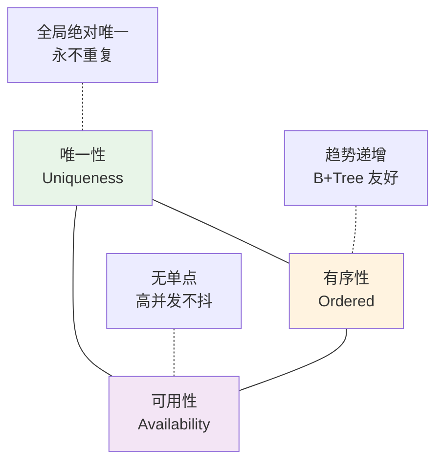
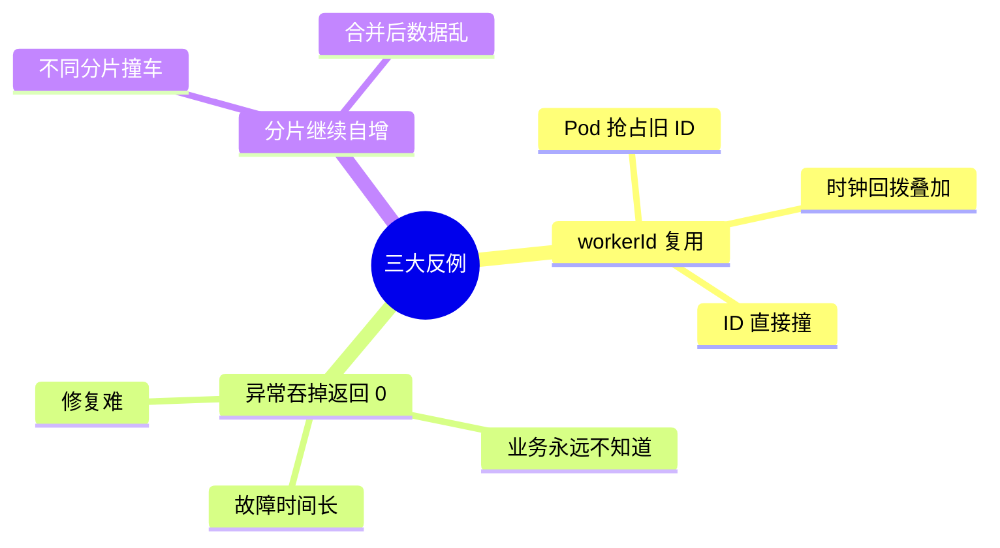
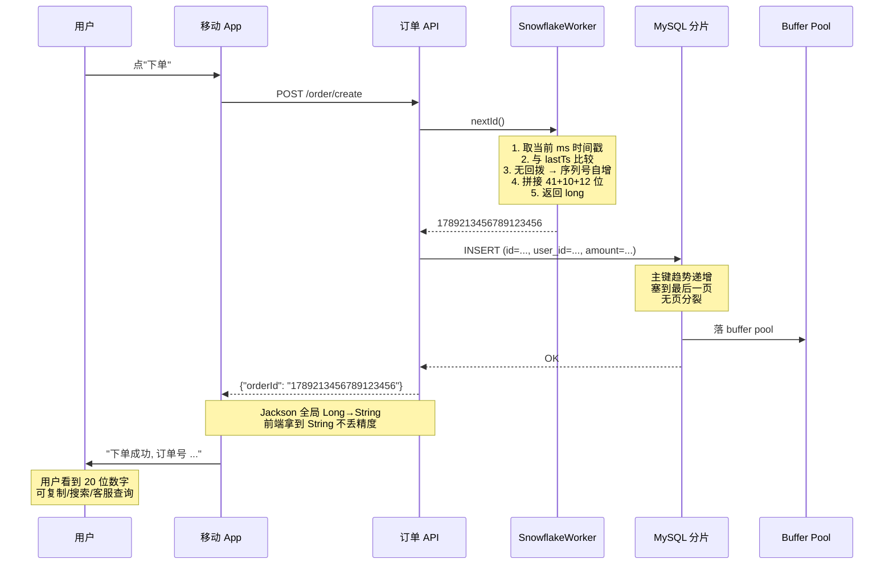
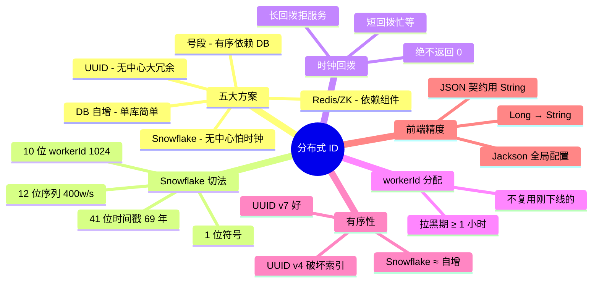

# 10.分布式 ID 生成方案

> **本篇定位**：分布式 ID 是分库分表、微服务通信、事件追踪的"生死线"——它看起来"生成一个 long 值"这么简单，实际藏着**时钟回拨、精度丢失、单点雪崩、B+Tree 索引恶化**四大杀手。本文从一次"6 分钟内订单 ID 撞了 4 次"的真实事故讲起，从 0 到 1 讲透**为什么自增 ID 撑不住、Snowflake 是怎么"41+10+12"精确切位的、号段模式的双 Buffer 怎么防阻塞、时钟回拨到底怎么兜底**，最后回来把开篇的撞 ID 全过程一层层剥开。**读完这一篇，我们再看任何一份 ID 方案都能一秒指出"它会在哪一天出事"。**

#### 目录介绍
- [1. 案例引入](#1-案例引入)
  - [1.1 一次撞 ID 事故](#11-一次撞-id-事故)
  - [1.2 顺藤摸到根因](#12-顺藤摸到根因)
  - [1.3 我们要回答什么](#13-我们要回答什么)
- [2. 架构决策三角](#2-架构决策三角)
  - [2.1 三维度共制](#21-三维度共制)
  - [2.2 为什么这么切](#22-为什么这么切)
- [3. 五大方案谱系](#3-五大方案谱系)
  - [3.1 数据库自增](#31-数据库自增)
  - [3.2 UUID 家族](#32-uuid-家族)
  - [3.3 号段模式](#33-号段模式)
  - [3.4 Snowflake 雪花](#34-snowflake-雪花)
  - [3.5 Redis / ZK](#35-redis--zk)
- [4. Snowflake 位分配](#4-snowflake-位分配)
  - [4.1 64 位怎么切](#41-64-位怎么切)
  - [4.2 每一段的物理含义](#42-每一段的物理含义)
  - [4.3 上限数学证明](#43-上限数学证明)
  - [4.4 位段自定义调优](#44-位段自定义调优)
- [5. 时钟回拨兜底](#5-时钟回拨兜底)
  - [5.1 为什么会回拨](#51-为什么会回拨)
  - [5.2 三级应对策略](#52-三级应对策略)
  - [5.3 单调时钟改造](#53-单调时钟改造)
- [6. 号段模式内核](#6-号段模式内核)
  - [6.1 单 Buffer 阻塞问题](#61-单-buffer-阻塞问题)
  - [6.2 双 Buffer 预取](#62-双-buffer-预取)
  - [6.3 步长动态调整](#63-步长动态调整)
- [7. ID 与 B+Tree](#7-id-与-btree)
  - [7.1 递增 vs 随机](#71-递增-vs-随机)
  - [7.2 页分裂代价](#72-页分裂代价)
  - [7.3 索引膨胀实测](#73-索引膨胀实测)
- [8. JS 精度陷阱](#8-js-精度陷阱)
  - [8.1 53 位安全整数](#81-53-位安全整数)
  - [8.2 前后端契约](#82-前后端契约)
  - [8.3 字符串序列化](#83-字符串序列化)
- [9. 反例与演进](#9-反例与演进)
  - [9.1 三大经典反例](#91-三大经典反例)
  - [9.2 V1-V3 演进](#92-v1-v3-演进)
- [10. 综合案例串讲](#10-综合案例串讲)
  - [10.1 案例真相揭晓](#101-案例真相揭晓)
  - [10.2 一个 ID 的一生](#102-一个-id-的一生)
  - [10.3 设计哲学回扣](#103-设计哲学回扣)
  - [10.4 ID 方案速查表](#104-id-方案速查表)


## 1. 案例引入

### 1.1 一次撞 ID 事故

某电商平台 2024 年 5 月 12 日凌晨 3:47，客服系统收到一个奇怪工单："**我下的订单显示的是别人的地址**"。DBA 一查发现更可怕的事——**过去 6 分钟内，订单表出现了 4 组重复 ID**：

```
+---------------------+----------------+---------+---------------+
| order_id            | user_id        | amount  | created_at    |
+---------------------+----------------+---------+---------------+
| 1789213456789123456 | user_10086     | 128.00  | 03:41:22.145  |
| 1789213456789123456 | user_20077     |  56.50  | 03:41:22.146  |  ← 撞
| 1789213456789123457 | user_30001     | 999.99  | 03:41:22.147  |
| 1789213456789123457 | user_40002     |  32.00  | 03:41:22.148  |  ← 撞
| ... 一共 4 组 ...                                                |
+---------------------+----------------+---------+---------------+
```

订单 ID 是 Snowflake 生成的 64 位 long——**理论上应该永不重复**。业务代码看似毫无问题：

```java
// order-service, Snowflake 生成 ID
@Bean
public SnowflakeIdWorker idWorker() {
    // workerId 从配置文件读取 —— 每台机器唯一
    long workerId = Long.parseLong(env.getProperty("app.worker.id"));
    return new SnowflakeIdWorker(workerId, 0);
}

@PostMapping("/order/create")
public Long createOrder(@RequestBody OrderReq req) {
    long id = idWorker.nextId();       // Snowflake 生成
    orderDao.insert(new Order(id, ...));
    return id;
}
```

**看起来一切正常**——workerId 从配置读的、Snowflake 是"官方保证唯一"的——**为什么就是撞了？**

### 1.2 顺藤摸到根因

DBA 顺着 4 组重复 ID 拆开二进制：

```
0000 0000 0000 0000 0001 1000 1000 1010 1111 1001 0100 1000 0000 0000 0000 0000
│                     │                                     │
│  时间戳(41位)       │      workerId(10位)                  │  序列号(12位)
│                     │                                     │
=  2024-05-12 03:41:22 145ms
                      = 000000101 ← workerId = 5
                                                            = 000000000000 = 0
```

**重复的两条 ID，时间戳、workerId、序列号完全一致**——**说明"两台机器算出了同一个 ID"**。

顺藤问下去：

- **假设 1**：workerId 配置重复？ → 检查配置库——**每台唯一**，否定。
- **假设 2**：机器时间回拨？ → 检查 NTP 日志——**发现问题**！2:15 有一次 ntpd 强制校时，一台机器时钟**倒退了 187ms**。
- **假设 3**：那怎么和另一台撞的？ → **两台机器 workerId 一样吗？**

**真正的根因**：那晚 K8s 集群自动扩容加了一台 Pod——**新 Pod 的 workerId 是从 Nacos 抢的一个"回收的旧 ID"**：

- 老 Pod（workerId=5）几分钟前刚被驱逐
- 新 Pod（也是 workerId=5）分配到同一台物理机
- 老 Pod 时钟被 NTP 校时倒退了 187ms
- 新旧 Pod 在 187ms 内**都生成了 workerId=5 + 同一时间戳 + 序列号 0** 的 ID

事故背后是**这 6 条"每条都对但合起来就爆炸"的日常判断**：

1. **workerId 回收复用**——从"当前活跃 Pod"分配，没做"曾用过 ID 拉黑期"
2. **时钟回拨无兜底**——Snowflake 官方版本遇回拨直接抛异常，代码里 `catch` 后**默认返回 0** ← 灾难根源
3. **序列号从 0 开始**——回拨恰好同时刻，两台机器都能生成序列号 0
4. **无监控**——重复 ID 出现 6 分钟才被客服发现
5. **无插入前唯一性检查**——数据库虽有主键约束，但**批量插入用了 IGNORE**
6. **压测没覆盖时钟回拨场景**——测试环境永远看不到这个问题

### 1.3 我们要回答什么

带着这场事故，中间 3-9 章要**逐条挖开** 7 个核心疑问：

**① 为什么"分库分表 + Snowflake"是标配？** 数据库自增 / UUID 各自的边界在哪？（→ §3）

**② Snowflake 的 64 位为什么切成 1+41+10+12？** 换个切法能不能？（→ §4）

**③ 41 位时间戳能撑多久？10 位 workerId 支持多少台机器？12 位序列号扛得住多少 QPS？** （→ §4.3）

**④ 时钟回拨到底该怎么兜底？为什么"catch 后返回 0"是灾难？** （→ §5）

**⑤ 数据库号段模式的双 Buffer 是干什么的？** 单 Buffer 会怎么阻塞？（→ §6）

**⑥ 为什么"随机 ID"会让 B+Tree 变慢？** 到底慢多少？（→ §7）

**⑦ 为什么后端返回的 Long 到前端就"精度丢失"？** 为什么不能直接把 Snowflake ID 给 JavaScript？（→ §8）

第 10 章会把这 7 个问号一个不漏按住答清。

## 2. 架构决策三角

### 2.1 三维度共制

分布式 ID 方案本质是在这三个方向做取舍：



**疑惑**：能同时拿满三者吗？

**论证**：
1. 追求"极致唯一"→ UUID 128 位——**唯一性最强，但完全无序 → B+Tree 灾难**
2. 追求"极致有序"→ 数据库自增——**严格单调递增，但单点单库瓶颈 → 可用性差**
3. 追求"极致可用"→ Snowflake 各机器独立生成——**唯一性依赖 workerId 分配 + 时钟不回拨**
4. 三者钝三角互相制约——**没有全能方案，只有场景最优**

**结论**：常见业务场景下 **Snowflake 是"三维平衡最好"的方案**——**它把"唯一性"的责任下沉给"workerId 分配机制"和"时钟"**，成为薄弱点。

### 2.2 为什么这么切

后面 3-9 章按"**知全景 → 深挖 Snowflake → 深挖号段 → 副作用 → 演进**"这条主线：

| 章 | 主题 | 关键问题 |
|---|---|---|
| §3 五大方案 | 全景 | 每种方案边界在哪 |
| §4 Snowflake 位分配 | 深挖 | 为什么切成 41+10+12 |
| §5 时钟回拨 | Snowflake 阿喀琉斯之踵 | 出问题怎么兜底 |
| §6 号段模式 | 深挖 | 双 Buffer 为什么必要 |
| §7 ID 与 B+Tree | 副作用 | 随机 ID 为什么慢 |
| §8 JS 精度陷阱 | 副作用 | 前后端契约 |
| §9 反例演进 | 时间维度 | 别人踩过的坑 |

## 3. 五大方案谱系

### 3.1 数据库自增

`AUTO_INCREMENT` —— 单机时代的"神器"，分布式时代的"绊脚石"。

**优势**：绝对单调递增、B+Tree 索引友好、简单可靠。

**局限**：
1. **单库瓶颈**：所有生成走一个库，写 QPS 上限 ~5w
2. **分库分表后重复**：每个分片各自自增会撞车
3. **暴露业务量**：/order/12345 → 竞争对手一看订单量

**变通：多机自增步长**  
把 3 台机器的自增步长设为 3，起始值分别 1/2/3：

```
Server-1: 1, 4, 7, 10, ...
Server-2: 2, 5, 8, 11, ...
Server-3: 3, 6, 9, 12, ...
```

**问题**：加/减机器要重排——**中厂以下常用，大规模场景太脆**。

### 3.2 UUID 家族

**UUID v1（时间 + MAC）**：可读到生成机器和时间（隐私风险）。
**UUID v4（全随机）**：128 位随机，最常用。
**UUID v7（时间戳前置）**：RFC 9562 新标准（2024），时间戳排在前面，B+Tree 友好。

```
UUID v4:  f47ac10b-58cc-4372-a567-0e02b2c3d479
UUID v7:  018f04d5-3b04-7ce1-98a5-cd5d5e4dbc4d
          └─────┬─────┘ └─────┬────────────────┘
          Unix ms 时间戳       随机
```

**优势**：无中心、绝对唯一（碰撞概率 $10^{-37}$）。

**劣势**：
- **36 位字符串**——比 long 大 4-8 倍，索引大 3 倍
- **v4 完全无序**——B+Tree 页分裂严重（见 §7）
- **可读性差**——不能靠 ID 追时间

**适用**：日志/事件追踪、临时唯一标识、无索引场景。

### 3.3 号段模式

**代表**：美团 Leaf-Segment、滴滴 TinyID。

**原理**：数据库里维护"下一段起点"，业务服务一次预取一批（比如 1000 个），在内存里发放。

```
DB 中的 leaf_alloc:
+--------+----------+---------+----------+
| biz_tag| max_id   | step    | ...      |
+--------+----------+---------+----------+
| order  | 100000   | 1000    | ...      |    ← 下一段从 100001 开始
+--------+----------+---------+----------+

业务服务预取:
    UPDATE leaf_alloc SET max_id = 101000 WHERE biz_tag='order';
    → 拿到 100001..101000 这段
    
内存里发号:
    counter.getAndIncrement()  → 100001, 100002, ...
```

**优势**：
- 有序递增
- 无时钟依赖
- 单库压力小（每 1000 个 ID 才 1 次 UPDATE）

**劣势**：
- 依赖数据库高可用
- 服务重启会丢一段（浪费）
- 单点分发时 DB 抖动会阻塞（→ 需双 Buffer，见 §6）

### 3.4 Snowflake 雪花

**代表**：Twitter Snowflake（2010）、百度 UidGenerator、美团 Leaf-Snowflake。

**64 位切成**：`1 位符号 + 41 位时间戳 + 10 位 workerId + 12 位序列号`

**优势**：无中心、64 位 long、趋势递增、单机 400w+/s。

**劣势**：**时钟回拨会撞 ID**（本篇开篇事故的根源）。

### 3.5 Redis / ZK

**Redis INCR**：`INCR biz:order:seq` 拿到自增值。

- 优势：简单、高性能（10w+ QPS）
- 劣势：依赖 Redis 可用性、持久化配置错会丢号

**ZooKeeper 顺序节点**：`create -s /seq/order_`。

- 优势：强一致
- 劣势：性能低（< 1w QPS）、依赖 ZK 集群

**结论**：Redis 适合中小规模、简单场景；ZK 除非有强一致要求否则很少用。

## 4. Snowflake 位分配

### 4.1 64 位怎么切

Twitter 原版切法：

```
 63    62                                       22   21          12   11              0
 ┌─┬────────────────────────────────────────────┬───────────────┬────────────────────┐
 │0│  41 位时间戳（毫秒级，自定义起点）        │ 10 位 workerId│  12 位序列号       │
 └─┴────────────────────────────────────────────┴───────────────┴────────────────────┘
```

- **1 位符号位**：始终为 0（保证正数）
- **41 位时间戳**：毫秒精度
- **10 位 workerId**：机器编号
- **12 位序列号**：同一毫秒内自增

### 4.2 每一段的物理含义

**41 位时间戳的"起点"**：Twitter 用 `2010-11-04 09:42:54 UTC`。开源实现常自定义为项目上线时间——**能让 ID 从更小的数字开始**。

**10 位 workerId 的常见拆法**：

```
Twitter 原版: 5 位 datacenterId + 5 位 machineId
             = 最多 32 机房 × 32 机器 = 1024 台

美团 Leaf:    直接 10 位 workerId 从 ZK 分配
```

**12 位序列号**：同毫秒内 0..4095 自增，超过则**忙等下一毫秒**。

### 4.3 上限数学证明

**疑惑**：41+10+12 这个切法能撑多久、多少机器、多高 QPS？

**论证**：

**① 41 位时间戳能撑多久？**

$$T_{max} = 2^{41} \text{ ms} = 2.199 \times 10^{12} \text{ ms} \approx 69.7 \text{ 年}$$

从 2010 起算 → **能撑到 2079 年**。**够用一辈子**。

**② 10 位 workerId 支持多少机器？**

$$N_{worker} = 2^{10} = 1024 \text{ 台}$$

**够 99% 公司**。超大规模需要 12-16 位。

**③ 12 位序列号撑多高 QPS？**

$$QPS_{single} = 2^{12} / 1\text{ms} = 4096 \times 1000 = 4.096 \times 10^6 / \text{s}$$

**单机 400 万 QPS**。集群总量：$400\text{w} \times 1024 = 41 \text{亿 QPS}$——**不可能被打满**。

**结论**：Snowflake 的切法是**长期能撑 + 机器数够 + 单机吞吐足**的三维平衡最优——**不是巧合，是数学**。

### 4.4 位段自定义调优

不同场景可以调整切法：

| 需求 | 调整方向 |
|---|---|
| 机器多（> 1024 台） | 12 位 workerId + 10 位序列（单机 100w QPS） |
| QPS 极高（>4w/ms） | 减 workerId 位数、增序列号位数 |
| 撑 200 年 | 42 位时间戳（够 139 年） |
| 分布式 ID 给多业务共用 | 拆出 4-8 位业务标识 |

**关键**：**64 位总长不变，只是内部分配的重新平衡**。

## 5. 时钟回拨兜底

### 5.1 为什么会回拨

**疑惑**：机器时钟不是"一直往前走"吗？为什么会回拨？

**论证**：三种典型场景

1. **NTP 校时**：机器时钟漂了 200ms，NTP 强制拉回——**瞬间倒退 200ms**（也是开篇事故根源）
2. **闰秒**：世界协调时间偶尔"多加 1 秒"，某些系统会先"倒回" 1 秒
3. **虚拟机迁移**：VM 从一台物理机迁到另一台，时钟可能不同步
4. **管理员误操作**：`date -s "2020-01-01"`

**结论**：**时钟回拨是"每年都会发生几次"的必然事件**——把它当"偶然情况"处理是原罪。

### 5.2 三级应对策略

按回拨时长分级处理：

```java
public synchronized long nextId() {
    long now = System.currentTimeMillis();
    
    if (now < lastTimestamp) {
        long offset = lastTimestamp - now;
        
        if (offset <= 5) {
            // ① 小回拨（< 5ms）: 忙等
            while (now < lastTimestamp) {
                now = System.currentTimeMillis();
            }
        } else if (offset <= 1000) {
            // ② 中回拨（< 1s）: 阻塞等待时钟追回来
            try { Thread.sleep(offset); } catch (Exception e) {}
            now = System.currentTimeMillis();
            if (now < lastTimestamp) {
                throw new RuntimeException("时钟回拨严重，放弃");
            }
        } else {
            // ③ 大回拨（> 1s）: 直接拒绝服务 + 告警
            throw new ClockBackwardsException(
                "Clock moved backwards by " + offset + " ms, refusing to generate ID"
            );
        }
    }
    
    if (now == lastTimestamp) {
        sequence = (sequence + 1) & 0xFFF;
        if (sequence == 0) {
            // 序列号用完了，等下一毫秒
            now = tilNextMillis(lastTimestamp);
        }
    } else {
        sequence = 0;
    }
    
    lastTimestamp = now;
    return ((now - epoch) << 22) | (workerId << 12) | sequence;
}
```

**核心是三条铁律**：
1. **发现回拨绝不 catch 后返回 0**（开篇事故根源）
2. **短回拨 sleep 等待，长回拨拒绝服务**
3. **workerId 一旦分配终身不回收**（不能像开篇那样刚回收就重发）

### 5.3 单调时钟改造

**进阶方案**：不用 `System.currentTimeMillis()`（wall clock），改用 `System.nanoTime()`（monotonic clock）。

```java
// nanoTime 保证单调不回拨（但没有绝对时间意义）
// 用一次 currentTimeMillis 作为基准，之后靠 nanoTime 增量
long baseWall = System.currentTimeMillis();
long baseMono = System.nanoTime() / 1_000_000;

long now = baseWall + (System.nanoTime() / 1_000_000 - baseMono);
```

**优点**：完全免疫 NTP 校时。
**缺点**：机器重启后基准会重置——需要重启时**强制等待 5 秒**让 workerId 之前的时间戳彻底过掉。

**美团 Leaf、百度 UidGenerator 都采用了类似思路**。

## 6. 号段模式内核

### 6.1 单 Buffer 阻塞问题

原生号段模式：

```
1. 服务启动 → 从 DB 拿一段 (100001-101000)
2. 内存里发号 → 100001, 100002, ...
3. 用完 100 个 → 再去 DB 拿下一段
4. DB 抖动 5s → 5s 内无 ID 可发 → 业务阻塞
```

**问题**：**"用完再取"是同步阻塞**——DB 一抖动，业务停摆。

### 6.2 双 Buffer 预取

**美团 Leaf 的双 Buffer 设计**：

```
     ┌──────────────┐              ┌──────────────┐
     │  Buffer A    │              │  Buffer B    │
     │ 100001-101000│              │  未装载       │
     │ 使用中       │              │              │
     └──────────────┘              └──────────────┘

用到 10% 时（100100）触发异步预取
     ┌──────────────┐              ┌──────────────┐
     │  Buffer A    │              │  Buffer B    │
     │ 100001-101000│  异步 →      │ 101001-102000│
     │ 使用中       │              │  预装载完毕   │
     └──────────────┘              └──────────────┘

Buffer A 用完切到 B
     ┌──────────────┐              ┌──────────────┐
     │  Buffer A    │              │  Buffer B    │
     │ 使用完       │              │ 101001-102000│
     │              │              │ 使用中       │
     └──────────────┘              └──────────────┘
```

**核心思想**：**永远保证有 1.5 段 ID 在内存里**——DB 抖动时用备用段兜底。

```java
class SegmentBuffer {
    Segment[] segments = new Segment[2];  // 双 Buffer
    int currentPos = 0;
    volatile boolean nextReady = false;
    
    long nextId() {
        Segment current = segments[currentPos];
        long id = current.getAndIncrement();
        
        // 用到 10% 时触发预取
        if (id > current.maxId - current.step * 0.9 && !nextReady) {
            asyncLoadNext();
        }
        
        // 当前段用完 → 切
        if (id > current.maxId) {
            waitNextReady();
            currentPos = 1 - currentPos;
            nextReady = false;
            return nextId();
        }
        return id;
    }
}
```

### 6.3 步长动态调整

**问题**：预取步长设 1000，如果业务突然峰值 10w QPS——**10 秒就用完，还是会撞到预取延迟**。

**动态步长**：根据"用完一段的耗时"自动调整步长。

```
如果上次用完耗时 > 15 分钟 → 保持步长
如果上次用完耗时 5-15 分钟 → 步长翻倍
如果上次用完耗时 < 5 分钟 → 步长再翻倍
上限: step * 100，防止一次拿爆
```

**效果**：业务量突增时步长自适应扩大，避免 DB 频繁被打。

## 7. ID 与 B+Tree

### 7.1 递增 vs 随机

**疑惑**：ID 长什么样和 B+Tree 有什么关系？

**论证**：

InnoDB 表本身就是按主键有序的 B+Tree（聚簇索引）——**新数据的插入位置由主键决定**：

```
递增 ID 插入（1001, 1002, 1003, ...）:
┌────┬────┬────┬────┬────┬────┬────┬────┐
│1001│1002│1003│1004│1005│1006│1007│1008│    ← 全部塞到最后一页
└────┴────┴────┴────┴────┴────┴────┴────┘
    → 页写满 → 分配新页 → 顺序追加     (页顺序 IO，快)

随机 ID 插入（UUID 或 hash）:
┌────┬────┬────┬────┬────┬────┬────┬────┐
│XX23│XX45│XX67│XX89│XXAB│XXCD│XXEF│XXG1│    ← 随机塞到中间
└────┴────┴────┴────┴────┴────┴────┴────┘
    → 塞到已满的页 → 页分裂 → 数据搬迁    (随机 IO + 分裂开销)
```

### 7.2 页分裂代价

**页分裂**：InnoDB 页 16KB 满了，插入新记录时按 50/50 拆成两页。

**代价**：
1. 磁盘 IO 翻倍（写两个页）
2. 上下游页链表指针要改
3. 上一层非叶节点要更新
4. redo log / undo log 都要写

**实测（InnoDB）**：

| 主键类型 | 100 万行插入耗时 | 索引大小 |
|---|---|---|
| BIGINT AUTO_INCREMENT | 45 秒 | 45 MB |
| Snowflake（趋势递增） | 48 秒 | 46 MB |
| UUID v4（完全随机） | **187 秒** | **112 MB** |
| UUID v7（时间戳前置） | 52 秒 | 48 MB |

**UUID v4 的插入慢 4 倍、索引大 2.5 倍**——这就是"随机 ID 恶化 B+Tree"的血淋淋数据。

### 7.3 索引膨胀实测

**为什么随机 ID 索引膨胀 2.5 倍？**

页分裂后每页只有 50% 填充——**填充率从 100% 降到平均 60-70%**——**索引膨胀 = 100%/65% ≈ 1.5-1.6 倍**（加上"内部节点指针数增加"的二次膨胀 ≈ 2.5 倍）。

**结论**：**主键强烈推荐"趋势递增"**——Snowflake / UUID v7 / 号段模式都行，绝对避免 UUID v4。

## 8. JS 精度陷阱

### 8.1 53 位安全整数

**疑惑**：为什么前端拿到订单号 `1789213456789123456` 显示成 `1789213456789123500`？

**论证**：
- JavaScript 数字类型是 IEEE 754 双精度浮点
- **精确表示的整数范围**：$-(2^{53}-1)$ 到 $2^{53}-1$，即 ±9,007,199,254,740,991
- Snowflake 生成的是 **63 位 long**（最高位符号位），显然超过 53 位安全区

$$1789213456789123456 > 2^{53} = 9007199254740992$$

超出后 JS 用最近的可表示数——精度丢失。

### 8.2 前后端契约

**方案对照**：

| 方案 | 优点 | 缺点 |
|---|---|---|
| **后端返回 String** | 简单直接 | 需要修改所有接口 |
| **Long → String 序列化** | 一次配置全局生效 | 需框架支持 |
| **前端用 BigInt** | 精确 | 兼容性差、序列化麻烦 |
| **加短 ID 字段（业务号）** | 用户看的字段可读 | 内部 ID 仍是 long |

**主流做法**：Jackson 全局配置 Long 序列化为 String。

```java
// Spring Boot 全局配置
@Configuration
public class JacksonConfig {
    @Bean
    public Jackson2ObjectMapperBuilderCustomizer customizer() {
        return builder -> builder.serializerByType(
            Long.class, ToStringSerializer.instance
        ).serializerByType(
            Long.TYPE, ToStringSerializer.instance
        );
    }
}
```

### 8.3 字符串序列化

**更安全的方案**：**JSON 里 ID 一律用 String**——从 DB 到前端全程 String。

```json
{
  "orderId": "1789213456789123456",
  "userId": "10086",
  "amount": 128.00
}
```

**代价**：所有 DTO 的 ID 字段类型都是 String；对比时用 `.equals()` 而非 `==`。

**收益**：**永远不会有精度事故**——契约就是 String。

## 9. 反例与演进

### 9.1 三大经典反例

**反例 1：workerId 回收复用（开篇故事）**

Nacos/Zookeeper 用"活跃 Pod 列表"分配 workerId——**Pod 被驱逐后 workerId 立刻可被复用**。撞 NTP 校时 + Pod 重启 → 撞 ID。

**教训**：**workerId 拉黑期至少 1 小时**（或时钟精度对应的时间跨度）。

**反例 2：catch 时钟异常返回 0**

```java
// ❌ 灾难代码
public long nextId() {
    try {
        return doNextId();
    } catch (Exception e) {
        return 0;  // ← 一旦时钟回拨，所有请求都返回 0！
    }
}
```

**教训**：**Snowflake 抛异常就要抛到底**——业务应当拒绝服务而不是接受"0"。

**反例 3：数据库自增 + 分片**

某团队分库分表后依然用自增 ID——**不同分片各自 1,2,3,...** → 主键冲突。合并时数据全乱。

**教训**：**分片后禁用 AUTO_INCREMENT**。



### 9.2 V1-V3 演进


| 阶段 | 触发条件 | 主要动作 |
|---|---|---|
| V1 | 起步 | AUTO_INCREMENT 简单可靠 |
| V2 | 分库分表 | Snowflake（无中心）或号段（有序） |
| V3 | 全平台 | 内部 Snowflake + 对外业务号（如订单号 20240512120001） |

**V3 的价值**：
- 内部 ID 高性能不暴露
- 业务号可读、含日期便于分区
- 前端展示给用户的永远是业务号

## 10. 综合案例串讲

### 10.1 案例真相揭晓

回到开篇 6 分钟撞 4 组 ID 的事故。**7 个疑问逐条作答**：

**① 为什么是 Snowflake？** 分库分表后单库自增会撞；UUID 破坏索引；号段依赖 DB 单点——**Snowflake 是"扩展性 + 有序性 + 性能"三维平衡最好**，但代价是**唯一性需要 workerId 分配和时钟保证**。（→ §3）

**② 41+10+12 位怎么切？** 41 位时间戳撑 69 年、10 位 workerId 支持 1024 台、12 位序列号支持单机 400w/s——**它是数学最优切法**。（→ §4）

**③ 时钟回拨是必然的还是偶然的？** 每年 NTP 校时几十次——**它是必然事件**。开篇事故的关键是 **`catch Exception 后返回 0` 把一个本该拒绝服务的异常"吞掉了"**——从 5 段防御到 0 段。（→ §5.2）

**④ workerId 为什么不能立即回收？** 老 Pod 刚下线，workerId 立即被新 Pod 抢去——**如果老 Pod 的最后一次 ID 生成时间戳还在时钟里"活着"**，新 Pod 撞它是必然。**wokerId 至少要拉黑 1 小时**（覆盖时钟最大偏差）。（→ §5）

**⑤ 号段的双 Buffer 会不会有同样的问题？** 不会——**号段的 ID 是 DB 保证唯一**，就算业务重启只是"跳过一段"，不会撞。（→ §6）

**⑥ ID 有序对 B+Tree 有多重要？** UUID v4 vs Snowflake 插入 100w 行，实测 187s vs 48s——**4 倍差距**。开篇如果用了 UUID v4，DB 早在数据涨到 500w 时就崩了。（→ §7）

**⑦ 前端为什么显示的 ID 不对？** 事故复盘时发现 App 显示的 `订单号` 末位是 `500` 而 DB 里是 `456`——JavaScript 53 位安全整数被 63 位 Snowflake 撑爆。**修复：Jackson 全局 Long → String**。（→ §8）

**真正的修复方案**（这个团队后续做的）：

```java
// 1. workerId 拉黑
class WorkerIdAllocator {
    void release(int workerId) {
        redis.setex("worker:blacklist:" + workerId, 3600, "released");
        // 拉黑 1 小时，任何新 Pod 不能拿这个 workerId
    }
    
    int allocate() {
        for (int i = 0; i < 1024; i++) {
            if (!redis.exists("worker:blacklist:" + i)  
                && redis.setnx("worker:active:" + i, hostname)) {
                return i;
            }
        }
        throw new RuntimeException("workerId 池耗尽");
    }
}

// 2. 时钟回拨绝不返回 0
public long nextId() {
    long now = System.currentTimeMillis();
    if (now < lastTimestamp) {
        long offset = lastTimestamp - now;
        if (offset <= 5) {
            // 短回拨忙等
            while (now < lastTimestamp) now = System.currentTimeMillis();
        } else {
            // 长回拨拒绝服务 + 告警
            alarm("clock backwards " + offset + "ms");
            throw new ClockBackwardsException();
        }
    }
    // ... 正常生成 ...
}

// 3. 全局 Jackson Long → String
```

修复后**永远不再撞 ID**——每一处修改都对应了本文的一节。

### 10.2 一个 ID 的一生

一条订单从"生成 ID"到"落库"到"回到前端"的完整旅程：



**关键要点**：
- Worker 有 workerId 拉黑机制 → 唯一
- Worker 有时钟回拨保护 → 拒绝服务优于错误 ID
- ID 递增 → B+Tree 无页分裂
- Long → String → 前端不丢精度

### 10.3 设计哲学回扣

从这个案例凝练出**四条可迁移的哲学**：

**1. "看起来简单"是分布式系统最大的谎言**  
"生成一个不重复的 long" 听起来是 3 分钟的事——实际藏着**时钟、机器编号、精度、B+Tree**四个维度的地雷。**任何在多机上跑的东西，唯一性都不是天然的**。

**2. 拒绝服务优于返回错误答案**  
时钟回拨时，"抛异常拒绝服务" 让业务感知失败 → 客户可以重试；"catch 后返回 0" 让错误静默传播 → **一个错误 ID 毒化整个订单表**。**永远选择"响亮地失败"**。

**3. 契约设计要保护最弱的一环**  
后端可以用 63 位 long，前端只能吃 53 位——**协议层就把 ID 定成 String**，让最弱的一方永远不出问题。**任何跨系统契约都要按"最脆弱的一方"设计**。

**4. 数学证明比经验感受可靠**  
"41+10+12"看起来是随手切的——实际是**能撑 69 年 × 1024 台 × 400 万 QPS**的数学最优。**关键设计参数都要有量化推导，不能靠"应该够用了"**。

### 10.4 ID 方案速查表



**新引入分布式 ID 时 10 条对照**：

- [ ] 选型基于场景（Snowflake 通用、号段有序、UUID 无索引）
- [ ] workerId 分配机制（避免回收复用）
- [ ] workerId 分配拉黑期 ≥ 1 小时
- [ ] 时钟回拨处理（短忙等 + 长拒服务）
- [ ] 序列号溢出处理（等下一毫秒）
- [ ] 序列化契约（Long → String 全局）
- [ ] 前端接口验证（不使用数字 ID 展示）
- [ ] B+Tree 主键选趋势递增
- [ ] 监控告警（ID 生成 QPS、异常率）
- [ ] 压测覆盖时钟回拨场景

**最后一句话**：分布式 ID 是"看起来最简单的分布式问题"——**恰恰因为看起来简单，所有人都在踩坑**。开篇 6 分钟撞 4 组 ID 的事故背后是**5 段防线全部失守**——任何一段做对了都不会出事。

> 好的分布式 ID = **唯一性有兜底 × 时钟回拨有预案 × B+Tree 友好 × 前端精度不丢**。

**下一篇我们顺着"分布式系统里的消息传递"这条线，进入 08 篇《消息队列方案选型》**。
