# 11.消息队列方案选型

> **本篇定位**：消息队列是分布式系统的"快递员"——它承担解耦、削峰、异步三大重活，一旦丢件、发错、堆压，整条业务链路当场瘫痪。本文从一次"134 笔退款静默消失"的真实事故讲起，从 0 到 1 讲透**MQ 到底解决什么本质问题、四大主流 MQ 内核差在哪里、生产/Broker/消费三方各要做什么才能不丢消息、幂等和顺序为什么必须是消费者自己保证**，最后回来把开篇 134 笔消失的退款一层层剥开。**读完这一篇，我们再看任何一个 MQ 方案都能一眼指出"它在哪一环会漏"。**

#### 目录介绍
- [1. 案例引入](#1-案例引入)
  - [1.1 一次退款蒸发](#11-一次退款蒸发)
  - [1.2 顺藤摸到根因](#12-顺藤摸到根因)
  - [1.3 我们要回答什么](#13-我们要回答什么)
- [2. 架构决策三角](#2-架构决策三角)
  - [2.1 三维度共制](#21-三维度共制)
  - [2.2 为什么这么切](#22-为什么这么切)
- [3. MQ 存在的本质](#3-mq-存在的本质)
  - [3.1 同步耦合代价](#31-同步耦合代价)
  - [3.2 流量峰谷不均](#32-流量峰谷不均)
  - [3.3 最终一致代价](#33-最终一致代价)
  - [3.4 MQ 不适用场景](#34-mq-不适用场景)
- [4. 四大 MQ 内核](#4-四大-mq-内核)
  - [4.1 Kafka 日志设计](#41-kafka-日志设计)
  - [4.2 RocketMQ 业务化](#42-rocketmq-业务化)
  - [4.3 RabbitMQ 路由](#43-rabbitmq-路由)
  - [4.4 Pulsar 存算分离](#44-pulsar-存算分离)
  - [4.5 横向对比矩阵](#45-横向对比矩阵)
- [5. 不丢消息三防线](#5-不丢消息三防线)
  - [5.1 生产端不丢](#51-生产端不丢)
  - [5.2 Broker 不丢](#52-broker-不丢)
  - [5.3 消费端不丢](#53-消费端不丢)
- [6. 幂等消费本质](#6-幂等消费本质)
  - [6.1 重复不可避免](#61-重复不可避免)
  - [6.2 幂等四种模式](#62-幂等四种模式)
  - [6.3 去重表设计](#63-去重表设计)
- [7. 顺序保证原理](#7-顺序保证原理)
  - [7.1 顺序的必要性](#71-顺序的必要性)
  - [7.2 单分区顺序](#72-单分区顺序)
  - [7.3 顺序 vs 吞吐](#73-顺序-vs-吞吐)
- [8. 事务消息机制](#8-事务消息机制)
  - [8.1 半消息模式](#81-半消息模式)
  - [8.2 回查兜底](#82-回查兜底)
  - [8.3 本地表方案](#83-本地表方案)
- [9. 反例与演进](#9-反例与演进)
  - [9.1 三大经典反例](#91-三大经典反例)
  - [9.2 V1-V3 演进](#92-v1-v3-演进)
- [10. 综合案例串讲](#10-综合案例串讲)
  - [10.1 案例真相揭晓](#101-案例真相揭晓)
  - [10.2 一条消息的一生](#102-一条消息的一生)
  - [10.3 设计哲学回扣](#103-设计哲学回扣)
  - [10.4 MQ 速查表](#104-mq-速查表)


## 1. 案例引入

### 1.1 一次退款蒸发

某电商平台客服，2024 年 4 月 3 日周三下午，接到一个用户投诉：**"我已经申请退款 7 天了，钱到现在没到账！"**。客服调订单系统：`退款状态 = 已退款`；调支付系统：**从来没收到过退款请求**。两个系统数据**天差地别**。

一深查更可怕——**当天有 134 笔"退款蒸发"**——**订单系统标记已退款，支付系统里没有对应记录**。用户群里已经骂开了。

业务链路看起来毫无问题：

```java
// order-service, RefundService
@Transactional
public void refund(Long orderId) {
    // 1. 更新订单状态
    orderDao.updateStatus(orderId, RefundStatus.REFUNDED);
    
    // 2. 发消息给支付系统
    RefundMessage msg = new RefundMessage(orderId, ...);
    rocketMQProducer.sendAsync(msg, new SendCallback() {
        @Override public void onSuccess(SendResult result) { }
        @Override public void onException(Throwable e) {
            log.error("发送失败", e);   // ← 只是打了日志！
        }
    });
}
```

**这段代码问题在哪？看起来"事务包裹了 DB 更新 + 异步发消息"多么正确**。真到线上跑，为什么就是丢了 134 笔？

### 1.2 顺藤摸到根因

DBA 顺着 134 笔单一路回溯：

- **假设 1**：消息真的没到 MQ？ → 查 RocketMQ Broker 存储：**没有这些消息的痕迹**——发送阶段就没到。
- **假设 2**：网络抖动？ → 查监控日志：**02:34-02:41 有一段 RocketMQ Broker 主从切换**（NameServer 感知延迟）。
- **假设 3**：那异步发送不是应该失败吗？ → **查生产者日志——`onException` 确实被调了，日志也打了……但**：

```
2024-04-03 02:35:12 ERROR RefundService - 发送失败
org.apache.rocketmq.client.exception.MQClientException: 
    No route info for topic REFUND_TOPIC
```

**日志打完就没有下文了**——**没重试、没落库、没告警**。业务代码把"发送失败"当成"打个日志就完事"，实际上**消息永远消失了**。

事故背后是**这 6 条"每条都能杀死消息"的日常判断**：

1. **异步发送 + 只打日志**——没有失败兜底（`onException` 应重试、落库、告警）
2. **不用事务消息**——DB 更新和消息发送不是原子的（DB 成功但消息可能失败）
3. **同步发送嫌慢**——为了 RT 少 20ms 用异步，但没配套兜底
4. **无 Broker 主从切换演练**——真出问题时代码没准备
5. **无消息发送成功率监控**——出问题 6 小时后才通过客服发现
6. **无对账机制**——订单表和支付表本应每日对账，没做

### 1.3 我们要回答什么

带着这场事故，中间 3-9 章要**逐条挖开** 7 个核心疑问：

**① MQ 到底解决什么本质问题？** 什么时候必须用、什么时候不该用？（→ §3）

**② Kafka / RocketMQ / RabbitMQ / Pulsar 内核差在哪？** 各自最适合什么场景？（→ §4）

**③ "生产端不丢消息"具体要做什么？** 同步 / 异步 / 事务三种发送模式怎么选？（→ §5.1）

**④ Broker 收到消息后还会丢吗？** 刷盘策略、主从复制、多副本各自怎么起作用？（→ §5.2）

**⑤ 为什么消费端必须幂等？重复消息是从哪来的？** （→ §6）

**⑥ 订单状态"创建→支付→发货"必须按顺序消费，怎么做？** 顺序为什么会破坏吞吐？（→ §7）

**⑦ 什么是事务消息？为什么金融场景必须用它？** （→ §8）

第 10 章会把这 7 个问号一个不漏按住答清。

## 2. 架构决策三角

### 2.1 三维度共制

MQ 方案本质是在这三个方向做取舍：

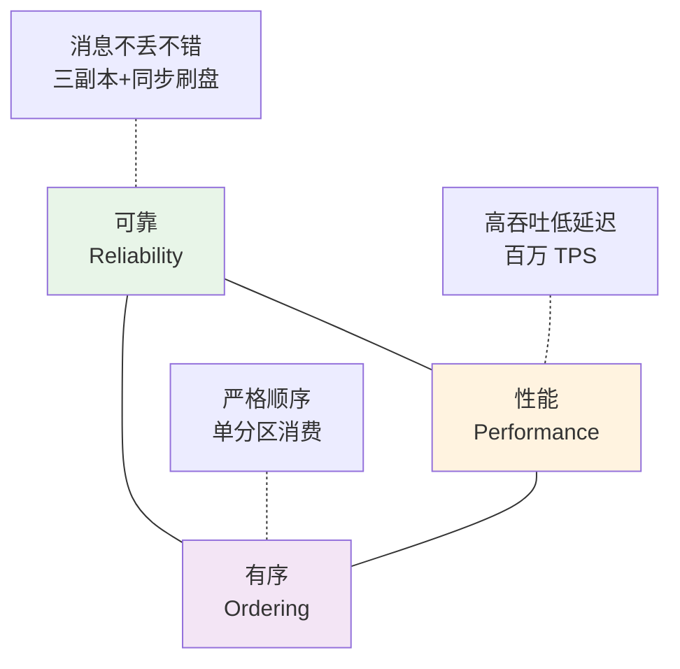

**疑惑**：能同时拿满三者吗？

**论证**：
1. 追求"极致可靠"→ 每条消息三副本同步刷盘 → **写延迟 10-50ms** → 吞吐锐降
2. 追求"极致性能"→ 异步刷盘、单副本、批量 → **吞吐拉满** → 断电必丢
3. 追求"严格有序"→ 单分区消费 → **无并行**——单消费者天花板
4. 三者钝三角互相制约——**没有全能配置，只有场景最优**

**结论**：**MQ 方案的第一步是回答"我在这个三角上站哪儿"**——金融交易偏可靠、日志监控偏性能、订单状态偏顺序。

### 2.2 为什么这么切

后面 3-9 章按"**弄清本质 → 认清主流 → 落到工艺**"这条主线：

| 章 | 层次 | 三角对应 |
|---|---|---|
| §3 MQ 本质 | 认知层 | 三者的价值 |
| §4 四大 MQ 内核 | 谱系层 | 各家取舍 |
| §5 不丢消息 | 工艺层 | 可靠 |
| §6 幂等消费 | 工艺层 | 可靠（应对重复） |
| §7 顺序保证 | 工艺层 | 有序 |
| §8 事务消息 | 工艺层 | 可靠（极致） |
| §9 反例演进 | 时间维度 | 综合 |

## 3. MQ 存在的本质

### 3.1 同步耦合代价

**疑惑**：直接 RPC 调用不好吗？为什么要引入 MQ？

**论证**：某订单服务下游有 4 个消费方：积分、推送、风控、数据分析——**同步链路会**：

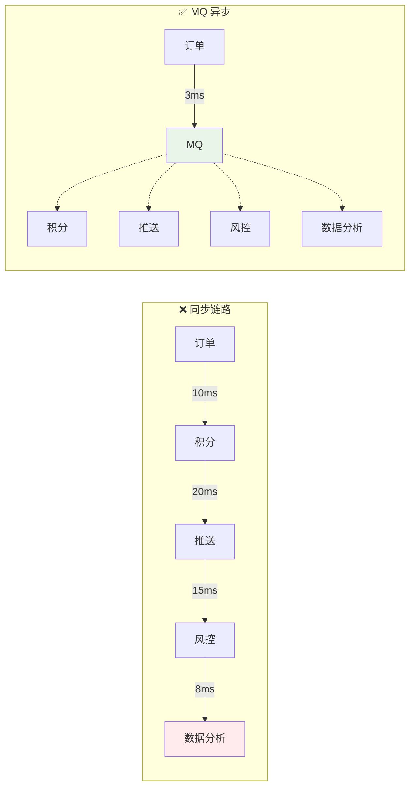

**同步链路三大死穴**：
1. **总延迟 = 各服务延迟之和** = 53ms，MQ 异步只需 3ms
2. **任何下游挂 → 上游挂**——数据分析挂了订单服务也返回失败
3. **每加一个下游都要改上游**——耦合成灾难

**结论**：**MQ 用"最终一致"换"低耦合 + 高性能"**——本质是**时间维度的解耦**（不必立刻做，可以稍后做）。

### 3.2 流量峰谷不均

**场景**：秒杀活动平时 QPS 1000，开抢瞬间 QPS 10 万。

**没有 MQ**：下游 DB 必须按 10w QPS 设计——大部分时间浪费。
**有了 MQ**：10 万瞬时流量进 MQ 队列，下游按 1w QPS 慢慢消化——**峰值靠堆积消化，容量按平均值设计**。

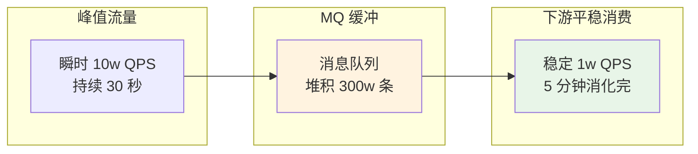

**关键设计**：
- 消费者容量按"平均流量 × 2"配置（不是峰值）
- MQ 容量按"峰值持续时间 × 流量差"配置
- 监控消费 lag，超过阈值告警或自动扩容

### 3.3 最终一致代价

**疑惑**：既然 MQ 那么好，为什么不所有场景都用？

**论证**：MQ 的代价是**最终一致**——业务方要能容忍"一小段时间的不一致":

| 场景 | 能不能容忍 |
|---|---|
| 用户下单后积分几秒后到账 | ✅ 能容忍 |
| 用户下单后立刻查订单看到 | ⚠️ 部分场景需要写完立刻可读 |
| 用户扣钱和账户余额减少 | ❌ 不能容忍（金融强一致） |
| 用户购买后立刻发货 | ❌ 通常不能容忍 |

**结论**：**能容忍"1 秒内一致" → 大胆用 MQ；不能容忍 → 用同步或事务消息**。

### 3.4 MQ 不适用场景

**反例**：某团队用 Kafka 做"实时 RPC 调用"——A 发请求消息，等 B 消费处理完发响应消息回来——**延迟比 RPC 高 10 倍**。

**MQ 不适合的三种场景**：

| 场景 | 为什么不适合 | 应该用 |
|---|---|---|
| **同步 RPC** | 延迟高、代码复杂 | HTTP / gRPC |
| **数据强一致查询** | 有延迟 | 直接查 DB |
| **实时计算的核心链路** | 数据可能重复/乱序 | 流处理框架（Flink） |

## 4. 四大 MQ 内核

### 4.1 Kafka 日志设计

**Kafka 起源**：LinkedIn 2011 年为大数据日志管道设计。**核心思想：把消息当成"append-only log"存储**。

**存储结构**：

```
Topic: order-events
    ├─ Partition 0 (物理文件, 顺序追加)
    │    ├─ segment-000.log  ← 每 1GB 一个 segment
    │    ├─ segment-001.log
    │    └─ segment-002.log (当前写入)
    ├─ Partition 1
    │    └─ ...
    └─ Partition N
```

**性能秘诀**：
- **顺序写磁盘** ≈ 内存随机写速度（600 MB/s vs 100 MB/s 随机写）
- **零拷贝（sendfile）** ——消费时数据不经过应用内存
- **批量 + 压缩** ——批量发送 + LZ4/Snappy 压缩

**代价**：功能相对简单——**没有原生事务消息、延迟消息**——**为吞吐让路**。

### 4.2 RocketMQ 业务化

**RocketMQ 起源**：阿里 2012 年为电商双 11 设计。**核心思想：把业务场景抽象成一等公民**。

**独特能力**：
- **事务消息**（半消息 + 回查）
- **延迟消息**（18 个固定档位）
- **消息过滤**（Tag / SQL92 表达式）
- **消息回溯**（按时间/位点重放）
- **顺序消息**（严格全局有序）

**存储结构**：CommitLog（所有 Topic 混写）+ ConsumeQueue（按 Topic 索引）—— **写入更集中、消费更灵活**。

**代价**：吞吐比 Kafka 低（10w TPS vs 100w+ TPS）——**为业务功能让路**。

### 4.3 RabbitMQ 路由

**RabbitMQ 起源**：2007 年由 Erlang 编写的 AMQP 协议实现。**核心思想：灵活的路由**。

**独特概念**：Exchange + Binding + Queue 的三段式路由：

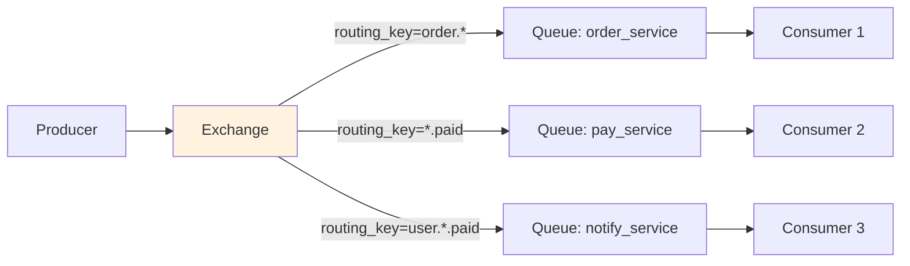

**Exchange 四种类型**：Direct（精确匹配）/ Topic（通配符）/ Fanout（广播）/ Headers（按元数据）。

**优势**：路由能力最灵活，延迟最低（微秒级）。

**代价**：**吞吐较低**（万 TPS 级）——不适合大数据场景。

### 4.4 Pulsar 存算分离

**Pulsar 起源**：Yahoo 2016 年开源，云原生 MQ 新宠。**核心思想：Broker（计算）和 Bookie（存储）分离**。

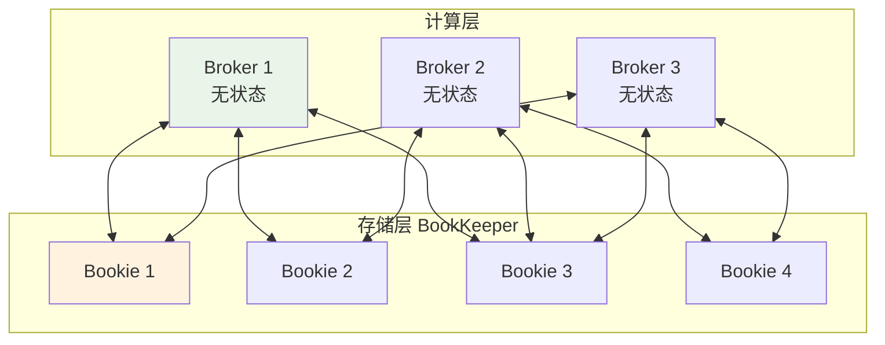

**优势**：
- **Broker 无状态**——扩缩容秒级
- **存储可独立扩展**——冷热分离、S3 归档
- **多租户**——一个集群支撑上百个业务
- **地理复制**——异地多活

**代价**：架构复杂（需要 ZK + BookKeeper + Broker 三层）——运维门槛高。

### 4.5 横向对比矩阵

| 维度 | Kafka | RocketMQ | RabbitMQ | Pulsar |
|---|---|---|---|---|
| **典型 TPS** | 100w+ | 10w | 1w | 100w+ |
| **典型延迟** | 5-10ms | 5-10ms | < 1ms | 5ms |
| **事务消息** | 支持但弱 | ✅ 强 | ❌ | ✅ |
| **延迟消息** | ❌（需插件） | ✅ 18 档 | 插件 | ✅ |
| **消息回溯** | ✅ | ✅ | ❌ | ✅ |
| **消息过滤** | ❌ | ✅ Tag/SQL | ✅ 路由 | ✅ |
| **顺序保证** | 分区内 | 严格 | 队列内 | 分区内 |
| **多租户** | 弱 | 弱 | 中 | ✅ 强 |
| **地理复制** | Mirror Maker | DLedger | Federation | 原生 |
| **社区** | 顶级国际 | 顶级国内 | 活跃 | 上升 |
| **典型使用者** | LinkedIn/Uber | 阿里/字节 | 传统企业 | Yahoo/腾讯 |

**选型口诀**：

- **日志/大数据 → Kafka**（生态最全）
- **业务消息 / 需要事务 → RocketMQ**（阿里系加持）
- **传统企业 / 复杂路由 → RabbitMQ**（AMQP 标准）
- **云原生 / 多租户 → Pulsar**（新一代）
- **不知道选什么 → RocketMQ**（业务场景最贴合）

## 5. 不丢消息三防线

### 5.1 生产端不丢

**疑惑**：怎么保证消息一定发到了 Broker？

**论证**：三种发送方式对比：

```java
// ① 同步发送（最可靠）
SendResult result = producer.send(msg);
if (result.getSendStatus() != SendStatus.SEND_OK) {
    throw new RuntimeException("发送失败: " + result);
}
// 优点：阻塞等 Broker 确认才返回
// 代价：RT 高 10-30ms

// ② 异步发送 + 回调（性能好，但要处理失败！）
producer.send(msg, new SendCallback() {
    @Override public void onSuccess(SendResult result) { }
    @Override public void onException(Throwable e) {
        // ❗ 必须做至少一件事：重试 / 落库补偿 / 强告警
        retryOrPersist(msg, e);
    }
});

// ③ Oneway 发送（最快，但会丢）
producer.sendOneway(msg);
// 只发不管，日志采集这种"丢了也无所谓"的场景才能用
```

**开篇事故的元凶**：`onException` 里只打了日志——**没兜底 = 消息永远消失**。

**正确的兜底模板**：

```java
producer.send(msg, new SendCallback() {
    @Override public void onException(Throwable e) {
        try {
            // 1. 重试 3 次
            for (int i = 0; i < 3; i++) {
                try {
                    producer.send(msg);
                    return;
                } catch (Exception ex) { }
            }
            // 2. 重试失败 → 落到本地失败表
            failedMessageDao.insert(msg);
            // 3. 强告警
            alarm("消息发送失败并已落库: " + msg.getKey());
        } catch (Exception fatal) {
            // 4. 兜底日志（最后一道，绝不能吞）
            log.error("消息完全丢失", fatal);
            metrics.increment("mq.lost");
        }
    }
});
```

### 5.2 Broker 不丢

**消息到了 Broker 就一定不丢吗？** 未必。Broker 可能丢消息的三个场景：

| 场景 | 原因 | 对策 |
|---|---|---|
| **内存丢失** | 消息只在 PageCache，机器断电就没 | 同步刷盘 |
| **主库故障丢失** | 主库刚接收还没同步到从库就挂了 | 同步复制 |
| **磁盘损坏** | 单副本磁盘物理坏了 | 多副本 |

**RocketMQ 的四种配置组合**：

| 配置 | 可靠性 | 性能 |
|---|---|---|
| 异步刷盘 + 异步复制 | 最低 | 最高（默认） |
| 异步刷盘 + 同步复制 | 中 | 中 |
| **同步刷盘 + 异步复制** | 高 | 中低 |
| **同步刷盘 + 同步复制** | 最高（金融级） | 最低 |

**Kafka 的对应机制**：`acks=all` + `min.insync.replicas=2` + `replication.factor=3` —— 至少 2 个副本收到才算成功。

**关键决策**：**金融/交易场景必须"同步刷盘 + 同步复制"**——牺牲一半性能换消息永不丢。

### 5.3 消费端不丢

**核心是 ACK 机制**：

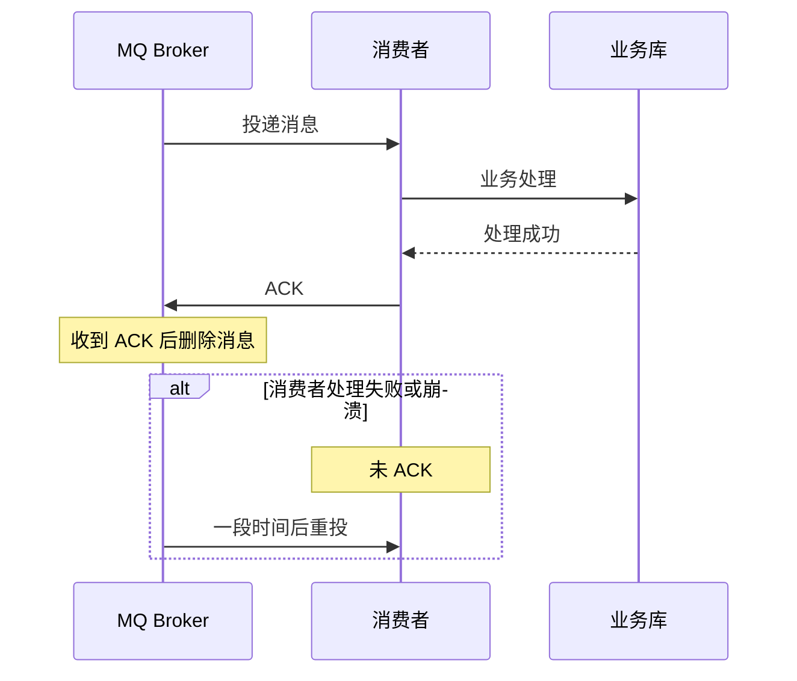

**铁律 1**：**业务处理成功后才 ACK，绝不能先 ACK 再处理**。

**铁律 2**：**手动 ACK，不用自动 ACK**——自动 ACK 意味着"拉到消息就 ACK"，处理失败也丢。

**铁律 3**：**幂等消费（下节）**——因为重投基本不可避免。

**RocketMQ 消费端标准写法**：

```java
consumer.registerMessageListener(new MessageListenerConcurrently() {
    @Override
    public ConsumeConcurrentlyStatus consumeMessage(
        List<MessageExt> msgs, ConsumeConcurrentlyContext context) {
        
        for (MessageExt msg : msgs) {
            try {
                businessLogic(msg);
            } catch (Exception e) {
                // 业务失败 → 返回 RECONSUME_LATER, Broker 会重投
                return ConsumeConcurrentlyStatus.RECONSUME_LATER;
            }
        }
        return ConsumeConcurrentlyStatus.CONSUME_SUCCESS;   // 全部成功才 ACK
    }
});
```

## 6. 幂等消费本质

### 6.1 重复不可避免

**疑惑**：既然 MQ 都做到"不丢"了，为什么还会重复？

**论证**：MQ 消息投递语义有三种：

| 语义 | 说明 | 常见 MQ |
|---|---|---|
| **At most once**（最多一次） | 可能丢，不重复 | 大部分 MQ 关掉重投可实现 |
| **At least once**（至少一次） | 不丢，可能重复 | ✅ 主流默认 |
| **Exactly once**（恰好一次） | 不丢不重 | Kafka + 事务、Pulsar，性能代价高 |

**主流 MQ 默认是"At least once"**——**重复不可避免**。重复的常见原因：

1. **网络超时**：Producer 发消息 Broker 收到但 ACK 丢了 → Producer 重发
2. **消费者崩溃**：处理完消息但没来得及 ACK 就重启
3. **Broker 主从切换**：新主库不确定旧主库最后 ACK 状态 → 重投
4. **消费者 rebalance**：分区重新分配时可能重复消费一段

**结论**：**"重复不可避免" ⇒ "消费者必须幂等"**——这是分布式系统的公理。

### 6.2 幂等四种模式

| 模式 | 思路 | 适用场景 | 例子 |
|---|---|---|---|
| **唯一索引** | 业务 ID 上加唯一索引，重复插入报错 | 简单场景 | order_no 唯一 |
| **状态机** | 业务有明确状态流转，非法转换报错 | 订单、审批 | 已支付订单不能再支付 |
| **乐观锁** | version 字段，只有匹配才更新 | 更新场景 | 库存扣减 |
| **去重表** | 消息 ID 落去重表 | 通用 | 所有类型消息 |

### 6.3 去重表设计

**通用幂等模板**：

```java
@MessageHandler
@Transactional
public boolean handle(Message msg) {
    String msgId = msg.getMsgId();
    
    // 1. 先查去重表
    if (idempotentRepo.existsByMsgId(msgId)) {
        log.info("重复消息，跳过: {}", msgId);
        return true;    // 已处理，直接返回成功
    }
    
    // 2. 业务处理
    businessLogic(msg);
    
    // 3. 写去重表（和业务在同一事务里）
    idempotentRepo.save(new IdempotentRecord(
        msgId, msg.getTopic(), System.currentTimeMillis()
    ));
    
    return true;
}
```

**核心要点**：**业务处理 + 写去重表必须在同一个数据库事务**——否则会出现"业务成功但去重表没写" 或 "去重表写了但业务失败"。

**去重表清理**：按消息保留期（通常 7 天）定期清理旧记录。

## 7. 顺序保证原理

### 7.1 顺序的必要性

**哪些业务必须顺序消费**？

| 场景 | 必须的顺序 | 乱序会怎样 |
|---|---|---|
| 订单状态流转 | 创建 → 支付 → 发货 → 完成 | "已完成" 早于 "已支付" 到，状态错乱 |
| 银行流水 | 严格按发生时间 | 余额算错 |
| MySQL Binlog 同步 | 严格按写入顺序 | 从库数据错 |
| 库存扣减 | 按下单顺序 | 超卖 |

**注意**：多数业务其实**不需要严格顺序**——比如"下单通知短信" 早到晚到都无所谓。**能不用就不用顺序消息**（下节讲代价）。

### 7.2 单分区顺序

**核心原理**：**同一业务键的消息，发到同一分区，同一分区单线程消费**。

```java
// ① 生产端：按 orderId 路由到固定分区
Message msg = new Message("ORDER_TOPIC", body);
msg.setKeys(String.valueOf(orderId));

producer.send(msg, new MessageQueueSelector() {
    @Override
    public MessageQueue select(List<MessageQueue> mqs, Message msg, Object arg) {
        // orderId hash 定分区
        int index = Math.abs(orderId.hashCode()) % mqs.size();
        return mqs.get(index);
    }
}, orderId);

// ② 消费端：单线程消费（MessageListenerOrderly）
consumer.registerMessageListener(new MessageListenerOrderly() {
    @Override
    public ConsumeOrderlyStatus consumeMessage(...) {
        // 单线程按顺序处理
    }
});
```

```
生产端                              消费端
  │                                   │
  │ orderId=100  ─┐                   │
  │ orderId=200  │ hash → P0 ────────▶│ 单线程消费 P0
  │ orderId=300  │      → P1 ────────▶│ 单线程消费 P1
  │ orderId=100  ─┘                   │
  │                                   │
  │  同一 orderId 保证进同一分区       │  单分区单线程 = 严格有序
```

### 7.3 顺序 vs 吞吐

**代价**：顺序消息 = 无法并行 = 单分区吞吐上限 ~1w TPS。

**优化策略**：**多分区提升并行度**——8 分区就能到 8w TPS——**只要"同一业务键的消息"进同一分区，就是"跨分区无序、分区内有序"**。

**极端顺序需求（如全局有序）**：只能单分区——吞吐上限固定。**这时应该重新审视"真的需要全局有序吗"**——多数场景"局部有序"够用。

## 8. 事务消息机制

### 8.1 半消息模式

**场景**：本地 DB 操作和消息发送必须"同时成功或同时失败"。

**RocketMQ 事务消息**：

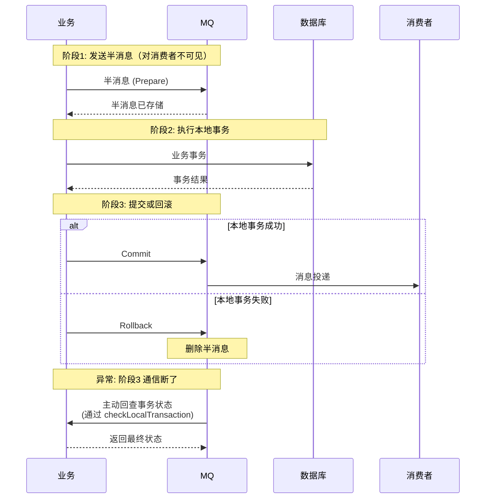

**核心**：**半消息对消费者不可见** → 本地事务成功后才 Commit 变可见 → **确保"消息可见"和"本地事务成功"绑定**。

### 8.2 回查兜底

**问题**：如果阶段 3（Commit/Rollback）网络故障没送到 Broker 怎么办？

**答**：Broker 主动**回查**——找不到状态的半消息，Broker 定时调用 Producer 的 `checkLocalTransaction`：

```java
public LocalTransactionState checkLocalTransaction(MessageExt msg) {
    Long orderId = extractOrderId(msg);
    Order order = orderDao.findById(orderId);
    
    if (order != null && order.getStatus() == REFUNDED) {
        return LocalTransactionState.COMMIT_MESSAGE;
    } else if (order == null) {
        return LocalTransactionState.ROLLBACK_MESSAGE;
    } else {
        return LocalTransactionState.UNKNOW;    // 状态不确定，稍后再回查
    }
}
```

**关键**：**业务侧必须有"从消息反查业务状态"的能力**——通常靠订单 ID 或业务 key。

### 8.3 本地表方案

**如果 MQ 不支持事务消息**（如 Kafka 弱事务），可以用**本地消息表**替代：

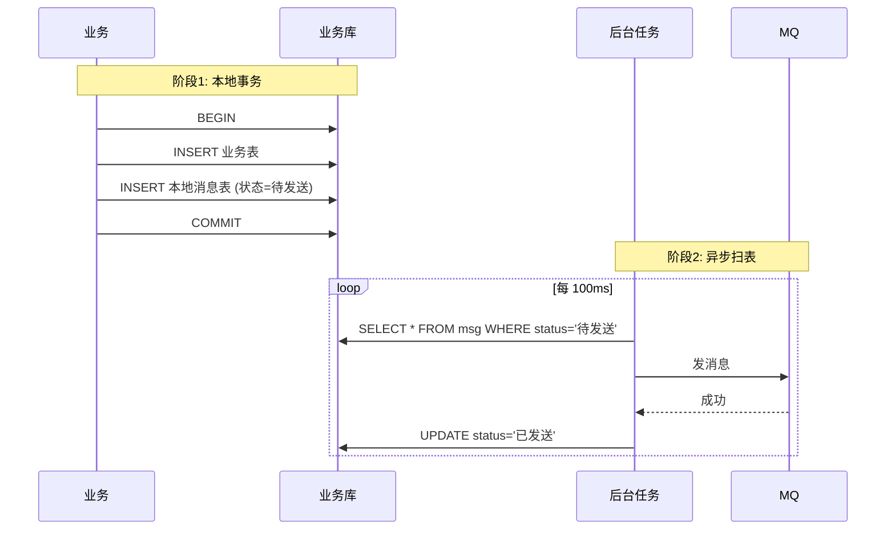

**优点**：不依赖 MQ 事务能力，任何 MQ 都能用。
**代价**：需要额外一张消息表 + 扫表任务。

## 9. 反例与演进

### 9.1 三大经典反例

**反例 1：异步发送不处理失败（开篇故事）**

`onException` 只打日志——**发送失败 = 消息永远丢**。教训：**onException 必须至少做重试/落库/告警之一**。

**反例 2：把 MQ 当同步 RPC 用**

`sendAndWait` 模式——A 发请求消息，等 B 处理完发响应消息回来——**RT 是 RPC 的 10 倍，实现复杂 5 倍**。教训：**MQ 是异步组件，同步场景用 RPC**。

**反例 3：一次登录发 10 条消息（消息风暴）**

```
用户登录 → 发 MQ →
    积分服务消费 → 变更积分 → 发 MQ →
        等级服务消费 → 变更等级 → 发 MQ →
            奖章服务消费 → 变更奖章 → 发 MQ →
                消息通知 → ...
```

**问题**：一次用户操作触发 10+ 条消息，大促时**MQ 流量翻 100 倍**，整个系统瘫痪。

**教训**：**不是所有事件都值得发消息**——每条消息要评估"有多少下游真的需要它"。

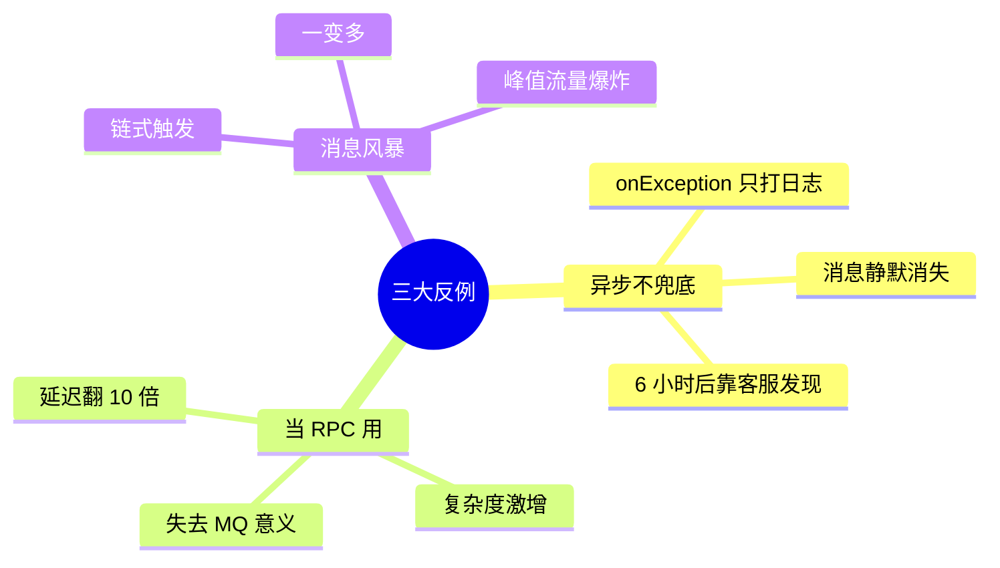

### 9.2 V1-V3 演进

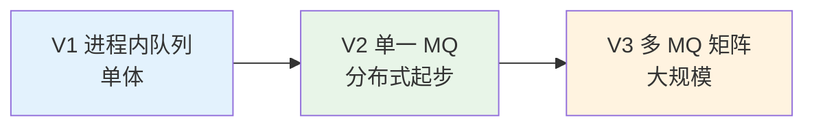

| 阶段 | 触发条件 | 主要动作 |
|---|---|---|
| V1 | 单体应用 | JDK BlockingQueue / Disruptor |
| V2 | 服务拆分 | 引入 RocketMQ 或 Kafka，标准化生产消费 |
| V3 | 多业务线 | 分场景选 MQ（业务 RocketMQ、日志 Kafka）、统一管理平台、Topic 治理 |

**每一步都是"上一步的能力极限"逼出来的**。

## 10. 综合案例串讲

### 10.1 案例真相揭晓

回到开篇 134 笔退款蒸发的故事。**7 个疑问逐条作答**：

**① MQ 到底解决什么？** 订单和支付服务解耦——**没有 MQ**，退款要 RPC 直接调支付服务，RT 高、支付服务挂了退款也挂。**引入 MQ 是对的选择**——错的是没做好防护。（→ §3）

**② 选 RocketMQ 对吗？** 金融场景该用支持事务消息的 MQ——**RocketMQ 是对的**。但这个团队**根本没用事务消息**——那还不如用 Kafka 便宜。（→ §4）

**③ 生产端为什么会丢？** 用了异步发送，**onException 只打日志**——发送阶段就丢，Broker 从没收到过消息。正确做法：改用**事务消息**（详见 §8）或**本地消息表**——把"DB 更新"和"消息发送"变成同一个事务。（→ §5.1）

**④ 就算发送成功，Broker 会不会丢？** 该团队配置是"异步刷盘 + 异步复制"——**金融场景不合格**。改成"同步刷盘 + 同步复制"能进一步降低丢失概率（但性能减半）。（→ §5.2）

**⑤ 消费端会不会重复处理？** 就算这次事故解决，重投肯定会发生——**支付服务必须幂等**。方案：**用退款单号做唯一索引 + 去重表**——重复的退款消息直接跳过。（→ §6）

**⑥ 退款一定要顺序吗？** 不需要——不同订单的退款可以并行。**但同一订单的"申请退款"→"退款完成" 必须有序**——设 orderId 为分区键即可。（→ §7）

**⑦ 事务消息怎么救这个场景？** 用 RocketMQ 事务消息：

```java
public class RefundTransactionListener implements TransactionListener {
    @Override
    public LocalTransactionState executeLocalTransaction(Message msg, Object arg) {
        Long orderId = extractOrderId(msg);
        try {
            orderDao.updateStatus(orderId, REFUNDED);   // 本地事务
            return LocalTransactionState.COMMIT_MESSAGE;
        } catch (Exception e) {
            return LocalTransactionState.ROLLBACK_MESSAGE;
        }
    }
    
    @Override
    public LocalTransactionState checkLocalTransaction(MessageExt msg) {
        Long orderId = extractOrderId(msg);
        Order order = orderDao.findById(orderId);
        return order.getStatus() == REFUNDED
            ? LocalTransactionState.COMMIT_MESSAGE
            : LocalTransactionState.ROLLBACK_MESSAGE;
    }
}

// 发送
producer.sendMessageInTransaction(msg, arg);
```

**保证**：DB 更新成功 → Commit → 消费者能看到；DB 更新失败 → Rollback → 消息作废。**永远不会出现"DB 改了但消息丢了"**。（→ §8）

修复后 134 笔退款事故永远不会重演——每一处修改都对应本文的一节。

### 10.2 一条消息的一生

从"用户申请退款"到"支付服务扣款"的完整消息旅程：

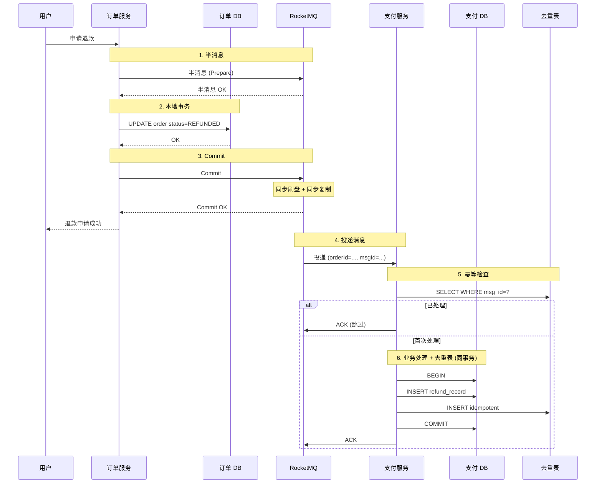

**关键要点**：
- **事务消息** → 生产端不丢
- **同步刷盘 + 同步复制** → Broker 不丢
- **手动 ACK + 幂等表** → 消费端不丢、不重
- **业务处理 + 去重表在同事务** → 幂等保证

**134 笔事故的每一条防线都被补上了**。

### 10.3 设计哲学回扣

从这个案例凝练出**四条可迁移的哲学**：

**1. MQ 的可靠性是"三方共同保证"，不是 MQ 单方面的事**  
Broker 再可靠，生产端不处理失败、消费端不 ACK，消息照样丢——**分布式系统里没有"某个组件保证所有事"，只有"每个组件都做对自己的事"**。

**2. 异步组件的"onException"是所有事故的温床**  
`onException` 里写 `log.error` 然后返回——**这是所有分布式系统里最脆弱的一处代码**。**任何异步失败都必须有兜底动作**（重试/落库/告警至少一个）——不允许"仅打日志"。

**3. 分布式一致性有价，"事务消息"是它的合法交易**  
金融/交易场景不能容忍"DB 成功但消息丢"——**这就是事务消息存在的唯一理由**。**它不是可有可无的高级功能，是这类场景的必需品**。**不用事务消息 = 在赌运气**。

**4. "重复"是分布式系统的公理，"幂等"是它的答案**  
不管 MQ 多可靠，重复消息一定会发生——**消费者必须假设"这条消息之前已经处理过"**。**不写幂等 = 每一次 rebalance 都是事故** —— 这是不需要证明的定理。

### 10.4 MQ 速查表

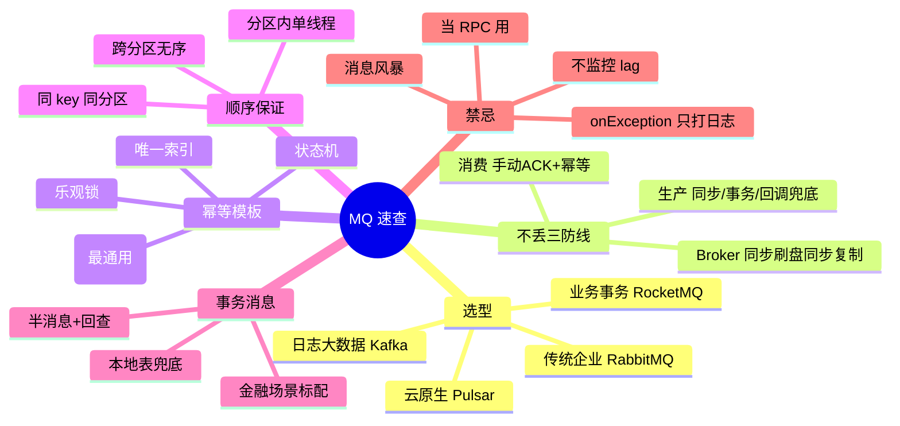

**新增/评审 MQ 方案时 12 条对照**：

- [ ] 场景确实需要异步（不是伪装的同步）
- [ ] MQ 选型契合业务（Kafka/RocketMQ/RabbitMQ/Pulsar）
- [ ] Topic 命名规范（业务域.对象.动作）
- [ ] 生产端有可靠投递机制（同步/事务/异步带兜底）
- [ ] Broker 配置匹配可靠性等级（金融必"同步刷盘 + 同步复制"）
- [ ] 消费端手动 ACK
- [ ] 消费端幂等设计
- [ ] 顺序场景用同 key 同分区
- [ ] 金融场景用事务消息或本地消息表
- [ ] 失败重试 + 死信队列已配置
- [ ] 监控告警就位（生产失败率、消费 lag、堆积量）
- [ ] 关键消息与非关键消息 Topic 隔离

**最后一句话**：MQ 是分布式系统最常用也最容易用错的组件——**它的可靠性从不来自 MQ 本身，而来自"生产端、Broker、消费端三方共同的防线"**。开篇 134 笔退款蒸发的悲剧，不是 RocketMQ 错了，是**每一段防线都被"仅打日志"敷衍掉了**。

> 好的 MQ 设计 = **生产不丢 × Broker 不丢 × 消费不重 × 顺序可控 × 事务有保**。

**下一篇我们顺着"消息传递之外的长期在线通信"这条线，进入 09 篇《长连接方案的设计》**。
