# 12.长链接方案的设计

> **本篇定位**：长连接是即时通讯、实时推送、在线协作的"血管"——HTTP 短连接撑不起 IM、直播弹幕、股票行情。本文从一个推送系统崩塌的故事讲起，回答三个核心问题——**为什么需要长连接？业界怎么实现海量长连接？心跳和断线重连怎么做对？**

#### 目录介绍
- [01.一次推送的崩塌](#01一次推送的崩塌)
  - [1.1 千万设备掉线](#11-千万设备掉线)
  - [1.2 故障扩散链路](#12-故障扩散链路)
  - [1.3 反思长连接设计](#13-反思长连接设计)
- [02.要解决的核心矛盾](#02要解决的核心矛盾)
  - [2.1 短连接的瓶颈](#21-短连接的瓶颈)
  - [2.2 实时性与省电](#22-实时性与省电)
  - [2.3 海量与稳定](#23-海量与稳定)
  - [2.4 长连接的本质](#24-长连接的本质)
- [03.业界主流方案](#03业界主流方案)
  - [03.1 协议层选型](#031-协议层选型)
  - [03.2 横向对比矩阵](#032-横向对比矩阵)
  - [03.3 典型架构案例](#033-典型架构案例)
- [04.设计核心原则](#04设计核心原则)
  - [04.1 心跳保活原则](#041-心跳保活原则)
  - [04.2 断线重连原则](#042-断线重连原则)
  - [04.3 消息可靠原则](#043-消息可靠原则)
  - [04.4 横向扩展原则](#044-横向扩展原则)
- [05.方案落地实战](#05方案落地实战)
  - [05.1 整体架构](#051-整体架构)
  - [05.2 心跳机制设计](#052-心跳机制设计)
  - [05.3 重连退避策略](#053-重连退避策略)
  - [05.4 消息可靠投递](#054-消息可靠投递)
  - [05.5 海量连接管理](#055-海量连接管理)
- [06.关键问题解决](#06关键问题解决)
  - [06.1 连接路由问题](#061-连接路由问题)
  - [06.2 多端在线问题](#062-多端在线问题)
  - [06.3 弱网兼容问题](#063-弱网兼容问题)
- [07.常见陷阱与反例](#07常见陷阱与反例)
  - [07.1 心跳过频反例](#071-心跳过频反例)
  - [07.2 雪崩重连反例](#072-雪崩重连反例)
  - [07.3 内存泄漏反例](#073-内存泄漏反例)
- [08.演进路线](#08演进路线)
  - [08.1 V1 单机长连接](#081-v1-单机长连接)
  - [08.2 V2 接入层集群](#082-v2-接入层集群)
  - [08.3 V3 全球多接入点](#083-v3-全球多接入点)
- [09.总结与决策](#09总结与决策)
  - [09.1 上线检查表](#091-上线检查表)
  - [09.2 选型决策树](#092-选型决策树)


## 01.一次推送的崩塌

### 1.1 千万设备掉线

某 IoT 平台连接着 800 万台智能设备，2023 年春节凌晨 0 点准时给所有设备推送"新年祝福"。**0:00:00**，推送服务开始批量下发。**0:00:03**，长连接接入层 CPU 飙到 95%。**0:00:10**，**40% 的设备开始断连重连**。**0:00:30**，接入层雪崩，**800 万设备全部掉线**。

| 时间点 | 现象 |
|---|---|
| 0:00:00 | 触发新年推送 |
| 0:00:03 | 接入层 CPU 95% |
| 0:00:10 | 设备开始断连重连 |
| 0:00:30 | 接入层全线崩溃 |
| 0:01:00 | 800 万设备同时重连，TCP 握手洪水 |
| 0:15:00 | 紧急扩容 + 限流，逐步恢复 |
| 0:45:00 | 完全恢复，但黄金时段已过 |

### 1.2 故障扩散链路

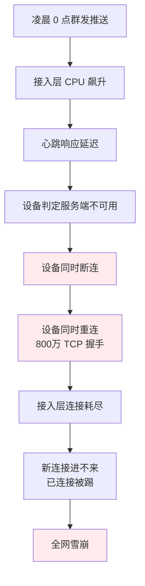

**真正的根因不是推送量大，而是这 5 个细节**：
1. **没有错峰下发**——所有设备同时收到推送
2. **重连没有退避**——掉线后立刻重连
3. **重连没有抖动**——所有设备同时重连
4. **接入层没有过载保护**——超过容量也接收
5. **客户端心跳过频**——闲时也 30 秒一次心跳

### 1.3 反思长连接设计

事后这个团队总结了三个最深刻的教训：

1. **长连接 = 状态长期持有 = 故障传染范围极大**
2. **心跳和重连必须做"错峰" + "退避"**，否则一掉就雪崩
3. **接入层必须有过载保护**，宁可拒绝新连接也不能让已连接挂掉

## 02.要解决的核心矛盾

### 2.1 短连接的瓶颈

HTTP 短连接每次请求都要 TCP 三次握手 + TLS 握手，**一次完整握手约 200-500ms**。在 IM 场景下：

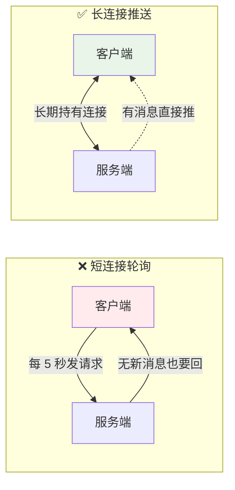

**短连接的 4 个致命问题**：
- 实时性差（必须轮询）
- 服务器压力大（无效请求 90%+）
- 流量浪费（每次都重新握手）
- 不省电（手机轮询耗电严重）

### 2.2 实时性与省电

移动端长连接的天敌是**电池**。心跳越频繁电池越耗，但太疏远又会被运营商 NAT 网关回收：

| 心跳间隔 | 消息延迟 | 电池影响 | NAT 回收风险 |
|---|---|---|---|
| 30 秒 | 极低 | 严重耗电 | 几乎无 |
| 3 分钟 | 中 | 轻 | 低 |
| 5 分钟 | 中 | 极轻 | 中（运营商常见 5min 回收） |
| 10 分钟 | 较高 | 几乎无 | 高 |

**实战折中**：**自适应心跳**——前台 3 分钟、后台 5 分钟、网络稳定时延长、不稳定时缩短。

### 2.3 海量与稳定

单机能承载多少长连接？**理论上 65535 个端口够用，但实际受内存和文件句柄限制**：

| 指标 | 单机典型值 |
|---|---|
| 文件句柄上限 | 100w（调内核参数） |
| 每连接内存 | 8KB-32KB |
| 100w 连接内存 | 8GB-32GB |
| 单机实际承载 | 50w-100w（业务复杂度决定） |

**海量场景必须分布式接入层**，单点会有性能瓶颈和单点故障。

### 2.4 长连接的本质

> **长连接 = 用"状态长期持有"换"实时推送 + 低延迟"**

它的核心追求是 **让消息"主动到达"客户端，而不是客户端"主动来取"**。

## 03.业界主流方案

### 03.1 协议层选型

| 协议 | 定位 | 典型场景 |
|---|---|---|
| **TCP 私有协议** | 自定义协议、性能极致 | 大型 IM（微信、钉钉） |
| **WebSocket** | 浏览器标准、HTTP 升级 | Web IM、实时仪表盘 |
| **MQTT** | 物联网标准、低带宽 | IoT 设备 |
| **gRPC Streaming** | RPC 双向流 | 微服务长连接 |
| **Server-Sent Events** | HTTP 单向推送 | 通知、订单状态 |
| **HTTP Long Polling** | HTTP 模拟长连接 | 兼容老浏览器 |
| **QUIC** | 基于 UDP、低延迟 | 弱网 + 移动场景 |

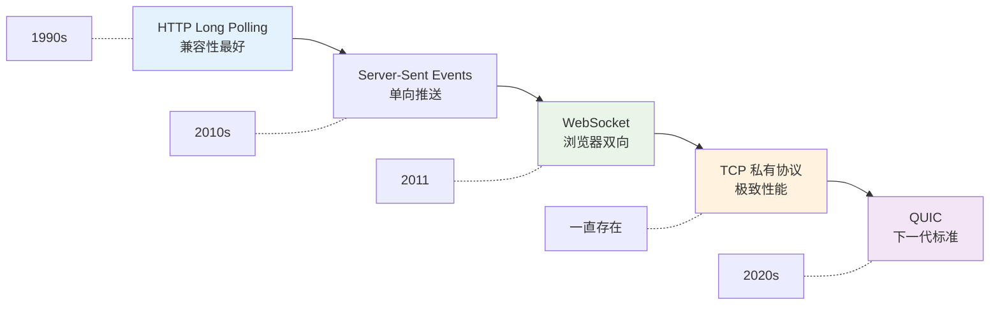

### 03.2 横向对比矩阵

| 维度 | TCP 私有 | WebSocket | MQTT | gRPC Stream | QUIC |
|---|---|---|---|---|---|
| **传输层** | TCP | TCP | TCP | TCP/HTTP2 | UDP |
| **协议复杂度** | 自己定 | 中 | 低 | 中 | 高 |
| **浏览器支持** | ❌ | ✅ | 弱 | 弱 | 部分 |
| **跨语言** | 自己实现 | ✅ | ✅ | ✅ | 上升中 |
| **省流量** | ⭐⭐⭐⭐⭐ | ⭐⭐⭐ | ⭐⭐⭐⭐⭐ | ⭐⭐⭐ | ⭐⭐⭐⭐ |
| **弱网表现** | 取决于实现 | 一般 | 好 | 一般 | 极好 |
| **典型代表** | 微信 mmtls | 大多数 Web IM | 特斯拉车机 | 内部微服务 | YouTube |

### 03.3 典型架构案例

**案例：某 IM 应用的长连接架构**

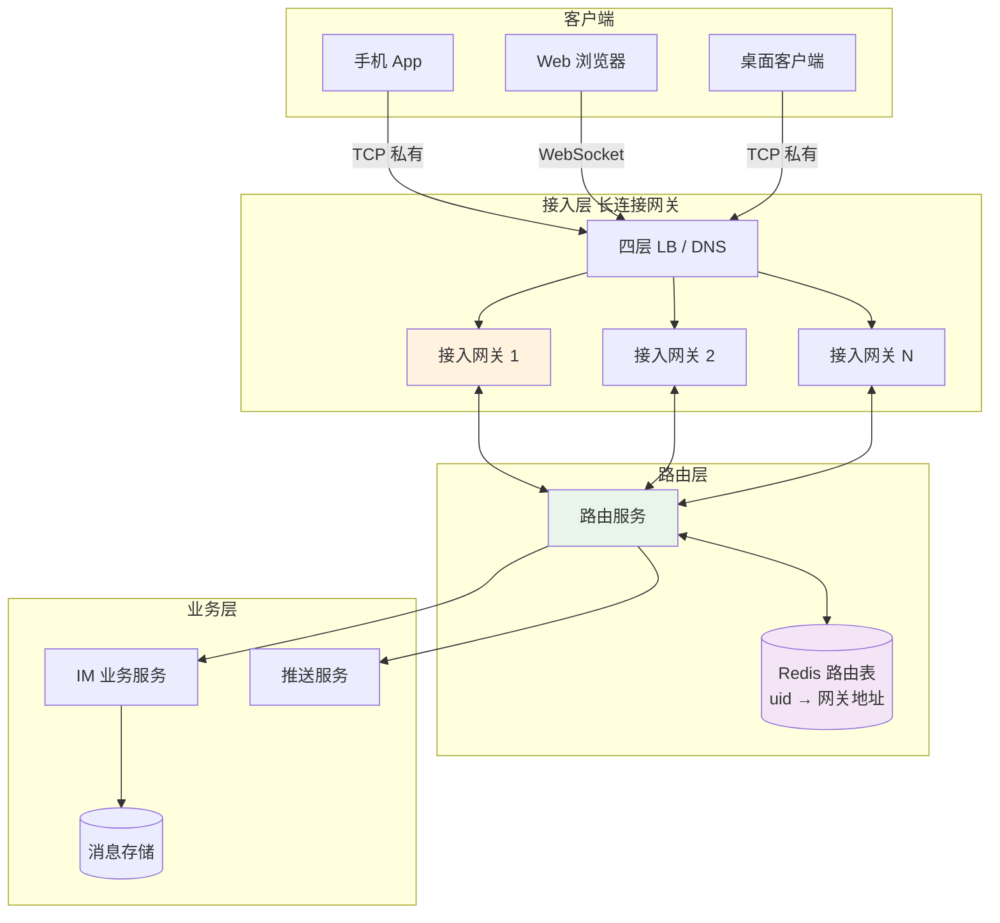

**核心设计**：
- **接入层与业务层解耦**：接入层只管连接维护和路由，业务逻辑在后端
- **路由表用 Redis**：`uid → 当前所在的接入网关地址`
- **业务层主动推送**：业务层根据路由表找到目标网关，再由网关推送给客户端

## 04.设计核心原则

### 04.1 心跳保活原则

**心跳的两个目标**：
- **保活**：防止 NAT / 防火墙回收闲置连接
- **探测**：发现死连接（半打开状态）

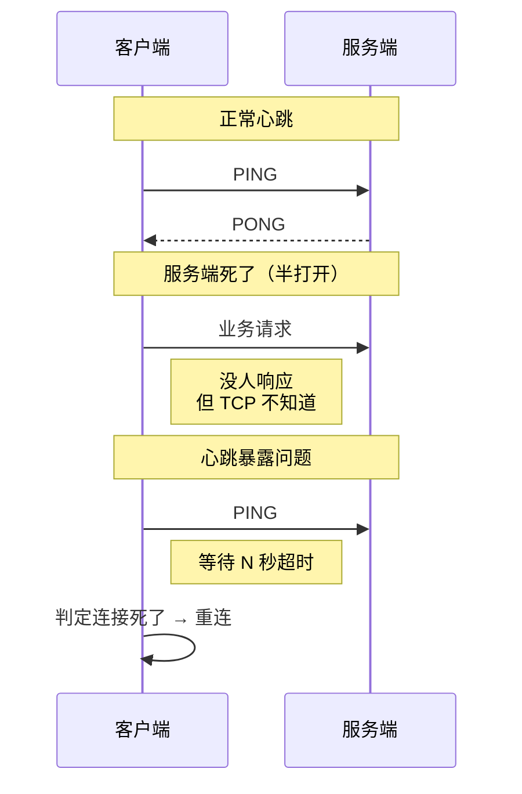

**自适应心跳算法**（参考微信）：

```kotlin
class AdaptiveHeartbeat {
    private var interval = 4 * 60 * 1000L  // 初始 4 分钟
    private val MIN = 30 * 1000L            // 最小 30 秒
    private val MAX = 10 * 60 * 1000L       // 最大 10 分钟
    
    fun onSuccess() {
        // 心跳成功 → 适度延长
        interval = (interval * 1.2).toLong().coerceAtMost(MAX)
    }
    
    fun onFail() {
        // 心跳失败 → 立刻缩短
        interval = (interval * 0.5).toLong().coerceAtLeast(MIN)
    }
}
```

### 04.2 断线重连原则

**铁律**：**重连必须有退避 + 抖动**，不然就是开篇的 800 万雪崩。


**指数退避 + 随机抖动**：

```kotlin
fun nextDelay(retryCount: Int): Long {
    val base = minOf(2.0.pow(retryCount).toLong() * 1000, 60_000L)
    val jitter = Random.nextLong(0, base / 2)  // 加 0-50% 抖动
    return base + jitter
}
```

**为什么要抖动**：所有客户端同时间被踢下线后，如果固定退避，**所有客户端会在同一时刻一起重连**——又一次雪崩。**抖动让重连请求在时间轴上摊开**。

### 04.3 消息可靠原则

长连接的消息可能在以下时机丢失：

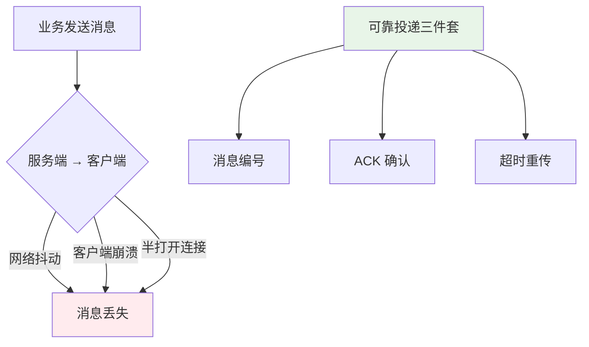

**经典 ACK 机制**：

| 流程 | 动作 |
|---|---|
| 1. 服务端发送 | 带消息 ID `msg_001` |
| 2. 客户端收到 | 立即回复 `ACK msg_001` |
| 3. 服务端收到 ACK | 标记为已送达 |
| 4. 超时未收到 ACK | 重传 |
| 5. 客户端去重 | 收到重复 ID 直接丢弃 |

### 04.4 横向扩展原则

**单机有上限，必须能水平扩展**：

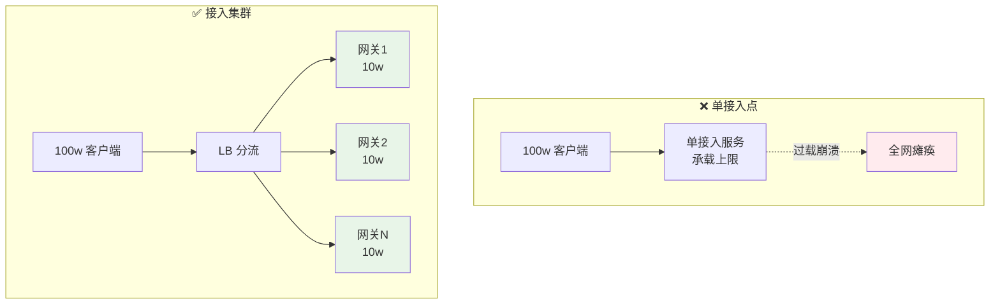

**关键能力**：
- 接入层**无状态**（连接信息在 Redis）
- 单台挂了 LB 自动剔除
- 容量不够即时加机器

## 05.方案落地实战

### 05.1 整体架构

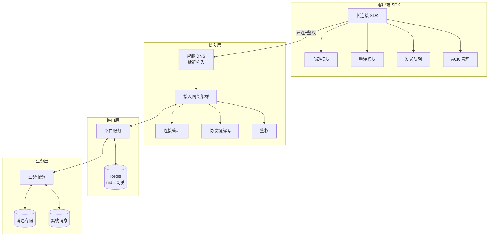

### 05.2 心跳机制设计

**完整心跳设计要素**：

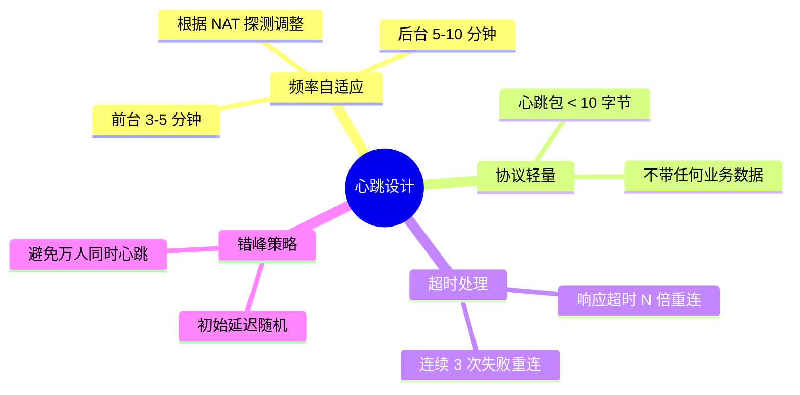

**反例**：所有客户端固定 60s 心跳 → 接入层 QPS = 客户端数 / 60，**100 万客户端 = 1.6w QPS 心跳**，浪费严重。

**正例**：3-5 分钟 + 随机化 → 同样客户端 QPS 仅 3000。

### 05.3 重连退避策略

完整重连流程：

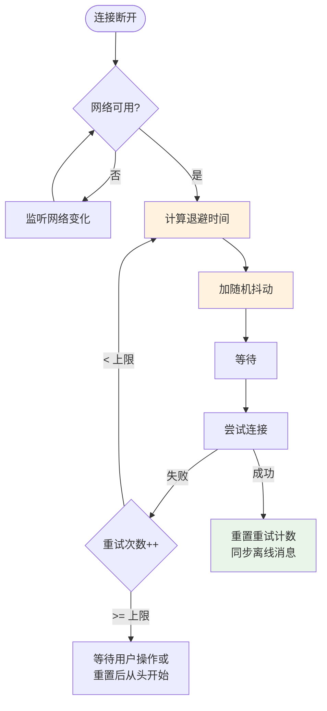

### 05.4 消息可靠投递

**端到端可靠投递**：

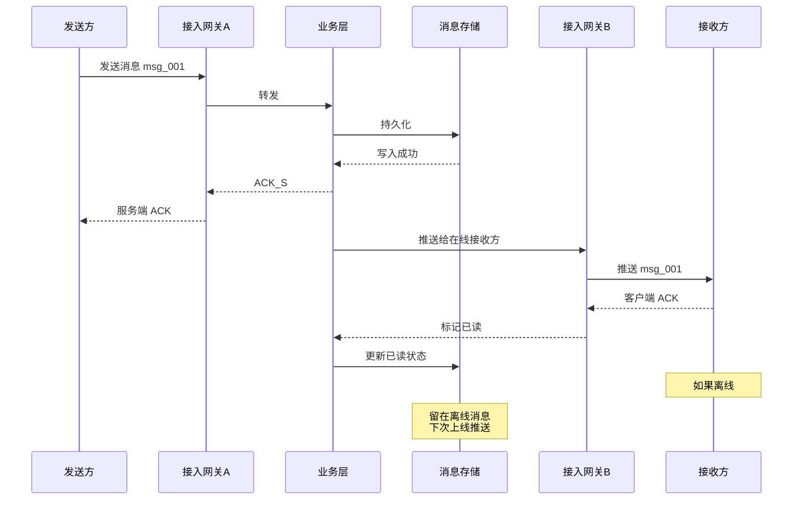

**两段 ACK 的意义**：
- **服务端 ACK**：保证消息不丢（已落库）
- **客户端 ACK**：保证消息已被收到

### 05.5 海量连接管理

**单机优化要点**：

| 维度 | 优化项 | 效果 |
|---|---|---|
| **OS 内核** | `ulimit -n 1000000` 文件句柄 | 突破 65535 限制 |
| **TCP 参数** | `tcp_keepalive_time` `tcp_max_syn_backlog` | 提升握手能力 |
| **网络模型** | epoll（Linux）/ kqueue（BSD） | 单进程百万连接 |
| **内存优化** | 连接对象池化 | 降低 GC 压力 |
| **零拷贝** | sendfile / splice | 减少内存拷贝 |
| **协议精简** | 二进制 + Varint | 流量减半 |

**典型技术栈**：
- **Java 系**：Netty（事实标准）
- **Go 系**：原生 net + goroutine
- **C++ 系**：libevent / boost.asio
- **专业级**：自研（如微信 mars、支付宝 mPaaS）

## 06.关键问题解决

### 06.1 连接路由问题

**问题**：业务层有消息要推给 user_123，但 user_123 连接在 1000 个接入网关里的哪一个？

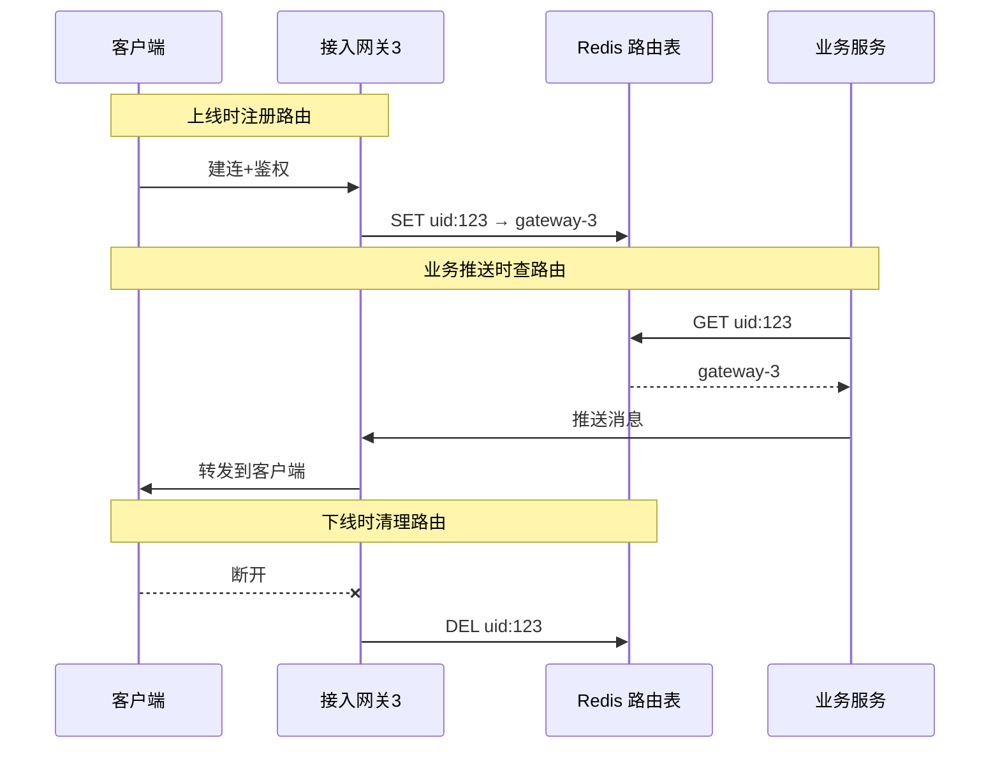

### 06.2 多端在线问题

**典型 IM 多端场景**：用户在手机 + Web + 桌面同时登录。

| 维度 | 多端策略 |
|---|---|
| **路由表** | `uid → [gateway-1, gateway-3, gateway-7]` 多对多 |
| **消息广播** | 所有在线端都推送 |
| **状态同步** | 一端已读，其他端同步已读 |
| **互斥端类型** | 例如同种手机型号互踢 |

### 06.3 弱网兼容问题

**移动端弱网的典型表现**：
- 信号切换（4G ↔ Wi-Fi）→ 连接频繁断开
- 高延迟（300ms+）→ 心跳超时误判
- 高丢包（10%+）→ 消息丢失

**应对策略**：

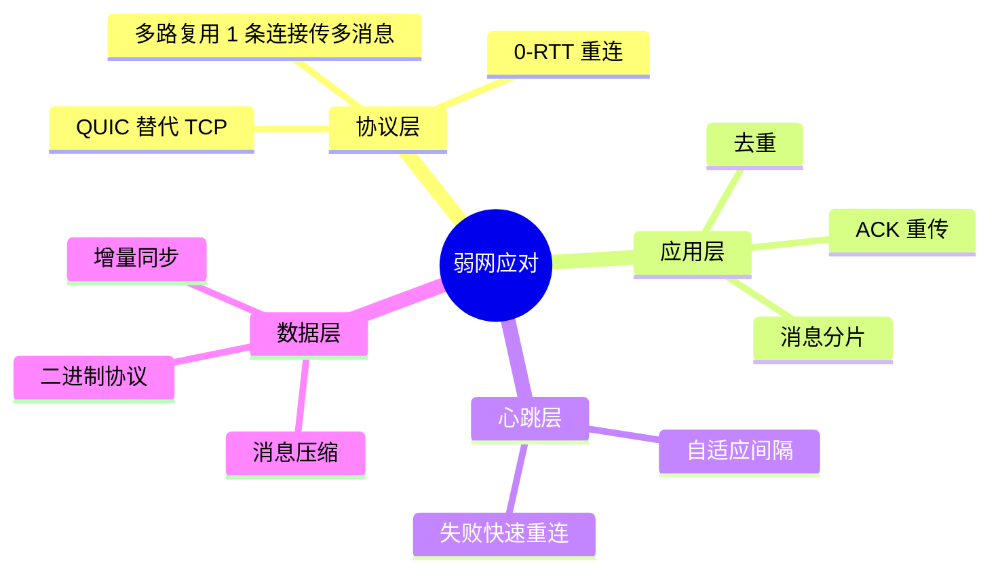

## 07.常见陷阱与反例

### 07.1 心跳过频反例

**反例**：某 IM 客户端为了"实时性"设了 30 秒心跳。

**问题**：
- 用户电池续航减少 20%
- 接入层心跳 QPS 占了 60%
- 流量浪费严重

**正确**：3-5 分钟自适应心跳。**只有当心跳失败时才需要更频繁**。

### 07.2 雪崩重连反例

**反例**：开篇的 800 万设备同时重连。

**正确**：**指数退避 + 随机抖动**。

### 07.3 内存泄漏反例

**反例**：接入网关用 Java 写的，每来一个连接 new 一个 ConnectionContext，**断连后没及时释放**——24 小时后 OOM。

**正确**：
- 使用对象池
- 断连立即清理路由 + 释放对象
- 监控连接数 vs 对象数（应基本相等）

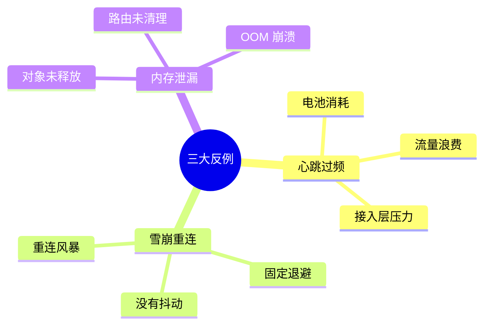

## 08.演进路线

### 08.1 V1 单机长连接

**特征**：业务起步、连接数 < 10w。

**做法**：
- 单台服务直接用 Netty
- 简单的连接管理
- 心跳 + 重连基础能力

### 08.2 V2 接入层集群

**特征**：连接数 10w-1000w。

**做法**：
- 接入网关集群化（多实例）
- 路由表用 Redis
- 业务层与接入层分离
- 完整的心跳 / 重连 / ACK

### 08.3 V3 全球多接入点

**特征**：千万级 + 全球用户。

**做法**：
- 全球多机房部署接入网关
- 智能 DNS 就近接入
- 跨机房消息路由
- 协议升级（QUIC / 私有协议）
- 完整的容灾切换

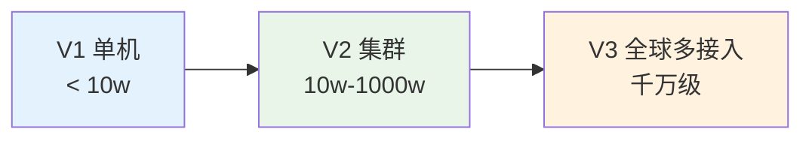

## 09.总结与决策

### 09.1 上线检查表

新增长连接服务上线前对照：

- [ ] 协议选型完成（TCP/WebSocket/MQTT/QUIC）
- [ ] 心跳间隔合理（推荐 3-5 分钟自适应）
- [ ] 心跳有错峰随机化
- [ ] 重连有指数退避 + 抖动
- [ ] 消息有序号 + ACK + 重传
- [ ] 客户端有去重逻辑
- [ ] 接入层水平扩展能力就绪
- [ ] 路由表设计完成（Redis / etcd）
- [ ] 接入层有过载保护（连接数限流）
- [ ] 单机 OS 参数已优化（文件句柄 / TCP）
- [ ] 监控就绪（连接数、心跳成功率、消息延迟、断连率）
- [ ] 多端在线策略明确
- [ ] 弱网兼容方案就位
- [ ] 容灾切换演练完成

### 09.2 选型决策树

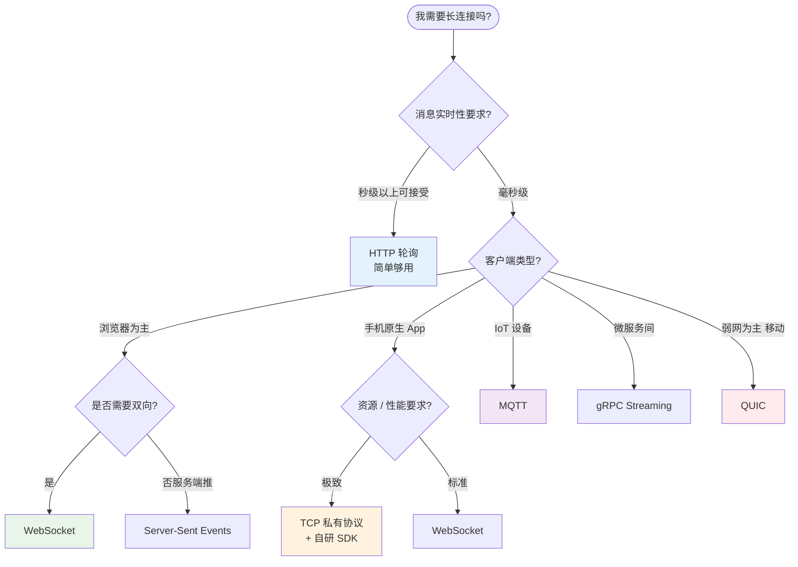

**最后一句话**：长连接是分布式系统里"最容易雪崩的组件"——开篇 800 万设备掉线只是因为 5 个细节同时做错。

> 好的长连接 = **心跳错峰、重连退避、消息可靠、连接可控**。
