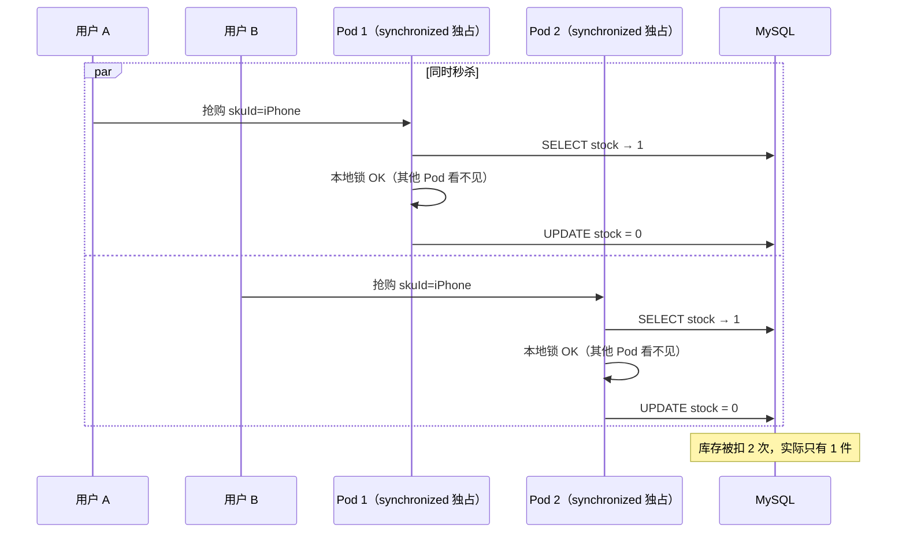
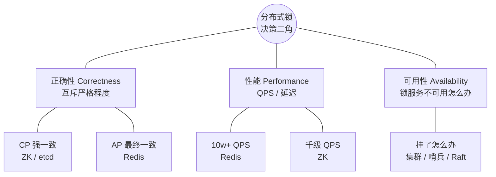
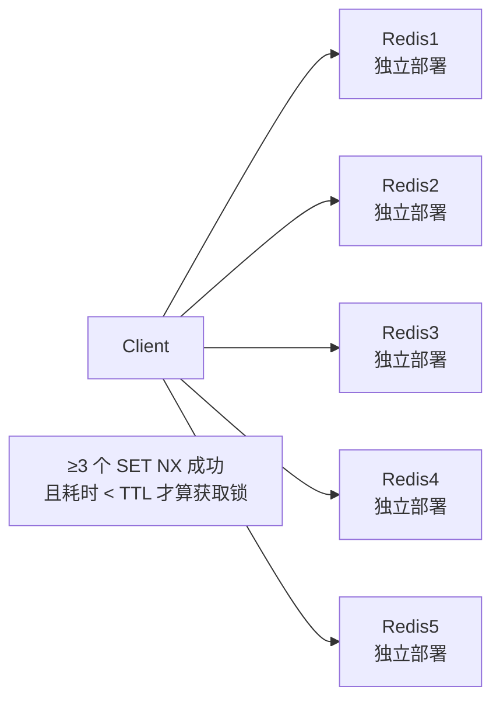
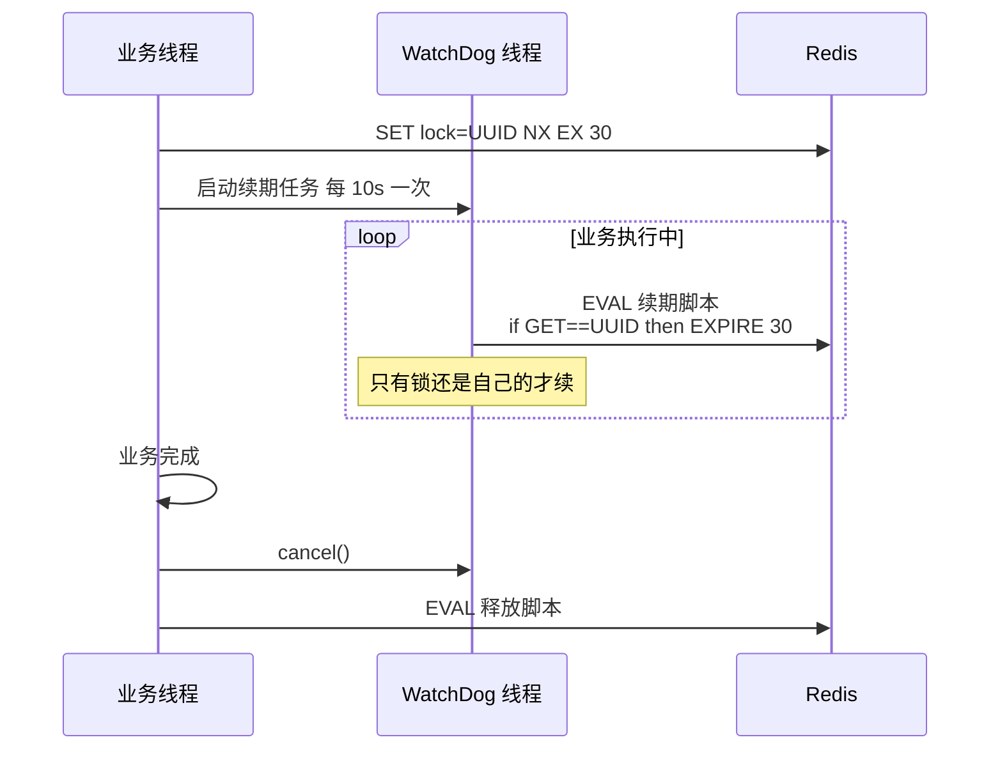
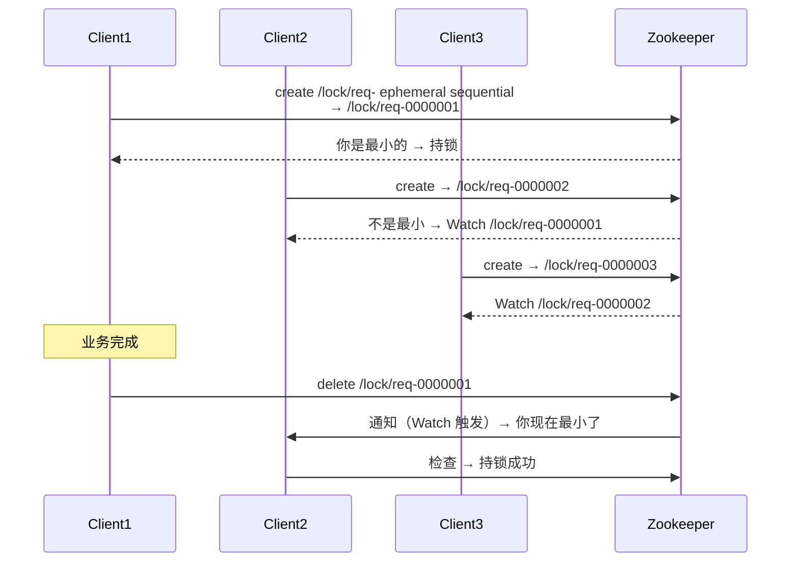
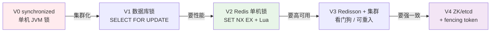
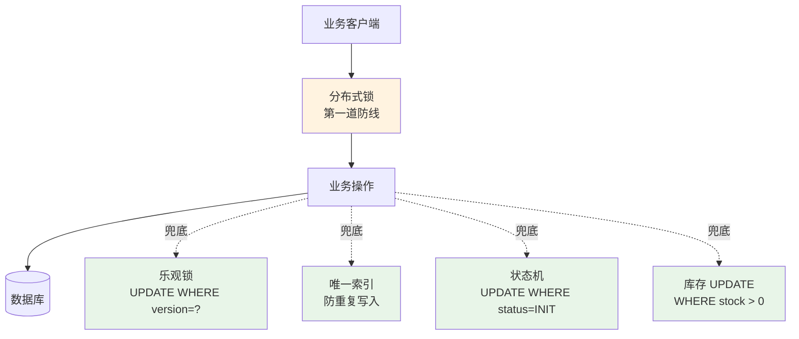
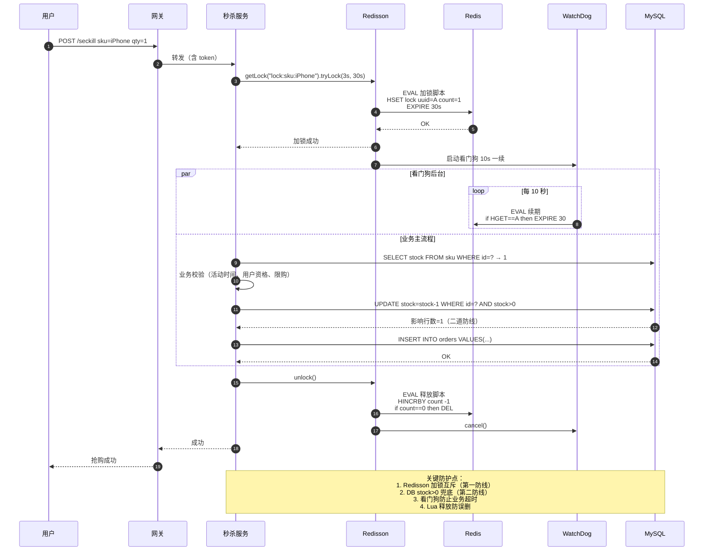

# 15.分布式锁方案设计

> **本篇定位**：分布式锁是分布式系统中的"互斥保险丝"——多节点协调访问共享资源的最后一道防线。本文从一次 480 万元的秒杀超卖事故讲起，逐层拆解为什么单机锁在多节点下必然失效、Redis / Zookeeper / etcd 三大方案怎么选、Redlock 的 Martin Kleppmann 论战到底吵什么、看门狗续期的数学边界在哪里、锁粒度如何在"竞争"和"爆炸"之间取平衡，最后用 `一次抢购的分布式锁一生` 时序图把所有原理串成一条线。


## 01.案例引入：超卖 1200 件与 480 万损失

### 1.1 事故复盘

某电商公司在双 11 前做 iPhone 秒杀预热，库存 **1000 台**，单价 **8000 元**，活动结束系统统计发现：

- 实际下单 **2200 单**——超卖 **1200 台**
- 单台履约成本 **4000 元**（差价 + 快递 + 退单赔付）
- **直接损失 480 万元**，另外补偿券 200 万元
- 舆情爆发登上微博热搜，客服排队 3 天

事后从代码里找出致命的 5 行：

```java
public void seckill(long skuId, long userId) {
    synchronized (SeckillService.class) {   // ← 元凶就在这里
        int stock = stockDao.select(skuId);
        if (stock > 0) {
            stockDao.decrease(skuId);
            orderDao.create(userId, skuId);
        }
    }
}
```

- **`synchronized` 只锁 JVM 内部**，秒杀服务部署了 **5 个 Pod**，5 个锁互不感知
- `SELECT` 与 `UPDATE` 之间存在窗口，跨 Pod 天然出现"5 个人同时看到还剩 1 件"
- 数据库 `UPDATE` 没有 `WHERE stock > 0` 的乐观兜底，扣成 `-1200` 也照写不误



### 1.2 从事故中要问的 7 个问题

复盘会上，团队总结出 7 个必须回答清楚的问题，也是本文接下来要逐层攻破的：

1. **单机锁为什么在分布式部署下必然失效？**它到底"锁"的是什么？
2. **分布式锁的本质是什么？**为什么把状态放在外部第三方就能重新"回到单机"？
3. **Redis / Zookeeper / etcd 三种方案，怎么选才不会出错？**性能差多少？强一致又差多少？
4. **Redlock 是不是银弹？**Martin Kleppmann 那场经典论战到底在争什么？
5. **锁过期时间怎么定？**业务比锁长怎么办？看门狗续期到底续多久？
6. **释放锁怎么保证不删别人的？**为什么必须用 Lua 脚本？
7. **有了分布式锁就万事大吉了吗？**为什么金融系统还要"二道防线"？

### 1.3 拨开表象：本质是"跨进程互斥"

超卖 1200 件的深层原因，不是"没加锁"，而是**加了一把只在本进程内有效的锁**。分布式锁真正要解决的问题只有一句话：

> **让 N 台机器上的 M 个线程，像 1 台机器上的 M 个线程一样，看到同一把锁。**

任何分布式锁方案都必然做三件事：

1. **状态外置**——把锁的状态放在所有节点都能访问的第三方（Redis、ZK、etcd、DB）
2. **原子操作**——加锁必须"判断 + 写入"一步完成，不能中间断裂
3. **自动过期**——持锁进程崩溃后，锁必须能自愈，否则整个系统卡死


## 02.架构决策三角：正确性 × 性能 × 可用性

任何分布式锁选型，本质上都是在三个维度之间取舍。三个维度不可能同时最优，必须选择 **联合最优组合**：



| 三个维度 | 追求的极端 | 代价 |
|---|---|---|
| **正确性拉满** | 强一致 CP（ZK/etcd） | QPS 掉一个数量级、延迟从 1ms 升到 10ms |
| **性能拉满** | Redis 单节点，无副本 | 主节点挂了瞬间可能双主拿锁 |
| **可用性拉满** | Redis 哨兵 / Cluster | 主从切换那 100ms 内锁状态可能丢 |

**没有银弹**：金融系统愿意牺牲 QPS 换正确，电商秒杀允许"极端场景补偿"换性能，云原生系统追求"和 K8s 同栈"选 etcd。**先想清楚业务能容忍什么，再谈选什么锁**。

选型公式（工程视角）：

```
业务能容忍的"锁失效损失" > 使用强一致锁多付的"性能成本" → 选 AP（Redis）
反之 → 选 CP（ZK/etcd） + 业务层再叠加一道防线
```

秒杀事故的团队最终选择：**Redisson（AP）+ DB 层 `UPDATE WHERE stock > 0` 兜底**，而不是"直接换 ZK"——因为 Redis 单集群足够满足秒杀 QPS，业务层再守一道即可把风险降到可接受。


## 03.本质回归：为什么单机锁必然失效

### 疑惑

`synchronized` 明明能锁得住多线程，为什么一到分布式就不管用了？换成 `ReentrantLock` 呢？加个 `volatile` 呢？

### 论证：锁的三要素

任何锁的成立都必须有三个要素：

1. **共享的状态位**——一个大家都看得见的"标记"
2. **原子的读改写**——CAS / synchronized / Monitor
3. **公平或非公平的排队**——等锁的线程按什么顺序进

单机 JVM 里，这三要素都由 **`Object Monitor` 或 `AQS` 提供**，全部住在同一块 JVM 堆内存里。多线程能锁住的根本原因，是 **它们共享同一个 Monitor 对象地址**。

一旦跨进程，问题就出现了：

```mermaid
graph LR
    subgraph 单进程 JVM
        T1[线程1] --> M[堆内 Monitor]
        T2[线程2] --> M
        T3[线程3] --> M
    end
    subgraph 多进程分布式
        P1[Pod1 JVM] --> M1[Monitor@Pod1]
        P2[Pod2 JVM] --> M2[Monitor@Pod2]
        P3[Pod3 JVM] --> M3[Monitor@Pod3]
        M1 -. 互相不知道 .- M2
        M2 -. 互相不知道 .- M3
    end
```

三个 Pod 各自维护一份 Monitor，它们的地址在不同物理机的不同堆里，永远不可能"指向同一块内存"。`synchronized` 只保证 **同一 Monitor 上的线程互斥**——分布式部署下 Monitor 数量 = Pod 数量，锁数量也就 = Pod 数量。

### 结论

> 分布式锁的第一原理：**把"共享状态"从 JVM 堆搬到所有进程都能访问的第三方存储**。

无论是 Redis 里的一个 key，ZK 里的一个 znode，etcd 里的一个 lease，本质上都是 **同一个"标记位"** ——只要所有进程都去看它、改它，就能重新回到"单机互斥"的语义。


## 04.主流方案谱系：三大流派 + Redlock 争议

### 4.1 三大主流方案


| 维度 | Redis | Zookeeper | etcd | 数据库 |
|---|---|---|---|---|
| **CAP 倾向** | AP | CP | CP | CP |
| **单锁 QPS 上限** | 10w+ | 数千 | 数万 | 数百 |
| **加锁延迟** | 1ms | 10ms | 5ms | 20ms |
| **死锁风险** | 中（靠过期） | 低（临时节点） | 低（lease） | 高（要显式释放） |
| **Watch / 通知** | 弱（订阅可用） | ✅ 完美 | ✅ 完美 | ❌ |
| **公平锁** | 难自实现 | ✅ 顺序节点 | ✅ | 难 |
| **可重入** | 靠 Redisson | 靠 Curator | 靠客户端 | 自建 |
| **生态** | Redisson 事实标准 | Curator 事实标准 | clientv3 | 原生 SQL |
| **典型场景** | 互联网秒杀、去重 | 金融清算、订单 | K8s、云原生 | 简单低并发 |

### 4.2 Redlock 争议：Antirez vs Martin Kleppmann

**Redlock 是 Redis 之父 Salvatore Sanfilippo（Antirez）2014 年提出的多节点算法**，核心思路：

- 部署 N=5 个 **完全独立**（不复制）的 Redis 主节点
- 客户端向 5 个节点依次 `SET NX EX`
- **多数派（≥ 3 个）成功** + 消耗时间 < 锁有效期 → 加锁成功
- 否则回滚，向所有节点 `DEL`



**2016 年，剑桥分布式研究员 Martin Kleppmann 发文《How to do distributed locking》**炮轰：

1. **GC 暂停可能让客户端"错以为自己还持有锁"**——Java 长 STW 时，锁过期被别人抢走了，本地却毫不知情
2. **时钟跳变**（NTP 校准跳一分钟）会让 TTL 计算错误
3. Redlock 提供的是 **"锁提示"（advisory lock）而非"锁保证"**——正确性依赖于 **fencing token**（递增序号）

Antirez 回击：**任何分布式锁在 GC/时钟异常下都不安全，除非资源本身支持 fencing**。双方吵了整整两年，最终共识是：

> **需要绝对正确的场景，锁必须配合资源侧的"fencing token 校验"**——存储层拒绝 token 比自己小的写操作。单纯依赖锁不够。

Fencing token 示意：

```
Client A 获取锁，token=33
Client A GC 卡了 40 秒，锁过期
Client B 获取锁，token=34，写入存储 → 存储记录 lastToken=34
Client A GC 恢复，携带 token=33 写入 → 存储对比 33 < 34，拒绝
```

### 4.3 实战建议

- **80% 场景**：Redis + Redisson，够快够稳
- **金融、库存、票务**：ZK（Curator）或 etcd（concurrency）
- **务必额外做**：DB 层 `WHERE stock > 0`、`UPDATE ... version = ?` 等业务兜底
- **不推荐 Redlock**：复杂度上去了，正确性又靠不住，性价比最低


## 05.正确性四原则：Redis 锁的四道命门

### 5.1 原则一：加锁必须原子——SET NX EX 而非分两步

**疑惑**：`SETNX` + `EXPIRE` 分两步写为什么会死锁？

**论证**：如果客户端 `SETNX` 成功后、`EXPIRE` 前进程崩溃，那个 key 就永远存在——**永久死锁**。

```kotlin
// ❌ 反例：两步非原子
if (redis.setnx(key, val) == 1L) {
    // 如果这里进程被 kill -9，锁永远不过期
    redis.expire(key, 30)
}

// ✅ 正解：Redis 2.6.12+ 提供的原子命令
redis.set(key, val, SetParams().nx().ex(30))
```

**结论**：**能一条命令做完的，绝不分两步**。这条法则贯穿分布式系统的所有原子性设计。

### 5.2 原则二：锁必须过期——防止持有者猝死带来死锁

设过期时间的核心目的：**允许锁持有者猝死后自愈**。永久锁一旦持有者宕机就变成整个系统的"永久卡点"。

过期时间怎么定？三条经验：

1. **T_expire > 3 × T_业务P99**——留足业务波动裕量
2. **配合看门狗自动续期**——业务超长时不会误过期
3. **必要时上层做补偿**——即便锁过期业务未完成，也能通过对账补救

### 5.3 原则三：锁主对应——UUID + Lua 校验删

**疑惑**：为什么直接 `DEL lock` 不行？

**论证**：如果 C1 的业务超过锁 TTL，锁自动过期后 C2 拿到锁，此时 C1 执行 `DEL lock` **删的是 C2 的锁**——C2 还在执行时锁就没了，C3 又能拿到锁，二次并发出现。

```mermaid
sequenceDiagram
    participant C1 as Client1
    participant C2 as Client2
    participant R as Redis
    C1->>R: SET lock=A NX EX 30
    Note over C1: 业务执行 35 秒（超时）
    Note over R: 30s 后 lock 自动过期
    C2->>R: SET lock=B NX EX 30 → OK
    C1->>R: DEL lock（以为在删自己的）
    Note over R: ❌ 实际删的是 C2 的锁
    C2 X R: C2 业务未完成锁就没了
```

**正解**：加锁时 value 用 **UUID 或"IP:PID:线程ID:随机数"**，释放锁前先校验：

```lua
-- unlock.lua：GET + DEL 原子化
if redis.call('GET', KEYS[1]) == ARGV[1] then
    return redis.call('DEL', KEYS[1])
else
    return 0
end
```

`GET` 和 `DEL` 之间**不能有 Redis 之外的代码**——否则又打开了原子窗口。用 Lua 脚本让整段判断变成一次 Redis 内部执行。

**结论**：锁主对应的本质是 **持锁人身份签名 + 释放前校验签名**。


### 5.4 原则四：可重入——同线程二次加锁不能自锁死

**疑惑**：一个线程持有了锁，业务内部又调用了另一个需要同一把锁的方法，怎么办？

**论证**：如果锁不支持重入，同线程二次加锁会 **等自己释放**——形成对自己的死锁。

**正解**：value 里带上"持有者ID + 重入计数"，加锁时判断持有者是不是自己：

```lua
-- lock_reentrant.lua
if redis.call('EXISTS', KEYS[1]) == 0 then
    redis.call('HSET', KEYS[1], ARGV[1], 1)
    redis.call('EXPIRE', KEYS[1], ARGV[2])
    return 1
end
if redis.call('HEXISTS', KEYS[1], ARGV[1]) == 1 then
    redis.call('HINCRBY', KEYS[1], ARGV[1], 1)
    redis.call('EXPIRE', KEYS[1], ARGV[2])
    return 1
end
return 0
```

Redisson 默认就是这么实现的——**HSET + 计数**，释放时 HINCRBY -1，减到 0 才真正 DEL。


## 06.看门狗续期：数学证明与边界

### 疑惑

业务比锁长怎么办？看门狗多久续一次？续期失败会发生什么？

### 论证：续期间隔的数学推导

设：

- 锁 TTL = `T`（例如 30s）
- 续期间隔 = `Δ`
- 网络最大往返时延 = `R`（例如 100ms）
- 客户端 GC 最长暂停 = `G`（例如 5s）

要保证锁不被误过期，必须：

```
Δ + R + G < T
```

Redisson 默认 `Δ = T / 3`，即 30s TTL 每 10s 续一次：

```
10 + 0.1 + 5 = 15.1 < 30 ✅  安全
```

如果续期间隔太大（比如 25s），一次 GC 暂停就可能让续期错过窗口，锁被误过期：

```
25 + 0.1 + 5 = 30.1 ≮ 30 ❌  危险
```

### 看门狗实现流程



**关键设计**：

1. **续期本身也要是"校验后再操作"**——GET UUID 相等才 EXPIRE，避免续了别人的锁
2. **续期依赖客户端存活**——客户端宕机后续期线程死亡，锁自然过期释放
3. **续期不能无限**——Redisson 默认 30s 后停止续期避免锁被永远占用（防止应用逻辑死循环）

### 结论

看门狗把"锁过期"变成了**由客户端存活状态决定**：**只要客户端还活着，锁就不会过期；客户端一挂，锁在 1 个续期周期内必然自动释放**。


## 07.ZK / etcd：强一致的另一条路

### 7.1 ZK 临时顺序节点

Zookeeper 用另一种思路做锁：**每个客户端在 `/lock` 下创建临时顺序节点，编号最小的持锁**。



**ZK 锁的四大天生优势**：

1. **公平锁**：严格按创建顺序排队，永远不会有插队
2. **无死锁**：临时节点在 session 断开时自动删除（不需要 TTL）
3. **精准唤醒**：每个客户端只 Watch 前一个节点，避免"惊群"（Herd Effect）
4. **强一致**：基于 ZAB 协议，多数派达成后返回，从不"错发"锁

**代价**：ZK 写入必须走 leader + 半数以上 follower ACK，单锁 QPS 通常在 **几千级别**，比 Redis 差一个数量级。

### 7.2 etcd 的 Lease + Compare-And-Swap

etcd 用 **lease（租约）+ CAS** 实现锁：

```go
session, _ := concurrency.NewSession(client, concurrency.WithTTL(10))
defer session.Close()

mutex := concurrency.NewMutex(session, "/lock/order")
if err := mutex.Lock(ctx); err != nil { return err }
defer mutex.Unlock(ctx)

// 业务逻辑
```

- **Session 绑定 lease**：客户端定时 KeepAlive；一旦网络中断，lease 到期后 key 自动删除
- **Mutex 内部机制**：创建 key `"/lock/order/<lease-id>"`，最小 revision 者持锁
- **watchers 按 revision 单点唤醒**——同 ZK 的公平语义

**特点总结**：

| 维度 | 表现 |
|---|---|
| 一致性 | Raft 强一致 |
| 性能 | 万级 QPS，介于 ZK 和 Redis 之间 |
| 云原生 | K8s、CoreDNS、Rook 等原生使用 |
| 客户端 | Go 生态完善（clientv3.concurrency），Java 生态弱 |

**结论**：**Java 生态强推 ZK+Curator；Go / 云原生场景直接 etcd**。


## 08.反例与演进：从单机锁到高可用锁集群

### 8.1 反例集合

| 反例 | 表现 | 后果 |
|---|---|---|
| 用 synchronized 做集群互斥 | 秒杀超卖 | 480 万损失（本文引子） |
| SETNX + EXPIRE 分两步 | 客户端崩溃在中间 | 永久死锁 |
| DEL 不校验持锁人 | 误删他人锁 | 二次并发写 |
| 释放锁不用 finally | 业务异常锁泄漏 | 直到 TTL 过期才恢复 |
| 锁粒度过粗（表级） | 所有 SKU 排队 | 秒杀 QPS 掉 90% |
| 锁粒度过细（每字段一把） | 锁数量爆炸 | Redis 内存打爆、协调地狱 |
| 滥用分布式锁 | 简单场景也上 | QPS 减半、延迟翻倍 |
| 忽略 fencing | GC 长暂停时双写 | 数据错乱 |

### 8.2 演进路径 V0 → V3



| 版本 | 适用阶段 | 典型 QPS | 正确性 | 代价 |
|---|---|---|---|---|
| V0 synchronized | 单进程 | 万级 | ✅ 单机 | 无集群语义 |
| V1 DB 锁 | 起步业务 | 数百 | ✅ | DB 压力大、有死锁风险 |
| V2 Redis SETNX | 主流互联网 | 10w+ | ⚠️ AP | 极端场景失效 |
| V3 Redisson | 生产标准 | 10w+ | ⚠️ AP+续期 | 依赖 Redis 高可用 |
| V4 ZK/etcd + fencing | 金融/票务 | 千级 | ✅ CP | 性能低、运维复杂 |


## 09.锁粒度与二道防线

### 9.1 锁粒度设计

**粒度选择原则**：**锁粒度 = 竞争最激烈的最小单元**。

| 业务场景 | 错误粒度 | 正确粒度 |
|---|---|---|
| 秒杀单 SKU | `lock:sku` 全局锁 | `lock:sku:${skuId}` |
| 用户下单防重 | `lock:user:${userId}` | `lock:order:${userId}:${orderNo}` |
| 账户扣款 | `lock:account` | `lock:account:${accountId}` |
| 分布式任务调度 | `lock:job` | `lock:job:${jobId}:${shard}` |

**过粗** = 无关业务互相阻塞；**过细** = 锁本身开销盖过收益。

### 9.2 二道防线：不要把系统正确性全押在锁上

分布式锁 **不是绝对正确**——网络分区、GC 长暂停、时钟跳变都可能让锁失效。业务层必须叠加第二道防线：



回到开篇的秒杀事故——**即便忘了加分布式锁，只要 `UPDATE stock=stock-1 WHERE sku=? AND stock>0` 存在，超卖也不会发生**。这就是"二道防线"的价值：**用业务层不变量，兜住锁层的不确定性**。


## 10.综合案例串讲：一次抢购的分布式锁一生

### 10.1 回扣开篇 7 问

| 疑问 | 答案 |
|---|---|
| Q1 单机锁为何失效？ | JVM 内的 Monitor 每个进程一份，跨进程互不感知（§3） |
| Q2 分布式锁本质？ | 把共享状态放到所有节点都能访问的第三方（§3.结论） |
| Q3 三方案怎么选？ | 80% 场景 Redis；金融票务 ZK/etcd；不推荐 Redlock（§4） |
| Q4 Redlock 是否银弹？ | 不是；异常场景仍失效，需 fencing token 兜底（§4.2） |
| Q5 过期时间怎么定？ | T > 3×业务P99 + 看门狗续期，`Δ = T/3` 保底（§6） |
| Q6 释放锁怎么防误删？ | UUID + Lua GETDEL 原子（§5.3） |
| Q7 有锁就够了吗？ | 不够，必须叠加二道防线（乐观锁/唯一索引/状态机）（§9.2） |

### 10.2 一次抢购的完整时序图

场景：iPhone 秒杀，Redisson + DB 乐观锁双层保护。



**5 个关键防护点**：

1. **`lock:sku:iPhone`**：锁粒度精确到 SKU，不同商品互不影响
2. **Redisson 可重入 + 看门狗**：业务嵌套调用不会自锁死，业务超时自动续期
3. **`UPDATE ... WHERE stock > 0`**：即便锁失效，DB 层保证不超卖
4. **Lua 脚本释放**：只删自己的锁，不会因超时误删他人
5. **锁失败降级**：`tryLock(3s)` 而非 `lock()`——3 秒抢不到直接返回"活动太火爆"，保护后端不被无限堆积

### 10.3 四条设计哲学

> **哲学一：分布式锁只是"提示"，业务不变量才是"保证"**

锁能减少并发，但不能替代业务正确性检查。所有关键写操作都必须 **配合数据库约束、状态机、乐观锁**。

> **哲学二：能一步做完的，绝不分两步**

`SET NX EX` 一条命令、Lua 脚本一次执行——原子操作是分布式锁不出错的第一道基石。任何"两步操作"都会在中间打开风险窗口。

> **哲学三：所有资源都要能"自愈"**

锁必须能过期、连接必须能断开、租约必须能到期。**永久资源 = 永久风险**——只要有一个进程崩溃就会永久卡住整个系统。

> **哲学四：竞争最激烈的最小单元，就是最合适的锁粒度**

太粗把无关业务互相拖累；太细把锁本身变成瓶颈。**每次设计锁粒度前，先问一句：真正在竞争的"资源单元"是什么？**

### 10.4 方案选型速查表

| 场景特征 | 推荐方案 | 原因 |
|---|---|---|
| 秒杀、限购、去重 | Redis + Redisson | QPS 高，可容忍极端失效 |
| 订单支付、账户扣款 | Redisson + DB 乐观锁 | 双层防护 |
| 金融清算、资金对账 | ZK + Curator + fencing | CP + token 兜底 |
| K8s 控制器 / 云原生调度 | etcd concurrency.Mutex | 与集群同栈 |
| 定时任务防重跑 | Redisson + `tryLock(0)` | 快速失败非阻塞 |
| 简单低并发（几百 QPS） | DB 唯一索引 / `SELECT FOR UPDATE` | 无需引入新组件 |
| 已有 Redis 但要求严格正确 | Redisson + 业务补偿对账 | 而非上 Redlock |

### 10.5 上线 Checklist（20 项）

**加锁**

- [ ] 是原子操作（SET NX EX 或对应 Lua）
- [ ] value 用 UUID / 客户端唯一 ID
- [ ] 有明确过期时间（不允许永久锁）
- [ ] 过期时间 > 3 × 业务 P99 或启用看门狗
- [ ] 有 `tryLock(waitTime)` 快速失败而非无限阻塞

**释放**

- [ ] 用 Lua 脚本 GETDEL 原子释放
- [ ] 用 try/finally 兜底，保证异常也能释放
- [ ] 可重入锁记得对应释放次数

**续期**

- [ ] 高并发场景使用 Redisson 看门狗
- [ ] 续期本身有校验（是自己的锁才续）
- [ ] 长业务上限约束（防止无限续期）

**粒度**

- [ ] 锁粒度精确到业务竞争最小单元
- [ ] 不同业务不共用同一把锁

**高可用**

- [ ] Redis 至少哨兵 / Cluster 部署
- [ ] ZK/etcd 至少 3 节点集群
- [ ] 客户端配置合理超时（避免锁服务抖动打死业务）

**兜底**

- [ ] DB 层加乐观锁 / 唯一约束 / 状态机
- [ ] 关键业务加对账 / 补偿任务
- [ ] 监控：加锁失败率、持锁时长、超时次数
- [ ] 压测覆盖锁场景（含锁服务故障演练）

---

> **结语**：分布式锁是分布式系统里"看起来最简单、实际最容易翻车"的组件之一——开篇 480 万的损失，不是因为分布式锁本身不好，而是因为把 `synchronized` 当成了分布式锁。**读懂本文之后，请永远记住一句话：分布式锁保护并发，业务不变量保护正确。两者缺一不可。**
