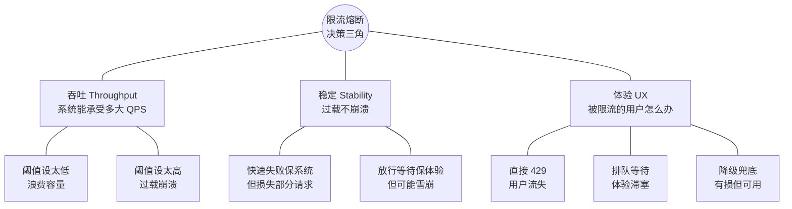
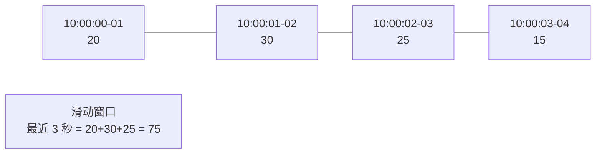
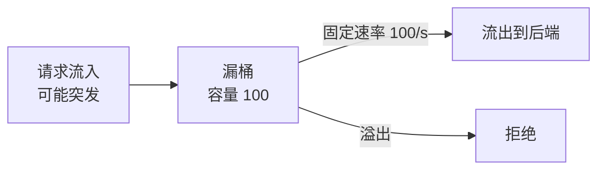
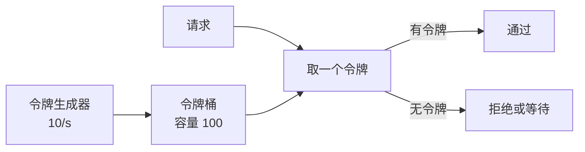
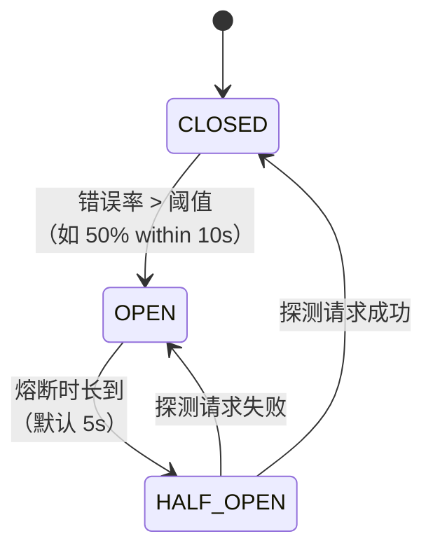
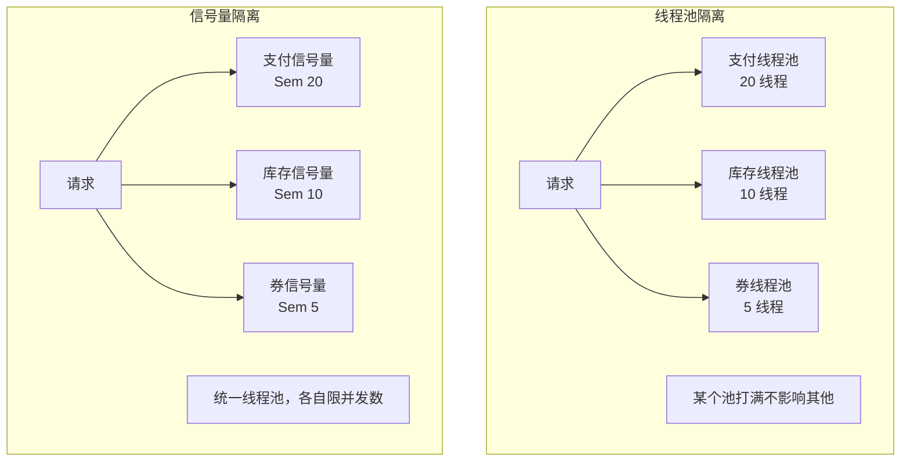
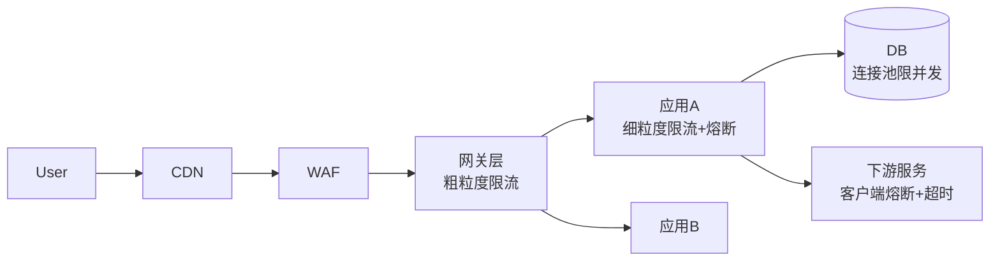
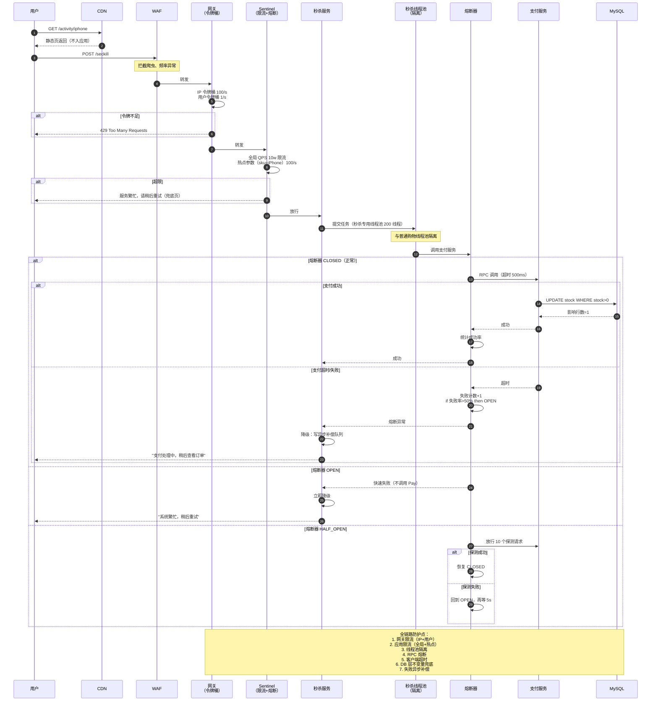

# 16.限流熔断方案设计

> **本篇定位**：限流、熔断、降级、隔离是分布式系统的四大稳定性基石。本文从一次"秒杀打崩支付、雪崩全站 30 分钟"的真实事故讲起，逐层拆解限流四大算法（计数器/滑动窗口/漏桶/令牌桶）的数学原理与陷阱、熔断三态机的复原逻辑、隔离的两种流派（线程池 vs 信号量）、自适应限流（BBR / TCP Vegas）背后的控制论思想，最终用 `一次秒杀请求的限流熔断一生` 时序图，把四大机制在一个请求上串成完整链路。


## 01.案例引入：秒杀打崩支付，30 分钟全站雪崩

### 1.1 事故复盘

某大型电商平台的年中大促，主会场投放"1 元抢 iPad"活动。10:00:00 活动开始，10:00:15 支付服务响应从 40ms 飙到 30s，10:00:45 网关连接池打满，10:03:00 **整个交易域全部不可用**——包括正常下单的用户。

- 秒杀 QPS 从预估 5w 飙到 **实际 45w**（9 倍溢出）
- 支付服务节点 CPU 100%，DB 连接池撑满 200 全部占用
- 上游订单服务同步等待支付返回，线程池 500 个线程 **全部卡在 IO Wait**
- 订单服务线程耗尽后，网关请求堆积到 10 万级
- 网关线程池打满，**所有非秒杀请求（充值、退款、正常购物）也开始 5xx**
- 事故持续 30 分钟，估算 GMV 损失 **1.2 亿元**

事后从代码里找出致命的 4 个缺失：

```java
// ❌ 支付服务：直接调 DB，没有任何限流
@PostMapping("/pay")
public Result pay(@RequestBody PayReq req) {
    // 没有 QPS 保护
    payService.deduct(req);
    orderService.updateStatus(req.orderId, PAID);
    // 没有熔断，DB 挂了这个请求就永远卡
    return Result.ok();
}

// ❌ 订单服务：调支付用了默认无限时 RestTemplate
@Autowired RestTemplate restTemplate;
public void createOrder(Order order) {
    // 没有超时，没有熔断
    Result r = restTemplate.postForObject("/pay", order, Result.class);
    // ...
}
```

四大致命缺失：

1. **没有限流** —— 45w QPS 打进来完全没有闸门
2. **没有熔断** —— 支付挂了订单还在傻等
3. **没有隔离** —— 秒杀流量和正常购物共用同一个线程池
4. **没有降级** —— 关不掉次要功能，核心链路也一起死

### 1.2 从事故中要问的 7 个问题

复盘会必须回答清楚的 7 个核心问题：

1. **限流阈值到底怎么定？**拍脑袋定 5w 结果实际来 45w，是压测不准还是流量预测方法论有问题？
2. **限流算法四大流派（计数器/滑动窗口/漏桶/令牌桶）有什么本质区别？**为什么滑动窗口能解决固定窗口的"临界突刺"问题？
3. **单机限流够不够？**集群部署 20 台，每台 5000 QPS 是不是 = 集群 10w QPS？
4. **熔断为什么必须有"半开态"？**打开后什么时候恢复？永久熔断和秒级抖动如何取舍？
5. **隔离用线程池还是信号量？**为什么 Hystrix 用线程池、Resilience4j 用信号量？
6. **降级怎么区分"能降"和"不能降"？**为什么"能降级的必须是次要业务"这句话本身就是废话？
7. **自适应限流（BBR / 拥塞控制）**是不是比人工设阈值更靠谱？谁在生产用了？

### 1.3 拨开表象：本质是"守住系统容量"

事故的表面是"没限流"，深层的问题是：**系统没有一个"当前容量还剩多少"的自我感知**。

任何稳定性方案，本质上都在做四件事：

1. **控入口**（限流）—— 别让超出容量的流量进来
2. **快速失败**（熔断）—— 下游挂了别等，快返回不占资源
3. **有损保命**（降级）—— 关次要保核心，别让局部故障拖垮整体
4. **物理隔离**（隔离）—— 一个业务的问题不能污染另一个

它们共同的目标只有一句话：

> **让"部分故障"不演变成"系统崩溃"**。


## 02.架构决策三角：吞吐 × 稳定 × 用户体验

任何限流熔断方案，都是在三个维度间联合最优化：



**三个维度的常见取舍**：

| 目标 | 极端做法 | 代价 |
|---|---|---|
| 吞吐拉满 | 不限流、不熔断 | 45w QPS 打崩系统（本文引子） |
| 稳定拉满 | 阈值设死很低 | 大促流量误杀 60%，损失 GMV |
| 体验拉满 | 全部排队等待 | 线程耗尽，雪崩更快到来 |

**没有银弹**：秒杀允许拒绝，只要给出"排队 10 万人前"的明确提示；支付不允许拒绝，只能通过异步化 + 降级承接；广告展示允许直接降级到本地缓存。**方案选型必须先明确业务能容忍什么样的失败**。


## 03.本质回归：为什么"没限流"必然雪崩

### 疑惑

系统 CPU 只有 40%，为什么请求延迟一下子从 40ms 升到 30s？"越忙越慢、越慢越挤"这种感觉背后有严格的数学解释吗？

### 论证：排队论证明雪崩必然发生

用 **M/M/1 排队模型**（泊松到达、指数服务、单服务台）建模一个服务：

- 到达率 = λ（每秒请求数）
- 服务率 = μ（每秒处理数）
- 利用率 ρ = λ / μ

平均排队等待时间：

```
W = 1 / (μ - λ) = 1 / (μ (1 - ρ))
```

关键观察：**当 ρ → 1，W → ∞**。

设服务处理能力 μ = 5w QPS，看不同流量下的延迟：

| 到达 λ | 利用率 ρ | 等待时间 W |
|---|---|---|
| 2.5w | 50% | 40 μs |
| 4w | 80% | 100 μs |
| 4.5w | 90% | 200 μs |
| 4.9w | 98% | 1 ms |
| 5w | 100% | **∞（雪崩）** |

**这就是雪崩的数学本质**：只要到达率超过服务率哪怕 1%，排队延迟就会趋于无穷。

**引子里的场景**：预估 5w、实际 45w，ρ = 9，队列瞬间爆炸——不是"CPU 打到 100%"才崩，而是队列长度指数级堆积，请求延迟从 40ms 变成 30s 甚至永远返回不了。**上游看到"下游变慢"，会重试；重试进一步放大到达率，形成正反馈——这就是"雪崩"**。

### 结论

**没有限流 = 允许队列无限增长**。系统必须在 **ρ 逼近 1 之前主动丢弃**，让队列长度维持在一个稳定的常数。

> **限流的第一原理**：**主动拒绝，比被动崩溃更有价值**。宁可让 10% 的用户看到"排队中"，也不能让 100% 的用户体验 30 秒的白屏。


## 04.限流算法四大流派：数学原理与选型

### 4.1 固定窗口计数器（Fixed Window Counter）

最简单：在窗口内计数，超过阈值就拒绝。

```java
if (counter.incrementAndGet() > threshold) {
    return reject();
}
// 窗口结束时归零
scheduledExecutor.scheduleAtFixedRate(counter::set, 0, 1, SECONDS);
```

**致命缺陷：临界突刺问题**

```
阈值 100/s：
[10:00:00.999] 前一秒最后 100ms 突然涌入 100 个 → 通过
[10:00:01.001] 新窗口开始，又允许 100 个 → 通过
实际 200ms 内通过了 200 个，是阈值的 2 倍！
```

**结论**：只适合精度要求极低的场景，不推荐生产使用。

### 4.2 滑动窗口计数器（Sliding Window Log / Counter）

把窗口切成 N 个小格子，每次统计"最近 N 个格子"的和。



**Redis + Lua 分布式实现**：

```lua
-- sliding_window.lua
local key = KEYS[1]
local now = tonumber(ARGV[1])
local window = tonumber(ARGV[2])  -- 窗口毫秒数
local limit = tonumber(ARGV[3])

redis.call('ZREMRANGEBYSCORE', key, 0, now - window)  -- 清理过期
local count = redis.call('ZCARD', key)
if count < limit then
    redis.call('ZADD', key, now, now .. '-' .. math.random())
    redis.call('EXPIRE', key, math.ceil(window/1000))
    return 1  -- 通过
else
    return 0  -- 拒绝
end
```

**特点**：精确无临界突刺，但每个请求都要写 Redis，QPS 上限约 5w-10w（视 Redis 集群规模）。

### 4.3 漏桶（Leaky Bucket）

请求进入固定容量的桶，以 **固定速率**流出——**强制匀速**。



**核心公式**：

- 桶容量 C，漏出速率 R
- 突发容忍量 = C
- 平均速率上限 = R

**代码实现**（Nginx `limit_req` 的思想）：

```java
class LeakyBucket {
    long capacity, rate;   // 桶大小、漏出速率
    long water = 0;
    long lastLeakTime = System.nanoTime();
    
    synchronized boolean tryAcquire() {
        long now = System.nanoTime();
        long leaked = (now - lastLeakTime) * rate / 1_000_000_000L;
        water = Math.max(0, water - leaked);
        lastLeakTime = now;
        if (water < capacity) {
            water++;
            return true;
        }
        return false;
    }
}
```

**特点**：绝对匀速，**不允许突发**。适合保护下游"处理能力恒定"的服务（如 DB 写入）。

### 4.4 令牌桶（Token Bucket）

桶里放令牌，**固定速率**产生令牌，请求要来一个才能通过——**允许突发**。



**核心特性**：桶初始装满 100 个令牌，可以在 1 秒内瞬间放行 100 个请求，之后稳定在 10/s。**先密后稀，允许合理突发**。

**Guava 单机实现**：

```java
RateLimiter limiter = RateLimiter.create(10);  // 10 QPS
if (limiter.tryAcquire(0, TimeUnit.MILLISECONDS)) {
    // 立即处理
} else {
    return reject();
}
```

### 4.5 四大算法对比

| 算法 | 突发处理 | 精度 | 分布式支持 | 实现复杂度 | 典型代表 |
|---|---|---|---|---|---|
| 固定窗口 | 差（临界突刺） | 低 | 需 Redis | ⭐ | 简单计数器 |
| 滑动窗口 | 好 | 高 | ✅ Redis+Lua | ⭐⭐⭐ | Sentinel（默认） |
| 漏桶 | 不允许 | 中 | 弱 | ⭐⭐ | Nginx `limit_req` |
| 令牌桶 | ✅ 允许 | 中 | 需 Redis+Lua | ⭐⭐ | Guava RateLimiter |

**结论选型**：

- **网关入口层**：令牌桶（允许合理突发），Nginx/APISIX/Kong 默认
- **DB / 慢下游前**：漏桶（强制匀速），保护后端
- **接口精细限流**：滑动窗口，Sentinel 默认策略
- **单机 + 简单场景**：Guava RateLimiter（本地令牌桶）


## 05.分布式限流：Redis + Lua 是唯一正解

### 疑惑

集群 20 台，每台设 5000 QPS 单机限流，是不是等价于集群 10w QPS？

### 论证：单机限流之和 ≠ 集群限流

假设想让集群总 QPS 不超过 10w，简单地在每台机器设 5000 QPS 单机限流：

```
理想：每台流量均匀，20 × 5000 = 10w ✅
现实：负载不均，热点接口打在 5 台机器上
      → 5 × 5000 = 2.5w 被拒绝
      → 其他 15 台空闲
      → 集群实际吞吐 2.5w << 目标 10w
```

**单机限流的两大问题**：

1. **无法应对负载不均**：热点分布决定了实际吞吐远小于理论值
2. **无法应对弹性扩缩容**：从 20 扩到 30 台，总阈值突然变成 15w，超出后端承受

### 正解：Redis + Lua 全局计数

```lua
-- token_bucket.lua
local key = KEYS[1]
local rate = tonumber(ARGV[1])       -- 每秒生成令牌数
local capacity = tonumber(ARGV[2])   -- 桶容量
local now = tonumber(ARGV[3])        -- 当前时间戳（ms）
local requested = tonumber(ARGV[4])  -- 要请求的令牌数

local bucket = redis.call('HMGET', key, 'tokens', 'ts')
local tokens = tonumber(bucket[1]) or capacity
local ts = tonumber(bucket[2]) or now

-- 补充令牌
local elapsed = math.max(0, now - ts)
local newTokens = math.min(capacity, tokens + elapsed * rate / 1000)

if newTokens >= requested then
    newTokens = newTokens - requested
    redis.call('HMSET', key, 'tokens', newTokens, 'ts', now)
    redis.call('EXPIRE', key, math.ceil(capacity / rate) + 1)
    return 1
else
    redis.call('HMSET', key, 'tokens', newTokens, 'ts', now)
    redis.call('EXPIRE', key, math.ceil(capacity / rate) + 1)
    return 0
end
```

**关键点**：

- **Lua 保证原子**：整个"取令牌 + 更新"一次完成
- **懒补充**：不用定时任务生成令牌，请求来了按时间差补充
- **Redis 集群兼容**：key 打散到不同槽，避免热点

### 5.3 分布式限流的性能瓶颈

Redis + Lua 的极限约 **10w-15w QPS 单集群**。超过这个量级：

1. **本地令牌桶 + Redis 全局限流二级**：本地放行 90%，10% 走 Redis 校准
2. **限流 key 分片**：`limit:api:pay:${userId % 16}`，16 个子桶并行
3. **异步归集**：本地统计 100ms 一批次同步 Redis

**结论**：分布式限流不追求"精确到个位数"，追求"整体不超过阈值"。**牺牲一点点精度换取吞吐**是常见工程折中。


## 06.熔断三态机：为什么必须有"半开"

### 疑惑

下游挂了直接拒绝所有请求不就好了？为什么要有"半开态"这么复杂？

### 论证：熔断的三种状态

熔断器本质是一个**三态机**：



三种状态的行为：

| 状态 | 请求行为 | 意义 |
|---|---|---|
| **CLOSED**（关闭） | 全部放行 | 正常状态 |
| **OPEN**（打开） | 全部拒绝、快速失败 | 保护下游、避免雪崩 |
| **HALF_OPEN**（半开） | 放行少量试探 | **判断下游是否恢复** |

**没有半开态会怎样？**

- 只有 CLOSED / OPEN 两态：一旦熔断，永远熔断
- 需要人工介入判断"下游是否恢复"—— 3 分钟内看不到监控运维就手动开关
- 更糟的做法："定时切回 CLOSED"——如果下游没恢复，突然放行全部流量再次打崩

**半开态的价值**：

- **少量试探**（默认放行 10 个请求）观察成功率
- 成功 → 恢复 CLOSED；失败 → 回到 OPEN
- **自动化恢复**，不依赖人工
- 试探请求量小，即使失败也不会造成雪崩

### 6.2 熔断触发条件

主流实现（Sentinel / Resilience4j）都支持三种触发规则：

| 规则 | 触发条件 | 适用 |
|---|---|---|
| **错误率** | 最近 N 个请求中错误率 > 阈值（如 50%） | 服务功能故障 |
| **慢调用比例** | RT > 阈值的请求占比 > X% | 下游变慢但没报错 |
| **异常数量** | 单位时间异常数量 > 阈值 | 稀疏请求场景 |

**慢调用比例**是最重要的：**下游没挂但变慢（GC、依赖抖动）时，不熔断反而会拖垮自己**。

### 6.3 Resilience4j 完整用法

```java
CircuitBreakerConfig config = CircuitBreakerConfig.custom()
    .failureRateThreshold(50)                          // 错误率 50% 熔断
    .slowCallRateThreshold(60)                         // 60% 慢调用熔断
    .slowCallDurationThreshold(Duration.ofSeconds(2))  // > 2s 视为慢
    .minimumNumberOfCalls(20)                          // 至少 20 个样本才判断
    .slidingWindowType(SlidingWindowType.COUNT_BASED)
    .slidingWindowSize(100)                            // 统计最近 100 个
    .waitDurationInOpenState(Duration.ofSeconds(5))    // OPEN 持续 5s
    .permittedNumberOfCallsInHalfOpenState(10)         // 半开放 10 个探测
    .build();

CircuitBreaker cb = CircuitBreaker.of("payService", config);

Supplier<Result> supplier = CircuitBreaker.decorateSupplier(cb, 
    () -> paymentClient.pay(req));

Result r = Try.ofSupplier(supplier)
    .recover(t -> fallbackResult())   // 降级
    .get();
```


## 07.隔离与降级：最后的护城河

### 7.1 线程池隔离 vs 信号量隔离

**两种隔离模型的本质区别**：

| 维度 | 线程池隔离（Hystrix 默认） | 信号量隔离（Resilience4j 默认） |
|---|---|---|
| 隔离粒度 | 每个下游独立线程池 | 每个下游独立信号量计数器 |
| 上下文切换 | 有（跨线程） | 无（同一线程） |
| 超时控制 | ✅ 支持（Future.get(timeout)） | ❌ 依赖调用方超时 |
| 内存开销 | 高（每线程池数百 MB） | 低（几个计数器） |
| CPU 开销 | 中（上下文切换） | 极低 |
| 阻塞感知 | ✅ 线程被卡时可以主动打断 | ❌ 只能等信号量释放 |
| ThreadLocal | ❌ 丢失（跨线程） | ✅ 保留 |



**选型**：

- **网络 IO 场景**（RPC/HTTP 下游）：线程池隔离更安全，能主动打断
- **本地计算 / 快速调用**：信号量隔离更轻量
- **需要 ThreadLocal / MDC 日志**：只能信号量
- **现代趋势**：Reactive/协程时代，信号量隔离逐渐成为主流（Resilience4j 就是这个方向）

### 7.2 降级的分级策略

**核心原则**：**"能不能降级" ≠ "要不要降级"，关键是"降级到什么程度"**。

降级策略分四级：

| 等级 | 策略 | 举例 |
|---|---|---|
| L0 完全降级 | 直接返回默认值 | 广告位显示兜底图 |
| L1 缓存降级 | 用陈旧数据代替 | 商品详情用 5 分钟前的缓存 |
| L2 功能降级 | 关闭次要功能 | 关掉"猜你喜欢"、"评价" |
| L3 有损降级 | 主链路降体验 | 只允许 VIP 用户下单 |

**引子里的正确做法**（事后复盘）：

```yaml
# 降级规则示例（Sentinel）
- resource: pay-service
  strategy: RT
  count: 500       # RT > 500ms 触发
  timeWindow: 10   # 熔断 10s
  fallback: 
    action: RETURN_MOCK
    mockValue: '{"status": "PROCESSING", "message": "支付处理中，请稍候"}'
    # 让用户看到"处理中"而不是白屏，异步补偿完成

- resource: recommendation
  strategy: ERROR_RATIO
  count: 0.5
  fallback:
    action: RETURN_EMPTY  # 推荐直接不展示
```

**降级的"艺术"**：让用户 **感知不到** 或 **能理解** 是关键。


## 08.反例与演进：从裸奔到自适应

### 8.1 事故与反例集合

| 反例 | 表现 | 后果 |
|---|---|---|
| 完全不限流 | 45w QPS 打进来 | 全站雪崩（本文引子） |
| 阈值拍脑袋定 | 大促 5w，实际 45w | 阈值毫无意义 |
| 单机限流做集群限流 | 热点集中到 5 台 | 实际吞吐 2.5w << 目标 10w |
| 熔断没有半开态 | 一旦熔断永久熔断 | 下游恢复后仍无法访问 |
| 熔断只看错误率 | 下游变慢没变错 | 主动拖垮自己 |
| 降级不分级 | "一律关掉次要" | 用户体验灾难 |
| 隔离用同一个线程池 | 秒杀和普通购物混池 | 秒杀打崩导致购物也失败 |
| 客户端无超时 | RestTemplate 默认无限 | 线程全部卡死 |

### 8.2 演进路径 V0 → V4


### 8.3 V4 自适应限流：不设阈值也能限

**问题**：阈值人工设定，永远滞后于系统真实状态（新代码上线、机器扩缩容、依赖抖动）。

**思路借鉴 TCP 拥塞控制**：BBR / Vegas 通过持续监测 **RTT + 吞吐** 来判断"是否达到瓶颈"。

**系统自适应限流的核心指标**：

- **CPU 利用率**（超过 80% 开始限流）
- **系统 Load**（超过 CPU 核数 × 1.5 开始限流）
- **请求平均 RT**（相对基线上涨 3 倍开始限流）

**Sentinel 自适应限流规则示例**：

```java
// 系统级别限流：不是限单个接口，而是限"当整机压力大时"
SystemRule rule = new SystemRule();
rule.setHighestSystemLoad(3.0);    // Load > 3 触发
rule.setHighestCpuUsage(0.8);      // CPU > 80% 触发
rule.setAvgRt(500);                // 平均 RT > 500ms 触发
rule.setMaxThread(200);            // 并发线程 > 200 触发
SystemRuleManager.loadRules(Collections.singletonList(rule));
```

**Netflix concurrency-limits**（Adaptive）基于 **Little's Law 与 Vegas 算法**动态调整并发上限——比人工设阈值精准得多。

**结论**：**未来 3-5 年的方向是"自动化的稳定性"**——阈值由系统自我度量，不再依赖人工经验。


## 09.SDK 与配置化：Sentinel 的最佳实践

### 9.1 Sentinel 生产级流控规则

```java
// 应用启动时注册
List<FlowRule> rules = new ArrayList<>();

// 规则 1：支付接口全局限流 1w QPS
FlowRule payRule = new FlowRule("PaymentService:pay");
payRule.setGrade(RuleConstant.FLOW_GRADE_QPS);
payRule.setCount(10000);
payRule.setControlBehavior(RuleConstant.CONTROL_BEHAVIOR_WARM_UP);  // 冷启动预热
payRule.setWarmUpPeriodSec(10);   // 10s 内从 1000 缓升到 1w
rules.add(payRule);

// 规则 2：秒杀接口按用户维度限流
FlowRule seckillRule = new FlowRule("SeckillService:submit");
seckillRule.setCount(1);
seckillRule.setLimitApp("default");
seckillRule.setStrategy(RuleConstant.STRATEGY_RELATE);
seckillRule.setRefResource("userId");  // 按 userId 限流：每秒每人最多 1 次
rules.add(seckillRule);

// 规则 3：慢调用熔断
DegradeRule degrade = new DegradeRule("PaymentService:pay");
degrade.setGrade(RuleConstant.DEGRADE_GRADE_RT);
degrade.setCount(500);       // RT > 500ms
degrade.setTimeWindow(10);   // 熔断 10s
DegradeRuleManager.loadRules(Collections.singletonList(degrade));

FlowRuleManager.loadRules(rules);
```

### 9.2 Sentinel 三大高级特性

1. **热点参数限流**：同一接口的不同参数分别限流

```java
// 商品秒杀：热门商品每秒 100 单，冷门商品每秒 1 单
ParamFlowRule paramRule = new ParamFlowRule("submitOrder")
    .setParamIdx(0)  // 参数 0 = skuId
    .setCount(1);   // 默认限制
paramRule.setParamFlowItemList(Arrays.asList(
    new ParamFlowItem("iPhone15", 100, int.class.getName())
));
```

2. **集群流控**：把限流决策放到 token server 集群，实现精确全局限流
3. **规则动态推送**：与 Nacos/Apollo 集成，配置变更实时生效，无需重启

### 9.3 网关层 vs 应用层的分工



**分层原则**：

- **CDN**：静态资源限流（图片、JS）
- **WAF**：恶意流量（爬虫、CC 攻击）
- **网关**：全局 QPS、IP 级、租户级
- **应用**：接口级、用户级、参数级、熔断降级
- **DB / 中间件**：连接池限并发（不是限 QPS）


## 10.综合案例串讲：一次秒杀请求的限流熔断一生

### 10.1 回扣开篇 7 问

| 疑问 | 答案 |
|---|---|
| Q1 阈值怎么定？ | 压测得容量基线 + 大促预留 30% Buffer + 自适应限流（§4/§8.3） |
| Q2 四大算法本质区别？ | 计数器有临界突刺、滑动窗口精确、漏桶匀速、令牌桶允许突发（§4） |
| Q3 单机 vs 分布式限流？ | 单机 20×5000 ≠ 集群 10w；负载不均时必须用 Redis+Lua（§5） |
| Q4 熔断为何要半开？ | 自动化探测恢复，避免永久熔断或直接放开全部流量（§6） |
| Q5 线程池 vs 信号量？ | IO 用线程池能打断，本地用信号量更轻量（§7.1） |
| Q6 降级怎么分级？ | L0 默认值 / L1 缓存 / L2 关次要 / L3 有损主链（§7.2） |
| Q7 自适应限流靠谱吗？ | 阈值滞后的痛点，未来方向；Sentinel 系统规则、Netflix concurrency-limits（§8.3） |

### 10.2 一次秒杀请求的完整时序图

场景：iPhone 秒杀，全链路防护。



**7 个关键防护点**：

1. **CDN 挡住 70% 静态流量**：真正打到应用的只有真实秒杀请求
2. **WAF 挡住 10% 恶意流量**：爬虫、脚本、CC 攻击
3. **网关双层限流**：IP 令牌桶防单 IP 打死、用户令牌桶防单人刷
4. **应用层细粒度**：全局 QPS + 热点参数 + 用户维度
5. **线程池隔离**：秒杀专用线程池，即使打满也不影响普通购物
6. **熔断三态**：支付挂了不拖累订单，自动恢复不需要人工
7. **DB 兜底**：`UPDATE WHERE stock > 0` 即便前面全失效也不超卖

### 10.3 四条设计哲学

> **哲学一：宁可拒绝，不可雪崩**

**主动丢弃比被动崩溃更有价值**。10% 用户看到"排队中"远好于 100% 用户看到 30 秒白屏。拒绝是最后的保命符。

> **哲学二：快速失败胜过慢慢等死**

熔断 / 超时 / 隔离的共同目标是让 **"失败" ≠ "占资源"**。慢调用比错误调用更可怕——**下游变慢时你还在傻等，就会被拖死**。

> **哲学三：容量必须是"可度量的"**

阈值不能拍脑袋——**压测得容量基线 → 大促加 30% Buffer → 生产自适应校准**。三步缺一不可。**没有度量的限流等于没有限流**。

> **哲学四：稳定性是"分层的"，不是"一层的"**

从 CDN → WAF → 网关 → 应用 → 服务 → DB，**每一层都要有防线**。指望"一层拦住全部"会让那一层成为唯一的雪崩点。**深度防御是稳定性的最高境界**。

### 10.4 方案选型速查表

| 场景 | 限流 | 熔断 | 隔离 | 降级 |
|---|---|---|---|---|
| 秒杀活动 | 网关令牌桶 + 热点参数 | Resilience4j + 慢调用触发 | 独立线程池 | 排队页 |
| 支付核心 | 应用滑动窗口 | RT 500ms 熔断 | 独立线程池 | 异步补偿 |
| 商品详情 | CDN + 应用限流 | 弱熔断 | 信号量 | 缓存兜底 |
| 推荐 / 广告 | 弱限流 | 强熔断 | 信号量 | 空返回 |
| 后台管理 | IP 限流 | 弱熔断 | 独立部署 | 500 页 |
| Open API | 租户令牌桶 | 每租户熔断 | 租户线程池 | 429+Retry-After |

### 10.5 上线 Checklist（20 项）

**限流**

- [ ] 阈值来自压测（不是拍脑袋）
- [ ] 阈值预留 30% Buffer 应对突发
- [ ] 分布式场景用 Redis + Lua，避免"单机限流之和"陷阱
- [ ] 关键接口开启热点参数限流
- [ ] 冷启动接口开启预热（Warm Up）

**熔断**

- [ ] 同时配置错误率 + 慢调用规则
- [ ] 半开态放行数量合理（默认 10 个）
- [ ] 熔断时长与业务恢复期匹配（通常 5-30s）
- [ ] 至少 20 个样本才触发判断（避免误判）

**隔离**

- [ ] 秒杀 / 支付 / 查询等业务用独立线程池
- [ ] 线程池大小 = 目标 QPS × 平均 RT（Little's Law）
- [ ] 拒绝策略明确（AbortPolicy / CallerRunsPolicy）
- [ ] 每个下游 RPC 有独立超时

**降级**

- [ ] 每个接口有明确降级预案
- [ ] 降级返回值不为 null（避免 NPE 传播）
- [ ] 降级开关可配置化（动态启停）
- [ ] 降级有监控（触发次数、恢复次数）

**监控**

- [ ] 限流拒绝率、熔断次数纳入告警
- [ ] 慢调用比例 > 5% 触发预警
- [ ] 大促前做全链路故障演练
- [ ] 有一键降级 / 一键恢复的 SOP

---

> **结语**：限流、熔断、降级、隔离不是四个孤立技术，而是"深度防御"哲学的四个方向。开篇 1.2 亿的雪崩损失，不是任何一个"技术选型不对"造成的，而是 **完全没有稳定性的分层防御**。**读懂本文之后，请永远记住：稳定性不是"防止故障"，而是"故障发生时保住核心"**。
