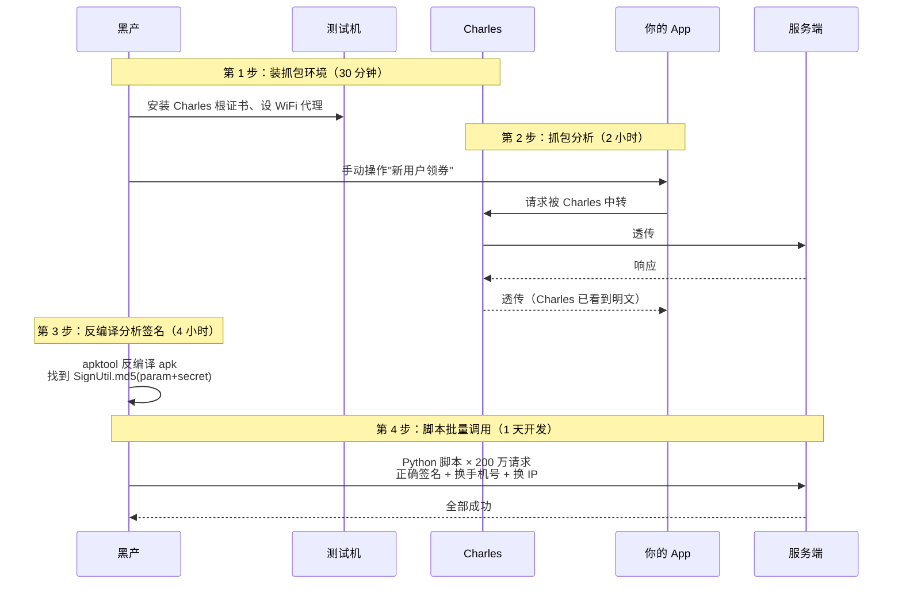
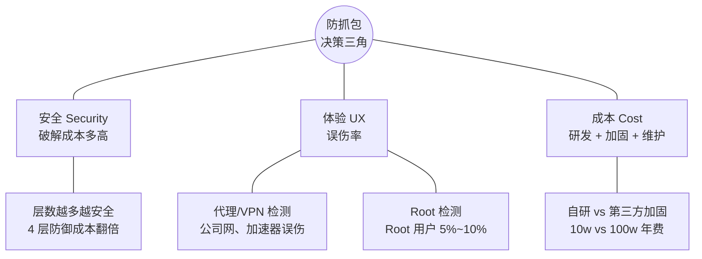
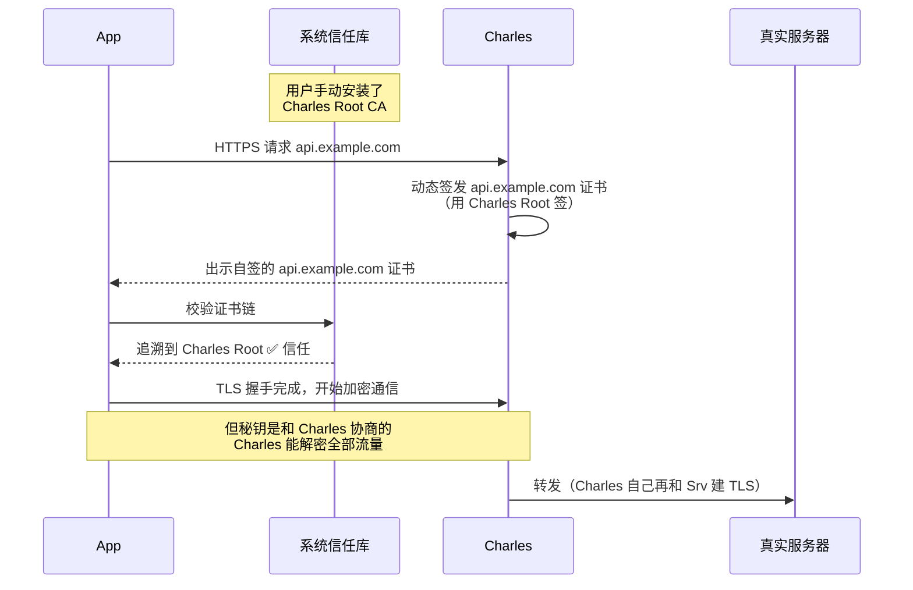
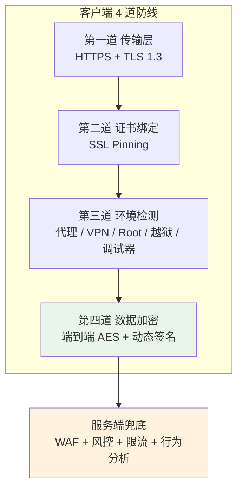
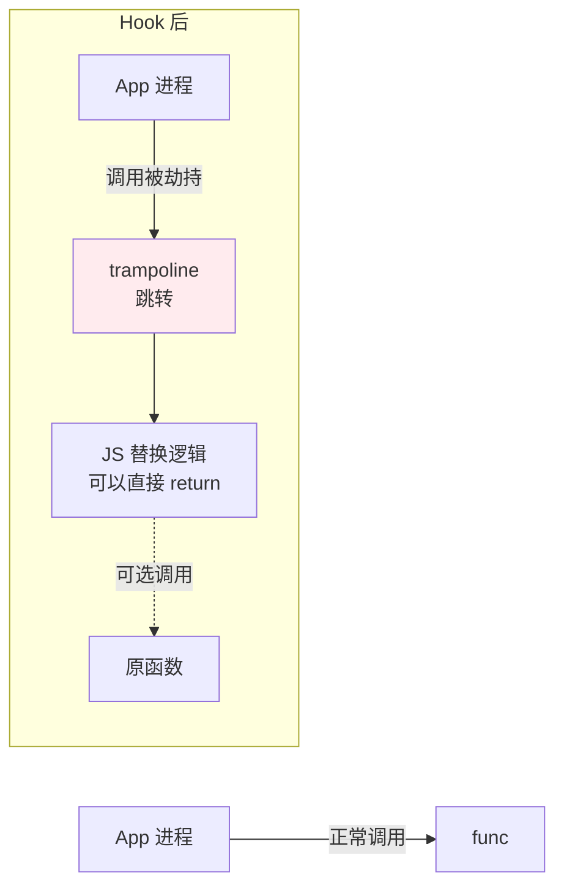
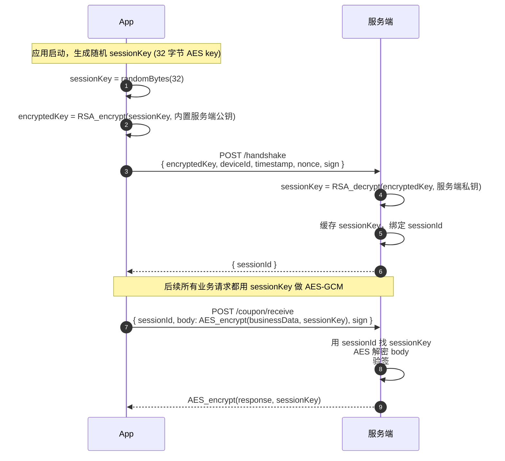
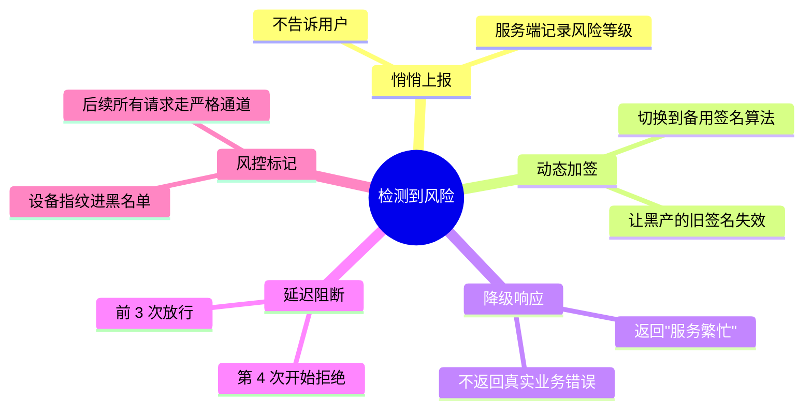
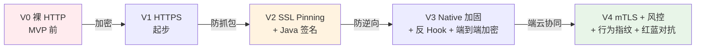
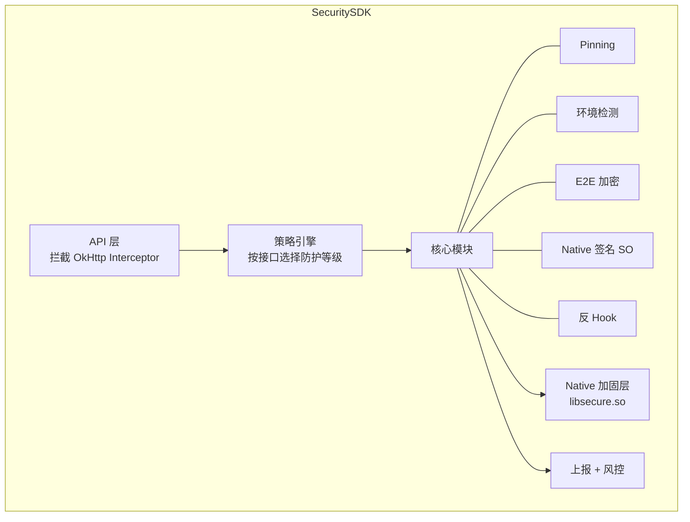
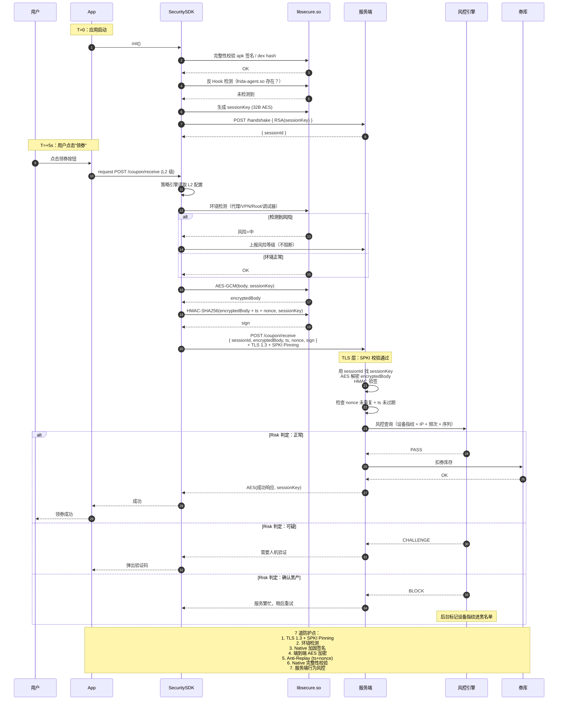

# 17.移动端防抓包实践

> **本篇定位**：抓包是移动 App 安全的"第一关"——一旦接口被抓、签名被逆向，黑产就能绕过 App 直接调服务、批量刷券、批量注册、批量爬数据。本文从一次"优惠券接口被刷 200 万次、损失 2000 万券池"的真实攻防讲起，逐层拆解 HTTPS 为何"防中间人不防主动抓包"、SSL Pinning 与 mTLS 的密码学原理、Frida / Xposed 动态 Hook 如何绕过 Pinning、代码加固 / 反调试 / 反 Hook 的对抗手法、端到端业务加密的完整握手协议，最后用 `一次业务请求的防抓包全链路一生` 时序图串起全部机制。


## 01.案例引入：优惠券接口被刷 200 万次

### 1.1 事故复盘

某电商 App 周五凌晨 03:12 触发风控告警：**"新用户领 50 元优惠券"接口被请求了 200 万次**，平时该接口日请求量只有 5 万次——3 小时内被打到 **40 倍**。

- 优惠券池预算 2000 万元，**3 小时被薅光**
- 200 万个自动注册的僵尸账号（用接码平台的手机号）成功领券
- 券被批量转卖到某黄牛平台，五折甩卖后套现 **950 万元**
- 正常新用户当天领不到券，客服接到 3.5 万个投诉电话
- 事故公开后股价盘中跌 4.7%，业务负责人被 CTO 约谈

事后追查黑产的攻击流程只用了 4 步：



从代码里找出的 4 个致命缺失：

```kotlin
// ❌ OkHttp 只启用了 HTTPS，没有 Pinning
val client = OkHttpClient.Builder().build()

// ❌ 签名算法完全放在 Java 层
object SignUtil {
    fun sign(params: Map<String, String>): String {
        val sorted = params.toSortedMap().map { "${it.key}=${it.value}" }.joinToString("&")
        return md5(sorted + "secret_key_12345")   // secret 硬编码明文
    }
}

// ❌ 没有代理检测
// ❌ 没有服务端行为风控 —— 200 万次请求毫无预警
```

四大缺失：

1. **只有 HTTPS，没有 SSL Pinning** —— 黑产装 Charles 证书就能解密
2. **签名算法在 Java 层，秘钥硬编码明文** —— 反编译即可拿到
3. **没有代理 / VPN 检测** —— 抓包环境毫无阻碍
4. **服务端没有行为风控** —— 单 IP 每秒 100 次请求都没触发

### 1.2 从事故中要问的 7 个问题

复盘会必须回答清楚的 7 个核心问题，也是本文接下来要逐层攻破的：

1. **HTTPS 明明加密了流量，为什么 Charles 能看到明文？**用户装了根证书系统会信任任何自签证书吗？
2. **SSL Pinning 到底 Pin 什么？**Certificate Pinning、Public Key Pinning、SPKI Pinning 有什么区别？
3. **有了 SSL Pinning 就绝对安全了吗？**Frida / Xposed 是怎么绕过 Pinning 的？
4. **签名算法为什么必须放到 Native 层？**放 Java 层会被怎么破解？加固能加多久？
5. **端到端业务加密**（AES + RSA / DH 握手）和 HTTPS 层的加密是重复劳动吗？
6. **越狱 / Root / 模拟器检测**误伤率那么高，到底值不值得做？
7. **客户端防御是否可能"绝对安全"？**为什么最终必须靠服务端行为风控兜底？

### 1.3 拨开表象：本质是"攻击成本 vs 收益"的博弈

事故的表面是"HTTPS 被抓包"，深层的问题是：**移动端安全不是"绝对防御"，而是经济学**。

任何客户端方案，本质上都在做一件事：**让攻击成本 > 攻击收益**。

- 破解一次 App 需要多少时间？（1 小时？1 周？1 个月？）
- 破解一次能薅多少钱？（1000 元？100 万？）
- 只要 **破解时间 × 人力成本 > 单次收益**，黑产就会放弃

引子里的场景：破解只花了 1 天半（30 分钟 + 2 小时 + 4 小时 + 1 天），却薅走了 950 万——**投入产出比 = 950 万 / 1.5 天 = 63 万/天**。这样的收益率会吸引所有黑产。

任何防护方案，共同目标只有一句话：

> **把黑产破解时间从"小时级"抬到"月级"**——让活动的红利窗口结束前，黑产还破解不完。


## 02.架构决策三角：安全 × 体验 × 成本

任何防抓包方案，都是三个维度的联合最优化：



**三个维度的常见取舍**：

| 目标 | 极端做法 | 代价 |
|---|---|---|
| 安全拉满 | mTLS + SO 加固 + 反 Hook + 风控 | 首包耗时 +50%、包体积 +5MB、投诉率 +20% |
| 体验拉满 | 只 HTTPS，不做任何检测 | 引子里的 950 万损失 |
| 成本拉满 | 只用第三方加固，不自研 | 加固服务被普遍研究，通用绕过工具多 |

**分级防护是最佳策略**：不同接口不同强度。

| 业务价值 | 推荐防护级别 |
|---|---|
| 商品浏览、内容展示 | HTTPS + 基础签名 |
| 用户登录、支付、领券 | HTTPS + Pinning + Native 签名 + 服务端风控 |
| 金融开户、大额交易 | 全部 + mTLS + 反调试 + 端云协同 |

**没有银弹**：把所有接口都拉到"金融级"会让 App 首包耗时翻倍、包体积翻倍、误伤率飙升。**分级防护，抓大放小**才是工程解。


## 03.本质回归：HTTPS 为什么防不住 Charles

### 疑惑

HTTPS 明明有 TLS 加密，为什么用户装个 Charles 就能看到接口明文？这个证书链到底信任谁？

### 论证：HTTPS 的信任模型 vs 抓包的中间人本质

**HTTPS 的信任链**：

```
App / 浏览器
   ↓ 校验
服务端证书（由 CA 签名）
   ↓ 上溯
中间 CA 证书（由根 CA 签名）
   ↓ 上溯
根 CA 证书（预置在系统信任库）
```

只要证书链能追溯到 **系统信任库里的根 CA**，App 就认为服务端合法。

**抓包工具的本质**：一个"中间人代理"，从 App 拦截流量，转发到真实服务。它需要向 App 出示一个"看起来像 api.example.com"的证书——但显然没有 CA 会给攻击者签发。所以 Charles / mitmproxy 的做法是：

1. 生成自己的**根 CA 证书**（Charles Root Certificate）
2. **诱导用户手动把它装进系统信任库**
3. 用这个根 CA **动态签发**任意域名的证书
4. App 校验证书链能追溯到系统信任库中的 Charles Root → **通过校验**



**关键洞察**：HTTPS 防的是**没有合法证书的被动中间人**（如 WiFi 钓鱼、运营商劫持），**不防"用户主动信任了一个恶意根 CA"**。

### 结论

HTTPS 只是"传输层加密"，它的安全性建立在 **系统信任库可信** 的假设之上。一旦用户（或黑产）自愿破坏这个假设：

> **HTTPS 的加密就形同虚设**。

这就是为什么"只用 HTTPS"是防抓包的第一大误区——它保护不了"你的用户想抓自己的包"这种场景。


## 04.主流方案谱系：四道防线与横向对比

### 4.1 防抓包四道防线



**每一道的定位和破法**：

| 防线 | 阻挡什么 | 破解手段 | 抬升攻击成本 |
|---|---|---|---|
| L1 HTTPS | 公网被动中间人 | 装抓包证书 | 分钟级 |
| L2 SSL Pinning | 抓包证书 | Frida Hook Pinning 校验函数 | 小时级 |
| L3 环境检测 | 简单抓包 | Root + Magisk Hide + 反检测模块 | 天级 |
| L4 端到端加密 | 抓到看不懂 | 逆向签名/加密算法 → Native 加固 | 周级 |
| Srv 行为风控 | 已破解客户端 | 需要模拟正常用户行为 → 极慢 | 月级 |

**核心思想**：**每一层都可能被破，但破解成本层层叠加**。攻击者需要在几个小时内破解 4-5 层，才有能力薅到本次活动的红利。

### 4.2 横向能力对比

| 方案 | 防御强度 | 实现难度 | 误伤率 | 性能影响 | 维护成本 |
|---|---|---|---|---|---|
| HTTPS + HSTS | ⭐ | ⭐ | 0% | 极低 | 低 |
| SSL Pinning | ⭐⭐⭐ | ⭐⭐ | 低 | 极低 | 中（证书更换） |
| 代理检测 | ⭐⭐ | ⭐⭐ | 中（公司网） | 极低 | 低 |
| VPN 检测 | ⭐⭐ | ⭐⭐ | 高（加速器） | 极低 | 低 |
| Root/越狱检测 | ⭐⭐ | ⭐⭐⭐ | 中（5%~10%） | 低 | 中 |
| 端到端加密 | ⭐⭐⭐⭐ | ⭐⭐⭐⭐ | 0% | 中（+2ms） | 中 |
| Native 加固（SO） | ⭐⭐⭐⭐ | ⭐⭐⭐⭐⭐ | 0% | 中 | 高 |
| 反调试 / 反 Hook | ⭐⭐⭐⭐ | ⭐⭐⭐⭐⭐ | 低 | 低 | 高 |
| mTLS 双向证书 | ⭐⭐⭐⭐⭐ | ⭐⭐⭐⭐ | 极低 | 中 | 高 |
| 服务端行为风控 | ⭐⭐⭐⭐⭐ | ⭐⭐⭐⭐ | 低 | 0（客户端） | 中 |


## 05.SSL Pinning 深度解析

### 5.1 三种 Pinning 方式

**Certificate Pinning（证书绑定）**

绑定完整的服务端证书。证书更换必须发新版本 App。

```kotlin
val certs = listOf(
    context.resources.openRawResource(R.raw.api_cert).readBytes()
)
val pinner = CustomTrustManager(certs)
```

**Public Key Pinning（公钥绑定）**

绑定服务端证书的**公钥**（RSA/ECDSA 的 public key）。证书更换只要公钥不变（新证书还是同一对密钥签发），App 无感知。

**SPKI Pinning（Subject Public Key Info 绑定）**

绑定 SPKI 的 SHA-256 哈希。这是 OkHttp `CertificatePinner` 的默认实现，也是当前的最佳实践。

```kotlin
val certificatePinner = CertificatePinner.Builder()
    .add("api.example.com", "sha256/AAAAAAAAAAAAAAAAAAAAAAAAAAAAAAAAAAAAAAAAAAA=")  // 主证书 SPKI
    .add("api.example.com", "sha256/BBBBBBBBBBBBBBBBBBBBBBBBBBBBBBBBBBBBBBBBBBB=")  // 备用（防主证书过期）
    .build()

val client = OkHttpClient.Builder()
    .certificatePinner(certificatePinner)
    .build()
```

**三种对比**：

| 方式 | 更换证书 | 兼容性 | 灵活度 | 推荐 |
|---|---|---|---|---|
| Certificate Pinning | 需发版 | ✅ | 差 | ❌ |
| Public Key Pinning | 无感（同 key） | ⚠️ | 中 | 中 |
| SPKI Pinning | 无感 + 灵活 | ✅ | ✅ | ✅ |

### 5.2 Pinning 上线的两个"命门"

**命门一：必须有备用证书**

主证书过期或被吊销时，如果只 Pin 了一个，App 会**完全无法访问**——比抓包还严重的事故。必须至少 Pin 两个：**当前用的 + 备用的**。

**命门二：本地校验必须防被 Hook**

Pinning 的校验代码在 Java 层，攻击者用 Frida 一行代码就能绕过：

```javascript
// SSL Pinning 绕过（Frida）
Java.perform(function() {
    var CertificatePinner = Java.use("okhttp3.CertificatePinner");
    CertificatePinner.check.overload('java.lang.String', 'java.util.List').implementation = function(hostname, peerCertificates) {
        console.log("[+] Pinning check bypassed for " + hostname);
        return;  // 直接返回，不校验
    };
});
```

**对抗方案**：

1. **Pinning 校验放到 Native SO 里**（下文详述）
2. **对 Pinning 检查失败做特殊上报**（不立即拒绝，让黑产以为自己没被发现）
3. **动态下发 Pin 列表**（服务端下发，本地不硬编码）


## 06.Frida / Xposed 与反 Hook 攻防

### 疑惑

黑产的 Frida 到底怎么工作？为什么加固厂商都说"反 Hook 反调试是最重要的一环"？

### 论证：动态 Hook 的原理

**Frida** 是一个 **动态二进制插桩（DBI）框架**，能在进程运行时注入 JavaScript，动态修改任何函数的实现——**不需要修改 apk，不需要重启进程**。

Frida 的核心机制（Android）：

1. **ptrace 附加目标进程**（或 Zygote 注入）
2. **在目标进程的地址空间加载 frida-agent SO**
3. **拦截目标函数**：修改函数首部的机器码为 `JMP <trampoline>`
4. **在 trampoline 里执行 JS 定义的替换逻辑**



**Xposed 类似但更"稳定"**：直接修改 Zygote，让所有子进程都被 Hook 框架接管——需要 Root。

### 反 Hook 的四类手段

**手段一：完整性校验（Integrity Check）**

- 校验关键函数首部机器码没被改（未被 Hook）
- 校验 apk 签名没被修改
- 校验 dex 文件 hash

```c
// 检测函数首部是否被 Hook（Native 层）
int check_func_integrity(void* func_addr) {
    unsigned char* code = (unsigned char*)func_addr;
    // 如果前几字节是 JMP 指令（0xE9 或 0xB0/0xF9 等 trampoline 特征）
    if (code[0] == 0xE9 || (code[0] & 0xF0) == 0xB0) {
        // 检测到 inline hook
        return 1;
    }
    return 0;
}
```

**手段二：环境检测**

- 检测 Frida 特征（frida-server 端口 27042、`/proc/self/maps` 里的 frida-agent.so）
- 检测 Xposed（`de.robv.android.xposed` 类是否存在）
- 检测 ptrace（自己 ptrace 自己一次，如果失败说明被别人 ptrace 了）

```c
// 检测调试器附加
int check_debugger() {
    if (ptrace(PTRACE_TRACEME, 0, 0, 0) == -1) {
        return 1;  // 已经被别人 ptrace（调试器）
    }
    return 0;
}
```

**手段三：反调试**

- **TracerPid 检查**：`/proc/self/status` 里的 `TracerPid` 非 0 说明被调试
- **虚假流程**：故意插入无用代码让静态分析困惑
- **控制流平坦化（OLLVM）**：让代码变成一个大 switch，无法追踪

**手段四：多点校验**

不要在一个地方校验，而是在业务流程的 10 多个点分别校验——攻击者需要 Hook 掉全部才能通关。

### 结论

反 Hook 反调试没有"绝对方案"——它是一场消耗战：

> **多设几个陷阱 + 让攻击者的每一步都费劲**——攻击者的耐心是有限的。


## 07.端到端加密：让"抓到"也"看不懂"

### 疑惑

HTTPS 已经加密了，为什么还要业务层再加一次密？这是不是重复劳动？

### 论证：HTTPS 只保护"传输过程"

HTTPS 加密的是"客户端到服务端的传输通道"，一旦 Charles 通过 Pinning 绕过后端拿到明文，接口的 Body / Header / Query 全部暴露。

**端到端业务加密的思路**：**HTTPS 之上再套一层业务加密，让抓包工具看到密文也无从下手**。

### 完整握手协议



**核心要素**：

| 要素 | 作用 |
|---|---|
| sessionKey | 每次 App 启动重新生成，短生命周期 |
| RSA 公钥内置 App | 保证握手包只有真服务端能解 |
| AES-GCM | 认证加密，同时保证机密性和完整性 |
| timestamp + nonce | 防重放攻击 |
| sign | HMAC-SHA256(body + timestamp + sessionKey) |

**抓到的样子**：

```json
{
    "sessionId": "abc123def456",
    "body": "AES加密后的密文......",
    "timestamp": 1719734400,
    "nonce": "a1b2c3d4e5f6",
    "sign": "HMAC签名"
}
```

黑产即使抓到，也 **无法知道 body 里是"领券"还是"下单"**、无法伪造请求（不知道 sessionKey）、无法重放（timestamp 会过期）。

### 7.3 关键实现细节

**1. RSA 公钥必须放 Native SO**：如果放 Java 层，攻击者可以替换成自己的公钥做中间人。

**2. sessionKey 严禁落盘**：只存在内存里，进程重启就丢失。

**3. Anti-Replay 三件套**：

- `timestamp`：偏差 > 5 分钟直接拒绝
- `nonce`：服务端 Redis 缓存 5 分钟，重复 nonce 拒绝
- `sign`：HMAC 让任何字段改动都失效

**4. sign 算法必须放 Native**：Java 层的签名算法反编译分分钟破解，Native 层的 SO 加固后逆向成本 10-100 倍。


## 08.反例与演进：从裸奔到端云协同

### 8.1 反例集合

| 反例 | 现象 | 后果 |
|---|---|---|
| 只用 HTTPS | 装 Charles 即可抓包 | 200 万次刷券（本文引子） |
| 签名秘钥硬编码 Java 层 | apktool 反编译即可看到 | 签名规则被逆向 |
| Pinning 只 Pin 一个证书 | 主证书过期 App 全部无法访问 | 比抓包更严重的事故 |
| Root 检测过严 | 5%~10% Root 用户全被拒 | 大量投诉 |
| VPN 检测粗暴 | 加速器用户全被拒 | 海外用户流失 |
| 检测到风险就立即拒绝 | 黑产立即换方案 | 你的防御方案被侦查 |
| 客户端做金额校验 | 服务端直接信任 | 改 0.01 元通过 |
| 3 年不更新加固 | Frida 早已适配 | 老版本工具就能破 |
| 不做服务端行为风控 | 破解后毫无阻挡 | 单点被破就全线沦陷 |

### 8.2 检测到风险的正确处理策略

**错误做法**：立即弹窗"检测到抓包，禁止使用"——黑产立刻知道你的防御方式，转而攻破你的检测代码。

**正确做法**：**分级响应，让黑产不知道自己被发现**。



关键：**"检测"和"响应"要解耦**。检测告诉服务端风控引擎；响应由风控综合决策（可能是这次放过 + 记录、也可能是直接拒绝、也可能是要求人机验证）。

### 8.3 演进路径 V0 → V4



| 版本 | 适用阶段 | 破解成本 | 典型场景 |
|---|---|---|---|
| V1 | MVP | 分钟级 | 内部工具、无收益接口 |
| V2 | 起步业务 | 小时级 | 内容型 App |
| V3 | 中大型互联网 | 天级 | 电商、社交、游戏 |
| V4 | 金融 / 头部 | 月级 | 银行、券商、大促 |

**关键洞察**：**破解成本从"小时级"抬到"周级"，需要跨越 V3；抬到"月级"需要 V4**。绝大多数互联网 App 停留在 V2 就够——因为业务红利没有金融那么高。


## 09.SDK 与工程实践

### 9.1 分级防护的落地

**接口分级配置**：

```yaml
# security-policy.yml
protection_levels:
  L0:  # 商品浏览、内容展示
    https_required: true
    pinning: false
    e2e_encryption: false
    proxy_check: false
    root_check: false
  L1:  # 用户登录、普通业务
    https_required: true
    pinning: true
    e2e_encryption: false
    proxy_check: warn
    root_check: warn
  L2:  # 支付、领券、账户操作
    https_required: true
    pinning: true
    e2e_encryption: true
    proxy_check: block_on_risk
    root_check: block_on_risk
    sign_in_native: true
  L3:  # 金融开户、大额交易
    https_required: true
    pinning: mtls
    e2e_encryption: true
    proxy_check: strict
    root_check: strict
    anti_hook: true
    anti_debug: true

routes:
  "/api/product/list": L0
  "/api/user/login": L1
  "/api/coupon/receive": L2
  "/api/finance/open": L3
```

**优点**：不同接口不同防护，性能友好，误伤可控。

### 9.2 一个通用的防护 SDK 架构



**接入示例**：

```kotlin
val securityConfig = SecurityConfig.Builder()
    .setProtectionPolicy(context.assets.open("security-policy.yml"))
    .setReportEndpoint("https://risk.example.com/report")
    .setPublicKey(BuildConfig.SERVER_PUBLIC_KEY)   // 从 SO 里取
    .build()

SecuritySDK.init(context, securityConfig)

// OkHttp 自动接入
val client = OkHttpClient.Builder()
    .addInterceptor(SecuritySDK.getInterceptor())
    .build()
```

### 9.3 服务端行为风控要素

客户端做到 90 分后，剩下的 10 分只能靠服务端行为风控：

| 维度 | 检测点 |
|---|---|
| **频次** | 同 IP / 同设备 / 同账号的接口调用频率 |
| **时间分布** | 是否深夜集中调用（人正常都在睡觉） |
| **请求特征** | User-Agent、Header 顺序、参数分布是否合理 |
| **业务序列** | 是否跳过了正常业务流程（如没浏览就下单） |
| **设备指纹** | IMEI、Android ID、Screen Size、时区的一致性 |
| **网络特征** | 出口 IP 是否来自机房 / 云服务提供商 |
| **成功率** | 短时间大量参数遍历 → 撞库或爬取 |

**结论**：**客户端只能提供"这次请求是可信设备发出的"的信号，"这个请求是不是黑产行为"的判断只能在服务端**。


## 10.综合案例串讲：一次业务请求的防抓包一生

### 10.1 回扣开篇 7 问

| 疑问 | 答案 |
|---|---|
| Q1 HTTPS 为什么防不住 Charles？ | 系统信任库信任了 Charles 根 CA（§3） |
| Q2 SSL Pinning 三种方式？ | SPKI 最佳，无感更换、灵活（§5.1） |
| Q3 Pinning 会被绕过吗？ | Frida Hook 一行代码即可，需 Native 加固（§5.2、§6） |
| Q4 签名为何要 Native？ | Java 层反编译分钟破，SO 层逆向成本 10~100 倍（§7.3） |
| Q5 端到端加密和 HTTPS 是重复吗？ | 不是，防的是"被抓包工具看到明文"（§7） |
| Q6 越狱 Root 检测值不值？ | 分级用，L2/L3 用，L0 别用（§9.1） |
| Q7 客户端能绝对安全吗？ | 不能，必须服务端行为风控兜底（§9.3） |

### 10.2 一次"新用户领券"的完整时序图

场景：新用户领 50 元优惠券，全链路防护。



**7 道关键防护点**：

1. **TLS 1.3 + SPKI Pinning**：Charles 装了自签证书也过不了
2. **环境检测 + 悄悄上报**：黑产不知道自己已被标记
3. **Native 签名**：签名算法在 SO 里，逆向成本 × 100
4. **端到端 AES 加密**：抓到只有密文
5. **Anti-Replay**：timestamp + nonce 让重放毫无意义
6. **完整性校验**：apk 被 patch、dex 被改都会被发现
7. **服务端行为风控**：即使前 6 层都被破，风控还能兜底

### 10.3 四条设计哲学

> **哲学一：安全是经济学**

不要追求"绝对安全"，追求 **"破解成本 > 业务红利"**。让黑产算过账后觉得不划算。防御的目的不是让他破解不了，而是让他觉得不值得破解。

> **哲学二：多层防御，纵深布防**

**没有单一方案能防住所有攻击**——任何一层都有可能被破。层数不是简单叠加，是乘法效应：破解成本 = ∑(每层成本 × 每层被破概率的补集)。**每多一层，攻击者放弃的概率就多一分**。

> **哲学三：客户端只能"检测"，服务端才能"决策"**

**任何客户端的安全都不可信**——它跑在攻击者的手机上。客户端负责收集信号（可信度、环境、指纹），服务端负责综合判断（本次请求要不要放行）。**"信任客户端"是所有安全事故的根源**。

> **哲学四：安全是持续战争，不是一次性工程**

黑产工具在持续进化（HTTPCanary、Frida 每月新版本），你的防御也必须持续迭代。**关键活动前做红蓝对抗，业务出现异常时立即升级防御**。3 年不更新的加固方案 = 没有加固。

### 10.4 方案选型速查表

| 业务场景 | 推荐组合 |
|---|---|
| 内部工具、纯内容 App | HTTPS 即可 |
| 普通互联网 App | HTTPS + SPKI Pinning + Java 签名 |
| 有薅羊毛风险（电商、社区） | + Native 签名 + 端到端加密 + 服务端风控 |
| 高价值大促、活动 | + 反 Hook + 反调试 + 端云协同 |
| 金融、银行、证券 | 全套 + mTLS + 人脸活体 + 设备指纹 |
| 游戏（防外挂/防脱机） | 全套 + 主动检测 + 完整性巡检 + 云端签名 |

### 10.5 上线 Checklist（20 项）

**传输层**

- [ ] 全 HTTPS，禁 HTTP
- [ ] TLS 1.3 + 禁 TLS 1.0/1.1
- [ ] HSTS 启用（Strict-Transport-Security）
- [ ] SPKI Pinning，至少 2 个证书（主+备）
- [ ] 证书过期前 60 天更换备用

**环境检测**

- [ ] 代理检测（关键接口）
- [ ] VPN 检测（可选，误伤大）
- [ ] Root/越狱检测（L2/L3 级接口）
- [ ] 模拟器检测（防批量注册）
- [ ] 调试器检测（TracerPid、ptrace）

**代码加固**

- [ ] ProGuard/R8 混淆
- [ ] 关键算法迁到 Native SO
- [ ] SO 加固（OLLVM 控制流平坦化）
- [ ] apk 签名校验
- [ ] dex 完整性校验

**数据保护**

- [ ] 端到端加密（L2+）
- [ ] 动态 sessionKey（RSA 握手 + AES 业务）
- [ ] Anti-Replay（timestamp + nonce）
- [ ] 敏感字段脱敏日志
- [ ] 秘钥不落盘

**服务端兜底**

- [ ] WAF 拦截恶意流量
- [ ] 行为风控（频次、序列、设备指纹）
- [ ] 限流限频（IP、账号、设备）
- [ ] 异常监控告警
- [ ] 应急预案（一键关活动、一键下发新加密算法）

---

> **结语**：防抓包不是一场"技术之战"，而是一场"经济学之战"。开篇 2000 万券池被薅光的深层原因，不是技术不行，而是**没有让黑产觉得破解不划算**。读懂本文之后，请永远记住：**客户端做"信号"，服务端做"决策"；单层做"提高门槛"，多层做"叠加成本"；一次做"起点"，持续做"终局"**。安全不是完成时，永远是进行时。
