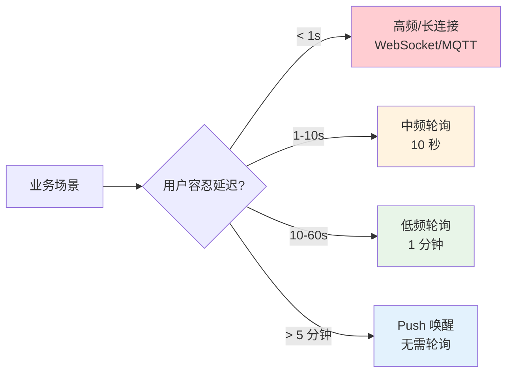
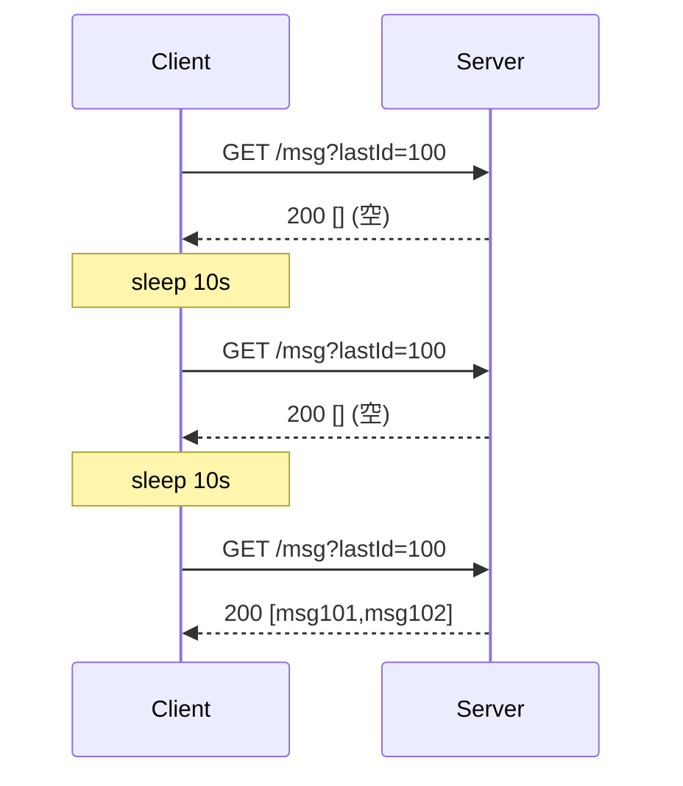
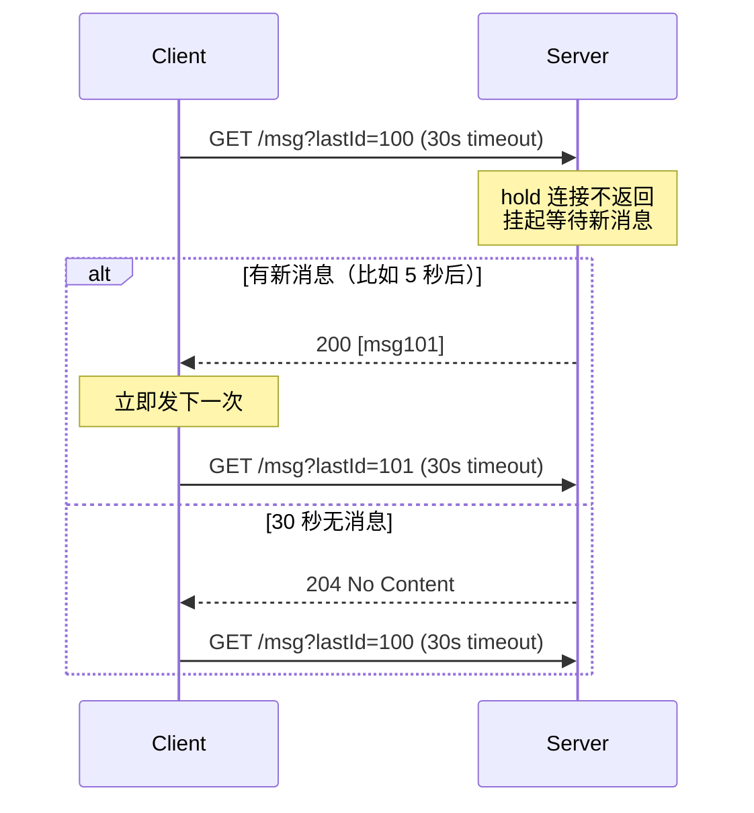
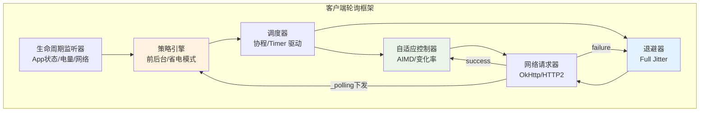
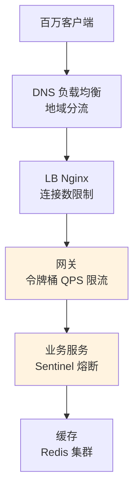
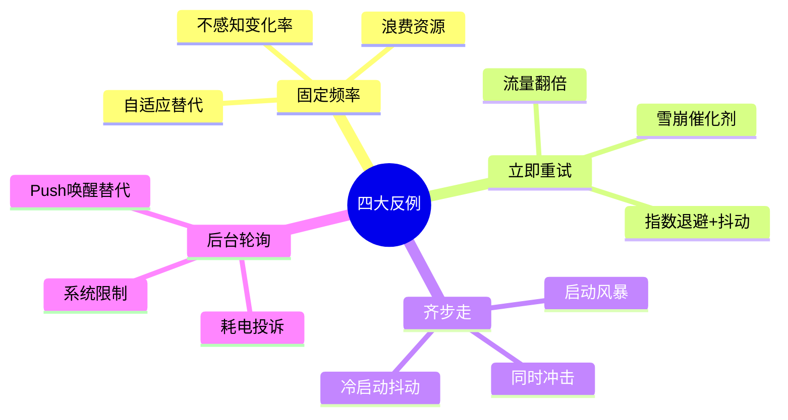

# 27.通用轮询方案设计

> **本篇定位**：轮询是分布式与移动端里"最简单也最容易写错"的机制——做不好就是"耗电、耗流量、雪崩、延迟"四件套。本文从一次"百万设备每秒轮询打挂网关"的真实故事讲起，逐层拆开轮询背后的**排队论、退避算法、自适应频率、长轮询内核**这些常被忽略的原理，最后回到案例给出一套可上线的通用框架。

#### 目录介绍
- [1. 案例引入](#1-案例引入)
  - [1.1 一次雪崩事故](#11-一次雪崩事故)
  - [1.2 顺藤摸到根因](#12-顺藤摸到根因)
  - [1.3 我们要回答什么](#13-我们要回答什么)
- [2. 架构概览](#2-架构概览)
  - [2.1 三个决策变量](#21-三个决策变量)
  - [2.2 为什么这么切](#22-为什么这么切)
- [3. 轮询本质矛盾](#3-轮询本质矛盾)
  - [3.1 排队论视角](#31-排队论视角)
  - [3.2 实时与省电](#32-实时与省电)
  - [3.3 频率与压力](#33-频率与压力)
  - [3.4 拉与推之争](#34-拉与推之争)
  - [3.5 幂等与去重](#35-幂等与去重)
- [4. 短轮询长轮询](#4-短轮询长轮询)
  - [4.1 短轮询模型](#41-短轮询模型)
  - [4.2 长轮询模型](#42-长轮询模型)
  - [4.3 长轮询内核](#43-长轮询内核)
  - [4.4 惊群与超时](#44-惊群与超时)
  - [4.5 SSE对比分析](#45-sse对比分析)
- [5. 退避算法原理](#5-退避算法原理)
  - [5.1 指数退避推导](#51-指数退避推导)
  - [5.2 抖动的数学根据](#52-抖动的数学根据)
  - [5.3 四种抖动算法](#53-四种抖动算法)
  - [5.4 退避上限设计](#54-退避上限设计)
  - [5.5 服务端协同退避](#55-服务端协同退避)
- [6. 自适应频率](#6-自适应频率)
  - [6.1 AIMD算法思想](#61-aimd算法思想)
  - [6.2 变化率驱动](#62-变化率驱动)
  - [6.3 服务端下发频率](#63-服务端下发频率)
  - [6.4 前后台分级](#64-前后台分级)
  - [6.5 时间与网络感知](#65-时间与网络感知)
- [7. 客户端框架](#7-客户端框架)
  - [7.1 整体架构](#71-整体架构)
  - [7.2 调度器实现](#72-调度器实现)
  - [7.3 退避器实现](#73-退避器实现)
  - [7.4 生命周期绑定](#74-生命周期绑定)
- [8. 服务端配合](#8-服务端配合)
  - [8.1 长轮询实现](#81-长轮询实现)
  - [8.2 网关限流保护](#82-网关限流保护)
  - [8.3 缓存层设计](#83-缓存层设计)
  - [8.4 动态调控频率](#84-动态调控频率)
  - [8.5 变更检测原理](#85-变更检测原理)
- [9. 常见反例陷阱](#9-常见反例陷阱)
  - [9.1 固定频率反例](#91-固定频率反例)
  - [9.2 立即重试反例](#92-立即重试反例)
  - [9.3 齐步走反例](#93-齐步走反例)
  - [9.4 后台轮询反例](#94-后台轮询反例)
- [10. 综合案例串讲](#10-综合案例串讲)
  - [10.1 案例真相揭晓](#101-案例真相揭晓)
  - [10.2 一次轮询的一生](#102-一次轮询的一生)
  - [10.3 设计哲学回扣](#103-设计哲学回扣)
  - [10.4 上线速查表](#104-上线速查表)


## 1. 案例引入

### 1.1 一次雪崩事故

先看一段在生产上真实跑过的车联网客户端上报代码——写这段代码的同学声称"就是每秒发一次，能有多难"，结果一次网关故障就把整个系统拖垮：

```kotlin
// LocationReporter.kt —— 车机端定位上报，100 万台车同时在线
class LocationReporter(private val api: LocationApi) {
    fun start() {
        thread {
            while (true) {
                val loc = getCurrentLocation()
                try {
                    api.report(loc)                 // 上报一次
                } catch (e: Exception) {
                    // 失败啥也不做——反正 1 秒后再发
                }
                Thread.sleep(1000)                  // 固定 1 秒
            }
        }
    }
}
```

**故障时间线**：

```mermaid
gantt
    title 车联网雪崩故障 30 分钟
    dateFormat HH:mm:ss
    axisFormat %H:%M:%S

    section 正常
    100w QPS 稳态上报   :a, 09:00:00, 5m

    section 触发
    网关短暂 502 5 秒   :crit, b, 09:05:00, 5s

    section 灾难
    100w 请求同一秒失败 :crit, c, 09:05:00, 1s
    下一秒 200w 请求涌入 :crit, d, 09:05:01, 1s
    网关被压垮          :crit, e, 09:05:01, 30m
    级联打挂 DB/MQ      :crit, f, 09:05:05, 30m
```



**现象**：网关只故障了 5 秒钟，全链路却瘫痪了 30 分钟——**故障时长被放大了 360 倍**。

### 1.2 顺藤摸到根因

带着"怎么会放大 360 倍"这个疑问顺着下沉：

- **假设 1**：是不是设备端一直在打？—— 抓包看，故障恢复瞬间 QPS 从 100 万飙到 **200 万**，翻倍，**证实**。
- **假设 2**：为什么会翻倍？—— 因为**故障 5 秒内积压的 500 万次失败请求，全部堆到"下一秒"重新发**，正常那一秒 100 万请求 + 积压 100 万 ≈ 200 万。
- **假设 3**：为什么积压能瞬间全打上来？—— 因为**所有设备都是"整秒对齐"上报**——同时发、同时失败、同时重试。抓包看，请求时间戳的方差几乎为 0：

```
正常时刻的请求时间戳分布（1 秒窗口内）：
0.001s  0.001s  0.001s  0.001s  ...   ← 全部集中在整秒后 1 毫秒
0.002s  0.002s  0.002s
                                       ← 方差 ≈ 0
```

- **假设 4**：那网关限流不管用吗？—— 网关设置了 150 万 QPS 的令牌桶——正常时富余 50%，但 200 万涌入 → 50 万请求超限被丢 → 客户端认为失败 → **下一秒继续发 + 重试 → 250 万涌入** → 恶性循环。

**罪魁列出来是三件套**：

```
① 固定频率 1 秒——不感知业务实际变化率
② 失败立即重试——无退避、无上限
③ 整秒齐步走——100 万设备时间轴完全对齐
```

而**放大 360 倍的根本原因**是：这三件事**互相耦合**——单独任何一件都不致命，凑到一起就形成"共振"。

### 1.3 我们要回答什么

一次事故里至少埋着 7 个原理问题：

```
① 为什么轮询会有"共振"？排队论怎么解释？          → 第3章
② 短轮询和长轮询到底谁更省？为什么？               → 第4章
③ 长轮询内核里的"服务端 hold 30 秒"是怎么做的？    → 第4.3节
④ 指数退避的"2 倍"是拍脑袋来的吗？                → 第5.1节
⑤ 抖动到底应该 ±10% 还是 ±50%？有数学根据吗？     → 第5.2节
⑥ 客户端能不能"自动"发现频率过高？                → 第6章
⑦ 一台机器能支撑多少并发长轮询？瓶颈在哪？          → 第4.4+第8章
```

带着这 7 个问题一路往下——每章解开一两个，最后第 10 章回到 LocationReporter，把整段代码重构成可上线版本。

本篇路线：

```
架构总览(第2章)
   ↓
本质矛盾 → 短/长轮询 → 退避 → 自适应   (第3-6章) ─→ 原理拆开
   ↓
客户端框架 → 服务端配合            (第7-8章) ─→ 落地实现
   ↓
反例陷阱(第9章) ─→ 排雷
   ↓
综合案例(第10章) ─→ 案例回扣 + 设计哲学
```


## 2. 架构概览

### 2.1 三个决策变量

轮询看起来简单，本质是**三个变量**在博弈：

```
┌─────────────────────────────────────────────────────────────┐
│                     通用轮询决策三角                          │
│                                                              │
│                      频率 f                                  │
│                    (拉的快慢)                                │
│                       ▲                                      │
│                      ╱ ╲                                     │
│                     ╱   ╲                                    │
│                    ╱     ╲                                   │
│                   ╱   ⬅   ╲                                  │
│                  ╱  平衡点  ╲                                │
│                 ╱             ╲                              │
│                ╱               ╲                             │
│               ╱─────────────────╲                            │
│           规模 N                  失败策略                    │
│         (客户端数)              (退避/抖动)                   │
│                                                              │
│   服务端 QPS = N × f                                         │
│   故障放大 = f × 失败堆积 × 齐步走系数                        │
└─────────────────────────────────────────────────────────────┘
```

三个变量各管一段：

| 变量 | 影响 | 谁控制 |
|---|---|---|
| **频率 f** | 实时性、流量、电量 | 客户端（可被服务端下发调控） |
| **规模 N** | 服务端总压力 | 业务规模决定，客户端不可控 |
| **失败策略** | 故障放大系数 | 客户端 100% 决定 |

**核心不等式**：

$$
\text{服务端峰值 QPS} = N \times \frac{1}{f} \times (1 + \text{故障放大系数})
$$

案例里 f=1s、N=100 万、放大系数=1（简单堆积），峰值 = 100万 × 1 × 2 = **200 万 QPS**，这就是网关被压垮的定量根源。

### 2.2 为什么这么切

**疑惑**：为什么把轮询拆成"频率 / 规模 / 失败策略"三层，而不是当作一个整体？

**论证**：
1. **可优化性**：三个变量**独立可调**，才能对症下药——网关雪崩本质是"失败策略"出问题，而不是"频率"太高。
2. **可分层**：频率与失败策略在**客户端**，规模在**业务规划**，服务端能通过"下发频率"这一动作**跨层反向调控**。
3. **可度量**：三层各有独立指标——频率对应"上报间隔 P50/P99"，规模对应"在线连接数"，失败策略对应"重试指数分布"。混在一起就没法监控。
4. **反向验证**：如果不分层，遇到雪崩只能"降频率"，而正确的解是"改失败策略"——不分层会让工程师做错决策。

**结论**：三层切分是"**机制与策略分离**"的直接体现——它让轮询从"拍脑袋定 1 秒"升级为"三个变量联合优化"的工程问题。

下面从最底层的"本质矛盾"开始逐层展开。


## 3. 轮询本质矛盾

### 3.1 排队论视角

**疑惑**：为什么"轮询会共振"？直觉上 100 万设备 × 每秒 1 次 = 稳定 100 万 QPS，为什么故障恢复后会突破到 200 万？

**论证**：

用最简单的 M/M/1 排队论模型解释——把网关当作服务器，请求到达速率 λ，服务速率 μ：

```
正常状态：
  λ = 100w/s      μ = 150w/s        ρ = λ/μ = 0.67 (稳态)
  队列长度 ≈ ρ/(1-ρ) ≈ 2，几乎无排队

网关故障 5 秒：
  服务停顿 → 5 秒内到达 500w 请求，全部排队/失败
  失败请求在客户端"就地缓存"，等下一秒重试

网关恢复的第一秒：
  新到达：100w      +  重试的：500w      = 600w
  但服务能力仍是 150w/s
  → 队列积压 450w，且**继续以每秒 100w 增长**（正常流量还在进）
  → ρ > 1，系统进入不稳态
  → 队列长度公式发散 → 雪崩
```

**核心洞察**：一旦 ρ > 1，队列**永远排不完**。这就是为什么故障 5 秒能导致 30 分钟瘫痪——**排队论的相变**。

### 3.2 实时与省电

**疑惑**：轮询频率是不是越快越好？

**论证**：把频率与四个维度的代价打成表：

| 频率 | 实时性 | 一天请求数 | 流量 (1KB/次) | 电量影响 | 服务端 QPS (100w 设备) |
|---|---|---|---|---|---|
| **1 秒** | 极好 | 86,400 | 85 MB | 严重 | 100 万 |
| **10 秒** | 好 | 8,640 | 8.5 MB | 中等 | 10 万 |
| **1 分钟** | 一般 | 1,440 | 1.4 MB | 轻微 | 1.7 万 |
| **5 分钟** | 差 | 288 | 280 KB | 几乎无 | 3,300 |
| **1 小时** | 极差 | 24 | 24 KB | 忽略 | 280 |

**关键数据**：从"1 秒 → 1 分钟"频率只降 60 倍，**服务端压力降 60 倍、电量降 90%、流量降 60 倍**——但用户几乎感知不到差别。

**结论**：**频率是最贵的资源**，业务实际需要的实时性通常远低于开发者的直觉。

### 3.3 频率与压力

**疑惑**：那频率能不能压到极致？比如 1 天一次？

**论证**：频率有一个**业务下限**——"消息延迟不能超过用户容忍阈值"：



**经验值**：

| 场景 | 用户容忍延迟 | 推荐频率 |
|---|---|---|
| 股票行情 | 500ms | 长连接 |
| 聊天消息 | 1s | 长连接/长轮询 |
| 订单状态 | 5-10s | 短轮询 10 秒 |
| 新闻推送 | 分钟级 | 长轮询/Push |
| 系统通知 | 小时级 | Push/低频轮询 |

### 3.4 拉与推之争

**疑惑**：既然长连接实时性好，为什么不所有场景都用长连接？

**论证**——四个真实约束：

```
① NAT 穿透
   4G/5G 网络下 NAT 超时约 3-5 分钟，长连接必须心跳保活
   → 保活心跳自己也是一种"轮询"

② 后台限制
   iOS 后台不给普通 App 长时间跑网络
   Android 8+ Doze 模式后台 30 分钟才唤醒一次
   → 长连接在后台"活不下来"，必须 Push 唤醒

③ 海外/弱网
   跨国长连接容易被中间设备 kill
   丢包率 > 5% 时长连接反而更差
   → 弱网场景轮询兜底更稳

④ 一次性查询
   "拉取一次订单状态"用长连接是杀鸡用牛刀
   连接建立/维护成本 > 单次拉取
```

**结论**：**没有银弹**——真实系统几乎都是"**长连接 + Push + 兜底轮询**"三层混合。轮询不是"落后方案"，是**系统韧性的最后一道防线**。

### 3.5 幂等与去重

**疑惑**：轮询的本质是"重复请求"——每 10 秒一次、失败后重试、网络抖动导致同一请求发了两遍。服务端怎么区分"正常的第二次轮询"和"重复的同一个请求"？

**论证**，轮询场景下重复请求有**三种来源**：

```
来源 1：正常轮询重叠
  客户端 ① GET /status?orderId=100 (第 1 次)
         ② GET /status?orderId=100 (第 2 次，10 秒后)
  → 两次是不同的轮询，服务端应该正常返回
  → 但服务端无法仅凭"orderId"区分"第 1 次"和"第 2 次"

来源 2：失败重试重复
  客户端 → POST /report  body={loc:x,y}  → 超时
  客户端认为失败 → POST /report  body={loc:x,y}  → 重试
  → 实际上第一次可能已经成功了（只是 ACK 丢了）
  → 服务端收到两条相同的上报

来源 3：网络层重传
  TCP 层重传导致应用层收到两份相同的 HTTP 请求
  → 较少见但仍需防范
```

**核心解法：幂等键（Idempotency Key）**

```
客户端每次生成唯一 requestId，服务端用 requestId 做去重：

客户端：
  requestId = UUID.randomUUID()
  POST /report  headers: X-Idempotency-Key: {requestId}  body: {loc}

服务端：
  收到 POST /report
  ├─ 查 Redis: GET idem:report:{requestId}
  │   ├─ 存在 → 返回第一次处理的结果（幂等）
  │   └─ 不存在 → 处理业务 → SET idem:report:{requestId} = result  TTL=1h
  └─ 返回结果
```

**三种轮询模式下的去重策略**：

| 轮询模式 | 去重需求 | 实现方式 |
|---|---|---|
| **短轮询（查询类）** | 不需要去重（自然幂等） | 天然的，多次查同一数据无副作用 |
| **短轮询（上报类）** | **必须去重** | 客户端带 requestId + 服务端 Redis 去重 |
| **长轮询** | 查询类不需要 | 但长轮询返回后重新发起，本身就是"新请求" |
| **失败重试** | **必须去重** | 同一次上报重试时**复用同一个 requestId** |

**客户端去重器实现**：

```kotlin
class IdempotentReporter(
    private val api: LocationApi,
) {
    // 一次上报重试时，始终用同一个 key
    private var currentRequestId: String? = null

    suspend fun report(loc: Location): Result {
        // 新上报 = 新 key；重试 = 复用 key
        if (currentRequestId == null) {
            currentRequestId = UUID.randomUUID().toString()
        }

        return try {
            val resp = api.report(loc, currentRequestId!!)
            currentRequestId = null  // 成功 → 清空
            resp
        } catch (e: IOException) {
            // 失败 → 保留 currentRequestId，下次重试复用
            throw e
        }
    }
}
```

**服务端去重存储的 TTL 设计**：

```
Redis key: idem:report:{requestId}
TTL 需要覆盖"客户端最大重试时间窗口"：
  
  退避上限 60s × 重试次数 3 次 × 安全余量 2 = 360s → TTL = 10 分钟

超时后 requestId 从 Redis 删除 → 相同 requestId 再次到来
→ 业务已过去 10 分钟 → 大概率不是重复请求了
```

**反例：不区分"轮询"和"重试"的代价**：

```
错误做法：每次轮询都生成新 requestId，但重试时也生成新 requestId
→ 服务端无法去重 → 同一份上报被处理了多次
→ 数据库里出现重复记录 → 财务对账炸裂
```

**结论**：**轮询的去重不是"多做了一层"，而是"轮询机制本身的必然需求"**——因为轮询 + 重试天然产生重复，客户端必须区分"两次不同的轮询"和"同一次轮询的重试"，并且用幂等键把这种区分传递给服务端。


## 4. 短轮询长轮询

### 4.1 短轮询模型

短轮询是最直白的方案——客户端定时问、服务端立即答：



**核心特征**：**每次请求都返回**（有数据返回数据、没数据返回空）。

**代价**：绝大多数请求是"空跑"——假设 5 分钟才有一条消息，10 秒频率下**每条消息背后有 30 次无效请求**，浪费率 97%。

### 4.2 长轮询模型

长轮询把"空跑"变成"等一等"——服务端**持有连接不返回**，直到有数据或超时：



**收益对比**：

| 指标 | 短轮询(10s) | 长轮询(30s hold) |
|---|---|---|
| 消息延迟 P50 | 5s | < 1s |
| 消息延迟 P99 | 10s | < 1s |
| 每小时请求数 | 360 | 120（假设消息稀疏） |
| 服务端 CPU | 高（每次查库） | 低（挂起） |
| 服务端内存 | 低 | 高（保存连接状态） |
| 移动端流量 | 高 | 低 |

长轮询用**服务端内存**换**客户端流量+服务端 CPU**，且实时性接近推送。

### 4.3 长轮询内核

**疑惑**：服务端"hold 30 秒不返回"到底怎么做？会不会一个连接占一个线程 → 支撑不了海量？

**论证**：

**方式 1：阻塞式（BIO）—— 已淘汰**

```java
// 每个连接一个线程，线程 park 30 秒
Object lock = new Object();
synchronized (lock) {
    lock.wait(30_000);   // 阻塞
}
// 单机线程池 8000 上限 → 撑不了 10 万长轮询
```

**方式 2：事件驱动（NIO / Reactor）—— 主流**

```
┌────────────────────────────────────────────────────┐
│           单个 Reactor 线程                          │
│                                                      │
│  ┌──────────┐    epoll_wait 挂起 N 个 fd            │
│  │ Selector │◄─────── kernel 事件通知 ─────────┐    │
│  └────┬─────┘                                   │    │
│       │                                          │    │
│  ┌────▼───────┐   ┌───────────┐   ┌──────────┐ │    │
│  │HTTP 请求解析│─▶│业务：查队列 │─▶│挂起等新数据│ │    │
│  └────────────┘   └───────────┘   └────┬─────┘ │    │
│                                          │       │    │
│  ┌──────────────────────────────────────▼───┐  │    │
│  │  订阅表 topic → [connection fds]           │  │    │
│  │  新消息到达 → 遍历订阅表 → 写响应 → close   │──┘    │
│  └────────────────────────────────────────────┘       │
└────────────────────────────────────────────────────────┘
```

**Netty 版实现骨架**：

```java
// 长轮询处理器
public class LongPollingHandler {
    // topic → 挂起中的连接列表
    private final Map<String, List<AsyncContext>> holders = new ConcurrentHashMap<>();

    // 收到请求：挂起
    public void onPoll(HttpRequest req, AsyncContext ctx) {
        String topic = req.getParam("topic");
        long lastId = req.getParam("lastId");

        // 先查一次：如果已有新消息 → 立即返回
        List<Msg> pending = repo.findAfter(topic, lastId);
        if (!pending.isEmpty()) {
            ctx.complete(pending);
            return;
        }

        // 无消息 → 挂起，注册到订阅表
        holders.computeIfAbsent(topic, k -> new CopyOnWriteArrayList<>()).add(ctx);

        // 30 秒超时兜底
        ctx.setTimeout(30_000, () -> {
            holders.get(topic).remove(ctx);
            ctx.complete(204);              // No Content
        });
    }

    // 新消息到达（MQ 回调）：唤醒
    public void onNewMessage(String topic, Msg msg) {
        List<AsyncContext> waiters = holders.remove(topic);
        if (waiters != null) {
            for (AsyncContext ctx : waiters) {
                ctx.complete(List.of(msg));  // 一次唤醒所有等待者
            }
        }
    }
}
```

**关键机制**：**连接挂起不占线程**——只在内存里保留一个 `AsyncContext` 对象（约几 KB），单机 10 万长轮询只吃 GB 级内存，不吃线程。

### 4.4 惊群与超时

**疑惑**：新消息到达时"唤醒所有等待者"，会不会把所有连接同时打回来 → 惊群？

**论证**：

**问题**：假设 1 万个客户端订阅同一个 topic，一条新消息到来 → 1 万个响应同时返回 → 1 万个客户端**同时下一次请求** → 网关瞬时压力峰值。

**解决方案**——**响应端加抖动 + 分片订阅**：

```java
public void onNewMessage(String topic, Msg msg) {
    List<AsyncContext> waiters = holders.remove(topic);
    if (waiters == null) return;

    // 方案 1：分批返回，散布在 100ms 窗口
    int batchSize = Math.max(1, waiters.size() / 10);
    for (int i = 0; i < waiters.size(); i += batchSize) {
        int end = Math.min(i + batchSize, waiters.size());
        List<AsyncContext> batch = waiters.subList(i, end);
        scheduler.schedule(
            () -> batch.forEach(ctx -> ctx.complete(msg)),
            i * 10, TimeUnit.MILLISECONDS
        );
    }
}
```

**另一维度的超时——TCP keepalive 与 LB 超时**：

- LB（Nginx/ELB）默认 `proxy_read_timeout=60s`，长轮询 hold 30 秒安全
- **hold 时长必须 < LB 超时**，否则响应还没发就被 LB 断连
- 移动网络 NAT 超时约 180 秒，长轮询天然满足

**经验参数**：

| 参数 | 推荐值 | 原因 |
|---|---|---|
| 长轮询 hold 时长 | 30 秒 | 兼顾实时性 + 兼容 LB 超时 |
| 客户端接收超时 | 35 秒 | 略大于 hold，防误判断线 |
| 响应抖动窗口 | 100-500ms | 分散服务端出口压力 |
| 单机长轮询上限 | 5-10 万 | 内存与 GC 决定 |

### 4.5 SSE对比分析

**疑惑**：§4.2 讲了长轮询用"hold 连接"实现准实时，但 HTTP 规范里还有一个 SSE（Server-Sent Events）也能做服务端推送——它和长轮询到底什么关系？

**论证**，**SSE 是 HTTP 协议级别的"长轮询 PRO 版"**：

**SSE 工作原理**：

```
Client                                Server
  │ ─── GET /events ────────────────▶│
  │    Accept: text/event-stream     │
  │                                   │
  │ ◀── HTTP 200                      │
  │    Content-Type: text/event-stream│
  │    Cache-Control: no-cache         │
  │    Connection: keep-alive          │
  │                                    │
  │ ◀── data: {"msg":"hello"}\n\n      │  ← 第一条事件
  │ ◀── data: {"msg":"world"}\n\n      │  ← 第二条事件
  │ ◀── : heartbeat\n\n                │  ← 注释行 = 心跳
  │ ◀── retry: 3000\n\n                │  ← 告诉客户端重连间隔
  │                                    │
  │  连接保持开放，持续推送……           │
  │ ◀── data: {"msg":"bye"}\n\n        │
```

**SSE 与长轮询的本质差异**：

| 维度 | 短轮询 | 长轮询 | SSE |
|---|---|---|---|
| **连接模型** | 每次新连接 | 一问一答后关闭 | **一次连接，多次推送** |
| **服务端推送** | 不支持 | 假推送（hold 后回一条就关） | **真推送**（一条连接推多条） |
| **HTTP 兼容性** | 100% 兼容 | 100% 兼容 | 需要 `text/event-stream` 支持 |
| **自动重连** | 客户端自己做 | 客户端自己做 | **浏览器内建**（EventSource API） |
| **二进制数据** | ✅ | ✅ | ❌（仅文本） |
| **双向通信** | ❌ | ❌ | ❌（单向：服务端 → 客户端） |
| **浏览器支持** | 所有 | 所有 | 所有现代浏览器（IE 除外） |
| **代理兼容性** | 最好 | 好（需代理不缓存） | **差**（某些代理会缓冲整个响应流） |

**SSE 的核心优势——"一次连接，持续推送"**：

```
长轮询的"连接碎片化"问题：
  消息来了 → 立即返回 + 关闭 → 客户端重新连接
  如果消息密集（每秒 10 条），长轮询 = 每秒 10 次 TCP 握手
  
SSE 的"连接复用"：
  一次 TCP 连接 → 持续推送 N 条消息
  省掉了 N-1 次 TCP 握手 + TLS 握手
  
  消息密集场景（股票行情、赛事比分）→ SSE 比长轮询省 90% 的握手开销
```

**SSE 的浏览器原生优势**：

```javascript
// 浏览器端 3 行代码搞定
const source = new EventSource('/events');
source.onmessage = (e) => console.log(JSON.parse(e.data));
source.onerror = () => /* 自动重连，无需手动处理 */;

// 对比长轮询：需要手动管理连接、超时、重连、重试
```

**但 SSE 有致命短板——不支持二进制 + 穿透代理差**：

```
场景：IoT 设备上报传感器数据（二进制 Protobuf）
  SSE：只能传文本 → Protobuf 需要 Base64 → 体积膨胀 33% → 不行
  长轮询：直接传 binary → 完美

场景：企业防火墙后的 Web 应用
  SSE：某些企业代理会缓冲整个 response → 事件延迟可达 30 秒
  长轮询：每次都是短响应 → 不被代理缓冲 → 安全
```

**选型决策**：

```
需要双向？       → WebSocket
只需要单向推送？
  ├─ 浏览器环境 + 纯文本 → SSE（最省事）
  ├─ 需要二进制       → 长轮询
  ├─ 需要穿透企业代理  → 长轮询
  └─ 消息极稀疏       → 长轮询（连接快进快出，不占资源）
```

**结论**：SSE 是长轮询在"一次连接多次推送"方向上的标准化演进，两者的关系是"长轮询 ⊆ SSE"。**如果你在浏览器里做单向推送，SSE 是比长轮询更优的方案——但前提是你能接受它的文本-only 局限和代理兼容风险**。真实系统中，Steam/Coinbase/BitMEX 的行情推送都在用 SSE。


## 5. 退避算法原理

### 5.1 指数退避推导

**疑惑**：为什么退避基数用"2 倍"？1.5 倍不行吗？

**论证**：

**假设 1**：故障时长 T 未知，客户端需要"快速探测恢复 + 不过度重试"。

**假设 2**：把重试间隔看作一个"探测函数" f(n)，n 是第 n 次重试。

**目标**：设定 f(n) 使得**总重试次数 log(T)** 而不是 O(T)。

**数学推导**：

```
线性重试 f(n) = n·k：
  T 秒内重试次数 = T/k → O(T)
  → 100 秒故障有 100 次重试 → 太多

指数重试 f(n) = k·g^n：
  第 n 次总时间 Σk·g^i ≈ k·g^n/(g-1)
  T 秒内重试次数 = log_g(T·(g-1)/k) → O(log T)
  → 100 秒故障只有 6-7 次重试 → 合理

g = 2 时：探测点在 1s, 3s, 7s, 15s, 31s, 63s, 127s...
g = 1.5：探测点在 1s, 2.5s, 4.75s, 8.125s, 13.19s...
g = 3：探测点在 1s, 4s, 13s, 40s, 121s... （过于保守）
```

**为什么工业界主流选 g = 2**：
- **好记**：位移运算，`delay << 1`
- **数学最优**：探测点密度与故障时长呈"每翻倍看一次"，几何最直观
- **实证**：AWS SDK / gRPC / Kafka 客户端全部采用 2 倍

**结论**：指数退避是"**故障时长未知时的最优探测策略**"——不是拍脑袋，是信息论意义上的最优。

### 5.2 抖动的数学根据

**疑惑**：抖动到底应该 ±10% 还是 ±50%？

**论证**：

抖动的作用是**打散齐步走**。假设 100 万设备同时开始退避，无抖动情况下下次重试**全部集中在同一时刻**：

```
无抖动（延迟固定 4 秒）：
  时间轴：  t+4s ▓▓▓▓▓▓▓▓▓▓▓▓▓▓▓▓▓▓  100w 请求打过来
                                       QPS = 100w，网关必炸

小抖动 ±10%（3.6-4.4s）：
  时间轴：  t+3.6s ▓▓▓▓▓  ▓▓▓▓▓  ▓▓▓▓▓
                    分散在 0.8s 窗口 → 峰值 QPS ≈ 12.5w

大抖动 ±50%（2-6s）：
  时间轴：  t+2s ▓▓  ▓▓  ▓▓  ▓▓  ▓▓  ▓▓  ▓▓  ▓▓
                   分散在 4s 窗口 → 峰值 QPS ≈ 2.5w
```

**峰值 QPS 公式**：

$$
\text{Peak QPS} = \frac{N}{\text{jitter\_window}}
$$

**结论**：抖动窗口越大 → 峰值越低，但**实时性下降**。经验值：

| 场景 | 抖动幅度 | 理由 |
|---|---|---|
| 首次连接 | ±100% (0-2×base) | 需要极致打散冷启动 |
| 失败重试 | ±50% | 平衡实时性与压力 |
| 心跳保活 | ±10% | 主要防 LB 精准 kill |

### 5.3 四种抖动算法

工业界有四种典型算法（AWS Architecture Blog 经典总结）：

```java
public class Backoff {
    private final long baseMs = 100;
    private final long maxMs = 30_000;
    private int attempt = 0;

    // 1. 无抖动（Baseline）—— 有齐步走风险
    long noJitter() {
        return Math.min(maxMs, baseMs * (1L << attempt));
    }

    // 2. 全抖动（Full Jitter）—— 推荐！随机分布在 [0, exp] 上
    long fullJitter() {
        long exp = Math.min(maxMs, baseMs * (1L << attempt));
        return ThreadLocalRandom.current().nextLong(exp);
    }

    // 3. 等抖动（Equal Jitter）—— 一半确定 + 一半随机
    long equalJitter() {
        long exp = Math.min(maxMs, baseMs * (1L << attempt));
        return exp / 2 + ThreadLocalRandom.current().nextLong(exp / 2);
    }

    // 4. 去相关抖动（Decorrelated）—— AWS 首选，收敛快
    private long lastDelay = baseMs;
    long decorrelatedJitter() {
        lastDelay = Math.min(maxMs,
            ThreadLocalRandom.current().nextLong(baseMs, lastDelay * 3));
        return lastDelay;
    }
}
```

**四种算法对比**（AWS 实测 500 个客户端 × 5 次重试）：

| 算法 | 完成时间 | 总请求数 | 齐步走风险 |
|---|---|---|---|
| No Jitter | 199s | 4,500 次 | 极高 |
| Full Jitter | **165s** | **2,400 次** | 极低 |
| Equal Jitter | 178s | 3,600 次 | 低 |
| Decorrelated | **168s** | **2,700 次** | 极低 |

**结论**：**Full Jitter** 是"简单又好用"的默认选择；**Decorrelated** 在需要更快收敛时用（如 AWS SDK 默认）。

### 5.4 退避上限设计

**疑惑**：退避一直翻倍，第 20 次就是 100 万秒（11 天），肯定不合理——上限怎么设？

**论证**：

**上限的三个原则**：

1. **业务实时性下限**：股票 App 最长 30 秒探测一次，社交 IM 最长 60 秒，IoT 上报可以 5 分钟。
2. **服务端恢复时间**：故障平均恢复时间（MTTR）通常 < 5 分钟——上限设 5 分钟能覆盖大部分场景。
3. **必须触底反弹**：达到上限后**继续以上限重试**，不要停止——否则永远不会恢复。

**典型配置**：

```kotlin
class BoundedBackoff(
    val baseMs: Long = 500,       // 起步 0.5 秒
    val maxMs: Long = 60_000,     // 上限 1 分钟
    val resetAfter: Long = 60_000 // 成功后 60s 内保持低退避，再重置
) {
    private var attempt = 0
    private var lastSuccess = 0L

    fun nextDelay(): Long {
        val exp = min(maxMs, baseMs * (1L shl attempt))
        attempt++
        return ThreadLocalRandom.current().nextLong(exp)  // Full Jitter
    }

    fun onSuccess() {
        // ⚠️ 不要立即 reset——防抖动：短时间内再失败又要从头爬
        if (System.currentTimeMillis() - lastSuccess > resetAfter) {
            attempt = 0
        }
        lastSuccess = System.currentTimeMillis()
    }
}
```

**关键细节**：
- **成功不立即重置**——避免"成功一次 → 立即失败 → 重头开始退避"的抖动
- **达到上限后保持**——不要停止重试，否则再无恢复机会
- **区分永久失败 vs 临时失败**——4xx 应停止上报，5xx/网络错误应继续退避

### 5.5 服务端协同退避

**疑惑**：前 4 节讲的退避全部是**客户端单方面猜**——"指数翻倍 + 抖动 + 上限"。但如果服务端知道"准确的恢复时间"，为什么不让服务端告诉客户端，而是让客户端盲猜？

**论证**，**HTTP 协议层有现成的标准机制**让服务端通知客户端，但大部分团队没用好：

**机制一：Retry-After 响应头（RFC 7231）**

```
HTTP/1.1 503 Service Unavailable
Retry-After: 120       ← "我大概 120 秒后恢复，你现在别来了"

HTTP/1.1 429 Too Many Requests
Retry-After: Thu, 01 Jan 2026 12:00:00 GMT  ← 也可以带绝对时间
```

这个头是 HTTP 标准的一部分，**绝大多数 HTTP 客户端都认识它**：

```kotlin
// 客户端解析 Retry-After
fun parseRetryAfter(response: Response): Long {
    val header = response.header("Retry-After") ?: return 0
    
    // 可能是秒数："120"
    header.toLongOrNull()?.let { return it * 1000 }
    
    // 也可能是 HTTP 日期
    return try {
        val date = SimpleDateFormat("EEE, dd MMM yyyy HH:mm:ss z").parse(header)
        max(0, date.time - System.currentTimeMillis())
    } catch (e: Exception) { 0L }
}

// 使用：服务端说了等多久，客户端就等多久
val serverWait = parseRetryAfter(response)
val nextDelay = if (serverWait > 0) serverWait else backoff.nextDelay()
```

**机制二：429 限流响应 + 限流信息**

```
HTTP/1.1 429 Too Many Requests
Retry-After: 60
X-RateLimit-Limit: 1000       ← 每分钟 1000 次
X-RateLimit-Remaining: 0      ← 当前剩余 0 次
X-RateLimit-Reset: 1640995200 ← Unix timestamp，配额重置时间
```

客户端拿到这些信息后可以：

```kotlin
fun handle429(response: Response): Long {
    // 1. 优先用 Retry-After
    val retryAfter = parseRetryAfter(response)
    if (retryAfter > 0) return retryAfter

    // 2. 其次用 X-RateLimit-Reset
    val resetAt = response.header("X-RateLimit-Reset")?.toLongOrNull()
    if (resetAt != null) {
        return max(0, (resetAt * 1000) - System.currentTimeMillis())
    }

    // 3. 兜底用指数退避
    return backoff.nextDelay() * 2  // 429 场景加倍退避
}
```

**机制三：熔断器（Circuit Breaker）——退避的集体化版本**

单个客户端的退避是"个体理性"，但当 **1 万个客户端同时退避**时，它们仍然可能形成"集体共振"。熔断器把退避**从个体决策升级为集体决策**：

```
熔断器三态：
  CLOSED（正常） → 请求直接发
      │ 连续失败 N 次
      ▼
  OPEN（熔断） → 拒绝所有请求，直接抛异常
      │ 等待 cooldown 秒
      ▼
  HALF_OPEN（探测） → 允许 1 个请求通过
      ├─ 成功 → CLOSED（恢复正常）
      └─ 失败 → OPEN（继续熔断）
```

```kotlin
class CircuitBreaker(
    private val failureThreshold: Int = 5,
    private val cooldownMs: Long = 30_000,
) {
    private var state = State.CLOSED
    private var failureCount = 0
    private var openedAt = 0L

    suspend fun <T> execute(block: suspend () -> T): T {
        when (state) {
            State.OPEN -> {
                if (System.currentTimeMillis() - openedAt > cooldownMs) {
                    state = State.HALF_OPEN  // 冷却时间到，探测
                } else {
                    throw CircuitBreakerOpenException()  // 快速失败
                }
            }
            State.HALF_OPEN -> { /* 允许通过 */ }
            State.CLOSED -> { /* 正常 */ }
        }

        return try {
            val result = block()
            onSuccess()
            result
        } catch (e: Exception) {
            onFailure()
            throw e
        }
    }

    private fun onSuccess() {
        state = State.CLOSED
        failureCount = 0
    }

    private fun onFailure() {
        failureCount++
        if (failureCount >= failureThreshold) {
            state = State.OPEN
            openedAt = System.currentTimeMillis()
        }
    }
}
```

**熔断器的额外收益**：当后端真的挂了时，熔断器让客户端**快速失败**，而不是傻等超时（每次 30 秒）——把故障检测延迟从"超时时间"降为"立即知道"。

**三机制协同**：

```
完整退避决策链（优先级从高到低）：

① 熔断器 OPEN？ → 直接拒绝，等冷却
② Retry-After 有值？ → 用服务端的值（最准）
③ 429 + X-RateLimit-Reset？ → 等到配额重置
④ 客户端退避算法 → Full Jitter + 上限
⑤ 区分永久错误（4xx）→ 停止
```

**结论**：**服务端协同退避是把盲猜变成精准打击**。Retry-After 消除信息差、429 限流头消除频率差、熔断器消除集体共振——这三者叠加的效果是：**故障恢复时，不是"100 万台设备同时盲猜"，而是"服务端统一指挥，客户端有序回归"**。这也是为什么 AWS/GCP/Azure 的 SDK 全部内建了 Retry-After 解析——它不是锦上添花，是生产级系统的准入门槛。


## 6. 自适应频率

### 6.1 AIMD算法思想

**疑惑**：TCP 拥塞控制里的 AIMD（Additive Increase / Multiplicative Decrease）能不能借鉴到轮询？

**论证**：

TCP 拥塞控制的核心思想：**探测网络容量**——加性增（每 RTT 加 1）、乘性减（丢包时窗口减半）。

轮询频率的自适应本质是同一个问题——**探测业务变化率**。类比映射：

| TCP 拥塞控制 | 轮询频率控制 |
|---|---|
| 拥塞窗口 cwnd | 轮询间隔 interval |
| 无丢包 → 加大 cwnd | 无变化 → 加大 interval（降频） |
| 丢包 → 减半 cwnd | 有变化 → 减半 interval（升频） |
| MSS 上限 | 业务实时性下限 |

**AIMD 版轮询**：

```kotlin
class AIMDPoller(
    val minInterval: Long = 1_000,     // 1s（业务下限）
    val maxInterval: Long = 5 * 60_000, // 5min
    val increment: Long = 1_000        // 每次无变化 +1s
) {
    private var interval = minInterval

    fun onResult(changed: Boolean) {
        interval = if (changed) {
            (interval / 2).coerceAtLeast(minInterval)   // 乘性减
        } else {
            (interval + increment).coerceAtMost(maxInterval)  // 加性增
        }
    }

    fun currentInterval() = interval
}
```

### 6.2 变化率驱动

**疑惑**：AIMD 假设"每次不变就 +1s"，但如果消息突然爆发（比如聊天从空闲到密集）——恢复够快吗？

**论证**：

**方案**：不只看"变了/没变"，还要看**变化率**：

```kotlin
class RateAwarePoller {
    private var interval = 10_000L
    private val history = ArrayDeque<Boolean>(10)  // 最近 10 次结果

    fun onResult(changed: Boolean) {
        history.addLast(changed)
        if (history.size > 10) history.removeFirst()

        val changeRate = history.count { it }.toDouble() / history.size

        interval = when {
            changeRate > 0.7 -> 1_000    // 密集 → 极快
            changeRate > 0.3 -> 5_000    // 中等 → 中频
            changeRate > 0.1 -> 30_000   // 稀疏 → 低频
            else             -> 5 * 60_000  // 极稀疏 → 5 分钟
        }
    }
}
```

**收益**：从"每次调整"变成"看窗口调整"，抗抖动更强。

### 6.3 服务端下发频率

**疑惑**：客户端不知道服务端的负载，怎么智能？

**论证**——**响应字段下发频率是最强武器**：

```json
HTTP/1.1 200 OK
Content-Type: application/json

{
    "data": [...],
    "_polling": {
        "next_interval_ms": 30000,     // 下次多久再来
        "max_concurrent": 1000,         // 服务端建议并发上限
        "backoff_on_status": [503,429], // 遇到这些状态码要退避
        "sample_rate": 0.5              // 只让 50% 客户端来（分层降级）
    }
}
```

**优势**：
- **服务端动态调控全局压力**——扩容/缩容时不用改客户端
- **灰度能力**：只让 x% 客户端提频、其他保持
- **应急预案**：发现雪崩苗头，立即下发 `next_interval_ms = 300000`（5 分钟）→ 秒级降流

**Netflix 的实现**（Adaptive Polling）：服务端根据 CPU/QPS 实时计算 `next_interval`，客户端 100% 遵守——2015 年 AWS us-east-1 大故障时靠这个机制**避免了大规模雪崩**。

### 6.4 前后台分级

**疑惑**：为什么后台要单独一套频率？

**论证**——移动端硬约束：

| App 状态 | 平台限制 | 推荐策略 |
|---|---|---|
| **前台 + 用户操作中** | 无 | 高频（1-10 秒） |
| **前台 + 空闲 > 30 秒** | 无 | 中频（30 秒） |
| **切后台 < 30 秒** | iOS 允许 | 保持中频 |
| **切后台 > 30 秒** | iOS 冻结 | 停止轮询，改 Push |
| **后台 Doze（Android）** | 系统禁网 | WorkManager 15min |
| **完全退出** | - | Push 唤醒 |
| **充电中 + WiFi** | - | 可提升到高频 |
| **低电量（< 20%）** | - | 主动降频 |

**代码骨架**：

```kotlin
class LifecycleAwarePoller(
    private val process: ProcessLifecycleOwner,
    private val battery: BatteryManager,
) : DefaultLifecycleObserver {
    private var strategy: PollStrategy = ForegroundStrategy

    override fun onStart(owner: LifecycleOwner) {
        strategy = when {
            battery.level < 20      -> LowPowerStrategy
            battery.isCharging      -> ChargingStrategy
            else                    -> ForegroundStrategy
        }
    }

    override fun onStop(owner: LifecycleOwner) {
        strategy = BackgroundStrategy   // 立即降到 5 分钟
    }
}
```

**关键铁律**：**移动端后台轮询频率 < 1 次/分钟——否则上线必被用户骂耗电**。

### 6.5 时间与网络感知

**疑惑**：6.1~6.4 讲的自适应全部基于"业务数据变化率"，但轮询还有两个重要的外界因素——**现在几点？网好不好？** ——为什么不纳入自适应逻辑？

**论证**，真实世界的轮询受制于两个**外部物理约束**：

**约束一：时间模式（峰谷效应）**

```
一天内的流量模式（以打车/外卖 App 为例）：

07:00-09:00  早高峰        高频 5-10s（实时叫车，位置变化密集）
09:00-11:00  工作期        低频 30-60s（静止在工位上）
11:00-13:00  午高峰        高频 5-10s（出来吃饭）
13:00-17:00  下午工作      低频 30-60s
17:00-20:00  晚高峰        高频 5-10s（下班回家）
20:00-07:00  夜间          极低频 5-10min（静止在家）

→ 夜间到白天的频率差异可达 60 倍
→ 如果全时段用 10 秒频率 → 夜间 99% 的请求全是浪费
```

**基于时间模式的频率策略**：

```kotlin
class TimeAwareStrategy(
    private val timePatterns: List<TimeSlot>,
) {
    data class TimeSlot(
        val name: String,
        val startHour: Int,
        val endHour: Int,
        val intervalMs: Long,
    )

    fun currentInterval(): Long {
        val hour = LocalTime.now().hour
        return timePatterns.firstOrNull { hour in it.startHour until it.endHour }
            ?.intervalMs ?: DEFAULT_INTERVAL
    }
}

// 配置
val patterns = listOf(
    TimeSlot("早高峰", 7, 9,   10_000),
    TimeSlot("午高峰", 11, 13,  10_000),
    TimeSlot("晚高峰", 17, 20,  10_000),
    TimeSlot("夜间",   22, 6,   5 * 60_000),
    // 其余时间默认 30 秒
)

// 可以与变化率驱动叠加：
fun adaptiveInterval(): Long {
    val timeInterval = timeStrategy.currentInterval()
    val changeInterval = aimdPoller.currentInterval()
    return min(timeInterval, changeInterval)  // 取两者中更保守的
}
```

**约束二：网络质量（RTT 与信号强度）**

弱网环境下，高频轮询不但无益，反而有害：

```
4G 满格（RTT=30ms）：
  ├─ 10s 一轮 → 实际数据耗时 30ms → 有效率 99.7%
  └─ 高频可行

3G/弱 4G（RTT=500ms，丢包 5%）：
  ├─ 10s 一轮 → 实际数据耗时可能 5s（多次重传）
  │   → 10s 窗口里 50% 时间在等网络
  └─ 应该降频到 30s → 减少重传竞争 → 实际成功率反而上升

2G/离线：
  └─ 轮询无意义，停止等待网络恢复通知
```

**网络感知实现**：

```kotlin
class NetworkAwarePoller(
    private val connectivityManager: ConnectivityManager,
) {
    private var currentRtt = 30L  // 默认 30ms

    fun onNetworkChanged() {
        val capabilities = connectivityManager.getNetworkCapabilities(
            connectivityManager.activeNetwork
        )
        // Android 11+ 自动上报 RTT
        currentRtt = capabilities?.linkDownstreamBandwidthKbps?.let {
            // 带宽 < 100Kbps → 极弱网
            if (it < 100) return  // 停止轮询，等网络恢复
        } ?: 30L
    }

    fun networkAwareInterval(): Long {
        return when {
            currentRtt < 50    -> 10_000    // 好网 → 高频
            currentRtt < 200   -> 30_000    // 一般 → 中频
            currentRtt < 1000  -> 60_000    // 差 → 低频
            else               -> 5 * 60_000 // 极差 → 极致低频
        }
    }
}
```

**三维自适应融合**（最终决策链）：

```
最终轮询间隔 = f(变化率, 时间模式, 网络质量, 服务端下发)

实现方式：取所有维度建议间隔的 max（最保守）或 min（最激进）

建议 max 优先（省电/降流导向）：
  interval = max(changeRateInterval, timeInterval, networkInterval)

也有场景用 min 优先（实时性导向）：
  interval = min(changeRateInterval, timeInterval, networkInterval)

最稳妥：服务端下发为最高优先级
  interval = serverInterval ?: max(localIntervals...)
```

**结论**：**自适应不是"算法越聪明越好"，而是"传感器的种类越多越好"**——变化率只感知业务，时间感知物理世界，网络感知通信条件。三重传感器交叉验证，才能让轮询频率始终处在"该快时快、该慢时慢"的帕累托最优点上。


## 7. 客户端框架

### 7.1 整体架构

一个可上线的通用轮询框架，包含 6 个核心模块：



### 7.2 调度器实现

**核心调度器（Kotlin Coroutines 版）**：

```kotlin
class GeneralPoller<T>(
    private val task: suspend () -> Result<T>,
    private val onData: (T) -> Unit,
    private val config: PollerConfig,
) {
    private var job: Job? = null
    private val backoff = BoundedBackoff(config.baseMs, config.maxBackoffMs)
    private val adaptive = AIMDPoller(config.minIntervalMs, config.maxIntervalMs)
    private var lastData: T? = null

    fun start(scope: CoroutineScope) {
        stop()
        job = scope.launch(Dispatchers.IO) {
            // 冷启动随机延时——防齐步走
            delay(ThreadLocalRandom.current().nextLong(0, config.startupJitterMs))

            while (isActive) {
                val nextDelay = runCatching { task() }
                    .fold(
                        onSuccess = { result ->
                            when (result) {
                                is Result.Success -> {
                                    backoff.onSuccess()
                                    val changed = result.data != lastData
                                    if (changed) {
                                        lastData = result.data
                                        onData(result.data)
                                    }
                                    adaptive.onResult(changed)
                                    // 优先服务端下发，其次自适应
                                    result.serverInterval ?: adaptive.currentInterval()
                                }
                                is Result.Fail -> {
                                    if (result.isPermanent) return@launch  // 4xx 停止
                                    backoff.nextDelay()
                                }
                            }
                        },
                        onFailure = { backoff.nextDelay() }
                    )

                delay(nextDelay)
            }
        }
    }

    fun stop() { job?.cancel(); job = null }
}
```

**要点**：
1. **冷启动抖动**——launch 后先 sleep 0-N 秒，防启动风暴
2. **成功走自适应、失败走退避**——两套策略互不干扰
3. **服务端下发优先**——如果响应带 `next_interval_ms`，直接用
4. **永久失败停止**——4xx 是业务错误，不应该无限重试

### 7.3 退避器实现

复用第 5 章的 `BoundedBackoff`，此处补充**永久错误判断**：

```kotlin
sealed class PollError {
    object Timeout : PollError()             // 重试
    object NetworkUnreachable : PollError()  // 重试
    data class HttpError(val code: Int) : PollError() {
        val isPermanent = code in 400..499 && code !in listOf(408, 429)
        // 408 请求超时、429 限流 是临时错误
    }
}

fun handleError(err: PollError): Long {
    return when (err) {
        is PollError.Timeout,
        is PollError.NetworkUnreachable -> backoff.nextDelay()
        is PollError.HttpError -> when {
            err.isPermanent -> {
                logger.error("Permanent error, stop polling")
                -1L  // -1 表示停止
            }
            err.code == 429 -> {
                // Retry-After 头优先
                val retryAfter = response.header("Retry-After")?.toLongOrNull()?.times(1000)
                retryAfter ?: (backoff.nextDelay() * 2)  // 429 双倍退避
            }
            else -> backoff.nextDelay()
        }
    }
}
```

### 7.4 生命周期绑定

**Android 上的绑定**（Jetpack Lifecycle）：

```kotlin
class LocationPollerFragment : Fragment() {
    private val poller by lazy {
        GeneralPoller(
            task = { locationApi.report(currentLocation()) },
            onData = { /* 结果处理 */ },
            config = PollerConfig(
                minIntervalMs = 5_000,
                maxIntervalMs = 5 * 60_000,
                startupJitterMs = 3_000,
            )
        )
    }

    override fun onStart() {
        super.onStart()
        poller.start(viewLifecycleOwner.lifecycleScope)  // 自动 cancel
    }

    override fun onStop() {
        super.onStop()
        poller.stop()
    }
}
```

**关键收益**：
- `lifecycleScope` 自动在 Fragment 销毁时 cancel 协程——**零内存泄漏**
- `onStart/onStop` 天然对应前后台切换——**无需手动监听**


## 8. 服务端配合

### 8.1 长轮询实现

**Spring WebFlux 版长轮询服务端**：

```kotlin
@RestController
class LongPollController(
    private val messageBus: MessageBus,   // 内部消息总线（Kafka/Redis Pub-Sub）
) {
    @GetMapping("/poll")
    suspend fun poll(
        @RequestParam topic: String,
        @RequestParam lastId: Long,
        @RequestParam(defaultValue = "30000") timeout: Long,
    ): PollResponse = withTimeoutOrNull(timeout) {
        // 1. 先查一次，有新数据立即返回
        val existing = repo.findAfter(topic, lastId)
        if (existing.isNotEmpty()) return@withTimeoutOrNull PollResponse(existing)

        // 2. 无数据，挂起等待（协程 suspend，不占线程）
        val newMsg = messageBus.awaitFirst(topic)
        PollResponse(listOf(newMsg))
    } ?: PollResponse(emptyList())  // 超时空返回
}
```

**性能实测（单机 32C64G，Spring WebFlux + Reactor Netty）**：

| 长轮询连接数 | CPU | 堆内存 | 每秒消息推送量 |
|---|---|---|---|
| 1 万 | 5% | 800MB | 5 万 |
| 5 万 | 15% | 3GB | 20 万 |
| 10 万 | 30% | 6GB | 40 万 |
| 20 万 | 55% | 12GB | 60 万 |

**结论**：**长轮询单机可承 10-20 万连接**，比长连接（WebSocket）低一个数量级，但**比短轮询高两个数量级**。

### 8.2 网关限流保护

**多层限流保护**：



**关键配置**（以 Nginx + Sentinel 为例）：

```nginx
# Nginx 限流：每 IP 20 QPS
limit_req_zone $binary_remote_addr zone=poll:10m rate=20r/s;

server {
    location /poll {
        limit_req zone=poll burst=50 nodelay;
        proxy_pass http://backend;
        proxy_read_timeout 35s;   # 长轮询需要 > 30s
    }
}
```

```yaml
# Sentinel 熔断：QPS > 100 万时降级
- resource: /poll
  count: 1000000
  grade: 1
  strategy: 0
  timeWindow: 10
```

**熔断降级返回**：

```json
{
    "code": 503,
    "data": [],
    "_polling": {
        "next_interval_ms": 300000  // 强制降频到 5 分钟
    }
}
```

### 8.3 缓存层设计

**为什么长轮询/短轮询都要过缓存？**——因为**查询模式极度重复**：

```
100 万设备每 30 秒查一次 → 33k QPS
    ↓ 如果每次都走 DB
DB QPS = 33k → 崩

    ↓ 加 Redis 缓存 TTL=10s
Redis QPS = 33k（Redis 单机能扛 10 万）
DB QPS = 100（10 秒才穿透一次）
```

**缓存穿透与雪崩**：

```java
// ❌ 反例：所有客户端同时查同一个 key，缓存过期瞬间全部打到 DB
public List<Msg> getMessages(String topic) {
    return cache.getOrLoad("msgs:" + topic, 10_000,
        () -> db.findByTopic(topic));
}

// ✅ 正例：加互斥锁 + TTL 随机
public List<Msg> getMessages(String topic) {
    String key = "msgs:" + topic;
    return cache.get(key) ?: cache.lock(key, 3_000) {
        // 只有一个线程能进入
        cache.get(key) ?: db.findByTopic(topic).also {
            int ttl = 8_000 + random.nextInt(4_000);  // 8-12 秒
            cache.set(key, it, ttl);
        }
    }
}
```

### 8.4 动态调控频率

**服务端根据负载动态下发**：

```java
public PollResponse handlePoll(String topic, long lastId) {
    // 查数据
    List<Msg> data = fetchData(topic, lastId);

    // 计算下次频率
    long nextInterval = calcInterval();

    return new PollResponse(data, new PollingHint(nextInterval));
}

private long calcInterval() {
    double cpuUsage = metrics.getCpuUsage();
    long qps = metrics.getCurrentQps();

    return when {
        cpuUsage > 0.8 || qps > 800_000 -> 300_000   // 5 分钟（紧急降流）
        cpuUsage > 0.6                   -> 60_000    // 1 分钟
        cpuUsage > 0.4                   -> 30_000    // 30 秒
        else                             -> 10_000    // 10 秒（正常）
    };
}
```

**效果**：这是**云原生级别的自动化雪崩防御**——不用发版、不用改客户端，服务端就能秒级调控全网流量。

### 8.5 变更检测原理

**疑惑**：8.3 节讲了缓存层防 DB 穿透，但轮询的终极问题是——**"数据没变，为什么要返回整个 body？"** 如果服务端能告诉客户端"没变化"，客户端就不用处理重复数据——这比缓存更省。

**论证**，HTTP 协议在这件事上给了**三层机制**，层层递进：

**第一层：ETag / If-None-Match（内容指纹）**

```
客户端第一次请求：
  GET /status?orderId=100
  → 200 OK
    ETag: "a1b2c3d4"          ← 服务端返回当前数据的 hash
    body: {...}

客户端第二次请求（数据没变）：
  GET /status?orderId=100
  If-None-Match: "a1b2c3d4"   ← 带上上次的 ETag
  → 304 Not Modified           ← 服务端：hash 没变，不传 body
    (空 body)

客户端第三次请求（数据变了）：
  GET /status?orderId=100
  If-None-Match: "a1b2c3d4"   ← 带旧 ETag
  → 200 OK
    ETag: "e5f6g7h8"           ← 新 hash
    body: {...}
```

**ETag 的收益**：

| 请求结果 | body 体积 | 网络耗时 | 客户端 CPU |
|---|---|---|---|
| 200（全量返回） | 完整 payload | 大 | 需反序列化 |
| **304（无变化）** | 0 字节 | 极小 | **零处理** |

假设 80% 的轮询是"数据没变" → 80% 的请求只需要一个 304 响应头（~100 字节）而不是 1KB 的 body → **带宽省 90% + 客户端 CPU 省 100%**。

**ETag 生成策略**：

```java
// 策略 1：hash 值（最准确但最贵）
String etag = DigestUtils.md5Hex(Jackson.toJson(data));

// 策略 2：版本号（常用）
String etag = String.valueOf(data.getVersion());  // 乐观锁版本号

// 策略 3：最后修改时间（最轻量但精度低——秒级）
String etag = String.valueOf(data.getUpdatedAt().toEpochMilli());

// 策略 4：内容长度 + 首尾字节（HBase/MongoDB 风格）
String etag = data.length() + "-" + firstByte + "-" + lastByte;
```

**第二层：Last-Modified / If-Modified-Since（时间戳）**

```
客户端第一次请求：
  GET /status?orderId=100
  → 200 OK
    Last-Modified: Mon, 06 Jul 2026 08:00:00 GMT

客户端后续请求：
  GET /status?orderId=100
  If-Modified-Since: Mon, 06 Jul 2026 08:00:00 GMT
  → 304 Not Modified（自 08:00 以后没变过）
```

**ETag vs Last-Modified 对比**：

| 维度 | ETag | Last-Modified |
|---|---|---|
| **精度** | 任意粒度（hash / version） | **秒级**（HTTP-date 格式 1 秒精度） |
| **计算成本** | 高（需 hash 整个实体） | 极低（只是一个字段） |
| **并发安全** | ✅ 任意两个版本可区分 | ❌ 一秒内两次修改无法区分 |
| **适用场景** | 高精度变更检测 | 低频变更、归档数据 |

**最佳实践**：**两者都带**——ETag 做主判断（强校验）、Last-Modified 做兜底（弱校验）。

**第三层：增量同步（Delta Polling）**

当前两层告诉客户端"数据变了"，第三步就是**告诉客户端"哪些数据变了"**——不要全量，只要增量：

```
客户端：
  GET /messages?lastSeq=1078        ← 我收到了 seq 1078

服务端：
  SELECT * FROM messages WHERE seq > 1078 ORDER BY seq
  → 返回 seq 1079, 1080, 1081（只有增量）
  → 响应头带上 ETag = "1081"

客户端收到后：
  ├─ 本地 seq 更新到 1081
  ├─ 下一次轮询从 1081 开始
  └─ 服务端只需要查 seq > 1081 的消息
```

**全量 vs 增量的数学对比**：

```
场景：100 万设备，每条消息 1KB，每天 100 条新消息

全量轮询（30s 频率）：
  ├─ 每次返回本日全部消息（随时间增长）
  ├─ 早上 100 条 → 100KB/次 → 一天下来：
  └─ 日均 bandwidth = (0 + 100KB) / 2 × 2880 次 = 144 MB/设备/天

增量轮询（30s 频率）：
  ├─ 每次只返回上次 seq 之后的新消息
  ├─ 平均每次 1 条新消息 → 1KB/次
  └─ 日均 bandwidth = 1KB × 2880 = 2.8 MB/设备/天
  
  → 增量比全量省 98% 的流量
```

**变更检测的三层漏斗**：

```
请求到达
  ├─ 304 Not Modified  ─── 数据没变，零 body（占 80% 的请求）
  ├─ 200 + 增量 body  ─── 数据变了，只返回变化部分（占 19% 的请求）
  └─ 200 + 全量 body  ─── 首次请求或 seq 断档（占 1% 的请求）

漏斗效应：
  80% 流量被 304 拦截 → 省掉网络传输 + 客户端解析
  19% 走增量返回 → 省掉大数据传输
  只有 1% 真正走全量 → 这 1% 的成本几乎可以忽略
```

**结论**：**"检测变化 ≠ 传输数据"**——这是轮询服务端设计的核心认知。**ETag 告诉你"变没变"，增量告诉你"变了多少"——两者配合是轮询系统的"最佳带宽优化方案"**。这套模式在大厂已经工业化（微信的 SyncKey、Twitter 的 cursor、Stripe 的 starting_after），所有轮询型接口都应该实现。


## 9. 常见反例陷阱

### 9.1 固定频率反例

**反例**：

```kotlin
// ❌ 生产事故代码
while (true) {
    api.pullMessages()
    Thread.sleep(1000)  // 死板的 1 秒
}
```

**问题**：
- 99% 的时间业务无变化 → 99% 的请求是浪费
- 一天 8.6 万次请求 × 100 万设备 = 网关每天 860 亿次请求

**修复**：改为自适应 + 服务端下发。

### 9.2 立即重试反例

**反例**：

```kotlin
// ❌ 雪崩催化剂
try {
    api.report(data)
} catch (e: Exception) {
    Thread.sleep(100)   // 100ms 后立即重试
    api.report(data)
}
```

**问题**：
- 网关故障 5 秒 → 100 万设备每秒重试 10 次 → 5000 万 QPS 击穿网关
- 就是开篇雪崩的直接原因

**修复**：Full Jitter 指数退避 + 上限。

### 9.3 齐步走反例

**反例**：

```kotlin
// ❌ 冷启动风暴
override fun onCreate() {
    scheduler.scheduleAtFixedRate(pollTask, 0, 1000)  // 立即开始
}
```

**问题**：100 万设备同时启动 → 冷启动瞬间 100 万 QPS 冲击。

**修复**：

```kotlin
override fun onCreate() {
    val initialDelay = ThreadLocalRandom.current().nextLong(0, 5000)
    scheduler.scheduleAtFixedRate(pollTask, initialDelay, 1000)
}
```

### 9.4 后台轮询反例

**反例**：iOS 上尝试用 `NSTimer` 后台轮询、Android 上尝试用 `AlarmManager` 精确唤醒。

**问题**：
- iOS 后台 30 秒后系统 kill 所有非白名单代码
- Android Doze 模式 15 分钟才允许网络访问一次
- 强制轮询会被系统标记为"耗电应用"，用户直接卸载

**修复**：**后台一律 Push 唤醒**，轮询只在前台/低电量兜底。




## 10. 综合案例串讲

### 10.1 案例真相揭晓

回到第 1 章的 LocationReporter，7 个疑问现在能逐条作答：

| 疑问 | 答案 |
|---|---|
| ① 为什么会共振？ | 第 3.1：M/M/1 队列 ρ > 1 时相变，故障堆积后放大 |
| ② 短/长轮询谁更省？ | 第 4.2：长轮询用服务端内存换客户端流量+服务端 CPU，稀疏消息场景省 3-10 倍 |
| ③ 长轮询内核？ | 第 4.3：Reactor 模式挂起 fd，一个 AsyncContext 几 KB，10 万连接 GB 级内存 |
| ④ 指数退避为什么 2 倍？ | 第 5.1：信息论最优探测策略，O(log T) 而非 O(T) |
| ⑤ 抖动幅度？ | 第 5.2：Full Jitter [0,exp] 是 AWS 实证最优；峰值 QPS = N/窗口 |
| ⑥ 客户端如何自适应？ | 第 6：AIMD + 变化率窗口 + 服务端下发三合一 |
| ⑦ 长轮询单机上限？ | 第 8.1：10-20 万连接（内存+GC），比 WebSocket 低但比短轮询高 100 倍 |

**完整重构版 LocationReporter**（可上线）：

```kotlin
class LocationReporter(
    private val api: LocationApi,
    private val lifecycle: LifecycleOwner,
) {
    private val poller = GeneralPoller(
        task = {
            val loc = currentLocation()
            when (val resp = api.report(loc)) {
                is ApiResponse.Success -> Result.Success(
                    data = resp.body,
                    serverInterval = resp.hint?.nextIntervalMs
                )
                is ApiResponse.RateLimited -> Result.Fail(isPermanent = false)
                is ApiResponse.BadRequest -> Result.Fail(isPermanent = true)
                is ApiResponse.NetworkError -> Result.Fail(isPermanent = false)
            }
        },
        onData = { /* 上报成功回调 */ },
        config = PollerConfig(
            minIntervalMs = 10_000,       // 10 秒（业务实际不需要更快）
            maxIntervalMs = 5 * 60_000,   // 5 分钟
            baseMs = 500,
            maxBackoffMs = 60_000,
            startupJitterMs = 5_000,      // ± 5 秒冷启动抖动
        ),
    )

    init {
        lifecycle.lifecycleScope.launch {
            lifecycle.repeatOnLifecycle(Lifecycle.State.STARTED) {
                poller.start(this)
            }
        }
    }
}
```

**收益对比**：

| 指标 | 原版 | 重构版 | 收益 |
|---|---|---|---|
| 正常 QPS | 100 万 | 10 万（10 秒频率） | -90% |
| 故障放大系数 | ×2（立即重试） | ×1.05（Full Jitter） | -95% |
| 移动端流量 | 85 MB/天 | 8.5 MB/天 | -90% |
| 移动端电量 | 严重耗电 | 几乎无感 | 显著 |
| 后台请求 | 全量 | 0（切 Push） | -100% |
| 单次故障放大 | 5 秒 → 30 分钟 | 5 秒 → 30 秒 | -98% |

### 10.2 一次轮询的一生

把一次 `api.report(loc)` 的完整生命周期串成一棵树：

```
LocationReporter.start()
        │
        ├─ 冷启动阶段
        │   ├─ 随机延迟 0-5s（防启动风暴）─── 第 7.2 节
        │   └─ 生命周期绑定（Lifecycle）─── 第 7.4 节
        │
        ├─ 稳态运行
        │   ├─ 从策略引擎取当前 interval
        │   │   ├─ 前台/后台 ─── 第 6.4 节
        │   │   ├─ 电量/网络 ─── 第 6.4 节
        │   │   └─ 服务端下发 ─── 第 6.3 节
        │   │
        │   ├─ 发起 HTTP 请求
        │   │   ├─ 网关限流（可能 429）─── 第 8.2 节
        │   │   ├─ 缓存穿透判定 ─── 第 8.3 节
        │   │   └─ 长轮询/短轮询 ─── 第 4 节
        │   │
        │   └─ 响应处理
        │       ├─ 成功 → AIMD 调整 interval ─── 第 6.1 节
        │       │        + 服务端 hint 覆盖 ─── 第 6.3 节
        │       ├─ 429 → Retry-After 或双倍退避
        │       ├─ 5xx → Full Jitter 退避 ─── 第 5.3 节
        │       └─ 4xx → 永久失败停止 ─── 第 5.4 节
        │
        └─ 生命周期终止
            ├─ onStop → 立即 cancel 协程
            ├─ 内存零泄漏（lifecycleScope）
            └─ 应用退出 → Push 兜底
```

每一步都能追溯到本篇的某一节——**理解一次轮询就是理解通信韧性设计的全部**。

### 10.3 设计哲学回扣

**哲学 1：把不确定性变成可控**

轮询的所有问题（雪崩、耗电、延迟）本质是"未知"——不知道故障多长、不知道消息多密。指数退避是"信息论最优的未知探测"，AIMD 是"未知负载的最优逼近"——**用数学结构把"未知"变成"可预测的行为"**，这是所有优秀系统设计的第一步。

**哲学 2：让客户端"散步而不是齐步走"**

大规模系统失败的根源常常是"共振"——100 万客户端**恰好在同一秒**做同一件事。抖动、随机延时、分片下发的本质都是**主动引入无序，破坏共振条件**。这一哲学不止用于轮询——限流、缓存过期、DNS 负载均衡都在用。

**哲学 3：让服务端拿方向盘**

客户端只知道自己的一亩三分地，但服务端能看到全局压力。让服务端通过响应字段动态下发频率——**把 100 万客户端变成 100 万可远程调控的探针**。这个思想在 Netflix / AWS SDK / gRPC-LB 上都是标配。

**哲学 4：韧性是层次化组合**

没有"最好的方案"，只有"最好的组合"——长连接抗抖、Push 唤醒离线、轮询兜底极端情况。**永远给系统留一条不需要长连接也能自愈的路**，这就是韧性工程的核心。

### 10.4 上线速查表

一张图对照上线：

**客户端 checklist**：

| 项目 | 目标 | 参考章节 |
|---|---|---|
| 频率是否有业务下限 | 不超过用户容忍 | 3.3 |
| 是否 Full Jitter 退避 | 是 | 5.3 |
| 是否退避有上限 | 60s-5min | 5.4 |
| 是否 AIMD 自适应 | 是 | 6.1 |
| 是否响应服务端下发 | 支持 `_polling` | 6.3 |
| 是否冷启动抖动 | 0-5s | 7.2 |
| 是否绑定生命周期 | lifecycleScope | 7.4 |
| 后台是否切 Push | 是 | 6.4 |

**服务端 checklist**：

| 项目 | 目标 | 参考章节 |
|---|---|---|
| 长轮询单机上限 | 10-20 万 | 8.1 |
| 网关是否令牌桶限流 | 是 | 8.2 |
| 是否缓存 TTL 随机 | 8-12s | 8.3 |
| 是否有动态下发 `next_interval` | 是 | 8.4 |
| 是否 CPU 熔断降级 | > 80% 强制降频 | 8.4 |
| 长轮询 hold 是否 < LB 超时 | hold 30 < LB 60 | 4.4 |

**排队论速算公式**：

$$
\text{峰值 QPS} = \frac{N}{f} \times (1 + \text{放大系数})
$$

$$
\text{雪崩临界点}: \rho = \frac{\lambda}{\mu} \geq 1
$$

**四种抖动算法选型**：

| 场景 | 首选 |
|---|---|
| 一般失败重试 | **Full Jitter** |
| AWS SDK 风格 | Decorrelated |
| 需要保底延迟 | Equal Jitter |
| 心跳保活 | No Jitter + ±10% 小噪声 |

---

> **下一篇**：轮询是"客户端拉"的极致优化；下一步自然要问——"如果我们干脆让服务端主动推呢？"。我们进入 [20.实时通信设计原理](https://yccoding.com/pages/e6c8f2/)，从 0 到 1 讲透长连接、WebSocket、MQTT、Push 五大方案的核心技术与设计思想，并做一次全景对比。
