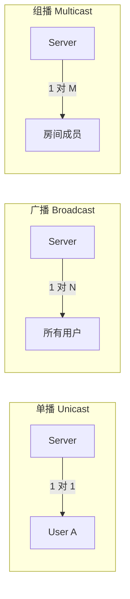
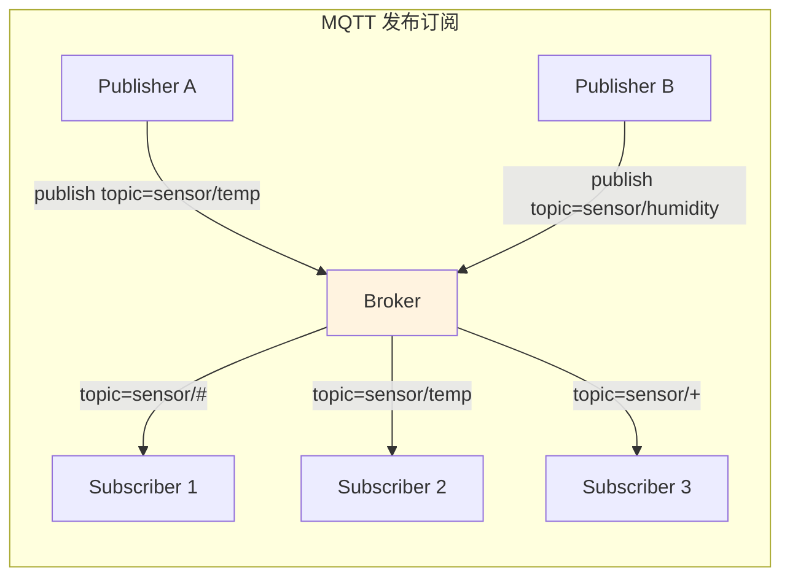
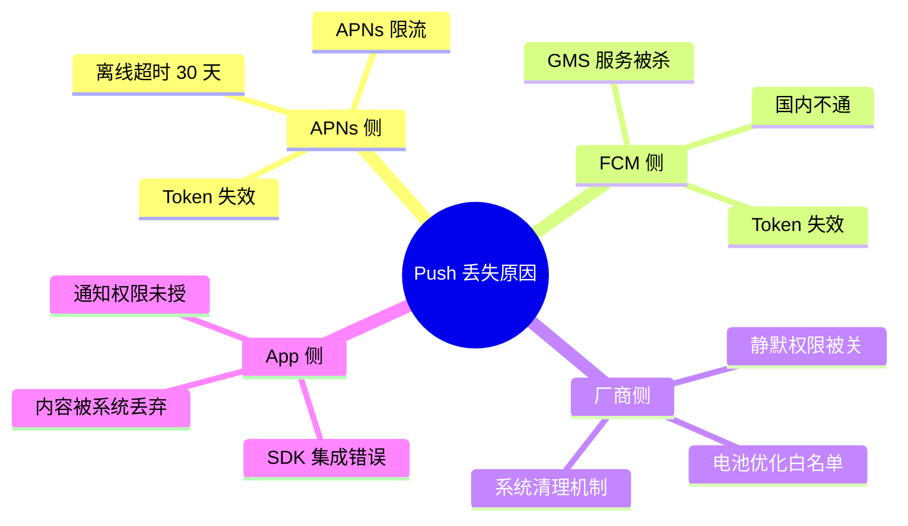
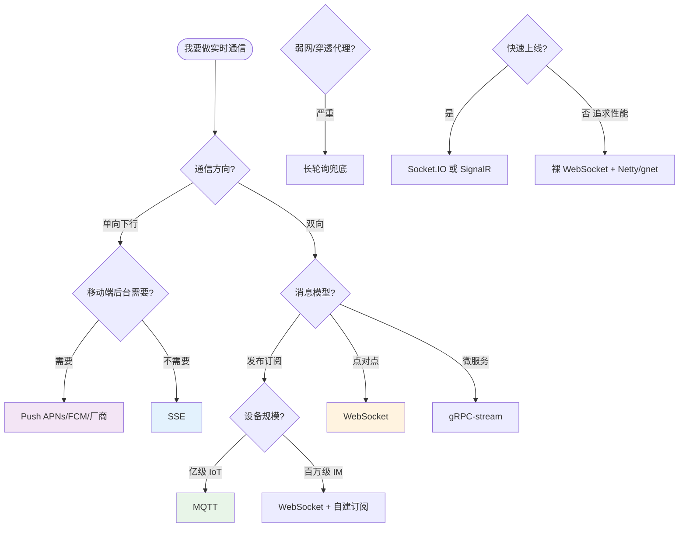

# 20.实时通信设计原理

**本篇定位**：长连接、WebSocket、MQTT、Push、SSE，这些名词在面试、方案评审、事故复盘时反复出现，但它们**到底是什么关系？谁是协议、谁是实现、谁是场景？** 

本文从一次"IM 已读回执延迟 8 秒"的真实事故讲起，从 0 到 1 讲透"服务端把消息送到客户端"这件事的所有底层技术，再回来对比 WebSocket / MQTT / SSE / HTTP2 Push / STOMP / SignalR / Socket.IO 等库/框架的边界与场景。**读完这一篇，就能在架构讨论里分清"协议 vs 库 vs 方案"。**

#### 目录介绍
- [1. 案例引入](#1-案例引入)
  - [1.1 一段离奇事故](#11-一段离奇事故)
  - [1.2 顺藤摸到根因](#12-顺藤摸到根因)
  - [1.3 我们要回答什么](#13-我们要回答什么)
- [2. 架构概览](#2-架构概览)
  - [2.1 五层通信模型](#21-五层通信模型)
  - [2.2 为什么这么切](#22-为什么这么切)
  - [2.3 架构决策三角](#23-架构决策三角)
- [3. TCP连接本质](#3-tcp连接本质)
  - [3.1 五元组即连接](#31-五元组即连接)
  - [3.2 长短连接之分](#32-长短连接之分)
  - [3.3 三次握手代价](#33-三次握手代价)
  - [3.4 NAT穿透原理](#34-nat穿透原理)
  - [3.5 单机C1M调参](#35-单机c1m调参)
- [4. 消息路由本质](#4-消息路由本质)
  - [4.1 拉推两种范式](#41-拉推两种范式)
  - [4.2 单播广播组播](#42-单播广播组播)
  - [4.3 集群路由难题](#43-集群路由难题)
  - [4.4 会话表结构](#44-会话表结构)
  - [4.5 多端在线与弱网体感](#45-多端在线与弱网体感)
- [5. 协议格式设计](#5-协议格式设计)
  - [5.1 粘包与拆包](#51-粘包与拆包)
  - [5.2 帧协议三要素](#52-帧协议三要素)
  - [5.3 文本二进制之争](#53-文本二进制之争)
  - [5.4 心跳与保活](#54-心跳与保活)
  - [5.5 断线重连的数学](#55-断线重连的数学)
- [6. WebSocket解剖](#6-websocket解剖)
  - [6.1 HTTP升级握手](#61-http升级握手)
  - [6.2 帧格式细节](#62-帧格式细节)
  - [6.3 掩码防污染](#63-掩码防污染)
  - [6.4 关闭与Ping](#64-关闭与ping)
- [7. MQTT解剖](#7-mqtt解剖)
  - [7.1 发布订阅模型](#71-发布订阅模型)
  - [7.2 QoS三级投递](#72-qos三级投递)
  - [7.3 遗嘱与保留](#73-遗嘱与保留)
  - [7.4 报文控制格式](#74-报文控制格式)
- [8. Push推送体系](#8-push推送体系)
  - [8.1 APNs工作原理](#81-apns工作原理)
  - [8.2 FCM链路解析](#82-fcm链路解析)
  - [8.3 国内厂商推送](#83-国内厂商推送)
  - [8.4 推送到达难题](#84-推送到达难题)
- [9. 方案横向对比](#9-方案横向对比)
  - [9.1 协议vs库vs方案](#91-协议vs库vs方案)
  - [9.2 六大维度对比](#92-六大维度对比)
  - [9.3 常见库源码级差异](#93-常见库源码级差异)
  - [9.4 选型决策树](#94-选型决策树)
- [10. 综合案例串讲](#10-综合案例串讲)
  - [10.1 案例真相揭晓](#101-案例真相揭晓)
  - [10.2 一条消息的一生](#102-一条消息的一生)
  - [10.3 设计哲学回扣](#103-设计哲学回扣)
  - [10.4 架构速查表](#104-架构速查表)
  - [10.5 上线Checklist](#105-上线checklist)


## 1. 案例引入

### 1.1 一段离奇事故

某社交 App 灰度上线新版 IM 后，用户反馈 **"消息发出去 8 秒对方才显示已读"**，这本该是长连接系统的荣耀舞台。运维值班调出监控发现指标"一切正常"：

```
接入层长连接数:     1200 万（稳定）
消息投递成功率:     99.98%
接入层 CPU:        45%
消息队列吞吐:       80 万/秒
```

代码里核心链路也很清爽：

```go
// im_gateway.go ， IM 长连接网关，Go + gorilla/websocket
func handleConnection(conn *websocket.Conn, userId string) {
    sessions[userId] = conn                    // 注册会话
    defer delete(sessions, userId)

    for {
        _, data, err := conn.ReadMessage()     // 接收客户端消息
        if err != nil { return }
        routeMessage(data)                     // 发消息队列
    }
}

// 投递逻辑
func deliverToUser(userId string, msg []byte) {
    if conn, ok := sessions[userId]; ok {
        conn.WriteMessage(websocket.BinaryMessage, msg)  // 一次写完
    }
}
```

**看起来毫无问题**，但用户实测就是延迟 8 秒。**协议对了、连接活着、消息发出去了，那 8 秒到底去哪了？**

### 1.2 顺藤摸到根因

带着"8 秒去哪"顺藤摸下：

- **假设 1**：是不是消息队列积压？， 看 Kafka lag 只有几百，1 秒内消化，**否定**。
- **假设 2**：是不是长连接队头阻塞？， 抓 TCP 包发现，"已读回执"发出到客户端 ACK 收到确实 8 秒；且这 8 秒内**其他消息都能实时到达**，**否定单纯队头阻塞**。
- **假设 3**：走到 TCP 层继续抓，发现异常在于："已读回执"这条消息**只有 20 字节**，被 Nagle 算法**缓存了 200ms 等待更多数据凑一个 MSS**，然后又和对端 delayed ACK（200ms）**耦合**，最终演变成 8 秒的"Nagle × delayed ACK"死锁：

```
发送端                                    接收端
  │ ─── write 20 字节 (已读回执) ─── ▶│
  │ Nagle: 未满 MSS，等 200ms         │
  │                                    │ delayed ACK: 等更多数据
  │                                    │ 或超时(200ms) 才 ACK
  │ ◀─── ACK (200ms 后) ────────────  │
  │
  ↓ 但如果发送端还没到 200ms 又调 write("你好")：
  │ Nagle: 上一次未 ACK → 继续 buffer
  │                                    │
  │ (等下一次 ACK 才能发) ...           │
  ↓ 累计延迟越来越大 → 8 秒
```

用 `tcpdump -i any -tttt port 8080 -w im.pcap` 抓包 + `wireshark` 分析：**"已读回执"每次都恰好触发 Nagle × delayed ACK 恶性组合**。

**根因**：`gorilla/websocket` 默认**没开** `TCP_NODELAY`，所以每个小消息都会走 Nagle。修复只是一行：

```go
tcpConn := conn.UnderlyingConn().(*net.TCPConn)
tcpConn.SetNoDelay(true)   // 关掉 Nagle
```

**8 秒 → 30ms**。

一次事故里至少埋着 7 个原理问题：

```
① 长连接的"连接"到底是什么? TCP、应用层、还是抽象?     → 第3章
② WebSocket 底层是 TCP 吗? 那和裸 TCP 有什么区别?     → 第3+6章
③ 消息路由到 1200 万连接是怎么做的?                   → 第4章
④ 什么是粘包/拆包? 长连接为什么会有?                  → 第5.1节
⑤ 心跳到底心跳什么? 为什么 30 秒?                     → 第5.4节
⑥ WebSocket vs MQTT vs Push vs SSE 到底谁选谁?       → 第9章
⑦ 为什么 Socket.IO 不等于 WebSocket?                → 第9.3节
```

### 1.3 我们要回答什么

本篇路线：

```
架构总览(第2章)
   ↓
TCP 连接本质 → 路由本质 → 协议格式  (第3-5章) ─→ 底层通用理论
   ↓
WebSocket 解剖 → MQTT 解剖 → Push 体系  (第6-8章) ─→ 三大方案内核
   ↓
横向对比(第9章) ─→ 分清协议/库/方案
   ↓
综合案例(第10章) ─→ 回扣事故 + 一条消息的一生
```


## 2. 架构概览

### 2.1 五层通信模型

要理解"消息如何从服务端送到客户端"，必须把栈拆到五层，因为**每一层都可能是延迟/丢消息/雪崩的元凶**：

```
┌─────────────────────────────────────────────────────────────┐
│                     实时通信五层模型                          │
│                                                              │
│  ┌────────────────────────────────────────────────────┐    │
│  │ L5 场景层：IM、直播、行情、协作、通知              │    │
│  │      表现：消息延迟、已读回执、多端同步            │    │
│  └────────────────────────────────────────────────────┘    │
│                          ▼                                   │
│  ┌────────────────────────────────────────────────────┐    │
│  │ L4 会话/路由层：sessionId → connectionId 映射      │    │
│  │      能力：路由、广播、组播、离线消息              │    │
│  └────────────────────────────────────────────────────┘    │
│                          ▼                                   │
│  ┌────────────────────────────────────────────────────┐    │
│  │ L3 应用协议层：WebSocket / MQTT / STOMP / 自定义    │    │
│  │      核心：帧格式、心跳、订阅模型、QoS             │    │
│  └────────────────────────────────────────────────────┘    │
│                          ▼                                   │
│  ┌────────────────────────────────────────────────────┐    │
│  │ L2 传输层：TCP / QUIC / UDP                        │    │
│  │      核心：连接、拥塞控制、粘包、Nagle             │    │
│  └────────────────────────────────────────────────────┘    │
│                          ▼                                   │
│  ┌────────────────────────────────────────────────────┐    │
│  │ L1 网络层：IP / NAT / LB / DNS                     │    │
│  │      核心：路由、NAT 超时、地域接入                │    │
│  └────────────────────────────────────────────────────┘    │
└─────────────────────────────────────────────────────────────┘
```

**每层的关注点**：

| 层 | 关注点 | 常见问题 |
|---|---|---|
| L5 场景 | 用户体验 | 已读延迟、消息乱序 |
| L4 会话 | 路由效率 | 跨节点消息、离线消息 |
| L3 协议 | 帧/订阅/QoS | 心跳失败、消息丢失 |
| L2 传输 | 拥塞/粘包 | Nagle 延迟、断连 |
| L1 网络 | 可达/NAT | 弱网、NAT 超时 |

### 2.2 为什么这么切

**疑惑**：为什么把通信拆成五层？直接说"用 WebSocket 就完了"不行吗？

**论证**：
1. **可替换性**：L1-L5 每一层都可被替换，L2 从 TCP 换成 QUIC，L3 从 WebSocket 换成 MQTT，业务代码（L5）**不用改**。这是分层协议的核心红利。
2. **故障定位**：本篇开篇的 8 秒延迟在 L2（Nagle），只有分层理解才能一层层排查，否则永远怀疑"WebSocket 有 bug"。
3. **可组合性**：MQTT 可以跑在 TCP 上、TLS 上、WebSocket 上（MQTT over WebSocket）；SSE 跑在 HTTP 上。**协议之间可以叠加**，只有分层才能理解这种叠加。
4. **反向验证**：Socket.IO 就是一个"跨 4 层"的作品，它在 L3 上叠加了自己的协议、L4 用了 room 概念、L1 用了 HTTP polling 兜底。理解它必须先分层。

**结论**：分层不是学术洁癖，是**能不能在事故里 30 分钟定位根因**的分水岭。下面从最底层的 TCP 开始。

### 2.3 架构决策三角

**疑惑**：分层清楚后，落地时怎么权衡？为什么"银弹方案"不存在？

**论证**：长连接/实时通信系统本质上是在**三个方向**上做联合最优化，任意两两之间都存在冲突：

```
              实时性（延迟 <100ms、消息不丢）
                     ▲
                    /│\
                   / │ \
                  /  │  \
                 / 长 │ 连\
                /  接  │ 系 \
               /   系  │  统 \
              ────────┼──────
          可用性（99.99%）    省电（心跳/流量/CPU）
        + 海量在线（千万级）
```

**三对典型冲突**：

| 决策 | 一侧收益 | 另一侧代价 |
|---|---|---|
| **推 vs 拉** | 拉（轮询）省心简单 | 实时性归零 |
| **心跳 30s vs 300s** | 300s 省电 | 掉线感知晚（NAT 超时窗外，收不到 FIN） |
| **同机路由 vs 广播路由** | 同机快 | 对端挂了消息投不出去；广播 O(N) 扇出崩 |

**结论**：**架构选择的本质，是选择"要接受哪个代价"，而不是"哪个方案最好"**：

- **IoT 场景**：省电优先，接受秒级延迟（MQTT + 长心跳）
- **IM 场景**：实时性优先，接受手机稍微费电（WebSocket + 智能心跳）
- **股票行情**：实时+可用双优先，直接砸钱堆机器
- **系统通知**：可用性优先，接受分钟级延迟（Push 兜底）

这个三角是**贯穿全篇的骨架**，后续每一节讲的具体机制（心跳周期、路由方案、协议选型），都是在这个三角上的一次落子。

> **工程落地视角**：如果你要设计一个"800 万 IoT 设备"的推送系统，本文只讲协议原理，具体的心跳错峰、退避抖动、路由中心化、多端在线等工程落地经验，请配套阅读 [09.长链接方案的设计](/pages/9746aa/)。


## 3. TCP连接本质

### 3.1 五元组即连接

**疑惑**：程序员挂在嘴上的"长连接"，操作系统里到底是什么？

**论证**：

在内核里，一个"TCP 连接"就是**五元组**（five-tuple）：

```
(源 IP, 源端口, 目的 IP, 目的端口, 协议 = TCP)
```

内核用这个五元组在 socket hash table 里查连接状态：

```c
// Linux 内核 net/ipv4/tcp_ipv4.c 简化版
struct sock* tcp_lookup(struct sk_buff* skb) {
    u32 src_ip   = ip_hdr(skb)->saddr;
    u32 dst_ip   = ip_hdr(skb)->daddr;
    u16 src_port = tcp_hdr(skb)->source;
    u16 dst_port = tcp_hdr(skb)->dest;
    
    // 用五元组哈希查表
    return __inet_lookup(net, hashinfo, src_ip, src_port, dst_ip, dst_port);
}
```

所以：
- **同一个客户端到同一个服务器可以有多个 TCP 连接**，只要源端口不同
- **服务端 65536 个连接的上限是伪命题**，上限是"同一源 IP"发到"同一服务端 IP:port"最多 65536（源端口空间限制）；总连接数只受内存与文件描述符限制
- **单机百万连接**（C10K → C1M）：给内核调大 `fs.file-max` + 每个 socket 4-8KB 内存开销 → 1M 连接 = 4-8GB 内存

### 3.2 长短连接之分

**疑惑**：长连接和短连接**在协议层没有区别**，TCP 协议里没有"长/短"字段。那"长/短"到底指什么？

**论证**：

"长/短"是**应用层的使用模式**，不是协议特性：

```
短连接：三次握手 → 一次请求/响应 → 四次挥手
   ├─ 每次请求都建连
   ├─ HTTP/1.0 默认
   └─ 每次多 1 RTT

长连接：三次握手 → 多次请求/响应 (循环) → 四次挥手
   ├─ 复用连接
   ├─ HTTP/1.1 Keep-Alive、WebSocket、MQTT
   └─ 每次只有 0 RTT（不含握手）
```

**HTTP Keep-Alive 是长连接吗？**，**技术上是**，但和"长连接系统"里的长连接**不一样**：

| 特性 | HTTP Keep-Alive | IM/推送长连接 |
|---|---|---|
| 连接持续 | 秒级（LB 默认 60s 超时） | 小时/天级 |
| 通信方向 | 单向（客户端问，服务端答） | 双向 |
| 保活 | 无 | 心跳 |
| 消息推送 | 不支持 | 核心能力 |

### 3.3 三次握手代价

**疑惑**：为什么每次握手是 1 RTT？不能更快吗？

**论证**：

标准 TCP 握手流程：

```
Client                                    Server
  │  ─── SYN, seq=x ────────────────▶│
  │                                     │
  │  ◀── SYN+ACK, seq=y, ack=x+1 ─── │
  │                                     │
  │  ─── ACK, ack=y+1 ──────────────▶│
  │                                     │
  │  ─── DATA (第一次请求可以携带) ─▶│    ← 这里已经过了 1 RTT
  ↓
   总耗时 = 1 RTT + 处理时间
```

**RTT 现实值**：

- 同机房：< 1ms
- 同城：1-10ms
- 跨省：30-50ms
- 跨国：150-300ms

**优化 1：TCP Fast Open (TFO)**，第一次握手时服务端下发 Cookie，第二次握手客户端直接在 SYN 里带数据：

```
第二次连接：
Client                                    Server
  │  ─── SYN + Cookie + DATA ──────▶│
  │                                     │  处理请求
  │  ◀── SYN+ACK + RESPONSE ────────│
   总耗时 = 0 RTT ✅
```

**优化 2：QUIC**，UDP 之上的应用层协议，握手与 TLS 合并到 0-1 RTT。HTTP/3 全面基于 QUIC。

**优化 3：连接池**，彻底避免重复握手，复用已建连接。这是所有长连接方案的核心。

### 3.4 NAT穿透原理

**疑惑**：手机 4G 网络下的长连接为什么会莫名断开？

**论证**：

移动网络的运营商 NAT 网关会给每个内网 IP 分配一个"NAT 表项"，超时后清理：

```
┌─────────────────────────────────────────────────────────┐
│               运营商 NAT 网关                            │
│                                                          │
│  NAT 表：                                                │
│  ┌─────────────────────────────────────────────────┐   │
│  │ 手机 10.0.1.1:5678 → 公网 220.181.1.1:11234    │   │
│  │ 手机 10.0.1.2:1234 → 公网 220.181.1.1:11235    │   │
│  │ ...                                              │   │
│  │ TTL: 3 分钟无流量则删除 ⚠️                      │   │
│  └─────────────────────────────────────────────────┘   │
└─────────────────────────────────────────────────────────┘

     NAT 表项被删后：
     服务端还以为连接活着，继续 send
     → 数据包到 NAT 网关，找不到映射，丢弃
     → 服务端认为发出去了，客户端却收不到
     → "半开连接" 死亡状态
```

**NAT 超时的常见值**：

| 网络 | NAT 超时 | 推荐心跳 |
|---|---|---|
| WiFi 家用路由 | 5-30 分钟 | 3 分钟 |
| 4G 运营商 | 3-5 分钟 | 2-3 分钟 |
| 5G 独立组网 | 5-10 分钟 | 3 分钟 |
| 企业 NAT | 10-30 分钟 | 5 分钟 |
| 海外/跨境 | 1-2 分钟 | 30-60 秒 |

**结论**：长连接必须心跳，心跳周期必须 < NAT 超时。这就是**心跳保活的物理根因**，不是"以防万一"，是"NAT 表会被清"。

### 3.5 单机C1M调参

**疑惑**：3.1 节讲"单机百万连接" (C1M) 是可行的，但**默认参数下真跑不起来**——为什么？瓶颈在哪一层？

**论证**：先算一笔账，**单条 TCP 连接的物理成本**：

| 资源 | 每连接开销 | 100 万连接需要 |
|---|---|---|
| 文件描述符（fd） | 1 个 | 1M（默认 65535 远不够） |
| 内核 socket 缓冲区 | 读 87KB + 写 16KB（默认） | 103 GB（吓人） |
| 应用层 Channel 对象 | Netty ≈ 2KB | 2 GB |
| epoll 红黑树节点 | ≈ 200B | 200 MB |
| **合计（理论最小）** | ≈ 105 KB | **≈ 100 GB** |

**结论**：默认参数下，单机 100 万连接需要 100GB 内存，普通机器完全扛不住。工程上必须调参。

**调参"六件套"**（长连接系统上线必调）：

```bash
# 1. 系统级 fd 上限（默认 1024，必调）
ulimit -n 2000000
echo "* soft nofile 2000000" >> /etc/security/limits.conf
echo "fs.file-max = 2000000" >> /etc/sysctl.conf

# 2. TCP 缓冲区（默认过大，长连接消息小，可以压缩）
sysctl -w net.ipv4.tcp_rmem="4096 8192 16384"     # 从 87K 压到 16K
sysctl -w net.ipv4.tcp_wmem="4096 8192 16384"

# 3. TIME_WAIT 快速回收（对客户端友好，主动断连场景关键）
sysctl -w net.ipv4.tcp_tw_reuse=1
sysctl -w net.ipv4.tcp_fin_timeout=15

# 4. SYN 队列（防握手洪水，大促/雪崩场景关键）
sysctl -w net.ipv4.tcp_max_syn_backlog=65535
sysctl -w net.core.somaxconn=65535

# 5. 端口范围（服务端不受限，但作代理时关键）
sysctl -w net.ipv4.ip_local_port_range="1024 65535"

# 6. epoll（Linux 天然支持，无需调，但要用 ET 模式）
```

**调完效果**：一台 32C64G 机器可以稳撑 **50~100 万长连接**（连接稀疏、消息量小的场景），这就是"单机 C1M（Concurrent 1 Million）"。

**C10M 的进阶路径**（想突破 C1M 到 C10M）：

| 技术 | 收益 | 代价 |
|---|---|---|
| DPDK 用户态协议栈 | 绕过内核，直接操作网卡 | 需要网卡驱动改造、部署复杂 |
| SO_REUSEPORT 多进程 | 单机多进程，每进程独立 accept | 需要业务侧支持连接复制 |
| eBPF 卸载心跳 | 心跳在内核直接响应，不进用户态 | 逻辑受限、调试难 |
| 边缘接入 + 内层聚合 | 接入层只做协议解析，业务层聚合 | 架构复杂度+1 |

**工程哲学**：多数公司选择 **单机 C1M + 横向扩展**——比死磕单机 C10M 稳、可运维、可弹性。大规模场景的正确解法通常是"扩容 + 错峰"，而不是"堆单机极限"。


## 4. 消息路由本质

### 4.1 拉推两种范式

**疑惑**：既然可以推，为什么还有拉？

**论证**，四个真实约束（前一篇已提，此处从"通信范式"再拆一层）：

```
拉模型（Pull）:
  客户端主动 → 服务端被动响应
  ├─ 优点：无状态、易水平扩展
  ├─ 缺点：延迟 = 轮询间隔
  └─ 典型：HTTP 短轮询、REST API

推模型（Push）:
  服务端主动 → 客户端被动接收
  ├─ 优点：延迟 → 0
  ├─ 缺点：状态化（要维护连接）、扩展难
  └─ 典型：WebSocket、MQTT、SSE

半推半拉（Long Poll）:
  客户端问 → 服务端 hold → 有数据才响应
  ├─ 无状态（连接是短的）+ 准实时
  └─ 典型：Comet、部分 IM 协议
```

**关键洞察**：**"推"的所有难题最终都归结为一件事，如何在服务端维护"用户 → 连接"的映射**。这就是下一节的核心。

### 4.2 单播广播组播

**疑惑**：一条消息到底"发给谁"？

**论证**，三种基本投递模式：



| 模式 | 应用场景 | 关键数据结构 |
|---|---|---|
| 单播 | 私聊、订单状态 | `Map<userId, connection>` |
| 广播 | 全站公告、系统通知 | 遍历所有连接 |
| 组播 | 群聊、直播弹幕、协作 | `Map<roomId, Set<connection>>` |

**扩展关系**：

$$
\text{广播} \subseteq \text{组播}(\text{room="all"}) \subseteq \text{单播}(\text{批量})
$$

工业上都归结为**"根据订阅关系找连接列表 → 遍历发送"**，这就是所有 pub/sub 系统的核心。

### 4.3 集群路由难题

**疑惑**：1200 万连接不可能落在一台服务器上，一定要集群。集群里"发给 userA"怎么找到 userA 的连接在哪台机器？

**论证**，三种主流架构：

**方案 A：集中式路由表（Redis 存 userId → nodeId）**

```
┌────────┐
│Client A│──── 连到 node1 ────┐
└────────┘                     │
                               ▼
                        ┌──────────────┐
                        │   node1      │
                        └──┬───────────┘
                           │ 注册
                           ▼
                    ┌──────────────┐
                    │ Redis 路由表 │
                    │ userA→node1 │
                    │ userB→node2 │
                    └──────┬───────┘
                           ▲ 查询
                           │
                        ┌──┴──────┐
业务想发消息给 userA →  │ Gateway │
                        └─────────┘
                             │
                        转发 node1 ─▶ userA
```

**方案 B：一致性哈希（Session Affinity）**

```
所有 node 环形分布：
node1 ─── node2 ─── node3 ─── node4 ─── (环)

userA 的 hash → 落在 node1 与 node2 之间 → node2 负责
业务想发给 userA → hash(userA) → node2 → 转发

优点：无需 Redis 路由表
缺点：node 上下线时会有一段"路由抖动"（用 vnode 环缓解）
```

**方案 C：广播路由（Fanout）**

```
业务想发给 userA → 广播到所有 node → 只有存 userA 的 node 转发
优点：最简单
缺点：node 之间流量 N×N，规模大时爆炸
```

**规模对比**：

| 方案 | 连接规模 | 缺点 |
|---|---|---|
| 集中式 | 千万级 | Redis 单点、路由表压力 |
| 一致性哈希 | 亿级 | 迁移抖动 |
| 广播路由 | 十万级 | 内部流量爆炸 |

**实战选型**：**微信选一致性哈希**，**滴滴选集中式（Redis Cluster）**，**Discord 选一致性哈希 + 房间广播分区**。

### 4.4 会话表结构

**疑惑**：路由表在内存里到底长什么样？

**论证**，一个可上线的会话表设计：

```go
// SessionRegistry ， 单机会话管理
type SessionRegistry struct {
    // 用户 → 连接列表（一个用户多端登录 = 多个连接）
    userConns sync.Map  // userId → *ConnSet
    // 房间 → 连接列表
    roomConns sync.Map  // roomId → *ConnSet
    // 连接 ID → 元数据（反查用）
    connMeta  sync.Map  // connId → *ConnMeta
}

type ConnMeta struct {
    UserId    string
    DeviceId  string
    Platform  string          // iOS/Android/Web
    Rooms     []string        // 加入的房间列表
    Conn      *websocket.Conn
    LastActive int64
}

type ConnSet struct {
    mu sync.RWMutex
    conns map[string]*ConnMeta  // connId → meta
}

// 消息投递
func (r *SessionRegistry) SendToUser(userId string, msg []byte) int {
    v, ok := r.userConns.Load(userId)
    if !ok { return 0 }
    set := v.(*ConnSet)
    set.mu.RLock()
    defer set.mu.RUnlock()
    
    sent := 0
    for _, meta := range set.conns {
        select {
        case meta.SendChan <- msg:   // ⚠️ 用 channel 异步，防慢客户端阻塞
            sent++
        default:
            // channel 满 → 慢客户端 → 断开
            r.forceClose(meta.ConnId)
        }
    }
    return sent
}
```

**关键设计点**：
- **一个用户多端** → `userConns` 是 `userId → Set<Conn>`
- **channel 异步写** → 防止一个慢客户端拖垮整个 goroutine
- **反查 connId → meta** → 断连时清理各种索引
- **本地表 + Redis 全局路由表** → 集群工作

### 4.5 多端在线与弱网体感

**疑惑**：4.4 节的会话表已经把 `userId → Set<Conn>` 的数据结构讲清楚了，但**同一条消息该只发一份还是发四份？弱网频繁抖动，为什么用户还觉得"一直在线"？**

**论证一：多端在线的三种投递策略**

| 策略 | 语义 | 场景 |
|---|---|---|
| **全端投递** | 所有在线端都收到 | 微信 IM（消息漫游） |
| **单端投递** | 只发给主设备（最近活跃的） | 部分银行 App（只推手机不推 PC） |
| **智能投递** | PC 活跃时不推手机（避免打扰） | 钉钉、飞书 |

**全端投递的会话表结构**：

```
key: session:userId:{123}
value: hash {
    "iOS":     { "gateNode": "gate-01", "connectionId": "..." },
    "Android": { "gateNode": "gate-05", "connectionId": "..." },
    "PC":      { "gateNode": "gate-02", "connectionId": "..." }
}
```

投递时**遍历所有端**，每端独立跟踪 ACK 与已读状态。**已读同步**（一端读了另一端也变已读）通过额外的"已读消息广播"实现——本质是把"用户"从"连接"里解耦出来。

**论证二：弱网体感的"一直在线"错觉**

弱网场景（信号 2 格、地铁、电梯）的核心矛盾：**连接会频繁断，但用户不想看到"连接中……"**。业界通用解法：

1. **UI 与连接解耦**：客户端 SDK 内部维护连接状态机，UI 层**只看"消息队列"是否有积压**——只要发送队列在推进，UI 就显示"在线"。
2. **发送即入队**：用户点发送时，消息**立刻入本地待发送队列并显示在会话列表**（带"发送中"角标），SDK 异步保证送达。
3. **快速切换网络**：Wi-Fi ↔ 4G 切换时，客户端**不等旧连接超时**，检测到 `NetworkChanged` 立即主动断开 + 重连（业务无感）。
4. **背景保活**：iOS 后台通过 PushKit VoIP、Android 通过厂商推送通道（华为/小米/OPPO Push）**保底**——长连接不通就走 Push（详见 §8）。

**核心哲学**：**"连接是资源，不是实体"**——一条 TCP 连接不代表"用户在线"。用户是**逻辑实体**，连接只是它的**当前化身**。任何设计都要允许连接消失、迁移、重建，不能把业务状态挂在连接对象上。

**结论**：用户体感的"一直在线"，是**多重通道兜底 + 客户端 SDK 智能重连 + UI 状态解耦**共同作用的结果，任何单一手段都不够。


## 5. 协议格式设计

### 5.1 粘包与拆包

**疑惑**：TCP 是"字节流"，发一条 200 字节的消息，为什么接收方可能收到"半条 + 半条"或者"两条一起"？

**论证**：

**TCP 没有"消息"概念**，它只保证字节顺序和不丢，**不保证读一次 = 写一次**：

```
发送端 3 次 write:
  write("HELLO")      5 字节
  write("WORLD")      5 字节
  write("BYE")        3 字节

接收端可能的 recv 结果：
  ① recv → "HELLOWORLDBYE"     一次收全（粘包）
  ② recv → "HELLO", "WORLDBYE" 两次拆开
  ③ recv → "HEL", "LOWORLD", "BYE"  拆得更碎
  ④ recv → "HELLOWORL", "DBYE" 混合
```

**根因**：内核有发送缓冲区、Nagle 算法、MTU 分片、接收缓冲区，**任何一个环节都可能重组数据**。

**解决，在字节流上"人工"分帧**：

```
┌────────────┬─────────┬─────────┐
│ Magic (2B) │ Len (4B)│ Payload │
└────────────┴─────────┴─────────┘
    魔数        长度      数据

接收端：
  1. 读 6 字节头
  2. 校验魔数（不匹配 → 断连，防错误协议）
  3. 从 len 字段知道 payload 长度
  4. 读 len 字节 payload
  5. 拼装完成 → 一条消息
```

### 5.2 帧协议三要素

**疑惑**：帧协议除了长度还需要什么？

**论证**，一个健壮的帧协议至少三要素：

```
┌────────┬───────┬────────┬────────┬─────────┬────────┐
│ Magic  │ Ver   │ Type   │ Len    │ Payload │ CRC    │
│  2B    │ 1B    │  1B    │  4B    │   ...   │  4B    │
└────────┴───────┴────────┴────────┴─────────┴────────┘
```

| 字段 | 作用 | 必要性 |
|---|---|---|
| **Magic** | 快速识别协议、防错连 | ⭐⭐⭐ |
| **Version** | 协议演进 | ⭐⭐⭐ |
| **Type** | 消息类型（登录/聊天/心跳/ACK） | ⭐⭐⭐ |
| **Len** | 分帧关键 | ⭐⭐⭐ |
| **Payload** | 业务数据 | ⭐⭐⭐ |
| **CRC/Checksum** | 防篡改/防错传 | ⭐⭐ |

**Netty 的现成组件**：

```java
public class MyProtocolDecoder extends LengthFieldBasedFrameDecoder {
    public MyProtocolDecoder() {
        super(
            /* maxFrameLength    */ 16 * 1024 * 1024,  // 16MB 上限
            /* lengthFieldOffset */ 4,                  // Magic(2) + Ver(1) + Type(1) 之后
            /* lengthFieldLength */ 4,
            /* lengthAdjustment  */ 0,
            /* initialBytesToStrip */ 0
        );
    }
}
```

**WebSocket / MQTT / HTTP2 每个都有自己的帧协议**，我们下面就拆它们。

### 5.3 文本二进制之争

**疑惑**：JSON、Protobuf、CBOR、FlatBuffers，到底怎么选？

**论证**：

| 格式 | 编码后大小 | 编解码性能 | 可读性 | 跨语言 |
|---|---|---|---|---|
| **JSON** | 100% | 中等 | ⭐⭐⭐⭐⭐ | ⭐⭐⭐⭐⭐ |
| **XML** | 150-200% | 慢 | ⭐⭐⭐ | ⭐⭐⭐⭐ |
| **Protobuf** | 20-40% | 快 | ⭐ | ⭐⭐⭐⭐⭐ |
| **CBOR** | 50-70% | 快 | ⭐⭐ | ⭐⭐⭐⭐ |
| **FlatBuffers** | 60-80% | **零拷贝** | ⭐ | ⭐⭐⭐⭐ |
| **MessagePack** | 40-60% | 快 | ⭐⭐ | ⭐⭐⭐⭐ |

**实测**（1KB JSON 编码为 Protobuf 是 300 字节，5 万 QPS 场景）：

| 指标 | JSON | Protobuf |
|---|---|---|
| 带宽 | 50 MB/s | 15 MB/s |
| CPU（编码） | 30% | 8% |
| CPU（解码） | 40% | 10% |
| 消息延迟 P99 | 25ms | 8ms |

**结论**：
- **管理接口/低频调试**：JSON
- **IM/推送高频**：Protobuf
- **超大消息（几 MB+）**：FlatBuffers（零拷贝）
- **物联网低功耗**：CBOR（MQTT 官方推荐）

### 5.4 心跳与保活

**疑惑**：心跳到底"心跳什么"？

**论证**，心跳承担的**三重职责**：

```
① NAT 保活：让 NAT 表项不过期     → 第 3.4 节
② 死亡检测：发现半开连接           → 
③ 双向探活：客户端和服务端互相确认
```

**心跳的实现**，通常是**协议里的一种特殊消息类型**：

```
WebSocket:   Ping (0x9) / Pong (0xA) 内建帧
MQTT:        PINGREQ / PINGRESP 报文
自定义协议：  Type=0x01 (heartbeat) 特殊类型
HTTP2:       PING 帧
```

**心跳周期设计**：

```
NAT 超时约束下的心跳窗口:

  NAT_TIMEOUT
  ├─── 90% ────┤
  │            │
  ├─ heartbeat 触发 ─┤
  0            T*0.9   NAT_TIMEOUT
  
  心跳周期 T = NAT_TIMEOUT * 0.7 ~ 0.9
```

**具体值**：

| 网络 | NAT 超时 | 心跳周期 |
|---|---|---|
| WiFi | 5-30 min | 3 min |
| 4G | 3-5 min | 2-3 min |
| 弱网 | 1-2 min | 30-60 sec |
| 后台 | - | 5-10 min（省电优先） |

**智能心跳**，微信的经典做法：

```
初始心跳: 4.5 分钟
   ↓ 成功
下次: 5 分钟（+30 秒探测）
   ↓ 成功
下次: 5.5 分钟
   ↓ ...
   ↓ 失败（NAT 已 timeout）
回退: 上次成功的周期（e.g. 5 分钟）
   ↓ 稳定使用这个周期
```

**收益**：普通固定 3 分钟心跳的功耗，微信智能心跳可以降到 5 分钟，**电池省 40%**。

### 5.5 断线重连的数学

**疑惑**：心跳保活是"防连接被回收"，但**连接真断了怎么办？重连是不是很简单——加个定时器 1 秒重试一次就行**？

**论证**：**恰恰相反**——重连是长连接系统最容易翻车的地方。想象一下：800 万台设备同时断连，每台都以 1 秒频率狂重连，这就是**"800 万台自研 DDoS"**——服务端瞬间 800 万 QPS，扛不住就集体雪崩。

**任何生产级重连都由三个正交机制组合**：

1. **指数退避（Exponential Backoff）**：`interval = min(base × 2^n, cap)`
2. **随机抖动（Jitter）**：`interval = interval × (1 + rand(-0.5, 0.5))`
3. **上限截断（Cap）**：`interval ≤ 60s`

**为什么必须"退避+抖动"缺一不可？** 用数学证明：假设 N 个客户端同时断连，我们想让服务端**每秒重连 QPS ≤ M**。

**方案 A：固定 1 秒重连**（新手做法）
- `t=1` 时刻 QPS = N。**必炸**。

**方案 B：只指数退避不抖动**
- 所有客户端都是 `1, 2, 4, 8, 16, ...`
- QPS 分布：t=1 时 N，t=3 时 N，t=7 时 N……
- **峰值 QPS 不变**，只是把炸的时间点推后了。

**方案 C：只随机不退避**
- `interval = rand(0, 60s)`
- 首波 QPS = N/60，看似平稳
- 但**如果服务端首波扛不住，客户端会不断重连**，每分钟都是 N/60，稳态 QPS = N/60
- **规模够大照样炸**。

**方案 D：退避 + 抖动**（唯一正解）
- 第 n 轮重连时刻分布在 $[base \cdot 2^{n-1}, base \cdot 2^n]$
- **每一轮的窗口越来越宽**，QPS 随时间指数衰减
- **同一轮内 QPS 均匀分布**
- 这才是数学上无懈可击的方案。

**标准实现（Java 参考）**：

```java
public class ReconnectStrategy {
    private static final long BASE_INTERVAL = 1000;   // 1s
    private static final long CAP = 60_000;            // 60s
    private int attempts = 0;

    public long nextDelay() {
        // 1. 指数退避
        long backoff = Math.min(BASE_INTERVAL * (1L << Math.min(attempts, 10)), CAP);

        // 2. 抖动：full jitter 或 equal jitter
        // Full jitter：区间 [0, backoff]  ── AWS 推荐，最激进的打散
        long delay = (long)(Math.random() * backoff);

        // 或者 Equal jitter：区间 [backoff/2, backoff] ── 更保守
        // long delay = backoff / 2 + (long)(Math.random() * backoff / 2);

        attempts++;
        return delay;
    }

    public void onConnectSuccess() {
        attempts = 0;  // 关键：成功后必须重置
    }
}
```

**三个容易踩的坑**：

- `attempts` 用 `Math.min(attempts, 10)` 防止 `1L << 63` **整型溢出**。
- 成功连接后**必须重置** `attempts`——否则一次网络抖动会永久拉高退避。
- 首次断连可以不退避（`attempts=0` 时立即重试一次），**提升用户体感**。

**进阶：服务端引导重连**

真正大规模的做法是**服务端主动引导重连时机**。当接入层过载时，服务端不是直接断开，而是返回：

```json
{ "action": "reconnect", "after_ms": 30000, "target": "gate-cluster-b.example.com" }
```

客户端遵循 `after_ms` 延迟，甚至**切到另一个集群**。这就是"**优雅降级 + 引流**"，微信、支付宝都在用。

**核心哲学**：**"客户端是不可信的定时器"**——N 个客户端的定时器天然同步（都从 T0 开始计时），任何"每 X 秒做一次 Y"的行为都会形成尖峰。**永远加抖动、永远做退避、永远设上限**，这是长连接工程师的三大铁律。


## 6. WebSocket解剖

### 6.1 HTTP升级握手

**疑惑**：WebSocket 底层是 TCP，为什么要先发 HTTP？

**论证**：

WebSocket 复用 HTTP 端口（80/443）的核心目的是**穿透企业防火墙**，大部分企业防火墙允许 80/443 出站，但屏蔽自定义端口。

握手流程：

```
Client                                    Server
  │  ─── HTTP GET Upgrade ─────────────▶│
  │                                       │
  │  GET /chat HTTP/1.1                   │
  │  Host: server.com                     │
  │  Upgrade: websocket                   │
  │  Connection: Upgrade                  │
  │  Sec-WebSocket-Key: dGhlIHNhbXBs...   │  ← 客户端随机
  │  Sec-WebSocket-Version: 13            │
  │                                       │
  │  ◀── HTTP 101 Switching Protocols ── │
  │                                       │
  │  HTTP/1.1 101 Switching Protocols     │
  │  Upgrade: websocket                   │
  │  Connection: Upgrade                  │
  │  Sec-WebSocket-Accept: s3pPLMBiTxa... │  ← key 计算得来
  │                                       │
  │  ─────  从此以后是 WebSocket 帧  ───▶│
  │  ◀─────────────────────────────────  │
```

**`Sec-WebSocket-Accept` 计算方式**：

```
concat(Sec-WebSocket-Key, "258EAFA5-E914-47DA-95CA-C5AB0DC85B11")  
   ↓ SHA-1
   ↓ Base64
= Sec-WebSocket-Accept
```

那串 GUID 是 RFC 6455 固定值，**唯一目的是"证明服务端真的懂 WebSocket 协议"**，防止 HTTP 服务器意外返回 101。

### 6.2 帧格式细节

**疑惑**：WebSocket 帧长什么样？

**论证**，RFC 6455 帧格式：

```
 0                   1                   2                   3
 0 1 2 3 4 5 6 7 8 9 0 1 2 3 4 5 6 7 8 9 0 1 2 3 4 5 6 7 8 9 0 1
+-+-+-+-+-------+-+-------------+-------------------------------+
|F|R|R|R| opcode|M| Payload len |    Extended payload length    |
|I|S|S|S|  (4)  |A|     (7)     |             (16/64)           |
|N|V|V|V|       |S|             |   (if payload len==126/127)   |
| |1|2|3|       |K|             |                               |
+-+-+-+-+-------+-+-------------+-------------------------------+
|     Extended payload length continued, if payload len == 127  |
+---------------------------------------------------------------+
|                               |Masking-key, if MASK set to 1  |
+-------------------------------+-------------------------------+
|    Masking-key (continued)    |          Payload Data         |
+-------------------------------- - - - - - - - - - - - - - - - +
:                     Payload Data continued ...                :
+ - - - - - - - - - - - - - - - - - - - - - - - - - - - - - - - +
|                     Payload Data continued ...                |
+---------------------------------------------------------------+
```

**关键字段**：

| 字段 | 长度 | 含义 |
|---|---|---|
| FIN | 1 bit | 是否最后一帧（分片时用） |
| RSV1-3 | 3 bit | 保留（协议扩展用，如压缩） |
| Opcode | 4 bit | 0x0=continuation, 0x1=text, 0x2=binary, 0x8=close, 0x9=ping, 0xA=pong |
| MASK | 1 bit | 客户端→服务端必须 1，反向必须 0 |
| Payload Len | 7-71 bit | 变长编码：≤125 直接 7bit；126→后 16bit；127→后 64bit |
| Masking-key | 32 bit | 若 MASK=1 |
| Payload | 变长 | 载荷 |

**帧头开销**：最小 2 字节（无掩码 + 短消息）、最大 14 字节。**比 HTTP header 小两个数量级**。

### 6.3 掩码防污染

**疑惑**：为什么客户端必须给消息加掩码（MASK=1）？服务端反向反而不用？

**论证**，历史包袱：

RFC 6455 制定时（2011），发现了一个攻击：**恶意 JS 在浏览器里发 WebSocket 消息，如果没掩码，中间某些"透明代理"（Squid 等）可能把 WebSocket 帧误认为是 HTTP 缓存指令**，从而毒化下游代理的缓存。

**掩码算法**（RFC 6455 §5.3）：

```javascript
// 客户端发送时
const maskingKey = randomBytes(4);  // 32 bit 随机
for (let i = 0; i < payload.length; i++) {
    payload[i] ^= maskingKey[i % 4];  // XOR
}

// 服务端解掩：同样的 XOR（异或的自逆性）
```

**代价**：客户端每字节多一次 XOR，**吞吐略降**。所以 Node.js 上高性能 WebSocket 服务端会显式关掩码校验（如果客户端可信），但**这已经不是标准 WebSocket 了**。

**结论**：客户端掩码是**为了不信任的浏览器环境**，服务端已经是可信的，反向没必要。

### 6.4 关闭与Ping

**疑惑**：WebSocket 怎么优雅关闭？

**论证**，**Close 帧**（opcode 0x8）：

```
关闭流程:
  A → B: Close 帧 (code=1000, reason="normal closure")
  B → A: Close 帧 (code=1000)     ← 回应
  A: 关闭 TCP
  B: 关闭 TCP
```

**关闭状态码**（RFC 6455 §7.4）：

| Code | 含义 |
|---|---|
| 1000 | Normal Closure |
| 1001 | Going Away（服务端重启） |
| 1002 | Protocol Error |
| 1003 | Unsupported Data |
| 1006 | Abnormal Closure（TCP RST，客户端强制标记） |
| 1008 | Policy Violation |
| 1011 | Server Error |

**Ping / Pong 帧**（opcode 0x9 / 0xA）：

- 任一方发 Ping，对方**必须**回 Pong
- Pong 可以主动发（"unsolicited pong"），对方**必须**忽略
- Ping 里可带 0-125 字节数据，Pong 里必须**原样**返回

**心跳最佳实践**：

```javascript
// 客户端
setInterval(() => {
    if (ws.readyState === WebSocket.OPEN) {
        ws.ping(Date.now().toString());  // 带时间戳
    }
}, 30_000);

ws.on('pong', (data) => {
    const rtt = Date.now() - parseInt(data);
    console.log(`RTT: ${rtt}ms`);        // 顺便测 RTT
});

// 服务端
ws.on('ping', (data) => {
    // 自动 pong（大部分库默认行为）
    // 记录上次活跃时间
    lastActive = Date.now();
});
```


## 7. MQTT解剖

### 7.1 发布订阅模型

**疑惑**：MQTT 和 WebSocket 都是"长连接"，为什么还需要 MQTT？

**论证**，**MQTT 天然是发布订阅模型，且专为不稳定网络设计**：



**核心概念**：

- **Topic**：分层路径 `home/livingroom/temperature`
- **通配符**：`+`（单层）、`#`（多层）
- **Broker**：中心化的消息路由服务器
- **QoS**：三级投递保证

**MQTT 3.1.1 与 5.0**：

| 特性 | MQTT 3.1.1 | MQTT 5.0 |
|---|---|---|
| 发布 | 支持 | 支持 + Reason Code |
| 遗嘱 | 支持 | 支持 + 延迟遗嘱 |
| 保留消息 | 支持 | 支持 |
| 共享订阅 | 不支持 | ✅ 支持 |
| 请求响应 | 不支持 | ✅ 支持 |
| Session Expiry | 不支持 | ✅ 支持 |

### 7.2 QoS三级投递

**疑惑**：MQTT 的 QoS 0/1/2 到底什么区别？

**论证**，三种投递保证：

**QoS 0：至多一次（At most once）**

```
Publisher ──PUBLISH──▶ Broker ──PUBLISH──▶ Subscriber
   一次即完      不确认        一次即完
   
   ↓ 场景：传感器数据（丢一两个无所谓）
   ↓ 特点：性能最高、可能丢消息
```

**QoS 1：至少一次（At least once）**

```
Publisher ──PUBLISH────▶ Broker ──PUBLISH────▶ Subscriber
                          │                     │
Publisher ◀──PUBACK────── │  ◀──PUBACK──────── │
                          
   ↓ 场景：命令下发（丢了要重发）
   ↓ 特点：可能重复投递（幂等性由业务保证）
```

**QoS 2：恰好一次（Exactly once）**

```
Publisher ──PUBLISH────▶ Broker
Publisher ◀──PUBREC──── Broker
Publisher ──PUBREL────▶ Broker
Publisher ◀──PUBCOMP── Broker
                        (然后再到 Subscriber，4 步握手)

   ↓ 场景：金融交易、订单
   ↓ 特点：4 次交互，性能最低
```

**性能对比**（相同硬件）：

| QoS | 吞吐 | 单消息 RTT | 存储需求 |
|---|---|---|---|
| 0 | 100 万/秒 | 5ms | 无 |
| 1 | 30 万/秒 | 15ms | 客户端 outbox |
| 2 | 5 万/秒 | 40ms | 双端持久化 |

### 7.3 遗嘱与保留

**疑惑**：设备断电了怎么通知其他订阅者？

**论证**，**Last Will（遗嘱消息）**：

```
连接时告诉 Broker：
  "如果我异常断开，请代我发布 topic=device/status, payload=offline"

设备正常断开: DISCONNECT 报文 → 遗嘱不触发
设备异常断开: 心跳超时/RST     → Broker 代发遗嘱
```

**Retained Message（保留消息）**：

```
Publisher ──PUBLISH (retain=1) topic=status──▶ Broker
                                                 │
                                                 │ 存下来
                                                 │
后续新订阅者订阅 topic=status ──▶ Broker ─PUBLISH─▶ 新订阅者
                                    立即拿到最后一条保留消息
```

**典型用途**：

- **在线状态**：`retain=1, payload=online`，新订阅者立即知道设备状态
- **配置下发**：`retain=1, payload=<config>`，新设备连上立即拿到最新配置

### 7.4 报文控制格式

**疑惑**：MQTT 报文长什么样？

**论证**，MQTT 报文头部**极简**（IoT 场景对包大小极敏感）：

```
固定头 (2-5 字节):
┌─────────────────┬─────────────────┐
│ Msg Type + Flag │ Remaining Length│
│      1 字节      │   1-4 字节      │
└─────────────────┴─────────────────┘

Msg Type (4 bit):
  1  CONNECT       连接
  2  CONNACK       连接确认
  3  PUBLISH       发布
  4  PUBACK        发布确认
  5  PUBREC        QoS2 收到
  6  PUBREL        QoS2 释放
  7  PUBCOMP       QoS2 完成
  8  SUBSCRIBE     订阅
  9  SUBACK        订阅确认
  10 UNSUBSCRIBE   取消订阅
  12 PINGREQ       心跳请求
  13 PINGRESP      心跳响应
  14 DISCONNECT    断开
```

**Remaining Length 变长编码**（VBI - Variable Byte Integer），低 7 bit 存数据，高 1 bit 标记"还有下一字节"：

```
0-127 bytes:              1 字节  ── payload len ≤ 127
128-16383 bytes:          2 字节  ── payload len ≤ 16 KB
16384-2097151 bytes:      3 字节  ── payload len ≤ 2 MB
2097152-268435455 bytes:  4 字节  ── payload len ≤ 256 MB
```

**极致精简**：最小 MQTT 报文 = 2 字节（PINGREQ / PINGRESP），**比 HTTP header 短 100 倍**。这就是为什么它是 IoT 的默认协议。


## 8. Push推送体系

### 8.1 APNs工作原理

**疑惑**：iOS 后台被杀了，为什么还能收到 Push？

**论证**，**手机操作系统级别的长连接**：

```
┌─────────────────────────────────────────────────────────────┐
│                     APNs 推送链路                            │
│                                                              │
│   业务服务器                                                  │
│      │                                                       │
│      │ HTTP/2 POST + JWT/证书                               │
│      ▼                                                       │
│   ┌────────────┐                                            │
│   │ APNs 网关  │  (Apple 的推送服务器)                      │
│   └────┬───────┘                                            │
│        │                                                     │
│        │ 系统级长连接（不是 App 建的）                       │
│        ▼                                                     │
│   ┌─────────────────┐                                       │
│   │  iOS 系统进程   │                                       │
│   │  (SpringBoard/  │                                       │
│   │   dasd/apsd)    │                                       │
│   └────┬────────────┘                                       │
│        │ 系统事件唤醒                                        │
│        ▼                                                     │
│   目标 App                                                   │
│        │                                                     │
│        ▼                                                     │
│   用户看到通知栏 / 唤醒 App                                  │
└─────────────────────────────────────────────────────────────┘
```

**关键点**：
- **iOS 系统进程 apsd 维护到 APNs 的持久 TLS 长连接**，App 被杀不影响
- **业务服务器 → APNs 用 HTTP/2**（2016 起，之前是二进制协议）
- **JWT/证书鉴权**，每次 POST 带 token 或用 mTLS
- **优先级**：`apns-priority: 5` 普通、`10` 立即（会打开屏幕）

### 8.2 FCM链路解析

Android 上对应的是 **Firebase Cloud Messaging（FCM）**：

```
业务服务器 ──HTTPS──▶ FCM ──长连接──▶ Google Play 服务 ──▶ 目标 App
```

**差异点**：
- Android 上 GMS（Google Play 服务）维护到 FCM 的长连接
- **国内不能用 FCM**（不通）
- 消息类型：**Notification Message**（系统托管展示）vs **Data Message**（App 自己处理）

### 8.3 国内厂商推送

**疑惑**：国内 Android 不能用 FCM，怎么办？

**论证**，**厂商推送**：小米、华为、OPPO、VIVO 各自维护自己的推送通道，App 需要**分厂商适配**：

```
┌──────────────────────────────────────────────────┐
│               国内 Android 推送体系                │
│                                                    │
│   业务服务器                                       │
│      │                                             │
│      ├── 小米手机  → 小米推送 (MiPush)            │
│      ├── 华为手机  → 华为推送 (HMS Push Kit)      │
│      ├── OPPO 手机 → OPPO 推送 (HeytapPush)       │
│      ├── VIVO 手机 → VIVO 推送 (VPush)            │
│      └── 其他手机  → 应用长连接（自建）            │
│                                                    │
│   聚合方案：                                       │
│   ├─ 极光推送 JPush                                │
│   ├─ 个推 GeTui                                   │
│   ├─ 友盟 UPush                                   │
│   └─ 优势：一套 SDK 屏蔽差异                       │
└──────────────────────────────────────────────────┘
```

**厂商通道优势**：
- **杀不死**，系统级别，用户不能"完全退出"
- **免续费**，不需要 App 自建长连接、省电

**代价**：
- 每家 SDK 都要接
- 消息内容审核（不能推广告/敏感词）
- **单日推送量限制**（每家 1-10 万免费）

### 8.4 推送到达难题

**疑惑**：Push 到达率是不是 100%？

**论证**，**到达率行业均值 60-80%**，失败原因：



**提高到达率**，**多通道 + 兜底**：

```
优先级：厂商推送 → Push（APNs/FCM） → 应用长连接 → 短信

到达 → 停止
未到达 → 降级下一通道
```

**"离线消息保底"**：服务端保存最近 N 天消息，用户 App 打开时**主动拉取**，这样即使 Push 全部失败，也不会永久丢消息。


## 9. 方案横向对比

### 9.1 协议vs库vs方案

**疑惑**：WebSocket、Socket.IO、SignalR、Netty、gorilla/websocket，这些到底是同一层的东西吗？

**论证**，**必须严格分清**：

| 分类 | 定义 | 例子 |
|---|---|---|
| **协议 (Protocol)** | RFC 标准、跨语言可实现 | WebSocket (RFC 6455)、MQTT (OASIS)、HTTP/2 |
| **库 (Library)** | 某语言里协议的实现 | gorilla/websocket、Netty、Autobahn |
| **框架 (Framework)** | 协议 + 应用层抽象 | Socket.IO、SignalR、STOMP、SockJS |
| **方案 (Solution)** | 完整推送/IM 系统 | RocketMQ Push、Ably、Pusher、腾讯 TIM、环信 |

```
┌───────────────────────────────────────────────────┐
│                                                    │
│  方案层：完整 IM/推送系统                          │
│  ┌──────────────────────────────────────────┐    │
│  │ Ably │ Pusher │ 腾讯 TIM │ 环信 │ Firebase │    │
│  └──────────────────────────────────────────┘    │
│                    ▲                              │
│  框架层：应用抽象                                  │
│  ┌──────────────────────────────────────────┐    │
│  │ Socket.IO │ SignalR │ STOMP │ SockJS      │    │
│  └──────────────────────────────────────────┘    │
│                    ▲                              │
│  库层：协议实现                                    │
│  ┌──────────────────────────────────────────┐    │
│  │ Netty │ gorilla/websocket │ paho MQTT     │    │
│  └──────────────────────────────────────────┘    │
│                    ▲                              │
│  协议层：跨语言标准                                │
│  ┌──────────────────────────────────────────┐    │
│  │ WebSocket │ MQTT │ HTTP/2 │ SSE │ gRPC     │    │
│  └──────────────────────────────────────────┘    │
│                                                    │
└───────────────────────────────────────────────────┘
```

### 9.2 六大维度对比

主流方案六维度对比：

| 维度 | 长轮询 | SSE | WebSocket | MQTT | Push (APNs/FCM) | gRPC-stream |
|---|---|---|---|---|---|---|
| **传输方向** | 半双工 | 单向下行 | 全双工 | 全双工 | 单向下行 | 全双工 |
| **底层协议** | HTTP/1.1 | HTTP/1.1 | TCP (HTTP 握手) | TCP | HTTP/2 (对服务端) | HTTP/2 |
| **实时性** | 秒级 | 亚秒 | 毫秒 | 毫秒 | 秒-分钟 | 毫秒 |
| **NAT 友好** | ⭐⭐⭐⭐⭐ | ⭐⭐⭐⭐ | ⭐⭐⭐ | ⭐⭐⭐ | ⭐⭐⭐⭐⭐ | ⭐⭐⭐ |
| **可扩展性** | 高 | 高 | 中 | 高 | 极高 | 中 |
| **消息可靠性** | 无内建 | 无 | 无内建 | QoS 0/1/2 | 平台级 | 应用级 |
| **消息路由** | 应用实现 | 应用实现 | 应用实现 | 内建 pub/sub | 平台内建 | 应用实现 |
| **穿透代理** | ⭐⭐⭐⭐⭐ | ⭐⭐⭐⭐ | ⭐⭐ | ⭐⭐⭐（over WS 更好）| ⭐⭐⭐⭐⭐ | ⭐⭐ |
| **移动端后台** | ❌ | ❌ | ❌ | ⚠️ 需保活 | ✅ | ❌ |
| **典型场景** | 通知拉取 | 服务端事件流 | 双向 IM | IoT/亿设备 | 系统通知 | 微服务 |

### 9.3 常见库源码级差异

**Socket.IO 不是 WebSocket**，这是很多人误会：

```javascript
// Socket.IO 客户端
const socket = io('https://server.com');
socket.emit('chat', {msg: 'hello'});
socket.on('chat', (data) => console.log(data));
```

看起来是 WebSocket，实际内部：

```
1. 先尝试 HTTP long polling  ← 兜底
2. 升级到 WebSocket           ← 成功后切换
3. 有自己的帧协议（event/ack/binary）
4. 有房间（room）概念
5. 有中间件、命名空间
```

**Socket.IO vs 裸 WebSocket 对比**：

| 特性 | 裸 WebSocket | Socket.IO |
|---|---|---|
| 帧协议 | RFC 6455 二进制帧 | 文本 event 帧（JSON） |
| 自动重连 | 需手动实现 | 内建 |
| 房间/命名空间 | 需手动实现 | 内建 |
| 兜底传输 | 无 | Long Polling |
| 客户端 SDK | 各语言不统一 | 官方多语言 |
| 与 WS 客户端互通 | ✅ | ❌ 只能 Socket.IO 之间 |

**决策**：
- 想要**跨语言、协议标准**：用裸 WebSocket + 自研上层
- 想要**Web 端 + Node.js 快速上线**：用 Socket.IO

**Netty vs gorilla/websocket vs uWebSockets 性能**（单机压测）：

| 库 | 语言 | 连接数上限 | 单核 QPS |
|---|---|---|---|
| Netty | Java | 100 万 | 20 万 |
| gorilla/websocket | Go | 100 万 | 30 万 |
| gnet + ws | Go | 100 万 | 50 万 |
| uWebSockets | C++ | 500 万 | 100 万 |
| Actix Web | Rust | 200 万 | 80 万 |

### 9.4 选型决策树



**分场景选型**：

| 场景 | 首选 | 备选 | 理由 |
|---|---|---|---|
| IM 聊天 | WebSocket + 自研 | Socket.IO | 双向 + 定制路由 |
| 股票行情 | WebSocket | SSE | 极低延迟 + 单向下行也 OK |
| IoT 亿设备 | MQTT | AMQP | pub/sub + 低带宽 |
| 直播弹幕 | WebSocket | HTTP2 SSE | 高并发广播 |
| 系统通知 | Push | 应用长连接 | 免电量 + 免后台限制 |
| 微服务流 | gRPC stream | Kafka | 内网低延迟 |
| 通用推送 | Socket.IO | 自研 | 快速上线 |
| Web 后台推送 | SSE | WebSocket | 单向 + HTTP 原生 |


## 10. 综合案例串讲

### 10.1 案例真相揭晓

回到第 1 章的 IM 8 秒延迟事件，7 个疑问逐条作答：

| 疑问 | 答案 |
|---|---|
| ① 长连接的"连接"是什么? | 第 3.1 节：内核里的五元组 socket，应用层的抽象是 Conn 对象 |
| ② WebSocket 底层是 TCP，和裸 TCP 差别? | 第 6：多了 HTTP 握手（穿透代理）+ 帧协议 + 掩码 |
| ③ 消息路由 1200 万连接怎么做? | 第 4.3 节：一致性哈希/集中式路由/广播路由，本节详解 |
| ④ 粘包/拆包为什么产生? | 第 5.1 节：TCP 是字节流，Nagle/MTU/缓冲区都会重组 |
| ⑤ 心跳到底心跳什么? | 第 5.4 节：NAT 保活 + 死亡检测 + 双向探活 |
| ⑥ 各方案怎么选? | 第 9.4 节：决策树 + 分场景选型 |
| ⑦ Socket.IO ≠ WebSocket? | 第 9.3 节：Socket.IO 是"框架"，自带帧协议、房间、兜底传输 |

**8 秒延迟的完整根因链**：

```
应用层：gorilla/websocket 没开 TCP_NODELAY（默认值）
   ↓ TCP 层：Nagle 算法开启
   ↓ 网络层：小消息 (20 字节) < MSS → Nagle 缓存 200ms
   ↓ 对端：delayed ACK 又等 200ms 才 ACK
   ↓ 死锁：发送端等 ACK 才继续、接收端等数据才 ACK
   ↓ 累计延迟：8 秒
   
修复：SetNoDelay(true) → 关掉 Nagle → 30ms
```

**深层教训**：**长连接系统的性能问题往往在 TCP 层，而不是 WebSocket 层**，这是分层理解的直接价值。

### 10.2 一条消息的一生

从**用户 A 发送 "hello" 到用户 B 手机屏幕显示**的完整旅程：

```
用户 A 输入 "hello"
        │
        ├─ 客户端 A
        │   ├─ 应用层：JSON.stringify → Protobuf 序列化   ─── 第 5.3 节
        │   ├─ WebSocket 层：加帧头、掩码                 ─── 第 6.2 节
        │   ├─ TCP 层：Nagle 检查、SetNoDelay=true       ─── 案例根因
        │   └─ IP 层：NAT 映射（运营商）                  ─── 第 3.4 节
        │
        ├─ 网络传输
        │   ├─ 移动网络 → 运营商 NAT → 公网              ─── 第 3.4 节
        │   └─ RTT 30-100ms
        │
        ├─ 接入层网关（1200 万连接）
        │   ├─ TCP 接收缓冲区 → WebSocket 帧解析
        │   ├─ 应用层反序列化 Protobuf                    ─── 第 5.3 节
        │   ├─ 会话查找：connId → userA meta              ─── 第 4.4 节
        │   ├─ 路由查找：Redis 查 userB 在哪台节点         ─── 第 4.3 节
        │   └─ 投递：本机直发 or 跨节点转发
        │
        ├─ 内部消息队列（Kafka）
        │   ├─ topic = chat_events
        │   ├─ 分区键 = userB
        │   └─ 持久化 → 削峰 → 分发
        │
        ├─ 用户 B 端接入网关
        │   ├─ 会话表查找：userB → connB
        │   ├─ WebSocket.WriteMessage
        │   └─ 若 B 离线 → Push 兜底                       ─── 第 8 章
        │
        └─ 用户 B 客户端
            ├─ TCP 层收 → 帧解析 → 反序列化
            ├─ UI 层显示
            ├─ 回发已读回执 → 同样流程反向
            └─ 存本地数据库
```

**每一步都有对应的原理章节**，理解一条消息就是理解整个通信栈。

### 10.3 设计哲学回扣

**哲学 1：分层是解决复杂系统的第一原则**

从 L1 网络 到 L5 场景 ， 每一层都有独立的抽象和职责。事故根因藏在哪一层，就必须用哪一层的工具去修（Nagle 是 L2 问题，无法用 L3/L4 修复）。**不分层理解，永远解不了跨层事故**。

**哲学 2：协议是可组合的乐高积木**

MQTT over WebSocket、WebSocket over TLS、HTTP/2 over QUIC，这不是"复杂化"，是"复用穿透代理能力 + 保留自身协议特性"的最优组合。**优秀架构师会把协议当零件用，而不是当"必须整包接受"的黑箱**。

**哲学 3：无状态是水平扩展的护身符**

推的所有问题都源于"服务端要记住客户端"。长轮询之所以扩展性好，就是**几乎无状态**。设计推送系统时永远问：**这一步能不能变无状态？** 一致性哈希、Redis 路由表、会话粘性，都是为"有状态"付出的复杂度代价。

**哲学 4：韧性是层次化冗余**

Push 到达率 60-80%，怎么办？，**多通道 + 兜底拉取**。这条设计哲学不止推送，DNS 缓存、CDN 多层、多机房容灾都是同一个思路。**没有单一方案能达 100%，只有组合能**。

### 10.4 架构速查表

**协议 vs 库 vs 框架 vs 方案（切勿混淆）**：

| 层级 | 例子 |
|---|---|
| 协议 | WebSocket, MQTT, SSE, HTTP/2, gRPC |
| 库 | Netty, gorilla/websocket, paho.mqtt, autobahn |
| 框架 | Socket.IO, SignalR, STOMP, SockJS |
| 方案 | Ably, Pusher, 腾讯 TIM, 环信, JPush |

**场景 → 首选协议**：

| 场景 | 首选 |
|---|---|
| IM 聊天 | WebSocket + Protobuf |
| 股票行情 | WebSocket 或 SSE |
| IoT 设备 | MQTT |
| Web 通知（单向） | SSE |
| 系统通知 | Push (APNs/FCM/厂商) |
| 微服务流 | gRPC stream |
| 兜底 | 长轮询 |

**心跳周期**：

| 网络 | 建议心跳 |
|---|---|
| WiFi | 3 min |
| 4G/5G | 2-3 min |
| 弱网 | 30-60 sec |
| 后台 | 5-10 min |

**排查检查表**：

- [ ] TCP_NODELAY 是否开启（关 Nagle）
- [ ] SO_KEEPALIVE 是否开启
- [ ] 帧协议是否完整（Magic/Ver/Type/Len/CRC）
- [ ] 心跳周期 < NAT 超时
- [ ] 是否有粘包/拆包处理
- [ ] 会话表内存是否有回收（连接断开时清理）
- [ ] 消息路由是否支持集群（一致性哈希 or Redis）
- [ ] 多端登录是否支持（userId → Set<Conn>）
- [ ] 离线消息是否有兜底（MQ + Push + 拉取）
- [ ] 弱网/穿透是否兜底（长轮询）

**一句话总结**：**通信是"字节从源到目的的旅程"，实时通信是"字节尽可能快 + 尽可能可靠 + 尽可能省"的三角平衡**。掌握 L1 到 L5 的每一层，就掌握了这三角的所有旋钮。

### 10.5 上线Checklist

**从"看懂原理"到"平安上线"，还差一份检查表**。整理长连接/实时通信系统上线前必过的 22 项：

**协议与握手**
- [ ] 协议选型评审（WebSocket / MQTT / 自研）— §6~§7
- [ ] TLS 1.3（1 RTT 握手）— §3.3
- [ ] HTTPDNS + 就近接入 — §3.4
- [ ] CONNECT 包含 lastAckSeq，支持增量拉取

**心跳与重连**
- [ ] 客户端心跳周期 < NAT 超时，含 ±10% 抖动 — §5.4
- [ ] 服务端 2×心跳超时清僵尸连接 — §5.4
- [ ] 重连指数退避 + 抖动 + 60s 上限 — §5.5
- [ ] 网络切换主动断开重连（不等 NAT 超时）— §4.5

**可靠投递**
- [ ] 应用层 ACK 协议（不能只靠 TCP）
- [ ] 服务端重传队列（3 次上限）
- [ ] 客户端 msgId 去重（LRU 1w 条）
- [ ] 离线消息持久化 + 分片

**海量扩展**
- [ ] 系统级 fd 上限 200 万 — §3.5
- [ ] TCP 缓冲区调优（rmem/wmem 压缩）— §3.5
- [ ] Redis 中心化会话表 + TTL 保鲜 — §4.3
- [ ] 单机压测过 50 万连接 — §3.5

**多端与体感**
- [ ] 多端在线策略已定（全端/单端/智能）— §4.5
- [ ] 已读同步方案
- [ ] UI 与连接状态解耦 — §4.5
- [ ] 厂商 Push 通道保底（华为/小米/OPPO/APNs）— §8

**观测与预案**
- [ ] 四大监控：连接数、心跳 QPS、重连 QPS、消息投递延迟
- [ ] 大促预案：推送侧分片 + 限流

**使用建议**：项目上线前逐项过一遍，任何一项打叉都可能在生产环境放大成事故——**尤其是"心跳错峰"和"重连抖动"两项**，缺一项就是"800 万自研 DDoS"的隐患。

> **配套工程实践**：本 Checklist 的每一项都对应实战场景的踩坑经验，尤其是"心跳错峰、重连雪崩、路由中心化"三类事故的完整复盘，见 [09.长链接方案的设计](/pages/9746aa/)。

---

> **下一篇**：我们顺着"连接建立好、心跳保活了、消息可以互发了"，继续追问，"**如何保证消息不丢、不重、不乱序？**" 进入 [21.消息可靠投递设计](https://yccoding.com/pages/todo/)，深入拆解 ACK、offset、幂等、去重、时间戳一致性这些"分布式消息传递的皇冠明珠"。
