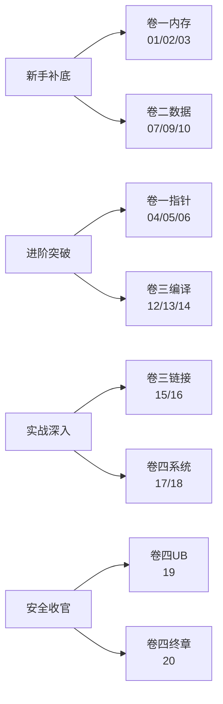
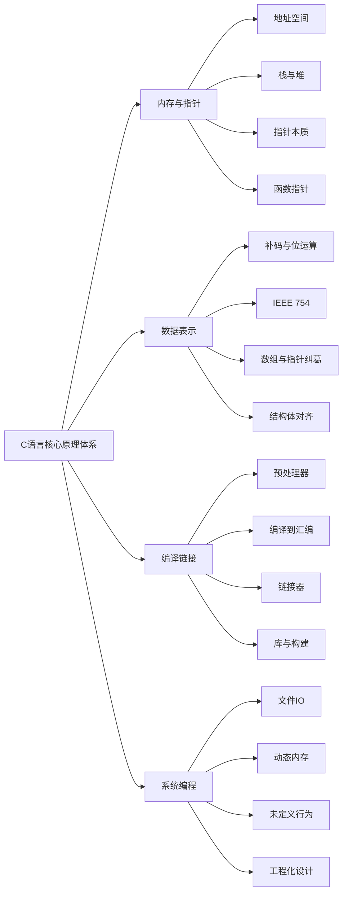

# 🚀 C 语言核心原理深度专栏

> C 语言核心原理深度专栏，自下而上贯穿 **内存与指针 → 数据表示 → 编译链接 → 系统编程与安全** 四大原理域，共计 **20 篇**，体系化拆解 C 语言的每一根骨头与每一种设计哲学。
>
> 🎯 **全册 20 篇规划完成！** ⏳（⏳ 卷一 · ⏳ 卷二 · ⏳ 卷三 · ⏳ 卷四）

## 📐 设计理念

C 语言与 Java/C++ 最大的不同在于：**它没有运行时这一层抽象**——只有一段裸代码直接运行在 CPU 和操作系统之上。所以本专栏的纵深顺着这条路径展开：

> **内存布局 → 指针运算 → 数据编码 → 编译链接 → 系统调用 → 硬件交互**

C 语言的"刀尖跳舞"体现在：指针就是地址、数组就是连续内存、函数调用就是栈帧挪动、IO 就是系统调用——没有语法糖，每一行代码都直接映射到硬件行为。

---

## 📕 卷一 · 内存与指针艺术（6 篇）

把"C 语言的灵魂究竟是什么"一层层揭开。

- ⏳ [01.进程虚拟地址空间](https://yccoding.com/pages/cc001/)：`.text`/`.data`/`.bss`/`heap`/`stack` 五段全景、虚拟地址到物理地址的页表映射、缺页中断流程、写时复制（COW）、`/proc/self/maps` 实战验证、ASLR 地址随机化
- ⏳ [02.栈与堆底层对决](https://yccoding.com/pages/cc002/)：栈向下增长 vs 堆向上增长、栈帧结构与 `RBP`/`RSP` 寄存器、栈溢出 Guard Page 保护、`brk`/`sbrk` vs `mmap` 两种堆扩展通道、栈分配一条指令 vs 堆分配搜索空闲链表、性能实测对比
- ⏳ [03.指针本质与多级解引](https://yccoding.com/pages/cc003/)：指针 = 地址 + 类型的双重身份、解引用 `*p` 的汇编翻译、`&` 和 `*` 的对称性、多级指针 `***p` 的内存闯关模型、`void*` 通用指针与类型擦除、指针作为"带类型的门牌号"统一心智模型
- ⏳ [04.指针运算底层真相](https://yccoding.com/pages/cc004/)：`p+1` 的步长由类型决定、`arr[i]` ↔ `*(arr+i)` ↔ `i[arr]` 三等价证明、指针减法的元素个数语义、不可对 `void*` 做算术的理由、指针比较的合法范围、越界指针即 UB
- ⏳ [05.函数指针与回调机制](https://yccoding.com/pages/cc005/)：函数名即函数地址、`qsort` 源码逐行拆解、回调函数注册模式、函数指针数组实现状态机/跳转表、信号处理 `signal(signum, handler)` 原理、函数指针类型别名 `typedef` 增强可读性
- ⏳ [06.限定符与指针语义](https://yccoding.com/pages/cc006/)：`const int *p` vs `int * const p` vs `const int * const p` 三种读法、`volatile` 真实用途（MMIO/信号处理/setjmp）而非同步工具、`restrict` 编译器别名优化与 `memcpy` 性能翻倍的证据、`const` 是编译期承诺不是运行时保护

---

## 📗 卷二 · 数据表示与结构设计（5 篇）

把"C 语言如何用最少的字节表达最精确的语义"讲清楚。

- ⏳ [07.补码与位运算原理](https://yccoding.com/pages/cc007/)：原码/反码/补码推导与 `-x = ~x + 1` 证明、有符号溢出是 UB 无符号溢出是回绕的根因、六种位运算符 `& | ^ ~ << >>` + 经典技巧（交换/取绝对值/判断 2 的幂）、位掩码标志位模式、`sizeof` 是编译期运算符不是函数
- ⏳ [08.IEEE754浮点本质](https://yccoding.com/pages/cc008/)：符号位/指数/尾数三段布局、规格化/非规格化/无穷大/NaN 四种状态、十进制小数转二进制浮点的精度丢失推导、`float` vs `double` 精度对照表、浮点比较的正确姿势、字节序（大端/小端）的判断与转换
- ⏳ [09.数组与指针的纠葛](https://yccoding.com/pages/cc009/)：数组名不是指针——`sizeof(arr)` 暴露本质、数组名衰减为指针的三个例外（`sizeof`/`&`/字符串字面量初始化）、多维数组的行优先内存布局、`int (*p)[N]` 数组指针 vs `int *p[N]` 指针数组、VLA 变长数组机制与风险、柔性数组成员 `char data[]` 设计
- ⏳ [10.结构体对齐与优化](https://yccoding.com/pages/cc010/)：对齐规则推导（成员偏移 + 整体补齐）、嵌套结构体对齐传播、`offsetof` 宏实现原理、`#pragma pack` 与 `__attribute__((packed))` 的代价、通过重排成员顺序减少内存占用、结构体位域的内存模型、联合体的类型双关与大小端检测、网络协议结构体设计
- ⏳ [11.字符串存储与安全](https://yccoding.com/pages/cc011/)：C 字符串以 `'\0'` 结尾的设计代价与收益、字符串字面量在 `.rodata` 的去重池化、`char arr[]` 在栈 vs `char *ptr` 指向 `.rodata` 的本质区别、`strcpy`/`strcat`/`sprintf` 缓冲区溢出根因、`strncpy` 的 `'\0'` 不保证写入陷阱、`snprintf`/`strlcpy` 安全替代方案、ASCII → Unicode → UTF-8 编码演进与 C 的宽字符 `wchar_t`

---

## 📘 卷三 · 编译链接与构建系统（5 篇）

把"源代码怎么一步步变成在 CPU 上跑的二进制"打通。

- ⏳ [12.预处理器宏与条件编译](https://yccoding.com/pages/cc012/)：宏展开三步 prescan→替换→再扫描、"蓝漆规则"防止无限递归、`#` 字符串化与 `##` 令牌粘贴、两级宏的间接展开必要性、`do { } while(0)` 包装宏的工程理由、`X-macro` 自动生成代码表驱动、`#if`/`#ifdef`/`#if defined` 条件编译、`#pragma once` vs `#ifndef` 头文件守卫
- ⏳ [13.编译到汇编全流程](https://yccoding.com/pages/cc013/)：编译四阶段 `.c`→`.i`→`.s`→`.o`、词法分析/语法分析/语义分析/中间代码生成/优化/目标代码生成六步、`gcc -S` 读汇编、函数序言 `push rbp; mov rbp, rsp` 与尾声 `leave; ret`、`-O0`/`-O2`/`-O3` 优化等级对汇编的影响、`volatile` 阻止编译器优化删除的案例
- ⏳ [14.链接器符号与重定位](https://yccoding.com/pages/cc014/)：`.o` 文件的 ELF 结构 `.symtab`/`.rel.text`、链接器单遍左到右符号解析算法、静态库 `.a` 按需增量提取与 `__SYMDEF` 索引、重定位类型 `R_X86_64_PC32`/`R_X86_64_32` 填地址全过程、强弱符号仲裁四矩阵与静默覆盖事故、`COMMON` 符号的历史包袱、`-ffunction-sections -Wl,--gc-sections` 瘦身
- ⏳ [15.静态库与动态库对比](https://yccoding.com/pages/cc015/)：`.a` 编译期嵌入 vs `.so` 运行时动态加载、PLT/GOT 延迟绑定 `call → PLT → GOT → .so` 五步流程、`dlopen`/`dlsym` 运行时加载插件、`LD_PRELOAD` 劫持、RPATH/RUNPATH 搜索路径、符号可见性 `-fvisibility=hidden`、`.so` 版本管理 `.symver`、静态链接膨胀 vs 动态链接 `LD_LIBRARY_PATH` 地狱
- ⏳ [16.Make与CMake构建](https://yccoding.com/pages/cc016/)：Makefile 目标/依赖/命令三要素、自动变量 `$@`/`$<`/`$^`、隐式规则与模式规则、伪目标 `.PHONY`、递归 Make 的变量传递、CMake 最小 `CMakeLists.txt`、`add_library`/`target_link_libraries`、`find_package` 查找外部依赖、`install` 规则、构建类型 Debug/Release 切换、交叉编译工具链指定

---

## 📙 卷四 · 系统编程与安全实践（4 篇）

把"C 语言怎么跟操作系统打交道，以及怎么写不出 bug"交底。

- ⏳ [17.文件IO与系统调用](https://yccoding.com/pages/cc017/)：文件描述符本质是内核打开文件表索引、`open`/`read`/`write`/`lseek`/`close` 系统调用的用户态↔内核态切换代价、标准 IO `FILE*` 的 4096 字节用户态缓冲区、`setvbuf` 控制缓冲策略（全缓冲/行缓冲/无缓冲）、`mmap` 文件映射零拷贝原理、`msync` 刷盘、VFS 虚拟文件系统抽象层
- ⏳ [18.动态内存管理揭秘](https://yccoding.com/pages/cc018/)：glibc `ptmalloc2` 的 chunk 数据结构、Fast Bins/Small Bins/Large Bins 三级分配策略、`sbrk` 小内存 vs `mmap` 大内存双通道、空闲 chunk 合并与碎片问题、Valgrind `--leak-check=full` 内存泄漏检测、AddressSanitizer 影子内存 RedZone 原理、手写内存池：固定大小分配器的实现与性能对比
- ⏳ [19.未定义行为与防御](https://yccoding.com/pages/cc019/)：UB/实现定义/未指定三种行为分类、有符号整数溢出 `INT_MAX + 1` 从 `-O0` 正常到 `-O2` 死循环的编译器优化真相、空指针解引用后编译器删除后续 null 检查、`strict aliasing` 规则下 `char*` 是唯一合法别名、越界访问/悬空指针/双重 free/栈溢出分类速查、UBSan + ASan + TSan 三圣器编译参数与输出解读、CI 集成最佳实践
- ⏳ [20.C工程化与设计哲学](https://yccoding.com/pages/cc020/)：编译单元与翻译单元边界、`extern`/`static` 链接属性的封装用 `static` 暴露用 `extern`、Opaque Pointer 信息隐藏（`typedef struct Xxx Xxx;` 前向声明）、接口 `.h` 与实现 `.c` 分离、回调函数注册 + 上下文 `void *user_data` 设计、错误处理：返回错误码 vs `errno` vs `setjmp`/`longjmp`、四卷 20 篇知识体系全景回顾、C 语言设计哲学：信任程序员 → 给足能力也给足责任

---

## 📚 学习路径推荐

| 你的目标 | 推荐主攻卷 | 优先篇目 |
|---|---|---|
| 面试冲刺 | 卷一 + 卷二 + 卷四 | 01 / 03 / 04 / 09 / 10 / 19 |
| 嵌入式/驱动开发 | 卷一 + 卷二 + 卷三 | 01 / 02 / 06 / 07 / 08 / 14 |
| 系统底层/中间件 | 卷一 + 卷三 + 卷四 | 02 / 05 / 13 / 15 / 17 / 18 |
| 建立 C 语言世界观 | 全部 20 篇按顺序 | 从卷一读到卷四 |

---

## 📐 统一写作模板

每篇文章按 **10 章法** 展开：

1. **案例引入**：一段真实代码或线上事故引出问题，列出 5~7 个待解疑问
2. **架构概览**：一张总图 + 反向论证「为什么这么切」
3~9. **核心原理拆解**：5~7 章，每章「疑惑 → 论证 → 结论」三段式
10. **综合案例串讲**：回扣第 1 章、串生命周期、提炼设计哲学、给速查表

---

## 📊 进度总览

| 卷 | 主题 | 篇数 | 已完成 |
|---|---|---|---|
| 卷一 | 内存与指针艺术 | 6 | 0 ⏳ |
| 卷二 | 数据表示与结构设计 | 5 | 0 ⏳ |
| 卷三 | 编译链接与构建系统 | 5 | 0 ⏳ |
| 卷四 | 系统编程与安全实践 | 4 | 0 ⏳ |
| **合计** | — | **20** | **0 ⏳** |

> 📁 旧版 12 篇已归档为写作素材，将按新专栏结构拆分、深化、重组。

---

## 🗺️ 知识图谱

