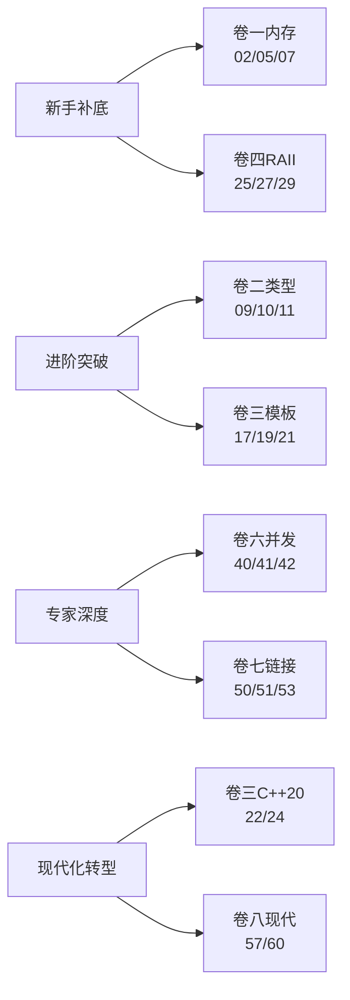
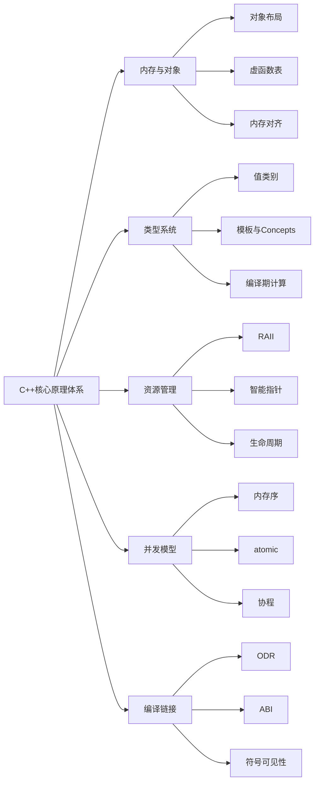

# 🚀 C++ 核心原理深度专栏

> C++ 核心原理深度专栏，自下而上贯穿 **内存与对象 → 类型与值类别 → 模板与编译期 → 资源管理 → STL → 并发 → 编译链接 → 设计哲学** 八大原理域，共计 **60 篇**，体系化拆解 C++ 的每一根骨头与每一种设计哲学。
>
> 🎉 **全册 60 篇全部完成！** ✅（✅ 卷一 · ✅ 卷二 · ✅ 卷三 · ✅ 卷四 · ✅ 卷五 · ✅ 卷六 · ✅ 卷七 · ✅ 卷八）
>
> 🎉 **全册 60 篇全部完成！** ✅（✅ 卷一 · ✅ 卷二 · ✅ 卷三 · ✅ 卷四 · ✅ 卷五 · ✅ 卷六 · ✅ 卷七 · ✅ 卷八）

## 📐 设计理念

C++ 与 Java 最大的不同在于：**它没有虚拟机这一层抽象**——直接面对编译器、链接器、CPU 缓存、操作系统内存。所以本专栏的纵深顺着这条路径展开：

> **预处理 → 编译 → 链接 → 运行时 → 操作系统 → 硬件**

每一层都有 C++ 独有的"刀尖在跳舞"的设计。

---

## 📕 卷一 · 内存模型与对象布局（8 篇）

把"虚拟机？我们没有，自己上"的底层揭开。

- ✅ [01.进程地址空间布局](https://yccoding.com/pages/53783a/)：text/data/bss/heap/stack五段、虚拟内存映射、ASLR、mmap与brk、栈底栈顶生长方向、Linux pmap实战
- ✅ [02.对象内存布局原理](https://yccoding.com/pages/c1a265/)：成员排列规则、内存对齐与pragma pack、空类大小1字节、EBO空基类优化、[[no_unique_address]]、cache line对齐
- ✅ [03.引用与指针本质](https://yccoding.com/pages/3f4361/)：引用汇编实现即指针、引用vs指针七大对比、悬空引用、const引用延长生命周期、引用折叠规则
- ✅ [04.this指针与成员函数](https://yccoding.com/pages/b82b13/)：成员函数→普通函数翻译、隐式this、const成员函数本质、this是右值、cv限定符在ABI层的体现
- ✅ [05.虚函数表深度剖析](https://yccoding.com/pages/627ad6/)：vptr在对象头部、vtable在只读段、单继承vtable布局、多继承thunk、虚继承vbtable、构造析构期间虚函数行为
- ✅ [06.多重继承内存模型](https://yccoding.com/pages/71d916/)：多继承对象布局、菱形继承数据冗余、虚继承vbptr、向上转型的指针偏移、dynamic_cast运行时机制
- ✅ [07.内存对齐与缓存行](https://yccoding.com/pages/89eb8e/)：False sharing假共享、alignas/alignof、SIMD对齐要求、cache line padding实战、perf c2c检测假共享
- ✅ [08.内存分配器演进史](https://yccoding.com/pages/4c223a/)：malloc/free历史、ptmalloc arena、tcmalloc thread cache、jemalloc、operator new重载、内存池设计

## 📗 卷二 · 类型系统与值类别（8 篇）

把"C++ 为什么有左值/右值/将亡值"这种刀尖问题彻底讲清。

- ✅ [09.五大值类别详解](https://yccoding.com/pages/710484/)：lvalue/xvalue/prvalue/glvalue/rvalue、值类别决策树、decltype判定值类别、表达式值类别速查
- ✅ [10.右值引用与移动语义](https://yccoding.com/pages/226137/)：std::move本质是static_cast、移动构造与移动赋值、移动后对象状态、noexcept移动的关键性、unique_ptr移动
- ✅ [11.完美转发与引用折叠](https://yccoding.com/pages/616427/)：万能引用T&&、std::forward实现、引用折叠四规则、转发失败八大场景、SFINAE辅助
- ✅ [12.类型推导三大规则](https://yccoding.com/pages/890fcc/)：auto推导、decltype推导、模板参数推导、AAA原则、auto&与auto&&差异、decltype(auto)出现原因
- ✅ [13.类型转换与隐式构造](https://yccoding.com/pages/c58be2/)：五大cast（static/const/reinterpret/dynamic/bit_cast）、C风格cast的盲选搜索顺序、严格别名规则、explicit关键字、单参ctor与operator T()两扇隐式门、列表初始化禁止窄化、most vexing parse
- ✅ [14.const与volatile真相](https://yccoding.com/pages/8d866e/)：const三层语义（语法/API/实现）、按位常量vs逻辑常量、mutable的合法逃逸与并发反模式、顶层底层const边界、const_cast在并发代码的反模式、volatile真正用途（MMIO/信号/setjmp）、volatile为何不是同步工具、std::atomic的ARM stlr/ldar屏障对比、ref-qualifier三件套、propagate_const、跨语言const对比
- ✅ [15.RTTI与dynamic_cast](https://yccoding.com/pages/dae6fc/)：两个跨SO事故引入、typeid双模行为、5种转换方向、vtable查找、Itanium vs MSVC ABI、-fno-rtti代价、跨边界陷阱、三套替代方案、决策树
- ✅ [16.类型擦除技术原理](https://yccoding.com/pages/ef3dac/)：日志格式化器类爆炸与lambda悬垂引用事故、手工Concept+Model、function三元SBO结构、any的void*+type_info、SBO准入三条件、variant vs any 18×性能差、Sean Parent遗产、lambda从捕获到调用4步生涯

## 📘 卷三 · 模板与编译期计算（8 篇）

把"编译期是另一个图灵机"全部展开。

- ✅ [17.模板实例化机制](https://yccoding.com/pages/afb0a5/)：嵌入式flash溢出事故引入、两阶段名称查找+ADL、POI规则、extern template vs 显式实例化、Thin Template模式、export失败史、ODR COMDAT折叠、vector<int>从源码到机器码7步生涯
- ✅ [18.模板特化与偏特化](https://yccoding.com/pages/8c28d8/)：序列化库偏特化蝴蝶效应、全特化强符号ODR陷阱、偏序算法三步推演、函数模板无偏特化的设计原因、tag dispatch/enable_if替代、vector<bool>争议全特化
- ✅ [19.SFINAE与enable_if](https://yccoding.com/pages/29546f/)：序列化 17000 行错误与默认模板实参重定义两大事故引入、立即上下文边界、enable_if 偏特化把戏、void_t 五行通用探测器、detection idiom 框架、四种插桩位置（位置②首选）、优先级标签 priority 继承链构造偏序、表达式 SFINAE、类模板成员模板 SFINAE 正确写法、C++20 requires 蕴含关系（subsumption）三大碾压
- ✅ [20.可变参数模板原理](https://yccoding.com/pages/6c7c8b/)：高频交易日志库 14GB 内存爆炸事故引入、pack 是 AST 占位符不是对象、pattern... 模式与展开分离、七大展开位置、折叠表达式四式 + 32 运算符、递归 vs if constexpr vs 折叠编译耗时对比、tuple 递归多继承 + EBO、apply 五行源码、emplace 完美转发链路、类型擦除收口工程范式
- ✅ [21.constexpr编译期计算](https://yccoding.com/pages/5c3598/)：四代演进全景、consteval 立即函数与 if consteval、constinit SIOF 根治、C++20 瞬态与 C++23 持久分配、constexpr 虚函数与编译期多态、编译器字节码虚拟机内幕、编译期 LUT/正则/JSON 实战、前移即优化性能证据
- ✅ [22.Concepts深度剖析](https://yccoding.com/pages/6c3661/)：subsumption 蕴含断裂与 requires 位置屠杀双事故引入、concept 定义四配方 + requires 表达式四检查、requires clause vs expression 同名陷阱、四种悬挂位置与偏序规则、三步裁决法、原子约束归一化与 subsumption 精算、SFINAE→Concepts 逐行翻译对比、错误信息 17000→3 行与编译时间 4.2s→0.9s、类模板陷阱、四步迁移路径
- ✅ [23.元编程模板技巧](https://yccoding.com/pages/8fd804/)：CRTP 虚析构性能事故与 80 型编译爆炸双事故引入、静态多态 vs 虚函数实测、构造期陷阱、TypeList 嵌套 vs 可变参对比与迁移、编译期算法三路实测、integral_constant 设计基因与 ratio/index_sequence、mixin + policy 组合、现代替代决策树、实例化膨胀五瘦身策略
- ✅ [24.Modules模块化设计](https://yccoding.com/pages/1a65c7/)：量化系统 2400 TU 单行改动 18 分钟重编三连事故引入、export 三段式 + 分区 + 实现单元、import 非传递性 + export import 显式传递、module; 全局片段桥接、BMI 结构+三编译器差异、CMake 两阶段扫描、模板可到达性/模块链接/ODR 前移、四步迁移 18min→45s

## 📙 卷四 · 资源管理与生命周期（7 篇）

把"RAII 哲学"贯穿到底。

- ✅ [25.RAII的设计哲学](https://yccoding.com/pages/4bc5fe/)：交易引擎死锁+fd泄露双事故引入、五要素模型、C goto cleanup vs RAII一行替代汇编证据、析构抛异常根因、Java GC/Go defer/Rust Drop五种范式对比、异常安全三级+copy-and-swap、scope_guard三剑客+手搓三行、六大应用范式、四种反模式
- ✅ [26.对象构造与析构](https://yccoding.com/pages/bf4d47/)：构造期虚函数幽灵+初始化列表双倍开销双事故引入、六步流水线全图、成员声明顺序陷阱、虚继承规则、析构逆序必然性、虚析构汇编证据、初始化列表三步超赋值、默认成员初始化器优先级、委托/继承构造陷阱、vptr 逐步切换机制、三五法则+特殊成员函数生成规则、move noexcept 红利实测
- ✅ [27.拷贝与移动控制](https://yccoding.com/pages/cbc04f/)：浅拷贝 double-free + vector 非 noexcept 退化拷贝双事故、五法则棋盘图、深拷贝 vs 浅拷贝汇编、copy-and-swap 统一赋值、移动后状态约定、=default/=delete 全函数可删除、C++17 强制拷贝省略+RVO 汇编证据、return std::move 陷阱、noexcept 移动 vector 扩容 7× 加速证据
- ✅ [28.unique_ptr原理剖析](https://yccoding.com/pages/425bb9/)：异常路径泄露+auto_ptr 亡故双事故、核心三行源码、sizeof=裸指针铁证、Deleter 无状态 EBO/有状态/函数指针三种代价、C++11 漏掉 make_unique 原因、异常安全 make_unique vs new、T[] 数组特化、解引用汇编 100% 一致
- ✅ [29.shared_ptr底层剖析](https://yccoding.com/pages/d4db7b/)：循环引用泄露+双控制块双事故、控制块五字段布局、双计数器与析构时机、make_shared 一次 vs 两次分配布局图、原子 LOCK 汇编+高竞争退化、weak_ptr::lock 的 CAS 快照、循环引用标准解法、enable_shared_from_this 初始化时机、性能全景对比表
- ✅ [30.weak_ptr与this增强](https://yccoding.com/pages/57608b/)：IO 回调裸 this 幽灵+构造期 shared_from_this 抛异常双事故、回调四时效模型、enable_shared_from_this CRTP 源码拆解、weak_from_this vs shared_from_this 语义汇编对比、二级指针失效与 lock 原子检测、Observer 模式 weak_ptr 惰性清理、异步回调四层安全方案、多态边界陷阱
- ✅ [31.五种存储期管理](https://yccoding.com/pages/941edc/)：单例竞速+fork TLS 双事故、五存储期全景映射、static 局部双重检查锁汇编、thread_local FS 寄存器+TLS 段、临时对象生命周期延长、五存储期汇编对比+线程安全矩阵、跨语言跨平台对比、选择决策树

## 📒 卷五 · STL 与泛型库设计（8 篇）

把"标准库每一根骨头"摸一遍。

- ✅ [32.vector扩容真相](https://yccoding.com/pages/8443c2/)：P99 延迟抖动+迭代器失效双事故、三指针+EBO 模型、扩容因子 1.5 vs 2 摊还分析+内存复用论证、emplace vs push_back 原地构造汇编对比、reserve 四反模式、迭代器失效精确规则+下标免疫、扩容全指令序列、PMR 现代替代
- ✅ [33.deque分段连续设计](https://yccoding.com/pages/5940a6/)：缓存灾难+push_front 逆袭双事故、map+chunk 两级模型、chunk 512B 公式、map 扩容仅搬指针、operator[] 9条 vs 2条汇编对比、push_front  chunk 内反向填充魔术、两端插入不失效迭代器、insert 选少侧搬移、七维对决表、stack/queue 默认 deque 原因
- ✅ [34.list与forward_list](https://yccoding.com/pages/8864cc/)：手工搬移 O(N²)+内存暴增双事故、双向节点 prev/next+哨兵环形结构、每 int 40B 精算、遍历 L1 miss 141× 证据、splice 四指针零搬移 O(1) 魔法、节点级分配器流水线、forward_list 省 8B/node 无 size() 诚实设计、三容器矩阵与 90% 不该用 list 四原因、sort 归并 vs introsort 6× 差
- ✅ [35.关联容器红黑树](https://yccoding.com/pages/d43995/)：unordered_map 意外减速+临时对象陷阱双事故、红黑树五性质+插入 2 次旋转、节点 3 指针+color 结构、operator[]/try_emplace 三接口、异构查找 std::less<> -62%、extract+node_type 零拷贝搬移、ordered vs unordered benchmark、multi 系列 equal_range
- ✅ [36.哈希容器深度剖析](https://yccoding.com/pages/f26383/)：rehash 风暴+全碰撞双事故、拉链法 bucket+链表 vs 开放寻址、节点仅 1 next 指针 sizeof 优势、自定义 hash+equal 三原则、load_factor+rehash 五步拆解、reserve 4× 加速、Abseil SIMD 探测 Swisstable、C++20 哈希异构、五场景 benchmark
- ✅ [37.迭代器五大类别](https://yccoding.com/pages/2124e2/)：sort 拒绝 list+虚假 tag 双事故、五类层级继承链、input 单次不可逆、forward 多遍最小保证、bidirectional/RA 各容器对照、tag dispatch 编译期全内联汇编证据、iterator_traits+裸指针偏特化、C++20 sentinel、迭代器失效全族谱汇总
- ✅ [38.STL算法设计哲学](https://yccoding.com/pages/26e285/)：小数组冒泡反超+remove 不删元素双事故、introsort 快排+堆排兜底+插入三合一、深度检测 2logN 切堆排、stable_sort 归并稳定、partition 双向扫描、算法四族范型、并行策略三件套与反效果、ranges projection 管道惰性求值
- ✅ [39.Allocator分配器机制](https://yccoding.com/pages/5ad73f/)：碎片风暴+PMR 释放双事故、std::allocator 四元组+rebind、池分配器最小实现、PMR 虚函数运行时多态 vs 模板编译期、三 resource benchmark、scoped_allocator 嵌套传播、分配失败回滚、与 jemalloc 分层协作

## 📔 卷六 · 并发与内存模型（8 篇）

把"从原子到协程"全部串起来。

- ✅ [40.C++内存模型基石](https://yccoding.com/pages/47a1e2/)：Peterson 锁 ARM 失效+relaxed 崩溃双事故、五层下落模型、L1/L2/L3 拓扑延迟、MESI 四状态机+RFO 广播、Store Buffer→Store-Load 重排物理机制、Invalidate Queue 可见性延迟、硬件到 memory_order 映射表、x86-TSO/ARM/PowerPC 三架构对比、汇编重排重现
- ✅ [41.六大内存序详解](https://yccoding.com/pages/f2c492/)：DCL relaxed 崩溃+滥用 acq_rel 双事故、六序三级分类、relaxed 仅原子性反例、acquire/release 单向屏障+消息传递证明、acq_rel RMW+无锁栈推理、seq_cst 全局序+代价量化、consume 废弃原因、happens-before 四关系+传递闭包、x86 vs ARM 全指令表+benchmark
- ✅ [42.atomic原子操作原理](https://yccoding.com/pages/13cfe3/)：无锁栈 ABA+atomic<string> 编译失败双事故、x86 LOCK 缓存锁+ARM LDREX/STREX 三层实现、lock-free vs wait-free 对比、CAS strong/weak 区别+ABA 完整时序+三方案、atomic<T> trivially copyable 门槛、C++20 atomic_ref 临时外壳、8 核争抢 120ns 退化
- ✅ [43.mutex与条件变量](https://yccoding.com/pages/6047f5/)：递归日志死锁+假唤醒双事故、futex 两阶段模型 fast path CAS ~15ns+slow path WAIT 汇编、自旋 vs 阻塞决策表+自适应锁、recursive_mutex 内部计数+owner ID 与避免理由、shared_mutex 读共享写独占状态机+80%读才值、std::lock 尝试-回退+scoped_lock 多锁原子、timed_mutex+RAII 守卫家族四件套对比、cv wait 完整状态机+lost wakeup 原子解决、假唤醒 POSIX 遗产+正确范式 while+谓词
- ✅ [44.thread与jthread机制](https://yccoding.com/pages/2a1a70/)：~thread terminate+jthread 延迟双事故、thread 构造启动+析构 terminate+不能拷贝物理实体论证、pthread_create clone 全链路+join futex 内核机制、thread_local 子线程时机+静态动态 TLS+fork 暗坑、jthread 析构自动 request_stop+join、stop_token 三组件+stop_state atomic 状态机+shared_ptr/weak_ptr 管理、stop_callback+cv 集成、七维对决表+四场景 thread 仍有优势、五陷阱
- ✅ [45.异步编程future家族](https://yccoding.com/pages/f24c45/)：async deferred 串行+promise 析构 broken_promise 双事故、四件套架构、promise set_value/set_exception 原子传递、future get 一次移动+三级等待、packaged_task 自动设值安全论证、async launch 默认策略不确定性灾难+deferred wait_for 原理、shared_future 显式 share+多次 get 拷贝语义、shared state 五字段+set_value 到 get 汇编全流程+release-acquire 证明、async 析构阻塞+五陷阱
- ✅ [46.无锁数据结构设计](https://yccoding.com/pages/286978/)：锁争抢 120ns+Treiber 栈 ABA 崩溃双事故、lock-free 三定义、Treiber Stack release/acquire 逐行论证+happens-before 证明、M-S Queue 双指针+两步 CAS+dummy 哨兵、ABA 七时刻时序+三种修复、hazard ptr/EBR/RCU 三策略决策树、SPSC 环形+缓存行填充 4×、8 核无锁 vs 有锁 36× P99 差距+缓存颠簸隐性成本
- ✅ [47.协程coroutine原理](https://yccoding.com/pages/5a4d43/)：Generator 忘 co_yield+promise_type 悬挂双事故、协程三角 promise_type/awaiter/handle 栈less 堆帧设计、promise_type 五接口+initial/final_suspend 编译器插桩序列、awaiter 三函数+co_await 五种状态变换+对称转移、coroutine_handle void* 8B+resume/destroy、co_yield 语法糖+生成器完整实现、帧 resume_point 状态机+形参搬进帧、栈less vs 有栈 600× 轻量、异步 scheduler+IO awaiter 单线程复用、与 thread/async/future 全对比

## 📓 卷七 · 编译链接与 ABI（7 篇）

把"二进制如何诞生与协作"打通。

- ✅ [48.翻译单元与预处理](https://yccoding.com/pages/575b2e/)：宏炸弹+include 顺序依赖双事故、TU 四阶段从字符到 AST、#include 搜索路径完整列表+#pragma once vs #ifndef 守卫+头文件自给性验证、宏展开三步骤 prescan→替换→再扫描蓝漆规则+#/## 两级宏+__VA_OPT__、条件编译 #if defined 组合+#if 不识 sizeof/constexpr 边界、PCH 编译器状态快照+失效三种原因、Unity Build 合并 TU+符号冲突、IWYU 隐式依赖重构炸弹、编译加速三方案对比
- ✅ [49.编译期符号生成](https://yccoding.com/pages/63f1ff/)：跨 GCC ABI 断裂+C/C++ 混编双事故、name mangling 必要性论证、Itanium ABI _Z+N+长度+类型码+C1/D1+pl/ml+IiE 模板完整规则+十步手动拆解、MSVC ?@ 分隔+??0/??1+调用约定编码、extern "C" 三层语义+__cplusplus 守卫+不能重载根因、COMDAT/weak 重复消除、c++filt/__cxa_demangle、跨编译器混用不匹配
- ✅ [50.链接器工作原理](https://yccoding.com/pages/a9c637/)：静态库顺序倒置+强弱符号静默覆盖双事故、符号解析单遍左到右算法+符号表五类哈希结构、.a 按需增量提取+__SYMDEF 索引、重定位 PC32/PLT32/64 汇编填地址全流程、强弱符号仲裁四矩阵+COMDAT 模板消除、-ffunction-sections+--gc-sections 标记清除、--start-group 循环依赖、初始化顺序 fiasco
- ✅ [51.ODR规则与陷阱](https://yccoding.com/pages/073d0c/)：#ifdef 类布局分裂+inline 实现不同崩溃双事故、ODR 两层含义+ODR-use 双重规则+NDR 三原因、类 ODR 允许重复但布局一致+#ifdef 陷阱+PIMPL 修复、inline 弱符号 W 多选一+C++17 inline 变量、模板隐式实例化合并+#ifdef 实例化代码不同、static+匿名命名空间天然豁免、_GLIBCXX_DEBUG/header-only 版本/成员函数 .h+.cpp 双定义四陷阱、-flto -Wodr+--detect-odr-violations+IWYU 三防御
- ✅ [52.动态库与符号可见性](https://yccoding.com/pages/5aae0c/)：同名符号静默绑定错+dlsym 找不到 hidden 双事故、PLT 三指令+GOT 双重身份+延迟绑定机制+call→PLT→GOT→.so 五步流程、visibility 四种+-fvisibility=hidden 全局开关+.dynsym 2847→42 缩减、dlopen RTLD_LAZY/NOW+extern C 工厂插件、symbol versioning .symver+version script、LD_PRELOAD 劫持+RPATH
- ✅ [53.C++ ABI兼容性](https://yccoding.com/pages/a490d2/)：GCC5 string COW→SSO 跨 .so 崩溃+vtable 错位双事故、API vs ABI 源码 vs 二进制兼容五维度、Itanium ABI 五层约束、COW 8B vs SSO 32B 布局+_GLIBCXX_USE_CXX11_ABI 双轨+四策略、跨编译器 GCC-Clang vs MSVC+extern C 唯一可移植、PIMPL/纯虚/C 不透明指针三防御+inline namespace、四类破坏 ABI 变更、三陷阱
- ✅ [54.LTO与PGO优化](https://yccoding.com/pages/f81bc3/)：LTO devirtualize 误判+PGO 冷路径退化双事故、LTO IR 输出+全局优化+跨 TU 内联/虚消除/const 传播、ThinLTO 索引+并行后端+内存 -90%、PGO 插桩 vs 采样 perf/AutoFDO+四优化、Bolt 函数/基本块重排 iTLB+iCache+LTO+PGO+Bolt 三叠加、gc-sections+ICF+LTO 三级瘦身 -32%、ODR 显形/训练偏差/调试/链接爆炸四陷阱

## 📑 卷八 · 现代特性与设计哲学（6 篇）

把"为什么 C++ 这么写"的灵魂还原。

- ✅ [55.异常机制底层原理](https://yccoding.com/pages/c36d97/)：析构抛异常双重异常+noexcept terminate 双事故、throw→catch 四阶段、Itanium ABI .eh_frame CIE/FDE+LSDA 静态表+人格函数、栈展开两阶段 search/cleanup+DWARF CFI 爬栈、零开销原理正常路径零指令+vs setjmp、noexcept 契约 process-death+vector 扩容必须 noexcept、抛异常 ~5μs vs 错误码 ~3ns 1500×、禁用异常四原因
- ⏳ [56.错误处理多元方案](56.错误处理多元方案.md)：异常 vs 错误码 vs std::expected vs std::optional、Outcome库、决策树、Google C++风格的取舍
- ✅ [57.Ranges革命与管道](https://yccoding.com/pages/ce479f/)：迭代器对地狱+filter|transform 双次遍历双事故、range 概念五层+view 惰性求值 O(1) 拷贝、filter/transform/take/drop/reverse 适配器+pull model 全管道流程、| 管道 operator| 重载六步组合、std::ranges::sort range 整体+projection 汇编零开销、惰性 vs 急切零中间容器 malloc 对比、C++23 zip/adjacent/slide/chunk、view 悬挂/sort 不可变/filter ++ 跳跃三陷阱
- ✅ [58.format与print体系](https://yccoding.com/pages/766386/)：printf %d 传 string SIGSEGV+iostream 操纵符地狱双事故、printf vs iostream vs format 四维对比、{} 占位符自动/手动索引+格式说明符宽度对齐填充精度类型完整控制、编译期 concept 约束类型安全+formatter 特化、format > printf 25-40% > iostream 3-4× 性能基准+编译期解析原理、嵌套参数+chrono {:%Y-%m-%d}+format_to 避免分配、std::println C++23+Unicode、locale 默认无关 L 按需、三陷阱
- ✅ [59.UB未定义行为图鉴](https://yccoding.com/pages/6f5221/)：有符号溢出 O0 终 O2 死循环+reinterpret_cast 写入被忽略双事故、UB 三级分类+编译器有权做任何假设、有符号溢出删除检查+死循环+if(a+b<a)被删、strict aliasing char*/bit_cast/memcpy 三替代+不同类型不重叠、use-after-free+返回局部引用+vptr 窗口、空指针解引用后删 null 检查+this==nullptr、data race 撕裂读+重排+时间旅行、编译器 UB 假设优化删除防御代码 Linux 内核案例、UBSan/ASan/TSan 三圣器+CI 最佳实践
- ✅ [60.C++设计哲学回望](https://yccoding.com/pages/0a7949/)：终章——一行代码六层纵深回扣全书、零开销抽象 unique_ptr/ranges/format/projection 汇编证据、不为不需要的付费渐进升级路径、值语义 vs Java/Python 引用语义并发红利、C++ vs Rust 安全控制两极 vs Go 简单强大张力、C++11→26 演化线最佳实践标准化、八卷知识体系全景回顾六条设计红线三遍通关阅读路径、C++ 是自由也是责任——最后的哲学

---

## 📚 学习路径推荐

| 你的目标 | 推荐主攻卷 | 优先篇目 |
|---|---|---|
| 面试冲刺 | 卷一 + 卷四 + 卷六 | 02 / 05 / 10 / 27 / 29 / 41 |
| 中间件源码阅读 | 卷三 + 卷五 + 卷六 | 17 / 32 / 36 / 42 / 46 |
| 系统底层开发 | 卷一 + 卷六 + 卷七 | 01 / 07 / 40 / 50 / 53 |
| 拥抱现代 C++ | 卷二 + 卷三 + 卷八 | 09 / 11 / 22 / 57 / 60 |

---

## 📐 统一写作模板

每篇文章按 **10 章法** 展开，详见 [00.写作模板.md](https://yccoding.com/pages/template-go-blog/)：

1. **案例引入**：一段真实代码或线上事故引出问题，列出 5~7 个待解疑问
2. **架构概览**：一张总图 + 反向论证「为什么这么切」
3~9. **核心原理拆解**：5~7 章，每章「疑惑 → 论证 → 结论」三段式
10. **综合案例串讲**：回扣第 1 章、串生命周期、提炼设计哲学、给速查表

---

## 📊 进度总览

| 卷 | 主题 | 篇数 | 已完成 |
|---|---|---|---|
| 卷一 | 内存模型与对象布局 | 8 | 8 ✅ |
| 卷二 | 类型系统与值类别 | 8 | 8 ✅ |
| 卷三 | 模板与编译期计算 | 8 | 8 ✅ |
| 卷四 | 资源管理与生命周期 | 7 | 7 ✅ |
| 卷五 | STL 与泛型库设计 | 8 | 8 ✅ |
| 卷六 | 并发与内存模型 | 8 | 8 ✅ |
| 卷七 | 编译链接与 ABI | 7 | 7 ✅ |
| 卷八 | 现代特性与设计哲学 | 6 | 6 ✅ |
| **合计** | — | **60** | **60 ✅** |

> 📁 旧版 16 篇已归档至 [archive/](archive/)，作为新专栏写作参考。

---

## 🗺️ 知识图谱

