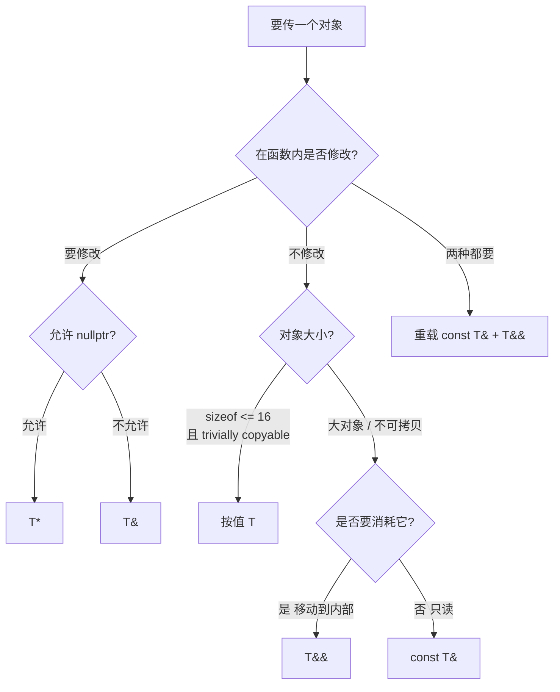

# 03.引用与指针本质

#### 目录介绍
- [1. 案例引入](#1-案例引入)
  - [1.1 一段悬空引用](#11-一段悬空引用)
  - [1.2 顺藤摸到根因](#12-顺藤摸到根因)
  - [1.3 我们要回答什么](#13-我们要回答什么)
- [2. 架构概览](#2-架构概览)
  - [2.1 三层认知模型](#21-三层认知模型)
  - [2.2 为什么这么切](#22-为什么这么切)
- [3. 引用的汇编真相](#3-引用的汇编真相)
  - [3.1 别名只是语义](#31-别名只是语义)
  - [3.2 godbolt反汇编佐证](#32-godbolt反汇编佐证)
  - [3.3 引用何时不占空间](#33-引用何时不占空间)
  - [3.4 引用何时占8字节](#34-引用何时占8字节)
- [4. 引用与指针七对比](#4-引用与指针七对比)
  - [4.1 必须初始化](#41-必须初始化)
  - [4.2 不可重新绑定](#42-不可重新绑定)
  - [4.3 没有空引用](#43-没有空引用)
  - [4.4 没有引用算术](#44-没有引用算术)
  - [4.5 没有多级引用](#45-没有多级引用)
  - [4.6 重载决议差异](#46-重载决议差异)
  - [4.7 sizeof语义不同](#47-sizeof语义不同)
- [5. 悬空引用陷阱](#5-悬空引用陷阱)
  - [5.1 局部变量逃逸](#51-局部变量逃逸)
  - [5.2 临时对象失效](#52-临时对象失效)
  - [5.3 容器迭代器失效](#53-容器迭代器失效)
  - [5.4 编译器静态检测](#54-编译器静态检测)
- [6. const引用续命](#6-const引用续命)
  - [6.1 经典续命语法](#61-经典续命语法)
  - [6.2 标准条款依据](#62-标准条款依据)
  - [6.3 续命三大边界](#63-续命三大边界)
  - [6.4 范围for的暗坑](#64-范围for的暗坑)
- [7. 右值引用本质](#7-右值引用本质)
  - [7.1 右值引用的诞生](#71-右值引用的诞生)
  - [7.2 命名右值是左值](#72-命名右值是左值)
  - [7.3 std_move的真容](#73-std-move的真容)
  - [7.4 移动语义的契约](#74-移动语义的契约)
- [8. 引用折叠规则](#8-引用折叠规则)
  - [8.1 万能引用T的真相](#81-万能引用t的真相)
  - [8.2 折叠四条铁律](#82-折叠四条铁律)
  - [8.3 forward的作用](#83-forward的作用)
  - [8.4 转发失败八场景](#84-转发失败八场景)
- [9. 何时该用引用](#9-何时该用引用)
  - [9.1 函数参数传递](#91-函数参数传递)
  - [9.2 返回值的取舍](#92-返回值的取舍)
  - [9.3 范围for的选择](#93-范围for的选择)
  - [9.4 成员变量的禁忌](#94-成员变量的禁忌)
- [10. 综合案例串讲](#10-综合案例串讲)
  - [10.1 案例真相揭晓](#101-案例真相揭晓)
  - [10.2 引用的一生](#102-引用的一生)
  - [10.3 设计哲学回扣](#103-设计哲学回扣)
  - [10.4 引用速查表格](#104-引用速查表格)


## 1. 案例引入

### 1.1 一段悬空引用

先看一段在生产里跑过的代码——一个通用的"配置项查找器"，看似清爽，但**间歇性返回乱码**，复现率约 1/万：

```cpp
// config_finder.hpp —— 按 key 查配置；找不到时返回默认 "N/A"
class ConfigStore {
    std::unordered_map<std::string, std::string> kv_;
public:
    // 关键 API：返回 const 引用，"零拷贝"
    const std::string& get(const std::string& key) const {
        auto it = kv_.find(key);
        if (it != kv_.end()) {
            return it->second;                  // ① 返回 map 内字符串
        }
        return std::string("N/A");              // ② 返回临时对象 ⚠️
    }
};

// 调用方
ConfigStore cs = load_from_disk();
const std::string& val = cs.get("missing_key");
std::cout << val;   // 💥 偶发输出乱码 / SIGSEGV
```

**现象**：

- DEBUG 构建在调用 `get` 后立刻打印——**居然能正常输出 "N/A"**（迷惑性极强）
- RELEASE 构建在 QPS > 1 万时——**约 0.01% 概率打印乱码或崩溃**
- valgrind 跑：`Conditional jump or move depends on uninitialised value(s)` + `Invalid read of size 8`

### 1.2 顺藤摸到根因

带着疑问扒：

- **假设 1**：是不是 `unordered_map` 在并发下 rehash 让 `it->second` 失效？—— 加锁后仍复现，**否定**。
- **假设 2**：那 ② 行 `return std::string("N/A")` 返回的是什么？—— 这是个**纯右值临时对象**，函数返回后**立刻析构**。返回的"引用"绑定到了一段已被回收的栈内存。
- **假设 3**：为什么 DEBUG 偶尔能跑？—— DEBUG 编译器不复用栈空间，那段内存恰好还没被新数据覆盖，看起来"还活着"——**这是 UB 的典型伪装**。
- **假设 4**：编译器为啥不报错？—— 现代编译器其实**能警告**这个，下文 5.4 节展开（GCC: `-Wreturn-local-addr`、Clang: `-Wreturn-stack-address`）。
- **假设 5**：怎么修？—— **三选一**：返回值（`std::string`）、返回 `optional<reference_wrapper>`、传一个静态默认值的引用。

```cpp
// 修复方案 1：值返回（推荐）
std::string get(const std::string& key) const {
    auto it = kv_.find(key);
    return (it != kv_.end()) ? it->second : "N/A";
}

// 修复方案 2：返回 optional 引用
std::optional<std::reference_wrapper<const std::string>>
get(const std::string& key) const { ... }

// 修复方案 3：静态默认
static const std::string kDefault = "N/A";
const std::string& get(...) const { ...; return kDefault; }
```

这段事故里至少藏着 7 个值得说清楚的原理点：

```
① 引用底层是什么？ 真的是"别名"吗？                    → 第 3 章
② 为什么"返回临时对象的引用"是 UB？标准条款？           → 第 5、6 章
③ const 引用能延长临时对象生命周期，那这里为什么不行？  → 第 6.3 节
④ 引用与指针到底有几条本质差异？                        → 第 4 章
⑤ 右值引用 T&& 是另一种引用，还是同一个东西？           → 第 7 章
⑥ 模板里的 T&& 为什么能既绑左值又绑右值？               → 第 8 章
⑦ 我什么时候该用 T& / const T& / T&& / T？              → 第 9 章
```

### 1.3 我们要回答什么

带着这 7 个问号往下：

```
引用的汇编真相 (第 3 章) ─→ 揭穿"别名"幻觉
   ↓
引用 vs 指针 7 条对比 (第 4 章) ─→ 拉清单
   ↓
悬空引用陷阱 (第 5 章) ─→ 案例直接相关
   ↓
const 引用续命 (第 6 章) ─→ 救火规则与边界
   ↓
右值引用 (第 7 章) ─→ 进入现代 C++
   ↓
引用折叠 (第 8 章) ─→ 模板编程的钥匙
   ↓
工程选择指南 (第 9 章) ─→ 该用哪种？
   ↓
综合串讲 (第 10 章) ─→ 案例彻底剖开
```

> 📌 **本篇定位**：在 [01.进程地址空间布局](https://yccoding.com/pages/53783a/) 给出"对象住在哪一段"、[02.对象内存布局原理](https://yccoding.com/pages/c1a265/) 给出"对象长什么样"之后，本篇解决"**指向对象的另一个名字到底是什么**"——是后续 04（this 指针）、05（虚函数表）、10（移动语义）、11（完美转发）的**钥匙**。


## 2. 架构概览

### 2.1 三层认知模型

理解引用，要分三层看：

```
┌──────────────────────────────────────────────────────────┐
│  层 1：语言层语义                                          │
│  · 引用是变量的"别名"（C++ 标准用词：alias）               │
│  · 必须初始化、不能重绑、没有空引用                          │
│  · 编译期类型系统的概念                                    │
├──────────────────────────────────────────────────────────┤
│  层 2：ABI / 反汇编层                                     │
│  · 99% 情况下，引用 = 一个隐式 const 指针                  │
│  · 函数参数中的 T& 在汇编上和 T* 一模一样                  │
│  · 编译器优化掉的"别名"在内联后真的消失了                   │
├──────────────────────────────────────────────────────────┤
│  层 3：标准条款层                                          │
│  · [dcl.ref] / [class.temporary] / [basic.life]           │
│  · 临时对象生命周期延长规则、引用折叠规则                   │
│  · 决定"这种写法 UB 还是 well-defined"                    │
└──────────────────────────────────────────────────────────┘
```

**口诀**：
- 写代码看层 1（别名）
- 调试性能看层 2（指针）
- 排查 UB 看层 3（标准）

任何一层缺位，都会留下隐藏的坑——本篇案例就是层 3 没看，层 1 用得太自如。

### 2.2 为什么这么切

**疑惑**：C++ 有了指针，为什么还要加个引用？两套并行不冗余吗？

**论证**：
1. **运算符重载需要"原值语义"**——`a + b` 想返回的就是"另一个 T"，不是 "T 的地址"。如果只有指针，运算符重载的写法会变成 `*operator+(*this, *other)`，把所有用户代码搞难看。
2. **拷贝构造函数需要"绑住对象但不再拷贝"**——`T(const T& other)` 必须是引用，因为如果是 `T(const T other)` 就会**无限递归调用拷贝构造**。
3. **范围 for / 结构化绑定 / 异常 catch** 需要"轻量绑定"语法——`for (auto& x : vec)` 比 `for (auto* p = ...; p != ...; ++p)` 干净 10 倍。
4. **const 引用统一了"按值传"和"按引用传"的接口**——`void f(const T&)` 既能接 `T`，也能接 `T&`，还能接临时对象，**把指针的"取地址 → 解引用"两次脑力开销折叠成 0**。
5. **反向论证**——Rust 的 `&T` 与 C++ 的 `const T&` 哲学几乎一致，证明这种"非空、不可重绑、自动解引用"的指针变种是被多个语言验证的最佳实践。

**结论**：引用不是"指针的语法糖"——它是 C++ 在"安全 + 简洁 + 零开销"三角约束下，对**值语义编程的核心粘合剂**。指针留给"可空、可重绑、要算地址"的低层场景；引用占领日常的"参数 / 返回 / 绑定"主战场。

下面我们从最底层"引用在汇编中长什么样"开始，把这层魔法戳穿。


## 3. 引用的汇编真相

### 3.1 别名只是语义

教科书第一句"引用是别名（alias）"是**对的**——但对的是**语言层**的话。这句话不解决任何性能、ABI、调试问题。

```cpp
int  x = 42;
int& r = x;     // r 是 x 的别名

r = 100;        // 等价于 x = 100
&r;             // 与 &x 完全相同
sizeof(r);      // 与 sizeof(x) 完全相同（都是 4）
```

到这一步，"别名"看起来天衣无缝。但下面这段代码就让"别名"模型解释不了：

```cpp
void modify(int& ref) {
    ref = 999;
}

int main() {
    int x = 42;
    modify(x);          // 函数参数 ref 是另一个翻译单元的"别名"？怎么传过去的？
    return x;
}
```

**问题**：函数参数 `ref` 不是和 `x` 在同一个作用域，编译器**怎么把"别名"这个抽象概念跨函数传递**？答案只能是——**生成一段指针机器码**。

### 3.2 godbolt反汇编佐证

我们把上面的代码扔到 godbolt（GCC 13.2，`-O0`）：

```asm
modify(int&):
        push    rbp
        mov     rbp, rsp
        mov     QWORD PTR [rbp-8], rdi   ; ← 关键：ref 是通过 rdi 传入的指针
        mov     rax, QWORD PTR [rbp-8]   ; ← 把指针读出来
        mov     DWORD PTR [rax], 999     ; ← 通过指针写 999
        nop
        pop     rbp
        ret
main:
        push    rbp
        mov     rbp, rsp
        sub     rsp, 16
        mov     DWORD PTR [rbp-4], 42
        lea     rax, [rbp-4]             ; ← 关键：取 x 的地址
        mov     rdi, rax                 ; ← 把地址放进 rdi
        call    modify(int&)             ; ← 调用
        mov     eax, DWORD PTR [rbp-4]
        leave
        ret
```

把同一个函数改成 `void modify(int* ptr)`：

```asm
modify(int*):
        push    rbp
        mov     rbp, rsp
        mov     QWORD PTR [rbp-8], rdi   ; ← 一模一样
        mov     rax, QWORD PTR [rbp-8]
        mov     DWORD PTR [rax], 999
        nop
        pop     rbp
        ret
```

**两份汇编完全一致**——只差函数名 mangling 不同（`_Z6modifyRi` vs `_Z6modifyPi`）。

**结论**：
1. **引用作为函数参数时，ABI 上就是一个指针**——SysV x86-64 把指针放在 rdi/rsi/rdx/rcx/r8/r9，引用同样如此。
2. **编译器为我们隐藏了"取地址"和"解引用"两步**——写 `ref = 999`，编译器自动翻译成 `*&x = 999`。
3. 引用的"非空"承诺**没有 runtime 检查**——它靠的是"任何能初始化引用的表达式都不可能是空"的语言规则。

### 3.3 引用何时不占空间

**疑惑**：`int& r = x;` 中的 `r` 占空间吗？

**论证**：分两种情况：

**情况 A：函数内的局部引用**——经常被编译器优化掉。

```cpp
int foo(int x) {
    int& r = x;
    return r + 1;
}
```

```asm
foo(int):
        lea     eax, [rdi+1]    ; ← 一条指令搞定，"r"根本不存在
        ret
```

`r` 在汇编里**没有任何位置**——编译器看穿了"r 是 x 的别名"，直接把 r 的所有用法替换为 x。

**情况 B：单文件内能完全看到的引用** ≈ 不占空间。

**结论**：引用作为局部变量、能被编译器看穿其绑定时，**完全可能被优化为零开销**——这是 C++ 引用值得叫"零开销抽象"的原因。

### 3.4 引用何时占8字节

**疑惑**：那什么情况下引用真的占空间？

**论证**：当编译器**无法看穿绑定**时——典型场景：**作为类的成员变量**。

```cpp
struct Wrapper {
    int& ref;   // ← 类成员
};

static_assert(sizeof(Wrapper) == 8);  // ✅ x86-64
```

类的内存布局是 ABI 的一部分，跨翻译单元、跨二进制都要稳定——**不能让"是否优化掉"影响 sizeof**。所以标准明确规定：**作为类成员的引用按指针大小占空间**（[class.bit] 注脚等价描述）。

```cpp
// 在 GCC/Clang/MSVC 上验证
struct R { int& r; };           // sizeof = 8
struct P { int* p; };           // sizeof = 8（且布局完全一致）
```

实测它们在汇编上完全等价：

```cpp
void use_r(R w) { w.r = 1; }
void use_p(P w) { *w.p = 1; }
```

```asm
use_r(R):                 use_p(P):
        mov     rax, rdi         mov     rax, rdi    ; 完全一样
        mov     DWORD PTR [rax], 1
        ret
```

**结论**：
- 引用**作为局部变量**，可以被编译器优化掉，sizeof 不可观察
- 引用**作为类成员、函数参数**，ABI 上就是指针，占 8 字节（x86-64）
- 永远没有"引用本身的存储"这一独立概念——**它要么不存在，要么就是个指针**

> 💡 **金句**：引用是**带着安全带的指针**——用户层不能空、不能重绑、不能算数；编译器层就是一个 const T*，零运行时开销。


## 4. 引用与指针七对比

引用与指针的差异**全部都在语言层**，没有一条是 ABI 层的。但语言层差异决定了**程序员心智负担**和**编译器能做的优化**。

把它们整理成 7 条对照：

| # | 维度 | 指针 `T*` | 引用 `T&` |
|---|---|---|---|
| 1 | 必须初始化 | ❌ 可未初始化 | ✅ 声明即必须绑 |
| 2 | 可重新绑定 | ✅ `p = &y` | ❌ `r = y` 是赋值给被引对象 |
| 3 | 可为 nullptr | ✅ | ❌ 没有"空引用" |
| 4 | 算术运算 | ✅ `p+1`、`p[i]` | ❌ |
| 5 | 多级嵌套 | ✅ `T**` | ❌ 不存在 `T&&&` 这种链 |
| 6 | 重载决议 | 一种参数类型 | 区分 lvalue/rvalue ref，可重载 |
| 7 | sizeof 语义 | 指针大小（8 字节） | 被引对象大小（与 T 同） |

下面对每一条只展开关键证据。

### 4.1 必须初始化

```cpp
int* p;        // ✅ 编译通过，p 内容是垃圾
int& r;        // ❌ error: declaration of reference variable 'r' requires an initializer
```

**意义**：编译期消灭一类"用了未初始化的指针"bug。代价是不能延后绑定。

### 4.2 不可重新绑定

```cpp
int x = 1, y = 2;
int* p = &x;  p = &y;     // p 现在指向 y
int& r = x;   r = y;      // 这是 x = y！r 始终绑定 x
```

**意义**：引用一旦绑定，绑定关系**永远不可变**。这条性质让它能用于 `const T&` 成员、`std::reference_wrapper`、`std::vector<T&>` 不存在等设计取舍。

### 4.3 没有空引用

C++ 标准：[dcl.ref]/5 **"a reference shall be initialized to refer to a valid object or function"**——任何"空引用"都立即是 UB。

```cpp
int* p = nullptr;
int& r = *p;       // 💥 UB（解引用空指针）
                   // 编译器可能不报，但运行时随时崩
```

GCC 14 启用 `-fsanitize=null` 后，能在运行时捕获这种 UB。**永远不要"用空指针构造引用"**。

### 4.4 没有引用算术

```cpp
int arr[10];
int* p = arr;
p[3] = 1;          // ✅ 等价于 *(p+3)
int& r = arr[0];
r[3];              // ❌ error: invalid types 'int[int]'
&r + 1;            // ✅ 但这是对地址做算术，不是对引用本身
```

**意义**：引用对应的是"一个对象"，不是"内存中的位置"——所以没有"下一个对象"的概念。

### 4.5 没有多级引用

```cpp
int x = 1;
int** pp = &(&x);     // ❌ &x 是临时纯右值
int*  p  = &x;
int** pp2 = &p;       // ✅
int& r = x;
int&& rr = r;         // ❌ r 是左值，不能绑右值引用
int& & ref_ref;       // ❌ 语法不存在
```

但模板里的"引用折叠"看起来像是多级引用——其实是**编译期类型计算**的结果（第 8 章详述），不是真的有多级引用类型。

### 4.6 重载决议差异

这是引用相比指针**唯一新增的表达力**：

```cpp
void f(int&  r) { /* lvalue 版 */ }
void f(int&& r) { /* rvalue 版（可移动）*/ }

int x = 1;
f(x);             // 调左值版
f(42);            // 调右值版
f(std::move(x));  // 调右值版

void g(int* p) { ... }
void g(int* p) { ... }   // ❌ redefinition——指针不区分 lvalue/rvalue
```

**意义**：没有引用就没有移动语义。这条是 C++11 之后整个现代化的基础。

### 4.7 sizeof语义不同

```cpp
int   x = 0;
int&  r = x;
int*  p = &x;

sizeof(r);    // 4（int 的大小）
sizeof(p);    // 8（指针大小）
sizeof(int&); // 4
sizeof(int*); // 8
```

**意义**：`sizeof` 看引用就是**透过引用看被引对象**。这是为什么 `std::vector<int&>` 不能存在——容器需要知道每个元素的大小，引用没有"独立的大小"。


## 5. 悬空引用陷阱

回到第 1 章的事故。它本质上是**生命周期不匹配**——引用还活着，被引对象已经死了。这种悬空（dangling）引用的 UB 在生产中极其常见，下面拆三种典型形态。

### 5.1 局部变量逃逸

```cpp
const std::string& bad() {
    std::string local = "hi";
    return local;          // 💥 local 在 return 后立刻析构
}                          // 但它的引用已经被返回出去了

const std::string& r = bad();   // r 绑定到一段已释放的栈内存
std::cout << r;                 // UB
```

**编译器警告**：

```
GCC: warning: reference to local variable 'local' returned [-Wreturn-local-addr]
Clang: warning: reference to stack memory associated with local variable 'local' returned [-Wreturn-stack-address]
MSVC: C4172: returning address of local variable or temporary
```

**生产建议**：开启 `-Wall -Wextra -Werror=return-local-addr` 把这条警告升级为错误。

### 5.2 临时对象失效

第 1 章案例 ② 行：

```cpp
return std::string("N/A");   // 临时对象
```

**关键标准条款** [class.temporary]/6：

> The lifetime of a temporary bound to the returned value in a function return statement is **not extended**; the temporary is destroyed at the end of the full-expression in the return statement.

翻译：函数 return 语句中绑定到返回值的临时对象，**生命周期不被延长**。

```cpp
const std::string& r = make_temp();   
// 在调用方表面看，临时对象绑给 const T&
// 应该被延长？❌
// 标准说"return statement 绑的临时不延长"
// 调用方拿到的引用立刻悬空
```

这是为什么"临时对象生命周期延长"规则**在跨函数边界时不工作**——救命规则有个隐藏边界，不知道就踩坑。

### 5.3 容器迭代器失效

引用即指针——容器扩容会让所有现有引用悬空。

```cpp
std::vector<int> v = {1, 2, 3};
int& r = v[0];          // r 绑到 v 的 0 号元素
v.push_back(99);        // 触发扩容，旧内存释放
r = 42;                 // 💥 UB：写到已释放内存
```

**容器引用失效族谱**（与指针失效完全相同）：

| 容器 | 失效操作 |
|---|---|
| vector | push_back / emplace_back / resize / reserve（若引发扩容） |
| deque | 中间 insert/erase；首尾 push 可能让中间引用失效 |
| list / forward_list | 仅删除节点本身的引用失效 |
| map / set / unordered_map | rehash（无序）；erase 删除节点失效 |

**经验法则**：**永远不要长期持有容器元素的引用**——除非你能确保容器不会被修改。

### 5.4 编译器静态检测

现代工具链对悬空引用的检测在持续加强，分四档：

| 工具 | 能力 |
|---|---|
| **GCC -Wdangling-reference** (GCC 13+) | 在很多模板/范围 for 场景捕获悬空 |
| **Clang -Wdangling-gsl** | GSL 标注 + 流敏感分析 |
| **AddressSanitizer (ASan)** | 运行时检测 use-after-scope / use-after-return |
| **静态分析（clangd / clang-tidy）** | 流敏感的悬空引用诊断 |

**生产配置建议**：

```bash
# 编译期最大化警告
g++ -O2 -Wall -Wextra -Wdangling-reference -Wreturn-local-addr -Werror

# 测试期走 ASan
g++ -fsanitize=address,undefined -fno-omit-frame-pointer -g
```

GCC 13 的 `-Wdangling-reference` 之后，第 1 章那段代码会**直接被警告出来**——升级编译器是最便宜的防御。


## 6. const引用续命

### 6.1 经典续命语法

C++ 一条非常神奇的规则：

```cpp
const std::string& r = std::string("hello");   // ✅ 临时对象寿命延长到 r 失效

// r 在这一行结束时不析构 hello，而是延长到 r 自己出作用域才析构
// 实际相当于：
std::string __tmp("hello");
const std::string& r = __tmp;
```

这是为了让接口设计者**"可以放心用 const T& 形参"**——既能传左值也能传右值，无需为"临时对象怎么办"操心。

### 6.2 标准条款依据

**[class.temporary]/6** 给出完整规则：

> The lifetime of a temporary bound to the **reference parameter in a function call** persists until the completion of the full expression containing the call.
>
> The lifetime of a temporary bound to **a reference initialized in a member initializer** persists until the constructor exits.
>
> The lifetime of a temporary bound to **the returned value in a function return statement** is **not extended**.
>
> Otherwise, the lifetime of a temporary bound to a reference is the **lifetime of the reference itself**.

翻译成工程师友好的话：

| 场景 | 临时对象寿命 |
|---|---|
| 函数实参绑到引用 | 直到**整条调用语句**结束 |
| 成员初始化列表绑引用 | 直到**构造函数返回** |
| 函数返回语句的引用 | **不延长**，立刻死 |
| 其他（局部 const T&） | 与**引用本身寿命相同** |

第 1 章案例触发的就是第 3 条——**最坑的边界**。

### 6.3 续命三大边界

边界一：续命**只对直接绑定**生效，子对象不行（C++23 修复了部分）。

```cpp
struct Pair { std::string a, b; };
const std::string& r = Pair{"x", "y"}.a;
// C++17：UB（只延长 Pair.a 不延长整个 Pair？标准其实延长整个 Pair，OK）
// 实际正确：整个 Pair 被延长——只要被绑的子对象还活着
```

边界二：**通过函数返回**就死。（第 1 章案例）

```cpp
const std::string& bad() {
    return std::string("oops");  // 临时
}                                // ⚠️ 这里临时已死

const std::string& r = bad();    // r 已经悬空
```

边界三：**经过函数参数转发后**就死。

```cpp
const std::string& identity(const std::string& s) {
    return s;        // 返回的是参数引用，不是临时——但参数本身的延长止于"调用结束"
}

const std::string& r = identity(std::string("temp"));
// 临时寿命到本行末尾（;）就结束了，不会再延长到 r 的作用域
std::cout << r;  // 💥 UB：临时已死
```

这条边界让"轻量包装函数"成为悬空引用工厂——**std::min / std::max 历史上都被这个咬过**：

```cpp
const int& m = std::min(1, 2);   // 1 和 2 是临时，绑到 min 的参数
                                  // min 返回参数的引用
                                  // 表达式结束，1 和 2 销毁
                                  // m 悬空
std::cout << m;                  // UB（编译器一般会优化得能跑，但是 UB）
```

C++17 起 **`std::min` 有了 `std::initializer_list` 重载，但悬空问题依然存在**——这是所有"返回输入引用"函数的共病。

### 6.4 范围for的暗坑

```cpp
std::vector<std::string> get_vec();

for (auto& s : get_vec()) {           // ✅ get_vec() 临时被延长到 for 结束
    std::cout << s;
}

for (auto& s : get_vec().front()) {   // ❌ get_vec() 是更大的临时
                                      //    .front() 返回 string&
                                      //    range expression 是 string，不是 vector
                                      //    标准只延长 range 表达式自身的临时
                                      //    vector 临时不被延长 → 悬空
}
```

C++23 通过 **P2718R0** 修复了上面这个坑，让所有**子表达式的临时**都被延长到 for 循环结束。GCC 14 / Clang 16 起支持。

```cpp
// C++23 起：for-range 临时全部延长
for (auto& x : get_vec().front()) { ... }   // ✅
```

**生产建议**：
- C++20 及以下，**永远不要在 range for 表达式里链式调用返回引用的函数**
- 升 C++23 + GCC 14/Clang 16+ 之后这个坑修了，但旧代码仍要审计


## 7. 右值引用本质

### 7.1 右值引用的诞生

C++11 引入 `T&&`（右值引用）解决一个核心痛点：**"我知道这个对象马上要死，能不能不拷贝、直接搬走？"**

```cpp
std::string a = "hello world, very long string that won't SSO";
std::string b = a;             // 拷贝构造（深拷贝堆上的 buffer）
std::string c = std::move(a);  // 移动构造（偷 a 的 buffer 指针）
                               // a 被掏空，但仍是合法对象
```

为什么需要新引用类型？因为重载决议要能区分：

```cpp
class String {
public:
    String(const String& other);  // 拷贝构造（左值版）
    String(String&& other);       // 移动构造（右值版）
};
```

这是引用作为"重载决议维度"的最大价值——见第 4.6 节。

### 7.2 命名右值是左值

最反直觉的一条规则：

```cpp
void foo(int&& x) {
    // x 在函数体内是左值！
    // 因为 x 有名字、能取地址
    int&& y = x;        // ❌ 编译错——x 是左值，不能绑右值引用
    int&  z = x;        // ✅
}
```

**口诀**：**"有名字的右值引用，自身是左值"**。这是为什么 std::move 必须存在——把"有名字的左值"强制转成"右值"才能继续传给下一个右值参数。

### 7.3 std_move的真容

`std::move` 的实现非常朴素：

```cpp
template<class T>
constexpr std::remove_reference_t<T>&& move(T&& t) noexcept {
    return static_cast<std::remove_reference_t<T>&&>(t);
}
```

**它就是一个 cast**——把表达式的值类别强制改成"将亡值（xvalue）"。运行时**零开销**：

```cpp
std::string s = "hi";
auto&& r = std::move(s);
```

```asm
        ; std::move(s) 在汇编里完全消失
        ; 只是改变了类型系统对 s 这个表达式的认知
```

**结论**：std::move **不移动任何东西**——只是给编译器一个许可证，让它选移动构造而非拷贝构造。

### 7.4 移动语义的契约

被移动后的对象处于**有效但未指定状态（valid but unspecified）**：

```cpp
std::string a = "hello";
std::string b = std::move(a);

// 此时 a 是什么？
a.size();     // ✅ OK——可以调用任何"无前置条件"的成员
a[0];         // ❌ UB——operator[] 有前置条件 size() > 0
a = "new";    // ✅ 重新赋值是 OK 的
std::cout << a;  // ✅ OK——空字符串也能输出
```

**契约规则**：

| 操作 | 合法性 |
|---|---|
| 重新赋值 | ✅ |
| 调用析构 | ✅ |
| 调用无前置条件方法（size/empty/clear） | ✅ |
| 调用有前置条件方法（front/back/operator[]） | ❌ |
| 假设原值还在 | ❌ |

这是为什么"移动后的对象要立刻丢弃或重赋值"是金科玉律。

第 10、11 篇专门讲移动语义和完美转发，本篇只把"右值引用的本质"摆在桌上。


## 8. 引用折叠规则

### 8.1 万能引用T的真相

```cpp
template<typename T>
void f(T&& x);     // 这里的 T&& 不是右值引用！是"万能引用"（forwarding reference）
```

**何时是万能引用**：当 `&&` 出现在**模板参数 T 的紧邻位置**且 T 由调用上下文推导。

```cpp
f(42);              // T 推导为 int    → T&& = int&&
f(x);               // x 是 int&，T 推导为 int& → T&& = int& && = int&（引用折叠）
f(std::move(x));    // T 推导为 int    → T&& = int&&
```

**反例**（非万能引用）：

```cpp
template<typename T>
void g(std::vector<T>&& x);   // T&& 不在紧邻位置——是真右值引用

void h(int&& x);              // 非模板——是真右值引用
```

### 8.2 折叠四条铁律

引用折叠规则只发生在**类型计算阶段**（typedef、模板实例化、auto 推导）：

| 写法 | 折叠结果 |
|---|---|
| `T& &` | `T&` |
| `T& &&` | `T&` |
| `T&& &` | `T&` |
| `T&& &&` | `T&&` |

**口诀**：**"有左则左，全右才右"**——只要有一个 `&` 是左值引用，结果就是左值引用；只有两个都是右值引用，结果才是右值引用。

```cpp
using LRef = int&;
using RRef = int&&;

LRef&  a;     // int& & → int&
LRef&& b;     // int& && → int&
RRef&  c;     // int&& & → int&
RRef&& d;     // int&& && → int&&
```

### 8.3 forward的作用

`std::forward` 与 `std::move` 是一对兄弟，但分工完全不同：

```cpp
// std::move：无条件转成右值
template<class T>
remove_reference_t<T>&& move(T&& t);

// std::forward：保留原值类别
template<class T>
T&& forward(remove_reference_t<T>& t);
template<class T>
T&& forward(remove_reference_t<T>&& t);
```

实战使用——典型完美转发包装：

```cpp
template<typename F, typename... Args>
auto invoke_logged(F&& f, Args&&... args) {
    log("calling...");
    return std::forward<F>(f)(std::forward<Args>(args)...);
    //     ^^^^^^^^^^^^^^^^                    ^^^^^^^^^^^^
    //     如果调用者传的是左值，转过来还是左值；右值还是右值
}

int x = 1;
invoke_logged(g, x);              // g 收到 int&
invoke_logged(g, std::move(x));   // g 收到 int&&
invoke_logged(g, 42);             // g 收到 int&&
```

**为什么不能用 std::move 替代 std::forward？**

```cpp
return std::move(f)(std::move(args)...);  // ❌
```

如果调用者传了左值（`int x`），上面的代码会把它强制转成右值，**违反调用者意愿**——调用者后面可能还要用 `x`。

**口诀**：
- `std::move`：**我确定要移动**
- `std::forward`：**调用者怎么传，我怎么传**

第 11 篇会专门展开完美转发，本节先建立"折叠 + forward"的心智图。

### 8.4 转发失败八场景

完美转发并不"完美"，以下场景会失败（仅列举，第 11 篇详述）：

1. 大括号初始化列表 `{1, 2, 3}` 不能推导
2. 0 / NULL 推导成 int 而非指针
3. 仅声明的静态 const 整型成员（无定义时取地址失败）
4. 重载函数名 / 模板名直接传递
5. 位字段（bitfield）无法绑非 const 引用
6. 数组退化为指针的边界
7. C 风格可变参数函数（`printf` 不能完美转发）
8. 默认参数无法转发

**应对**：知道有这些坑，写完美转发包装器时**额外测试**。


## 9. 何时该用引用

### 9.1 函数参数传递

工程实践的清晰决策树：



**速查表**：

| 场景 | 推荐 |
|---|---|
| 大型只读输入 | `const T&` |
| 小型只读（int/double/枚举/指针） | `T`（按值） |
| 输出参数（修改） | `T&` 或 `T*`（C 风格） |
| 想消耗输入 | `T&&` 或值传 + 内部 move |
| 模板通用 | `T&&` + std::forward |
| 可空可选 | `T*` 或 `std::optional<T>` |

### 9.2 返回值的取舍

| 场景 | 推荐 | 原因 |
|---|---|---|
| 函数内构造的新对象 | `T`（按值） | RVO/NRVO 零开销 |
| 容器中已有的元素 | `T&` 或 `const T&` | 避免拷贝；调用方需注意失效 |
| 链式调用 `obj.foo().bar()` | `T&`（成员函数） | 流式接口 |
| 可能找不到的查找 | `optional<T>` 或 `T*` | 表达"可能不存在" |
| 返回新分配对象 | `unique_ptr<T>` | RAII，转移所有权 |

**禁忌**：
- ❌ 返回局部变量的引用 → 悬空
- ❌ 返回临时对象的引用 → 悬空（第 1 章案例）
- ❌ 返回 `T&` 但内部用智能指针管理 → 调用方可能在指针销毁后仍持引用

### 9.3 范围for的选择

```cpp
for (auto x : container)        // 拷贝每个元素：小对象 OK，大对象浪费
for (auto& x : container)       // 引用：通用，最常用
for (const auto& x : container) // 只读引用：明确意图，最安全
for (auto&& x : container)      // 万能引用：泛型代码 / proxy 容器（如 vector<bool>）
```

**默认选择 `const auto&`**——不修改时它最安全；要修改改 `auto&`；不要无脑用 `auto`（拷贝）。

### 9.4 成员变量的禁忌

**永远三思而后行**：

```cpp
class Holder {
    int& ref_;       // ⚠️ 引用成员
public:
    Holder(int& r) : ref_(r) {}
};
```

引用成员的代价：

1. **类不能默认构造**（引用必须初始化）
2. **类不能赋值**（引用不能重绑）
3. **跨对象生命周期管理变难**（被引对象可能先死）
4. **拷贝/移动行为反直觉**（拷贝出来的对象引用同一个外部对象？）

**替代方案**：
- 大多数场景用 **指针**（`T*`）或 **`std::reference_wrapper<T>`**——更灵活
- 真正"绑死"才用引用成员（罕见，如某些观察者类）

**生产经验**：见到引用成员的类，先问自己"为什么不是指针"——99% 的情况下指针更合适。


## 10. 综合案例串讲

### 10.1 案例真相揭晓

回到第 1 章 `ConfigStore::get` 的事故，七个疑问逐条作答：

| 疑问 | 答案 |
|---|---|
| ① 引用底层是什么？ | 第 3 章：作为函数参数/类成员就是 const 指针；作为局部变量可能被优化掉 |
| ② 为什么返回临时对象引用是 UB？ | 第 6.2：[class.temporary]/6 明确"return 语句的临时不延长" |
| ③ const 引用为什么续不了这条命？ | 第 6.3：续命有边界，"经过函数返回"就死 |
| ④ 引用 vs 指针有几条本质差异？ | 第 4 章：7 条对比表 |
| ⑤ 右值引用是另一种引用吗？ | 第 7：是另一种引用类型，参与重载决议；ABI 上仍是指针 |
| ⑥ T&& 为什么能既绑左值又绑右值？ | 第 8.1：模板 T&& 是万能引用 + 引用折叠 |
| ⑦ 该用 T& / const T& / T&& / T？ | 第 9.1：决策树 + 速查表 |

**修复方案** 对应度：

| 方案 | 核心思路 | 代价 |
|---|---|---|
| 1. 值返回 `std::string` | 让调用方拥有 | 一次 SSO 字符串拷贝（短串几乎零成本） |
| 2. `optional<reference_wrapper>` | 显式表达"找不到" | 接口表达更精确，调用方需解包 |
| 3. 静态默认值 + 引用 | 临时对象升级为静态对象 | 全局状态、线程安全要看 C++11 静态初始化保证 |

**生产推荐**：方案 1——除非性能 profiling 显示热点。"返回 const T&"的优化常常是想象出来的。

### 10.2 引用的一生

把"一个引用从诞生到消失"串成生命树：

```
const std::string& r = obj.get_name();
        │
        ├─ 编译期
        │   ├─ 类型系统：r 的类型是 const std::string&
        │   ├─ 生命周期分析：obj 必须比 r 活得久
        │   ├─ 引用折叠（如果在模板中）→ 计算最终类型
        │   ├─ 选择重载：const T& 候选 vs T&& 候选 vs T 候选
        │   └─ 续命规则判定：当前是否会延长某临时对象
        │
        ├─ 链接期
        │   ├─ 如果是函数参数：mangling 区分 T& / T&& / const T&
        │   │   GCC mangling: get_name(_S) → _ZNK3Obj8get_nameERKSs
        │   │                                          ^^ 表示 const ref
        │   └─ 名字唯一性保证（重载靠 mangling 区分）
        │
        ├─ 运行期
        │   ├─ ABI 上：r 是个指针（rdi 寄存器或栈上 8 字节）
        │   ├─ 访问 r：等价于 *((const std::string*)&r)
        │   ├─ 编译器看穿绑定时：r 完全消失，直接用原对象
        │   └─ 续命的临时对象：在 r 退出作用域时调用析构
        │
        └─ 退出期
            ├─ 引用本身没有析构函数
            ├─ 但引用绑定的临时对象按规则析构
            └─ 被引用的非临时对象不受影响
```

**关键时序**：引用没有"自己的生命"——它的生命只对**它绑定的临时对象**有意义。

### 10.3 设计哲学回扣

**哲学 1：零开销抽象的极致——"安全的指针，不付额外的钱"**

引用是 C++ 把"指针的功能 + 编译期非空保证"打包成的零运行时开销抽象。同样的汇编代码，多了静态保证——这是 Bjarne 设计 C++ 的核心信念："**Don't pay for what you don't use, but get safety for free where possible**"。

**哲学 2：值类别系统是表达力的源泉**

C++ 把"是不是临时""能不能搬走"做成了**类型系统的一部分**（lvalue / xvalue / prvalue）。`T&` 与 `T&&` 不是"两种引用"，是**两种值类别的入口**——这是为什么完美转发、移动语义、Rvalue Optimization 都要绕回这一层。

**哲学 3：生命周期与 ABI 解耦**

引用在语言层是别名（无生命周期独立性），在 ABI 层是指针（必须有 8 字节）。**两层各管各的**——语言层关心"程序员心智"，ABI 层关心"二进制兼容"。这种解耦让 C++ 的语言层概念可以演进，而 ABI 层稳如磐石（30 年向后兼容）。

**哲学 4：救命规则总有边界**

const 引用续命是 C++ "好心"的语法糖——但只在直接绑定时生效，跨函数边界就死。这是 C++ "**You can do whatever you want, but the standard sets the boundaries**" 的体现：标准给你工具，**也给你画线**——越线就是 UB。

### 10.4 引用速查表格

```
┌─────────────────────────────────────────────────────────────┐
│  引用类型速查                                                  │
├─────────────────────┬───────────────────────────────────────┤
│  T&                  │ 左值引用，绑左值                        │
│  const T&            │ const 左值引用，绑左值/右值/临时        │
│  T&&                 │ 右值引用，绑右值                        │
│  const T&&           │ 几乎不用，存在只为完整性                 │
│  template T&&        │ 万能引用，绑任何东西                    │
└─────────────────────┴───────────────────────────────────────┘

┌─────────────────────────────────────────────────────────────┐
│  续命规则速查（[class.temporary]/6）                           │
├─────────────────────┬───────────────────────────────────────┤
│  局部 const T& = X   │ 寿命延长到引用本身                      │
│  函数参数 const T&   │ 寿命延长到调用语句结束                   │
│  member init list    │ 寿命延长到构造函数结束                   │
│  return statement    │ ❌ 不延长（最大坑）                     │
│  range-for 表达式    │ C++20 起延长 range；C++23 起子表达式也延 │
└─────────────────────┴───────────────────────────────────────┘

┌─────────────────────────────────────────────────────────────┐
│  引用折叠四规则                                                │
├─────────────────────┬───────────────────────────────────────┤
│  T& &                │ T&                                     │
│  T& &&               │ T&                                     │
│  T&& &               │ T&                                     │
│  T&& &&              │ T&&                                    │
│  口诀                │ 有左则左，全右才右                       │
└─────────────────────┴───────────────────────────────────────┘

┌─────────────────────────────────────────────────────────────┐
│  参数选择速查                                                  │
├─────────────────────┬───────────────────────────────────────┤
│  小型只读            │ T（按值）                               │
│  大型只读            │ const T&                                │
│  输出修改            │ T& 或 T*                                │
│  消耗输入            │ T&& 或值传 + 内部 move                  │
│  泛型转发            │ T&& + std::forward                     │
│  可空                │ T* 或 std::optional<T>                  │
└─────────────────────┴───────────────────────────────────────┘
```

**60 秒诊断技巧**：

```bash
# 编译期最大化捕获悬空引用
g++ -O2 -Wall -Wextra -Wdangling-reference -Wreturn-local-addr \
    -Werror=return-local-addr -fsanitize=undefined

# 测试期捕获 use-after-scope / use-after-return
g++ -fsanitize=address -fsanitize-address-use-after-scope \
    -fno-omit-frame-pointer -g

# clang-tidy 静态分析
clang-tidy --checks='bugprone-dangling-handle,cppcoreguidelines-*' src/*.cpp

# 反汇编验证：引用是否被优化成"消失"
g++ -O2 -S -fverbose-asm foo.cpp -o foo.s
```

**禁忌速记**：

```
1. 永远不要返回局部变量/临时对象的引用
2. 永远不要长期持有容器元素的引用
3. 永远不要假设 const T& 续命跨函数边界生效
4. 永远不要把模板里的 T&& 当真右值引用
5. 命名右值引用本身是左值——传下去要 std::move/forward
6. 大型对象成员尽量用指针 / reference_wrapper，不用引用成员
```

---

> **下一篇**：本篇把"指向对象的另一个名字"剖到了汇编层。下一步进入 [04.this指针与成员函数](https://yccoding.com/pages/b82b13/)——成员函数为什么"看起来在对象里"，编译器是如何把它翻译成普通函数的，`const` 成员函数的真容是什么。**this 指针，本质上就是一个特殊的引用**。
