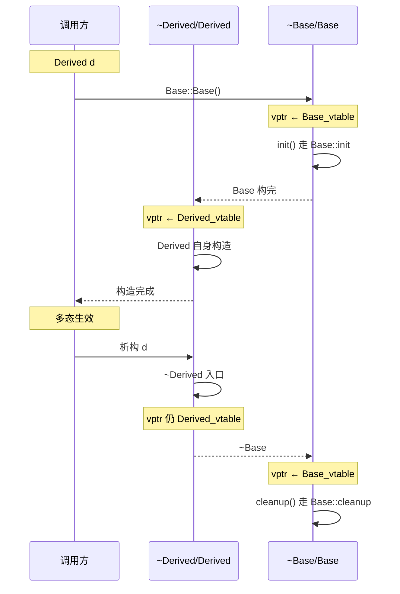
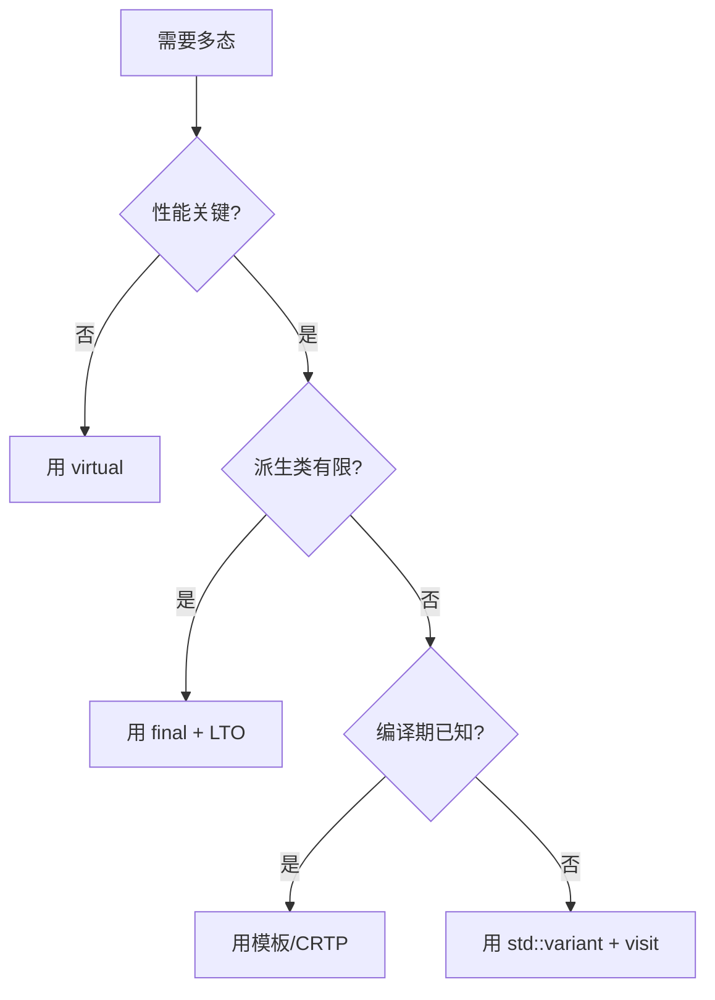

# 05.虚函数表深度剖析

#### 目录介绍
- [1. 案例引入](#1-案例引入)
  - [1.1 一段诡异的输出](#11-一段诡异的输出)
  - [1.2 顺藤摸到根因](#12-顺藤摸到根因)
  - [1.3 我们要回答什么](#13-我们要回答什么)
- [2. 架构概览](#2-架构概览)
  - [2.1 vtable的三个角色](#21-vtable的三个角色)
  - [2.2 为什么这么切](#22-为什么这么切)
- [3. vptr与对象头部](#3-vptr与对象头部)
  - [3.1 vptr的位置选择](#31-vptr的位置选择)
  - [3.2 vptr占用与对齐](#32-vptr占用与对齐)
  - [3.3 不含虚函数零开销](#33-不含虚函数零开销)
  - [3.4 godbolt实测验证](#34-godbolt实测验证)
- [4. vtable真实结构](#4-vtable真实结构)
  - [4.1 不止是函数指针表](#41-不止是函数指针表)
  - [4.2 offset_to_top字段](#42-offset-to-top字段)
  - [4.3 typeinfo指针位置](#43-typeinfo指针位置)
  - [4.4 vtable所在段](#44-vtable所在段)
- [5. 单继承vtable布局](#5-单继承vtable布局)
  - [5.1 派生类如何延伸](#51-派生类如何延伸)
  - [5.2 override覆盖条目](#52-override覆盖条目)
  - [5.3 调用过程汇编](#53-调用过程汇编)
  - [5.4 final优化机会](#54-final优化机会)
- [6. 多继承vtable](#6-多继承vtable)
  - [6.1 多个vptr共存](#61-多个vptr共存)
  - [6.2 子vtable布局](#62-子vtable布局)
  - [6.3 thunk调整深入](#63-thunk调整深入)
  - [6.4 dynamic_cast机制](#64-dynamic-cast机制)
- [7. 虚继承vbtable](#7-虚继承vbtable)
  - [7.1 菱形继承困境](#71-菱形继承困境)
  - [7.2 虚基类共享一份](#72-虚基类共享一份)
  - [7.3 vbptr与vbtable](#73-vbptr与vbtable)
  - [7.4 GCC与MSVC差异](#74-gcc与msvc差异)
- [8. 构造析构期vptr](#8-构造析构期vptr)
  - [8.1 vptr切换时机](#81-vptr切换时机)
  - [8.2 构造期间不多态](#82-构造期间不多态)
  - [8.3 汇编层切换证据](#83-汇编层切换证据)
  - [8.4 工程教训速记](#84-工程教训速记)
- [9. 反虚拟化优化](#9-反虚拟化优化)
  - [9.1 间接调用的代价](#91-间接调用的代价)
  - [9.2 final触发去虚化](#92-final触发去虚化)
  - [9.3 LTO跨TU去虚化](#93-lto跨tu去虚化)
  - [9.4 静态多态替代](#94-静态多态替代)
- [10. 综合案例串讲](#10-综合案例串讲)
  - [10.1 案例真相揭晓](#101-案例真相揭晓)
  - [10.2 一次虚调用的一生](#102-一次虚调用的一生)
  - [10.3 设计哲学回扣](#103-设计哲学回扣)
  - [10.4 vtable速查表格](#104-vtable速查表格)


## 1. 案例引入

### 1.1 一段诡异的输出

线上图像处理服务，引擎抽象层用了一套经典的"基类指针 + 虚函数"设计。某次重构后，**特定调用顺序下输出完全不对**——但单元测试全过：

```cpp
// engine.hpp —— 图像处理引擎抽象
class Engine {
public:
    Engine() {
        std::printf("[ctor] Engine, this=%p\n", (void*)this);
        init();                       // ← ① 构造期间调虚函数
    }
    virtual ~Engine() {
        std::printf("[dtor] Engine\n");
        cleanup();                    // ← ② 析构期间调虚函数
    }

    virtual void init()    { std::puts("Engine::init"); }
    virtual void cleanup() { std::puts("Engine::cleanup"); }
    virtual void process(const Image&) = 0;
};

class CudaEngine : public Engine {
    void* device_buf_ = nullptr;
public:
    CudaEngine() {
        std::printf("[ctor] CudaEngine, this=%p\n", (void*)this);
        cudaMalloc(&device_buf_, 1<<20);
    }
    ~CudaEngine() override {
        std::printf("[dtor] CudaEngine\n");
        cudaFree(device_buf_);
    }

    void init() override    { std::puts("CudaEngine::init: warm up GPU"); }
    void cleanup() override { std::puts("CudaEngine::cleanup: flush stream"); }
    void process(const Image& img) override { /* GPU kernel */ }
};

int main() {
    std::unique_ptr<Engine> e = std::make_unique<CudaEngine>();
    e->process(img);
}
```

**预期输出**：
```
[ctor] Engine, this=0x55a0b0
CudaEngine::init: warm up GPU       ← 期望调到派生版
[ctor] CudaEngine, this=0x55a0b0
... process ...
[dtor] CudaEngine
[dtor] Engine
CudaEngine::cleanup: flush stream   ← 期望调到派生版
```

**实际输出**：
```
[ctor] Engine, this=0x55a0b0
Engine::init                        ← ⚠️ 调的是基类版本
[ctor] CudaEngine, this=0x55a0b0
... process ...
[dtor] CudaEngine
[dtor] Engine
Engine::cleanup                     ← ⚠️ 又是基类版本
```

后果很严重：**GPU 没 warm up**，第一次 `process` 走了慢路径；**stream 没 flush**，析构时残留命令导致下一次启动 cudaMalloc 失败。

### 1.2 顺藤摸到根因

带着 8 个问号扒（这些后续章节会逐一回答）：

- **疑问 1**：明明 `e` 的类型是 `Engine*` 指向 `CudaEngine` 对象，为什么基类构造器里 `init()` 没走 `CudaEngine::init`？
- **疑问 2**：基类构造期间，对象到底"是不是 CudaEngine"？vptr 此刻指向哪张表？
- **疑问 3**：派生类构造完了，vptr 切换是哪条指令完成的？能在汇编里看到吗？
- **疑问 4**：析构反过来执行，vptr 是不是又被切回基类的表？
- **疑问 5**：能否 hack vptr，让基类构造器里也调到派生版本？（剧透：不能在不引入 UB 的前提下做到）
- **疑问 6**：vtable 是放在哪里的？为什么"指向同一类的所有对象"共享同一张？
- **疑问 7**：除了函数指针，vtable 里还有别的东西吗？dynamic_cast 怎么用它？
- **疑问 8**：多继承时是不是有多张 vtable？虚继承又多一层 vbtable，到底什么样？

GDB 验证 vptr 切换：

```bash
(gdb) b Engine::Engine
(gdb) r
(gdb) p *(void**)this        # 取对象前 8 字节 = vptr
$1 = 0x401d20 <vtable for Engine+16>     ← 此时是 Engine 的 vtable

(gdb) finish                  # 跳出 Engine 构造
(gdb) finish                  # 进入 CudaEngine 自身构造体
(gdb) p *(void**)this
$2 = 0x401d40 <vtable for CudaEngine+16>  ← vptr 已切换！
```

关键证据：**vptr 在两次构造之间被切换了两次**——这是基类构造期"虚函数走基类"的根本机制。

### 1.3 我们要回答什么

这 8 个问号的解答路径：

```
vptr在对象头 (第3章) ─→ 每个含虚函数的对象前8字节是vptr
   ↓
vtable真实结构 (第4章) ─→ 不止是函数指针表，还有offset_to_top与typeinfo
   ↓
单继承vtable布局 (第5章) ─→ 派生类延伸基类表，override直接覆盖条目
   ↓
多继承vtable (第6章) ─→ 多个vptr，每个子对象一个，thunk调整this
   ↓
虚继承vbtable (第7章) ─→ 菱形继承下虚基类共享，多一层vbptr
   ↓
构造析构vptr切换 (第8章) ─→ 案例核心答案
   ↓
反虚拟化优化 (第9章) ─→ 编译器如何把虚调用变直调
   ↓
综合串讲 (第10章) ─→ 案例彻底剖开
```

> 📌 **本篇定位**：[02.对象内存布局原理](https://yccoding.com/pages/c1a265/) 看的是"对象由什么组成"，[04.this指针与成员函数](https://yccoding.com/pages/b82b13/) 看的是"对象怎么知道自己是谁"，**本篇拆的是"对象怎么动态地知道自己该调谁"**——多态的引擎拆给你看。下游 [06.多重继承内存模型](https://yccoding.com/pages/71d916/) 会更深入多继承拓扑，本篇只到 vtable 结构层。


## 2. 架构概览

### 2.1 vtable的三个角色

理解虚函数表，先把**它在系统里扮演的三个角色**分开：

```
┌──────────────────────────────────────────────────────────┐
│  角色 1：编译期的"接口契约"                                  │
│  · 编译器把每个虚函数分配一个固定槽位（slot index）           │
│  · 同一类层次中，virtual 函数在 vtable 中的索引保持稳定       │
│  · override 不改变索引，只换该槽位的函数指针                  │
├──────────────────────────────────────────────────────────┤
│  角色 2：链接期的"只读数据"                                   │
│  · vtable 是编译器为每个含虚函数的类生成的一段静态数据         │
│  · 放在 .rodata（只读数据段），属于程序映像的一部分            │
│  · 同一类的所有对象共享同一张 vtable                          │
├──────────────────────────────────────────────────────────┤
│  角色 3：运行期的"间接调度表"                                  │
│  · 对象首部存 vptr（pointer to vtable）                      │
│  · 调用 obj->virt_fn() = (vtable[idx])(obj, ...)             │
│  · 运行期"动态类型"由 vptr 决定，与静态类型无关                │
└──────────────────────────────────────────────────────────┘
```

第 1 章案例的"基类构造里调到基类版本"，根本原因就是**第三角色的运行期判定**——vptr 此时还指向基类 vtable，不是派生类。

### 2.2 为什么这么切

**疑惑**：C++ 为什么要用"vtable + vptr"这种间接方式，而不像 Java 那样把虚函数信息放在对象头里的 class metadata 里？

**论证**：
1. **零开销原则**——含虚函数的类才付 vptr 的 8 字节代价；不含的类（如 `struct Point { int x,y; }`）**完全不付**。Java 所有对象都有 16 字节的 object header，哪怕只是个 Integer。
2. **缓存友好**——vtable 是只读、跨对象共享的，CPU 把它缓在 L1/L2 后所有同类对象的虚调用都受益。如果每个对象自带"类信息"，cache footprint 会爆炸。
3. **编译期固定 slot**——基类与派生类共享 slot 索引这一约定让编译器在调用方**不需要符号表查找**，直接 `[vptr+constant]` 就能找到目标函数。这是 C++ 虚调用比 Smalltalk / ObjC 的"selector dispatch"快一个数量级的原因。
4. **链接期解析灵活**——vtable 在 .rodata，链接器可以做 vtable consolidation（多个 TU 同名 vtable 合并）、`--gc-sections` 删除未引用的虚函数、ThinLTO 跨 TU 反虚拟化。
5. **反向论证**——如果不用 vtable，把虚函数指针打散在对象里，**继承时派生类就没法"复用"基类布局**，多态就接不起来；如果像 ObjC 那样按"消息名"查找，每次虚调用要做哈希查找，性能损失 3-10 倍。

**结论**：vtable 是 C++ 在"零开销 + 强类型 + 静态多态优先"三方约束下的最优解——它把"动态分派"压缩成一次内存间接 + 一次函数跳转，是 C++ 多态的物理引擎。

```mermaid
flowchart LR
    A[源码 obj-&gt;f] --&gt; B[编译期]
    B --&gt; C[确定slot=N]
    A --&gt; D[运行期]
    D --&gt; E[读 obj 处 vptr]
    E --&gt; F[读 vptr+N*8 处函数地址]
    F --&gt; G[call 该地址]
```

下面我们从对象头部的 vptr 开始往下挖。


## 3. vptr与对象头部

### 3.1 vptr的位置选择

**问题**：vptr 放对象的开头还是结尾？

C++ 标准没规定，但**主流 ABI（Itanium ABI、MSVC ABI）都选了开头**——出于三个考虑：

1. **基类指针即派生类指针**——单继承下，`Derived*` 转 `Base*` 不需要调整偏移；vptr 放在头部，基类的 vptr 也在头部，**强制转换零成本**。
2. **dynamic_cast 入口**——`dynamic_cast<Derived*>(base_ptr)` 第一步就是读 vptr，放在头部 `[ptr+0]` 一条指令搞定。
3. **缓存预取效率**——首次访问对象时大概率要调虚函数，CPU 预取的第一个 cache line 就含 vptr。

历史插曲：**早期 cfront 把 vptr 放在末尾**，结果发现单继承的 upcasting 要做指针调整，性能不如头部派——后来全部统一到头部。

```cpp
class Base { virtual void f(); int a; };
class Derived : public Base { int b; };
```

对象布局（Itanium ABI）：

```
Derived 对象（共 24 字节）：
┌────────────┐ + 0    ← vptr（指向 Derived 的 vtable）
│ vptr       │
├────────────┤ + 8    ← Base::a
│ a          │
├────────────┤ + 12
│ pad        │
├────────────┤ + 16   ← Derived::b
│ b          │
└────────────┘ + 20+pad → 24
```

`Base*` 指向同一对象时：
```
Base*  ─→ ┌─ vptr ─┐    （指向 Derived 的 vtable，不是 Base 的）
          │   a    │
          └────────┘
```

**注意**：`Base*` 看到的 vptr 仍然指向 Derived 的 vtable——这正是多态的根。

### 3.2 vptr占用与对齐

**vptr 大小** = 一个指针的大小 = 64 位平台上 **8 字节**，32 位平台 4 字节。

**vptr 对齐** = 指针对齐 = 8 字节（64 位）。

**含虚函数的类，对齐至少是 alignof(void*) = 8**：

```cpp
class C {
    virtual void f();
    char c;       // 1 字节
};
static_assert(sizeof(C) == 16);     // vptr 8 + c 1 + pad 7 = 16
static_assert(alignof(C) == 8);     // 因为含 vptr
```

对比不含虚函数的：

```cpp
class D {
    char c;
};
static_assert(sizeof(D) == 1);      // 没有 vptr
static_assert(alignof(D) == 1);
```

**结论**：把一个原本"小巧"的类加上一个 virtual 函数，size 至少跳到 16 字节、对齐升到 8——这是"加 virtual 看起来无害但实际有重量"的物理代价。

### 3.3 不含虚函数零开销

C++ 严守"零开销原则"：**不含虚函数的类，不带 vptr**。

```cpp
struct Point2D {
    double x, y;        // 没有任何 virtual
};
static_assert(sizeof(Point2D) == 16);   // 就是 2*sizeof(double)，没多余字节
```

```cpp
struct Vec3D : Point2D {
    double z;
};
static_assert(sizeof(Vec3D) == 24);     // 仍然没有 vptr
```

**对比 Java**：`new Point2D(1,2)` 至少 24 字节（16 字节 mark word + class pointer + 8 字节 x + 8 字节 y），**Java 的所有对象都是"有元信息的"**。

这是为什么 C++ 数值计算库（Eigen、Blaze）能把矩阵元素直接映射到内存——**没有 vptr 污染**。

### 3.4 godbolt实测验证

GCC 13.2，`-O2`：

```cpp
class Animal {
public:
    virtual void speak() { std::puts("..."); }
};

void test(Animal* a) {
    a->speak();
}
```

汇编：

```nasm
test(Animal*):
        mov     rax, QWORD PTR [rdi]      ; ① 读 vptr（对象头）
        jmp     [QWORD PTR [rax]]         ; ② 通过 vptr 找 speak，跳转
```

**两条指令完成虚调用**：第 ① 条读 vptr（一次 cache 访问），第 ② 条间接跳转（流水线代价 0~5 cycles，取决于分支预测器）。

把同样逻辑用 C 风格函数指针手写：

```cpp
struct Animal_C {
    void (*speak)(struct Animal_C*);
};

void test_c(struct Animal_C* a) {
    a->speak(a);
}
```

```nasm
test_c:
        mov     rax, QWORD PTR [rdi]      ; ① 读函数指针
        jmp     rax                       ; ② 跳转
```

**几乎一致**——证明 C++ 虚调用与 C 函数指针调用等价开销。**vtable 没让 C++ 慢**，慢的是"间接调用"本身（任何语言一样）。


## 4. vtable真实结构

### 4.1 不止是函数指针表

教科书简化版："vtable 就是一个函数指针数组"——**不准确**。Itanium ABI 下的 vtable 至少含三类条目：

```
完整 vtable 结构（Itanium ABI）：
┌─────────────────────────┐ ← vtable symbol 起始
│ offset_to_top  (-N)     │   多继承时的偏移修正值
├─────────────────────────┤
│ typeinfo*      (RTTI)   │   指向 std::type_info 对象
├─────────────────────────┤ ← vptr 实际指向这里（位于第 3 个槽）
│ virtual_fn[0]           │
├─────────────────────────┤
│ virtual_fn[1]           │
├─────────────────────────┤
│ ...                     │
├─────────────────────────┤
│ virtual_fn[N-1]         │
└─────────────────────────┘
```

**关键点**：vptr 指向的不是 vtable 起始地址，而是**第一个虚函数指针**——前两个槽（offset_to_top、typeinfo）位于 vptr 的负偏移处。

```cpp
// vptr[-2] = offset_to_top
// vptr[-1] = typeinfo*
// vptr[0]  = 第 1 个虚函数
// vptr[1]  = 第 2 个虚函数
```

实测：

```cpp
class Animal {
public:
    virtual void speak() {}
    virtual void eat()   {}
};

Animal a;
void** vptr = *(void***)&a;
std::printf("offset_to_top = %ld\n", (long)vptr[-2]);   // 0（单继承根类）
std::printf("typeinfo      = %p\n", vptr[-1]);           // &typeid(Animal)
std::printf("speak         = %p\n", vptr[0]);
std::printf("eat           = %p\n", vptr[1]);
```

### 4.2 offset_to_top字段

**作用**：在多继承场景下，从对象的"某个子对象"回到完整对象起点的偏移量。

```cpp
class A { virtual void fa(); };
class B { virtual void fb(); };
class C : public A, public B { };
```

C 对象布局：

```
&c ─→ ┌──────────────┐ + 0     ← C 的 A 子对象
      │ vptr_A_in_C  │
      ├──────────────┤ + 8
      │ ...          │
      ├──────────────┤ + 16    ← C 的 B 子对象
      │ vptr_B_in_C  │
      └──────────────┘
```

C 实际有**两张 sub-vtable**（统一在一个 vtable group 里）：

```
vtable group for C:
┌──────────────────────────┐
│ offset_to_top = 0        │  ← 给 A 子对象用
│ typeinfo = &typeid(C)    │
│ &C::fa                   │  ← vptr_A_in_C 指向这里
├──────────────────────────┤
│ offset_to_top = -16      │  ← 给 B 子对象用：从 +16 回到 0 要 -16
│ typeinfo = &typeid(C)    │
│ thunk-to-C::fb           │  ← vptr_B_in_C 指向这里
└──────────────────────────┘
```

**用途**：`dynamic_cast<C*>(b_ptr)` 时，从 vptr_B_in_C 找到 offset_to_top = -16，把 b_ptr 加上 -16 就回到了完整 C 对象的起点。这是 dynamic_cast 能"穿透"多继承的物理依据。

### 4.3 typeinfo指针位置

vptr[-1] 指向 `std::type_info` 对象——这是 RTTI（运行时类型识别）的入口。

```cpp
class Base { virtual void f(); };
class Derived : public Base { void f() override; };

Base* p = new Derived;
const std::type_info& ti = typeid(*p);     // ← 通过 vptr[-1] 取
std::cout << ti.name();                     // 输出："Derived" 的 mangled 名
```

`typeid(*p)` 编译器生成的代码：

```cpp
// 等价伪代码
type_info* ti = ((void***)p)[0][-1];      // p->vptr[-1]
```

第 15 篇《RTTI与dynamic_cast》会专门讲 type_info 的结构（包含父类链信息），本节只确认它**就放在 vptr 之前一个槽**。

**禁用 RTTI 的影响**：`-fno-rtti` 编译时，typeinfo 槽仍然存在（保持 vtable layout 兼容），但内容是空指针；`typeid` 和 `dynamic_cast` 都会编译失败。

### 4.4 vtable所在段

**vtable 是只读静态数据，存在 .rodata 段**：

```bash
$ g++ -c animal.cpp -o animal.o
$ readelf -S animal.o | grep -E '(rodata|name)'
[ 4] .rodata           PROGBITS         ...     READ
[ 5] .data.rel.ro      PROGBITS         ...     READ + WRITE-once（动态库重定位用）

$ objdump -d animal.o | grep -A 5 "_ZTV6Animal"     # _ZTV = vtable for ...
0000000000000000 <_ZTV6Animal>:
   0:   00 00 00 00 00 00 00 00     # offset_to_top = 0
   8:   00 00 00 00 00 00 00 00     # typeinfo*（链接时填）
  10:   00 00 00 00 00 00 00 00     # &Animal::speak
```

**为什么放 .rodata**：
- 进程映射时段属性：read-only，只读保护防止"写 vtable"攻击
- 多进程共享同一进程映像，vtable 物理页只占一份
- `--gc-sections` 可以删除未引用的 vtable

**有趣的边界**：动态库（.so）里的 vtable 放在 `.data.rel.ro`——这个段表示"启动时需要做 PIC 重定位、之后变只读"。原因：vtable 里的函数指针在加载时要根据 ASLR 偏移重写，重写完后切只读。

**vtable 符号名**（Itanium ABI）：

| 符号前缀 | 含义 |
|---|---|
| `_ZTV` | vtable for class |
| `_ZTI` | typeinfo for class |
| `_ZTS` | typeinfo name string |
| `_ZTT` | construction vtable table（虚继承用）|
| `_ZTh` | non-virtual thunk |
| `_ZTv` | virtual thunk |

```bash
$ nm -C libfoo.so | grep "vtable for"
0000000000201d20 V vtable for Engine
0000000000201d50 V vtable for CudaEngine
```


## 5. 单继承vtable布局

### 5.1 派生类如何延伸

单继承场景，派生类的 vtable **继承基类的 slot 编号**，并在末尾追加自己新增的虚函数。

```cpp
class Base {
public:
    virtual void f();    // slot 0
    virtual void g();    // slot 1
};

class Derived : public Base {
public:
    void f() override;   // 仍在 slot 0，但函数指针换成 Derived::f
    virtual void h();    // slot 2（新增）
};
```

vtable 布局对比：

```
vtable for Base:                  vtable for Derived:
┌────────────────┐                ┌────────────────┐
│ offset_to_top  │                │ offset_to_top  │
│ typeinfo Base  │                │ typeinfo Deriv │
├────────────────┤ ← vptr_Base    ├────────────────┤ ← vptr_Derived
│ &Base::f       │ slot 0         │ &Derived::f    │ slot 0（覆盖）
│ &Base::g       │ slot 1         │ &Base::g       │ slot 1（继承）
└────────────────┘                │ &Derived::h    │ slot 2（新增）
                                  └────────────────┘
```

**关键**：slot 编号在类层次中**永远稳定**——这是为什么调用方编译时就能确定"调 vtable[1]"，运行时不需要查找。

### 5.2 override覆盖条目

`override` 关键字（C++11）让编译器**强制检查**：声明的函数在基类中必须真存在虚函数同名同签名。

```cpp
class Base {
public:
    virtual void f(int);
    virtual void g() const;
};

class Derived : public Base {
public:
    void f(int) override;          // ✅ OK
    void g() override;             // ❌ error: marked override but not const
    void h() override;             // ❌ error: 'h' not in base
};
```

**没有 override 关键字的悲剧**：

```cpp
class Base { public: virtual void onClick(int x); };
class Button : public Base {
public:
    void onClick(int X);    // ⚠️ 写错大小写——编译器认为这是个新函数
};
// 结果：Button 多了一个新虚函数 slot，原 onClick(int) 仍走 Base 版
// 用户点按钮时调到 Base::onClick，实际什么都没发生
```

**铁律**：所有 override 函数必须加 `override`——这是 C++11 之后**最低成本、最大收益**的代码规范之一。

### 5.3 调用过程汇编

```cpp
class Base { public: virtual void f(); virtual void g(); };
class Derived : public Base { public: void f() override; };

void test(Base* p) {
    p->g();
}
```

`-O2` 汇编：

```nasm
test(Base*):
        mov     rax, QWORD PTR [rdi]       ; ① 读 vptr：rax = obj.vptr
        jmp     [QWORD PTR [rax+8]]        ; ② vtable[1] = &g，跳过去
                                            ;   注意 +8 = slot 1 * sizeof(ptr)
```

调用 `p->f()` 则是 `[rax+0]`，调用 `p->h()`（如有）则是 `[rax+16]`——**slot 索引在编译期就成了立即数偏移**。

### 5.4 final优化机会

`final` 关键字告诉编译器"这个函数（或类）不会再被重写"——**编译器据此把虚调用变直调**：

```cpp
class Base { public: virtual void f(); };
class Derived final : public Base {       // ← 整个类 final
public:
    void f() override;
};

Derived d;
d.f();      // ← 静态类型 = 动态类型 + final → 编译器直接调 Derived::f，零间接

Derived* p = ...;
p->f();     // ← 同样直调（即使是指针）
```

```cpp
class Base {
public:
    virtual void f();
    virtual void g() final;       // ← 仅这一个函数 final
};

void test(Base& b) {
    b.f();    // 仍然是虚调用
    b.g();    // 直调（编译器知道不会被覆盖）
}
```

**实战收益**：
- 把可枚举的 leaf class 标 `final`，热点路径上的虚调用消除
- LLVM 的 ThinLTO 看到 final 后，跨 TU 也能去虚化
- 减小 vtable（如果整个类 final，可不生成新 vtable，复用基类 vtable + 修正槽）

第 9 章详细讲 LTO 跨 TU 反虚拟化。


## 6. 多继承vtable

### 6.1 多个vptr共存

多继承时，对象**含多个 vptr**——每个非空基类一个：

```cpp
class A {
public:
    virtual void fa();
    int a = 1;
};

class B {
public:
    virtual void fb();
    int b = 2;
};

class C : public A, public B {
public:
    void fa() override;
    void fb() override;
    virtual void fc();
};

C c;
```

C 对象布局：

```
&c ─→ ┌──────────────┐ + 0     ← A 子对象起点
      │ vptr_A       │   8     ← 指向 vtable_C 中的 A 部分
      │ a            │   4
      │ pad          │   4
      ├──────────────┤ + 16    ← B 子对象起点
      │ vptr_B       │   8     ← 指向 vtable_C 中的 B 部分
      │ b            │   4
      │ pad          │   4
      └──────────────┘ + 32    （C 自己没新数据成员）

sizeof(C) = 32（含两个 vptr）
```

**单继承只有一个 vptr，多继承有 N 个 vptr**——这就是多继承的物理代价。

### 6.2 子vtable布局

C 的完整 vtable group：

```
vtable group for C（连续放在 .rodata）：
┌─────────────────────────────┐
│ offset_to_top = 0           │ ← A 子表
│ typeinfo for C              │
│ &C::fa                      │ slot 0 (A 的)
├─────────────────────────────┤
│ offset_to_top = -16         │ ← B 子表
│ typeinfo for C              │
│ thunk-16 to C::fb           │ slot 0 (B 的)
└─────────────────────────────┘
```

`vptr_A` 指向第一段的"&C::fa"位置；`vptr_B` 指向第二段的"thunk to C::fb"位置。

注意：**fc 在哪儿**？

C++ 标准规定：**派生类新增的虚函数追加到第一个非空基类的子表**——所以 fc 跟在 fa 之后：

```
A 子表：
│ offset_to_top = 0           │
│ typeinfo for C              │
│ &C::fa                      │ slot 0
│ &C::fc                      │ slot 1（C 新增）
```

**为什么追加到 A 子表**：调用 `c.fc()` 时，c 直接当 A 子对象用最自然（vptr_A 在 +0）。

### 6.3 thunk调整深入

第 04 篇 7.3 节展示了 thunk 的简单形式，本节深入。

**问题**：调用 `b_ptr->fb()` 时，b_ptr 指向 B 子对象（C 的 +16 处），但 `C::fb` 函数体内访问 `a`（A 的成员）需要 this = +0。如何调整？

**方案**：vtable 条目不直接放 `&C::fb`，而是放一个 thunk：

```nasm
; non-virtual thunk to C::fb()  （GCC 生成的小桥）
_ZThn16_N1C2fbEv:
        sub     rdi, 16              ; this -= 16，从 B 子对象回到 C 起点
        jmp     _ZN1C2fbEv           ; jump 到真正的 C::fb（不是 call，节省一层栈）
```

调用全过程：

```cpp
B* pb = &c;        // pb = &c + 16
pb->fb();          // 走 vptr_B → vtable_B → thunk → C::fb
```

```nasm
        ; pb 在 rdi 中（值为 &c + 16）
        mov     rax, [rdi]                 ; rax = vptr_B
        jmp     [rax]                      ; 跳到 thunk
        ; --- thunk 内 ---
        sub     rdi, 16                    ; rdi = &c
        jmp     _ZN1C2fbEv                 ; 跳到 C::fb，rdi 已经是正确 this
```

**性能影响**：多继承的虚调用 = 普通虚调用 + 1 条 sub 指令（约 0.25 cycle），几乎可忽略。但 vtable 体积膨胀（每个调整路径一个 thunk）。

### 6.4 dynamic_cast机制

`dynamic_cast<Derived*>(base_ptr)` 走 vtable 的 typeinfo 链做运行时检查：

```cpp
B* pb = ...;
C* pc = dynamic_cast<C*>(pb);
```

伪代码（极简版）：

```cpp
void* dynamic_cast_impl(void* p, type_info* src_ti, type_info* dst_ti) {
    if (!p) return nullptr;

    // ① 通过 p 取 vptr
    void** vptr = *(void***)p;

    // ② 取 offset_to_top（vptr[-2]）和 typeinfo（vptr[-1]）
    ptrdiff_t off_top = (ptrdiff_t)vptr[-2];
    type_info* obj_ti = (type_info*)vptr[-1];

    // ③ 回到完整对象起点
    void* most_derived = (char*)p + off_top;

    // ④ 在完整对象的类型中查找 dst_ti（沿父类链）
    return obj_ti->find_subobject(dst_ti, most_derived);
}
```

**性能特征**：
- 简单单继承：约 5-10 ns
- 多继承：要遍历父类链，可能 50-100 ns
- 失败的转型：要遍历完整链才能确定，更慢

**优化建议**：
- 性能敏感路径用 `static_cast`（前提：你知道类型）
- 用 enum tag + visitor 替代频繁 dynamic_cast（见 16 篇类型擦除）
- 用虚函数 `clone()` / 回调式分派替代类型查询

第 15 篇会详细剖析 dynamic_cast 的实现细节。


## 7. 虚继承vbtable

### 7.1 菱形继承困境

**菱形继承**：两条继承路径汇于一个共同基类。

```cpp
class A { public: int data; };
class B : public A {};
class C : public A {};
class D : public B, public C {};

D d;
d.data = 42;     // ❌ ambiguous：B::A::data 还是 C::A::data？
```

如果不加干预，D 对象包含**两份 A 子对象**：

```
&d ─→ ┌────────┐    ← B 子对象
      │ A_B    │       ┌─ data（B 路径）
      ├────────┤    ← C 子对象
      │ A_C    │       ┌─ data（C 路径）
      └────────┘
```

**虚继承**让所有继承路径**共享同一份 A 子对象**：

```cpp
class A { public: int data; };
class B : virtual public A {};       // 虚继承
class C : virtual public A {};       // 虚继承
class D : public B, public C {};

D d;
d.data = 42;     // ✅ 不再有歧义，data 是唯一的
```

### 7.2 虚基类共享一份

虚继承下 D 对象布局：

```
&d ─→ ┌──────────────┐ + 0     ← B 子对象
      │ vbptr_B      │   ← 指向 B 的 vbtable，内含 "A 子对象的偏移"
      │ B 自己数据    │
      ├──────────────┤ + ?     ← C 子对象
      │ vbptr_C      │
      │ C 自己数据    │
      ├──────────────┤ + ?     ← 唯一的 A 子对象（共享）
      │ A::data      │
      └──────────────┘
```

**关键变化**：A 的位置不再固定为 "B 的偏移 + sizeof(B)"——而是由 D 决定，B 自己**事先不知道**。所以 B 必须通过 **vbptr → vbtable** 间接定位 A。

### 7.3 vbptr与vbtable

**vbtable**（virtual base table）是一张专门记录"虚基类偏移"的表：

```cpp
// 假设 sizeof(A) = 4, sizeof(B 自身数据) = 4
// 在独立 B 对象中：A 位置 = +8（vbptr 8 字节后）
// 在 D 对象中：    A 位置 = +24（B 8 字节 + C 16 字节）

vbtable for B-in-D:
┌────────────────────────┐
│ offset to A = 24       │ ← 在 D 对象上下文中
└────────────────────────┘

vbtable for B-standalone:
┌────────────────────────┐
│ offset to A = 8        │ ← 独立 B 对象
└────────────────────────┘
```

D 构造时，把 B 子对象的 vbptr 指向"B-in-D 版"的 vbtable；独立 B 对象时，指向"B-standalone 版"。

访问 `b_ref.data` 时（b_ref 是 B&）：

```nasm
        mov     rax, [rdi]              ; rax = vbptr
        mov     rax, [rax]              ; rax = vbtable[0] = A 偏移
        mov     eax, [rdi + rax]        ; 取 A::data
```

**三次内存访问** vs 单继承的一次——这是虚继承的成本。

### 7.4 GCC与MSVC差异

虚继承的实现 **GCC（Itanium ABI）和 MSVC 有显著差异**：

| 维度 | GCC（Itanium） | MSVC |
|---|---|---|
| 虚基类偏移存放位置 | 合并进 vtable，通过 vptr 取 | 独立 vbptr + vbtable |
| 对象大小 | 略小（无独立 vbptr） | 略大（多 vbptr 字段） |
| 虚基类访问开销 | 1-2 次间接 | 2-3 次间接 |
| ABI 兼容 | Itanium 标准 | MSVC 私有 |

GCC 风格下，"虚基类偏移"也藏在 vtable 里——通过 `vptr[-3]` 之类的负偏移取（具体偏移随 vtable 结构）。

**实战劝告**：
- **能不用虚继承就不用**——三次间接 + ABI 差异 + 心智负担
- 用 **mixin / interface / 组合** 替代菱形继承
- 真要用，**所有路径都加 virtual**，避免出现"半虚"的歧义

第 06 篇会更深入虚继承的对象拓扑、构造顺序、vtable 与 vbtable 的协同。


## 8. 构造析构期vptr

### 8.1 vptr切换时机

**核心规则**（[class.cdtor]/4）：

> 在类 C 的构造函数和析构函数执行期间，对象的"动态类型"是 **C 自身**——不是任何派生类。
>
> 所以构造/析构期间调用虚函数，调到的是 C 这一层的版本。

实现机制：**编译器在每个构造函数的最开头，插入"vptr = C 的 vtable"这条赋值；析构函数同理**。

构造调用链中 vptr 的演变（以 `Derived d` 为例）：

```
时刻 t1：Derived 构造开始，先调 Base::Base()
        Base::Base() 入口插入：this->vptr = &Base_vtable;
        → 此时 vptr = Base_vtable
        → init() 调到 Base::init

时刻 t2：Base::Base() 结束，回到 Derived::Derived()
        Derived::Derived() 入口插入：this->vptr = &Derived_vtable;
        → 此时 vptr = Derived_vtable
        → 此后调虚函数走派生版本

时刻 t3：进入 ~Derived()
        ~Derived() 入口插入：this->vptr = &Derived_vtable;（已经是了）
        → 调虚函数走 Derived

时刻 t4：~Derived() 体内执行完，进入 ~Base()
        ~Base() 入口插入：this->vptr = &Base_vtable;
        → 调虚函数又回到 Base 版本
```



### 8.2 构造期间不多态

第 1 章案例的核心机理就在这里——**Engine 构造器里调 init() 时，vptr 指向 Engine_vtable，所以走的是 Engine::init**。

为什么 C++ 这么设计？因为派生类的成员**还没有构造**：

```cpp
class Base {
public:
    Base() { init(); }
    virtual void init() { /* 默认 */ }
};

class Derived : public Base {
    std::vector<int> buf_;
public:
    Derived() : buf_(1024) {}
    void init() override {
        buf_.resize(2048);    // ⚠️ 如果 Base() 调到这里，buf_ 还没构造！
    }
};
```

如果 Base 构造期间多态调到 Derived::init，访问 `buf_` 就是访问**未初始化内存** → UB。

C++ 选择了**安全的语义**：**构造期间动态类型 = 当前正在构造的类**——保证你不会访问到未构造的派生成员。

### 8.3 汇编层切换证据

godbolt 实测，看构造器开头那条 vptr 赋值：

```cpp
class Base {
public:
    virtual void f();
    Base() {}
};

class Derived : public Base {
public:
    void f() override;
};
```

`Base::Base` 的汇编：

```nasm
Base::Base() [base object constructor]:
        mov     QWORD PTR [rdi], OFFSET FLAT:vtable for Base+16
        ;                                    ↑ 注意 +16
        ;                                    跳过 offset_to_top + typeinfo
        ;                                    指向第一个虚函数槽
        ret
```

`Derived::Derived` 的汇编：

```nasm
Derived::Derived() [complete object constructor]:
        mov     QWORD PTR [rdi], OFFSET FLAT:vtable for Base+16
        ;       ↑ 第一步：先调用 Base::Base，这个赋值实际上发生在 Base::Base 体内
        call    Base::Base() [base object constructor]
        mov     QWORD PTR [rdi], OFFSET FLAT:vtable for Derived+16
        ;       ↑ 第二步：Base 构造完，把 vptr 切换到 Derived 的 vtable
        ret
```

**两次写 vptr 的指令清晰可见**：
- 第一次：在 Base::Base 体内，写 vtable_Base
- 第二次：Base::Base 返回后，Derived::Derived 体内，写 vtable_Derived

析构反过来：

```nasm
Derived::~Derived() [complete object destructor]:
        mov     QWORD PTR [rdi], OFFSET FLAT:vtable for Derived+16
        ; ... ~Derived 体内代码 ...
        call    Base::~Base()

Base::~Base():
        mov     QWORD PTR [rdi], OFFSET FLAT:vtable for Base+16
        ; ... ~Base 体内代码 ...
        ret
```

### 8.4 工程教训速记

```
1. ✗ 永远不要在构造/析构中调用虚函数期望多态
2. ✗ 永远不要让线程在对象构造未完成时访问 this
3. ✓ 用两阶段初始化：构造完后调用 init()
4. ✓ 用工厂函数：保证返回时对象已完整
5. ✓ 用 final + 模板替代部分虚调用场景
```

**两阶段初始化模板**：

```cpp
class Engine {
protected:
    Engine() = default;                      // 不在构造里调虚函数
public:
    template<class T, class... Args>
    static std::unique_ptr<T> create(Args&&... args) {
        auto p = std::unique_ptr<T>(new T(std::forward<Args>(args)...));
        p->init();        // ← 此时对象完整，多态生效
        return p;
    }
    virtual ~Engine() = default;
    virtual void init() = 0;                  // 派生类必须实现
    virtual void process(const Image&) = 0;
};

auto e = Engine::create<CudaEngine>();
e->process(img);                              // ✅ init() 已正常调到 CudaEngine 版本
```


## 9. 反虚拟化优化

### 9.1 间接调用的代价

虚调用的"两条指令"看起来便宜，但实际成本由**间接跳转的不可预测性**决定：

| 调用类型 | 典型延迟 | 备注 |
|---|---|---|
| 直接调用（call imm） | 1-2 cycles | 完美预测 |
| 虚调用（间接 jmp） | 2-25 cycles | 取决于 BTB（branch target buffer）命中 |
| 虚调用 + cache miss | 100+ cycles | vptr 不在 L1 |

**真正的痛点不是延迟**，而是**编译器无法跨虚调用做优化**：

```cpp
class Filter {
public:
    virtual int apply(int x) = 0;
};

void process(Filter* f, int* arr, size_t n) {
    for (size_t i = 0; i < n; ++i) {
        arr[i] = f->apply(arr[i]);   // ← 编译器无法内联，无法 SIMD 化
    }
}
```

如果 `apply` 不是虚函数，编译器能内联进循环 + SIMD 化 + 循环展开——**性能差一个数量级很常见**。

### 9.2 final触发去虚化

`final` 让编译器在静态类型已知的情况下"假装这就是实际类型"，直接调直函数：

```cpp
class Filter {
public:
    virtual int apply(int x) = 0;
};

class AddOne final : public Filter {     // ← 类 final
public:
    int apply(int x) override { return x + 1; }
};

void test(AddOne& f) {                   // ← 静态类型 AddOne，且 final
    f.apply(5);                          // 直调 AddOne::apply，可内联
}
```

汇编：

```nasm
test(AddOne&):
        mov     edi, 5
        call    AddOne::apply(int)       ; 直调，没有 [rdi] 取 vptr
        ; 甚至可能直接展开为 add eax, 1
```

**收益**：
- 消除间接跳转
- 允许内联
- 允许循环优化、SIMD

**实战推广**：
- leaf 类一律加 `final`
- 单个 override 的虚函数也可加 `final`：`void apply(int x) override final;`

### 9.3 LTO跨TU去虚化

普通编译模式下，编译器只看一个 TU——它不知道整个程序中是否真的有"非 final 派生类"。LTO（链接期优化）打通这层。

```cpp
// engine.h
class Engine { virtual void run(); };

// engine.cpp
class FastEngine : public Engine { void run() override; };

// main.cpp
int main() {
    Engine* e = make_engine();           // 编译器不知道实际类型
    e->run();                            // 普通编译：虚调用
}
```

打开 LTO（GCC：`-flto`，Clang：`-flto=thin`）后：

- 链接器看到全程序只有 `FastEngine` 一个派生
- 编译器**推断 e 的实际类型必然是 FastEngine**
- 把 `e->run()` 替换为 `FastEngine::run()` 直调
- 进一步**内联** FastEngine::run 的代码

观察去虚化效果：

```bash
g++ -O2 -flto -fdump-ipa-devirt main.cpp engine.cpp
# 生成 *.ipa-devirt 文件，里面记录被去虚化的调用
```

**ThinLTO 对超大代码库的去虚化更激进**——这是为什么 Chrome、LLVM 自身、GCC 都用 LTO 编自己。

### 9.4 静态多态替代

如果性能关键路径上虚调用代价不能接受，用**静态多态**：

```cpp
// 模板 + 概念约束（C++20）
template<class F>
requires requires(F f, int x) { { f.apply(x) } -> std::same_as<int>; }
void process(F& f, int* arr, size_t n) {
    for (size_t i = 0; i < n; ++i)
        arr[i] = f.apply(arr[i]);
}

struct AddOne { int apply(int x) { return x + 1; } };
struct MulTwo { int apply(int x) { return x * 2; } };

AddOne f1; process(f1, arr, n);    // 编译器为 AddOne 实例化一份
MulTwo f2; process(f2, arr, n);    // 为 MulTwo 实例化另一份
```

**收益**：
- 零虚调用，全部内联
- 配合 SIMD 性能能逼近手写汇编

**代价**：
- 二进制膨胀（每种类型一份代码）
- 模板编译期变长
- 接口边界变弱（必须类型擦除才能跨边界传递）

**第 16 篇《类型擦除技术原理》** 详细讲"如何在保持虚多态接口的同时，用类型擦除做到接近静态多态的性能"——`std::function` / `std::any` / Sean Parent 模式都在那一篇。




## 10. 综合案例串讲

### 10.1 案例真相揭晓

回到第 1 章 Engine/CudaEngine 的事故，所有疑问的答案：

| 疑问 | 答案 |
|---|---|
| ① 为什么基类构造里 init() 没调派生版？ | 8.1：构造期间动态类型 = 当前类，vptr 指向 Engine 的 vtable |
| ② vptr 此刻指向哪张表？ | 8.3：`mov [rdi], OFFSET vtable_for_Engine+16` |
| ③ 派生构造器何时切换 vptr？ | 8.3：CudaEngine::CudaEngine 入口处插入"vptr = vtable_for_CudaEngine" |
| ④ 析构是否切回基类 vptr？ | 8.3：~Engine 入口处再次写 vtable_for_Engine |
| ⑤ 能 hack vptr 让构造期多态吗？ | 8.4：可以但是 UB，且派生成员可能未构造 |
| ⑥ vtable 放哪儿、为什么共享？ | 4.4：放 .rodata，链接期生成，同类对象共享一张 |
| ⑦ vtable 还有别的内容吗？ | 4.1-4.3：offset_to_top + typeinfo + 函数指针 |
| ⑧ 多继承/虚继承长啥样？ | 第 6/7 章：多继承多个 vptr，虚继承多 vbptr |

**修复方案**：

```cpp
// 方案 1：两阶段初始化（推荐）
class Engine {
protected:
    Engine() = default;
public:
    template<class T, class... Args>
    static std::unique_ptr<T> create(Args&&... args) {
        auto p = std::unique_ptr<T>(new T(std::forward<Args>(args)...));
        p->init();         // 此时多态可用
        return p;
    }
    virtual ~Engine() {
        // 不在这里调虚函数；让派生类自己在 dtor 里清理
    }
    virtual void init() = 0;
    virtual void process(const Image&) = 0;
};

class CudaEngine : public Engine {
    void* device_buf_ = nullptr;
public:
    CudaEngine() = default;
    ~CudaEngine() override {
        // 派生 dtor 直接清理自己的资源
        if (device_buf_) cudaFree(device_buf_);
    }
    void init() override {
        cudaMalloc(&device_buf_, 1<<20);
        std::puts("CudaEngine::init: warm up GPU");
    }
    void process(const Image&) override { /* ... */ }
};

auto e = Engine::create<CudaEngine>();   // ✅ init() 正确调到 CudaEngine 版本
```

修复后预期与实际输出一致：

```
[ctor] Engine
[ctor] CudaEngine
CudaEngine::init: warm up GPU      ← ✅ 正确
[dtor] CudaEngine                   ← 派生析构里 cudaFree
[dtor] Engine
```

### 10.2 一次虚调用的一生

把 `e->process(img)` 这一行从源码到 CPU：

```
e->process(img)
        │
        ├─ 编译期
        │   ├─ 静态类型分析：e 是 std::unique_ptr<Engine>，*e 静态类型是 Engine
        │   ├─ process 是虚函数：查 Engine 的 vtable layout
        │   ├─ 确定 slot：process 是第 3 个虚函数 → slot 2 → 偏移 16
        │   ├─ 生成代码：mov rax,[rdi]; jmp [rax+16]
        │   └─ 是否能去虚化？
        │       · 看到 final？无
        │       · LTO 知道唯一派生？取决于编译选项
        │
        ├─ 链接期
        │   ├─ vtable for Engine 在 .rodata 段
        │   ├─ vtable for CudaEngine 在 .rodata 段
        │   ├─ vtable 中函数指针重定位（对齐 ASLR）
        │   └─ ThinLTO：尝试去虚化决策（如果开启）
        │
        ├─ 运行期（构造完后）
        │   ├─ e.get() = &cuda_engine_obj
        │   ├─ 此时 cuda_engine_obj 头部 vptr = &vtable_CudaEngine[+16]
        │   ├─ rdi = e.get()
        │   ├─ mov rax, [rdi]            → rax = vtable_CudaEngine 的虚函数槽起点
        │   ├─ jmp [rax+16]              → 跳到 CudaEngine::process
        │   ├─ CPU BTB 命中 → 流水线无气泡
        │   └─ 进入 CudaEngine::process(this, &img)
        │
        └─ 函数体内
            ├─ 访问 device_buf_：[rdi+8]（this 偏移 8 处）
            └─ 调 cuda kernel...
```

### 10.3 设计哲学回扣

**哲学 1：把动态分派的成本变成可见的物理量**

C++ 选择 vtable + vptr 这种"物理可见"的多态实现——你能用 nm、objdump 看到 vtable，用 GDB 看到 vptr 切换。这是 C++ 与 Java/C# 这种"动态分派藏在 VM 里"语言的根本不同——**所有抽象都有物理对应**，让性能调优、ABI 设计、调试都有抓手。

**哲学 2：零开销原则的精确表达**

不含虚函数的类**不付任何代价**——没 vptr、没 vtable、按 C struct 布局。这是 Bjarne 反复强调的"don't pay for what you don't use"——给程序员**自由选择**多态时机，而不是默认全部多态（Java 的 invokevirtual 默认行为）。

**哲学 3：编译期静态优先，运行期动态作为补充**

C++ 的多态优先级：模板 / CRTP（编译期）→ final + LTO（链接期）→ vtable（运行期）。**能在编译期决定的就别留到运行期**——final、模板、constexpr 都是这个哲学的具体武器。

**哲学 4：构造期不多态是为了类型安全**

构造/析构期间限制动态类型，是 C++ 在"严格类型安全"和"灵活多态"之间的精妙折衷——它牺牲了一点便利（不能在 ctor 里调到派生版），换来了"虚函数中绝不访问未构造成员"的硬保证。Java 选了相反方向（构造期间也多态），代价是开发者必须心知肚明地"不要在 ctor 里访问未初始化字段"——把规则交给纪律，C++ 把规则交给编译器。

### 10.4 vtable速查表格

```
┌───────────────────────────────────────────────────────────────┐
│  vtable 物理布局速查（Itanium ABI）                              │
├───────────────────┬───────────────────────────────────────────┤
│  vptr[-2]         │ offset_to_top（多继承用，单根类为 0）         │
│  vptr[-1]         │ typeinfo*（指向 type_info 对象）             │
│  vptr[0]          │ 第 1 个虚函数指针                            │
│  vptr[1]          │ 第 2 个虚函数指针                            │
│  vptr[N-1]        │ 第 N 个虚函数指针                            │
└───────────────────┴───────────────────────────────────────────┘

┌───────────────────────────────────────────────────────────────┐
│  对象大小速查                                                   │
├───────────────────┬───────────────────────────────────────────┤
│  无虚函数的空类     │ 1 字节                                     │
│  有虚函数的空类     │ 8 字节（仅 vptr）                           │
│  单继承 + 虚函数    │ vptr + 数据成员（按对齐展开）                │
│  N 重继承（无虚继承）│ N 个 vptr + 各基类数据成员                   │
│  虚继承（GCC）      │ 一个 vptr，A 偏移藏在 vtable 负偏移处         │
│  虚继承（MSVC）     │ 一个 vptr + 一个 vbptr                      │
└───────────────────┴───────────────────────────────────────────┘

┌───────────────────────────────────────────────────────────────┐
│  虚调用汇编模式速查                                              │
├──────────────────────┬────────────────────────────────────────┤
│  单继承调 slot N      │ mov rax,[rdi]; jmp [rax + N*8]          │
│  多继承基类 B 调 slot N│ mov rax,[rdi]; jmp [rax + N*8] →       │
│                      │   thunk → sub rdi,offset → call 真函数  │
│  final 类             │ 直接 call &Class::method（无 vtable）   │
│  static 成员函数      │ 直接 call，无 this                       │
└──────────────────────┴────────────────────────────────────────┘

┌───────────────────────────────────────────────────────────────┐
│  Itanium ABI 关键符号速查                                       │
├──────────┬────────────────────────────────────────────────────┤
│  _ZTV    │ vtable for class                                    │
│  _ZTI    │ typeinfo for class                                  │
│  _ZTS    │ typeinfo name string                                │
│  _ZTT    │ construction vtable table（虚继承用）                │
│  _ZTh    │ non-virtual thunk（多继承 this 调整）                │
│  _ZTv    │ virtual thunk（虚继承 this 调整）                    │
└──────────┴────────────────────────────────────────────────────┘

┌───────────────────────────────────────────────────────────────┐
│  vptr 切换时机速查                                              │
├──────────────────────────────┬─────────────────────────────────┤
│  Base::Base() 入口            │ vptr ← vtable_Base               │
│  Derived::Derived() 入口      │ vptr ← vtable_Derived            │
│  Derived 体内任意虚调用        │ 走 vtable_Derived                 │
│  ~Derived() 入口              │ vptr ← vtable_Derived（仍是）     │
│  ~Base() 入口                 │ vptr ← vtable_Base               │
└──────────────────────────────┴─────────────────────────────────┘

┌───────────────────────────────────────────────────────────────┐
│  反虚拟化机会速查                                                │
├──────────────────────────────┬─────────────────────────────────┤
│  类标 final                   │ 静态类型已知时直调 + 内联         │
│  函数标 final                 │ 通过任何指针调用都直调             │
│  LTO + 唯一派生               │ 自动检测并直调                    │
│  PGO + 热分支预测              │ 把最热目标 inline，旁路冷目标       │
│  模板 / CRTP                  │ 编译期完全展开，零虚调用             │
└──────────────────────────────┴─────────────────────────────────┘
```

**60 秒诊断技巧**：

```bash
# 看 vtable 内容
objdump -C -d -j .rodata your_binary | grep -A 20 "vtable for ClassName"

# 看 vptr 切换的写入
objdump -C -d your_binary | grep -B 2 "OFFSET FLAT:vtable for"

# GDB 中查 vptr
(gdb) p *(void**)&obj
(gdb) info vtbl obj

# 用 -fdump-class-hierarchy 看类布局
g++ -fdump-lang-class++ foo.cpp
# 生成 foo.cpp.001l.class 文件
```

**禁忌速记**：

```
1. 永远不要在构造/析构里调虚函数期望多态
2. 永远不要让线程在对象未完全构造时访问 this
3. 永远不要 hack vptr——它是 [class.cdtor] 安全保证的核心
4. override 关键字必须显式标注——否则签名错误编译不报错
5. leaf 类加 final——给优化器最大反虚化机会
6. 性能热路径上避免 dynamic_cast——用 visitor 或 enum tag
7. 虚继承能不用就不用——三次间接 + ABI 差异
8. 跨动态库边界传 typeid——RTTI 可能因 -fno-rtti 失败
```

---

> **下一篇**：本篇拆开了 vtable 与 vptr 这"多态的物理引擎"，但只到了类型层。下一步进入 [06.多重继承内存模型](https://yccoding.com/pages/71d916/)——**多继承下完整对象的内存拓扑、菱形继承的两条路径、虚继承构造顺序、向上转型的指针偏移、dynamic_cast 跨子对象穿透机制**。本篇说"vtable 是多态引擎"，下一篇拆"多继承下这台引擎如何分裂与协同"。
