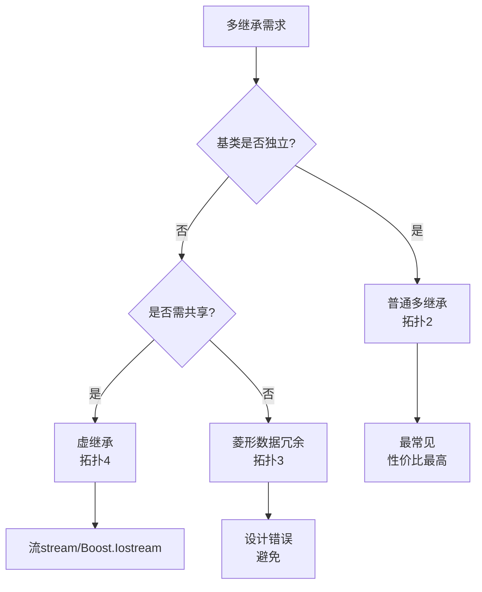
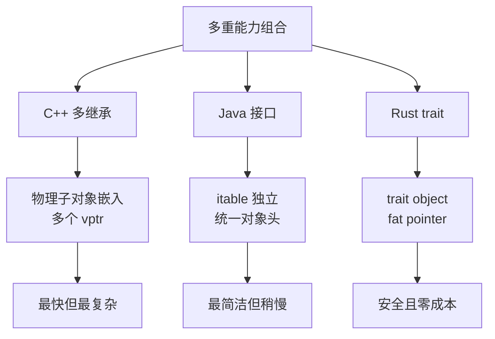

# 06.多重继承内存模型

#### 目录介绍
- [1. 案例引入](#1-案例引入)
  - [1.1 一段诡异的转型](#11-一段诡异的转型)
  - [1.2 顺藤摸到根因](#12-顺藤摸到根因)
  - [1.3 我们要回答什么](#13-我们要回答什么)
- [2. 架构概览](#2-架构概览)
  - [2.1 多继承四种拓扑](#21-多继承四种拓扑)
  - [2.2 为什么这么切](#22-为什么这么切)
- [3. 普通多继承布局](#3-普通多继承布局)
  - [3.1 子对象拼接顺序](#31-子对象拼接顺序)
  - [3.2 各子对象的vptr](#32-各子对象的vptr)
  - [3.3 godbolt实测验证](#33-godbolt实测验证)
  - [3.4 EBO对多继承的影响](#34-ebo对多继承的影响)
- [4. 指针偏移真相](#4-指针偏移真相)
  - [4.1 向上转型的偏移](#41-向上转型的偏移)
  - [4.2 向下转型的偏移](#42-向下转型的偏移)
  - [4.3 reinterpret陷阱](#43-reinterpret陷阱)
  - [4.4 nullptr的特例处理](#44-nullptr的特例处理)
- [5. 菱形继承困境](#5-菱形继承困境)
  - [5.1 数据成员双份](#51-数据成员双份)
  - [5.2 名字查找歧义](#52-名字查找歧义)
  - [5.3 为什么要避免](#53-为什么要避免)
  - [5.4 替代方案盘点](#54-替代方案盘点)
- [6. 虚继承内部机制](#6-虚继承内部机制)
  - [6.1 虚基类共享一份](#61-虚基类共享一份)
  - [6.2 vbptr与vbtable](#62-vbptr与vbtable)
  - [6.3 偏移由派生决定](#63-偏移由派生决定)
  - [6.4 GCC与MSVC差异](#64-gcc与msvc差异)
- [7. 构造析构顺序](#7-构造析构顺序)
  - [7.1 普通多继承顺序](#71-普通多继承顺序)
  - [7.2 虚继承先于直接](#72-虚继承先于直接)
  - [7.3 最派生类负责](#73-最派生类负责)
  - [7.4 析构反向规则](#74-析构反向规则)
- [8. dynamic_cast机制](#8-dynamic_cast机制)
  - [8.1 三种用途分类](#81-三种用途分类)
  - [8.2 跨子对象穿透](#82-跨子对象穿透)
  - [8.3 失败返回机制](#83-失败返回机制)
  - [8.4 性能与替代方案](#84-性能与替代方案)
- [9. 多继承设计哲学](#9-多继承设计哲学)
  - [9.1 接口与实现分离](#91-接口与实现分离)
  - [9.2 Mixin增量装配](#92-mixin增量装配)
  - [9.3 与Java接口对比](#93-与java接口对比)
  - [9.4 与Rust trait对比](#94-与rust-trait对比)
- [10. 综合案例串讲](#10-综合案例串讲)
  - [10.1 案例真相揭晓](#101-案例真相揭晓)
  - [10.2 一次转型的一生](#102-一次转型的一生)
  - [10.3 设计哲学回扣](#103-设计哲学回扣)
  - [10.4 多继承速查表格](#104-多继承速查表格)


## 1. 案例引入

### 1.1 一段诡异的转型

某团队的设备 SDK 把"事件监听 + 序列化 + 资源管理"三个能力合并到一个抽象设备类上——一个**经典的多继承场景**。某次重构后，C 端反馈"事件偶尔丢失"，单测全过：

```cpp
// device.hpp —— 设备 SDK 抽象层
class IEventSink {
public:
    virtual void onEvent(const Event&) = 0;
    virtual ~IEventSink() = default;
};

class ISerializable {
public:
    virtual void writeTo(Buffer&) const = 0;
    virtual void readFrom(Buffer&) = 0;
    virtual ~ISerializable() = default;
};

class Resource {
public:
    virtual ~Resource() { release(); }
    virtual void release() = 0;
};

class Camera : public IEventSink, public ISerializable, public Resource {
    int handle_ = -1;
    std::vector<uint8_t> buf_;
public:
    void onEvent(const Event& e) override { /* ... */ }
    void writeTo(Buffer& b) const override { /* ... */ }
    void readFrom(Buffer& b) override { /* ... */ }
    void release() override { ::close(handle_); handle_ = -1; }
};
```

事件总线注册时这样写：

```cpp
class EventBus {
    std::vector<IEventSink*> sinks_;
public:
    void subscribe(IEventSink* sink) { sinks_.push_back(sink); }

    // ⚠️ 出问题的代码（C 风格回调 API 适配层）
    void subscribe_void(void* obj) {
        sinks_.push_back(reinterpret_cast<IEventSink*>(obj));
    }
};

Camera cam;
EventBus bus;

bus.subscribe(&cam);                       // ① 正常路径
bus.subscribe_void(static_cast<void*>(&cam));   // ② C-API 适配路径
```

**现象**：① 路径事件正常分发；② 路径上**事件分发到 cam 后调用 onEvent 直接段错误**，而且不是 100% 复现——**新机器更容易复现，老机器反而少**（这点很反直觉）。

GDB 看 sinks_ 里的指针：

```
(gdb) p bus.sinks_[0]    # 路径①
$1 = (IEventSink*) 0x7ffe0000a000

(gdb) p bus.sinks_[1]    # 路径②
$2 = (IEventSink*) 0x7ffe0000a000   ← 数值竟然一样？

(gdb) p &cam
$3 = (Camera*) 0x7ffe0000a000

(gdb) p (IEventSink*)&cam
$4 = (IEventSink*) 0x7ffe0000a000   ← 巧合：IEventSink 在 Camera 第一个基类位置
```

**线索**：因为 `IEventSink` 是 Camera 的**第一个**基类，`Camera*` 转 `IEventSink*` 偏移恰好为 0——所以 reinterpret_cast 没暴露问题。但是**调换继承顺序之后**，问题就显现了：

```cpp
// 重构后调换了继承顺序（看起来人畜无害）
class Camera : public Resource, public IEventSink, public ISerializable { ... };
//                ↑ Resource 排第一了
```

这时 `IEventSink` 在 Camera 中的偏移变成了 `+sizeof(Resource子对象)`——**reinterpret_cast 直接错了**：

```
(gdb) p &cam                          
$1 = (Camera*) 0x7ffe0000a000

(gdb) p static_cast<IEventSink*>(&cam)    # 正确转型
$2 = (IEventSink*) 0x7ffe0000a008    ← 偏移了 8 字节

(gdb) p reinterpret_cast<IEventSink*>(&cam)   # ⚠️ 错误转型
$3 = (IEventSink*) 0x7ffe0000a000    ← 没偏移
                                       此时把 Camera 的 vptr_Resource 当 vptr_IEventSink 用！
```

调用 `sink->onEvent(e)` 时，从错误的位置取 vptr，解引到 `Resource::release` 的函数指针上，跳过去之后参数 ABI 也错——**段错误或随机数据破坏**。

"老机器不容易复现"是因为老机器编译用的是早期版本的 SDK（继承顺序还是旧的），新机器是重构后版本——**ABI 不匹配的隐性故障**。

### 1.2 顺藤摸到根因

带着 8 个问号扒（这些后续章节会逐一回答）：

- **疑问 1**：多继承对象在内存里到底怎么拼接？基类按什么顺序排？
- **疑问 2**：每个基类子对象都自带 vptr 吗？大小怎么算？
- **疑问 3**：`Camera*` 转 `IEventSink*` 时编译器在做什么？为什么 static_cast 会"偷偷调整指针"？
- **疑问 4**：什么是"零偏移"基类？它有什么特权？
- **疑问 5**：reinterpret_cast 为什么不能用？跟 static_cast 物理差异在哪？
- **疑问 6**：菱形继承为什么会有"两份基类成员"？真的是 bug 还是设计？
- **疑问 7**：虚继承到底解决了什么？vbptr 在哪里、长什么样？
- **疑问 8**：dynamic_cast 怎么知道"从一个子对象指针穿到完整对象"？它读了什么？

为什么这些问号必须都答清楚？因为多继承在 C++ 里是**每一个工程师都会遇到、但 90% 都用错**的领域——**接口隔离原则、能力组合、Mixin 装配**都依赖它。

### 1.3 我们要回答什么

这 8 个问号的解答路径：

```
普通多继承布局 (第3章) ─→ 子对象按声明顺序拼接，每个含虚函数的子对象一个 vptr
   ↓
指针偏移真相 (第4章) ─→ static_cast 是带偏移的，reinterpret_cast 是裸指针类型替换
   ↓
菱形继承困境 (第5章) ─→ 两条路径汇于一个共同基，数据成员真的有两份
   ↓
虚继承内部机制 (第6章) ─→ vbptr/vbtable 让虚基类共享一份，偏移由派生类决定
   ↓
构造析构顺序 (第7章) ─→ 虚基类先于直接基类、最派生类负责构造虚基
   ↓
dynamic_cast 机制 (第8章) ─→ 通过 vtable 中的 offset_to_top 与 typeinfo 链穿透
   ↓
设计哲学 (第9章) ─→ 接口分离、Mixin 装配、与 Java/Rust 多接口对比
   ↓
综合串讲 (第10章) ─→ Camera 案例从根因到修复
```

> 📌 **本篇定位**：[02.对象内存布局原理](https://yccoding.com/pages/c1a265/) 看的是**单一对象**的字段排列；[05.虚函数表深度剖析](https://yccoding.com/pages/627ad6/) 拆开了 vtable 这台引擎本身；**本篇站在"完整对象"视角，看多个子对象如何拼接、转型时指针如何调整、菱形与虚继承如何工作**。下游 [07.内存对齐与缓存行](https://yccoding.com/pages/89eb8e/) 会回到对齐与 cache 的视角。


## 2. 架构概览

### 2.1 多继承四种拓扑

C++ 多继承可按"是否虚继承"和"是否有共同基"分成 4 种拓扑：

```
拓扑 1：单继承                    拓扑 2：普通多继承
       A                            A    B
       │                            │    │
       B                            └─C──┘

拓扑 3：菱形继承（普通）           拓扑 4：菱形继承（虚继承）
       A                                 A
      ╱ ╲                              ╱ ╲
     B   C                            B   C
      ╲ ╱                             │   │     （虚继承）
       D    （A 有两份）                ╲ ╱
                                       D     （A 唯一一份）
```

每种拓扑的内存代价不同：

| 拓扑 | A 的份数 | vptr 数 | vbptr | 转型代价 |
|---|---|---|---|---|
| 单继承 | 1 | 1（含虚函数时）| 0 | 零偏移 |
| 普通多继承 | N | N | 0 | 偏移 = 子对象起点 |
| 菱形（普通）| 2 | 多 | 0 | 须指定路径 |
| 菱形（虚）| 1 | 多 | 1+ | 间接寻址 |

第 1 章 Camera 用的是**拓扑 2**——普通多继承，三个无关接口。这是工程上**最常见、性价比最高**的多继承形态。

### 2.2 为什么这么切

**疑惑**：为什么 C++ 不像 Java 那样禁止多类继承、只允许多接口？

**论证**：
1. **零开销原则**——Java 接口的"动态分派"全靠 invokeinterface（哈希查表），开销远高于直接 invokevirtual；C++ 的多继承让接口子对象**直接物理嵌入**派生类，每个接口只是一个 vptr，调用就是普通虚调用。
2. **Mixin 模式需求**——iostream 库的 `iostream` 同时是 `istream` 和 `ostream`，CRTP 的"能力增量装配"需要多继承做载体。Java 用接口默认方法（C++8 才补上）也是模仿 Mixin。
3. **物理对应原则**——C++ 把"概念上的多重身份"翻译成"物理上的多个子对象"，让每种身份都有具体的内存位置和 vtable，**调试器、profiler、ABI 工具能直接看到**。
4. **静态类型检查友好**——C++ 多继承的转型在编译期就确定偏移量，错误能在编译时发现；动态语言的 multiple dispatch 要等运行期才知道走哪条路径。
5. **反向论证**——如果禁止多类继承，就要有"接口默认方法"或"trait"机制（Rust trait、Java 8 default、Swift protocol extension）补上。C++ 选择了"承担多继承的复杂度，换取统一机制"。

**代价**：
- 菱形继承下的二义性
- 虚继承的额外间接
- 转型必须严格用 static_cast / dynamic_cast，不能 reinterpret_cast




## 3. 普通多继承布局

### 3.1 子对象拼接顺序

普通多继承下，**派生类对象 = 各基类子对象按声明顺序拼接 + 派生类自身数据成员**。

```cpp
class A {
public:
    virtual void fa() {}
    int a = 1;
};

class B {
public:
    virtual void fb() {}
    long b = 2;
};

class C : public A, public B {
public:
    void fa() override {}
    void fb() override {}
    int c = 3;
};

C obj;
```

C 对象布局（GCC x86-64）：

```
┌──────────────┐ + 0     ← C 完整对象起点 = A 子对象起点
│ vptr_A       │ 8       ← 指向 vtable_C 的 A 部分
│ a            │ 4
│ pad          │ 4       ← 对齐到 8（B 的 alignment）
├──────────────┤ + 16    ← B 子对象起点
│ vptr_B       │ 8       ← 指向 vtable_C 的 B 部分
│ b            │ 8
├──────────────┤ + 32    ← C 自身数据起点
│ c            │ 4
│ pad          │ 4
└──────────────┘ + 40

sizeof(C) = 40
```

**规则总结**：
1. **基类按继承声明顺序排列**（`class C : public A, public B` → A 在 B 前）
2. **每个非空基类对象按其自身对齐对齐**
3. **派生类自身数据放在所有基类之后**
4. **整个对象的对齐 = max(各子对象对齐)**

第 1 章 Camera 重构前后继承顺序变化：

```
重构前：class Camera : public IEventSink, public ISerializable, public Resource
        ┌──────────────┐ + 0   ← IEventSink 子对象（含 vptr_IES）
        │ vptr_IES     │
        ├──────────────┤ + 8   ← ISerializable 子对象
        │ vptr_ISer    │
        ├──────────────┤ + 16  ← Resource 子对象
        │ vptr_Res     │
        ├──────────────┤ + 24  ← Camera 自身
        │ ...          │

重构后：class Camera : public Resource, public IEventSink, public ISerializable
        ┌──────────────┐ + 0   ← Resource 子对象 ⚠️ 排第一了
        │ vptr_Res     │
        ├──────────────┤ + 8   ← IEventSink 子对象 ⚠️ 偏移了 8
        │ vptr_IES     │
        ├──────────────┤ + 16  ← ISerializable 子对象
        │ vptr_ISer    │
```

reinterpret_cast 拿到的是 `&cam = +0 = vptr_Res`，当 IEventSink* 用时取 vtbl[0] 走的是 `Resource::release`——一切灾难的源头。

### 3.2 各子对象的vptr

每个**含虚函数**的基类子对象都有自己的 vptr：

```cpp
C obj;
void** vptr_A = *(void***)&obj;                  // A 子对象的 vptr
void** vptr_B = *(void***)((char*)&obj + 16);    // B 子对象的 vptr

std::printf("vptr_A = %p\n", vptr_A);
std::printf("vptr_B = %p\n", vptr_B);
// 两个值不同——分别指向 vtable_C 中的 A 部分和 B 部分（参 05 篇 6.2）
```

**所以对象的"vptr 数量 = 含虚函数的基类数量"**。Camera 有三个接口基类都含虚函数 → 3 个 vptr → 24 字节开销。

### 3.3 godbolt实测验证

```cpp
class A { public: virtual void f(); int a; };
class B { public: virtual void g(); int b; };
class C : public A, public B {};

void* offset_A(C* p) { return static_cast<A*>(p); }
void* offset_B(C* p) { return static_cast<B*>(p); }
```

`-O2` 汇编（GCC 13.2）：

```asm
offset_A(C*):
        mov     rax, rdi               ; A 偏移 = 0，原样返回
        ret

offset_B(C*):
        lea     rax, [rdi + 16]        ; B 偏移 = 16，加 16
        ret
```

**关键观察**：
- `static_cast<A*>(p)` 编译为 0 条指令（mov 是函数返回必需的）
- `static_cast<B*>(p)` 编译为 1 条 `lea` 指令（编译期确定偏移 +16）

这就是为什么"static_cast 不是免费的"——但这种代价是**编译期就确定的常量加法**，运行期成本可忽略。

**扩展：测试空指针**：

```cpp
void* offset_B_safe(C* p) {
    return p ? static_cast<B*>(p) : nullptr;
}
```

```asm
offset_B_safe(C*):
        lea     rax, [rdi + 16]
        test    rdi, rdi
        cmove   rax, rdi               ; p == nullptr 时返回 nullptr，不偏移
        ret
```

**编译器会自动为 nullptr 生成跳过偏移的逻辑**——见 4.4 节。

### 3.4 EBO对多继承的影响

**EBO（Empty Base Optimization）** 在多继承下也生效，但有限制。

```cpp
class Empty1 {};
class Empty2 {};
class Derived : public Empty1, public Empty2 {
    int x;
};

static_assert(sizeof(Derived) == 4);    // ✅ 两个空基都被优化掉
```

**限制：两个相同类型的空基不能共享地址**——C++ 标准要求"同类型的不同子对象地址必须不同"：

```cpp
class Empty {};
class Bad : public Empty {
    Empty member;       // 同类型！
};

static_assert(sizeof(Bad) > 1);   // 不能优化为 0：Empty 子对象地址必须 ≠ member 地址
```

**C++20 [[no_unique_address]] 修补了同类型空基**：

```cpp
class Better {
    [[no_unique_address]] Empty m1;
    [[no_unique_address]] Empty m2;
    int x;
};

static_assert(sizeof(Better) == 4);   // ✅ C++20 起允许地址相同
```

**实战：std::tuple 用多继承 + EBO 把空类型成员的开销压到 0**——这是为什么 `tuple<int, std::less<>>` 跟 `tuple<int>` 一样大。


## 4. 指针偏移真相

### 4.1 向上转型的偏移

**向上转型（Upcast）= 派生 → 基类**：编译期确定偏移量，无运行期代价（除空指针检查）。

```cpp
class A { virtual void fa(); int a; };
class B { virtual void fb(); int b; };
class C : public A, public B { int c; };

C obj;
A* pa = &obj;       // ① C* → A*：偏移 0
B* pb = &obj;       // ② C* → B*：偏移 +16

std::printf("&obj = %p\n", &obj);
std::printf("pa   = %p\n", pa);   // 同 &obj
std::printf("pb   = %p\n", pb);   // = &obj + 16
```

**关键**：`pa`、`pb`、`&obj` 三个值不一样，但**指向同一个对象的不同子对象起点**。

**编译器知道偏移**——因为继承关系在编译期完全确定。所以：

```cpp
A* pa = static_cast<A*>(&obj);    // 编译器生成：rax = rdi + 0
B* pb = static_cast<B*>(&obj);    // 编译器生成：rax = rdi + 16
```

**特权**：第一个非空基的偏移是 0——这就是第 1 章案例里"reinterpret_cast 在重构前能跑"的物理原因。

### 4.2 向下转型的偏移

**向下转型（Downcast）= 基类 → 派生**：static_cast 也是编译期偏移，但**不安全**（不检查实际类型）。

```cpp
A* pa = ...;
C* pc = static_cast<C*>(pa);    // 编译期：rax = rdi - 0（C 起点 = A 子对象起点）
                                 // 但若实际不是 C 对象 → UB
```

```cpp
B* pb = ...;
C* pc = static_cast<C*>(pb);    // 编译期：rax = rdi - 16（B 子对象 → C 起点）
```

**static_cast 的反偏移规则**：把指针**减去对应基类子对象的偏移**，回到完整对象起点。

如果不确定是不是 C 对象，必须用 dynamic_cast：

```cpp
A* pa = some_pointer;
C* pc = dynamic_cast<C*>(pa);   // 运行期检查；不是 C → 返回 nullptr
if (pc) { /* 是 C */ }
```

第 8 章详细讲 dynamic_cast 的运行期机制。

### 4.3 reinterpret陷阱

**reinterpret_cast 是裸类型重新解释，绝不调整偏移**：

```cpp
B* pb_correct   = static_cast<B*>(&obj);         // = &obj + 16  ✅
B* pb_wrong     = reinterpret_cast<B*>(&obj);    // = &obj       ❌

pb_correct->fb();    // ✅ 调到 C::fb
pb_wrong->fb();      // ❌ UB：用 vptr_A 当 vptr_B 取 fb 槽
```

**为什么 C++ 还允许 reinterpret_cast**：因为偶尔需要"裸内存重新解释"（如序列化、网络包解析、与 C-API 互操作）。但**对继承体系的转型，永远不能用 reinterpret_cast**。

**铁律**：

```
✅ 派生 ↔ 基类     用 static_cast 或 dynamic_cast
✅ const 加减     用 const_cast
✅ T* ↔ uintptr_t 用 reinterpret_cast（裸地址）
✅ T* ↔ char*    用 reinterpret_cast（字节级）
❌ 派生 ↔ 基类     永远不要 reinterpret_cast
❌ 不相关类型     永远不要 reinterpret_cast 后访问对象成员
```

第 1 章 Camera 案例的根本错误：**用 reinterpret_cast 做继承体系的类型转换**——重构前因为零偏移碰运气没爆，重构后立即爆。

### 4.4 nullptr的特例处理

**static_cast 对空指针有特例**：转换为基类指针时，**保持空指针不偏移**。

```cpp
C* pc = nullptr;
B* pb = static_cast<B*>(pc);    // pb = nullptr，不是 nullptr+16
```

汇编实现：

```asm
upcast(C*):
        test    rdi, rdi               ; rdi == 0 ?
        je      .L_is_null              ; 是 nullptr → 跳转
        lea     rax, [rdi + 16]        ; 不是 → 加偏移
        ret
.L_is_null:
        xor     eax, eax                ; 返回 nullptr
        ret
```

**为什么需要这个特例**：让 `if (pb)` 这种空检查在多继承下也保持语义一致。否则空指针转型后变成 `0x10`（非空），后续逻辑全错。

**reinterpret_cast 不做空检查**——这是第 1 章 Camera 在 nullptr 情况下也会爆的额外原因。


## 5. 菱形继承困境

### 5.1 数据成员双份

**菱形继承（不用虚继承）**：两条路径都把基类拷一份。

```cpp
class Animal {
public:
    int age = 0;
    std::string name;
};

class Mammal : public Animal {};
class Bird   : public Animal {};
class Bat    : public Mammal, public Bird {};   // Bat 是哺乳类的鸟（？）

Bat b;
```

Bat 对象布局：

```
┌──────────────┐ + 0       ← Mammal 子对象
│ Mammal::Animal::age      │  ← Animal 拷贝 #1
│ Mammal::Animal::name     │
├──────────────┤ + ?       ← Bird 子对象
│ Bird::Animal::age        │  ← Animal 拷贝 #2
│ Bird::Animal::name       │
└──────────────┘
```

**两份 age、两份 name**——互不相关。

```cpp
b.Mammal::age = 10;      // 改第一份
b.Bird::age   = 20;      // 改第二份
std::cout << b.age;       // ❌ 编译错误：歧义
```

### 5.2 名字查找歧义

```cpp
b.age;          // ❌ ambiguous: Mammal::age or Bird::age?
b.name;         // ❌ 同样歧义
b.Animal::age;  // ❌ 也歧义：经哪条路径？
```

**必须显式选路径**：

```cpp
b.Mammal::age = 10;
b.Bird::age   = 20;
```

转型也要选路径：

```cpp
Animal* pa1 = static_cast<Mammal*>(&b);   // OK：Mammal 路径
Animal* pa2 = static_cast<Bird*>(&b);     // OK：Bird 路径
Animal* pa3 = &b;                          // ❌ 歧义
```

### 5.3 为什么要避免

**问题 1：数据冗余**——两份 Animal 占双倍空间，且很可能不同步：

```cpp
b.Mammal::age = 10;
b.Bird::age   = 20;     // 同一只动物两个年龄？
```

**问题 2：无法表达"唯一身份"**——`b` 是一只动物吗？是哪只？没有统一答案。

**问题 3：dynamic_cast 复杂**：

```cpp
Mammal* pm = &b;
Animal* pa = dynamic_cast<Animal*>(pm);   // 转到哪一份？
```

**结论**：**菱形继承（非虚）几乎总是设计错误**——它意味着你在表达"两条路径的同一个基类应该独立"，但这种语义在 OOP 里极少正确。

### 5.4 替代方案盘点

```
方案 1：虚继承                  让 Animal 唯一一份（见第 6 章）
方案 2：组合替代继承            把 Animal 当成员，不继承
方案 3：接口分离                把 Mammal、Bird 拆成纯接口（无数据），数据放派生
方案 4：CRTP / Mixin            编译期组合，无运行时多继承
```

**实战推荐**：

```cpp
// 方案 3：接口分离 + 数据成员（最常用）
class IMammal {
public:
    virtual ~IMammal() = default;
    virtual void nurse() = 0;
};

class IBird {
public:
    virtual ~IBird() = default;
    virtual void fly() = 0;
};

class Bat : public IMammal, public IBird {
    int  age_;          // 单一数据成员，不通过继承获得
    std::string name_;
public:
    void nurse() override {}
    void fly()   override {}
};
```

——这正是第 1 章 Camera 的设计哲学：**多个无数据接口 + 一份派生数据**。Camera 没有菱形问题，因为三个接口基类都没有数据成员。


## 6. 虚继承内部机制

### 6.1 虚基类共享一份

**虚继承**通过 `virtual` 关键字，让所有路径共享同一份基类子对象：

```cpp
class Animal {
public:
    int age = 0;
};

class Mammal : virtual public Animal {};   // ← 虚继承
class Bird   : virtual public Animal {};   // ← 虚继承
class Bat    : public Mammal, public Bird {};

Bat b;
b.age = 5;          // ✅ 不再歧义，age 是唯一的
```

布局变化：

```
没有虚继承：             虚继承：
┌────────┐               ┌────────┐
│Mammal  │               │Mammal  │ ─→ vbptr_M
│ Animal │               ├────────┤
├────────┤               │Bird    │ ─→ vbptr_B
│Bird    │               ├────────┤
│ Animal │               │Bat 自身│
└────────┘               ├────────┤
sizeof = 大              │Animal  │ ← 唯一一份
                         └────────┘
```

### 6.2 vbptr与vbtable

虚继承下 Bat 对象的实际布局（GCC Itanium，`age=int=4` 简化示例）：

```
&b ─→ ┌──────────────┐ + 0     ← Mammal 子对象
      │ vptr_Mammal  │ 8       ← 指向 Mammal-in-Bat 的 vtable
      ├──────────────┤ + 8     ← Bird 子对象
      │ vptr_Bird    │ 8       ← 指向 Bird-in-Bat 的 vtable
      ├──────────────┤ + 16    ← Bat 自身（如有）
      ├──────────────┤ + ??    ← 唯一的 Animal 子对象（共享）
      │ Animal::age  │ 4
      └──────────────┘
```

GCC 把"Animal 子对象的偏移"藏在 vtable 中（不是独立 vbptr）：

```
vtable for Mammal-in-Bat:
┌─────────────────────────┐
│ vbase_offset = +N       │  ← Animal 在完整对象中的偏移（相对 Mammal 子对象）
│ offset_to_top = 0       │
│ typeinfo for Bat        │
│ <virtual functions>     │
└─────────────────────────┘
```

访问 `mammal_ref.age` 的汇编：

```asm
        mov     rax, [rdi]                  ; rax = vptr_Mammal
        mov     rax, [rax - 24]             ; rax = vbase_offset（vtable 中的负偏移）
        mov     eax, [rdi + rax]            ; 取 Animal::age
```

**三条指令** 完成虚基类成员访问 vs 普通成员的一条指令——这是虚继承的运行期代价。

### 6.3 偏移由派生决定

**关键观察**：虚基类 Animal 在完整对象中的位置**不是固定的**，由最派生类（Bat）决定。

```cpp
class Mammal : virtual public Animal { int m; };
class Bird   : virtual public Animal { long b; };
class Bat    : public Mammal, public Bird { char x; };
class Whale  : public Mammal             { double w; };
```

| 完整对象 | Animal 在 Mammal 中的偏移 |
|---|---|
| `Mammal` 独立对象 | +16（Mammal 自己 16 字节后）|
| `Bat` 中的 Mammal | +40（Mammal+Bird+Bat 之后）|
| `Whale` 中的 Mammal | +24（Mammal+Whale 之后）|

——同样的 Mammal 子对象，Animal 的位置取决于"最外层是谁"。这就是为什么需要 vbptr/vtable：**Mammal 自己不知道 Animal 在哪，必须运行时查表**。

每个最派生类，编译器都会为其各个虚继承子对象生成专属的 vtable，记录该上下文中的虚基类偏移。

### 6.4 GCC与MSVC差异

**虚继承的具体实现，GCC（Itanium ABI）和 MSVC 显著不同**（05 篇 7.4 节简介，本节深入）：

| 维度 | GCC（Itanium）| MSVC |
|---|---|---|
| 虚基类偏移存放 | 合并到 vtable 中（vbase_offset 槽）| 独立的 vbtable |
| 是否有 vbptr | **无** | **有**（每个虚继承基类一个）|
| 对象大小 | 较小 | 较大（多 vbptr 字段）|
| 访问开销 | 1-2 次间接 | 2-3 次间接 |
| ABI 兼容 | 跨编译器（Clang/GCC/Intel）| MSVC 私有 |

**MSVC 的 Bat 布局**（同样 Mammal/Bird/Animal）：

```
&b ─→ ┌──────────────┐ + 0
      │ vbptr_Mammal │ 8       ← 指向 Mammal 的 vbtable
      │ Mammal 自身  │
      ├──────────────┤
      │ vbptr_Bird   │ 8       ← 指向 Bird 的 vbtable
      │ Bird 自身    │
      ├──────────────┤
      │ Bat 自身     │
      ├──────────────┤
      │ Animal       │ ← 共享
      └──────────────┘
```

每个 vbptr 指向一张独立 vbtable：

```
vbtable for Mammal-in-Bat:
┌──────────────────────┐
│ +0 → Mammal 自己    │
│ +N → Animal 偏移     │
└──────────────────────┘
```

**实战劝告**：
- **能不用虚继承就不用**——三次间接 + 心智负担 + ABI 跨平台差异
- 真要用，**所有路径都加 virtual**，避免"半虚"
- iostream 是少数虚继承用得对的库（istream + ostream 共享 ios_base）
- 跨 MSVC/GCC 边界传虚继承类型 → ABI 不兼容


## 7. 构造析构顺序

### 7.1 普通多继承顺序

普通多继承的构造顺序：**按继承声明顺序构造各基类，然后构造派生类自身**。

```cpp
class A { public: A() { std::puts("A()"); } };
class B { public: B() { std::puts("B()"); } };
class C : public A, public B {
public:
    C() { std::puts("C()"); }
};

C c;
```

输出：

```
A()
B()
C()
```

**注意**：构造顺序由**继承声明顺序**决定，**不是初始化列表顺序**：

```cpp
class C : public A, public B {
public:
    C() : B(), A() { /* 即使写成 B 在前，仍然 A 先构造 */ }
};
// 输出仍然 A() B() C()
```

GCC 会发警告：

```
warning: base 'A' will be initialized after base 'B' [-Wreorder]
```

**铁律**：初始化列表顺序应与声明顺序一致，避免迷惑。

### 7.2 虚继承先于直接

**虚继承下，虚基类先于所有非虚基类构造**。

```cpp
class A { public: A() { std::puts("A()"); } };
class M : virtual public A { public: M() { std::puts("M()"); } };
class B : virtual public A { public: B() { std::puts("B()"); } };
class D : public M, public B {
public:
    D() { std::puts("D()"); }
};

D d;
```

输出：

```
A()      ← 虚基类最先，且只构造一次
M()
B()
D()
```

**为什么虚基先**：虚基类是所有路径共享的，必须先准备好——否则 M 构造时 A 还没就绪，M 的代码访问 A 成员就是 UB。

### 7.3 最派生类负责

**虚基类的构造由"最派生类（most derived class）"直接调用**，中间派生类对虚基的构造调用被忽略。

```cpp
class A {
public:
    A(int x) { std::printf("A(%d)\n", x); }
};

class M : virtual public A {
public:
    M() : A(1) {}      // 这个 A(1) 在 M 作为最派生类时生效
};

class B : virtual public A {
public:
    B() : A(2) {}
};

class D : public M, public B {
public:
    D() : A(3), M(), B() {}    // ← D 必须显式调 A(...)
};

M m;        // 输出：A(1)
B b;        // 输出：A(2)
D d;        // 输出：A(3)（不是 A(1) 或 A(2)）
```

**核心规则**：
- **构造时**：最派生类负责构造虚基类
- **若最派生类未在初始化列表显式构造虚基** → 调用虚基的默认构造器
- 中间派生类对虚基的构造调用，**只在它自己作为最派生类时才生效**

```cpp
class D2 : public M, public B {
public:
    D2() {}    // 没显式调 A(...) → 调 A 的默认构造
};

D2 d2;       // 编译错误（如果 A 没默认构造），或调 A() 默认
```

### 7.4 析构反向规则

**析构顺序严格反向于构造顺序**：

```
普通多继承 D : A, B：
  构造：A → B → D
  析构：~D → ~B → ~A

虚继承 D : M, B（M、B 都虚继承 A）：
  构造：A → M → B → D
  析构：~D → ~B → ~M → ~A
```

```cpp
class A { public: ~A() { std::puts("~A"); } };
class M : virtual public A { public: ~M() { std::puts("~M"); } };
class B : virtual public A { public: ~B() { std::puts("~B"); } };
class D : public M, public B { public: ~D() { std::puts("~D"); } };

{ D d; }     // 析构输出：~D ~B ~M ~A
```

**虚析构铁律**：基类有虚函数（即多态使用）→ 析构必须 virtual：

```cpp
class Base { public: virtual void f(); virtual ~Base() = default; };  // ✅
class Bad  { public: virtual void f(); };                              // ❌ 缺虚析构
                                                                        //    delete (Base*)derived → UB
```


## 8. dynamic_cast机制

### 8.1 三种用途分类

`dynamic_cast` 在多继承下有 **3 种用途**：

```
用途 1：向下转型（动态类型检查）
    Base*  → Derived*

用途 2：交叉转型（cross-cast）
    Base1* → Base2*       （Base1 与 Base2 是同一对象的不同基类）

用途 3：转 void*（取得完整对象起点）
    Base* → void*          （得到 most_derived 起点）
```

```cpp
class A { public: virtual void f(); };
class B { public: virtual void g(); };
class C : public A, public B {};

C c;
A* pa = &c;

// 用途 1
C* pc = dynamic_cast<C*>(pa);    // 向下转型

// 用途 2
B* pb = dynamic_cast<B*>(pa);    // 从 A 路径横跳到 B 路径

// 用途 3
void* pv = dynamic_cast<void*>(pa);   // 拿到 &c（完整对象起点）
```

**用途 2** 是 dynamic_cast 独有能力——static_cast 做不到（编译期不知道 A 与 B 在同一对象）。

### 8.2 跨子对象穿透

dynamic_cast 的核心机制：**通过 vtable 中的 offset_to_top 回到完整对象起点，再沿 typeinfo 链走到目标类型**。

```cpp
A* pa = &c;
B* pb = dynamic_cast<B*>(pa);
```

执行过程（伪代码）：

```cpp
B* dynamic_cast_impl(A* pa) {
    if (!pa) return nullptr;

    // 步骤 1：通过 pa 取 vptr
    void** vptr = *(void***)pa;

    // 步骤 2：取 offset_to_top（vptr[-2]）和 typeinfo（vptr[-1]）
    ptrdiff_t off = (ptrdiff_t)vptr[-2];
    type_info* ti = (type_info*)vptr[-1];

    // 步骤 3：回到完整对象起点
    void* most_derived = (char*)pa + off;

    // 步骤 4：在完整对象类型层次中找 B 子对象
    return ti->find_subobject<B>(most_derived);
}
```

回到第 4 章的 C/A/B 关系：

```
&c ─→ A 子对象 ─ vptr_A[-2] = offset_to_top = 0     → most_derived = &c
      
&c+16 ─→ B 子对象 ─ vptr_B[-2] = offset_to_top = -16 → most_derived = &c

从 most_derived = &c，根据 type_info 找 B → 偏移 +16 → 返回 &c + 16
```

**关键步骤都来自 vtable 与 typeinfo——这就是 RTTI 的真正用武之地**。

### 8.3 失败返回机制

dynamic_cast 失败的处理方式：

| 操作 | 失败时返回 |
|---|---|
| `dynamic_cast<T*>(p)` | `nullptr` |
| `dynamic_cast<T&>(ref)` | 抛 `std::bad_cast` |

```cpp
A* pa = some_a_pointer;     // 实际不是 C
C* pc = dynamic_cast<C*>(pa);
if (!pc) {
    /* 不是 C 对象 */
}

A& ra = some_a_ref;
try {
    C& rc = dynamic_cast<C&>(ra);
} catch (const std::bad_cast& e) {
    /* 不是 C 对象 */
}
```

**为什么引用版本抛异常**：引用不能为"空"——返回 null 引用是 UB，所以只能抛异常。

### 8.4 性能与替代方案

**性能开销**（参考量级）：

| 场景 | 典型延迟 |
|---|---|
| 简单单继承向下转型 | 5-10 ns |
| 多继承交叉转型 | 20-50 ns |
| 深层多继承 | 50-200 ns |
| 失败的转型 | 类似（要查完才确定）|

**替代方案**：

```cpp
// 方案 1：虚函数派发（最 OOP）
class Shape {
public:
    virtual void draw() = 0;
};

// 方案 2：enum tag + visitor（C 风格）
class Shape {
public:
    enum Kind { CIRCLE, SQUARE };
    Kind kind() const;
};

// 用法
Shape* s = ...;
switch (s->kind()) {
    case Shape::CIRCLE: /* static_cast<Circle*>(s) */ break;
    case Shape::SQUARE: /* static_cast<Square*>(s) */ break;
}

// 方案 3：std::variant + std::visit（C++17 现代）
using AnyShape = std::variant<Circle, Square>;
std::visit([](auto&& shape) {
    shape.draw();
}, any);

// 方案 4：CRTP / 类型擦除（卷二/卷四深入）
```

**铁律**：
- 程序逻辑频繁 dynamic_cast → 设计有问题，考虑虚函数或 visitor
- dynamic_cast 是**安全网**，不是日常工具
- **关键路径**上避免 dynamic_cast，用 enum tag 或 variant


## 9. 多继承设计哲学

### 9.1 接口与实现分离

C++ 多继承最成功的应用模式：**多个纯接口 + 一个实现派生**。

```cpp
// 纯接口（无数据成员、纯虚函数、虚析构）
class IDrawable {
public:
    virtual ~IDrawable() = default;
    virtual void draw() = 0;
};

class IClonable {
public:
    virtual ~IClonable() = default;
    virtual std::unique_ptr<IClonable> clone() const = 0;
};

class ISerializable {
public:
    virtual ~ISerializable() = default;
    virtual void serialize(Writer&) const = 0;
};

// 实现类组合多个能力
class Shape : public IDrawable, public IClonable, public ISerializable {
    // 数据成员
    double x_, y_;
public:
    void draw() override { /* ... */ }
    std::unique_ptr<IClonable> clone() const override { /* ... */ }
    void serialize(Writer&) const override { /* ... */ }
};
```

**优点**：
- 无菱形（接口都没有数据）
- 物理代价小（每个接口只有 vptr）
- 接口隔离原则（ISP）的物理对应

**第 1 章 Camera 就是这个模式**——三个无数据接口的能力组合。修复 Camera 的根本是这个模式正确，问题出在外层 reinterpret_cast 用错了。

### 9.2 Mixin增量装配

Mixin 模式：**通过多继承增量装配能力**。

```cpp
template<class T>
class Logged {       // 给任意类加日志
public:
    void log(const char* msg) {
        std::printf("[%s] %s\n", typeid(T).name(), msg);
    }
};

template<class T>
class Counted {      // 给任意类加引用计数
    int count_ = 0;
public:
    void retain()  { ++count_; }
    void release() { if (--count_ == 0) delete static_cast<T*>(this); }
};

class Connection : public Logged<Connection>, public Counted<Connection> {
public:
    void open() {
        log("opening");      // 来自 Logged
        retain();             // 来自 Counted
    }
};
```

**Mixin = 多继承 + CRTP**——能力可独立开发、独立测试、自由组合。这是 boost、loki、folly 的常见武器。

### 9.3 与Java接口对比

| 维度 | C++ 多继承 | Java 接口 |
|---|---|---|
| 数据成员 | 任意基类都可有 | 接口不可有（Java 8 前），可有静态常量 |
| 默认实现 | 任意基类都可有 | C++8 default 方法，但只能调接口方法 |
| 多重继承类 | ✅ 支持 | ❌ 单继承 |
| 多重接口 | ✅（用纯接口模拟）| ✅ |
| 物理拼接 | 子对象嵌入派生 | 接口表（itable）独立 |
| 调用开销 | 普通虚调用（一次间接）| invokeinterface（要查 itable，可能哈希）|
| 菱形冲突 | 编译报错 + 显式选路径 | 默认方法冲突时编译报错 |
| 内存代价 | 每个接口一个 vptr | 每个对象一个对象头（所有接口共用）|

**C++ 选择"物理拼接"换性能；Java 选择"统一接口表"换简洁**。

### 9.4 与Rust trait对比

| 维度 | C++ 多继承 | Rust trait |
|---|---|---|
| 多重能力 | 多重纯接口继承 | 多个 trait 实现 |
| 数据组合 | 子对象拼接 | 不直接支持，用组合（has-a）|
| 默认方法 | 基类提供默认实现 | trait 默认方法 |
| 调用机制 | vtable 静态拼接 | dyn Trait fat pointer（数据指针 + vtable 指针）|
| 转型 | static/dynamic_cast | as Trait（编译期）/ Any 下转 |
| 菱形 | 虚继承解决 | 不存在（trait 无数据）|
| ABI | Itanium / MSVC | 不稳定（除 C-ABI 部分）|

**Rust trait = C++ 纯接口（无数据）+ trait object 用 fat pointer 实现**。**菱形问题在 Rust 中根本不存在**——因为 trait 本身不能有数据，自动避开了。



**结论**：C++ 多继承的设计选择是**性能与灵活性的极致**，代价是工程师必须理解物理布局——这正是本篇的价值。


## 10. 综合案例串讲

### 10.1 案例真相揭晓

回到第 1 章 Camera 事件丢失事故，所有疑问的答案：

| 疑问 | 答案 |
|---|---|
| ① 多继承对象怎么拼接？ | 3.1：基类按声明顺序、各自对齐对齐、派生类数据在最后 |
| ② 每个基类都有 vptr 吗？ | 3.2：**含虚函数的基类才有**；Camera 三个接口都有 → 3 个 vptr |
| ③ Camera* 转 IEventSink* 编译器做什么？ | 4.1 / 3.3：编译期确定偏移量，生成 lea 指令 |
| ④ "零偏移"基类的特权？ | 3.1：第一个基类偏移 = 0，转型 = 拷贝指针 |
| ⑤ reinterpret_cast 为什么不能用？ | 4.3：它不调整偏移，跨基类转型必爆 |
| ⑥ 菱形继承为什么有两份？ | 5.1：两条独立路径，各拷一份 |
| ⑦ 虚继承解决了什么？ | 6.1：让虚基类共享一份；vbtable / vbase_offset 实现 |
| ⑧ dynamic_cast 怎么穿透？ | 8.2：通过 vtable 中的 offset_to_top 与 typeinfo 链 |

**修复方案**：

```cpp
// 修复 1：彻底放弃 void* + reinterpret_cast 的 C-API 适配模式
class EventBus {
    std::vector<IEventSink*> sinks_;
public:
    void subscribe(IEventSink* sink) {
        sinks_.push_back(sink);             // 类型安全
    }

    // 如果必须有 C-API 适配，让调用方先做正确转型
    void subscribe_void(void* obj, void (*to_sink)(void*, IEventSink**)) {
        IEventSink* sink = nullptr;
        to_sink(obj, &sink);                 // 调用方提供"如何从 void* 拿 sink"
        sinks_.push_back(sink);
    }
};

// 调用方：
Camera cam;
bus.subscribe(&cam);                          // ✅ 直调，类型安全

// 必要的 C-API 适配：
bus.subscribe_void(&cam, [](void* obj, IEventSink** out) {
    *out = static_cast<IEventSink*>(static_cast<Camera*>(obj));   // ✅ 编译期偏移正确
});
```

**关键点**：
- 永远用 `static_cast<IEventSink*>(camera_ptr)` 这条路径——编译器自动加偏移
- C-API 边界用 `void*` 时，**记下原类型**，回来用同类型 static_cast
- 别假设"基类指针 = 派生类指针"——这只在零偏移基类下成立

### 10.2 一次转型的一生

把 `bus.subscribe(&cam)` 这一行从源码到 CPU：

```
bus.subscribe(&cam)
        │
        ├─ 编译期
        │   ├─ &cam 类型 = Camera*
        │   ├─ subscribe 形参 = IEventSink*
        │   ├─ 派生 → 基类隐式转换 = static_cast<IEventSink*>
        │   ├─ 查 Camera 的继承拓扑：IEventSink 在偏移 0（重构前）
        │   ├─                                          或偏移 8（重构后，前面有 Resource）
        │   ├─ 生成代码：
        │   │     重构前：mov rsi, rdi              ; rsi = &cam（无偏移）
        │   │     重构后：lea rsi, [rdi + 8]        ; rsi = &cam + 8
        │   ├─ 但还要检查 nullptr：
        │   │     重构后：lea rsi, [rdi + 8]
        │   │              test rdi, rdi
        │   │              cmove rsi, rdi           ; if null, keep null
        │
        ├─ 链接期
        │   └─ vector::push_back 的代码符号解析、内联展开（O2）
        │
        └─ 运行期
            ├─ rdi = &cam = 完整 Camera 对象起点
            ├─ rsi = &cam + 8 = IEventSink 子对象起点
            ├─ vector::push_back(rsi)
            └─ sinks_[i] 此后存的是 IEventSink* = &cam + 8 ✅

后续事件分发：
sink->onEvent(e)
        │
        ├─ rdi = sink = &cam + 8（IEventSink 子对象）
        ├─ mov rax, [rdi]              ; rax = vptr_IEventSink
        ├─ jmp [rax + 0]               ; 跳到 vtable[0] = Camera::onEvent
        ├─ Camera::onEvent 入口：
        │   编译器知道：this 进来时是 IEventSink* = &cam + 8
        │   函数体内访问 Camera::handle_ 需要 this = &cam（偏移 0）
        │   thunk 调整：sub rdi, 8，再跳 Camera::onEvent 真正实现
        └─ ✅ 一切正确
```

如果用 reinterpret_cast 会怎样：

```
reinterpret_cast<IEventSink*>(&cam)
        │
        ├─ 编译期：rsi = rdi（不偏移）
        ├─ vector 存 sink = &cam（错的，应是 &cam+8）
        │
        └─ 调用 sink->onEvent：
            ├─ rdi = &cam（错位）
            ├─ mov rax, [rdi]      ; rax = vptr_Resource（不是 vptr_IES）
            ├─ jmp [rax + 0]       ; 跳到 Resource::release（不是 onEvent）
            └─ ❌ UB：可能崩溃、可能数据破坏
```

### 10.3 设计哲学回扣

**哲学 1：物理对应原则**

C++ 把"多重身份"翻译成"多个物理子对象"——你能在 godbolt 看到偏移、在 GDB 看到子对象起点、在 nm 看到多个 vtable。这是 C++ 与 Java/Rust 的最大不同——**所有抽象都有物理对应**，让性能调优、ABI 设计、调试都有物理抓手。

**哲学 2：编译期完成大部分多继承代价**

普通多继承的转型 = 编译期常量加法，运行期成本几乎为零；虚继承多一层间接，但仍然是常量级。**C++ 把"多重继承的复杂度"前置到编译期**，让运行期保持快——这是零开销原则的具体兑现。

**哲学 3：接口与实现可分离，但物理上仍是一个对象**

C++ 多继承让"接口"成为对象的一部分（不是引用接口），调用接口方法 = 普通虚调用，零额外查表。这是为什么 C++ 的虚函数性能可以和 C 函数指针打平、远超 Java 的 invokeinterface。

**哲学 4：复杂度交给会用的人，不收"无差别税"**

不用多继承的代码，沾不到任何代价；用多继承的代码，物理代价透明可控。这是 "Don't pay for what you don't use" 在多继承层的延伸——**Java 的所有方法默认 virtual、所有接口走 itable，每个对象都付这个税**；C++ 让你显式选择。

**哲学 5：菱形继承的存在不是 bug 而是诚实**

C++ 没把菱形继承藏起来，而是让它显式爆出来（编译报错或要选路径）——**因为"两条路径同一个基类"在语义上确实是含糊的**。Java 干脆禁止多类继承绕开问题，C++ 选择"暴露问题、提供工具（虚继承）解决问题"。

### 10.4 多继承速查表格

```
┌───────────────────────────────────────────────────────────────┐
│  多继承对象布局速查                                              │
├──────────────────────────┬─────────────────────────────────────┤
│  普通多继承               │ 子对象按声明顺序拼接，各自 vptr        │
│  对象大小                 │ Σ(各基类 size, 含 padding) + 派生数据 │
│  对齐                     │ max(各子对象对齐)                     │
│  vptr 数量               │ 含虚函数的基类数量                     │
│  第一个基类               │ 偏移 0（特权）                        │
└──────────────────────────┴─────────────────────────────────────┘

┌───────────────────────────────────────────────────────────────┐
│  转型规则速查                                                    │
├───────────────────────────┬────────────────────────────────────┤
│  static_cast 派生→基类     │ 编译期常量偏移（0 或 +N）            │
│  static_cast 基类→派生     │ 编译期常量反偏移；不安全              │
│  dynamic_cast            │ 运行期查 vtable + typeinfo 链         │
│  reinterpret_cast        │ ❌ 跨继承体系绝不可用                  │
│  C-style cast            │ ❌ 隐藏意图，禁止                       │
│  static_cast(nullptr)    │ 保持 nullptr，不偏移（特例）           │
└───────────────────────────┴────────────────────────────────────┘

┌───────────────────────────────────────────────────────────────┐
│  菱形继承速查                                                    │
├───────────────────────────┬────────────────────────────────────┤
│  普通菱形（非虚）          │ 基类两份；访问需指定路径              │
│  虚继承                   │ 基类一份；vbptr/vbtable               │
│  虚基类构造               │ 由最派生类直接调用                     │
│  虚基类构造时机           │ 先于所有非虚基类                       │
│  虚基类访问开销            │ 多 1-2 次间接                         │
│  虚继承使用建议            │ 只在确有共享语义时用（如 iostream）    │
└───────────────────────────┴────────────────────────────────────┘

┌───────────────────────────────────────────────────────────────┐
│  构造析构顺序速查                                                │
├───────────────────────────┬────────────────────────────────────┤
│  构造                     │ 虚基 → 基类（声明序）→ 成员 → 自身    │
│  析构                     │ 自身 → 成员（反序）→ 基类（反序）→ 虚基│
│  初始化列表顺序             │ 不影响实际顺序，但应与声明序一致       │
│  虚基初始化                 │ 由最派生类负责                        │
│  虚析构                    │ 多态使用时基类必须 virtual 析构        │
└───────────────────────────┴────────────────────────────────────┘

┌───────────────────────────────────────────────────────────────┐
│  设计模式选择                                                    │
├───────────────────────────┬────────────────────────────────────┤
│  接口隔离 + 数据集中        │ 多个纯接口 + 一个实现类（推荐）        │
│  能力组合                 │ Mixin（多继承 + CRTP）                 │
│  is-a 关系                │ 单继承 + virtual                      │
│  has-a 关系                │ 组合（成员），不继承                   │
│  多种类型分支              │ std::variant + std::visit             │
│  开放扩展                  │ 虚函数派发                             │
└───────────────────────────┴────────────────────────────────────┘

┌───────────────────────────────────────────────────────────────┐
│  禁忌速查                                                        │
├──────────────────────────────────────────────────────────────┤
│  ❌ reinterpret_cast 跨继承体系（必爆）                            │
│  ❌ 菱形继承不加虚（数据冗余 + 歧义）                              │
│  ❌ 多态基类没有虚析构（delete 时切片）                             │
│  ❌ 在构造/析构中调虚函数期望多态（参 05 篇 8.4）                   │
│  ❌ dynamic_cast 频繁出现（设计味道问题）                           │
│  ❌ 假设"基类指针 = 派生指针"（只对零偏移基类成立）                   │
│  ❌ C-API 用 void* 传多继承指针（必须记下原类型）                   │
│  ❌ 跨 MSVC/GCC 边界传虚继承类型（ABI 不兼容）                      │
└──────────────────────────────────────────────────────────────┘
```

**60 秒诊断技巧**：

```bash
# 看类的完整布局
g++ -fdump-lang-class++ -c foo.cpp
# 生成 foo.cpp.001l.class 文件，含每个类的字段偏移

# 看 vtable group
objdump -C -d -j .rodata your_binary | grep -B 2 -A 30 "vtable for ClassName"

# GDB 看实际偏移
(gdb) p (void*)&((Camera*)0)->IEventSink::*    # 不可直接，但可
(gdb) p (char*)(IEventSink*)pCam - (char*)pCam   # 偏移量

# 看 dynamic_cast 走的链
g++ -fdump-rtl-all-graph 看不出来，用 LLVM 的 -opt-bisect-limit
```

**金科玉律**：

```
1. 多继承首选"多个纯接口 + 一个实现类"
2. 接口必须有虚析构，必须无数据成员
3. 转型一律 static_cast / dynamic_cast，禁止 reinterpret_cast
4. 菱形继承必加 virtual——"半虚"是最坏的形态
5. 虚基类构造由最派生类负责，构造列表显式写出
6. 构造列表顺序与声明顺序一致
7. dynamic_cast 是安全网不是日常工具——频繁出现 = 设计问题
8. 跨 ABI 边界（动态库、跨编译器）避免传虚继承类型
```

---

> **下一篇**：本篇拆开了多继承的完整对象拓扑，但还停留在"对象内部如何排布"。下一步进入 [07.内存对齐与缓存行](https://yccoding.com/pages/89eb8e/)——**对齐的硬件原因、cache line 与假共享、alignas/alignof 实战、std::hardware_destructive_interference_size、SIMD 对齐分配、perf c2c 检测假共享**。本篇说"对象内部怎么拼"，下一篇拆"对象之间在 cache 上如何相安无事"。
