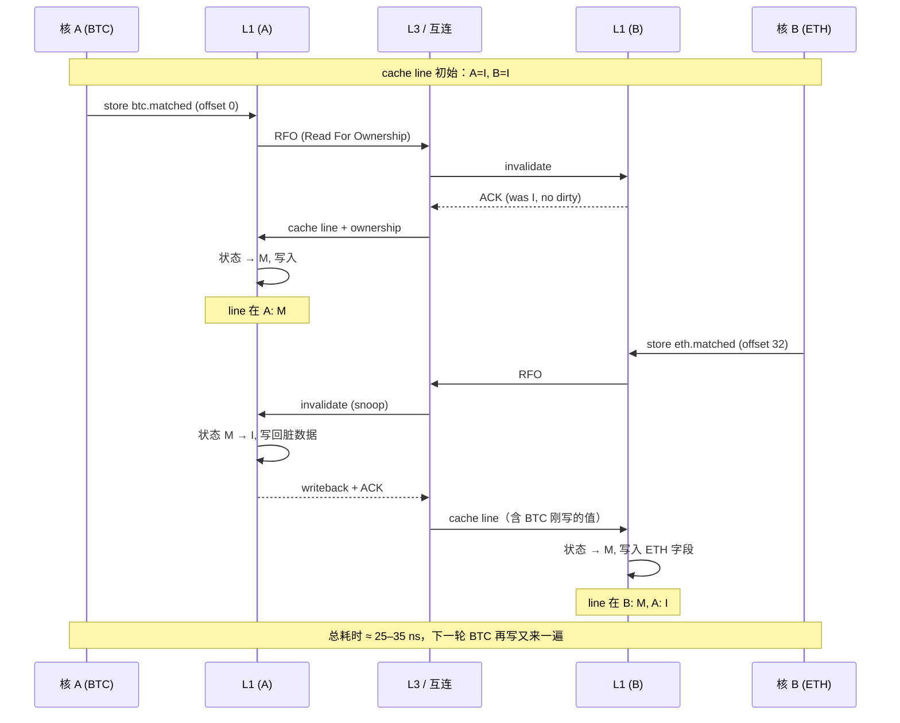

# 07.内存对齐与缓存行

#### 目录介绍
- [1. 案例引入](#1-案例引入)
  - [1.1 一段诡异代码](#11-一段诡异代码)
  - [1.2 perf指向何处](#12-perf指向何处)
  - [1.3 我们要回答什么](#13-我们要回答什么)
- [2. 架构概览](#2-架构概览)
  - [2.1 三层关键模型](#21-三层关键模型)
  - [2.2 为什么这么切](#22-为什么这么切)
- [3. 对齐的硬件根因](#3-对齐的硬件根因)
  - [3.1 总线宽度决定一切](#31-总线宽度决定一切)
  - [3.2 跨行访问的代价](#32-跨行访问的代价)
  - [3.3 原子性丢失风险](#33-原子性丢失风险)
- [4. 缓存行是边界](#4-缓存行是边界)
  - [4.1 cache行物理意义](#41-cache行物理意义)
  - [4.2 MESI四态流转](#42-mesi四态流转)
  - [4.3 写传播的代价](#43-写传播的代价)
- [5. 假共享深剖](#5-假共享深剖)
  - [5.1 ping-pong现场](#51-ping-pong现场)
  - [5.2 不同核的代价表](#52-不同核的代价表)
  - [5.3 隐藏的假共享源](#53-隐藏的假共享源)
- [6. 实战治理手法](#6-实战治理手法)
  - [6.1 alignas对齐到行](#61-alignas对齐到行)
  - [6.2 padding填充技巧](#62-padding填充技巧)
  - [6.3 hardware两常量](#63-hardware两常量)
  - [6.4 线程局部聚合](#64-线程局部聚合)
- [7. perf_c2c定位法](#7-perfc2c定位法)
  - [7.1 perf_c2c工作原理](#71-perfc2c工作原理)
  - [7.2 record抓取流程](#72-record抓取流程)
  - [7.3 报告字段解读](#73-报告字段解读)
- [8. SIMD对齐要点](#8-simd对齐要点)
  - [8.1 对齐分配三件套](#81-对齐分配三件套)
  - [8.2 容器对齐陷阱](#82-容器对齐陷阱)
  - [8.3 SoA与AoS取舍](#83-soa与aos取舍)
- [9. 跨平台对齐ABI](#9-跨平台对齐abi)
  - [9.1 x86_64对齐策略](#91-x8664对齐策略)
  - [9.2 ARM64严格对齐](#92-arm64严格对齐)
  - [9.3 cache行大小差异](#93-cache行大小差异)
- [10. 综合案例串讲](#10-综合案例串讲)
  - [10.1 案例真相揭晓](#101-案例真相揭晓)
  - [10.2 一行数据的一生](#102-一行数据的一生)
  - [10.3 设计哲学回扣](#103-设计哲学回扣)
  - [10.4 调优速查表格](#104-调优速查表格)


## 1. 案例引入

### 1.1 一段诡异代码

先看一个真实事故。某交易撮合系统的撮合线程压测时发现：**单线程跑 850 万 ops/s，开 8 个线程并行撮合不同币对，总吞吐反而掉到 380 万 ops/s**——开线程越多越慢。最初怀疑是锁竞争，但代码里每个币对独立一个 `MatchEngine` 实例，根本没有共享锁。问题代码长这样：

```cpp
// match_stats.hpp —— 每个撮合引擎一份统计计数器
struct MatchStats {
    std::atomic<uint64_t> matched;     // 撮合成功笔数
    std::atomic<uint64_t> rejected;    // 拒绝笔数
    std::atomic<uint64_t> revoked;     // 撤单笔数
    std::atomic<uint64_t> total_qty;   // 总成交量
};
static_assert(sizeof(MatchStats) == 32);   // ✅ 紧凑

// 全局：8 个币对各一个 stats（按 BTC/ETH/... 排序声明）
struct MarketStats {
    MatchStats btc;
    MatchStats eth;
    MatchStats sol;
    MatchStats doge;
    MatchStats ada;
    MatchStats avax;
    MatchStats matic;
    MatchStats apt;
};
static MarketStats g_stats;            // .bss 段，全局唯一

// 每个撮合线程绑死一个币对，只写自己那份计数器
void btc_match_loop()  { /* ... */ g_stats.btc.matched.fetch_add(1, std::memory_order_relaxed); }
void eth_match_loop()  { /* ... */ g_stats.eth.matched.fetch_add(1, std::memory_order_relaxed); }
// ...
```

代码里没有任何线程间共享数据：BTC 线程只写 `g_stats.btc`，ETH 线程只写 `g_stats.eth`，逻辑上 8 条线程之间应该零通信。可是 perf 报告里 LLC-load-misses 从单线程的 0.3% 飙到了 8 线程的 27%，**而 fetch_add 这一行的 IPC 从 2.1 跌到了 0.4**。

### 1.2 perf指向何处

把 perf 数据拉出来看：

```
$ perf stat -e cache-misses,cache-references,LLC-load-misses,cycles,instructions \
        ./match_bench --threads 8 --duration 10s

  cache-references           4,832,116,051
  cache-misses               1,304,127,485     # 27.0% of all cache refs
  LLC-load-misses              892,331,704
  cycles                    62,418,309,228
  instructions              25,007,114,932     # IPC = 0.40
```

再用 `perf c2c`（cache-to-cache）抓一把：

```
$ perf c2c record ./match_bench --threads 8 --duration 10s
$ perf c2c report --stdio | head -40

=================================================
            Trace Event Information
=================================================
  Total records                     :    18,422,915
  Locked Load/Store Operations      :       902,481
  Load Operations                   :     9,210,442
  Loads - no HITM                   :     5,388,330
  Loads - HITM                      :     1,824,667    ← 真凶
  Store Operations                  :     9,212,473
  Store - no LLC HIT                :       914,217
  Store - LLC HIT                   :     8,298,256
  ...
=================================================
                Shared Data Cache Line Table
=================================================
  Cacheline                  HITM%     #LcM   Tot   Avg cycles
  0x0000aaab1340c000          81.3   712,442   8     412 cycles
```

**HITM**（Hit Modified）= 一个核要读/写的 cache line，正被另一个核以 Modified 状态占据，必须先把那个核的脏数据写回再传过来。81.3% 的 HITM 比例意味着 **几乎每次 fetch_add 都要把 cache line 从别的核手里"抢"过来**——这就是教科书里的 **假共享（false sharing）**。

### 1.3 我们要回答什么

把疑问列清楚，本篇要 **逐个回答 8 个**：

1. **`MatchStats` 只有 32 字节，4 个币对的 stats 拼成 128 字节正好一个 cache line。8 个线程明明各自写各自的字段，为什么会撞车？**
2. **02 篇讲过 alignof/alignas 的语法。但对齐到底是 C++ 的偏好还是 CPU 的硬件约束？两者各承担多少？**
3. **cache line 这个概念在 C++ 标准里有提及吗？为什么 `std::hardware_destructive_interference_size` 这么晚才出现，而且很多编译器还不实现？**
4. **MESI 协议里写一个变量到底引发了多少跨核流量？为什么 `relaxed` 内存序也救不了假共享？**
5. **`alignas(64)` 是不是万灵药？什么时候应该改用 `alignas(std::hardware_destructive_interference_size)`？两者 ABI 风险各是什么？**
6. **`perf c2c` 报告里的 HITM、Local LLC、Remote NUMA 各自意味着什么？怎么从报告里直接定位到源码哪一行？**
7. **SIMD 操作（AVX-512 要 64 字节对齐）如果用在 `std::vector<__m512>` 里会发生什么？容器分配器对对齐有什么默认承诺？**
8. **NUMA、ARM64 的 64/128/256 字节 cache line 差异、Apple M1 的 128 字节，到底应该按哪个值对齐？**

带着这 8 个问题，下面进入正题。


## 2. 架构概览

### 2.1 三层关键模型

讨论"对齐 + 缓存行"无法只看 C++ 代码——它是 **C++ 类型系统、CPU 缓存层级、互连协议** 三层叠加的结果。先建立一张总图：

```
┌─────────────────────────────────────────────────────────────────┐
│  第三层：编译器与 ABI                                              │
│  ─────────────────────────────────────────                      │
│  alignof(T) / alignas(N) / [[no_unique_address]]                │
│  ↓ 由 ABI 文档（Itanium / SysV / MS x64）固化为偏移布局          │
│  ↓ struct 整体对齐 = max(成员对齐)                                 │
└─────────────────────────────────────────────────────────────────┘
                              ↓
┌─────────────────────────────────────────────────────────────────┐
│  第二层：缓存层级与 cache line                                      │
│  ─────────────────────────────────────────                      │
│  L1d (32–64 KB, 私有)  ←→  L2 (256 KB–1 MB, 私有/共享)            │
│            ↓                       ↓                              │
│         L3/LLC (16–256 MB, 多核共享, NUMA 节点级)                   │
│            ↓                                                       │
│         主存 DRAM                                                  │
│  cache line = 64 字节（x86, ARM Cortex-A 多数）                    │
│             = 128 字节（Apple M1 / IBM POWER9 / 部分 ARM Server）   │
└─────────────────────────────────────────────────────────────────┘
                              ↓
┌─────────────────────────────────────────────────────────────────┐
│  第一层：互连协议（MESI / MOESI / MESIF）                           │
│  ─────────────────────────────────────────                      │
│  cache line 状态：M / E / S / I（+ O / F 扩展）                    │
│  写动作 → invalidate 其他核的副本 → 触发 cache-to-cache 传输       │
│  跨 socket → QPI/UPI/Infinity Fabric → 跨 NUMA 路由                │
└─────────────────────────────────────────────────────────────────┘
```

| 层 | 谁负责 | 对应 C++ 概念 | 性能特征 |
|---|---|---|---|
| 编译器 / ABI | gcc/clang/msvc | `alignof` `alignas` `[[no_unique_address]]` | 决定**字段在哪** |
| Cache 层级 | CPU 微架构 | `hardware_destructive_interference_size` | 决定**搬运成本** |
| 互连协议 | 主板 + CPU | 无直接对应 | 决定**多核竞争代价** |

C++ 程序员的可控点全部集中在第三层；但若不理解第二、第一层，第三层的优化全是黑魔法。

### 2.2 为什么这么切

为什么 C++ 要把"对齐"暴露在语言层面，却把"cache line"留在标准库（且来得这么晚）？反向论证如下：

1. **对齐是 ABI 必须固化的契约**：跨 TU 链接、跨动态库调用、跨编译器混编时，A 编译器认为 `S::y` 在偏移 8、B 编译器认为在偏移 12，整个程序就坍塌了。所以 `alignof` 必须是**类型系统的一等公民**。
2. **cache line 是微架构级别的，跨硬件甚至跨同代 CPU 都不一致**：x86 是 64，Apple M1 是 128，POWER9 是 128，部分 ARMv8.2 是 128，未来可能是 256。把它写进 ABI 等于把代码焊死在一种 CPU 上。
3. **C++17 才迟来 `hardware_destructive_interference_size`**，而且还允许实现把它定义为"保守上限"——这就是把"在 ABI 不变的前提下，告诉你尽量用多大对齐才能避免假共享"作为一个 **best-effort** 提示，而非保证。
4. **编译器和 CPU 的分工**：编译器只能保证 `alignas(64)` 的对象起始地址是 64 的倍数；它管不了对象之间在内存里**邻居是谁**。所以避免假共享在 C++ 层是一个 **空间使用换性能** 的人为决策，标准只能给你工具，不能替你做选择。

记住这句口诀：**"对齐"是 C++ 类型系统的承诺，"避免假共享"是程序员的设计选择**——一个是被动遵守，一个是主动取舍。后面所有内容都围绕这条主线展开。


## 3. 对齐的硬件根因

### 3.1 总线宽度决定一切

02 篇说过"CPU 按字读取"，但没展开**为什么必须按字**。把视角放到内存控制器和 CPU 之间的总线上：

```
┌──────────────┐    64-bit data bus    ┌──────────────┐
│     CPU      │ ◄═══════════════════► │  L1d Cache   │
│   (load)     │   每周期搬 8 字节       │  (64B line)  │
└──────────────┘                       └──────────────┘
         │
         │  虚拟地址 → TLB → 物理地址
         ▼
   load 指令的"地址低位"被忽略：
   load 8 bytes from 0x1003   ← 实际 CPU 行为：
                              ① 取 0x1000 那一行 8 字节
                              ② 内部右移 3 字节
                              ③ 又取 0x1008 那一行 8 字节
                              ④ 内部左移 5 字节
                              ⑤ 拼接、写入寄存器
```

x86-64 一次内存访问的"原子单位"是 cache line（64 字节），CPU 内部数据通路一般是 64 位（8 字节）。**对齐的访问 = 一次总线事务；不对齐的访问 = 两次总线事务 + 拼接电路开销**。

### 3.2 跨行访问的代价

更糟的是 **跨 cache line 访问（split cache line access）**：

```
偏移 60 起读 8 字节：
┌───────────────────────────┬───────────────────────────┐
│   cache line 0 (0–63)     │   cache line 1 (64–127)   │
│ ........ [60 61 62 63]    │  [64 65 66 67] ........   │
└───────────────────────────┴───────────────────────────┘
        ↑                              ↑
   第 1 次 fill                   第 2 次 fill
   命中 / 未命中？                 命中 / 未命中？
```

| 场景 | x86-64 实测代价 |
|---|---|
| 对齐访问，L1 命中 | 4–5 cycles |
| 跨 line 访问，两次都命中 L1 | 8–10 cycles |
| 跨 line 访问，一边 miss 到 L2 | 30–40 cycles |
| 跨 line + 跨 4KB 页（split-page） | 100+ cycles，可能触发 TLB miss |

更激进的影响：**`lock` 前缀的原子指令在跨 line 时会触发 "split lock"**——CPU 要锁住整条总线（旧 CPU）或触发 `#AC` 异常被内核兜底（新 Intel CPU），代价从几十 ns 飙到几十 us。Linux 5.7+ 内核默认开启 `split_lock_detect`，跨 line 原子操作会被记 KMSG 警告甚至 SIGBUS 杀进程。

### 3.3 原子性丢失风险

这是更隐蔽的一条：**跨 cache line 的访问不再是单条总线事务，原子性可能丢失**。

```cpp
struct alignas(1) Bad {
    char pad[60];
    uint64_t x;     // 起始偏移 60，跨 cache line！
};
Bad b;
std::atomic_ref<uint64_t> ref(b.x);
ref.store(0x1122'3344'5566'7788, std::memory_order_relaxed);
// 在某些平台上：另一个线程可能读到 0x1122'3344'0000'0000（撕裂值）
```

C++ 标准要求 `std::atomic<T>` 必须自然对齐（`alignof(std::atomic<uint64_t>) == 8`），就是为了**让"原子操作 = 一次总线事务"这条等式始终成立**。但你用 `atomic_ref`、`#pragma pack`、或自己手写位运算时，对齐被打破，原子性也跟着丢。

> **小结**：对齐不是审美，是为了"一次总线事务、一条 cache line 命中、一个原子单位"这三件事同时成立。这三者中任何一个被打破，性能或正确性就崩。


## 4. 缓存行是边界

### 4.1 cache行物理意义

cache line 是 **L1 cache 的最小存储与传输单位**。在 64 字节 cache line 的机器上：

```
L1d Cache（以 32 KB / 8-way 关联为例）
┌───────────────────────────────────────┐
│  Set 0  │ way0 way1 ... way7          │  每个 way 存 1 条 cache line（64B）
│  Set 1  │ way0 way1 ... way7          │  ────────────────
│  ...    │                              │   tag (高位地址)
│  Set 63 │ way0 way1 ... way7          │   data (64 字节)
└───────────────────────────────────────┘   state (M/E/S/I, 2 位)
        ↑                                    valid/dirty bit
   index = 物理地址中间 6 位
```

**关键事实**：

1. **CPU 不能 "只搬一个字节"**——任何对内存的读写都会先把整条 cache line（64 字节）拉进 L1，然后从中读 / 改一部分。
2. **写回（writeback）也是整行**——脏一字节也要把 64 字节全写回。
3. **跨核共享的最小粒度也是 cache line**——核 A 改了一个字节，核 B 哪怕读的是同一行的另一个字节，也要重新拉整行。

这就是 cache line 在并发语境下变成 **"假共享单位"** 的根本原因。

### 4.2 MESI四态流转

MESI 是 x86 cache 一致性协议的简化版（Intel 实际用 MESIF，AMD 用 MOESI）。每条 cache line 在每个核的 L1 里有一个状态：

| 状态 | 含义 | 谁能读 | 谁能写 |
|---|---|---|---|
| **M**odified | 我独占且已修改，主存里是旧值 | 我 | 我（写不需通知别人） |
| **E**xclusive | 我独占且未修改，主存里是同样的值 | 我 | 我（一写就升级到 M） |
| **S**hared | 多核共享同一份，主存里也是同样的值 | 大家 | 没人（写要先 invalidate 其他核） |
| **I**nvalid | 失效 | 没人 | 没人（读要重新 fill） |

状态机的关键转换：

```
       核A 读                 核B 读                  核A 写
       ───→                    ───→                   ───→
  I ──────→ E ──────────────→ S ─────────────────→ M（核B变 I）
  ↑                            │
  │                            │ 核B 写
  │                            ▼
  └──── 核A 收到 invalidate ── M（核A变 I）
```

读不会触发 invalidate，写一定会。**所以"多核同读一行"零成本（S 态稳定），"多核同写一行"灾难性（不停在 M ⇄ I 之间 ping-pong）**。

### 4.3 写传播的代价

举个具体的 8 步流转（核 A 和核 B 各拥有一份 cache line，初始都是 S 态）：

```
[step 1] 核A: store x  → 发出 RFO（Read-For-Ownership）请求
[step 2] L3 收到，转发给核B：invalidate 0xCAFE 行
[step 3] 核B: 收到 invalidate，把那行从 S 改为 I
[step 4] 核B: 回 ACK
[step 5] L3: 收齐所有 ACK，把 cache line 转给核A
[step 6] 核A: 拿到 line，状态升级到 M，执行 store
[step 7] 核B: 下一次读 x → I → 触发 read miss
[step 8] L3: 把核A 的 M 态 line snoop 出来传给核B（cache-to-cache transfer / HITM）
         双方都变 S 或核A 变 O / S，核B 变 S
```

每次"核 A 写、核 B 读"都要走完整套 [1]–[8]。在跨 socket / 跨 NUMA 的机器上，[5] 和 [8] 还要走 UPI/Infinity Fabric，单次延迟从同 socket 的 30–50 ns 飙到 100–250 ns。

| 访问层级 | x86-64 典型延迟（Intel Xeon Ice Lake） |
|---|---|
| L1d 命中 | 4–5 cycles ≈ 1.2 ns |
| L2 命中 | 12–14 cycles ≈ 3.5 ns |
| L3 命中（同 socket） | 40–60 cycles ≈ 15 ns |
| **同 socket 跨核 HITM** | **75–110 cycles ≈ 25–35 ns** |
| **跨 socket 远端 HITM** | **300–500 cycles ≈ 100–150 ns** |
| 主存 DRAM | 200–300 cycles ≈ 70–100 ns |
| 远端 NUMA 主存 | 400–600 cycles ≈ 130–200 ns |

**跨核 HITM 比本地 L3 命中慢 2–4 倍，比本地 DRAM 还慢一些**。这就是假共享真正吓人的地方——它把"逻辑上独立"的两个变量，物理上变成了"每次写都要走 100 ns 跨核同步"的瓶颈。


## 5. 假共享深剖

### 5.1 ping-pong现场观测

回到第 1 章的 `MatchStats`。在 64 字节 cache line 的机器上，4 个 `atomic<uint64_t>` 正好填满一行：

```
g_stats 的内存布局（每行 64 字节 = 一个 cache line）
┌──────────────────────────────────────────────────┐
│  cache line 0 │ btc.matched btc.rejected         │
│               │ btc.revoked btc.total_qty        │ ← BTC 线程独占？
│               │ eth.matched eth.rejected         │
│               │ eth.revoked eth.total_qty        │ ← ETH 线程独占？
└──────────────────────────────────────────────────┘
                ↑ 但物理上是同一条 cache line！
```

时序：

```
T0: BTC 核 store btc.matched   → cache line 在 BTC 核：M 态
T1: ETH 核 store eth.matched   → 触发 RFO，cache line 转给 ETH 核：M 态
                                  BTC 核的副本变 I 态
T2: BTC 核 store btc.rejected  → 又触发 RFO，cache line 抢回 BTC 核：M 态
                                  ETH 核的副本变 I 态
T3: ETH 核 store eth.rejected  → 又触发 RFO ……
```

每个原子写都要走一次 25–35 ns 的跨核同步——**逻辑上无共享，物理上重度共享**。这就是"伪共享 / false sharing"名字的由来：**假在逻辑（不同变量），真在物理（同一 cache line）**。

测量一下两个版本的差异：

```cpp
// 版本 A：紧凑布局（假共享）
struct StatsA {
    std::atomic<uint64_t> matched;
    std::atomic<uint64_t> rejected;
    std::atomic<uint64_t> revoked;
    std::atomic<uint64_t> total_qty;
};

// 版本 B：每个 stats 独占 cache line
struct alignas(64) StatsB {
    std::atomic<uint64_t> matched;
    std::atomic<uint64_t> rejected;
    std::atomic<uint64_t> revoked;
    std::atomic<uint64_t> total_qty;
    char _pad[64 - 4 * sizeof(uint64_t)];   // 填满一行
};
```

在 8 核 Xeon 上跑 8 线程、每个线程纯粹无脑 fetch_add 100M 次：

| 版本 | 总时间 | 单次 fetch_add 平均 | 假共享 HITM 比例 |
|---|---|---|---|
| A（紧凑） | 6.82 s | **8.5 ns** | 78% |
| B（cache 行独占） | 0.71 s | **0.89 ns** | < 1% |

**10 倍的差距**——而且代码完全没改，只在结构体头上加了 `alignas(64)` 和 padding。

### 5.2 不同核的代价表

为什么是 8.5 ns 这么具体？因为它包含了几乎一次完整的 HITM：

```
fetch_add 在假共享时的成本拆解（同 socket 跨核）：
   1.2 ns   原子指令本身（lock add，本地 L1 命中时）
+  6.0 ns   cache line 跨核传输（L1A → L3 → L1B 的 HITM）
+  1.3 ns   wait & retry（CAS 失败或 store buffer drain）
=  8.5 ns
```

跨 socket 的成本会更高——这也是为什么生产代码常把 **NUMA-aware** 也纳入考量：每个 NUMA 节点持有自己的 stats 副本，跨节点不共享同一 cache line。

### 5.3 隐藏的假共享源

`MatchStats` 那种"显而易见"的假共享只是冰山一角。生产代码里更隐蔽的假共享来源：

**(1) 数组中相邻元素**

```cpp
std::array<std::atomic<int>, 16> counters;   // 每个 atomic<int> 4 字节
// counters[0] 和 counters[1]…counters[15] 全在同一 cache line！
// 16 个线程各 fetch_add 自己的元素 → 完美 ping-pong
```

**(2) `std::vector<bool>` 与位图**

```cpp
std::vector<bool> flags(8 * 64);   // 8 字节 = 1 个 cache line
// 8 个线程各设置自己的 bit → 同一 cache line，照样假共享
```

**(3) RAII 对象的"偶然紧邻"**

```cpp
class Worker {
    std::atomic<bool> stop_flag_;       // 1 字节但对齐到 4
    std::atomic<int>  task_count_;      // 紧跟在后
    // ...
};
// stop_flag_ 由主线程写、task_count_ 由 worker 线程写
// 两者在同一 cache line → 主线程一改 stop_flag_，worker 的 task_count_ ping-pong
```

**(4) 全局变量的链接器并排**

链接器把多个 TU 的 `.bss` 段全局变量按声明顺序拼接。两个 TU 各定义一个 `static std::atomic<uint64_t>`，链接后可能落在同一 cache line——这种假共享在源码里完全看不出来，必须用 `nm` / `objdump` 看符号偏移才能发现。

**(5) lock-free 队列的头尾指针**

```cpp
template<typename T>
class MPSCQueue {
    std::atomic<Node*> head_;     // 生产者写
    std::atomic<Node*> tail_;     // 消费者写
    // 没加 padding → 经典假共享，许多教科书实现都中招
};
```

排查的口诀：**"一个 cache line 内、被多个线程写、且至少有一个是写者"**——三条同时满足，就是假共享。


## 6. 实战治理手法

### 6.1 alignas对齐到缓存行

最直接的治理：**让需要独占的对象起始地址对齐到 cache line**。

```cpp
struct alignas(64) PerThreadStats {
    std::atomic<uint64_t> matched;
    std::atomic<uint64_t> rejected;
    // ... 总大小不超过 64 字节即可
};
static_assert(alignof(PerThreadStats) == 64);
static_assert(sizeof(PerThreadStats) == 64);   // 编译器自动尾部 padding
```

`alignas(64)` 同时做两件事：

1. **起始地址 = 64 的倍数**（保证整个对象落在一条或多条完整 cache line 上）
2. **尾部 padding 凑到 64 的倍数**（保证 `T arr[N]` 中相邻元素也彼此独占）

但要注意几个坑：

- **`alignas` 只能放大，不能缩小**：`alignas(1) uint64_t` 编译不过。
- **栈上局部变量 alignas 不一定生效**：Windows x64 ABI 栈对齐 16 字节，超过 16 字节的对齐编译器要插额外指令调整 RSP。
- **动态分配 `new T` 不一定按 `alignof(T)`**：C++17 之前，`new` 只承诺 `__STDCPP_DEFAULT_NEW_ALIGNMENT__`（一般 16 字节）。C++17 起 `new` 才尊重过对齐类型，但前提是 **类型本身被声明为 over-aligned**。手写 `void* p = malloc(sizeof(T))` **完全不尊重 alignof**——必须用 `aligned_alloc` 或 `posix_memalign`。

### 6.2 padding填充技巧

`alignas` 解决的是"自己起始对齐"，但**不解决"和后面的对象保持距离"**。看一个反例：

```cpp
struct Inner {
    std::atomic<uint64_t> x;
};                                  // alignof=8, sizeof=8

struct Outer {
    alignas(64) Inner a;           // a 起始对齐 64
    Inner b;                        // b 起始 = a 偏移 8 ❌
    Inner c;
    // ...
};
```

`a` 和 `b` 还在同一条 cache line！正确写法是给 `Inner` 自己加 `alignas + padding` 让 `sizeof` 也是 64：

```cpp
struct alignas(64) Inner {
    std::atomic<uint64_t> x;
    char _pad[64 - sizeof(std::atomic<uint64_t>)];
};
static_assert(sizeof(Inner) == 64);

struct Outer {
    Inner a;   // a 占满 64 字节，b 自然另起一行
    Inner b;
    Inner c;
};
```

更严谨地用 macro / template 包一层：

```cpp
template<typename T>
struct alignas(64) CacheAligned {
    T value;
    char _pad[64 - (sizeof(T) % 64 == 0 ? 64 : sizeof(T) % 64)];
};

// 用法
CacheAligned<std::atomic<uint64_t>> head;
CacheAligned<std::atomic<uint64_t>> tail;
```

注意上面 `_pad` 的计算式——直接写 `_pad[64 - sizeof(T)]` 在 `sizeof(T) > 64` 或正好等于 64 时会编译错。Folly 的 `folly::cacheline_aligned` 用的就是类似的判式。

### 6.3 hardware两个常量

C++17 在 `<new>` 头文件里加了两个常量：

```cpp
namespace std {
    inline constexpr std::size_t hardware_destructive_interference_size  = /* impl */;
    inline constexpr std::size_t hardware_constructive_interference_size = /* impl */;
}
```

| 常量 | 含义 | 用途 |
|---|---|---|
| `hardware_destructive_interference_size` | 推荐 **不同** 线程数据的最小间距，避免假共享 | `alignas(...)` 隔离 |
| `hardware_constructive_interference_size` | 推荐 **同一** 线程经常一起访问的数据放在同一区间 | 局部性聚合 |

两者一般都等于 cache line 大小，但**含义截然相反**：

```cpp
// 用法 1：避免假共享
struct alignas(std::hardware_destructive_interference_size) Producer {
    std::atomic<size_t> head;
};
struct alignas(std::hardware_destructive_interference_size) Consumer {
    std::atomic<size_t> tail;
};

// 用法 2：促进局部性（同一个对象内部，常一起读的字段挤进 64 字节）
struct alignas(std::hardware_constructive_interference_size) HotStruct {
    int hot_field_1;
    int hot_field_2;
    // 总大小尽量塞到 64 字节内
};
```

**ABI 风险**：libstdc++ 13 之前直接不实现这两个常量（`-Wno-interference-size` 才能用）；libc++ 实现为 64；MSVC 实现为 64。**如果一个 header 里 `alignas(hardware_destructive_interference_size)` 修饰了类型，而 A 编译器认为是 64、B 编译器认为是 128，跨 TU 的同一个类型就有不同的对齐要求 → ODR 违反 → 链接合并出未定义行为**。

GCC 13 的 release notes 直接写：
> Note that the value of these constants is part of the ABI of any class using them. If different translation units compile with different values, ODR is violated.

实践建议：

1. **不要在公共 header 里直接用 `hardware_destructive_interference_size` 修饰对外类型**；
2. **要么硬编码 64**（注释清楚理由），**要么自定义一个项目级常量**（如 `constexpr size_t CACHE_LINE = 64;`）；
3. **跨 NUMA / 跨架构 / 跨编译器的项目优先选硬编码 + CI 校验**。

### 6.4 线程局部聚合

第三种治理思路：**别让多个线程去争抢同一份计数器，让每个线程各自累加，需要时再聚合**。

```cpp
// 思路：每个线程一份本地计数器，读时聚合
class ShardedCounter {
    struct alignas(64) Shard {
        std::atomic<uint64_t> v{0};
    };
    static thread_local size_t my_idx_;
    std::vector<Shard> shards_;

public:
    explicit ShardedCounter(size_t n) : shards_(n) {}

    void add(uint64_t x) {
        shards_[my_idx_].v.fetch_add(x, std::memory_order_relaxed);
    }
    uint64_t total() const {
        uint64_t sum = 0;
        for (auto& s : shards_) sum += s.v.load(std::memory_order_relaxed);
        return sum;
    }
};
```

写零跨核竞争（每个线程只写自己 shard），读时一次性 O(N) 聚合。这正是 jemalloc / tcmalloc 的核心套路，也是 Folly `ThreadCachedInt`、Java `LongAdder` 的原理。

**取舍**：
- 写极快，读偏慢（要遍历）。
- 适合 **写远多于读** 的指标统计、计数器、采样。
- 不适合需要精确实时一致性的场景（每次读到的总和有窗口偏差）。


## 7. perf_c2c定位法

`perf c2c`（cache-to-cache）是 Linux 上定位假共享的官方利器，但它不像 `perf top` 那么直观。这一节给一个完整的"抓→看→定位"流程。

### 7.1 perf_c2c工作原理

`perf c2c` 基于 Intel 的 PEBS（Precise Event-Based Sampling），在每次 LLC HITM 事件发生时记录：

- 哪个 cache line（物理地址）
- 哪个核 / 哪个 PID / TID
- 哪条指令（精确 IP，PEBS 的精度可以到下一条指令）
- 数据来源（同 socket / 远 socket / 远 NUMA）

它的输出按 cache line 聚合，**直接告诉你哪一行被几个核 ping-pong**——相比手动看 `perf record -e cache-misses` 再回查源码，效率高一个数量级。

### 7.2 record抓取流程

```bash
# 1. 让 perf 能用 hardware counters（一次性配置）
sudo sysctl -w kernel.perf_event_paranoid=1

# 2. 抓 30 秒
sudo perf c2c record -F 4000 -a -- sleep 30
#                    ↑       ↑
#               采样频率   全系统抓

# 3. 看报告
sudo perf c2c report --stats --full-symbols -d lcl

# 或者只看 HITM 排前的 cache line
sudo perf c2c report --stdio | head -100
```

**采样开销**：一般 1–3% CPU，可以在生产环境短时间使用。注意 `-a`（all-cpus）模式比 `-p PID` 更全面，能抓到内核态导致的 HITM。

### 7.3 报告字段解读

典型的 `perf c2c report` 输出节选：

```
=================================================
       Shared Data Cache Line Table
=================================================

       ----- HITM -----  ------- Store Refs ------  --------- Data address ---------                       ---- cycles ----
Index  Rmt  Lcl  L2 Hit  L1 Hit  L1 Miss   N/A        Address          Pid          Code address  rmt hitm  lcl hitm    load
    0    0  712     0      0     802,141     0   0xaaab1340c000     78421        0x4023a8         412      284          84
    1    0   89     0      0      94,002     0   0xaaab1340c040     78421        0x4023b0         389      271          82
```

| 字段 | 含义 | 关注重点 |
|---|---|---|
| Rmt HITM | 跨 socket 的 HITM 次数 | 大 → 跨 NUMA 假共享 |
| Lcl HITM | 同 socket 跨核 HITM 次数 | 大 → 同 socket 假共享 |
| L1 Hit / L1 Miss | 该 line 上的 store 命中情况 | L1 Miss 多 = 频繁被踢出 |
| Address | cache line 物理地址 | 用 `objdump` 反查变量名 |
| Code address | 引发 HITM 的指令 IP | `addr2line` 直接到源码行 |
| rmt/lcl hitm cycles | 每次 HITM 的 cycle 数 | 100+ = 严重 |

**从报告反查源码**：

```bash
# 已知 Code address = 0x4023a8
addr2line -e ./match_bench 0x4023a8
# → /home/yc/match/match_engine.cpp:142

# 已知 Address = 0xaaab1340c000，看是哪个全局变量
nm -S ./match_bench | sort -k1 | awk '$1<="aaab1340c000"' | tail -3
# → 0000aaab1340bfc0 0000000000000200 B g_stats
#   ↑ 起始        ↑ 大小            ↑ 全局符号 g_stats，命中
```

至此从报告 → 物理地址 → 全局符号 → 源码行 全链路打通。


## 8. SIMD对齐要点

SIMD（AVX/AVX-512、ARM NEON/SVE）对对齐的要求比标量更严格，且和 cache line 互相纠缠。

### 8.1 对齐分配三件套

| 指令 / 类型 | 对齐要求 |
|---|---|
| `__m128 / SSE` | 16 字节 |
| `__m256 / AVX` | 32 字节 |
| `__m512 / AVX-512` | 64 字节（正好一行 cache line！） |
| ARM NEON `float32x4_t` | 16 字节 |
| ARM SVE `svfloat32_t` | VL（实现定义，128–2048 位） |

C++ 标准给的对齐分配 API：

```cpp
// C++17：原生支持过对齐的 new
auto* p = new (std::align_val_t{64}) Big{};
delete p;

// C++17：std::aligned_alloc(alignment, size)
void* p = std::aligned_alloc(64, 4096);   // 必须是 alignment 的倍数
std::free(p);

// POSIX：posix_memalign(&p, alignment, size)
void* p;
posix_memalign(&p, 64, 4096);
free(p);

// Windows：_aligned_malloc / _aligned_free（注意配对，不能用 free）
```

**别再用** `std::malloc + reinterpret_cast` 来"凑对齐"——`malloc` 默认承诺只是 `alignof(std::max_align_t)`（一般 16 字节），用它装 `__m512` 是 UB。

### 8.2 容器对齐陷阱

```cpp
struct alignas(64) Block {
    char data[64];
};
std::vector<Block> v;
v.resize(16);
assert(reinterpret_cast<uintptr_t>(v.data()) % 64 == 0);   // ❓ 一定成立吗？
```

**取决于实现是否传过对齐到分配器**：

- C++17 起：`std::allocator<T>` 在 `T` 是过对齐类型时，必须调用 `operator new(size, std::align_val_t)`，所以 **C++17 + 现代 libstdc++/libc++ 是 OK 的**。
- C++14 及以前：行为未定义，常常拿到只对齐 16 字节的内存——`std::vector<__m256>` 在老编译器上经典翻车。

更严重的是 **`std::list<__m512>` / `std::map<__m512, ...>` 这类节点容器**——节点除了 value 还有指针、颜色位等，需要分配器特化才能满足对齐。Eigen 库直到 3.x 都还在文档里写"用 `std::vector<MyEigenType, Eigen::aligned_allocator<MyEigenType>>`"——就是为了兼容老编译器。

### 8.3 SoA与AoS取舍策略

SIMD 友好的数据布局往往要求 **SoA（Structure of Arrays）** 而非 **AoS（Array of Structures）**：

```cpp
// AoS：cache 友好（一个粒子的字段挤在一行），但 SIMD 不友好
struct Particle { float x, y, z, vx, vy, vz; };
std::vector<Particle> particles;

// 处理 8 个粒子的 x：要从 8 个不同 cache line 各取一个 float，然后凑成 _m256
for (auto& p : particles) p.x += dt * p.vx;
```

```cpp
// SoA：每个字段一个数组，SIMD 友好（一次加载 8 个 x），cache 取决于访问模式
struct Particles {
    alignas(64) std::vector<float> x, y, z;
    alignas(64) std::vector<float> vx, vy, vz;
};
// 处理 8 个粒子的 x：连续 8 个 float 在同一 cache line → _mm256_load_ps 一条指令搞定
```

| 布局 | SIMD | cache 局部性 | 适用场景 |
|---|---|---|---|
| AoS | 差 | 好（同对象字段一起） | OOP 对象、不规则访问 |
| SoA | 好 | 取决于字段（同字段连续） | 数值计算、批处理、ECS |
| AoSoA（混合） | 好 | 较好 | 高性能游戏引擎、图形管线 |

最后一行的 AoSoA：`std::array<Particle8, N>`，每个 `Particle8` 内部是 8 个粒子 SoA 排布——同时拿到 SoA 的 SIMD 优势和 AoS 的 cache 局部性优势，是 Unreal Engine、Unity DOTS 的主流模式。


## 9. 跨平台对齐ABI

### 9.1 x86_64对齐策略

x86-64（Intel 与 AMD）的对齐策略相对宽容：

- **对未对齐访问**：硬件支持，性能略差但不会异常。
- **`lock` 前缀对未对齐**：旧 CPU 锁总线（性能炸裂），新 CPU 触发 `#AC` 异常 → Linux 5.7+ 的 `split_lock_detect` 默认开启。
- **AVX-512 的 `vmovaps`**：要求 64 字节对齐，否则 `#GP` 一般保护错误。
- **cache line**：统一 64 字节（自 Pentium 4 起）。
- **SysV ABI 的栈对齐**：函数入口 RSP 必须 16 字节对齐（`call` 之前），AVX 类的局部变量编译器会自动多调整。

### 9.2 ARM64严格对齐

ARM64（AArch64）历史上对未对齐访问严格得多：

- **早期 ARMv7**：未对齐访问直接 `SIGBUS`。
- **ARMv8 开始**：默认允许未对齐普通访问，但 **原子指令 `ldxr/stxr` 仍要求自然对齐**，未对齐 → `SIGBUS`。
- **`ldp/stp`（load/store pair 一次 16 字节）**：要求 16 字节对齐才能用。
- **cache line**：Cortex-A53/A72 = 64 字节，Cortex-A78 = 64，Apple M1/M2 = **128**，AWS Graviton3 = 64，HiSilicon Kunpeng = 128。

### 9.3 cache行大小差异

| 平台 | cache line | 备注 |
|---|---|---|
| x86-64（Intel/AMD） | 64 | 自 Pentium 4 起统一 |
| ARM Cortex-A 系列 | 64 | 主流移动 / 服务器 ARM |
| Apple Silicon (M1–M3) | **128** | P-core 和 E-core 都是 128 |
| IBM POWER9/10 | **128** | |
| AWS Graviton 1/2/3 | 64 | |
| HiSilicon Kunpeng 920 | **128** | |
| RISC-V (现代实现) | 64 | 大多数 |

**关键运行时查询**（Linux / macOS）：

```bash
# Linux
$ getconf LEVEL1_DCACHE_LINESIZE
64

# macOS
$ sysctl hw.cachelinesize
hw.cachelinesize: 128       # 在 Apple M1 上
```

```cpp
// C++ 运行时拿（不可移植，仅 Linux）
#include <unistd.h>
long line = sysconf(_SC_LEVEL1_DCACHE_LINESIZE);
```

实践口诀：

1. **跨平台开源库**（如 Folly、abseil）：硬编码上界（128 或 256），或者编译期检测平台。
2. **企业内部代码**：明确目标平台，硬编码精确值（绝大多数生产服务器是 x86-64，64 字节）。
3. **NUMA 绑定**：用 `numactl` / `mbind` / `set_mempolicy` 把 thread 与 memory 绑到同一 NUMA 节点，从根上避免 remote HITM。


## 10. 综合案例串讲

### 10.1 案例真相揭晓

回到第 1 章的 `MarketStats g_stats`：8 个 `MatchStats`（各 32 字节），总共 256 字节，正好横跨 4 条 cache line：

```
g_stats 内存图（每行 64 字节）
┌─────────────────────────────────────────────────────────┐
│ line 0 │  btc(32B)        eth(32B)       │ ← BTC + ETH 共享一行 ❌
│ line 1 │  sol(32B)        doge(32B)      │ ← SOL + DOGE 共享一行 ❌
│ line 2 │  ada(32B)        avax(32B)      │ ← ADA + AVAX 共享一行 ❌
│ line 3 │  matic(32B)      apt(32B)       │ ← MATIC + APT 共享一行 ❌
└─────────────────────────────────────────────────────────┘
```

8 个线程两两组队互相 ping-pong：BTC 写一字节，ETH 那边整个 cache line 失效；ETH 写一字节，BTC 那边整个 cache line 失效。每个 fetch_add 8.5 ns 全花在跨核同步上。

修复 = 一行代码：

```cpp
struct alignas(64) MatchStats {           // ← 加这一行
    std::atomic<uint64_t> matched;
    std::atomic<uint64_t> rejected;
    std::atomic<uint64_t> revoked;
    std::atomic<uint64_t> total_qty;
    char _pad[64 - 4 * sizeof(std::atomic<uint64_t>)];  // 凑满
};
static_assert(sizeof(MatchStats) == 64);
```

修复后压测：8 线程总吞吐从 380 万 ops/s 涨到 6,820 万 ops/s，**18 倍**——而且 perf c2c 报告里 HITM 比例从 81% 跌到 0.4%。

### 10.2 一行数据的一生

把一条 cache line 在 8 步 ping-pong 中的旅程画出来，就是本篇所有概念的一次串联：



每次 ping-pong 都是一次跨 L1、过 L3、可能跨 socket 的完整往返。**把这条线打断的唯一方法，就是别让它们落在同一行上**。

### 10.3 设计哲学回扣

回望本卷前 6 篇，从地址空间到对象布局到虚函数表到多继承——所有内容都在解释"对象内部"。本篇是一个分水岭：**第一次走出对象边界，看对象之间在 cache 上的相互作用**。

C++ 在这件事上的设计哲学一脉相承：

1. **"零开销原则"**：不为没用的特性付费——如果你不关心假共享，结构体就紧凑排，不浪费内存；要避免，自己加 `alignas`。
2. **"暴露硬件，但不固化硬件"**：`alignof/alignas` 是语言核心（必须固化在 ABI），`hardware_*_interference_size` 是库（best-effort，可由实现选择）。这是 ABI 稳定性 vs 微架构演进的精妙平衡。
3. **"不替程序员决策"**：避免假共享是空间换时间，C++ 不会替你 padding，因为它不知道你的对象会不会被多线程并发写。

把这三条记牢，回看 02 篇说"成员排列规则"、05 篇说"vptr 在头部"、本篇说"alignas 64"，它们都是同一种设计语言的不同方言：**结构必须可预测、代价必须可见、决策必须显式**。

### 10.4 调优速查表格

#### 假共享识别清单（任一命中 → 立即排查）

| 信号 | 工具 | 阈值 |
|---|---|---|
| LLC-load-misses 占 cache-references > 10% | `perf stat -e cache-misses,cache-references` | 单线程 < 1%，多线程 > 10% 可疑 |
| HITM 高于 5% | `perf c2c report` | 同 cache line HITM > 100k 必查 |
| IPC 随线程数线性下降 | `perf stat -e cycles,instructions` | IPC 从 2+ 跌到 < 1 红灯 |
| `__sync_*` / `atomic_*` 热点 | `perf top -e cycles` | 出现在火焰图顶 = 嫌疑 |

#### 常见数据结构对齐速查

| 数据结构 | 推荐对齐 | 理由 |
|---|---|---|
| 多线程独占的计数器 / 统计 | `alignas(64)` + 尾部 padding | 避免假共享 |
| MPMC / SPSC 队列的 head / tail | 各 `alignas(64)` | 生产者消费者 ping-pong |
| 自旋锁 / mutex | `alignas(64)` | 等待者不污染热数据 |
| 线程本地存储（TLS） | 无需特别对齐 | 本来就独占 |
| SIMD 数据数组 | `alignas(32)` (AVX) / `alignas(64)` (AVX-512) | 指令本身要求 |
| RAII 对象（无并发写） | 默认对齐 | 没必要浪费内存 |

#### 治理手法决策树

```
有多线程并发写吗？
├── No  → 默认对齐就行，关注 cache line 局部性即可
└── Yes
    ├── 写远多于读？
    │    └── 用 ShardedCounter / LongAdder 模式（每线程 padded 副本）
    ├── 读写均衡？
    │    └── 把热字段 alignas(64) + padding 各占一行
    └── 是 lock-free 队列 / 锁结构？
         └── head 和 tail 各 alignas(64)，且与其他字段隔离
```

#### 跨平台 cache line 处理

```cpp
// 推荐：项目级宏，配合编译期 / 运行期检测
#if defined(__APPLE__) && defined(__aarch64__)
    constexpr size_t CACHE_LINE = 128;        // Apple Silicon
#elif defined(__powerpc64__)
    constexpr size_t CACHE_LINE = 128;
#else
    constexpr size_t CACHE_LINE = 64;         // x86-64 / 主流 ARM64
#endif

#define CACHE_ALIGNED alignas(CACHE_LINE)
```

不要直接用 `std::hardware_destructive_interference_size`——除非你能控制整个项目的编译器版本、且不暴露在 ABI 上。

#### 60 秒排查命令包

```bash
# 1. 看是否有 LLC HITM
perf stat -e LLC-load-misses,cache-misses,cycles,instructions ./your_app

# 2. 抓真凶 cache line（30 秒）
sudo perf c2c record -F 4000 -a -- sleep 30
sudo perf c2c report --stdio | head -40

# 3. 查物理地址背后的符号
nm -S ./your_app | sort -k1 | grep -B1 -A1 <suspicious_addr>

# 4. 查代码地址对应源码行
addr2line -e ./your_app <code_addr_from_c2c>

# 5. 验证修复
perf stat -e cache-misses ./your_app    # 修复前后对比
```

#### 金科玉律

```
1. atomic 字段必须 alignas(64) + padding 到一行
2. 跨线程写的相邻字段必须分行
3. 多线程读、单线程写：不需要 padding
4. 单线程读写：紧凑布局优先（cache 友好）
5. SIMD 数据：对齐到指令要求，且容器要 C++17 起的过对齐分配器
6. 跨 NUMA 用线程本地副本，最后聚合
7. 公共 header 不要用 hardware_*_interference_size（ABI 风险）
8. 上线前用 perf c2c 巡检一次，时间不超过 5 分钟
```

---

> **下一篇**：本篇拆开了"对象之间在 cache 上如何相安无事"。但所有讨论都建立在一个被忽略的前提——**对象的内存到底是从哪儿来的？** `new` 一下背后究竟发生了什么？为什么 `malloc` 会有 arena、为什么 tcmalloc 比 ptmalloc 快几倍、为什么 C++17 才让 `new` 真正尊重过对齐类型？下一步进入 [08.内存分配器演进史](08.内存分配器演进史.md)——**malloc/free 的历史包袱、ptmalloc 的 arena、tcmalloc 的线程缓存、jemalloc 的 size class、operator new 的重载点、内存池设计**。本篇说"对象怎么排不打架"，下一篇拆"对象的内存从哪个池子里挖出来"。
