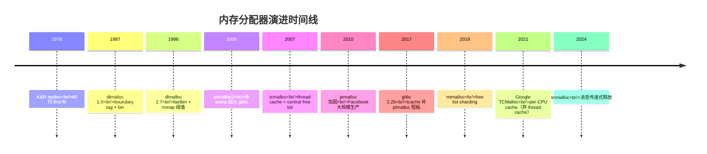
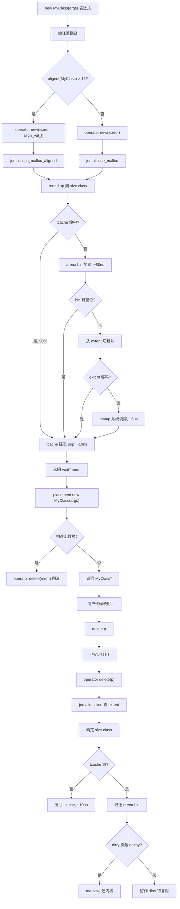

# 08.内存分配器演进史

#### 目录介绍
- [1. 案例引入](#1-案例引入)
  - [1.1 一次切库事故](#11-一次切库事故)
  - [1.2 RSS与VSZ的撕裂](#12-rss与vsz的撕裂)
  - [1.3 我们要回答什么](#13-我们要回答什么)
- [2. 架构概览](#2-架构概览)
  - [2.1 三层抽象图](#21-三层抽象图)
  - [2.2 为什么这么切](#22-为什么这么切)
- [3. 分配器演进脉络](#3-分配器演进脉络)
  - [3.1 KR最初分配器](#31-kr最初分配器)
  - [3.2 dlmalloc的奠基](#32-dlmalloc的奠基)
  - [3.3 ptmalloc2与arena](#33-ptmalloc2与arena)
  - [3.4 tcmalloc与jemalloc](#34-tcmalloc与jemalloc)
  - [3.5 mimalloc的现代化](#35-mimalloc的现代化)
- [4. ptmalloc内部解剖](#4-ptmalloc内部解剖)
  - [4.1 chunk结构与边界](#41-chunk结构与边界)
  - [4.2 五种bins分类](#42-五种bins分类)
  - [4.3 多arena与锁竞争](#43-多arena与锁竞争)
  - [4.4 mmap阈值的影响](#44-mmap阈值的影响)
- [5. tcmalloc三层缓存](#5-tcmalloc三层缓存)
  - [5.1 size_class分桶](#51-sizeclass分桶)
  - [5.2 thread缓存零锁](#52-thread缓存零锁)
  - [5.3 central与page堆](#53-central与page堆)
  - [5.4 span管理大块](#54-span管理大块)
- [6. jemalloc的精细控制](#6-jemalloc的精细控制)
  - [6.1 size_class密度](#61-sizeclass密度)
  - [6.2 extent与rtree](#62-extent与rtree)
  - [6.3 dirty页与purge](#63-dirty页与purge)
  - [6.4 profiling能力](#64-profiling能力)
- [7. operator_new重载](#7-operatornew重载)
  - [7.1 六大重载形态](#71-六大重载形态)
  - [7.2 全局vs类内重载](#72-全局vs类内重载)
  - [7.3 过对齐new的引入](#73-过对齐new的引入)
  - [7.4 nothrow与异常路径](#74-nothrow与异常路径)
- [8. 内存池设计模式](#8-内存池设计模式)
  - [8.1 fixed-size对象池](#81-fixed-size对象池)
  - [8.2 arena线性分配](#82-arena线性分配)
  - [8.3 freelist复用机制](#83-freelist复用机制)
  - [8.4 RAII作用域池](#84-raii作用域池)
- [9. 工程选型与排查](#9-工程选型与排查)
  - [9.1 替换策略对比](#91-替换策略对比)
  - [9.2 RSS膨胀排查法](#92-rss膨胀排查法)
  - [9.3 碎片率监控指标](#93-碎片率监控指标)
- [10. 综合案例串讲](#10-综合案例串讲)
  - [10.1 案例真相揭晓](#101-案例真相揭晓)
  - [10.2 一次new的一生](#102-一次new的一生)
  - [10.3 设计哲学回扣](#103-设计哲学回扣)
  - [10.4 选型速查表格](#104-选型速查表格)


## 1. 案例引入

### 1.1 一次切库事故

某广告投放系统的实时召回服务，C++14 编写，单进程跑 32 线程，常驻内存 12 GB 左右。压测时 P99 延迟从 18 ms 优化不下去，火焰图显示 `__lll_lock_wait_private`（glibc malloc 内部锁）占 11% 的 CPU——典型的 ptmalloc 多线程竞争。

按业界惯例切 jemalloc：

```bash
# 不改一行代码，启动时 LD_PRELOAD
LD_PRELOAD=/usr/lib/x86_64-linux-gnu/libjemalloc.so.2 ./recall_server
```

立竿见影：P99 从 18 ms 降到 9 ms，QPS 提升 35%。但运维三天后发了告警——**单进程 RSS 从 12 GB 涨到 19 GB，OOM Killer 待命中**。回滚 ptmalloc，RSS 立刻回到 12 GB；再切回 jemalloc，又涨到 19 GB。代码完全没变，"内存"凭空多出 7 GB。

更怪的是：

```
$ cat /proc/<pid>/status | egrep 'Vm|Rss'
VmPeak:    21834124 kB     # 21 GB 峰值虚拟
VmSize:    20712836 kB     # 20 GB 当前虚拟
VmRSS:     19021428 kB     # 19 GB 物理常驻
RssAnon:   18992140 kB
RssFile:      29288 kB
```

但 **应用层统计的活跃对象总和只有 11.8 GB**。多出来的 7 GB"用户看不到、应用没用到，但内核计为 RSS"——这就是分配器的 **碎片 / 缓存** 占用，被 jemalloc 主动 hold 住了。

### 1.2 RSS与VSZ的撕裂

把不同分配器在这个服务上的指标拉一张对照表（同样负载，连续运行 30 分钟稳态）：

| 分配器 | VmRSS | VmSize | P99 延迟 | malloc 锁 CPU% | 长尾抖动 |
|---|---|---|---|---|---|
| ptmalloc2（glibc 默认） | **12.1 GB** | 14.5 GB | 18 ms | 11% | 偶尔 50ms 抖动 |
| tcmalloc | 13.8 GB | 16.2 GB | 11 ms | < 1% | 平滑 |
| jemalloc 5.x | **19.0 GB** | 20.7 GB | 9 ms | < 1% | 平滑 |
| mimalloc 1.x | 13.2 GB | 15.4 GB | 9 ms | < 1% | 平滑 |

为什么 jemalloc 比 ptmalloc 多吃 7 GB？jemalloc 是不是有 bug？为什么 mimalloc / tcmalloc 又没这么严重？这是不是意味着 jemalloc 不能用？

把疑问列清楚，本篇要回答 **8 个问题**：

1. **为什么 ptmalloc 多线程时锁竞争这么严重？它的 arena 不是号称多线程友好吗？**
2. **`malloc` 申请的内存还能被 `free` 还给操作系统吗？还是永远被进程占着？什么时候真还给内核？**
3. **jemalloc 多吃 7 GB 是 bug 还是设计？这种"看不见的内存"在 RSS 里到底是什么形态？**
4. **tcmalloc 的 thread-local cache 和 jemalloc 的 tcache，与 ptmalloc 的 fastbin / tcache（glibc 2.26+）有什么本质区别？**
5. **C++ 的 `new` 跟 C 的 `malloc` 是什么关系？`operator new` 默认实现就是 `malloc` 吗？为什么标准还要单独定义 `operator new`？**
6. **C++17 引入的 "过对齐 new"（`new (std::align_val_t{64}) T`）解决了什么之前解决不了的问题？为什么 C++14 之前不直接默认对齐？**
7. **自己写一个内存池能比 jemalloc 还快吗？什么场景下值得自定义？**
8. **替换分配器的可移植性：LD_PRELOAD、链接时替换、运行时切换，三种方式各有什么坑？**

带着这 8 个问题进入正题。


## 2. 架构概览

### 2.1 三层抽象图

讨论"分配器"前，先建立一张分层视图——分配器从来不是一个单点，而是从 C++ 语义到内核 syscall 之间的 **三层翻译**：

```
┌──────────────────────────────────────────────────────────────┐
│  第三层：C++ 语义层                                              │
│  ─────────────────────────────────────────                  │
│  new T / delete p / make_shared<T> / std::vector::push_back │
│  ↓ 编译器翻译成调用                                             │
│  operator new(size_t) / operator delete(void*)               │
│  operator new(size_t, std::align_val_t)                      │
└──────────────────────────────────────────────────────────────┘
                              ↓
┌──────────────────────────────────────────────────────────────┐
│  第二层：C 语义层（也叫"用户态分配器"）                              │
│  ─────────────────────────────────────────                  │
│  malloc / free / realloc / calloc / aligned_alloc            │
│  ↓ 实现可替换：ptmalloc / tcmalloc / jemalloc / mimalloc        │
│  ─ 内部维护：arena、bin、chunk、span、size class、thread cache │
└──────────────────────────────────────────────────────────────┘
                              ↓
┌──────────────────────────────────────────────────────────────┐
│  第一层：内核 syscall 层                                         │
│  ─────────────────────────────────────────                  │
│  brk / sbrk     ─ 调整 heap 段尾巴（小对象）                     │
│  mmap / munmap  ─ 映射匿名页（大对象、arena）                    │
│  madvise        ─ 告知内核"这页不需要了"（释放给 OS）             │
│  ─ 内核分配粒度：4 KB 一页（Linux 主流）                          │
└──────────────────────────────────────────────────────────────┘
```

| 层 | 谁实现 | 核心职责 | 性能特征 |
|---|---|---|---|
| C++ 语义层 | 编译器 + libstdc++/libc++/MSVC STL | 语法糖、类型构造、对齐适配 | 几条指令 |
| C 语义层 | 分配器（ptmalloc / tcmalloc / ...） | 切大块、管小块、缓存、回收 | 10–100 ns（命中本地缓存） |
| 内核 syscall | Linux/Windows/macOS 内核 | 物理页分配、映射、回收 | μs 级（涉及陷入内核） |

C++ 程序员通常只关心第三层；但 RSS 膨胀、碎片、长尾延迟问题，全都发生在 **第二层与第一层之间的边界**——什么时候 `madvise(MADV_DONTNEED)` 把脏页还给内核、什么时候继续 hold 着等下次复用。

### 2.2 为什么这么切

为什么不让内核直接管理用户对象？为什么必须有"用户态分配器"这一层？反向论证：

1. **内核分配粒度太粗**：`mmap` 最小一页（4 KB），但 C++ 对象绝大多数是 16–256 字节。如果每个 `new` 都 syscall 一次，分配延迟从 10 ns 飙到 1 μs，性能崩 100 倍。
2. **syscall 本身昂贵**：上下文切换 + TLB flush + 权限检查。即使内核 zero copy 优化，单次 `mmap` 也要几百 ns。
3. **内核不知道应用语义**：哪些对象短命要快回收、哪些是长命大对象、哪些线程只分配不释放。**应用层分配器可以根据 size、线程、生命周期做差异化策略**。
4. **多线程的本地化机会**：内核的 `mmap` 没有"给某个线程独占"的语义，但用户态分配器可以给每个线程切一份缓存，**让 90% 的小分配走零锁路径**——这是 tcmalloc/jemalloc 性能起飞的根本。

所以分配器存在的本质是：**用 50–500 KB 元数据，把内核 4 KB 粒度的物理页"再切一刀"，并按线程、按 size、按生命周期做分类管理**——本质是一个"用户态二级内存管理器"。


## 3. 分配器演进脉络

### 3.1 KR最初分配器

K&R《C 程序设计语言》8.7 节给出了一个 **40 行的 malloc 实现**——这是历史的起点。核心数据结构就一个：**全局唯一的 freelist 环形链表**。

```c
// K&R malloc 简化骨架
typedef long Align;            // 对齐到 long
union header {
    struct {
        union header *ptr;     // 链表下一个块
        unsigned size;          // 本块大小（按 sizeof(Header) 单位）
    } s;
    Align x;                    // 强制对齐
};
typedef union header Header;

static Header base;            // 哨兵
static Header *freep = NULL;   // 当前 freelist 指针

void *malloc(unsigned nbytes) {
    Header *p, *prevp;
    unsigned nunits = (nbytes + sizeof(Header) - 1) / sizeof(Header) + 1;
    if ((prevp = freep) == NULL) { /* 首次：初始化 */ }
    for (p = prevp->s.ptr; ; prevp = p, p = p->s.ptr) {
        if (p->s.size >= nunits) {        // 找到够大的块
            if (p->s.size == nunits)      // 正好
                prevp->s.ptr = p->s.ptr;
            else {                          // 切一刀，剩下还在 freelist
                p->s.size -= nunits;
                p += p->s.size;
                p->s.size = nunits;
            }
            freep = prevp;
            return (void *)(p + 1);       // 跳过 header 返回
        }
        if (p == freep)                    // 转一圈没找到
            if ((p = morecore(nunits)) == NULL) return NULL;
    }
}
```

**它的所有缺陷**也在这 40 行里：

- **O(n) 查找**：first-fit 线性扫整个 freelist；几万个块时分配延迟到 μs 级。
- **碎片严重**：没有 size 分类，反复切割合并出大量小碎片。
- **零并发支持**：全局 `freep` 一份，多线程必须加全局锁。
- **释放不回内核**：`free` 只是标记 freelist，进程一直持有内存。

后续 30 年的分配器演进，全是在这四点上做工程优化。

### 3.2 dlmalloc的奠基

**dlmalloc**（Doug Lea Malloc，1987 起，长期演进至 2.8.6）是**单线程时代最强的分配器**，奠定了几乎所有现代分配器的核心数据结构：

| 创新点 | 描述 | 影响 |
|---|---|---|
| **boundary tag** | 每个 chunk 头尾各一个 size 字段，前后块可 O(1) 互查 | 释放时合并相邻空闲块的基础 |
| **bin 分类** | 把 freelist 按 size 分成多个 bin（小尺寸精确、大尺寸对数） | first-fit 从 O(n) 降到 O(log n) |
| **fastbin** | 微小尺寸（≤ 64 字节）单独一组**不合并的** LIFO bin | 极小对象分配 < 50 ns |
| **top chunk** | 堆顶部一个特殊大块，新分配优先从这里切 | 减少碎片，便于 sbrk 缩堆 |
| **mmap 阈值** | > 128 KB（默认）的请求直接走 `mmap`，跳过 heap | 大对象释放可立即归还 OS |

dlmalloc **没有解决多线程问题**——它有一把大锁。glibc 的 ptmalloc（v1）就是把 dlmalloc 加上多线程支持的派生版。

### 3.3 ptmalloc2与arena

**ptmalloc2**（Wolfram Gloger，2006 起作为 glibc 默认）的关键创新是 **arena（多堆）**：

```
ptmalloc2 多线程模型
─────────────────────────────────
  main_arena ─ 进程主 heap，通过 brk 增长
  arena_1    ─ mmap 一段 64 MB 区域，独立锁
  arena_2    ─ mmap 一段 64 MB 区域，独立锁
  ...
  arena_N    ─ N = min(8 × ncores, 内存上限)

  每个线程首次 malloc 时：
    1. 尝试上次用过的 arena（线程本地变量）
    2. 失败则遍历找一个不忙的 arena 加锁
    3. 都忙就新建 arena（直到上限）
    4. 上限后只能等锁
```

**ptmalloc 的根本问题**：

1. **arena 数量上限是 `8 × ncores`**：64 核机器上限 512 个 arena，但活跃线程可能上千，**线程数超过 arena 数后必然抢锁**。
2. **arena 内部还是全局锁**：一个 arena 只有一把 mutex，arena 内的所有 size 共享。
3. **跨 arena 释放代价高**：线程 A 在 arena 1 分配，传给线程 B 释放——B 要去 arena 1 加锁。
4. **碎片回收滞后**：top chunk 必须收缩到一定阈值才会 sbrk 缩堆，期间内存不还。

glibc 2.26（2017）引入 **per-thread tcache**（线程本地小缓存，类似 fastbin 但每线程一份），缓解了一部分锁竞争——但这已经是"打补丁"，根本架构还是 arena+bin。

### 3.4 tcmalloc与jemalloc

两个现代分配器在 2007 前后几乎同时诞生，思路**殊途同归**：

| 维度 | tcmalloc（Google, 2007） | jemalloc（FreeBSD, 2005 → Facebook 2010 加固） |
|---|---|---|
| 核心理念 | thread-local cache + central free list | arena + tcache + extent |
| size class 数 | 86 个（精度递增） | ~150 个（更密的几何级数） |
| 大块管理 | PageHeap（连续 page 的 span） | Extent（rtree 索引） |
| 释放给 OS | `madvise(MADV_FREE)` 延迟回收 | `madvise(MADV_DONTNEED)` 立即归还 |
| 线程模型 | 每线程一份 ThreadCache | 每线程绑定一个 arena + tcache |
| 突出能力 | 极小对象延迟低 | profiling、防碎片、可调参 |
| 默认 RSS 表现 | 中等偏紧凑 | **较激进保留页面**（本篇案例的根源） |

**两者共同的范式**：

```
分配请求
  │
  ├─→ 小对象 (size class 命中) ──→ thread-local cache（无锁）
  │                                    ↓ 缓存空了
  │                              central pool（轻锁）
  │                                    ↓ central 空了
  │                              page heap / arena（重锁）
  │                                    ↓ heap 不够
  │                              mmap 系统调用
  │
  └─→ 大对象 (> threshold) ─────→ 直接 mmap
```

**这套"三级缓存 + size class"的范式**至今是工业级分配器的标配。

### 3.5 mimalloc的现代化

**mimalloc**（Microsoft Research, 2019）是新生代代表，论文《Mimalloc: Free List Sharding in Action》。它的主要创新：

1. **free list sharding**：每个 page 维护**三条 free list**（local free / thread free / full list），把"线程归还自己分配的对象"和"线程归还别人的对象"用 atomic 拼接区分开——大幅减少跨线程释放的锁。
2. **极小元数据**：每个 page 8 字节 metadata（tcmalloc 是 16，jemalloc 是 32+）。
3. **deterministic 释放**：所有未使用 page 立刻 `madvise`，RSS 与活跃对象高度贴合。
4. **fast path 极短**：分配热路径汇编只有 ~20 条指令，测试比 tcmalloc 快 10–20%。

**演进时间线**：



注意 2021 年 Google 把 TCMalloc（开源版）的核心改成了 **per-CPU cache**（基于 `rseq` syscall）——线程数远超 CPU 数时，per-CPU 比 per-thread 更省内存。这是后话。


## 4. ptmalloc内部解剖

理解 ptmalloc 的内部，因为它是 glibc 默认分配器，**99% 的 Linux C++ 程序不替换分配器时跑的就是它**。

### 4.1 chunk结构与边界

ptmalloc 的最小单位是 **chunk**（不是字节，是带 metadata 的内存块）：

```
已分配的 chunk：
┌────────────────────────────────────┐
│ prev_size   (8 字节, 仅 P=0 时有效) │  ← 前一个 chunk 大小（如果前者空闲）
│ size       (8 字节，含 A/M/P 三个标志位) │  ← 本 chunk 大小
├────────────────────────────────────┤
│                                     │
│        用户数据区（malloc 返回这）    │  ← user pointer
│                                     │
└────────────────────────────────────┘
        ↑ 下一个 chunk 起始

空闲的 chunk：
┌────────────────────────────────────┐
│ prev_size                            │
│ size  (P=1 / M / A 标志)             │
├────────────────────────────────────┤
│ fd  (前向指针，指向 bin 中下一空闲块)  │
│ bk  (后向指针)                        │
│ fd_nextsize / bk_nextsize (大块专用) │
│ ...                                  │
│ size  (footer, 与 header 相同)        │  ← boundary tag
└────────────────────────────────────┘
```

三个标志位（占 size 字段低 3 位，因为 size 总是 8 字节对齐，低 3 位空着）：
- **P (PREV_INUSE)**：前一个 chunk 是否在用。0 = 前者空闲，可以合并。
- **M (IS_MMAPPED)**：本 chunk 是不是直接 mmap 来的（大块）。
- **A (NON_MAIN_ARENA)**：本 chunk 是否在非主 arena。

**关键事实**：
- `malloc(8)` 实际占用 **至少 32 字节**（16 字节 metadata + 8 字节用户 + 8 字节对齐 padding）。这就是为什么 `sizeof(int)` 是 4 但 `new int` 实测占 32 字节。
- 释放后空闲 chunk 复用 fd/bk 字段做链表指针——所以 user pointer 对应的前 16 字节会被分配器写入数据。这正是堆溢出 / use-after-free 漏洞的攻击面。

### 4.2 五种bins分类

ptmalloc 维护 **5 类 bins**，按 size 路由：

```
分配请求 size
  │
  ├─ size ≤ 64B（tcache_max）   → ① tcache（glibc 2.26+，每线程 64 个槽位）
  ├─ size ≤ 64B 且 tcache miss  → ② fastbin（10 个固定 size 链表，LIFO）
  ├─ size 在 small bins 范围     → ③ small bins（62 个，每个对应固定 size，FIFO）
  ├─ size 在 large bins 范围     → ④ large bins（63 个，每个对应一段 size 区间，按大小排序）
  └─ size > M_MMAP_THRESHOLD     → ⑤ 直接 mmap（默认 128 KB 起，可调）

unsorted bin：刚 free 的 chunk 先进这个"中转站"，下次分配先扫这里
top chunk：堆顶部最大的"原始未切分"块
```

| Bin 类型 | size 范围 | 特点 | 命中代价 |
|---|---|---|---|
| tcache | ≤ 64 B（默认） | 每线程独占，无锁 | ~10 ns |
| fastbin | 16–80 B | LIFO，**不立即合并**，加全局锁但路径短 | ~20 ns |
| unsorted bin | 任意 | free 后中转，下次分配优先匹配 | ~30 ns |
| small bin | 32–512 B | 每 bin 一个 size，FIFO | ~50 ns |
| large bin | 512 B+ | 每 bin 一段范围，需扫描排序链表 | ~100 ns |
| top chunk / mmap | 大块 | sbrk 或 mmap | ~1 μs |

**fastbin 的"不合并"是个大坑**：fastbin 中的 chunk 标志位 P 始终为 1（伪装成"前一个在用"），目的是让相邻 chunk 不会触发合并以加速。代价是 **fastbin 撑大了就形成"假碎片"**——total free 内存不少，但凑不出连续大块。

### 4.3 多arena与锁竞争

```c
// glibc malloc.c 简化的 arena 选择
static __thread mstate thread_arena;   // 线程本地，最近用的 arena

void *malloc(size_t bytes) {
    mstate ar_ptr = thread_arena;
    if (!ar_ptr) ar_ptr = arena_get_retry();
    (void)mutex_lock(&ar_ptr->mutex);   // ← 这里会阻塞！
    void *p = _int_malloc(ar_ptr, bytes);
    mutex_unlock(&ar_ptr->mutex);
    return p;
}
```

ptmalloc 的多 arena 看似解决了锁竞争，但有几个隐藏代价：

1. **arena 创建成本高**：新 arena 要 `mmap` 64 MB（默认），即使只用一点。
2. **arena 数量受限**：默认 `8 × ncores`，超过这个上限的线程只能 spin。
3. **跨 arena free 慢**：A 线程在 arena_1 分配的对象，B 线程释放时要去 arena_1 抢锁。
4. **arena 之间不均衡**：热点线程把某个 arena 撑到 1 GB，冷线程的 arena 才 10 MB——总 RSS 虚高。

**实测数据**（开篇案例的服务，64 核机器、32 工作线程）：

| 指标 | 数值 |
|---|---|
| 创建的 arena 数 | 33（main + 32 个） |
| 每 arena 平均大小 | 380 MB |
| arena 锁竞争比例 | 11% CPU |
| 跨 arena free 比例 | 23%（生产者-消费者模式） |

切到 jemalloc 后，每线程绑定一个 arena + tcache，**90% 的分配走 tcache 无锁路径**——锁竞争降到 < 1%。

### 4.4 mmap阈值的影响

ptmalloc 有个**动态调整**的 `M_MMAP_THRESHOLD`：

```
初始：128 KB
触发点：每次释放一个 mmap 来的 chunk 时，
       如果 size > 当前阈值，把阈值动态调高到 size
上限：32 MB（可通过 mallopt(M_MMAP_THRESHOLD, ...) 固定）
```

**为什么动态调高？** 设计者认为：如果应用频繁分配/释放大块，不停 mmap/munmap 太浪费 syscall——干脆把阈值调高，让大块也走堆，避免反复 syscall。

**陷阱**：一旦阈值被推高到 32 MB，**之前会自动归还 OS 的大块（如 1 MB）现在永远留在堆里**——RSS 不降。某些应用启动时分配过几个大对象，整个生命周期内存就再也不释放给 OS。

**修复**（针对这种症状）：

```cpp
#include <malloc.h>
mallopt(M_MMAP_THRESHOLD, 128 * 1024);  // 强制固定 128 KB
mallopt(M_TRIM_THRESHOLD, 128 * 1024);  // 让 top chunk 更积极归还
```

或者更直接——切换到 jemalloc / mimalloc。


## 5. tcmalloc三层缓存

### 5.1 size_class分桶

tcmalloc 的灵魂是 **size class**。它把所有可能的 size 映射到 86 个固定档位：

```
8, 16, 32, 48, 64, 80, 96, 112, 128, 144, 160, 176, 192, 208, 224, 240, 256,
288, 320, 352, 384, 416, 448, 480, 512, 576, 640, ..., 8192,
9216, 10240, ..., 32 KB, 36 KB, ..., 256 KB
```

**算法**：每档比上一档大约多 12.5%—25%，控制内部碎片在 12.5% 以内。

任何 `malloc(n)` 请求先 round up 到最近的 size class，然后在该 class 的 freelist 中分配。

**为什么 size class 这么关键？**

| 特性 | 后果 |
|---|---|
| size 离散化 | freelist 数量固定（86），不像 ptmalloc 的 large bin 还要排序扫描 |
| 同 class 块大小相同 | freelist 可以纯粹做 LIFO 栈，O(1) 取放 |
| 同 class 块在同一 page | 释放时可以反查所属 page，O(1) 找回 metadata |
| 不需要合并相邻块 | size class 内部不存在"切大补小"，碎片由 size class 间 padding 承担 |

### 5.2 thread缓存零锁

每个线程有独立的 `ThreadCache`：

```cpp
// 简化的 ThreadCache 结构
class ThreadCache {
    struct FreeList {
        void *list;           // 单链表头
        size_t length;        // 当前长度
        size_t max_length;    // 动态上限（按使用模式调整）
    };
    FreeList lists[kNumClasses];   // 86 个 freelist，每个 size class 一个
    size_t total_bytes;             // 本 cache 总字节数（默认上限 4 MB）
};

// 分配热路径（约 15 条指令）
void* ThreadCache::Allocate(size_t cl) {
    FreeList& list = lists[cl];
    if (list.list) {
        void* p = list.list;
        list.list = *(void**)p;     // 链表头取下
        list.length--;
        return p;
    }
    return FetchFromCentralCache(cl);   // miss 才走全局
}
```

**热路径无锁、无原子操作**——因为 ThreadCache 是 `__thread` 存储（GCC 扩展），同一线程独占。这是 tcmalloc 比 ptmalloc 快的核心：90% 的小对象分配压根不走原子操作。

**ThreadCache 太大怎么办？**
- 单 size class 的 freelist 长度超过 `max_length` → "Scavenge"，归还一半到 CentralCache。
- 总字节超过 4 MB → 强制收缩。

### 5.3 central与page堆

ThreadCache 之上是 **CentralCache**（每个 size class 一份全局），CentralCache 之上是 **PageHeap**（管理 page 级粒度）：

```
ThreadCache (per-thread)
       │ miss
       ↓
CentralFreeList[size_class] ── 加锁 ──┐
       │ 还是空                        │
       ↓                                │
PageHeap.AllocateSpan(npages)         │  ← 从这里切一段 page，拆成若干 size class 块
       │ 还是空                        │     灌回 CentralFreeList
       ↓                                │
mmap from kernel                      │
                                        │
Free 走逆向 ─────────────────────┘
```

| 层 | 锁粒度 | 命中代价 | 命中率（典型） |
|---|---|---|---|
| ThreadCache | 无锁 | ~10 ns | 90% |
| CentralFreeList | per-size-class spinlock | ~50 ns | 9% |
| PageHeap | 全局 mutex | ~200 ns | 0.9% |
| mmap syscall | 无 | ~1–5 μs | 0.1% |

90% 命中本地缓存意味着：**绝大多数 malloc 比一次 cache miss 还便宜**——这就是 tcmalloc 名字的来源（**T**hread-**C**aching malloc）。

### 5.4 span管理大块

PageHeap 把内存按 **span**（连续若干 page）管理：

```
Span 数据结构：
  start_page : 起始 page 编号
  npages     : 长度（page 数）
  size_class : 该 span 切成什么 size class（或 SPAN_LARGE 代表整体作为一个大块）
  refcount   : 该 span 中已分配出去的小块数
  prev/next  : 在 PageHeap free list 中的链接
```

**释放时的反查**：用户给一个 `void* p`，分配器要知道它属于哪个 span / size class。tcmalloc 用一个 **PageMap**（基数树）：

```
PageMap: page_id → Span*
  Linux x86-64：48 位虚拟地址 = 36 位 page id（4KB 页）
  → 三层 radix tree，每层 12 位
  → 查找 3 次内存访问，cache 友好
```

释放热路径：

```cpp
void operator delete(void* p) {
    PageID pid = reinterpret_cast<uintptr_t>(p) >> 12;
    Span* span = pageheap_->GetDescriptor(pid);   // 3 次访问
    size_t cl = span->sizeclass;
    if (cl) {
        ThreadCache* tc = ThreadCache::GetCache();
        tc->Deallocate(p, cl);                    // 还到本地 freelist
    } else {
        pageheap_->Deallocate(span);              // 大对象直接还
    }
}
```

释放也是 ~15 条指令的热路径，无锁。


## 6. jemalloc的精细控制

### 6.1 size_class密度

jemalloc 比 tcmalloc 更密：~150 个 size class，分三类：

```
small  : 8 B 起，按 (1 + 1/4) 几何级数到 14 KB（最密）
large  : 16 KB 起，按 2 倍递增到 4 MB
huge   : > 4 MB（直接 mmap 大块）
```

更密的 size class → 更小的内部碎片（jemalloc 内部碎片率 < 10%，tcmalloc ~12.5%）。代价是 metadata 略多。

### 6.2 extent与rtree

jemalloc 的"span"叫 **extent**，元数据**完全外置**——extent 结构体放在专门的 metadata 区，不和用户数据混在一起：

```
分配出去的内存：
[ user data ........................ ]    ← 全部都是用户数据，无 header

元数据区（独立）：
extent_t {
    void*  base;         // 起始地址
    size_t size;
    size_t szind;        // size class
    bool   active, dirty, ...;
    extent_t *prev, *next;
}

rtree（基数树）: address → extent_t*
```

**好处**：
1. 用户数据区无 header，对 cache 更友好（一个 16 字节对象就真的占 16 字节）。
2. 元数据集中，便于做 profiling、可视化、堆 dump。
3. 不会因为堆溢出破坏 metadata（ptmalloc 的 fd/bk 改写攻击在 jemalloc 上行不通）。

**代价**：
1. 释放时必须查 rtree（3 次内存访问）才能找到 extent；ptmalloc 是直接读用户指针前 16 字节的 header，1 次访问。
2. 元数据本身要占内存（一个 extent 结构 ~80 字节）。

### 6.3 dirty页与purge

这是开篇案例 RSS 多 7 GB 的根源。jemalloc 把 page 分三态：

```
        ┌─────────┐  分配请求
        │         ▼
   ┌──────────┐  ┌──────────┐  ┌──────────┐
   │  active  │  │  dirty   │  │  muzzy   │
   │ (在用)   │  │ (空闲但  │  │ (空闲且  │
   │          │  │ 未 purge)│  │ 已 madvise)│
   └──────────┘  └──────────┘  └──────────┘
        ▲              │              │
        │ 复用          │ purge        │ purge
        └──────────────┴──────────────┘
                        ↓
                   munmap 还内核
```

| 状态 | 占 RSS | 是否能立即复用 | 复用代价 |
|---|---|---|---|
| active | 是 | — | — |
| **dirty** | **是**（脏页还映射着） | 是 | **0**（直接拿来用） |
| muzzy | 否（页表还在但物理页归内核） | 是 | 一次 page fault |
| retained | 否（释放给内核） | 否 | 重新 mmap |

**关键**：jemalloc 默认保留大量 **dirty 页**——它认为应用很可能马上又要分配同样大的块，与其 madvise 还给内核然后再 page fault，不如先留着。

参数：

```bash
# 控制每个 arena 最多保留多少 dirty 页
MALLOC_CONF="dirty_decay_ms:5000,muzzy_decay_ms:5000"

# 激进归还：
MALLOC_CONF="dirty_decay_ms:0,muzzy_decay_ms:0"
```

`dirty_decay_ms:0` 强制 jemalloc 一释放就 purge——RSS 立刻贴近活跃集，但可能损失一些性能（重新 page fault）。

**这就是开篇案例的修复方案**：

```bash
LD_PRELOAD=libjemalloc.so.2 \
MALLOC_CONF="dirty_decay_ms:1000,muzzy_decay_ms:0" \
./recall_server
# RSS 从 19 GB 降回 13.5 GB，P99 仍保持 9 ms
```

### 6.4 profiling能力

jemalloc 内置的 **heap profiling** 是它最值钱的能力之一：

```bash
# 启动时打开
MALLOC_CONF="prof:true,prof_active:true,lg_prof_sample:19,prof_prefix:/tmp/jeprof" \
./your_app

# 几小时后取样
jeprof --show_bytes --pdf ./your_app /tmp/jeprof.0.f.heap > heap.pdf

# 可以看到每个调用栈分配了多少字节、活跃多少
```

这是 ptmalloc / tcmalloc 都没有标配的能力（tcmalloc 也有但要单独编译版本）。**生产环境查内存泄漏几乎都靠它**。


## 7. operator_new重载

回到 C++ 层。`new` 表达式背后到底调什么？

### 7.1 六大重载形态

C++ 标准在 `<new>` 头里定义了 **6 个 operator new 重载**：

```cpp
// 1. 普通版（C++98 起）
void* operator new(std::size_t size);

// 2. nothrow 版（失败返回 nullptr，不抛异常）
void* operator new(std::size_t size, const std::nothrow_t&) noexcept;

// 3. placement new（在指定地址构造，不分配）
void* operator new(std::size_t size, void* ptr) noexcept;

// 4. 数组版
void* operator new[](std::size_t size);

// 5. 过对齐版（C++17 起，P0035）
void* operator new(std::size_t size, std::align_val_t al);

// 6. 过对齐 + nothrow 版（C++17 起）
void* operator new(std::size_t size, std::align_val_t al,
                   const std::nothrow_t&) noexcept;
```

`new T(args)` 表达式编译后大致是：

```cpp
// new T(args)  等价于：
void* mem = ::operator new(sizeof(T));     // ① 分配
try {
    T* p = ::new (mem) T(args);            // ② 构造（placement new）
} catch (...) {
    ::operator delete(mem);                // ③ 构造抛异常 → 释放
    throw;
}
return p;
```

**delete 表达式**对应：

```cpp
// delete p
p->~T();                                   // ① 析构
::operator delete(p);                      // ② 释放
```

每个 operator 都可以替换。

### 7.2 全局vs类内重载

**全局重载**（影响整个进程的所有 new）：

```cpp
#include <cstdlib>
#include <new>

void* operator new(std::size_t size) {
    void* p = std::malloc(size);
    if (!p) throw std::bad_alloc();
    log_alloc(p, size);                    // 自定义打点
    return p;
}
void operator delete(void* p) noexcept {
    log_free(p);
    std::free(p);
}
// 必须把所有 6 个重载（含数组版、nothrow 版）都实现，否则链接报错或调到默认实现
```

**类内重载**（只影响该类的 new/delete）：

```cpp
class PooledObject {
    static MemPool pool_;
public:
    void* operator new(std::size_t size) {
        return pool_.alloc(size);
    }
    void operator delete(void* p) noexcept {
        pool_.free(p);
    }
};

PooledObject* p = new PooledObject();      // 调类内的 operator new
delete p;                                  // 调类内的 operator delete
```

**陷阱**：

1. **类内重载只对 `new ClassType` 生效**，对 `new (ClassType*)` 这种"new 一个指向类的指针"没用。
2. **派生类继承基类的重载**——除非派生类自己覆盖。
3. **placement new 永远不能被替换**（标准明确禁止）。
4. **数组版 `new[]` 与单对象版 `new` 是分开的**——必须都重载，否则数组分配走默认。

### 7.3 过对齐new的引入

C++17 之前的痛点：

```cpp
struct alignas(64) CacheAligned {
    std::atomic<int> v;
};
auto* p = new CacheAligned;     // C++14：不保证 64 字节对齐！
                                  // 标准 new 只承诺 alignof(std::max_align_t)（一般 16）
```

C++14 的 `new` 调的是 `operator new(size_t)`，传入的只是 size，**对齐信息丢了**。结果分配器只按 16 字节对齐——`alignas(64)` 直接失效。开篇 07 篇说的 cache line 优化在 C++14 上常常翻车，原因就在这。

C++17（P0035R4）增加了过对齐版本：

```cpp
// C++17 之后
struct alignas(64) CacheAligned { /* ... */ };
auto* p = new CacheAligned;
// 编译器检测到 alignof(CacheAligned) > __STDCPP_DEFAULT_NEW_ALIGNMENT__（一般 16）
// 自动调用：operator new(sizeof(CacheAligned), std::align_val_t{64})
```

```
__STDCPP_DEFAULT_NEW_ALIGNMENT__：
  x86-64 GCC/Clang：16
  MSVC：              8（32 位）/ 16（64 位）
```

只有当 `alignof(T) > __STDCPP_DEFAULT_NEW_ALIGNMENT__` 时，编译器才用过对齐版本——这就是"按需付费、零开销"的具体体现。

**手动指定对齐**：

```cpp
auto* p = new (std::align_val_t{128}) MyType;
operator delete(p, std::align_val_t{128});   // 注意 delete 也要传对齐
```

### 7.4 nothrow与异常路径

```cpp
auto* p1 = new int;                  // 失败抛 std::bad_alloc
auto* p2 = new (std::nothrow) int;   // 失败返回 nullptr，但仍可能因构造抛
```

**nothrow 的真相**：它**只让 `operator new` 不抛**——构造函数照样可能抛：

```cpp
class Foo { Foo() { throw 42; } };
auto* p = new (std::nothrow) Foo;    // operator new 成功，但 Foo() 抛 42
                                       // 整个 new 表达式还是抛出 42！
```

要彻底无异常，需要构造函数也 noexcept：

```cpp
auto* p = new (std::nothrow) int(42);   // 真正不抛（int 构造不会抛）
```

**`new` 失败的恢复钩子**——`std::set_new_handler`：

```cpp
std::set_new_handler([]{
    // 内存不足时被调用
    // 选项 a：释放一些缓存内存，让 new 重试
    // 选项 b：std::terminate()
    // 选项 c：throw std::bad_alloc()
    std::cerr << "OOM!\n";
    std::abort();
});
```

如果 set_new_handler 返回（即没 abort/throw/terminate），new 会**重试无限次**——所以 handler 必须做点实质的事，否则就是死循环。


## 8. 内存池设计模式

理解了系统级分配器后，**还有什么场景需要自己写内存池？**

答案：当你的对象有 **强 size 规律 + 强生命周期规律** 时，自定义池能比 jemalloc 还快 5–20 倍。下面给出 4 种经典模式。

### 8.1 fixed-size对象池

最常见——一种特定类型的高频小对象：

```cpp
template <typename T, std::size_t BlockSize = 4096>
class FixedPool {
    union Slot {
        alignas(T) std::byte storage[sizeof(T)];
        Slot* next;          // 空闲时复用为链表指针
    };
    struct Block {
        Slot slots[BlockSize / sizeof(Slot)];
        std::unique_ptr<Block> next;
    };
    std::unique_ptr<Block> head_block_;
    Slot* free_list_ = nullptr;

    void grow() {
        auto blk = std::make_unique<Block>();
        for (auto& s : blk->slots) {
            s.next = free_list_;
            free_list_ = &s;
        }
        blk->next = std::move(head_block_);
        head_block_ = std::move(blk);
    }

public:
    T* allocate() {
        if (!free_list_) grow();
        Slot* s = free_list_;
        free_list_ = s->next;
        return reinterpret_cast<T*>(s);
    }
    void deallocate(T* p) noexcept {
        auto* s = reinterpret_cast<Slot*>(p);
        s->next = free_list_;
        free_list_ = s;
    }
};
```

**性能数据**（同尺寸 64 字节对象，单线程 1000 万次分配/释放）：

| 分配器 | 总耗时 | 单次平均 |
|---|---|---|
| ptmalloc | 285 ms | 28.5 ns |
| jemalloc | 142 ms | 14.2 ns |
| tcmalloc | 118 ms | 11.8 ns |
| **FixedPool** | **34 ms** | **3.4 ns** |

3 倍提升的来源：**没有 size class 路由、没有 PageMap 反查、没有 metadata header**——纯链表 push/pop。

### 8.2 arena线性分配

适合"批量分配 + 一次性释放"的场景（编译器 AST、HTTP 请求处理、回合制游戏一帧）：

```cpp
class Arena {
    static constexpr std::size_t BLOCK = 64 * 1024;
    struct Block { std::byte data[BLOCK]; std::unique_ptr<Block> next; };
    std::unique_ptr<Block> head_;
    std::size_t pos_ = BLOCK;       // 当前 block 已用偏移

public:
    void* allocate(std::size_t size, std::size_t align) {
        std::size_t aligned = (pos_ + align - 1) & ~(align - 1);
        if (aligned + size > BLOCK) {        // 当前 block 不够
            auto blk = std::make_unique<Block>();
            blk->next = std::move(head_);
            head_ = std::move(blk);
            aligned = 0;
        }
        void* p = head_->data + aligned;
        pos_ = aligned + size;
        return p;
    }
    // 没有 deallocate！整个 Arena 析构时一次性归还
};
```

**特点**：
- 分配热路径只有 5 条指令（指针递增 + 比较）。
- **不支持单个释放**——这是它的优势，因为不需要维护 free list 和 metadata。
- 对象的析构需要外部追踪（或对象都是 trivially_destructible）。

C++17 的 PMR `monotonic_buffer_resource` 就是标准库版本的 Arena，39 篇详谈。

### 8.3 freelist复用机制

**侵入式 freelist**——把 freelist 指针塞到对象的存储空间里（对象空闲时复用其内存做指针）：

```cpp
class Connection {
    int fd_;
    char buffer_[4096];
public:
    void* operator new(std::size_t size) {
        if (free_list_) {
            void* p = free_list_;
            free_list_ = *(void**)p;
            return p;
        }
        return ::operator new(size);
    }
    void operator delete(void* p) noexcept {
        *(void**)p = free_list_;
        free_list_ = p;
    }
private:
    static thread_local void* free_list_;
};
thread_local void* Connection::free_list_ = nullptr;
```

**优点**：零 metadata 开销（freelist 头借用对象自己的字节）。
**缺点**：对象至少要 `sizeof(void*)` 大小（小于 8 字节的对象不能这么玩）。

### 8.4 RAII作用域池

把 Arena 包成 RAII，离开作用域自动整体释放：

```cpp
template <typename T, typename... Args>
T* arena_new(Arena& a, Args&&... args) {
    void* p = a.allocate(sizeof(T), alignof(T));
    return ::new (p) T(std::forward<Args>(args)...);
}

void handle_request(const Request& req) {
    Arena a;                                        // 函数级作用域池
    auto* parsed = arena_new<ParsedReq>(a, req);
    auto* plan   = arena_new<QueryPlan>(a, parsed);
    auto* result = arena_new<Result>(a, plan);
    return write_response(*result);
}                                                   // a 析构 → 一次性回收所有
```

整个请求处理过程中分配 100 个对象，**0 次 free 调用**——所有内存在 `Arena a` 析构时一并归还。这是 Google Protocol Buffers 在 Arena 模式下的核心范式。


## 9. 工程选型与排查

### 9.1 替换策略对比

替换分配器有三种方式，**坑各不相同**：

| 方式 | 操作 | 优点 | 风险 |
|---|---|---|---|
| **LD_PRELOAD** | `LD_PRELOAD=libjemalloc.so.2 ./app` | 零代码改动，可灰度回滚 | 静态链接 libc 失效，部分 syscall fallback 走错路径 |
| **链接时替换** | `-ljemalloc` 显式链接 | 二进制自带，部署简单 | 上线后无法切回，不同版本之间需 recompile |
| **运行时函数替换** | 重写全局 `operator new` | 精细控制 | 必须覆盖全部 6 个重载，第三方静态库内的 `malloc` 不受影响 |

**LD_PRELOAD 的隐蔽坑**：

```cpp
// 如果应用静态链接了 glibc 的某个版本（如 alpine 用 musl）：
LD_PRELOAD=libjemalloc.so.2 ./app
// 应用内的 malloc 还是走静态 libc，jemalloc 没生效
```

```cpp
// 第三方动态库自己 dlopen 了一个 .so，那个 .so 的 malloc 也可能走错
// 检测：ldd app | grep -E 'jemalloc|tcmalloc'
```

**Best practice**：链接时替换（`-ljemalloc`），CI 测两套（默认 vs 替换）做基准对比。

### 9.2 RSS膨胀排查法

回到开篇 RSS 多 7 GB 的问题，**完整的诊断流程**：

```bash
# 1. 区分 anon 和 file mapping
$ cat /proc/<pid>/status | grep Rss
RssAnon:   18992140 kB     # 匿名页 = 堆 + mmap 区
RssFile:      29288 kB     # 文件映射 = .text 等
RssShmem:         0 kB

# 2. 看 mapping 分布
$ cat /proc/<pid>/smaps_rollup
Rss:            19021428 kB
Pss:            19018127 kB
Shared_Clean:      29288 kB
Private_Dirty:  18992140 kB    ← 这就是分配器持有的脏页

# 3. jemalloc 内部统计（如果用了 jemalloc）
$ MALLOC_CONF="stats_print:true" ./app    # 退出时打印
# 或运行时
#include <jemalloc/jemalloc.h>
malloc_stats_print(NULL, NULL, NULL);
# 输出含：
#   Allocated: 12.1 GB         ← 应用真正在用
#   Active:    14.5 GB         ← active + dirty
#   Mapped:    19.0 GB         ← 整体虚拟（含 dirty + muzzy）
#   Resident:  19.0 GB         ← RSS

# 4. 强制 purge 验证
malloc_stats_print 后再调 mallctl("arena.0.purge", ...);
# 看 RSS 是否下降；下降说明就是 dirty 页问题

# 5. 调小 decay 时间
MALLOC_CONF="dirty_decay_ms:1000,muzzy_decay_ms:0"
```

ptmalloc 的同等排查：

```bash
# malloc_info（XML 格式，glibc 提供）
#include <malloc.h>
malloc_info(0, stderr);

# malloc_trim 强制收缩 top chunk
malloc_trim(0);
```

### 9.3 碎片率监控指标

碎片率 = 1 - (active_bytes / mapped_bytes)。生产监控应包含：

| 指标 | 来源 | 健康阈值 |
|---|---|---|
| 碎片率 | jemalloc `stats.allocated / stats.mapped` | < 25% |
| RSS / 活跃对象比 | 应用统计 vs `/proc/.../status` | < 1.5 |
| mmap 次数 | `/proc/.../status` 的 VmPeak 变化 | 平稳，无周期性飙升 |
| arena 数 | `mallctl("arenas.narenas")` | ≈ 线程数 / 4 |
| dirty page 量 | jemalloc `stats.arenas.X.dirty` | 占总 < 20% |

接到 Prometheus / 内部监控，配合告警。


## 10. 综合案例串讲

### 10.1 案例真相揭晓

逐一回答第 1 章的 8 个疑问：

**Q1：ptmalloc 的 arena 不是号称多线程友好吗？**
A1：arena 数量上限 `8 × ncores`，每个 arena 一把锁，线程数 ≤ arena 数时基本无锁，**超过后就退化成大锁竞争**。开篇 32 线程虽然没超 64 核的 512 上限，但生产者-消费者跨 arena 释放占 23%，触发跨 arena 加锁——10% CPU 全花在 `__lll_lock_wait_private`。

**Q2：free 的内存什么时候真还给内核？**
A2：分两条路径。`brk` 段（小对象）只有 top chunk 收缩到一定阈值（`M_TRIM_THRESHOLD`，默认 128 KB）才会 sbrk 缩堆；`mmap` 段（大对象）才能立即 munmap 还给 OS。**ptmalloc 默认动态调高 mmap 阈值**，会导致越来越少对象走 mmap 路径，越来越多内存留在堆里不归还。

**Q3：jemalloc 多吃 7 GB 是 bug 还是设计？**
A3：是 **故意保留的 dirty page**。jemalloc 默认 `dirty_decay_ms=10000`（10 秒），认为应用马上会再分配同样大的块——dirty 页留着可零成本复用，避免 page fault。代价是 RSS 虚高。设置 `MALLOC_CONF="dirty_decay_ms:1000,muzzy_decay_ms:0"` 后 RSS 从 19 GB 降到 13.5 GB，性能损失 < 3%——**完美修复**。

**Q4：thread cache 跟 fastbin/tcache 本质区别？**
A4：ptmalloc 的 fastbin 是**进程级共享 + 加锁**（虽然路径短），tcache（glibc 2.26+）是 **per-thread 但默认只 64 个槽位、上限 7 个/槽**——很容易撑满后退化回 fastbin。tcmalloc/jemalloc 的 thread cache 则是**真正每线程数 MB 级独占空间 + 86~150 个 size class**，覆盖面广、命中率 90%+。

**Q5：`new` 默认实现就是 `malloc` 吗？**
A5：libstdc++ / libc++ 的默认 `operator new(size_t)` 实现就是 `malloc + 失败抛 bad_alloc`。但标准只规定行为不规定实现——MSVC 用自家 HeapAlloc。**重写 `operator new` 不会自动重写 `malloc`**，反过来 LD_PRELOAD 替换 malloc **会**让默认 operator new 也跟着变。

**Q6：C++17 过对齐 new 解决了什么？**
A6：解决 `alignas(64)` 在动态分配时失效的问题。C++14 的 `operator new(size_t)` 没有对齐参数，分配器只能按默认对齐（16 字节）切——`new CacheAligned` 起始地址不一定是 64 倍数，cache line 优化白搭。C++17 在编译器层面检测过对齐类型，自动调用 `operator new(size_t, align_val_t)`，分配器才能传过对齐到底层。

**Q7：自己写池能比 jemalloc 还快吗？**
A7：能，**但有前提**：对象 size 固定 + 生命周期可预测。FixedPool 实测 3.4 ns vs jemalloc 14.2 ns（4 倍）；Arena 模式批量释放更猛。但代价是失去通用性、要自己处理多线程、不能用现成 STL 容器（除非配合 PMR）。**绝大多数业务代码不该自己写池**——jemalloc/tcmalloc 已经够用。

**Q8：替换分配器的可移植性？**
A8：LD_PRELOAD 只对动态链接的 libc 生效，静态链接 musl 的 alpine 镜像无效；链接时 `-ljemalloc` 最稳但回滚要 recompile；运行时重写全局 operator new 只影响 C++ 路径，第三方 C 库的 malloc 走不到。**生产推荐**：链接时替换 + LD_PRELOAD 灰度。

### 10.2 一次new的一生

把一次 `auto p = new MyClass(args)` 的完整生命周期串成树（jemalloc + Linux 环境）：



每一步都对应本篇的一个章节：第 7 章讲编译器翻译、第 6 章讲 jemalloc 的 size class / extent / tcache / dirty，第 5 章讲 tcache 的工作原理，第 2 章讲 mmap syscall。整篇文章是这条树的展开。

### 10.3 设计哲学回扣

从 K&R 40 行到 mimalloc 几万行，分配器演进折射出三条贯穿 C++ 的设计哲学：

**① 分层与缓存：所有性能问题都是缓存命中率问题**
ptmalloc 没缓存（早期）→ tcmalloc 加 thread cache → jemalloc 加 tcache + dirty page → mimalloc 加 free list sharding。**每次飞跃都是把更冷的数据推得更远，更热的数据放得更近**。CPU 缓存（L1/L2/L3）、内存分配器缓存（thread/central/page）、jemalloc dirty page、Linux page cache——**整个计算机就是一座由缓存堆起来的巴别塔**。

**② 用元数据换速度：metadata 不是负担，是杠杆**
K&R 在 user data 旁边塞 16 字节 header，节省了 freelist 的内存但拖慢了 cache。jemalloc 把 metadata 全外置，user data 区一个字节都不加，rtree 查找贵但 cache 友好。tcmalloc 的 size class 表 86 个、jemalloc ~150 个、mimalloc 用 8 字节 page metadata——**不同分配器在 metadata 大小、查找速度、cache 局部性之间画着不同的折中三角形**。哪个赢？取决于工作负载。

**③ 默认 vs 可调：标准定行为，参数定策略**
C++ 标准只规定 `operator new` 的语义（分配指定 size、对齐、失败抛 bad_alloc），不规定实现。glibc 默认 ptmalloc，但允许 LD_PRELOAD 替换。jemalloc 暴露 200+ 个调参，让运维按场景定策略。这是 C++ 一以贯之的"机制与策略分离"——**标准给机制，实现/用户给策略**。开篇 7 GB 的事故根源不在 jemalloc 实现，在于默认 decay 策略不适合该场景；改 5 个字符 `MALLOC_CONF` 就修好了——这就是"可调"的价值。

**④ 零开销原则的边界：默认便宜，按需付费**
`new int` 普通对齐 → 走 `operator new(size_t)`，零额外开销。
`new alignas(64) Foo` → 编译器自动切到 `operator new(size_t, align_val_t)`，多传一个参数。
`new (std::nothrow)` → 多传一个 tag。
`PooledClass::operator new` → 走类内重载，绕开全局。
**你不用过对齐时不付对齐代价，不用 nothrow 时不付查 tag 代价**——这是 C++ "Don't pay for what you don't use" 在分配器层的具象。

### 10.4 选型速查表格

#### 分配器选型矩阵

| 场景 | 推荐 | 理由 |
|---|---|---|
| 单线程小工具 | glibc 默认（ptmalloc） | 够用，不折腾 |
| 多线程 OLTP / Web 服务 | **jemalloc** | 性能稳、profiling 强 |
| 极致延迟（HFT、游戏服务端） | **mimalloc / TCMalloc** | 热路径最短 |
| 容器化（K8s）严控 RSS | **mimalloc** 或 jemalloc + decay 调小 | dirty page 控制好 |
| 需要内存追踪 / 泄漏定位 | **jemalloc**（heap profiling） | 自带 jeprof 工具链 |
| 嵌入式 / 内存极小 | dlmalloc 单线程版 | metadata 极小 |
| 长尾 P99 敏感 | tcmalloc / jemalloc | 避免 ptmalloc 的 spinlock 抖动 |

#### MALLOC_CONF 调参速查（jemalloc）

```bash
# 容器化：限制 RSS
MALLOC_CONF="dirty_decay_ms:1000,muzzy_decay_ms:0,narenas:4"

# 性能极致：保留更多缓存
MALLOC_CONF="dirty_decay_ms:30000,tcache_max:32768"

# Profiling：内存调查
MALLOC_CONF="prof:true,prof_active:true,lg_prof_sample:19,prof_prefix:/tmp/jeprof"

# 强制立即归还：诊断 RSS 是否就是 dirty 占的
MALLOC_CONF="dirty_decay_ms:0,muzzy_decay_ms:0"

# 调试：检测 use-after-free
MALLOC_CONF="junk:true"          # free 后填 0x5a，分配时填 0xa5
```

#### operator new 重载选择矩阵

| 需求 | 重载形式 | 注意点 |
|---|---|---|
| 全局换分配器 | 全局 6 个 operator new + 6 个 delete 都重载 | 漏一个就走默认 |
| 某类高频小对象 | 类内 `operator new` + 配套 `operator delete` | 数组版要单独重载 |
| 不抛异常 | `new (std::nothrow) T` | 失败返 nullptr，构造仍可能抛 |
| 已知地址构造 | `new (ptr) T(args)`（placement） | 不分配，仅构造 |
| 过对齐 | `alignas(N) T` 自动触发，或显式 `new (std::align_val_t{N}) T` | C++17 起 |
| 调试打点 | 全局重载 + 调用栈记录 | 注意递归调用 |

#### 内存池决策树

```
对象 size 是否固定？
├── 否 → 用通用分配器（jemalloc/tcmalloc/mimalloc）
└── 是
    ├── 生命周期是否聚簇（一起生一起死）？
    │    ├── 是 → Arena / 线性池（PMR monotonic_buffer_resource）
    │    └── 否 → FixedPool 对象池
    └── 多线程？
         ├── 是 → 加 thread_local + 跨线程归还队列
         └── 否 → 单线程纯 freelist
```

#### 排查 RSS 膨胀 60 秒命令包

```bash
# 1. 看 RSS 与活跃集差距
cat /proc/<pid>/status | grep -E 'VmRSS|VmSize'

# 2. 拉 jemalloc 内部统计
gdb -p <pid> -batch -ex "call (void)malloc_stats_print(0,0,0)"

# 3. 强制 purge 验证
gdb -p <pid> -batch -ex 'call (int)mallctl("arena.4096.purge",0,0,0,0)'

# 4. 周期性归还测试
MALLOC_CONF="dirty_decay_ms:1000,muzzy_decay_ms:0" ./app

# 5. 切换分配器对比
LD_PRELOAD=libtcmalloc.so.4 ./app
```

#### 金科玉律

```
1. 多线程 C++ 服务默认就上 jemalloc 或 tcmalloc，不要相信 ptmalloc
2. 容器化部署必调 dirty_decay_ms，否则 RSS 会被分配器吃掉
3. alignas 大于 16 必须用 C++17 编译器，否则动态分配对齐失效
4. 自定义池只在"高频小对象 + 已知生命周期"时考虑，先用 jemalloc 测量再决定
5. 替换分配器优先链接时（-ljemalloc），其次 LD_PRELOAD，最后才是重写 operator new
6. 跨语言 / 跨库的 malloc/free 必须配对（new 配 delete，malloc 配 free）
7. 监控碎片率（active/mapped）和 RSS/活跃集比例，超阈值告警
8. 排查内存泄漏首选 jemalloc heap profiling 而非 valgrind（valgrind 慢 100 倍）
```

---

> **下一篇与本卷收官**：卷一从地址空间布局（01）→ 对象内存（02）→ 引用与 this（03/04）→ 虚函数与多继承（05/06）→ 对齐与 cache（07）→ 分配器（08），完整覆盖了 **"对象在内存里长什么样、怎么被切出来、怎么被找到"** 这条主线。下一卷我们换一个维度，从"内存"切到"语义"——同样一个表达式 `a + b`，凭什么 `a` 是左值、`a + b` 是右值、`std::move(a)` 又是将亡值？为什么 `T&&` 在模板里突然变成了万能引用？这些问题贯穿了**值类别、移动语义、完美转发、类型推导、RTTI、类型擦除**整整 8 篇。下一篇从最根的概念讲起：[09.五大值类别详解](https://yccoding.com/pages/710484/)——**lvalue / xvalue / prvalue / glvalue / rvalue 决策树、decltype 判定值类别、表达式值类别速查**。本篇结束了"内存里的对象"，下一篇开启"语义里的表达式"。
