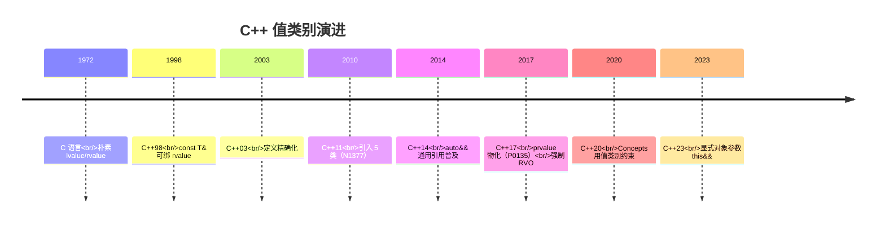
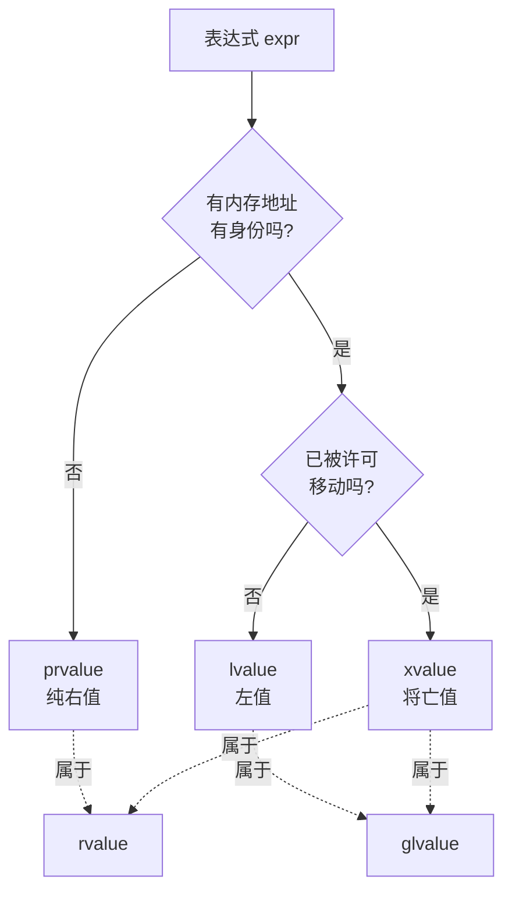
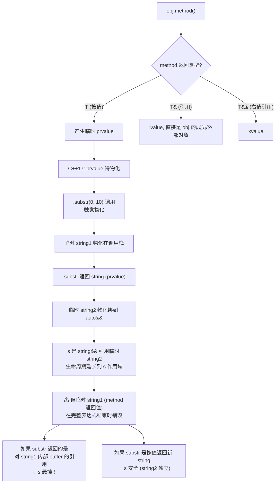

# 09.五大值类别详解

#### 目录介绍
- [1. 案例引入](#1-案例引入)
  - [1.1 一次诡异崩溃](#11-一次诡异崩溃)
  - [1.2 编译器到底如何看待表达式](#12-编译器到底如何看待表达式)
  - [1.3 我们要回答什么](#13-我们要回答什么)
- [2. 架构概览](#2-架构概览)
  - [2.1 值类别全景图](#21-值类别全景图)
  - [2.2 为什么是两个维度](#22-为什么是两个维度)
- [3. 值类别历史演进](#3-值类别历史演进)
  - [3.1 C时代的左右值](#31-c时代的左右值)
  - [3.2 C++03的两分法](#32-c03的两分法)
  - [3.3 C++11的五分法](#33-c11的五分法)
  - [3.4 C++17的精确化](#34-c17的精确化)
- [4. 五大类别精确定义](#4-五大类别精确定义)
  - [4.1 lvalue定身像](#41-lvalue定身像)
  - [4.2 prvalue纯右值](#42-prvalue纯右值)
  - [4.3 xvalue将亡值](#43-xvalue将亡值)
  - [4.4 glvalue广义左值](#44-glvalue广义左值)
  - [4.5 rvalue狭义右值](#45-rvalue狭义右值)
- [5. 表达式值类别判定](#5-表达式值类别判定)
  - [5.1 字面量与变量名](#51-字面量与变量名)
  - [5.2 函数调用结果](#52-函数调用结果)
  - [5.3 成员访问与下标](#53-成员访问与下标)
  - [5.4 转型与三目运算](#54-转型与三目运算)
  - [5.5 速查表汇总](#55-速查表汇总)
- [6. 引用与值类别绑定](#6-引用与值类别绑定)
  - [6.1 三种引用类型](#61-三种引用类型)
  - [6.2 绑定规则矩阵](#62-绑定规则矩阵)
  - [6.3 const引用的特权](#63-const引用的特权)
  - [6.4 引用绑定的实现](#64-引用绑定的实现)
- [7. 临时对象生命周期](#7-临时对象生命周期)
  - [7.1 临时对象本质](#71-临时对象本质)
  - [7.2 生命周期延长规则](#72-生命周期延长规则)
  - [7.3 延长不传递陷阱](#73-延长不传递陷阱)
  - [7.4 C++17物化时机](#74-c17物化时机)
- [8. decltype判定值类别](#8-decltype判定值类别)
  - [8.1 decltype的双重身份](#81-decltype的双重身份)
  - [8.2 三条判定规则](#82-三条判定规则)
  - [8.3 多余括号的玄机](#83-多余括号的玄机)
  - [8.4 实战诊断套路](#84-实战诊断套路)
- [9. 工程陷阱与诊断](#9-工程陷阱与诊断)
  - [9.1 函数返回引用悬挂](#91-函数返回引用悬挂)
  - [9.2 范围for与值类别](#92-范围for与值类别)
  - [9.3 链式调用的临时](#93-链式调用的临时)
  - [9.4 编译器诊断技巧](#94-编译器诊断技巧)
- [10. 综合案例串讲](#10-综合案例串讲)
  - [10.1 案例真相揭晓](#101-案例真相揭晓)
  - [10.2 一个表达式的一生](#102-一个表达式的一生)
  - [10.3 设计哲学回扣](#103-设计哲学回扣)
  - [10.4 速查表合集](#104-速查表合集)


## 1. 案例引入

### 1.1 一次诡异崩溃

某交易撮合系统的 C++17 服务上线后，**有 0.3% 的请求返回乱码字符串**——但本地测试 100% 复现不了。代码定位到一个看似无害的工具函数：

```cpp
// 把 protobuf 消息序列化成字符串再返回前 N 个字节
const std::string& head_n(const Order& order, std::size_t n) {
    return order.SerializeAsString().substr(0, n);   // ← 这一行
}

// 调用方
const std::string& s = head_n(order, 16);
log_info("head=%s", s.c_str());                       // ← 偶发乱码
```

代码评审看上去毫无问题：`SerializeAsString()` 返回 `std::string`，`substr` 又返回 `std::string`，然后我们 `return` 一个 `const string&`——延长引用生命周期不就保住了吗？

**事实是：返回的是悬挂引用**。函数返回的那一刻，`SerializeAsString()` 产生的临时 `string` 和 `substr()` 切出来的临时 `string` 全部销毁。`s` 引用的是已经被释放的栈/堆内存，能不乱码全靠运气——本地短测试时内存还没被覆盖，所以"看着是对的"。

要看懂这个 bug，必须知道四件事：
1. `SerializeAsString()` 这个表达式是什么**值类别**？
2. `.substr(0, n)` 这个表达式又是什么值类别？
3. **`return` 一个 `const string&` 引用一个临时对象，生命周期延长规则在这里为什么失效？**
4. 如果改成 `std::string head_n(...)` 按值返回，又会发生什么？

四个问题全部指向 **C++ 的值类别系统**——这是 C++11 之后整个语言的"语义底盘"。

### 1.2 编译器到底如何看待表达式

请回答以下 6 道判断题（不许查标准）：

```cpp
int  x = 42;
int& f();
int  g();
int&& h();
int  arr[10];
struct S { int m; } s;

// 题 1：这些表达式分别是什么值类别？
x                        // (a)
42                       // (b)
f()                      // (c)
g()                      // (d)
h()                      // (e)
std::move(x)             // (f)
arr[3]                   // (g)
s.m                      // (h)
S{1}                     // (i)
S{1}.m                   // (j)
true ? x : g()           // (k)
"hello"                  // (l)
```

正确答案在 5.5 速查表给出。如果你能 12 题全对，可以跳到第 7 章；如果错了 3 题以上——本篇就是为你准备的。

### 1.3 我们要回答什么

把疑问列清楚，本篇要回答 **8 个问题**：

1. **C++03 只有 lvalue/rvalue 两类，C++11 为什么要拆成 5 类？多出来的 3 个解决了什么旧分类解决不了的问题？**
2. **lvalue 是不是"能取地址的"？rvalue 是不是"不能取地址的"？这个朴素定义在哪里失效？**
3. **`std::move(x)` 的返回类型是 `int&&`，按"右值引用"理解是 rvalue——但它绑定的对象 x 还活着，"左值/右值"按对象死活分还是按表达式分？**
4. **为什么 `T&&` 在模板里是"万能引用"，在普通函数里又是"右值引用"？同样的语法，为什么值类别行为完全不同？**
5. **`const T&` 能绑定临时对象、`T&` 不能——这条规则的设计动机是什么？为什么 C++ 不让 `T&` 也能绑临时？**
6. **为什么开篇 `head_n` 函数的生命周期延长规则不生效？什么时候延长成功、什么时候失败？**
7. **`decltype(x)` 与 `decltype((x))` 为什么差一对括号结果完全不同？这跟值类别什么关系？**
8. **C++17 引入了"prvalue 物化（temporary materialization）"——这是什么时候发生？为什么之前的 RVO 失败案例 C++17 后就强制成功了？**

带着这 8 个问题进入正题。


## 2. 架构概览

### 2.1 值类别全景图

C++11 以来的值类别**不是一组并列的 5 类**，而是**两个正交维度切出来的 5 个区域**。先把这张分类图刻在脑子里：

```
                  expression（表达式）
                          │
         ┌────────────────┴────────────────┐
         ▼                                  ▼
      glvalue                            prvalue
   (有身份的)                          (纯粹的值)
         │
   ┌─────┴─────┐
   ▼           ▼
 lvalue       xvalue
(可重用)     (将亡)

      ┌──── rvalue ────┐
      ▼                ▼
   xvalue           prvalue


用集合关系画：
┌─────────────────────────────────────────────────┐
│                  expression                      │
│  ┌──────────────────────┐  ┌──────────────────┐│
│  │      glvalue          │  │     rvalue       ││
│  │  ┌──────┐  ┌────────┐│  │  ┌──────┐  ┌────┤│
│  │  │lvalue│  │ xvalue ││  │  │xvalue│  │prval││
│  │  └──────┘  └────────┘│  │  └──────┘  │ ue  ││
│  │                       │  │            └────┤│
│  └──────────────────────┘  └──────────────────┘│
│                                                  │
│              xvalue 同时是 glvalue 和 rvalue       │
└─────────────────────────────────────────────────┘
```

**5 类的本质**：

| 名字 | 全称 | 一句话定义 |
|---|---|---|
| **lvalue** | left value | 有身份（identity）、不可被移动的表达式 |
| **prvalue** | pure rvalue | 没有身份、就是一个"值"本身的表达式 |
| **xvalue** | eXpiring value | 有身份、但可以被移动（即将失效）的表达式 |
| **glvalue** | generalized lvalue | lvalue ∪ xvalue（**有身份**的表达式总称） |
| **rvalue** | right value | xvalue ∪ prvalue（**可被移动**的表达式总称） |

**glvalue 和 rvalue 是"伞称"**——它们不是与 lvalue/prvalue/xvalue 并列的具体类别，而是把这三个具体类别按维度归类的**集合**。

### 2.2 为什么是两个维度

**第一个维度：身份（identity）**——这个表达式是不是指向一个"在内存中实际存在、可以反复访问"的对象？

- 有身份 → glvalue：可以取地址、可以多次读、可以做左值参照系。
- 没有身份 → prvalue：它就是个"裸值"，可能只存在于寄存器或临时内存里，**问"它在哪"是没意义的**。

```cpp
int x = 42;
&x;          // ✓ 有身份 → glvalue
&42;         // ✗ 编译错：42 是 prvalue，无地址
&(x + 1);    // ✗ 编译错：x+1 是 prvalue，无地址
```

**第二个维度：可移动（movable）**——这个表达式持有的资源能不能被"窃取"（即将销毁，无人再用）？

- 可被移动 → rvalue：编译器/标准允许从它那里偷资源（如把 string 内部 buffer 的指针搬走）。
- 不可被移动 → 仅 lvalue（"还要继续用呢，谁让你偷"）。

把这两个维度做笛卡尔积：

| | 有身份 | 没身份 |
|---|---|---|
| **不可移动** | **lvalue** | （不存在——没身份的东西不会"用完没用完"） |
| **可移动** | **xvalue** | **prvalue** |

正好 3 个具体类别 + 2 个并集类别 = 5。**这套分类的天才之处**：把"身份"和"可移动性"解耦后，xvalue（**有身份且可移动**）就有了独立的位置——它就是 `std::move(x)`、`obj.field`（当 obj 是 xvalue 时）这种"明明在内存里有具体地址、但已经被宣告即将报废"的对象。

为什么 C++03 没有 xvalue？因为 C++03 没有移动语义——"可移动"这个维度根本不存在，所以只能简单二分 lvalue/rvalue。**C++11 引入移动语义后必须拆**——否则你无法表达"我有个具名对象但允许你偷它的资源"这种新需求。这就是 `std::move` 的语义角色。


## 3. 值类别历史演进

### 3.1 C时代的左右值

值类别概念最早来自 1972 年的 C 语言。K&R 第二版定义：

> An lvalue is an expression referring to an object. An object is a manipulable region of storage; an lvalue is therefore an expression that designates an object.

朴素定义：**lvalue = 能出现在 `=` 左边的表达式**（"left value"的字面意思）。

```c
int x;
x = 5;       // x 是 lvalue（能放赋值号左边）
5 = x;       // 错：5 是 rvalue（不能放左边）
```

C 语言里这个分类够用——因为 C 里"lvalue 不能在右边"是没说的，rvalue 才是反过来"只能在右边的"。

### 3.2 C++03的两分法

C++03 继承了 C 的二分，但有了几个调整：

```cpp
const int c = 42;
c = 5;        // 错：c 是 lvalue（K&R 定义"能左")
              // 但 C++ 中 const lvalue 不能赋值——
              // 所以"能左"不再是 lvalue 的判据
```

C++03 把定义改成更精准的版本：

> An lvalue refers to an object or function. An rvalue is a temporary object or a value.

但 C++03 还是只有 2 类，rvalue 只能用 `const T&` 绑（防止意外修改临时）。这导致一个**致命浪费**：

```cpp
std::string make_big() { return std::string(10000, 'x'); }
std::vector<std::string> v;
v.push_back(make_big());   // C++03：必须深拷贝！
```

`make_big()` 返回的临时 string 持有 10000 字节 buffer，但 `push_back` 收到的是 `const std::string&`（C++03 唯一能绑临时的方式），只能调拷贝构造——**临时对象的资源明明马上就要销毁，但你不能偷它**。这是 C++03 的根本痛点。

### 3.3 C++11的五分法

C++11 引入移动语义，需要表达"这是临时对象，可以偷"——于是引入第二个维度，重新切分成 5 类。**Howard Hinnant 主导的 N1377 提案**奠定了这套体系。

新增的 `T&&` 类型（右值引用）作为"绑定可偷资源对象"的句柄：

```cpp
std::vector<std::string> v;
v.push_back(make_big());   // C++11：调用 push_back(string&&)，move 进去，零拷贝！
```

但只引入"右值引用"还不够——必须把"具名 + 可偷"的情况也覆盖到，所以 xvalue 出现了：

```cpp
std::string s = "hello";
v.push_back(std::move(s));   // s 是具名对象（lvalue），但 std::move(s) 是 xvalue
                              // → 命中 push_back(string&&) 重载
```

`std::move(s)` 的返回类型是 `string&&`，但 s 这个对象明明还活着——"右值"不是按对象死活分，**是按表达式的语义角色分**。这是 C++11 值类别系统最关键的概念跃迁。

### 3.4 C++17的精确化

C++17 引入 **prvalue 物化（temporary materialization）** 概念（P0135R1，Richard Smith 主导），明确规定：

- prvalue **本身不是对象**，只是"产生对象的食谱"。
- 当 prvalue 必须当作对象用时（如绑到引用、取成员），**才发生"物化"**——产生临时对象，prvalue 转 xvalue。

这一改动看似抽象，但解决了一个长期问题：

```cpp
struct NonCopy {
    NonCopy() = default;
    NonCopy(const NonCopy&) = delete;   // 不可拷贝
    NonCopy(NonCopy&&) = delete;        // 也不可移动
};
NonCopy make() { return NonCopy{}; }    // 返回纯 prvalue
NonCopy n = make();                     // C++14：错！需要移动构造
                                          // C++17：✓ prvalue 直接物化在 n 的地址上
```

这就是 **强制 RVO（Guaranteed Copy Elision）**——C++17 把"prvalue 还没物化"作为一种正式的中间状态，**编译器必须把 prvalue 直接构造在最终目的地**，根本不调拷贝/移动构造。这一节的细节和 C++11 之前的 RVO 完全不同（27 篇详谈）。

**演进时间线**：




## 4. 五大类别精确定义

### 4.1 lvalue定身像

**定义**：lvalue 是表示"可重用的、有身份的对象"的表达式。

**典型 lvalue**：

| 表达式 | 解释 |
|---|---|
| 命名变量 `x`、`name` | 经典 lvalue |
| 函数名 `f`（不是调用 `f()`） | lvalue（函数也是对象） |
| 解引用 `*p`、`p->m` | lvalue（指针解引用产生左值） |
| 数组下标 `arr[i]` | lvalue |
| 成员访问 `obj.m`（obj 是 lvalue 时） | lvalue |
| 前置 `++x` / `--x` | lvalue |
| 字符串字面量 `"hello"` | **lvalue**（类型是 `const char[6]`，有静态存储） |
| 赋值表达式 `x = 5`（整体） | lvalue |
| 转型 `static_cast<int&>(x)` | lvalue |

**lvalue 的能力**：
- ✓ 可以取地址（`&x`）
- ✓ 可以多次读取
- ✓ 可以绑到 `T&`、`const T&`
- ✗ **不能**绑到 `T&&`（右值引用）

### 4.2 prvalue纯右值

**定义**：prvalue 是"纯粹的值"——它没有身份，是计算的中间结果或字面量。

**典型 prvalue**：

| 表达式 | 解释 |
|---|---|
| 整数/浮点字面量 `42`、`3.14` | prvalue |
| 字符字面量 `'a'` | prvalue（注意区别于字符串字面量） |
| `nullptr` | prvalue |
| 算术表达式 `a + b`、`x * 2` | prvalue |
| 函数调用 `f()`（返回值不是引用时） | prvalue |
| `this` | prvalue（this 是裸值指针，C++11 起明确） |
| 字面量类型构造 `T{}`、`T(args)` | prvalue（C++17 后才物化） |
| 后置 `x++` / `x--` | prvalue（注意与前置区别） |
| 取地址 `&x` | prvalue |
| Lambda 表达式 `[]{}` | prvalue |

**prvalue 的能力**：
- ✗ **不能**取地址
- ✗ **不能**赋值
- ✓ 可以绑到 `const T&`（绑时物化）
- ✓ 可以绑到 `T&&`（绑时物化）
- ✗ **不能**绑到 `T&`（普通左值引用）

```cpp
int& r1 = 42;          // ✗ 错
const int& r2 = 42;    // ✓ 临时对象物化，r2 引用之
int&& r3 = 42;         // ✓ 同上
```

### 4.3 xvalue将亡值

**定义**：xvalue 是"有身份但已被许可被移动"的表达式——eXpiring（即将失效）。

**典型 xvalue**：

| 表达式 | 解释 |
|---|---|
| `std::move(x)` | 把 lvalue 转 xvalue（本质是 `static_cast<T&&>(x)`） |
| `static_cast<T&&>(x)` | 显式转 xvalue |
| 函数返回 `T&&` 类型 | xvalue（很少见，主要在标准库） |
| `obj.member`（obj 是 xvalue 时） | xvalue |
| `arr[i]`（arr 是 xvalue 时） | xvalue |
| 三目 `cond ? xv : xv` | xvalue |
| **C++17 物化后的临时**（如 `T{}` 绑到引用时） | xvalue |

**xvalue 的能力**：
- ✓ 可以取地址（有身份）
- ✓ 可以绑到 `const T&`
- ✓ 可以绑到 `T&&`
- ✗ **不能**绑到 `T&`（看起来像 lvalue 但语义是 rvalue）

```cpp
std::string s = "hi";
std::string& r1 = std::move(s);          // ✗ 错（xvalue 是 rvalue）
const std::string& r2 = std::move(s);    // ✓
std::string&& r3 = std::move(s);         // ✓
```

xvalue 是值类别系统的**点睛之笔**——它独立出来后，"有身份"和"可移动"才能正交。

### 4.4 glvalue广义左值

**定义**：glvalue = lvalue ∪ xvalue = "有身份的表达式"。

```
glvalue 的能力：
  ✓ 有内存地址（虽然 xvalue 不允许 & 直接取，但物理上有地址）
  ✓ 类型是完整的、可访问的
  ✓ 可以多次读取
```

glvalue 是个**伞称**——你不会单说"这是个 glvalue"，而是会进一步细分成 lvalue 还是 xvalue。它在标准里主要用于描述"哪些操作对所有有身份的表达式都成立"。

**glvalue 的常见出现位置**：
- 多态调用必须是 glvalue：`virtual void f()` 调用时，对象表达式必须是 glvalue（虚分派需要找 vptr）。
- 取多态类型 RTTI：`typeid(expr)` 中的 expr 必须是 glvalue 才会查 vptr。
- 容器元素访问：`vec[i]` 在不同上下文给出 lvalue（vec 是 lvalue）或 xvalue（vec 是 xvalue），但都是 glvalue。

### 4.5 rvalue狭义右值

**定义**：rvalue = xvalue ∪ prvalue = "可移动的表达式"。

rvalue 是另一个伞称。**`T&&` 引用绑定的就是 rvalue**——管你是 xvalue 还是 prvalue，都能绑：

```cpp
void sink(std::string&& s);   // 形参是 string&&，能绑 rvalue

sink(std::string{"hi"});       // ✓ prvalue
sink(std::move(s));            // ✓ xvalue
sink(s);                       // ✗ s 是 lvalue
```

**5 类决策树**（背下来）：




## 5. 表达式值类别判定

把每种表达式按规则查清楚——这是工程中最直接需要的能力。

### 5.1 字面量与变量名

| 表达式 | 类型 | 值类别 | 解释 |
|---|---|---|---|
| `42`（int 字面量） | `int` | **prvalue** | 没地址 |
| `3.14`（double 字面量） | `double` | **prvalue** | 没地址 |
| `'a'`（char 字面量） | `char` | **prvalue** | 没地址 |
| `"hello"`（字符串字面量） | `const char[6]` | **lvalue** | ⚠ 字符串字面量是数组对象，有静态存储 |
| `true` / `nullptr` | `bool` / `nullptr_t` | **prvalue** | 没地址 |
| 命名变量 `x` | T | **lvalue** | 有名字就有身份 |
| 命名常量 `const int c = 1; c` | `const int` | **lvalue** | 有名字就是 lvalue（但不可写） |
| 函数名 `f`（不调用） | 函数类型 | **lvalue** | 函数有地址 |

字符串字面量是 lvalue 这点常被搞混——`"hello"` 的类型是 `const char[6]`，是个真实存在于程序静态段的数组对象。可以验证：

```cpp
auto p = "hello";          // p 类型是 const char*（数组到指针的退化）
auto& r = "hello";         // r 类型是 const char(&)[6]
const void* addr = "hello"; // ✓ 取得到地址
```

### 5.2 函数调用结果

| 函数返回类型 | `f()` 是 | 例子 |
|---|---|---|
| `T`（按值返回） | **prvalue** | `std::string make_str()` 调用结果 |
| `T&`（左值引用） | **lvalue** | `std::vector::operator[]` |
| `T&&`（右值引用） | **xvalue** | `std::move`、`std::forward<T>(x)` 当 T 是 T&& |
| `void` | prvalue（特殊） | 不能再做表达式 |

**关键**：返回类型决定值类别，**与函数体无关**。

```cpp
int  g();           // g() 是 prvalue
int& f();           // f() 是 lvalue
int&& h();          // h() 是 xvalue（极少在用户代码出现）

f() = 5;            // ✓ 给 lvalue 赋值
g() = 5;            // ✗ 给 prvalue 赋值
&f();               // ✓
&g();               // ✗
```

### 5.3 成员访问与下标

成员访问 `E1.E2` 的值类别**取决于 E1 和 E2 的种类**：

| E2 是 | E1 是 lvalue | E1 是 xvalue | E1 是 prvalue |
|---|---|---|---|
| **数据成员** | lvalue | **xvalue** | **xvalue**（先物化） |
| **函数成员** | lvalue | lvalue | lvalue |
| **静态成员** | lvalue | lvalue | lvalue |
| **枚举成员** | prvalue | prvalue | prvalue |

```cpp
struct S { int m; };

S        s1;
S        get_s();
S&&      get_s_rref();

s1.m;                  // lvalue（S 是 lvalue + 数据成员）
get_s().m;             // xvalue（S 是 prvalue 物化后 + 数据成员）
get_s_rref().m;        // xvalue（S 是 xvalue + 数据成员）
std::move(s1).m;       // xvalue
```

**"成员访问继承父表达式的可移动性"**——这是 `std::move(obj).member` 在传递成员时仍是 rvalue 的原因，工程中很常用。

数组下标 `E1[E2]` 类似：取决于 E1 是 lvalue 还是 xvalue（一般都是 lvalue）。

### 5.4 转型与三目运算

**四大 cast 的值类别**：

| 转型 | 值类别 |
|---|---|
| `static_cast<T>(x)` | T 是引用 → 看引用类别；T 是值 → prvalue |
| `static_cast<T&>(x)` | **lvalue** |
| `static_cast<T&&>(x)` | **xvalue** |
| `static_cast<T>(x)`（T 是值） | **prvalue** |
| `(T)x` C 风格 | 同 static_cast |
| `dynamic_cast<T*>(p)` | prvalue（指针） |
| `dynamic_cast<T&>(x)` | lvalue |
| `const_cast<T&>(x)` | lvalue |
| `reinterpret_cast<T*>(p)` | prvalue |

**`std::move(x)` 的真身**：

```cpp
template <class T>
constexpr std::remove_reference_t<T>&& move(T&& x) noexcept {
    return static_cast<std::remove_reference_t<T>&&>(x);
}
// 结论：std::move(x) 等价于 static_cast<T&&>(x)，值类别是 xvalue
```

**三目运算 `cond ? a : b`**——规则极其复杂，可以记简化版：

| a 类别 | b 类别 | 结果 |
|---|---|---|
| 同类型 lvalue | 同类型 lvalue | lvalue |
| 同类型 xvalue | 同类型 xvalue | xvalue |
| 同类型 prvalue | 同类型 prvalue | prvalue |
| 不同值类别 / 不同类型 | — | 复杂规则，多数退化为 prvalue |

```cpp
int x, y;
(true ? x : y) = 5;          // ✓ 两边都是 lvalue → 整体 lvalue
(true ? x : 42) = 5;         // ✗ x 是 lvalue，42 是 prvalue → 整体退化为 prvalue
```

### 5.5 速查表汇总

回答 1.2 节的 12 道题：

```cpp
int  x = 42;
int& f();
int  g();
int&& h();
int  arr[10];
struct S { int m; } s;

x                        // (a) lvalue
42                       // (b) prvalue
f()                      // (c) lvalue       （返回 T&）
g()                      // (d) prvalue      （返回 T）
h()                      // (e) xvalue       （返回 T&&）
std::move(x)             // (f) xvalue       （= static_cast<int&&>(x)）
arr[3]                   // (g) lvalue       （arr 是 lvalue）
s.m                      // (h) lvalue       （s 是 lvalue + 数据成员）
S{1}                     // (i) prvalue      （字面量类型构造）
S{1}.m                   // (j) xvalue       （S{1} 是 prvalue + 数据成员 → 物化为 xvalue）
true ? x : g()           // (k) prvalue      （x 是 lvalue, g() 是 prvalue → 退化）
"hello"                  // (l) lvalue       （字符串字面量是数组对象）
```

**全表速查**：

| 表达式形式 | 值类别 |
|---|---|
| 命名对象 / 命名变量 / 命名引用 | lvalue |
| 整数/浮点/字符/bool/nullptr 字面量 | prvalue |
| 字符串字面量 `"..."` | **lvalue**（数组对象） |
| `T x = ...; x` | lvalue |
| `f()`（返回 T） | prvalue |
| `f()`（返回 T&） | lvalue |
| `f()`（返回 T&&） | xvalue |
| `T()`、`T{}` | prvalue |
| `obj.m`（obj 是 lvalue） | lvalue |
| `obj.m`（obj 是 rvalue） | xvalue |
| `*p` | lvalue |
| `&x` | prvalue |
| `arr[i]` | lvalue |
| `++x` | lvalue |
| `x++` | prvalue |
| `a + b`, `a * b`, `a == b` | prvalue |
| `a = b`, `a += b` | lvalue |
| `static_cast<T&>(x)` | lvalue |
| `static_cast<T&&>(x)` | xvalue |
| `static_cast<T>(x)` | prvalue |
| `std::move(x)` | xvalue |
| `std::forward<T>(x)` | T 决定（11 篇详谈） |
| `this` | prvalue |
| Lambda `[]{}` | prvalue |
| `throw expr` | prvalue（type 是 void） |


## 6. 引用与值类别绑定

引用是"绑定值类别"的语法工具。三种引用对应三种绑定能力。

### 6.1 三种引用类型

| 引用类型 | 写法 | 设计目的 |
|---|---|---|
| **左值引用** | `T&` | 绑定 lvalue，传引用参数（不偷资源） |
| **const 左值引用** | `const T&` | 绑定**任何东西**，统一只读访问 |
| **右值引用** | `T&&` | 绑定 rvalue，宣告"我要偷资源" |

注意：模板参数推导中的 `T&&` 是"万能引用"（universal reference / forwarding reference），与普通函数参数中的 `T&&` 行为完全不同——这是 11 篇的主题。**本篇 `T&&` 只指普通右值引用**。

### 6.2 绑定规则矩阵

```
        ┌────────┬─────────┬─────────┐
        │   T&   │ const T&│   T&&   │
        ├────────┼─────────┼─────────┤
lvalue  │   ✓   │    ✓    │    ✗    │
glvalue │   *   │    *    │    *    │
xvalue  │   ✗   │    ✓    │    ✓    │
prvalue │   ✗   │    ✓ ⚡  │    ✓ ⚡  │
rvalue  │   ✗   │    ✓    │    ✓    │
        └────────┴─────────┴─────────┘
        ⚡ = 触发临时对象物化
```

**记住三条铁律**：
1. **`T&` 只接 lvalue**。
2. **`T&&` 只接 rvalue**（xvalue + prvalue）。
3. **`const T&` 接所有**——这是 const T& 在 C++03 时代成为"通用入参"的原因。

```cpp
void f1(int& x);
void f2(const int& x);
void f3(int&& x);

int a = 1;
const int b = 2;

f1(a);             // ✓ a 是 lvalue
f1(b);             // ✗ b 是 const lvalue（int& 不能丢 const）
f1(42);            // ✗ 42 是 prvalue
f1(std::move(a));  // ✗ move(a) 是 xvalue

f2(a);             // ✓
f2(b);             // ✓
f2(42);            // ✓ 物化 → 临时
f2(std::move(a));  // ✓

f3(a);             // ✗ a 是 lvalue
f3(42);            // ✓ 物化
f3(std::move(a));  // ✓
```

### 6.3 const引用的特权

`const T&` 能绑 prvalue 是 C++ 的**特权设计**——为什么 `T&` 不行？

设想下面的代码（如果允许）：

```cpp
void increment(int& x) { x++; }   // 假设 int& 能绑 prvalue
double d = 3.14;
increment(d);                      // d 隐式转换为临时 int(3)
                                    // 临时对象 +1 = 4，但临时对象立即销毁
                                    // d 还是 3.14，看起来"调用没生效"
```

`T&` 拒绝绑 prvalue 的根本原因是：**绑了你也修改不了真正的对象，反而制造静默 bug**。const T& 不允许修改，所以可以放行——既然只读，绑临时对象当然没问题。

### 6.4 引用绑定的实现

引用的底层就是**带额外语义的指针**（03 篇详谈）。绑定 prvalue 时，编译器：

1. 在调用方栈帧上**分配一块临时存储**。
2. 把 prvalue 的值/构造结果**物化**到这块存储里。
3. 把这块存储的地址作为引用的"指针表示"传给被调函数。

```cpp
const std::string& r = std::string{"hello"};

// 编译器生成的伪汇编（简化）：
//   sub rsp, sizeof(string)        ; 栈上分配临时
//   lea rdi, [rsp]                  ; 临时地址作为 this
//   mov rsi, addr_of_"hello"
//   call string::ctor               ; 物化：调用 string("hello")
//   lea rax, [rsp]                  ; r = &临时
```

只要 `r` 还在作用域内，这块栈存储就保留——这就是下一节"生命周期延长"的实现机制。


## 7. 临时对象生命周期

C++ 中**临时对象什么时候销毁**是工程中最常出 bug 的地方之一。

### 7.1 临时对象本质

"临时对象"是 prvalue 物化后的产物。在 C++17 之前，临时对象被认为"在表达式结束时销毁"；C++17 之后定义更精确：

> **临时对象的生命周期默认在创建它的"完整表达式"（full-expression）结束时终止。**
>
> "完整表达式"是不嵌套在其他表达式中的最大表达式——通常以 `;` 或 `,` 等语句分隔符为界。

```cpp
int x = (foo(make_str()), 5);
//        ─────┬──── ────┬────
//             │         │
//             │         └─ 这里 (make_str(), 5) 结束 → 临时销毁
//             └─ 临时一直存活到此

```

具体来说：

```cpp
{
    f(std::string("a") + "b");
    // ① "a" 构造临时 string1
    // ② string1 + "b" 构造临时 string2
    // ③ 调用 f(string2)
    // ④ ; 语句结束 → string1、string2 都析构
}
```

临时对象**默认存活到分号**。

### 7.2 生命周期延长规则

**唯一例外**：用引用直接绑定到临时对象时，临时对象的生命周期延长到引用结束。

```cpp
const std::string& r = std::string("hello");
// 临时 string 的生命周期 → 延长到 r 的作用域结束
// 而不是分号结束

std::string&& r2 = std::string("world");
// 同上，T&& 也能延长
```

**延长规则要点**：

| 情况 | 延长结果 |
|---|---|
| `const T&` 直接绑 prvalue | ✓ 延长 |
| `T&&` 直接绑 prvalue | ✓ 延长 |
| `T&` 绑 prvalue | ✗ 编译错（根本不允许绑） |
| 函数参数 `const T&` 接收实参 | ✓ 延长到参数生命周期（即函数返回前） |
| 函数 `return const T& → const T&` | ✗ **不延长**（不传递） |

### 7.3 延长不传递陷阱

**生命周期延长不能跨函数边界传递**——这正是开篇 head_n 的 bug。

```cpp
const std::string& head_n(const Order& order, std::size_t n) {
    return order.SerializeAsString().substr(0, n);
    //     ─────────┬───────────────────────────
    //               │
    //               这是个 prvalue (string)
    //               .substr() 返回值也是 prvalue (string)
}
```

调用方写：

```cpp
const std::string& s = head_n(order, 16);
```

**期望**：`s` 引用 `head_n` 返回的临时 string，生命周期延长到 s 的作用域结束。

**实际**：
1. `head_n` 内部产生了两个临时 string（SerializeAsString 一个，substr 一个）。
2. 这两个临时是 `head_n` 函数内的"完整表达式"末尾的临时。
3. 当 `head_n` 返回时，**函数体的完整表达式结束 → 两个临时立即销毁**。
4. `head_n` 返回的引用此刻**已经悬空**。
5. 调用方 `s` 绑定到一个已经悬空的引用——延长根本来不及发生。

C++ 规则明确：**生命周期延长只在临时被首次绑定到引用的那一处发生，绑定一次后就不再随后续传递而延长**。所以 `head_n` 内部 `return` 时延长机会就是终点，调用方再绑 `s` 不会续命。

**修复方式**：

```cpp
// 方案 1：按值返回
std::string head_n(const Order& order, std::size_t n) {
    return order.SerializeAsString().substr(0, n);
}
// 调用方
std::string s = head_n(order, 16);   // ✓ 移动构造，无悬挂

// 方案 2：函数返回 string，调用方用 const ref 绑（延长到分号）
const std::string s = head_n(order, 16);
// 临时 head_n 返回值绑到 s → 延长到 s 作用域结束
```

**编译器警告**：GCC `-Wreturn-stack-address`、Clang `-Wreturn-stack-address`、MSVC `/W4` 都会警告这个 bug——开篇案例没看到警告，往往是因为 CI 关了警告或函数模板/inline 内联后丢失诊断。**生产 CI 必须开 `-Wall -Wextra -Wreturn-stack-address`**。

### 7.4 C++17物化时机

C++17 之前 prvalue **立刻**就是临时对象；C++17 后**延后到必须时才物化**。这影响了很多场景：

```cpp
struct NonMovable {
    NonMovable() = default;
    NonMovable(const NonMovable&) = delete;
    NonMovable(NonMovable&&) = delete;
};
NonMovable f() { return NonMovable{}; }   // 返回 prvalue

// C++14：错。f() 的返回需要"移动"到调用方，但移动构造已 delete
// C++17：✓。f() 的 prvalue 直接物化在调用方接收的位置（强制 RVO）

NonMovable n = f();
// C++17：n 自身的初始化就是物化点 → prvalue 直接构造在 n 的地址上，零拷贝零移动
```

**物化触发点**：
1. 绑定到引用：`const T& r = f();`
2. 访问成员：`f().m`
3. 数组下标：`f()[0]`
4. 多态调用：`typeid(f())`
5. 转 glvalue：`static_cast<T&>(f())`（实际不允许，但 `T&&` 可以）
6. 抛出：`throw f();`

未物化的 prvalue 可以"穿透"返回链——这就是强制 RVO 能工作的根本。


## 8. decltype判定值类别

`decltype` 是诊断值类别的**官方仪器**——但用法有讲究。

### 8.1 decltype的双重身份

`decltype` 有**两种语义**，根据参数形式选择：

```cpp
decltype(entity)        // 形式 1：参数是"实体"（无加括号的标识符或成员访问）
decltype((expression))  // 形式 2：参数是表达式
```

| 形式 | 语义 |
|---|---|
| `decltype(entity)` | 返回**实体的声明类型** |
| `decltype((expr))` | 返回**表达式 expr 的类型 + 值类别编码** |

形式 2 才是判定值类别的工具。

### 8.2 三条判定规则

`decltype((expression))` 的三条规则：

| expression 的值类别 | decltype 结果 |
|---|---|
| **lvalue** | `T&` |
| **xvalue** | `T&&` |
| **prvalue** | `T` |

```cpp
int x;
int& f();
int  g();
int&& h();

decltype((x))     // int&    （x 是 lvalue）
decltype((42))    // int     （42 是 prvalue）
decltype((f()))   // int&    （f() 是 lvalue）
decltype((g()))   // int     （g() 是 prvalue）
decltype((h()))   // int&&   （h() 是 xvalue）
decltype((std::move(x)))   // int&&   （xvalue）
```

**记忆**：lvalue → 加 `&`，xvalue → 加 `&&`，prvalue → 不加。

### 8.3 多余括号的玄机

`decltype(x)` vs `decltype((x))`——**多一对括号结果天差地别**：

```cpp
int x = 42;
decltype(x)    a = x;   // a 的类型是 int     （形式 1：x 的声明类型）
decltype((x))  b = x;   // b 的类型是 int&    （形式 2：(x) 是 lvalue 表达式）
```

**为什么这么设计？** 标准想区分两种意图：

- "我想知道 x 这个变量被声明为什么类型" → 不加括号。
- "我想知道这个表达式的运行时角色" → 加括号。

成员访问也一样：

```cpp
struct S { int m; };
S s;

decltype(s.m)     a = s.m;   // int   （声明类型）
decltype((s.m))   b = s.m;   // int&  （s.m 是 lvalue 表达式）
```

最容易翻车的位置是 `decltype(auto)` 函数返回值：

```cpp
decltype(auto) f1() {
    int x = 0;
    return x;          // 返回 int
}
decltype(auto) f2() {
    int x = 0;
    return (x);        // 返回 int&  ← 悬挂！x 是栈对象
}
```

`f2` 的 `(x)` 是 lvalue 表达式，`decltype(auto)` 推为 `int&`，于是函数返回 x 的引用——但 x 是栈变量，函数返回时立即销毁。**这是 `decltype(auto) + return (x)` 的经典悬挂陷阱**，详见 12 篇。

### 8.4 实战诊断套路

工程中怎么验证一个表达式的值类别？三种办法：

**方法 1：编译期 static_assert**

```cpp
#include <type_traits>

int x = 1;
static_assert(std::is_lvalue_reference_v<decltype((x))>,        "x is lvalue");
static_assert(std::is_rvalue_reference_v<decltype((std::move(x)))>, "move(x) is xvalue");
static_assert(std::is_same_v<decltype((42)), int>,               "42 is prvalue");
```

**方法 2：模板特化打印**

```cpp
template<class T> struct VC;
VC<decltype((expr))> _;   // 编译错，错误信息会暴露推导出的类型
// 例如 GCC：error: aggregate 'VC<int&> _' has incomplete type
//            ─────  ↑ 这里 int& 说明 expr 是 lvalue
```

**方法 3：运行时 type_id**（不推荐，运行时引用类型会退化）

工程实践中**方法 1 是首选**——CI 静态检查最稳。


## 9. 工程陷阱与诊断

### 9.1 函数返回引用悬挂

开篇案例的本质问题。**所有"返回引用引用临时"的写法都是 UB**：

```cpp
const std::string& bad1() {
    return std::string("hi");          // ❌ 返回临时的引用
}
const int& bad2(int x) {
    return x;                           // ❌ x 是参数（栈对象）
}
const int& bad3() {
    static const int& r = func();      // ⚠ 取决于 func 返回什么，可能也悬挂
    return r;
}
```

**安全规则**：

```
函数返回引用，必须满足以下之一：
  1. 引用一个比函数活得久的对象（成员变量、static、heap）
  2. 引用一个传入的参数（生命周期由调用方保证）
  3. 永远不返回引用，按值返回（让编译器做 RVO）
```

### 9.2 范围for与值类别

C++11 的 range-based for 有个常见陷阱：

```cpp
std::vector<bool> v = {true, false, true};
for (auto& b : v) { ... }   // ❌ 编译错！
```

为什么？`std::vector<bool>` 是个**特化的伪容器**——它的 `operator[]` 返回的是个**代理类对象（proxy）**，不是真正的 `bool&`。这个代理对象是**临时**（prvalue），`auto& b` 这个左值引用绑不上去。

修复：

```cpp
for (auto b : v) { ... }      // ✓ 按值
for (auto&& b : v) { ... }    // ✓ 万能引用，能绑临时（11 篇详谈）
```

**所以 C++17 后的最佳实践是 `auto&&`**——对所有容器元素都通用。

### 9.3 链式调用的临时

```cpp
std::string s = "hello";
auto& it = s.append("!").begin();   // ⚠ s.append("!") 返回 string&，是 lvalue
                                      // .begin() 返回 iterator，是 prvalue
                                      // 绑到 auto& 失败！
```

```cpp
std::string make() { return "hi"; }
auto&& r = make().append("!");     // ✓ make() 是 prvalue，.append() 返回 string&
                                     //   r 绑到 string& → r 是 lvalue 引用
                                     // ⚠ 但 make() 返回的临时 string 已被
                                     //   完整表达式结束销毁（延长不传递）
                                     //   r 实际悬挂！
```

**链式调用一旦中间某步返回引用 → 后续生命周期跟原临时绑定 → 容易超出预期**。

```cpp
std::string make() { return "hi"; }
const auto& r = make();             // ✓ 直接绑 prvalue → 延长成功
const auto& r2 = make().append("!"); // ✗ 间接绑 → 延长失败 → r2 悬挂
```

记规则：**生命周期延长仅在"引用直接绑 prvalue"的位置发生，链式中间隔了一层就失效**。

### 9.4 编译器诊断技巧

```bash
# GCC / Clang 关键警告
g++ -std=c++17 -Wall -Wextra \
    -Wreturn-stack-address \   # 返回栈地址
    -Wdangling-reference \      # 悬挂引用 (Clang 17+, GCC 13+)
    -Wlifetime \                # Clang lifetime profile
    -fsanitize=address \        # 运行时检测
    code.cpp

# 关键 sanitizer
-fsanitize=address     # ASan：检测 use-after-free
-fsanitize=undefined   # UBSan：检测一些 UB
```

**Clang `-Wdangling-reference`**（C++17 起）能直接捕获 7.3 节的 `head_n` 类问题——上线前 CI 必开。

**`std::reference_wrapper` 调试**：把可疑引用包成 `reference_wrapper` 强制使用 get()，可以让悬挂在更早的点暴露。


## 10. 综合案例串讲

### 10.1 案例真相揭晓

逐一回答第 1 章的 8 个问题：

**Q1：C++03 → C++11 为什么从 2 类拆成 5 类？**
A1：根本动力是**移动语义**。C++03 的 lvalue/rvalue 二分按"能否出现在赋值左边"分类，无法表达"虽是具名对象但允许偷资源"这种新需求。C++11 引入"身份"和"可移动性"两个正交维度，3 个具体类（lvalue/xvalue/prvalue）+ 2 个伞称（glvalue/rvalue）= 5。**xvalue 是这次拆分的关键产物**——它让 `std::move(x)` 这种"具名但可偷"的语义有了正式归属。

**Q2：lvalue 是不是"能取地址"？**
A2：**朴素近似但不严谨**。更准确的定义：lvalue 是"有身份（identity）+ 不可移动（unmovable）"的表达式。"能取地址" 在大多数情况成立，但 xvalue 也有地址但不能用 `&` 取（语法层禁止），所以"能取地址"既不充分也不必要。准确判据：**有名字、可重复使用、不是 std::move 包出来的就是 lvalue**。

**Q3：`std::move(x)` 是 rvalue 但 x 还活着——按表达式还是按对象分？**
A3：**值类别按表达式分，不按对象分**。同一个对象 x，写 `x` 时表达式是 lvalue，写 `std::move(x)` 时表达式是 xvalue。表达式给编译器一个"语义角色"，告诉它"在这一处我允许把 x 的资源偷走"——但 x 这个对象本身的存活与否、有没有具名跟值类别没关系。这是初学者最容易卡的概念，掰开后整套系统就通了。

**Q4：`T&&` 在模板里是万能、在普通函数里是右值引用——为什么？**
A4：这是 C++ 故意做的"语法重载"。**模板参数推导触发引用折叠规则**（11 篇详谈）：
- `template<class T> void f(T&& x)`：T 推为 `U&` 时 `T&&` 折叠为 `U&`（万能引用）
- `void g(int&& x)`：T 是确定类型 `int`，没有推导，就是普通右值引用
两个写法看起来一样，但前者经历推导+折叠，后者不经历——所以行为不同。

**Q5：为什么 `const T&` 能绑临时但 `T&` 不能？**
A5：`T&` 绑临时会制造静默 bug（修改临时对象等于没修改）。`const T&` 不允许写入，绑临时只读访问没有任何问题，所以 C++ 给了它"通用入参"的特权——这是为什么 C++03 时代所有函数入参都偏好 `const T&`。`T&&` 出现后才补上"我要绑临时并修改/偷"的语义角色。

**Q6：head_n 的延长规则为什么失效？**
A6：**生命周期延长不跨函数边界**。`head_n` 内 `return order.SerializeAsString().substr(0, n)` 的两个临时 string 在 `return` 时（函数体的完整表达式）就结束生命周期，函数返回的引用此时已经悬空。调用方再用 `const string& s` 接，**绑的是已经悬挂的引用**，没机会再延长。修复：要么按值返回（让 RVO/移动起效），要么取消引用返回（C++17 强制 copy elision）。

**Q7：`decltype(x)` vs `decltype((x))`？**
A7：标准故意区分两种意图：
- `decltype(x)`（形式 1）：返回**变量 x 的声明类型**（如 `int`）
- `decltype((x))`（形式 2）：返回**(x) 这个表达式的值类别编码类型**（lvalue → `int&`、xvalue → `int&&`、prvalue → `int`）
多一对括号的本质是把"实体"变成了"表达式"。这是 `decltype(auto) f() { return (x); }` 返回栈引用的根源。

**Q8：C++17 prvalue 物化与强制 RVO？**
A8：C++17 引入"prvalue 不立即是对象，只是产生对象的食谱"概念。当 prvalue 必须作为对象存在时（绑引用、做成员访问、`T x = f()` 初始化等）才"物化"成 xvalue。这一改动让 `T x = make_T();` 中 `make_T()` 的返回值**直接构造在 x 的存储位置**，根本不调拷贝/移动构造——这就是**强制 copy elision**，让 NonCopyable + NonMovable 的类型也能从函数返回。

### 10.2 一个表达式的一生

```cpp
auto&& s = obj.method().substr(0, 10);
```

把这一行的语义全展开，画出生命周期图：



`std::string::substr` **是按值返回新 string** 的——所以 `auto&& s = make_string().substr(0, 10);` 是安全的。但同样的写法换成 `auto&& it = make_vector().begin();` 就会悬挂——`begin()` 返回的是迭代器，迭代器引用 vector 内部的存储，vector 临时一销毁迭代器就失效。

**判定一个链式表达式是否安全**——必须知道每一步的返回类型和值类别。

### 10.3 设计哲学回扣

值类别系统折射出 C++ 三条核心哲学：

**① 把语义维度掰开 → 让"操作意图"成为类型层面的事实**
C++03 只用"能否出现在 = 左边"区分对象。C++11 把"身份"和"可移动性"独立成两个维度，让"我有个对象但允许你偷"这种细粒度意图能直接通过 `std::move(x)` 表达——**编译器据此选择重载、决定要不要调移动构造，毫无歧义**。这是"把人类意图编码成类型"思想的极致体现。

**② 零开销原则的边界：值类别不增加运行时开销**
值类别**完全是编译期概念**——表达式什么类别、绑哪个引用、调哪个重载，全在编译期决定。运行时不存在"判断这是 lvalue 还是 xvalue"的代码。`std::move(x)` 运行时是空操作（仅是 `static_cast`，不产生任何指令）。**整个 5 类系统不增加一个字节运行时开销**——这是 C++ "不为不用付费"的具象。

**③ 默认安全 + 显式声明潜在危险**
`T&` 默认拒绝绑临时——保护用户避免静默 bug。`const T&` 默认接收一切（只读所以安全）——降低 API 门槛。**只有当你写 `T&&` 或 `std::move(x)` 时**，才声明"我知道这里会偷资源、原对象将进入未指定状态"——危险操作必须显式标注。这套机制让"误用"的概率降到极低，但又给专家级用户开放完整能力。

**④ 标准库与语言双向适配**
值类别不是孤立设计，它跟移动构造、`unique_ptr`、`vector::push_back` 重载、`std::function`、`shared_ptr`、协程 awaiter——全都深度耦合。每一次值类别的演化（C++11 引入 5 类、C++17 物化、C++23 显式 this）都伴随着标准库 API 的同步翻新。**值类别是 C++ 语义统一性的"骨架"**——10 篇 move、11 篇 forward、12 篇推导、27 篇拷贝省略、47 篇协程，全都建立在本篇的基础之上。

### 10.4 速查表合集

#### 5 类决策树

```
表达式 expr：
  ├─ 没有内存身份（不能"指向它"）？
  │   └─ → prvalue
  ├─ 有身份，被 std::move/static_cast<T&&> 标记为可偷？
  │   └─ → xvalue
  └─ 有身份，未被标记可偷？
      └─ → lvalue

伞称：
  glvalue = lvalue + xvalue    （有身份）
  rvalue  = xvalue + prvalue   （可偷资源）
```

#### 表达式速查 30 例

| 表达式 | 类别 |
|---|---|
| `42`、`3.14`、`'a'`、`nullptr`、`true` | prvalue |
| `"hello"` | **lvalue**（数组对象） |
| 命名变量 `x`、`name` | lvalue |
| 命名引用 `int& r = x; r` | lvalue |
| `*p`、`p->m` | lvalue |
| `arr[i]`（arr 是 lvalue） | lvalue |
| `++x`、`--x` | lvalue |
| `x++`、`x--` | prvalue |
| `a + b`、`a * b`、`a == b` | prvalue |
| `a = b`、`a += b` | lvalue |
| `&x` | prvalue |
| `f()` 返回 T | prvalue |
| `f()` 返回 T& | lvalue |
| `f()` 返回 T&& | xvalue |
| `T()`、`T{}`、`T(args)` | prvalue（C++17 后未物化） |
| `obj.m`（obj 是 lvalue） | lvalue |
| `obj.m`（obj 是 xvalue/prvalue） | xvalue |
| `obj.func()`（成员函数调用） | 看返回类型 |
| `static_cast<T&>(x)` | lvalue |
| `static_cast<T&&>(x)` | xvalue |
| `static_cast<T>(x)` | prvalue |
| `dynamic_cast<T&>(x)` | lvalue |
| `dynamic_cast<T*>(p)` | prvalue |
| `std::move(x)` | xvalue |
| `std::forward<T>(x)` | T 是 T& → lvalue；T 是 T 或 T&& → xvalue |
| `this` | prvalue |
| Lambda `[]{}` | prvalue |
| `cond ? a : b`（同类型同类别） | 同 a 同 b |
| `cond ? a : b`（不同类别） | 退化为 prvalue |
| `throw expr` | prvalue（void 类型） |

#### 引用绑定速查

| | `T&` | `const T&` | `T&&` |
|---|---|---|---|
| lvalue | ✓ | ✓ | ✗ |
| xvalue | ✗ | ✓ | ✓ |
| prvalue | ✗ | ✓（物化） | ✓（物化） |

#### decltype 三规则

| `decltype((expr))` 中 expr 是 | 结果类型 |
|---|---|
| lvalue | `T&` |
| xvalue | `T&&` |
| prvalue | `T` |

注意：**`decltype(expr)` 不带括号 = 实体声明类型**（不走值类别规则）。

#### 临时对象生命周期

| 情况 | 临时活到 |
|---|---|
| 默认（不绑引用） | 创建它的完整表达式末尾（一般是分号） |
| `const T&` / `T&&` 直接绑 | 引用作用域结束 |
| 函数参数 `const T& p` | 函数返回前 |
| 函数 `return const T&`（绑函数内临时） | **不延长**（悬挂） |
| 链式调用中间引用穿透（`auto&& = make().method()`） | **取决于 method 返回值是否独立** |

#### 金科玉律

```
1. 值类别按表达式分，不按对象分——同一个 x，作为 x 是 lvalue，作为 std::move(x) 是 xvalue
2. T& 拒绝临时是为了避免静默 bug；const T& 接受所有；T&& 显式声明"我要偷"
3. 字符串字面量是 lvalue（数组对象），其他字面量都是 prvalue
4. 函数返回类型 T → prvalue，T& → lvalue，T&& → xvalue（与函数体无关）
5. 成员访问继承父表达式的可移动性：rvalue.member 是 xvalue
6. 生命周期延长仅在"引用首次绑临时"处发生，绝不跨函数边界传递
7. C++17 起 prvalue 不立即是对象，访问/绑引用时才物化为 xvalue
8. decltype((x)) 比 decltype(x) 多一对括号 → 走表达式语义而非声明类型
9. 范围 for 用 auto&& 是最稳的——容器元素是 lvalue 时绑 lvalue ref，是 xvalue 时绑 rvalue ref
10. 函数返回引用必须保证被引用对象比函数活得久，否则 UB
```

---

> **下一篇**：本篇讲清了"什么是 rvalue、什么是 xvalue"——为下一篇打好了语法基底。下一篇 [10.右值引用与移动语义](10.右值引用与移动语义.md) 进入实战：**`std::move` 为什么是空操作而又改变重载决议？移动构造的"零开销"承诺如何兑现？为什么 `noexcept` 在移动构造上是性能命门？为什么 `std::vector` 扩容时会因为没标 noexcept 而退化成拷贝？unique_ptr 为什么必须删除拷贝、保留移动？** 这些问题贯穿移动语义的工程命脉。本篇从"语法层"理解了值类别，下一篇就要把这些类别"用起来"。
