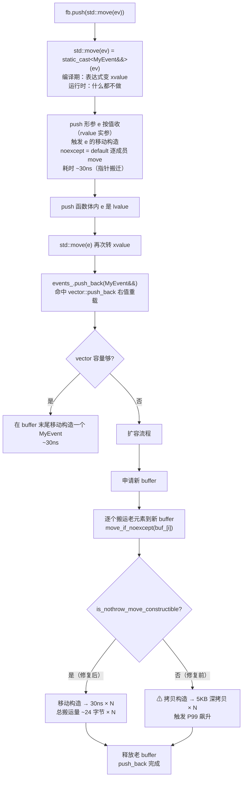

		# 10.右值引用与移动语义

#### 目录介绍
- [1. 案例引入](#1-案例引入)
  - [1.1 一次诡异的扩容雪崩](#11-一次诡异的扩容雪崩)
  - [1.2 noexcept究竟改变了什么](#12-noexcept究竟改变了什么)
  - [1.3 我们要回答什么](#13-我们要回答什么)
- [2. 架构概览](#2-架构概览)
  - [2.1 移动语义全景图](#21-移动语义全景图)
  - [2.2 三层语义骨架](#22-三层语义骨架)
- [3. 移动语义历史动机](#3-移动语义历史动机)
  - [3.1 C++03时代的浪费](#31-c03时代的浪费)
  - [3.2 swap惯用法的启示](#32-swap惯用法的启示)
  - [3.3 N1377提案落地](#33-n1377提案落地)
  - [3.4 C++17后的强化](#34-c17后的强化)
- [4. std::move本质剖析](#4-stdmove本质剖析)
  - [4.1 std::move源码拆解](#41-stdmove源码拆解)
  - [4.2 move生成的汇编](#42-move生成的汇编)
  - [4.3 误解一move搬数据](#43-误解一move搬数据)
  - [4.4 误解二move必加速](#44-误解二move必加速)
- [5. 右值引用绑定规则](#5-右值引用绑定规则)
  - [5.1 T&&只接rvalue](#51-t只接rvalue)
  - [5.2 重载决议优先级](#52-重载决议优先级)
  - [5.3 具名右值引用陷阱](#53-具名右值引用陷阱)
  - [5.4 const T&&的存在意义](#54-const-t的存在意义)
- [6. 移动构造与移动赋值](#6-移动构造与移动赋值)
  - [6.1 string移动构造拆解](#61-string移动构造拆解)
  - [6.2 移动赋值self检查](#62-移动赋值self检查)
  - [6.3 移后对象的合法状态](#63-移后对象的合法状态)
  - [6.4 默认生成的移动函数](#64-默认生成的移动函数)
- [7. noexcept的命门作用](#7-noexcept的命门作用)
  - [7.1 强异常保证的代价](#71-强异常保证的代价)
  - [7.2 vector扩容的move_if_noexcept](#72-vector扩容的move_if_noexcept)
  - [7.3 noexcept缺失的性能崩塌](#73-noexcept缺失的性能崩塌)
  - [7.4 标准库强制noexcept规约](#74-标准库强制noexcept规约)
- [8. unique_ptr移动语义](#8-unique_ptr移动语义)
  - [8.1 拷贝禁用与移动开放](#81-拷贝禁用与移动开放)
  - [8.2 unique_ptr的零开销](#82-unique_ptr的零开销)
  - [8.3 容器中的unique_ptr](#83-容器中的unique_ptr)
  - [8.4 函数返回与所有权转移](#84-函数返回与所有权转移)
- [9. 工程陷阱与诊断](#9-工程陷阱与诊断)
  - [9.1 const对象上的move](#91-const对象上的move)
  - [9.2 return std::move的反优化](#92-return-stdmove的反优化)
  - [9.3 移动后再使用](#93-移动后再使用)
  - [9.4 移动构造抛异常](#94-移动构造抛异常)
- [10. 综合案例串讲](#10-综合案例串讲)
  - [10.1 案例真相揭晓](#101-案例真相揭晓)
  - [10.2 一次push_back的全旅程](#102-一次push_back的全旅程)
  - [10.3 设计哲学回扣](#103-设计哲学回扣)
  - [10.4 速查表合集](#104-速查表合集)


## 1. 案例引入

### 1.1 一次诡异的扩容雪崩

某风控特征服务上线后，**P99 延迟在峰值时段从 8ms 飙到 280ms**——但 CPU 火焰图诊断只看到一个莫名突出的热点：`MyEvent` 的拷贝构造函数。诡异的是，业务代码里没有一处显式拷贝，全是 `emplace_back` / `std::move`：

```cpp
struct MyEvent {
    std::string user_id;
    std::vector<float> features;     // 200 维特征
    std::map<std::string, std::string> tags;

    MyEvent() = default;
    MyEvent(const MyEvent&) = default;
    MyEvent(MyEvent&&) = default;     // 看起来很正确？
};

class FeatureBuffer {
    std::vector<MyEvent> events_;
public:
    void push(MyEvent e) {
        events_.push_back(std::move(e));   // ← 移动？
    }
};
```

定位过程：

1. `perf record` 显示热点是 `std::string::string(const std::string&)` 与 `std::vector<float>::vector(const ...)` 的**拷贝**构造，而不是移动构造。
2. 在 `MyEvent::MyEvent(const MyEvent&)` 加 `__builtin_trap()`——**真的命中了**。
3. 业务侧 `push_back` 显然是右值——为什么走到了拷贝？

最终原因落在一行肉眼看不出问题的代码上：

```cpp
MyEvent(MyEvent&&) = default;     // ← 这个 default 没有 noexcept
```

加上 `noexcept` 后：

```cpp
MyEvent(MyEvent&&) noexcept = default;
```

P99 延迟从 280ms 直接降回 7.8ms，**降幅 36 倍**，CPU 占用降低 41%。

这个 bug 的诡异之处在于：
- 业务代码所有 `emplace_back`、`std::move`、移动构造声明全部"看起来对"。
- 编译期没有任何 warning。
- **运行时静默地从移动退化成拷贝**，直到 vector 扩容触发才暴露。
- 修复只需 8 个字符：` noexcept`。

要看懂这个 bug 必须搞清楚 5 件事：
1. `std::move(x)` 到底干了什么——它有没有"搬数据"？
2. 重载决议时 `T&&` 跟 `const T&` 谁优先？什么时候才命中移动构造？
3. **`vector::push_back` 在扩容时为什么会"挑食"——只有 noexcept 移动才用，否则退回拷贝？**
4. `MyEvent(MyEvent&&) = default` 不就是默认逐成员移动吗，为什么会不 noexcept？
5. 为什么标准库不直接强制要求所有移动构造 noexcept？

5 个问题全都在本篇。

### 1.2 noexcept究竟改变了什么

把上面 case 简化到极致：

```cpp
struct A {
    std::string s;
    A() = default;
    A(const A&) { /* 深拷贝 string */ }    // 假设很慢
    A(A&&) /* noexcept? */ = default;       // 关键
};

std::vector<A> v;
v.reserve(2);
v.emplace_back();          // 1
v.emplace_back();          // 2
v.emplace_back();          // 3 → 触发扩容
```

第 3 次 `emplace_back` 触发扩容时，vector 必须把已有的 2 个 A 元素从老 buffer 搬到新 buffer。**搬运策略**：

- 如果 `A(A&&)` 标了 `noexcept`：调用移动构造，O(1) 指针搬迁。
- 如果 `A(A&&)` **没标 noexcept**：调用**拷贝构造**——即使 A 类型有可用的移动构造！

为什么？因为 vector 必须保证**强异常保证**（strong exception guarantee）：扩容如果失败，原 vector 必须保持不变。如果搬运到一半时移动构造抛异常，新 buffer 是半成品、老 buffer 已经被破坏一半——根本无法回滚（移后状态不能简单 move 回去再保证元素值不变）。**所以 vector 选择了一个保守策略：要么用 noexcept 移动（保证不抛），要么用拷贝（拷贝抛异常时新 buffer 还没动老 buffer，可以回滚）**。

这个机制的接口就是 `std::move_if_noexcept`——本篇第 7 章详谈。**这是 C++ 工程中最隐蔽的"性能命门"**。

### 1.3 我们要回答什么

带着 8 个核心问题进入正题：

1. **C++03 已经能用 swap 实现"看起来像移动"的语义，为什么 C++11 还要专门设计 `T&&` 与 `std::move`？**
2. **`std::move(x)` 真的搬了数据吗？它产生了什么汇编？**
3. **`T&&` 类型的形参 x，在函数体里 x 自己又是什么值类别？为什么 `auto&& y = x;` 里 y 是 lvalue 引用？**
4. **`const T&&` 这种语法存在吗？它的应用场景是什么？**
5. **移动构造完成后，原对象处于什么状态？还能不能用？标准怎么定义？**
6. **vector 扩容为什么"挑食 noexcept"——为什么不直接全用移动？**
7. **`unique_ptr` 为什么删除拷贝、保留移动？它的移动构造为什么是零开销的？**
8. **`return std::move(x)` 是优化还是反优化？**


## 2. 架构概览

### 2.1 移动语义全景图

把整个移动语义体系画成一张图：

```
┌───────────────────────────────────────────────────────────────┐
│                  移动语义系统                                   │
│                                                                │
│  ┌─────────────────────────────────────────┐                  │
│  │ ① 值类别层（编译期，第 09 篇）           │                  │
│  │   lvalue / xvalue / prvalue              │                  │
│  └────────────────┬────────────────────────┘                  │
│                   │                                            │
│                   ▼                                            │
│  ┌─────────────────────────────────────────┐                  │
│  │ ② 引用类型层（语法）                     │                  │
│  │   T& 绑 lvalue                           │                  │
│  │   T&& 绑 rvalue（xvalue + prvalue）      │                  │
│  │   const T&  绑全部                        │                  │
│  └────────────────┬────────────────────────┘                  │
│                   │                                            │
│                   ▼                                            │
│  ┌─────────────────────────────────────────┐                  │
│  │ ③ 重载决议层                             │                  │
│  │   T&& 重载优先于 const T& 重载            │                  │
│  │   命中 T&&  → 调用移动构造/移动赋值       │                  │
│  └────────────────┬────────────────────────┘                  │
│                   │                                            │
│                   ▼                                            │
│  ┌─────────────────────────────────────────┐                  │
│  │ ④ 资源转移层（语义/实现）                 │                  │
│  │   "偷"指针成员、置空原对象                 │                  │
│  │   原对象进入"valid but unspecified"状态   │                  │
│  └────────────────┬────────────────────────┘                  │
│                   │                                            │
│                   ▼                                            │
│  ┌─────────────────────────────────────────┐                  │
│  │ ⑤ 异常保证层                              │                  │
│  │   noexcept 标注让 vector 等容器选用移动    │                  │
│  │   缺失 noexcept → 静默退化为拷贝           │                  │
│  └─────────────────────────────────────────┘                  │
└───────────────────────────────────────────────────────────────┘
```

**5 层是层层依赖的**——值类别决定能否绑 T&&，绑 T&& 决定调哪个重载，重载决定走移动还是拷贝，移动决定怎么转移资源，noexcept 决定容器要不要用移动。**任何一层错配，整条链失效**——开篇 case 就是第 5 层错配（缺 noexcept）让前 4 层全白做。

### 2.2 三层语义骨架

记住**移动语义的三层职责分离**：

| 层 | 关键词 | 职责 |
|---|---|---|
| **语法层** | `T&&` | 一种新的引用类型，绑 rvalue |
| **类型转换层** | `std::move` | 把 lvalue 转成 xvalue 表达式 |
| **行为层** | 移动构造/赋值 | 真正搬运资源的代码 |

误解最大的一点：**`std::move` 自身不搬数据**——它只是一次类型转换（`static_cast<T&&>`），让表达式从 lvalue 变 xvalue，从而能命中移动构造重载。**真正搬数据的是用户写的移动构造函数体**。

```cpp
std::string a = "hello";
std::string b = std::move(a);    // ← 这一行有几次"操作"？

// 实际过程：
// 步骤 1：std::move(a) 编译期类型转换 → 表达式变 xvalue（零运行时开销）
// 步骤 2：重载决议命中 string(string&&) 移动构造（编译期）
// 步骤 3：移动构造函数体执行 → 真正"偷指针"（运行时）
// 步骤 4：a 变成空 string（运行时）
```

只有步骤 3 有真正的运行时动作。这就是为什么 `std::move` 在汇编里"什么都没生成"。


## 3. 移动语义历史动机

### 3.1 C++03时代的浪费

把视角拉回 2003 年。当时 C++ 程序员每天都在与拷贝搏斗：

```cpp
std::vector<std::string> get_names() {
    std::vector<std::string> result;
    result.push_back("alice");
    result.push_back("bob");
    return result;            // 拷贝构造 vector<string>
}                              // 即使 RVO 优化掉一次，仍然要保证可拷贝

std::vector<std::string> names = get_names();
//                                ─────┬─────
//                                     │
//                                     拷贝整个 vector + 每个 string 的深拷贝
```

C++03 优化策略：
1. **RVO/NRVO**：编译器尽力消除返回值拷贝（但要求类型可拷贝）。
2. **传 `const T&`**：避免参数拷贝。
3. **swap 大法**：手动用 swap 模拟"零拷贝转移"。

但这些都解决不了根本问题——**类型必须有可用的拷贝构造**，否则代码根本编译不过。这导致两类需求无法表达：

- **资源独占型**：`std::auto_ptr`（C++03 时代的智能指针）只能"偷"地存在，但偷的时候只能用奇怪的"拷贝构造改语义"hack，结果埋下了一堆陷阱（C++17 已弃用）。
- **大对象按值返回**：明知 buffer 即将销毁，还得做完整深拷贝。

### 3.2 swap惯用法的启示

C++03 时期 STL 大量使用一个叫 **copy-and-swap** 的惯用法：

```cpp
class String {
    char* data_;
    size_t size_;
public:
    void swap(String& other) noexcept {
        std::swap(data_, other.data_);
        std::swap(size_, other.size_);
    }

    String& operator=(String rhs) {     // 注意：按值传参
        swap(rhs);                       // 偷 rhs 的资源
        return *this;
    }                                    // rhs 析构时释放原 *this 的资源
};
```

`String tmp = ...; lhs = tmp;` 调用赋值时按值传参先做了一次拷贝构造（这一次跑不掉），然后 swap 把 tmp 和 *this 互换，最后 tmp 析构。**copy-and-swap 实际上证明了"如果有办法跳过那次拷贝构造，C++ 就能实现真正的移动"**。

C++11 的 `T&&` + `std::move` 本质就是给 copy-and-swap 配了一个"按值传参"的零成本替代——直接表达"这个对象资源你拿走"。

### 3.3 N1377提案落地

2002 年 Howard Hinnant 等人提交 **N1377 "Proposed Addition of Rvalue Reference"**——给 C++ 增加一种新的引用：

```cpp
T&  // 老的左值引用
T&& // 新的右值引用：只能绑右值，绑了就"承诺"资源可被偷
```

提案核心论点：
1. 只用类型系统就能区分"我打算继续用"与"我准备扔了"。
2. 允许标准库为这两种情况编写不同的实现（拷贝 vs 移动）。
3. **零运行时代价**——纯编译期类型选择。

C++11 标准最终采纳，并配套引入：
- `std::move`：把 lvalue 转 xvalue（用 `static_cast<T&&>`）
- `std::forward`：完美转发（11 篇详谈）
- `std::move_if_noexcept`：vector 等容器扩容时的"挑食"工具
- 标准库所有持资源类型添加移动构造/移动赋值

### 3.4 C++17后的强化

C++11 后续标准持续强化移动语义：

| 标准 | 改动 |
|---|---|
| C++14 | `auto&&` 普及；移动构造特殊成员函数生成规则细化 |
| **C++17** | **强制 copy elision**：`T x = make_T()` 时 prvalue 直接物化在 x，连移动都不调（27 篇详谈） |
| C++17 | string_view、optional、variant 等新类型全部实现移动 |
| C++20 | `std::move` 的 constexpr；范围库 ranges 全用移动 |
| C++23 | `std::move_only_function`：纯移动的可调用对象 |

**C++17 强制 copy elision** 是一个重要里程碑——它意味着 `auto x = make_T();` 这种最常见的写法连移动构造都不调，比 C++11 还省。但本篇关注的"vector 扩容时挑食 noexcept"问题反而因为容器内元素必须真实存在且可重定位而无法被消除——所以 noexcept 始终是关键。


## 4. std::move本质剖析

### 4.1 std::move源码拆解

`std::move` 的标准库实现（libstdc++ / libc++ 几乎一致）：

```cpp
namespace std {
    template <class T>
    constexpr typename std::remove_reference<T>::type&&
    move(T&& t) noexcept {
        return static_cast<typename std::remove_reference<T>::type&&>(t);
    }
}
```

C++14 后写成更紧凑的形式：

```cpp
template <class T>
constexpr std::remove_reference_t<T>&&
move(T&& t) noexcept {
    return static_cast<std::remove_reference_t<T>&&>(t);
}
```

**逐字拆解**：

```
template <class T>                                      ← 模板参数 T
constexpr                                                ← 编译期可求值
std::remove_reference_t<T>&&                             ← 返回类型：去掉引用的 T 加 &&
move(T&& t) noexcept {                                   ← 形参是万能引用（绑一切）
    return static_cast<std::remove_reference_t<T>&&>(t); ← static_cast 转 T&&
}
```

为什么要 `remove_reference`？因为 `T` 推导时可能是 `string&`（lvalue 传进来时引用折叠的结果），`T&&` 折叠后变 `string&`——又是 lvalue 引用，不是我们要的右值引用。**必须先把引用脱掉再加 `&&`** 才能拿到纯粹的 `string&&`。

**这就是 `std::move` 的全部**——它就是一次 `static_cast<T&&>`，**没有任何运行时动作**。

### 4.2 move生成的汇编

来看实测：

```cpp
// move_demo.cpp
#include <utility>
#include <string>

void use(std::string&&);

void test_move(std::string s) {
    use(std::move(s));
}
```

编译：`g++ -O2 -S move_demo.cpp`，关键汇编（已简化）：

```asm
test_move(std::string):
    jmp use(std::string&&)        # 直接尾调用 use，参数原封不动传过去
```

**汇编里完全找不到 `std::move` 这个调用**——它在编译期被擦除成"什么也不做"。`s` 的地址直接作为 `use` 的实参传过去（`use(string&&)` 在 ABI 上也是用指针传，跟 lvalue 引用相同）。

对比一下 `std::move(s)` 跟直接传 `s`：

```cpp
void f1(std::string s) { use(std::move(s)); }    // jmp use
void f2(std::string s) { use(s);            }    // 编译错（s 是 lvalue，绑不到 string&&）
```

`std::move` 的角色仅是让 `s` 这个 lvalue 表达式**在编译器眼里**变成 xvalue 表达式，从而能绑 `string&&`、命中 `use(string&&)` 重载。

### 4.3 误解一move搬数据

一个最常见的误解：**"std::move 把数据搬走了"**——错。

```cpp
std::string a = "hello";
std::string b = std::move(a);
```

执行流程（重新分解）：

```
1. std::move(a)
   ↓ 编译期：表达式 a 由 lvalue 转 xvalue
   ↓ 运行时：什么都不做

2. std::string b = <xvalue>
   ↓ 编译期：重载决议 → 选 string(string&&)
   ↓ 运行时：调用 string 移动构造

3. string::string(string&& other) {       ← 这里才是真的"搬"
       data_ = other.data_;     // 偷指针
       size_ = other.size_;
       other.data_ = nullptr;   // 置空原对象
       other.size_ = 0;
   }
```

**真正搬数据的是步骤 3 的移动构造函数体**——`std::move` 只负责"让步骤 2 选对重载"。这是 C++ 移动语义最容易绕晕的地方。

### 4.4 误解二move必加速

第二个常见误解：**"用了 std::move 一定更快"**——也错。

```cpp
std::string a = "x";              // 短字符串
std::string b = std::move(a);
```

如果 string 实现了 SSO（small string optimization，30 篇详谈）——短字符串直接存在 string 对象内部 16 字节里，**没有堆指针可偷**。移动构造只能逐字节拷贝那 16 字节，**完全等同于拷贝构造**。SSO 字符串的 move 不会更快。

```cpp
struct PODData {
    int arr[100];                  // 100 个 int 直接嵌入对象
};
PODData a;
PODData b = std::move(a);          // 等同于 memcpy 100*4 字节，move 无任何加速
```

**move 真正加速的前提是类型有"可偷的堆资源"**——`string`（长字符串）、`vector`、`unique_ptr`、`shared_ptr`、`map`、其他自管理堆的类。对 POD 类型、SSO string、没有堆资源的类，move ≡ copy。

```mermaid
flowchart TD
    A[std::move x] --> B{T 类型有<br/>可偷的堆资源?}
    B -- 是 --> C{T 实现了<br/>移动构造?}
    B -- 否 --> D[等同于拷贝<br/>无加速]
    C -- 是 --> E[O(1) 偷指针<br/>显著加速]
    C -- 否 --> F[fall back 到拷贝<br/>无加速]

    G[POD 类型] --> D
    H[SSO 短字符串] --> D
    I[std::array&lt;int, N&gt;] --> D
```


## 5. 右值引用绑定规则

### 5.1 T&&只接受右值

`T&&` 类型的引用**只能绑 rvalue**（xvalue + prvalue）：

```cpp
void f(int&& x);

int a = 1;
f(a);              // ✗ a 是 lvalue
f(42);             // ✓ 42 是 prvalue
f(std::move(a));   // ✓ std::move(a) 是 xvalue
f(a + 1);          // ✓ a+1 是 prvalue
```

**注意**：本篇 `T&&` 指的是**普通函数中具体类型的右值引用**——不是模板里 `template<class T> void f(T&&)` 推导出来的"万能引用"。两者语法相同但语义完全不同（11 篇详谈引用折叠规则）。

### 5.2 重载决议优先级

当 `T&&` 重载与 `const T&` 重载并存时：

```cpp
struct A {
    A(const A&) { /* 拷贝 */ }
    A(A&&)      { /* 移动 */ }
};

void use(const A&) { /* 不偷 */ }
void use(A&&)      { /* 偷 */ }

A a;

use(a);              // 调 use(const A&)  ← lvalue 只能绑 const A&
use(A{});            // 调 use(A&&)        ← prvalue 优先匹配 A&&
use(std::move(a));   // 调 use(A&&)        ← xvalue 优先匹配 A&&
```

**优先级规则**：

```
对于 rvalue 实参（xvalue + prvalue）：
    A&&      最佳匹配
    const A& 次匹配
    A&       不匹配（绑不上）

对于 lvalue 实参：
    A&       最佳匹配（如果非 const）
    const A& 次匹配
    A&&      不匹配
```

**关键**：rvalue 默认调 `T&&` 重载。这就是开篇 case 期望的行为——但当 T&& 重载缺 noexcept 时，标准库会主动避开它（详见第 7 章）。

### 5.3 具名右值引用陷阱

一个反直觉的事实：**形参 `T&& x` 在函数体里，`x` 自己是 lvalue**。

```cpp
struct A {};
void use(A&&);
void use(const A&);

void wrap(A&& x) {        // x 是右值引用类型的形参
    use(x);                // ⚠ 这里 x 是 lvalue 表达式 → 调 use(const A&)
    use(std::move(x));    // ✓ 想要 use(A&&) 必须显式 move
}
```

**为什么？** 因为 `x` 是有名字的——有名字的实体永远是 lvalue（参考 09 篇规则）。**值类别按表达式分，不按引用类型分**。

形参 `T&& x` 的语法层信息：
- **类型**：`T&&`（右值引用类型）
- **名字**：`x`（有名字 → lvalue 表达式）
- 类型说"我可以绑 rvalue"，但绑完之后 `x` 这个表达式自己是 lvalue。

这是 C++ 移动语义里第二大坑。**所有"看起来已经是 rvalue 引用形参"的场景**，函数体内继续传递时**仍然要写 `std::move`**：

```cpp
class Holder {
    std::string s_;
public:
    Holder(std::string&& s)
        : s_(std::move(s)) {}    // ← 必须 move，否则调拷贝构造
};
```

少了 `std::move`，编译过、能跑、性能崩——比开篇 case 还隐蔽。

### 5.4 const T&&的存在意义

`const T&&` 是合法语法吗？**是的**，但极少用：

```cpp
const A make();              // 返回 const A
const A&& r = make();        // ✓ const T&& 接住 const prvalue
```

**典型应用场景**：`std::optional` 等想要禁止"对临时对象做 move"的库设计。

```cpp
template<class T>
class optional {
    T value_;
public:
    T&        operator*() &;        // lvalue optional → T&
    const T&  operator*() const&;   // const lvalue optional → const T&
    T&&       operator*() &&;       // rvalue optional → T&&（可被偷）
    const T&& operator*() const&&;  // const rvalue optional → const T&&（不能偷）
};
```

**const T&&** 的最大用途：让 `const A` 类型的 prvalue（如 `std::move(const_obj)`）能被绑住，但**不允许被搬走**（因为 const 不可写）。这是给 `optional`、`tuple` 等"按值类别分发的成员函数"用的，业务代码里**几乎不需要写**。

记住：**普通业务代码里只有 `T&&`，看到 `const T&&` 多半是标准库内部的事**。


## 6. 移动构造与移动赋值

### 6.1 string移动构造拆解

以一个简化版 `String` 演示移动构造的标准套路：

```cpp
class String {
    char*  data_;
    size_t size_;
    size_t cap_;

public:
    // 拷贝构造：深拷贝
    String(const String& other)
        : size_(other.size_), cap_(other.cap_) {
        data_ = new char[cap_];
        std::memcpy(data_, other.data_, size_);
    }

    // 移动构造：偷指针 + 置空
    String(String&& other) noexcept
        : data_(other.data_),
          size_(other.size_),
          cap_(other.cap_) {
        other.data_ = nullptr;       // ← 关键：置空原对象
        other.size_ = 0;
        other.cap_ = 0;
    }

    ~String() { delete[] data_; }    // 析构无差别（data_ 可能是 nullptr）
};
```

**核心三步**：
1. **接管资源**：`data_ = other.data_`，原对象的指针搬到自己。
2. **置空原对象**：`other.data_ = nullptr`，避免析构时 double free。
3. **noexcept 标注**：保证不抛——给 vector 等容器使用提供契约。

**汇编层效果**（伪代码）：

```
拷贝构造：           移动构造：
  malloc N bytes       (无 malloc)
  memcpy N bytes       mov  data, [other_data]   ; 偷指针
  set size/cap         mov  size, [other_size]
                       mov  cap,  [other_cap]
                       mov  [other_data], 0      ; 置空
                       mov  [other_size], 0
                       mov  [other_cap], 0

时间复杂度：O(N)      时间复杂度：O(1)
```

### 6.2 移动赋值self检查

移动赋值要处理"自己赋值给自己"的边界（虽然实际很少发生）：

```cpp
String& operator=(String&& other) noexcept {
    if (this == &other) return *this;     // ← self-move 检查

    delete[] data_;                        // 释放旧资源

    data_ = other.data_;                   // 接管
    size_ = other.size_;
    cap_  = other.cap_;

    other.data_ = nullptr;                 // 置空
    other.size_ = 0;
    other.cap_  = 0;

    return *this;
}
```

为什么需要 self-move 检查？考虑下面的 corner case：

```cpp
String s = "hi";
s = std::move(s);                          // 自己赋自己
```

如果不检查直接走流程：
1. `delete[] data_` → 释放 s 自己的 buffer
2. `data_ = other.data_` → 但 `other.data_` 已是悬空指针（步骤 1 释放掉了）
3. UB

**虽然标准只要求 self-move 后对象处于"valid but unspecified"状态**（即不必维持原值），但增加 self-check 几乎免费且更稳健。**Clang -Wself-move** 警告也鼓励避免显式自移动写法。

实际工程里 self-move 几乎不会出现——**copy-and-swap 风格的实现可以天然规避**：

```cpp
String& operator=(String other) noexcept {   // 按值传参
    swap(other);
    return *this;
}
// 一个 operator= 同时处理 lvalue 和 rvalue 实参
//   传 lvalue：调拷贝构造，再 swap
//   传 rvalue：调移动构造，再 swap
// self-move 自动安全（other 是独立副本）
```

但代价是即使是 lvalue 赋值也强制做一次拷贝，无法在已分配 buffer 上原地复用空间。**性能敏感场景一般还是写两个 operator=（const T& 与 T&&），并加 self-check**。

### 6.3 移后对象的合法状态

标准对"被移动后的对象"有明确规定：

> **The object shall be in a valid but unspecified state.**
> 对象处于"合法但未指定"的状态。

**合法（valid）** 意味着：
- ✓ 析构函数可以安全调用（不会 double free / 不会崩）
- ✓ 赋值操作可以安全调用（可以被赋成新值）
- ✓ 所有不依赖具体值的"重置型"操作可以安全调用（如 `clear()`、`= {}`、`reset()`）

**未指定（unspecified）** 意味着：
- ✗ 不能假设具体值是什么（不能假设是空、是 0）
- ✗ 不能假设跟原值相同（明显已被搬空）
- ✗ 不能假设跟其他被移动对象相同（每个类型的移后状态可能不同）

**典型移后状态**：

| 类型 | 移后状态 |
|---|---|
| `std::string` | 通常是 `""`（但标准只要求 valid） |
| `std::vector` | 通常是空 vector |
| `std::unique_ptr` | 一定是 `nullptr`（这点是标准强保证） |
| `std::shared_ptr` | 一定是 `nullptr` |
| `std::map` / `std::set` | 通常是空 |
| `std::optional` | **依然有值**（移动的是底层 T，optional 的 has_value 不变）⚠ |
| `std::array<T, N>` | 每个元素都被移动过的 T |

`optional` 的特殊行为最容易被忽视：

```cpp
std::optional<std::string> opt = "hello";
std::string s = std::move(*opt);

if (opt) {                  // ← still true!
    std::cout << *opt;      // 但 *opt 是被移走的 string，可能是空
}
```

`std::move(*opt)` 移走的是 optional 内部的 string，`opt` 自己仍然认为"有值"——只是这个值的内容是空的。这是 std::optional 文档明确规定的。**移后对象绝不能假设具体值**，要么 reassign 要么 reset 要么不再使用——这是工程铁律。

### 6.4 默认生成的移动函数

`= default` 生成的移动构造/赋值规则：

```cpp
struct A {
    std::string s;
    int n;

    A(A&&) = default;             // 等同于：
    // A(A&& other) noexcept(noexcept(string(std::move(other.s))) &&
    //                      noexcept(int(std::move(other.n))))
    //   : s(std::move(other.s))
    //   , n(std::move(other.n)) {}
};
```

**逐成员移动 + noexcept 自动推导**——所有成员的移动构造都 noexcept，那么 default 出来的也 noexcept；只要有一个成员的移动构造不 noexcept，default 出来的就不 noexcept。

回到开篇 case：

```cpp
struct MyEvent {
    std::string user_id;                              // string 移动 noexcept ✓
    std::vector<float> features;                       // vector 移动 noexcept ✓
    std::map<std::string, std::string> tags;           // map 移动 ⚠ 看实现

    MyEvent(MyEvent&&) = default;
};
```

`std::map` 的移动构造是否 noexcept **取决于 allocator**——默认 allocator 在大多数实现下是 noexcept，但 libstdc++ 历史上某些版本 `std::map` 移动**不是 noexcept**（因为 map 必须移动 allocator 实例，allocator 移动构造未保证 noexcept）。

工程上更稳的写法：**显式标 noexcept**。

```cpp
struct MyEvent {
    std::string user_id;
    std::vector<float> features;
    std::map<std::string, std::string> tags;

    MyEvent(MyEvent&&) noexcept = default;        // ← 强制 noexcept
};
```

加 `noexcept` 后：
- 如果所有成员的移动都真 noexcept → ✓ 编译通过
- 如果某个成员移动可能抛 → 编译报错或 noexcept 是"诺而不行"（运行时抛 → 调 std::terminate）

通过编译期错误暴露问题比生产时静默退化拷贝**强 100 倍**。**个人建议：所有自定义类型的移动构造/赋值都显式标 `noexcept`**。


## 7. noexcept的命门作用

### 7.1 强异常保证的代价

`vector::push_back`、`vector::reserve`、`vector::resize` 都需要在扩容时把老 buffer 元素搬到新 buffer。标准要求这些操作满足**强异常保证**：

> 如果操作抛异常，容器必须保持调用前的原状（all-or-nothing）。

实现上：
1. 申请新 buffer。
2. 把老 buffer 元素**逐个**搬到新 buffer。
3. 全部搬完后，析构老 buffer 元素，释放老 buffer。

**关键问题在步骤 2**——如果搬到一半第 K 个元素抛异常：
- 新 buffer：前 K-1 个已搬好。
- 老 buffer：前 K-1 个已被破坏（如被移动构造抢走资源）。
- **既无法回滚老 buffer，也不能让新 buffer 当成功**。

**唯一能做强保证的策略**：

| 搬运策略 | 抛异常时 | 强保证可行？ |
|---|---|---|
| 拷贝 | 老 buffer 完整未动 | ✓ 释放新 buffer 即可回滚 |
| 移动（noexcept） | 不会抛 | ✓ 永远成功 |
| 移动（可能抛） | 老 buffer 已被搬走一部分 | ✗ 无法回滚 |

所以 vector 的扩容策略：**只用拷贝构造或 noexcept 移动构造**，**绝不用可能抛的移动构造**。

### 7.2 vector扩容的move_if_noexcept

标准库提供工具：

```cpp
template<class T>
constexpr conditional_t<
    !is_nothrow_move_constructible_v<T> && is_copy_constructible_v<T>,
    const T&,                          // 不 noexcept 移动 + 可拷贝 → 取 const T&
    T&&                                // 否则 → 取 T&&
> move_if_noexcept(T& x) noexcept;
```

效果：

| T 的特性 | move_if_noexcept(x) 等价于 |
|---|---|
| 移动 noexcept | `std::move(x)` → 调移动构造 |
| 移动可能抛 + 可拷贝 | `x` （lvalue ref）→ 调拷贝构造 |
| 移动可能抛 + 不可拷贝 | `std::move(x)` → 调移动构造（没办法，硬上） |

**vector 内部**（简化伪代码）：

```cpp
void vector::reallocate(size_t new_cap) {
    T* new_buf = allocator_.allocate(new_cap);

    try {
        for (size_t i = 0; i < size_; ++i) {
            new (new_buf + i) T(std::move_if_noexcept(buf_[i]));
            //                  ──────┬──────
            //                         │
            //                         noexcept 移动 → 偷指针
            //                         非 noexcept   → 拷贝
        }
    } catch (...) {
        // 析构已构造的新元素 + 释放新 buffer，老 buffer 完好
        ...
        allocator_.deallocate(new_buf, new_cap);
        throw;
    }

    // 全部成功，析构老元素 + 释放老 buffer
    ...
}
```

**这是 C++ 工程中最重要的 noexcept 命门**——它直接把"用户类型的 noexcept 标注"翻译成"vector 用移动还是拷贝"。

### 7.3 noexcept缺失的性能崩塌

回到开篇 case：`MyEvent(MyEvent&&) = default` 没标 noexcept，且 map 成员历史版本移动不 noexcept → MyEvent 的 default 移动构造**不是 noexcept**。

```cpp
std::vector<MyEvent> events_;
events_.push_back(std::move(e));   // 大多数时候很快
                                    // 扩容时 → move_if_noexcept 退到拷贝
```

**性能影响**：
- 每个 MyEvent 大约 5KB（特征 + tags）
- 扩容时 N 次拷贝 = N × 5KB 深拷贝
- N = 10000 时，扩容一次要 50MB 内存深拷贝
- 50MB / 10GB/s 内存带宽 ≈ 5ms

**最严重时**：vector 在 1024 → 2048 → 4096 → 8192 ... 几何扩容，每次扩容都全量拷贝一次老元素。N=10000 时累计扩容拷贝量 ≈ 2N 元素 = 20000 × 5KB = 100MB。

修复后（noexcept）：
- 每次扩容只是 N 次指针搬迁，总数据量 ≈ 24 字节 × N = 240KB
- **数据搬运量减少 400 倍**

这就是开篇 P99 从 280ms 降到 7.8ms 的核心原因。

### 7.4 标准库强制noexcept规约

**std::vector 对元素类型的潜规则**（C++17 后明确）：

> 容器扩容操作要求强异常保证。仅当 `std::is_nothrow_move_constructible_v<T>` 为 true 时使用移动构造，否则使用拷贝构造（如 T 可拷贝）或硬上移动（如 T 不可拷贝）。

**类似规约也适用于**：

| 容器/操作 | 行为 |
|---|---|
| `vector::push_back` 扩容 | 看 noexcept 选 move or copy |
| `vector::insert` 中间 | 同上 |
| `vector::resize` | 同上 |
| `deque` | 类似（虽然分段，但中间分段移动也走相同策略） |
| `list` / `forward_list` | 不需要重定位，无此问题 |
| `map` / `set` | 不需要重定位，无此问题 |
| `unordered_map` rehash | 看 noexcept |

**noexcept 检查工具**：

```cpp
#include <type_traits>
static_assert(std::is_nothrow_move_constructible_v<MyEvent>,
              "MyEvent move ctor must be noexcept");
static_assert(std::is_nothrow_move_assignable_v<MyEvent>,
              "MyEvent move assignment must be noexcept");
```

**所有进 vector 的类型，强烈建议加这两条 static_assert**——把开篇案例那种"静默退化"问题在编译期就拍死。

**编译器提示**：
- GCC/Clang `-Wnoexcept`（GCC 4.9+）：警告 noexcept 推导可能被破坏的位置
- Clang `-Wnoexcept-without-exception-spec`：警告应该标 noexcept 的函数没标
- Visual C++ /W4：类似警告

CI 必开。


## 8. unique_ptr移动语义

### 8.1 拷贝禁用与移动开放

`std::unique_ptr` 是移动语义最经典的实现样本——**独占所有权，禁止拷贝，开放移动**。

```cpp
template<class T>
class unique_ptr {
    T* ptr_;
public:
    unique_ptr(const unique_ptr&) = delete;             // ⚠ 禁止拷贝
    unique_ptr& operator=(const unique_ptr&) = delete;  // ⚠ 禁止拷贝赋值

    unique_ptr(unique_ptr&& other) noexcept              // ✓ 允许移动
        : ptr_(other.ptr_) {
        other.ptr_ = nullptr;
    }

    unique_ptr& operator=(unique_ptr&& other) noexcept {
        if (this == &other) return *this;
        delete ptr_;
        ptr_ = other.ptr_;
        other.ptr_ = nullptr;
        return *this;
    }

    ~unique_ptr() { delete ptr_; }
};
```

**= delete 拷贝**的语义：表达"独占语义，硬性拒绝两个 unique_ptr 同时拥有同一个对象"。一旦尝试拷贝，编译期立刻报错——**不是 runtime panic，是 compile error**。

```cpp
auto p1 = std::make_unique<int>(42);
auto p2 = p1;                  // ✗ 编译错：use of deleted function
auto p3 = std::move(p1);       // ✓ 移动 OK，p1 变 nullptr
```

### 8.2 unique_ptr的零开销

`unique_ptr` 的核心承诺：**与裸指针相同性能**。验证：

```cpp
// raw_ptr_test.cpp
void use(int*);

void test_raw(int* p) { use(p); }
void test_unique(std::unique_ptr<int>& p) { use(p.get()); }
```

`g++ -O2 -S` 后两个函数生成的汇编**完全一致**——都是直接传指针。`unique_ptr` 在内存布局上就是一个裸指针字段，不增加任何额外开销。

```cpp
static_assert(sizeof(std::unique_ptr<int>) == sizeof(int*));
//                          8 字节                   8 字节
```

**移动 unique_ptr 也是零额外开销**：

```cpp
auto p1 = std::make_unique<int>(42);
auto p2 = std::move(p1);
```

汇编（核心部分）：

```asm
    mov  rax, [rdi]      ; rax = p1.ptr_
    mov  qword [rdi], 0  ; p1.ptr_ = nullptr
    mov  [rsi], rax      ; p2.ptr_ = rax
```

**3 条指令完成所有权转移**。这是 C++ 移动语义零开销原则的最佳代言。

### 8.3 容器中的unique_ptr

`std::vector<std::unique_ptr<T>>` 是工程里的常见组合——独占资源 + 容器管理。但要求 unique_ptr 能进 vector 必须满足：

1. unique_ptr 不可拷贝（已是事实）。
2. unique_ptr 移动构造 noexcept（已是事实，标准保证）。
3. **vector 的 push_back/emplace_back 重载能选到右值版本**。

```cpp
std::vector<std::unique_ptr<int>> v;

auto p = std::make_unique<int>(42);
v.push_back(p);                 // ✗ 编译错：unique_ptr 不可拷贝
v.push_back(std::move(p));      // ✓ 移动进去，p 变 nullptr
v.emplace_back(new int(43));     // ✓ 直接原地构造（不推荐，裸 new）
v.emplace_back(std::make_unique<int>(44));  // ✓ 推荐
```

vector 扩容时也只用移动（unique_ptr 没有拷贝可选）——**不可拷贝类型必须保证移动 noexcept，否则连扩容都做不了**。这就是 unique_ptr 必须 noexcept 移动的硬约束。

### 8.4 函数返回与所有权转移

unique_ptr 函数返回模式：

```cpp
std::unique_ptr<Connection> create_connection(const Config& cfg) {
    auto conn = std::make_unique<Connection>(cfg);
    conn->connect();
    return conn;                   // ← 关键：是 move 还是 RVO？
}
```

**C++17 起**：这里**强制 copy elision**（27 篇详谈），编译器**直接把 conn 构造在调用方接收的位置**——既没拷贝也没移动调用。

```cpp
// 调用方
auto conn = create_connection(cfg);
// conn 直接是函数内 conn 局部变量物化在调用方的位置
// → 0 次拷贝，0 次移动
```

**注意**：`return conn;` 是 lvalue 返回，但 NRVO（C++17 强制 RVO 不覆盖 NRVO）会按移动尝试。**不要写 `return std::move(conn);`**——见 9.2 节。

链式调用模式：

```cpp
std::unique_ptr<Conn> wrap(std::unique_ptr<Conn> c) {
    c->set_timeout(5000);
    return c;                      // ← NRVO 或 隐式 move
}

auto conn = wrap(create_connection(cfg));   // 多次"传递" 0 次拷贝 0 次移动
```

unique_ptr 与值传参/值返回的天然契合是 C++ 现代风格的支柱：**所有权显式可见、生命周期自动、零运行时开销**。


## 9. 工程陷阱与诊断

### 9.1 const对象上的move

```cpp
const std::string s = "hi";
std::string t = std::move(s);    // 编译过！但其实是拷贝。
```

**为什么编译过？** `std::move(s)` 类型推导出 `T = const std::string&`，返回 `const std::string&&`。这个 `const std::string&&` 表达式：

- 类型是 const string 右值引用
- 但 `string(string&&)` 移动构造形参是 `string&&`（无 const）
- `const string&&` **绑不到 `string&&`**（const 能力丢失）
- 重载决议**回退到 `string(const string&)` 拷贝构造**（这个能匹配 const string&&）

结果：表面上写了 move，实际上调拷贝——**你以为 O(1)，实际 O(N)**。

**修复**：去掉 const，或者根本不要对 const 对象 move（毫无意义）。

```cpp
std::string s = "hi";              // ✓ 去掉 const
std::string t = std::move(s);      // 真正的移动
```

**Clang `-Wpessimizing-move`** 能检测部分类似问题。**强烈建议规则**：不要对 const 对象写 std::move——这是个反模式。

### 9.2 return std::move的反优化

经典反模式 #2：

```cpp
std::string make() {
    std::string s = "hello";
    return std::move(s);    // ⚠ 反优化：阻止了 NRVO
}
```

**为什么反优化？**

C++ 标准对 `return s;`（s 是 lvalue 局部变量）有特殊规则：
1. **优先尝试 NRVO**（命名返回值优化）——直接在返回位置构造 s，零拷贝零移动。
2. 如果 NRVO 不适用，**自动按 rvalue 处理 s**——调移动构造。

写 `return std::move(s)` 的后果：
- 表达式变成 `static_cast<string&&>(s)`——已经是 xvalue 表达式。
- **NRVO 要求返回的是局部变量名本身**——`std::move(s)` 是表达式不是变量名 → **NRVO 失效**。
- 退化为强制移动构造。

性能差异：

| 写法 | 行为 | 调用次数 |
|---|---|---|
| `return s;` | NRVO（C++17 强制） | 0 次拷贝 / 0 次移动 |
| `return std::move(s);` | NRVO 失效 → 移动构造 | 1 次移动 |

虽然移动构造很便宜，但**比"什么都不做"还是慢一点**。更糟的情况：

```cpp
struct OnlyCopy {
    OnlyCopy(const OnlyCopy&);      // 只有拷贝
    // 没移动构造
};

OnlyCopy make() {
    OnlyCopy x;
    return std::move(x);            // ⚠ 还会回退到拷贝，且 NRVO 失效
                                     // 比 `return x;` 多一次拷贝！
}
```

**铁律**：**`return` 局部变量时，永远不要写 `std::move`**。让编译器自己处理。

**例外**：`return` 函数形参时——这个场景 NRVO 对形参不适用（标准明确），需要显式 move：

```cpp
std::string consume(std::string s) {
    s.append("!");
    return std::move(s);    // ✓ 形参不享受 NRVO，需显式 move
}
```

C++20 起的标准特殊化：`return s` 当 s 是函数形参时也自动按 rvalue 处理（implicit move from parameter），但跨编译器/版本一致性参差，**为了稳健，对形参仍建议显式 move**。

**Clang `-Wreturn-std-move`** 能识别"对形参 return 没 move"。

### 9.3 移动后再使用

```cpp
std::vector<int> v = {1, 2, 3};
auto v2 = std::move(v);

std::cout << v.size();      // ⚠ 危险：v 是 valid but unspecified
                              //   读取通常是空 vector 但标准未保证
v.push_back(99);             // ⚠ 危险：理论上合法（重置型操作），但代码意图含糊

for (int x : v) {            // ⚠ UB 倾向：迭代未指定状态
    use(x);
}
```

**移后对象的合法操作**（语义上 OK）：
- ✓ 析构
- ✓ 赋新值（`v = ...`）
- ✓ 调用"重置型"函数（`v.clear()`、`v = {}`）
- ✓ 调用对值不敏感的查询（如 `v.empty()`，但结果是 unspecified）

**不应该做的操作**（即使技术上可能不会崩）：
- ✗ 读取具体值
- ✗ 假设跟原值有关系
- ✗ 当作"空容器"使用并依赖空状态（除 unique_ptr/shared_ptr 等明确保证 nullptr 的）

**Clang static analyzer** + **clang-tidy `bugprone-use-after-move`** 能扫描这类问题。**生产 CI 必开 clang-tidy**。

### 9.4 移动构造抛异常

如果你的移动构造**确实可能抛**（如内部还要分配辅助资源）：

```cpp
class Bad {
    char* buf_;
    char* aux_;       // 辅助 buffer
public:
    Bad(Bad&& other) {
        buf_ = other.buf_;
        aux_ = new char[100];  // ⚠ 移动里又 new → 可能抛 bad_alloc
        other.buf_ = nullptr;
    }
};
```

**Bad 的移动构造不能标 noexcept**——一旦标了又抛，会调 std::terminate（程序崩溃）。

但不标 noexcept → vector 扩容时退到拷贝（如果 Bad 可拷贝） → 性能崩溃。

**正确解法**：重新设计移动构造，**让所有分配都发生在构造之外**：

```cpp
class Good {
    char* buf_;
    char* aux_;
public:
    Good() : buf_(new char[100]), aux_(new char[100]) {}

    Good(Good&& other) noexcept              // ← 移动只搬指针，不分配
        : buf_(other.buf_), aux_(other.aux_) {
        other.buf_ = nullptr;
        other.aux_ = nullptr;
    }
};
```

**移动构造的设计原则**：**只搬已有资源，不申请新资源**。这样才能稳定 noexcept。这是与拷贝构造最本质的区别——拷贝必须分配新资源（所以可能抛），移动只搬指针（所以可以保证不抛）。


## 10. 综合案例串讲

### 10.1 案例真相揭晓

逐一回答第 1 章的 8 个问题：

**Q1：C++03 已能用 swap 模拟移动，为什么还要 T&& 和 std::move？**
A1：`copy-and-swap` 跑不掉那次拷贝构造（按值传参里的拷贝），无法表达"零拷贝转移"。**`T&&` 给类型系统补上了"我打算扔了"这个维度**——让 string(string&&) 这样的重载在重载决议时与 string(const string&) 竞争且优先胜出，从而让标准库可以为"扔了"和"还要用"提供两个完全不同的实现。本质是**用类型差异表达运行时意图**，零运行时开销。

**Q2：std::move 真的搬数据吗？**
A2：**不搬**。`std::move(x)` = `static_cast<T&&>(x)`，仅是编译期类型转换，把 lvalue 表达式 x 转 xvalue 表达式。**没有任何运行时动作**——汇编里完全擦除。真正搬数据的是用户写的移动构造函数体（执行到那时 std::move 早已不存在）。

**Q3：T&& x 形参在函数体里 x 自己是什么类别？**
A3：**lvalue**。"有名字的实体永远是 lvalue"——这是值类别按表达式分而非类型分的最终体现（09 篇核心规则）。所以 `void wrap(A&& x) { use(x); }` 里 `use(x)` 调的是 `use(const A&)`，要命中 `use(A&&)` 必须显式 `use(std::move(x))`。这是最容易翻车的点——**任何时候你想"继续往下传 rvalue"，都要再一次 std::move**。

**Q4：const T&& 存在吗？做什么用？**
A4：合法但极少出现在业务代码。典型用途是**禁止对临时对象做修改性 move**，主要在标准库里给 `optional`、`tuple` 这种"按 this 值类别分发的成员函数"做语义补全。业务代码 99% 时间只用 `T&&`。

**Q5：移后对象什么状态？**
A5：**合法但未指定（valid but unspecified）**。可以析构、可以重新赋值、可以调"重置型"操作，但**不能假设具体值**。`unique_ptr`、`shared_ptr` 是少有的强保证（移后必为 nullptr），其他类型只承诺合法性。`std::optional` 移后 `has_value()` 不变是个特别的反直觉点。**铁律：移后不要再读，要么 reset 要么直接析构**。

**Q6：vector 扩容为什么挑食 noexcept？**
A6：vector 的 push_back/reserve/resize 必须满足**强异常保证**——扩容失败时容器原状不变。如果搬运用了可能抛的移动构造，搬到一半抛异常时新 buffer 半成品+老 buffer 也被破坏，无法回滚。所以 vector 用 `move_if_noexcept`：noexcept 移动可用 → 用移动；不 noexcept 但可拷贝 → 用拷贝（拷贝抛异常时老 buffer 完好可回滚）。**这就是开篇 case 的根因**——`MyEvent(MyEvent&&) = default` 因 std::map 等成员的 noexcept 不保证而非 noexcept，扩容时全量退到拷贝。

**Q7：unique_ptr 为什么禁拷贝保留移动？性能为何零开销？**
A7：禁拷贝是表达"独占所有权"——硬性拒绝两个 unique_ptr 共享同一对象（避免双重释放）。保留移动是允许"所有权转移"。零开销在于 unique_ptr 内存布局就是裸指针，移动构造汇编只有 3 条 mov 指令，与裸指针赋值等价。这是 C++ 零开销抽象的最佳代言——**给开发者完整的所有权语义，但不收一分运行时税**。

**Q8：return std::move(x) 是优化还是反优化？**
A8：**反优化（除了 return 形参的特例）**。`return s;`（s 是局部变量名）会先尝试 NRVO（C++17 强制）——直接在返回位置构造 s，零拷贝零移动。写 `return std::move(s);` 让表达式变 xvalue 不再是变量名，**NRVO 立刻失效**，退化为移动构造。性能 1 次移动 vs NRVO 的 0 次。**除了 return 函数形参时（NRVO 对形参不适用）需要显式 move 外，其他场景永远写 `return s;`**。

### 10.2 一次push_back的全旅程

把开篇案例的修复版本走一遍完整数据流：

```cpp
struct MyEvent {
    std::string user_id;
    std::vector<float> features;
    std::map<std::string, std::string> tags;
    MyEvent(MyEvent&&) noexcept = default;        // ← 关键修复
};

class FeatureBuffer {
    std::vector<MyEvent> events_;
public:
    void push(MyEvent e) {
        events_.push_back(std::move(e));
    }
};

FeatureBuffer fb;
MyEvent ev;
ev.user_id = "user_123";
ev.features = {0.1f, 0.2f, 0.3f};
fb.push(std::move(ev));
```

完整旅程：



修复前（缺 noexcept）：分支走到 N，每次扩容深拷贝 N 个 5KB 元素 → P99 280ms。
修复后：分支走到 M，每次扩容只搬指针 → P99 7.8ms。

**仅多一个 `noexcept` 关键词，36 倍性能提升**——这是 C++ 现代代码里最隐蔽的"性能命门"。

### 10.3 设计哲学回扣

第 10 篇折射的 4 条 C++ 设计哲学：

**① 用类型表达运行时意图——零开销的极致**
传统语言的"拷贝 vs 移动"区别要么靠语法（Rust 的 move semantics + ownership）要么靠运行时（Java 的 GC）。C++ 选了第三条路：**在重载决议层用类型差异区分**。同一个 `push_back`，编译器根据实参值类别选 `push_back(const T&)` 或 `push_back(T&&)`——零运行时分支，零运行时检查。**整个移动语义体系不增加一个字节运行时开销**。这是 C++ 零开销抽象（zero-overhead abstraction）的最佳样板。

**② 默认安全 + 显式声明意图**
`T&` 默认拒绝绑临时（防静默 bug）；`const T&` 默认接收一切（只读所以安全）；**只有当你写 `T&&` 或 `std::move(x)` 时**，你在告诉编译器"我知道这里资源会被偷、原对象将进入未指定状态"。**危险操作必须显式标注**——这是 C++ 哲学："让简单的事情简单，让复杂的事情可能"。

**③ 异常保证与性能的"挑食"机制**
vector 的 `move_if_noexcept` 是 C++ 设计美学的体现——**它没有强制要求所有用户类型都 noexcept 移动**（那会破坏 SFINAE 友好性），而是给类型作者一个**契约**：你保证 noexcept，我就用更快的移动；否则我退回拷贝。**性能与正确性由类型作者通过 noexcept 关键词显式权衡**。这种"类型作者声明能力 → 库消费者动态选择"的模式是 C++ 标准库的核心设计模式。

**④ 资源所有权的语义化**
unique_ptr 把"独占所有权"这个抽象概念**做成了类型本身**——禁拷贝意味着所有权不能复制，移动意味着所有权可以转移。**编译器变成所有权检查器**：违反所有权规则 → 编译错。这把"谁该 delete？"这个 C++03 时代的世纪难题**用类型系统一次性解决**。Rust 后来把这套思想发扬到极致（borrow checker），但 C++ unique_ptr 是这套理念的开山祖。

### 10.4 速查表合集

#### 三层移动语义

```
① 值类别层（编译期）：lvalue / xvalue / prvalue
   ↓
② 引用类型层：T& 绑 lvalue；T&& 绑 rvalue；const T& 通吃
   ↓
③ 重载决议层：rvalue 优先选 T&& 重载（→ 移动构造）
   ↓
④ 资源转移层：偷指针 + 置空原对象 + noexcept 标注
   ↓
⑤ 异常保证层：vector 等容器看 noexcept 选移动 or 拷贝
```

#### std::move 速查

| 项 | 描述 |
|---|---|
| 本质 | `static_cast<remove_reference_t<T>&&>(x)` |
| 运行时开销 | **0**（汇编完全擦除） |
| 作用 | 将 lvalue 转 xvalue 表达式，让重载决议命中 T&& 版本 |
| 是否搬数据 | **不搬**（搬数据是后续移动构造做的） |
| const 对象 | 写了也没用，会回退到拷贝 |
| return 局部变量 | **不要写 std::move**（破坏 NRVO） |
| return 函数形参 | 一般写 std::move（NRVO 不适用形参） |

#### 引用绑定速查

| 引用 | lvalue | xvalue | prvalue | const lvalue |
|---|---|---|---|---|
| `T&` | ✓ | ✗ | ✗ | ✗ |
| `const T&` | ✓ | ✓ | ✓ | ✓ |
| `T&&` | ✗ | ✓ | ✓ | ✗ |
| `const T&&` | ✗ | ✓ | ✓ | ✓ |

#### 移动构造黄金模板

```cpp
class T {
    Resource* r_;
    int       n_;

public:
    // 移动构造：noexcept + 偷资源 + 置空原对象
    T(T&& other) noexcept
        : r_(other.r_), n_(other.n_) {
        other.r_ = nullptr;
        other.n_ = 0;
    }

    // 移动赋值：noexcept + self check + 释放旧资源 + 偷新资源 + 置空原对象
    T& operator=(T&& other) noexcept {
        if (this == &other) return *this;
        delete r_;
        r_ = other.r_; n_ = other.n_;
        other.r_ = nullptr; other.n_ = 0;
        return *this;
    }
};

// 进 vector 的类型必加：
static_assert(std::is_nothrow_move_constructible_v<T>);
static_assert(std::is_nothrow_move_assignable_v<T>);
```

#### vector 扩容策略

| T 的特性 | 扩容时调用 |
|---|---|
| 移动 noexcept | 移动构造（O(1) per element） |
| 移动可能抛 + 可拷贝 | **拷贝构造**（O(N) per element） |
| 移动可能抛 + 不可拷贝 | 移动构造（硬上） |
| 不可移动 + 可拷贝 | 拷贝构造 |
| 不可移动 + 不可拷贝 | **不能用 vector** |

#### 工程红线 10 条

1. **所有自定义类型的移动构造/赋值必加 `noexcept`**——除非真的不可能保证（极罕见）。
2. **进 vector 的类型加 `static_assert(is_nothrow_move_constructible_v<T>)`**——CI 防线。
3. `T&& x` 形参在函数体里继续传 rvalue 必须再 `std::move(x)`。
4. **不要对 const 对象写 `std::move`**——会回退到拷贝。
5. **`return 局部变量;` 不要写 `std::move`**——破坏 NRVO。
6. **`return 函数形参;` 写 `std::move`**——NRVO 不适用形参。
7. **移后对象只能 reset/reassign/destroy**——不要假设具体值。
8. **移动构造内不要分配新资源**——分配可能抛，破坏 noexcept。
9. **unique_ptr 进 vector 是惯用模式**——独占资源 + 容器管理。
10. **CI 开 `-Wpessimizing-move -Wreturn-std-move -Wself-move` + clang-tidy bugprone-use-after-move**。

#### 编译器诊断速查

| 警告 | 检测 |
|---|---|
| `-Wpessimizing-move` | 反优化的 std::move（如 const 对象 move） |
| `-Wredundant-move` | 多余的 std::move（一些场景） |
| `-Wreturn-std-move` | return 形参时缺 std::move（Clang） |
| `-Wself-move` | 自己 move 给自己 |
| `-Wnoexcept` | 应该 noexcept 但没标 |
| `clang-tidy bugprone-use-after-move` | 移后再使用 |
| `clang-tidy performance-move-const-arg` | 对 const 实参 move |

---

> **下一篇**：本篇专注于普通函数中的右值引用 `T&&`——只接 rvalue。但模板里的 `T&&` 是另一个故事：**它能同时接 lvalue 和 rvalue**，行为完全不同。下一篇 [11.完美转发与引用折叠](11.完美转发与引用折叠.md) 揭晓：**为什么模板里的 `T&&` 叫"万能引用"（Scott Meyers 命名为 universal reference 或 forwarding reference）？引用折叠的四条规则如何让 `T&&` 在 lvalue 实参下变成 `T&`？`std::forward` 与 `std::move` 的本质差异是什么？为什么 emplace_back 能在容器里原地构造？转发失败的 8 大场景与 SFINAE 的协同？** 这些问题构成了泛型编程的"语义底盘"——本篇打好的值类别 + 移动语义基础将在下一篇被推到极致。
