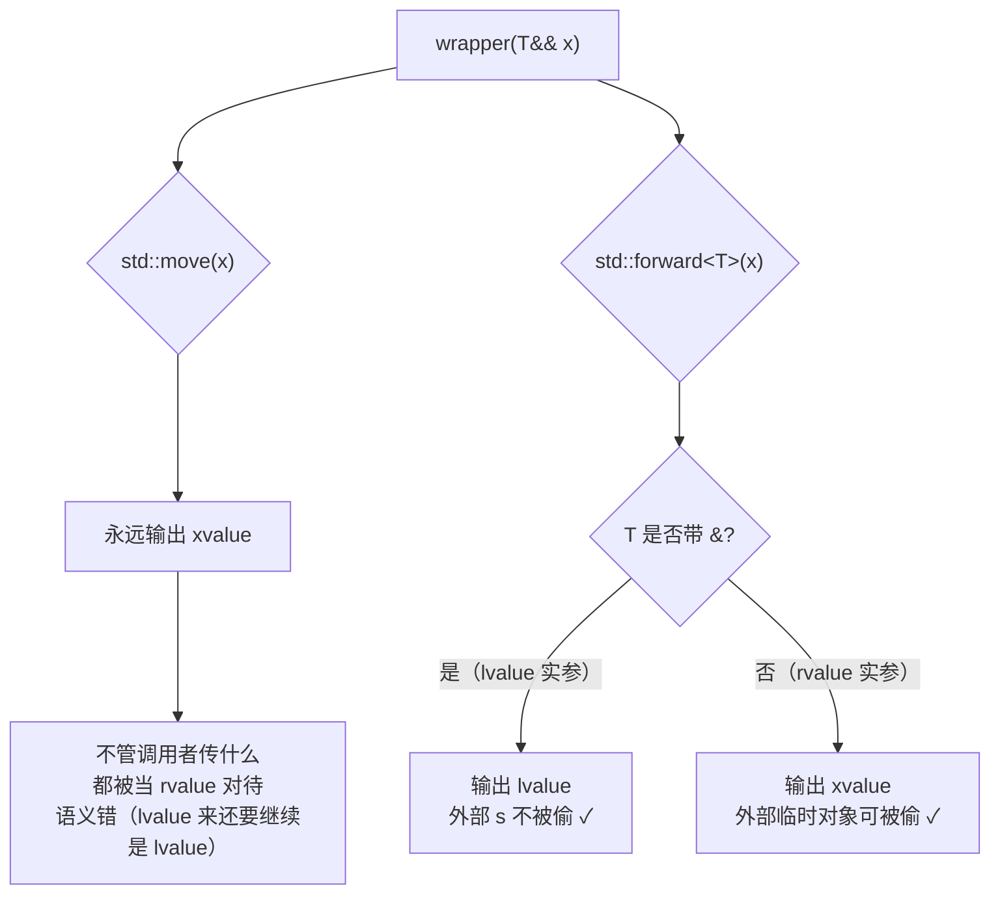
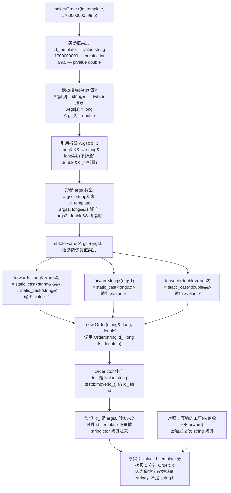

		# 11.完美转发与引用折叠

#### 目录介绍
- [1. 案例引入](#1-案例引入)
  - [1.1 emplace_back的双面性](#11-emplace_back的双面性)
  - [1.2 一个看起来对的工厂](#12-一个看起来对的工厂)
  - [1.3 我们要回答什么](#13-我们要回答什么)
- [2. 架构概览](#2-架构概览)
  - [2.1 完美转发全景图](#21-完美转发全景图)
  - [2.2 转发的三层语义](#22-转发的三层语义)
- [3. 万能引用的诞生](#3-万能引用的诞生)
  - [3.1 同一语法两种语义](#31-同一语法两种语义)
  - [3.2 转发问题的提出](#32-转发问题的提出)
  - [3.3 N1385与设计抉择](#33-n1385与设计抉择)
  - [3.4 命名之争的背后](#34-命名之争的背后)
- [4. 引用折叠四规则](#4-引用折叠四规则)
  - [4.1 四条折叠规则](#41-四条折叠规则)
  - [4.2 模板推导走位](#42-模板推导走位)
  - [4.3 auto的折叠对照](#43-auto的折叠对照)
  - [4.4 typedef下的折叠](#44-typedef下的折叠)
- [5. forward本质剖析](#5-forward本质剖析)
  - [5.1 forward源码拆解](#51-forward源码拆解)
  - [5.2 与move的本质差异](#52-与move的本质差异)
  - [5.3 显式模板参数的必要](#53-显式模板参数的必要)
  - [5.4 forward生成的汇编](#54-forward生成的汇编)
- [6. 完美转发链路](#6-完美转发链路)
  - [6.1 emplace_back的转发](#61-emplace_back的转发)
  - [6.2 make_unique实现](#62-make_unique实现)
  - [6.3 多层包装的转发](#63-多层包装的转发)
  - [6.4 可变参数包转发](#64-可变参数包转发)
- [7. 转发失败八大场景](#7-转发失败八大场景)
  - [7.1 大括号初始化列表](#71-大括号初始化列表)
  - [7.2 0或NULL作空指针](#72-0或null作空指针)
  - [7.3 仅声明的static常量](#73-仅声明的static常量)
  - [7.4 重载函数与函数模板](#74-重载函数与函数模板)
  - [7.5 位域作转发实参](#75-位域作转发实参)
  - [7.6 模板参数的别名歧义](#76-模板参数的别名歧义)
  - [7.7 const成员函数链路](#77-const成员函数链路)
  - [7.8 隐式转换的丢失](#78-隐式转换的丢失)
- [8. SFINAE与转发协同](#8-sfinae与转发协同)
  - [8.1 万能引用劫持构造](#81-万能引用劫持构造)
  - [8.2 enable_if保护转发构造](#82-enable_if保护转发构造)
  - [8.3 C++20 requires替代](#83-c20-requires替代)
  - [8.4 隐藏拷贝退化案例](#84-隐藏拷贝退化案例)
- [9. 工程陷阱与诊断](#9-工程陷阱与诊断)
  - [9.1 forward写错类型参数](#91-forward写错类型参数)
  - [9.2 转发后再次具名化](#92-转发后再次具名化)
  - [9.3 auto&&的范围for陷阱](#93-auto的范围for陷阱)
  - [9.4 lambda的perfect capture](#94-lambda的perfect-capture)
- [10. 综合案例串讲](#10-综合案例串讲)
  - [10.1 案例真相揭晓](#101-案例真相揭晓)
  - [10.2 一次emplace的全旅程](#102-一次emplace的全旅程)
  - [10.3 设计哲学回扣](#103-设计哲学回扣)
  - [10.4 速查表合集](#104-速查表合集)


## 1. 案例引入

### 1.1 emplace_back的双面性

某交易服务里维护一个 `Order` 列表：

```cpp
struct Order {
    std::string id;
    int64_t timestamp;
    double price;

    Order(std::string id_, int64_t ts, double p)
        : id(std::move(id_)), timestamp(ts), price(p) {}
};

std::vector<Order> orders;

// 写法 A：明显的临时对象
orders.push_back(Order("ORD-1", 1700000000, 99.5));

// 写法 B：emplace_back 直接传"原料"
orders.emplace_back("ORD-2", 1700000000, 99.5);
```

A 与 B 哪个快？很多人认为 B 一定快，因为它"原地构造"。但用 `__builtin_trap()` + `perf` 实测：

```
push_back(Order(...)):
    1. Order 临时对象在栈上构造
    2. 移动构造到 vector 的 buffer

emplace_back("ORD-2", ts, p):
    1. 完美转发 3 个实参到 Order 构造函数
    2. 直接在 vector 的 buffer 原地构造
```

**B 比 A 少了一次移动构造**——具体到 string 的开销，差距大约在 10ns 量级。

但**真正的问题**藏在另一段代码里：

```cpp
std::string id_template = "ORD-3";
orders.emplace_back(id_template, 1700000000, 99.5);   // ← id_template 是 lvalue
```

`Order` 构造里 `id(std::move(id_))` 看起来"会偷"——但 `id_template` 是 lvalue，`emplace_back` 通过完美转发把它转发为 lvalue 引用 → `Order` 构造的 `id_` 形参绑 lvalue → `id_` 内部是 lvalue → `std::move(id_)` 是对**这个 id_ 局部变量**的 move，不影响外面的 `id_template`。

这一切都对。但下面这个变体就不对了：

### 1.2 一个看起来对的工厂

```cpp
template<class T, class... Args>
std::shared_ptr<T> make(Args... args) {                  // ⚠ 按值收
    return std::shared_ptr<T>(new T(args...));            // ⚠ 不带 forward
}

auto p = make<Order>("ORD-X", 1700000000, 99.5);
```

观察发现：
- "ORD-X" 是 `const char*` → 拷贝构造 `string` 进 `args` 形参（**1 次拷贝**）
- 然后 `args...` 在调用 `T(args...)` 时是**lvalue 表达式**（args 有名字）→ 再触发**1 次拷贝**进 Order 构造的 `id_`
- Order 构造里 `id(std::move(id_))` 把 `id_` 偷给 `id` → 0 次拷贝

合计：**2 次 string 深拷贝**。

把工厂改成完美转发版：

```cpp
template<class T, class... Args>
std::shared_ptr<T> make(Args&&... args) {                // ✓ 万能引用
    return std::shared_ptr<T>(new T(std::forward<Args>(args)...));   // ✓ forward
}

auto p = make<Order>("ORD-X", 1700000000, 99.5);
```

- "ORD-X" 是 const char* prvalue → `Args` 推导为 `const char*`（仅指针）→ 0 次 string 操作
- forward 后 prvalue 仍是 prvalue → 直接构造 `Order::id` 参数（**1 次** const char* → string 构造）
- Order 构造里 `id(std::move(id_))` 偷给 `id` → 0 次拷贝

合计：**1 次 string 构造**（且是必须的，因为最终 `id` 字段必须是 string）。

这个工厂是 `std::make_shared` / `std::make_unique` 的雏形——**完美转发让"工厂模板"在传参链上零损耗**。但它的实现含 4 个魔法部件：

1. **模板形参 `T&&`**——为什么这里同样写法叫"万能引用"？
2. **引用折叠**——把 `Args = string&` 时的 `string& &&` 折叠为 `string&`，让形参能正确接 lvalue。
3. **`std::forward<Args>(args)`**——保留实参原本的值类别（lvalue 还是 rvalue）。
4. **可变参数包 `Args&&...`**——对每个参数独立推导。

少任何一个，转发链就崩了——开篇案例就是缺了 1 和 3。

### 1.3 我们要回答什么

带着 8 个核心问题进入正题：

1. **为什么 `template<class T> void f(T&&)` 这里的 `T&&` 不是右值引用？同样的 `T&&` 写法语义为什么因上下文而异？**
2. **引用折叠的四条规则到底怎么折？为什么 `T = int&` 时 `T&&` 是 `int&` 而不是 `int& &&`？**
3. **`std::forward<T>(x)` 干了什么？它和 `std::move(x)` 在源码层只差几个字符吗？**
4. **为什么 `std::forward` 必须显式写模板参数 `<T>`？省略会怎样？**
5. **为什么"完美转发"会失败？花括号 `{1, 2, 3}` 转发为什么编译错？**
6. **`Args&&... args` 是怎么"对每个参数独立推导值类别"的？**
7. **完美转发构造函数为什么会"劫持"拷贝构造？**
8. **范围 for 为什么默认用 `auto&&` 而不是 `auto&` 或 `auto`？**

8 个问题全都在本篇。


## 2. 架构概览

### 2.1 完美转发全景图

完美转发体系的全貌：

```
┌─────────────────────────────────────────────────────────────┐
│                  完美转发系统                                 │
│                                                              │
│  ① 模板上下文 + 推导 → 万能引用（forwarding reference）       │
│     template<class T> void f(T&& x);                         │
│     auto&& y = ...;                                          │
│                                                              │
│  ② 引用折叠（reference collapsing）                          │
│     T& &   → T&                                              │
│     T& &&  → T&                                              │
│     T&& &  → T&                                              │
│     T&& && → T&&                                             │
│                                                              │
│  ③ 类型推导（lvalue → T&，rvalue → T）                       │
│     f(lvalue) → T = U&  → T&& = U&                           │
│     f(rvalue) → T = U   → T&& = U&&                          │
│                                                              │
│  ④ std::forward<T>(x) → 按 T 是否带引用恢复值类别            │
│     T = U&   → 输出 lvalue                                   │
│     T = U    → 输出 xvalue                                   │
│                                                              │
│  ⑤ 完美转发链路                                              │
│     用户实参 → f 形参 → forward → 内层调用                   │
│     全程值类别保持，零额外拷贝                                │
└─────────────────────────────────────────────────────────────┘
```

这 5 层是层层嵌套的——上下文决定 ① 是否成立、推导决定 ③ 走哪个分支、折叠 ② 让 ③ 的两个分支都能编译、forward ④ 反向恢复值类别、最终汇成 ⑤ 的完美链路。**少一环不成链**。

### 2.2 转发的三层语义

完美转发的"完美"两字含义分三层：

| 层 | 含义 |
|---|---|
| **类型完美** | 实参类型不变（int 还是 int，string& 还是 string&） |
| **值类别完美** | lvalue 仍是 lvalue，rvalue 仍是 rvalue（不会"丢"或"加" rvalue 性） |
| **cv 限定完美** | const/volatile 不丢失 |

`std::forward<T>(x)` 三件事都做：

```cpp
// 三种典型 case：
template<class T>
void wrapper(T&& x) {
    inner(std::forward<T>(x));
}

int a = 1;
wrapper(a);                    // T 推导为 int&，forward 输出 int&
wrapper(42);                   // T 推导为 int，forward 输出 int&&
wrapper(std::move(a));         // T 推导为 int，forward 输出 int&&

const std::string s = "x";
wrapper(s);                    // T 推导为 const string&，forward 输出 const string&
```

**对比**：`std::move(x)` 永远输出 xvalue（强行扔），`std::forward<T>(x)` 是"按 T 的实际类型恢复"——**lvalue 来 lvalue 走，rvalue 来 rvalue 走**。这是两者的本质差别（5.2 节细讲）。


## 3. 万能引用的诞生

### 3.1 同一语法两种语义

第 10 篇介绍过：`T&&` 在普通函数里只接 rvalue。但在**模板形参 + 类型推导**的上下文里，**同样的写法 `T&&` 能同时接 lvalue 和 rvalue**：

```cpp
// 普通函数：T 是具体类型，T&& 是右值引用
void f(int&& x);
int a = 1;
f(a);                  // ✗ 编译错（lvalue 绑不到右值引用）
f(42);                 // ✓

// 模板函数：T 是待推导，T&& 是"万能引用"
template<class T>
void g(T&& x);
g(a);                  // ✓ 推导为 g<int&>，T&& 折叠成 int&
g(42);                 // ✓ 推导为 g<int>，T&& 是 int&&
```

**两个 `T&&` 写法相同但语义完全不同**：

| 上下文 | 名字 | 可绑 | 作者 |
|---|---|---|---|
| 普通函数形参类型 `T&&`（T 是具体类型） | **右值引用** | 仅 rvalue | 标准术语 |
| 模板/auto 推导上下文 `T&&` 且 T 是被推导参数 | **万能引用 / 转发引用** | lvalue + rvalue | Scott Meyers / 标准用 forwarding reference |

**判断要点**：是不是发生类型推导。

```cpp
template<class T>
class Box {
    void f(T&& x);             // ⚠ T 不是这里推导的（在 Box 实例化时已定）
                                //   所以这里 T&& 是右值引用，不是万能引用
    template<class U>
    void g(U&& x);             // ✓ U 在调用时推导，U&& 是万能引用
};

Box<int> b;
int a = 1;
b.f(a);                        // ✗ T = int 已固定，T&& 是 int&&，绑不上 a
b.g(a);                        // ✓ U 推导为 int&，U&& 折叠为 int&
```

**这是 C++ 中"语法相同语义不同"的最典型场景**——理解清楚要靠"是不是处于推导上下文中"。

### 3.2 转发问题的提出

C++03 时代曾经做过的"传参不丢"尝试：

```cpp
// 想写一个 forwarder（C++03 时代）
template<class T>
void forward1(T x) { inner(x); }    // 按值收 → 多一次拷贝

template<class T>
void forward2(T& x) { inner(x); }   // 只接 lvalue，rvalue 用不了

template<class T>
void forward2c(const T& x) { inner(x); }  // 只能 const 调用，丢失非 const 能力
```

**单参数还能凑合**——写两个重载（`T&` 和 `const T&`）。

**多参数就组合爆炸**：N 个参数要 2^N 个重载。`std::function`、`std::bind` 等组件这样硬撑：

```cpp
// pseudocode of C++03 std::bind
template<class F, class A1>
void bind(F f, A1& a1);
template<class F, class A1>
void bind(F f, const A1& a1);
template<class F, class A1, class A2>
void bind(F f, A1& a1, A2& a2);
template<class F, class A1, class A2>
void bind(F f, A1& a1, const A2& a2);
template<class F, class A1, class A2>
void bind(F f, const A1& a1, A2& a2);
template<class F, class A1, class A2>
void bind(F f, const A1& a1, const A2& a2);
// ... 9 参数版本要写 2^9 = 512 个重载
```

**还是不够**——C++03 没有右值引用，所以无法表达"传 rvalue 进去"的能力。`std::auto_ptr` 这种独占语义到了 bind 里就传不进去了。

**完美转发**就是为了解决这个组合爆炸 + rvalue 表达能力问题。

### 3.3 N1385与设计抉择

C++0x 设计组在 N1385（"A Proposal to Add a Tuple Library to the Standard Library"）和后续提案中提出了完美转发的语法：

```cpp
template<class... Args>
void perfect_forward(Args&&... args) {
    inner(std::forward<Args>(args)...);
}
```

要让这套语法工作，标准引入了三件套：

1. **类型推导规则**：lvalue 实参 → T 推导为 `U&`；rvalue 实参 → T 推导为 `U`。
2. **引用折叠**：让 `U& &&` 折叠为 `U&`（这样 lvalue 路径才能编译）。
3. **`std::forward<T>(x)`**：根据 T 是否带 `&` 决定输出 lvalue 还是 xvalue。

设计上的关键抉择：**为什么不用一个新的语法符号（比如 `T&!`）**？因为重用 `T&&` + 类型推导上下文区分，可以让标准库代码：
- 不需要新关键字。
- 与右值引用的重载决议规则统一。
- 在引用折叠之后退化为右值引用——保持类型系统一致。

**代价**：`T&&` 一种写法两种语义，需要靠"是否推导"区分，给学习曲线加了一道坎。这就是后来 Scott Meyers 在 *Effective Modern C++* Item 24 里专门起名 **universal reference / forwarding reference** 的原因——给一个名字方便讨论。

### 3.4 命名之争的背后

社区对这个新概念的称呼一直在变：

| 名字 | 来源 | 现状 |
|---|---|---|
| **universal reference** | Scott Meyers, 2012 | 业内最通用 |
| **forwarding reference** | C++17 标准正式术语 | 标准官方 |
| 万能引用 | 中文圈通用译名 | 中文社区 |
| forwarder | 一些早期 paper | 几乎不用 |

**C++17 标准最终用 forwarding reference**——因为它强调"用于完美转发"的设计目的，而不是"什么都能绑"的副作用。

但日常交流里 universal reference 更常用——因为它指向"一种引用的类型形态"，比 forwarding reference 描述的"一种用途"更直观。本文两者混用，但优先用"万能引用"。


## 4. 引用折叠四规则

### 4.1 四条折叠规则

C++ 不允许直接写 `int& &` 或 `int& &&`——但模板推导和 typedef 可以**间接产生**这些"引用的引用"。**引用折叠**就是把这些间接产物折叠成一种合法引用：

| 内层 | 外层 | 折叠结果 | 直觉 |
|---|---|---|---|
| `T&` | `&` | `T&` | 两个 lvalue 引用还是 lvalue 引用 |
| `T&` | `&&` | `T&` | lvalue ref 优先吃掉 rvalue ref |
| `T&&` | `&` | `T&` | lvalue ref 优先吃掉 rvalue ref |
| `T&&` | `&&` | `T&&` | 两个 rvalue 引用还是 rvalue 引用 |

**简记**：**只要有一个 `&`，结果就是 `T&`；都是 `&&`，结果才是 `T&&`**。

形式化：

```
&  &  → &
&  && → &
&& &  → &
&& && → &&
```

把 `&` 看作 1，`&&` 看作 2 → 结果取 min 即是。

**为什么这么折？** 这是 C++0x 设计组反复推敲的结果——目的是让万能引用能在 lvalue 实参下退化为 lvalue 引用、在 rvalue 实参下保持 rvalue 引用，从而做到"一个语法吃两类实参"。其他折叠方案（如全部统一为 `&&`）会让万能引用在 lvalue 路径下绑不上变量。

### 4.2 模板推导走位

把"实参类型 → T 推导 → T&& 折叠"全过程跑一遍：

```cpp
template<class T>
void f(T&& x);

int a = 1;
const int c = 2;

f(a);              // ① lvalue
f(c);              // ② const lvalue
f(42);             // ③ prvalue
f(std::move(a));   // ④ xvalue
```

逐一推导：

**① `f(a)`：a 是 int 类型 lvalue**
1. 推导规则：lvalue 实参 → T 推导为 **`int&`**
2. 形参类型：`T&&` = `int& &&`
3. 引用折叠：`int& &&` → **`int&`**
4. 最终：`f<int&>(int& x)`，x 是 lvalue 引用，能绑 a ✓

**② `f(c)`：c 是 const int lvalue**
1. T 推导为 `const int&`
2. 形参 `T&&` = `const int& &&` → 折叠为 `const int&`
3. 最终：`f<const int&>(const int& x)` ✓

**③ `f(42)`：42 是 int prvalue**
1. T 推导为 **`int`**（rvalue 实参时 T 不带引用）
2. 形参 `T&&` = `int&&`（无折叠）
3. 最终：`f<int>(int&& x)`，x 是右值引用，能绑 42 ✓

**④ `f(std::move(a))`：std::move(a) 是 int xvalue**
1. T 推导为 `int`
2. 形参 `T&&` = `int&&`
3. 最终：`f<int>(int&& x)` ✓

总结表：

| 实参 | 实参值类别 | T 推导 | T&& 折叠 |
|---|---|---|---|
| `a`（int 变量） | lvalue | `int&` | `int&` |
| `c`（const int 变量） | const lvalue | `const int&` | `const int&` |
| `42` | prvalue | `int` | `int&&` |
| `std::move(a)` | xvalue | `int` | `int&&` |
| `static_cast<int&&>(a)` | xvalue | `int` | `int&&` |

**铁律**：**lvalue 实参让 T 带 `&`，rvalue 实参让 T 不带 `&`**——这是后续 forward 能恢复值类别的关键钥匙。

### 4.3 auto的折叠对照

`auto&&` 也是万能引用——它享受同样的折叠规则：

```cpp
int a = 1;
const int c = 2;

auto&&  x1 = a;            // T = int&，   auto&& = int&
auto&&  x2 = c;            // T = const int&，auto&& = const int&
auto&&  x3 = 42;           // T = int，    auto&& = int&&
auto&&  x4 = std::move(a); // T = int，    auto&& = int&&
```

**对照**：

| 写法 | 上下文 | 是否万能引用 |
|---|---|---|
| `auto&& x = ...` | 推导 | ✓ |
| `auto& x = ...` | 推导 | ✗（强制 lvalue 引用，rvalue 实参编译错） |
| `auto x = ...` | 推导 | ✗（按值收，触发拷贝/移动） |
| `const auto& x = ...` | 推导 | ✗（const lvalue 引用，能绑一切但只读） |
| `T&& x` 在普通函数 | 不推导 | ✗（右值引用） |
| `T&& x` 在模板（T 推导） | 推导 | ✓ |

**`auto&&` 的核心用途**：

1. **范围 for 不丢值类别**（详见 9.3）：`for (auto&& e : container) { ... }`
2. **存住任意结果而不强迫 copy**：`auto&& result = some_function();`
3. **lambda 模板形参**（C++14 起）：`[](auto&& x) { ... }`

### 4.4 typedef下的折叠

折叠规则的另一个隐藏触发点：**typedef / using**。

```cpp
using IntRef = int&;

IntRef        x = ...;     // int&
IntRef&       y = ...;     // int& &  → 折叠为 int&
IntRef&&      z = ...;     // int& && → 折叠为 int&  ← 不是 int&&！
const IntRef  w = ...;     // const int&
                            //   注意：const 修饰的是 IntRef = int&
                            //   引用本身不能 const，所以等价于 int&
```

**陷阱**：`IntRef&&` **不是右值引用**——typedef 已经把"&"埋进去了，`&&` 折叠为 `&`。

```cpp
using StringR = std::string&;

void f(StringR&& s);            // 等价于 f(string& s)
                                  // 实参必须是 lvalue，不是 rvalue！

std::string a;
f(a);                            // ✓ lvalue 引用
f(std::string{});                // ✗ 编译错（lvalue 引用绑不到 prvalue）
```

这是 typedef + 引用折叠下的"意料之外"——不要把 `using XXX&&` 当成右值引用。**最佳实践**：typedef/using 不要包含引用，引用在使用点显式写。


## 5. forward本质剖析

### 5.1 forward源码拆解

`std::forward` 的标准库实现（libstdc++ / libc++ 几乎一致）：

```cpp
// std::forward 的核心实现（C++14 后简化版）
namespace std {
    template <class T>
    constexpr T&& forward(remove_reference_t<T>& t) noexcept {
        return static_cast<T&&>(t);
    }

    template <class T>
    constexpr T&& forward(remove_reference_t<T>&& t) noexcept {
        static_assert(!is_lvalue_reference_v<T>,
                      "Can not forward an rvalue as an lvalue.");
        return static_cast<T&&>(t);
    }
}
```

**两个重载**：
1. 第一个收 lvalue 引用——典型场景是"forward(具名形参)"。
2. 第二个收 rvalue 引用——`forward(临时对象)` 罕见但合法。

**核心是 `static_cast<T&&>(t)`**——这跟 `std::move` 的 `static_cast<remove_reference_t<T>&&>(t)` 看起来很像，但有关键差异：

| 项 | std::move | std::forward |
|---|---|---|
| cast 目标 | `remove_reference_t<T>&&`（永远 rvalue ref） | `T&&`（保留 T 中的引用语义） |
| T 是否需要显式 | 不需要（自动推导） | **需要**（`forward<T>(x)`） |
| 输出值类别 | 永远 xvalue | 看 T |

**关键洞察**：**`T&&` 经过引用折叠会变成"实参原本的引用类型"**：
- 调用方传 lvalue → T = `U&` → `T&&` = `U& &&` 折叠为 `U&` → forward 输出 lvalue
- 调用方传 rvalue → T = `U` → `T&&` = `U&&` → forward 输出 xvalue

所以 forward 的**全部秘密**就在引用折叠 + 显式模板参数 T。

### 5.2 与move的本质差异

```cpp
template<class T>
void wrapper(T&& x) {
    inner(std::move(x));        // ✗ 错：永远 move，破坏 lvalue 语义
    inner(std::forward<T>(x));  // ✓ 正：lvalue 来 lvalue 走，rvalue 来 rvalue 走
}

std::string s = "hi";
wrapper(s);                      // 用 move：s 被偷空（外部不可见，但语义错）
                                  // 用 forward：T = string&，forward 输出 lvalue → 调 inner(string&)
                                  //              s 不被偷
```

**区别核心**：



**记忆口诀**：
- **`std::move`**：我决定扔了——**强制** rvalue。
- **`std::forward`**：我帮人传话——**保留**原本的值类别。

这就是为什么完美转发要用 forward，而不能用 move。

### 5.3 显式模板参数的必要

`std::forward<T>(x)` 必须显式写 `<T>`——为什么？

```cpp
template<class T>
void wrapper(T&& x) {
    inner(std::forward(x));    // ✗ 编译错或行为错
    inner(std::forward<T>(x)); // ✓
}
```

如果不写 `<T>`，让 forward 自己推导：

- `wrapper(a)`（a 是 lvalue）→ x 是 lvalue → `forward(x)` 推导 T = `string&` → 这一步看似对，但**少了"借助调用方的 T 信息"**。
- 更糟的是：万能引用形参 x 在函数体内**永远是 lvalue 表达式**（具名）→ forward 自动推导永远只看到 lvalue → 永远输出 lvalue → rvalue 路径完全失效。

**唯一能恢复"x 原本是 rvalue"信息的**就是从外层 `T` 拿——`T = string` 时 forward 输出 rvalue。

所以 forward 的"显式模板参数"其实在做一件事：**用编译器在外层推导出来的 T 信息，把已被具名化丢失的 rvalue-性补回来**。

```cpp
template<class T>
void wrapper(T&& x) {
    // 万能引用形参 x 自身永远是 lvalue
    // 但外层 T 还记得"调用方传的是 lvalue 还是 rvalue"
    //   T = U&  →  调用方传 lvalue
    //   T = U   →  调用方传 rvalue
    inner(std::forward<T>(x));
    //          ─┬─
    //           │ 用 T 信息恢复值类别
}
```

**反例**：写错 T 的灾难（详见 9.1）。

### 5.4 forward生成的汇编

实测：

```cpp
// forward_demo.cpp
#include <utility>
void use(int&);
void use(int&&);

template<class T>
void wrapper(T&& x) {
    use(std::forward<T>(x));
}

void caller_lvalue() {
    int a = 1;
    wrapper(a);
}

void caller_rvalue() {
    wrapper(42);
}
```

`g++ -O2 -S` 关键汇编：

```asm
caller_lvalue:
    sub  rsp, 24
    lea  rdi, [rsp + 8]      ; rdi = &a
    mov  dword [rsp + 8], 1
    call use(int&)             ; ← 直接调 lvalue 重载
    add  rsp, 24
    ret

caller_rvalue:
    sub  rsp, 24
    lea  rdi, [rsp + 8]      ; rdi = &临时变量(42)
    mov  dword [rsp + 8], 42
    call use(int&&)            ; ← 直接调 rvalue 重载
    add  rsp, 24
    ret
```

观察：
- `wrapper` 模板被完全内联（`-O2` 下两个实例都内联到 caller）。
- `std::forward` 在汇编层面**完全不存在**——它是一次纯编译期类型转换。
- 不同实参分别命中了 `use(int&)` 和 `use(int&&)` 两个重载——值类别确实被"传过去了"。

**完美转发的"零开销"承诺在汇编层得到完整证实**——它在编译期完成所有类型/值类别推理，运行时不留任何痕迹。


## 6. 完美转发链路

### 6.1 emplace_back的转发

`std::vector<T>::emplace_back` 是完美转发最经典的应用：

```cpp
// 简化版 vector::emplace_back（libstdc++ 风格）
template<class T>
class vector {
public:
    template<class... Args>
    T& emplace_back(Args&&... args) {
        if (size_ == cap_) reallocate(cap_ * 2);
        T* p = new (buf_ + size_) T(std::forward<Args>(args)...);
        //                                ──────────┬──────────
        //                                          │
        //                                          逐参数完美转发
        //                                          原 lvalue 仍 lvalue
        //                                          原 rvalue 仍 rvalue
        ++size_;
        return *p;
    }
};
```

**对比 push_back**：

```cpp
void push_back(const T& v) { /* 拷贝构造 */ }
void push_back(T&& v)      { /* 移动构造 */ }
```

**两者的差异**：

| 操作 | push_back | emplace_back |
|---|---|---|
| 形参 | 已构造好的 T | T 的构造原料（任意） |
| 调用方写法 | `push_back(T(a, b, c))` | `emplace_back(a, b, c)` |
| 拷贝/移动次数 | 1 次（move 进 buffer） | **0 次**（直接原地构造） |
| 类型一致 | T 必须明示 | T 由容器固定 |

**emplace_back 适用场景**：
- 实参是构造原料（多个参数的情况）。
- T 没有便宜的拷贝/移动构造（虽然现在大多数都有）。

**emplace_back 不适用场景**（push_back 反而更优）：
- 实参已经是 T 类型（emplace_back 退化为转发，与 push_back 等价）。
- T 有 explicit 构造（emplace_back 不会触发隐式转换错误检查 → bug 风险）。

### 6.2 make_unique实现

`std::make_unique` 标准实现：

```cpp
namespace std {
    template<class T, class... Args>
    unique_ptr<T> make_unique(Args&&... args) {
        return unique_ptr<T>(new T(std::forward<Args>(args)...));
    }
}
```

仅 4 行代码，但每一行都是完美转发的关键节点：

1. **`class... Args`**：参数包模板。
2. **`Args&&... args`**：每个参数独立的万能引用。
3. **`std::forward<Args>(args)...`**：包展开 + forward。
4. **`new T(...)`**：直接转发到 T 的构造函数。

```cpp
auto p = std::make_unique<std::string>(10, 'x');
// 等价于：
//   Args 推导为 (int, char)
//   new std::string(10, 'x')
//   即 string(10, 'x') → "xxxxxxxxxx"

std::vector<int> data = {1, 2, 3};
auto p = std::make_unique<std::vector<int>>(std::move(data));
// 等价于：
//   Args 推导为 (vector<int>)
//   new vector<int>(std::move(data))
//   触发 vector 的移动构造
```

**make_unique 比 unique_ptr<T>(new T(...)) 多一层好处**：异常安全。如果构造 T 抛异常，make_unique 没有"裸 new 但还没接到 unique_ptr"的窗口期；裸 `unique_ptr<T>(new T(...))` 在某些参数评估顺序下可能泄漏。

### 6.3 多层包装的转发

完美转发可以无损穿越多层中间函数：

```cpp
template<class T, class... Args>
T* alloc_and_construct(Args&&... args) {
    void* mem = ::operator new(sizeof(T));
    return new (mem) T(std::forward<Args>(args)...);
}

template<class T, class... Args>
std::unique_ptr<T> make_via_alloc(Args&&... args) {
    return std::unique_ptr<T>(
        alloc_and_construct<T>(std::forward<Args>(args)...)
    );
}

auto p = make_via_alloc<Order>("ORD", 1700000000, 99.5);
```

链路：

```
make_via_alloc<Order>("ORD", 1700000000, 99.5)
   │ Args = (const char*, long, double)
   │ args = lvalue references to copies of the prvalues
   ▼
alloc_and_construct<Order>(forward<const char*>(arg0),
                            forward<long>(arg1),
                            forward<double>(arg2))
   │ 注意：经过 forward 后又变 prvalue（因为 T 不带 &）
   │ 进 alloc_and_construct 又被绑成 lvalue（万能引用形参）
   ▼
new (mem) Order(forward<const char*>(arg0), ...)
   │ 又一次 forward 恢复 prvalue
   ▼
Order(const char*, long, double) 直接构造
```

**关键**：每一层都做"万能引用 + forward"——少一层就丢一次值类别信息。

### 6.4 可变参数包转发

**包展开 `std::forward<Args>(args)...` 是逐参数独立展开的**——这一步语义最容易绕：

```cpp
template<class... Args>
void f(Args&&... args) {
    g(std::forward<Args>(args)...);
    //   ─────────────────────┬───
    //                        │ 包展开
    //                        逐元素：forward<A1>(a1), forward<A2>(a2), forward<A3>(a3)
}

f(1, std::move(s), c);
// Args = (int, string, const string&)
//   args0: int&&（1 是 prvalue）
//   args1: string&&（move 后 xvalue）
//   args2: const string&（c 是 const lvalue）
// 展开后：
//   g(forward<int>(args0),
//     forward<string>(args1),
//     forward<const string&>(args2))
//   即：g(int&&, string&&, const string&) → 全部值类别完美保留
```

**展开规则**：

```cpp
forward<Args>(args)...
//   ─────┬─────  ──┬──
//        │         │
//        模板参数  形参名
//        都是包    都是包
//        同步展开（lockstep）
```

包展开的"位置"决定语义：

```cpp
// 全部包成一组传给 g：
g(forward<Args>(args)...);
// → g(forward<A1>(a1), forward<A2>(a2), forward<A3>(a3))

// 每个参数单独调用 g：
(g(forward<Args>(args)), ...);   // C++17 折叠表达式
// → (g(forward<A1>(a1)), g(forward<A2>(a2)), g(forward<A3>(a3)))

// 计数：
sizeof...(args)     // → 3
```

包展开 + 完美转发是 C++ 模板元编程最有用的两个特性之一（另一个是 SFINAE / Concepts）。


## 7. 转发失败八大场景

完美转发不是"完美"——有 8 大场景下完美转发**会失败**或**行为偏离预期**。

### 7.1 大括号初始化列表

```cpp
template<class... Args>
auto f(Args&&... args) { /* ... */ }

void target(std::vector<int>);

f({1, 2, 3});   // ⚠ 编译错：模板推导无法推导出 Args
                  //   {1, 2, 3} 没有类型，编译期不知道是 vector？array？initializer_list？
                  //   结果：deduction failed
```

**根因**：花括号初始化列表 `{1, 2, 3}` **没有类型**——它只在传给"已知类型"的形参时才能根据上下文推导（如 `std::vector<int> v = {1,2,3};`）。模板推导的形参是未知的，没法推。

**绕过**：调用方显式构造目标类型：

```cpp
f(std::vector<int>{1, 2, 3});       // ✓
f(std::initializer_list<int>{1, 2, 3});  // ✓
```

或者外层显式指定 Args：

```cpp
f<std::initializer_list<int>>({1, 2, 3});  // ✓
```

**所以**：`emplace_back({1, 2, 3})` 不工作——这是 emplace_back 出乎意料的失败之一。

### 7.2 0或NULL作空指针

```cpp
void target(int*);

template<class T>
void f(T&& x) { target(std::forward<T>(x)); }

f(0);          // ⚠ T 推导为 int → target(int) 找不到 int → int* 转换 → 编译错
f(NULL);       // ⚠ NULL 通常宏 = 0 → 同上
f(nullptr);    // ✓ nullptr 类型是 nullptr_t → 可隐式转换为 int*
```

**根因**：`0` 的类型是 `int`，**不是指针类型**。直接调 `target(int*)` 时编译器有特殊规则把 0 当空指针，但**经过模板推导后 T = int，类型已经"锁死"**，再去调 `target(int*)` 没有 int → int* 的隐式转换。

**铁律**：**永远用 `nullptr`，不用 `0` 或 `NULL`**——这是 Effective Modern C++ Item 8 的核心建议。

### 7.3 仅声明的static常量

```cpp
struct C {
    static const int N = 42;     // 类内声明 + 初始化（C++17 前 static const 才能这样）
};

void target(int);

template<class T>
void f(T&& x) { target(std::forward<T>(x)); }

target(C::N);    // ✓ 直接调用 → C::N 直接整数提升为 int 字面值 42
f(C::N);         // ⚠ 链接错（C++17 前）：万能引用要取 C::N 的地址，但没有定义只有声明
```

**根因**：万能引用 `T&&` 需要绑定到一个对象——**取地址**。但 `static const int N = 42;` 在 C++17 前如果没在外面定义（`const int C::N;`），链接器找不到地址。

**修复**：
- C++17：`inline static const int N = 42;`（inline 保证唯一定义）。
- C++17 前：在 .cpp 里定义 `const int C::N;`。
- 调用前显式转换：`f(static_cast<int>(C::N))` 或 `f(+C::N)`。

### 7.4 重载函数与函数模板

```cpp
void overloaded(int);
void overloaded(double);

template<class T>
void f(T&& x) { /* ... */ }

f(overloaded);    // ⚠ 编译错：哪个 overloaded？
                   //   万能引用要推导 T = void(*)(int)？void(*)(double)？无法决定
```

直接传函数指针时，编译器可以根据目标参数类型选择重载。但模板推导的目标类型是未知的（T 待推导），**无法做重载决议**。

**绕过**：显式选择：

```cpp
f(static_cast<void(*)(int)>(overloaded));     // ✓
```

或者用 lambda 包一层：

```cpp
f([](int x) { overloaded(x); });               // ✓
```

### 7.5 位域作转发实参

```cpp
struct Flags {
    unsigned a : 4;
    unsigned b : 4;
};

void target(unsigned);
template<class T>
void f(T&& x) { target(std::forward<T>(x)); }

Flags fl{};

target(fl.a);     // ✓ 位域可以隐式转 unsigned
f(fl.a);          // ⚠ 编译错：万能引用要绑位域的引用，但 C++ 不允许"位域的引用"
```

**根因**：C++ 标准明确禁止"位域的非 const 引用"——位域不是独立的内存对象，没有可寻址的位置。万能引用形参 `T&& x` 要绑 fl.a → 需要引用 → 编译错。

**绕过**：显式拷贝出来：

```cpp
unsigned tmp = fl.a;
f(tmp);                    // ✓
f(static_cast<unsigned>(fl.a));   // ✓
```

### 7.6 模板参数的别名歧义

```cpp
template<class T>
struct Wrapper {
    using Type = T;
    void f(Type&& x) { /* ... */ }    // ⚠ 不是万能引用！
};

Wrapper<int> w;
int a = 1;
w.f(a);            // ✗ 编译错（Type 已固定为 int → Type&& 是 int&&）
```

**根因**：`Wrapper<int>` 实例化时 T 已固定 → `Type = int` → `Type&&` 是普通右值引用，不是万能引用（**没有发生类型推导**）。

**判断**：万能引用要求**形参类型在该函数的模板列表中被推导**。`f` 这里没有自己的模板参数列表，`Type` 是外层的。

**修复**：把 f 改成自带模板参数：

```cpp
template<class T>
struct Wrapper {
    template<class U>
    void f(U&& x) { /* ... */ }       // ✓ U 自己被推导
};
```

### 7.7 const成员函数链路

```cpp
struct Holder {
    std::string s;

    template<class T>
    void set(T&& v) const {                   // ⚠ const 成员函数
        // s = std::forward<T>(v);              // 编译错：在 const 成员里改 s
    }

    template<class T>
    void set(T&& v) {                          // 非 const 版本
        s = std::forward<T>(v);
    }
};
```

万能引用 + const 成员函数本身没问题，但容易让人忘记成员变量在 const 上下文里**只读**——转发进来"是 rvalue 我能偷"是错觉，因为目标位置 `s` 在 const this 下根本不能写。

**正确做法**：非 const 操作放非 const 成员函数；如果真要在 const 成员函数里"修改"，用 `mutable`（14 篇详谈）。

### 7.8 隐式转换的丢失

```cpp
class Money {
public:
    Money(int yuan);       // 非 explicit
};

void target(Money m);
template<class T>
void f(T&& x) { target(std::forward<T>(x)); }

target(100);    // ✓ int → Money 隐式转换
f(100);          // ⚠ T 推导为 int，最终调 target(int) 找不到匹配
                 //   不会去看 int → Money 的转换链
```

**根因**：模板推导**只看实参类型**，不会触发用户自定义转换。`f(100)` 推导 T = int → forward<int> 输出 int → 调 target 但 int 不是 Money。

**绕过**：调用方显式构造目标类型：

```cpp
f(Money(100));    // ✓
f(Money{100});     // ✓
```

或工厂内部主动转换（牺牲完美转发）：

```cpp
template<class T>
void f(T&& x) { target(Money(std::forward<T>(x))); }   // 强制 Money
```


## 8. SFINAE与转发协同

### 8.1 万能引用劫持构造

完美转发构造函数的经典坑——**它会"劫持"拷贝构造**。

```cpp
class Person {
    std::string name_;
public:
    template<class T>
    explicit Person(T&& name) : name_(std::forward<T>(name)) {}
};

Person p1("Alice");
Person p2(p1);                  // ⚠ 调哪个？
```

预期：`p2(p1)` 调拷贝构造（编译器自动生成的 `Person(const Person&)`）。

实际：**调模板构造！**——因为：

| 候选 | 实参 → 形参 |
|---|---|
| `Person(const Person&)`（编译器生成） | `p1`（lvalue Person）→ `const Person&` 需要 const 转换 |
| `Person<Person&>(Person& name)`（模板实例化） | `p1`（lvalue Person）→ `Person&` 完美匹配，无 const 转换 |

**模板版本更优**——它接 `Person&`，没有 const 转换损失。**编译器选模板，不选拷贝构造**！

然后模板里 `name_(std::forward<T>(name))` → 把 `p1` 当字符串原料构造 string → **编译错**（string 不能从 Person 构造）。

错误信息常常令人困惑——你以为 p2(p1) 是拷贝，编译器报"string 不能从 Person 构造"。**这是新人最痛苦的 C++ 错误之一**。

### 8.2 enable_if保护转发构造

修复方法：**用 SFINAE 把模板从拷贝构造的候选中排除**。

```cpp
#include <type_traits>

class Person {
    std::string name_;
public:
    template<class T,
             class = std::enable_if_t<
                 !std::is_same_v<std::decay_t<T>, Person>     // ← T 不是 Person
             >>
    explicit Person(T&& name) : name_(std::forward<T>(name)) {}

    Person(const Person&) = default;
    Person(Person&&) noexcept = default;
};

Person p1("Alice");
Person p2(p1);                  // ✓ 模板被 enable_if 排除 → 调拷贝构造
Person p3(std::move(p1));       // ✓ 模板被排除 → 调移动构造
Person p4(std::string("Bob"));  // ✓ 模板生效 → 构造 name_
```

**逐字解析**：

```cpp
template<class T,
         class = std::enable_if_t<
             !std::is_same_v<std::decay_t<T>, Person>
         >>
//          ─────────┬─────────  ────┬─────  ──┬──
//                   │              │         │
//                   去引用 + cv 化  比较     排除自己
```

`std::decay_t<T>` 把 `T = Person&` / `T = const Person&` / `T = Person&&` 全部退化为 `Person`——这样 enable_if 才能在所有"T 是 Person 的引用变体"时拒绝模板。

**还要排除继承类**？通常加上 `is_base_of`：

```cpp
class = std::enable_if_t<
    !std::is_base_of_v<Person, std::decay_t<T>>
>
```

这样子类调父类构造时也走拷贝/移动而不是模板。

### 8.3 C++20 requires替代

C++20 起，Concepts 让代码可读性大幅提升：

```cpp
class Person {
    std::string name_;
public:
    template<class T>
        requires (!std::is_same_v<std::decay_t<T>, Person>)
    explicit Person(T&& name) : name_(std::forward<T>(name)) {}

    Person(const Person&) = default;
    Person(Person&&) noexcept = default;
};
```

或者更进一步用 concept：

```cpp
template<class T>
concept NotPerson = !std::is_same_v<std::decay_t<T>, Person>;

class Person {
public:
    template<NotPerson T>
    explicit Person(T&& name) : name_(std::forward<T>(name)) {}
    // ...
};
```

**对比**：

```cpp
// C++17 SFINAE
template<class T,
         class = std::enable_if_t<
             !std::is_same_v<std::decay_t<T>, Person>>>
explicit Person(T&& name);

// C++20 requires
template<class T> requires (!std::is_same_v<std::decay_t<T>, Person>)
explicit Person(T&& name);

// C++20 concept
template<NotPerson T>
explicit Person(T&& name);
```

C++20 起首选 concepts/requires——更清晰、错误信息更友好（22 篇详谈）。

### 8.4 隐藏拷贝退化案例

更隐蔽的版本：

```cpp
template<class T>
class Logger {
public:
    template<class U>
    void log(U&& msg) {
        // ...
    }

    template<class U>
    Logger(U&& initial) { /* ... */ }      // ⚠ 万能引用构造
};

Logger<int> l1(42);
Logger<int> l2(l1);              // ⚠ 同样劫持拷贝构造
                                   // 模板候选：Logger(Logger<int>&)
                                   // 编译器生成的拷贝：Logger(const Logger<int>&)
                                   // 模板更匹配 → 走模板路径
```

很多类内有"完美转发构造"时都要主动加上 SFINAE/requires 保护——**完美转发构造与拷贝/移动构造永远是潜在冲突**。这是工程上的固定模式：

```cpp
class Foo {
    template<class T,
             class = std::enable_if_t<
                 !std::is_base_of_v<Foo, std::decay_t<T>>>>
    Foo(T&& x);

    Foo(const Foo&) = default;
    Foo(Foo&&) noexcept = default;
};
```


## 9. 工程陷阱与诊断

### 9.1 forward写错类型参数

最隐蔽的 bug 之一：

```cpp
template<class T>
void wrapper(T&& x) {
    inner(std::forward<int>(x));    // ⚠ 错：写死 int
}
```

**后果**：永远输出 `int&&`——即使调用方传的是 lvalue（应该 forward 输出 lvalue）。**等价于 `std::move(x)`**。

```cpp
int a = 1;
wrapper(a);      // 看起来 lvalue 调用
                  // 但 inner 收到的是 int&&，不是 int&
                  // 调用 inner(int&&) 重载
                  // 如果 inner 移动了内容 → a 被偷
```

**正确**：

```cpp
template<class T>
void wrapper(T&& x) {
    inner(std::forward<T>(x));     // ✓ T 是模板参数本身
}
```

**Clang 警告**：`-Wmismatched-tags` 一般检测不到此类语义错。**只能靠 review + 测试**。

更糟糕的版本：

```cpp
template<class T>
void wrapper(T&& x) {
    inner(std::forward<T&>(x));   // ⚠ 错：手动加 &
}
```

`forward<T&>(x)` → `static_cast<T& &&>(x)` → 折叠为 `T&` → 永远输出 lvalue ref → rvalue 路径丢失。

**铁律**：`forward` 后面**一定**写 `<T>`——T 就是模板参数本身，**不要**自作主张加 `&` 或 `&&`。

### 9.2 转发后再次具名化

转发链路中"再次具名化"会丢失值类别：

```cpp
template<class... Args>
void f(Args&&... args) {
    auto args_tuple = std::make_tuple(std::forward<Args>(args)...);
    //   ─┬─
    //    │ args_tuple 是 lvalue 局部变量
    //    │ 内部存储已经是值（不再是引用）
    g(std::move(args_tuple));
    //  ⚠ 原本 lvalue 的实参，经过 tuple 中转后，被强行 move
    //    破坏完美转发（lvalue 来 lvalue 走的契约）
}
```

`make_tuple` 会把每个实参**按值存入**——lvalue 复制一份、rvalue 移动一份。后续 move 这个 tuple → 不管原始是 lvalue 还是 rvalue，都被当 rvalue 处理。

**修复**：改用 `std::forward_as_tuple`：

```cpp
template<class... Args>
void f(Args&&... args) {
    auto args_tuple = std::forward_as_tuple(std::forward<Args>(args)...);
    //                ─────────────┬─────────────
    //                              │
    //                              tuple 内部是引用，保留值类别
    g_impl(std::move(args_tuple));
}
```

`forward_as_tuple` 返回的是引用 tuple——内部存的是 `T&` / `T&&`，能**继续完美转发**。**但要保证临时对象的生命周期**——这套用法专门给"立即使用、不长存"的转发场景。

### 9.3 auto&&的范围for陷阱

为什么范围 for 默认教用 `auto&&`？

```cpp
std::vector<bool> v(10);
for (auto& e : v) { ... }       // ⚠ 编译错
                                  //   vector<bool>::operator[] 返回代理类（prvalue）
                                  //   auto& 强制 lvalue 引用 → 绑不上 prvalue
for (auto&& e : v) { ... }       // ✓ auto&& 万能引用 → 折叠为 reference 代理类
                                  //   能正确绑住代理类
```

`vector<bool>` 的 `operator[]` 返回的是 `vector<bool>::reference`（一个代理类的 prvalue），不是 `bool&`。`auto&` 拒绝绑 prvalue → 编译错。`auto&&` 经过引用折叠能绑——这是范围 for 用 `auto&&` 而不是 `auto&` 的核心理由。

**铁律**：**写范围 for 默认用 `auto&&`**——除非你明确知道容器返回的是真正的引用（如 `std::vector<int>::operator[]` 返回 `int&`），且你不需要修改元素，可以用 `const auto&`。

但**遍历**通常推荐：

| 写法 | 用途 |
|---|---|
| `for (auto&& e : c)` | **默认选择**——既能改也能读，能绑代理类 |
| `for (const auto& e : c)` | 只读且确定不是代理类 |
| `for (auto& e : c)` | 要改且确定不是代理类 |
| `for (auto e : c)` | 要拷贝/逐元素移动 |

### 9.4 lambda的perfect capture

C++14 起的 lambda 初始化捕获让"完美捕获"成为可能：

```cpp
template<class T>
auto make_handler(T&& obj) {
    return [obj = std::forward<T>(obj)]() {
        //  ─────────────────┬─────────
        //                   │
        //                   按值捕获（lvalue 拷贝 / rvalue 移动）
        obj.do_something();
    };
}
```

C++14 前没办法在 lambda 里捕获时 forward——只有按值（默认拷贝）或按引用（默认 lvalue 引用）。

**进一步**：C++20 lambda 模板形参可以完美转发：

```cpp
auto wrapper = []<class... Args>(Args&&... args) {
    inner(std::forward<Args>(args)...);
};
```


## 10. 综合案例串讲

### 10.1 案例真相揭晓

逐一回答第 1 章的 8 个问题：

**Q1：`template<class T> void f(T&&)` 这里的 T&& 为什么不是右值引用？**
A1：因为它处于**类型推导上下文**——T 不是已固定的类型，而是待推导的模板参数。这种上下文里的 `T&&` 叫**万能引用 / forwarding reference**——它能根据实参值类别同时绑定 lvalue 和 rvalue。判断标准是"是否发生类型推导"——成员函数里如果 T 来自类的模板列表（已固定），那同样的写法就退化为右值引用。同样的语法两种语义是 C++ 学习曲线最陡的点之一。

**Q2：引用折叠四规则到底怎么折？**
A2：**只要有一个 `&`，结果就是 `T&`；都是 `&&`，结果才是 `T&&`**。形式化：`& &` → `&`、`& &&` → `&`、`&& &` → `&`、`&& &&` → `&&`。这套规则是 C++0x 设计组反复推敲的结果——目的是让万能引用能在 lvalue 实参下退化为 lvalue 引用、rvalue 实参下保持 rvalue 引用。配合"lvalue 实参让 T 推导为 `U&`、rvalue 实参让 T 推导为 `U`"的规则，万能引用就能"一种语法吃两类实参"。

**Q3：`std::forward<T>(x)` 干了什么？跟 std::move 在源码层差几个字符？**
A3：`std::forward<T>(x) = static_cast<T&&>(t)`。跟 `std::move(x) = static_cast<remove_reference_t<T>&&>(t)` 的差别在 cast 目标——move 永远转 `remove_reference_t<T>&&`（强制 rvalue），forward 转 `T&&`（保留 T 中的引用语义）。当 T = `string&` 时 `T&&` 折叠为 `string&` → forward 输出 lvalue；当 T = `string` 时 `T&&` 是 `string&&` → forward 输出 xvalue。**move 是强制扔，forward 是按 T 恢复值类别**。

**Q4：为什么 forward 必须显式写模板参数 T？**
A4：因为万能引用形参 x 在函数体内永远是 lvalue 表达式（具名）——靠形参自己推导，永远只看到 lvalue → 永远输出 lvalue → rvalue 路径完全失效。**唯一记住"实参原本是 rvalue"信息的就是外层的 T**：T 是 `U&` 表示原本是 lvalue，T 是 `U` 表示原本是 rvalue。显式写 `<T>` 就是把这个外层信息"借"过来恢复值类别。所以 forward 的核心就是"用 T 的引用形态反推值类别"。

**Q5：为什么完美转发会失败？**
A5：完美转发在 8 类场景下失败：①花括号初始化列表 `{1,2,3}` 没有类型——推导失败；②`0` / `NULL` 类型是 int 不是指针；③仅类内声明的 static const 在 C++17 前没有定义体——取地址链接错；④传重载函数名时编译器无法决议；⑤位域不允许取引用；⑥typedef/using 已埋下 `&` 时 `Type&&` 不是万能引用；⑦const 成员函数里"转发到自己"的 const 限制；⑧模板推导不会触发隐式转换。**根因都是"模板推导只能机械匹配类型，不会触发上下文相关的转换 / 决议"**。

**Q6：`Args&&... args` 怎么对每个参数独立推导值类别？**
A6：这是包展开的同步推导（lockstep）——每个实参独立走"值类别 → T 推导 → 引用折叠"链路：lvalue 实参让对应 Args 推导为 `U&`、rvalue 实参让对应 Args 推导为 `U`。最终 `Args&&...` 展开后每个形参都是该实参专属的引用类型。后续 `forward<Args>(args)...` 也是逐元素同步展开，每个 forward 用对应位置的 Args 类型——一一对应、无串味、无混淆。

**Q7：为什么完美转发构造会"劫持"拷贝构造？**
A7：编译器自动生成的拷贝构造形参是 `const T&`——传 lvalue Person 进去要走 const 转换（lvalue Person → const Person&）。模板版本 `Person(T&& x)` 实例化为 `Person(Person& x)` → 完美匹配 lvalue Person，无 const 转换损失。**重载决议选模板，不选拷贝构造**——然后模板里把 Person 当 string 原料构造，编译错。**修复**：用 SFINAE / requires 在 `T` 是 Person 自己（含派生类）时把模板从候选中排除。这是工程上凡有完美转发构造的类都必须加的防护。

**Q8：范围 for 为什么默认 `auto&&`？**
A8：因为有些容器的 `operator*` / `operator[]` 返回**代理类的 prvalue**（如 `vector<bool>::reference`），`auto&` 拒绝绑 prvalue → 编译错。`auto&&` 是万能引用，引用折叠后能绑任何值类别——既能正确绑真正的引用（如 `vector<int>` 返回的 `int&`），也能绑代理类 prvalue（vector<bool>）。**默认用 auto&& 是"管它返回什么我都能绑"的最稳健写法**。Range-v3 / std::ranges 的 view 大量返回临时代理对象，`auto&&` 是唯一全场景兼容的选择。

### 10.2 一次emplace的全旅程

回到开篇案例的修复版工厂：

```cpp
template<class T, class... Args>
std::shared_ptr<T> make(Args&&... args) {
    return std::shared_ptr<T>(new T(std::forward<Args>(args)...));
}

std::string id_template = "ORD-X";
auto p = make<Order>(id_template, 1700000000, 99.5);
```

完整旅程：



**关键洞察**：完美转发能消除"中转层"的额外拷贝/移动，但**最终字段类型如果不是引用，必有 1 次必要的构造**——这是数据所有权的本质开销，不是 forward 能消除的。Forward 消除的是"中转过程的损耗"，不是"最终归属的成本"。

修复前（按值收 + 不 forward）：每次中转都 1 次拷贝，多层中转 → N 次拷贝。
修复后（万能引用 + forward）：中转过程 0 次额外拷贝，只在最终归属位置构造 1 次。

### 10.3 设计哲学回扣

第 11 篇折射的 4 条 C++ 设计哲学：

**① 类型系统驱动的"信息保留"**
其他语言的"传参不丢"靠运行时（Java/C# 的 boxing + reflection）或语法（Rust 的 ownership 标注）。C++ 选了第三条路：**让类型系统记住值类别**——T 是 `U&` 表示"原本是 lvalue"，T 是 `U` 表示"原本是 rvalue"。这个区分**没有运行时开销**——它在编译期完全决议，运行时函数调用约定与裸引用传递一模一样。**用类型差异编码运行时信息**是 C++ 与零开销原则的最佳契合点。

**② 复用语法的代价与收益**
C++0x 设计组没有为万能引用引入新语法（如 `T&!`），而是重用 `T&&` + 推导上下文。**收益**：与右值引用统一了重载决议规则、不引入新关键字、引用折叠规则可以"自洽地推广"到模板。**代价**：一种写法两种语义，学习曲线陡。这是 C++ 反复出现的 trade-off 模式——**优先扩展现有特性而非引入新关键字**，让语言核心保持紧凑。Concepts (C++20) 例外——它确实需要新语法，但仍然尽量复用 typename 和 class。

**③ "完美"的边界与诚实**
完美转发并不真正"完美"——8 大失败场景明确告诉用户："这套机制在这些角落不工作，要么换写法，要么显式辅助"。**C++ 的核心精神是"诚实"**——把抽象的边界明确暴露给用户，让程序员在能力范围内做选择，而不是用糖浆掩盖。Java 的 boxing 是"透明的代价"，Rust 的 borrow checker 是"严格的检查"，C++ 是"完美但有瑕疵"——**能解决 90% 问题的零开销机制，剩下 10% 用文档明示边界**。

**④ SFINAE 与转发的协作机制**
完美转发暴露了模板代码的另一个本质问题——**模板会"贪婪地"匹配所有可能的实参**。万能引用劫持拷贝构造是这种贪婪的极端表现。SFINAE / requires 不是"约束工具"——它是"**模板的反向选择能力**"：让模板作者**告诉编译器**"我接受什么样的实参"。这种"作者声明意图 → 编译器按意图筛选"是 C++ 模板元编程的核心模式。Concepts (C++20) 把这套模式从隐喻变成显式语法——但底下还是 SFINAE。

### 10.4 速查表合集

#### 万能引用判定

```
T&& 是万能引用，当且仅当:
  ① 它出现在类型推导上下文（模板/auto/decltype(auto)）
  ② T 是该上下文中被推导的参数

否则就是右值引用。

判定速记：
  template<class T> void f(T&& x);    ✓ 万能引用
  auto&& x = ...;                      ✓ 万能引用
  void g(int&& x);                     ✗ 右值引用（int 不推导）
  template<class T> class C { void m(T&& x); };  ✗ 右值引用（T 已固定）
  using R = int&; R&& x = a;           ✗ 折叠为 lvalue 引用
```

#### 引用折叠四规则

```
&  &  → &
&  && → &
&& &  → &
&& && → &&

简记：有一个 & 就是 &，全 && 才是 &&
```

#### 模板推导走位表

| 实参 | T 推导为 | T&& 折叠为 |
|---|---|---|
| lvalue（int 变量 a） | `int&` | `int&` |
| const lvalue（const int 变量 c） | `const int&` | `const int&` |
| prvalue（42） | `int` | `int&&` |
| xvalue（std::move(a)） | `int` | `int&&` |
| const rvalue（const int{}） | `const int` | `const int&&` |

#### move vs forward

| 项 | std::move | std::forward |
|---|---|---|
| 用途 | 强制变 rvalue | 保留实参值类别 |
| 输出 | 永远 xvalue | 看 T |
| 模板参数 | 自动推导 | **必须显式 `<T>`** |
| 实现 | `static_cast<remove_ref_t<T>&&>(x)` | `static_cast<T&&>(x)` |
| 用错的后果 | 把 lvalue 错偷 | 把 rvalue 错传成 lvalue |
| 适用场景 | 主动放弃 | 中转传话 |

#### forward 黄金模板

```cpp
// 单参数完美转发
template<class T>
ReturnType wrapper(T&& x) {
    return inner(std::forward<T>(x));
}

// 可变参数完美转发
template<class... Args>
ReturnType wrapper(Args&&... args) {
    return inner(std::forward<Args>(args)...);
}

// 完美转发构造（必须加 SFINAE 或 requires）
template<class T,
         class = std::enable_if_t<
             !std::is_base_of_v<MyClass, std::decay_t<T>>>>
explicit MyClass(T&& x);
```

#### 八大转发失败场景

| 场景 | 修复 |
|---|---|
| 花括号 `{1,2,3}` | 显式构造目标类型 / 用 initializer_list |
| 0 或 NULL 当空指针 | 用 nullptr |
| 类内声明的 static const | inline static / 类外定义 |
| 传重载函数名 | static_cast 选重载 |
| 位域 | 拷贝出来再传 |
| typedef 已带 & | 不要在 using 里包引用 |
| const 成员函数里写 | 改非 const 或加 mutable |
| 隐式转换 | 调用方先构造目标类型 |

#### 范围 for 速查

```cpp
for (auto&& e : c)        // 默认选择
for (const auto& e : c)   // 只读且非代理类
for (auto& e : c)         // 要改且非代理类
for (auto e : c)          // 要拷贝/移动每个元素
```

#### 工程红线 10 条

1. **`std::forward<T>(x)` 必须写 `<T>`**——T 是模板参数本身，不要自作主张加 & 或 &&。
2. **范围 for 默认 `auto&&`**——避开代理类陷阱。
3. **完美转发构造必须加 SFINAE / requires**——防止劫持拷贝构造。
4. **不要在 typedef / using 里包含引用**——避开折叠陷阱。
5. **C++20 优先用 requires / concept**——比 enable_if 可读性高一个数量级。
6. **永远用 `nullptr`，不用 0 或 NULL**——避开第二大失败场景。
7. **`emplace_back({1,2,3})` 不工作**——改用 push_back 或显式构造。
8. **完美转发链路中不要"再具名化"**——会丢值类别（用 forward_as_tuple 替代）。
9. **emplace_back 不一定比 push_back 快**——T 已构造好时两者等价，且 emplace 不检查 explicit。
10. **CI 开 `-Wpessimizing-move -Wmismatched-tags` + clang-tidy modernize-use-emplace**。

#### 编译器诊断速查

| 警告 | 检测 |
|---|---|
| `-Wmismatched-tags` | tag/struct 不匹配（部分检测 forward 错） |
| `-Wreturn-std-move` | return 形参时缺 std::move（Clang） |
| `clang-tidy modernize-use-emplace` | 提示从 push_back 改 emplace_back |
| `clang-tidy bugprone-forwarding-reference-overload` | **完美转发劫持拷贝构造检测** |
| `clang-tidy bugprone-use-after-move` | 移后再使用 |

---

> **下一篇**：本篇用万能引用解决了"传参不丢"的问题。但**模板推导只是 C++ 类型推导的三大场景之一**——还有 `auto` 推导和 `decltype` 推导。下一篇 [12.类型推导三大规则](https://yccoding.com/pages/890fcc/) 揭晓：**`auto x = ...`、`auto& x = ...`、`auto&& x = ...` 三种 auto 的推导规则有何不同？为什么 `auto x = {1, 2, 3}` 能推导出 initializer_list 但 `template<class T> f(T x); f({1,2,3})` 不能？`decltype(x)` 与 `decltype((x))` 一字之差为何天壤之别？`decltype(auto)` 这个看似 ugly 的写法到底解决什么问题？AAA 原则 (Almost Always Auto) 的边界在哪里？** 这些问题构成了 C++ 类型推导的"三角矩阵"——本篇打好的引用折叠基础将在下一篇被推广为 auto/decltype 的统一视角。
