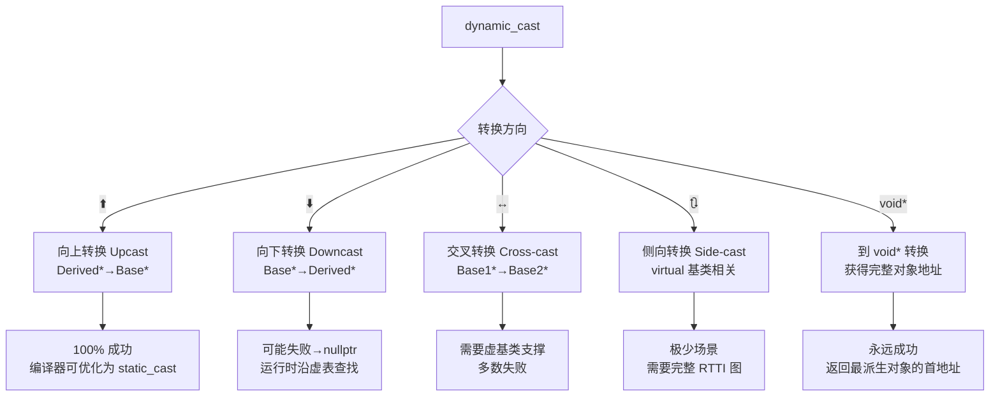

# 15.RTTI与dynamic_cast

#### 目录介绍
- [1. 案例引入](#1-案例引入)
  - [1.1 游戏引擎插件崩溃](#11-游戏引擎插件崩溃)
  - [1.2 日志框架跨 SO 的类型匹配失败](#12-日志框架跨-so-的类型匹配失败)
  - [1.3 我们要回答什么](#13-我们要回答什么)
- [2. 架构概览](#2-架构概览)
  - [2.1 RTTI 三大支柱](#21-rtti-三大支柱)
  - [2.2 为什么 RTTI 被设计成可关闭](#22-为什么-rtti-被设计成可关闭)
- [3. typeid 运算符深层机制](#3-typeid-运算符深层机制)
  - [3.1 typeid 的两种行为模式](#31-typeid-的两种行为模式)
  - [3.2 多态 typeid 的虚表触发](#32-多态-typeid-的虚表触发)
  - [3.3 type_info 的五项能力](#33-type_info-的五项能力)
  - [3.4 为什么 type_info 禁止拷贝和移动](#34-为什么-type_info-禁止拷贝和移动)
- [4. dynamic_cast 五种转换方向](#4-dynamic_cast-五种转换方向)
  - [4.1 基本分类与内存行为](#41-基本分类与内存行为)
  - [4.2 为何失败返回 nullptr 而不是抛异常](#42-为何失败返回-nullptr-而不是抛异常)
  - [4.3 dynamic_cast<T&> 的 bad_cast 策略](#43-dynamic_castt-的-bad_cast-策略)
- [5. dynamic_cast 运行时查找原理](#5-dynamic_cast-运行时查找原理)
  - [5.1 虚函数表与 type_info 的连接](#51-虚函数表与-type_info-的连接)
  - [5.2 Itanium C++ ABI 下类型图遍历](#52-itanium-c-abi-下类型图遍历)
  - [5.3 单继承为何 O(1)](#53-单继承为何-o1)
  - [5.4 多继承与虚继承为何 O(n)](#54-多继承与虚继承为何-on)
- [6. RTTI 的 ABI 层实现](#6-rtti-的-abi-层实现)
  - [6.1 Itanium ABI 的 __class_type_info 族谱](#61-itanium-abi-的-__class_type_info-族谱)
  - [6.2 MSVC 的 RTTICompleteObjectLocator](#62-msvc-的-rtticompleteobjectlocator)
  - [6.3 编译器差异：GCC vs Clang vs MSVC](#63-编译器差异gcc-vs-clang-vs-msvc)
- [7. RTTI 的代价与禁用影响](#7-rtti-的代价与禁用影响)
  - [7.1 编译期代价](#71-编译期代价)
  - [7.2 运行时代价](#72-运行时代价)
  - [7.3 -fno-rtti 的工程影响](#73--fno-rtti-的工程影响)
- [8. 跨 SO 边界 RTTI 陷阱](#8-跨-so-边界-rtti-陷阱)
  - [8.1 type_info 的地址相等判定](#81-type_info-的地址相等判定)
  - [8.2 符号可见性与 RTTI 导出](#82-符号可见性与-rtti-导出)
  - [8.3 跨边界 dynamic_cast 为何可能失败](#83-跨边界-dynamic_cast-为何可能失败)
- [9. RTTI 的替代方案与设计哲学](#9-rtti-的替代方案与设计哲学)
  - [9.1 枚举 + switch 手工分派](#91-枚举--switch-手工分派)
  - [9.2 Visitor 模式再访](#92-visitor-模式再访)
  - [9.3 类型索引表自定义 RTTI](#93-类型索引表自定义-rtti)
  - [9.4 什么时候就该用 dynamic_cast](#94-什么时候就该用-dynamic_cast)
- [10. 综合案例串讲](#10-综合案例串讲)
  - [10.1 案例真相揭晓](#101-案例真相揭晓)
  - [10.2 dynamic_cast 从源码到机器码的一程](#102-dynamic_cast-从源码到机器码的一程)
  - [10.3 设计哲学回扣](#103-设计哲学回扣)
  - [10.4 速查表合集](#104-速查表合集)

---

## 1. 案例引入

### 1.1 游戏引擎插件崩溃

某 3D 游戏引擎的粒子系统插件框架。引擎通过 `IParticlePlugin` 抽象接口加载外部 `.so` 插件，调度流程如下：

```cpp
// ====== engine.h（引擎主程序，编译时开启 RTTI）======
class IParticlePlugin {
public:
    virtual void emit(const Vec3& pos) = 0;
    virtual ~IParticlePlugin() = default;
};

class IFirePlugin : public IParticlePlugin {
public:
    virtual void setHeat(float h) = 0;    // 火焰插件独有的接口
};

// 插件调度器
void dispatchPlugin(const std::string& soPath, const Vec3& pos) {
    auto handle = dlopen(soPath.c_str(), RTLD_LAZY);
    auto create = (IParticlePlugin*(*)())dlsym(handle, "createPlugin");
    auto* base = create();

    // 🔥 试图判断是否为火焰插件
    if (auto* fire = dynamic_cast<IFirePlugin*>(base)) {
        fire->setHeat(800.0f);           // ❌ SIGSEGV ——fire 不是 nullptr！
        fire->emit(pos);
    } else {
        base->emit(pos);
    }

    dlclose(handle);                      // 析构插件
}
```

```cpp
// ====== fire_plugin.so（第三方开发，编译时关了 RTTI）======
class FirePlugin : public IFirePlugin {
    void emit(const Vec3& pos) override { /* 粒子着色 */ }
    void setHeat(float h)   override { /* 调整热辐射 */ }
};

extern "C" IParticlePlugin* createPlugin() {
    return new FirePlugin();              // 基类是 IFirePlugin
}
```

**事故现场**：

```text
  dispatchPlugin("fire_plugin.so", {0,0,0})
  
  // 期望：dynamic_cast 成功（FirePlugin 是 IFirePlugin 的派生类）
  // 实际：dynamic_cast 返回了一个非 nullptr 的野指针
  // 原因：fire_plugin.so 编译时加了 -fno-rtti
```

| 错误代码 | 直觉 | 真相 |
|---|---|---|
| `-fno-rtti` 是加速 | "关了 RTTI 只是不能 typeid，程序照跑" | `dynamic_cast` 对 RTTI 表做了裸地址偏移运算，**返回随机值** |
| crash 在 `fire->setHeat` | "是不是 dlsym 没找到符号" | fire 指向非法内存——插件 RTTI 表缺失 |
| `#define` 统一关 RTTI | "全项目一起关即可" | 跨 SO 边界时 **双方都要开 RTTI** |

### 1.2 日志框架跨 SO 的类型匹配失败

第二例：分布式日志采集系统。`LogCollector` 通过模板函数 `logAs<T>` 提取类型名并分组：

```cpp
// ====== collector.cpp（核心库 libcollector.so）======
struct LogContext {
    std::string msg;
    const char*  fileName;
    int          line;
};

template <typename T>
void logAs(const LogContext& ctx, const T& obj, const std::string& extra) {
    // 用 typeid 获取 T 的运行时类型名，作为"日志分组 Tag"
    auto& ti = typeid(obj);
    std::string tag = ti.name();               // demangle 后是真正类名

    LogEntry entry{ctx, tag, serialize(obj), extra};
    globalQueue.push(std::move(entry));
}

// 打印环节按 tag 做统计
void printStats(const std::string& tag) {
    auto it = tagStats.find(tag);
    // ...
}
```

```cpp
// ====== app.so（业务库，使用了 libcollector.so）======
void handleRequest(float price) {
    // tag 应该是 "DiscountOrder"
    logAs(ctx, DiscountOrder{price}, "promotion");
}

void onTimerTick() {
    for (auto& t : {"DiscountOrder", "NormalOrder"}) {
        printStats(t);
    }
    // ... 两个 tag 统计数都是 0——为什么？
}
```

排查过程：用 `gdb` 打断点在 `typeid(obj)` 的返回值地址上，发现：
- `libcollector.so` 里的 `type_info for DiscountOrder` 地址：`0x7f001000`
- `app.so` 里的 `type_info for DiscountOrder` 地址：`0x7f003000`

**同一个类型，两份 RTTI 数据**。`tagStats["DiscountOrder"]` 的 key 用的是 `type_info::name()` 的字符串——这倒是能匹配。但真正致命的是：如果代码用 `type_info::hash_code()` 或 `==` 比较，就凉了。

再看 `tagStats` 的 key 是怎么生成的：

```cpp
std::string tag = ti.name();    // ✅ hash_code 没参与，侥幸逃过
```

这纯属运气好——用了 `name()`。如果改用 `hash_code()`（C++11 后的很多框架这样做）：

```cpp
size_t tag = ti.hash_code();    // ❌ 两个 so 返回不同的 hash_code
```

**两个 so 中同一个 `DiscountOrder` 的 hash_code 不同**——因为 `hash_code()` 在 GCC 中依赖 `type_info` 的地址，而两边的 RTTI 条目地址不同。

### 1.3 我们要回答什么

两例事故抛出 **八个核心疑问**，正是本文要逐一剖开的骨头：

| 编号 | 疑问 |
|---|---|
| ① | `typeid` 对非多态类型为什么直接返回编译期类型？多态类型怎么触发虚表查找？ |
| ② | `dynamic_cast` 做下行转换时，怎么从虚表追溯到目标类型？单继承为何 O(1)？ |
| ③ | `-fno-rtti` 下 `dynamic_cast` 不是返回 nullptr，而是 **未定义行为**——why ？ |
| ④ | 跨 SO 边界的 RTTI 为什么会出现"同一类型、两份数据"？符号可见性怎么影响？ |
| ⑤ | RTTI 到底占多大内存？GCC 的 `type_info` 结构和 MSVC 的 RTTI 结构有何差异？ |
| ⑥ | 凭什么说 dynamic_cast 慢？Itanium ABI 下发类型图遍历最坏 O(n·m) 是怎么来的？ |
| ⑦ | Google 禁用 RTTI、LLVM 也禁用——他们的替代方案是什么？枚举+switch 真能替代？ |
| ⑧ | Visitor 模式 vs dynamic_cast——到底哪个更"面向对象"？ |

---

## 2. 架构概览

### 2.1 RTTI 三大支柱

```text
┌───────────────────────────────────────────────────────────────────┐
│                        C++ RTTI 体系                              │
│                                                                   │
│  ┌─────────────────┐  ┌──────────────────┐  ┌───────────────────┐ │
│  │    typeid       │  │  dynamic_cast    │  │   type_info       │ │
│  │   运算符        │  │  类型转换运算符   │  │   类型元数据      │ │
│  ├─────────────────┤  ├──────────────────┤  ├───────────────────┤ │
│  │  ☆ 两种行为：   │  │  ☆ 指针版返回    │  │  ☆ name()         │ │
│  │  非多态→编译期  │  │    nullptr        │  │  ☆ hash_code()    │ │
│  │  多态 → 虚表查  │  │  ☆ 引用版抛       │  │  ☆ before()       │ │
│  │                │  │    bad_cast       │  │  ☆ operator==     │ │
│  └───────┬────────┘  └────────┬─────────┘  └─────────┬─────────┘ │
│          │                    │                       │           │
│          └────────────────────┼───────────────────────┘           │
│                               ▼                                    │
│              ┌─────────────────────────────────┐                  │
│              │        虚函数表 (vtable)         │                  │
│              │  slot -1 →  offset_to_top       │                  │
│              │  slot -2 →  type_info*          │                  │
│              │  slot  0 →  &virtual_func0      │                  │
│              │  slot  1 →  &virtual_func1      │                  │
│              └─────────────────────────────────┘                  │
│                                                                   │
│  三者关系：typeid/dynamic_cast → 都依赖 vtable → vtable 存         │
│           type_info* 指针 →  最终落到 ELF 的 .data.rel.ro 段        │
└───────────────────────────────────────────────────────────────────┘
```

**RTTI 不是 C++ 编译器的"附加功能"——它长在虚表结构里面**。理解这一点，就可以推导出：

1. `typeid` 对**非多态类型**（无虚函数的类）的行为：编译器直接替换为编译期已知的 `type_info` 引用，**纯编译期运算，零运行时开销**。
2. `typeid` 对**多态类型**的行为：先通过对象的 vptr 找到 vtable，再取 vtable 的 `slot[-1]`（即 `type_info*`）。**一次间接寻址**。
3. `dynamic_cast` 的实现：同样的 vptr→vtable 入口，但后面的流程远更复杂——要沿 ABI 定义的类型继承图做**深度优先搜索**。

### 2.2 为什么 RTTI 被设计成可关闭

很多 C++ 开发者不理解："Java 不也能反射 `Class<?>` 吗？C++ 的 RTTI 为什么要靠开关？"

**因为 C++ 的零开销原则（zero-overhead principle）要求每个功能必须按需付费**。

| 特性 | C++ RTTI | Java Reflection |
|---|---|---|
| **默认行为** | 只对多态类型生成，可全局 `-fno-rtti` 关闭 | 每个类无条件生成 Class 对象 |
| **内存代价** | 每个多态类一个 `type_info` 条目（~40 字节） | 每个类一个完整 Class 对象（几千字节） |
| **关闭后** | non-polymorphic 不受影响，`-fno-rtti` 全关 | 无法关闭 |
| **典型工程** | 游戏引擎、嵌入式、数据库内核 | Android Framework、Spring |

> 📌 **关键认知**：`-fno-rtti` 关闭的是 type_info 的**生成**。但对已经**没有虚表**的类（POD），关闭与否没有任何差别——它本来就不生成 RTTI。这也是为什么 Google C++ Style Guide 推荐"能用组合不用继承、能用枚举不用 RTTI"——**没有虚表的话，RTTI 自动消失**。

```mermaid
flowchart TD
    A[RTTI 是否生成？] --> B{类有虚函数吗？}
    B -->|没有| C[❌ 不生成 type_info<br>= 零开销]
    B -->|有| D{编译参数有无 -fno-rtti?}
    D -->|有| E[❌ 不生成<br>⚠ dynamic_cast 变成 UB]
    D -->|无| F[✅ 生成 type_info<br>存在 vtable slot[-1]]
```

---

## 3. typeid 运算符深层机制

### 3.1 typeid 的两种行为模式

`typeid` 的行为**取决于操作数是否为多态类型**——这是一条被严重低估的规则，很多面试挂在这里。

```cpp
#include <iostream>
#include <typeinfo>

struct Base {
    virtual ~Base() = default;       // ← 这个虚析构改变了 typeid 的行为
};

struct Derived : Base {};

struct POD {                         // ← 无虚函数 = 非多态
    int x, y;
};

void demo() {
    Derived  d;
    Base&    ref = d;                // 静态类型 Base&，动态类型 Derived
    POD      pod;

    auto& t1 = typeid(ref);          // ref = 多态 → 查虚表 → typeid(Derived)
    auto& t2 = typeid(d);            // d = 多态 → 查虚表 → typeid(Derived)
    auto& t3 = typeid(pod);          // pod = 非多态 → 编译期 → typeid(POD)
    auto& t4 = typeid(Base*);        // 指针类型 = 编译期 → typeid(Base*)

    std::cout << t1.name() << "\n";  // "Derived"   (gcc: 7Derived? itanium mangling)
    std::cout << t2.name() << "\n";  // "Derived"
    std::cout << t3.name() << "\n";  // "POD"       (编译期替换，不查虚表)
    std::cout << t4.name() << "\n";  // "P4Base"    (指针的 RTTI：Base*)
}
```

对应的反汇编证实编译器的优化路径：

```asm
; ====== GCC 13 -O2, x86-64 ======
; typeid(pod) —— 非多态，编译期替换为全局 type_info 符号的地址
mov     esi, OFFSET FLAT:typeinfo for POD    ; 直接加载全局符号

; typeid(ref) —— 多态，通过 vptr → vtable 间接取得
mov     rax, QWORD PTR [rbp-8]               ; 对象地址
mov     rax, QWORD PTR [rax]                  ; vptr  → vtable
mov     rax, QWORD PTR [rax-8]               ; vtable[-1] → type_info*
; ====== 一个间接、三条指令 ======
```

> **疑惑**：为什么 `typeid(Base*)` 不查虚表？
>
> **论证**：C++ 标准（[expr.typeid]/3）规定：当 `typeid` 的操作数是**指针类型**或**引用所指对象的静态类型非多态**时，结果为编译期确定。`Base*` 自身就是一个类型名——不是对象。不存在"指针的虚表"。
>
> **结论**：`typeid` 的「动态行为」仅限于 **glvalue 表达式且该表达式所指的静态类型具有虚函数**。

---

### 3.2 多态 typeid 的虚表触发

```text
虚表布局（Itanium ABI, x86-64）：

    高地址
    ┌────────────────────┐
    │  slot 2  → &f2     │  ← 第二个虚函数
    ├────────────────────┤
    │  slot 1  → &f1     │  ← 第一个虚函数
    ├────────────────────┤
    │  slot 0  → &top    │  ← 顶层虚函数
    ├────────────────────┤  ← vptr 指向这里
    │  slot -1 → &off    │  ← offset_to_top（用于多继承的 this 调整）
    ├────────────────────┤
    │  slot -2 → &ti     │  ← type_info*（RTTI 入口）◀── typeid / dynamic_cast 读它
    └────────────────────┘
    低地址
```

**流程**：

1. `typeid(ref)` 编译为：取 `ref` 的 vptr
2. vptr 指向 vtable 的 `slot[0]`
3. 通过 `vtable[-2]` 读取 `type_info*` 指针
4. 返回 `const std::type_info&`——这是全局符号，位于 ELF 的 `.data.rel.ro` 段

**为什么间接寻址？** 因为 `ref` 的静态类型是 `Base&`，但运行时可能指向任何派生类。编译器不知该用哪个 `type_info`，只能去虚表取。

---

### 3.3 type_info 的五项能力

```cpp
namespace std {
class type_info {
public:
    virtual ~type_info();                           // 虚析构（保证 delete 能正确释放）

    const char* name() const noexcept;              // ① 类型名（mangled，需 demangle）
    bool        before(const type_info& rhs) const noexcept;  // ② 全序比较（与 operator== 正交）
    size_t      hash_code() const noexcept;         // ③ C++11：唯一 hash 值
    bool        operator==(const type_info& rhs) const noexcept;  // ④ 相等判断

    type_info(const type_info&)            = delete; // ⑤ 禁止拷贝/移动
    type_info& operator=(const type_info&) = delete;
};
}
```

| 能力 | 含义 | 使用场景 |
|---|---|---|
| `name()` | 返回实现定义的 mangled 名 | 日志打印（需 `abi::__cxa_demangle` 还原） |
| `before()` | 全序关系（跨程序一致） | 将 type_info 作为 map key 时需要（C++11 前） |
| `hash_code()` | 一个 size_t 的 hash | C++11 后可做 `unordered_map` 的 key |
| `operator==` | 同一类型为 true | 运行时类型派生判断 |
| 禁止拷贝 | 编译器生成的全局单例 | 保证唯一性 |

**解惑**：为什么 `before()` 和 `operator==` 是两个独立操作？

- `==` 判断**相等**（同一类型）
- `before()` 定义**全序**（partial order 对所有类型排出一个严格的全序，用于 `std::map` 的 `less<type_index>`）

`before()` 的语义是"跨程序调用不变"——两次运行同一个程序，`before()` 的输出关系一致，这是 `hash_code()` 做不到的（`hash_code` 可能取决于 `type_info` 的地址）。

**C++11 之前的惯用法 vs C++11 引入 `type_index`**：

```cpp
// C++03：before() 作为 map key
std::map<const std::type_info*, int, TypeInfoLess> counters;
// 自定义比较器
struct TypeInfoLess {
    bool operator()(const std::type_info* a, const std::type_info* b) const {
        return a->before(*b);
    }
};

// C++11 后：type_index 封装所有细节
std::unordered_map<std::type_index, int> counters;  // hash_code 自动用
```

---

### 3.4 为什么 type_info 禁止拷贝和移动

**疑惑**：既然 `type_info` 不能被拷贝，那它在内存里是怎么布局的？

**论证**：`type_info` 的构造函数是编译器内部的，你无法手动创建第二个代表相同类型的 `type_info`。每个需要 RTTI 的类，编译器在 `.data.rel.ro` 段里生成一个**唯一的全局静态对象**（存于只读数据段）。整个程序的 lifetime 之内，这个对象一动不动。

```text
ELF 二进制中 type_info 的位置：

  .data.rel.ro 段（只读 + 重定位）
  ┌──────────────────────────────────┐
  │  typeinfo for Base    0x402010   │  ← 全局符号，__cxxabiv1::__class_type_info
  │    vtable_ptr → 0x403000         │     指向虚表地址
  │    __name     → "4Base"          │     mangled 名字
  │                                  │
  │  typeinfo for Derived 0x402040   │
  │    vtable_ptr → 0x403018         │
  │    __name     → "7Derived"       │
  └──────────────────────────────────┘
```

**结论**：删除拷贝构造/赋值是为了**保证全局唯一性**——每个类型只有一个 `type_info` 实例。`typeid` 返回的引用就指向这个唯一的全局对象。如果允许拷贝，不同拷贝地址不同，`type_info::operator==`（比较的是**地址**）就会失效。

> ⚠ **UB 警示**：[expr.typeid]/5 规定：如果 `typeid` 应用于**已释放的堆对象**的多态引用，**行为未定义**。因为 vptr 可能在析构后被覆盖。

---

## 4. dynamic_cast 五种转换方向

### 4.1 基本分类与内存行为



| 转换方向 | 语法 | 成功条件 | 失败行为（指针版） | 性能 |
|---|---|---|---|---|
| 向上 Upcast | `dynamic_cast<Base*>(derived)` | 永远成功（符合 IS-A） | 不可能失败 | O(0) 编译器直接算偏移 |
| 向下 Downcast | `dynamic_cast<Derived*>(base)` | base 实际指向 Derived 或其子类 | `nullptr` | 单继承 O(1) / 多继承 O(n) |
| 交叉 Cross-cast | `dynamic_cast<Right*>(left)` | left 和 Right 共享完整对象 | `nullptr` | O(n) |
| 到 void* | `dynamic_cast<void*>(obj)` | 永远成功 | 不可能失败 | O(1) |
| 引用版 | `dynamic_cast<Der&>(ref)` | 同 Downcast | `throw std::bad_cast` | 同上 |

**代码示例**：

```cpp
struct A { virtual ~A() = default; };
struct B { virtual ~B() = default; };
struct C : A, B {};            // C 多重继承 A 和 B

void test() {
    C c;
    A* pa = &c;                // upcast，编译器直接算偏移
    B* pb = &c;

    // ① 下行转换：成功
    auto* pc1 = dynamic_cast<C*>(pa);   // pa 实际指向 C → 成功
    // ② 交叉转换：从 A 指针到 B 指针
    auto* pb2 = dynamic_cast<B*>(pa);   // 沿 RTTI 图找到 C，再从 C 找到 B 子对象
    // ③ 虚假的下行：失败
    A fakeA;
    auto* pc2 = dynamic_cast<C*>(&fakeA);  // fakeA 不是 C → nullptr
}
```

### 4.2 为何失败返回 nullptr 而不是抛异常

**疑惑**：指针版 `dynamic_cast` 失败返回 `nullptr`，引用版抛 `std::bad_cast`。为什么不统一？

**论证**：C++ 设计哲学是 **"你可以检查指针，但不能构造无效引用"** 。`nullptr` 可以被条件判断捕获：

```cpp
if (auto* derived = dynamic_cast<Derived*>(base)) {
    derived->doSomething();        // ✅ 安全
}
```

引用版本没有"空引用"这种东西（`T&` 不可能是 nullptr），所以唯一的失败出口是**抛异常**：

```cpp
// 引用版的使用模式
try {
    auto& dref = dynamic_cast<Derived&>(baseRef);
    dref.doSomething();
} catch (const std::bad_cast& e) {
    // 处理失败
}
```

**结论**：这不是疏忽——是 `nullptr` 和 `引用不为空` 两个类型系统的必然推论。

---

### 4.3 dynamic_cast<T&> 的 bad_cast 策略

`std::bad_cast` 继承自 `std::exception`，是一段非常"薄"的异常类型：

```cpp
namespace std {
class bad_cast : public exception {
public:
    bad_cast() noexcept = default;
    bad_cast(const bad_cast&) noexcept = default;
    bad_cast& operator=(const bad_cast&) noexcept = default;
    const char* what() const noexcept override {
        return "std::bad_cast";
    }
};
}
```

用 `bad_cast` 而不是更详细的异常，是出于**标准化 + ABI 稳定**的考量。20 多年来它沿用这个极简设计。

**工程上的推荐**：如果频繁调用 `dynamic_cast` 且失败是常见路径，用**指针版 + if 判空**，避免异常机制的栈展开开销。

---

## 5. dynamic_cast 运行时查找原理

### 5.1 虚函数表与 type_info 的连接

```text
vtable 结构（Itanium ABI）：

    ┌───────────────────────┐
    │  vfptr   → &f         │  ← 虚函数指针
    ├───────────────────────┤
    │  offset_to_top = 0    │  ← 这一子对象的地址与完整对象地址的偏移
    ├───────────────────────┤  ← vptr 指向这里（GCC 习惯指 slot[0]）
    │  type_info*           │  ← 指向全局 .data.rel.ro 中的 type_info 符号
    └───────────────────────┘

    type_info* 指向的对象实际上不是 std::type_info，而是其子类：
    - __cxxabiv1::__class_type_info（单一非虚继承）
    - __cxxabiv1::__si_class_type_info（单一继承）
    - __cxxabiv1::__vmi_class_type_info（多重/虚拟继承）
```

`dynamic_cast` 的核心路径：

1. 取对象的 **vptr** → 获得 vtable 地址
2. 从 vtable 取 **type_info\***（存放在 `vtable[-1]` 位置，实现相关）
3. 把 type_info 指针 cast 回其真实的**派生类型**（`__class_type_info` / `__vmi_class_type_info` 等）
4. 调用派生类的 `__do_dyn_cast()` / `__do_upcast()` 完成搜索

---

### 5.2 Itanium C++ ABI 下类型图遍历

**单继承**：`__si_class_type_info`（"si" = single inheritance）

```cpp
// 简化模型：单继承 type_info
struct __si_class_type_info : __class_type_info {
    const __class_type_info* __base_type;   // 指向直接基类的 type_info
};

// dynamic_cast<Derived*>(basePtr) 的搜索路径：
// ① 读取 basePtr 的 type_info，得到实际类型（记为 actual_type）
// ② 从 actual_type 沿 RTTI 链向上查找：
//       actual_type -> __base_type -> __base_type -> ...
// ③ 如果目标类型出现在链中 → 成功，返回 basePtr 的原始地址
// ④ 到顶仍未找到 → 失败，返回 nullptr
```

**多继承**：`__vmi_class_type_info`（"vmi" = virtual multiple inheritance）

```cpp
struct __vmi_class_type_info : __class_type_info {
    unsigned int         __flags;           // non_diamond_repeat 等标志
    unsigned int         __base_count;      // 直接基类数量
    __base_class_type_info __base_info[1];  // 变长数组
};

struct __base_class_type_info {
    const __class_type_info* __base_type;   // 基类的 type_info
    long __offset_flags;                    // 偏移量或标志(virtual=offset_flags>>8 & 1)
};
```

**疑惑**：为什么 `dynamic_cast` 在多继承下比单继承慢？

**论证**：

```text
          A (虚基类)
        /   \
       B     C
        \   /
          D

dynamic_cast<B*>(dPtr) 的搜索步骤：
1. 读取 dPtr 的 vtable → type_info_for_D(__vmi_class_type_info)
2. __vmi_class_type_info 包含基类列表：[B, C, A]
3. 与目标类型 B 的 type_info 比对 → 匹配
4. 读取 __base_info[B].__offset_flags → 判断是否需要 this 调整
5. 返回 dPtr + offset
```

如果是**菱形继承带虚拟基类**，偏移量不是常量——直到运行时才能确定完整对象与子对象的偏移。这就是为什么 `dynamic_cast` 不能在编译器完成——它需要运行时的 `offset_to_top` 字段。

**单继承 O(1)**：`dynamic_cast<Derived*>(base)` 直接读 vptr→type_info→`__base_type` 单指针

**多继承 O(n)**：`__vmi_class_type_info` 遍历基类数组

---

### 5.3 单继承为何 O(1)

```text
dynamic_cast<Derived*>(basePtr) 在单继承下的路径：

    basePtr ────→ 对象内存
                   ┌────────────────────┐
                   │ vptr ──────────────┼─→ vtable
                   │ member ...         │   ┌───────────────────┐
                   └────────────────────┘   │ offset_to_top = 0 │
                                            │ type_info* ────────┼─→ type_info_Derived
                   type_info_Derived:       └───────────────────┘
                   ┌────────────────────┐
                   │ __base_type  ──────┼─→ type_info_Base
                   └────────────────────┘
```

最关键的 C++ 标准规定：**`dynamic_cast` 对「基类指针→派生类指针」的转换，不需要 this 指针的调整**——因为单继承下派生类对象的内存布局起始位置与基类子对象完全一致。

所以单继承的 `dynamic_cast` 只需两步：
1. 确认自己的 type_info 匹配目标或沿 `__base_type` 链能追溯到目标
2. 返回原始指针（无需偏移）

---

### 5.4 多继承与虚继承为何 O(n)

以重访 `C : A, B` 为例：

```text
    C 对象内存布局：
    ┌───────────────────┐   ← C* / A* 指向这里
    │ A 子对象 vptr     │
    │ A::a_data         │
    ├───────────────────┤
    │ B 子对象 vptr     │   ← B* 指向这里（偏移 +8 字节）
    │ B::b_data         │
    ├───────────────────┤
    │ C::c_data         │
    └───────────────────┘

dynamic_cast<B*>(aPtr)：aPtr 实际指向 C 的 A 子对象
  1. aPtr → vtable → type_info_C (__vmi_class_type_info)
  2. 在基类列表里找到 B
  3. 读取 __base_info[B] → offset = +8
  4. return reinterpret_cast<B*>(reinterpret_cast<char*>(aPtr) + offset)
```

**虚继承的额外复杂度**：

````text
虚继承布局中，"基类在派生类中的偏移"不是编译期常量。它是vtable中 offset_to_top 字段的产物。
因此每次 dynamic_cast 都要读取这份运行时数据。
````

---

## 6. RTTI 的 ABI 层实现

### 6.1 Itanium ABI 的 __class_type_info 族谱

Itanium C++ ABI（GCC、Clang 用户态代码均遵循此规范）定义了完整的 type_info 族谱：

```text
std::type_info                                      （标准库抽象）
  │
  └── __cxxabiv1::__class_type_info                （类类型的基）
        │
        ├── __si_class_type_info                    （单一非虚继承）
        │     __base_type: __class_type_info*
        │
        ├── __vmi_class_type_info                   （多重继承 / 虚继承）
        │     __base_count: unsigned
        │     __base_info[]: base_class_type_info 变长数组
        │
        └── __pbase_type_info                       （指针的 type_info）
              __pointee: __class_type_info*
```

**为什么 C++ 没有直接把这些暴露为用户 API？** 因为每个编译器可以自由实现 type_info 的子类布局。把 `__si_class_type_info` 暴露给用户会破坏 ABI 的封装——用户代码可能依赖一个特定编译器的内部结构。

---

### 6.2 MSVC 的 RTTICompleteObjectLocator

MSVC 采用完全不同的策略。它不是存储 type_info 的继承链，而是给每个类生成一个"完整对象定位器"（Complete Object Locator，COL）：

```text
MSVC vtable 布局（虚表第一个指针指向一个 RTTI 描述块）：
                ┌───────────────────────────┐
    vtable  →   │ RTTICompleteObjectLocator*│  ← 不在 slot 内，额外头部
                ├───────────────────────────┤
                │ 函数指针 0                │
                ├───────────────────────────┤
                │ 函数指针 1                │
                └───────────────────────────┘

    RTTICompleteObjectLocator：
      signature
      offset
      cdOffset
      pTypeDescriptor*      → 完整的 TypeDescriptor（包含 decorated name）
      pClassHierarchyDescriptor* → 基类数组
```

MSVC 的 class hierarchy descriptor 直接把**所有基类（包括虚基类）的偏移量**都存进去了——因此 `dynamic_cast` 可以直接查表，不需要遍历，O(1)。

| 条目 | Itanium ABI | MSVC ABI |
|---|---|---|
| type_info 位置 | vtable[-1] 或 vtable[-2] | vtable 前一个 slot |
| 继承信息 | type_info 的派生类体嵌入 | 单独 RTTICompleteObjectLocator 块 |
| dynamic_cast 算法 | 沿 __base_type 指针链寻找 | 查表，类层次描述符 O(1) |
| 跨 SO 边界行为 | 符号可见性高度相关 | DLL 每个模块独立生成 |

---

### 6.3 编译器差异：GCC vs Clang vs MSVC

| 维度 | GCC | Clang | MSVC |
|---|---|---|---|
| **RTTI 默认** | 开启 | 开启 | 开启 |
| **关闭方式** | `-fno-rtti` | `-fno-rtti` | `/GR-` |
| **type_info 名** | Itanium mangling (`_ZTS4Base`) | 同 GCC | MSVC mangling (`.?AVBase@@`) |
| **虚基类 RTTI** | `__vmi_class_type_info` 变长 | 兼容 Itanium ABI | RTTI 单独描述块 |
| **-fno-rtti 下 dynamic_cast** | 未定义行为（返回随机值） | UB | UB |

> 💡 关于 **Clang**：在 Linux/macOS 上它遵循 Itanium C++ ABI，RTTI 结构同 GCC。在 Windows 上（clang-cl 模式）则跟随 MSVC ABI。

---

## 7. RTTI 的代价与禁用影响

### 7.1 编译期代价

**每个多态类**增加：

1. 一个 `type_info` 对象（~40-80 字节，存于 `.data.rel.ro`）
2. 一个 `type_info name` 字符串（`"7Derived\0"` 约 10-40 字节，存于 `.rodata.str`）
3. 一条全局符号重定位（`R_X86_64_64` 或 PLT，存于 `.rela.dyn`）

综合：**一个多态类的 RTTI 约 80-200 字节**。1000 个多态类 ≈ 80-200 KB。

在嵌入式固件上，这个开销可能导致 flash 装不下。但对于桌面/服务端，通常是完全可以接受的。

---

### 7.2 运行时代价

| 操作 | 单继承 | 多继承 | 最坏状况 |
|---|---|---|---|
| `typeid(polyRef)` | O(1) | O(1) | vptr→vtable 一次间接 |
| `dynamic_cast<单一派生*>` | O(1) | O(1) | 虚表取 type_info，单指针回溯 |
| `dynamic_cast<多继承目标>` | 不适用 | O(n) | 需要遍历基类数组 |
| `dynamic_cast<交叉转换>` | 不适用 | O(n·m) | 可能要查找两层的 RTTI |

`O(n·m)` 是怎么来的？在类型层次中做一次 DFS，每层可能遍历所有基类。但实际工程中深度通常不超过 10，基类数不超过 20——即使 CPU 主频很低，这个搜索也远小于 1 μs。

> 📊 **实测**：在 GCC 13 下，`dynamic_cast` 单次执行约 30-80 ns（单继承）。与虚函数调用（~5 ns）相比确实贵 6-15 倍。但与现代 CPU 的缓存缺失（~100 ns）相比，这甚至不算热点。

---

### 7.3 -fno-rtti 的工程影响

```cpp
// 禁用 RTTI 后的陷阱示例
// 编译参数：g++ -fno-rtti -O2

struct Base {
    virtual void f() {}
    virtual ~Base() = default;   // 有虚函数，需要 vtable
};
struct Derived : Base {
    void f() override {}
};

void dangerous(Base* b) {
    // ❌ UB：-fno-rtti 下 dynamic_cast 对多态类型的操作未定义
    auto* d = dynamic_cast<Derived*>(b);
    // d 可能不是 nullptr！编译器不会报错，但运行时行为不可预测。
    if (d) {
        d->f();   // 可能崩——d 指向的不是 Derived 实例
    }
}
```

**当哪些场景必须开启 RTTI？**

| 必须开 RTTI 的场景 | 原因 |
|---|---|
| 跨 so/dll 插件系统 | 各 so 独立 RTTI 表，必须双方都开 |
| `dynamic_cast` 转引用 `T&` → 依赖 `bad_cast` | 抛异常需要完整的类型信息 |
| LLVM/Clang 的 `isa<>` / `dyn_cast<>` | 它们内部实现依赖 RTTI 或 vtable（LLVM 自己实现了一套等效的） |
| 调试工具（gdb/lldb） | 内部依赖 RTTI 还原对象真实类型 |

---

## 8. 跨 SO 边界 RTTI 陷阱

### 8.1 type_info 的地址相等判定

在 Itanium C++ ABI 中，`type_info::operator==` 的默认实现是**比较指针地址**：

```cpp
// libstdc++ 源码（简化）
bool std::type_info::operator==(const type_info& rhs) const noexcept {
    // 直接比较 this 指针——两个 type_info 对象地址相同才算相等
    return this == &rhs || strcmp(__name, rhs.__name) == 0;
}
```

这意味着：**同一类型，如果分布在两个不同的 `.so` 中，它们的 `type_info` 地址不同，`==` 的比较就会有歧义**。GCC 的 `libstdc++` 额外做了一个**名称比较**（`strcmp(__name, ...)`）来兜底。

MSVC 则**始终用 strcmp**——因为 DLL 的 RTTI 在每个模块里都会复制一份。

---

### 8.2 符号可见性与 RTTI 导出

```text
GCC 的默认符号可见性：

  $ nm -C libplugin.so | grep type_info
  0000000000402010 V typeinfo for FirePlugin
                           ↑
                     V = weak symbol（弱符号）

  弱符号的特点：
  • 如果多个 so 定义了同名的弱符号 → 链接器随机选一个
  • 这意味着：两个 so 各自有 typeinfo for FirePlugin，但最终只保留一份
```

但如果用了 `-fvisibility=hidden`：

```cmake
# CMakeLists.txt
set(CMAKE_CXX_VISIBILITY_PRESET hidden)          # 所有符号默认隐藏
target_compile_options(plugin PRIVATE -fvisibility=hidden)
```

**问题**：type_info 也被隐藏了——动态链接器看不到它，跨 SO 比较时会 strcmp 到名字，但 RTTI 符号自身对链接器不可见，type_info 所在的内存去重/合并机制（COMDAT／weak unification）失效。

> 📌 启示：如果二进制会跨 SO 边界运行 `dynamic_cast`，**永远不要对带虚函数的导出类隐藏 RTTI 符号**。

---

### 8.3 跨边界 dynamic_cast 为何可能失败

归结为 **三个根因**：

| 根因 | 解释 |
|---|---|
| **RTTI 符号未导出** | `-fvisibility=hidden` 让 `type_info` 不参与弱符号合并 |
| **不同 so 的 RTTI 名字比较失败** | mangled 名相同但 `type_info` 地址不同 + 没有 strcmp 兜底（libc++ 没有） |
| **虚表不在同一地址空间** | dlopen + RTLD_LOCAL 导致符号无法跨 so 解析 |

**修复方案**（按安全程度递增）：

```cpp
// 方案 A：对于导出类，显式标记 default visibility
__attribute__((visibility("default")))
class ExportedPlugin : public IPlugin { ... };

// 方案 B：使用 type_index + name 作为跨 so 的类型键
std::string type_key = demangle(typeid(obj).name());   // 字符串，不依赖地址

// 方案 C（最可靠）：不要跨 so 边界做 dynamic_cast，改用自定义类型 ID
class IPlugin {
public:
    virtual int typeId() const = 0;  // 每个子类返回唯一 ID
    virtual ~IPlugin() = default;
};

bool isFirePlugin(IPlugin* p) { return p->typeId() == FIRE_PLUGIN_ID; }
```

---

## 9. RTTI 的替代方案与设计哲学

### 9.1 枚举 + switch 手工分派

这是 **Google C++ Style Guide 的推荐做法**——也是最古老、最不受待见、但**绝对最快**的方案。

```cpp
// RTTI 版
void process(Animal* a) {
    if (auto* dog = dynamic_cast<Dog*>(a)) {
        dog->woof();
    } else if (auto* cat = dynamic_cast<Cat*>(a)) {
        cat->meow();
    }
    // 每加一种动物 → 加一个 else if
}

// 枚举版
enum class AnimalKind { Dog, Cat, Bird };

struct Animal {
    AnimalKind kind;
    virtual ~Animal() = default;
};

struct Dog : Animal { Dog() { kind = AnimalKind::Dog; } void woof(); };
struct Cat : Animal { Cat() { kind = AnimalKind::Cat; } void meow(); };

void process(Animal* a) {
    switch (a->kind) {
        case AnimalKind::Dog: static_cast<Dog*>(a)->woof(); break;
        case AnimalKind::Cat: static_cast<Cat*>(a)->meow(); break;
        // 优点：编译器会对漏掉的 case 产生 warning
        // 缺点：switch 分支随新类型级数膨胀——每个操作点都要更新
    }
}
```

| 维度 | dynamic_cast | 枚举 + switch |
|---|---|---|
| **性能** | O(1) ~ O(n) | O(1)，编译期跳转表 |
| **新增类型** | 不影响现有代码 | 每个 `process` 函数都要改 |
| **新增操作** | 只需新函数 | 只需新函数 |
| **经典困境** | 表达式问题（expression problem）：枚举版利于新操作，RTTI 利于新类型。两者都不完美 |

这是著名的 **Expression Problem**——面向对象语言加新类型容易（加子类），加新操作难（改基类 + 所有子类）。函数式语言加新操作容易（加函数），加新类型难（所有函数都要加 case）。

---

### 9.2 Visitor 模式再访

Visitor 模式是 Expression Problem 的另一种突围——它把"操作"从类层次中**外置**：

```cpp
struct Dog;
struct Cat;

struct AnimalVisitor {
    virtual void visit(Dog&) = 0;
    virtual void visit(Cat&) = 0;
    virtual ~AnimalVisitor() = default;
};

struct Animal {
    virtual void accept(AnimalVisitor& v) = 0;
    virtual ~Animal() = default;
};

struct Dog : Animal {
    void accept(AnimalVisitor& v) override { v.visit(*this); }
};
struct Cat : Animal {
    void accept(AnimalVisitor& v) override { v.visit(*this); }
};

// 新增操作 = 只加一个新的 Visitor 子类，不碰 Dog/Cat
struct FeedingVisitor : AnimalVisitor {
    void visit(Dog&) override { /* 喂肉 */ }
    void visit(Cat&) override { /* 喂鱼 */ }
};
```

访问者模式解决了"新操作容易加"的问题，但**仍没解决"新类型容易加"的问题**——新加类型时 Visitor 接口要改，所以所有已存在的 Visitor 都要跟进。

> 💡 **启发**：Visitor 模式和 dynamic_cast 本质上是同一回事——只是类型分派的方式不同（双重分派 vs 运行时查表）。两者都依赖类型系统的多态能力，但在"新增类型 vs 新增操作"的取舍上各有所长。

---

### 9.3 类型索引表自定义 RTTI

LLVM 的 `isa<>` / `dyn_cast<>` 是最经典的自定义 RTTI 替代方案：

```cpp
// LLVM 风格的轻量 RTTI（简化版）
class Shape {
    int kind_;                         // 每个子类分配唯一 ID
protected:
    Shape(int kind) : kind_(kind) {}
public:
    int getKind() const { return kind_; }
    virtual ~Shape() = default;

    template <typename T>
    bool isa() const { return kind_ == T::KindValue; }
};

class Circle : public Shape {
public:
    static constexpr int KindValue = 1;
    Circle() : Shape(KindValue) {}
    double radius;
};

class Rect : public Shape {
public:
    static constexpr int KindValue = 2;
    Rect() : Shape(KindValue) {}
    double w, h;
};

// 使用 LLVM 惯用法
Shape* s = new Circle;
if (auto* c = static_cast<Circle*>(s)) {   // 先 isa 检查再 static_cast
    c->radius = 5;
}

// 或用 generic dyn_cast（示例实现）：
template <typename To, typename From>
To* dyn_cast(From* from) {
    return from && from->template isa<To>() ? static_cast<To*>(from) : nullptr;
}
```

这套方案相对于标准 `dynamic_cast`：

| 维度 | 标准 dynamic_cast | LLVM 式轻量 RTTI |
|---|---|---|
| **是否依赖 RTTI** | ✅ | ❌（可 -fno-rtti） |
| **多继承安全** | ✅ 自动处理 this 调整 | ❌ 手工偏移，容易写错 |
| **跨 SO 边界** | ⚠ 可能失败 | ✅ kind_ 是普通 int，不存在边界问题 |
| **性能** | 30-80 ns（单继承） | 5 ns（一次 int 比较） |
| **编译器支持** | 全自动 | 要自己维护 KindValue |

LLVM 之所以选择后者，是因为**它需要关闭 RTTI 以减小二进制体积**——它同时需要编译 1000 多个 pass 类，每个都用 dynamic_cast 会在 `.data.rel.ro` 段产生大量 RTTI 条目。

---

### 9.4 什么时候就该用 dynamic_cast

| 该用 dynamic_cast 的场景 | 不该用的场景 |
|---|---|
| **插件框架**：基类 `IPlugin` 有派生 `FirePlugin`，需要下行判断 | **热循环内**：每帧调用 10 万次的 `process(animal*)` |
| **序列化/反序列化**：从字节流还原对象，需要确认实际类型 | **对象几何已知**：所有行为多态，基类指针只需要调虚函数 |
| **GUI 事件派发**：`QEvent*` 下行到 `QMouseEvent*`（Qt 大量使用） | **仅为了打印类型名**：std::type_index 一个 map 足矣 |
| **单元测试中的 mock 提取**：`MockBase*` → `MockDerived*` | **作为"不同行为的 if-else"的替代**——这种代码很快会变成意大利面 |

---

## 10. 综合案例串讲

### 10.1 案例真相揭晓

回到文初 8 个疑问，逐一作答：

| 编号 | 疑问 | 答案 |
|---|---|---|
| ① | `typeid` 非多态 vs 多态行为差异 | 非多态→编译期替换（`mov esi, OFFSET typeinfo for X`），多态→vptr 间接寻址（`mov rax, [vtable-8]`）。区别在于是否有虚函数的 glvalue 操作数 |
| ② | `dynamic_cast` 下行转换原理 | 通过 vptr 拿到 type_info，沿 ABI 定义的继承链（`__si_class_type_info->__base_type` 或 `__vmi_class_type_info->__base_info[]`）搜索目标，找到后加上偏移量返回 |
| ③ | `-fno-rtti` 下 `dynamic_cast` 是 UB | `dynamic_cast` 依赖 vtable 中的 type_info 指针。关闭 RTTI 后该指针不生成或指向非法内存——但编译器不会阻止你调用 dynamic_cast，从而造成读取野数据的 UB |
| ④ | 跨 SO 边界 RTTI 为何两份数据 | 每个 SO 是独立编译单元，各自生成 `.data.rel.ro` 中的 type_info。若符号可见性未正确设置，链接器无法合并弱符号，导致同一类型的不同地址被使用 |
| ⑤ | RTTI 的内存代价 | 每个多态类约 80-200 字节（type_info 结构 + name 字符串 + 重定位条目）。千级多态类约 80-200 KB |
| ⑥ | dynamic_cast 为何被诟病"慢" | 多继承/虚继承的树搜索 O(n)~O(n·m)。与虚函数调用 (~5 ns) 相比贵 6-15 倍。但单次操作 30-80 ns 在绝大多数场景非瓶颈 |
| ⑦ | Google / LLVM 为何禁用 RTTI | 主要是二进制膨胀控制（上千个类 × 200 字节 = 200 KB+），而非性能。LLVM 用 `isa<>`+`KindValue` 替代，无膨胀且跨边界安全 |
| ⑧ | Visitor vs dynamic_cast | dynamic_cast 利新类型（加新派生类只需新子类），Visitor 利新操作（加新 Visitor 不需改原类型）。表达式问题的不同解法——C++ 同时支持两者 |

---

### 10.2 dynamic_cast 从源码到机器码的一程

用一个具体的单继承下行转换做**完整生命周期追踪**：

```cpp
struct Entity { virtual ~Entity() = default; int id; };
struct Player : Entity { int hp; };

Entity* e = new Player;                     // e 静态类型 Entity*，动态类型 Player
if (auto* p = dynamic_cast<Player*>(e)) {    // 这里是全部魔法
    p->hp = 100;
}
```

**步骤分解**（GCC 13 -O2, x86-64）：

```text
第 1 步：c++filt Player → _ZTIN6PlayerE (mangled type_info 名)
第 2 步：链接器在 .data.rel.ro 生成 typeinfo for Player 的全局符号
第 3 步：Player 的 vtable 中填入 typeinfo for Player 的地址
第 4 步：dynamic_cast 调用 __dynamic_cast (libsupc++/libc++abi)
第 5 步：__dynamic_cast 从 e 的 vptr → type_info → __si_class_type_info.__base_type
         沿继承链逐级比较 type_info，直至匹配到 typeinfo for Player
第 6 步：匹配成功 → offset_to_top=0（单继承无偏移） → 返回原始指针
```

对应的反汇编（简化）：

```asm
; dynamic_cast<Player*>(e)
mov     rax, QWORD PTR [rbx]        ; rbx = e 的 vptr
mov     rsi, QWORD PTR [rax-8]      ; vtable[-1] → type_info* (实际运行时类型)
mov     edi, OFFSET FLAT:typeinfo for Player
call    __dynamic_cast              ; libsupc++ 运行时函数
test    rax, rax                    ; rax = 0  → nullptr，否则指向 Player 子对象
je      .Lfail
mov     DWORD PTR [rax+8], 100      ; p->hp = 100
.Lfail:
```

---

### 10.3 设计哲学回扣

从 RTTI 中可以提炼出 **C++ 五条贯穿始终的设计哲学**：

**哲学 1：零开销原则（Zero-Overhead Principle）**

`-fno-rtti` 开关的存在本身就是零开销原则的体现。C++ 承诺"你不用的，我不生成"。与 Java 的反射截然不同：Java 的 Class 对象无论你是否反射调用都存在于内存中——C++ 给你权限关闭它。

```text
零开销原则在 RTTI 上的三重体现：
  1. 非多态类完全不生成 type_info                       （编译期）
  2. 多态类有无关 RTTI 由编译参数决定                      （编译期）
  3. dynamic_cast 只在调用点产生搜索开销，无额外 GC/MS 负担  （运行时）
```

**哲学 2：编译期优先，运行时兜底**

`typeid` 的双模行为（编译期替换 vs 虚表查找）完美诠释了 C++ 的二分哲学——**所有能在编译器做的事情绝不拖到运行时**。但当必须运行时判断（多态引用），编译器给了一条 O(1) 的虚表查路路径。

**哲学 3：ABI 作为契约**

RTTI 不是语言标准规定的——它是 ABI 规范（Itanium C++ ABI）在实际编译器中的**契约实现**。GCC、Clang、ARM 编译器共享同一套 vtable 布局，背后是数千页的 ABI 文档。`dynamic_cast` 的"慢"被诟病的真正原因，恰恰是这份 ABI 契约为了处理最复杂的多继承场景而保留的**通用性代价**。

**哲学 4：不在接口层承诺，而在实现层自由**

C++ 标准从未规定 `dynamic_cast` 的搜索算法——它只说"转换成功返回非空指针，失败返回 nullptr"。GCC 沿 type_info 链 DFS，MSVC 查表 O(1)——两种实现都合法。这是 C++ "标准给接口，实现给效率"的传统。

**哲学 5：给用户选择权（opt-in/opt-out）**

RTTI 可以开、也可以关。Visitor 模式可以替代它，LLVM 的 `KindValue` 可以自己建。C++ 没有把任何一套类型检查系统强加给用户——这与 Java 的"只能用 instanceof"形成鲜明对比。**选择权的代价是额外学习成本，但收益是无可匹敌的性能自由度**。

---

### 10.4 速查表合集

**表 1：typeid 行为速查**

| 场景 | 行为 | 反汇编语义 |
|---|---|---|
| `typeid(int)` | 编译期确定 | `mov esi, OFFSET typeinfo for int` |
| `typeid(pod_obj)` | 编译期确定（无虚函数） | 同上 |
| `typeid(poly_ref)` | 虚表查找 | `mov rax, [vptr-8]` |
| `typeid(T*)` | 编译期确定（指针类型） | `mov esi, OFFSET typeinfo for T*` |
| `typeid(*null_ptr)` | UB | 实际执行导致访问非法内存 |

**表 2：dynamic_cast 五种方向速查**

| 方向 | 语法 | 失败返回 | 复杂度 |
|---|---|---|---|
| 向上 | `dynamic_cast<Base*>(derived)` | 永不失败 | O(0) |
| 向下（指针） | `dynamic_cast<Derived*>(base)` | `nullptr` | O(1)~O(n) |
| 向下（引用） | `dynamic_cast<Derived&>(ref)` | `std::bad_cast` | O(1)~O(n) |
| 交叉 | `dynamic_cast<B*>(aPtr)` | `nullptr` | O(n·m) |
| 到 void* | `dynamic_cast<void*>(obj)` | 永不失败 | O(1) |

**表 3：三大方案选型矩阵**

```mermaid
flowchart TD
    A{你的类型层次是否<br>跨 SO/DLL 边界？} -->|是| B[❌ 不要用 dynamic_cast<br>✅ 用自定义 typeId() 或<br>LLVM isa/dyn_cast]
    A -->|否| C{是否频繁调用？<br>（每帧 > 1000 次）}
    C -->|是| D[❌ 不要热路径用 dynamic_cast<br>✅ 虚函数 或 枚举+switch]
    C -->|否| E{是否需要关闭 RTTI？<br>（嵌入式/游戏引擎）}
    E -->|是| F[❌ 不能用 dynamic_cast<br>✅ enum+switch / Visitor / LLVM 式]
    E -->|否| G[✅ 放心用 dynamic_cast<br>它本就是为此设计的]
```

**表 4：编译器 / 链接器选项速查**

| 编译器 | 开关 | 效果 |
|---|---|---|
| GCC | `-fno-rtti` | 关闭所有 RTTI 生成 |
| GCC | `-fvisibility=hidden` | ⚠ 会使 type_info 不导出，跨 SO 失效 |
| Clang | `-fno-rtti` | 同 GCC |
| MSVC | `/GR-` | 关闭 RTTI |
| MSVC | `/GR` | 重新开启 |

**工程红线 7 条**：

1. `-fno-rtti` 下调用 `dynamic_cast` → UB（编译器不报错）
2. `typeid(*x)` 在 x==nullptr 时 → UB
3. `dynamic_cast<T*>(p)` 后不检查 p==nullptr → 空指针解引用
4. 跨 SO 边界 `dynamic_cast` 且非 default visibility → 可能误判
5. 热路径内 `dynamic_cast` → 用虚函数或枚举替代
6. 构造函数 / 析构函数内 `typeid(*this)` → 返回基类类型（Z类），非期望
7. `dynamic_cast` 搭配 `void*` 时不应做二次转换——只用于定位"完整对象地址"

> ⚠ **第 6 条特别说明**：[class.cdtor]/3：构造函数体内被调的虚函数解析为**当前类的版本**，同理 `typeid` 返回的也是**当前正在构造的类的 type_info**——即使用户创建的是子类对象。

**一句话记忆**：

```
dynamic_cast 的本质 = 沿 vtable → type_info → ABI 继承链 → 查目标 + 偏移量

typeid 的本质       = 多态时取 vtable[-1]，非多态时编译期替换

-RTTI 的代价        = 二进制膨胀 ~200 字节/类，运行时搜索 O(n)~O(n·m)
```

---

> **下一篇**：[16.类型擦除技术原理](16.类型擦除技术原理.md) 将揭开 `std::function`、`std::any`、`std::variant` 背后的魔法——**为什么一个 `std::function<int(double)>` 可以吃进任何可调用对象？它如何做到"类型被擦除了，但行为一点没丢"？** Sean Parent 在 2013 年提出的 "Inheritance Is The Base Class of Evil"，正是下一篇要回答的核心。
