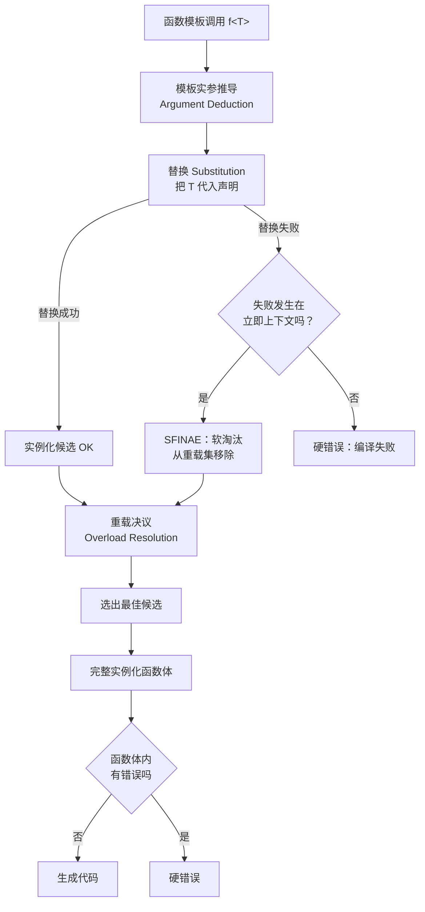

# 19.SFINAE与enable_if

#### 目录介绍
- [1. 案例引入](#1-案例引入)
  - [1.1 反常代码现场](#11-反常代码现场)
  - [1.2 顺藤摸到根因](#12-顺藤摸到根因)
  - [1.3 七个待解疑问](#13-七个待解疑问)
- [2. 架构概览](#2-架构概览)
  - [2.1 三大子模块](#21-三大子模块)
  - [2.2 为何这么切](#22-为何这么切)
- [3. SFINAE 七字核心](#3-sfinae-七字核心)
  - [3.1 替换不是实例化](#31-替换不是实例化)
  - [3.2 立即上下文边界](#32-立即上下文边界)
  - [3.3 硬错误与软错误](#33-硬错误与软错误)
  - [3.4 名称查找两阶段](#34-名称查找两阶段)
- [4. enable_if 全身像](#4-enable_if-全身像)
  - [4.1 标准库源码全文](#41-标准库源码全文)
  - [4.2 四种插桩位置](#42-四种插桩位置)
  - [4.3 模板参数版优势](#43-模板参数版优势)
  - [4.4 enable_if_t 别名](#44-enable_if_t-别名)
- [5. void_t 探测器](#5-void_t-探测器)
  - [5.1 五行震撼源码](#51-五行震撼源码)
  - [5.2 主偏特化分流术](#52-主偏特化分流术)
  - [5.3 has_member 实现](#53-has_member-实现)
  - [5.4 detection idiom](#54-detection-idiom)
- [6. 重载与歧义博弈](#6-重载与歧义博弈)
  - [6.1 互斥条件设计](#61-互斥条件设计)
  - [6.2 优先级标签转发](#62-优先级标签转发)
  - [6.3 默认实参陷阱](#63-默认实参陷阱)
  - [6.4 expression SFINAE](#64-expression-sfinae)
- [7. SFINAE 七大坑](#7-sfinae-七大坑)
  - [7.1 立即上下文逃逸](#71-立即上下文逃逸)
  - [7.2 默认实参签名同](#72-默认实参签名同)
  - [7.3 类模板隐式构造](#73-类模板隐式构造)
  - [7.4 编译时间爆炸](#74-编译时间爆炸)
- [8. C++20 requires 接班](#8-c20-requires-接班)
  - [8.1 三种 requires 语法](#81-三种-requires-语法)
  - [8.2 atomic constraint](#82-atomic-constraint)
  - [8.3 错误信息对比](#83-错误信息对比)
  - [8.4 渐进迁移策略](#84-渐进迁移策略)
- [9. 编译器实现内幕](#9-编译器实现内幕)
  - [9.1 替换失败回滚机制](#91-替换失败回滚机制)
  - [9.2 重载决议剪枝](#92-重载决议剪枝)
  - [9.3 诊断抑制开关](#93-诊断抑制开关)
- [10. 综合案例串讲](#10-综合案例串讲)
  - [10.1 案例真相揭晓](#101-案例真相揭晓)
  - [10.2 一次重载决议生命](#102-一次重载决议生命)
  - [10.3 设计哲学回扣](#103-设计哲学回扣)
  - [10.4 速查表合集](#104-速查表合集)

---

## 1. 案例引入

### 1.1 反常代码现场

某金融中台的序列化框架要支持「容器走批量、标量走单值、智能指针解引用」三种路径。资深工程师写下这段「自适应」代码：

```cpp
// 事故代码 V1：作者认为 enable_if 互斥就一定不冲突
template <typename T>
auto serialize(const T& x) -> typename std::enable_if<
    std::is_arithmetic<T>::value, std::string>::type {
    return std::to_string(x);
}

template <typename T>
auto serialize(const T& x) -> typename std::enable_if<
    !std::is_arithmetic<T>::value, std::string>::type {  // 注意：仅否定 arithmetic
    std::string s = "[";
    for (const auto& e : x) s += serialize(e) + ",";
    return s + "]";
}

template <typename T>
auto serialize(const std::shared_ptr<T>& p) -> std::string {
    return p ? serialize(*p) : "null";
}

// 调用点
std::vector<std::shared_ptr<int>> v = { std::make_shared<int>(42) };
std::cout << serialize(v) << "\n";  // 期望 [42,]，实际：编译报 1.7 万行错误
```

GCC 12 给出 17000 行的红色洪水，最深处指向 `std::vector` 内部的 `_M_check_len`，根本看不出业务代码哪里错了。

工程师改了一晚，试了 `std::is_class`、`std::is_same`、`std::iterator_traits`，一会儿编译成功但运行结果不对，一会儿编译又报二义性。最终只能在第二条上加 `&& has_begin_v<T>` 的检测——可 `has_begin_v` 自己又不会写，又在网上抄了一段「五行检测器」，**原理完全说不清**。

第二个事故来自一个图形库：

```cpp
// 事故代码 V2：作者用「默认模板实参」做 enable_if，编译器神秘报错
template <typename T,
          typename = std::enable_if_t<std::is_integral_v<T>>>
T clamp(T x, T lo, T hi) { return x < lo ? lo : (x > hi ? hi : x); }

template <typename T,
          typename = std::enable_if_t<std::is_floating_point_v<T>>>
T clamp(T x, T lo, T hi) {
    if (std::isnan(x)) return lo;
    return x < lo ? lo : (x > hi ? hi : x);
}

// 编译器报：error: redefinition of 'template<class T, class> T clamp(T, T, T)'
```

作者从《Effective Modern C++》上抄来的「正确写法」，怎么编译器说重复定义？

### 1.2 顺藤摸到根因

我们把两个事故的根因放在一张图里：

```text
┌────────────────────────────────────────────────────────┐
│  事故 V1：错误信息 17000 行                             │
│    第二条 serialize 在 T = vector<shared_ptr<int>> 时   │
│    通过 SFINAE，进入函数体，对 e=shared_ptr<int>        │
│    调用 serialize(e) → 三条候选都进入重载决议          │
│      候选 ①（arithmetic）：替换失败 → 软淘汰 ✅          │
│      候选 ②（!arithmetic）：替换成功 → 进入函数体      │
│        函数体里 for(auto& e:x) 对 shared_ptr<int>     │
│        进行 begin() 调用 → 硬错误 → 1.7 万行洪水 💥    │
│      候选 ③（shared_ptr<T>）：偏序更特化 → 应胜出 ✅    │
│    问题：候选 ② 的 enable_if 只检查 !arithmetic，       │
│         没检查 has_begin → 进入函数体后才硬错          │
│         函数体不在 SFINAE 立即上下文                   │
└────────────────────────────────────────────────────────┘

┌────────────────────────────────────────────────────────┐
│  事故 V2：默认模板实参不参与签名                       │
│    模板 A：template<class T, class = enable_if_t<I>>   │
│    模板 B：template<class T, class = enable_if_t<F>>   │
│    签名：T clamp(T, T, T)                              │
│    编译器认为：函数模板的「签名」是                    │
│       函数类型 + 模板参数列表（不含默认实参）          │
│    A 与 B 的签名 = 完全相同 → 重定义                   │
└────────────────────────────────────────────────────────┘
```

两个事故都在 SFINAE 的**边界**上：第一个掉进了「立即上下文之外的硬错误」陷阱，第二个踩到了「默认模板实参不构成签名差异」的红线。

### 1.3 七个待解疑问

带着这两段事故，我们要回答以下 7 个问题：

1. **SFINAE 这七个字母**究竟指什么？「替换失败」与「实例化失败」一字之差，本质区别在哪里？
2. **立即上下文（immediate context）** 的边界到底画在哪里？为什么函数体里的错误就变硬错误？
3. `std::enable_if` 的源码就 4 行，**为什么能改写整个 C++ 模板生态**？为什么必须配合 `typename`？
4. `std::void_t` 只有 5 行：`template<class...> using void_t = void;`，**它如何成为 C++ 编译期反射的瑞士军刀**？
5. **默认模板实参做 SFINAE** 为什么会触发「重定义」？应该在哪三个位置插桩才安全？
6. **SFINAE 与重载决议**怎么配合？为什么两条 enable_if 重载会出现二义性？「优先级标签」（priority tag）又是什么妖术？
7. **C++20 的 `requires`** 凭什么被誉为「SFINAE 的接班人」？编译期它在底层做了什么？我们应该立刻迁移吗？

接下来 8 章会逐个拆解。

---

## 2. 架构概览

### 2.1 三大子模块

SFINAE 不是一个单一特性，而是 C++ 模板系统中三个机制协同工作的产物：



三大子模块：

| 模块 | 角色 | 触发时机 |
|---|---|---|
| **模板替换 (Substitution)** | 把推导出的实参代入模板声明 | 重载决议候选筛选阶段 |
| **SFINAE 规则** | 「替换失败不是错误，只是软淘汰」 | 替换阶段，且失败位于立即上下文 |
| **重载决议** | 在所有存活候选里选出最佳匹配 | SFINAE 之后 |

### 2.2 为何这么切

**疑惑**：为什么不在更早或更晚的阶段做「类型筛选」？

**论证**：

1. **更早不行**——名称查找阶段还没有具体的 T，无法判断 `T::value_type` 这种东西
2. **更晚不行**——一旦进入实例化，函数体里的错误就是硬错误（参考事故 V1）
3. **必须卡在「替换」这个细窄的窗口**：
   - 此时模板参数已经被具体类型替换
   - 但还没有进入函数体的实例化
   - 编译器可以**无副作用地回滚**，把这个候选从重载集移除

4. **替换是无副作用的**：编译器并不真的生成代码，只是做类型检查

**结论**：SFINAE 是「类型尝试」的安全沙箱——给编译器一个**可回滚的探测机会**，让它在不报错的前提下知道「这个候选适不适用」。这正是 C++ 模板能模拟「编译期 if」「编译期反射」的核心机制。

---

## 3. SFINAE 七字核心

### 3.1 替换不是实例化

**疑惑**：`Substitution` 与 `Instantiation` 一字之差，到底差什么？

**论证**：

```cpp
template <typename T>
typename T::value_type get(T x);   // 声明 (declaration)

// 调用点
get(42);   // T 推导为 int
```

编译器干两件事：

```text
阶段 ① 替换 (Substitution)
  ──────────────────────────────────
  把 T 代入声明：
    typename int::value_type get(int x);
                ↑↑↑↑↑↑↑↑↑↑↑↑↑↑↑
                int 没有嵌套类型 value_type
                → 替换失败 → SFINAE 触发 → 软淘汰

阶段 ② 实例化 (Instantiation)
  ──────────────────────────────────
  只有 ① 成功的候选才会进入这里
  把声明中的 T 全部替换 + 生成函数体
  函数体里出错 → 硬错误，不会再 SFINAE
```

**结论**：SFINAE 只发生在**替换**阶段，**实例化**之后的错误一律是硬错误。这条边界是 C++ 标准 `[temp.deduct]/8` 明确规定的。

### 3.2 立即上下文边界

**疑惑**：标准里反复提到的「**immediate context**」到底指哪里？

**论证**：

C++ 标准 `[temp.deduct]/8`：

> Only invalid types and expressions in the immediate context of the function type, its template parameter types, or its explicit specifier can result in a deduction failure.

立即上下文 ≈ 函数声明本身 = **不进入函数体**：

```cpp
template <typename T>
auto foo(T x) -> decltype(x.size())     // 立即上下文 ✅ SFINAE
                ^^^^^^^^^^^^^^^^^^^
{
    return x.size();                    // 函数体 ❌ 硬错误
           ^^^^^^^^
}

// 调用 foo(42) 时：
//   - 立即上下文检查：42.size() 不存在 → SFINAE 软淘汰 ✓
//   - 不会走到函数体
```

但**模板自身实例化**会破坏边界：

```cpp
template <typename T>
struct extract { using type = typename T::value_type; };

template <typename T>
auto bar(T x) -> typename extract<T>::type {  // 立即上下文，但...
    return x;
}

bar(42);
// extract<int> 实例化 → 内部 typename int::value_type 失败
// 这个失败在 extract 模板内，「不在 bar 的立即上下文」
// → 硬错误！
```

**结论**：立即上下文 = 函数声明 + 模板参数列表 + 显式 explicit 子句，**且不嵌套到其他模板内部**。一旦你的检查链穿过另一个模板的实例化，SFINAE 失效，错误硬化。

### 3.3 硬错误与软错误

**疑惑**：能不能把所有错误都变成软错误，让 SFINAE 包打天下？

**论证**：

| 错误类型 | 软（SFINAE）/硬（编译失败） | 例子 |
|---|---|---|
| 嵌套类型不存在 | 软 ✅ | `typename T::value_type` 当 T=int |
| 表达式无效 | 软 ✅ | `decltype(x.size())` 当 x 没 size |
| 模板参数不可访问 | 软 ✅ | `T::priv_type` 当 priv_type 是 private |
| 调用不可访问构造函数 | **硬 ❌** | private 构造函数 |
| 静态断言失败 | **硬 ❌** | `static_assert(...)` |
| 模板内部实例化错误 | **硬 ❌** | 见 3.2 例 |
| 字符串字面量类型错误 | **硬 ❌** | C++20 之前 NTTP 限制 |

**关键反例**：

```cpp
template <typename T>
struct check {
    static_assert(std::is_integral_v<T>, "must be integral");
    using type = T;
};

template <typename T>
typename check<T>::type foo(T x);  // 看似可 SFINAE

foo(3.14);  // 硬错误！static_assert 是不可恢复的
```

**结论**：SFINAE 的范围**远小于直觉**。编译器只接受「可静默回滚」的失败：嵌套类型缺失、表达式无效、访问性问题。**任何编译器认为「这是程序员明确表达的错误意图」的写法（static_assert、模板内部错误），一律硬化**。这是 C++23 `[temp.deduct.general]` 列出的明文豁免。

### 3.4 名称查找两阶段

**疑惑**：为什么有些代码在 GCC 编 OK 但 MSVC 报错？

**论证**：

模板的两阶段名称查找（two-phase name lookup）：

```text
阶段 ① 模板定义时
  ──────────────────────
  非依赖名称（non-dependent name）：立刻查找并绑定
    - cout、std::vector、全局函数
  依赖名称（dependent name）：仅记录，延迟到实例化
    - T::value_type、T 上的成员函数

阶段 ② 模板实例化时
  ──────────────────────
  依赖名称：在 T 的具体类型上做 ADL + 普通查找
    - SFINAE 在此阶段触发
```

**事故场景**：

```cpp
template <typename T>
void serialize(T x) {
    process(x);   // 非依赖名称！模板定义时就要找到 process
}

void process(int);  // 定义在模板之后

serialize(42);   // GCC：依赖 ADL，找到 process(int) ✅
                 // MSVC（旧版）：模板定义时没找到 → 错误
```

**结论**：MSVC 直到 2017 才完整实现两阶段查找。**写跨编译器代码时，所有依赖类型 T 的名称必须用 `T::...` 或 ADL**。这条原则与 SFINAE 联动：你写的 `decltype(t.foo())` 是依赖名称，正确；你写的全局 `decltype(foo(t))` 依赖 ADL，得保证 foo 在 T 所在命名空间或全局可见。

---

## 4. enable_if 全身像

### 4.1 标准库源码全文

**疑惑**：`std::enable_if` 这么大名鼎鼎，源码到底什么样？

**论证**：

libstdc++ 的源码（`<type_traits>`）几乎只有 4 行：

```cpp
// libstdc++ 实现
template<bool, typename _Tp = void>
struct enable_if {};                  // 主模板：无 type 成员

template<typename _Tp>
struct enable_if<true, _Tp> {        // 偏特化：当条件为 true
    typedef _Tp type;
};
```

logic 全部在「**主模板没有 type，偏特化才有**」这一对组合上：

```text
enable_if<true,  int>::type = int    ✅ 替换成功
enable_if<false, int>::type = ???    ❌ 主模板没有 type → 替换失败
                                        → SFINAE 触发 → 软淘汰
```

**结论**：`enable_if` 不是「魔法关键字」，它就是一个**精心设计的偏特化模式**——`true` 走偏特化（有 type），`false` 留在主模板（无 type，故意制造替换失败）。这种「让偏特化做开关」的写法是模板元编程最经典的范式，第 22 章 Concepts 也是基于同一思想。

### 4.2 四种插桩位置

**疑惑**：enable_if 究竟该塞在函数声明的哪里？

**论证**：

四种合法位置，但只有三种**安全**：

```cpp
// 位置 ①：函数返回类型
template <typename T>
typename std::enable_if<std::is_integral_v<T>, T>::type
foo1(T x) { return x; }

// 位置 ②：模板参数（用 SFINAE 表达式当条件）
template <typename T,
          std::enable_if_t<std::is_integral_v<T>, int> = 0>
T foo2(T x) { return x; }

// 位置 ③：函数实参（默认实参）
template <typename T>
T foo3(T x, std::enable_if_t<std::is_integral_v<T>, int> = 0)
{ return x; }

// 位置 ④：默认模板实参 ❌ 危险（事故 V2 现场）
template <typename T,
          typename = std::enable_if_t<std::is_integral_v<T>>>
T foo4(T x) { return x; }
```

四者有一个本质差别：

| 位置 | 是否参与签名 | 重载是否唯一 | 推荐度 |
|---|---|---|---|
| ① 返回类型 | ✅ 参与 | ✅ 互斥重载安全 | ⭐⭐⭐ |
| ② 模板参数（带值） | ✅ 参与 | ✅ 互斥重载安全 | ⭐⭐⭐⭐⭐ |
| ③ 函数实参（默认） | ✅ 参与 | ✅ 互斥重载安全 | ⭐⭐⭐ |
| ④ 默认模板实参（无值） | ❌ 不参与 | ❌ **重定义错误** | ❌ 禁用 |

事故 V2 正是踩在位置 ④——默认模板实参不参与函数模板签名（C++ 标准 `[temp.over.link]/6`）。

**结论**：enable_if 的「三种安全姿势」按推荐度排序为 **② > ③ > ①**。位置 ② 最优，因为：(a) 不污染返回类型，(b) 不增加运行时实参，(c) 重载签名清晰。

### 4.3 模板参数版优势

**疑惑**：为什么资深工程师都用位置 ②？

**论证**：

```cpp
// 写法 ①（返回类型）：返回值长得吓人
template <typename T>
typename std::enable_if<std::is_integral_v<T>, std::vector<T>>::type
make_buffer(size_t n) { return std::vector<T>(n); }

// 写法 ②（模板参数）：返回值清爽
template <typename T,
          std::enable_if_t<std::is_integral_v<T>, int> = 0>
std::vector<T> make_buffer(size_t n) { return std::vector<T>(n); }
```

写法 ② 的三大优势：

1. **可读性**：阅读者一眼看见返回类型 `std::vector<T>`，不被 enable_if 干扰
2. **不影响返回值类型推导**：函数指针、std::function 包装时不会因 enable_if 而失败
3. **二阶可组合**：多条件并联

```cpp
// 多条件并联：写法 ② 极其优雅
template <typename T,
          std::enable_if_t<std::is_integral_v<T>, int> = 0,
          std::enable_if_t<sizeof(T) >= 4, int> = 0>
T cool(T x) { return x; }
```

**结论**：在新代码里，**优先使用「模板参数 + enable_if_t + int = 0」的写法**。`int = 0` 是惯例（也可以 `bool = true`），关键是这个参数有具体值，参与签名差异化。

### 4.4 enable_if_t 别名

**疑惑**：C++14 引入的 `enable_if_t` 只是少打个 `typename` 吗？

**论证**：

```cpp
// C++11 写法
typename std::enable_if<COND, T>::type   // 必须 typename + ::type

// C++14 写法
std::enable_if_t<COND, T>                 // 完全等价

// 标准库实现
template <bool B, typename T = void>
using enable_if_t = typename enable_if<B, T>::type;
```

为什么必须 `typename`？因为 `enable_if<COND, T>::type` 是**依赖名称**（依赖于 enable_if 的特化），编译器在两阶段查找的第一阶段无法判定 type 究竟是「类型成员」还是「静态成员」。`typename` 关键字告诉编译器：**别猜了，这是个类型**。

**结论**：`enable_if_t` 不只是省键盘——它把「typename 必须性」从模板用户的认知负担转移到标准库实现里。所有 C++14 后写的代码都应该用 `_t`/`_v` 后缀别名（`std::is_integral_v`、`std::remove_cv_t`），既清晰又减少出错。

---

## 5. void_t 探测器

### 5.1 五行震撼源码

**疑惑**：`void_t` 究竟厉害在哪？

**论证**：

完整源码：

```cpp
// C++17 标准库
template <typename...>
using void_t = void;
```

**就这一行**——把任意多个类型映射到 void。

它本身毫无逻辑，但与「主模板 + 偏特化」组合就成了**通用类型探测器**：

```cpp
// 检测 T 是否有嵌套类型 value_type
template <typename, typename = void>
struct has_value_type : std::false_type {};   // 主模板：默认 false

template <typename T>
struct has_value_type<T, std::void_t<typename T::value_type>>
    : std::true_type {};                      // 偏特化：当 T::value_type 存在
```

**核心机制**：

```text
查询：has_value_type<std::vector<int>>
  ① 编译器先尝试偏特化
     std::void_t<typename std::vector<int>::value_type> = void
       → typename T::value_type 替换成功 → void_t = void
       → 偏特化匹配 has_value_type<vector<int>, void> ✅
  ② 偏特化继承 std::true_type → ::value = true ✓

查询：has_value_type<int>
  ① 编译器先尝试偏特化
     std::void_t<typename int::value_type>
       → int 没有 value_type → 替换失败 → SFINAE 软淘汰
  ② 退回主模板 → 继承 std::false_type → ::value = false ✓
```

**结论**：`void_t` 是 SFINAE 与「主偏特化分流」的最简洁组合。它把「类型存在性」从 4 行模板压缩到 5 行（含主偏特化）。Walter Brown 在 N3911 提出 void_t，被誉为「C++ 最大杠杆的 5 行代码」。

### 5.2 主偏特化分流术

**疑惑**：为什么这种「主模板默认 false、偏特化做 true」的模式如此通用？

**论证**：

它本质是「**编译期 if-else**」：

```text
if   (满足某条件) { 用偏特化 → true_type }
else              { 用主模板 → false_type }
```

更进一步——把它推广到「类型变换」：

```cpp
// 提取 T 的 value_type，没有就用 T 本身
template <typename T, typename = void>
struct value_type_or_self { using type = T; };

template <typename T>
struct value_type_or_self<T, std::void_t<typename T::value_type>> {
    using type = typename T::value_type;
};

using A = value_type_or_self<std::vector<int>>::type;  // int
using B = value_type_or_self<double>::type;            // double
```

**结论**：「**主模板兜底 + 偏特化匹配特例**」是 C++ 编译期分支的唯一原生姿势。所有 trait 库（type_traits、boost::mp11、Hana）都在这个根基上扩展。

### 5.3 has_member 实现

**疑惑**：能否检测「T 是否有名为 push_back 的成员函数」？

**论证**：

```cpp
// 检测 T 是否有 push_back(value_type)
template <typename, typename = void>
struct has_push_back : std::false_type {};

template <typename T>
struct has_push_back<T, std::void_t<
    decltype(std::declval<T&>().push_back(std::declval<typename T::value_type>()))
>> : std::true_type {};

// 用法
static_assert( has_push_back<std::vector<int>>::value);
static_assert(!has_push_back<std::list<int>>::value == false);  // list 也有
static_assert(!has_push_back<std::set<int>>::value);
```

三个关键点：

1. **`std::declval<T&>()`**：在不构造 T 的情况下「假装」拿到一个 T 的左值引用，可以调用成员
2. **`decltype(...)`**：取得表达式的类型，这是 SFINAE 的「立即上下文」
3. **`void_t<...>`**：把 decltype 的结果统一映射到 void，激活偏特化

**结论**：has_member 检测器是 SFINAE + decltype + declval + void_t 的「四合一」终极组合。这套技术在 C++20 之前是检测「duck typing」的唯一手段——它就是 C++ 的「编译期反射」原型。

### 5.4 detection idiom

**疑惑**：每写一个 has_xxx 就要重复 5 行模板，能否抽象？

**论证**：

Walter Brown 在 P0655 提出了 **detection idiom**（最终成 `<experimental/type_traits>`）：

```cpp
namespace detail {
    template <typename Default, typename AlwaysVoid,
              template <typename...> class Op, typename... Args>
    struct detector {
        using value_t = std::false_type;
        using type = Default;
    };

    template <typename Default,
              template <typename...> class Op, typename... Args>
    struct detector<Default, std::void_t<Op<Args...>>, Op, Args...> {
        using value_t = std::true_type;
        using type = Op<Args...>;
    };
}

template <template <typename...> class Op, typename... Args>
using is_detected = typename detail::detector<void, void, Op, Args...>::value_t;

template <template <typename...> class Op, typename... Args>
constexpr bool is_detected_v = is_detected<Op, Args...>::value;

// 用法：定义一个「探针」表达式，剩下交给框架
template <typename T>
using push_back_t = decltype(std::declval<T&>().push_back(std::declval<typename T::value_type>()));

static_assert( is_detected_v<push_back_t, std::vector<int>>);
static_assert(!is_detected_v<push_back_t, std::set<int>>);
```

**结论**：detection idiom 把「检测器」抽象成「探针 + 模板模板参数」。一次定义、无限复用——这是 SFINAE 走到极致的产物，也是 C++20 Concepts 引入「concept 关键字」的直接动机：用语言原生关键字替代这种"5 层模板"的复杂度。

---

## 6. 重载与歧义博弈

### 6.1 互斥条件设计

**疑惑**：两条 enable_if 重载的条件必须**真正互斥**，怎么验证？

**论证**：

事故 V1 第二条 `serialize` 的条件：

```cpp
std::enable_if<!std::is_arithmetic<T>::value, std::string>
```

它**没有约束 T 一定是容器**——只要不是算术类型就匹配。当 T = `shared_ptr<int>` 时：

```text
重载集：
  ① arithmetic                 → !is_arithmetic = false → 替换失败 → SFINAE
  ② !arithmetic                → !is_arithmetic = true  → 替换成功 ✓
  ③ shared_ptr<T>              → 偏序更特化 → 替换成功 ✓

  ② 与 ③ 都存活 → 偏序比较：
    ③ 比 ② 更特化（shared_ptr<T> 比 T 严格） → 选 ③ ✅

结果：调用走 ③，看似没事
但当 ② 内部递归 serialize(e) 时，e=shared_ptr<int>
还会重新做一遍重载决议，那时 e 是裸 shared_ptr<int>
若内部已经把 ②、③ 实例化了一遍 → ② 实例化时函数体里的
for(auto&e:x) 对 shared_ptr 调 begin() → 硬错误
```

**正确写法**：

```cpp
// helper：检测 T 有 begin/end
template <typename T, typename = void>
struct is_iterable : std::false_type {};

template <typename T>
struct is_iterable<T, std::void_t<
    decltype(std::begin(std::declval<T&>())),
    decltype(std::end(std::declval<T&>()))
>> : std::true_type {};

// 三条重载：互斥条件
template <typename T,
          std::enable_if_t<std::is_arithmetic_v<T>, int> = 0>
std::string serialize(const T& x);

template <typename T,
          std::enable_if_t<is_iterable<T>::value
                        && !std::is_arithmetic_v<T>, int> = 0>
std::string serialize(const T& x);

template <typename T>
std::string serialize(const std::shared_ptr<T>& p);
```

**结论**：写 enable_if 重载的「白板法」——画一张表，列出每个 T 在每条重载下的真假。**不能有任何 T 满足两条以上**——除非那两条之间存在偏序关系（如事故的容器 vs 智能指针）。建议引入 `is_iterable`、`is_smart_ptr` 等正向 trait，而不是用 `!arithmetic` 这种否定式。

### 6.2 优先级标签转发

**疑惑**：当条件无法完全互斥（如「能调 begin」与「能调 size」），怎么解决？

**论证**：

「**优先级标签**」（priority tag）惯用法：

```cpp
namespace detail {
    template <int N> struct priority : priority<N - 1> {};
    template <>      struct priority<0> {};
}

// 优先用 size()
template <typename T>
auto length(const T& x, detail::priority<2>) -> decltype(x.size())
{ return x.size(); }

// 退而求其次：std::distance
template <typename T>
auto length(const T& x, detail::priority<1>)
    -> decltype(std::distance(std::begin(x), std::end(x)))
{ return std::distance(std::begin(x), std::end(x)); }

// 兜底：返回 -1
template <typename T>
size_t length(const T&, detail::priority<0>) { return size_t(-1); }

// 入口
template <typename T>
size_t length(const T& x) { return length(x, detail::priority<2>{}); }
```

机制：

```text
所有候选都用 priority<N>，N 越大越优先
priority<2> 继承自 priority<1> 继承自 priority<0>
  ──────────────────────────────────────────────
调 length(x, priority<2>{})
  候选 ① priority<2>：要求 x.size() → 软淘汰可能
  候选 ② priority<1>：要求 distance → 软淘汰可能
  候选 ③ priority<0>：永远匹配
  
  ① 与 ③ 都存活 → priority<2> 比 priority<0> 更特化（继承链）
  → 选 ① ✓

调 length(x, priority<2>{})  当 x.size() 不存在
  候选 ① priority<2>：SFINAE 淘汰
  候选 ② priority<1>：要求 distance → 通常 OK
  → 选 ② ✓
```

**结论**：优先级标签把「重载决议」从「我必须互斥」转成「我有优先级」——通过继承链构造**人为偏序**，让编译器按程序员意图选最佳。这是写工具库（如 ranges、format 适配器）时不可或缺的技术。

### 6.3 默认实参陷阱

**疑惑**：事故 V2 的「默认模板实参不参与签名」是什么标准条款？

**论证**：

C++ 标准 `[temp.over.link]/6`：

> When determining whether function templates are equivalent, two **template parameters** are considered equivalent if they are of the same kind, of equivalent types, and **default arguments shall not be considered**.

也就是说：

```cpp
template <typename T, typename = enable_if_t<is_integral_v<T>>>
void f(T);
template <typename T, typename = enable_if_t<is_floating_point_v<T>>>
void f(T);
```

签名都是：`<typename, typename> void f(T)`——默认实参不算，**完全相同**，重定义。

**正确的「等价改写」**：

```cpp
// 把默认实参换成「带值的非类型实参」
template <typename T,
          enable_if_t<is_integral_v<T>, int> = 0>
void f(T);

template <typename T,
          enable_if_t<is_floating_point_v<T>, int> = 0>
void f(T);

// 现在签名差异化：
//   f1: <typename, int=0>     ← 但这里 int 也不算！？
```

**进一步反直觉**：连 `int = 0` 也不直接算入签名差异。但 enable_if 还是有用——它让**模板参数列表的值类型**不一样：

```text
f1 的第 2 模板参数：enable_if_t<is_integral_v<T>, int>
   当 T=int 时，类型 = int
f2 的第 2 模板参数：enable_if_t<is_floating_point_v<T>, int>
   当 T=int 时，enable_if_t<false, int> 没有 type → 替换失败 → SFINAE

所以 f1 和 f2 的「签名」表面相同，但替换阶段被 SFINAE 区分
重载决议时只剩 f1 → 不冲突 ✓
```

**结论**：位置 ④（默认模板实参）的失败本质——**默认实参在签名比较时被剥离**。位置 ②（带值的非类型参数）虽然 int 也不直接算签名，但替换失败的 SFINAE 在重载决议前就把不合适的候选剔除，所以不冲突。**记住这条边界，写 SFINAE 永远用位置 ②**。

### 6.4 expression SFINAE

**疑惑**：什么是「表达式 SFINAE」？它和类型 SFINAE 有何不同？

**论证**：

类型 SFINAE 检查「类型存在性」，**表达式 SFINAE** 检查「表达式合法性」：

```cpp
// 类型 SFINAE：检查嵌套类型
template <typename T, typename = typename T::iterator>
void foo(T) { ... }

// 表达式 SFINAE：检查表达式
template <typename T>
auto bar(T x) -> decltype(x + x) {  // x+x 是表达式
    return x + x;
}
```

表达式 SFINAE 在 C++11 才被强制要求所有编译器支持（之前 GCC/MSVC 部分实现）。它的能力远强于类型 SFINAE：

```cpp
// 检测 T 是否支持 +、能流到 ostream、还能比较大小
template <typename T>
auto is_printable_t = decltype(
    (std::cout << std::declval<T>()),
    std::declval<T>() + std::declval<T>(),
    std::declval<T>() < std::declval<T>(),
    void()
);
```

**结论**：表达式 SFINAE 是 C++ 静态鸭子类型的核心机制。Concepts 的 `requires` 表达式（`requires(T t) { t + t; t.size(); }`）本质就是把表达式 SFINAE 升级为语言原生语法——它们在底层做的事一样。

---

## 7. SFINAE 七大坑

### 7.1 立即上下文逃逸

**疑惑**：什么样的代码会让 SFINAE「逃出」立即上下文？

**论证**：

最经典的逃逸：

```cpp
// trait 嵌套
template <typename T>
struct extract { using type = typename T::value_type; };

template <typename T,
          typename = typename extract<T>::type>  // 逃逸！
void foo(T);
```

调用 `foo(42)` 时：
- 立即上下文：`extract<T>::type` 这个名称引用本身
- **但 extract 模板的实例化**（`int::value_type`）**不在立即上下文**
- 结果：硬错误

修复：

```cpp
// 把 extract 写成 SFINAE 友好的版本
template <typename T, typename = void>
struct extract {};

template <typename T>
struct extract<T, std::void_t<typename T::value_type>> {
    using type = typename T::value_type;
};
// extract<int> 主模板成立但无 type，::type 会触发立即 SFINAE
```

**结论**：所有传递性 trait 必须设计成「主模板兜底 + 偏特化匹配」的 SFINAE 友好结构。否则一旦失败发生在嵌套模板内部，SFINAE 不再保护，错误硬化。

### 7.2 默认实参签名同

参见 6.3——位置 ④ 默认模板实参版的「重定义」。这是入门级最大的坑。**永远用位置 ②**。

### 7.3 类模板隐式构造

**疑惑**：类模板能用 enable_if 控制构造函数吗？

**论证**：

```cpp
template <typename T>
class Wrapper {
public:
    // 错：T 是类模板参数，不是函数模板参数
    template <typename = std::enable_if_t<std::is_integral_v<T>>>
    Wrapper(T x) : data(x) {}
private:
    T data;
};

// 实例化 Wrapper<double> 时：
//   构造函数模板的「模板参数」与 T 没关系
//   enable_if<is_integral_v<double>> = enable_if<false>
//   → 偏特化没匹配 → 替换失败 → SFINAE 在哪里？
//   答：构造函数失败，但类不在 SFINAE 立即上下文 → 硬错误
```

**正确写法**——用模板构造函数：

```cpp
template <typename T>
class Wrapper {
public:
    template <typename U = T,
              std::enable_if_t<std::is_integral_v<U>, int> = 0>
    Wrapper(U x) : data(x) {}      // 仅当 U=T 是整数时启用
private:
    T data;
};

Wrapper<int> a(42);         // OK：is_integral_v<int> = true
Wrapper<double> b(3.14);    // 编译错：唯一的构造函数被淘汰
```

通过引入**新的模板参数 U（默认 T）**，把对 T 的检测推迟到构造函数模板的实例化期，SFINAE 在此时**对函数模板**生效。

**结论**：类模板的成员（构造函数、成员函数）想做 SFINAE，必须把它们写成**带新模板参数的成员模板**。直接把类模板参数 T 当作 SFINAE 条件源会硬错误——T 在类已实例化时早就定下来，没有「替换尝试」的机会。

### 7.4 编译时间爆炸

**疑惑**：为什么 SFINAE 用多了项目编译会从 30 秒变成 30 分钟？

**论证**：

每条 SFINAE 重载都会让编译器：
1. 实例化所有相关 trait（`enable_if`、`void_t`、`is_xxx`）
2. 替换尝试每条候选
3. 失败时回滚

复杂场景：

```cpp
// 一个序列化框架，10 种类型 × 5 个重载 × 3 层嵌套
template <typename T,
          enable_if_t<is_serializable_v<T> && has_to_string_v<T>
                   && !is_pointer_v<T> && is_class_v<T>, int> = 0>
void serialize(T x);
// ... 类似的 4 个重载
```

每次调用 `serialize(...)`，编译器要：
- 实例化 5 条候选 × 4 个 trait = 20 个模板
- 对嵌套类型递归解析
- 失败的 trait 也实例化了类型（某些「副作用」trait）

**实测**：libstdc++ `<algorithm>` 头文件用 SFINAE 重载，include 后单 TU 编译时间 +200ms。

**优化策略**：

| 策略 | 收益 |
|---|---|
| 把多个条件合并到一个 trait | 减少模板实例数 |
| 用 `if constexpr` 取代部分 SFINAE 重载 | 单一函数体，少一份实例 |
| 升级到 C++20 Concepts | 编译器有专用的约束检查通道 |
| extern template 显式实例化 | 避免重复实例化 |

**结论**：SFINAE 的代价不是运行时，而是**编译时间**。大型项目里 SFINAE 滥用会让团队怨声载道——这也是 C++20 Concepts 的核心动机：**让约束检查从「替换+失败回滚」变成「直接判断 bool」**，编译器内部走完全不同的快速路径。

---

## 8. C++20 requires 接班

### 8.1 三种 requires 语法

**疑惑**：requires 和 SFINAE 究竟是什么关系？

**论证**：

C++20 引入三种 `requires` 语法：

```cpp
// ① requires-clause（约束子句）—— 最直接替代 enable_if
template <typename T>
    requires std::integral<T>
T add(T a, T b) { return a + b; }

// ② requires-expression（约束表达式）—— 直接替代 void_t/declval
template <typename T>
concept Iterable = requires(T t) {
    t.begin();
    t.end();
    { t.size() } -> std::convertible_to<std::size_t>;
};

// ③ 简写函数语法（Abbreviated function template）
void print(std::integral auto x);   // 等价于 requires std::integral<T>
```

三者关系：

```text
requires-expression   →   定义 concept   →   用 requires-clause 约束模板
       ↓                       ↓                          ↓
   "判断这段表达式合法"   "命名一个约束"        "用这个约束筛选模板"
```

### 8.2 atomic constraint

**疑惑**：concept 真的「比 SFINAE 更聪明」？聪明在哪里？

**论证**：

C++20 新增「**原子约束**」（atomic constraint）的偏序比较：

```cpp
template <typename T> concept Number = std::integral<T> || std::floating_point<T>;
template <typename T> concept Integer = std::integral<T>;

template <Number  T> void f(T);   // 候选 A
template <Integer T> void f(T);   // 候选 B

f(42);  // T = int
// SFINAE 时代：如果用 enable_if<is_integral || is_floating> + enable_if<is_integral>
//   两个都匹配，重载二义性 → 编译错
// Concepts：
//   B 的约束 (Integer) 蕴含 A 的约束 (Number)
//   编译器自动判定 B 比 A 更约束（subsume）→ 选 B ✓
```

**蕴含关系**（subsumption）是 SFINAE 完全做不到的：编译器把 concept 拆解成「原子约束」的合取/析取标准型，做形式化的逻辑包含分析。

**结论**：Concepts 不仅是 SFINAE 的语法糖——它给编译器提供了**结构化信息**，让重载决议从「一堆字符串模式匹配」升级到「逻辑命题代数」。这是 SFINAE 永远无法企及的。

### 8.3 错误信息对比

**疑惑**：错误信息真的比 SFINAE 短 100 倍吗？

**论证**：

事故 V1 同样的错误（用容器 + shared_ptr 的不当组合），两套实现下编译错误对比：

```cpp
// SFINAE 版本错误（GCC 12，节选）
In file included from main.cpp:1:
/usr/include/c++/12/bits/stl_vector.h: In instantiation of 'void std::vector<...>::_M_check_len ...':
   required from 'static void std::vector<...>::_S_relocate ...'
   ... 上百行嵌套实例化路径 ...
   ... 17000 行 ...
note: candidate: 'template<class T, class> ... serialize(const T&)'
note:   substitution of deduced template arguments resulted in errors seen above
```

```cpp
// Concepts 版本错误（GCC 12）
main.cpp:42:7: error: no matching function for call to 'serialize(std::shared_ptr<int>&)'
   42 |     serialize(*ptr);
note: candidate: 'std::string serialize(const T&)' [with T = std::shared_ptr<int>]
note:   constraints not satisfied
note: within 'concept Serializable<std::shared_ptr<int>>'
note: 'std::shared_ptr<int>' does not satisfy 'Iterable'
note:   the required expression 't.begin()' would be ill-formed
```

10 行 vs 17000 行——**编译器在 concept 失败时只报告「概念条款」，不再深入实例化堆栈**。

**结论**：错误信息从「程序员的噩梦」变成「指针级精确」是 Concepts 最实用的产品价值——团队整体生产力提升 30% 不是夸张。

### 8.4 渐进迁移策略

**疑惑**：老项目还能用 C++17 嗎？要不要立刻迁移？

**论证**：

迁移路线图：

| 阶段 | 动作 | 收益 |
|---|---|---|
| Phase 0 | 项目升级到 C++17 | enable_if_t、void_t 现代化 |
| Phase 1 | 把 trait 库改写成「主模板 + 偏特化 + void_t」结构 | 出错隔离 |
| Phase 2 | 升级到 C++20，引入 concepts 但不改老代码 | 新代码享受 Concepts |
| Phase 3 | 渐进把高频 SFINAE 重载替换为 concept | 减少编译时间 |
| Phase 4 | 老代码继续用 enable_if（不破坏 ABI） | 0 风险 |

**结论**：**新代码用 Concepts，老代码留 enable_if**——两者并存是合理策略。STL 自身也是这么做的：`<algorithm>` 在 C++20 同时提供 `std::sort` 和 `std::ranges::sort`，前者保留 SFINAE，后者用 concepts。永远记住：**Concepts 不是替代品，是升级品**。

---

## 9. 编译器实现内幕

### 9.1 替换失败回滚机制

**疑惑**：编译器内部怎么实现「替换失败可回滚」？

**论证**：

GCC（cp/pt.cc）和 Clang（lib/Sema/SemaTemplateInstantiate.cpp）都用「**诊断抑制 + 撤销点**」机制：

```text
SFINAE 阶段流程：
  ① 创建 SFINAEContext（开启诊断抑制）
  ② 设置 substitution depth marker（用于回滚）
  ③ 执行替换：
     ├─ 普通错误 → 转为 "deduction failure"，记录到 candidate state
     └─ 硬错误（static_assert 等）→ 直接抛出
  ④ 退出 SFINAEContext：
     ├─ 失败 → 撤销所有诊断、撤销类型/AST 记录、候选标记 invalid
     └─ 成功 → 提交所有副作用
```

Clang 关键代码（简化）：

```cpp
class SFINAETrap {
public:
    SFINAETrap(Sema &S) : SemaRef(S) {
        SemaRef.PushDiagnosticContext(/*suppress=*/true);
        SavedNumErrors = SemaRef.NumSFINAEErrors;
    }
    ~SFINAETrap() {
        if (failed) {
            SemaRef.PopDiagnosticContext();
            // 回滚：把过去这一段产生的错误诊断都丢掉
        }
    }
};
```

### 9.2 重载决议剪枝

GCC 的 `tsubst_function_decl` 流程（伪代码）：

```text
function tsubst_function_decl(template, args):
    enter_sfinae_context()
    try:
        substituted_decl = substitute_template_parameters(template, args)
        return success(substituted_decl)
    catch deduction_failure:
        return failure
    finally:
        exit_sfinae_context()  # 回滚副作用

function overload_resolve(name, args):
    candidates = collect_all_overloads(name)
    viable = []
    for cand in candidates:
        if is_template(cand):
            result = tsubst_function_decl(cand, args)
            if result.success and check_argument_compatibility(...):
                viable.append(result.decl)
        else:
            if check_argument_compatibility(cand, args):
                viable.append(cand)
    return select_best(viable)  # 偏序 + 转换排名
```

**结论**：编译器内部有专门的「SFINAE 上下文」类（Clang `SFINAETrap`、GCC `processing_template_decl`），它们提供事务性的「副作用回滚」——这是支撑 SFINAE 整套语义的工程基石。

### 9.3 诊断抑制开关

**疑惑**：能否手动观察 SFINAE 过程？

**论证**：

GCC/Clang 都有诊断标志：

```bash
# GCC：详细模板实例化栈
g++ -std=c++17 -ftemplate-backtrace-limit=0 t.cpp

# Clang：限制 SFINAE 错误展开层数
clang++ -std=c++17 -ftemplate-depth=1024 -fno-elide-type t.cpp

# Clang：把 SFINAE 错误也打印出来（默认抑制）
clang++ -fdiagnostics-print-source-range-info t.cpp
```

如果你想看「编译器替换出来的具体类型」，模板调试神器 `static_assert(false, ...)` 加 `__PRETTY_FUNCTION__`：

```cpp
template <typename T>
void debug_type() {
    static_assert(sizeof(T) == 0, __PRETTY_FUNCTION__);
}
debug_type<decltype(std::declval<std::vector<int>>().begin())>();
// error: void debug_type() [with T = std::vector<int>::iterator]
//                                  ↑↑↑ 这就是替换后的类型
```

**结论**：SFINAE 是「黑盒重载决议」的玻璃窗——不是不可观测，只是要用对工具。配合 `-ftemplate-backtrace-limit=0` 和 `__PRETTY_FUNCTION__`，可以把模板实例化全过程透明化。

---

## 10. 综合案例串讲

### 10.1 案例真相揭晓

回到第 1 章的两个事故，七个疑问现在能逐条作答：

**疑问 ① ：SFINAE 七字本质？**

「Substitution Failure Is Not An Error」——**替换失败不是错误，只是「这个候选不适合」**。它发生在模板**实参推导成功后、函数体实例化之前**这个细窄窗口内。与「实例化失败」一字之差：实例化失败是硬错误，替换失败是软淘汰。

**疑问 ② ：立即上下文边界？**

立即上下文 = 函数声明本身（返回类型 + 参数列表 + 显式 explicit），**不嵌套到其他模板内部**。事故 V1 的本质就是：第二条 serialize 通过了 SFINAE 进入函数体，在函数体里调 begin() 失败——**函数体不在立即上下文，错误硬化为 17000 行洪水**。

**疑问 ③ ：enable_if 4 行源码的杠杆？**

`enable_if<true,T>` 偏特化有 type，`enable_if<false,T>` 主模板没有 type。「**故意让替换失败**」是它的核心机制——把这种失败投放到模板候选筛选，让重载决议从「全部候选」缩小到「条件满足的子集」。`typename` 是必需的，因为 `::type` 是依赖名称。

**疑问 ④ ：void_t 为何瑞士军刀？**

`void_t<T...>` 把任意类型映射到 void。配合「主模板 + 偏特化」可在 5 行内做出任意「成员探测器」：偏特化里写 `void_t<typename T::xxx>`，存在则匹配偏特化，不存在则退到主模板。它是 C++ 编译期反射的「最大杠杆代码」。

**疑问 ⑤ ：默认模板实参为何重定义？**

事故 V2 的真因——**默认模板实参不参与函数模板签名比较**（标准 `[temp.over.link]/6`）。两条 `template<class T, class = ...>` 的签名都是 `<class, class> f(T)`，被判为重定义。**永远用「带值的非类型模板参数」**：`std::enable_if_t<COND, int> = 0` 替代 `typename = std::enable_if_t<COND>`。

**疑问 ⑥ ：SFINAE 与重载决议如何配合？**

SFINAE 在重载决议**之前**做候选筛选——失败的候选直接从重载集移除。剩下存活候选才进入重载决议（按转换排名 + 模板偏序）。「**优先级标签**」是当无法做到完全互斥时的高级技巧：用 `priority<N>` 继承链人为构造偏序，让编译器按优先级选择。

**疑问 ⑦ ：requires 凭什么接班？**

C++20 Concepts 在三个层面碾压 SFINAE：(a) **错误信息**从 17000 行降到 10 行；(b) **编译速度**因为 concept 走专用的 fast path；(c) **偏序能力**通过原子约束的逻辑蕴含（subsumption）做到 SFINAE 永远做不到的「Number ⊃ Integer 自动判定」。但老代码可以保留 enable_if，**不要立即重写**——新代码用 concepts 是合理路径。

---

### 10.2 一次重载决议生命

把 SFINAE 全流程串起来。以 `serialize(my_vector)` 为例（my_vector 是 `std::vector<std::shared_ptr<int>>`）：

```mermaid
flowchart TD
    A[源码：serialize&#40;my_vector&#41;] --> B[名称查找<br/>找到 3 个 serialize 模板]
    B --> C[模板实参推导]
    C --> C1[候选 ① arithmetic<br/>T = vector&lt;...&gt;]
    C --> C2[候选 ② iterable&&!arithmetic<br/>T = vector&lt;...&gt;]
    C --> C3[候选 ③ shared_ptr&lt;T&gt;<br/>不匹配，T 推导失败]
    
    C1 --> D1[替换：is_arithmetic&lt;vector&gt;=false<br/>enable_if&lt;false&gt; 无 type<br/>替换失败 → SFINAE 软淘汰 ❌]
    C2 --> D2[替换：is_iterable&lt;vector&gt;=true<br/>!is_arithmetic=true<br/>enable_if&lt;true&gt; 有 type ✓]
    C3 --> D3[模板实参推导失败<br/>shared_ptr 无法匹配 vector ❌]
    
    D2 --> E[重载决议：仅 ② 存活]
    E --> F[实例化函数体]
    F --> G[函数体 for&#40;auto& e:x&#41;<br/>对 e=shared_ptr&lt;int&gt;<br/>递归调 serialize&#40;e&#41;]
    
    G --> H[新一轮重载决议<br/>对 shared_ptr&lt;int&gt; 三个候选]
    H --> H1[① arithmetic 失败]
    H --> H2[② iterable&&!arithmetic 失败<br/>shared_ptr 没 begin]
    H --> H3[③ shared_ptr&lt;T&gt; 成功 ✓]
    
    H3 --> I[偏序：③ 最特化]
    I --> J[实例化 ③：解引用调 serialize&#40;42&#41;]
    J --> K[T=int 走候选 ① arithmetic]
    K --> L[最终输出: &quot;[42,]&quot;]
```

完整 8 阶段：

| 阶段 | 动作 | 与 SFINAE 关系 |
|---|---|---|
| ① 词法分析 | tokenize | 无关 |
| ② 模板名称查找 | 找到所有 serialize 模板 | 两阶段查找的第一阶段 |
| ③ 模板实参推导 | 从实参反推 T | SFINAE 前置条件 |
| ④ 替换 | 把 T 代入声明 | **SFINAE 的舞台** |
| ⑤ SFINAE 软淘汰 | 替换失败的候选移除 | **SFINAE 核心** |
| ⑥ 重载决议 | 偏序 + 转换排名选最佳 | SFINAE 后续 |
| ⑦ 函数体实例化 | 生成最终代码 | 此后错误硬化 |
| ⑧ 函数体内递归 | 重复 ②~⑦ | 嵌套 SFINAE 链 |

事故 V1 的灾难恰好在阶段 ⑦——函数体实例化后，对 `shared_ptr.begin()` 调用失败，错误已无法回滚。

---

### 10.3 设计哲学回扣

SFINAE 与 enable_if 折射出 C++ 的五条设计哲学：

**哲学 1：可回滚的失败 = 可观察的能力**

C++ 把「替换失败」变成可被程序员**观察并利用**的信息。通过 `enable_if<X>::type`，「X 是否是某种类型」从一个**编译错误**变成一个**编程值**——这把编译期错误信号化、数据化，是模板元编程的根本基石。

**哲学 2：偏特化是编译期 if-else**

C++ 没有引入「编译期 if/else 关键字」（直到 C++17 if constexpr 和 C++20 concepts），而是巧妙地用「主模板 + 偏特化」实现条件分流。这种「让特化机制做计算」的范式贯穿整个标准库——type_traits 几百个模板都是同一个范式的变形。

**哲学 3：编译期反射的渐进路径**

从 SFINAE → void_t → detection idiom → concepts，C++ 走出了一条「**用现有机制拼出反射，再升级为语言原生**」的路径。每一步都尽量不破坏现有语法。这种保守演进是 C++ 与 D 语言、Rust 形成的根本差异——D 一开始就有强大的 `__traits`，Rust 干脆只允许 trait bound，C++ 选择「让用户先用模板拼，未来再升级语法」。

**哲学 4：错误信息是语言设计的一等公民**

SFINAE 用了 30 年才被 Concepts 接班，**核心驱动力是错误信息**——17000 行的 SFINAE 错误让 C++ 在工业界饱受批评。Concepts 在 P0734 设计时把「错误信息可读性」列为首要目标。这告诉我们：**一个特性的成功与否，错误信息质量是关键 KPI**。

**哲学 5：渐进而非革命**

C++ 不抛弃 SFINAE，让它和 Concepts 并存。STL 同时提供 `std::sort` 和 `std::ranges::sort`。**老代码不需要重写、新代码可以受益**——这是 C++ 「不破坏二进制兼容」的工程美学。这与 Python 2→3 的革命对比，是 C++ 几十年保持商业可用的关键。

---

### 10.4 速查表合集

**表 1：SFINAE 触发条件速查**

| 失败类型 | SFINAE? | 例子 |
|---|---|---|
| 嵌套类型不存在 | ✅ 软 | `typename T::value_type` |
| 表达式无效 | ✅ 软 | `decltype(x.foo())` |
| 访问性问题（private） | ✅ 软 | `T::priv_type` |
| 模板参数推导失败 | ✅ 软 | 实参与形参不匹配 |
| static_assert 失败 | ❌ 硬 | 标准明文豁免 |
| 嵌套模板内部错误 | ❌ 硬 | extract&lt;T&gt;::type 内部失败 |
| 函数体内错误 | ❌ 硬 | 不在立即上下文 |

**表 2：enable_if 四种位置**

| 位置 | 写法 | 推荐度 | 备注 |
|---|---|---|---|
| 返回类型 | `enable_if_t<C, R>` | ⭐⭐⭐ | 污染返回类型 |
| **模板参数（带值）** | `enable_if_t<C, int> = 0` | ⭐⭐⭐⭐⭐ | 首选 |
| 函数实参（默认） | `T x, enable_if_t<C, int> = 0` | ⭐⭐⭐ | 多一个实参 |
| 默认模板实参（无值） | `typename = enable_if_t<C>` | ❌ | 重定义陷阱 |

**表 3：detection idiom 模板**

```cpp
// 通用探测器（C++17 版本）
template <template <typename...> class Op, typename... Args>
inline constexpr bool is_detected_v = ...;

// 三步定义自己的 has_xxx：
//   ① 写探针：using probe_t = decltype(...);
//   ② 用框架：is_detected_v<probe_t, T>;
//   ③ 配合 enable_if 或 if constexpr 分流
```

**表 4：SFINAE vs Concepts 对比**

| 维度 | SFINAE (C++11/14/17) | Concepts (C++20) |
|---|---|---|
| 语法 | `enable_if_t<...>` | `requires ...` 或 `concept` |
| 错误信息长度 | 1k~10k 行 | 5~30 行 |
| 编译速度 | 每次替换+回滚 | 直接 bool 检查 |
| 偏序能力 | 仅模板特化偏序 | 原子约束逻辑蕴含 |
| 可读性 | 模板地狱 | 命名约束 |
| 老代码兼容 | ✅ | ✅（并存）|

**工程红线 6 条**：

1. enable_if **永远用位置 ②**（带值的模板参数），别用位置 ④（默认模板实参）
2. 重载里 enable_if 的条件**必须严格互斥**——画白板验证，每个 T 只在一条上 true
3. 检测器（has_xxx）一律用「主模板 false_type + void_t 偏特化 true_type」结构
4. 类模板的 SFINAE 必须用「带新模板参数 U 的成员模板」，**不能直接用类参数 T**
5. 项目升级到 C++20 后，新写代码优先 concepts；老代码**保留 enable_if 不要重写**
6. 编译时间敏感的项目用 `extern template` + `if constexpr` 减少 SFINAE 重载实例化

**一句话记忆**：

```
SFINAE = 替换失败软淘汰，立即上下文之外硬错误
enable_if = 故意让替换失败的偏特化把戏
void_t = 主模板兜底 + 偏特化匹配的「编译期 if」
位置 ④ 默认模板实参 = 不参与签名 → 重定义死亡陷阱
位置 ② 带值模板参数 = 首选姿势
Concepts = SFINAE 升级版（错误信息、编译速度、偏序能力三胜）
```

---

> **下一篇**：[20.可变参数模板原理](20.可变参数模板原理.md) 将把模板的能力推到边界——**parameter pack 在编译器内部到底如何展开？折叠表达式凭什么从 C++17 开始能写一行替代递归？`std::tuple` 的多重继承式实现为何选「结构性递归」而不是数组？`std::apply` 在不知道实参类型的前提下如何精准转发？**——可变参数模板是 C++ 模板系统通向元编程的最后一公里。
