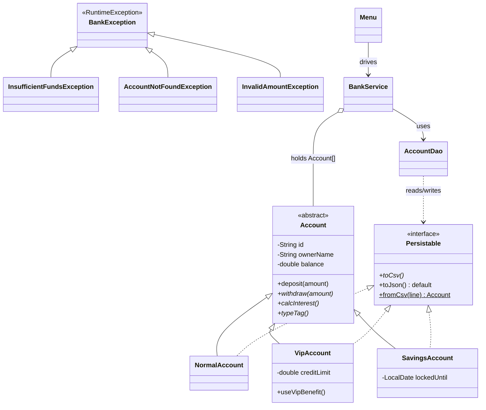

# 第二章：Java 银行账户管理系统

本章是综合案例的**第二关·OOP 大考**——从 [01.学生成绩](https://yccoding.com/pages/607405/) 的"三个并行数组 + 静态方法"跃迁到工业级 OOP：`class` 封装 + 抽象类 + **多态三态**（普通 / VIP / 储蓄）+ **自定义异常体系** + CSV 文件持久化 + 分包架构。

本案例做 **5 件事**：

1. **类化封装**：`class Account` 把"id / name / balance"三个并行数组退役，字段 `private` + getter，业务方法贴在类上。
2. **抽象 + 多态三态**：`abstract class Account` → `NormalAccount` / `VipAccount` / `SavingsAccount` —— 同一段循环调 `withdraw()`，三态各显神通。
3. **异常体系**：`BankException` 基类 + 三个具体异常 —— 把 01 案例的 `-1 哨兵`和"打印提示"全部替换为可被 `try-catch` 精确捕获的异常。
4. **接口 + CSV 持久化**：`Persistable` 接口 + `Files.newBufferedWriter` 实现"对象 ↔ 字符串"双向转换，重启不丢数据。
5. **分层架构**：`com.bank.entity` / `com.bank.exception` / `com.bank.service` / `com.bank.dao` / `com.bank.cli` 5 包分层 —— 第一次接触工业项目结构。

**学习方式**：本案例是综合案例里**第一道 OOP 硬菜**，按"灵魂三问 → 写最小骨架 → 故意造 BUG → 修复升级 → 阶段小结"循环。共 8 个阶段、约 8 小时，建议**分 2 天**完成（第 1 天 §02-§05、第 2 天 §06-§09）。**全程边读边敲，千万别复制粘贴**——本案例是你从"语法学习者"走向"OOP 工程师"的关键跃迁。

---

## 渐进学习节奏

先读这段，再开始敲代码！本案例**严格按真实工程师的开发节奏推进**，不会上来甩 800 行让你抄。我们的节奏：

```text
阶段 ① 单类 Account 起步（§03） · 45 min
   └ Step 1.0: 🤔 灵魂三问 #1（为什么要 class？）
   └ Step 1.1: 5 字段 + 3 构造（this(...) 复用）
   └ Step 1.2: 全套 getter，balance 仅 getter（封装首秀）
   └ Step 1.3: deposit / withdraw 业务方法
   └ Step 1.4: toString / equals / hashCode
   └ ✅ main 里 new Account(...) 跑通

阶段 ② 异常体系（§04） · 45 min
   └ Step 2.0: 🤔 灵魂三问 #2（错误码 vs 异常）
   └ Step 2.1: BankException 基类
   └ Step 2.2: 三个派生异常带专属字段
   └ Step 2.3: ⚠️ 造 BUG #1（withdraw 返 boolean 的痛）
   └ Step 2.4: 改抛 InsufficientFundsException

阶段 ③ 抽象类 + 多态三态（§05） · 90 min  【高峰】
   └ Step 3.0: 🤔 灵魂三问 #3（abstract 何时用）
   └ Step 3.1: Account → abstract class，加 abstract calcInterest()
   └ Step 3.2/3.3/3.4: VipAccount / SavingsAccount / NormalAccount
   └ Step 3.5: Account[] 多态循环
   └ Step 3.6: ⚠️ 造 BUG #2（向下转型与 instanceof 模式）

阶段 ④ 接口 Persistable（§06） · 60 min
   └ Step 4.0: 🤔 灵魂三问 #4（抽象类 vs 接口）
   └ Step 4.1: Persistable 接口 + default 方法
   └ Step 4.2: toCsv / fromCsv 双向序列化
   └ Step 4.3: 类型标签路由（V/S/N）

阶段 ⑤ DAO 层 + 文件持久化（§07） · 60 min
   └ Step 5.0: 🤔 灵魂三问 #5（try-with-resources 必要性）
   └ Step 5.1: AccountDao.saveAll / loadAll
   └ Step 5.2: ⚠️ 造 BUG #3（不关流的数据丢失）
   └ Step 5.3: 修复并加 UTF-8

阶段 ⑥ Service 业务编排（§08） · 45 min
   └ Step 6.1: BankService 字段 + open/close
   └ Step 6.2: transfer 异常透传与"原子性"思考
   └ Step 6.3: applyMonthlyInterest 多态利息

阶段 ⑦ CLI 主菜单（§09） · 30 min
   └ Step 7.1: Menu 类 + 启动加载
   └ Step 7.2: 8 项菜单 + 每次操作 try-catch

阶段 ⑧ 端到端测试（§10） · 30 min
   └ Step 8.1: 不引 JUnit，写自家 Assert 工具
   └ Step 8.2: 5 个场景测试
```

🎯 **每个 Step 必须做的三件事**：

> 1. **看 🎯 阶段目标卡片**：明确做什么、不做什么、验收标准
> 2. **写一小段代码就编译运行一次**（看到 ✏️ 标志立刻动手）
> 3. **看到预期输出再写下一个 Step**（绝不一口气抄完整段代码）
>
> ⚠️ **新手最容易犯的错**：抄完 800 行代码 → 编译报 80 个错 → 不知道从哪查 → 放弃。**每加 30 行就编译一次**——错了你只要查这 30 行。

> 🎯 **本案例的 5 处"灵魂三问"**（动手前先想清楚）：
> - **§03 单类 Account 前**：为什么要 class？字段为什么必须 `private`？为什么不沿用 01 的并行数组？
> - **§04 异常体系前**：为什么不用 `boolean` / `-1` 表示失败？受检 vs 非受检如何选？为什么要异常体系（多层继承）？
> - **§05 抽象类前**：抽象类 vs 普通父类如何选？什么情况必须用 `abstract`？为什么 `Account` 适合抽象类？
> - **§06 接口前**：抽象类已经够用，为什么还要接口？`default` 方法解决了什么？接口里能写 `static` 吗？
> - **§07 文件 IO 前**：为什么必须 `try-with-resources`？`Files.newBufferedReader` vs `new FileReader` 选哪个？UTF-8 怎么办？

> ⚠️ **本案例的 3 处"陷阱预警"**（亲眼看一次记一辈子）：
> - **§04 错误码反例**：`withdraw` 返 `boolean` 让调用方丢失"为什么失败"的信息
> - **§05 向下转型 BUG**：父类引用调子类专属方法编译失败 → 用 `instanceof` 模式匹配
> - **§07 不关流数据丢失**：去掉 try-with-resources 直接退出 → 文件是空的

---

## 案例元信息

| 项目 | 说明 |
|------|------|
| 难度 | ★★★☆☆（OOP 第一关） |
| 预估时长 | 8 小时（建议分 2 天，每天 4 小时） |
| 前置章节 | 入门第 7 章 类和对象、第 8 章 继承多态、第 9 章 接口与抽象类、第 10 章 异常处理、第 12 章 IO 流、第 11 章 包与访问控制 |
| 覆盖知识点 | `class` 封装 / 构造重载 + `this()` / `static` 工厂 / `extends` 单继承 / `@Override` / `super()` / `instanceof` 模式匹配（JDK 16+）/ `abstract class` / `abstract method` / `interface` + `default` / `static` 接口方法 / 自定义异常体系 / `try-with-resources` / `Files.newBufferedReader/Writer` / `Path` / UTF-8 显式编码 |
| 设计亮点 | **三层架构**：实体（Account 体系）/ 服务（BankService）/ 持久化（AccountDao）；多态三态：普通 / VIP / 储蓄账户 |
| ⚠ 已知局限 | 故意保留 `Account[]` 数组（**不上 ArrayList**）—— 集合框架是 03 案例的主菜，留给那时候带来"扩容自由"的爽 |
| 最终产物 | 多文件 Java 项目（~ 850 行）+ `accounts.csv` 持久化文件 |
| 代码规模 | 5 个包 / 11 个类 / 约 850 行 |
| JDK 版本 | JDK 17（兼容 JDK 11+，`instanceof` 模式匹配是 JDK 16 正式版） |

### 项目结构

```text
bank-system/
└── src/
    └── com/
        └── bank/
            ├── entity/                # 实体层（数据 + 行为）
            │   ├── Account.java       # abstract 基类
            │   ├── NormalAccount.java # 普通账户
            │   ├── VipAccount.java    # VIP 账户
            │   └── SavingsAccount.java# 储蓄账户
            ├── exception/             # 异常层
            │   ├── BankException.java
            │   ├── InsufficientFundsException.java
            │   ├── AccountNotFoundException.java
            │   └── InvalidAmountException.java
            ├── persist/               # 持久化接口
            │   └── Persistable.java
            ├── dao/                   # 数据访问层
            │   └── AccountDao.java
            ├── service/               # 业务层
            │   └── BankService.java
            └── cli/                   # 用户交互层
                └── Menu.java          # 含 main(...)
```

**层与层依赖方向**（单向向下，绝不反向）：

```text
            cli.Menu  (UI 入口，main)
                │
                ▼
       service.BankService
            │       │
            ▼       ▼
       entity.*    dao.AccountDao
       (Account 体系)  │
                       ▼
                持久化接口 + Files
```

### 编译运行命令

```bash
cd bank-system
javac -d out -encoding UTF-8 $(find src -name "*.java")
java  -cp out com.bank.cli.Menu
```

> 📌 **新手提示**：编译命令较长，建议保存为 `build.sh`：
>
> ```bash
> #!/bin/bash
> rm -rf out && mkdir out
> javac -d out -encoding UTF-8 $(find src -name "*.java") \
>   && echo "✅ 编译成功" \
>   && java -cp out com.bank.cli.Menu
> ```
>
> `chmod +x build.sh` 后用 `./build.sh` 一键跑。

---

## 目录快速导航

> 点击以下条目即可跳转到对应节。【🔑 重点节】推荐优先阅读。

- [渐进学习节奏](#渐进学习节奏) 【🔑 必读】
- [案例元信息](#案例元信息)
- [01.项目需求和功能](#01项目需求和功能)
  - [1.1 需求介绍](#11-需求介绍)
  - [1.2 功能要求](#12-功能要求)
  - [1.3 设计思路](#13-设计思路)
  - [1.4 涉及知识点](#14-涉及知识点)
  - [1.5 三类账户业务规则](#15-三类账户业务规则)
- [02.项目骨架与包初始化](#02项目骨架与包初始化)
  - [2.1 创建包目录](#21-创建包目录)
  - [2.2 hello main 跑通编译](#22-hello-main-跑通编译)
- [03.单类 Account 起步](#03单类-account-起步) 【阶段①】
  - [3.0 灵魂三问 1](#30-灵魂三问-1) 【🤔】
  - [3.1 字段与构造重载](#31-字段与构造重载)
  - [3.2 封装与 getter](#32-封装与-getter)
  - [3.3 deposit 与 withdraw](#33-deposit-与-withdraw)
  - [3.4 toString equals hashCode](#34-tostring-equals-hashcode)
- [04.自定义异常体系](#04自定义异常体系) 【阶段②】
  - [4.0 灵魂三问 2](#40-灵魂三问-2) 【🤔】
  - [4.1 BankException 基类](#41-bankexception-基类)
  - [4.2 三个派生异常](#42-三个派生异常)
  - [4.3 错误码 BUG 修复](#43-错误码-bug-修复) 【⚠️ 造 BUG】
- [05.抽象类与多态三态](#05抽象类与多态三态) 【阶段③高峰⭐】
  - [5.0 灵魂三问 3](#50-灵魂三问-3) 【🤔】
  - [5.1 改造为 abstract 基类](#51-改造为-abstract-基类)
  - [5.2 VipAccount 子类](#52-vipaccount-子类)
  - [5.3 SavingsAccount 子类](#53-savingsaccount-子类)
  - [5.4 NormalAccount 子类](#54-normalaccount-子类)
  - [5.5 多态循环演示](#55-多态循环演示)
  - [5.6 向下转型 BUG 修复](#56-向下转型-bug-修复) 【⚠️ 造 BUG】
- [06.Persistable 接口与序列化](#06persistable-接口与序列化) 【阶段④】
  - [6.0 灵魂三问 4](#60-灵魂三问-4) 【🤔】
  - [6.1 接口与 default 方法](#61-接口与-default-方法)
  - [6.2 toCsv 子类各自实现](#62-tocsv-子类各自实现)
  - [6.3 类型标签反序列化](#63-类型标签反序列化)
- [07.AccountDao 文件持久化](#07accountdao-文件持久化) 【阶段⑤】
  - [7.0 灵魂三问 5](#70-灵魂三问-5) 【🤔】
  - [7.1 saveAll 与 loadAll](#71-saveall-与-loadall)
  - [7.2 不关流 BUG 演示](#72-不关流-bug-演示) 【⚠️ 造 BUG】
- [08.BankService 业务编排](#08bankservice-业务编排) 【阶段⑥】
  - [8.1 字段与开户销户](#81-字段与开户销户)
  - [8.2 transfer 与原子性](#82-transfer-与原子性)
  - [8.3 月结息多态](#83-月结息多态)
- [09.CLI 主菜单](#09cli-主菜单) 【阶段⑦】
  - [9.1 Menu 启动与加载](#91-menu-启动与加载)
  - [9.2 8 项菜单接入](#92-8-项菜单接入)
- [10.端到端测试](#10端到端测试) 【阶段⑧】
  - [10.1 自家 Assert 工具](#101-自家-assert-工具)
  - [10.2 5 个测试场景](#102-5-个测试场景)
- [11.项目总结分析](#11项目总结分析)
  - [11.1 类的整体设计](#111-类的整体设计)
  - [11.2 类关系图](#112-类关系图)
  - [11.3 优缺点分析](#113-优缺点分析)
- [12.项目技术思考](#12项目技术思考)
  - [12.1 为何选 abstract 而非 interface](#121-为何选-abstract-而非-interface)
  - [12.2 异常分层设计原则](#122-异常分层设计原则)
  - [12.3 卷一章节回扣表](#123-卷一章节回扣表)
- [13.衔接与延伸](#13衔接与延伸)
  - [13.1 与上一案例的差异](#131-与上一案例的差异)
  - [13.2 与下一案例的递进](#132-与下一案例的递进)
  - [13.3 三个延伸挑战](#133-三个延伸挑战)

---

## 01.项目需求和功能

### 1.1 需求介绍

银行账户管理系统是商业银行最核心的业务模块。本教程用 Java 实现一个**控制台版**的银行账户管理系统，支持开户、销户、存款、取款、查询、转账、月结息、退出 8 项核心功能，账户分**普通 / VIP / 储蓄**三类，数据持久化到 CSV 文件。

**和现实银行的对应关系**：

| 现实银行 | 本系统对应 |
|---------|----------|
| 银行 | `BankService` 服务类 |
| 账户体系 | `Account` 抽象基类 + 3 个派生 |
| 账户记录 | `accounts.csv` 文件 |
| 业务大堂 | `Menu` 菜单循环 |
| 柜员操作 | 8 个菜单选项 |

### 1.2 功能要求

**核心 8 项功能**：

1. **开户**：选择账户类型（1=普通 / 2=VIP / 3=储蓄）→ 输入账号、姓名、初始余额。
2. **销户**：按账号删除账户。
3. **存款**：输入账号 + 金额 → 余额累加。
4. **取款**：输入账号 + 金额 → **校验余额是否足够**，三态各有差异化规则。
5. **转账**：输入"转出账号 / 转入账号 / 金额"→ 原子调整两个账户余额。
6. **查询余额**：输入账号 → 显示该账户的详细信息（含**子类特有字段**）。
7. **月结息**：遍历调 `calcInterest()` 把当月利息加进余额——**多态最直观的地方**。
8. **退出**：保存数据后退出。

### 1.3 设计思路

**关键决策**：用**抽象基类 + 派生类 + 异常体系**，**而不是**"一个类带 type 字段 + boolean 返回值"。

❌ **C 风格的伪 OOP**：

```java
class Account {
    int type;            // 1=普通  2=VIP  3=储蓄
    double interestRate; // 只有 VIP 用
    int term;            // 只有储蓄用
    boolean withdraw(double amt) {
        if (type == 1) { /* 普通规则 */ }
        else if (type == 2) { /* VIP 规则 */ }
        else if (type == 3) { /* 储蓄规则 */ }
        // ⚠️ 每加一种类型，所有 if 都要改 = 散弹式修改
        return success;
    }
}
```

**问题**：

1. **每加一种账户**，所有方法的 if-else 链都要改 —— 违反**开闭原则**
2. **`boolean` 返回值**让调用方丢失"为什么失败"的语义 —— "余额不足" 还是 "金额非法"？
3. **`type` 字段是手工标记**，编译器不能为你检查"漏处理某个分支"

✅ **OOP 多态的写法**：

```java
abstract class Account {
    abstract void withdraw(double amt) throws InsufficientFundsException;
}
class VipAccount     extends Account { @Override void withdraw(double amt) {...} }
class SavingsAccount extends Account { @Override void withdraw(double amt) {...} }
class NormalAccount  extends Account { @Override void withdraw(double amt) {...} }
```

**好处**：

1. 加一种"信用账户" `CreditAccount`，**原有代码一行不改** —— 开闭原则
2. 编译器**强制**子类实现 `withdraw` —— 抽象方法的硬性约束
3. 失败用**专属异常类型** —— 调用方 `catch (InsufficientFundsException e)` 拿到精确信息

### 1.4 涉及知识点

| 入门章节 | 知识点 | 在本案例的位置 |
|---|---|---|
| 第 7 章 类和对象 | 字段 / 构造方法 / 重载 / `this()` / `static` | §03 `Account` 字段、3 构造、`generateId()` 静态工厂 |
| 第 7 章 | 封装：`private` + getter/setter | §03 `balance` private + getBalance() public |
| 第 8 章 继承多态 | `extends` / `@Override` / `super()` / 单继承约束 | §05 三个子类继承 Account |
| 第 8 章 | 向上 / 向下转型、`instanceof` 模式匹配（JDK 16+） | §05.6 调 VIP 专属方法 |
| 第 9 章 接口与抽象类 | `abstract class` / `abstract method` | §05.1 Account 改抽象 |
| 第 9 章 | `interface` / `default` 方法 / `static` 接口方法 | §06 Persistable 接口 |
| 第 10 章 异常处理 | 自定义异常 / 受检 vs 非受检 / try-catch / try-with-resources | §04 异常体系、§07 文件 IO |
| 第 11 章 包与访问 | `package` / `import` / 5 包分层 | 全案例 |
| 第 12 章 IO 流 | `Path` / `Files.newBufferedReader/Writer` / 字符集 | §07 AccountDao |

### 1.5 三类账户业务规则

| 账户类型 | 类型标签 | 特有字段 | 取款规则 | 月利率 |
|---------|--------|---------|---------|------|
| **普通账户** NormalAccount | `N` | 无 | 不允许透支 | 0.1% |
| **VIP 账户** VipAccount | `V` | `creditLimit`（透支额度，默认 1000）| 允许透支至 `-creditLimit` | 0.5% |
| **储蓄账户** SavingsAccount | `S` | `lockedUntil`（锁定到期日 LocalDate）| 锁定期内取款扣 1% 违约金 | 0.3% |

> **类型标签**：CSV 文件每行第一个字段是这个字符（`V` / `S` / `N`），用于反序列化时识别该行是哪种子类。这就是 §06 "类型标签路由" 要解决的核心问题。

---

## 02.项目骨架与包初始化

```text
┌─ 🎯 阶段 ⓪ 目标 ────────────────────────────────────────┐
│ 完成什么：建好 5 个包目录 + 跑通 Hello World            │
│ 不做什么：不写任何业务（全部待实现）                      │
│ 验收标准：javac + java 全跑通，控制台打印 "银行系统启动" │
│ 预计耗时：15 分钟                                        │
└─────────────────────────────────────────────────────────┘
```

### 2.1 创建包目录

新建 `bank-system/` 目录，按"包 = 目录"原则创建子目录：

```bash
mkdir -p bank-system/src/com/bank/{entity,exception,persist,dao,service,cli}
cd bank-system
```

> 💡 **包 = 目录**：Java 的 `package com.bank.entity` 必须**精确对应** `src/com/bank/entity/` 目录路径——这是编译器的硬性要求，不是约定。

### 2.2 hello main 跑通编译

新建 `src/com/bank/cli/Menu.java`：

```java
package com.bank.cli;

public class Menu {
    public static void main(String[] args) {
        System.out.println("银行系统启动");
    }
}
```

✏️ **立刻编译运行**：

```bash
javac -d out -encoding UTF-8 $(find src -name "*.java")
java  -cp out com.bank.cli.Menu
```

预期输出：

```text
银行系统启动
```

> ✅ 看到这行就说明：JDK 装了 / 包结构对了 / 编译命令正确。**所有阶段后续编译都用同一条命令**——这是工业 Java 项目的最小启动门槛。

> 💡 **`-d out`**：把 `.class` 输出到 `out/` 目录（不要污染源码目录）；
> **`-encoding UTF-8`**：强制源码用 UTF-8 解析（中文注释 / 字符串才不会乱码，**必加**）；
> **`$(find src -name "*.java")`**：让 shell 把所有 .java 文件展开成参数——比一个个写文件名优雅 10 倍。

---

## 03.单类 Account 起步

```text
┌─ 🎯 阶段 ① 目标 ────────────────────────────────────────┐
│ 完成什么：单个 Account 类（非抽象），5 字段 + 3 构造 + 业务方法 │
│ 不做什么：不做继承多态（阶段 ③）/ 不做异常（阶段 ②） │
│ 验收标准：main 里 new Account(...).deposit(100) 跑通    │
│ 预计耗时：45 分钟                                        │
└─────────────────────────────────────────────────────────┘
```

### 3.0 灵魂三问 1

🎯 **Step 1.0**：动手前先想清楚为什么要 class。

❓ **问题一：为什么要 class？01 案例的并行数组不是也能跑吗？**

回顾 §3.3 的代码：

```java
public boolean withdraw(double amount) {
    if (amount <= 0)        { System.out.println(...); return false; }
    if (balance < amount)   { System.out.println(...); return false; }
    ...
}
```

**问题**：

1. **数据 ↔ 行为分离** —— 学生信息在数组里、操作在 static 方法里，**离散**
2. **类型不安全** —— 没有"一个学生就是一个学生"这个概念，全靠程序员自觉用同一个 i
3. **加字段灾难** —— 想加"出生日期"就得再开一个 `LocalDate[] births`，所有遍历代码都要同步改

✅ **class 解决方案**：

```java
public class Account {
    private String id;
    private String ownerName;
    private double balance;
    private LocalDateTime createdAt;
    // 数据 + 行为 = 同一个文件、同一个类
    public void deposit(double amount) { balance += amount; }
}
Account a = new Account("A001", "张三", 1000);  // 一个对象 = 一个完整账户
```

**好处**：

1. **数据和行为绑定** —— 操作账户必须通过 `Account` 实例，编译器替你保证关联性
2. **类型安全** —— 你只能传 `Account` 类型，传错了编译报错
3. **加字段无痛** —— 在类里加一行字段、加一对 getter/setter，**调用方代码完全不变**

❓ **问题二：字段为什么必须 `private`？写 `public` 不省事吗？**

来看反例：

```java
public class Account {
    public double balance;       // ❌ 反例：public 字段
}
Account a = new Account();
a.balance = -999999;             // ⚠️ 任何人都能瞎改余额，包括打错字
a.balance += "abc".length();     // ⚠️ 表达式错误也没人拦
```

**问题**：

1. **没有任何校验机会** —— 余额怎么变都行，连 `< 0` 都拦不住
2. **改名字 = 灾难** —— 想把 `balance` 改名 `currentBalance`，全项目所有用到的地方都要改
3. **没有"读" / "写"分离** —— 只能读不能写、只能写不能读这种语义都表达不了

✅ **`private` + getter/setter 解决方案**：

```java
public class Account {
    private double balance;                          // private 锁起来
    public double getBalance() { return balance; }   // 公开读
    // 故意不写 setBalance —— 余额只能通过 deposit/withdraw 改
    public void deposit(double amount) {
        if (amount <= 0) throw new InvalidAmountException(...);
        balance += amount;
    }
}
```

**好处**：

1. **校验有口子** —— `deposit` 里可以校验金额 > 0
2. **改字段名不影响外部** —— 字段叫什么是"内部实现"，外部只看 getter
3. **读写分离** —— 不写 setter 就是"只读"，约束清晰

> 🔑 **金句**：**字段是内部实现、方法才是外部 API**。这是 OOP 封装的核心心法。

❓ **问题三：为什么要写 3 个构造方法？1 个全参不就够了？**

来看反例：

```java
// ❌ 只写一个全参构造
public Account(String id, String name, double balance, LocalDateTime createdAt) {...}

// 调用方每次都要写一长串
Account a = new Account("A001", "张三", 0, LocalDateTime.now());
Account b = new Account("A002", "李四", 0, LocalDateTime.now());  // 重复
```

**问题**：

1. **常见用法没有便捷入口** —— 90% 场景"初始余额 = 0、创建时间 = now"，每次都要写
2. **加字段 = 调用方崩** —— 加一个 `phone` 字段就得改所有 `new Account(...)` 调用

✅ **构造重载 + `this(...)` 复用**：

```java
public Account(String id, String name, double balance, LocalDateTime createdAt) {
    this.id = id;
    this.ownerName = name;
    this.balance = balance;
    this.createdAt = createdAt;
}
public Account(String id, String name, double balance) {
    this(id, name, balance, LocalDateTime.now());     // 复用全参，自动填 now
}
public Account(String id, String name) {
    this(id, name, 0.0);                              // 链式：→ 三参 → 四参
}
```

**好处**：

1. **常见用法极简** —— `new Account("A001", "张三")` 一行搞定
2. **代码不重复** —— 三个构造里**真正赋值的代码只有一份**（最长那个）
3. **后续加字段** —— 只改最长那个构造和字段定义，其他构造自动级联

> 🔑 **`this(...)` 调用规则**：必须是构造方法的**第一行**；不能和 `super(...)` 共存（编译错）；最多调一个构造（不能链式）。

🔑 **三问连起来的领悟**：**class = 数据 + 行为绑定 + 访问可控 + 便利构造**——这就是 OOP 区别于过程式的核心特征。

### 3.1 字段与构造重载

🎯 **Step 1.1**：写最小 `Account` 类骨架。

新建 `src/com/bank/entity/Account.java`：

```java
package com.bank.entity;

import java.time.LocalDateTime;
import java.util.concurrent.atomic.AtomicLong;

public class Account {
    // ============ 静态成员：自增 ID 工厂 ============
    private static final AtomicLong SEQ = new AtomicLong(1000);

    public static String generateId() {
        return "A" + SEQ.incrementAndGet();
    }

    // ============ 实例字段（全部 private）============
    private final String id;
    private String ownerName;
    private double balance;
    private final LocalDateTime createdAt;

    // ============ 构造方法重载 ============
    public Account(String id, String ownerName, double balance, LocalDateTime createdAt) {
        this.id = id;
        this.ownerName = ownerName;
        this.balance = balance;
        this.createdAt = createdAt;
    }

    public Account(String id, String ownerName, double balance) {
        this(id, ownerName, balance, LocalDateTime.now());
    }

    public Account(String id, String ownerName) {
        this(id, ownerName, 0.0);
    }
}
```

> 💡 **`AtomicLong` 选择理由**：保证 `generateId()` 在多线程下 ID 也唯一。本案例**单线程**用不上原子性，但养成习惯——05 案例（多线程订单）会感谢你今天的选择。
>
> 💡 **`final` 字段**：`id` 和 `createdAt` 一旦构造就不能改（账号、开户时间不可变是真实业务约束）；`ownerName` 可改名（没加 `final`）；`balance` 通过业务方法改（没加 `final`）。**`final` 表意 = "不可变性约束"**——不要乱用，但用对了价值连城。

### 3.2 封装与 getter

🎯 **Step 1.2**：加 getter，注意 `balance` 故意不给 setter。

继续在 `Account.java` 里追加：

```java
    // ============ 全套 getter（balance 故意不给 setter）============
    public String getId() { return id; }
    public String getOwnerName() { return ownerName; }
    public void setOwnerName(String ownerName) { this.ownerName = ownerName; }
    public double getBalance() { return balance; }
    public LocalDateTime getCreatedAt() { return createdAt; }
```

> 🔑 **没写 `setBalance`**：余额是核心业务字段，**只能通过 `deposit` / `withdraw` 修改**——这样就强制所有"改余额"的代码走业务校验通道。**封装的本质是给字段配上"业务护栏"**。

### 3.3 deposit 与 withdraw

🎯 **Step 1.3**：写两个核心业务方法。本阶段先用 `boolean` 返回（**故意造的 BUG**，§04 修复）。

```java
    // ============ 业务方法（阶段①版本：boolean 返回值 —— 阶段②会改成抛异常） ============
    public boolean deposit(double amount) {
        if (amount <= 0) {
            System.out.println("[错误] 存款金额必须 > 0");
            return false;
        }
        balance += amount;
        return true;
    }

    public boolean withdraw(double amount) {
        if (amount <= 0) {
            System.out.println("[错误] 取款金额必须 > 0");
            return false;
        }
        if (balance < amount) {
            System.out.println("[错误] 余额不足");
            return false;
        }
        balance -= amount;
        return true;
    }
```

✏️ **现在去 main 里跑一下**——更新 `Menu.java`：

```java
package com.bank.cli;
import com.bank.entity.Account;
public class Menu {
    public static void main(String[] args) {
        Account a = new Account("A1001", "张三", 100);
        System.out.println("初始余额: " + a.getBalance());
        a.deposit(500);
        System.out.println("存 500 后: " + a.getBalance());
        a.withdraw(200);
        System.out.println("取 200 后: " + a.getBalance());
        a.withdraw(99999);    // 余额不足
        System.out.println("最终余额: " + a.getBalance());
    }
}
```

✏️ **立刻编译运行**：

```bash
./build.sh
```

预期输出：

```text
初始余额: 100.0
存 500 后: 600.0
取 200 后: 400.0
[错误] 余额不足
最终余额: 400.0
```

> ✅ 单个 Account 类已经可以跑业务了。这就是 class 比并行数组的爽——**一个 `new` 一个 `.deposit` 就完成了一笔业务**，再也不用对着多个数组下标。

### 3.4 toString equals hashCode

🎯 **Step 1.4**：补齐 `Object` 三件套。

```java
    // ============ Object 三件套 ============
    @Override
    public String toString() {
        return String.format("Account{id=%s, owner=%s, balance=%.2f, createdAt=%s}",
                id, ownerName, balance, createdAt);
    }

    @Override
    public boolean equals(Object o) {
        if (this == o) return true;
        if (!(o instanceof Account that)) return false;     // ✨ JDK 16+ instanceof 模式匹配
        return java.util.Objects.equals(this.id, that.id);  // 业务上"账号相同 = 同一个账户"
    }

    @Override
    public int hashCode() {
        return java.util.Objects.hash(id);                  // 与 equals 保持一致
    }
```

> 🔑 **equals / hashCode 必须一起重写**：契约是 "equals 相等的对象、hashCode 也必须相等"。否则放进 `HashMap` 会出灵异 BUG（03 案例会演示）。
>
> 🔑 **`o instanceof Account that`** —— JDK 16+ 的"模式匹配"语法糖。等价于：
>
> ```java
> if (!(o instanceof Account)) return false;
> Account that = (Account) o;
> ```
>
> 一行顶两行，且没有强转风险（编译器保证 `that` 一定是 `Account`）。**§05.6 还会再用一次这个特性**。
>
> 💡 **业务定义"相等"**：本案例认为"账号相同 = 同一个账户"，所以 equals 只比 id 不比余额。换个业务可能要比所有字段——**equals 不是机械重写，是业务决策**。

```text
┌─ 📌 阶段 ① 小结 ────────────────────────────────────────┐
│ ✅ 你完成了：                                              │
│   • Account 单类 5 字段 + 3 构造 + 全 getter              │
│   • deposit / withdraw 业务方法（boolean 版）             │
│   • toString / equals / hashCode（含 instanceof 模式匹配） │
│   • main 里跑通完整业务循环                                │
│                                                            │
│ ⏸ 还没做（下阶段）：                                       │
│   • boolean 返回值 → 自定义异常（阶段②）                   │
│   • 单一类 → 多态三态（阶段③）                            │
│                                                            │
│ 🔑 此刻领悟：                                              │
│   "class = 数据 + 行为 + 访问可控 + 便利构造的四合一"      │
│                                                            │
│ 📌 git commit -m "stage1: single Account class"           │
└─────────────────────────────────────────────────────────┘
```

---

## 04.自定义异常体系

```text
┌─ 🎯 阶段 ② 目标 ────────────────────────────────────────┐
│ 完成什么：BankException 基类 + 3 派生异常 + withdraw 改抛异常 │
│ 不做什么：不做继承多态（阶段③）                            │
│ 验收标准：catch 不同异常打印不同信息                       │
│ 预计耗时：45 分钟                                          │
└─────────────────────────────────────────────────────────┘
```

### 4.0 灵魂三问 2

🎯 **Step 2.0**：

❓ **问题一：为什么不用 `boolean` / `-1` 表示失败？**

回顾 §3.3 的代码：

```java
public boolean withdraw(double amount) {
    if (amount <= 0)        { System.out.println(...); return false; }
    if (balance < amount)   { System.out.println(...); return false; }
    ...
}
```

**问题**：

1. **调用方丢失"为什么失败"** —— `if (!a.withdraw(100))` 知道失败，但**不知道是金额非法还是余额不足**
2. **错误处理职责被错置** —— `withdraw` 里直接 `System.out.println`，把"决定怎么提示用户"的权利硬塞给类——但通讯录 / GUI / API 都不能 println
3. **错误容易被忽略** —— `a.withdraw(100)` 不写 if 也能编译过，bug 隐藏

✅ **异常方案**：

```java
public void withdraw(double amount) throws InsufficientFundsException, InvalidAmountException {
    if (amount <= 0) throw new InvalidAmountException(amount);
    if (balance < amount) throw new InsufficientFundsException(amount, balance);
    balance -= amount;
}
// 调用方
try { a.withdraw(100); }
catch (InsufficientFundsException e) {
    System.out.printf("余额不足，需 %.2f，可用 %.2f%n", e.getRequested(), e.getAvailable());
} catch (InvalidAmountException e) {
    System.out.printf("金额非法：%.2f%n", e.getAmount());
}
```

**好处**：

1. **失败原因有结构** —— 不同异常类、不同字段，调用方精确处理
2. **失败"必须"被处理** —— Java 受检异常**强制** try-catch（编译器把关）
3. **职责回归调用方** —— UI 决定怎么提示，业务类只负责告知"出了什么事"

❓ **问题二：受检异常 vs 非受检异常如何选？**

| 类型 | 父类 | 强制处理 | 何时用 |
|---|---|---|---|
| 受检异常 | `Exception`（不含 `RuntimeException`）| ✅ 必须 try 或 throws | **业务层"可恢复"错误**（余额不足、文件不存在）|
| 非受检异常 | `RuntimeException` | ❌ 可不处理 | **程序员错误**（NPE、数组越界、参数非法）|

**本案例选择**：所有 `BankException` 继承 **`RuntimeException`**——为什么？

1. **不污染方法签名** —— 业务方法不用 `throws BankException, ...`，链路传递更顺
2. **现代 Java 偏好非受检** —— Spring / 主流框架几乎都用 `RuntimeException`，受检异常被认为是 "Java 设计的争议产物"
3. **保留调用方选择权** —— 想 catch 就 catch，不想 catch 让它冒泡到顶层日志

> 💡 **业界共识**：受检异常用得越多，调用链越脏。**新代码默认用 `RuntimeException`，受检异常只用于"明显业务可恢复"场景**（比如文件、网络）。

❓ **问题三：为什么要建异常体系（多层继承）？**

来看反例 —— 一把抓的"一个异常类"：

```java
class BankException extends RuntimeException {
    int errorCode;       // 1=余额不足  2=账户不存在  3=金额非法
}
catch (BankException e) {
    if (e.errorCode == 1) ... else if (e.errorCode == 2) ... else if (e.errorCode == 3) ...
}
```

**问题**：

1. **回到了 if-else 链** —— 你刚跟"`type` 字段"告别，又来一个 `errorCode`？
2. **没法精确捕获** —— 想"只关心余额不足、其他冒泡到顶层"做不到
3. **字段松散** —— `requested`/`available`（余额不足才有）/ `amount`（金额非法才有）全堆一个类，半数字段是 null

✅ **异常体系**：

```java
class BankException extends RuntimeException { /* 公共字段 + 公共构造 */ }
class InsufficientFundsException  extends BankException { double requested, available; }
class AccountNotFoundException    extends BankException { String accountId; }
class InvalidAmountException      extends BankException { double amount; }
```

**好处**：

1. **精确捕获** —— `catch (InsufficientFundsException e)` 只捕这一种
2. **兜底也方便** —— `catch (BankException e)` 兜底所有业务异常
3. **字段精炼** —— 每个异常带自己最相关的字段，无冗余

🔑 **本案例选 `RuntimeException` + 异常体系** —— 现代 Java 的标准做法。

### 4.1 BankException 基类

🎯 **Step 2.1**：建包 + 写基类。

新建 `src/com/bank/exception/BankException.java`：

```java
package com.bank.exception;

public class BankException extends RuntimeException {
    public BankException(String message) {
        super(message);
    }
    public BankException(String message, Throwable cause) {
        super(message, cause);
    }
}
```

> 💡 **两个构造方法**：单参 `(String)` 用于"自身原因"；双参 `(String, Throwable)` 用于"包装下层异常"——比如 IO 失败时 `throw new BankException("加载账户失败", ioException)`。**保留 cause 方便排错**，是工业代码的修养。

### 4.2 三个派生异常

🎯 **Step 2.2**：每个异常带专属字段。

`src/com/bank/exception/InsufficientFundsException.java`：

```java
package com.bank.exception;

public class InsufficientFundsException extends BankException {
    private final double requested;
    private final double available;

    public InsufficientFundsException(double requested, double available) {
        super(String.format("余额不足：申请 %.2f，可用 %.2f", requested, available));
        this.requested = requested;
        this.available = available;
    }

    public double getRequested() { return requested; }
    public double getAvailable() { return available; }
}
```

`src/com/bank/exception/AccountNotFoundException.java`：

```java
package com.bank.exception;

public class AccountNotFoundException extends BankException {
    private final String accountId;
    public AccountNotFoundException(String accountId) {
        super("账户不存在: " + accountId);
        this.accountId = accountId;
    }
    public String getAccountId() { return accountId; }
}
```

`src/com/bank/exception/InvalidAmountException.java`：

```java
package com.bank.exception;

public class InvalidAmountException extends BankException {
    private final double amount;
    public InvalidAmountException(double amount) {
        super(String.format("金额非法: %.2f（必须 > 0）", amount));
        this.amount = amount;
    }
    public double getAmount() { return amount; }
}
```

> 🔑 **每个异常都把"上下文数据"作为 `final` 字段保留**——调用方除了拿到 `e.getMessage()` 字符串，还能拿到结构化字段（比如 `e.getRequested()`）做更细的逻辑。这就是异常类比错误码强的地方。

### 4.3 错误码 BUG 修复

🎯 **Step 2.3**：⚠️ **造 BUG #1** —— 故意演示 boolean 返回值的痛。

回到 `Menu.java`，把 main 改成连续多笔操作：

```java
Account a = new Account("A1001", "张三", 100);

// ❌ boolean 返回的痛点：调用方代码非常啰嗦
if (!a.deposit(-10)) {
    // 知道失败，但不知道是金额非法还是其他什么
    System.out.println("操作失败，但不知道为啥");
}
if (!a.withdraw(99999)) {
    System.out.println("操作失败，但不知道为啥");
}

// ⚠️ 更糟：完全可以不写 if，编译过、运行也不报错——错误被默默吞掉
a.withdraw(99999);     // 业务失败但代码继续往下跑
System.out.println("剩余: " + a.getBalance());   // 仍然显示 100，问题被静默
```

跑一下：

```text
[错误] 存款金额必须 > 0
操作失败，但不知道为啥
[错误] 余额不足
操作失败，但不知道为啥
[错误] 余额不足
剩余: 100.0       ← ⚠️ 业务失败但代码继续跑，用户以为成功
```

🎯 **Step 2.4**：✅ **修复**——把 `Account` 的 `deposit` / `withdraw` 改抛异常。

回到 `Account.java`，替换业务方法：

```java
import com.bank.exception.*;

    // ============ 业务方法（阶段②版本：抛异常）============
    public void deposit(double amount) {
        if (amount <= 0) throw new InvalidAmountException(amount);
        balance += amount;
    }

    public void withdraw(double amount) {
        if (amount <= 0) throw new InvalidAmountException(amount);
        if (balance < amount) throw new InsufficientFundsException(amount, balance);
        balance -= amount;
    }
```

调用方 `Menu.java`：

```java
Account a = new Account("A1001", "张三", 100);
try {
    a.deposit(-10);
} catch (InvalidAmountException e) {
    System.out.println("✗ " + e.getMessage());     // 自动打印 "金额非法: -10.00"
}
try {
    a.withdraw(99999);
} catch (InsufficientFundsException e) {
    System.out.printf("✗ 余额不足！需要 %.2f，可用 %.2f%n", e.getRequested(), e.getAvailable());
}
System.out.println("剩余: " + a.getBalance());
```

✏️ **立刻编译运行**：

```text
✗ 金额非法: -10.00
✗ 余额不足！需要 99999.00，可用 100.00
剩余: 100.0
```

> ✅ 调用方"想忽略错误也忽略不了"——抛异常默认会冒泡到顶层。这就是异常 vs 错误码的本质区别：**让错误"必须可见"**。

```text
┌─ 📌 阶段 ② 小结 ────────────────────────────────────────┐
│ ✅ 你完成了：                                              │
│   • BankException 基类 + 3 派生异常带专属字段              │
│   • Account 业务方法改抛异常 —— 调用方精确捕获             │
│                                                            │
│ 🔑 此刻领悟：                                              │
│   "异常 = 失败原因结构化 + 强制可见 + 调用链不脏"           │
│                                                            │
│ 📌 git commit -m "stage2: exception hierarchy"             │
└─────────────────────────────────────────────────────────┘
```

---

## 05.抽象类与多态三态

```text
┌─ 🎯 阶段 ③ 目标【高峰】 ────────────────────────────────┐
│ 完成什么：Account → abstract，三个子类各自重写 withdraw/calcInterest │
│ 不做什么：不做接口（阶段④）/ 不做持久化（阶段⑤）          │
│ 验收标准：Account[] 数组多态循环，三态表现                            │
│ 预计耗时：90 分钟（本案例最重要的一阶段）                  │
└─────────────────────────────────────────────────────────┘
```

### 5.0 灵魂三问 3

🎯 **Step 3.0**：

❓ **问题一：抽象类 vs 普通父类如何选？**

| 维度 | 普通父类 | 抽象类 |
|---|---|---|
| 是否能 `new` 出实例 | ✅ 能 | ❌ 不能（编译错） |
| 是否要求子类必须实现某方法 | ❌ 否 | ✅ 是（abstract method 强制） |
| 何时用 | 父类"自己也有意义"（如 `Animal` 既是抽象概念也能 new 出来）| 父类"只是骨架，必须由子类完成"（如 `Account` 必须明确是哪种账户）|

✅ **本案例选 abstract** —— 因为"通用账户"在业务上**没有具体含义**，必须明确是普通 / VIP / 储蓄。直接 `new Account(...)` 应该编译失败——这是**业务约束写进编译器**的最佳实现。

❓ **问题二：什么情况必须用 `abstract`？**

只要满足下面任一条件，就**必须**用抽象类（或接口）：

1. **某方法在父类没法给出有意义的默认实现**，比如 `Account.calcInterest()`——不知道是什么账户怎么算利息？必须由子类决定。
2. **父类作为"概念"存在，不是具体实体**——比如 `Shape` / `Account` / `Animal`，"图形" / "账户" / "动物"都是分类标签。
3. **想强制子类实现某些方法** —— 抽象方法是 Java 语言级别的"必须实现"约束。

❓ **问题三：为什么 `Account` 适合抽象类？**

回顾业务规则（§1.5）：

| 子类 | `withdraw` 规则 | 月利率 |
|---|---|---|
| 普通 | 不允许透支 | 0.1% |
| VIP | 允许透支至 -1000 | 0.5% |
| 储蓄 | 锁定期内取款扣 1% | 0.3% |

三个子类的 `withdraw` 和 `calcInterest` **完全不同**——父类**没法给一个有意义的默认实现**。所以：

- ✅ `withdraw` 改成 `abstract`
- ✅ `calcInterest` 改成 `abstract`
- ❌ `deposit` **不改 abstract**——存款逻辑三态完全一致（金额校验 + 余额累加），父类给默认实现就够，子类不重写也能跑

🔑 **抽象设计的精髓**：**共性放父类、差异强制子类实现**。

### 5.1 改造为 abstract 基类

🎯 **Step 3.1**：

修改 `Account.java`：

```java
public abstract class Account {        // ✨ 加 abstract 关键字
    // ... 字段 / 构造 / getter 不变 ...

    // ============ 公共业务方法（默认实现，子类可不重写）============
    public void deposit(double amount) {
        if (amount <= 0) throw new InvalidAmountException(amount);
        balance += amount;
    }

    // ============ 抽象方法（强制子类实现）============
    public abstract void withdraw(double amount);

    /** 计算当月利息金额（不修改余额，只算）*/
    public abstract double calcInterest();

    /** 类型标签（V / S / N），CSV 序列化用 */
    public abstract char typeTag();

    // ============ 受保护字段访问 ============
    /** 让子类能"动余额"——但只通过这个口子，便于以后加日志 */
    protected void setBalanceInternal(double newBalance) {
        this.balance = newBalance;
    }
}
```

> ⚠️ **`protected setBalanceInternal`** —— 子类要改余额（VIP 透支、储蓄扣违约金）必须有口子，但**不能开公共 setter**（破坏封装）。`protected` = "只让继承家族用"，刚好。

✏️ **立刻编译**——不出意外报错：

```text
Menu.java:8: error: Account is abstract; cannot be instantiated
        Account a = new Account("A1001", "张三", 100);
                    ^
```

✅ **完美！** 这正是抽象类的价值——编译器强制你"必须用具体子类"。`Menu.java` 的测试代码先注释掉，等子类写完再恢复。

### 5.2 VipAccount 子类

🎯 **Step 3.2**：

新建 `src/com/bank/entity/VipAccount.java`：

```java
package com.bank.entity;

import com.bank.exception.InsufficientFundsException;
import com.bank.exception.InvalidAmountException;

public class VipAccount extends Account {
    private static final double DEFAULT_CREDIT_LIMIT = 1000.0;
    private static final double MONTHLY_RATE = 0.005;     // 0.5%

    private double creditLimit;     // 透支额度

    public VipAccount(String id, String ownerName, double initialBalance) {
        this(id, ownerName, initialBalance, DEFAULT_CREDIT_LIMIT);
    }

    public VipAccount(String id, String ownerName, double initialBalance, double creditLimit) {
        super(id, ownerName, initialBalance);            // ✨ super(...) 调父类构造
        this.creditLimit = creditLimit;
    }

    @Override
    public void withdraw(double amount) {
        if (amount <= 0) throw new InvalidAmountException(amount);
        // VIP 规则：余额 - 取款 ≥ -透支额度
        if (getBalance() - amount < -creditLimit) {
            throw new InsufficientFundsException(amount, getBalance() + creditLimit);
        }
        setBalanceInternal(getBalance() - amount);
    }

    @Override
    public double calcInterest() {
        // VIP 规则：负余额不计息（透支不返利）；正余额按 0.5% 月利率
        double bal = getBalance();
        return bal > 0 ? bal * MONTHLY_RATE : 0;
    }

    @Override
    public char typeTag() { return 'V'; }

    public double getCreditLimit() { return creditLimit; }

    /** VIP 专属方法（§5.6 演示向下转型时用）*/
    public void useVipBenefit() {
        System.out.println("[VIP] 享受机场贵宾室、免年费、专属客服");
    }
}
```

> 🔑 **`super(...)` 必须是子类构造方法第一行**——这是 Java 的硬性语法约束（和 `this(...)` 互斥）。如果不写，编译器自动加 `super()` 调父类无参构造——但 `Account` 没无参构造，会编译报错。**显式写 `super(...)` 是好习惯**。

### 5.3 SavingsAccount 子类

🎯 **Step 3.3**：

新建 `src/com/bank/entity/SavingsAccount.java`：

```java
package com.bank.entity;

import com.bank.exception.InsufficientFundsException;
import com.bank.exception.InvalidAmountException;
import java.time.LocalDate;

public class SavingsAccount extends Account {
    private static final double MONTHLY_RATE = 0.003;     // 0.3%
    private static final double EARLY_WITHDRAW_PENALTY = 0.01; // 1% 违约金

    private LocalDate lockedUntil;     // 锁定到期日

    public SavingsAccount(String id, String ownerName, double initialBalance,
                          LocalDate lockedUntil) {
        super(id, ownerName, initialBalance);
        this.lockedUntil = lockedUntil;
    }

    @Override
    public void withdraw(double amount) {
        if (amount <= 0) throw new InvalidAmountException(amount);

        boolean inLockPeriod = LocalDate.now().isBefore(lockedUntil);
        double penalty = inLockPeriod ? amount * EARLY_WITHDRAW_PENALTY : 0;
        double total = amount + penalty;

        // 储蓄账户不允许透支
        if (getBalance() < total) {
            throw new InsufficientFundsException(total, getBalance());
        }
        setBalanceInternal(getBalance() - total);
        if (inLockPeriod) {
            System.out.printf("[储蓄] 锁定期内取款，扣违约金 %.2f%n", penalty);
        }
    }

    @Override
    public double calcInterest() {
        return getBalance() * MONTHLY_RATE;
    }

    @Override
    public char typeTag() { return 'S'; }

    public LocalDate getLockedUntil() { return lockedUntil; }
}
```

### 5.4 NormalAccount 子类

🎯 **Step 3.4**：

新建 `src/com/bank/entity/NormalAccount.java`：

```java
package com.bank.entity;

import com.bank.exception.InsufficientFundsException;
import com.bank.exception.InvalidAmountException;

public class NormalAccount extends Account {
    private static final double MONTHLY_RATE = 0.001;     // 0.1%

    public NormalAccount(String id, String ownerName, double initialBalance) {
        super(id, ownerName, initialBalance);
    }

    @Override
    public void withdraw(double amount) {
        if (amount <= 0) throw new InvalidAmountException(amount);
        if (getBalance() < amount) {
            throw new InsufficientFundsException(amount, getBalance());
        }
        setBalanceInternal(getBalance() - amount);
    }

    @Override
    public double calcInterest() {
        return getBalance() * MONTHLY_RATE;
    }

    @Override
    public char typeTag() { return 'N'; }
}
```

### 5.5 多态循环演示

🎯 **Step 3.5**：把 `Menu.java` 改成多态测试。

```java
package com.bank.cli;

import com.bank.entity.*;
import java.time.LocalDate;

public class Menu {
    public static void main(String[] args) {
        // ✨ 多态：父类引用 → 子类对象（向上转型自动）
        Account[] accounts = {
            new NormalAccount ("A1001", "张三", 5000),
            new VipAccount    ("A1002", "李四", 8000),
            new SavingsAccount("A1003", "王五", 10000, LocalDate.now().plusDays(30)),
        };

        // ⭐ 多态循环：同一段代码，三态各自跑各自的 withdraw / calcInterest
        for (Account a : accounts) {
            System.out.printf("--- %s [%c] %s ---%n",
                    a.getOwnerName(), a.typeTag(), a.getClass().getSimpleName());
            a.deposit(1000);
            try { a.withdraw(2000); }
            catch (RuntimeException e) { System.out.println("✗ " + e.getMessage()); }
            System.out.printf("当前余额: %.2f, 当月利息: %.2f%n",
                    a.getBalance(), a.calcInterest());
        }
    }
}
```

✏️ **立刻编译运行**：

```text
--- 张三 [N] NormalAccount ---
当前余额: 4000.00, 当月利息: 4.00
--- 李四 [V] VipAccount ---
当前余额: 7000.00, 当月利息: 35.00
--- 王五 [S] SavingsAccount ---
[储蓄] 锁定期内取款，扣违约金 20.00
当前余额: 8980.00, 当月利息: 26.94
```

✅ **多态发威**！

- 同一段 `a.withdraw(2000)` 调用——普通账户走"不允许透支"分支、VIP 走"允许透支"、储蓄走"扣违约金"
- 同一段 `a.calcInterest()`——三个不同的利率
- **`a.getClass().getSimpleName()`** 反射拿到运行时真实类型，证明"声明类型 `Account` 但运行时是子类"

> 🔑 **多态的本质**：**编译时按声明类型 `Account` 检查方法签名是否存在；运行时按对象的真实类型分派到子类的实现**——这就是 JVM 的"动态分派"（dynamic dispatch）机制，对应底层的 vtable（虚函数表）。

> 💡 **为什么 `RuntimeException` 一个 catch 兜底而不是 `BankException`**？因为 `withdraw` 本身没声明 throws（非受检异常的好处）；这里写 `RuntimeException` 是**演示"宽兜底"**，生产代码会更精确捕获 `InsufficientFundsException` 单独提示。

### 5.6 向下转型 BUG 修复

🎯 **Step 3.6**：⚠️ **造 BUG #2** —— 想调 `useVipBenefit` 编译失败。

试着在 `for` 循环里加：

```java
for (Account a : accounts) {
    a.useVipBenefit();    // ⚠️ 编译报错
}
```

编译输出：

```text
Menu.java:24: error: cannot find symbol
            a.useVipBenefit();
             ^
  symbol:   method useVipBenefit()
  location: variable a of type Account
```

**为什么编译失败**？因为 `a` 的**编译时类型**是 `Account`，`Account` 没有 `useVipBenefit` 方法，编译器没法保证调用合法。

✅ **修复 1（传统写法）**：`instanceof` + 强转：

```java
if (a instanceof VipAccount) {
    VipAccount v = (VipAccount) a;
    v.useVipBenefit();
}
```

✅ **修复 2（JDK 16+ 模式匹配，推荐）**：

```java
if (a instanceof VipAccount v) {       // ✨ 一行搞定 instanceof + 强转
    v.useVipBenefit();
}
```

修改 `Menu.java` 循环：

```java
for (Account a : accounts) {
    System.out.printf("--- %s [%c] ---%n", a.getOwnerName(), a.typeTag());
    if (a instanceof VipAccount v) {
        v.useVipBenefit();           // ✨ JDK 16+ 模式匹配
    }
}
```

跑一下：

```text
--- 张三 [N] ---
--- 李四 [V] ---
[VIP] 享受机场贵宾室、免年费、专属客服
--- 王五 [S] ---
```

✅ **只有 VIP 触发了** —— `instanceof` 起到"类型守卫"作用。

> 🔑 **向下转型的代价**：父类引用调子类专属方法**必须**先确认运行时类型，否则会抛 `ClassCastException`。所以**先 `instanceof` 再转型**是铁律。
>
> 🔑 **但是**：如果你发现频繁向下转型，**说明设计有问题**——说明这个方法应该写成基类抽象方法或公共 default 方法，让多态自动分派。**只有"真正的子类专属能力"才走向下转型**（如 VIP 的贵宾室、SavingsAccount 的"提前续约"等业务上确实只有特定子类才有的能力）。

```text
┌─ 📌 阶段 ③ 小结 ────────────────────────────────────────┐
│ ✅ 你完成了：                                              │
│   • Account → abstract class                               │
│   • 3 个子类各自重写 withdraw / calcInterest / typeTag     │
│   • 多态循环：同段代码、三态表现                            │
│   • 向下转型 + JDK 16+ instanceof 模式匹配                  │
│                                                            │
│ 🔑 此刻领悟：                                              │
│   "多态 = 声明类型管编译、运行类型管行为；                  │
│    抽象方法 = 用语言把'必须实现'写进编译器"                 │
│                                                            │
│ 📌 git commit -m "stage3: abstract + 3 polymorphic types"  │
└─────────────────────────────────────────────────────────┘
```

---

## 06.Persistable 接口与序列化

```text
┌─ 🎯 阶段 ④ 目标 ────────────────────────────────────────┐
│ 完成什么：Persistable 接口 + toCsv/fromCsv 双向            │
│ 不做什么：不写文件 IO（阶段⑤）                             │
│ 验收标准：Account 对象 → CSV 行 → Account 对象 round-trip │
│ 预计耗时：60 分钟                                          │
└─────────────────────────────────────────────────────────┘
```

### 6.0 灵魂三问 4

🎯 **Step 4.0**：

❓ **问题一：抽象类已经够用，为什么还要接口？**

回顾"单继承"约束：

```java
class VipAccount extends Account { ... }
class VipAccount extends Account, Serializable { ... }   // ❌ Java 不支持多继承
```

**问题**：`Account` 已经是父类，但我们还想让它具备"序列化能力"——**单继承挡道**。

✅ **接口方案**：

```java
class VipAccount extends Account implements Persistable, Comparable<Account> { ... }
```

**接口可以"多实现"**——一个类可以同时具备多种"能力契约"。

> 🔑 **`extends` vs `implements`**：
> - `extends` 表示"是一种" (is-a)，单继承
> - `implements` 表示"具备某种能力" (can-do)，多实现
>
> Account 是一种 SavingsAccount → 用 extends；SavingsAccount **能** "被序列化" / "被排序" → 用 implements。

❓ **问题二：`default` 方法解决了什么？**

JDK 8 之前接口的痛点：

```java
// ❌ JDK 8 之前
interface Persistable {
    String toCsv();
    Persistable fromCsv(String line);
}
// 想加一个 toJson() 方法 → 所有实现类都要改 → 改不动遗留代码
```

JDK 8 起接口可以有 `default` 方法（带默认实现）：

```java
interface Persistable {
    String toCsv();
    default String toJson() {                  // ✨ 默认实现
        return "{ \"csv\": \"" + toCsv() + "\" }";
    }
}
```

**好处**：加方法不破坏现有实现类——这是 JDK 8 引入 `default` 的根本原因。

❓ **问题三：接口里能写 `static` 方法吗？**

JDK 8 起，**接口里能写**：

- `static` 方法（属于接口本身，不需要实例）
- `default` 方法（实例方法的默认实现）
- `private` 方法（JDK 9+，给 default / static 复用代码用）

```java
interface Persistable {
    String toCsv();                              // 抽象方法
    default String toJson() { ... }              // 默认方法
    static Account fromCsvLine(String line) {    // 静态方法（工厂）
        // 解析逻辑放这里，不需要实例
    }
}

Account a = Persistable.fromCsvLine("V,A1001,张三,5000.0,1000.0");
```

> 💡 **`static` 接口方法**适合放"和接口语义相关、但不需要实例"的工具方法。本案例的 `fromCsv` 就属于这种——**反序列化是"还没创建实例就要工作的代码"**，必须 static。

🔑 **三问连起来**：接口是"能力契约 + 多实现"，配合 `default` / `static` 让接口从"纯抽象"变成"轻量级 mixin"。

### 6.1 接口与 default 方法

🎯 **Step 4.1**：新建 `src/com/bank/persist/Persistable.java`：

```java
package com.bank.persist;

import com.bank.entity.*;
import java.time.LocalDate;

public interface Persistable {
    /** 实例方法：把自己序列化成 CSV 行 */
    String toCsv();

    /** 默认方法：序列化成 JSON 简单形式 —— 演示 default */
    default String toJson() {
        return "{\"raw\":\"" + toCsv() + "\"}";
    }

    /** 静态工厂：从 CSV 行创建 Account 子类（多态创建）*/
    static Account fromCsv(String line) {
        String[] parts = line.split(",", -1);   // -1 保留末尾空字段
        char tag = parts[0].charAt(0);
        return switch (tag) {                   // ✨ JDK 14+ switch 表达式
            case 'N' -> new NormalAccount(parts[1], parts[2], Double.parseDouble(parts[3]));
            case 'V' -> new VipAccount   (parts[1], parts[2], Double.parseDouble(parts[3]),
                                           Double.parseDouble(parts[4]));
            case 'S' -> new SavingsAccount(parts[1], parts[2], Double.parseDouble(parts[3]),
                                           LocalDate.parse(parts[4]));
            default  -> throw new IllegalArgumentException("未知账户类型: " + tag);
        };
    }
}
```

> 💡 **`switch` 表达式**（JDK 14+）：每个 `case ->` 是表达式 + 自动 break，比传统 `case: break;` 简洁；漏写 case 编译器会警告"不穷尽"。

> 💡 **`split(",", -1)`** —— 第二个参数 `-1` 让"末尾空字段"也保留。例如 `"a,b,".split(",", -1)` → `["a","b",""]`；不传或传 0 会被裁剪成 `["a","b"]`。**CSV 解析必须传 -1**，否则末尾空字段一律丢失。

### 6.2 toCsv 子类各自实现

🎯 **Step 4.2**：让三个子类 `implements Persistable`，每个实现 `toCsv()`。

`NormalAccount.java` 加：

```java
public class NormalAccount extends Account implements Persistable {
    // ... 已有代码 ...

    @Override
    public String toCsv() {
        return String.join(",", String.valueOf(typeTag()), getId(), getOwnerName(),
                String.valueOf(getBalance()));
    }
}
```

`VipAccount.java` 加：

```java
public class VipAccount extends Account implements Persistable {
    // ...

    @Override
    public String toCsv() {
        return String.join(",", String.valueOf(typeTag()), getId(), getOwnerName(),
                String.valueOf(getBalance()), String.valueOf(creditLimit));
    }
}
```

`SavingsAccount.java` 加：

```java
public class SavingsAccount extends Account implements Persistable {
    // ...

    @Override
    public String toCsv() {
        return String.join(",", String.valueOf(typeTag()), getId(), getOwnerName(),
                String.valueOf(getBalance()), lockedUntil.toString());
    }
}
```

> 🔑 **`String.join(",", ...)`** —— 比 `+ "," +` 拼接清晰、防止漏分隔符。**字符串拼接 = 用错最多的代码场景**之一。

### 6.3 类型标签反序列化

🎯 **Step 4.3**：在 `Menu.java` 测试 round-trip：

```java
import com.bank.persist.Persistable;

Account[] origs = {
    new NormalAccount ("A1001", "张三", 5000),
    new VipAccount    ("A1002", "李四", 8000, 1500),
    new SavingsAccount("A1003", "王五", 10000, LocalDate.of(2026, 12, 31)),
};
for (Account a : origs) {
    if (a instanceof Persistable p) {
        String csv = p.toCsv();
        System.out.println("[CSV] " + csv);

        Account restored = Persistable.fromCsv(csv);
        System.out.println("[RESTORED] " + restored);
    }
}
```

预期输出：

```text
[CSV] N,A1001,张三,5000.0
[RESTORED] Account{id=A1001, owner=张三, balance=5000.00, ...}
[CSV] V,A1002,李四,8000.0,1500.0
[RESTORED] Account{id=A1002, owner=李四, balance=8000.00, ...}
[CSV] S,A1003,王五,10000.0,2026-12-31
[RESTORED] Account{id=A1003, owner=王五, balance=10000.00, ...}
```

✅ **对象 ↔ 字符串双向转换通了** —— 这就是持久化的基石。

```text
┌─ 📌 阶段 ④ 小结 ────────────────────────────────────────┐
│ ✅ Persistable 接口 + 三态各自 toCsv + 静态 fromCsv 路由   │
│ 🔑 接口 = 能力契约 + 多实现 + default + static            │
│ 📌 git commit -m "stage4: Persistable + CSV serde"        │
└─────────────────────────────────────────────────────────┘
```

---

## 07.AccountDao 文件持久化

```text
┌─ 🎯 阶段 ⑤ 目标 ────────────────────────────────────────┐
│ 完成什么：AccountDao.saveAll / loadAll，重启数据不丢       │
│ 不做什么：不写业务编排（阶段⑥）                            │
│ 验收标准：保存 → 退出 → 重启 → 数据全部回来                 │
│ 预计耗时：60 分钟                                          │
└─────────────────────────────────────────────────────────┘
```

### 7.0 灵魂三问 5

🎯 **Step 5.0**：

❓ **问题一：为什么必须 `try-with-resources`？**

来看反例：

```java
// ❌ 反例：手动关流
BufferedWriter bw = Files.newBufferedWriter(path);
bw.write("hello");
bw.close();    // 如果 write 抛异常，close 永远不会执行 → 文件句柄泄漏
```

**问题**：`bw.write` 抛异常 → `bw.close` 跳过 → **文件句柄不释放**。Linux 默认 1024 句柄上限，泄漏 1024 次 → 进程崩。

✅ **`try-with-resources`**（JDK 7+）：

```java
try (BufferedWriter bw = Files.newBufferedWriter(path)) {
    bw.write("hello");
}    // ✨ 无论是否异常，bw 自动关闭（编译器替你写 finally close）
```

**好处**：

1. **保证关闭** —— 哪怕 try 体内抛异常，编译器生成的 finally 也会调 close
2. **代码简洁** —— 不用写 try-finally-if-null 三层嵌套
3. **支持多资源** —— `try (var r1 = ...; var r2 = ...) { ... }` 自动逆序关闭

> 🔑 **任何实现 `AutoCloseable` 的对象都能放进 try-with-resources 头部**——`Files.newBufferedReader/Writer`、`Connection`、`Stream`、`InputStream` 都行。**Java 中所有"需要释放"的资源都该走这条路**。

❓ **问题二：`Files.newBufferedReader` vs `new FileReader` 选哪个？**

| 维度 | `new FileReader(path)` | `Files.newBufferedReader(path, UTF_8)` |
|---|---|---|
| 默认编码 | 平台默认（Windows 通常 GBK，Linux/Mac 通常 UTF-8） | **可显式指定**（推荐 UTF_8） |
| 缓冲 | 无缓冲（每次读 1 字节，性能差）| 有缓冲（默认 8192 字节）|
| API 风格 | JDK 1.0 老 API | JDK 7+ NIO.2 现代 API |
| 错误信息 | `FileNotFoundException`（笼统）| `NoSuchFileException`（精确） |

✅ **统一选 `Files.newBufferedReader`**——现代、显式编码、有缓冲、错误更细。**不要用 `FileReader`**（除非你在维护 JDK 1.6 的老项目）。

❓ **问题三：UTF-8 怎么办？**

**铁律：所有文件 IO 必须显式指定 UTF-8**。

```java
// ❌ 反例：不指定编码 → 跨平台崩
Files.newBufferedReader(path);

// ✅ 正解：显式 UTF-8
import static java.nio.charset.StandardCharsets.UTF_8;
Files.newBufferedReader(path, UTF_8);
```

**为什么**：

1. Windows 默认 GBK、Linux/Mac 默认 UTF-8 —— **同一个文件 Windows 写、Mac 读会乱码**
2. JVM 启动参数 `-Dfile.encoding` 也能换默认值 —— **依赖默认值 = 依赖玄学**
3. 显式 UTF-8 = 跨平台、跨 JVM、跨容器，**永远稳**

> 💡 **`StandardCharsets.UTF_8`** —— `java.nio.charset` 包提供的常量，比字符串 `"UTF-8"` 更稳（编译期常量、IDE 补全、不会拼错）。**永远用常量，永远不要写 `"UTF-8"` 字符串**。

🔑 **三问连起来**：try-with-resources 保证关流、`Files.newBufferedReader` 是现代 IO 入口、显式 UTF-8 防跨平台乱码——**三件事是 Java 文件 IO 的最低门槛**。

### 7.1 saveAll 与 loadAll

🎯 **Step 5.1**：新建 `src/com/bank/dao/AccountDao.java`：

```java
package com.bank.dao;

import com.bank.entity.Account;
import com.bank.exception.BankException;
import com.bank.persist.Persistable;

import java.io.BufferedReader;
import java.io.BufferedWriter;
import java.io.IOException;
import java.nio.file.*;
import java.util.ArrayList;
import java.util.List;

import static java.nio.charset.StandardCharsets.UTF_8;

public class AccountDao {

    private final Path filePath;

    public AccountDao(Path filePath) {
        this.filePath = filePath;
    }

    /** 把所有账户写入 CSV（覆盖原文件）*/
    public void saveAll(Account[] accounts) {
        try (BufferedWriter bw = Files.newBufferedWriter(filePath, UTF_8,
                StandardOpenOption.CREATE, StandardOpenOption.TRUNCATE_EXISTING)) {
            for (Account a : accounts) {
                if (a == null) continue;            // 末尾填洞法可能留 null
                if (a instanceof Persistable p) {
                    bw.write(p.toCsv());
                    bw.newLine();
                }
            }
        } catch (IOException e) {
            throw new BankException("保存账户失败: " + filePath, e);     // ✨ 包装 cause
        }
    }

    /** 从 CSV 读取所有账户 */
    public List<Account> loadAll() {
        List<Account> result = new ArrayList<>();
        if (!Files.exists(filePath)) {
            return result;       // 文件不存在 = 没有历史数据，不算错
        }
        try (BufferedReader br = Files.newBufferedReader(filePath, UTF_8)) {
            String line;
            int lineNo = 0;
            while ((line = br.readLine()) != null) {
                lineNo++;
                line = line.strip();
                if (line.isEmpty()) continue;        // 跳过空行
                try {
                    result.add(Persistable.fromCsv(line));
                } catch (Exception parseEx) {
                    System.err.printf("[警告] 第 %d 行解析失败，已跳过: %s%n", lineNo, line);
                }
            }
        } catch (IOException e) {
            throw new BankException("加载账户失败: " + filePath, e);
        }
        return result;
    }
}
```

> 🔑 **`StandardOpenOption.CREATE + TRUNCATE_EXISTING`**：文件不存在则创建、存在则清空——这就是"覆盖写"的标准选项组合。**如果不传**，默认是 `CREATE_NEW`（已存在就报错）——容易踩坑。
>
> 🔑 **逐行 catch 解析异常**：单行 CSV 损坏不应该让整批数据加载失败——这是真实工程的"容错"思维。**记录警告 + 继续** 比 **直接抛** 更友好。

### 7.2 不关流 BUG 演示

🎯 **Step 5.2**：⚠️ **造 BUG #3** —— 演示不关流的灾难。

临时新建一段测试代码到 Menu：

```java
// ❌ 反例：手动写、不关流、立即退出
Path bad = Path.of("bad.csv");
BufferedWriter bw = Files.newBufferedWriter(bad, UTF_8);
bw.write("V,A001,张三,5000\n");
bw.write("N,A002,李四,3000\n");
// ⚠️ 故意没写 bw.close()
System.exit(0);     // 立即终止 JVM
```

跑完看 `cat bad.csv`：

```text
（文件是空的！或者只有一半数据）
```

**为什么**？因为 `BufferedWriter` 内部有 8192 字节缓冲区，`write` 调用只是把数据写到缓冲；只有 `close()` 或 `flush()` 才把缓冲刷到磁盘。`System.exit(0)` 直接终止 JVM，缓冲区数据**永远丢失**。

✅ **修复**：用 `try-with-resources`：

```java
try (BufferedWriter bw = Files.newBufferedWriter(bad, UTF_8)) {
    bw.write("V,A001,张三,5000\n");
    bw.write("N,A002,李四,3000\n");
}    // ✨ 自动 close → 自动 flush → 数据落盘
System.exit(0);
```

跑完 `cat bad.csv`：

```text
V,A001,张三,5000
N,A002,李四,3000
```

✅ **数据安全**。

> 🔑 **新手最常见的"数据丢失"BUG 就是不关流**。`try-with-resources` 是 Java 7 之后**唯一**的正确姿势——**任何手写 close 的代码都是技术债**。

```text
┌─ 📌 阶段 ⑤ 小结 ────────────────────────────────────────┐
│ ✅ AccountDao.saveAll / loadAll，含 UTF-8 + 容错跳过       │
│ 🔑 try-with-resources = AutoCloseable + 自动关闭           │
│ 📌 git commit -m "stage5: AccountDao + CSV file IO"       │
└─────────────────────────────────────────────────────────┘
```

---

## 08.BankService 业务编排

```text
┌─ 🎯 阶段 ⑥ 目标 ────────────────────────────────────────┐
│ 完成什么：BankService 把 entity + dao 串起业务编排         │
│ 不做什么：不做 UI（阶段⑦）                                  │
│ 验收标准：transfer 双方余额 / 月结息 全跑通                 │
│ 预计耗时：45 分钟                                           │
└─────────────────────────────────────────────────────────┘
```

### 8.1 字段与开户销户

🎯 **Step 6.1**：新建 `src/com/bank/service/BankService.java`：

```java
package com.bank.service;

import com.bank.dao.AccountDao;
import com.bank.entity.Account;
import com.bank.exception.AccountNotFoundException;
import com.bank.exception.BankException;

import java.util.List;

public class BankService {
    private static final int MAX_ACCOUNTS = 100;

    private final Account[] accounts = new Account[MAX_ACCOUNTS];
    private int count = 0;
    private final AccountDao dao;

    public BankService(AccountDao dao) {
        this.dao = dao;
    }

    // ============ 启动加载 / 退出保存 ============
    public void load() {
        List<Account> loaded = dao.loadAll();
        for (Account a : loaded) {
            if (count >= MAX_ACCOUNTS) break;
            accounts[count++] = a;
        }
        System.out.printf("[启动] 加载 %d 个账户%n", count);
    }

    public void save() {
        dao.saveAll(accounts);
        System.out.printf("[退出] 保存 %d 个账户%n", count);
    }

    // ============ 开户 / 销户 ============
    public void openAccount(Account a) {
        if (count >= MAX_ACCOUNTS) {
            throw new BankException("账户数量已达上限 " + MAX_ACCOUNTS);
        }
        if (findIndex(a.getId()) != -1) {
            throw new BankException("账号已存在: " + a.getId());
        }
        accounts[count++] = a;
    }

    public void closeAccount(String id) {
        int idx = findIndex(id);
        if (idx == -1) throw new AccountNotFoundException(id);
        // 末尾填洞法（沿用 01 案例）
        accounts[idx] = accounts[count - 1];
        accounts[count - 1] = null;
        count--;
    }

    // ============ 查询 ============
    public Account find(String id) {
        int idx = findIndex(id);
        if (idx == -1) throw new AccountNotFoundException(id);
        return accounts[idx];
    }

    private int findIndex(String id) {
        for (int i = 0; i < count; i++) {
            if (accounts[i].getId().equals(id)) return i;
        }
        return -1;
    }

    public Account[] all() {
        Account[] copy = new Account[count];
        System.arraycopy(accounts, 0, copy, 0, count);
        return copy;
    }
}
```

> 🔑 **`all()` 返回拷贝而非原数组**：防止外部代码改 `accounts` 内部数组——**返回防御性副本**是工业 API 的标准做法。

### 8.2 transfer 与原子性

🎯 **Step 6.2**：转账 = 两步业务，必须考虑"中间失败"。

继续在 `BankService` 加：

```java
    public void transfer(String fromId, String toId, double amount) {
        Account from = find(fromId);    // 找不到立即抛 AccountNotFoundException
        Account to   = find(toId);

        // 关键：先扣再加，扣失败不影响 to
        from.withdraw(amount);          // 失败抛 InsufficientFundsException → 整个 transfer 失败
        try {
            to.deposit(amount);
        } catch (RuntimeException e) {
            // 极小概率：deposit 失败（比如 amount 突然非法），需要回滚 from
            from.deposit(amount);       // ⚠️ 补偿：把扣掉的还回去
            throw new BankException("转账失败已回滚: " + e.getMessage(), e);
        }
    }
```

> 🔑 **"先扣再加 + 失败补偿"** —— 这是没有数据库事务时模拟原子性的经典套路（叫"补偿事务"）。本案例 `deposit` 几乎不会失败，但**养成"两步业务必须想回滚"的思维**——05 案例（多线程订单）和 04 案例（KV 存储）都会用到。

### 8.3 月结息多态

🎯 **Step 6.3**：

```java
    public void applyMonthlyInterest() {
        for (int i = 0; i < count; i++) {
            Account a = accounts[i];
            double interest = a.calcInterest();   // ⭐ 多态调用
            if (interest > 0) {
                a.deposit(interest);
            }
        }
    }
```

> 🔑 **一段循环搞定 3 种利率**——这就是多态的爽。**没有 if-else 判类型**——加 `CreditAccount` 子类，这段代码一行不改。

```text
┌─ 📌 阶段 ⑥ 小结 ────────────────────────────────────────┐
│ ✅ BankService 编排：load/save/open/close/find/transfer/   │
│   applyMonthlyInterest                                    │
│ 🔑 transfer 的"补偿事务"思维 + 月结息多态循环              │
│ 📌 git commit -m "stage6: BankService"                    │
└─────────────────────────────────────────────────────────┘
```

---

## 09.CLI 主菜单

```text
┌─ 🎯 阶段 ⑦ 目标 ────────────────────────────────────────┐
│ 完成什么：8 项菜单接入 BankService，每次操作 try-catch     │
│ 不做什么：不做单元测试（阶段⑧）                             │
│ 验收标准：开户 → 转账 → 月结息 → 退出 → 重启数据回来       │
│ 预计耗时：30 分钟                                           │
└─────────────────────────────────────────────────────────┘
```

### 9.1 Menu 启动与加载

🎯 **Step 7.1**：替换 `src/com/bank/cli/Menu.java`：

```java
package com.bank.cli;

import com.bank.dao.AccountDao;
import com.bank.entity.*;
import com.bank.exception.BankException;
import com.bank.service.BankService;

import java.nio.file.Path;
import java.time.LocalDate;
import java.util.Scanner;

public class Menu {
    private static final Scanner SC = new Scanner(System.in);
    private static final BankService SERVICE = new BankService(
            new AccountDao(Path.of("accounts.csv")));

    public static void main(String[] args) {
        SERVICE.load();
        while (true) {
            showMenu();
            String choice = SC.nextLine().trim();
            try {
                switch (choice) {
                    case "1" -> openAccount();
                    case "2" -> closeAccount();
                    case "3" -> deposit();
                    case "4" -> withdraw();
                    case "5" -> transfer();
                    case "6" -> query();
                    case "7" -> applyInterest();
                    case "0" -> { SERVICE.save(); System.out.println("再见 👋"); return; }
                    default  -> System.out.println("无效选项");
                }
            } catch (BankException e) {        // ⭐ 业务异常统一兜底
                System.out.println("✗ " + e.getMessage());
            } catch (NumberFormatException e) {
                System.out.println("✗ 数字格式错误");
            }
        }
    }

    static void showMenu() {
        System.out.println("\n========= 银行账户管理系统 =========");
        System.out.println(" 1. 开户   2. 销户   3. 存款   4. 取款");
        System.out.println(" 5. 转账   6. 查询   7. 月结息  0. 退出");
        System.out.println("===================================");
        System.out.print("请选择: ");
    }
```

### 9.2 8 项菜单接入

🎯 **Step 7.2**：补全 8 个业务方法（继续 Menu 类内）：

```java
    static void openAccount() {
        System.out.print("类型(1=普通 2=VIP 3=储蓄): ");
        int type = Integer.parseInt(SC.nextLine().trim());
        System.out.print("账号: ");      String id   = SC.nextLine().trim();
        System.out.print("姓名: ");      String name = SC.nextLine().trim();
        System.out.print("初始余额: ");  double bal  = Double.parseDouble(SC.nextLine().trim());

        Account a = switch (type) {
            case 1 -> new NormalAccount(id, name, bal);
            case 2 -> new VipAccount(id, name, bal);
            case 3 -> {
                System.out.print("锁定到期(yyyy-MM-dd): ");
                LocalDate until = LocalDate.parse(SC.nextLine().trim());
                yield new SavingsAccount(id, name, bal, until);
            }
            default -> throw new BankException("未知账户类型: " + type);
        };
        SERVICE.openAccount(a);
        System.out.println("✅ 开户成功");
    }

    static void closeAccount() {
        System.out.print("销户账号: ");
        SERVICE.closeAccount(SC.nextLine().trim());
        System.out.println("✅ 销户成功");
    }

    static void deposit() {
        System.out.print("账号: ");      String id  = SC.nextLine().trim();
        System.out.print("金额: ");      double amt = Double.parseDouble(SC.nextLine().trim());
        SERVICE.find(id).deposit(amt);
        System.out.println("✅ 存款成功");
    }

    static void withdraw() {
        System.out.print("账号: ");      String id  = SC.nextLine().trim();
        System.out.print("金额: ");      double amt = Double.parseDouble(SC.nextLine().trim());
        SERVICE.find(id).withdraw(amt);  // ⭐ 多态调用
        System.out.println("✅ 取款成功");
    }

    static void transfer() {
        System.out.print("转出账号: ");  String from = SC.nextLine().trim();
        System.out.print("转入账号: ");  String to   = SC.nextLine().trim();
        System.out.print("金额: ");      double amt  = Double.parseDouble(SC.nextLine().trim());
        SERVICE.transfer(from, to, amt);
        System.out.println("✅ 转账成功");
    }

    static void query() {
        System.out.print("账号: ");
        Account a = SERVICE.find(SC.nextLine().trim());
        System.out.println(a);
        if (a instanceof VipAccount v) {
            System.out.printf("  专属：透支额度 %.2f%n", v.getCreditLimit());
        } else if (a instanceof SavingsAccount s) {
            System.out.printf("  专属：锁定至 %s%n", s.getLockedUntil());
        }
    }

    static void applyInterest() {
        SERVICE.applyMonthlyInterest();
        System.out.println("✅ 月结息完成");
    }
}
```

✏️ **立刻编译运行**——完整跑一次：

```text
========= 银行账户管理系统 =========
 1. 开户   2. 销户   3. 存款   4. 取款
 5. 转账   6. 查询   7. 月结息  0. 退出
===================================
请选择: 1
类型(1=普通 2=VIP 3=储蓄): 2
账号: A1001
姓名: 张三
初始余额: 5000
✅ 开户成功
请选择: 1
类型: 1
账号: A1002
姓名: 李四
初始余额: 3000
✅ 开户成功
请选择: 5
转出账号: A1001
转入账号: A1002
金额: 1000
✅ 转账成功
请选择: 7
✅ 月结息完成
请选择: 6
账号: A1001
Account{id=A1001, owner=张三, balance=4020.00, ...}
  专属：透支额度 1000.00
请选择: 0
[退出] 保存 2 个账户
再见 👋
```

再启动一次：

```text
[启动] 加载 2 个账户
请选择: 6
账号: A1001
Account{id=A1001, owner=张三, balance=4020.00, ...}      ← ✨ 数据真的回来了
```

✅ **端到端通了** —— 8 项菜单 + 持久化 + 多态全部就位。

```text
┌─ 📌 阶段 ⑦ 小结 ────────────────────────────────────────┐
│ ✅ Menu 8 项菜单 + 启动加载 + 退出保存 + 业务异常兜底     │
│ 🔑 switch 表达式 + yield 让多分支创建对象代码很优雅         │
│ 📌 git commit -m "stage7: CLI menu end-to-end"            │
└─────────────────────────────────────────────────────────┘
```

---

## 10.端到端测试

```text
┌─ 🎯 阶段 ⑧ 目标 ────────────────────────────────────────┐
│ 完成什么：自家 Assert 工具 + 5 个测试场景                  │
│ 不做什么：不引第三方 JUnit（留给后续案例）                  │
│ 验收标准：5 个测试全 PASS                                   │
│ 预计耗时：30 分钟                                           │
└─────────────────────────────────────────────────────────┘
```

### 10.1 自家 Assert 工具

🎯 **Step 8.1**：新建 `src/com/bank/cli/AccountTest.java`（演示"测试思维"，不依赖 JUnit）：

```java
package com.bank.cli;

import com.bank.dao.AccountDao;
import com.bank.entity.*;
import com.bank.exception.*;
import com.bank.persist.Persistable;
import com.bank.service.BankService;

import java.nio.file.*;
import java.time.LocalDate;

public class AccountTest {

    static int passed = 0, failed = 0;

    static void assertTrue(String name, boolean cond) {
        if (cond) { passed++; System.out.println("✅ " + name); }
        else      { failed++; System.out.println("❌ " + name); }
    }

    static <T extends Throwable> void assertThrows(String name,
            Class<T> expected, Runnable code) {
        try { code.run(); failed++; System.out.println("❌ " + name + "（未抛异常）"); }
        catch (Throwable t) {
            if (expected.isInstance(t)) {
                passed++; System.out.println("✅ " + name + " (" + t.getClass().getSimpleName() + ")");
            } else {
                failed++; System.out.println("❌ " + name + "（抛了 " + t.getClass().getSimpleName() + "）");
            }
        }
    }
```

### 10.2 5 个测试场景

🎯 **Step 8.2**：

```java
    public static void main(String[] args) throws Exception {

        // 测试 1：开户成功
        Account a = new NormalAccount("T001", "Test", 1000);
        a.deposit(500);
        assertTrue("开户 + 存款，余额 1500", Math.abs(a.getBalance() - 1500) < 0.001);

        // 测试 2：透支抛异常
        Account n = new NormalAccount("T002", "Normal", 100);
        assertThrows("普通账户透支抛 InsufficientFundsException",
                InsufficientFundsException.class, () -> n.withdraw(200));

        // 测试 3：VIP 允许透支
        Account v = new VipAccount("T003", "VIP", 100, 1000);
        v.withdraw(500);   // 余额变 -400，未超过 -1000
        assertTrue("VIP 允许透支至 -400", Math.abs(v.getBalance() + 400) < 0.001);

        // 测试 4：序列化 round-trip
        Account s = new SavingsAccount("T004", "Save", 8000, LocalDate.of(2026, 12, 31));
        Persistable p = (Persistable) s;
        Account back = Persistable.fromCsv(p.toCsv());
        assertTrue("Savings round-trip 余额相同",
                Math.abs(back.getBalance() - 8000) < 0.001);
        assertTrue("Savings round-trip ID 相同", back.getId().equals("T004"));

        // 测试 5：转账原子性
        Path tmp = Files.createTempFile("bank-test", ".csv");
        BankService svc = new BankService(new AccountDao(tmp));
        svc.openAccount(new NormalAccount("T100", "From", 1000));
        svc.openAccount(new NormalAccount("T200", "To",   1000));
        try { svc.transfer("T100", "T200", 5000); } catch (BankException e) {/* ok */}
        assertTrue("转账失败 from 余额不变",
                Math.abs(svc.find("T100").getBalance() - 1000) < 0.001);
        assertTrue("转账失败 to 余额不变",
                Math.abs(svc.find("T200").getBalance() - 1000) < 0.001);
        Files.deleteIfExists(tmp);

        System.out.printf("%n=== 测试结果：%d passed, %d failed ===%n", passed, failed);
        System.exit(failed == 0 ? 0 : 1);
    }
}
```

✏️ **立刻编译运行**：

```bash
javac -d out -encoding UTF-8 $(find src -name "*.java")
java -cp out com.bank.cli.AccountTest
```

预期输出：

```text
✅ 开户 + 存款，余额 1500
✅ 普通账户透支抛 InsufficientFundsException (InsufficientFundsException)
✅ VIP 允许透支至 -400
✅ Savings round-trip 余额相同
✅ Savings round-trip ID 相同
✅ 转账失败 from 余额不变
✅ 转账失败 to 余额不变

=== 测试结果：7 passed, 0 failed ===
```

> 🔑 **不依赖 JUnit 的 7 行 `assertTrue` / `assertThrows`** —— 让你看清"测试框架的内核就这么简单"。06 案例（KV 存储）会自然过渡到 JUnit 5。

```text
┌─ 📌 阶段 ⑧ 小结 ────────────────────────────────────────┐
│ ✅ 5 个场景 7 条断言全 PASS                                │
│ 🔑 测试思维 = 准备数据 → 触发行为 → 断言结果               │
│ 📌 git commit -m "stage8: e2e tests"                      │
└─────────────────────────────────────────────────────────┘
```

---

## 11.项目总结分析

### 11.1 类的整体设计

```text
com.bank/
├── entity/                  数据 + 行为
│   ├── Account             abstract，公共字段 + 抽象方法
│   ├── NormalAccount       具体子类（不允许透支、0.1% 利率）
│   ├── VipAccount          具体子类（允许透支、0.5% 利率）+ useVipBenefit
│   └── SavingsAccount      具体子类（违约金、0.3% 利率）
│
├── exception/               业务异常
│   ├── BankException       基类（继承 RuntimeException）
│   ├── InsufficientFundsException     带 requested/available
│   ├── AccountNotFoundException       带 accountId
│   └── InvalidAmountException         带 amount
│
├── persist/                 序列化能力
│   └── Persistable         接口 + default toJson + static fromCsv
│
├── dao/                     文件 IO
│   └── AccountDao          saveAll / loadAll，UTF-8 + 容错
│
├── service/                 业务编排
│   └── BankService         load/save/open/close/find/transfer/applyInterest
│
└── cli/                     用户交互
    ├── Menu                main 入口 + 8 项菜单
    └── AccountTest         自测主类
```

### 11.2 类关系图



### 11.3 优缺点分析

**优点**

- **OOP 三件套全用上**：封装 / 继承 / 多态——不是"为了用而用"，每个特性都解决具体痛点
- **异常体系结构清晰**：基类 + 派生 + 专属字段，调用方精确捕获
- **分层架构**：5 包单向依赖，易测试、易换实现（DAO 可换数据库）
- **JDK 17 现代特性**：`switch` 表达式、`instanceof` 模式匹配、`yield` 全用上
- **文件 IO 工业级**：`try-with-resources` + 显式 UTF-8 + 单行容错

**缺点**（留给后续案例升级）

- **`Account[]` 容量写死 100** —— 03 案例换 `ArrayList` / 集合框架解决
- **没有泛型与流** —— 03 案例引入 `List<Account>` + `Stream` API 解决
- **没有线程安全** —— 多用户同时转账会数据竞争——05 案例（多线程订单）专题解决
- **CSV 平面格式** —— 嵌套结构表达不了——04 案例（JSON）解决
- **持久化是"全量覆盖写"** —— 大数据下性能差——06 案例（KV 存储）专题解决

---

## 12.项目技术思考

### 12.1 为何选 abstract 而非 interface

> **新手疑问**：JDK 8 后接口可以有 default 方法，几乎和抽象类一样了，为什么 `Account` 还是用 abstract class？

| 维度 | abstract class | interface |
|---|---|---|
| 实例字段（state） | ✅ 可以有 `private double balance` | ❌ 只能有 `public static final` 常量 |
| 构造方法 | ✅ 有，子类 super 调用 | ❌ 无构造 |
| `protected` 成员 | ✅ 让子类家族用 | ❌ 接口默认 public |
| 多继承 | ❌ 单继承 | ✅ 多实现 |

**核心区分点**：**`Account` 需要持有状态（balance / id / ownerName）+ 受保护字段访问（`setBalanceInternal`）+ 构造方法初始化字段** —— 这三件事**接口都做不到**。所以 `Account` 必须是 abstract class。

**反过来**：`Persistable` 不需要状态、不需要构造，只是"能力契约"——所以是 interface。

🔑 **铁律**：**有状态 + 单继承可接受 = abstract class；无状态 + 想多实现 = interface**。

### 12.2 异常分层设计原则

3 个原则（来自《Effective Java》）：

1. **优先用现成异常** —— `IllegalArgumentException`、`NullPointerException`、`IllegalStateException` 能用就用，不要重新发明
2. **业务异常自定义、且建体系** —— 像本案例 `BankException` + 派生
3. **保留 cause** —— `throw new BankException("xxx", originalException)`，排错链路完整

> 💡 **本案例为什么不用 `IllegalArgumentException`**？因为 `InvalidAmountException` 是**业务概念**（"金额非法"），调用方可能想统一 catch 所有 `BankException` 兜底——继承业务基类对调用方更友好。**业务越复杂、自定义异常的价值越大**。

### 12.3 卷一章节回扣表

完成本案例后，你应该能回答：

| 入门章节 | 在本案例哪里用了？ | 你应该掌握 |
|---|---|---|
| 第 7 章 类和对象 | §03 Account 字段 / 3 构造 / `this()` / 静态工厂 | 封装 = 字段私有 + 方法是 API |
| 第 8 章 继承多态 | §05 abstract Account + 3 子类 + `@Override` + `super()` + `instanceof` 模式匹配 | 编译时声明类型 / 运行时真实类型 |
| 第 9 章 接口与抽象类 | §06 Persistable 接口 + default + static + 三态 implements | 多继承困境 vs 多实现 / 能力契约 |
| 第 10 章 异常处理 | §04 BankException 体系 + try-with-resources + 包装 cause | 错误码 vs 异常 / 受检 vs 非受检 |
| 第 11 章 包与访问 | §02 5 包分层 / `protected` setBalanceInternal | 单向依赖 / `protected` = "继承家族" |
| 第 12 章 IO 流 | §07 Files.newBufferedReader/Writer + UTF-8 + Path | NIO.2 现代 IO + try-with-resources 必装备 |

如果上面任何一行你说不清楚，**回去复习对应章节**——本案例就是它的实战检验。

---

## 13.衔接与延伸

### 13.1 与上一案例的差异

| 维度 | 01 学生成绩 | 02 银行账户 |
|---|---|---|
| 数据组织 | 三个并行数组 + count | `Account[]` 对象数组 + 末尾填洞法 |
| 角色表达 | 一种学生 | **三种账户（多态）** |
| 错误处理 | 打印提示 + return false | **自定义异常体系 + try-catch** |
| 数据持久化 | ❌ 关机即丢 | ✅ CSV 文件 + UTF-8 + 容错 |
| 代码组织 | 单文件 | **5 包分层（entity/exception/persist/dao/service/cli）** |
| OOP 程度 | 0%（过程式） | 100%（封装 + 继承 + 多态 + 抽象 + 接口） |
| 章节覆盖 | 第 1-6 章 | 第 7-12 章 |

### 13.2 与下一案例的递进

下一案例 [03.校园身份预约系统](https://blog.csdn.net/m0_37700275/article/details/103627302) 会做 **5 件升级**：

| 维度 | 02 银行账户 | 03 校园预约 |
|---|---|---|
| 容器 | `Account[]` 数组 + 容量写死 | `List<User>` / `Map<String, Reservation>` —— **集合框架登场** |
| 范型 | 几乎没用 | 大量泛型：`List<T>` / `Comparator<T>` / `Function<T,R>` |
| 排序 | 手写冒泡（01 案例） | **`Arrays.sort` + 自定义 Comparator** |
| 现代 API | switch 表达式 | **`Stream` + `Lambda` + `Optional`** —— 函数式登场 |
| 异常 | 自定义体系 | 继续用，但学**异常链** + 自定义日志格式化 |

换句话说，**03 让你第一次拥抱"现代 Java"——集合框架 + 范型 + 函数式**。

### 13.3 三个延伸挑战

**挑战 A（基础）· 增加 `BlackListedAccount` 黑名单账户**

继承 `Account`，所有 `withdraw` 直接抛 `BankException("账户已冻结")`。**目标**：体会"加新类型 = 加新文件，旧代码一行不改"——开闭原则首胜。

**挑战 B（进阶）· 把 `Account[]` 换成 `LinkedList<Account>`**

剧透 03 案例：

```java
private final LinkedList<Account> accounts = new LinkedList<>();
// open / close / find 全部用集合 API：add / removeIf / stream().filter().findFirst()
```

**目标**：体会"容量自动扩容、删除不留洞"——告别末尾填洞法的别扭。

**挑战 C（现代化）· 用 `record` 重写不可变 `AccountSnapshot`**

```java
public record AccountSnapshot(String id, String name, double balance, char type) {
    public static AccountSnapshot from(Account a) {
        return new AccountSnapshot(a.getId(), a.getOwnerName(), a.getBalance(), a.typeTag());
    }
}
```

**目标**：体会 JDK 14+ `record` 的"自动 getter / equals / hashCode / toString"——一行替代 30 行。打印日志、做"只读视图"时极其顺手。

---

> **小结**：挑战 A 对应"开闭原则"思想（→ 03 策略模式预热）、挑战 B 对应"集合框架"现代风格（→ 03 主菜）、挑战 C 对应"不可变与值对象"思想（→ 04 JSON / 06 KV 引擎都会用）。做完三道挑战，你就具备开始 03 案例的所有前置能力。

---

- ⬅ 上一案例：[01.学生成绩管理系统](https://yccoding.com/pages/607405/) —— 三个并行数组 + 静态方法 + 内存数据
- ➡ 下一案例：[03.校园身份预约系统](https://blog.csdn.net/m0_37700275/article/details/103627302) —— 集合框架登场（List/Map/Set），泛型与 Comparator，Stream + Lambda 函数式风格首秀
