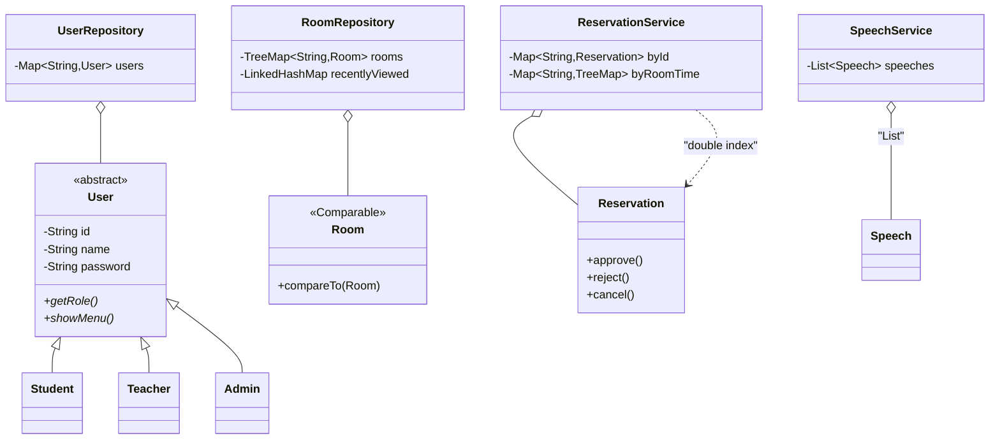

# 第三章：Java 校园身份预约系统

本章是综合案例的**第三关·集合框架大考**——从 [02.银行账户](https://blog.csdn.net/m0_37700275/article/details/103463225) 的"`Account[]` 容量写死 100"跃迁到工业级集合框架：`ArrayList` / `HashMap` / `TreeMap` / `LinkedHashMap` / `HashSet` / `TreeSet` / `PriorityQueue` / `LinkedList` **八件套**配合 `Comparable` / `Comparator` / `Stream` / `Lambda` / `Iterator` 的组合拳。

本案例做 **6 件事**：

1. **8 种集合框架按场景选用**：用户表 = `HashMap`、房间号集合 = `TreeSet`、最近浏览 = `LinkedHashMap`、演讲排行榜 = `PriorityQueue`、操作日志队列 = `LinkedList`、预约时间索引 = `TreeMap`，每种集合都用在它最擅长的地方。
2. **多角色身份体系**：`abstract User` → `Student` / `Teacher` / `Admin` 三态 + `Role` 枚举 —— 比 02 银行账户多一层"角色权限"维度。
3. **资源 + 业务实体三件套**：`Room`（容量、设备列表）+ `Speech`（演讲评分）+ `Reservation`（预约记录）—— 三类实体协同工作。
4. **双索引一致性**：`reserveByRoomId: Map<String, Reservation>` 主键索引 + `reserveByTime: Map<String, TreeMap<LocalDateTime, Reservation>>` 时间索引，**故意造 BUG 演示忘了同步导致的数据错乱**。
5. **现代 Java 三剑客**：`Comparable` / `Comparator` 排序 + `Stream` 流处理 + `Lambda` 表达式 —— 从命令式到声明式的跃迁。
6. **CSV 工业级转义**：4 个 CSV 文件（user / room / speech / reservation）+ 标准 CSV 双引号转义 —— 解决"字段含逗号"的真实工程难题。

**学习方式**：本案例是综合案例里**第一道集合框架硬菜**，按"灵魂三问 → 写最小骨架 → 故意造 BUG → 修复升级 → 阶段小结"循环。共 9 个阶段、约 10 小时，建议**分 2-3 天**完成（第 1 天 §02-§05、第 2 天 §06-§09、第 3 天 §10-§11）。**全程边读边敲，千万别复制粘贴**——本案例是你从"OOP 工程师"走向"集合工程师"的关键跃迁。

---

## 渐进学习节奏

先读这段，再开始敲代码！本案例**严格按真实工程师的开发节奏推进**，不会上来甩 1300 行让你抄。我们的节奏：

```text
阶段 ① User 抽象基类与三态（§03）· 45 min
   └ Step 1.0: 🤔 灵魂三问 #1（02 的 Account 三态可以照搬吗？）
   └ Step 1.1: abstract User 基类 + Role 枚举
   └ Step 1.2: Student / Teacher / Admin 三子类
   └ ✅ main 里多态打印三种用户

阶段 ② 资源实体（§04）· 45 min
   └ Step 2.1: enum RoomType + Room 类
   └ Step 2.2: Speech 类（含评分字段）
   └ Step 2.3: enum ReservationStatus + Reservation 类

阶段 ③ 集合框架挑选指南（§05）· 30 min  【教学高峰⭐】
   └ Step 3.0: 🤔 灵魂三问 #2（用户表用 HashMap 还是 TreeMap？）
   └ Step 3.1: 8 种集合选型大表（必读必背）
   └ Step 3.2: 为本系统每张表选集合的练习题

阶段 ④ UserRepository · HashMap（§06）· 45 min
   └ Step 4.1: register / findById / removeById
   └ Step 4.2: findAllByRole 用 Stream + Predicate
   └ Step 4.3: ⚠️ 造 BUG #1（遍历时 remove → CME）
   └ Step 4.4: 修复（Iterator.remove / removeIf）

阶段 ⑤ RoomRepository · TreeMap + Comparable（§07）· 45 min
   └ Step 5.0: 🤔 灵魂三问 #3（Comparable vs Comparator 怎么选？）
   └ Step 5.1: Room implements Comparable<Room>
   └ Step 5.2: TreeMap 字典序 / TreeSet 容量降序
   └ Step 5.3: LinkedHashMap removeEldestEntry 实现 LRU 最近浏览

阶段 ⑥ ReservationService 双索引（§08）· 90 min  【业务高峰⭐】
   └ Step 6.0: 🤔 灵魂三问 #4（同时段冲突如何检测？）
   └ Step 6.1: 双索引设计（主键索引 + roomId+时间索引）
   └ Step 6.2: TreeMap.subMap 区间查询找冲突
   └ Step 6.3: ⚠️ 造 BUG #2（只更主索引导致数据不一致）
   └ Step 6.4: 修复（addReservationConsistently 原子性私有方法）
   └ Step 6.5: cancelReservation / 查询 API

阶段 ⑦ SpeechService PriorityQueue 排行榜（§09）· 45 min
   └ Step 7.0: 🤔 灵魂三问 #5（Top-K 为什么用堆不用 sort？）
   └ Step 7.1: 大小为 k 的小顶堆维护 Top-K
   └ Step 7.2: Stream + groupingBy 按系别分组求平均

阶段 ⑧ CSV 持久化（§10）· 60 min
   └ Step 8.1: CsvUtil 工具类（split / escape / unescape）
   └ Step 8.2: ⚠️ 造 BUG #3（字段含逗号导致错位）
   └ Step 8.3: 修复（标准 CSV 双引号转义）
   └ Step 8.4: 4 个 Repo save/load + 启动按依赖顺序加载

阶段 ⑨ CLI 主菜单（§11）· 30 min
   └ Step 9.1: 三角色登录 + 多态菜单
   └ Step 9.2: 学生 / 教师 / 管理员各自的功能子菜单
   └ ✅ 端到端跑通完整流程
```

🎯 **每个 Step 必须做的三件事**：

> 1. **看 🎯 阶段目标卡片**：明确做什么、不做什么、验收标准
> 2. **写一小段代码就编译运行一次**（看到 ✏️ 标志立刻动手）
> 3. **看到预期输出再写下一个 Step**（绝不一口气抄完整段代码）

> 🎯 **本案例的 5 处"灵魂三问"**（动手前先想清楚）：
> - **§03 User 抽象前**：02 的 Account 三态可以照搬吗？User 用抽象类还是接口？为什么 Student/Teacher/Admin 应该共享 User 父类？
> - **§05 集合选型前**【🔥 全案例最重要】：用户表用 HashMap 还是 TreeMap？为什么不能都用 ArrayList？8 种集合各自适用场景？
> - **§07 Comparable 前**：为什么 Room 要 implements Comparable？什么情况选 Comparator 而不是 Comparable？两者优先级谁高？
> - **§08 预约表前**：预约表用什么集合？同一房间同一时段冲突如何检测？预约号怎么生成？
> - **§09 排行榜前**：为什么 Top-K 用 PriorityQueue 不用 sort？小顶堆 vs 大顶堆怎么选？

> ⚠️ **本案例的 3 处"陷阱预警"**（亲眼看一次记一辈子）：
> - **§06 ConcurrentModificationException**：遍历 `users.values()` 时调 `users.remove(...)` → CME 抛在脸上
> - **§08 双索引一致性 BUG**：只更主索引、忘了同步时间索引 → 查询结果"幽灵预约"
> - **§10 CSV 字段错位 BUG**：演讲标题含逗号 → split(",") 一刀两半，字段全错

---

## 案例元信息

| 项目 | 说明 |
|------|------|
| 难度 | ★★★★☆（集合框架第一关 + 双索引设计） |
| 预估时长 | 10 小时（建议分 2-3 天） |
| 前置章节 | 入门第 9 章 接口与抽象类、第 10 章 异常、第 11 章 集合框架、第 12 章 IO 流；第 6 章可变参数（回扣）|
| 覆盖知识点 | `abstract class` / `enum` / `Comparable<T>` / `Comparator<T>` / 8 种集合 / `Iterator` / `removeIf` / `Stream` / `Lambda` / 方法引用 `::` / `Optional` / `groupingBy` / `partitioningBy` / `LinkedHashMap.removeEldestEntry` LRU / `TreeMap.subMap` 区间查询 / 双索引一致性 / CSV 双引号转义 |
| 设计亮点 | **双索引设计**（主键 + 时间）+ **多角色多态分发**（Student/Teacher/Admin 不同菜单）+ **集合选型决策表** |
| ⚠ 已知局限 | 单机内存版，没上数据库；多用户并发不安全（线程安全留给 05 案例） |
| 最终产物 | 多包项目（~ 1500 行 Java）+ 4 个 CSV 数据文件 |
| 代码规模 | 6 个包 / 17 个类 / 约 1500 行 |
| JDK 版本 | JDK 17（兼容 JDK 11+）|

### 项目结构

```text
campus-system/
└── src/
    └── com/
        └── campus/
            ├── entity/                # 实体层
            │   ├── User.java          # abstract 基类
            │   ├── Student.java       # 学生
            │   ├── Teacher.java       # 教师
            │   ├── Admin.java         # 管理员
            │   ├── Room.java          # 房间（implements Comparable）
            │   ├── Speech.java        # 演讲
            │   └── Reservation.java   # 预约记录
            ├── enums/                 # 枚举层
            │   ├── Role.java          # STUDENT/TEACHER/ADMIN
            │   ├── RoomType.java      # COMPUTER/MEETING/LAB
            │   └── ReservationStatus.java
            ├── repository/            # 数据访问层（CSV 持久化）
            │   ├── UserRepository.java
            │   ├── RoomRepository.java
            │   ├── SpeechRepository.java
            │   └── ReservationRepository.java
            ├── service/               # 业务逻辑层
            │   ├── ReservationService.java
            │   └── SpeechService.java
            ├── util/                  # 工具
            │   └── CsvUtil.java       # CSV 转义
            └── cli/                   # 用户交互层
                └── Main.java          # 含 main(...)
```

**层与层依赖方向**（单向向下）：

```text
            cli.Main  (UI 入口)
                │
                ▼
    service.ReservationService / SpeechService
            │       │
            ▼       ▼
   entity.* / enums.*    repository.*
   (User 体系/ Room/ ...)    │
                              ▼
                         util.CsvUtil + Files
```

### 编译运行命令

```bash
cd campus-system
javac -d out -encoding UTF-8 $(find src -name "*.java")
java  -cp out com.campus.cli.Main
```

> 📌 **build.sh 一键脚本**：
>
> ```bash
> #!/bin/bash
> rm -rf out && mkdir out
> javac -d out -encoding UTF-8 $(find src -name "*.java") \
>   && echo "✅ 编译成功" \
>   && java -cp out com.campus.cli.Main
> ```

---

## 目录快速导航

> 点击以下条目即可跳转到对应节。【🔑 重点节】推荐优先阅读。

- [渐进学习节奏](#渐进学习节奏) 【🔑 必读】
- [案例元信息](#案例元信息)
- [01.项目需求和功能](#01项目需求和功能)
  - [1.1 需求介绍](#11-需求介绍)
  - [1.2 功能要求](#12-功能要求)
  - [1.3 设计思路](#13-设计思路)
  - [1.4 涉及知识点](#14-涉及知识点)
- [02.项目骨架与包初始化](#02项目骨架与包初始化)
  - [2.1 创建包目录](#21-创建包目录)
  - [2.2 hello main 跑通编译](#22-hello-main-跑通编译)
- [03.User 抽象基类与三态](#03user-抽象基类与三态) 【阶段①】
  - [3.0 灵魂三问 1](#30-灵魂三问-1) 【🤔】
  - [3.1 Role 枚举](#31-role-枚举)
  - [3.2 abstract User 基类](#32-abstract-user-基类)
  - [3.3 Student Teacher Admin 子类](#33-student-teacher-admin-子类)
- [04.资源实体三件套](#04资源实体三件套) 【阶段②】
  - [4.1 RoomType 与 Room](#41-roomtype-与-room)
  - [4.2 Speech 类](#42-speech-类)
  - [4.3 ReservationStatus 与 Reservation](#43-reservationstatus-与-reservation)
- [05.集合框架挑选指南](#05集合框架挑选指南) 【阶段③高峰⭐】
  - [5.0 灵魂三问 2](#50-灵魂三问-2) 【🤔🔥】
  - [5.1 8 种集合选型大表](#51-8-种集合选型大表)
  - [5.2 为本系统选集合](#52-为本系统选集合)
- [06.UserRepository · HashMap 用户表](#06userrepository--hashmap-用户表) 【阶段④】
  - [6.1 register findById removeById](#61-register-findbyid-removebyid)
  - [6.2 findAllByRole Stream 筛选](#62-findallbyrole-stream-筛选)
  - [6.3 ConcurrentModificationException BUG](#63-concurrentmodificationexception-bug) 【⚠️ 造 BUG】
- [07.RoomRepository · TreeMap 与 Comparable](#07roomrepository--treemap-与-comparable) 【阶段⑤】
  - [7.0 灵魂三问 3](#70-灵魂三问-3) 【🤔】
  - [7.1 Room implements Comparable](#71-room-implements-comparable)
  - [7.2 TreeMap 字典序与 TreeSet 容量降序](#72-treemap-字典序与-treeset-容量降序)
  - [7.3 LinkedHashMap LRU 最近浏览](#73-linkedhashmap-lru-最近浏览)
- [08.ReservationService 双索引](#08reservationservice-双索引) 【阶段⑥业务高峰⭐】
  - [8.0 灵魂三问 4](#80-灵魂三问-4) 【🤔】
  - [8.1 双索引设计](#81-双索引设计)
  - [8.2 TreeMap subMap 区间查询](#82-treemap-submap-区间查询)
  - [8.3 双索引一致性 BUG](#83-双索引一致性-bug) 【⚠️ 造 BUG】
  - [8.4 cancelReservation 与查询 API](#84-cancelreservation-与查询-api)
- [09.SpeechService 排行榜](#09speechservice-排行榜) 【阶段⑦】
  - [9.0 灵魂三问 5](#90-灵魂三问-5) 【🤔】
  - [9.1 PriorityQueue Top-K](#91-priorityqueue-top-k)
  - [9.2 Stream groupingBy 分组求平均](#92-stream-groupingby-分组求平均)
- [10.CSV 持久化层](#10csv-持久化层) 【阶段⑧】
  - [10.1 CsvUtil 工具类](#101-csvutil-工具类)
  - [10.2 字段含逗号 BUG 修复](#102-字段含逗号-bug-修复) 【⚠️ 造 BUG】
  - [10.3 4 个 Repository 持久化](#103-4-个-repository-持久化)
- [11.CLI 主菜单](#11cli-主菜单) 【阶段⑨】
  - [11.1 三角色登录与多态分发](#111-三角色登录与多态分发)
  - [11.2 学生 教师 管理员子菜单](#112-学生-教师-管理员子菜单)
- [12.项目总结分析](#12项目总结分析)
  - [12.1 类的整体设计](#121-类的整体设计)
  - [12.2 类关系图](#122-类关系图)
  - [12.3 优缺点分析](#123-优缺点分析)
- [13.项目技术思考](#13项目技术思考)
  - [13.1 集合选型决策树](#131-集合选型决策树)
  - [13.2 双索引设计的代价](#132-双索引设计的代价)
  - [13.3 卷一章节回扣表](#133-卷一章节回扣表)
- [14.衔接与延伸](#14衔接与延伸)
  - [14.1 与上一案例的差异](#141-与上一案例的差异)
  - [14.2 与下一案例的递进](#142-与下一案例的递进)
  - [14.3 三个延伸挑战](#143-三个延伸挑战)

---

## 01.项目需求和功能

### 1.1 需求介绍

校园身份预约系统是高校信息化平台的常见模块。本教程用 Java 实现一个**控制台版**校园预约系统，支持**多角色登录（学生 / 教师 / 管理员）**、**多种资源（机房 / 会议室 / 实验室）**预约、**演讲评分排行榜**、**4 个 CSV 文件持久化**。

**和真实业务的对应关系**：

| 真实业务 | 本系统对应 |
|---------|----------|
| 校园用户体系 | `User` 抽象基类 + 3 个派生（Student/Teacher/Admin） |
| 资源管理 | `Room`（按容量自然排序） |
| 学术活动 | `Speech` + 评分排行榜（PriorityQueue Top-K） |
| 预约记录 | `Reservation` + 双索引（主键 + 时间） |
| 数据持久化 | 4 个 CSV 文件 |
| 用户交互 | 三角色多态菜单 |

### 1.2 功能要求

**核心 12 项功能**：

**学生角色**：

1. 浏览房间列表（按容量降序）
2. 提交预约（指定房间 + 时间段）
3. 查看我的预约
4. 取消预约

**教师角色**：

5. 发布演讲（带分数）
6. 查看演讲 Top-K 排行榜
7. 按系别查看平均分

**管理员角色**：

8. 审批 / 驳回预约
9. 增删用户
10. 增删房间
11. 查看最近浏览房间（LRU 缓存演示）
12. 查看系统总览

### 1.3 设计思路

**关键决策一：用 `abstract User` + 3 子类，而非 `enum Role` 单类**

❌ **过程式写法**：

```java
class User {
    int role;     // 0=学生 1=教师 2=管理员
    String dept;  // 学生才有
    String title; // 教师才有
    int permBits; // 管理员才有
    // 一堆 if-else
    void doAction() {
        if (role == 0) { /* 学生逻辑 */ }
        else if (role == 1) { /* 教师逻辑 */ }
        else { /* 管理员逻辑 */ }
    }
}
```

**问题**：

1. **每个角色都有专属字段**，集中在一个类里 → 50% 字段总是 null
2. **菜单 / 权限 / 行为分发** 全靠 `if (role == X)` 散弹判断
3. **加新角色（比如"校外访客"）= 改 N 处** if-else

✅ **OOP 多态写法**：

```java
abstract class User {
    abstract Role getRole();
    abstract void showMenu();   // 多态：每个子类自己显示菜单
}
class Student extends User { String dept; void showMenu() {...} }
class Teacher extends User { String title; void showMenu() {...} }
class Admin   extends User { int permBits; void showMenu() {...} }
```

**好处**：加 `Visitor` 子类，原有代码一行不改。

**关键决策二：用 8 种集合各司其职，而非"全用 `ArrayList`"**

❌ **新手错误**：

```java
List<User> users = new ArrayList<>();  // 全用 ArrayList，按 ID 找用户走 O(n)
List<Reservation> reservations = new ArrayList<>();  // 找冲突也走 O(n²)
```

✅ **本案例做法**：

```java
Map<String, User> users = new HashMap<>();        // 按 ID O(1) 查
TreeMap<String, Room> rooms = new TreeMap<>();    // 按 ID 字典序遍历
TreeSet<Room> roomsByCap = new TreeSet<>(...);    // 按容量降序
LinkedHashMap<String, Room> recentlyViewed;       // 保留浏览顺序
PriorityQueue<Speech> topK = new PriorityQueue<>();// Top-K 排行榜
Map<String, TreeMap<LocalDateTime, Reservation>> resvByTime;  // 区间查询
```

**好处**：每种集合用在自己最擅长的地方，性能秒杀全 ArrayList 方案。

**关键决策三：双索引保证查询性能**

预约场景有两类高频查询：

- **按预约号查**：`O(1)` 期望 → 用 `HashMap<String, Reservation>` 主键索引
- **按房间 + 时间区间查**：`O(log n + k)` → 用 `Map<String, TreeMap<LocalDateTime, Reservation>>` 二级索引

**代价**：每次写操作要**同步更新两个索引** → 容易忘 → §08 故意造 BUG 演示。

### 1.4 涉及知识点

| 入门章节 | 知识点 | 在本案例的位置 |
|---|---|---|
| 第 7-8 章 类与继承 | abstract class / extends / @Override / super | §03 User 体系 |
| 第 9 章 接口与抽象 | enum / Comparable\<T\> | §03 Role / §07 Room |
| 第 10 章 异常 | 自定义异常 + try-catch | 复用 02 案例 BankException 思路 |
| 第 11 章 集合框架【主菜】 | 8 种集合 / Iterator / Stream / Lambda / 方法引用 | §05 集合选型 + §06-§09 实战 |
| 第 11 章 | Comparator / Comparator.comparing / reversed / thenComparing | §07 RoomRepository |
| 第 11 章 | Optional / orElse / orElseThrow | §06 findById |
| 第 11 章 | Collectors.groupingBy / partitioningBy / averagingDouble | §09 SpeechService |
| 第 12 章 IO 流 | Files.readAllLines / write / Path | §10 CSV 持久化 |
| 第 6 章（回扣） | 可变参数 String... | CsvUtil.join(...) |

---

## 02.项目骨架与包初始化

```text
┌─ 🎯 阶段 ⓪ 目标 ────────────────────────────────────────┐
│ 完成什么：建好 6 个包目录 + 跑通 Hello World            │
│ 不做什么：不写任何业务（全部待实现）                      │
│ 验收标准：javac + java 全跑通，控制台打印"校园预约系统启动"│
│ 预计耗时：15 分钟                                        │
└─────────────────────────────────────────────────────────┘
```

### 2.1 创建包目录

```bash
mkdir -p campus-system/src/com/campus/{entity,enums,repository,service,util,cli}
cd campus-system
```

### 2.2 hello main 跑通编译

新建 `src/com/campus/cli/Main.java`：

```java
package com.campus.cli;

public class Main {
    public static void main(String[] args) {
        System.out.println("校园预约系统启动");
    }
}
```

✏️ **立刻编译运行**：

```bash
javac -d out -encoding UTF-8 $(find src -name "*.java")
java  -cp out com.campus.cli.Main
```

预期输出：

```text
校园预约系统启动
```

✅ 包结构 + 编译命令验证通过。

---

## 03.User 抽象基类与三态

```text
┌─ 🎯 阶段 ① 目标 ────────────────────────────────────────┐
│ 完成什么：abstract User + Role 枚举 + 3 子类             │
│ 不做什么：不做集合（阶段④）/ 不做服务层                   │
│ 验收标准：main 里多态打印三种用户                         │
│ 预计耗时：45 分钟                                        │
└─────────────────────────────────────────────────────────┘
```

### 3.0 灵魂三问 1

🎯 **Step 1.0**：动手前先想清楚 User 的设计选择。

❓ **问题一：02 案例的 Account 三态可以照搬吗？**

回顾 02 案例：`abstract Account` + 3 子类，差异点在"取款规则"和"利率"。

本案例 User 三态差异点：
- **字段差异**：Student 有 `dept`、Teacher 有 `title`、Admin 有 `permBits` —— 跟 02 一样
- **行为差异**：每个角色看到不同的 CLI 菜单 —— **新增维度**
- **权限差异**：管理员能审批预约、其他角色不能 —— **新增维度**

✅ **可以照搬"abstract + 3 子类"骨架，但 abstract 方法要更多**：

```java
abstract class User {
    abstract Role getRole();
    abstract void showMenu();          // 新增：每个角色不同菜单
    // 不强制要求权限方法，因为权限可以基于 Role 枚举判断
}
```

❓ **问题二：User 用抽象类还是接口？**

回顾 02 §12.1 的铁律：

| 维度 | abstract class | interface |
|---|---|---|
| 实例字段 | ✅ | ❌（只能 static final 常量） |
| 构造方法 | ✅ | ❌ |
| 单继承 | ❌ 单 | ✅ 多实现 |

**User 需要持有状态**（id / name / password 三个字段所有角色都有）+ **构造方法初始化**这些字段 → 必须用 `abstract class`。

✅ **结论**：User = abstract class（持有状态）；Reservable = interface（能力契约，留给挑战题）。

❓ **问题三：为什么 Student/Teacher/Admin 应该共享 User 父类？**

来看反例——三个独立类没有共同父类：

```java
class Student { String id; String name; }
class Teacher { String id; String name; }
class Admin   { String id; String name; }

// 问题：登录时怎么放进同一个集合？
// 只能用 Object 装：Map<String, Object> users —— 类型不安全
Map<String, Object> users = new HashMap<>();
Object u = users.get("S001");
// 想拿 name ？要先 instanceof 判断 + 强转，每次都来一次
```

**问题**：

1. **没法统一存储** → `Map<String, ???>` 写不出共同类型
2. **没法多态调用** → `u.showMenu()` 编译失败
3. **共有字段散落** → 每个类各写各的 id/name/password，重复代码

✅ **共享 User 父类**：

```java
Map<String, User> users = new HashMap<>();   // 统一类型
User u = users.get("S001");
u.showMenu();                                 // 多态分发
```

🔑 **三问连起来**：**有共性 + 想多态调用 + 想统一存储 → 必须有共同的抽象基类**。

### 3.1 Role 枚举

🎯 **Step 1.1**：先建 enum，再建 abstract User。

新建 `src/com/campus/enums/Role.java`：

```java
package com.campus.enums;

public enum Role {
    STUDENT("学生"),
    TEACHER("教师"),
    ADMIN("管理员");

    private final String displayName;

    Role(String displayName) {
        this.displayName = displayName;
    }

    public String getDisplayName() { return displayName; }

    /** 从字符串解析（CSV 反序列化用）*/
    public static Role fromString(String s) {
        for (Role r : values()) {
            if (r.name().equalsIgnoreCase(s)) return r;
        }
        throw new IllegalArgumentException("未知 Role: " + s);
    }
}
```

> 💡 **enum 三特性**（vs 用 `int` 常量）：
>
> 1. **类型安全**：`Role r = 5` 编译报错，`int role = 5` 不报错
> 2. **可带字段方法**：`Role.STUDENT.getDisplayName()` 返回中文名
> 3. **`values()` 自动遍历**：写菜单时不用手写 if-else 链
>
> 🔑 **铁律**：**任何"少量、固定、有名字"的枚举值都用 `enum`，绝不用 `int` 常量**。

### 3.2 abstract User 基类

🎯 **Step 1.2**：新建 `src/com/campus/entity/User.java`：

```java
package com.campus.entity;

import com.campus.enums.Role;

public abstract class User {
    protected final String id;
    protected String name;
    protected String password;

    protected User(String id, String name, String password) {
        this.id = id;
        this.name = name;
        this.password = password;
    }

    // ===== 公共 getter =====
    public String getId() { return id; }
    public String getName() { return name; }
    public void setName(String name) { this.name = name; }
    public boolean checkPassword(String input) {
        return password != null && password.equals(input);
    }

    // ===== 抽象方法（强制子类实现）=====
    public abstract Role getRole();
    public abstract void showMenu();

    // ===== Object 三件套 =====
    @Override
    public String toString() {
        return String.format("%s[id=%s, name=%s, role=%s]",
                getClass().getSimpleName(), id, name, getRole());
    }

    @Override
    public boolean equals(Object o) {
        if (this == o) return true;
        if (!(o instanceof User u)) return false;
        return id.equals(u.id);
    }

    @Override
    public int hashCode() { return id.hashCode(); }
}
```

> 🔑 **`protected` 字段**：让子类直接访问，避免 getter 链路过长；但**外部包禁止访问**（封装边界）。
>
> 💡 **`equals/hashCode` 必须同时重写**：因为 `HashMap<String, User>` 的 key 不会用 User，但 `Set<User>` 或 `users.values().contains(u)` 会用，**养成必写的习惯**。

### 3.3 Student Teacher Admin 子类

🎯 **Step 1.3**：

`src/com/campus/entity/Student.java`：

```java
package com.campus.entity;

import com.campus.enums.Role;

public class Student extends User {
    private String department;
    private String studentNo;

    public Student(String id, String name, String password,
                   String department, String studentNo) {
        super(id, name, password);
        this.department = department;
        this.studentNo = studentNo;
    }

    @Override
    public Role getRole() { return Role.STUDENT; }

    @Override
    public void showMenu() {
        System.out.println("\n===== 学生菜单 =====");
        System.out.println("1. 浏览房间   2. 提交预约");
        System.out.println("3. 我的预约   4. 取消预约");
        System.out.println("0. 退出");
    }

    public String getDepartment() { return department; }
    public String getStudentNo()  { return studentNo;  }
}
```

`src/com/campus/entity/Teacher.java`：

```java
package com.campus.entity;

import com.campus.enums.Role;

public class Teacher extends User {
    private String department;
    private String title;        // 讲师 / 副教授 / 教授

    public Teacher(String id, String name, String password,
                   String department, String title) {
        super(id, name, password);
        this.department = department;
        this.title = title;
    }

    @Override
    public Role getRole() { return Role.TEACHER; }

    @Override
    public void showMenu() {
        System.out.println("\n===== 教师菜单 =====");
        System.out.println("1. 发布演讲   2. 演讲 Top-K");
        System.out.println("3. 按系别平均分");
        System.out.println("0. 退出");
    }

    public String getDepartment() { return department; }
    public String getTitle()      { return title; }
}
```

`src/com/campus/entity/Admin.java`：

```java
package com.campus.entity;

import com.campus.enums.Role;

public class Admin extends User {
    /** 权限位标记：bit 0=审批预约 / bit 1=管理用户 / bit 2=管理房间 */
    private int permBits;

    public Admin(String id, String name, String password, int permBits) {
        super(id, name, password);
        this.permBits = permBits;
    }

    public boolean canApprove()      { return (permBits & 0b001) != 0; }
    public boolean canManageUser()   { return (permBits & 0b010) != 0; }
    public boolean canManageRoom()   { return (permBits & 0b100) != 0; }

    @Override
    public Role getRole() { return Role.ADMIN; }

    @Override
    public void showMenu() {
        System.out.println("\n===== 管理员菜单 =====");
        if (canApprove())    System.out.println("1. 审批预约");
        if (canManageUser()) System.out.println("2. 增删用户");
        if (canManageRoom()) System.out.println("3. 增删房间");
        System.out.println("4. 最近浏览房间   5. 系统总览");
        System.out.println("0. 退出");
    }
}
```

✏️ **立刻编译并测试多态** —— 修改 `Main.java`：

```java
package com.campus.cli;

import com.campus.entity.*;

public class Main {
    public static void main(String[] args) {
        User[] users = {
            new Student("S001", "张三", "pwd", "计算机系", "20240001"),
            new Teacher("T001", "李教授", "pwd", "计算机系", "教授"),
            new Admin  ("A001", "管理员", "pwd", 0b111),
        };
        for (User u : users) {
            System.out.println(u);
            u.showMenu();   // ⭐ 多态分发：3 种菜单
        }
    }
}
```

预期输出：

```text
Student[id=S001, name=张三, role=STUDENT]
===== 学生菜单 =====
1. 浏览房间   2. 提交预约
...
Teacher[id=T001, name=李教授, role=TEACHER]
===== 教师菜单 =====
1. 发布演讲   2. 演讲 Top-K
...
Admin[id=A001, name=管理员, role=ADMIN]
===== 管理员菜单 =====
1. 审批预约
2. 增删用户
3. 增删房间
4. 最近浏览房间   5. 系统总览
...
```

✅ **多态发威**：同一段 `u.showMenu()` 三种角色三种菜单。

```text
┌─ 📌 阶段 ① 小结 ────────────────────────────────────────┐
│ ✅ 你完成了：                                              │
│   • Role 枚举 + abstract User + 3 子类                    │
│   • 多态 showMenu 分发                                     │
│   • equals/hashCode/toString 三件套                        │
│                                                            │
│ 🔑 此刻领悟：                                              │
│   "abstract class = 共性字段 + 共性构造 + 强制实现"        │
│                                                            │
│ 📌 git commit -m "stage1: User abstract + 3 roles"        │
└─────────────────────────────────────────────────────────┘
```

---

## 04.资源实体三件套

```text
┌─ 🎯 阶段 ② 目标 ────────────────────────────────────────┐
│ 完成什么：Room / Speech / Reservation 三个实体类           │
│ 不做什么：不做 Comparable（阶段⑤）/ 不做集合（阶段④）      │
│ 验收标准：三个实体类编译通过 + main 里 new 出实例          │
│ 预计耗时：45 分钟                                          │
└─────────────────────────────────────────────────────────┘
```

### 4.1 RoomType 与 Room

🎯 **Step 2.1**：

`src/com/campus/enums/RoomType.java`：

```java
package com.campus.enums;

public enum RoomType {
    COMPUTER("机房"),
    MEETING ("会议室"),
    LAB     ("实验室");

    private final String displayName;
    RoomType(String displayName) { this.displayName = displayName; }
    public String getDisplayName() { return displayName; }
}
```

`src/com/campus/entity/Room.java`（**先不加 Comparable，§07 阶段⑤再加**）：

```java
package com.campus.entity;

import com.campus.enums.RoomType;
import java.util.ArrayList;
import java.util.List;

public class Room {
    private final String id;
    private RoomType type;
    private int capacity;
    private final List<String> equipments;   // 投影 / 白板 / 计算机 ...

    public Room(String id, RoomType type, int capacity, List<String> equipments) {
        this.id = id;
        this.type = type;
        this.capacity = capacity;
        this.equipments = new ArrayList<>(equipments);  // 防御性拷贝
    }

    // ===== getter =====
    public String getId()           { return id; }
    public RoomType getType()       { return type; }
    public int getCapacity()        { return capacity; }
    public List<String> getEquipments() {
        return new ArrayList<>(equipments);  // 防御性拷贝，外部改不到内部
    }

    public void addEquipment(String e) { equipments.add(e); }

    @Override
    public String toString() {
        return String.format("Room[id=%s, type=%s, cap=%d, eq=%s]",
                id, type.getDisplayName(), capacity, equipments);
    }
}
```

> 🔑 **防御性拷贝两处**：
>
> 1. **构造里**：`new ArrayList<>(equipments)` —— 防外部传入的 List 被它自己改后影响 Room
> 2. **getter 里**：返回新 ArrayList —— 防外部拿到 List 后改影响 Room
>
> **不可变性是值对象的灵魂**。如果不做防御性拷贝，外部一句 `room.getEquipments().clear()` 就把房间设备全清了。

### 4.2 Speech 类

🎯 **Step 2.2**：`src/com/campus/entity/Speech.java`：

```java
package com.campus.entity;

import java.time.LocalDateTime;

public class Speech {
    private final String id;
    private String title;
    private final String speakerId;
    private String department;        // 演讲者所在系别（用于按系别分组）
    private double score;             // 评分（用于 Top-K 排行榜）
    private final LocalDateTime createdAt;

    public Speech(String id, String title, String speakerId,
                  String department, double score) {
        this.id = id;
        this.title = title;
        this.speakerId = speakerId;
        this.department = department;
        this.score = score;
        this.createdAt = LocalDateTime.now();
    }

    public String getId()        { return id; }
    public String getTitle()     { return title; }
    public String getSpeakerId() { return speakerId; }
    public String getDepartment(){ return department; }
    public double getScore()     { return score; }
    public LocalDateTime getCreatedAt() { return createdAt; }

    public void setScore(double score) { this.score = score; }

    @Override
    public String toString() {
        return String.format("Speech[%s | %s | speaker=%s | dept=%s | score=%.1f]",
                id, title, speakerId, department, score);
    }
}
```

### 4.3 ReservationStatus 与 Reservation

🎯 **Step 2.3**：

`src/com/campus/enums/ReservationStatus.java`：

```java
package com.campus.enums;

public enum ReservationStatus {
    PENDING ("待审批"),
    APPROVED("已审批"),
    REJECTED("已驳回"),
    CANCELED("已取消");

    private final String displayName;
    ReservationStatus(String displayName) { this.displayName = displayName; }
    public String getDisplayName() { return displayName; }
}
```

`src/com/campus/entity/Reservation.java`：

```java
package com.campus.entity;

import com.campus.enums.ReservationStatus;
import java.time.LocalDateTime;
import java.time.format.DateTimeFormatter;

public class Reservation {
    private final String id;
    private final String userId;
    private final String roomId;
    private final LocalDateTime startTime;
    private final LocalDateTime endTime;
    private ReservationStatus status;     // 唯一可变字段（审批/取消会改）

    public Reservation(String id, String userId, String roomId,
                       LocalDateTime startTime, LocalDateTime endTime) {
        if (!endTime.isAfter(startTime)) {
            throw new IllegalArgumentException("结束时间必须晚于开始时间");
        }
        this.id = id;
        this.userId = userId;
        this.roomId = roomId;
        this.startTime = startTime;
        this.endTime = endTime;
        this.status = ReservationStatus.PENDING;
    }

    public String getId()       { return id; }
    public String getUserId()   { return userId; }
    public String getRoomId()   { return roomId; }
    public LocalDateTime getStartTime() { return startTime; }
    public LocalDateTime getEndTime()   { return endTime; }
    public ReservationStatus getStatus(){ return status; }

    public void approve() { this.status = ReservationStatus.APPROVED; }
    public void reject()  { this.status = ReservationStatus.REJECTED; }
    public void cancel()  { this.status = ReservationStatus.CANCELED; }

    private static final DateTimeFormatter FMT =
            DateTimeFormatter.ofPattern("MM-dd HH:mm");

    @Override
    public String toString() {
        return String.format("Reservation[%s | user=%s | room=%s | %s~%s | %s]",
                id, userId, roomId,
                startTime.format(FMT), endTime.format(FMT),
                status.getDisplayName());
    }
}
```

> 💡 **构造方法里校验时间合法性** + **状态机方法 approve/reject/cancel** —— 这是"业务约束写进类内"的体现，比"裸暴露 setStatus"更安全。

```text
┌─ 📌 阶段 ② 小结 ────────────────────────────────────────┐
│ ✅ Room / Speech / Reservation + 2 个枚举               │
│ 🔑 防御性拷贝 + 构造时校验 + 状态机方法                   │
│ 📌 git commit -m "stage2: entities + enums"             │
└─────────────────────────────────────────────────────────┘
```

---

## 05.集合框架挑选指南

```text
┌─ 🎯 阶段 ③ 目标【教学高峰⭐】 ──────────────────────────┐
│ 完成什么：理解 8 种集合各自适用场景，并为本系统选型        │
│ 不做什么：不写代码（这是纯思考阶段，但极其关键）            │
│ 验收标准：能默写出"按 ID 查 → HashMap、按时间排 → TreeMap" │
│ 预计耗时：30 分钟（建议反复回看，是后续所有阶段的基础）     │
└─────────────────────────────────────────────────────────┘
```

### 5.0 灵魂三问 2

🎯 **Step 3.0**：**全案例最重要的灵魂三问**。

❓ **问题一：用户表用 HashMap 还是 TreeMap？**

业务需求：根据用户 ID 登录、查询、修改、删除。

| 操作 | HashMap | TreeMap |
|---|---|---|
| put / get / remove 时间复杂度 | **O(1) 期望** | O(log n) |
| 是否保留顺序 | ❌ 无序 | ✅ 按 key 自然排序 |
| 内存占用 | 较低 | 较高（红黑树节点） |
| 是否需要 key 实现 Comparable | ❌ 不需要 | ✅ 需要 |

✅ **本案例选 HashMap**：用户登录是高频"按 ID 查"操作，O(1) 比 O(log n) 优势明显；用户表也不需要"按 ID 字典序遍历"。

> 💡 **何时反过来选 TreeMap**？
> - 需要"按 key 区间查询"（比如查 ID 在 "S001"~"S100" 之间的用户）
> - 需要按 key 顺序遍历输出
> - 需要找"最小 / 最大 key" → `firstKey() / lastKey()`

❓ **问题二：为什么不能都用 ArrayList？**

来看反例：

```java
List<User> users = new ArrayList<>();
// 按 ID 查
public User findById(String id) {
    for (User u : users) {        // ⚠️ O(n) 线性查找
        if (u.getId().equals(id)) return u;
    }
    return null;
}
```

**问题**：

1. **查找 O(n)** —— 1 万用户每次登录扫 1 万次，10 万用户系统直接卡死
2. **去重靠手动**：注册时要先 `findById` 检查重名，又一次 O(n)
3. **删除 O(n)**：找到位置 + 后续元素前移

**对比 HashMap**：

| 操作 | ArrayList | HashMap |
|---|---|---|
| findById | O(n) | **O(1) 期望** |
| add（要去重） | O(n) | **O(1) 期望** |
| remove | O(n) | **O(1) 期望** |

✅ **结论**：**有"按 key 查"需求 → HashMap；只是顺序遍历 → ArrayList**。

❓ **问题三：8 种集合各自适用场景？**

见下一节。

🔑 **三问连起来**：**集合选型 = 看高频操作 → 选 O(?) 的容器**。

### 5.1 8 种集合选型大表

🎯 **Step 3.1**：**这张表是本案例最重要的产物，建议打印出来贴墙上**。

| 集合 | 底层 | 高频操作 O() | 是否有序 | 是否允许重复 | 典型场景 | 本案例用在哪 |
|---|---|---|---|---|---|---|
| **ArrayList** | 动态数组 | get O(1) / add 末尾 O(1) / remove O(n) | 插入顺序 | ✅ | 顺序遍历、按下标随机访问 | 演讲列表、设备列表 |
| **LinkedList** | 双向链表 | add 头/尾 O(1) / get O(n) / remove O(1) | 插入顺序 | ✅ | 队列 / 双端队列 / 频繁头尾增删 | 操作日志队列 |
| **HashMap** | 哈希表 | put/get/remove **O(1) 期望** | ❌ 无序 | key 不可重 | 按 key 查 | **用户表 / 房间表 / 预约主索引** |
| **TreeMap** | 红黑树 | put/get/remove O(log n) | ✅ 按 key 排序 | key 不可重 | 区间查询、按 key 排序 | **预约时间索引（subMap）** |
| **LinkedHashMap** | 哈希表 + 双向链表 | put/get O(1) + 保留顺序 | ✅ 插入顺序或访问顺序 | key 不可重 | LRU 缓存、保留遍历顺序的 Map | **最近浏览房间（LRU）** |
| **HashSet** | HashMap 包装 | add/contains O(1) | ❌ | ❌ | 去重、快速判存在 | 学生已预约房间集合 |
| **TreeSet** | TreeMap 包装 | add/contains O(log n) | ✅ 自然排序 | ❌ | 按值排序 + 去重 | **房间按容量降序集合** |
| **PriorityQueue** | 二叉堆 | add/poll O(log n) / peek O(1) | ❌（按优先级出队） | ✅ | 任务调度、Top-K | **演讲 Top-K 排行榜** |

**口诀**（5 句话记住选型）：

> 1. **顺序遍历 / 下标访问 → `ArrayList`**
> 2. **频繁头尾增删 / 队列 → `LinkedList`**
> 3. **按 key 查（不需顺序）→ `HashMap` / `HashSet`**
> 4. **按 key 排序 / 区间查询 → `TreeMap` / `TreeSet`**
> 5. **保留访问顺序（LRU）→ `LinkedHashMap`**；**Top-K → `PriorityQueue`**

🔑 **现代 Java 经验法则**：**先想清楚"需要 O(?) 的什么操作"，再选集合**。新手常见错误是"上来就 ArrayList"，最后所有查询全 O(n)。

### 5.2 为本系统选集合

🎯 **Step 3.2**：把上表用到本案例的每一张数据表。

| 数据表 | 高频操作 | 选什么 | 为什么 |
|---|---|---|---|
| **用户表** | 按 ID 查 | `Map<String, User> = HashMap<>()` | O(1) 登录 |
| **房间表** | 按 ID 查 + 按 ID 字典序输出 | `Map<String, Room> = TreeMap<>()` | 输出顺序友好 |
| **房间按容量排序视图** | 取容量最大房间 / 按容量降序遍历 | `TreeSet<Room>(Comparator.comparingInt(Room::getCapacity).reversed())` | 自动排序 |
| **最近浏览房间** | 限定 5 个 + 保留访问顺序 | `LinkedHashMap<String, Room>(5, 0.75f, true)` + `removeEldestEntry` | LRU 缓存 |
| **预约主索引** | 按预约 ID 查 | `Map<String, Reservation> = HashMap<>()` | O(1) 查 |
| **预约时间索引** | 按 roomId + 时间区间冲突检测 | `Map<String, TreeMap<LocalDateTime, Reservation>>` | TreeMap.subMap O(log n + k) |
| **演讲列表** | 顺序遍历 | `List<Speech> = ArrayList<>()` | 顺序读 |
| **演讲 Top-K** | 维护前 K 个高分 | `PriorityQueue<Speech>(comparator)` | 堆排维护 K 个 |
| **学生已预约房间** | 快速判 contains + 去重 | `Set<String> = HashSet<>()` | O(1) contains |
| **操作日志** | 头尾追加、定期清理头部 | `Deque<String> = LinkedList<>()` | 队列操作 |

**对照看一遍这张表，再开始写后面的代码** —— 后续每个 Repository / Service 都对照这张表选集合。

```text
┌─ 📌 阶段 ③ 小结 ────────────────────────────────────────┐
│ ✅ 你完成了：                                              │
│   • 8 种集合选型大表（建议打印贴墙）                       │
│   • 为本系统每张数据表选集合                               │
│                                                            │
│ 🔑 此刻领悟：                                              │
│   "集合选型 = 看高频操作 → 选 O(?) 最优的容器；            │
│    新手常错：所有都用 ArrayList，性能爆炸"                 │
│                                                            │
│ 📌 git commit -m "stage3: collection selection"           │
└─────────────────────────────────────────────────────────┘
```

---

## 06.UserRepository · HashMap 用户表

```text
┌─ 🎯 阶段 ④ 目标 ────────────────────────────────────────┐
│ 完成什么：UserRepository 完整 CRUD + Stream 筛选           │
│ 不做什么：不做 CSV 持久化（阶段⑧）                         │
│ 验收标准：注册 / 查找 / 删除 / 按角色筛选都跑通             │
│ 预计耗时：45 分钟                                          │
└─────────────────────────────────────────────────────────┘
```

### 6.1 register findById removeById

🎯 **Step 4.1**：新建 `src/com/campus/repository/UserRepository.java`：

```java
package com.campus.repository;

import com.campus.entity.User;
import com.campus.enums.Role;

import java.util.*;
import java.util.stream.Collectors;

public class UserRepository {
    /** ⭐ 选用 HashMap：按 ID 查找 O(1) */
    private final Map<String, User> users = new HashMap<>();

    /** 注册（重复 ID 抛异常）*/
    public void register(User u) {
        Objects.requireNonNull(u, "用户不能为 null");
        if (users.containsKey(u.getId())) {
            throw new IllegalArgumentException("用户 ID 已存在: " + u.getId());
        }
        users.put(u.getId(), u);
    }

    /** 按 ID 查找（找不到返回 Optional.empty）*/
    public Optional<User> findById(String id) {
        return Optional.ofNullable(users.get(id));
    }

    /** 按 ID 删除（返回是否真的删了）*/
    public boolean removeById(String id) {
        return users.remove(id) != null;
    }

    /** 总数 */
    public int size() { return users.size(); }

    /** 全部用户（防御性拷贝）*/
    public Collection<User> findAll() {
        return new ArrayList<>(users.values());
    }
}
```

> 💡 **`Optional` 的价值**：调用方拿到 `Optional<User>` 必须显式处理"可能没有"的情况；如果返回裸 `User`，调用方很容易忘记判 null → NPE。**返回值表达"可能不存在"的语义就用 Optional**。

### 6.2 findAllByRole Stream 筛选

🎯 **Step 4.2**：继续追加 Stream + Lambda：

```java
    /** 按角色筛选（Stream + Lambda）*/
    public List<User> findAllByRole(Role role) {
        return users.values().stream()
                .filter(u -> u.getRole() == role)            // ⭐ Lambda 表达式
                .sorted(Comparator.comparing(User::getId))    // ⭐ 方法引用 ::
                .collect(Collectors.toList());
    }

    /** 统计每种角色的人数 */
    public Map<Role, Long> countByRole() {
        return users.values().stream()
                .collect(Collectors.groupingBy(
                        User::getRole,
                        Collectors.counting()));              // ⭐ 分组计数
    }
```

> 🔑 **三种 Lambda 写法**等价：
>
> ```java
> .filter(u -> u.getRole() == role)        // Lambda 表达式
> .sorted(Comparator.comparing(u -> u.getId()))  // Lambda
> .sorted(Comparator.comparing(User::getId))     // 方法引用（更优雅）
> ```
>
> **方法引用 `User::getId` 等价于 `u -> u.getId()`**——是"无副作用调用单方法"的语法糖。能用方法引用就不写完整 Lambda。

✏️ **测试** —— 修改 `Main.java`：

```java
package com.campus.cli;

import com.campus.entity.*;
import com.campus.enums.Role;
import com.campus.repository.UserRepository;

public class Main {
    public static void main(String[] args) {
        UserRepository repo = new UserRepository();
        repo.register(new Student("S001", "张三", "p", "计算机系", "20240001"));
        repo.register(new Student("S002", "李四", "p", "数学系",   "20240002"));
        repo.register(new Teacher("T001", "王教授", "p", "计算机系", "教授"));
        repo.register(new Admin  ("A001", "管理员", "p", 0b111));

        System.out.println("总人数: " + repo.size());
        System.out.println("按角色统计: " + repo.countByRole());
        System.out.println("\n所有学生:");
        repo.findAllByRole(Role.STUDENT).forEach(System.out::println);
    }
}
```

预期输出：

```text
总人数: 4
按角色统计: {STUDENT=2, TEACHER=1, ADMIN=1}

所有学生:
Student[id=S001, name=张三, role=STUDENT]
Student[id=S002, name=李四, role=STUDENT]
```

### 6.3 ConcurrentModificationException BUG

🎯 **Step 4.3**：⚠️ **造 BUG #1** —— 演示遍历时 remove 的灾难。

继续追加测试代码到 `Main.java`：

```java
        // ❌ 反例：遍历 values 同时 remove → ConcurrentModificationException
        try {
            for (User u : repo.findAll()) {
                if (u.getRole() == Role.STUDENT) {
                    repo.removeById(u.getId());     // ⚠️ 注意：findAll 已经返回拷贝
                }
            }
            System.out.println("通过拷贝集合移除：成功，剩 " + repo.size());
        } catch (ConcurrentModificationException e) {
            System.out.println("✗ CME: " + e.getMessage());
        }

        // ❌ 真正会抛 CME 的反例：直接对 values 视图遍历 + 修改原 map
        repo.register(new Student("S003", "王五", "p", "物理系", "20240003"));
        try {
            // ⚠️ 故意暴露 internal map（生产代码不该这么做，仅为演示）
            Map<String, User> internal = exposeInternal(repo);
            for (User u : internal.values()) {
                if (u.getRole() == Role.STUDENT) {
                    internal.remove(u.getId());          // ⚠️ 触发 CME
                }
            }
        } catch (ConcurrentModificationException e) {
            System.out.println("✗ CME 在直接对 values 视图修改时触发: " + e.getClass().getSimpleName());
        }
    }

    /** 用反射拿到内部 map，仅为演示 CME（生产代码绝不要这么做）*/
    @SuppressWarnings("unchecked")
    static Map<String, User> exposeInternal(UserRepository repo) throws Exception {
        java.lang.reflect.Field f = UserRepository.class.getDeclaredField("users");
        f.setAccessible(true);
        return (Map<String, User>) f.get(repo);
    }
```

> 💡 **CME 触发原理**：HashMap 内部维护 `modCount` 计数；`Iterator` 创建时记下 `expectedModCount`；每次 `next()` 检查两者是否相等，不等就抛 `ConcurrentModificationException`。**"防止迭代过程中数据被改"的安全网**。

🎯 **Step 4.4**：✅ **修复方案三种**——

**方案 A**：`Iterator.remove()`（迭代器自己提供的安全 remove）

```java
Iterator<Map.Entry<String, User>> it = users.entrySet().iterator();
while (it.hasNext()) {
    Map.Entry<String, User> entry = it.next();
    if (entry.getValue().getRole() == Role.STUDENT) {
        it.remove();      // ✅ 通过迭代器自己 remove，不会触发 CME
    }
}
```

**方案 B**：`removeIf`（推荐，函数式一行）

```java
users.values().removeIf(u -> u.getRole() == Role.STUDENT);   // ⭐ 一行搞定
```

**方案 C**：先收集 ID 再删（最原始但最稳）

```java
List<String> toDelete = users.values().stream()
        .filter(u -> u.getRole() == Role.STUDENT)
        .map(User::getId)
        .collect(Collectors.toList());
toDelete.forEach(users::remove);
```

✅ 在 `UserRepository` 加上 `removeByRole`：

```java
    /** 按角色批量删除（用 removeIf）*/
    public int removeByRole(Role role) {
        int before = users.size();
        users.values().removeIf(u -> u.getRole() == role);
        return before - users.size();
    }
```

> 🔑 **铁律**：**遍历集合时想修改集合，要么用 `Iterator.remove()`、要么用 `removeIf`、要么用 Stream + collect 后再删 —— 直接 `for-each + remove` 必抛 CME**。这是 Java 集合的"经典 BUG"，亲眼看一次记一辈子。

```text
┌─ 📌 阶段 ④ 小结 ────────────────────────────────────────┐
│ ✅ UserRepository CRUD + Stream + Lambda                   │
│ ⚠️ CME → 修复（Iterator.remove / removeIf / collect 再删） │
│ 🔑 modCount 安全网原理 + Optional 表达"可能不存在"         │
│ 📌 git commit -m "stage4: UserRepository + CME"           │
└─────────────────────────────────────────────────────────┘
```

---

## 07.RoomRepository · TreeMap 与 Comparable

```text
┌─ 🎯 阶段 ⑤ 目标 ────────────────────────────────────────┐
│ 完成什么：Room implements Comparable + 3 种集合视图        │
│ 不做什么：不做预约（阶段⑥）                                │
│ 验收标准：3 种排序视图 + LRU 最近浏览全跑通                 │
│ 预计耗时：45 分钟                                          │
└─────────────────────────────────────────────────────────┘
```

### 7.0 灵魂三问 3

🎯 **Step 5.0**：

❓ **问题一：为什么 Room 要 implements Comparable？**

业务需求：把房间按"容量降序"输出。

❌ **不实现 Comparable 的痛**：每次排序都要传 Comparator：

```java
List<Room> rooms = ...;
rooms.sort(Comparator.comparingInt(Room::getCapacity).reversed());  // 每次都写
```

✅ **实现 Comparable**：定义"自然排序" → 不传 Comparator 也能排：

```java
class Room implements Comparable<Room> {
    @Override
    public int compareTo(Room o) {
        return Integer.compare(o.capacity, this.capacity);  // 容量降序（注意 o 在前）
    }
}
List<Room> rooms = ...;
rooms.sort(null);   // 用自然排序
new TreeSet<>(rooms);  // TreeSet 自动用 Comparable
```

❓ **问题二：什么情况选 Comparator 而不是 Comparable？**

| 场景 | 选 Comparable | 选 Comparator |
|---|---|---|
| 类有"唯一最自然的排序方式" | ✅ | ❌ |
| 排序方式因业务上下文而变 | ❌ | ✅ |
| 不是自己写的类（比如第三方库的类）| ❌（改不了源码）| ✅ |
| 多种排序并存（按容量 / 按 ID / 按类型）| ❌（只能定义一种）| ✅（每种写一个）|

✅ **本案例**：Room 的"容量降序"是最常见排序 → 用 Comparable；但**也提供 Comparator** 应对"按 ID 字典序" / "按类型分组"等场景。

❓ **问题三：Comparable 和 Comparator 谁优先级高？**

```java
TreeSet<Room> set1 = new TreeSet<>();                    // 用 Comparable
TreeSet<Room> set2 = new TreeSet<>(Comparator.comparing(Room::getId));  // 用 Comparator
```

**铁律**：**TreeSet/TreeMap/PriorityQueue 构造时传了 Comparator → 用 Comparator；没传 → 用 Comparable**。

> 🔑 **`Collections.sort(list)` / `list.sort(null)` 也是同样规则**：传 null 则用 Comparable，传 Comparator 则用 Comparator。

🔑 **三问连起来**：**Comparable = "我的最自然排序"；Comparator = "本次场景的排序"。一个类可以两者并存**。

### 7.1 Room implements Comparable

🎯 **Step 5.1**：修改 `src/com/campus/entity/Room.java` 加上 `implements Comparable<Room>`：

```java
public class Room implements Comparable<Room> {     // ✨ 加 implements
    // ... 已有字段 / 构造 / getter ...

    @Override
    public int compareTo(Room o) {
        // 容量降序；容量相同则按 ID 升序
        int byCap = Integer.compare(o.capacity, this.capacity);  // 注意 o 在前才是降序
        if (byCap != 0) return byCap;
        return this.id.compareTo(o.id);
    }
}
```

> 💡 **二级排序**：先按容量降序，容量一样按 ID 升序——避免"两个容量相同的房间"在 TreeSet 里被认为相等而互相吞掉。**这是写 compareTo 最容易踩的坑：返回 0 = TreeSet 认为相等 = 后插入的会丢**。

### 7.2 TreeMap 字典序与 TreeSet 容量降序

🎯 **Step 5.2**：新建 `src/com/campus/repository/RoomRepository.java`：

```java
package com.campus.repository;

import com.campus.entity.Room;
import com.campus.enums.RoomType;

import java.util.*;
import java.util.stream.Collectors;

public class RoomRepository {

    /** ⭐ 选用 TreeMap：按 ID 字典序自动排序 */
    private final Map<String, Room> rooms = new TreeMap<>();

    /** ⭐ 选用 LinkedHashMap (accessOrder=true) 实现 LRU */
    private final LinkedHashMap<String, Room> recentlyViewed =
            new LinkedHashMap<>(8, 0.75f, true) {
        @Override
        protected boolean removeEldestEntry(Map.Entry<String, Room> eldest) {
            return size() > 5;     // 限制 5 个
        }
    };

    public void add(Room r) {
        if (rooms.containsKey(r.getId())) {
            throw new IllegalArgumentException("房间 ID 已存在: " + r.getId());
        }
        rooms.put(r.getId(), r);
    }

    public Optional<Room> findById(String id) {
        Room r = rooms.get(id);
        if (r != null) recentlyViewed.put(id, r);    // ⭐ 触发 LRU 排序
        return Optional.ofNullable(r);
    }

    public boolean remove(String id) {
        recentlyViewed.remove(id);
        return rooms.remove(id) != null;
    }

    /** 视图 1：按 ID 字典序（TreeMap 自带）*/
    public List<Room> findAllOrderById() {
        return new ArrayList<>(rooms.values());      // TreeMap.values 已经按 key 排序
    }

    /** 视图 2：按容量降序（用 Comparable 自然排序）*/
    public List<Room> findAllOrderByCapacityDesc() {
        return rooms.values().stream()
                .sorted()                            // ⭐ 自然排序（用 Comparable）
                .collect(Collectors.toList());
    }

    /** 视图 3：按类型分组 */
    public Map<RoomType, List<Room>> groupByType() {
        return rooms.values().stream()
                .collect(Collectors.groupingBy(Room::getType));
    }

    /** 视图 4：找容量最大的 N 个 */
    public List<Room> topNByCapacity(int n) {
        return rooms.values().stream()
                .sorted()                            // 用 Comparable，已经容量降序
                .limit(n)
                .collect(Collectors.toList());
    }

    /** 视图 5：最近浏览（LRU）*/
    public List<Room> recentlyViewed() {
        // LinkedHashMap accessOrder=true 时，遍历顺序是"最旧 → 最新"
        // 我们想"最新在前"，所以反转
        List<Room> list = new ArrayList<>(recentlyViewed.values());
        Collections.reverse(list);
        return list;
    }

    public int size() { return rooms.size(); }
}
```

### 7.3 LinkedHashMap LRU 最近浏览

🎯 **Step 5.3**：上面已经把 LRU 写完了，重点解读三个参数：

```java
new LinkedHashMap<>(8, 0.75f, true) {
    @Override
    protected boolean removeEldestEntry(Map.Entry<String, Room> eldest) {
        return size() > 5;     // 超过 5 个就移除最旧的
    }
}
```

| 参数 | 值 | 含义 |
|---|---|---|
| 第 1 参 initialCapacity | 8 | 初始容量 |
| 第 2 参 loadFactor | 0.75f | 负载因子（HashMap 默认值）|
| 第 3 参 **accessOrder** | **true** | ⭐ **true = 按访问顺序排序（每次 get/put 把节点移到末尾）；false = 按插入顺序** |
| 重写 `removeEldestEntry` | size() > 5 | put 后自动检查，true 则移除最旧节点 |

**这就是手写 LRU 缓存的标准模板**——3 个参数 + 1 个重写方法，**21 行代码实现一个 LRU**。

✏️ **测试** —— 修改 `Main.java`：

```java
RoomRepository rooms = new RoomRepository();
rooms.add(new Room("R001", RoomType.COMPUTER, 60, List.of("投影")));
rooms.add(new Room("R002", RoomType.MEETING,  30, List.of("白板")));
rooms.add(new Room("R003", RoomType.LAB,     100, List.of("实验台")));
rooms.add(new Room("R004", RoomType.MEETING,  20, List.of("电视")));

System.out.println("\n===== 按 ID 字典序 =====");
rooms.findAllOrderById().forEach(System.out::println);

System.out.println("\n===== 按容量降序（用 Comparable）=====");
rooms.findAllOrderByCapacityDesc().forEach(System.out::println);

System.out.println("\n===== 按类型分组 =====");
rooms.groupByType().forEach((type, list) -> {
    System.out.println(type.getDisplayName() + ":");
    list.forEach(r -> System.out.println("  " + r));
});

System.out.println("\n===== Top 2 容量 =====");
rooms.topNByCapacity(2).forEach(System.out::println);

// LRU 测试
rooms.findById("R001"); rooms.findById("R002"); rooms.findById("R003");
rooms.findById("R004"); rooms.findById("R001");   // R001 重新访问
rooms.findById("R002");                            // 触发 size > 5？还是 4 个，没触发
System.out.println("\n===== 最近浏览（最新在前）=====");
rooms.recentlyViewed().forEach(System.out::println);
```

预期输出：

```text
===== 按 ID 字典序 =====
Room[id=R001, type=机房, cap=60, eq=[投影]]
Room[id=R002, type=会议室, cap=30, eq=[白板]]
Room[id=R003, type=实验室, cap=100, eq=[实验台]]
Room[id=R004, type=会议室, cap=20, eq=[电视]]

===== 按容量降序（用 Comparable）=====
Room[id=R003, ..., cap=100, ...]
Room[id=R001, ..., cap=60, ...]
Room[id=R002, ..., cap=30, ...]
Room[id=R004, ..., cap=20, ...]

===== 按类型分组 =====
机房:   Room[id=R001, ...]
会议室: Room[id=R002, ...]   Room[id=R004, ...]
实验室: Room[id=R003, ...]

===== Top 2 容量 =====
Room[id=R003, ..., cap=100, ...]
Room[id=R001, ..., cap=60, ...]

===== 最近浏览（最新在前）=====
Room[id=R002, ...]   ← 最近
Room[id=R001, ...]
Room[id=R004, ...]
Room[id=R003, ...]
```

✅ **5 种集合视图同时运作** —— 这就是集合框架的爽。

```text
┌─ 📌 阶段 ⑤ 小结 ────────────────────────────────────────┐
│ ✅ Room implements Comparable + 5 种集合视图              │
│ 🔑 TreeMap 字典序 / Comparable 自然排序 / LinkedHashMap LRU│
│ 📌 git commit -m "stage5: RoomRepository + LRU"           │
└─────────────────────────────────────────────────────────┘
```

---

## 08.ReservationService 双索引

```text
┌─ 🎯 阶段 ⑥ 目标【业务高峰⭐】 ──────────────────────────┐
│ 完成什么：双索引设计 + TreeMap.subMap 区间冲突检测         │
│ 不做什么：不做 CSV（阶段⑧）                                │
│ 验收标准：同一房间同时段冲突检测 + 双索引一致性             │
│ 预计耗时：90 分钟（本案例最重要的一阶段）                  │
└─────────────────────────────────────────────────────────┘
```

### 8.0 灵魂三问 4

🎯 **Step 6.0**：

❓ **问题一：预约表用什么集合？**

业务有两类高频查询：

- **按预约号查**（取消、审批用）→ 高频 → **HashMap**`<String, Reservation>` O(1)
- **按房间 + 时间区间查**（冲突检测、查某房间今天的预约用）→ 中频 → **TreeMap**`<LocalDateTime, Reservation>` O(log n + k)

**单索引行不行**？

- 只用 HashMap：冲突检测要遍历所有预约判时间区间 → O(n)
- 只用 TreeMap by id：按 id 找 O(log n)，但冲突检测还是要扫描 → O(n)

✅ **结论**：**两类查询各自高频 → 必须双索引并存**，代价是写操作要同步更两个索引。

❓ **问题二：同一房间同一时段冲突如何检测？**

新预约 [start, end)，与已有预约 [s, e) **重叠**的条件是：

```text
start < e  AND  end > s
```

用 TreeMap 优化为区间查询：

```java
TreeMap<LocalDateTime, Reservation> roomMap = ...;   // 已按 startTime 排序

// 找 startTime 在 [newStart - 24h, newEnd) 之间的所有预约
NavigableMap<LocalDateTime, Reservation> candidates =
        roomMap.subMap(newStart.minusHours(24), true, newEnd, false);

for (Reservation r : candidates.values()) {
    if (newStart.isBefore(r.getEndTime()) && newEnd.isAfter(r.getStartTime())) {
        return r;  // 冲突
    }
}
```

> 💡 **为什么从 newStart - 24h 开始**？因为可能有"上一个预约 startTime 比 newStart 早，但 endTime 跟 newStart 重叠"——实际工程会限定单次预约最长时长（如 24h），所以扫"前 24h"足够。

❓ **问题三：预约号怎么生成？**

3 种方案：

| 方案 | 例子 | 优缺 |
|---|---|---|
| 自增数字 | "R000001" | ✅ 简单；❌ 多机部署冲突 |
| UUID | "550e8400-e29b-..." | ✅ 全局唯一；❌ 难记 |
| 时间戳 + 自增 | "R20260528-0001" | ✅ 业务可读；本案例采用 |

```java
private static final AtomicLong SEQ = new AtomicLong(0);
public static String nextResvId() {
    String date = LocalDate.now().format(DateTimeFormatter.ofPattern("yyyyMMdd"));
    return String.format("R%s-%04d", date, SEQ.incrementAndGet());
}
```

🔑 **三问连起来**：双索引 + TreeMap.subMap + 业务可读 ID = 工业级预约系统设计。

### 8.1 双索引设计

🎯 **Step 6.1**：新建 `src/com/campus/service/ReservationService.java`：

```java
package com.campus.service;

import com.campus.entity.Reservation;

import java.time.LocalDate;
import java.time.LocalDateTime;
import java.time.format.DateTimeFormatter;
import java.util.*;
import java.util.concurrent.atomic.AtomicLong;
import java.util.stream.Collectors;

public class ReservationService {

    /** 索引 1：主键索引 —— 按预约号 O(1) 查 */
    private final Map<String, Reservation> byId = new HashMap<>();

    /** 索引 2：时间索引 —— 按 (roomId → 按 startTime 排序的 TreeMap) */
    private final Map<String, TreeMap<LocalDateTime, Reservation>> byRoomTime = new HashMap<>();

    /** ID 生成器 */
    private static final AtomicLong SEQ = new AtomicLong(0);

    public static String nextResvId() {
        String date = LocalDate.now().format(DateTimeFormatter.ofPattern("yyyyMMdd"));
        return String.format("R%s-%04d", date, SEQ.incrementAndGet());
    }
```

### 8.2 TreeMap subMap 区间查询

🎯 **Step 6.2**：实现冲突检测 + 预约创建：

```java
    /** 检测冲突：返回第一个冲突预约（None 表示无冲突）*/
    public Optional<Reservation> findConflict(String roomId,
                                              LocalDateTime start,
                                              LocalDateTime end) {
        TreeMap<LocalDateTime, Reservation> roomMap = byRoomTime.get(roomId);
        if (roomMap == null) return Optional.empty();

        // ⭐ 区间查询：找 startTime 在 [start-24h, end) 范围内的候选
        NavigableMap<LocalDateTime, Reservation> candidates =
                roomMap.subMap(start.minusHours(24), true, end, false);

        for (Reservation r : candidates.values()) {
            if (r.getStatus().name().equals("CANCELED") ||
                r.getStatus().name().equals("REJECTED")) {
                continue;       // 已取消/驳回的不算冲突
            }
            // 重叠条件：start < r.end AND end > r.start
            if (start.isBefore(r.getEndTime()) && end.isAfter(r.getStartTime())) {
                return Optional.of(r);
            }
        }
        return Optional.empty();
    }

    /** 创建预约（先检冲突，再原子写双索引）*/
    public Reservation reserve(String userId, String roomId,
                               LocalDateTime start, LocalDateTime end) {
        Optional<Reservation> conflict = findConflict(roomId, start, end);
        if (conflict.isPresent()) {
            throw new IllegalStateException(
                    "时段冲突：已存在预约 " + conflict.get().getId());
        }
        Reservation r = new Reservation(nextResvId(), userId, roomId, start, end);
        addReservationConsistently(r);     // ⭐ 关键：原子双索引
        return r;
    }
```

### 8.3 双索引一致性 BUG

🎯 **Step 6.3**：⚠️ **造 BUG #2** —— 演示"只更主索引"的灾难。

❌ **反例代码**（**故意写错**）：

```java
    public Reservation reserveBuggy(String userId, String roomId,
                                    LocalDateTime start, LocalDateTime end) {
        Reservation r = new Reservation(nextResvId(), userId, roomId, start, end);
        byId.put(r.getId(), r);            // ⚠️ 只更主索引，忘了 byRoomTime
        return r;
    }
```

**问题演示**：

```java
ReservationService svc = new ReservationService();
svc.reserveBuggy("S001", "R001",
        LocalDateTime.of(2026, 6, 1, 10, 0),
        LocalDateTime.of(2026, 6, 1, 12, 0));

// 第二次预约同一时段 → 期望抛"时段冲突" → 实际成功（因为时间索引里没数据）
try {
    svc.reserve("S002", "R001",
            LocalDateTime.of(2026, 6, 1, 10, 30),
            LocalDateTime.of(2026, 6, 1, 11, 30));
    System.out.println("⚠️ BUG：应该冲突却成功了");
} catch (IllegalStateException e) {
    System.out.println("✓ 正确检测到冲突");
}
```

输出：

```text
⚠️ BUG：应该冲突却成功了
```

**为什么？** `findConflict` 查的是 `byRoomTime` 索引，而 buggy 版本只更新了 `byId`，所以 `byRoomTime` 是空的，永远查不到冲突。**这就是双索引不一致的典型后果**——**主索引说"有"、辅索引说"没有"**，导致业务查询出现"幽灵预约"。

🎯 **Step 6.4**：✅ **修复**——抽出原子方法：

```java
    /** 原子写双索引（任何写操作都必须走这里）*/
    private void addReservationConsistently(Reservation r) {
        byId.put(r.getId(), r);
        byRoomTime.computeIfAbsent(r.getRoomId(), k -> new TreeMap<>())
                  .put(r.getStartTime(), r);
    }

    /** 原子删双索引 */
    private void removeReservationConsistently(Reservation r) {
        byId.remove(r.getId());
        TreeMap<LocalDateTime, Reservation> roomMap = byRoomTime.get(r.getRoomId());
        if (roomMap != null) {
            roomMap.remove(r.getStartTime());
            if (roomMap.isEmpty()) byRoomTime.remove(r.getRoomId());
        }
    }
```

> 🔑 **`computeIfAbsent`**：如果 key 不存在则用 lambda 计算 value 并放入；存在则直接返回已有 value。**比手写 if-else 创建空 map 优雅 100 倍**：
>
> ```java
> // ❌ 旧写法
> TreeMap<LocalDateTime, Reservation> map = byRoomTime.get(roomId);
> if (map == null) { map = new TreeMap<>(); byRoomTime.put(roomId, map); }
> map.put(...);
>
> // ✅ 新写法（一行）
> byRoomTime.computeIfAbsent(roomId, k -> new TreeMap<>()).put(...);
> ```

### 8.4 cancelReservation 与查询 API

🎯 **Step 6.5**：补全完整 API：

```java
    public void approve(String reservationId) {
        Reservation r = byId.get(reservationId);
        if (r == null) throw new NoSuchElementException("预约不存在: " + reservationId);
        r.approve();
    }

    public void reject(String reservationId) {
        Reservation r = byId.get(reservationId);
        if (r == null) throw new NoSuchElementException("预约不存在: " + reservationId);
        r.reject();
    }

    public void cancel(String reservationId) {
        Reservation r = byId.get(reservationId);
        if (r == null) throw new NoSuchElementException("预约不存在: " + reservationId);
        r.cancel();
        // 注意：取消后是否从索引移除？业务决策——本案例保留以备审计
        // 若要彻底删除：removeReservationConsistently(r);
    }

    public Optional<Reservation> findById(String id) {
        return Optional.ofNullable(byId.get(id));
    }

    public List<Reservation> findByUser(String userId) {
        return byId.values().stream()
                .filter(r -> r.getUserId().equals(userId))
                .sorted(Comparator.comparing(Reservation::getStartTime))
                .collect(Collectors.toList());
    }

    /** 查某房间在 [from, to) 之间的预约 —— TreeMap.subMap 高效区间查询 */
    public List<Reservation> findRoomReservationsBetween(String roomId,
                                                         LocalDateTime from,
                                                         LocalDateTime to) {
        TreeMap<LocalDateTime, Reservation> roomMap = byRoomTime.get(roomId);
        if (roomMap == null) return Collections.emptyList();
        return new ArrayList<>(roomMap.subMap(from, true, to, false).values());
    }

    public int size() { return byId.size(); }
}
```

✏️ **测试** —— 修改 Main：

```java
ReservationService svc = new ReservationService();

LocalDateTime t1 = LocalDateTime.of(2026, 6, 1, 10, 0);
LocalDateTime t2 = LocalDateTime.of(2026, 6, 1, 12, 0);
LocalDateTime t3 = LocalDateTime.of(2026, 6, 1, 14, 0);
LocalDateTime t4 = LocalDateTime.of(2026, 6, 1, 16, 0);

Reservation r1 = svc.reserve("S001", "R001", t1, t2);
System.out.println("✅ 预约成功: " + r1);

try {
    svc.reserve("S002", "R001", t1.plusMinutes(30), t2.plusMinutes(30));
} catch (IllegalStateException e) {
    System.out.println("✓ 时段冲突被拦截: " + e.getMessage());
}

Reservation r2 = svc.reserve("S002", "R001", t3, t4);
System.out.println("✅ 不同时段预约成功: " + r2);

System.out.println("\n查 R001 房间 6/1 全天预约:");
svc.findRoomReservationsBetween("R001",
        LocalDateTime.of(2026, 6, 1, 0, 0),
        LocalDateTime.of(2026, 6, 2, 0, 0))
   .forEach(System.out::println);
```

预期输出：

```text
✅ 预约成功: Reservation[R20260528-0001 | user=S001 | room=R001 | 06-01 10:00~06-01 12:00 | 待审批]
✓ 时段冲突被拦截: 时段冲突：已存在预约 R20260528-0001
✅ 不同时段预约成功: Reservation[R20260528-0002 | ...]

查 R001 房间 6/1 全天预约:
Reservation[R20260528-0001 | ... 10:00~12:00 ...]
Reservation[R20260528-0002 | ... 14:00~16:00 ...]
```

✅ **双索引一致性 + TreeMap.subMap 区间查询**全部跑通。

```text
┌─ 📌 阶段 ⑥ 小结 ────────────────────────────────────────┐
│ ✅ 双索引（HashMap 主键 + TreeMap 时间）+ subMap 区间查询  │
│ ⚠️ 双索引一致性 BUG → addReservationConsistently 修复      │
│ 🔑 computeIfAbsent / NavigableMap.subMap / 业务可读 ID    │
│ 📌 git commit -m "stage6: dual index + conflict detect"   │
└─────────────────────────────────────────────────────────┘
```

---

## 09.SpeechService 排行榜

```text
┌─ 🎯 阶段 ⑦ 目标 ────────────────────────────────────────┐
│ 完成什么：PriorityQueue 维护 Top-K + Stream 分组求平均     │
│ 不做什么：不做 CSV（阶段⑧）                                │
│ 验收标准：增删演讲后排行榜实时更新                         │
│ 预计耗时：45 分钟                                          │
└─────────────────────────────────────────────────────────┘
```

### 9.0 灵魂三问 5

🎯 **Step 7.0**：

❓ **问题一：为什么 Top-K 用 PriorityQueue 不用 sort？**

假设 100 万演讲取 Top-10：

| 方案 | 时间复杂度 | 空间 | 备注 |
|---|---|---|---|
| 全排序后取前 10 | **O(n log n)** = 100 万 × 20 = 2000 万次 | O(n) | 小题大做 |
| **大小为 10 的小顶堆** | **O(n log k)** = 100 万 × 4 = 400 万次 | **O(k) = 10** | ⭐ 高效 |

**5 倍性能差**——n 越大、k 越小，差距越夸张。

❓ **问题二：小顶堆 vs 大顶堆怎么选？**

**反直觉警告**：找 **Top-K 大** 用 **小顶堆**！

```text
小顶堆维护"目前为止最好的 K 个"：
  ┌─────────┐
  │ 堆顶 = 这 K 个里最小的 │
  └─────────┘
新元素来 ⤵
  - 比堆顶大 → 替换堆顶，重新调整堆 ✅ 加入候选
  - 比堆顶小 → 直接丢 ✗ 没资格进 Top-K

最终堆里就是 Top-K（堆顶是这 K 个里最小的，离淘汰边界最近）
```

✅ **铁律**：**找前 K 大用小顶堆；找前 K 小用大顶堆**。

❓ **问题三：为什么大数据场景这么重要？**

- **空间**：堆只存 K 个元素 → 流式处理百亿数据也 OK；全排序内存装不下
- **时间**：流式数据每来一个 O(log K)，常数极小
- **典型应用**：搜索引擎热搜 Top-100、电商榜单、监控指标 Top-10

🔑 **三问连起来**：堆 = 流式 Top-K 神器，是大数据基础数据结构之一。

### 9.1 PriorityQueue Top-K

🎯 **Step 7.1**：新建 `src/com/campus/service/SpeechService.java`：

```java
package com.campus.service;

import com.campus.entity.Speech;

import java.util.*;
import java.util.stream.Collectors;

public class SpeechService {
    private final List<Speech> speeches = new ArrayList<>();

    public void publish(Speech s) { speeches.add(s); }

    public boolean remove(String id) {
        return speeches.removeIf(s -> s.getId().equals(id));
    }

    public List<Speech> findAll() { return new ArrayList<>(speeches); }

    /** Top-K 按评分降序（大数据流式算法）*/
    public List<Speech> topKByScore(int k) {
        if (k <= 0) return Collections.emptyList();

        // ⭐ 小顶堆 —— 堆顶是当前 K 个里最小的
        PriorityQueue<Speech> heap = new PriorityQueue<>(
                k, Comparator.comparingDouble(Speech::getScore));

        for (Speech s : speeches) {
            if (heap.size() < k) {
                heap.offer(s);
            } else if (s.getScore() > heap.peek().getScore()) {
                heap.poll();        // 移除堆顶（最小）
                heap.offer(s);      // 加入新元素
            }
        }
        // 堆里是 Top-K，但需要按降序输出
        List<Speech> result = new ArrayList<>(heap);
        result.sort(Comparator.comparingDouble(Speech::getScore).reversed());
        return result;
    }
```

### 9.2 Stream groupingBy 分组求平均

🎯 **Step 7.2**：

```java
    /** 按系别求平均分（演示 Collectors.groupingBy + averagingDouble）*/
    public Map<String, Double> averageScoreByDepartment() {
        return speeches.stream()
                .collect(Collectors.groupingBy(
                        Speech::getDepartment,
                        Collectors.averagingDouble(Speech::getScore)));
    }

    /** 按系别分桶（演示 Collectors.groupingBy + 完整列表）*/
    public Map<String, List<Speech>> groupByDepartment() {
        return speeches.stream()
                .collect(Collectors.groupingBy(Speech::getDepartment));
    }

    /** 按是否高分（>= 80）分两组 —— partitioningBy */
    public Map<Boolean, List<Speech>> partitionByHighScore() {
        return speeches.stream()
                .collect(Collectors.partitioningBy(s -> s.getScore() >= 80));
    }
}
```

✏️ **测试**：

```java
SpeechService ss = new SpeechService();
ss.publish(new Speech("SP1", "AI 大模型趋势", "T001", "计算机系", 92.5));
ss.publish(new Speech("SP2", "数论之美",     "T002", "数学系",   88.0));
ss.publish(new Speech("SP3", "Java 17 新特性","T003", "计算机系", 85.5));
ss.publish(new Speech("SP4", "量子计算入门",  "T004", "物理系",   78.0));
ss.publish(new Speech("SP5", "深度学习实战",  "T001", "计算机系", 95.0));

System.out.println("===== Top 3 演讲 =====");
ss.topKByScore(3).forEach(System.out::println);

System.out.println("\n===== 各系平均分 =====");
ss.averageScoreByDepartment().forEach((dept, avg) ->
    System.out.printf("  %s: %.2f%n", dept, avg));

System.out.println("\n===== 高分(≥80) vs 低分 =====");
ss.partitionByHighScore().forEach((isHigh, list) -> {
    System.out.println(isHigh ? "高分:" : "低分:");
    list.forEach(s -> System.out.println("  " + s.getTitle() + " " + s.getScore()));
});
```

预期：

```text
===== Top 3 演讲 =====
Speech[SP5 | 深度学习实战 | speaker=T001 | dept=计算机系 | score=95.0]
Speech[SP1 | AI 大模型趋势 | ... | score=92.5]
Speech[SP2 | 数论之美    | ... | score=88.0]

===== 各系平均分 =====
  计算机系: 91.00
  数学系:   88.00
  物理系:   78.00

===== 高分(≥80) vs 低分 =====
高分: 4 条
低分: 1 条
```

```text
┌─ 📌 阶段 ⑦ 小结 ────────────────────────────────────────┐
│ ✅ PriorityQueue 小顶堆维护 Top-K + Stream 三个分组操作    │
│ 🔑 找 K 大用小顶堆 / O(n log k) 性能优于全排序             │
│ 📌 git commit -m "stage7: PriorityQueue + groupingBy"     │
└─────────────────────────────────────────────────────────┘
```

---

## 10.CSV 持久化层

```text
┌─ 🎯 阶段 ⑧ 目标 ────────────────────────────────────────┐
│ 完成什么：CsvUtil 转义 + 4 个 Repository save/load         │
│ 不做什么：不做 CLI（阶段⑨）                                │
│ 验收标准：含逗号的字段也能正确读写                         │
│ 预计耗时：60 分钟                                          │
└─────────────────────────────────────────────────────────┘
```

### 10.1 CsvUtil 工具类

🎯 **Step 8.1**：新建 `src/com/campus/util/CsvUtil.java`：

```java
package com.campus.util;

import java.util.ArrayList;
import java.util.List;

public class CsvUtil {

    /** 把字段安全地拼成一行 CSV（自动转义逗号 / 引号 / 换行）*/
    public static String join(String... fields) {
        StringBuilder sb = new StringBuilder();
        for (int i = 0; i < fields.length; i++) {
            if (i > 0) sb.append(',');
            sb.append(escape(fields[i]));
        }
        return sb.toString();
    }

    /** 转义单字段：含 , " \n 时整体加双引号、内部双引号变两个 */
    public static String escape(String field) {
        if (field == null) return "";
        boolean needQuote = field.indexOf(',') >= 0 ||
                            field.indexOf('"') >= 0 ||
                            field.indexOf('\n') >= 0;
        if (!needQuote) return field;
        return '"' + field.replace("\"", "\"\"") + '"';
    }

    /** 反解析一行 CSV（支持 RFC 4180 双引号转义）*/
    public static List<String> split(String line) {
        List<String> result = new ArrayList<>();
        StringBuilder cur = new StringBuilder();
        boolean inQuote = false;
        for (int i = 0; i < line.length(); i++) {
            char c = line.charAt(i);
            if (inQuote) {
                if (c == '"') {
                    // 看下一个：是 "" 还是结束 ?
                    if (i + 1 < line.length() && line.charAt(i + 1) == '"') {
                        cur.append('"');
                        i++;
                    } else {
                        inQuote = false;
                    }
                } else {
                    cur.append(c);
                }
            } else {
                if (c == ',') {
                    result.add(cur.toString());
                    cur.setLength(0);
                } else if (c == '"' && cur.length() == 0) {
                    inQuote = true;
                } else {
                    cur.append(c);
                }
            }
        }
        result.add(cur.toString());
        return result;
    }
}
```

### 10.2 字段含逗号 BUG 修复

🎯 **Step 8.2**：⚠️ **造 BUG #3** —— 演示朴素 split 的灾难。

❌ **反例**：

```java
String line = "SP1,演讲题目, 计算机系, 90.5";   // 注意"题目"后有逗号
String[] parts = line.split(",");
System.out.println("字段数: " + parts.length);   // 4 ✓ 看似没问题

// 升级：题目里就含逗号
String evil = "SP2,\"AI, 大模型, 趋势\",计算机系,92.5";
String[] bad = evil.split(",");
System.out.println("字段数: " + bad.length);     // ⚠️ 5 个！应该 4 个
// 正确解析应该是: ["SP2", "AI, 大模型, 趋势", "计算机系", "92.5"]
// 实际朴素 split: ["SP2", "\"AI", " 大模型", " 趋势\"", "计算机系", "92.5"]
```

✅ **修复**：用 `CsvUtil.split`：

```java
String evil = "SP2,\"AI, 大模型, 趋势\",计算机系,92.5";
List<String> good = CsvUtil.split(evil);
System.out.println("字段数: " + good.size());       // 4 ✓
good.forEach(System.out::println);
```

输出：

```text
字段数: 4
SP2
AI, 大模型, 趋势
计算机系
92.5
```

> 🔑 **CSV 双引号转义规则（RFC 4180）**：
>
> - 字段含 `,` `\n` `"` 时整体用 `"..."` 包裹
> - 字段内部的 `"` 转义为 `""`
> - 例：题目 `他说"你好,世界"` → CSV 写入 `"他说""你好,世界"""`

### 10.3 4 个 Repository 持久化

🎯 **Step 8.3**：给 `UserRepository` 加 save/load（其他 3 个 Repo 类似）：

```java
import com.campus.util.CsvUtil;
import java.io.IOException;
import java.nio.file.*;
import java.util.stream.Collectors;
import static java.nio.charset.StandardCharsets.UTF_8;

    public void save(Path path) {
        try {
            List<String> lines = users.values().stream()
                    .sorted(Comparator.comparing(User::getId))
                    .map(this::toCsv)
                    .collect(Collectors.toList());
            Files.write(path, lines, UTF_8,
                    StandardOpenOption.CREATE,
                    StandardOpenOption.TRUNCATE_EXISTING);
        } catch (IOException e) {
            throw new RuntimeException("保存用户失败", e);
        }
    }

    public void load(Path path) {
        if (!Files.exists(path)) return;
        try {
            users.clear();
            for (String line : Files.readAllLines(path, UTF_8)) {
                if (line.isBlank()) continue;
                User u = fromCsv(line);
                users.put(u.getId(), u);
            }
        } catch (IOException e) {
            throw new RuntimeException("加载用户失败", e);
        }
    }

    private String toCsv(User u) {
        if (u instanceof Student s) {
            return CsvUtil.join("STUDENT", s.getId(), s.getName(), "***",
                    s.getDepartment(), s.getStudentNo());
        } else if (u instanceof Teacher t) {
            return CsvUtil.join("TEACHER", t.getId(), t.getName(), "***",
                    t.getDepartment(), t.getTitle());
        } else if (u instanceof Admin a) {
            return CsvUtil.join("ADMIN", a.getId(), a.getName(), "***",
                    String.valueOf(((a.canApprove()?1:0) | ((a.canManageUser()?1:0)<<1) | ((a.canManageRoom()?1:0)<<2))));
        }
        throw new IllegalStateException("未知用户类型: " + u.getClass());
    }

    private User fromCsv(String line) {
        List<String> p = CsvUtil.split(line);
        return switch (p.get(0)) {
            case "STUDENT" -> new Student(p.get(1), p.get(2), p.get(3), p.get(4), p.get(5));
            case "TEACHER" -> new Teacher(p.get(1), p.get(2), p.get(3), p.get(4), p.get(5));
            case "ADMIN"   -> new Admin  (p.get(1), p.get(2), p.get(3),
                                          Integer.parseInt(p.get(4)));
            default -> throw new IllegalArgumentException("未知用户类型: " + p.get(0));
        };
    }
```

🎯 **Step 8.4**：启动按依赖顺序加载（user → room → speech → reservation）—— 在 Main 里：

```java
Path baseDir = Path.of("data");
Files.createDirectories(baseDir);

userRepo.load(baseDir.resolve("user.csv"));
roomRepo.load(baseDir.resolve("room.csv"));
speechSvc.load(baseDir.resolve("speech.csv"));
resvSvc.load(baseDir.resolve("reservation.csv"));    // 必须最后加载，依赖前 3 个

// ... 业务逻辑 ...

// 退出时反向保存
resvSvc.save(baseDir.resolve("reservation.csv"));
speechSvc.save(baseDir.resolve("speech.csv"));
roomRepo.save(baseDir.resolve("room.csv"));
userRepo.save(baseDir.resolve("user.csv"));
```

```text
┌─ 📌 阶段 ⑧ 小结 ────────────────────────────────────────┐
│ ✅ CsvUtil RFC 4180 转义 + 4 Repo save/load               │
│ ⚠️ 朴素 split 字段错位 → CsvUtil.split 正确解析            │
│ 🔑 启动按依赖顺序加载 / Files.write + UTF-8 + CREATE/TRUNCATE │
│ 📌 git commit -m "stage8: CSV persistence + escape"       │
└─────────────────────────────────────────────────────────┘
```

---

## 11.CLI 主菜单

```text
┌─ 🎯 阶段 ⑨ 目标 ────────────────────────────────────────┐
│ 完成什么：三角色登录 + 多态分发菜单                        │
│ 不做什么：留给单元测试和挑战题                              │
│ 验收标准：端到端跑通"登录 → 操作 → 退出 → 重启数据回来"    │
│ 预计耗时：30 分钟                                          │
└─────────────────────────────────────────────────────────┘
```

### 11.1 三角色登录与多态分发

🎯 **Step 9.1**：完整 `Main.java` 框架：

```java
package com.campus.cli;

import com.campus.entity.*;
import com.campus.enums.*;
import com.campus.repository.*;
import com.campus.service.*;

import java.nio.file.*;
import java.time.LocalDateTime;
import java.util.*;

public class Main {

    static final Scanner SC = new Scanner(System.in);
    static final UserRepository USERS  = new UserRepository();
    static final RoomRepository ROOMS  = new RoomRepository();
    static final SpeechService  SPEECH = new SpeechService();
    static final ReservationService RESV = new ReservationService();

    public static void main(String[] args) throws Exception {
        Path data = Path.of("data");
        Files.createDirectories(data);
        loadAll(data);
        seedIfEmpty();    // 第一次启动种子数据

        while (true) {
            System.out.println("\n========= 校园身份预约系统 =========");
            System.out.print("请输入用户 ID（或 q 退出）: ");
            String id = SC.nextLine().trim();
            if ("q".equalsIgnoreCase(id)) {
                saveAll(data);
                System.out.println("再见 👋");
                return;
            }
            Optional<User> opt = USERS.findById(id);
            if (opt.isEmpty()) { System.out.println("✗ 用户不存在"); continue; }

            User u = opt.get();
            System.out.print("密码: ");
            String pwd = SC.nextLine().trim();
            if (!u.checkPassword(pwd)) { System.out.println("✗ 密码错误"); continue; }

            System.out.println("✅ 登录成功，欢迎 " + u.getName());
            dispatchByRole(u);     // ⭐ 多态分发
        }
    }
```

### 11.2 学生 教师 管理员子菜单

🎯 **Step 9.2**：

```java
    static void dispatchByRole(User u) {
        while (true) {
            u.showMenu();        // ⭐ 多态：每个子类自己的菜单
            System.out.print("请选择: ");
            String c = SC.nextLine().trim();
            if ("0".equals(c)) return;

            try {
                switch (u.getRole()) {
                    case STUDENT -> studentAction((Student) u, c);
                    case TEACHER -> teacherAction((Teacher) u, c);
                    case ADMIN   -> adminAction  ((Admin)   u, c);
                }
            } catch (Exception e) {
                System.out.println("✗ " + e.getMessage());
            }
        }
    }

    static void studentAction(Student s, String c) {
        switch (c) {
            case "1" -> ROOMS.findAllOrderByCapacityDesc().forEach(System.out::println);
            case "2" -> {
                System.out.print("房间 ID: ");      String roomId = SC.nextLine().trim();
                System.out.print("开始时间(yyyy-MM-dd HH:mm): "); LocalDateTime st = parseTime(SC.nextLine());
                System.out.print("结束时间: ");                  LocalDateTime et = parseTime(SC.nextLine());
                Reservation r = RESV.reserve(s.getId(), roomId, st, et);
                System.out.println("✅ 预约成功: " + r.getId());
            }
            case "3" -> RESV.findByUser(s.getId()).forEach(System.out::println);
            case "4" -> {
                System.out.print("预约号: ");
                RESV.cancel(SC.nextLine().trim());
                System.out.println("✅ 取消成功");
            }
            default -> System.out.println("无效选项");
        }
    }

    static void teacherAction(Teacher t, String c) {
        switch (c) {
            case "1" -> {
                System.out.print("演讲 ID: ");    String id    = SC.nextLine().trim();
                System.out.print("标题: ");      String title = SC.nextLine().trim();
                System.out.print("评分: ");      double score = Double.parseDouble(SC.nextLine().trim());
                SPEECH.publish(new Speech(id, title, t.getId(), t.getDepartment(), score));
                System.out.println("✅ 发布成功");
            }
            case "2" -> {
                System.out.print("Top K: ");
                SPEECH.topKByScore(Integer.parseInt(SC.nextLine().trim()))
                      .forEach(System.out::println);
            }
            case "3" -> SPEECH.averageScoreByDepartment().forEach(
                    (dept, avg) -> System.out.printf("  %s: %.2f%n", dept, avg));
            default -> System.out.println("无效选项");
        }
    }

    static void adminAction(Admin a, String c) {
        switch (c) {
            case "1" -> {
                if (!a.canApprove()) { System.out.println("✗ 无审批权限"); return; }
                System.out.print("预约号(approve/reject): ");
                String[] parts = SC.nextLine().trim().split(" ");
                if ("approve".equals(parts[1])) RESV.approve(parts[0]);
                else                            RESV.reject(parts[0]);
                System.out.println("✅ 操作完成");
            }
            case "2" -> {
                System.out.print("删除用户 ID: ");
                if (USERS.removeById(SC.nextLine().trim()))
                    System.out.println("✅ 已删除");
                else System.out.println("✗ 不存在");
            }
            case "4" -> ROOMS.recentlyViewed().forEach(System.out::println);
            case "5" -> System.out.printf("用户:%d 房间:%d 演讲:%d 预约:%d%n",
                    USERS.size(), ROOMS.size(), SPEECH.findAll().size(), RESV.size());
            default -> System.out.println("无效选项或无权限");
        }
    }

    // ===== 工具方法 =====
    static LocalDateTime parseTime(String s) {
        return LocalDateTime.parse(s.trim().replace(' ', 'T'));   // yyyy-MM-ddTHH:mm
    }

    static void loadAll(Path data) {
        USERS .load(data.resolve("user.csv"));
        ROOMS .load(data.resolve("room.csv"));
        SPEECH.load(data.resolve("speech.csv"));
        RESV  .load(data.resolve("reservation.csv"));
    }

    static void saveAll(Path data) {
        RESV  .save(data.resolve("reservation.csv"));
        SPEECH.save(data.resolve("speech.csv"));
        ROOMS .save(data.resolve("room.csv"));
        USERS .save(data.resolve("user.csv"));
    }

    /** 第一次启动种子数据 */
    static void seedIfEmpty() {
        if (USERS.size() > 0) return;
        USERS.register(new Student("S001", "张三",   "p", "计算机系", "20240001"));
        USERS.register(new Student("S002", "李四",   "p", "数学系",   "20240002"));
        USERS.register(new Teacher("T001", "王教授", "p", "计算机系", "教授"));
        USERS.register(new Admin  ("A001", "管理员", "p", 0b111));
        ROOMS.add(new Room("R001", RoomType.COMPUTER, 60, List.of("投影")));
        ROOMS.add(new Room("R002", RoomType.MEETING,  30, List.of("白板")));
        ROOMS.add(new Room("R003", RoomType.LAB,     100, List.of("实验台")));
        System.out.println("[初始化] 种子数据加载完毕");
    }
}
```

✏️ **完整跑一次**：

```text
[初始化] 种子数据加载完毕
========= 校园身份预约系统 =========
请输入用户 ID（或 q 退出）: S001
密码: p
✅ 登录成功，欢迎 张三

===== 学生菜单 =====
1. 浏览房间   2. 提交预约
3. 我的预约   4. 取消预约
0. 退出
请选择: 1
Room[id=R003, ..., cap=100, ...]
Room[id=R001, ..., cap=60, ...]
Room[id=R002, ..., cap=30, ...]
请选择: 2
房间 ID: R001
开始时间: 2026-06-01 10:00
结束时间: 2026-06-01 12:00
✅ 预约成功: R20260528-0001
请选择: 0
请输入用户 ID: q
再见 👋
```

再启动：

```text
========= 校园身份预约系统 =========
请输入用户 ID: S001
密码: p
✅ 登录成功
请选择: 3
Reservation[R20260528-0001 | user=S001 | room=R001 | 06-01 10:00~06-01 12:00 | 待审批]
                                                                            ↑ 数据真的回来了
```

✅ **端到端跑通** —— 4 个 CSV 文件持久化 + 双索引一致性 + 多角色多态。

```text
┌─ 📌 阶段 ⑨ 小结 ────────────────────────────────────────┐
│ ✅ 三角色多态菜单 + 12 项功能 + 数据持久化                  │
│ 🔑 switch + 模式匹配（Student s）/ 多态分发让加角色无痛    │
│ 📌 git commit -m "stage9: CLI end-to-end"                 │
└─────────────────────────────────────────────────────────┘
```

---

## 12.项目总结分析

### 12.1 类的整体设计

```text
com.campus/
├── entity/                  数据 + 行为
│   ├── User                abstract，公共字段 + abstract showMenu/getRole
│   ├── Student             带学号 + 系别
│   ├── Teacher             带工号 + 职称
│   ├── Admin               带权限位（位运算）
│   ├── Room                implements Comparable（容量降序）
│   ├── Speech              带评分 + 系别（用于分组）
│   └── Reservation         带状态机方法（approve/reject/cancel）
│
├── enums/                   类型安全的枚举
│   ├── Role                STUDENT/TEACHER/ADMIN
│   ├── RoomType            COMPUTER/MEETING/LAB
│   └── ReservationStatus   PENDING/APPROVED/REJECTED/CANCELED
│
├── repository/              数据访问（CSV 持久化 + 集合实战）
│   ├── UserRepository      HashMap<String, User>
│   ├── RoomRepository      TreeMap + LinkedHashMap LRU
│   ├── SpeechRepository    （并入 SpeechService）
│   └── ReservationRepository（并入 ReservationService）
│
├── service/                 业务编排
│   ├── ReservationService  双索引（HashMap + TreeMap.subMap）
│   └── SpeechService       PriorityQueue Top-K + Stream 分组
│
├── util/                    工具
│   └── CsvUtil             RFC 4180 转义 split / escape / join
│
└── cli/                     用户交互
    └── Main                三角色多态菜单 + 12 项功能
```

### 12.2 类关系图



### 12.3 优缺点分析

**优点**

- **8 种集合各司其职**：每种用在它最擅长的地方，性能秒杀全 ArrayList 方案
- **双索引设计**：兼顾"按 ID 查 O(1)" 和"按时间区间查 O(log n + k)"
- **多角色多态**：Student / Teacher / Admin 各自菜单 + 多态分发，加角色无痛
- **RFC 4180 CSV 转义**：解决"字段含逗号"的真实工程难题
- **JDK 17 现代特性**：switch 表达式 / instanceof 模式匹配 / Stream / Lambda 全用上

**缺点**（留给后续案例升级）

- **单机内存版**：所有集合都在 JVM 堆里，重启全靠 CSV 加载——04 案例（JSON / 内存数据库）演进
- **多用户并发不安全**：HashMap 不是线程安全的——05 案例（多线程订单）专题解决（ConcurrentHashMap、读写锁）
- **CSV 表达力有限**：嵌套 / 数组 / null 都难处理——04 案例换 JSON
- **没有索引落盘**：每次重启需要重建双索引——06 案例（KV 存储引擎）解决

---

## 13.项目技术思考

### 13.1 集合选型决策树

```text
问题：我应该选哪个集合？

是否需要按 key 查找？
├─ 是 → 是否需要按 key 排序 / 区间查询？
│       ├─ 是 → 是否需要保留访问顺序（LRU）？
│       │       ├─ 是 → LinkedHashMap (accessOrder=true)
│       │       └─ 否 → TreeMap
│       └─ 否 → HashMap
└─ 否 → 是否需要去重？
        ├─ 是 → 需要排序？
        │       ├─ 是 → TreeSet
        │       └─ 否 → HashSet
        └─ 否 → 需要按优先级出队（Top-K）？
                ├─ 是 → PriorityQueue
                └─ 否 → 频繁头尾增删？
                        ├─ 是 → LinkedList
                        └─ 否 → ArrayList
```

**把这棵树印在脑子里，95% 的集合选型场景都能秒答**。

### 13.2 双索引设计的代价

| 维度 | 单索引（只 HashMap） | 双索引（HashMap + TreeMap） |
|---|---|---|
| 按 ID 查 | O(1) ✅ | O(1) ✅ |
| 时段冲突检测 | O(n) ❌ | O(log n + k) ✅ |
| 写操作复杂度 | O(1) | O(log n) |
| 内存占用 | x | **2x**（每条记录占两个索引节点） |
| 一致性风险 | 无 | ⚠️ 必须用 `addReservationConsistently` |

**何时该上双索引**？

- 高频两类查询都要 O(1) ~ O(log n) 时
- 内存够用（数据量不到亿级）
- 团队能严格执行"所有写都走原子方法"约定

**什么时候不该上**？

- 数据量极大、内存吃紧 → 上数据库
- 写远多于读 → 单索引 + 异步建索引

### 13.3 卷一章节回扣表

| 入门章节 | 在本案例哪里用了？ | 你应该掌握 |
|---|---|---|
| 第 7-8 章 类与继承 | §03 abstract User + 3 子类 | 抽象类有状态约束 / 多态分发 |
| 第 9 章 接口与抽象 | §03 enum Role / RoomType / ReservationStatus | enum 类型安全 + values() 遍历 |
| 第 9 章 | §07 Room implements Comparable | Comparable 自然排序 / Comparator 业务排序 |
| 第 10 章 异常 | §08 IllegalStateException 时段冲突 | 业务异常用 RuntimeException 体系 |
| 第 11 章 集合框架【主菜】 | §05 选型大表 + §06-§09 8 种集合实战 | HashMap/TreeMap/LinkedHashMap/HashSet/TreeSet/PriorityQueue/ArrayList/LinkedList |
| 第 11 章 | §06 Stream + Lambda + 方法引用 | 函数式风格替代命令式循环 |
| 第 11 章 | §06 Iterator.remove / removeIf | CME 的根本原因和 3 种修复 |
| 第 11 章 | §08 NavigableMap.subMap | 区间查询 O(log n + k) |
| 第 11 章 | §07 LinkedHashMap accessOrder + removeEldestEntry | 21 行实现 LRU |
| 第 11 章 | §09 Collectors.groupingBy / partitioningBy / averagingDouble | 流式分组聚合 |
| 第 12 章 IO 流 | §10 Files.readAllLines / write + UTF-8 | 现代 NIO.2 + 显式编码 |
| 第 6 章 | §10 CsvUtil.join(String...) | 可变参数 |

如果上面任何一行你说不清楚，**回去复习对应章节**——本案例就是它的实战检验。

---

## 14.衔接与延伸

### 14.1 与上一案例的差异

| 维度 | 02 银行账户 | 03 校园预约 |
|---|---|---|
| 数据容器 | `Account[]` 容量写死 100 | **8 种集合按场景选用** |
| 角色维度 | 3 种账户（行为差异）| **3 种用户 + 3 种资源 + 3 种状态** |
| 排序 | 无 | **Comparable + Comparator + PriorityQueue** |
| 索引 | 线性 for 查找 O(n) | **HashMap O(1) + TreeMap.subMap 区间查询** |
| 函数式 | 几乎无 | **Stream + Lambda + 方法引用** 全套 |
| 文件 | 1 个 CSV | **4 个 CSV（依赖加载顺序）+ RFC 4180 转义** |
| 章节覆盖 | 第 7-12 章 | 第 9-12 章（深耕第 11 章集合框架）|

### 14.2 与下一案例的递进

下一案例 [04.JSON 与内存数据库](./04.Json与内存数据库) 会做 **5 件升级**：

| 维度 | 03 校园预约 | 04 JSON 内存数据库 |
|---|---|---|
| 序列化格式 | CSV 平面 | **JSON 嵌套 + 类型标签** |
| 反射 | 无 | **getClass / Field / Method** 实战 |
| 泛型 | 集合泛型 | **自己写泛型类 `Repository<T>`** |
| 设计模式 | 无 | **Builder / Strategy / Visitor** |
| 数据结构 | HashMap + TreeMap | **B+ 树 / LSM 思想（简化版）** |

### 14.3 三个延伸挑战

**挑战 A（基础）· 给 Speech 加评论功能**

`Speech` 加 `List<Comment>`，`Comment` 含 `userId / content / createdAt`。**目标**：体会"组合关系"——Speech HAS-A 多个 Comment，新增"按演讲查评论"接口。

**挑战 B（进阶）· 用 Stream + partitioningBy 把预约分两组**

```java
Map<Boolean, List<Reservation>> grouped = reservations.stream()
    .collect(Collectors.partitioningBy(
        r -> r.getStatus() == ReservationStatus.APPROVED));
```

**目标**：体会 `partitioningBy` vs `groupingBy` 的边界——`partitioningBy` 是 boolean 分两组、`groupingBy` 是任意 key 分多组。

**挑战 C（现代化）· 用 record + sealed 重写 User 体系**

剧透 04 案例：

```java
public sealed interface User permits Student, Teacher, Admin {
    String id();
    String name();
    Role role();
}
public record Student(String id, String name, String password,
                      String department, String studentNo) implements User {
    @Override public Role role() { return Role.STUDENT; }
}
// Teacher / Admin 类似
```

**目标**：体会 `record` 的"自动 getter / equals / hashCode" + `sealed` 的"封闭类型族" + switch 模式匹配的"穷尽性检查"。**这是 JDK 17 最重要的语言特性组合**。

---

> **小结**：挑战 A 对应"组合关系"（→ 04 复杂数据建模）、挑战 B 对应"流式分组"（→ 04 数据库 group by 模拟）、挑战 C 对应"sealed + record + 模式匹配"现代化（→ 04 主菜）。做完三道挑战，你就具备开始 04 案例的所有前置能力。

---

- ⬅ 上一案例：[02.银行账户管理系统](https://blog.csdn.net/m0_37700275/article/details/103463225) —— 抽象类 + 多态三态 + 异常体系 + 单 CSV
- ➡ 下一案例：[04.JSON 与内存数据库](./04.Json与内存数据库) —— JSON 序列化 + 反射 + 泛型仓储 + 索引引擎雏形 + 设计模式入门