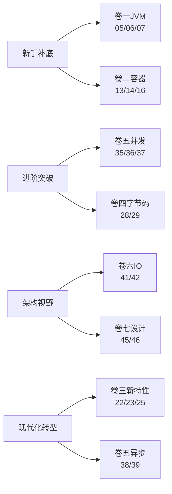

# 专栏笔记总结大全

Java 核心原理深度专栏，自下而上贯穿 **JVM → 容器 → 类型系统 → 字节码 → 并发 → IO/网络 → 设计思想** 七大原理域，共计 **47 篇**，体系化拆解 Java 的每一根骨头与每一种设计哲学。

## 📕 卷一 · JVM 与运行时核心（10 篇）

把"虚拟机如何把字节码跑起来"讲透。

- ✅ [01.JVM内存模型对象](https://yccoding.com/pages/6c806c/)：JVM运行时数据区全景、对象创建过程与内存布局、堆分代设计及逃逸分析
- ✅ [02.类加载双亲委派](https://yccoding.com/pages/051910/)：类的生命五阶段、三层类加载器体系与双亲委派源码原理
- ✅ [03.垃圾回收GC调优](https://yccoding.com/pages/b4888d/)：标记-清除/复制/整理三大算法，Serial到ZGC收集器演进与调优
- ✅ [04.异常与JVM机制](https://yccoding.com/pages/19627b/)：异常表字节码结构、栈展开机制、finally代码复制与try-with-resources
- ✅ [05.javap字节码实战](https://yccoding.com/pages/fdbac2/)：Class文件结构、操作数栈与局部变量表、四条方法调用指令解读
- ✅ [06.JIT编译优化机制](https://yccoding.com/pages/9ae2b0/)：解释执行到C1/C2/Graal的演进、分层编译与去优化原理
- ✅ [07.JVM诊断工具链条](https://yccoding.com/pages/d400bf/)：jstat/jmap/jstack/jcmd、JFR飞行记录器与Arthas在线诊断实战
- ✅ [08.OOM全景剖析指南](https://yccoding.com/pages/bac865/)：堆/元空间/直接内存/栈/GC overhead等八大OOM现场排查
- ✅ [09.JVM调优全景图解](https://yccoding.com/pages/23235a/)：堆/GC/JIT/诊断四类参数体系，真实线上调优案例
- ✅ [10.AOT编译原理探析](https://yccoding.com/pages/c1254f/)：Native Image与SubstrateVM闭世界假设，与传统JVM的取舍

## 📗 卷二 · 容器与基础数据结构（8 篇）

把"Java 集合框架的每一根骨头"摸一遍。

- ✅ [11.HashMap哈希设计](https://yccoding.com/pages/8aa2ea/)：hash扰动函数、put/resize源码剖析、容量2的幂与树化阈值的数学原理
- ✅ [12.String常量池原理](https://yccoding.com/pages/e52239/)：底层char到byte的演进、不可变性三重保护与常量池intern机制
- ✅ [13.List集合源码对比](https://yccoding.com/pages/582cf5/)：ArrayList动态扩容与LinkedList链表结构，fail-fast迭代器原理
- ✅ [14.ConcurrentHashMap原理](https://yccoding.com/pages/234303/)：JDK7分段锁到JDK8 CAS+synchronized的演进，并发安全设计
- ✅ [15.TreeMap红黑树](https://yccoding.com/pages/669458/)：红黑树五大性质与插入删除调整，跳表对比与选型分析
- ✅ [16.LinkedHashMap分析](https://yccoding.com/pages/5f3eae/)：双血统架构与accessOrder机制，手撕LRU缓存实现
- ✅ [17.数字类型设计原理](https://yccoding.com/pages/6d0edb/)：Integer缓存池与自动装箱陷阱，BigDecimal精度与IEEE754本质
- ✅ [18.Object方法契约](https://yccoding.com/pages/f69a72/)：hashCode/equals一致性契约，clone/finalize的废弃与wait/notify机制

## 📘 卷三 · 类型系统与语言机制（7 篇）

把"Java 语法糖背后的真相"还原。

- ✅ [19.泛型擦除类型系统](https://yccoding.com/pages/725803/)：类型擦除与桥接方法、PECS原则及运行时获取泛型信息
- ✅ [20.枚举最佳实践指南](https://yccoding.com/pages/02b702/)：枚举即final class的设计、单例枚举与EnumMap位运算优化
- ✅ [21.注解编译期处理](https://yccoding.com/pages/2a47bd/)：元注解与APT处理器，Lombok字节码魔法底层揭秘
- ✅ [22.Lambda底层原理](https://yccoding.com/pages/a2750f/)：invokedynamic指令与LambdaMetafactory，与匿名内部类性能对比
- ✅ [23.Stream流水线设计](https://yccoding.com/pages/7bd7f8/)：Spliterator分割器、有状态/无状态操作与短路求值
- ✅ [24.Optional设计原理](https://yccoding.com/pages/e25b29/)：空安全的正确用法与设计边界，为什么不能Serializable
- ✅ [25.Record密封类](https://yccoding.com/pages/cbe092/)：现代Java不可变数据载体，密封继承与模式匹配三件套

## 📙 卷四 · 反射与字节码增强（5 篇）

把"动态修改运行时行为"的生态打通。

- ✅ [26.反射与动态代理](https://yccoding.com/pages/c622a6/)：反射调用链与Inflation优化，JDK代理与CGLIB对比，Spring AOP选型
- ✅ [27.方法句柄详解](https://yccoding.com/pages/c8bf16/)：反射的现代继任者MethodHandle/VarHandle，与invokedynamic的关系
- ✅ [28.字节码框架对比](https://yccoding.com/pages/f1d682/)：ASM/Javassist/ByteBuddy三大框架API差异与生产场景选型
- ✅ [29.JavaAgent机制](https://yccoding.com/pages/eb01f1/)：premain与agentmain探针，retransformClasses与Arthas attach原理
- ✅ [30.AOP实现路线对比](https://yccoding.com/pages/14d4be/)：JDK代理、CGLIB与AspectJ编译期织入，三种AOP路线选型

## 📔 卷五 · 并发编程深水区（9 篇）

把"从锁到无锁、从线程到协程"全部串起来。

- ✅ [31.sync锁升级机制](https://yccoding.com/pages/dcf25e/)：Mark Word结构、偏向锁到重量级锁升级，锁消除与锁粗化
- ✅ [32.volatile内存模型](https://yccoding.com/pages/7ce0a7/)：CPU缓存与MESI协议，JMM抽象与happens-before规则
- ✅ [33.线程池源码设计](https://yccoding.com/pages/3dde08/)：七大参数与ctl状态控制，Worker线程复用与ForkJoinPool窃取
- ✅ [34.线程的生命周期](https://yccoding.com/pages/ecea6a/)：六种状态转换、start/join/interrupt原理与ThreadLocal内存泄漏
- ✅ [35.AQS框架源码原理](https://yccoding.com/pages/76469f/)：CLH队列与模板方法设计，独占/共享模式与Condition条件队列
- ✅ [36.并发锁三剑客](https://yccoding.com/pages/6b2187/)：ReentrantLock/ReentrantReadWriteLock/StampedLock对比与选型
- ✅ [37.CAS原子操作分析](https://yccoding.com/pages/6c0caf/)：Unsafe底层、ABA问题解决与LongAdder分段思想
- ✅ [38.五大同步器对比](https://yccoding.com/pages/bc2607/)：CountDownLatch/CyclicBarrier/Semaphore/Exchanger/Phaser实战
- ✅ [39.Future异步原理](https://yccoding.com/pages/355bba/)：Future到CompletableFuture的进化，30+算子的命名规律与ForkJoinPool陷阱

## 📒 卷六 · IO、网络与序列化（4 篇）

把"数据怎么进出 Java 进程"讲完整。

- ✅ [40.IO模型演进之路](https://yccoding.com/pages/8e7825/)：五种IO模型对比，NIO三大组件与select/poll/epoll，Reactor模式与Netty
- ✅ [41.堆外内存设计原理](https://yccoding.com/pages/993ea7/)：ByteBuffer四指针状态机、直接内存回收机制与堆外泄漏排查
- ✅ [42.序列化方案对比](https://yccoding.com/pages/8cd0cd/)：JDK序列化漏洞、JSON/Protobuf/Kryo选型决策树
- ✅ [43.文件IO与NIO](https://yccoding.com/pages/0a07de/)：Path vs File设计差异，WatchService文件监听与FileChannel映射

## 📓 卷七 · 设计思想与设计模式（4 篇）

把"为什么 Java 这么写"的灵魂还原。

- ✅ [44.面向对象真意](https://yccoding.com/pages/f5f54b/)：SOLID五大原则，组合优于继承，贫血vs充血模型的对比与反思
- ✅ [45.JDK设计模式上篇](https://yccoding.com/pages/7179e2/)：单例六写法全谱、工厂三兄弟、Builder与装饰器模式的JDK实践
- ✅ [46.JDK设计模式下篇](https://yccoding.com/pages/308f21/)：模板/策略/责任链/状态等模式在JDK中的源码级应用
- ✅ [47.SPI模块化设计](https://yccoding.com/pages/82d700/)：SPI机制与ServiceLoader原理，JPMS模块化与jlink定制JRE

---

## 📚 学习路径

| 你的目标 | 推荐主攻卷 | 优先篇目 |
|---|---|---|
| 面试冲刺 | 卷一 + 卷二 + 卷五 | 05 / 06 / 08 / 13 / 14 / 35 / 36 / 37 |
| 中间件源码阅读 | 卷四 + 卷五 + 卷六 | 28 / 29 / 35 / 41 |
| 架构师视野 | 卷七 | 44 / 45 / 46 / 47 |
| 拥抱现代 Java | 卷三 + 卷五 | 22 / 23 / 25 / 38 / 39 |

## 📊 进度总览

| 卷 | 主题 | 篇数 | 已完成 |
|---|---|---|---|
| 卷一 | JVM 与运行时核心 | 10 | 10 ✅ |
| 卷二 | 容器与基础数据结构 | 8 | 8 ✅ |
| 卷三 | 类型系统与语言机制 | 7 | 7 ✅ |
| 卷四 | 反射与字节码增强 | 5 | 5 ✅ |
| 卷五 | 并发编程深水区 | 9 | 9 ✅ |
| 卷六 | IO、网络与序列化 | 4 | 4 ✅ |
| 卷七 | 设计思想与设计模式 | 4 | 4 ✅ |
| **合计** | — | **47** | **47 ✅** |
