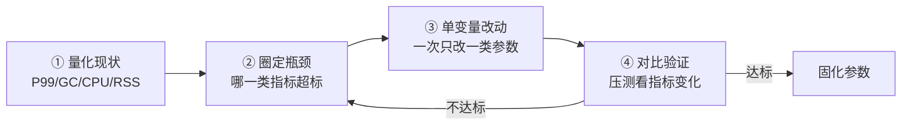
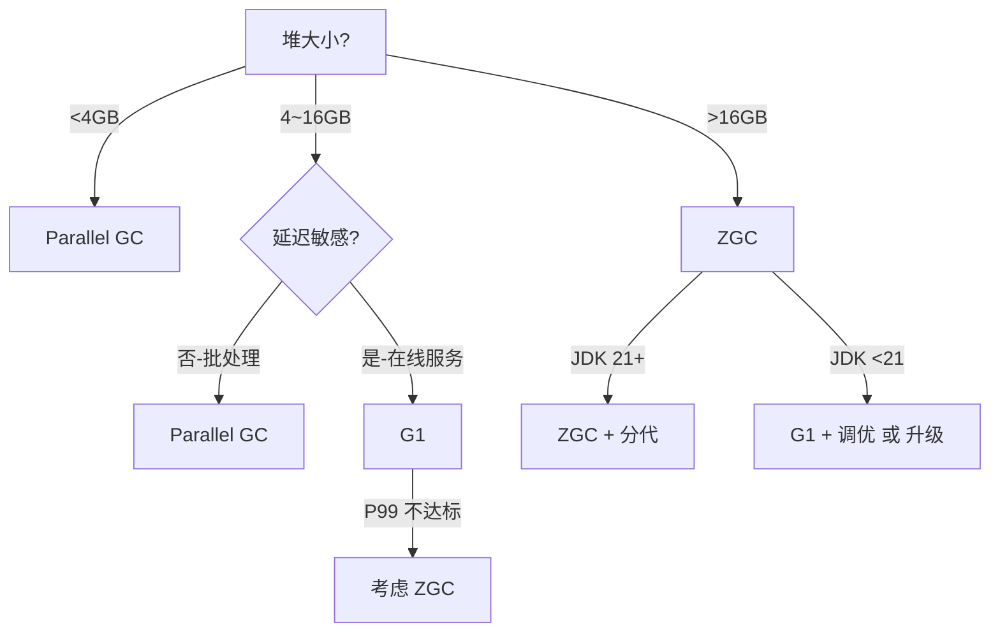

# 09.JVM参数调优全景图

#### 目录介绍
- [1. 案例引入](#1-案例引入)
  - [1.1 一台机器两套参数](#11-一台机器两套参数)
  - [1.2 谁的参数更优](#12-谁的参数更优)
  - [1.3 我们要回答什么](#13-我们要回答什么)
- [2. 参数全景地图](#2-参数全景地图)
  - [2.1 四大参数族群](#21-四大参数族群)
  - [2.2 参数命名规则](#22-参数命名规则)
  - [2.3 参数生效优先级](#23-参数生效优先级)
- [3. 堆与内存参数](#3-堆与内存参数)
  - [3.1 堆大小三件套](#31-堆大小三件套)
  - [3.2 分代比例参数](#32-分代比例参数)
  - [3.3 元空间与堆外](#33-元空间与堆外)
  - [3.4 容器感知参数](#34-容器感知参数)
- [4. GC 收集器参数](#4-gc-收集器参数)
  - [4.1 收集器选择参数](#41-收集器选择参数)
  - [4.2 G1 调优要点](#42-g1-调优要点)
  - [4.3 ZGC 调优要点](#43-zgc-调优要点)
  - [4.4 GC 日志参数](#44-gc-日志参数)
- [5. JIT 编译参数](#5-jit-编译参数)
  - [5.1 分层编译参数](#51-分层编译参数)
  - [5.2 内联与逃逸](#52-内联与逃逸)
  - [5.3 CodeCache 调优](#53-codecache-调优)
- [6. 诊断与可观测](#6-诊断与可观测)
  - [6.1 异常时自救参数](#61-异常时自救参数)
  - [6.2 JFR 与 NMT](#62-jfr-与-nmt)
  - [6.3 安全点诊断](#63-安全点诊断)
- [7. 调优方法论](#7-调优方法论)
  - [7.1 四步调优法](#71-四步调优法)
  - [7.2 指标先于参数](#72-指标先于参数)
  - [7.3 参数反模式](#73-参数反模式)
- [8. 真实调优案例](#8-真实调优案例)
  - [8.1 网关 P99 飙升](#81-网关-p99-飙升)
  - [8.2 容器频繁 OOMKill](#82-容器频繁-oomkill)
  - [8.3 大数据批处理调优](#83-大数据批处理调优)
- [9. G1 与 ZGC 对决](#9-g1-与-zgc-对决)
  - [9.1 工作机制差异](#91-工作机制差异)
  - [9.2 选型决策矩阵](#92-选型决策矩阵)
  - [9.3 迁移注意事项](#93-迁移注意事项)
- [10. 综合案例串讲](#10-综合案例串讲)
  - [10.1 案例真相揭晓](#101-案例真相揭晓)
  - [10.2 一组参数的一生](#102-一组参数的一生)
  - [10.3 设计哲学回扣](#103-设计哲学回扣)
  - [10.4 参数速查表](#104-参数速查表)


## 1. 案例引入

### 1.1 一台机器两套参数

某中台团队两个相邻服务，部署在**同一规格的容器**（4C8G），承担类似的 RPC 负载。但它们的 JVM 启动参数大相径庭：

```bash
# 服务 A —— 老团队留下的参数
-Xms6g -Xmx6g
-XX:NewRatio=2
-XX:+UseConcMarkSweepGC
-XX:CMSInitiatingOccupancyFraction=70
-XX:+UseCMSInitiatingOccupancyOnly
-XX:+CMSParallelRemarkEnabled
-XX:+ScavengeBeforeFullGC
-Xloggc:/data/logs/gc.log
-XX:+PrintGCDetails
-XX:+PrintGCDateStamps
-Xss512k
-XX:MaxPermSize=256m                       # ← 已经无效，但没人删
-XX:SurvivorRatio=8
-XX:MaxTenuringThreshold=15

# 服务 B —— 新团队简洁版
-XX:MaxRAMPercentage=70.0
-XX:+UseG1GC
-XX:MaxGCPauseMillis=200
-Xlog:gc*:file=/data/logs/gc.log:time,uptime:filecount=10,filesize=100M
-XX:+HeapDumpOnOutOfMemoryError
-XX:HeapDumpPath=/data/logs/
```

监控数据让人意外：
- 服务 A：P99 = 480ms，**每周 2~3 次 OOMKill**，运维半夜接告警
- 服务 B：P99 = 90ms，**上线半年零事故**，参数比 A 短了一半

更耐人寻味的是——服务 A 的负责人坚信"我配得多说明我懂得多"，看到 B 的极简配置直接吐槽**"这哪是 JVM 参数，这是给小学生用的吧？"**

### 1.2 谁的参数更优

**真相是**：服务 A 的参数集是从 JDK 7 + CMS 的年代直接抄过来的——**很多参数在 JDK 17 上要么失效、要么有反作用**。具体看：

```
× MaxPermSize           ← JDK 8 已删除，永久代换成元空间
× UseConcMarkSweepGC    ← JDK 14 已彻底移除 CMS
× -Xms=-Xmx=6g          ← 容器只有 8G，留 2G 太少（Metaspace+栈+堆外+JNI）
× NewRatio=2            ← G1 不识别，CMS 时代的逻辑
× CMSInitiatingOccupancyFraction  ← CMS 已没了
× ScavengeBeforeFullGC  ← G1 不识别
× SurvivorRatio=8       ← G1 自适应不需要
× MaxTenuringThreshold=15 ← G1 内部默认 15
~ Xss512k               ← 这个还有用，不变
```

**33 个参数里只有 5 个真在生效**——其他都是噪音。而服务 B 用 6 个现代参数就把堆、GC、可观测、容器适配全覆盖了。

**核心矛盾**：JVM 参数随版本演进，**很多老参数已废弃但没报错**——这是 JVM 故意留下的兼容性后门，但也是最大的认知陷阱。

### 1.3 我们要回答什么

第 17 篇要把"JVM 参数怎么选"这件事讲透。读完之后再面对任何一台 JVM，**5 分钟内能写出正确的启动参数、识别老参数中的过期内容**。

带着这个目标，要回答 7 个核心问题：

```
① JVM 有几百个参数，到底哪些必须设？哪些坚决别动？             → 第2~6章
② 容器里到底设 -Xmx 还是 MaxRAMPercentage？区别是什么？         → 第3.4节
③ G1 和 ZGC 各自适合什么场景？切换时要注意什么？               → 第4、9章
④ 调优是先调参数还是先看指标？为什么？                         → 第7章
⑤ 网关 P99 突然飙升，从参数维度怎么入手排查？                  → 第8.1节
⑥ 老参数列表如何"祛魅"——哪些可以直接删？                      → 第7.3节
⑦ G1 → ZGC 迁移要做哪些准备？真值不值？                        → 第9.3节
```

本篇路线：

```
参数全景地图 (第2章)
    ↓
四大参数族群分别拆解：
  堆 / 内存   (第3章)
  GC 收集器   (第4章)
  JIT 编译    (第5章)
  诊断 / 可观测 (第6章)
    ↓
调优方法论 (第7章)
    ↓
真实调优案例 (第8章)
    ↓
G1 与 ZGC 对决 (第9章)
    ↓
综合案例串讲 (第10章)
```


## 2. 参数全景地图

### 2.1 四大参数族群

JVM 命令行参数总数 **超过 700 个**（HotSpot 17）——但生产环境真正用到的不超过 **30 个**。按照功能切成四族：

```
                ┌──────────────── JVM 参数全景 (700+) ────────────────┐
                │                                                     │
   ┌────────────┼─────────────┬─────────────┬─────────────┐            │
   │            │             │             │             │            │
┌─────────┐  ┌─────────┐  ┌──────────┐  ┌──────────────┐                 │
│ 堆/内存 │  │ GC 收集 │  │ JIT 编译 │  │ 诊断/可观测  │                 │
│  ~80   │  │  ~150  │  │  ~100   │  │     ~80     │                 │
└─────────┘  └─────────┘  └──────────┘  └──────────────┘                 │
                                                                       │
   核心常用：8       核心常用：10       核心常用：4       核心常用：6     │
                                                                       │
   生产组合 ≈ 28 个参数即可覆盖 95% 场景                                   │
   └─────────────────────────────────────────────────────────────────┘
```

**各族功能定位**：

| 族群 | 解决什么问题 | 看哪类指标 | 影响哪类 OOM |
|---|---|---|---|
| **堆/内存** | 内存预算分配 | RSS、堆使用率、Metaspace 使用率 | ① 堆 OOM ② 元空间 ⑤ GC overhead ⑧ OOMKill |
| **GC 收集器** | 暂停时间 vs 吞吐 | P99、GC 暂停、GC 频率 | ① ⑤ |
| **JIT 编译** | 热代码执行效率 | CPU、CodeCache 使用率 | （间接）GC overhead |
| **诊断/可观测** | 出事时能不能查 | 都不影响业务，但出事必备 | 救命关键 |

### 2.2 参数命名规则

JVM 参数按前缀分四类——**理解前缀，参数自带语义**：

```
-X..       ← 标准化参数，长期稳定，跨厂商兼容
           例：-Xmx -Xms -Xss

-XX:..     ← 高级参数，可能随版本变化（演进 / 废弃）
           例：-XX:+UseG1GC -XX:MaxGCPauseMillis

-XX:+..    ← 布尔型开（plus = 开启）
           例：-XX:+UseG1GC

-XX:-..    ← 布尔型关（minus = 关闭）
           例：-XX:-OmitStackTraceInFastThrow

-XX:Foo=N  ← 数值型 / 字符串型
           例：-XX:MaxGCPauseMillis=200

-D..       ← 系统属性（System.getProperty 可读）
           例：-Dfile.encoding=UTF-8

-agentlib:.. / -javaagent:.. ← Agent 参数（见 33 篇）
```

**易错点**：很多团队把 `-XX:+` 写成 `-XX+`、把 `-Xmx` 写成 `-Xmx=`——前者完全无效，**JVM 不报错只忽略**。

### 2.3 参数生效优先级

**疑惑**：同一个参数从多处给出不同值，谁说了算？

**论证**：JVM 启动时按"**后者覆盖前者**"读取参数：

```
① $JAVA_TOOL_OPTIONS       (环境变量)
        ↓ 后者覆盖
② $_JAVA_OPTIONS           (环境变量)
        ↓ 后者覆盖
③ 命令行 -X / -XX 参数
        ↓ 后者覆盖
④ -XX:Flags=<file>         (Flags 文件)
        ↓
⑤ 同一类参数有多个时，后写的覆盖先写的
```

**结论**：**命令行参数总能盖过环境变量**——但环境变量是隐藏陷阱，部署脚本里 `JAVA_TOOL_OPTIONS=-Xmx2g` 会神不知鬼不觉地覆盖应用参数。**生产排查必查环境变量**。

**自查命令**：

```bash
# 1. 看进程实际生效的参数
jcmd <pid> VM.flags
jcmd <pid> VM.flags -all       # 含默认值

# 2. 看进程命令行
cat /proc/<pid>/cmdline | tr '\0' ' '

# 3. 看环境变量
cat /proc/<pid>/environ | tr '\0' '\n' | grep -i java
```


## 3. 堆与内存参数

### 3.1 堆大小三件套

**最核心的三个参数**：

```bash
-Xms<n>     # 初始堆大小  (initial heap)
-Xmx<n>     # 最大堆大小  (maximum heap)
-Xmn<n>     # 新生代大小  (young gen，G1 不推荐用)
```

**疑惑**：`-Xms` 和 `-Xmx` 应该相等还是不等？

**论证**：

1. **不等的好处**：JVM 启动只占用 `-Xms`，业务量小的时候不浪费内存——典型的"按需扩容"哲学
2. **不等的坏处**：JVM 在堆扩展时需要 STW，且扩展过程会触发系统调用 `mmap`，**影响 P99**
3. **生产共识**：**生产环境一律 `-Xms = -Xmx`**——避免运行期堆扩展抖动；测试 / 本地可以不等

**结论**：**Xms == Xmx 是生产最佳实践**——这是用"启动内存浪费"换"运行期延迟稳定"的明确权衡。

**容量推导**：

```
单服务堆大小 ≈ 业务对象保留集 × 2~3
            （留出 GC 工作空间 + 突发流量缓冲）
```

太小 → 频繁 GC（参考 16 篇 §7 GC overhead）；太大 → STW 时间长（G1 暂停与堆大小成正比）；**经验值**：4G ~ 16G 是 G1 / ZGC 的甜点区。

### 3.2 分代比例参数

**G1 之前**（Serial / Parallel / CMS 时代）需要手动调分代：

```bash
-XX:NewRatio=2             # 老年代:新生代 = 2:1
-XX:NewSize=2g
-XX:MaxNewSize=2g
-XX:SurvivorRatio=8        # Eden:S0:S1 = 8:1:1
-XX:MaxTenuringThreshold=15 # 晋升阈值
```

**G1 / ZGC 时代请删除这些参数**——它们要么无效、要么破坏自适应：

```bash
# G1 推荐
-XX:G1NewSizePercent=20         # 新生代下限（默认 5）
-XX:G1MaxNewSizePercent=60      # 新生代上限（默认 60）
# 通常什么都不设，让 G1 自己定
```

**结论**：现代 GC 的核心思想是"**让 GC 自己决策**"——人为干预越多，反而打破 GC 的自适应能力。**这是参数演进的大趋势**。

### 3.3 元空间与堆外

```bash
-XX:MetaspaceSize=128m            # 触发首次 Full GC 的元空间阈值
-XX:MaxMetaspaceSize=256m         # 元空间上限（必设！）
-XX:CompressedClassSpaceSize=128m # 压缩类指针空间

-XX:MaxDirectMemorySize=512m      # 直接内存上限（必设！）
-XX:ReservedCodeCacheSize=512m    # JIT 代码缓存（见 14 篇）
```

**为什么"必设"**：参考 16 篇——Metaspace 和 DirectMemory 默认**几乎没上限**，一旦类加载或 NIO 缓冲泄漏，会直接吃光容器内存触发 OOMKiller。**显式设上限 = 让问题暴露在 Java 异常层而不是被内核 SIGKILL**——这就是 16 篇说的"主动失败优于无声死亡"。

### 3.4 容器感知参数

**疑惑**：容器里到底用 `-Xmx` 还是 `MaxRAMPercentage`？

**论证**：

| 方式 | 写法 | 优点 | 缺点 |
|---|---|---|---|
| 绝对值 | `-Xmx4g` | 明确、可预测 | 容器规格变了要改 |
| 百分比 | `-XX:MaxRAMPercentage=70.0` | 自适应规格 | 数学不直观 |

**容器感知前提**：

```bash
-XX:+UseContainerSupport        # JDK 10+ 默认开
```

这个开关决定 JVM 看到的是 **cgroup 的内存限制** 还是**宿主机物理内存**——容器场景下必须开（10+ 已经是默认，但确认一下不亏）。

**结论与最佳实践**：

```bash
# 推荐组合（容器场景）
-XX:+UseContainerSupport
-XX:InitialRAMPercentage=70.0
-XX:MaxRAMPercentage=70.0           # 留 30% 给非堆
-XX:MaxMetaspaceSize=256m
-XX:MaxDirectMemorySize=512m
-Xss512k
```

**为什么是 70%**：堆 + 30% 余量分配给：

```
Metaspace        ~256 MB
DirectByteBuffer ~512 MB
Thread Stacks    ~256 MB（512 线程 × 512KB）
CodeCache        ~240 MB
GC 元数据         ~10% × 堆
JNI / glibc      ~varies
─────────────────────────
合计：约容器内存的 25%~35%
```

剩 30% 是容器场景下"**给非堆的预算**"——少了会被 OOMKill，多了浪费。


## 4. GC 收集器参数

### 4.1 收集器选择参数

JDK 17 主流收集器及其开关：

| 收集器 | 开关参数 | 状态 | 暂停目标 | 堆规模 |
|---|---|---|---|---|
| Serial | `-XX:+UseSerialGC` | 仍存在 | — | <100 MB |
| Parallel | `-XX:+UseParallelGC` | 默认（容器小堆） | 高吞吐 | <4 GB |
| ~~CMS~~ | ~~`-XX:+UseConcMarkSweepGC`~~ | **JDK 14 已移除** | — | — |
| G1 | `-XX:+UseG1GC` | JDK 9 默认 | 200 ms | 4~32 GB |
| ZGC | `-XX:+UseZGC` | JDK 15 GA / 21 generational | <1 ms | 8 GB~16 TB |
| Shenandoah | `-XX:+UseShenandoahGC` | OpenJDK | <10 ms | 4 GB~ |
| Epsilon | `-XX:+UseEpsilonGC` | 仅测试 | 不回收 | — |

**默认收集器选择**：JDK 9+ 在堆 ≥ 1.8GB 且 ≥2 核 时默认 G1；**容器小规格时仍可能默认 Parallel**——这就是为什么有时 `jcmd VM.flags` 看到的不是预期的 G1。**生产场景请显式声明** `-XX:+UseG1GC` 或 `-XX:+UseZGC`。

### 4.2 G1 调优要点

```bash
-XX:+UseG1GC
-XX:MaxGCPauseMillis=200          # 暂停目标 (毫秒)，G1 的灵魂参数
-XX:G1HeapRegionSize=16m          # Region 大小（默认根据堆自适应 1~32MB）
-XX:InitiatingHeapOccupancyPercent=45  # IHOP 启动并发标记阈值
-XX:G1ReservePercent=10           # 预留空间防 to-space 溢出
-XX:G1MixedGCLiveThresholdPercent=85   # Mixed GC 候选门槛
-XX:G1MixedGCCountTarget=8        # Mixed GC 拆分次数
```

**MaxGCPauseMillis 的真相**：这是**目标值不是承诺值**——G1 会努力达成但不保证。设得太小（如 50ms）会强制 G1 切小 Young 区、增加 GC 频率，反而**总吞吐下降**。**推荐 200~500ms**。

**IHOP 自适应**（JDK 9+）：默认 `-XX:+G1UseAdaptiveIHOP=true`，G1 会根据老年代分配速率动态调整阈值——一般不要硬编码 `IHOP=45`。

### 4.3 ZGC 调优要点

ZGC 的设计哲学是"**几乎无可调参数**"——这本身就是参数演进的终极方向。

```bash
-XX:+UseZGC
-XX:+ZGenerational               # JDK 21+ 推荐打开分代 ZGC
-XX:SoftMaxHeapSize=4g           # 软上限（鼓励 GC 控制堆使用）
-XX:ZUncommitDelay=300           # 多久未用归还 OS（秒）
-XX:ConcGCThreads=2              # 并发 GC 线程数
-XX:ParallelGCThreads=4          # STW 阶段并行线程
```

**ZGC 的暂停目标**：默认 `<1ms`，且**与堆大小无关**——这是 G1 做不到的关键差异（G1 暂停与堆大小线性相关）。**所以堆 ≥ 16GB 时 ZGC 优势压倒性**。

### 4.4 GC 日志参数

**JDK 9 起 GC 日志是统一日志框架的一部分**，旧的 `-Xloggc` `-XX:+PrintGCDetails` 已废弃。

```bash
# 旧（JDK 8）
-Xloggc:/data/logs/gc.log
-XX:+PrintGCDetails
-XX:+PrintGCDateStamps
-XX:+UseGCLogFileRotation
-XX:NumberOfGCLogFiles=10
-XX:GCLogFileSize=100M

# 新（JDK 9+）
-Xlog:gc*:file=/data/logs/gc.log:time,uptime,level,tags:filecount=10,filesize=100M
```

**统一日志框架的好处**：所有日志（GC / 类加载 / 安全点 / JIT）都用 `-Xlog` 一套语法控制，可以分文件、分级别、分标签——**一个参数解决所有日志输出**。

**生产推荐组合**：

```bash
-Xlog:gc*,gc+heap=info,gc+age=trace,gc+phases=info,safepoint:file=/data/logs/gc.log:time,uptime,level,tags:filecount=10,filesize=100M
```

这套日志足以喂饱 GCViewer / GCeasy 任何一款分析工具。


## 5. JIT 编译参数

### 5.1 分层编译参数

JDK 8 起默认开启分层编译（详见 14 篇）。相关参数：

```bash
-XX:+TieredCompilation              # 默认开
-XX:TieredStopAtLevel=4             # 1=C1 简单 / 2=C1 限制 / 3=C1 全 / 4=C2

# 编译阈值
-XX:CompileThreshold=10000          # 解释→编译阈值（非分层时生效）
-XX:Tier3InvocationThreshold=200    # 分层模式下进 C1 阈值
-XX:Tier4InvocationThreshold=5000   # 进 C2 阈值
```

**典型调优场景**：

```bash
# 启动加速（CLI 工具 / Serverless 冷启动）
-XX:TieredStopAtLevel=1             # 只用 C1，编译快但峰值性能低 30%

# 长跑性能优先（默认）
保持默认即可
```

### 5.2 内联与逃逸

```bash
-XX:+Inline                         # 默认开
-XX:MaxInlineSize=35                # 小方法字节码上限
-XX:FreqInlineSize=325              # 热方法字节码上限
-XX:MaxInlineLevel=15               # 内联递归深度

-XX:+DoEscapeAnalysis               # 默认开
-XX:+EliminateAllocations           # 标量替换
-XX:+EliminateLocks                 # 锁消除
```

**调优红线**：**这一族参数 99% 不要动**——HotSpot 团队针对 JDK 标准库做了大量优化标定。一旦改动 `MaxInlineSize`，可能让别处性能崩盘。

**唯一例外**：诊断阶段为了对比"开/关 EA"对性能影响，可以临时 `-XX:-DoEscapeAnalysis` 验证假设——线上**不要**这么干。

### 5.3 CodeCache 调优

```bash
-XX:ReservedCodeCacheSize=512m      # CodeCache 总大小
-XX:InitialCodeCacheSize=64m
-XX:+UseCodeCacheFlushing           # 满时刷出冷代码（默认开）
-XX:+SegmentedCodeCache             # 分段式（默认开，JDK 9+）
```

**症状识别**：CodeCache 满时性能断崖式下跌——业务变慢但 GC、CPU 都正常。

```
CodeCache 占满 → JIT 停止编译 → 热代码退化为解释执行
                            → CPU 飙升、TPS 暴跌
```

**排查命令**：

```bash
jcmd <pid> Compiler.codecache
# Reserved Code Cache (with limit): xxx KB / yyy KB
# 当 used 接近 reserved 时就快满了
```

**解决**：调大 `ReservedCodeCacheSize`（512MB → 1GB），重启。这种问题排查极容易遗漏，**因为它不抛任何异常**。


## 6. 诊断与可观测

### 6.1 异常时自救参数

```bash
# OOM 自救（参考 16 篇）
-XX:+HeapDumpOnOutOfMemoryError
-XX:HeapDumpPath=/data/logs/heap-${pid}.hprof
-XX:OnOutOfMemoryError="/usr/local/bin/notify.sh %p"   # OOM 时执行命令
-XX:+ExitOnOutOfMemoryError                           # 直接退出（K8s 触发重建）

# 异常堆栈完整化
-XX:-OmitStackTraceInFastThrow      # 关闭"高频抛同种异常时省略堆栈"的优化
```

**`OmitStackTraceInFastThrow` 的故事**：JVM 默认在某个异常被抛出非常多次后，会**省略堆栈以提升性能**——结果就是日志里满屏 `NullPointerException` 没有任何堆栈，让人崩溃。生产**强烈推荐关闭这项优化**。

```
× null
java.lang.NullPointerException
× null
java.lang.NullPointerException
× null
java.lang.NullPointerException     ← 没有堆栈，根本没法查
```

### 6.2 JFR 与 NMT

```bash
# JDK 11+ JFR 持续低开销采样
-XX:StartFlightRecording=duration=0,filename=/data/logs/app.jfr,maxsize=500m,maxage=24h,settings=default

# 原生内存追踪
-XX:NativeMemoryTracking=summary    # 或 detail
```

**JFR 持续模式**：让 JFR 全程开着写文件，事故时只取最近 24h 切片——**不要等出事再开 JFR**，那时候热区已经过去了。

**NMT 开销**：summary 几乎无开销，detail 约 5%~10%。**生产用 summary**。

### 6.3 安全点诊断

```bash
-Xlog:safepoint:file=/data/logs/safepoint.log:time
-XX:+PrintSafepointStatistics       # 旧（JDK 8）
-XX:PrintSafepointStatisticsCount=1
```

**安全点问题的症状**：GC 日志里"实际 GC 仅 5ms，但应用暂停了 800ms"——这 795ms 全花在等线程进入安全点。常见原因：

- 大循环里没有安全点检查（counted loop 优化）
- 大对象数组遍历
- 调用 native 方法时间长

**JDK 10+** 引入 LoopStrip Mining，缓解了 counted loop 不进安全点的问题。

```bash
-XX:+UseCountedLoopSafepoints       # 默认开
```


## 7. 调优方法论

### 7.1 四步调优法

**疑惑**：拿到一个慢服务，第一步该改哪个参数？

**论证**：错误答案——"改 GC 参数试试"。**正确答案永远是"先量化"**。把调优拆成四步：



**核心原则**：**一次只改一个变量、一次只改一类参数**——多个一起改，事后无法归因。

### 7.2 指标先于参数

调优前，**先把这 8 个指标量化**：

| 指标 | 工具 | 健康线 |
|---|---|---|
| P99 延迟 | 业务监控 | 业务定义 |
| GC 频率 | gc.log + GCeasy | Young < 10/min |
| GC 暂停时间 | gc.log | < 200ms（G1） |
| 堆使用率（GC 后） | gc.log | < 70% |
| Metaspace 使用率 | jstat | < 80% |
| CodeCache 使用率 | Compiler.codecache | < 80% |
| 线程数 | jcmd Thread.print | 业务相关 |
| RSS | top | < 容器 limit × 90% |

**一句话**：**没有指标就没有调优**——盲目改参数 = 占卜。

### 7.3 参数反模式

⛔ **反模式 1：复制粘贴老参数**

```bash
# 服务 A 这套参数跑了 5 年没事，新服务直接复制
```

JDK 版本可能换了 → 一半参数已废弃；业务负载不同 → 同样参数效果迥异。**复制 = 翻车**。

⛔ **反模式 2：堆叠"听说有用"的参数**

```bash
-XX:+UseStringDeduplication
-XX:+UseCompressedOops
-XX:+AggressiveOpts
-XX:+UseFastAccessorMethods
... 30 行 ...
```

每个参数单独看都"似乎有用"，但 **30 个组合在一起的效果没人知道**。`AggressiveOpts` 在 JDK 11 就被废弃，仍有人传。

⛔ **反模式 3：关键时刻关 GC overhead 保护**

```bash
-XX:-UseGCOverheadLimit             # ← 不要！见 16 篇 §7
```

⛔ **反模式 4：Xmx > 容器内存**

```bash
# 容器 4G，JVM 直接 -Xmx4g
# 没给 Metaspace / 栈 / 堆外留余地 → OOMKill
```

⛔ **反模式 5：用 -Xmn 干扰 G1**

```bash
-XX:+UseG1GC -Xmn2g       # G1 不需要也不推荐
```

**老参数祛魅清单**（直接删）：

```
-XX:MaxPermSize             已废弃（永久代换元空间）
-XX:PermSize                同上
-XX:+UseConcMarkSweepGC     JDK 14 移除
-XX:+UseParNewGC            搭配 CMS 用，已无效
-XX:+CMSXxx                 全部 CMS 参数
-XX:+UseCMSInitiatingOccupancyOnly   同上
-XX:+UseFastAccessorMethods JDK 12 移除
-XX:+AggressiveOpts         JDK 12 废弃
-Xloggc                     JDK 9 推荐用 -Xlog
-XX:+PrintGCDetails         同上
-XX:+PrintGCTimeStamps      同上
```


## 8. 真实调优案例

### 8.1 网关 P99 飙升

**现象**：网关服务 P99 从 80ms 涨到 400ms，CPU 仍然 50%、堆使用率 60%——业务侧没变更。

**步骤 1：量化**

```
P99 = 400ms
GC 频率：Young GC 25 次/分钟（之前 10 次）
GC 暂停：每次 60ms（之前 30ms）
RSS：4.2GB（容器 limit 6GB）
```

**步骤 2：圈定瓶颈**——GC 频率与暂停都涨——但 CPU 和堆用量正常，说明**不是对象泄漏，是分配速率上升**。

**步骤 3：抓 GC 日志**

```
[2026-05-29] GC pause (G1 Evacuation Pause) (young), 0.064s
[Eden: 1024M(1024M)->0B(2048M) Survivors: 64M->128M Heap: 3.2G(6G)->2.5G(6G)]
```

Eden 从 1024M 自适应涨到 2048M——G1 在自适应放大新生代但仍然跟不上。

**步骤 4：定位根因**——开发提交记录里近期加了一处用 `JSON.toJSONString()` 频繁打印日志的代码，每次 RPC 序列化 100KB 的临时字符串。

**步骤 5：调整**

```bash
# 短期止血：调大新生代上限
-XX:G1MaxNewSizePercent=80           # 默认 60 → 80
-XX:MaxGCPauseMillis=300             # 给 G1 更多腾挪空间

# 长期：业务侧把 toJSONString 改成 logger 占位符（性能 10x 提升）
log.info("req={}", req);             // ← 不要 toJSONString 提前序列化
```

**结论**：**P99 飙升 70% 来自业务代码，30% 用参数兜底**。如果上来就改 GC 参数不查业务，永远治不好。

### 8.2 容器频繁 OOMKill

**现象**：K8s 容器（4C8G）每 2~3 天被 OOMKill 一次，但 Java 进程**从未抛 OOM**。

**步骤 1：参数审查**

```bash
-Xms6g -Xmx6g                # 占容器 75%
# 没设 MaxMetaspaceSize / MaxDirectMemorySize
```

**步骤 2：jcmd VM.native_memory baseline + diff**

```
- Java Heap     6144M  +0M
- Class         320M   +18M     ← 涨
- Thread        540M   +90M     ← 涨（线程数从 500 涨到 600）
- Internal      280M   +42M     ← 涨（DirectByteBuffer）
```

合计 = 7.28GB > 容器 8GB - kernel/sidecar 预留的 1GB → OOMKill

**步骤 3：参数重构**

```bash
# 之前
-Xms6g -Xmx6g

# 之后
-XX:+UseContainerSupport
-XX:MaxRAMPercentage=65.0           # 6G → 5.2G
-XX:MaxMetaspaceSize=384m
-XX:MaxDirectMemorySize=512m
-Xss512k                            # 1MB → 512KB
-XX:+HeapDumpOnOutOfMemoryError
-XX:HeapDumpPath=/data/logs/heap.hprof
-XX:NativeMemoryTracking=summary
```

**结论**：**问题不在堆，在堆外**——堆减小了 800MB 但保留了 Metaspace + 栈 + DirectMemory 全部上限，**RSS 实际下降 1.5GB，再也没 OOMKill**。

### 8.3 大数据批处理调优

**场景**：Spark Driver JVM 跑批，每天凌晨处理 50TB 数据，单作业 4 小时——目标砍到 2 小时。

**特征**：
- **吞吐优先**（不要求低延迟）
- **堆 64GB 大堆**
- **GC 时间占比** 25%（明显过高）

**调优方案**：

```bash
# 之前：G1 默认
-XX:+UseG1GC -Xmx64g
# GC 时间 25%

# 之后：换 ZGC + 大页
-XX:+UseZGC -XX:+ZGenerational
-Xms64g -Xmx64g
-XX:+UseLargePages -XX:LargePageSizeInBytes=2m
-XX:ConcGCThreads=4 -XX:ParallelGCThreads=8
-XX:SoftMaxHeapSize=56g
# GC 时间 < 5%，单作业 1.8 小时
```

**关键收益**：
1. **ZGC 暂停 ≤1ms**，G1 在 64GB 堆上单次 Mixed GC 能去 800ms——24h 累积差异巨大
2. **Large Pages** 减少 TLB miss，整体吞吐 +5%
3. **SoftMaxHeapSize** 鼓励 ZGC 在 56G 时就开始回收，给突发流量留 8G 缓冲

**结论**：**收集器选型 > 参数微调**。在合适场景下换收集器一次能获得 2~5x 收益，胜过调 50 个细参数。


## 9. G1 与 ZGC 对决

### 9.1 工作机制差异

```
┌──────────────────────────────────────────────────────────────┐
│                          G1                                  │
│  Region 化分代 + 并发标记 + 增量回收                            │
│  STW 阶段：Initial Mark / Final Mark / Cleanup / Evacuation  │
│  暂停 = O(存活对象量)，与堆大小弱相关，但与回收量强相关         │
└──────────────────────────────────────────────────────────────┘

┌──────────────────────────────────────────────────────────────┐
│                          ZGC                                 │
│  着色指针 (Colored Pointer) + 读屏障 + 并发整理                 │
│  几乎所有阶段并发完成，仅 RootScan / Relocation 是短 STW       │
│  暂停 = O(GC Roots 数)，与堆大小完全无关                        │
└──────────────────────────────────────────────────────────────┘
```

**关键差异点**：

| 维度 | G1 | ZGC |
|---|---|---|
| 暂停目标 | 200~500ms | <1ms |
| 暂停 vs 堆大小 | 弱相关 | 无关 |
| 内存开销 | ~10% | ~10%~15% |
| 吞吐损失 vs Parallel | 5%~10% | 5%~15% |
| 堆规模适用 | 4GB ~ 32GB | 8GB ~ 16TB |
| JDK 版本 | 9+ 默认 | 15 GA / 21 分代 |
| CPU 要求 | ≥2 核 | ≥4 核（最好 8+） |

### 9.2 选型决策矩阵



**实践建议**：
- **不知道选什么 → 选 G1**（覆盖 80% 场景）
- **明确低延迟需求且堆 ≥ 8GB → ZGC**
- **离线大数据 → Parallel + 大堆**
- **极端冷启动场景 → 见 18 篇 GraalVM 原生镜像**

### 9.3 迁移注意事项

**G1 → ZGC 迁移清单**：

```
1. 删除 G1 专属参数：
   -XX:G1ReservePercent / -XX:InitiatingHeapOccupancyPercent
   -XX:G1MixedGCLiveThresholdPercent / -XX:G1MaxNewSizePercent
   
2. 评估内存开销：ZGC 元数据更大，留 15% 余量（G1 是 10%）

3. 评估 CPU 开销：ZGC 并发线程占 CPU，建议预留 1~2 核

4. JDK 21+ 必须打开分代：-XX:+ZGenerational
   （非分代 ZGC 在长跑业务上吞吐损失明显）

5. 监控指标变化：
   ZGC 没有"GC 暂停"概念，看 jdk.ZAllocationStall 事件代替
   传统的 jstat -gc 在 ZGC 下指标含义不同
   
6. 灰度先行：单实例先切 → 7 天观察 → 全量
```

**真值不值**：
- 业务**对 P99 敏感**（在线交易、网关、广告 RTB）→ **值得**
- 业务**不在乎延迟**（离线计算、批处理） → **不值得**
- 团队**没有人懂 ZGC** → **先培训再迁移**


## 10. 综合案例串讲

### 10.1 案例真相揭晓

回到第 1 章那两套参数对比，逐条揭晓：

**① 服务 A 的 33 个参数中只有 5 个真正生效**——`MaxPermSize` `UseConcMarkSweepGC` `CMSXxx` `ScavengeBeforeFullGC` 全部已在 JDK 14 移除或废弃。**真相**：JVM 不报错只忽略——这是兼容性后门带来的认知陷阱。

**② 服务 A 频繁 OOMKill 的根因**：`-Xms=-Xmx=6g` 占容器 8G 的 75%，没显式设置 Metaspace / DirectMemory 上限——Metaspace 涨到 1.2GB、DirectByteBuffer 占 800MB，加上栈和 GC 元数据，**RSS 突破 8G** 被 cgroup 杀死。

**③ 服务 B 6 个参数为什么够用**：用百分比代替绝对值（容器规格变化自适应）、靠 G1 自适应取消 NewRatio / SurvivorRatio、用 -Xlog 一统 GC 日志、显式 HeapDump 兜底——**每个参数都有明确职责**，没有冗余。

**④ 真正的现代 JVM 参数最佳实践**：

```bash
# ===== 容器化生产部署模板 =====
-XX:+UseContainerSupport
-XX:MaxRAMPercentage=70.0
-XX:+UseG1GC                        # 或 -XX:+UseZGC -XX:+ZGenerational（堆≥16G）
-XX:MaxGCPauseMillis=200
-XX:MaxMetaspaceSize=256m
-XX:MaxDirectMemorySize=512m
-Xss512k
-XX:ReservedCodeCacheSize=512m
-Xlog:gc*:file=/data/logs/gc.log:time,uptime,level,tags:filecount=10,filesize=100M
-XX:+HeapDumpOnOutOfMemoryError
-XX:HeapDumpPath=/data/logs/heap-${pid}.hprof
-XX:NativeMemoryTracking=summary
-XX:-OmitStackTraceInFastThrow
-XX:StartFlightRecording=duration=0,filename=/data/logs/app.jfr,maxsize=500m,maxage=24h
```

**12 行参数搞定 95% 的生产场景**——这就是参数演进的方向。

**⑤ 网关 P99 飙升怎么排查**：先量化指标 → 发现 GC 频率与暂停同涨 → 定位是分配速率上升（业务代码） → 短期参数兜底（放大新生代） + 长期业务修复（移除 toJSONString）。**记住：80% 来自业务，20% 用参数兜**。

**⑥ 老参数祛魅 7 步**：参考 §7.3 反模式清单——MaxPermSize、CMS 全家、UseFastAccessorMethods、AggressiveOpts、Xloggc、PrintGCDetails、PrintGCTimeStamps 全部直接删。

**⑦ G1 → ZGC 迁移评估**：堆 ≥ 16GB 且对 P99 敏感 → 值；堆 < 8GB 或离线批处理 → 别迁。迁移前删 G1 专属参数、留 15% 内存余量、JDK 21+ 必开分代 ZGC、灰度先行。

### 10.2 一组参数的一生

把"一组 JVM 参数从启动到回收"的完整时间线串成一棵树——回扣本册前 16 篇：

```
T 0     启动脚本运行
        java -XX:+UseG1GC -Xmx4g -XX:MaxRAMPercentage=70 ...
            ↓
        bin/java 进程启动，加载 libjvm.so
            ↓
        VM Init Phase 1：参数解析
            读 $JAVA_TOOL_OPTIONS → $_JAVA_OPTIONS → 命令行 → -XX:Flags
            合并冲突，构造 globals_extension 表
            
T+50ms  VM Init Phase 2：根据参数初始化各子系统
        [01篇] 申请堆空间：mmap 4GB 虚拟内存
        [01篇] 划分 Eden / Survivor / Old（G1 切 Region）
        [02篇] 初始化 Boot ClassLoader，加载核心类
        [03篇] 初始化 G1 收集器：Region 大小、并发线程数
        [13篇] 初始化常量池、字节码解释器
        [14篇] 初始化 JIT：C1 / C2 编译线程、CodeCache
        
T+200ms VM Init Phase 3：启动 main 线程
        [10篇] 启动 GC Worker / ConcurrentMark 线程
        [10篇] 启动 ReferenceHandler / Finalizer 线程
        
T+1s    业务代码开始跑
        [01篇] 对象在 TLAB 分配，逃逸分析决定是否上栈
        [04篇] HashMap 等容器在堆上构建
        
T+1min  Eden 满 → Young GC
        [03篇] G1 复制存活对象到 Survivor
        [16篇] 此时 GC 时间统计开始累积
        
T+30min CodeCache 编译热代码
        [14篇] Tier3 → Tier4 升级，C2 内联 + EA
        [本篇 §5.3] CodeCache 使用率上升
        
T+2h    线程池压力增加
        [10篇] 创建 200 → 500 → 800 线程
        [本篇 §3.4] Thread Stacks 段消耗 ≈ 800 × 512KB ≈ 400MB
        [16篇 §9.1] 接近 ulimit -u 上限的 1/3
        
T+8h    Old 区使用率到 IHOP 阈值
        [03篇] G1 启动并发标记
        [本篇 §4.2] G1MixedGCLiveThresholdPercent 决定哪些 Region 进 Mixed GC
        
T+24h   JFR 记录满 24h，旧文件被滚动覆盖
        [本篇 §6.2] -XX:StartFlightRecording maxage=24h 触发
        
事故时   突发流量打挂 → OutOfMemoryError: Java heap space
        [本篇 §6.1] -XX:+HeapDumpOnOutOfMemoryError 触发
        [16篇] hprof 落盘 + ${HeapDumpPath} 生效
        [15篇] 运维拿到 dump 用 MAT 分析
            ↓
        定位：业务缓存类有 2.8GB 保留集
        修复：换 Caffeine + 限容
        参数：保持 12 行不变
```

这条时间线串起本册 80% 的关键概念——**所有参数最终都在为某条具体路径上的某个具体决策服务**。理解了这一点，参数就不再是黑魔法。

### 10.3 设计哲学回扣

跳出技术细节，提炼三条贯穿全册的设计哲学：

1. **默认即最佳**：JVM 参数演进的方向是"**让默认值做对的事**"——G1 自适应取消 NewRatio，ZGC 几乎无可调参数，容器感知默认开启。**人为干预越少，反而效果越好**。同样的思想见 04 篇 HashMap 的负载因子 0.75（手动改基本只会变差）、10 篇线程池七参数（默认值是 99% 场景的最优）。**结论**：**接受默认值是最高级的调优**。

2. **可观测优先于优化**：本篇反复强调"**先量化再调优**"——这与 15 篇诊断工具链、16 篇 OOM 速查表是同一根逻辑。**没有度量就没有改进**——这条信条贯穿 03 篇 GC 日志、14 篇编译日志、本篇可观测参数族。**结论**：**指标先行，参数兜底**。

3. **参数有版本，工程有时间**：JDK 8 的最佳参数在 JDK 17 是反模式——参数随版本演进、随收集器演进、随容器化演进。**今天的最佳实践就是明天的技术债**。这要求工程师**定期审视参数列表**，删除已废弃项、拥抱新默认值。**结论**：**参数审计 = 工程修养**。

### 10.4 参数速查表

最后一张表，建议截图保存——**容器化 JDK 17 + G1 生产模板**：

| 类别 | 参数 | 推荐值 | 用途 |
|---|---|---|---|
| **堆/内存** | `-XX:+UseContainerSupport` | 默认开 | 容器感知 |
| | `-XX:MaxRAMPercentage` | 70.0 | 堆占容器内存比例 |
| | `-XX:MaxMetaspaceSize` | 256m | 元空间上限 |
| | `-XX:MaxDirectMemorySize` | 512m | 堆外上限 |
| | `-Xss` | 512k | 单线程栈 |
| | `-XX:ReservedCodeCacheSize` | 512m | JIT 代码缓存 |
| **GC 收集** | `-XX:+UseG1GC` | 开 | 选择 G1（或 ZGC） |
| | `-XX:MaxGCPauseMillis` | 200 | 暂停目标 |
| **可观测** | `-Xlog:gc*:file=...` | 见前文 | GC 日志 |
| | `-XX:+HeapDumpOnOutOfMemoryError` | 开 | OOM 自动 dump |
| | `-XX:HeapDumpPath` | 路径 | dump 保存位置 |
| | `-XX:NativeMemoryTracking` | summary | 堆外追踪 |
| | `-XX:-OmitStackTraceInFastThrow` | 关闭优化 | 完整堆栈 |
| | `-XX:StartFlightRecording` | duration=0 持续 | JFR 采样 |

**老参数删除清单**（直接搜启动脚本删除）：

```
MaxPermSize | PermSize | UseConcMarkSweepGC | UseParNewGC |
CMSInitiatingOccupancyFraction | CMSParallelRemarkEnabled |
ScavengeBeforeFullGC | UseFastAccessorMethods | AggressiveOpts |
Xloggc | PrintGCDetails | PrintGCTimeStamps | PrintGCDateStamps |
NewRatio (在 G1 / ZGC 下) | SurvivorRatio (在 G1 / ZGC 下)
```

**调优心法三条**：

```
1. 没有指标就没有调优 —— 先量化，再动手
2. 一次只改一个变量  —— 多变量改动无法归因
3. 接受默认是最高级  —— JVM 比我们更懂业务
```

掌握 JVM 参数全景图，才算真正"驾驭"JVM。但所有参数都建立在"**JVM 把字节码翻译成机器码并管理内存**"这个前提之上——下一篇我们顺着"如果跳出 JVM 这层翻译，让 Java 像 Go 一样直接编译成机器码会发生什么？"这条线，进入 **第 18 篇：GraalVM 与原生镜像 AOT 原理**——把 Native Image、SubstrateVM、闭世界假设、与传统 JVM 的取舍一次讲透。
