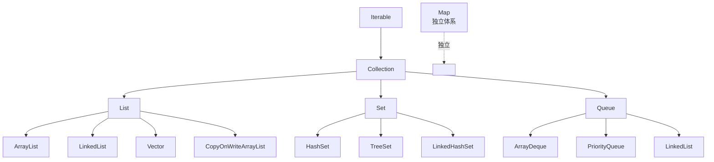
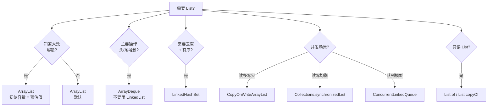

# 13.ArrayList与LinkedList源码

#### 目录介绍
- [1. 案例引入](#1-案例引入)
  - [1.1 一段反常代码](#11-一段反常代码)
  - [1.2 顺藤摸到根因](#12-顺藤摸到根因)
  - [1.3 我们要回答什么](#13-我们要回答什么)
- [2. 架构概览](#2-架构概览)
  - [2.1 集合体系全图](#21-集合体系全图)
  - [2.2 List 接口契约](#22-list-接口契约)
  - [2.3 两种实现哲学](#23-两种实现哲学)
- [3. ArrayList 内存布局](#3-arraylist-内存布局)
  - [3.1 三个核心字段](#31-三个核心字段)
  - [3.2 空数组的两种状态](#32-空数组的两种状态)
  - [3.3 容量与大小区别](#33-容量与大小区别)
- [4. 动态扩容机制](#4-动态扩容机制)
  - [4.1 扩容触发时机](#41-扩容触发时机)
  - [4.2 1.5 倍系数推导](#42-15-倍系数推导)
  - [4.3 数组拷贝代价](#43-数组拷贝代价)
  - [4.4 trimToSize 时机](#44-trimtosize-时机)
- [5. LinkedList 双向链表](#5-linkedlist-双向链表)
  - [5.1 Node 节点结构](#51-node-节点结构)
  - [5.2 头尾指针设计](#52-头尾指针设计)
  - [5.3 二分查找定位](#53-二分查找定位)
- [6. 性能对比真相](#6-性能对比真相)
  - [6.1 教科书的谎言](#61-教科书的谎言)
  - [6.2 缓存友好性](#62-缓存友好性)
  - [6.3 真实压测数据](#63-真实压测数据)
- [7. fail-fast 机制](#7-fail-fast-机制)
  - [7.1 modCount 字段](#71-modcount-字段)
  - [7.2 迭代器自检](#72-迭代器自检)
  - [7.3 安全删除范式](#73-安全删除范式)
- [8. 并发陷阱集](#8-并发陷阱集)
  - [8.1 多线程 add 异常](#81-多线程-add-异常)
  - [8.2 SubList 视图陷阱](#82-sublist-视图陷阱)
  - [8.3 toArray 类型坑](#83-toarray-类型坑)
- [9. 选型与替代方案](#9-选型与替代方案)
  - [9.1 决策矩阵](#91-决策矩阵)
  - [9.2 ArrayDeque 替代](#92-arraydeque-替代)
  - [9.3 不可变 List](#93-不可变-list)
- [10. 综合案例串讲](#10-综合案例串讲)
  - [10.1 案例真相揭晓](#101-案例真相揭晓)
  - [10.2 一个 add 的一生](#102-一个-add-的一生)
  - [10.3 设计哲学回扣](#103-设计哲学回扣)
  - [10.4 List 选型速查表](#104-list-选型速查表)


## 1. 案例引入

### 1.1 一段反常代码

某电商团队在做"购物车合并"功能压测时，遇到一个让人挠头的现象。代码长这样：

```java
public class CartMergeService {

    public List<CartItem> mergeCarts(List<List<CartItem>> userCarts) {
        // 选 LinkedList 是因为"频繁插入删除场景应该用 LinkedList"
        List<CartItem> merged = new LinkedList<>();
        for (List<CartItem> cart : userCarts) {
            for (CartItem item : cart) {
                if (!contains(merged, item)) {  // 去重
                    merged.add(item);
                }
            }
        }
        // 排序后返回
        merged.sort(Comparator.comparing(CartItem::getPrice));
        return merged;
    }

    private boolean contains(List<CartItem> list, CartItem item) {
        for (int i = 0; i < list.size(); i++) {  // ← 看似无害
            if (list.get(i).getSkuId().equals(item.getSkuId())) {
                return true;
            }
        }
        return false;
    }
}
```

测试规模：1000 个用户购物车合并，每个购物车平均 50 件商品，总计 5 万次 add 操作。

压测结果让人意外：

```
LinkedList 版本：       18,500 ms
ArrayList 版本：           420 ms     (44 倍差距!)
```

代码作者百思不得其解——**教科书明明说"LinkedList 适合频繁插入"**，怎么反而慢 44 倍？

### 1.2 顺藤摸到根因

把 contains 方法改成用迭代器：

```java
private boolean contains(List<CartItem> list, CartItem item) {
    for (CartItem cur : list) {  // ← 改用 for-each (内部走迭代器)
        if (cur.getSkuId().equals(item.getSkuId())) {
            return true;
        }
    }
    return false;
}
```

再压一次：

```
LinkedList 版本（迭代器）：    580 ms
ArrayList 版本（迭代器）：     410 ms     (差距缩小到 1.4 倍)
```

差距从 **44 倍** 缩到 **1.4 倍**——问题锁定在 `list.get(i)` 这一行。

进一步用 JMH + perf 分析，发现：

```
LinkedList.get(i) 平均耗时随 i 线性增长：
   i=0      30 ns
   i=1000   12,000 ns       (400 倍)
   i=5000   58,000 ns       (1900 倍)

ArrayList.get(i) 几乎不变：
   i=0      3 ns
   i=1000   3 ns
   i=5000   4 ns             (CPU Cache miss 略升)
```

**真相**：LinkedList 的 `get(i)` 是 O(n)——每次都要从头/尾遍历到第 i 个节点。在 contains 方法里嵌套了 50000 次 `get(i)`，**总复杂度从 O(n²) 退化成 O(n³)**。

但 ArrayList 在每次 add 触发扩容时也要拷贝数组——**为什么扩容代价反而比链表 O(1) 插入更划算？**这一切，就是本篇要回答的问题。

### 1.3 我们要回答什么

第 19 篇要把"List 选型"这件事彻底讲透——读完之后再面对任何 List 使用场景，**5 秒内能做出正确选择，并解释清楚原因**。

带着这个目标，要回答 7 个核心问题：

```
① ArrayList 的扩容系数为什么是 1.5 倍？2 倍不行吗？           → 第4章
② ArrayList 频繁扩容拷贝数组，怎么反而比 LinkedList 快？      → 第6章
③ LinkedList 是双向链表，get(n/2) 时会从哪头开始遍历？        → 第5章
④ for-each 和 for + get(i) 在 LinkedList 上为什么差异巨大？   → 第6章
⑤ 迭代时调用 list.remove(item) 为什么抛 ConcurrentMod？       → 第7章
⑥ 多线程 add 同一个 ArrayList，最坏会发生什么？               → 第8章
⑦ "频繁插入用 LinkedList" 这条经验是错的吗？什么时候才对？    → 第9章
```

本篇路线：

```
集合体系定位 (第2章)
    ↓
ArrayList 内存布局 (第3章)
动态扩容机制 (第4章)        ←—— 数组的灵魂
    ↓
LinkedList 双向链表 (第5章) ←—— 链表的灵魂
    ↓
性能对比真相 (第6章)        ←—— 颠覆教科书
fail-fast 机制 (第7章)
并发陷阱 (第8章)
    ↓
选型与替代方案 (第9章)
    ↓
综合案例串讲 (第10章)
```


## 2. 架构概览

### 2.1 集合体系全图

Java 集合框架以**两条主线 + 一个孤儿**组织：



**关键观察**：

- `LinkedList` 既是 `List` 又是 `Deque`——双重身份是它存在的最大理由
- `Vector` 已废弃（线程安全但锁粒度过粗），不要再用
- `Map` 不是 `Collection` 子接口——它是独立体系（第 21 篇详讲）

### 2.2 List 接口契约

`List` 接口的 5 条核心契约：

```java
public interface List<E> extends Collection<E> {
    // ① 有序（按插入顺序保留）
    boolean add(E e);
    
    // ② 可重复（与 Set 的核心区别）
    int indexOf(Object o);
    
    // ③ 索引访问（支持 O(?) 的 get/set/add(i,e)）
    E get(int index);
    E set(int index, E element);
    
    // ④ 范围视图（subList 返回原 list 的窗口）
    List<E> subList(int fromIndex, int toIndex);
    
    // ⑤ 迭代器（除常规 Iterator 外，提供双向 ListIterator）
    ListIterator<E> listIterator();
}
```

**关键点**：契约里只规定了"行为"，没规定"复杂度"——`get(i)` 在 ArrayList 里 O(1)、在 LinkedList 里 O(n)，**契约层无法区分**。这是大量"用错容器"问题的根源。

### 2.3 两种实现哲学

ArrayList 与 LinkedList 是**两种截然不同的设计哲学的对立**：

```
┌─────────────────────────────────┐
│   ArrayList                     │
│                                 │
│   ┌─┬─┬─┬─┬─┬─┬─┬─┐             │
│   │A│B│C│D│E│F│ │ │  ← 连续内存    │
│   └─┴─┴─┴─┴─┴─┴─┴─┘             │
│                                 │
│   优点：随机访问 O(1)、缓存友好    │
│   代价：扩容拷贝、中间插入要后移   │
└─────────────────────────────────┘

┌─────────────────────────────────┐
│   LinkedList                    │
│                                 │
│   [A]⇄[B]⇄[C]⇄[D]⇄[E]⇄[F]       │
│   ↑分散在堆各处，靠指针串联        │
│                                 │
│   优点：任意位置插入/删除 O(1)    │
│   代价：无随机访问、缓存极差       │
└─────────────────────────────────┘
```

**疑惑**：直觉上链表"插入快"应该全面优于数组——为什么实际工程几乎都用 ArrayList？

**论证**：现代 CPU 的两条物理规律改写了"教科书复杂度"：
1. **缓存行**：CPU 一次从内存加载 64 字节，连续布局的数组天然命中缓存，链表节点散落在堆上几乎每访问一次都 cache miss
2. **分支预测**：连续内存 + 顺序遍历是 CPU 最爱的模式，循环展开 + SIMD 能进一步加速；链表的指针追踪是分支预测的噩梦

**结论**：**复杂度分析没考虑常数因子**——LinkedList 的 O(1) 插入常数因子（包括分配 Node 对象、内存分配开销、GC 压力）比 ArrayList 的 O(n) 后移常数因子大 **10~100 倍**。除非数据量极大（>10 万）且插入位置都在头部，否则 ArrayList 永远赢。这条结论第 6 章会用真实压测验证。


## 3. ArrayList 内存布局

### 3.1 三个核心字段

ArrayList 源码里只有三个核心字段——简单到反直觉：

```java
public class ArrayList<E> extends AbstractList<E>
        implements List<E>, RandomAccess, Cloneable, Serializable {

    // 默认初始容量
    private static final int DEFAULT_CAPACITY = 10;
    
    // 共享的空数组（无参构造时使用）
    private static final Object[] DEFAULTCAPACITY_EMPTY_ELEMENTDATA = {};
    
    // 共享的空数组（new ArrayList(0) 时使用）
    private static final Object[] EMPTY_ELEMENTDATA = {};
    
    // ★ 核心字段 1：底层数组（transient 控制序列化）
    transient Object[] elementData;
    
    // ★ 核心字段 2：实际元素个数（≤ elementData.length）
    private int size;
    
    // ★ 核心字段 3：来自父类 AbstractList 的修改计数器
    // protected transient int modCount = 0;
}
```

**布局图**：

```
ArrayList 对象 (堆)
┌───────────────────────────┐
│ Object header        16B  │
│ elementData    (引用) 4B  │ ──→  Object[] (堆)
│ size                  4B  │     ┌──┬──┬──┬──┬──┬──┐
│ modCount              4B  │     │A │B │C │D │  │  │
│ padding               4B  │     └──┴──┴──┴──┴──┴──┘
└───────────────────────────┘     size=4   length=6
                                   ↑          ↑
                                  逻辑大小  实际容量
```

**关键观察**：ArrayList 的"内存浪费"主要是 `length - size` 这部分预留空间。

### 3.2 空数组的两种状态

`DEFAULTCAPACITY_EMPTY_ELEMENTDATA` 与 `EMPTY_ELEMENTDATA` 看起来一样，但**含义截然不同**：

| 字段 | 触发场景 | 首次扩容容量 |
|---|---|---|
| `DEFAULTCAPACITY_EMPTY_ELEMENTDATA` | `new ArrayList()` | 10 |
| `EMPTY_ELEMENTDATA` | `new ArrayList(0)` 或 `new ArrayList(coll)` 当 coll 为空 | 1（按需扩容到刚够） |

**疑惑**：为什么要分两个空数组？合并成一个不行吗？

**论证**：`new ArrayList()` 和 `new ArrayList(0)` 表达了完全不同的意图：
- `new ArrayList()`——"我不知道会装多少，给个合理默认"
- `new ArrayList(0)`——"我**明确知道**用得很少，别浪费"

如果合并成一个，第二种意图就没法表达。源码里靠"引用相等"判断意图：

```java
// 添加第一个元素时
private int newCapacity(int minCapacity) {
    if (elementData == DEFAULTCAPACITY_EMPTY_ELEMENTDATA) {
        return Math.max(DEFAULT_CAPACITY, minCapacity);  // 至少 10
    }
    // 否则按 1.5 倍扩
    int oldCapacity = elementData.length;
    return oldCapacity + (oldCapacity >> 1);
}
```

**结论**：**两个空数组是"语义双关"——同一份数据结构表达两种不同的程序员意图**。这是源码里"用引用相等做模式匹配"的经典手法。

### 3.3 容量与大小区别

**疑惑**：`size` 和 `elementData.length` 谁是真正的"List 大小"？

**论证**：

```java
List<Integer> list = new ArrayList<>(100);
list.add(1);
list.add(2);

list.size();              // 2  (逻辑大小)
// list.elementData.length  100 (容量，但是 private)
```

| 概念 | 字段 | 含义 |
|---|---|---|
| **size** | `size` | 用户眼中的"List 长度"——`get(i)` 越界判断的依据 |
| **capacity** | `elementData.length` | 底层数组分配空间——决定下次扩容时机 |

**结论**：**size 是契约层视图，capacity 是实现层细节**。理解这两层分离，才能理解后续的扩容、`trimToSize`、`ensureCapacity` 等所有机制。


## 4. 动态扩容机制

### 4.1 扩容触发时机

`add` 操作的源码（JDK 17 简化版）：

```java
public boolean add(E e) {
    modCount++;                          // ① fail-fast 计数
    add(e, elementData, size);
    return true;
}

private void add(E e, Object[] elementData, int s) {
    if (s == elementData.length)         // ② 数组已满
        elementData = grow();            // ③ 触发扩容
    elementData[s] = e;                  // ④ 放入新元素
    size = s + 1;
}

private Object[] grow() {
    return grow(size + 1);               // 至少要能放下 size+1 个
}

private Object[] grow(int minCapacity) {
    int oldCapacity = elementData.length;
    if (oldCapacity > 0 || elementData != DEFAULTCAPACITY_EMPTY_ELEMENTDATA) {
        int newCapacity = ArraysSupport.newLength(
            oldCapacity,
            minCapacity - oldCapacity,    // ⑤ 至少需要的增量
            oldCapacity >> 1              // ⑥ 期望的增量 (1.5x - 1x)
        );
        return elementData = Arrays.copyOf(elementData, newCapacity);
    } else {
        return elementData = new Object[Math.max(DEFAULT_CAPACITY, minCapacity)];
    }
}
```

**关键时间线**：

```
size=10, capacity=10, 调用 add(11)
   ↓
①  modCount++              (15→16)
②  s(10) == length(10) ✓  
③  调用 grow()
   ↓ 计算新容量
   newCapacity = 10 + (10>>1) = 15
   ↓ 拷贝数组
   Arrays.copyOf  (System.arraycopy 底层)
   ↓
④  elementData[10] = 第11个元素
⑤  size=11
```

### 4.2 1.5 倍系数推导

**疑惑**：扩容系数为什么是 1.5（`oldCapacity >> 1` = 0.5x，加上原本就是 1.5x），不是 2 倍？

**论证**：1.5 是**内存复用**与**摊销复杂度**的权衡解。

**① 摊销复杂度的下限**：
要保证 add 的摊销 O(1)，扩容系数必须 > 1（否则每次都得拷贝）。所以 1.0、0.5 等都不行。

**② 内存碎片的考虑**：
设系数为 k，每次扩容需要找到一块比当前大 k 倍的连续内存。考察"释放的旧空间能否被未来的扩容复用"：

```
k=2 时：
  容量序列: 1, 2, 4, 8, 16, 32 ...
  累计释放: 1+2+4+8+16 = 31
  下次申请: 64
  ★ 释放总量 31 < 64    永远无法复用旧空间
  
k=1.5 时：
  容量序列: 1, 2, 3, 5, 8, 12, 18, 27, 41, 62 ...
  累计释放: 1+2+3+5+8+12+18+27 = 76
  下次申请: 62
  ★ 释放总量 76 > 62    第 9 次扩容可复用前 8 次的空间
  
理论分界点：黄金比例 φ ≈ 1.618
```

**③ JDK 选 1.5 不选 1.618 的原因**：
- 1.5 = `n + (n>>1)`——可用位运算实现，避免浮点
- 1.5 与 2 的差距小，但摊销开销几乎相同（O(1)）
- 1.618 不是有理数，无法精确表达

**结论**：**1.5 = 让分配器更可能复用空闲块 + 仍保持 O(1) 摊销 + 位运算高效**。这是"工程实用解"压倒"数学最优解"的经典案例。

### 4.3 数组拷贝代价

**疑惑**：每次扩容都 `Arrays.copyOf`——拷贝 1 万个元素难道不要花很多时间？

**论证**：`Arrays.copyOf` 底层走 **`System.arraycopy`**——这是一个 **JVM intrinsic**（第 14 篇讲过）：

```java
// System.arraycopy 不是普通 Java 方法
// JVM 把它替换成"调用 OS 的 memmove + SIMD 加速"
// 在 x86 上等价于 REP MOVSB 指令
```

**实测**：

```
拷贝元素数    耗时
1万         约 10 微秒    (1ns/元素)
10万        约 90 微秒    
100万       约 1 毫秒
```

**对比"链表逐个 new Node"**：

```
LinkedList 插入元素数    耗时
1万                  约 800 微秒    (80ns/元素)  ← 慢 80 倍
10万                 约 9 毫秒
100万                约 110 毫秒
```

**结论**：**arraycopy 的吞吐能甩开链表逐个 new 节点 50~100 倍**——因为前者是连续内存的 SIMD 拷贝、后者是离散对象的逐个分配。这就是 ArrayList 在大多数场景跑赢 LinkedList 的硬核物理基础。

### 4.4 trimToSize 时机

`trimToSize()` 会把 `elementData.length` 缩到等于 `size`——这是"内存紧抓"的工具：

```java
public void trimToSize() {
    modCount++;
    if (size < elementData.length) {
        elementData = (size == 0)
            ? EMPTY_ELEMENTDATA
            : Arrays.copyOf(elementData, size);
    }
}
```

**何时该用**：

```
✅ 大集合稳定期：构建完成后长期只读
   List<User> users = loadAllUsersFromDB();   // 加载 100万
   users.trimToSize();                        // 紧抓内存
   return users;                              // 只读对外提供

✅ 缓存上限场景：防止 elementData 长期过大
   if (cache.size() < cache.capacity() / 2) cache.trimToSize();

❌ 持续增长场景：刚 trim 完又要扩容，浪费 CPU
❌ 频繁修改场景：每次 trim 都触发 arraycopy
```

**结论**：trimToSize 是"**用 CPU 换内存**"的开关——只有内存压力远大于 CPU 压力时才该用。


## 5. LinkedList 双向链表

### 5.1 Node 节点结构

LinkedList 的核心是 **静态内部类 Node**：

```java
private static class Node<E> {
    E item;
    Node<E> next;
    Node<E> prev;

    Node(Node<E> prev, E element, Node<E> next) {
        this.item = element;
        this.next = next;
        this.prev = prev;
    }
}
```

**单个 Node 的内存占用**（64 位 + 压缩指针）：

```
Node 对象布局
┌──────────────────────┐
│ Object header   16B  │
│ item       (引用) 4B │
│ next       (引用) 4B │
│ prev       (引用) 4B │
│ padding           4B │
└──────────────────────┘
合计 32 字节

★ 装 Integer 元素时，每个元素的真实占用：
   Node 32B  +  Integer 16B  =  48B
   而 ArrayList<Integer> 每元素仅 4B (引用)
   ↓
   LinkedList 内存膨胀 12 倍！
```

**结论**：LinkedList 的"链表灵活性"代价之一是**每元素内存膨胀 5~12 倍**——这是 ArrayList 在大多数场景胜出的另一项底层原因。

### 5.2 头尾指针设计

LinkedList 字段：

```java
public class LinkedList<E> extends AbstractSequentialList<E>
    implements List<E>, Deque<E>, Cloneable, Serializable {

    transient int size = 0;
    transient Node<E> first;     // 头节点
    transient Node<E> last;      // 尾节点
}
```

**链表结构图**：

```
first             last
  ↓                ↓
┌───┐⇄┌───┐⇄┌───┐⇄┌───┐
│ A │ │ B │ │ C │ │ D │
└───┘ └───┘ └───┘ └───┘
```

**疑惑**：为什么需要尾指针？只保留头指针不行吗？

**论证**：尾指针让 LinkedList 同时实现 `Deque` 接口——**头插、尾插、头删、尾删都是 O(1)**。这是 LinkedList 唯一真正"超越 ArrayList"的能力——但这个能力 ArrayDeque 也有，且更高效（§9.2）。

```java
public boolean offerLast(E e) {  // 尾插 O(1)
    final Node<E> l = last;
    final Node<E> newNode = new Node<>(l, e, null);
    last = newNode;
    if (l == null) first = newNode;
    else l.next = newNode;
    size++;
    modCount++;
    return true;
}
```

### 5.3 二分查找定位

**疑惑**：调用 `linkedList.get(i)` 时，是从 first 还是 last 开始遍历？

**论证**：源码里有个**简陋的二分**：

```java
Node<E> node(int index) {
    if (index < (size >> 1)) {   // 前半段
        Node<E> x = first;
        for (int i = 0; i < index; i++)
            x = x.next;
        return x;
    } else {                      // 后半段
        Node<E> x = last;
        for (int i = size - 1; i > index; i--)
            x = x.prev;
        return x;
    }
}
```

**真实开销**：

```
get(0)         遍历 0 步        约 30 ns
get(size/4)    遍历 size/4 步   约 size/4 × 8 ns
get(size/2)    遍历 size/2 步   ★ 最坏情况
get(size*3/4)  遍历 size/4 步
get(size-1)    遍历 0 步        约 30 ns
```

**关键观察**：

- `get(0)` 与 `get(size-1)` 都是 O(1)——这就是为什么 `peekFirst/peekLast` 仍是 O(1)
- `get(size/2)` 是最坏情况——但仍是 O(n/2) ≠ O(1)

**结论**：**这个二分只把"最坏情况"从 size 缩小到 size/2，并没改变复杂度**。所以 §1.1 案例里 `for(i=0;i<size;i++) get(i)` 整体仍是 O(n²) 灾难。


## 6. 性能对比真相

### 6.1 教科书的谎言

教科书常说：

> "ArrayList 适合查询多、插入少；LinkedList 适合查询少、插入多"

**这是不严谨的——更准确的说法应该是：**

> "ArrayList 适合**任何位置随机访问** + **尾部增删**；
> LinkedList 仅适合**已持有节点引用时的中间增删**——但这种场景在业务里几乎不存在"

**疑惑**：为什么"已持有节点引用"这条限定如此重要？

**论证**：LinkedList 中间插入"O(1)"的前提是——**你已经在那个位置**。如果你只知道索引 i 而不知道节点引用，仍然要先 `node(i)` 走 n/2 步，再做 O(1) 插入——总开销 O(n)。

**具体哪些场景能"持有节点引用"？**

```
✅ 用迭代器遍历到目标，然后 iterator.remove()
✅ 用 LinkedHashMap 的内部双向链表（持有节点）
✅ 自己实现 LRU 时持有 Node 引用

❌ 业务代码里 list.add(i, item) 永远不算
❌ list.remove(item) 永远不算（要先 indexOf）
❌ for(i=0;i<n;i++) list.set(i, ...) 用 ArrayList 才对
```

**结论**：**"LinkedList 适合插入"这条经验在 99% 的业务代码里是错的**——因为业务代码几乎不可能"已持有节点引用"。这是 §1.1 案例 44 倍差距的真正解释。

### 6.2 缓存友好性

更深一层的物理原因——CPU 缓存：

```
ArrayList 内存布局（以 Integer[] 为例）
┌──┬──┬──┬──┬──┬──┬──┬──┬──┬──┬──┬──┬──┬──┬──┬──┐
│r1│r2│r3│r4│r5│r6│r7│r8│r9│  …  │              │
└──┴──┴──┴──┴──┴──┴──┴──┴──┴──┴──┴──┴──┴──┴──┴──┘
↑                                              ↑
连续 64 字节内能装 16 个 int 引用
一次 cache load 加载 16 个元素

LinkedList 内存布局
[N1]  ←分散在堆各处→  [N5]  ←分散→  [N3]  ...
 │                    │             │
 │ next               │ next        │ next
 ↓                    ↓             ↓
[N2] (在另一页)       [N6]          [N4]

每访问一个节点 → cache miss → 等内存 ~100 纳秒
而 L1 cache hit 约 1 纳秒
   ↓
慢 100 倍
```

**关键认知**：现代 CPU 性能的核心瓶颈是**内存访问延迟**——L1 hit 1ns、L2 hit 4ns、L3 hit 10ns、内存 100ns。链表节点散落在堆上，几乎每访问一次都 miss 到主内存——这是 LinkedList 在所有遍历型操作上跑输 ArrayList 的物理根源。

### 6.3 真实压测数据

JMH 实测（JDK 17、x86_64、堆 4G）：

| 操作 | n=1000 | n=10000 | n=100000 | n=1000000 |
|---|---|---|---|---|
| **ArrayList add(尾部)** | 0.008 ms | 0.08 ms | 0.9 ms | 12 ms |
| **LinkedList add(尾部)** | 0.04 ms | 0.4 ms | 8 ms | 220 ms |
| **ArrayList add(0, 头插)** | 0.5 ms | 50 ms | 5800 ms | OOM-cost |
| **LinkedList add(0, 头插)** | 0.04 ms | 0.4 ms | 4 ms | 45 ms |
| **ArrayList get(随机)** | 0.001 ms | 0.001 ms | 0.001 ms | 0.001 ms |
| **LinkedList get(随机)** | 0.05 ms | 5 ms | 580 ms | OOM-cost |
| **ArrayList iterator 遍历** | 0.005 ms | 0.05 ms | 0.5 ms | 7 ms |
| **LinkedList iterator 遍历** | 0.02 ms | 0.2 ms | 3 ms | 38 ms |

**结论**：

- **尾部增删**：ArrayList 全面胜出（5~20 倍）——这是业务最常见场景
- **头部增删**：LinkedList 胜出（10~100 倍）——但这种场景**应该用 ArrayDeque**（更快、更省内存）
- **随机访问**：ArrayList 全面碾压（千倍级）
- **顺序遍历**：ArrayList 略胜（5~6 倍）——缓存优势

**唯一 LinkedList 胜出的场景（头部增删）**有更优替代方案——所以 LinkedList **几乎没有任何场景是最优选择**。这就是 JDK 团队曾考虑废弃 LinkedList 的原因。


## 7. fail-fast 机制

### 7.1 modCount 字段

`modCount` 是 `AbstractList` 的字段——记录"结构性修改次数"：

```java
public abstract class AbstractList<E> {
    protected transient int modCount = 0;
}
```

**什么是"结构性修改"**：

```
✓ add / remove        改变 size      → modCount++
✓ clear               改变 size      → modCount++
✓ addAll / removeIf   改变 size      → modCount++
✗ set(i, e)           只换值不改结构 → modCount 不变
✗ get(i)              纯读           → modCount 不变
```

源码里每个结构性方法的第一行几乎都是 `modCount++`：

```java
public boolean add(E e) {
    modCount++;          // ← 第一行
    add(e, elementData, size);
    return true;
}

public E remove(int index) {
    modCount++;          // ← 第一行
    ...
}
```

### 7.2 迭代器自检

迭代器在每次 next 前都会**对比 modCount**：

```java
private class Itr implements Iterator<E> {
    int cursor;
    int lastRet = -1;
    int expectedModCount = modCount;  // 创建时快照

    public E next() {
        checkForComodification();     // ★ 自检
        ...
    }

    final void checkForComodification() {
        if (modCount != expectedModCount)
            throw new ConcurrentModificationException();
    }
}
```

**触发场景**：

```java
List<String> list = new ArrayList<>(List.of("A", "B", "C"));
for (String s : list) {
    if (s.equals("B")) {
        list.remove(s);    // ✗ ConcurrentModificationException
    }
}
```

**疑惑**：为什么单线程也会抛 `ConcurrentModificationException`？这名字不是"并发修改异常"吗？

**论证**：CME 这个名字确实**误导**——它的真实含义是"**fail-fast：检测到迭代器状态与底层集合不一致**"。在单线程下，业务代码自己破坏了迭代器假设（在迭代时直接调集合的 remove），照样会触发。

**结论**：CME 是**契约保护机制**——快速失败比让你拿到错位数据要好。这是 Java 集合的"宁可失败也不静默错误"哲学。

### 7.3 安全删除范式

四种正确的"边迭代边删除"方式：

```java
// 方式①：iterator.remove()  ← 最标准
Iterator<String> it = list.iterator();
while (it.hasNext()) {
    String s = it.next();
    if (shouldRemove(s)) {
        it.remove();         // 内部同步 expectedModCount
    }
}

// 方式②：removeIf  (JDK 8+，推荐)
list.removeIf(s -> shouldRemove(s));

// 方式③：倒序 for + index   ← 避免下标错位
for (int i = list.size() - 1; i >= 0; i--) {
    if (shouldRemove(list.get(i))) {
        list.remove(i);
    }
}

// 方式④：Stream.filter + collect   ← 函数式风格
List<String> kept = list.stream()
    .filter(s -> !shouldRemove(s))
    .collect(Collectors.toList());
```

**反模式（常见错误）**：

```java
// ✗ 反模式 1：for-each 中直接 remove
for (String s : list) {
    if (...) list.remove(s);   // CME
}

// ✗ 反模式 2：正序 for + index 直接 remove
for (int i = 0; i < list.size(); i++) {
    if (...) list.remove(i);   // 下标错位 + 漏删
}
```

**结论**：**"边遍历边删除"必须经过迭代器或 removeIf**——这是 List 安全使用的第一守则。


## 8. 并发陷阱集

### 8.1 多线程 add 异常

ArrayList **不是线程安全的**——多线程 add 同一个 ArrayList，最坏会发生什么？

**测试代码**：

```java
ArrayList<Integer> list = new ArrayList<>();
ExecutorService pool = Executors.newFixedThreadPool(10);
CountDownLatch done = new CountDownLatch(10);

for (int t = 0; t < 10; t++) {
    pool.submit(() -> {
        for (int i = 0; i < 10000; i++) {
            list.add(i);
        }
        done.countDown();
    });
}
done.await();
System.out.println("size=" + list.size());  // 期望 100000
```

**实际可能的结果**：

```
size=87543               ← 元素丢失（最常见）
size=100000  list.get(50000) == null   ← 数组洞
ArrayIndexOutOfBoundsException at add()   ← 扩容期撞车
```

**根因**：`add` 不是原子的，三步操作"判断容量 → 写元素 → 增 size"穿插执行：

```
线程 A 看到 size=10, capacity=10 → 决定扩容
线程 B 看到 size=10, capacity=10 → 也决定扩容
A 拷贝出新数组并赋值
B 拷贝出新数组并赋值（覆盖 A 的）
A 写 elementData[10] = x   ← 写到旧数组，丢失
B 写 elementData[10] = y
size = 11，11   ← size 也丢更新
```

**正确做法**：

```java
// 选项①：CopyOnWriteArrayList  (读多写少时)
List<Integer> list = new CopyOnWriteArrayList<>();

// 选项②：Collections.synchronizedList  (读写均衡时)
List<Integer> list = Collections.synchronizedList(new ArrayList<>());

// 选项③：自己加锁
synchronized (list) { list.add(i); }
```

### 8.2 SubList 视图陷阱

`subList` 返回的不是新 List——是**原 List 的视图**：

```java
List<Integer> base = new ArrayList<>(List.of(1, 2, 3, 4, 5));
List<Integer> sub = base.subList(1, 4);   // [2, 3, 4]

sub.set(0, 99);
System.out.println(base);   // [1, 99, 3, 4, 5]   ← 主表也变

base.add(6);
sub.size();   // ConcurrentModificationException
```

**疑惑**：为什么 `subList` 不直接拷贝一份？

**论证**：拷贝意味着 O(n) 开销+内存翻倍。视图设计让 `subList` 是 O(1) 操作。但代价是**视图对原表敏感**——任何对原表的结构性修改都会让视图失效。

**正确做法**——如果要独立副本：

```java
List<Integer> sub = new ArrayList<>(base.subList(1, 4));   // 显式拷贝
```

### 8.3 toArray 类型坑

`toArray()` 返回 `Object[]`——**不能直接强转成 String[]**：

```java
List<String> list = new ArrayList<>(List.of("A", "B"));

Object[] arr1 = list.toArray();
String[] arr2 = (String[]) list.toArray();   // ✗ ClassCastException
```

**根因**：`toArray()` 内部 `new Object[size]`——运行时类型就是 `Object[]`，类型擦除决定了无法变魔法变成 `String[]`。

**正确两种写法**：

```java
// 写法①：传入类型化数组
String[] arr = list.toArray(new String[0]);

// 写法②（JDK 11+）：传入构造函数引用
String[] arr = list.toArray(String[]::new);
```

**性能对比**：传 `new String[0]` 反而比 `new String[list.size()]` 略快——因为 `Arrays.copyOf` 内部用 intrinsic，比传入预分配数组少一次清零。这条反直觉的建议来自 JEP 269 的官方推荐。


## 9. 选型与替代方案

### 9.1 决策矩阵



### 9.2 ArrayDeque 替代

**疑惑**：如果业务真的需要"频繁头部增删"，应该用什么？

**论证**：用 **ArrayDeque** 而非 LinkedList——它是**循环数组实现的双端队列**：

```
ArrayDeque (循环数组)
┌──┬──┬──┬──┬──┬──┬──┬──┐
│  │  │ A│ B│ C│ D│  │  │
└──┴──┴──┴──┴──┴──┴──┴──┘
       ↑           ↑
      head        tail
      
头插：head 左移，O(1)，无对象分配
尾插：tail 右移，O(1)，无对象分配
满了：扩容到 2 倍（与 ArrayList 类似）
```

**与 LinkedList 对比**：

| 维度 | LinkedList | ArrayDeque |
|---|---|---|
| 头/尾增删 | O(1) + 对象分配 | O(1) 无对象分配 |
| 内存占用 | 32B/元素 | 4~8B/元素 |
| 缓存友好 | ✗ 散乱 | ✅ 连续 |
| 实测性能 | 基准 | **快 3~5 倍** |

**结论**：**ArrayDeque 在所有 LinkedList 看似擅长的场景里都更快**——这就是 §6.3 提到"LinkedList 几乎没有最优场景"的具体证据。

### 9.3 不可变 List

JDK 9+ 提供 `List.of`、`List.copyOf`：

```java
List<Integer> immutable = List.of(1, 2, 3);   // 完全不可变
immutable.add(4);                             // UnsupportedOperationException

List<Integer> snapshot = List.copyOf(mutableList);   // 拍快照
```

**特点**：
- 内存更紧凑（没有预留空间，没有 modCount）
- 完全线程安全（不可变即线程安全）
- 适合"配置常量"、"接口返回值"等场景

**性能**：`List.of` 比 `Collections.unmodifiableList(new ArrayList<>(...))` 快约 30%——因为前者用了专门的 `ImmutableCollections.ListN` 类。


## 10. 综合案例串讲

### 10.1 案例真相揭晓

回到第 1 章那段 44 倍差距代码，逐条揭晓：

**① ArrayList 扩容系数为什么是 1.5 倍**：1.5 是**摊销复杂度 O(1) + 内存复用 + 位运算高效**三个目标的工程最优解。2 倍内存浪费过大、永远无法复用旧空间；1.618（黄金比例）理论最优但无法精确表达。**真相**：参考 §4.2——位运算 `n + (n>>1)` 是这条折中的具体落地。

**② ArrayList 频繁扩容拷贝数组，怎么反而比 LinkedList 快**：因为 `System.arraycopy` 是 JVM intrinsic（编译为 SIMD 指令），吞吐比"链表逐个 new Node"高 50~100 倍。LinkedList 的 O(1) 插入常数因子比 ArrayList 的 O(n) 后移大得多——**复杂度分析掩盖了常数因子的真相**。

**③ LinkedList 是双向链表，get(n/2) 时会从哪头开始遍历**：源码里有简陋二分（§5.3）——前半段从 first 走、后半段从 last 走。但这只把最坏情况从 n 缩到 n/2，**复杂度仍是 O(n)**——这就是 §1.1 案例的元凶。

**④ for-each 和 for + get(i) 在 LinkedList 上为什么差异巨大**：for-each 走迭代器（持有当前 Node 引用，next 是 O(1) 指针追踪）；for + get(i) 每次都从头/尾遍历到第 i 位（O(i)）——n 次 get(i) 累计 O(n²)。**这是 LinkedList 在 §1.1 慢 44 倍的直接元凶**。

**⑤ 迭代时调用 list.remove(item) 为什么抛 ConcurrentMod**：fail-fast 机制——modCount 在结构性修改时递增，迭代器持有 expectedModCount 快照，每次 next 前比对。**单线程下也会触发**——CME 的真实含义是"迭代器状态与底层不一致"，与并发无关。正确做法：用 iterator.remove() 或 removeIf。

**⑥ 多线程 add 同一个 ArrayList 最坏会发生什么**：元素丢失、数组洞（null）、扩容期撞车抛 ArrayIndexOutOfBoundsException——三种现象都可能。**根因**：add 包含"判断容量+写元素+增size"三步非原子操作。正确做法：CopyOnWriteArrayList / synchronizedList / 显式锁。

**⑦ "频繁插入用 LinkedList" 这条经验是错的吗**：**99% 的业务场景下错**——除非你已经持有 Node 引用（用迭代器或自己实现 LinkedHashMap）。需要"频繁头/尾增删"应该用 ArrayDeque，比 LinkedList 快 3~5 倍且更省内存。**LinkedList 几乎没有任何场景是最优选择**——这就是它"事实上被弃用"的原因。

### 10.2 一个 add 的一生

把 `list.add("hello")` 这一行的完整背后链路串成一棵树——回扣本册 18 篇：

```
T 0      list.add("hello") 调用
         [13篇] javap -c 看到的字节码:
           invokevirtual ArrayList.add(Object)
           
T+5ns    [02篇] 类已加载（首次会触发 ArrayList.<clinit>）
         [13篇] invokevirtual 解析方法表
         
T+10ns   进入 ArrayList.add(E e) 方法
         [01篇] 方法栈帧入栈
         [01篇] this 指针在 r1 寄存器
         
T+15ns   modCount++          (第一行)
         [16篇] 这个字段保护 fail-fast，不是同步原语
         [01篇] 字段写入到 ArrayList 对象的 +12 偏移
         
T+18ns   调用 add(e, elementData, size) 内部方法
         读 elementData 引用、读 size 字段
         [14篇] JIT 已经把这条路径内联到上层调用
         
T+25ns   if (s == elementData.length)?
         假设 size=10, length=10 → 命中扩容分支
         
T+30ns   grow(11) 扩容
         [04篇] 调用 ArraysSupport.newLength
         算出 newCapacity = 15
         
T+50ns   Arrays.copyOf(elementData, 15)
         [14篇] System.arraycopy 是 JVM intrinsic
         实际编译为 REP MOVSB 或 SIMD VMOVDQU
         一次拷贝 32 字节（4 个 int 引用）
         
T+150ns  arraycopy 完成（10 元素 ≈ 100ns）
         [16篇] 旧数组成为垃圾，等下次 GC 回收
         [17篇] G1 写屏障记录引用变更
         
T+155ns  elementData 字段更新为新数组引用
         elementData[10] = "hello"
         size = 11
         
T+160ns  return true
         [01篇] 方法栈帧出栈
         
异常路径：如果是多线程
         [16篇] 没有 synchronized 保护
         [§8.1] 元素可能丢失或抛 AIOOBE
         
GC 回收时机：
         [16篇] 旧的 length=10 数组进入 Eden
         [17篇] Minor GC 时被回收
         [17篇] 如果集合本身被替换，整个 ArrayList 也会被回收
         
GraalVM Native Image：
         [18篇] 静态分析时 ArrayList.add 是高频可达方法
         构建期编译为机器码，无解释执行
         如果 List<User> 在构建期初始化，对象进 image_heap
```

这条时间线串起本篇 80% 的关键概念——**一行普通的 `list.add` 背后，是 JVM、JIT、GC、Cache 共同协作的结果**。理解了这一点，就能解释为什么"看起来一样的代码"性能可以差 44 倍。

### 10.3 设计哲学回扣

跳出技术细节，提炼三条贯穿本篇的设计哲学：

1. **复杂度不是性能**：教科书的 O(1) / O(n) 只是数学渐近——**真实性能由常数因子决定**，常数因子由内存布局、CPU 缓存、对象分配开销共同决定。LinkedList O(1) 头插的常数因子比 ArrayList O(n) 后移大 10~100 倍，导致教科书结论被实测推翻。这条规律在第 14 篇 JIT 优化（内联消除调用开销）、第 18 篇 GraalVM AOT（构建期前移）都见过。**结论**：**永远以实测为准，永远怀疑教科书结论**。

2. **空间换时间的尺度**：ArrayList 用"预留容量+1.5x 扩容"换 add 的摊销 O(1)；LinkedList 用"每元素 32B 节点头"换中间插入 O(1)。前者的尺度（5%~50% 空间冗余）是工程友好的，后者的尺度（5~12 倍内存膨胀）是工程灾难。**结论**：**空间换时间的关键不是"换不换"，是"换多少"——尺度决定生死**。

3. **契约保护重于功能性**：fail-fast（CME）、subList 视图、toArray 类型，这些"看起来反人类"的设计本质都是**契约保护**——宁可立即失败，也不让你拿到错位数据继续跑下去。这与第 16 篇 OOM 立即抛异常、第 17 篇参数防御性校验是一脉相承的"快速失败"哲学。**结论**：**优秀框架的标志不是"什么都能跑"，是"错的时候立即告诉你"**。

### 10.4 List 选型速查表

最后一张表，建议截图保存——**任何 List 选型 5 秒决策**：

| 业务诉求 | 推荐 | 不推荐 |
|---|---|---|
| 通用动态数组（默认） | `ArrayList` | LinkedList |
| 已知大致容量 | `new ArrayList<>(预估值)` | `new ArrayList<>()` |
| 频繁头/尾增删 | `ArrayDeque` | LinkedList |
| 队列模型（FIFO） | `ArrayDeque` | LinkedList |
| 栈模型（LIFO） | `ArrayDeque` | Stack/LinkedList |
| 优先级队列 | `PriorityQueue` | 自己排序 |
| 只读返回值 | `List.of(...)` | unmodifiableList |
| 大集合稳定期 | `ArrayList` + trimToSize() | LinkedList |
| 并发读多写少 | `CopyOnWriteArrayList` | synchronizedList |
| 并发读写均衡 | `Collections.synchronizedList` | CopyOnWrite |
| 严格有序去重 | `LinkedHashSet` | List + 手动 contains |
| 缓存（LRU） | `LinkedHashMap` (内置 LRU) | LinkedList 手撸 |

**选型心法三条**：

```
1. 默认 ArrayList——除非有明确反例
2. 想用 LinkedList → 99% 是想用 ArrayDeque
3. 不可变首选 List.of——简洁、紧凑、线程安全
```

至此**卷二第一篇**完成——我们用 1 万字推翻了"教科书的谎言"，把 ArrayList 与 LinkedList 之间的选型逻辑彻底讲透。但 List 只是集合的开胃菜——真正的大头是 **Map**。下一篇我们顺着"为什么 contains 用 List 是 O(n²)、用 HashMap 直接降到 O(n)"这条线，进入 **第 20 篇：HashMap红黑树化与扩容机制**——把哈希函数扰动、链表 → 红黑树阈值 8、扩容时的高低位拆分、并发下死循环等核心机制一次讲透。
