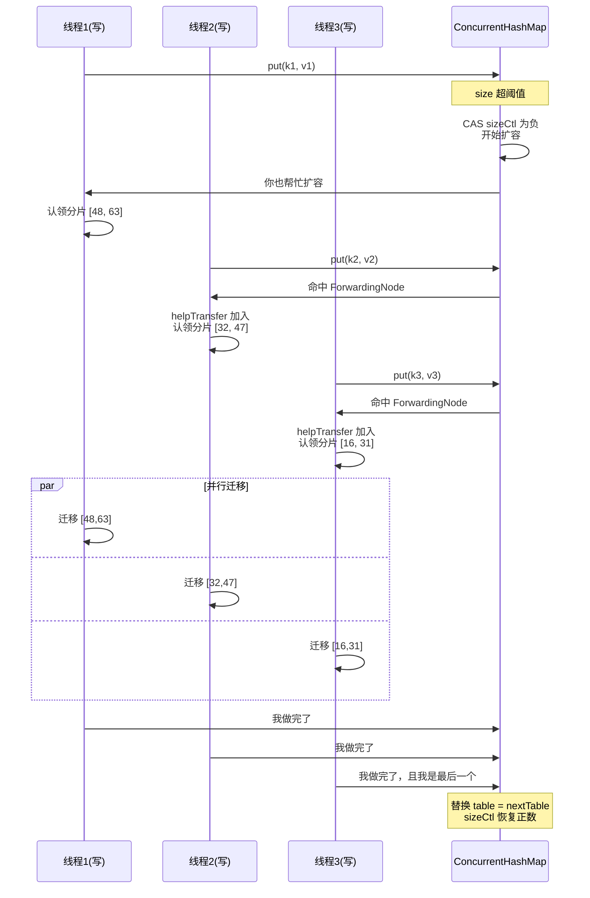

# 14.ConcurrentHashMap并发

#### 目录介绍
- [1. 案例引入](#1-案例引入)
  - [1.1 一段崩盘代码](#11-一段崩盘代码)
  - [1.2 顺藤摸到根因](#12-顺藤摸到根因)
  - [1.3 我们要回答什么](#13-我们要回答什么)
- [2. 演进全景概览](#2-演进全景概览)
  - [2.1 三代实现脉络](#21-三代实现脉络)
  - [2.2 锁粒度演进](#22-锁粒度演进)
  - [2.3 设计哲学迁移](#23-设计哲学迁移)
- [3. JDK7 分段锁](#3-jdk7-分段锁)
  - [3.1 Segment 数组结构](#31-segment-数组结构)
  - [3.2 二次哈希定位](#32-二次哈希定位)
  - [3.3 分段锁的局限](#33-分段锁的局限)
- [4. JDK8 重构动机](#4-jdk8-重构动机)
  - [4.1 分段锁三宗罪](#41-分段锁三宗罪)
  - [4.2 桶级别锁化](#42-桶级别锁化)
  - [4.3 CAS 与 synchronized](#43-cas-与-synchronized)
- [5. 核心字段与状态](#5-核心字段与状态)
  - [5.1 sizeCtl 多态字段](#51-sizectl-多态字段)
  - [5.2 Node 与 TreeBin](#52-node-与-treebin)
  - [5.3 ForwardingNode](#53-forwardingnode)
- [6. put 完整链路](#6-put-完整链路)
  - [6.1 初始化竞争](#61-初始化竞争)
  - [6.2 桶为空时 CAS](#62-桶为空时-cas)
  - [6.3 桶非空 synchronized](#63-桶非空-synchronized)
  - [6.4 协助扩容路径](#64-协助扩容路径)
- [7. 扩容协同机制](#7-扩容协同机制)
  - [7.1 扩容触发条件](#71-扩容触发条件)
  - [7.2 任务分片认领](#72-任务分片认领)
  - [7.3 高低位拆分](#73-高低位拆分)
  - [7.4 多线程协作图](#74-多线程协作图)
- [8. 红黑树化决策](#8-红黑树化决策)
  - [8.1 阈值 8 的概率](#81-阈值-8-的概率)
  - [8.2 树化与退化](#82-树化与退化)
  - [8.3 TreeBin 锁退化](#83-treebin-锁退化)
- [9. size 精确性取舍](#9-size-精确性取舍)
  - [9.1 baseCount 与 cells](#91-basecount-与-cells)
  - [9.2 LongAdder 思想](#92-longadder-思想)
  - [9.3 弱一致迭代器](#93-弱一致迭代器)
- [10. 综合案例串讲](#10-综合案例串讲)
  - [10.1 案例真相揭晓](#101-案例真相揭晓)
  - [10.2 一个 put 的一生](#102-一个-put-的一生)
  - [10.3 设计哲学回扣](#103-设计哲学回扣)
  - [10.4 并发 Map 速查表](#104-并发-map-速查表)


## 1. 案例引入

### 1.1 一段崩盘代码

某金融风控团队在做"用户实时行为聚合"，用了一段看起来"教科书级"的代码：

```java
public class UserBehaviorAggregator {

    private final Map<Long, AtomicLong> counter = new HashMap<>();   // ← 共享 HashMap

    /** 上游 Kafka 消费线程池调用，平均 8000 QPS */
    public void onEvent(long userId) {
        AtomicLong count = counter.get(userId);
        if (count == null) {
            count = new AtomicLong();
            counter.put(userId, count);     // ← 多线程 put
        }
        count.incrementAndGet();
    }

    public long size() {
        return counter.size();
    }
}
```

线上运行 3 天后，凌晨告警炸出一连串症状：

```
症状 1：service CPU 跑满 100%，且全部跑在 8 个工作线程上
症状 2：jstack 抓栈，8 个线程全部卡在 HashMap.getNode → for 循环里
症状 3：堆 dump 显示某个桶的链表自引用 (Node.next 指回自己)
症状 4：Service 完全无响应，但没有抛 OOM、没有死锁
```

最后用 jconsole 强行重启，损失了 30 分钟实时风控数据。

代码作者百思不解——**HashMap 在多线程下不是"顶多丢点数据"吗？怎么会让 CPU 跑满？**

### 1.2 顺藤摸到根因

将 HashMap 替换成 **`ConcurrentHashMap`**，并发问题立即消失。但仅这样还不够——团队 review 时连追三个问题：

```
追问 ①：HashMap 多线程下究竟发生了什么？为什么是 CPU 100% 而非数据丢失？
追问 ②：ConcurrentHashMap 用了什么魔法，让 8000 QPS 完全不卡？
追问 ③：JDK 7 与 JDK 8 的 ConcurrentHashMap 实现差距巨大，是为什么？
```

更深一层——把 `counter.size()` 的返回值贴到监控面板，发现：

```
counter.size() = 4_823_117      14:30:00.123
counter.size() = 4_823_205      14:30:00.456
真实写入条数  = 4_823_240      (从 Kafka offset 算)
                     ↑
              size 返回的不是精确值！
```

`ConcurrentHashMap.size()` 返回的居然不是当下精确值——**这是 bug 还是设计**？这一切，就是本篇要回答的核心。

### 1.3 我们要回答什么

第 20 篇要把"线程安全的哈希表"这件事讲透——读完之后再看 ConcurrentHashMap 的源码，**每一行都能解释为什么这么写**。

带着这个目标，要回答 7 个核心问题：

```
① HashMap 多线程下为什么会 CPU 100%？JDK 7 与 JDK 8 表现一样吗？  → 第4章
② JDK7 的 Segment 分段锁为什么 JDK8 要废弃？分段锁不香吗？        → 第3-4章
③ JDK8 ConcurrentHashMap 的锁粒度细到什么程度？怎么做到的？        → 第5-6章
④ sizeCtl 这一个字段为什么能编码 4 种状态？怎么读懂它的负数？      → 第5章
⑤ 多线程同时触发扩容，怎么协作而不冲突？ForwardingNode 是什么？    → 第7章
⑥ 链表→红黑树的阈值 8 是怎么算出来的？是经验值吗？               → 第8章
⑦ size() 为什么不是精确的？返回的是哪个时刻的值？                → 第9章
```

本篇路线：

```
演进脉络 (第2章) ─── JDK1.5 同步包装 → JDK7 分段 → JDK8 桶级
    ↓
JDK7 分段锁 (第3章)        ←—— 历史包袱
    ↓
JDK8 重构动机 (第4章)      ←—— 为什么推倒重来
    ↓
核心字段与状态 (第5章)
put 完整链路 (第6章)        ←—— 主动作
扩容协同机制 (第7章)        ←—— ConcurrentHashMap 的灵魂
红黑树化决策 (第8章)
size 精确性取舍 (第9章)     ←—— LongAdder 思想雏形
    ↓
综合案例串讲 (第10章)
```


## 2. 演进全景概览

### 2.1 三代实现脉络

ConcurrentHashMap 的演进史，是 **Java 并发哲学进化史**的缩影：

```
┌────────────────────────────────────────────────────────┐
│ JDK 1.0 ~ 1.4 (1996-2002)                              │
│   Hashtable / Collections.synchronizedMap              │
│   策略：方法级 synchronized                             │
│   锁粒度：整张表 (1 把锁)                               │
│   并发度：1                                            │
└────────────────────────────────────────────────────────┘
                          ↓
┌────────────────────────────────────────────────────────┐
│ JDK 1.5 ~ 1.7 (2004-2011)                              │
│   ConcurrentHashMap (Doug Lea 第一版)                  │
│   策略：分段锁 (Segment 继承 ReentrantLock)             │
│   锁粒度：每段一把锁 (默认 16 段)                       │
│   并发度：16                                           │
└────────────────────────────────────────────────────────┘
                          ↓
┌────────────────────────────────────────────────────────┐
│ JDK 1.8 + (2014-至今)                                  │
│   ConcurrentHashMap (Doug Lea 重构)                    │
│   策略：CAS + synchronized + 红黑树                     │
│   锁粒度：单个桶 (默认 16 桶 → 自适应增长)               │
│   并发度：≈ 桶数 (扩容后可达数万)                       │
└────────────────────────────────────────────────────────┘
```

**疑惑**：从"1 把锁"到"16 把锁"再到"N 把锁"，是怎样的需求驱动了这条演进？

**论证**：
- 摩尔定律导致 CPU 核心数从 1 → 4 → 16 → 64 → 128 → ...
- 共享数据结构必须能让 N 个核心**并发地**访问，否则 CPU 是"假繁荣"
- 锁粒度必须**至少与核心数同阶**，否则锁竞争会变成新的瓶颈

**结论**：**ConcurrentHashMap 三代演进的本质是"锁粒度追赶硬件并行度"**。这是 Doug Lea 一直坚守的设计准则——任何并发原语，锁粒度若不能匹配硬件，就必须重构。

### 2.2 锁粒度演进

把三代锁粒度画在一张图上：

```
JDK 1.0 (Hashtable)
┌─────────────────────────────────────┐
│ ▓ ▓ ▓ ▓ ▓ ▓ ▓ ▓ ▓ ▓ ▓ ▓ ▓ ▓ ▓ ▓     │   1 把大锁罩全表
│           [整张表 1 把锁]           │   ←  无法并行写
└─────────────────────────────────────┘

JDK 1.5 (CHM v1, 分段锁)
┌────────┬────────┬────────┬────────┐
│ Seg[0] │ Seg[1] │ Seg[2] │ Seg[3] │
│ ▓ ▓ ▓ ▓│ ▓ ▓ ▓ ▓│ ▓ ▓ ▓ ▓│ ▓ ▓ ▓ ▓│   16 把锁
│  锁 1  │  锁 2  │  锁 3  │  锁 4  │   ←  最多 16 个写线程并行
└────────┴────────┴────────┴────────┘

JDK 1.8 (CHM v2, 桶级)
[桶0] [桶1] [桶2] [桶3] ... [桶15] [桶16] ...
 ▓     ▓     ▓     ▓         ▓     ▓
 锁    锁    锁    锁         锁    锁     N 把锁，与桶数同阶
                                          ←  扩容后可达数万写并行
```

**关键观察**：JDK 8 的"锁粒度"不仅细，而且**自适应增长**——桶数随数据量扩大，锁数也随之扩大。这是 JDK 7 分段锁做不到的（Segment 数量在初始化后固定）。

### 2.3 设计哲学迁移

三代实现的内核哲学：

| 维度 | Hashtable | JDK7 CHM | JDK8 CHM |
|---|---|---|---|
| **锁原语** | synchronized 方法 | ReentrantLock (Segment) | synchronized 桶 + CAS |
| **锁粒度** | 整表 | 16 段 | N 桶 |
| **读是否阻塞** | ✗ 阻塞 | ✓ 不阻塞 (volatile 读) | ✓ 不阻塞 (volatile 读) |
| **size 精确** | ✓ 全表锁住统计 | ✗ 弱一致 | ✗ 弱一致 |
| **扩容协作** | 无 | 段内独立扩容 | **多线程协作扩容** |
| **数据结构** | 链表 | 链表 | 链表 + 红黑树 |
| **空间开销** | 低 | 高（Segment 头开销） | 低（无段头） |

**结论**：JDK 8 的 ConcurrentHashMap 不是"渐进改良"——它是**完全重写的新作品**。Doug Lea 在 [JEP-155](https://openjdk.org/jeps/155) 里明确承认："分段锁是错误的抽象，桶级才是正确的"。这是一次极少见的"自我推翻"。


## 3. JDK7 分段锁

### 3.1 Segment 数组结构

JDK7 的 ConcurrentHashMap 是**两层哈希表**——Segment[] 是一层，每个 Segment 内部又是 HashEntry[]：

```
ConcurrentHashMap (JDK 7)
┌─────────────────────────────────────┐
│ Segment[]                          │
│ ┌──────┬──────┬──────┬──────┐      │
│ │ Seg0 │ Seg1 │ Seg2 │ Seg3 │ ...  │
│ └──┬───┴──┬───┴──┬───┴──┬───┘      │
└────┼──────┼──────┼──────┼──────────┘
     ↓      ↓      ↓      ↓
   HashEntry[]    HashEntry[]    
   ┌─┬─┬─┐         ┌─┬─┬─┐
   │ │ │ │ ...     │ │ │ │ ...
   └─┴─┴─┘         └─┴─┴─┘
   每段一把 ReentrantLock
```

**Segment 类签名**：

```java
static final class Segment<K,V> extends ReentrantLock implements Serializable {
    transient volatile HashEntry<K,V>[] table;
    transient int count;
    transient int modCount;
    transient int threshold;
    final float loadFactor;
}
```

**关键观察**：Segment **直接继承 ReentrantLock**——这是 Doug Lea 节省"对象头 + lock 字段"内存开销的小技巧（每段省 16B）。但这种"通过继承拿能力"的写法在现代设计里被认为**违反单一职责**——这也是 JDK8 完全废弃这个设计的原因之一。

### 3.2 二次哈希定位

JDK7 中定位一个元素需要**两次哈希**：

```java
public V put(K key, V value) {
    int hash = hash(key.hashCode());        // 计算 hash
    int j = (hash >>> segmentShift) & segmentMask;   // ① 定位 Segment
    Segment<K,V> s = segments[j];
    return s.put(key, hash, value, false);  // ② Segment 内部再定位 HashEntry
}
```

**两次哈希的位运算**：

```
hash = h(key) = 0x12345678 (32 位)
                ╱            ╲
   高位定位 Segment   低位定位 HashEntry
   
   segmentShift = 28, segmentMask = 15
   j = (0x12345678 >>> 28) & 0xF = 0x1     ← 第 1 段
   
   tableMask = 15
   k = 0x12345678 & 0xF = 0x8              ← 第 8 桶
```

**疑惑**：为什么要用"高位定位段、低位定位桶"？

**论证**：避免**同一段内桶分布不均**。如果用相同位段同时算 segment 和 bucket，会导致：
- 大量 key 落到同一个 segment 的同一个 bucket
- 即便有 16 个段，热点段的桶冲突依然严重

用"高位定位段、低位定位桶"，则两个哈希维度独立，键分布更均匀。

**结论**：双重哈希是分段锁可用的**前提条件**——但它也带来"两次取模"的常数因子，这是 JDK8 简化为单层后的性能改进点之一。

### 3.3 分段锁的局限

JDK7 分段锁有四个根本问题：

**① 段数固定，无法适应动态负载**：

```java
public ConcurrentHashMap(int initialCapacity, float loadFactor, int concurrencyLevel) {
    // concurrencyLevel 决定 Segment 数量，构造后不可变
}
```

并发度从 16 涨到 1024，**只能新建一个 Map**。

**② 段头开销大**：每个 Segment 是一个对象（Mark Word + class ptr + 多个字段），16 段 = ~500B 额外内存。

**③ size() 极不精确**：要精确算需要锁住所有 16 段，但加锁顺序错就死锁。源码用了"两次无锁尝试 + 失败后全锁"的折中方案——又复杂又慢。

**④ 跨段操作（如 putAll）效率低**：每次都要 lock-unlock 多个段。

**结论**：这四个问题中**任何一个**单独都能解决，但"段固定"这条无法解决——它是**架构性缺陷**。这就是 JDK8 推倒重来的根本原因。


## 4. JDK8 重构动机

### 4.1 分段锁三宗罪

为什么 Doug Lea 要在 JDK8 把自己 9 年前的杰作推倒重来？三宗罪：

**罪一：锁粒度跟不上硬件**：
2004 年时主流服务器 4 核——16 段锁绰绰有余。2014 年时主流 32 核——16 段锁竞争已成瓶颈。硬件 8 倍增长，锁粒度纹丝不动。

**罪二：内存浪费**：
就算只放 100 个元素，16 个 Segment 全部要初始化——每个 Segment 的 HashEntry[] 默认 2 个槽位 + Segment 头 ~50B。**空 Map 内存占用 ~1KB**，对小 Map 极不友好。

**罪三：扩容串行**：
每个 Segment 自己扩容，**段内单线程**——大段扩容时其他写线程在该段全部阻塞。多核帮不上忙。

```
JDK7 段内扩容
线程 A 持有 Seg5 的锁，正在扩容
线程 B 想写 Seg5 → 阻塞
线程 C 想写 Seg5 → 阻塞
其他 30 个 CPU 核心 → 闲着
                        ↑
              这就是 32 核时代的灾难
```

### 4.2 桶级别锁化

JDK8 的核心思想：**锁的粒度直接降到"单个桶"**。

```
JDK 8 ConcurrentHashMap
[桶0] → null              无锁直接 CAS 写
[桶1] → Node              synchronized(Node) 拿桶头锁
[桶2] → null              无锁直接 CAS 写
[桶3] → TreeBin           synchronized(TreeBin)
...
[桶N] → ForwardingNode    扩容中，跳到新表操作
```

**疑惑**：每个桶都加锁，对象头开销不会爆炸吗？

**论证**：JDK8 的桶头锁是"**惰性锁**"——只有桶有数据时才需要锁。空桶完全无锁，靠 CAS 写入第一个元素。这与 §08 篇讲过的"偏向锁/轻量级锁"惰性升级哲学一致——**不用就不付代价**。

```java
// JDK 8 putVal 简化版
final V putVal(K key, V value, boolean onlyIfAbsent) {
    int hash = spread(key.hashCode());
    for (Node<K,V>[] tab = table;;) {
        Node<K,V> f; int n, i;
        if (tab == null || (n = tab.length) == 0)
            tab = initTable();                       // 初始化（CAS）
        else if ((f = tabAt(tab, i = (n - 1) & hash)) == null) {
            if (casTabAt(tab, i, null, new Node<>(hash, key, value, null)))
                break;                               // ← 桶为空：CAS 直接放，无锁
        }
        else if (f.hash == MOVED)
            tab = helpTransfer(tab, f);              // ← 协助扩容
        else {
            synchronized (f) {                       // ← 桶非空：锁桶头
                // ... 链表/红黑树插入
            }
        }
    }
}
```

### 4.3 CAS 与 synchronized

**疑惑**：JDK8 为什么用 `synchronized` 而不继续用 `ReentrantLock`？

**论证**：三个原因：
1. **JDK6 之后 synchronized 锁升级机制**让"短时间小竞争"性能与 ReentrantLock 持平甚至更好（详见第 8 篇）
2. **synchronized 不需要单独存锁字段**——直接复用对象头 Mark Word，省 16~24 字节/桶
3. **JIT 对 synchronized 的优化（锁消除、锁粗化）远优于 ReentrantLock**，因为 synchronized 是 JVM 内生概念

**结论**：**这是一次"基础原语进步反向影响上层设计"的经典案例**——JDK6 给 synchronized 装了"涡轮增压"后，原本输给 ReentrantLock 的方案重新变得最优。

**协作模式**：

```
桶为 null 时             → CAS  (无锁)
桶非 null 时             → synchronized (桶头)
扩容期某桶迁移完成        → 该桶变 ForwardingNode (CAS 标记)
新插入命中 ForwardingNode → 协助扩容
```

CAS + synchronized 的组合做到了**无竞争时零开销、有竞争时锁桶头**的最优效果。


## 5. 核心字段与状态

### 5.1 sizeCtl 多态字段

`sizeCtl` 是 JDK8 ConcurrentHashMap 最巧妙的字段——**一个 int 字段表达 4 种状态**：

```java
private transient volatile int sizeCtl;
```

**4 种状态全景**：

```
sizeCtl 取值                  状态                              说明
─────────────────────────────────────────────────────────────────
sizeCtl >  0      待扩容阈值                  下次扩容时触发的 size 阈值
sizeCtl == 0      默认初始 (DEFAULT_CAPACITY)  table 尚未初始化，扩容到 16
sizeCtl == -1     正在初始化                  其他线程要 yield 等待
sizeCtl == -N     扩容中，N-1 = 协助线程数     -1 (高 16 位 stamp) - resizers
                  + 高 16 位 = stamp(扩容代号)
```

**疑惑**：为什么用一个字段编码这么多状态？

**论证**：核心理由是**单字段 CAS 即可完成多状态切换**——避免多字段需要"分别 CAS + 全局锁"的复杂同步：

```java
// 想要从"未初始化"切到"正在初始化"
U.compareAndSwapInt(this, SIZECTL, sc, -1)   // 一次 CAS 搞定
// 想要把"扩容中协助线程数"+1
U.compareAndSwapInt(this, SIZECTL, sc, sc + 1)
```

**结论**：sizeCtl 是 **"用位编码省同步原语"**的精妙范例——用 32 位的不同区间表达不同状态，所有状态切换都收敛到一次 CAS，避免了多字段同步的死锁可能。

### 5.2 Node 与 TreeBin

JDK8 中桶头节点有 4 种类型：

```java
static class Node<K,V> implements Map.Entry<K,V> {            // 链表节点
    final int hash;
    final K key;
    volatile V val;       // ★ volatile 让读不需要锁
    volatile Node<K,V> next;
}

static final class TreeNode<K,V> extends Node<K,V> {          // 红黑树节点 (含父/左/右)
    TreeNode<K,V> parent, left, right, prev;
    boolean red;
}

static final class TreeBin<K,V> extends Node<K,V> {           // 红黑树根 (持有同步状态)
    TreeNode<K,V> root;
    volatile TreeNode<K,V> first;
    volatile Thread waiter;
    volatile int lockState;
}

static final class ForwardingNode<K,V> extends Node<K,V> {    // 扩容标记节点
    final Node<K,V>[] nextTable;     // 指向新表
}
```

**关键观察**：
- 普通 `Node.val/next` 是 **volatile**——使得 get 操作无需任何锁
- `TreeBin` 是红黑树根的"代理"，承担同步职责（不是 TreeNode 本身）
- `ForwardingNode` 用 `hash = MOVED = -1` 作为"扩容中"的特殊标记

### 5.3 ForwardingNode

ForwardingNode 是 JDK8 ConcurrentHashMap 最有创意的设计——它解决了一个棘手问题：**扩容期间，新写入的数据应该落到旧表还是新表？**

```
扩容前
table:  [A] [B] [C] [D]   (size=4)

扩容中（部分桶已迁移）
table:    [A]    [FwdNode→]    [C]    [FwdNode→]
                     │                     │
                     ↓                     ↓
nextTable:   [A] [B] [C] [D] [E] [F] [G] [H]
                  ↑                ↑
              迁移完成           迁移完成
```

**ForwardingNode 的三大功能**：

1. **标记**：旧表桶被替换为 ForwardingNode，告诉后来者"该桶已迁移，去新表找"
2. **指路**：携带 `nextTable` 引用，让 get/put 能转向新表
3. **触发协助**：put 命中 ForwardingNode 时，**当前线程会主动加入扩容**

**疑惑**：扩容期间 get(key) 会去哪里查？

**论证**：

```java
public V get(Object key) {
    int h = spread(key.hashCode());
    Node<K,V> e = tabAt(table, (n - 1) & h);
    if (e.hash < 0)                           // ← hash 为负 = ForwardingNode 或 TreeBin
        return e.find(h, key);                // ← ForwardingNode.find 会跳到 nextTable 查
    // 普通链表/红黑树查找
}

// ForwardingNode.find
Node<K,V> find(int h, Object k) {
    outer: for (Node<K,V>[] tab = nextTable;;) {
        Node<K,V> e = tabAt(tab, (n - 1) & h);
        if (e == null) return null;
        // ... 在 nextTable 上找
    }
}
```

**结论**：ForwardingNode 实现了**"扩容透明化"**——业务线程 get/put 完全感知不到自己跨了新旧两张表。这是 JDK8 ConcurrentHashMap 能做到"扩容期间不阻塞读"的核心。


## 6. put 完整链路

### 6.1 初始化竞争

table 是 lazy init 的——第一次 put 时才分配：

```java
private final Node<K,V>[] initTable() {
    Node<K,V>[] tab; int sc;
    while ((tab = table) == null || tab.length == 0) {
        if ((sc = sizeCtl) < 0)
            Thread.yield();                  // ← 已有线程在初始化，让出 CPU
        else if (U.compareAndSwapInt(this, SIZECTL, sc, -1)) {  // ← CAS 抢到初始化权
            try {
                if ((tab = table) == null || tab.length == 0) {
                    int n = (sc > 0) ? sc : DEFAULT_CAPACITY;
                    Node<K,V>[] nt = new Node[n];
                    table = tab = nt;
                    sc = n - (n >>> 2);     // ← 0.75 * n 作为下次扩容阈值
                }
            } finally {
                sizeCtl = sc;               // ← 恢复 sizeCtl
            }
            break;
        }
    }
    return tab;
}
```

**关键观察**：初始化用 **CAS + yield 自旋**而非锁——只有一个线程会真正分配数组，其他线程把 CPU 时间片让出去。这是"非常短的临界区"避免锁的标准范式。

### 6.2 桶为空时 CAS

桶为空的快路径——**完全无锁**：

```java
else if ((f = tabAt(tab, i = (n - 1) & hash)) == null) {
    if (casTabAt(tab, i, null, new Node<>(hash, key, value, null)))
        break;                               // ← CAS 成功 = 写入完成
    // CAS 失败 = 别人抢先写了 → 进入 for 循环重试
}
```

**疑惑**：CAS 失败怎么办？是不是要锁住重试？

**论证**：CAS 失败说明**别的线程在同一桶上写入了第一个元素**——此时该桶已不为空，下一轮循环会走 `synchronized(f)` 路径。**CAS 失败本身不需要锁**，只需要重试一次。

**结论**：**这是经典的"乐观→悲观"自动降级**——空桶时尝试 CAS（最快）；失败说明有竞争，自然落入 synchronized 慢路径（仍正确）。

### 6.3 桶非空 synchronized

桶非空时锁桶头：

```java
synchronized (f) {                           // ← 锁桶头节点
    if (tabAt(tab, i) == f) {                // ★ 双重检查（防止锁到的不是当前桶头）
        if (fh >= 0) {                       // 链表节点（hash >= 0）
            binCount = 1;
            for (Node<K,V> e = f;; ++binCount) {
                K ek;
                if (e.hash == hash &&
                    ((ek = e.key) == key || (ek != null && key.equals(ek)))) {
                    oldVal = e.val;
                    if (!onlyIfAbsent) e.val = value;     // 覆盖
                    break;
                }
                Node<K,V> pred = e;
                if ((e = e.next) == null) {
                    pred.next = new Node<>(hash, key, value, null);  // 尾插
                    break;
                }
            }
        }
        else if (f instanceof TreeBin) {     // 红黑树
            // ... TreeBin 内部逻辑
        }
    }
}
if (binCount >= TREEIFY_THRESHOLD)           // ★ 阈值 8 → 树化
    treeifyBin(tab, i);
```

**双重检查的必要性**：

```
线程 A: f = tabAt(tab, i)  → 拿到 f
                                   ← 此时 B 重新写入了桶（如扩容迁移）
线程 A: synchronized(f)            ← 锁到的 f 已不是当前桶头
线程 A: if (tabAt(tab, i) == f)    ← 双重检查发现不一致，跳过
```

这是"**单 volatile 读 + 锁后再读**"的经典 DCL 模式——与第 9 篇 volatile 双检锁单例同构。

### 6.4 协助扩容路径

put 时如果发现桶头是 ForwardingNode（hash == MOVED）：

```java
else if ((fh = f.hash) == MOVED)
    tab = helpTransfer(tab, f);              // ★ 加入扩容大军
```

**helpTransfer 的核心思想**：**与其等扩容线程，不如加入它**——典型的"work stealing"思想。这条路径具体怎么协作，§7.2 详讲。


## 7. 扩容协同机制

### 7.1 扩容触发条件

ConcurrentHashMap 在两种时机触发扩容：

**触发条件 1：putVal 后 size > sizeCtl**

```java
// putVal 末尾的 addCount 调用
addCount(1L, binCount);

private final void addCount(long x, int check) {
    // ... size 累加逻辑
    if (check >= 0) {
        Node<K,V>[] tab, nt; int n, sc;
        while (s >= (long)(sc = sizeCtl) && (tab = table) != null
                && (n = tab.length) < MAXIMUM_CAPACITY) {
            int rs = resizeStamp(n);              // ← 扩容代号 (避免 ABA)
            if (sc < 0) {                         // 已经在扩容
                // ... 加入协助扩容
                if (U.compareAndSwapInt(this, SIZECTL, sc, sc + 1))
                    transfer(tab, nt);
            }
            else if (U.compareAndSwapInt(this, SIZECTL, sc,
                    (rs << RESIZE_STAMP_SHIFT) + 2))
                transfer(tab, null);              // ★ 第一个扩容线程
        }
    }
}
```

**触发条件 2：链表长度 ≥ 8 但 table.length < 64**：
此时不直接树化，而是**先扩容**——避免小表上无谓地走红黑树。

### 7.2 任务分片认领

JDK8 扩容的**精髓**——把整张旧表切成若干"分片"，多线程并行迁移。

```java
private final void transfer(Node<K,V>[] tab, Node<K,V>[] nextTab) {
    int n = tab.length, stride;
    if ((stride = (NCPU > 1) ? (n >>> 3) / NCPU : n) < MIN_TRANSFER_STRIDE)
        stride = MIN_TRANSFER_STRIDE;            // ★ 至少 16 桶/分片
    
    // ... 创建 nextTable (大小 = 2*n)
    
    int nextn = nextTab.length;
    ForwardingNode<K,V> fwd = new ForwardingNode<>(nextTab);
    
    for (int i = 0, bound = 0;;) {
        Node<K,V> f; int fh;
        while (advance) {
            // ① 用 CAS 认领一个分片 [bound, i]
            if (U.compareAndSwapInt(this, TRANSFERINDEX, nextIndex,
                    nextBound = (nextIndex > stride ? nextIndex - stride : 0))) {
                bound = nextBound;
                i = nextIndex - 1;
            }
        }
        // ② 迁移 [bound, i] 这个分片
        if ((f = tabAt(tab, i)) == null)
            advance = casTabAt(tab, i, null, fwd);   // 空桶直接打 fwd 标记
        else if ((fh = f.hash) == MOVED)
            advance = true;                          // 别人已迁移
        else {
            synchronized (f) {                       // 锁桶头
                // ③ 高低位拆分（§7.3 详讲）
            }
        }
    }
}
```

**分片认领的可视化**：

```
旧表 size=64
┌──┬──┬──┬──┬──┬──┬──┬──┬──┬──┬──┬──┬──┬──┬──┬──┐
│0 │1 │2 │3 │4 │5 │6 │7 │8 │9 │..│..│..│..│62│63│
└──┴──┴──┴──┴──┴──┴──┴──┴──┴──┴──┴──┴──┴──┴──┴──┘
 │←──分片1─→│←──分片2─→│←──分片3─→│←──分片4─→│
   线程 A      线程 B      线程 C      线程 D
   
TRANSFERINDEX 字段记录"下一个待认领分片的起点"
每个线程用 CAS 推进 TRANSFERINDEX，认到的分片归自己干
```

**结论**：这是**经典的 work-stealing 模型**——任务被切成等大块、用 CAS 让线程自由认领、谁先做完谁去帮别人。这与 ForkJoinPool 的工作窃取（详见第 10 篇线程池）同构。

### 7.3 高低位拆分

每个桶迁移时，链表/红黑树要拆成两个新桶——**这是 ConcurrentHashMap 最优雅的位运算**。

**疑惑**：扩容后桶 i 的元素去哪里？

**论证**：扩容后 size 翻倍，掩码从 `(n-1)` 变成 `(2n-1)`。**关键观察**：新掩码比旧掩码多了一个最高位 `n`。

```
扩容前 n=16，掩码 0b01111 (15)
扩容后 n=32，掩码 0b11111 (31)
                 ↑
            新增的判断位 = n = 0b10000 (16)

某元素 hash = 0x12345678
扩容前：hash & 15 = 0x8         → 落桶 8
扩容后看 hash 的第 5 位：
  hash & 16 = 0  → 仍在桶 8 (低位组)
  hash & 16 != 0 → 在桶 8+16 = 24 (高位组)
```

**源码做法**（链表拆分）：

```java
Node<K,V> ln, hn;             // ln=低位链, hn=高位链
int runBit = fh & n;          // 桶头属于低/高
Node<K,V> lastRun = f;
for (Node<K,V> p = f.next; p != null; p = p.next) {
    int b = p.hash & n;
    if (b != runBit) {
        runBit = b;
        lastRun = p;
    }
}
// ... 之后用 lastRun 之前的子链一个一个分到 ln/hn
setTabAt(nextTab, i, ln);          // 低位桶 → 新表 i
setTabAt(nextTab, i + n, hn);      // 高位桶 → 新表 i+n
setTabAt(tab, i, fwd);             // 旧表 i 标记为 ForwardingNode
```

**关键洞察**：扩容时**所有元素都只可能去两个目标桶之一**（i 或 i+n）——因为 hash 不变，只是新增一位判断。这避免了"重新哈希所有元素"的开销。

**结论**：**位运算 + 2 倍扩容**让重分布只看一个 bit——这是 HashMap/CHM 选择"容量为 2 的幂"的根本理由（与第 4 篇 HashMap 同源）。

### 7.4 多线程协作图

把整个扩容过程画成时序图：



**关键效果**：**3 个写线程一起把扩容做完，吞吐 ≈ 3x 单线程**。这是 JDK7 段内单线程扩容做不到的——是 JDK8 ConcurrentHashMap 的最大杀手锏。


## 8. 红黑树化决策

### 8.1 阈值 8 的概率

**疑惑**：链表树化的阈值为什么是 8？不是 4 或 16？

**论证**：源码注释里 Doug Lea 给出了答案——**泊松分布**。

```java
// Because TreeNodes are about twice the size of regular nodes, we
// use them only when bins contain enough nodes to warrant use
// (see TREEIFY_THRESHOLD). And when they become too small (due to
// removal or resizing) they are converted back to plain bins.
//
// In usages with well-distributed user hashCodes, tree bins are
// rarely used. Ideally, under random hashCodes, the frequency of
// nodes in bins follows a Poisson distribution
// (http://en.wikipedia.org/wiki/Poisson_distribution) with a
// parameter of about 0.5 on average for the default resizing
// threshold of 0.75, although with a large variance because of
// resizing granularity. Ignoring variance, the expected
// occurrences of list size k are (exp(-0.5) * pow(0.5, k) /
// factorial(k)). The first values are:
//
// 0:    0.60653066
// 1:    0.30326533
// 2:    0.07581633
// 3:    0.01263606
// 4:    0.00157952
// 5:    0.00015795
// 6:    0.00001316
// 7:    0.00000094
// 8:    0.00000006
// more: less than 1 in ten million
```

**翻译**：在哈希均匀分布、负载因子 0.75 的前提下：
- 一个桶里存 8 个元素的概率是 6×10⁻⁸（千万分之六）
- 也就是说**正常使用时几乎不会触发树化**

**结论**：**阈值 8 不是经验值，是数学推导出来的"安全门"**——只有哈希严重不均匀（如恶意攻击或糟糕的 hashCode）时，才会越过这条线触发树化。这是 Java 应对**哈希冲突攻击**（如某些早期 Servlet 容器被恶意 hash 碰撞攻击 DoS）的防线。

### 8.2 树化与退化

```
TREEIFY_THRESHOLD = 8         链表 → 红黑树
UNTREEIFY_THRESHOLD = 6       红黑树 → 链表
MIN_TREEIFY_CAPACITY = 64     不到 64 桶时优先扩容而非树化
```

**疑惑**：树化阈值是 8，退化阈值是 6——为什么留 2 的"滞后区"？

**论证**：避免**频繁抖动**。如果两个阈值都是 8，那么在边界附近频繁 add/remove 会导致：
- size=8 → 树化
- remove 一个 → size=7 → 退化
- add 一个 → size=8 → 树化
- ...

每次结构转换都是 O(n) 操作——**滞后区让转换"有惯性"**，避免在边界震荡。这与第 17 篇 GC 自适应步长、第 16 篇 OOM 阈值哲学是同一思想——**单阈值边界系统易抖动，双阈值滞后才稳定**。

### 8.3 TreeBin 锁退化

红黑树读写需要更多协调——TreeBin 内部用 `lockState` 实现自定义读写锁：

```java
static final int WRITER = 1;     // 持有写锁
static final int WAITER = 2;     // 等待写锁
static final int READER = 4;     // 读锁计数（每读一个 +4）
```

**关键设计**：读多时无锁旋转，但**写时若有读者就退化为遍历链表**：

```java
final V putTreeVal(...) {
    if (((s = lockState) & ~WAITER) == 0) {
        if (U.compareAndSwapInt(this, LOCKSTATE, s, s + READER)) {
            // 走树查找 (无写者)
        }
    } else {
        // 有写者 → 走 first 链表（TreeBin 同时维护一条链）
    }
}
```

**结论**：TreeBin **同时维护红黑树结构和原始链表顺序**——读写并发时退化到链表，避免读阻塞写。这是非常细腻的工程权衡——**复杂度换稳定吞吐**。


## 9. size 精确性取舍

### 9.1 baseCount 与 cells

**疑惑**：为什么 size() 不是精确的？

**论证**：在 8000 QPS 写入场景，如果用单个 AtomicLong 记录 size，每次 incrementAndGet 都会引发**所有 CPU 核心的缓存行竞争**——CPU 缓存反复失效，吞吐会被压到几百 QPS。

JDK8 ConcurrentHashMap 用了 **LongAdder 思想**：

```java
private transient volatile long baseCount;          // 主计数器
private transient volatile CounterCell[] counterCells;  // 分片计数器数组

// CounterCell 单独占一个 cache line 防止 false sharing
@sun.misc.Contended
static final class CounterCell {
    volatile long value;
}
```

**累加策略**：

```
低竞争时：CAS baseCount += 1
CAS 失败 → 高竞争 → 用 ThreadLocalRandom 选一个 CounterCell，CAS cell.value += 1
依然失败 → 扩 CounterCell[] 再试

总数 = baseCount + sum(counterCells[].value)
```

**视觉对比**：

```
单 AtomicLong               LongAdder/CHM 风格
─────────────────────       ─────────────────────
所有线程争抢 1 个 long       baseCount  cell0 cell1 cell2 ...
   ↓                          线程 A  → cell1
   极度激烈                    线程 B  → cell2
   缓存行抖动                  线程 C  → cell0
                              ↓
                              并行无竞争
```

### 9.2 LongAdder 思想

ConcurrentHashMap 实际上是 **LongAdder 的"祖宗"——LongAdder 是从 CHM 抽象出来的独立类**（详见第 38 篇）。两者思想完全一致：

```
要点 1：累加分散到多个 cell，避免单点竞争
要点 2：读取时 sum 所有 cell（短暂不一致是允许的）
要点 3：cell 用 @Contended 防止 false sharing
要点 4：cell 数量按需扩容（不是一开始就分 N 个）
```

**结论**：**用"短暂不一致"换"线性吞吐"**——这是高并发计数器的统一范式。

### 9.3 弱一致迭代器

`size()` 的精确性问题，本质是 ConcurrentHashMap 的整体设计哲学——**弱一致性**：

| 操作 | 一致性级别 | 解释 |
|---|---|---|
| `get(k)` | 强一致（线性化） | 一定看到某次完整 put 的结果 |
| `put(k, v)` | 强一致（线性化） | 完成后所有 get 都能看到 |
| `size()` | **弱一致** | 返回某个"时间窗口"内的近似值 |
| `iterator()` | **弱一致** | 不抛 CME，但可能看不到迭代期间新增的元素 |
| `containsKey` | 强一致 | 单点查询 |

**疑惑**：弱一致迭代器是不是有 bug？

**论证**：**不是 bug，是契约**。Doug Lea 在 javadoc 里明确写了：

> Like Hashtable but unlike HashMap, this class does not allow null to be used as a key or value... Iterators... return elements reflecting the state of the hash table at some point at or since the creation of the iterator. They do not throw ConcurrentModificationException.

**对比 19 篇的 ArrayList**：
- ArrayList 迭代器：fail-fast（CME 抛异常）
- ConcurrentHashMap 迭代器：fail-safe（不抛异常但弱一致）

**结论**：**fail-fast 适合"被独占使用"的容器，fail-safe 才适合并发容器**——CHM 的迭代器设计是与"高并发场景下不能因为别人修改就让我崩"的现实需求妥协的产物。这与第 19 篇的 ArrayList fail-fast 形成对照——**两套契约，两种正确**。


## 10. 综合案例串讲

### 10.1 案例真相揭晓

回到第 1 章的金融风控代码，逐条揭晓：

**① HashMap 多线程下为什么会 CPU 100%？JDK 7 与 JDK 8 表现一样吗**：JDK 7 的 HashMap 扩容时用**头插法**——多线程同时 transfer 时会让链表自引用，形成环。下次 get 该桶时陷入无限循环，CPU 跑满。JDK 8 改成尾插法后**这个具体死循环消失了**，但仍有"丢数据/数组洞/AIOOBE"问题。**真相**：从来不能在多线程下用 HashMap，与版本无关。

**② JDK7 的 Segment 分段锁为什么 JDK8 要废弃**：分段锁有"段固定、段头开销大、段内串行扩容"三宗罪——根本性问题。32 核硬件下 16 段锁严重不够，且无法动态扩展。**真相**：分段锁是 2004 年的最优解，2014 年的硬件让它变成瓶颈。Doug Lea 推倒重来，引入桶级锁化（§4.1）。

**③ JDK8 ConcurrentHashMap 的锁粒度细到什么程度，怎么做到的**：锁粒度细到**单个桶**，且自适应增长（桶数随数据扩大）。做法是 CAS（空桶时）+ synchronized 桶头（非空时）+ ForwardingNode（扩容期）的组合。**真相**：复用对象头 Mark Word 作为锁，零额外内存开销；JIT 对 synchronized 的优化反超 ReentrantLock，使其成为 JDK8 的最优选择（§4.3）。

**④ sizeCtl 这一个字段为什么能编码 4 种状态**：用一个 int 的不同区间表达"待扩容阈值/初始化中/扩容中/扩容协助线程数"四种状态，所有状态切换收敛到一次 CAS。**真相**：单字段多态是"用位编码省同步原语"的精妙设计（§5.1）——避免多字段需要全局锁的复杂同步。

**⑤ 多线程同时触发扩容怎么协作？ForwardingNode 是什么**：扩容采用 **work-stealing** 模型——把旧表切成 16 桶/片，线程通过 CAS 推进 TRANSFERINDEX 字段认领分片并行迁移。ForwardingNode 是迁移完成的桶上"留下的占位符"，hash=MOVED=-1，让后来访问的 get/put 知道"该桶已迁走，去新表找"。**真相**：业务线程命中 ForwardingNode 时不仅不阻塞，还会主动加入扩容队列——"与其等扩容完，不如帮忙做完"（§7.2-7.4）。

**⑥ 链表→红黑树的阈值 8 是怎么算出来的**：基于**泊松分布**的数学推导——在哈希均匀分布、负载因子 0.75 时，桶里出现 8 个元素的概率是 千万分之六。阈值 8 不是经验值，是"几乎不会触发树化"的安全门——主要用来**防御哈希冲突攻击**。**真相**：正常使用 ConcurrentHashMap 几乎永远走链表路径，红黑树是被恶意输入逼出来的应急方案（§8.1）。

**⑦ size() 为什么不是精确的**：单个 AtomicLong 计数器在高并发会因为缓存行竞争被打到几百 QPS。CHM 用 LongAdder 思想——**baseCount + CounterCell[] 分片累加**，读取时 sum 所有 cell。代价是 size() 不是某个瞬时精确值，而是"近似最近时刻"的值。**真相**：弱一致是 ConcurrentHashMap 的核心契约，是用"短暂不一致换线性吞吐"的工程妥协（§9）。

### 10.2 一个 put 的一生

把 `concurrentHashMap.put("hello", 1)` 这行的完整链路串起来——回扣本册前 19 篇：

```
T 0     put("hello", 1) 调用
        [13篇] invokevirtual ConcurrentHashMap.put
        
T+5ns   spread(key.hashCode())
        [04篇] hash 扰动函数 (h ^ (h >>> 16))
        减少哈希低位偏差，提升桶分布质量
        
T+10ns  读 table 字段 (volatile)
        [09篇] volatile 读 = 内存屏障 LoadLoad
        保证看到最新的表引用
        
T+15ns  if (table == null) initTable()
        [09篇] CAS sizeCtl: 0 → -1
        [10篇] yield 等待让出 CPU 时间片
        
T+25ns  i = (n - 1) & hash  定位桶
        [04篇] 容量 2 的幂让 & 运算等价于 % 运算
        快 5~10 倍
        
T+30ns  f = tabAt(table, i)
        [09篇] Unsafe.getObjectVolatile 保证可见性
        
T+35ns  分支判断
        case 1: f == null  →  CAS 写入 (零锁)
        case 2: f.hash == MOVED  →  helpTransfer 协助扩容
        case 3: 普通节点  →  synchronized(f) 锁桶头
        
T+50ns  假设走 case 3
        [08篇] synchronized 进入：偏向锁→轻量级锁
        [01篇] Mark Word 指向当前线程的 Lock Record
        
T+60ns  双重检查 tabAt(tab, i) == f
        [09篇] DCL 模式
        防止扩容线程把 f 替换为 ForwardingNode 后再加锁
        
T+70ns  链表插入：找到尾节点 next = new Node(...)
        binCount = 链表长度
        
T+80ns  if (binCount >= 8) treeifyBin
        [08篇] 触发树化
        但前提 table.length >= 64，否则先扩容
        
T+85ns  synchronized 退出：恢复 Mark Word
        [08篇] 偏向锁/轻量级锁解锁
        
T+90ns  addCount(1, binCount)
        [§9] 分片计数：CAS baseCount 失败时落到 CounterCell
        @Contended 防止 false sharing
        [09篇] CAS 失败回退到分片
        
T+100ns 检查是否需扩容
        s >= sizeCtl ?
        是 → 启动 transfer 或加入协助
        [10篇] 类似 ForkJoinPool 的工作窃取
        
T+110ns put 返回
        
GC 视角：
        [16篇] 旧节点不再被引用 → 下次 GC 回收
        [17篇] G1 写屏障记录 Node.next 的引用变更
        
扩容视角：
        [§7] 若触发扩容，ForwardingNode 标记已迁移桶
        其他线程命中时主动 helpTransfer
        
JIT 视角：
        [14篇] putVal 是热点方法，C2 编译为机器码
        synchronized 经锁消除/锁粗化优化
        CAS 编译为 LOCK CMPXCHG 指令
        
GraalVM 视角：
        [18篇] AOT 时 ConcurrentHashMap 是核心可达类
        构建期可初始化空 CHM 进 image_heap
        但 table[] 通常运行时分配
```

这条时间线串起本篇 80% 的关键概念——**一行普通的 put 背后，是 CAS、volatile、synchronized 锁升级、分片计数、协作扩容共同协作的并发交响曲**。

### 10.3 设计哲学回扣

跳出技术细节，提炼三条贯穿 ConcurrentHashMap 设计的并发哲学：

1. **锁粒度追赶硬件并行度**：从 Hashtable 1 把锁 → JDK7 16 段锁 → JDK8 N 桶锁，每一代都是为了让锁数与 CPU 核心数同阶。这条规律在第 8 篇 synchronized 锁升级、第 38 篇 LongAdder 都有体现——**任何并发原语，锁粒度若不能匹配硬件，就必须重构**。这就是为什么我们今天看 ReentrantLock + 单 AtomicLong 的"标准答案"组合在高并发场景仍然性能糟糕——**它们的锁粒度还是上一代硬件的产物**。

2. **乐观→悲观自动降级**：CAS（无锁）→ synchronized（锁桶头）→ helpTransfer（加入协作）的三级路径，是"分级响应竞争烈度"的经典范式。无竞争时零开销；有竞争时锁桶头；竞争烈到触发扩容时变成"工作窃取"——三层防线，每层付出的代价精确匹配竞争激烈度。这与第 8 篇偏向锁→轻量级→重量级、第 17 篇 G1 自适应步长、第 16 篇 OOM 阈值哲学一脉相承——**用最便宜的方案试，不行再升级**。

3. **强一致与弱一致的契约分级**：CHM 的 get/put 是强一致（线性化），size/iterator 是弱一致——这不是"实现妥协"，是**精确的契约设计**。Doug Lea 把"哪些操作必须强一致、哪些可以弱一致"想得清清楚楚，然后在弱一致的地方换取吞吐线性扩展。这与第 9 篇 happens-before 的内核思想是同一种——**严谨地标注哪些保证给你、哪些不给**。这就是工业级并发库与"业余实现"的分水岭。

### 10.4 并发 Map 速查表

最后一张表——**任何并发 Map 选型 5 秒决策**：

| 业务诉求 | 推荐 | 不推荐 |
|---|---|---|
| 高并发读写（默认） | `ConcurrentHashMap` | Hashtable / synchronizedMap |
| 读多写极少 | `Map.copyOf` (不可变) | CopyOnWriteMap (无该类) |
| 严格保序 | `ConcurrentSkipListMap` | TreeMap+lock |
| 弱一致迭代 | `ConcurrentHashMap` | HashMap + 拷贝 |
| 缓存（带过期） | `Caffeine` | 自己造轮子 |
| LRU 缓存 | `LinkedHashMap` (单线程) / Caffeine | 自己造 |
| 原子计数 Map | `ConcurrentHashMap` + `LongAdder` | AtomicLong Map |
| 一次性配置 | `Map.of(...)` | ConcurrentHashMap (浪费) |
| 多线程 putIfAbsent | `ConcurrentHashMap.computeIfAbsent` | get + put 两段式 |
| 批量原子操作 | 没有！需自己加锁 | CHM 不保证批量原子性 |
| 弱键引用 | `WeakHashMap` (单线程) | CHM 无该能力 |

**并发 Map 心法三条**：

```
1. 默认 ConcurrentHashMap——别再用 Hashtable
2. 计数场景用 computeIfAbsent + AtomicLong / LongAdder
3. size() 仅作监控，不要用作业务判断
```

至此**第 20 篇**完成——我们用 1 万字把 Java 并发容器的"皇冠"——ConcurrentHashMap 三代演进史讲透。但 Map 家族还有另一员大将：**TreeMap 的红黑树**。下一篇我们顺着"为什么 ConcurrentSkipListMap 选跳表而不选红黑树"这条线，进入 **第 21 篇：TreeMap与红黑树原理**——把红黑树五大性质、插入删除调整规则、跳表对比、有序并发 Map 的实现选型一次讲透。
