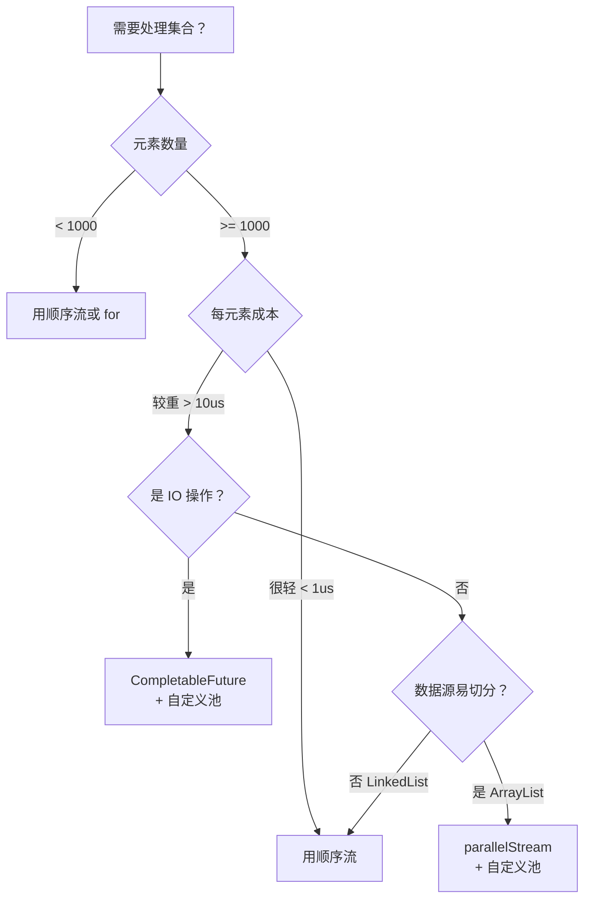

# 23.Stream原理与流水线设计

#### 目录介绍
- [1. 案例引入](#1-案例引入)
  - [1.1 拖垮全站的并行流](#11-拖垮全站的并行流)
  - [1.2 顺序流的诡异结果](#12-顺序流的诡异结果)
  - [1.3 我们要回答什么](#13-我们要回答什么)
- [2. 流水线架构](#2-流水线架构)
  - [2.1 三阶段流水线](#21-三阶段流水线)
  - [2.2 双向链表结构](#22-双向链表结构)
  - [2.3 为什么这么切](#23-为什么这么切)
- [3. 三类操作划分](#3-三类操作划分)
  - [3.1 中间无状态操作](#31-中间无状态操作)
  - [3.2 中间有状态操作](#32-中间有状态操作)
  - [3.3 终止操作分类](#33-终止操作分类)
  - [3.4 操作特征位掩码](#34-操作特征位掩码)
- [4. Spliterator 分割器](#4-spliterator-分割器)
  - [4.1 接口四大方法](#41-接口四大方法)
  - [4.2 八大特征位](#42-八大特征位)
  - [4.3 ArrayList 分割实现](#43-arraylist-分割实现)
  - [4.4 自定义分割器](#44-自定义分割器)
- [5. Sink 责任链](#5-sink-责任链)
  - [5.1 Sink 接口设计](#51-sink-接口设计)
  - [5.2 流水线串联机制](#52-流水线串联机制)
  - [5.3 begin accept end](#53-begin-accept-end)
  - [5.4 短路求值实现](#54-短路求值实现)
- [6. 终止操作执行](#6-终止操作执行)
  - [6.1 reduce 归约原理](#61-reduce-归约原理)
  - [6.2 collect 收集器架构](#62-collect-收集器架构)
  - [6.3 三大内置收集器](#63-三大内置收集器)
  - [6.4 自定义收集器](#64-自定义收集器)
- [7. 并行流深水区](#7-并行流深水区)
  - [7.1 ForkJoinPool 共用](#71-forkjoinpool-共用)
  - [7.2 数据分割算法](#72-数据分割算法)
  - [7.3 并行归约模型](#73-并行归约模型)
  - [7.4 顺序敏感操作](#74-顺序敏感操作)
- [8. 性能与陷阱](#8-性能与陷阱)
  - [8.1 装箱拆箱开销](#81-装箱拆箱开销)
  - [8.2 并行流何时有用](#82-并行流何时有用)
  - [8.3 副作用陷阱](#83-副作用陷阱)
  - [8.4 调试与诊断](#84-调试与诊断)
- [9. 实战最佳实践](#9-实战最佳实践)
  - [9.1 顺序与并行选择](#91-顺序与并行选择)
  - [9.2 收集器组合套路](#92-收集器组合套路)
  - [9.3 与 for 循环对比](#93-与-for-循环对比)
  - [9.4 常见反模式](#94-常见反模式)
- [10. 综合案例串讲](#10-综合案例串讲)
  - [10.1 双案例真相揭晓](#101-双案例真相揭晓)
  - [10.2 一条流水线的一生](#102-一条流水线的一生)
  - [10.3 设计哲学回扣](#103-设计哲学回扣)
  - [10.4 Stream 速查表](#104-stream-速查表)


## 1. 案例引入

### 1.1 拖垮全站的并行流

某金融风控团队上线了一段"看起来很优雅"的并行流代码，结果导致**全站接口大面积超时**：

```java
@Service
public class RiskCheckService {
    
    @Resource
    private RuleService ruleService;
    
    public List<RiskResult> batchCheck(List<Order> orders) {
        // ★ 看起来很美的"并行优化"
        return orders.parallelStream()
            .map(order -> ruleService.evaluate(order))    // ★ 内部 RPC 调用，平均 200ms
            .filter(RiskResult::isHighRisk)
            .collect(Collectors.toList());
    }
}
```

**事故现场**：

```
监控告警时间线：
  10:00:03  风控批量接口 QPS 上升至 50（每次 batch 100 单）
  10:00:15  全站其他接口 P99 延迟从 50ms 飙升到 8000ms
  10:00:30  订单服务、库存服务、营销服务的 CompletableFuture 任务全部超时
  10:01:00  紧急回滚

线程 dump 分析：
  ForkJoinPool.commonPool-worker-* 全部 BLOCKED 在 RPC 调用
  正在等待响应的 worker：47 个（CPU 核数 - 1 = 47）
  排队的子任务：上千个
  
  CompletableFuture 默认线程池：ForkJoinPool.commonPool() ← 同一个池！
  其他业务的 CompletableFuture 全部排队等待
```

**疑惑**：
- `parallelStream` 用的是哪个线程池？
- 为什么会影响**完全不相关**的其他业务？
- IO 密集型任务为什么不该用并行流？

### 1.2 顺序流的诡异结果

另一个团队遇到了"顺序流结果不对"的诡异问题：

```java
public class OrderStats {
    
    public Map<String, Long> countByCategory(List<Order> orders) {
        // ★ 用 forEach + Map.merge 统计
        Map<String, Long> result = new HashMap<>();
        
        orders.parallelStream()
              .forEach(o -> result.merge(o.getCategory(), 1L, Long::sum));
        
        return result;
    }
}
```

**测试结果**：

```
输入：1,000,000 条订单
预期：各品类总数 = 1,000,000

第 1 次执行：电子=234521, 服装=187234, 食品=312449...  总和=987,234  ❌
第 2 次执行：电子=234890, 服装=187001, 食品=312891...  总和=991,452  ❌
第 3 次执行：电子=234521, 服装=187234, 食品=312449...  总和=989,733  ❌

每次结果都不一样，且都少于 1,000,000！
```

**问题修复后**：

```java
// ✅ 正确写法：用 Collectors.groupingBy
Map<String, Long> result = orders.parallelStream()
    .collect(Collectors.groupingBy(
        Order::getCategory,
        Collectors.counting()
    ));
// 结果稳定，总和 = 1,000,000
```

**疑惑**：
- 同样是并行处理，为什么 `forEach + merge` 错了，`collect + groupingBy` 对了？
- `Collectors.groupingBy` 内部如何保证线程安全？
- Stream 的"无副作用"原则到底意味着什么？

7 大追问汇总：

```
追问 ①：Stream 的流水线是怎么串起来的？           → 第2、5章
追问 ②：中间操作和终止操作的本质区别？             → 第3章
追问 ③：Spliterator 怎么把数据切成多块？           → 第4章
追问 ④：短路求值（findFirst/anyMatch）怎么实现？   → 第5.4节
追问 ⑤：Collectors.groupingBy 的内部机制？         → 第6.2、6.3节
追问 ⑥：parallelStream 用的是哪个线程池？           → 第7.1节
追问 ⑦：§1.1、§1.2 的根因是什么？                  → 第10章
```

### 1.3 我们要回答什么

第 28 篇要把"`list.stream().filter().map().collect()` 这条链背后的流水线引擎"讲透——Stream 不是集合，不是迭代器，是一套**惰性求值的数据处理流水线**：

```
Stream 的两个核心问题：

问题 1：流水线如何构建？（结构层）
  ReferencePipeline 双向链表
  每个操作只是注册一个 Sink 节点
  链式调用过程中，没有任何元素被处理
  → 惰性求值（Lazy Evaluation）

问题 2：流水线如何执行？（执行层）
  终止操作触发遍历
  Spliterator 推送元素
  Sink 责任链逐级处理
  并行流通过 ForkJoinPool 分治
```

本篇路线：

```
流水线架构 (第2章)        ─── 双向链表 + 三阶段
    ↓
三类操作划分 (第3章)       ←—— 无状态/有状态/终止
    ↓
Spliterator 分割器 (第4章) ←—— 数据源的迭代抽象
    ↓
Sink 责任链 (第5章)        ←—— 流水线的执行骨架
    ↓
终止操作 (第6章)           ←—— reduce/collect/Collectors
    ↓
并行流深水区 (第7章)       ←—— ForkJoinPool/分治/归约
    ↓
性能与陷阱 (第8章)         ←—— 装箱/副作用/诊断
    ↓
最佳实践 (第9章)           ←—— 顺序 vs 并行/反模式
    ↓
综合案例串讲 (第10章)
```


## 2. 流水线架构

### 2.1 三阶段流水线

Stream 的执行可以拆分为三个清晰的阶段：

```
┌──────────────────────────────────────────────────────────────┐
│                  阶段 1：流水线构建                           │
│                                                              │
│  list.stream()         → 创建 Head（源头节点）              │
│      .filter(...)      → 创建一个 StatelessOp（无状态节点）  │
│      .map(...)         → 创建一个 StatelessOp                │
│      .sorted()         → 创建一个 StatefulOp（有状态节点）   │
│                                                              │
│  此阶段：仅构建链表，没有任何元素被处理！                    │
└────────────────────────────┬─────────────────────────────────┘
                             ▼
┌──────────────────────────────────────────────────────────────┐
│                  阶段 2：终止操作触发                         │
│                                                              │
│  .collect(toList())    → 触发流水线执行                     │
│  内部调用 evaluate(terminalOp)                               │
│                                                              │
│  此阶段：Sink 责任链反向构建（从终止操作往前）               │
└────────────────────────────┬─────────────────────────────────┘
                             ▼
┌──────────────────────────────────────────────────────────────┐
│                  阶段 3：数据推送处理                         │
│                                                              │
│  Spliterator.forEachRemaining(headSink)                      │
│  → 元素从 Spliterator 推送到 Head Sink                      │
│  → 沿 Sink 链向下传递（filter → map → sorted → collect）    │
│  → 终止操作产生最终结果                                      │
│                                                              │
│  此阶段：真正的数据处理发生在这里                            │
└──────────────────────────────────────────────────────────────┘
```

**关键认知**：**链式调用 `stream().filter().map()...` 仅构建流水线结构，不处理任何元素**——这是"惰性求值"的核心，也是为什么 Stream 在大数据量、短路求值场景下性能优秀。

**惰性验证**：

```java
List<Integer> list = List.of(1, 2, 3, 4, 5);

// ★ 没有终止操作 → 没有任何输出
list.stream()
    .filter(x -> { System.out.println("filter " + x); return x > 2; })
    .map(x -> { System.out.println("map " + x); return x * 2; });

// 输出：（什么都没有！）

// 加上终止操作 → 才会执行
list.stream()
    .filter(x -> { System.out.println("filter " + x); return x > 2; })
    .map(x -> { System.out.println("map " + x); return x * 2; })
    .collect(Collectors.toList());

// 输出：filter 1, filter 2, filter 3, map 3, filter 4, map 4, filter 5, map 5
// ★ 注意：是"逐元素"穿过整条链，不是"批量过 filter 再批量过 map"！
```

### 2.2 双向链表结构

`ReferencePipeline` 是 Stream 的核心实现类，构成一个**双向链表**：

```
Stream 类继承体系：
  
  BaseStream<T, S>             ← 顶层接口
       △
       │
  Stream<T>                    ← 用户面向的接口
       △
       │
  AbstractPipeline<E_IN, E_OUT, S>    ← 抽象基类（持有链表指针）
       △
       │
  ReferencePipeline<E_IN, E_OUT>      ← 引用类型流水线
       △
       ├─ Head<E_IN, E_OUT>          ← 源头节点（stream() 创建）
       ├─ StatelessOp<E_IN, E_OUT>   ← 无状态操作节点
       └─ StatefulOp<E_IN, E_OUT>    ← 有状态操作节点
```

**AbstractPipeline 关键字段**：

```java
abstract class AbstractPipeline<E_IN, E_OUT, S> {
    
    // ★ 链表指针
    private final AbstractPipeline sourceStage;     // 源头节点（Head）
    private final AbstractPipeline previousStage;   // 上一个节点
    protected AbstractPipeline nextStage;           // 下一个节点
    
    // 操作深度（Head 是 0）
    private final int depth;
    
    // 组合特征位（与 Spliterator 特征位合并）
    private int combinedFlags;
    
    // 数据源 Spliterator（仅 Head 持有）
    private Spliterator<?> sourceSpliterator;
    
    // 是否并行
    private boolean parallel;
    
    // 是否已被消费（每个 Stream 只能消费一次）
    private boolean linkedOrConsumed;
}
```

**链表构建过程**（以 `list.stream().filter(p).map(f)` 为例）：

```
T 0：list.stream()
  ┌──────┐
  │ Head │  sourceStage=this, previousStage=null, depth=0
  └──────┘

T 1：.filter(p)
  创建一个 StatelessOp，调用 super(previousStage=Head, ...)
  ┌──────┐     ┌────────────┐
  │ Head │ ←→ │ filter Op  │  depth=1, sourceStage=Head
  └──────┘     └────────────┘
  Head.nextStage = filter Op
  filter Op.previousStage = Head

T 2：.map(f)
  ┌──────┐     ┌────────────┐     ┌─────────┐
  │ Head │ ←→ │ filter Op  │ ←→ │ map Op  │  depth=2
  └──────┘     └────────────┘     └─────────┘
```

### 2.3 为什么这么切

**疑惑**：为什么 Stream 用"双向链表 + Sink 责任链"，而不是直接在每个操作里处理元素？

**论证**——这种设计同时解决了三个问题：

**问题 1：惰性求值**

```java
// 反例：如果每个操作立即处理
list.stream()              // 假设这里立即遍历，生成新集合
    .filter(p)             // 假设这里立即过滤，再生成新集合
    .map(f)                // 假设这里立即映射，再生成新集合
    .findFirst();          // 才到这一步——前面都白忙了！

// 浪费：1,000,000 元素的 list，findFirst 只需要找第一个匹配元素
//       但前面的 filter/map 已经处理了全部 1,000,000 个
```

**问题 2：操作融合（Operation Fusion）**

```java
// 流水线模型：单元素穿过整条链
for (E e : source) {
    if (filterPredicate.test(e)) {       // ★ filter 融合
        E mapped = mapFunction.apply(e); // ★ map 融合
        terminalOp.accept(mapped);
    }
}

// 一次循环完成 filter + map + 终止操作，CPU 缓存友好
```

**问题 3：短路求值（Short-Circuit）**

```java
// findFirst/anyMatch/limit 等可以提前结束
list.stream()
    .filter(x -> x > 100)
    .findFirst();    // ★ 找到第一个就停，不遍历剩余元素

// 实现：Sink 内部抛出特殊状态，Spliterator 提前停止迭代
```

**结论**：**Stream 的双向链表 + Sink 责任链设计，把"操作描述"与"数据处理"分离**——构建阶段只描述要做什么，执行阶段才决定怎么高效地做（融合 / 短路 / 并行）。这与第 27 篇 invokedynamic 的"机制与策略分离"是同一种设计哲学。


## 3. 三类操作划分

### 3.1 中间无状态操作

**特征**：处理当前元素时，不依赖任何其他元素的状态。

| 操作 | 签名 | 作用 |
|---|---|---|
| `filter` | `Predicate<T> → Stream<T>` | 过滤 |
| `map` | `Function<T,R> → Stream<R>` | 一对一映射 |
| `mapToInt/Long/Double` | `ToIntFunction → IntStream` | 映射到原始流 |
| `flatMap` | `Function<T, Stream<R>> → Stream<R>` | 一对多映射 + 扁平化 |
| `peek` | `Consumer<T> → Stream<T>` | 旁观（调试用） |

**实现类**：`StatelessOp`（无状态操作）

**关键性质**：
- ✅ **可流水线融合**：上下游 Sink 可以合并
- ✅ **可并行**：每个元素独立处理
- ✅ **不需要缓冲**：来一个处理一个

### 3.2 中间有状态操作

**特征**：必须看到全部（或部分）元素后，才能产生下游元素。

| 操作 | 状态依赖 | 是否短路 |
|---|---|---|
| `sorted` | 必须收集所有元素后才能排序 | 否 |
| `distinct` | 需要维护"已见过"集合 | 否 |
| `limit(n)` | 需要计数 | ✅ 是 |
| `skip(n)` | 需要计数 | 否 |

**实现类**：`StatefulOp`（有状态操作）

**关键性质**：
- ❌ **打断流水线**：必须缓冲数据
- ⚠️ **并行困难**：需要合并多个分片的中间状态
- ⚠️ **顺序敏感**：`sorted` 和 `distinct` 在并行流中可能开销巨大

**示例**：

```java
list.stream()
    .filter(p)         // 无状态
    .sorted()          // ★ 有状态：必须缓冲所有元素
    .map(f)            // 无状态
    .limit(10)         // ★ 有状态 + 短路：取前 10
    .collect(toList());

// 流水线被 sorted 打断：
// [filter] → [缓冲所有元素 + 排序] → [map + limit] → [collect]
```

### 3.3 终止操作分类

终止操作触发流水线执行，分为四类：

| 类别 | 操作 | 特点 |
|---|---|---|
| **归约（Reduce）** | `reduce`, `collect`, `count`, `sum`, `min`, `max` | 把流元素归约为单一结果 |
| **匹配（Match）** | `anyMatch`, `allMatch`, `noneMatch`, `findFirst`, `findAny` | 短路求值 |
| **遍历（forEach）** | `forEach`, `forEachOrdered` | 副作用消费 |
| **转换（toArray）** | `toArray`, `toList`（JDK 16+） | 转回数组/列表 |

**短路终止操作的实现关键**：

```java
// findFirst 的 Sink（伪代码）
class FindFirstSink<T> implements Sink<T> {
    T result;
    boolean found = false;
    
    @Override
    public void accept(T t) {
        if (!found) {
            result = t;
            found = true;
        }
    }
    
    @Override
    public boolean cancellationRequested() {
        return found;    // ★ 关键：告诉 Spliterator 提前停止
    }
}
```

### 3.4 操作特征位掩码

`StreamOpFlag` 用 32 位整数描述流的特征，通过位运算合并：

```java
public enum StreamOpFlag {
    // 流元素特征
    DISTINCT(0,  set(Type.SPLITERATOR).set(Type.STREAM).setAndClear(Type.OP)),
    SORTED  (1,  ...),
    ORDERED (2,  ...),
    SIZED   (3,  ...),
    
    // 操作特征
    SHORT_CIRCUIT(12, set(Type.OP).set(Type.TERMINAL_OP)),
    ...
}
```

**特征位合并示例**：

```
list.stream()         特征位：ORDERED | SIZED | SUBSIZED
    .filter(p)        清除：SIZED（过滤后大小未知）
                      保留：ORDERED
    .sorted()         设置：SORTED
                      保留：ORDERED
    .distinct()       设置：DISTINCT
                      （如果已 SORTED，distinct 可以高效实现）
    .findFirst()      设置：SHORT_CIRCUIT
```

**特征位的价值**：
- JVM 可以根据特征位**选择最优执行策略**
- 例如：已 `SORTED` 的流，`distinct` 可以用相邻去重（O(n)）而不是 HashSet（O(n) + 内存）
- 例如：`SIZED` 的流，可以预分配 ArrayList 容量


## 4. Spliterator 分割器

### 4.1 接口四大方法

`Spliterator`（Splittable Iterator，可分割迭代器）是 Stream 的数据源抽象：

```java
public interface Spliterator<T> {
    
    // ① 单元素推送：尝试推送下一个元素，无元素返回 false
    boolean tryAdvance(Consumer<? super T> action);
    
    // ② 批量推送：把所有剩余元素全部推送（默认实现循环调用 tryAdvance）
    default void forEachRemaining(Consumer<? super T> action) {
        do { } while (tryAdvance(action));
    }
    
    // ③ 分割：把当前 Spliterator 切成两半，返回前半（用于并行）
    Spliterator<T> trySplit();
    
    // ④ 估计剩余元素数（用于负载均衡）
    long estimateSize();
    
    // ⑤ 特征位
    int characteristics();
}
```

**与传统 Iterator 的对比**：

| 维度 | Iterator | Spliterator |
|---|---|---|
| 推送模式 | 拉模式（`next()`） | 推模式（`tryAdvance(consumer)`） |
| 并行支持 | 无 | `trySplit()` 切分 |
| 大小信息 | 无 | `estimateSize()` |
| 特征声明 | 无 | 8 大特征位 |
| 批量优化 | 无 | `forEachRemaining()` |

**为什么 Stream 用推模式**：

```
拉模式（Iterator）：
  while (it.hasNext()) {
      T t = it.next();
      // 调用方主动拉取
  }
  → 每次调用都要 hasNext + next 两次方法调用
  → 状态需要维护在 Iterator 内部

推模式（Spliterator）：
  spliterator.forEachRemaining(t -> {
      // 数据源主动推送
  });
  → 一次方法调用处理一个或多个元素
  → JVM 更容易内联优化
  → Sink 责任链天然适配推模式
```

### 4.2 八大特征位

```java
public interface Spliterator<T> {
    int ORDERED    = 0x00000010;  // 有序（遍历顺序固定）
    int DISTINCT   = 0x00000001;  // 无重复元素
    int SORTED     = 0x00000004;  // 已排序
    int SIZED      = 0x00000040;  // 大小已知（estimateSize 准确）
    int NONNULL    = 0x00000100;  // 元素非 null
    int IMMUTABLE  = 0x00000400;  // 不可变（遍历期间不会改变）
    int CONCURRENT = 0x00001000;  // 并发安全（如 ConcurrentHashMap）
    int SUBSIZED   = 0x00004000;  // 子分割器也 SIZED（强保证）
}
```

**典型组合**：

| 数据源 | 特征位 |
|---|---|
| `ArrayList` | `ORDERED | SIZED | SUBSIZED` |
| `HashSet` | `DISTINCT | SIZED` |
| `TreeSet` | `ORDERED | DISTINCT | SORTED | SIZED` |
| `LinkedHashMap.values()` | `ORDERED | SIZED` |
| `ConcurrentHashMap.values()` | `CONCURRENT | NONNULL` |
| 文件行流 (`Files.lines`) | `ORDERED | NONNULL`（无 SIZED） |

**特征位的实战价值**：

```java
// 例 1：SIZED 流可以预分配容器
Stream<String> s = list.stream();    // SIZED
List<String> result = s.collect(Collectors.toList());
// ArrayList 可以直接 new ArrayList<>(spliterator.estimateSize())

// 例 2：ORDERED 决定 findFirst 的语义
list.parallelStream().findFirst();    // ORDERED → 返回首元素
set.parallelStream().findFirst();     // 非 ORDERED → 等价 findAny
                                      // → 返回任意元素，但更快

// 例 3：DISTINCT + SORTED 优化 distinct() 操作
sortedSet.stream().distinct();        // 已 SORTED + DISTINCT → 直接跳过
arrayList.stream().distinct();        // 需要建 HashSet 去重
```

### 4.3 ArrayList 分割实现

`ArrayListSpliterator` 是最典型的分割器实现：

```java
static final class ArrayListSpliterator<E> implements Spliterator<E> {
    private final ArrayList<E> list;
    private int index;       // 当前游标
    private int fence;       // 结束位置（懒初始化为 list.size）
    
    @Override
    public Spliterator<E> trySplit() {
        // ★ 二分切分
        int hi = getFence();
        int lo = index;
        int mid = (lo + hi) >>> 1;
        
        if (lo >= mid) {
            return null;    // 太小，不再切分
        }
        
        // 当前分割器保留 [mid, hi]
        // 返回新分割器 [lo, mid]
        index = mid;
        return new ArrayListSpliterator<>(list, lo, mid, expectedModCount);
    }
    
    @Override
    public boolean tryAdvance(Consumer<? super E> action) {
        int hi = getFence();
        if (index < hi) {
            E e = list.get(index++);
            action.accept(e);
            checkForComodification();
            return true;
        }
        return false;
    }
    
    @Override
    public long estimateSize() {
        return getFence() - index;
    }
    
    @Override
    public int characteristics() {
        return ORDERED | SIZED | SUBSIZED;
    }
}
```

**分割过程示意**（10000 元素，4 核 CPU）：

```
初始：[0, 10000]
                                          
第 1 次 trySplit：               
  ┌──────────────┬──────────────┐
  │  [0, 5000]   │  [5000, 10000]│
  └──────────────┴──────────────┘
       新分割器       原分割器

第 2 次 trySplit（继续切分）：
  ┌────────┬────────┬────────┬────────┐
  │[0,2500]│[2500,  │[5000,  │[7500,  │
  │        │ 5000]  │ 7500]  │10000]  │
  └────────┴────────┴────────┴────────┘
  
最终：4 个分割器并行处理（1 核处理 1 段，约 2500 元素）
```

### 4.4 自定义分割器

某些场景需要自定义分割器（如解析大文件、网络流）：

```java
// 例：把 LinkedList 包装成分割器（默认 LinkedList 分割效率低）
public class ChunkedSpliterator<T> implements Spliterator<T> {
    private final List<T> source;
    private final int chunkSize;
    private int index;
    private final int end;
    
    @Override
    public Spliterator<T> trySplit() {
        int remaining = end - index;
        if (remaining < chunkSize * 2) return null;
        
        int splitPoint = index + remaining / 2;
        ChunkedSpliterator<T> prefix = new ChunkedSpliterator<>(
            source, chunkSize, index, splitPoint);
        index = splitPoint;
        return prefix;
    }
    
    @Override
    public boolean tryAdvance(Consumer<? super T> action) {
        if (index >= end) return false;
        action.accept(source.get(index++));
        return true;
    }
    
    @Override
    public long estimateSize() { return end - index; }
    
    @Override
    public int characteristics() {
        return ORDERED | SIZED | SUBSIZED | NONNULL;
    }
}

// 使用
Stream<T> stream = StreamSupport.stream(
    new ChunkedSpliterator<>(linkedList, 1024, 0, linkedList.size()),
    true    // parallel
);
```


## 5. Sink 责任链

### 5.1 Sink 接口设计

`Sink` 是流水线执行的核心抽象——**每个操作对应一个 Sink，所有 Sink 串成责任链**：

```java
interface Sink<T> extends Consumer<T> {
    
    // ① 流水线启动通知（传递元素总数提示，-1 表示未知）
    default void begin(long size) { }
    
    // ② 接收元素（继承自 Consumer）
    void accept(T t);
    
    // ③ 流水线结束通知
    default void end() { }
    
    // ④ 是否请求取消（短路求值的关键）
    default boolean cancellationRequested() { return false; }
    
    // ⑤ 原始类型特化（避免装箱）
    default void accept(int value)    { throw new IllegalStateException(); }
    default void accept(long value)   { throw new IllegalStateException(); }
    default void accept(double value) { throw new IllegalStateException(); }
}
```

**Sink 的三阶段生命周期**：

```
begin(size)           ← 流水线启动，初始化（如分配缓冲）
   ↓
accept(e1)            ← 第 1 个元素
accept(e2)            ← 第 2 个元素
   ...
accept(eN)            ← 第 N 个元素
   ↓
end()                 ← 流水线结束，清理（如刷新缓冲）
```

### 5.2 流水线串联机制

每个操作通过 `opWrapSink` 把"上游 Sink 包装成下游 Sink"，形成反向责任链：

```java
// StatelessOp 的核心方法
abstract <P_IN> Sink<P_IN> opWrapSink(int flags, Sink<E_OUT> downstream);

// filter 的实现
@Override
Sink<T> opWrapSink(int flags, Sink<T> downstream) {
    return new Sink.ChainedReference<T, T>(downstream) {
        @Override
        public void accept(T t) {
            if (predicate.test(t)) {
                downstream.accept(t);    // ★ 通过则传递给下游
            }
            // 否则丢弃，不传递
        }
    };
}

// map 的实现
@Override
Sink<T> opWrapSink(int flags, Sink<R> downstream) {
    return new Sink.ChainedReference<T, R>(downstream) {
        @Override
        public void accept(T t) {
            downstream.accept(mapper.apply(t));    // ★ 转换后传递
        }
    };
}
```

**Sink 链构建过程**（`stream().filter(p).map(f).collect(toList())`）：

```
反向构建（从终止操作往源头）：

T 0：终止操作创建 collectSink（toList 收集器）
     [collectSink]

T 1：map.opWrapSink(collectSink) → 包装为 mapSink
     [mapSink → collectSink]

T 2：filter.opWrapSink(mapSink) → 包装为 filterSink
     [filterSink → mapSink → collectSink]

T 3：调用 spliterator.forEachRemaining(filterSink)
     ↓ 元素流向：
     element → filterSink.accept(e)
            → if 通过 → mapSink.accept(e)
                     → collectSink.accept(map(e))
                     → 收集结果
```

### 5.3 begin accept end

完整执行流程的一个真实例子：

```java
List<String> result = list.stream()
    .filter(s -> s.length() > 3)
    .map(String::toUpperCase)
    .collect(Collectors.toList());
```

**Sink 链的执行**：

```java
// 等价的伪代码（JIT 优化后非常接近这个）

// 1. 终止操作：toList 收集器
ArrayList<String> result = new ArrayList<>();

// 2. 构建 Sink 链
Sink<String> collectSink = new Sink<>() {
    public void begin(long size) { 
        if (size >= 0) result.ensureCapacity((int) size);    // ★ SIZED 优化
    }
    public void accept(String s) { result.add(s); }
    public void end() { }
};

Sink<String> mapSink = new Sink<>() {
    public void begin(long size) { collectSink.begin(size); }
    public void accept(String s) { collectSink.accept(s.toUpperCase()); }
    public void end() { collectSink.end(); }
};

Sink<String> filterSink = new Sink<>() {
    public void begin(long size) { mapSink.begin(-1); }    // ★ filter 后大小未知
    public void accept(String s) {
        if (s.length() > 3) mapSink.accept(s);
    }
    public void end() { mapSink.end(); }
};

// 3. 触发执行
filterSink.begin(list.size());
spliterator.forEachRemaining(filterSink);
filterSink.end();

return result;
```

### 5.4 短路求值实现

短路求值（如 `findFirst`、`anyMatch`、`limit`）的关键是 `cancellationRequested()`：

**Sink 的短路实现**：

```java
// findFirst 的 Sink
class FindOpSink<T> implements Sink<T> {
    T result;
    boolean hasResult;
    
    @Override
    public void accept(T t) {
        if (!hasResult) {
            result = t;
            hasResult = true;
        }
    }
    
    @Override
    public boolean cancellationRequested() {
        return hasResult;    // ★ 找到了就停
    }
}
```

**Spliterator 的配合**：

```java
// 顺序流的短路遍历（伪代码）
boolean copyIntoWithCancel(Sink<T> sink, Spliterator<T> spliterator) {
    sink.begin(spliterator.estimateSize());
    
    boolean cancelled;
    do {
        cancelled = sink.cancellationRequested();
        if (cancelled) break;    // ★ 检查取消标志
    } while (spliterator.tryAdvance(sink));
    
    sink.end();
    return cancelled;
}
```

**短路效果**：

```java
List<Integer> list = IntStream.rangeClosed(1, 1_000_000)
    .boxed()
    .collect(Collectors.toList());

// 找第一个 > 100 的元素
Optional<Integer> first = list.stream()
    .filter(x -> x > 100)
    .findFirst();    // ★ 只遍历前 101 个元素就返回

// 实际处理元素数：101（不是 1,000,000）
```

**`limit(n)` 的短路**：

```java
// limit 的 Sink
class LimitSink<T> implements Sink<T> {
    long remaining;
    
    LimitSink(long n) { this.remaining = n; }
    
    @Override
    public void accept(T t) {
        if (remaining > 0) {
            remaining--;
            downstream.accept(t);
        }
    }
    
    @Override
    public boolean cancellationRequested() {
        return remaining == 0;    // ★ 计数耗尽 → 取消
    }
}
```


## 6. 终止操作执行

### 6.1 reduce 归约原理

`reduce` 是所有归约操作的本源：

```java
// 三个重载
T reduce(T identity, BinaryOperator<T> accumulator);
Optional<T> reduce(BinaryOperator<T> accumulator);
<U> U reduce(U identity, BiFunction<U, T, U> accumulator, BinaryOperator<U> combiner);
```

**核心三元素**：

```
identity   ：初始值（也是空流的返回值）
accumulator：累加器（合并当前结果与新元素）
combiner   ：合并器（合并两个并行分片的结果，仅并行流用）
```

**串行 reduce 执行**：

```java
// list.stream().reduce(0, Integer::sum)
int result = 0;                                  // identity
for (Integer e : list) {
    result = Integer.sum(result, e);             // accumulator
}
return result;
```

**并行 reduce 执行**：

```java
// list.parallelStream().reduce(0, Integer::sum, Integer::sum)
                                                                
分片 1：reduce → r1                                              
分片 2：reduce → r2                                              
分片 3：reduce → r3            合并阶段：                        
分片 4：reduce → r4         combiner(combiner(r1,r2), combiner(r3,r4))
```

**结合律要求（重要）**：

```
reduce 必须满足结合律：(a + b) + c == a + (b + c)
identity 必须是单位元：identity + e == e

✅ Integer::sum, BigDecimal::add, String::concat
❌ Integer::subtract（不满足结合律）
❌ (a, b) -> a / b（除法不结合）
```

### 6.2 collect 收集器架构

`Collector` 是更通用的归约抽象——可以**返回与流元素不同类型的可变容器**：

```java
public interface Collector<T, A, R> {
    
    // ① 创建可变容器
    Supplier<A> supplier();
    
    // ② 累加单个元素到容器
    BiConsumer<A, T> accumulator();
    
    // ③ 合并两个容器（并行用）
    BinaryOperator<A> combiner();
    
    // ④ 容器最终转换为结果
    Function<A, R> finisher();
    
    // ⑤ 特征位
    Set<Characteristics> characteristics();
}
```

**Characteristics 枚举**：

```java
enum Characteristics {
    CONCURRENT,         // 容器线程安全（如 ConcurrentMap）
    UNORDERED,          // 收集器不依赖顺序
    IDENTITY_FINISH     // finisher 是恒等函数（A == R），可跳过
}
```

**toList 的 Collector 实现**：

```java
public static <T> Collector<T, ?, List<T>> toList() {
    return new CollectorImpl<>(
        ArrayList::new,                              // supplier
        List::add,                                   // accumulator
        (left, right) -> {                           // combiner
            left.addAll(right);
            return left;
        },
        list -> list,                                // finisher（恒等）
        Set.of(Characteristics.IDENTITY_FINISH)
    );
}
```

### 6.3 三大内置收集器

`Collectors` 工具类提供了大量预定义收集器，最常用的三个：

**收集器 ①：`groupingBy` 分组**

```java
// 简单分组
Map<String, List<Order>> byCategory = orders.stream()
    .collect(Collectors.groupingBy(Order::getCategory));

// 分组 + 下游收集器（先分组再统计）
Map<String, Long> countByCategory = orders.stream()
    .collect(Collectors.groupingBy(
        Order::getCategory,
        Collectors.counting()    // ★ 下游收集器
    ));

// 分组 + 求和
Map<String, BigDecimal> sumByCategory = orders.stream()
    .collect(Collectors.groupingBy(
        Order::getCategory,
        Collectors.reducing(BigDecimal.ZERO, Order::getAmount, BigDecimal::add)
    ));

// 三层嵌套：按品类分组 → 按状态分组 → 求和
Map<String, Map<Status, BigDecimal>> nested = orders.stream()
    .collect(Collectors.groupingBy(
        Order::getCategory,
        Collectors.groupingBy(
            Order::getStatus,
            Collectors.reducing(BigDecimal.ZERO, Order::getAmount, BigDecimal::add)
        )
    ));
```

**收集器 ②：`toMap` 映射**

```java
// 简单映射
Map<Long, Order> byId = orders.stream()
    .collect(Collectors.toMap(Order::getId, Function.identity()));

// 处理 key 冲突（合并函数）
Map<String, BigDecimal> categorySum = orders.stream()
    .collect(Collectors.toMap(
        Order::getCategory,
        Order::getAmount,
        BigDecimal::add    // ★ key 重复时如何合并 value
    ));

// 指定 Map 类型（如 TreeMap、LinkedHashMap）
Map<Long, Order> sortedById = orders.stream()
    .collect(Collectors.toMap(
        Order::getId,
        Function.identity(),
        (a, b) -> a,        // 冲突处理
        TreeMap::new        // ★ 指定 Map 类型
    ));
```

**陷阱**：`toMap` 默认在 key 冲突时抛 `IllegalStateException`：

```java
// ❌ 如果有重复 category，运行时报错
Map<String, Order> byCategory = orders.stream()
    .collect(Collectors.toMap(Order::getCategory, Function.identity()));
// IllegalStateException: Duplicate key
```

**收集器 ③：`partitioningBy` 二分**

```java
// 按断言分两组（true / false）
Map<Boolean, List<Order>> partitioned = orders.stream()
    .collect(Collectors.partitioningBy(o -> o.getAmount().compareTo(BigDecimal.valueOf(100)) > 0));

List<Order> highValue = partitioned.get(true);
List<Order> lowValue = partitioned.get(false);

// partitioningBy 比 groupingBy 快一倍（key 类型固定为 boolean）
```

### 6.4 自定义收集器

某些场景需要自定义 Collector：

```java
// 例：把流元素拼接为 JSON 数组字符串
public static Collector<String, ?, String> toJsonArray() {
    return Collector.of(
        StringBuilder::new,                          // supplier
        (sb, s) -> {                                 // accumulator
            if (sb.length() > 0) sb.append(",");
            sb.append("\"").append(s).append("\"");
        },
        (sb1, sb2) -> {                              // combiner
            if (sb1.length() > 0 && sb2.length() > 0) sb1.append(",");
            return sb1.append(sb2);
        },
        sb -> "[" + sb.toString() + "]"              // finisher
    );
}

// 使用
String json = Stream.of("apple", "banana", "cherry")
    .collect(toJsonArray());
// 结果：["apple","banana","cherry"]
```


## 7. 并行流深水区

### 7.1 ForkJoinPool 共用

**核心事实**：`parallelStream()` 用的是 **`ForkJoinPool.commonPool()`**——**全 JVM 共享一个线程池**！

```java
// JDK 源码 ForkJoinTask.fork()
public final ForkJoinTask<V> fork() {
    Thread t;
    if ((t = Thread.currentThread()) instanceof ForkJoinWorkerThread)
        ((ForkJoinWorkerThread)t).workQueue.push(this);
    else
        ForkJoinPool.common.externalPush(this);    // ★ 提交到 commonPool
    return this;
}
```

**`commonPool` 的默认大小**：

```
默认并行度：Runtime.getRuntime().availableProcessors() - 1

例：32 核 CPU → commonPool 有 31 个 worker 线程

可通过系统属性调整：
  -Djava.util.concurrent.ForkJoinPool.common.parallelism=8
```

**§1.1 OOM 事故根因复盘**：

```
事故链路：
  1. parallelStream → 提交任务到 ForkJoinPool.commonPool
  2. RPC 调用阻塞 worker 线程（IO 密集）
  3. 47 个 worker 全部阻塞
  4. 其他业务的 CompletableFuture 默认也用 commonPool
  5. CompletableFuture 任务排队，全站超时
  
关键认知：
  ✗ parallelStream 不是"开新线程"
  ✓ 是"在 commonPool 上提交 ForkJoinTask"
  ✓ 与 CompletableFuture、ForkJoinTask 共享同一个池
```

**正确的做法**：

```java
// 方案 1：用专用线程池（推荐）
ForkJoinPool customPool = new ForkJoinPool(16);
try {
    List<RiskResult> result = customPool.submit(() ->
        orders.parallelStream()
              .map(ruleService::evaluate)
              .filter(RiskResult::isHighRisk)
              .collect(Collectors.toList())
    ).get();
} finally {
    customPool.shutdown();
}

// 方案 2：CompletableFuture + 专用线程池（更灵活）
ExecutorService ioPool = Executors.newFixedThreadPool(16);
List<CompletableFuture<RiskResult>> futures = orders.stream()
    .map(o -> CompletableFuture.supplyAsync(() -> ruleService.evaluate(o), ioPool))
    .collect(Collectors.toList());
List<RiskResult> result = futures.stream()
    .map(CompletableFuture::join)
    .filter(RiskResult::isHighRisk)
    .collect(Collectors.toList());
```

### 7.2 数据分割算法

并行流如何把数据切分到多个线程：

```
ForkJoin 分治流程：

submit(rootTask)
    ↓
rootTask.compute()
    ↓
判断：spliterator.estimateSize() < threshold ?
    ├─ 是 → 顺序处理这一段（leaf task）
    └─ 否 → 切分：
            leftSplit = spliterator.trySplit()
            创建 leftTask（处理 leftSplit）
            创建 rightTask（处理剩余的 spliterator）
            leftTask.fork()       ← 异步执行
            rightTask.compute()   ← 当前线程执行
            leftTask.join()       ← 等待左侧完成
            合并结果
```

**threshold 阈值**：

```java
// AbstractTask.suggestTargetSize 默认实现
static long suggestTargetSize(long sizeEstimate) {
    long est = sizeEstimate / (LEAF_TARGET = ForkJoinPool.getCommonPoolParallelism() << 2);
    return est > 0L ? est : 1L;
}

// 经验值：
// 4 核 CPU，10000 元素 → 每个分片约 625 元素
// 16 核 CPU，10000 元素 → 每个分片约 156 元素
```

### 7.3 并行归约模型

并行归约的数学模型：

```
        [全部元素]
            │
       ┌────┴────┐
   [左半部分]  [右半部分]
       │          │
    ┌──┴──┐    ┌──┴──┐
   [..] [..]  [..] [..]
    
    叶子节点：accumulator 处理元素 → 局部结果
    非叶子节点：combiner 合并左右子结果
```

**combiner 的关键作用**：

```java
// 错误：没有 combiner（用 reduce 的两参数版本，并行流可能错）
int sum = list.parallelStream()
    .reduce(0, Integer::sum);    // 这个版本要求 BinaryOperator，accumulator == combiner

// 正确：accumulator 和 combiner 类型相同
List<String> result = list.parallelStream()
    .reduce(
        new ArrayList<>(),                          // identity
        (acc, e) -> { acc.add(e); return acc; },    // accumulator
        (a, b) -> { a.addAll(b); return a; }        // combiner
    );

// 但注意！上面这个写法在并行流中有 bug：
//   identity 是同一个 ArrayList，多个分片会共享它
//   导致并发修改 + 元素丢失/重复
//   
// 正确做法：用 collect 而不是 reduce
List<String> result = list.parallelStream()
    .collect(Collectors.toList());    // ★ 每个分片有独立的 ArrayList
```

### 7.4 顺序敏感操作

某些操作在并行流中**会强制保持顺序，导致并行变慢**：

| 操作 | 顺序敏感 | 并行表现 |
|---|---|---|
| `filter` | 否 | ✅ 完全并行 |
| `map` | 否 | ✅ 完全并行 |
| `forEach` | 否 | ✅ 不保证顺序，最快 |
| `forEachOrdered` | ✅ 是 | ⚠️ 强制顺序，并行打折 |
| `findFirst` | ✅ 是 | ⚠️ 必须找最前的 |
| `findAny` | 否 | ✅ 找到任意一个就停，更快 |
| `limit(n)` | ✅ 是（ORDERED 流） | ⚠️ 必须取前 n 个 |
| `skip(n)` | ✅ 是 | ⚠️ 必须跳过前 n 个 |
| `sorted` | — | ⚠️ 全局排序，并行收益小 |
| `distinct` | — | ⚠️ 维护全局集合 |

**优化建议**：

```java
// ❌ 慢（保持顺序的 limit）
list.parallelStream()
    .filter(p)
    .limit(10)              // 必须取前 10 个
    .collect(Collectors.toList());

// ✅ 快（无序后再 limit）
list.parallelStream()
    .filter(p)
    .unordered()            // ★ 显式声明无序
    .limit(10)              // 任意 10 个
    .collect(Collectors.toList());

// ✅ 找任意一个匹配项
list.parallelStream().filter(p).findAny();    // 比 findFirst 快
```


## 8. 性能与陷阱

### 8.1 装箱拆箱开销

`Stream<Integer>` 与 `IntStream` 的性能差异极大：

```java
// ❌ 装箱版（慢）
long sum = list.stream()                  // Stream<Integer>
    .filter(x -> x > 0)                   // Predicate<Integer>，装箱
    .mapToInt(Integer::intValue)          // 拆箱
    .sum();

// ✅ 直接用 IntStream（快）
int[] array = list.stream().mapToInt(Integer::intValue).toArray();
long sum = Arrays.stream(array)           // IntStream
    .filter(x -> x > 0)                   // IntPredicate，无装箱
    .sum();
```

**JMH 性能对比**（1,000,000 个 int）：

```
Benchmark                Mode  Cnt   Score   Error  Units
Stream<Integer>.sum      avgt   10  18.234 ± 0.452  ms/op
IntStream.sum            avgt   10   2.847 ± 0.089  ms/op
for 循环                 avgt   10   1.123 ± 0.034  ms/op
                         
IntStream 比 Stream<Integer> 快约 6 倍
for 循环又比 IntStream 快约 2 倍（小数据量场景）
```

**原始类型流转换**：

```java
// Stream<Integer> ↔ IntStream
Stream<Integer> boxed = intStream.boxed();
IntStream unboxed = boxed.mapToInt(Integer::intValue);

// IntStream ↔ Stream<R>
Stream<String> mapped = intStream.mapToObj(i -> "val" + i);

// 三大原始类型流：IntStream / LongStream / DoubleStream
// 没有 BooleanStream / CharStream（用 IntStream 模拟）
```

### 8.2 并行流何时有用

**经验法则**（NQ 模型）：

```
    N × Q > 10,000   时考虑并行流
    
    N = 元素数量
    Q = 每个元素的处理成本（CPU 周期）
```

**典型场景判断**：

| 场景 | N | Q | NQ | 并行收益 |
|---|---|---|---|---|
| 简单 sum 100 个 int | 100 | 1 | 100 | ❌ 顺序流更快 |
| 复杂计算 100 个对象 | 100 | 1000 | 100,000 | ✅ 并行可提速 |
| 简单 filter 1M 个 String | 1,000,000 | 5 | 5M | ✅ 并行可提速 |
| RPC 调用 100 次 | 100 | ∞ (IO) | — | ⚠️ 应用 CompletableFuture，不用并行流 |

**关键原则**：

```
✅ 并行流适合：
   1. CPU 密集型计算
   2. 数据量大（N 大）
   3. 单元素处理重（Q 大）
   4. 数据源易分割（ArrayList / 数组）

❌ 并行流不适合：
   1. IO 密集型（用 CompletableFuture + 自定义池）
   2. 数据量小（顺序流的开销已经够低）
   3. 数据源难分割（LinkedList / Iterator）
   4. 操作有副作用或顺序依赖
```

### 8.3 副作用陷阱

**§1.2 案例的根因**：

```java
// ❌ 错误代码
Map<String, Long> result = new HashMap<>();
orders.parallelStream()
      .forEach(o -> result.merge(o.getCategory(), 1L, Long::sum));

// 问题：
// 1. HashMap 不是线程安全的
// 2. parallelStream 的 forEach 在多个线程中并发修改 result
// 3. HashMap.merge 内部不是原子操作
// 4. 数据竞争 → 部分 merge 操作丢失 → 总和少于实际
```

**修复方案对比**：

```java
// ✅ 方案 1：用 ConcurrentHashMap + merge（线程安全）
Map<String, Long> result = new ConcurrentHashMap<>();
orders.parallelStream()
      .forEach(o -> result.merge(o.getCategory(), 1L, Long::sum));
// 正确，但仍是"有副作用"风格

// ✅ 方案 2：用 Collectors.groupingBy（推荐，无副作用）
Map<String, Long> result = orders.parallelStream()
    .collect(Collectors.groupingBy(
        Order::getCategory,
        Collectors.counting()
    ));
// 完全无副作用：每个分片独立 groupingBy，最后 combiner 合并
```

**Stream 的"无副作用"原则**：

```
源元素：不要修改
中间状态：不要修改流外的可变状态
副作用：仅允许在 forEach（顺序流）/ collect 中产生
```

### 8.4 调试与诊断

Stream 的调试比循环困难，几个实用技巧：

**技巧 1：`peek` 插桩**

```java
list.stream()
    .peek(e -> log.debug("after stream: {}", e))
    .filter(p)
    .peek(e -> log.debug("after filter: {}", e))
    .map(f)
    .peek(e -> log.debug("after map: {}", e))
    .collect(Collectors.toList());
```

**技巧 2：拆分中间结果**

```java
// 复杂链路拆开调试
List<Order> filtered = orders.stream()
    .filter(p)
    .collect(Collectors.toList());
log.debug("filtered size: {}", filtered.size());

List<String> mapped = filtered.stream()
    .map(f)
    .collect(Collectors.toList());
log.debug("mapped: {}", mapped);
```

**技巧 3：JFR 跟踪**

```bash
# 启动 JFR 录制
java -XX:StartFlightRecording=duration=60s,filename=stream.jfr MyApp

# 分析：JMC 中查看
# - ForkJoinPool 任务调度
# - 每个 Stream 操作的耗时分布
```


## 9. 实战最佳实践

### 9.1 顺序与并行选择

决策流程图：



### 9.2 收集器组合套路

**套路 1：分组统计**

```java
// 按品类统计订单数和总金额
record CategoryStat(long count, BigDecimal sum) {}

Map<String, CategoryStat> stats = orders.stream()
    .collect(Collectors.groupingBy(
        Order::getCategory,
        Collectors.collectingAndThen(
            Collectors.toList(),
            list -> new CategoryStat(
                list.size(),
                list.stream().map(Order::getAmount)
                    .reduce(BigDecimal.ZERO, BigDecimal::add)
            )
        )
    ));
```

**套路 2：转 Map 处理冲突**

```java
// 重复 key 保留最新的
Map<String, Order> latestByCategory = orders.stream()
    .collect(Collectors.toMap(
        Order::getCategory,
        Function.identity(),
        (a, b) -> a.getCreateTime().isAfter(b.getCreateTime()) ? a : b
    ));
```

**套路 3：多键分组**

```java
// 按 (品类, 状态) 二维分组
record Key(String category, Status status) {}

Map<Key, List<Order>> byCategoryAndStatus = orders.stream()
    .collect(Collectors.groupingBy(
        o -> new Key(o.getCategory(), o.getStatus())
    ));
```

### 9.3 与 for 循环对比

何时用 Stream，何时用 for：

| 维度 | Stream | for 循环 |
|---|---|---|
| **可读性** | ✅ 链式表达声明意图 | ⚠️ 命令式细节 |
| **简单数据量小** | ⚠️ 有创建开销 | ✅ 直接快 |
| **复杂转换** | ✅ 链式更清晰 | ⚠️ 嵌套丑陋 |
| **并行** | ✅ 一行切换 | ❌ 手写 ForkJoin |
| **早期返回 break** | ⚠️ 用 findFirst | ✅ 直接 break |
| **修改外部状态** | ❌ 反模式 | ✅ 自然 |
| **调试** | ⚠️ 难 | ✅ 易 |
| **JIT 优化** | ✅ 大流水线优化 | ✅ 小循环优化 |

**经验**：
- **简单遍历、小数据量、需要修改外部状态** → for 循环
- **多步转换、声明式风格、需要并行** → Stream

### 9.4 常见反模式

**反模式 1：用 Stream 做简单循环**

```java
// ❌ 杀鸡用牛刀
List<String> names = new ArrayList<>();
users.stream().forEach(u -> names.add(u.getName()));    // 副作用 + 啰嗦

// ✅ 用 collect
List<String> names = users.stream().map(User::getName).collect(Collectors.toList());

// ✅ 或直接 for（小数据量）
List<String> names = new ArrayList<>(users.size());
for (User u : users) names.add(u.getName());
```

**反模式 2：嵌套 Stream**

```java
// ❌ 双层流嵌套，难读
List<String> result = orders.stream()
    .map(o -> o.getItems().stream()
                          .map(Item::getName)
                          .collect(Collectors.joining(",")))
    .collect(Collectors.toList());

// ✅ 提取为方法
List<String> result = orders.stream()
    .map(this::formatItems)
    .collect(Collectors.toList());

private String formatItems(Order o) {
    return o.getItems().stream()
                       .map(Item::getName)
                       .collect(Collectors.joining(","));
}
```

**反模式 3：盲目并行**

```java
// ❌ 数据量小、操作轻，并行反而慢
List<Integer> result = list.parallelStream()    // list.size() == 100
    .map(x -> x * 2)
    .collect(Collectors.toList());
// 并行开销 > 处理开销

// ✅ 顺序流足够
List<Integer> result = list.stream()
    .map(x -> x * 2)
    .collect(Collectors.toList());
```


## 10. 综合案例串讲

### 10.1 双案例真相揭晓

**① §1.1 拖垮全站的并行流**：

```
事故根因链：
  1. parallelStream → 提交任务到 ForkJoinPool.commonPool（§7.1）
  2. RuleService.evaluate 是 RPC 调用（IO 阻塞）
  3. 47 个 commonPool worker 全部阻塞在 IO
  4. 全站其他业务的 CompletableFuture 默认也用 commonPool
  5. CompletableFuture 任务全部排队等待 → 全站 P99 飙升

为什么不该这样写：
  ✗ parallelStream 设计初衷是 CPU 密集型任务
  ✗ commonPool 是全 JVM 共享资源，不应被 IO 占满
  ✗ "看起来快"和"实际快"是两件事

修复（§7.1 代码）：
  ① 用专用 ForkJoinPool 隔离
  ② 改用 CompletableFuture + IO 线程池（推荐）
```

**② §1.2 顺序流的诡异结果**：

```
错误代码：
  Map<String, Long> result = new HashMap<>();
  orders.parallelStream()
        .forEach(o -> result.merge(...));    // ★ 多线程并发修改非线程安全 HashMap

根因：
  1. parallelStream + forEach 在多个线程中执行 Lambda（§7.2）
  2. HashMap.merge 内部 = get + put（非原子）
  3. 多线程同时 merge 会丢失更新（数据竞争）
  4. HashMap 在并发写下还会出现链表环、扩容丢失等更深的问题（联动 §04 HashMap 篇）

修复：
  ✅ Collectors.groupingBy(category, counting())
  原理：每个分片有独立的 HashMap，combiner 阶段合并（§7.3）
        无副作用，自动线程安全
```

**③ 7 大追问全部作答**：

| 追问 | 答案 | 章节 |
|---|---|---|
| ① 流水线如何串起来 | 双向链表 + Sink 责任链反向构建 | §2.2、§5.2 |
| ② 中间/终止操作本质区别 | 中间操作创建新 Stream 节点；终止操作触发 evaluate | §3 |
| ③ Spliterator 怎么切数据 | trySplit 二分切分 + 特征位告知能力 | §4.3 |
| ④ 短路求值实现 | Sink.cancellationRequested + Spliterator 提前停止 | §5.4 |
| ⑤ groupingBy 内部机制 | Collector 五元素 + 每分片独立 HashMap + combiner 合并 | §6.2、§6.3 |
| ⑥ parallelStream 用哪个池 | ForkJoinPool.commonPool（全 JVM 共享） | §7.1 |
| ⑦ 两个事故根因 | IO 密集占满 commonPool / forEach 副作用并发 | §10.1 |

### 10.2 一条流水线的一生

把 `orders.parallelStream().filter(p).map(f).collect(toList())` 串成完整生命线：

```
T 0      orders.parallelStream()
         [§2.2] 创建 ReferencePipeline.Head
         [§4.1] sourceStage 持有 ArrayListSpliterator
         [§4.2] 特征位：ORDERED | SIZED | SUBSIZED
         [§2.1] parallel = true
         
T+1ms   .filter(p)
         [§3.1] 创建 StatelessOp 节点（无状态）
         [§2.2] Head.nextStage = filterOp，filterOp.previousStage = Head
         [§3.4] 清除 SIZED 特征位（过滤后大小未知）
         
T+2ms   .map(f)
         [§3.1] 创建 StatelessOp 节点
         [§2.2] filterOp.nextStage = mapOp
         [§2.1] 此时无任何元素被处理（惰性）

T+3ms   .collect(Collectors.toList())
         [§2.1] 终止操作触发 evaluate
         [§6.2] toList Collector 提供 5 个函数
         [§5.2] 反向构建 Sink 链：
                collectSink ← mapSink(包装) ← filterSink(包装)
         
T+4ms   并行执行启动
         [§7.1] 提交根任务到 ForkJoinPool.commonPool
         [§7.2] 根任务调用 spliterator.trySplit() 二分切分
                直到每个叶子任务约 size/8 元素
         [§4.3] 每个叶子任务有独立的 ArrayListSpliterator
         
T+5ms   叶子任务执行
         [§5.3] sink.begin(estimateSize)
         [§4.1] spliterator.forEachRemaining(filterSink)
                每个元素：filterSink → mapSink → 局部 ArrayList
         [§5.3] sink.end()
         
T+6ms   分治合并
         [§7.3] 子任务返回局部 ArrayList
         [§6.2] Collector.combiner 合并左右结果（addAll）
         [§7.3] 一路合并到根任务
         
T+7ms   返回最终 List
         [§5.2] Stream 的 linkedOrConsumed = true
                这条流不能再被消费（一次性）

跨篇引用全景：
  [04] HashMap   ← §1.2 并发修改 HashMap 的更深危害
  [10] 线程池    ← §7.1 ForkJoinPool 与 commonPool 设计
  [13] 字节码    ← Lambda 在 Stream 操作中编译为私有静态方法
  [27] Lambda    ← Stream 全靠 Lambda 表达操作（无捕获/有捕获）
  [40] CompletableFuture ← §10.1 IO 密集型的正确做法
```

### 10.3 设计哲学回扣

跳出技术细节，提炼贯穿 Stream 设计的三条工程哲学：

1. **声明式描述 vs 命令式执行**：链式调用 `stream().filter().map()...` 是**声明式**——只描述要做什么；Spliterator + Sink 责任链是**命令式**——决定怎么高效地做（融合、短路、并行）。这种分离让框架可以**针对运行时数据规模和数据源特征自动选择最优策略**。这与第 27 篇 Lambda 的"机制与策略分离"、第 26 篇注解的"声明意图，延迟决策"是同一种哲学的不同体现——**JDK 设计者反复强调：让用户表达意图，把优化机会留给 JVM**。

2. **惰性求值是大数据处理的基石**：Stream 的惰性求值（构建期不处理元素 + 短路求值）使得"无限流" + "复杂链路" + "提前终止"成为可能。`Stream.iterate(0, i -> i+1).filter(...).findFirst()` 在 1 秒内返回，而对应的命令式代码可能死循环。这背后是**从 SQL 到 LINQ 到 Stream 到 Reactive Streams 的一脉相承的"流水线惰性求值"思想**——把"取数"和"用数"分离，框架自动决策何时取、取多少。

3. **零侵入抽象的代价是规则**：Stream API 在不改变集合接口的前提下，给所有集合提供了流水线能力——这是 JDK 8 接口默认方法（`default Stream<T> stream()`）的最大成果。但代价是：**用户必须遵守"无副作用"原则**。一旦在 Lambda 中修改外部可变状态，并行流的所有理论优势瞬间崩塌（§1.2 就是教训）。这条原则跨语言通用——Spark、Flink、Reactor 全部强调同一件事——**纯函数才能并行，副作用即顺序枷锁**。

### 10.4 Stream 速查表

**三类操作速查**：

| 类别 | 典型操作 | 是否短路 | 是否打断流水线 |
|---|---|---|---|
| 中间无状态 | `filter`, `map`, `peek` | 否 | 否（可融合） |
| 中间有状态 | `sorted`, `distinct`, `skip` | 否 | ✅ 是 |
| 中间短路 | `limit` | ✅ 是 | ✅ 是 |
| 终止短路 | `findFirst`, `anyMatch` | ✅ 是 | — |
| 终止归约 | `reduce`, `collect`, `count` | 否 | — |

**Spliterator 8 大特征位速查**：

```
ORDERED    有遍历顺序        DISTINCT   元素无重复
SORTED     已排序            SIZED      大小已知
NONNULL    元素非 null       IMMUTABLE  不可变源
CONCURRENT 并发安全          SUBSIZED   子分割器也 SIZED
```

**并行流铁律**：

```
铁律 1：parallelStream 用 commonPool（全 JVM 共享，不可阻塞）
铁律 2：IO 密集型用 CompletableFuture + 自定义池，永远不要用并行流
铁律 3：NQ < 10,000 时顺序流更快
铁律 4：parallelStream + forEach 修改共享状态 = 数据竞争
铁律 5：collect 优于有副作用的 forEach
铁律 6：ArrayList/数组/IntStream.range 是并行流最佳数据源
铁律 7：LinkedList/Iterator/Files.lines 几乎不能受益于并行流
铁律 8：sorted/distinct 是有状态操作，会打断并行流水线
铁律 9：toMap 默认重复 key 抛异常，永远显式提供合并函数
铁律 10：基本类型用 IntStream/LongStream/DoubleStream，避免装箱
```

**Collectors 套路速查**：

```
toList()           → List<T>
toSet()            → Set<T>
toMap(k, v)        → Map<K, V>            （重复 key 抛异常！）
toMap(k, v, m)     → Map<K, V>            （指定合并函数）
groupingBy(k)      → Map<K, List<T>>
groupingBy(k, dc)  → Map<K, R>            （下游收集器）
partitioningBy(p)  → Map<Boolean, List<T>>（按断言二分）
counting()         → Long
summingInt(f)      → Integer 求和
averagingDouble(f) → Double 平均
joining(sep)       → String 连接
reducing(...)      → 自定义归约
collectingAndThen  → 后处理收集结果
```

至此**第 28 篇**完成——我们用流水线架构源码、Spliterator 分割算法、Sink 责任链推送模型、ForkJoinPool 共池陷阱、Collectors 五元素拆解，把"`stream().filter().map().collect()` 这条链背后的引擎"完整还原。**卷三第五篇收官** ✅。

下一篇顺着"流式 API 给我们带来了 Optional 这个`null` 终结者"这条线，进入**卷三第 29 篇：Optional 设计哲学**——把 Tony Hoare 的"十亿美元错误"、`Optional` 的正确使用边界（参数？字段？返回值？）、为什么不能 `Serializable`、`map/flatMap/orElse/orElseGet` 的取舍一次讲透，**揭开 `Optional` 不只是"Null 检查器"，而是一种"显式可空性"类型系统的设计意图**。
