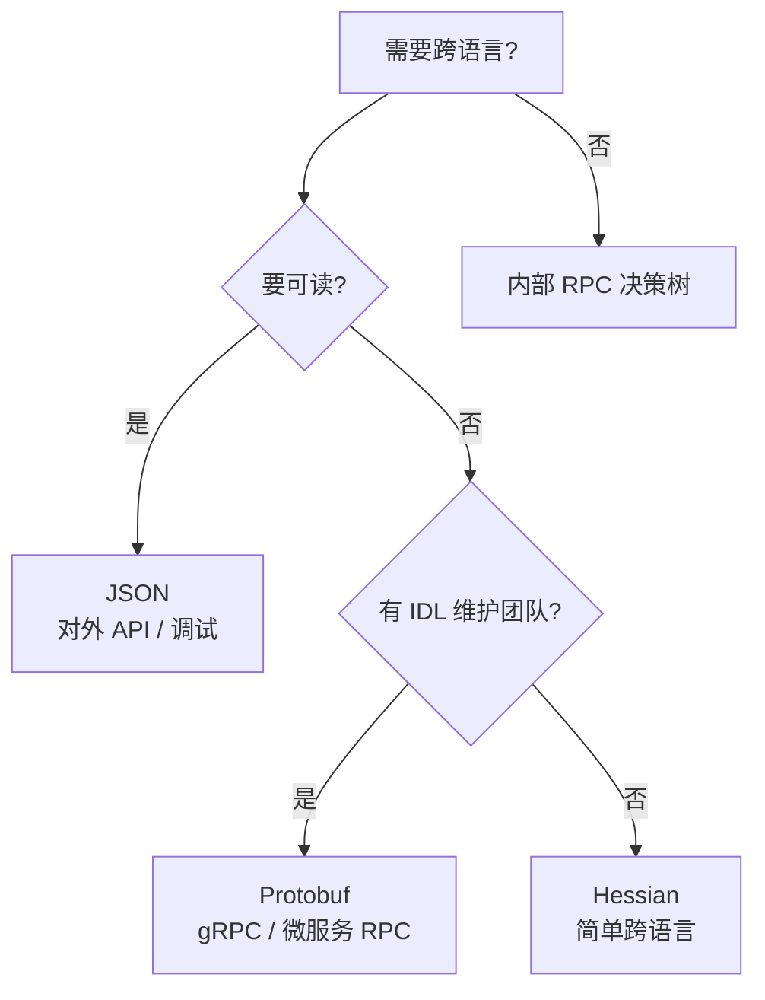
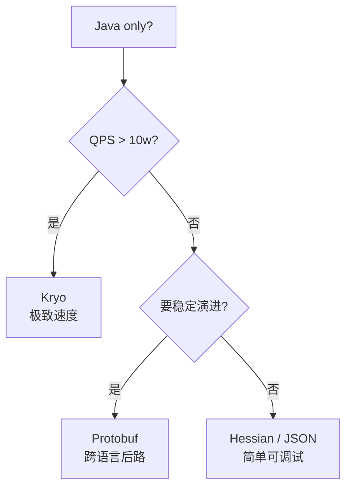

# 42.序列化原理与替代方案

#### 目录介绍
- [1. 案例引入](#1-案例引入)
  - [1.1 一段反常代码](#11-一段反常代码)
  - [1.2 顺藤摸到根因](#12-顺藤摸到根因)
  - [1.3 我们要回答什么](#13-我们要回答什么)
- [2. 架构概览](#2-架构概览)
  - [2.1 三大子模块](#21-三大子模块)
  - [2.2 为什么这么切](#22-为什么这么切)
- [3. JDK序列化核心](#3-jdk序列化核心)
  - [3.1 Serializable空接口](#31-serializable空接口)
  - [3.2 序列化流格式](#32-序列化流格式)
  - [3.3 ObjectOutputStream流程](#33-objectoutputstream流程)
  - [3.4 ObjectInputStream还原](#34-objectinputstream还原)
  - [3.5 serialVersionUID机制](#35-serialversionuid机制)
- [4. 五大魔法钩子](#4-五大魔法钩子)
  - [4.1 writeObject与readObject](#41-writeobject与readobject)
  - [4.2 writeReplace替身术](#42-writereplace替身术)
  - [4.3 readResolve单例守护](#43-readresolve单例守护)
  - [4.4 transient与static](#44-transient与static)
  - [4.5 Externalizable完全自定义](#45-externalizable完全自定义)
- [5. 反序列化攻击](#5-反序列化攻击)
  - [5.1 漏洞的本质](#51-漏洞的本质)
  - [5.2 Apache Commons链](#52-apache-commons链)
  - [5.3 历史CVE全景](#53-历史cve全景)
  - [5.4 ObjectInputFilter防御](#54-objectinputfilter防御)
  - [5.5 JEP 290上下文](#55-jep-290上下文)
- [6. JSON生态对比](#6-json生态对比)
  - [6.1 Jackson主流方案](#61-jackson主流方案)
  - [6.2 FastJson2历史包袱](#62-fastjson2历史包袱)
  - [6.3 Gson的取舍](#63-gson的取舍)
  - [6.4 三者性能对比](#64-三者性能对比)
- [7. Protobuf编码原理](#7-protobuf编码原理)
  - [7.1 IDL与代码生成](#71-idl与代码生成)
  - [7.2 TLV三元组](#72-tlv三元组)
  - [7.3 Varint变长整数](#73-varint变长整数)
  - [7.4 ZigZag负数编码](#74-zigzag负数编码)
  - [7.5 字段号兼容策略](#75-字段号兼容策略)
- [8. 二进制方案横评](#8-二进制方案横评)
  - [8.1 Kryo快速但不跨语言](#81-kryo快速但不跨语言)
  - [8.2 Hessian的中间路线](#82-hessian的中间路线)
  - [8.3 Avro与Schema分离](#83-avro与schema分离)
  - [8.4 Thrift的传输栈](#84-thrift的传输栈)
- [9. 选型决策树](#9-选型决策树)
  - [9.1 五大维度评估](#91-五大维度评估)
  - [9.2 跨语言场景](#92-跨语言场景)
  - [9.3 内部RPC场景](#93-内部rpc场景)
  - [9.4 外部API场景](#94-外部api场景)
  - [9.5 缓存与持久化](#95-缓存与持久化)
- [10. 综合案例串讲](#10-综合案例串讲)
  - [10.1 案例真相揭晓](#101-案例真相揭晓)
  - [10.2 一个对象的一生](#102-一个对象的一生)
  - [10.3 设计哲学回扣](#103-设计哲学回扣)
  - [10.4 速查表](#104-速查表)


## 1. 案例引入

### 1.1 一段反常代码

我们接手一个老订单系统，缓存层用 Redis，订单对象走 JDK 原生 `Serializable` 序列化后存入。线上发版那天，新版本只是给 `Order` 加了一个无关紧要的字段 `String channel`，结果**所有缓存读取全部抛 InvalidClassException**：

```java
public class Order implements Serializable {
    private Long orderId;
    private BigDecimal amount;
    private String userId;
    private String channel;   // ★ 新加的字段
    // get/set 略
}

// 读取代码（旧版生产环境，新版即将上线）
Order order = (Order) new ObjectInputStream(redisIn).readObject();
// 抛：java.io.InvalidClassException: Order; local class incompatible:
//     stream classdesc serialVersionUID = -8472937892, local class
//     serialVersionUID = 4827384712
```

更糟的是，安全部门在另一个项目里发现了高危漏洞——攻击者构造一段恶意字节流，通过 ObjectInputStream 在服务端**直接执行任意命令**，CVE 编号都安排好了。

### 1.2 顺藤摸到根因

我们急诊补救方案选择了三件事：

```java
// 1. 加显式 serialVersionUID
public class Order implements Serializable {
    private static final long serialVersionUID = 1L;   // ★
    ...
}

// 2. 改用 Jackson JSON
String json = mapper.writeValueAsString(order);
redis.set(key, json);

// 3. 加反序列化白名单
ObjectInputFilter filter = ObjectInputFilter.Config.createFilter(
    "com.shop.dto.*;java.lang.*;java.util.*;!*");
ois.setObjectInputFilter(filter);
```

但这三个补丁背后的问题没有真正梳理清楚：JDK 序列化为什么会因为加字段就崩？为什么单纯一段字节流可以触发命令执行？JSON 真的就完全安全吗？Protobuf、Kryo、Hessian 这一堆替代方案到底怎么选？

### 1.3 我们要回答什么

围绕这次事故，需要彻底搞清楚：

1. **JDK Serializable 的二进制流到底长什么样？为什么加字段就崩？**
2. **`serialVersionUID` 是干什么的？不写会怎样？**
3. **`writeObject` / `readObject` / `writeReplace` / `readResolve` 这四个魔法方法什么时候触发？**
4. **反序列化攻击的链路是怎么形成的？JSON 格式有没有同样的风险？**
5. **Protobuf 的 TLV、Varint、ZigZag 三件套是怎么把整数编得又小又快的？**
6. **Kryo、Hessian、Avro、Thrift 这堆名字到底各自适合什么场景？**
7. **如何画一棵选型决策树，让团队后续不再纠结？**


## 2. 架构概览

### 2.1 三大子模块

序列化领域的版图可以划成三层：

```
┌─────────────────────────────────────────────────┐
│ 用户视角：对象 ↔ 字节流                          │
│   写：obj → byte[]    读：byte[] → obj          │
└─────────────────────────────────────────────────┘
                       │
        ┌──────────────┼──────────────┐
        ▼              ▼              ▼
   ┌──────────┐   ┌─────────┐   ┌──────────┐
   │ 文本协议  │   │ 二进制   │   │ JDK 原生  │
   │ JSON/XML │   │ Pb/Kryo │   │ Serial   │
   │ Yaml     │   │ Hessian │   │ izable   │
   └──────────┘   │ Avro    │   └──────────┘
                  │ Thrift  │
                  └─────────┘
```

- **文本协议**：可读性优先，跨语言天然
- **二进制协议**：体积/速度优先，需要 Schema 或运行时类型信息
- **JDK 原生**：方便但坑多，几乎只在内部进程间临时通信用

### 2.2 为什么这么切

**疑惑**：为什么不能一种方案打天下？

**论证**：
1. **跨语言诉求**：Java 内部用 Serializable 可以，但要给 Go/Python 客户端就必须 JSON/Pb
2. **可读性诉求**：日志、配置、调试场景需要肉眼可读，二进制不行
3. **性能诉求**：高 QPS 内部 RPC 一次序列化差 5x 就是百万级机器成本
4. **演进诉求**：字段增删要兼容老客户端，这取决于协议设计而非实现

**结论**：没有银弹，**协议是给场景服务的**。后面 §9 会按"是否跨语言、是否有 Schema、是否要可读、性能优先级"四个维度建决策树。


## 3. JDK序列化核心

### 3.1 Serializable空接口

```java
public interface Serializable {
    // 完全没有方法
}
```

这是个**标记接口**——JVM 看到对象实现了它，才允许走序列化通道。背后真正干活的是 `ObjectOutputStream` / `ObjectInputStream`。

### 3.2 序列化流格式

序列化结果不是杂乱字节，而是有明确文法的二进制流。一个 `Order` 对象的字节流大致：

```
AC ED                       -- 魔数 STREAM_MAGIC
00 05                       -- 版本 STREAM_VERSION
73                          -- TC_OBJECT
72                          -- TC_CLASSDESC
00 11 "com.shop.Order"      -- 类全名
B3 12 ... (8B)              -- serialVersionUID
02                          -- 标志位 SC_SERIALIZABLE
00 03                       -- 字段数 = 3
   J 00 07 "orderId"        -- long orderId
   L 00 06 "amount"  ... 
   L 00 06 "userId"  ...
78                          -- TC_ENDBLOCKDATA
70                          -- TC_NULL（父类描述结束）
-- 字段值 --
00 00 00 00 00 00 04 D2     -- orderId=1234
73 ...                       -- amount(BigDecimal) 引用
74 00 03 "u01"              -- userId="u01"
```

整个流有自己的小语言（参见 `java.io.ObjectStreamConstants` 里的 30 多个 TC_* 常量）。流里**包含完整类元数据**（字段名、类型、UID），这就是它"自描述"的来源。

### 3.3 ObjectOutputStream流程

```java
// java.io.ObjectOutputStream.writeObject0()  简化
private void writeObject0(Object obj, boolean unshared) {
    // 1. 替换检查
    if (enableReplace) {
        Object rep = replaceObject(obj);   // ← writeReplace 钩子
        if (rep != obj) obj = rep;
    }

    // 2. 类型分发
    if (obj instanceof String)        writeString((String) obj);
    else if (obj.getClass().isArray()) writeArray(obj, ...);
    else if (obj instanceof Enum)     writeEnum((Enum) obj, ...);
    else if (obj instanceof Serializable) writeOrdinaryObject(obj, ...);
    else throw new NotSerializableException();
}

// writeOrdinaryObject -> writeSerialData -> 反射读字段写流
```

关键点：**通过反射读字段** + **递归序列化引用对象** + **handle 表去重循环引用**（同一对象第二次出现写引用号而非重新序列化）。

### 3.4 ObjectInputStream还原

读端不调构造函数，而是通过 `Unsafe.allocateInstance` 直接申请对象内存（**绕过所有构造逻辑**），再反射 set 每个字段：

```java
// java.io.ObjectStreamClass$FieldReflector
void setObjFieldValues(Object obj, Object[] vals) {
    // 通过 Unsafe.putObject 直接写字段
    UNSAFE.putObject(obj, offset, vals[i]);
}
```

**重要后果**：构造函数里的字段默认值、参数校验、不变式检查统统不生效——这是反序列化漏洞的温床。

### 3.5 serialVersionUID机制

回到第 1 章疑问 ②：

```java
// java.io.ObjectStreamClass.computeDefaultSUID()
private static long computeDefaultSUID(Class<?> cl) {
    // 哈希了：类名、修饰符、接口列表、所有字段、所有方法、构造器
    // 返回 SHA-1 前 8 字节
}
```

不写 `serialVersionUID` 时，JDK 用上面这个公式自动算一个。**任何字段、方法、修饰符的变化都会让 UID 改变**——加 `String channel` 就崩的根本原因。

写显式值：

```java
private static final long serialVersionUID = 1L;
```

后果：**只要你能保证流兼容，就可以一直用 1L**。新增字段时，老流没有的字段在新对象里保持默认值（int=0、Object=null）；老对象读新流时多余字段被丢弃。


## 4. 五大魔法钩子

### 4.1 writeObject与readObject

```java
public class Password implements Serializable {
    private String plain;

    private void writeObject(ObjectOutputStream out) throws IOException {
        out.defaultWriteObject();           // ① 先写默认字段
        out.writeUTF(encrypt(plain));       // ② 追加加密内容
    }

    private void readObject(ObjectInputStream in) throws Exception {
        in.defaultReadObject();
        this.plain = decrypt(in.readUTF());
    }
}
```

签名必须**完全一致**（包括 `private` 和 throws），否则 JDK 反射找不到——这是约定不是接口。

### 4.2 writeReplace替身术

返回一个"替身对象"代替自己被序列化：

```java
public class HeavyObj implements Serializable {
    private transient byte[] data;     // 几百 MB
    private String dataPath;

    private Object writeReplace() {
        return new SerProxy(dataPath); // ★ 写出去的是代理
    }

    static class SerProxy implements Serializable {
        private final String path;
        SerProxy(String p) { this.path = p; }

        private Object readResolve() {  // 反序列化时变回 HeavyObj
            HeavyObj h = new HeavyObj();
            h.dataPath = path;
            h.data = loadFromDisk(path);
            return h;
        }
    }
}
```

**用途**：序列化代理模式（Effective Java 第 90 条）、把单例敏感信息剥离、避免大对象进流。

### 4.3 readResolve单例守护

不用 `writeReplace` 时，单例反序列化默认会**生成新实例**——破坏单例性。补救：

```java
public class Singleton implements Serializable {
    public static final Singleton INSTANCE = new Singleton();
    private Singleton() {}

    private Object readResolve() {
        return INSTANCE;            // ★ 反序列化结果替换为已有单例
    }
}
```

枚举单例自动免疫这个问题（JDK 对枚举的反序列化做了特殊处理）。

### 4.4 transient与static

| 修饰符 | 是否序列化 | 原因 |
|---|---|---|
| `transient` | 否 | 字段被显式排除，反序列化后是默认值 |
| `static` | 否 | 类级别字段，不属于实例 |
| 普通字段 | 是 | 默认全员序列化 |

`transient` 常用于：密码明文、缓存、引用线程池、Logger 等不该被搬运的字段。

### 4.5 Externalizable完全自定义

```java
public class Order implements Externalizable {
    public Order() {}     // ★ 必须有 public 无参构造！

    public void writeExternal(ObjectOutput out) throws IOException {
        out.writeLong(orderId);
        out.writeUTF(userId);
    }
    public void readExternal(ObjectInput in) throws IOException {
        this.orderId = in.readLong();
        this.userId = in.readUTF();
    }
}
```

与 Serializable 区别：

- 反序列化**会调用无参构造**（不再绕过）
- 字段元数据**不进流**（你自己写自己读）
- 流体积更小、速度更快，但维护成本更高

实际上没什么人用 Externalizable，因为既要"快"那不如直接换 Protobuf。


## 5. 反序列化攻击

### 5.1 漏洞的本质

**疑惑**：单纯读一段字节流，怎么会执行命令？

**论证**：
1. 反序列化通过 `Unsafe.allocateInstance` 创建对象，**绕过构造函数**
2. 之后调用 `readObject` 或字段触发的 setter / getter / hashCode / equals 等"看似无害"的方法
3. 如果 classpath 里存在某个类，它的 `readObject` 或 setter 内部会调 `Runtime.exec` 这类危险 API
4. 攻击者只要构造一段 byte[] 让 JVM 反序列化出这种"危险类"实例，就能利用其方法触发命令执行
5. 这种类被称为 **Gadget**，串成的调用链称为 **Gadget Chain**

**结论**：漏洞本质不是"字节流可以跑代码"，而是"反序列化机制提供了入口，让 classpath 里某些类的非预期组合被触发"。

### 5.2 Apache Commons链

最经典的 CommonsCollections1（CC1）链：

```
Map proxy (InvocationHandler = AnnotationInvocationHandler)
  └→ entrySet()
      └→ TransformedMap (装饰)
          └→ ChainedTransformer
              ├→ ConstantTransformer(Runtime.class)
              ├→ InvokerTransformer("getMethod", "exec", ...)
              ├→ InvokerTransformer("invoke", null, ...)
              └→ InvokerTransformer("exec", "calc.exe")
```

整条链没有一处显式调用 `Runtime.exec`，全靠反射拼接。任何引入 `commons-collections:3.2.1` 又开放了反序列化入口的服务都会中招。这就是 2015 年震动 Java 圈的 **CommonsCollections RCE**。

### 5.3 历史CVE全景

| 时间 | 漏洞 | 触发组件 |
|---|---|---|
| 2015 | CommonsCollections RCE | Apache Commons Collections |
| 2016 | WebLogic 反序列化 | T3 协议 |
| 2017 | Fastjson < 1.2.24 RCE | autoType 反序列化 |
| 2017 | Jackson Polymorphic RCE | enableDefaultTyping |
| 2018-2022 | Fastjson 系列 CVE | 持续披露十几个 |
| 2021 | Log4Shell (CVE-2021-44228) | JNDI lookup（不是反序列化但同源） |

**结论**：反序列化是攻击面，**autoType / 多态默认开启 / 不限制类白名单** 是高危配置。

### 5.4 ObjectInputFilter防御

JDK 9+ 提供：

```java
ObjectInputStream ois = new ObjectInputStream(in);
ObjectInputFilter filter = ObjectInputFilter.Config.createFilter(
    // 允许业务包 + JDK 基础类，禁止其他一切
    "com.shop.dto.*;java.lang.*;java.util.*;java.math.*;!*"
);
ois.setObjectInputFilter(filter);
Object obj = ois.readObject();
```

JDK 17 起还可以全局：

```bash
-Djdk.serialFilter="com.shop.**;java.base/*;!*"
```

### 5.5 JEP 290上下文

JEP 290 把"过滤"做成了 JDK 一等公民。再叠加 JEP 415（JDK 17）的"上下文相关过滤工厂"，可以让 RMI、JMX、HTTP Invoker 等不同入口配不同的过滤策略。**Java 序列化没废，但被关进了笼子**。

如果是新项目，**直接换协议**比维护过滤器名单更省心。


## 6. JSON生态对比

### 6.1 Jackson主流方案

```java
ObjectMapper mapper = new ObjectMapper();
mapper.registerModule(new JavaTimeModule());
mapper.configure(DeserializationFeature.FAIL_ON_UNKNOWN_PROPERTIES, false);
mapper.setVisibility(PropertyAccessor.FIELD, Visibility.ANY);

String json = mapper.writeValueAsString(order);
Order o2 = mapper.readValue(json, Order.class);
```

特点：

- **生态最完整**：Spring、Quarkus、Micronaut 默认集成
- **模块化**：JavaTime、Kotlin、Joda 都有官方模块
- **Streaming + Tree + Databind 三层 API**，按需选用
- **多态支持**：用 `@JsonTypeInfo(use = NAME)` + 显式 `@JsonSubTypes` 安全开多态，**绝不要开 `enableDefaultTyping(...)`**（Polymorphic RCE 入口）

### 6.2 FastJson2历史包袱

FastJson 1.x 是国内常用的 JSON 库，但 2017 年起反复爆 CVE，核心问题是 **autoType**：默认信任流里写明的类名并实例化，攻击者只要伪造一个 `@type` 字段就能任意构造对象。

FastJson 2.x（重写版）默认关闭 autoType，并支持 SafeMode：

```java
JSON.config(JSONReader.Feature.SupportAutoType, false);  // 默认就是 false
```

但**遗留项目很多没升级**，只要发现 fastjson 1.x 在 classpath 里就要警觉。

### 6.3 Gson的取舍

Google 出品，简洁：

```java
Gson gson = new Gson();
String json = gson.toJson(order);
Order o = gson.fromJson(json, Order.class);
```

但有几个坑：

- 默认**不忽略 null**，序列化结果冗长
- **没有 Java 8 时间类型支持**（要用 `JsonAdapter` 自定义）
- **性能比 Jackson 慢约 30%**
- 维护节奏远不如 Jackson

适合：Android 端（包体小）、临时小工具。

### 6.4 三者性能对比

参考 JMH 基准（千万次 POJO 序列化平均值）：

| 库 | 序列化 ops/s | 反序列化 ops/s | jar 体积 |
|---|---|---|---|
| Jackson 2.16 | 1.0x（基线） | 1.0x | ~1.5MB |
| FastJson2 | 1.2~1.4x | 1.1~1.3x | ~1.8MB |
| Gson 2.10 | 0.7x | 0.65x | ~280KB |
| JDK Serialization | 0.3x | 0.2x | 0 |

JSON 三剑客整体在同一个量级，**默认选 Jackson 即可**。FastJson2 性能略优但要注意上下游组件兼容性。


## 7. Protobuf编码原理

### 7.1 IDL与代码生成

```protobuf
// order.proto
syntax = "proto3";
package shop;

message Order {
    int64 order_id = 1;          // 字段号 1
    string user_id = 2;          // 字段号 2
    repeated Item items = 3;     // 字段号 3
}

message Item {
    string sku = 1;
    int32 qty = 2;
}
```

`protoc --java_out=...` 生成 `Order.java`，里面是不可变 Builder 模式 POJO + 编解码逻辑。

### 7.2 TLV三元组

每个字段编码为 **Tag-Length-Value**：

```
Tag = (field_number << 3) | wire_type
```

wire_type 7 种（最常用 4 种）：

| wire_type | 类型 | 说明 |
|---|---|---|
| 0 | Varint | int32/int64/bool/enum |
| 1 | Fixed64 | double/sfixed64 |
| 2 | Length-delimited | string/bytes/embedded msg/repeated |
| 5 | Fixed32 | float/sfixed32 |

例子：`order_id = 1234`，字段号 1：

```
Tag:  (1 << 3) | 0 = 0x08
Value (Varint): D2 09         // 1234 编码为 2 字节
```

### 7.3 Varint变长整数

**疑惑**：int 总要 4 字节？为什么 Varint 1 字节就装下小数？

**论证**：
1. 把整数按 7 bit 分组，从低位到高位
2. 每字节的 MSB（最高位）为 1 表示"还有后续字节"，0 表示"到此为止"
3. 1234 = 二进制 `10011010010`
   - 拆成 7 bit 组：`0001001` `1010010`
   - 从低位写，加 MSB：`1 1010010`(0xD2) `0 0001001`(0x09)
   - 共 2 字节
4. 0~127 只用 1 字节，反观 fixed32 永远 4 字节

**结论**：业务字段大多是小整数（订单数量、状态码），Varint 平均省 50%~75% 流量。

### 7.4 ZigZag负数编码

**疑惑**：-1 在 Varint 下应该多大？

**论证**：

直接用补码会让 -1 编码成 8 字节全 F——比正常情况还差。Pb 用 ZigZag：

```
ZigZag(n) = (n << 1) ^ (n >> 31)   // 32 位版

n = 0  → 0
n = -1 → 1
n = 1  → 2
n = -2 → 3
n = 2  → 4
```

把负数交错映射到正数，再交给 Varint。`sint32 / sint64` 类型走 ZigZag，`int32 / int64` 不走（所以频繁出现负数时要选 sint*）。

### 7.5 字段号兼容策略

Pb 的兼容性建立在三条铁律上：

1. **字段号一旦分配，永不复用**——删掉的字段也要 `reserved 5;`
2. **新增字段必须给新字段号**——老客户端读到不认识的 Tag 会跳过（wire_type 决定跳几字节）
3. **类型不能改**——int32 改 string 必崩，因为 wire_type 不一样

```protobuf
message Order {
    reserved 5;                    // 删掉过的字段号
    reserved "old_name";           // 删掉过的字段名
    int64 order_id = 1;
    string channel = 6;            // 新加的字段，用新号
}
```

这套规则让 Pb 在大型分布式系统里能做到**真正的双向滚动升级**。


## 8. 二进制方案横评

### 8.1 Kryo快速但不跨语言

```java
Kryo kryo = new Kryo();
kryo.register(Order.class);

try (Output out = new Output(new FileOutputStream("o.bin"))) {
    kryo.writeObject(out, order);
}
try (Input in = new Input(new FileInputStream("o.bin"))) {
    Order o = kryo.readObject(in, Order.class);
}
```

特点：

- **Java 内最快的序列化**（约比 JDK 序列化快 10x，体积 1/3）
- **不跨语言**：流格式与 Java 反射强绑定
- 早期版本要求注册 + 默认无构造亦可（用 Objenesis 绕过构造）
- **线程不安全**：Kryo 实例必须 ThreadLocal 或对象池
- Dubbo、Storm、Twitter Chill 在用

### 8.2 Hessian的中间路线

```java
Hessian2Output ho = new Hessian2Output(out);
ho.writeObject(order);
ho.flush();
```

特点：

- **二进制 + 自描述**（流里带类型信息）
- **跨语言**（C++/Python/Go 有实现，但生态不如 Pb）
- 性能介于 JDK Serializable 与 Kryo 之间
- Dubbo 默认协议就是 hessian2

### 8.3 Avro与Schema分离

Avro 把 Schema 和数据**完全分离**：

```json
// user.avsc
{
  "type": "record",
  "name": "User",
  "fields": [
    {"name": "id", "type": "long"},
    {"name": "name", "type": "string"}
  ]
}
```

数据流不带字段名/类型，只按 Schema 顺序写值。前提是**收发双方共享 Schema**。

适用场景：**大数据存储**（HDFS、Kafka、Hudi、Iceberg）。一份 Schema 配套海量数据，省下来的元数据空间是 TB 级别。

### 8.4 Thrift的传输栈

Thrift = IDL + 序列化 + RPC 框架，自带 TBinary、TCompact、TJSON 三种编码。和 Pb 同年代（2007），Facebook 出品。如今独立社区维护。

| 协议 | 体积 | 速度 | 跨语言 | 备注 |
|---|---|---|---|---|
| TBinary | 大 | 快 | ✅ | 类似 Pb 但无 varint |
| TCompact | 中 | 中 | ✅ | 用 varint，与 Pb 体积接近 |
| TJSON | 大 | 慢 | ✅ | 调试友好 |

Thrift 适合"全家桶"场景（IDL+RPC），单纯做序列化不如 Pb。


## 9. 选型决策树

### 9.1 五大维度评估

| 维度 | JDK Ser | JSON | Pb | Kryo | Hessian | Avro |
|---|---|---|---|---|---|---|
| 跨语言 | ❌ | ✅✅ | ✅✅ | ❌ | ✅ | ✅ |
| 可读性 | ❌ | ✅✅ | ❌ | ❌ | ❌ | ❌ |
| 体积 | 大 | 大 | 小 | 极小 | 中 | 极小 |
| 速度 | 慢 | 中 | 快 | 极快 | 中 | 快 |
| Schema | 内嵌 | 弱（JSON Schema） | 强（.proto） | 内嵌 | 内嵌 | 强（.avsc） |
| 演进兼容 | 差 | 中 | 优 | 差 | 中 | 优 |
| 安全风险 | 极高 | 中（多态注意） | 低 | 中 | 中 | 低 |

### 9.2 跨语言场景



### 9.3 内部RPC场景



### 9.4 外部API场景

对外暴露的 HTTP API **首选 JSON**。原因：

1. 任何语言都能解
2. 浏览器、Postman、curl 直接可调试
3. 性能瓶颈一般不在序列化而在网络

### 9.5 缓存与持久化

| 场景 | 推荐 | 理由 |
|---|---|---|
| Redis 短命缓存 | JSON / Pb | JSON 可读、Pb 省流量 |
| 进程间消息队列 | Pb / Avro | Schema 演进 |
| 大数据冷存 | Avro / Parquet | Schema 与数据分离 |
| 秒杀热数据 | Kryo + ProtoBuf | 极致性能 |
| 配置文件 | YAML / JSON | 人写人读 |


## 10. 综合案例串讲

### 10.1 案例真相揭晓

回到第 1 章 7 个疑问：

| # | 疑问 | 答案 |
|---|---|---|
| ① | 流长什么样？为什么加字段就崩？ | 流自描述，含 SUID（§3.2/3.5）；自动 SUID 由字段+方法+构造器哈希得来，加字段必变 |
| ② | serialVersionUID 的作用？ | 标识"流格式版本"，写显式 1L 后只要保证字段兼容就不再变（§3.5） |
| ③ | 5 个魔法钩子何时触发？ | writeObject/readObject 每次序列化主流程；writeReplace/readResolve 仅在替身模式；transient 跳过（§4） |
| ④ | 反序列化攻击链路？JSON 安全吗？ | 利用 Unsafe.allocateInstance 绕过构造 + Gadget Chain（§5.1/5.2）；JSON 仅在开启 autoType/默认多态时同源风险（§6.2） |
| ⑤ | Pb 三件套怎么编整数？ | Tag(field<<3│type) + Varint(7bit分组+MSB) + ZigZag(交错映射)（§7.2~7.4） |
| ⑥ | Kryo/Hessian/Avro/Thrift 谁选谁？ | Kryo 极致快但不跨语言；Hessian 平衡；Avro Schema 分离适合大数据；Thrift 全家桶（§8） |
| ⑦ | 选型决策树？ | §9.2~9.5 给出按"跨语言/可读/演进"分支的决策图 |

### 10.2 一个对象的一生

跟着 `Order` 从对象到字节再回到对象的完整旅程：

```mermaid
flowchart TD
    A[Order 实例] --> B{选哪种?}
    B -->|JDK| C[ObjectOutputStream]
    C --> D[writeReplace 替身?]
    D --> E[反射读字段写流<br/>含 SUID 类描述]
    E --> F[byte[] 含完整元数据]

    B -->|Jackson| G[ObjectMapper.writeValueAsString]
    G --> H[反射 / Affix Bean<br/>转 JSON 文本]
    H --> I[byte[] 文本]

    B -->|Pb| J[Order.toByteArray]
    J --> K[按 .proto 顺序<br/>TLV+Varint 编码]
    K --> L[byte[] 紧凑]

    F --> M[网络/磁盘]
    I --> M
    L --> M

    M --> N{反序列化}
    N --> O[JDK: Unsafe.allocateInstance<br/>绕过构造]
    N --> P[JSON: 调用构造或 setter]
    N --> Q[Pb: Builder 重建]
    O --> R[readResolve 替换?]
    R --> S[Order 还原]
    P --> S
    Q --> S
```

### 10.3 设计哲学回扣

1. **协议是契约不是细节**：选了 JDK Serializable，就等于把全 classpath 暴露给攻击者；选了 Pb，就等于承诺字段号永不复用。每个协议都自带"使用守则"，违反守则的代价是事故
2. **Schema 是演进的基石**：能演进的协议（Pb/Avro）都强制独立 Schema；不能演进的协议（JDK）把 Schema 内嵌进流，导致一改全崩
3. **可读性是 debug 的原力**：内部 RPC 性能再重要，调试期也别太早用二进制；JSON 在 dev/prod 切换的成本是值得的
4. **安全默认拒绝**：JEP 290 把"白名单"做成了 JDK 一等公民；Jackson/FastJson2 默认关多态——**默认拒绝陌生类型** 比"打补丁"靠谱

### 10.4 速查表

| 维度 | 速查 |
|---|---|
| 不写 SUID | 自动算，加字段就崩 |
| 写 SUID = 1L | 字段加减不影响（注意类型不变） |
| transient | 跳过该字段 |
| writeReplace | 写出"替身" |
| readResolve | 读回"真身"，单例必加 |
| Externalizable | 自定义读写，必须 public 无参构造 |
| JDK 反序列化漏洞 | 走 Gadget Chain，绕过构造 |
| 防御 | ObjectInputFilter 白名单 + 升级 JDK |
| Jackson 多态 | `@JsonTypeInfo(use=NAME)` + `@JsonSubTypes` |
| Pb 字段号 | 永不复用，删掉用 reserved |
| Varint | 7bit 分组 + MSB 续位 |
| ZigZag | 负数交错映射，sint32/sint64 才走 |
| Kryo | 极快但不跨语言、线程不安全 |
| Avro | Schema 与数据分离，大数据首选 |
| 默认选型 | 跨语言 → Pb / 内部 → Kryo / 对外 → JSON |

下一篇我们顺着"对象 → 协议 → 字节流 → 网络"这条主线继续往里走，进入 **45 篇《面向对象的真意》**——回到 Java 设计哲学的源头，看封装/继承/多态在 JDK 源码里的真实范本。
